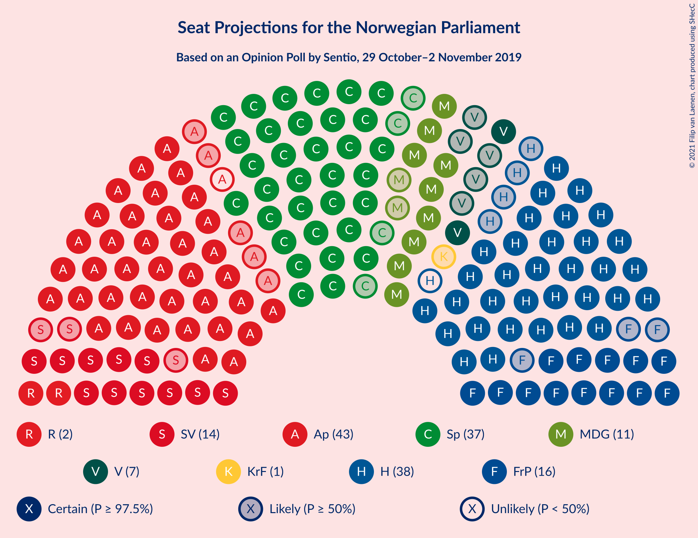
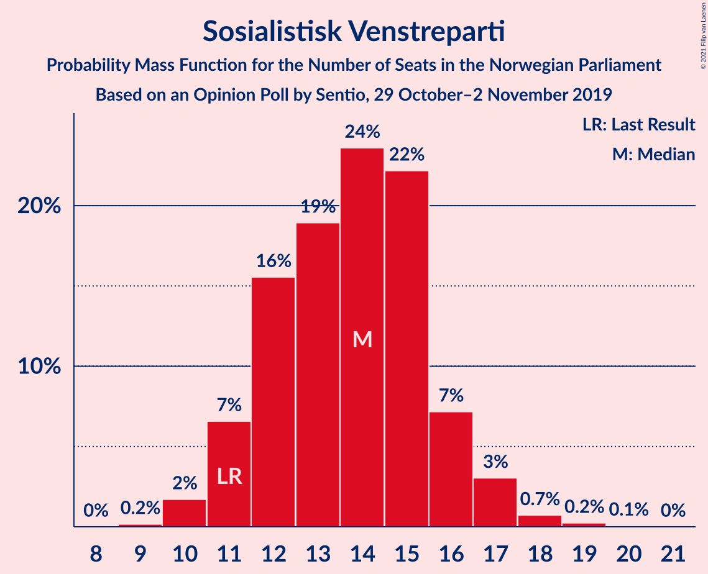
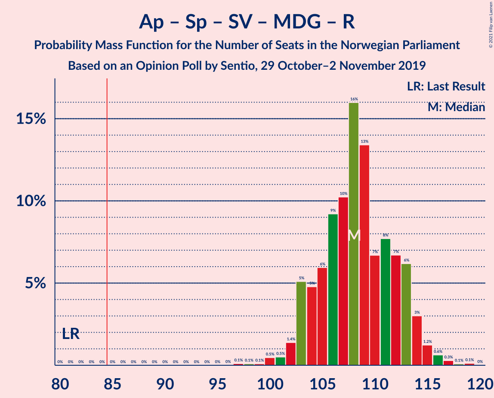
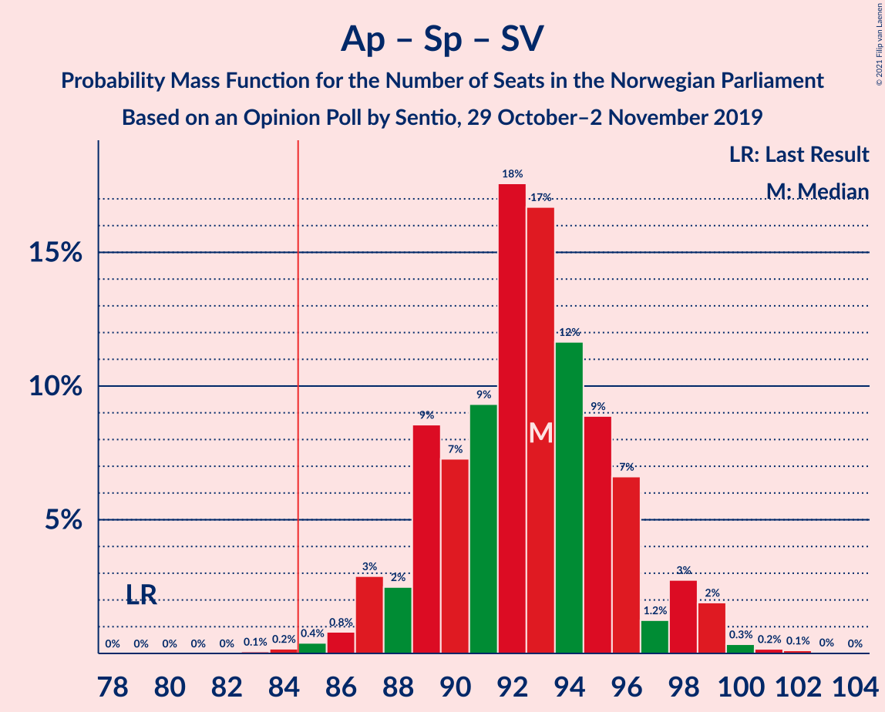

# Opinion Poll by Sentio, 29 October–2 November 2019

<a href="#voting-intentions">Voting Intentions</a> | <a href="#seats">Seats</a> | <a href="#coalitions">Coalitions</a> | <a href="#technical-information">Technical Information</a>

## Voting Intentions

### Confidence Intervals

| Party | Last Result | Poll Result | 80% Confidence Interval | 90% Confidence Interval | 95% Confidence Interval | 99% Confidence Interval |
|:-----:|:-----------:|:-----------:|:-----------------------:|:-----------------------:|:-----------------------:|:-----------------------:|
| Arbeiderpartiet | 27.4% | 22.6% | 21.0–24.4% |20.5–24.9% |20.1–25.3% |19.3–26.2% |
| Høyre | 25.0% | 20.8% | 19.2–22.5% |18.8–23.0% |18.4–23.4% |17.7–24.3% |
| Senterpartiet | 10.3% | 20.0% | 18.4–21.7% |18.0–22.2% |17.6–22.6% |16.9–23.4% |
| Fremskrittspartiet | 15.2% | 9.2% | 8.1–10.5% |7.8–10.8% |7.6–11.2% |7.1–11.8% |
| Sosialistisk Venstreparti | 6.0% | 7.7% | 6.7–8.9% |6.4–9.2% |6.2–9.5% |5.8–10.1% |
| Miljøpartiet De Grønne | 3.2% | 6.3% | 5.4–7.4% |5.2–7.7% |5.0–8.0% |4.6–8.6% |
| Rødt | 2.4% | 3.9% | 3.2–4.8% |3.0–5.1% |2.9–5.3% |2.6–5.8% |
| Venstre | 4.4% | 3.9% | 3.2–4.8% |3.0–5.1% |2.9–5.3% |2.6–5.8% |
| Kristelig Folkeparti | 4.2% | 3.1% | 2.5–3.9% |2.3–4.2% |2.2–4.4% |1.9–4.8% |

*Note:* The poll result column reflects the actual value used in the calculations. Published results may vary slightly, and in addition be rounded to fewer digits.

## Seats

### Confidence Intervals

| Party | Last Result | Median | 80% Confidence Interval | 90% Confidence Interval | 95% Confidence Interval | 99% Confidence Interval |
|:-----:|:-----------:|:------:|:-----------------------:|:-----------------------:|:-----------------------:|:-----------------------:|
| <a href="#arbeiderpartiet">Arbeiderpartiet</a> | 49 | 40 | 39–44 |38–44 |37–45 |36–48 |
| <a href="#høyre">Høyre</a> | 45 | 38 | 35–40 |34–42 |32–42 |32–43 |
| <a href="#senterpartiet">Senterpartiet</a> | 19 | 38 | 35–40 |34–41 |34–42 |31–43 |
| <a href="#fremskrittspartiet">Fremskrittspartiet</a> | 27 | 16 | 14–18 |14–19 |13–21 |12–21 |
| <a href="#sosialistisk-venstreparti">Sosialistisk Venstreparti</a> | 11 | 13 | 12–15 |11–16 |10–17 |10–19 |
| <a href="#miljøpartiet-de-grønne">Miljøpartiet De Grønne</a> | 1 | 10 | 10–13 |9–14 |9–14 |8–15 |
| <a href="#rødt">Rødt</a> | 1 | 7 | 2–9 |2–9 |1–9 |1–9 |
| <a href="#venstre">Venstre</a> | 8 | 7 | 2–8 |2–8 |2–9 |2–10 |
| <a href="#kristelig-folkeparti">Kristelig Folkeparti</a> | 8 | 2 | 1–3 |0–7 |0–8 |0–8 |

### Arbeiderpartiet

*For a full overview of the results for this party, see the [Arbeiderpartiet](party-arbeiderpartiet.html) page.*

| Number of Seats | Probability | Accumulated | Special Marks |
|:---------------:|:-----------:|:-----------:|:-------------:|
| 34 | 0.2% | 100% |  |
| 35 | 0.2% | 99.7% |  |
| 36 | 0.7% | 99.6% |  |
| 37 | 2% | 98.9% |  |
| 38 | 2% | 97% |  |
| 39 | 35% | 95% |  |
| 40 | 20% | 59% | Median |
| 41 | 11% | 40% |  |
| 42 | 6% | 29% |  |
| 43 | 5% | 23% |  |
| 44 | 14% | 18% |  |
| 45 | 2% | 4% |  |
| 46 | 1.2% | 2% |  |
| 47 | 0.6% | 1.3% |  |
| 48 | 0.2% | 0.6% |  |
| 49 | 0.4% | 0.4% | Last Result |
| 50 | 0% | 0% |  |

### Høyre

*For a full overview of the results for this party, see the [Høyre](party-høyre.html) page.*

| Number of Seats | Probability | Accumulated | Special Marks |
|:---------------:|:-----------:|:-----------:|:-------------:|
| 28 | 0.1% | 100% |  |
| 29 | 0% | 99.9% |  |
| 30 | 0.1% | 99.9% |  |
| 31 | 0.2% | 99.8% |  |
| 32 | 2% | 99.6% |  |
| 33 | 1.3% | 97% |  |
| 34 | 5% | 96% |  |
| 35 | 9% | 91% |  |
| 36 | 7% | 82% |  |
| 37 | 7% | 75% |  |
| 38 | 39% | 68% | Median |
| 39 | 18% | 29% |  |
| 40 | 2% | 11% |  |
| 41 | 1.5% | 9% |  |
| 42 | 7% | 8% |  |
| 43 | 0.2% | 0.6% |  |
| 44 | 0.2% | 0.5% |  |
| 45 | 0.2% | 0.2% | Last Result |
| 46 | 0% | 0% |  |

### Senterpartiet

*For a full overview of the results for this party, see the [Senterpartiet](party-senterpartiet.html) page.*

| Number of Seats | Probability | Accumulated | Special Marks |
|:---------------:|:-----------:|:-----------:|:-------------:|
| 19 | 0% | 100% | Last Result |
| 20 | 0% | 100% |  |
| 21 | 0% | 100% |  |
| 22 | 0% | 100% |  |
| 23 | 0% | 100% |  |
| 24 | 0% | 100% |  |
| 25 | 0% | 100% |  |
| 26 | 0% | 100% |  |
| 27 | 0% | 100% |  |
| 28 | 0% | 100% |  |
| 29 | 0% | 100% |  |
| 30 | 0% | 100% |  |
| 31 | 0.5% | 100% |  |
| 32 | 1.1% | 99.4% |  |
| 33 | 0.6% | 98% |  |
| 34 | 4% | 98% |  |
| 35 | 10% | 94% |  |
| 36 | 20% | 85% |  |
| 37 | 13% | 64% |  |
| 38 | 34% | 51% | Median |
| 39 | 6% | 17% |  |
| 40 | 5% | 11% |  |
| 41 | 3% | 6% |  |
| 42 | 2% | 3% |  |
| 43 | 0.5% | 0.9% |  |
| 44 | 0.3% | 0.4% |  |
| 45 | 0% | 0.1% |  |
| 46 | 0% | 0% |  |

### Fremskrittspartiet

*For a full overview of the results for this party, see the [Fremskrittspartiet](party-fremskrittspartiet.html) page.*

| Number of Seats | Probability | Accumulated | Special Marks |
|:---------------:|:-----------:|:-----------:|:-------------:|
| 11 | 0.2% | 100% |  |
| 12 | 0.9% | 99.8% |  |
| 13 | 2% | 98.9% |  |
| 14 | 18% | 97% |  |
| 15 | 25% | 79% |  |
| 16 | 34% | 55% | Median |
| 17 | 8% | 20% |  |
| 18 | 6% | 12% |  |
| 19 | 2% | 7% |  |
| 20 | 2% | 5% |  |
| 21 | 2% | 3% |  |
| 22 | 0.2% | 0.3% |  |
| 23 | 0% | 0.1% |  |
| 24 | 0.1% | 0.1% |  |
| 25 | 0% | 0% |  |
| 26 | 0% | 0% |  |
| 27 | 0% | 0% | Last Result |

### Sosialistisk Venstreparti

*For a full overview of the results for this party, see the [Sosialistisk Venstreparti](party-sosialistiskvenstreparti.html) page.*

| Number of Seats | Probability | Accumulated | Special Marks |
|:---------------:|:-----------:|:-----------:|:-------------:|
| 9 | 0.1% | 100% |  |
| 10 | 4% | 99.8% |  |
| 11 | 3% | 96% | Last Result |
| 12 | 27% | 92% |  |
| 13 | 33% | 65% | Median |
| 14 | 11% | 32% |  |
| 15 | 13% | 21% |  |
| 16 | 5% | 8% |  |
| 17 | 2% | 3% |  |
| 18 | 0.5% | 2% |  |
| 19 | 0.7% | 1.2% |  |
| 20 | 0.4% | 0.5% |  |
| 21 | 0% | 0% |  |

### Miljøpartiet De Grønne

*For a full overview of the results for this party, see the [Miljøpartiet De Grønne](party-miljøpartietdegrønne.html) page.*

| Number of Seats | Probability | Accumulated | Special Marks |
|:---------------:|:-----------:|:-----------:|:-------------:|
| 1 | 0% | 100% | Last Result |
| 2 | 0% | 100% |  |
| 3 | 0% | 100% |  |
| 4 | 0.1% | 100% |  |
| 5 | 0% | 99.9% |  |
| 6 | 0% | 99.9% |  |
| 7 | 0% | 99.9% |  |
| 8 | 2% | 99.9% |  |
| 9 | 7% | 98% |  |
| 10 | 50% | 91% | Median |
| 11 | 11% | 41% |  |
| 12 | 16% | 30% |  |
| 13 | 9% | 14% |  |
| 14 | 4% | 5% |  |
| 15 | 0.8% | 1.1% |  |
| 16 | 0.1% | 0.3% |  |
| 17 | 0.1% | 0.2% |  |
| 18 | 0% | 0% |  |

### Rødt

*For a full overview of the results for this party, see the [Rødt](party-rødt.html) page.*

| Number of Seats | Probability | Accumulated | Special Marks |
|:---------------:|:-----------:|:-----------:|:-------------:|
| 1 | 4% | 100% | Last Result |
| 2 | 28% | 96% |  |
| 3 | 0% | 68% |  |
| 4 | 0% | 68% |  |
| 5 | 0% | 68% |  |
| 6 | 14% | 68% |  |
| 7 | 7% | 54% | Median |
| 8 | 32% | 47% |  |
| 9 | 14% | 14% |  |
| 10 | 0.3% | 0.4% |  |
| 11 | 0% | 0.1% |  |
| 12 | 0% | 0% |  |

### Venstre

*For a full overview of the results for this party, see the [Venstre](party-venstre.html) page.*

| Number of Seats | Probability | Accumulated | Special Marks |
|:---------------:|:-----------:|:-----------:|:-------------:|
| 1 | 0.1% | 100% |  |
| 2 | 36% | 99.9% |  |
| 3 | 2% | 64% |  |
| 4 | 0.1% | 62% |  |
| 5 | 0% | 61% |  |
| 6 | 0.1% | 61% |  |
| 7 | 33% | 61% | Median |
| 8 | 24% | 29% | Last Result |
| 9 | 3% | 4% |  |
| 10 | 1.2% | 1.3% |  |
| 11 | 0.1% | 0.1% |  |
| 12 | 0% | 0% |  |

### Kristelig Folkeparti

*For a full overview of the results for this party, see the [Kristelig Folkeparti](party-kristeligfolkeparti.html) page.*

| Number of Seats | Probability | Accumulated | Special Marks |
|:---------------:|:-----------:|:-----------:|:-------------:|
| 0 | 6% | 100% |  |
| 1 | 41% | 94% |  |
| 2 | 6% | 53% | Median |
| 3 | 38% | 47% |  |
| 4 | 0% | 9% |  |
| 5 | 0% | 9% |  |
| 6 | 1.2% | 9% |  |
| 7 | 5% | 8% |  |
| 8 | 3% | 3% | Last Result |
| 9 | 0.1% | 0.2% |  |
| 10 | 0.1% | 0.1% |  |
| 11 | 0% | 0% |  |

## Coalitions

### Confidence Intervals

| Coalition | Last Result | Median | Majority? | 80% Confidence Interval | 90% Confidence Interval | 95% Confidence Interval | 99% Confidence Interval |
|:---------:|:-----------:|:------:|:---------:|:-----------------------:|:-----------------------:|:-----------------------:|:-----------------------:|
| Arbeiderpartiet – Senterpartiet – Sosialistisk Venstreparti – Miljøpartiet De Grønne – Rødt | 81 | 107 | 100% | 105–112 | 104–113 | 103–114 | 100–116 |
| Arbeiderpartiet – Senterpartiet – Sosialistisk Venstreparti – Miljøpartiet De Grønne – Kristelig Folkeparti | 88 | 104 | 100% | 100–109 | 100–112 | 100–113 | 97–115 |
| Arbeiderpartiet – Senterpartiet – Sosialistisk Venstreparti – Miljøpartiet De Grønne | 80 | 102 | 100% | 99–106 | 99–109 | 99–111 | 96–112 |
| Arbeiderpartiet – Senterpartiet – Sosialistisk Venstreparti – Rødt | 80 | 97 | 100% | 94–101 | 93–102 | 92–103 | 88–104 |
| Høyre – Senterpartiet – Fremskrittspartiet – Venstre – Kristelig Folkeparti | 107 | 100 | 100% | 94–101 | 93–103 | 90–103 | 89–106 |
| Arbeiderpartiet – Senterpartiet – Miljøpartiet De Grønne – Kristelig Folkeparti | 77 | 91 | 99.3% | 88–96 | 88–98 | 87–99 | 84–102 |
| Arbeiderpartiet – Senterpartiet – Sosialistisk Venstreparti | 79 | 90 | 99.6% | 89–95 | 88–96 | 87–98 | 85–100 |
| Arbeiderpartiet – Senterpartiet – Kristelig Folkeparti | 76 | 80 | 11% | 78–85 | 78–86 | 76–87 | 73–90 |
| Arbeiderpartiet – Senterpartiet | 68 | 77 | 1.3% | 76–81 | 75–83 | 74–84 | 71–86 |
| Høyre – Fremskrittspartiet – Miljøpartiet De Grønne – Venstre – Kristelig Folkeparti | 89 | 72 | 0% | 68–74 | 67–76 | 66–77 | 64–81 |
| Høyre – Fremskrittspartiet – Venstre – Kristelig Folkeparti | 88 | 62 | 0% | 57–64 | 56–65 | 55–66 | 53–69 |
| Høyre – Fremskrittspartiet – Venstre | 80 | 61 | 0% | 55–61 | 54–62 | 52–64 | 50–67 |
| Arbeiderpartiet – Sosialistisk Venstreparti | 60 | 53 | 0% | 51–58 | 51–59 | 50–60 | 49–62 |
| Høyre – Fremskrittspartiet | 72 | 53 | 0% | 50–57 | 49–59 | 47–59 | 47–61 |
| Senterpartiet – Venstre – Kristelig Folkeparti | 35 | 46 | 0% | 39–49 | 39–50 | 39–52 | 35–54 |
| Høyre – Venstre – Kristelig Folkeparti | 61 | 46 | 0% | 41–50 | 39–50 | 38–50 | 37–53 |

### Arbeiderpartiet – Senterpartiet – Sosialistisk Venstreparti – Miljøpartiet De Grønne – Rødt

| Number of Seats | Probability | Accumulated | Special Marks |
|:---------------:|:-----------:|:-----------:|:-------------:|
| 81 | 0% | 100% | Last Result |
| 82 | 0% | 100% |  |
| 83 | 0% | 100% |  |
| 84 | 0% | 100% |  |
| 85 | 0% | 100% | Majority |
| 86 | 0% | 100% |  |
| 87 | 0% | 100% |  |
| 88 | 0% | 100% |  |
| 89 | 0% | 100% |  |
| 90 | 0% | 100% |  |
| 91 | 0% | 100% |  |
| 92 | 0% | 100% |  |
| 93 | 0% | 100% |  |
| 94 | 0% | 100% |  |
| 95 | 0% | 100% |  |
| 96 | 0.1% | 100% |  |
| 97 | 0% | 99.9% |  |
| 98 | 0.2% | 99.9% |  |
| 99 | 0.2% | 99.7% |  |
| 100 | 0.1% | 99.5% |  |
| 101 | 0.7% | 99.4% |  |
| 102 | 0.6% | 98.7% |  |
| 103 | 1.5% | 98% |  |
| 104 | 4% | 97% |  |
| 105 | 21% | 92% |  |
| 106 | 1.4% | 72% |  |
| 107 | 28% | 70% |  |
| 108 | 9% | 42% | Median |
| 109 | 5% | 33% |  |
| 110 | 6% | 28% |  |
| 111 | 12% | 22% |  |
| 112 | 2% | 10% |  |
| 113 | 4% | 8% |  |
| 114 | 2% | 4% |  |
| 115 | 0.1% | 2% |  |
| 116 | 2% | 2% |  |
| 117 | 0.2% | 0.3% |  |
| 118 | 0% | 0.1% |  |
| 119 | 0% | 0.1% |  |
| 120 | 0.1% | 0.1% |  |
| 121 | 0% | 0% |  |

### Arbeiderpartiet – Senterpartiet – Sosialistisk Venstreparti – Miljøpartiet De Grønne – Kristelig Folkeparti

| Number of Seats | Probability | Accumulated | Special Marks |
|:---------------:|:-----------:|:-----------:|:-------------:|
| 88 | 0% | 100% | Last Result |
| 89 | 0% | 100% |  |
| 90 | 0% | 100% |  |
| 91 | 0% | 100% |  |
| 92 | 0% | 100% |  |
| 93 | 0% | 100% |  |
| 94 | 0% | 100% |  |
| 95 | 0% | 100% |  |
| 96 | 0.1% | 100% |  |
| 97 | 0.4% | 99.9% |  |
| 98 | 0.1% | 99.4% |  |
| 99 | 0.5% | 99.3% |  |
| 100 | 24% | 98.8% |  |
| 101 | 1.0% | 75% |  |
| 102 | 14% | 74% |  |
| 103 | 4% | 60% | Median |
| 104 | 6% | 55% |  |
| 105 | 13% | 49% |  |
| 106 | 12% | 36% |  |
| 107 | 6% | 24% |  |
| 108 | 6% | 18% |  |
| 109 | 2% | 11% |  |
| 110 | 3% | 9% |  |
| 111 | 2% | 7% |  |
| 112 | 2% | 5% |  |
| 113 | 2% | 3% |  |
| 114 | 0.7% | 1.4% |  |
| 115 | 0.4% | 0.7% |  |
| 116 | 0% | 0.3% |  |
| 117 | 0.2% | 0.2% |  |
| 118 | 0% | 0% |  |

### Arbeiderpartiet – Senterpartiet – Sosialistisk Venstreparti – Miljøpartiet De Grønne

| Number of Seats | Probability | Accumulated | Special Marks |
|:---------------:|:-----------:|:-----------:|:-------------:|
| 80 | 0% | 100% | Last Result |
| 81 | 0% | 100% |  |
| 82 | 0% | 100% |  |
| 83 | 0% | 100% |  |
| 84 | 0% | 100% |  |
| 85 | 0% | 100% | Majority |
| 86 | 0% | 100% |  |
| 87 | 0% | 100% |  |
| 88 | 0% | 100% |  |
| 89 | 0% | 100% |  |
| 90 | 0% | 100% |  |
| 91 | 0% | 100% |  |
| 92 | 0% | 100% |  |
| 93 | 0% | 100% |  |
| 94 | 0.1% | 100% |  |
| 95 | 0.2% | 99.9% |  |
| 96 | 0.9% | 99.7% |  |
| 97 | 0.2% | 98.9% |  |
| 98 | 0.6% | 98.7% |  |
| 99 | 39% | 98% |  |
| 100 | 2% | 59% |  |
| 101 | 4% | 58% | Median |
| 102 | 20% | 54% |  |
| 103 | 8% | 34% |  |
| 104 | 2% | 26% |  |
| 105 | 6% | 23% |  |
| 106 | 9% | 17% |  |
| 107 | 2% | 8% |  |
| 108 | 0.5% | 6% |  |
| 109 | 1.0% | 5% |  |
| 110 | 2% | 5% |  |
| 111 | 2% | 3% |  |
| 112 | 0.7% | 0.8% |  |
| 113 | 0% | 0.1% |  |
| 114 | 0.1% | 0.1% |  |
| 115 | 0% | 0% |  |

### Arbeiderpartiet – Senterpartiet – Sosialistisk Venstreparti – Rødt

| Number of Seats | Probability | Accumulated | Special Marks |
|:---------------:|:-----------:|:-----------:|:-------------:|
| 80 | 0% | 100% | Last Result |
| 81 | 0% | 100% |  |
| 82 | 0% | 100% |  |
| 83 | 0% | 100% |  |
| 84 | 0% | 100% |  |
| 85 | 0.1% | 100% | Majority |
| 86 | 0% | 99.9% |  |
| 87 | 0.3% | 99.9% |  |
| 88 | 0.3% | 99.6% |  |
| 89 | 0.3% | 99.3% |  |
| 90 | 1.0% | 99.0% |  |
| 91 | 0.3% | 98% |  |
| 92 | 2% | 98% |  |
| 93 | 2% | 96% |  |
| 94 | 4% | 93% |  |
| 95 | 25% | 90% |  |
| 96 | 4% | 65% |  |
| 97 | 27% | 61% |  |
| 98 | 4% | 34% | Median |
| 99 | 15% | 30% |  |
| 100 | 4% | 15% |  |
| 101 | 5% | 11% |  |
| 102 | 3% | 6% |  |
| 103 | 2% | 3% |  |
| 104 | 0.5% | 1.0% |  |
| 105 | 0.3% | 0.5% |  |
| 106 | 0.1% | 0.2% |  |
| 107 | 0% | 0% |  |

### Høyre – Senterpartiet – Fremskrittspartiet – Venstre – Kristelig Folkeparti

| Number of Seats | Probability | Accumulated | Special Marks |
|:---------------:|:-----------:|:-----------:|:-------------:|
| 86 | 0.1% | 100% |  |
| 87 | 0.1% | 99.9% |  |
| 88 | 0.1% | 99.8% |  |
| 89 | 2% | 99.8% |  |
| 90 | 0.6% | 98% |  |
| 91 | 0.2% | 97% |  |
| 92 | 1.2% | 97% |  |
| 93 | 2% | 96% |  |
| 94 | 6% | 94% |  |
| 95 | 3% | 88% |  |
| 96 | 13% | 85% |  |
| 97 | 4% | 73% |  |
| 98 | 6% | 68% |  |
| 99 | 9% | 63% |  |
| 100 | 35% | 53% |  |
| 101 | 9% | 18% | Median |
| 102 | 4% | 9% |  |
| 103 | 3% | 5% |  |
| 104 | 0.7% | 2% |  |
| 105 | 0.4% | 0.9% |  |
| 106 | 0.4% | 0.6% |  |
| 107 | 0% | 0.1% | Last Result |
| 108 | 0% | 0.1% |  |
| 109 | 0% | 0.1% |  |
| 110 | 0% | 0% |  |

### Arbeiderpartiet – Senterpartiet – Miljøpartiet De Grønne – Kristelig Folkeparti

| Number of Seats | Probability | Accumulated | Special Marks |
|:---------------:|:-----------:|:-----------:|:-------------:|
| 77 | 0% | 100% | Last Result |
| 78 | 0% | 100% |  |
| 79 | 0% | 100% |  |
| 80 | 0% | 100% |  |
| 81 | 0% | 100% |  |
| 82 | 0.1% | 100% |  |
| 83 | 0.1% | 99.9% |  |
| 84 | 0.5% | 99.8% |  |
| 85 | 1.1% | 99.3% | Majority |
| 86 | 0.3% | 98% |  |
| 87 | 2% | 98% |  |
| 88 | 24% | 96% |  |
| 89 | 15% | 72% |  |
| 90 | 5% | 57% | Median |
| 91 | 7% | 53% |  |
| 92 | 23% | 45% |  |
| 93 | 3% | 22% |  |
| 94 | 4% | 20% |  |
| 95 | 3% | 15% |  |
| 96 | 5% | 12% |  |
| 97 | 1.3% | 7% |  |
| 98 | 2% | 5% |  |
| 99 | 2% | 3% |  |
| 100 | 0.5% | 2% |  |
| 101 | 1.0% | 1.5% |  |
| 102 | 0% | 0.5% |  |
| 103 | 0.5% | 0.5% |  |
| 104 | 0% | 0% |  |

### Arbeiderpartiet – Senterpartiet – Sosialistisk Venstreparti

| Number of Seats | Probability | Accumulated | Special Marks |
|:---------------:|:-----------:|:-----------:|:-------------:|
| 79 | 0% | 100% | Last Result |
| 80 | 0% | 100% |  |
| 81 | 0% | 100% |  |
| 82 | 0% | 100% |  |
| 83 | 0.1% | 100% |  |
| 84 | 0.3% | 99.9% |  |
| 85 | 0.3% | 99.6% | Majority |
| 86 | 2% | 99.4% |  |
| 87 | 1.3% | 98% |  |
| 88 | 2% | 96% |  |
| 89 | 37% | 95% |  |
| 90 | 12% | 58% |  |
| 91 | 6% | 46% | Median |
| 92 | 5% | 39% |  |
| 93 | 17% | 35% |  |
| 94 | 5% | 18% |  |
| 95 | 5% | 13% |  |
| 96 | 4% | 8% |  |
| 97 | 0.5% | 4% |  |
| 98 | 1.0% | 3% |  |
| 99 | 2% | 2% |  |
| 100 | 0.6% | 0.9% |  |
| 101 | 0.2% | 0.3% |  |
| 102 | 0.1% | 0.1% |  |
| 103 | 0% | 0% |  |

### Arbeiderpartiet – Senterpartiet – Kristelig Folkeparti

| Number of Seats | Probability | Accumulated | Special Marks |
|:---------------:|:-----------:|:-----------:|:-------------:|
| 72 | 0.4% | 100% |  |
| 73 | 0.3% | 99.5% |  |
| 74 | 0.3% | 99.2% |  |
| 75 | 1.4% | 98.9% |  |
| 76 | 1.2% | 98% | Last Result |
| 77 | 1.0% | 96% |  |
| 78 | 29% | 95% |  |
| 79 | 15% | 66% |  |
| 80 | 16% | 51% | Median |
| 81 | 8% | 35% |  |
| 82 | 10% | 28% |  |
| 83 | 3% | 17% |  |
| 84 | 4% | 15% |  |
| 85 | 1.2% | 11% | Majority |
| 86 | 5% | 10% |  |
| 87 | 3% | 4% |  |
| 88 | 0.3% | 1.3% |  |
| 89 | 0.2% | 1.1% |  |
| 90 | 0.5% | 0.9% |  |
| 91 | 0.3% | 0.4% |  |
| 92 | 0% | 0% |  |

### Arbeiderpartiet – Senterpartiet

| Number of Seats | Probability | Accumulated | Special Marks |
|:---------------:|:-----------:|:-----------:|:-------------:|
| 68 | 0% | 100% | Last Result |
| 69 | 0% | 100% |  |
| 70 | 0.1% | 100% |  |
| 71 | 0.4% | 99.8% |  |
| 72 | 0.5% | 99.4% |  |
| 73 | 0.5% | 98.9% |  |
| 74 | 3% | 98% |  |
| 75 | 1.2% | 96% |  |
| 76 | 17% | 95% |  |
| 77 | 35% | 78% |  |
| 78 | 10% | 43% | Median |
| 79 | 12% | 33% |  |
| 80 | 10% | 21% |  |
| 81 | 3% | 11% |  |
| 82 | 2% | 9% |  |
| 83 | 4% | 7% |  |
| 84 | 2% | 3% |  |
| 85 | 0.5% | 1.3% | Majority |
| 86 | 0.4% | 0.9% |  |
| 87 | 0.1% | 0.5% |  |
| 88 | 0.3% | 0.4% |  |
| 89 | 0.1% | 0.1% |  |
| 90 | 0% | 0% |  |

### Høyre – Fremskrittspartiet – Miljøpartiet De Grønne – Venstre – Kristelig Folkeparti

| Number of Seats | Probability | Accumulated | Special Marks |
|:---------------:|:-----------:|:-----------:|:-------------:|
| 61 | 0.1% | 100% |  |
| 62 | 0% | 99.9% |  |
| 63 | 0.1% | 99.9% |  |
| 64 | 0.3% | 99.8% |  |
| 65 | 0.6% | 99.5% |  |
| 66 | 2% | 98.9% |  |
| 67 | 3% | 97% |  |
| 68 | 5% | 94% |  |
| 69 | 4% | 89% |  |
| 70 | 15% | 85% |  |
| 71 | 4% | 70% |  |
| 72 | 27% | 66% |  |
| 73 | 4% | 39% | Median |
| 74 | 25% | 35% |  |
| 75 | 4% | 10% |  |
| 76 | 2% | 6% |  |
| 77 | 2% | 4% |  |
| 78 | 0.3% | 2% |  |
| 79 | 1.0% | 2% |  |
| 80 | 0.3% | 0.9% |  |
| 81 | 0.3% | 0.7% |  |
| 82 | 0.3% | 0.4% |  |
| 83 | 0% | 0.1% |  |
| 84 | 0.1% | 0.1% |  |
| 85 | 0% | 0% | Majority |
| 86 | 0% | 0% |  |
| 87 | 0% | 0% |  |
| 88 | 0% | 0% |  |
| 89 | 0% | 0% | Last Result |

### Høyre – Fremskrittspartiet – Venstre – Kristelig Folkeparti

| Number of Seats | Probability | Accumulated | Special Marks |
|:---------------:|:-----------:|:-----------:|:-------------:|
| 49 | 0.1% | 100% |  |
| 50 | 0% | 99.9% |  |
| 51 | 0.1% | 99.9% |  |
| 52 | 0.2% | 99.9% |  |
| 53 | 2% | 99.6% |  |
| 54 | 0.1% | 98% |  |
| 55 | 2% | 98% |  |
| 56 | 4% | 96% |  |
| 57 | 2% | 92% |  |
| 58 | 12% | 89% |  |
| 59 | 6% | 78% |  |
| 60 | 5% | 72% |  |
| 61 | 9% | 67% |  |
| 62 | 28% | 58% |  |
| 63 | 1.4% | 30% | Median |
| 64 | 21% | 28% |  |
| 65 | 4% | 8% |  |
| 66 | 1.5% | 3% |  |
| 67 | 0.6% | 2% |  |
| 68 | 0.7% | 1.2% |  |
| 69 | 0.1% | 0.5% |  |
| 70 | 0.2% | 0.5% |  |
| 71 | 0.2% | 0.3% |  |
| 72 | 0% | 0.1% |  |
| 73 | 0.1% | 0.1% |  |
| 74 | 0% | 0% |  |
| 75 | 0% | 0% |  |
| 76 | 0% | 0% |  |
| 77 | 0% | 0% |  |
| 78 | 0% | 0% |  |
| 79 | 0% | 0% |  |
| 80 | 0% | 0% |  |
| 81 | 0% | 0% |  |
| 82 | 0% | 0% |  |
| 83 | 0% | 0% |  |
| 84 | 0% | 0% |  |
| 85 | 0% | 0% | Majority |
| 86 | 0% | 0% |  |
| 87 | 0% | 0% |  |
| 88 | 0% | 0% | Last Result |

### Høyre – Fremskrittspartiet – Venstre

| Number of Seats | Probability | Accumulated | Special Marks |
|:---------------:|:-----------:|:-----------:|:-------------:|
| 48 | 0.1% | 100% |  |
| 49 | 0.1% | 99.9% |  |
| 50 | 0.3% | 99.8% |  |
| 51 | 0.3% | 99.5% |  |
| 52 | 3% | 99.2% |  |
| 53 | 1.3% | 97% |  |
| 54 | 5% | 95% |  |
| 55 | 13% | 90% |  |
| 56 | 3% | 78% |  |
| 57 | 8% | 75% |  |
| 58 | 5% | 66% |  |
| 59 | 7% | 61% |  |
| 60 | 3% | 55% |  |
| 61 | 46% | 52% | Median |
| 62 | 1.3% | 6% |  |
| 63 | 0.9% | 5% |  |
| 64 | 2% | 4% |  |
| 65 | 1.1% | 2% |  |
| 66 | 0.3% | 1.1% |  |
| 67 | 0.4% | 0.8% |  |
| 68 | 0.2% | 0.4% |  |
| 69 | 0% | 0.2% |  |
| 70 | 0.2% | 0.2% |  |
| 71 | 0% | 0% |  |
| 72 | 0% | 0% |  |
| 73 | 0% | 0% |  |
| 74 | 0% | 0% |  |
| 75 | 0% | 0% |  |
| 76 | 0% | 0% |  |
| 77 | 0% | 0% |  |
| 78 | 0% | 0% |  |
| 79 | 0% | 0% |  |
| 80 | 0% | 0% | Last Result |

### Arbeiderpartiet – Sosialistisk Venstreparti

| Number of Seats | Probability | Accumulated | Special Marks |
|:---------------:|:-----------:|:-----------:|:-------------:|
| 46 | 0.1% | 100% |  |
| 47 | 0.1% | 99.9% |  |
| 48 | 0.2% | 99.8% |  |
| 49 | 2% | 99.6% |  |
| 50 | 2% | 98% |  |
| 51 | 24% | 96% |  |
| 52 | 14% | 72% |  |
| 53 | 13% | 58% | Median |
| 54 | 6% | 44% |  |
| 55 | 5% | 38% |  |
| 56 | 12% | 33% |  |
| 57 | 6% | 21% |  |
| 58 | 10% | 15% |  |
| 59 | 2% | 5% |  |
| 60 | 1.0% | 3% | Last Result |
| 61 | 1.0% | 2% |  |
| 62 | 1.0% | 1.2% |  |
| 63 | 0.1% | 0.2% |  |
| 64 | 0.1% | 0.1% |  |
| 65 | 0% | 0% |  |

### Høyre – Fremskrittspartiet

| Number of Seats | Probability | Accumulated | Special Marks |
|:---------------:|:-----------:|:-----------:|:-------------:|
| 45 | 0.1% | 100% |  |
| 46 | 0.4% | 99.9% |  |
| 47 | 2% | 99.5% |  |
| 48 | 2% | 97% |  |
| 49 | 2% | 96% |  |
| 50 | 6% | 94% |  |
| 51 | 5% | 88% |  |
| 52 | 6% | 82% |  |
| 53 | 29% | 76% |  |
| 54 | 26% | 47% | Median |
| 55 | 7% | 21% |  |
| 56 | 4% | 14% |  |
| 57 | 1.5% | 10% |  |
| 58 | 3% | 9% |  |
| 59 | 5% | 6% |  |
| 60 | 0.5% | 1.2% |  |
| 61 | 0.3% | 0.7% |  |
| 62 | 0% | 0.4% |  |
| 63 | 0.3% | 0.4% |  |
| 64 | 0% | 0% |  |
| 65 | 0% | 0% |  |
| 66 | 0% | 0% |  |
| 67 | 0% | 0% |  |
| 68 | 0% | 0% |  |
| 69 | 0% | 0% |  |
| 70 | 0% | 0% |  |
| 71 | 0% | 0% |  |
| 72 | 0% | 0% | Last Result |

### Senterpartiet – Venstre – Kristelig Folkeparti

| Number of Seats | Probability | Accumulated | Special Marks |
|:---------------:|:-----------:|:-----------:|:-------------:|
| 35 | 0.7% | 100% | Last Result |
| 36 | 0.1% | 99.2% |  |
| 37 | 0.5% | 99.1% |  |
| 38 | 0.4% | 98.6% |  |
| 39 | 9% | 98% |  |
| 40 | 2% | 89% |  |
| 41 | 3% | 87% |  |
| 42 | 4% | 85% |  |
| 43 | 13% | 81% |  |
| 44 | 4% | 68% |  |
| 45 | 4% | 64% |  |
| 46 | 30% | 61% |  |
| 47 | 16% | 31% | Median |
| 48 | 5% | 15% |  |
| 49 | 2% | 10% |  |
| 50 | 5% | 9% |  |
| 51 | 0.6% | 3% |  |
| 52 | 0.5% | 3% |  |
| 53 | 2% | 2% |  |
| 54 | 0.1% | 0.5% |  |
| 55 | 0.3% | 0.4% |  |
| 56 | 0% | 0.1% |  |
| 57 | 0.1% | 0.1% |  |
| 58 | 0% | 0% |  |

### Høyre – Venstre – Kristelig Folkeparti

| Number of Seats | Probability | Accumulated | Special Marks |
|:---------------:|:-----------:|:-----------:|:-------------:|
| 35 | 0.2% | 100% |  |
| 36 | 0.1% | 99.8% |  |
| 37 | 1.3% | 99.6% |  |
| 38 | 2% | 98% |  |
| 39 | 1.0% | 96% |  |
| 40 | 4% | 95% |  |
| 41 | 3% | 91% |  |
| 42 | 2% | 88% |  |
| 43 | 16% | 86% |  |
| 44 | 7% | 70% |  |
| 45 | 6% | 63% |  |
| 46 | 25% | 57% |  |
| 47 | 7% | 32% | Median |
| 48 | 2% | 25% |  |
| 49 | 6% | 22% |  |
| 50 | 14% | 16% |  |
| 51 | 0.9% | 2% |  |
| 52 | 0.5% | 1.2% |  |
| 53 | 0.6% | 0.7% |  |
| 54 | 0% | 0.1% |  |
| 55 | 0% | 0.1% |  |
| 56 | 0% | 0% |  |
| 57 | 0% | 0% |  |
| 58 | 0% | 0% |  |
| 59 | 0% | 0% |  |
| 60 | 0% | 0% |  |
| 61 | 0% | 0% | Last Result |

## Technical Information

### Opinion Poll

+ **Polling firm:** Sentio
+ **Commissioner(s):** —
+ **Fieldwork period:** 29 October–2 November 2019

### Calculations

+ **Sample size:** 1000
+ **Simulations done:** 131,072
+ **Error estimate:** 2.03%

