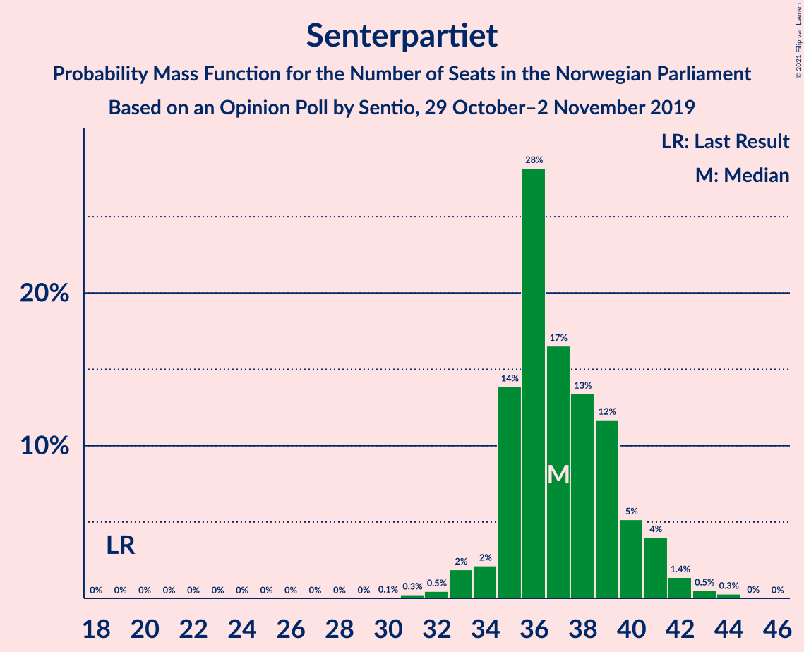
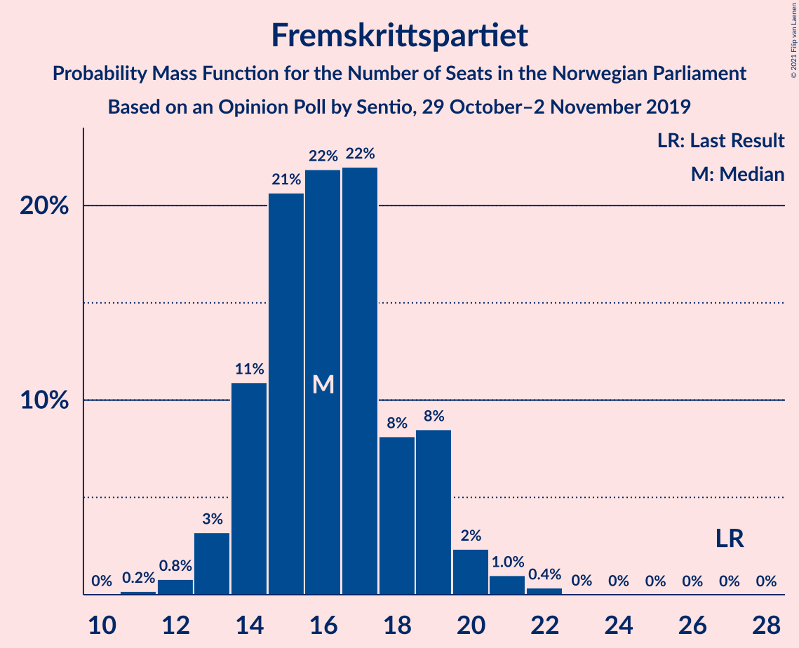
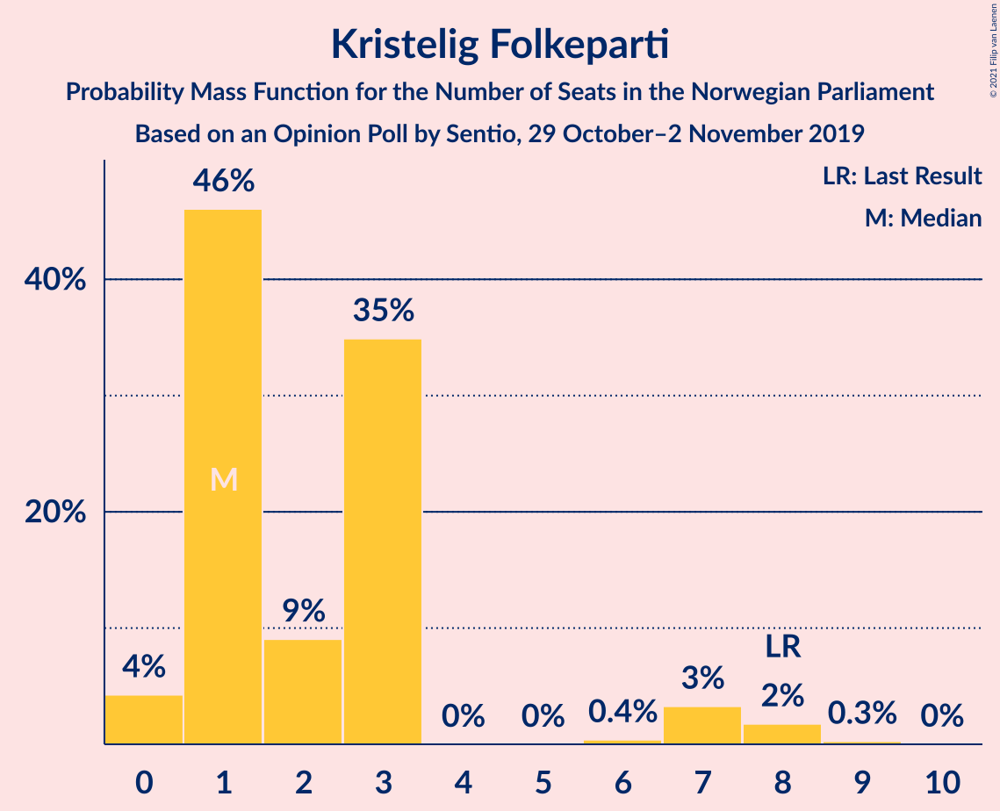

# Opinion Poll by Sentio, 29 October–2 November 2019

<a href="#voting-intentions">Voting Intentions</a> | <a href="#seats">Seats</a> | <a href="#coalitions">Coalitions</a> | <a href="#technical-information">Technical Information</a>

## Voting Intentions

### Confidence Intervals

| Party | Last Result | Poll Result | 80% Confidence Interval | 90% Confidence Interval | 95% Confidence Interval | 99% Confidence Interval |
|:-----:|:-----------:|:-----------:|:-----------------------:|:-----------------------:|:-----------------------:|:-----------------------:|
| Arbeiderpartiet | 27.4% | 22.6% | 21.0–24.4% |20.5–24.9% |20.1–25.3% |19.3–26.2% |
| Høyre | 25.0% | 20.8% | 19.2–22.5% |18.8–23.0% |18.4–23.4% |17.7–24.3% |
| Senterpartiet | 10.3% | 20.0% | 18.4–21.7% |18.0–22.2% |17.6–22.6% |16.9–23.4% |
| Fremskrittspartiet | 15.2% | 9.2% | 8.1–10.5% |7.8–10.8% |7.6–11.2% |7.1–11.8% |
| Sosialistisk Venstreparti | 6.0% | 7.7% | 6.7–8.9% |6.4–9.2% |6.2–9.5% |5.8–10.1% |
| Miljøpartiet De Grønne | 3.2% | 6.3% | 5.4–7.4% |5.2–7.7% |5.0–8.0% |4.6–8.6% |
| Rødt | 2.4% | 3.9% | 3.2–4.8% |3.0–5.1% |2.9–5.3% |2.6–5.8% |
| Venstre | 4.4% | 3.9% | 3.2–4.8% |3.0–5.1% |2.9–5.3% |2.6–5.8% |
| Kristelig Folkeparti | 4.2% | 3.1% | 2.5–3.9% |2.3–4.2% |2.2–4.4% |1.9–4.8% |

*Note:* The poll result column reflects the actual value used in the calculations. Published results may vary slightly, and in addition be rounded to fewer digits.

## Seats

### Confidence Intervals

| Party | Last Result | Median | 80% Confidence Interval | 90% Confidence Interval | 95% Confidence Interval | 99% Confidence Interval |
|:-----:|:-----------:|:------:|:-----------------------:|:-----------------------:|:-----------------------:|:-----------------------:|
| <a href="#arbeiderpartiet">Arbeiderpartiet</a> | 49 | 42 | 39–45 |37–45 |34–45 |34–48 |
| <a href="#høyre">Høyre</a> | 45 | 37 | 34–40 |34–42 |33–44 |31–44 |
| <a href="#senterpartiet">Senterpartiet</a> | 19 | 37 | 35–42 |34–42 |34–42 |32–43 |
| <a href="#fremskrittspartiet">Fremskrittspartiet</a> | 27 | 17 | 14–21 |13–21 |11–22 |11–22 |
| <a href="#sosialistisk-venstreparti">Sosialistisk Venstreparti</a> | 11 | 12 | 10–15 |10–17 |10–18 |9–18 |
| <a href="#miljøpartiet-de-grønne">Miljøpartiet De Grønne</a> | 1 | 12 | 10–14 |10–14 |9–17 |8–17 |
| <a href="#rødt">Rødt</a> | 1 | 2 | 2–9 |2–9 |2–9 |1–9 |
| <a href="#venstre">Venstre</a> | 8 | 2 | 2–10 |2–10 |2–10 |2–10 |
| <a href="#kristelig-folkeparti">Kristelig Folkeparti</a> | 8 | 1 | 1–3 |1–6 |1–7 |0–7 |

### Arbeiderpartiet

*For a full overview of the results for this party, see the [Arbeiderpartiet](party-arbeiderpartiet.html) page.*

| Number of Seats | Probability | Accumulated | Special Marks |
|:---------------:|:-----------:|:-----------:|:-------------:|
| 34 | 3% | 100% |  |
| 35 | 0% | 97% |  |
| 36 | 2% | 97% |  |
| 37 | 3% | 96% |  |
| 38 | 2% | 93% |  |
| 39 | 4% | 90% |  |
| 40 | 11% | 86% |  |
| 41 | 20% | 76% |  |
| 42 | 27% | 56% | Median |
| 43 | 2% | 29% |  |
| 44 | 11% | 27% |  |
| 45 | 14% | 16% |  |
| 46 | 0.2% | 2% |  |
| 47 | 1.0% | 2% |  |
| 48 | 1.0% | 1.0% |  |
| 49 | 0% | 0% | Last Result |

### Høyre

*For a full overview of the results for this party, see the [Høyre](party-høyre.html) page.*

| Number of Seats | Probability | Accumulated | Special Marks |
|:---------------:|:-----------:|:-----------:|:-------------:|
| 29 | 0.1% | 100% |  |
| 30 | 0.2% | 99.9% |  |
| 31 | 0.2% | 99.7% |  |
| 32 | 1.1% | 99.4% |  |
| 33 | 2% | 98% |  |
| 34 | 7% | 97% |  |
| 35 | 30% | 90% |  |
| 36 | 8% | 59% |  |
| 37 | 23% | 52% | Median |
| 38 | 17% | 29% |  |
| 39 | 0.4% | 12% |  |
| 40 | 5% | 12% |  |
| 41 | 0.6% | 7% |  |
| 42 | 3% | 6% |  |
| 43 | 0.3% | 3% |  |
| 44 | 2% | 3% |  |
| 45 | 0.2% | 0.2% | Last Result |
| 46 | 0% | 0% |  |

### Senterpartiet

*For a full overview of the results for this party, see the [Senterpartiet](party-senterpartiet.html) page.*

| Number of Seats | Probability | Accumulated | Special Marks |
|:---------------:|:-----------:|:-----------:|:-------------:|
| 19 | 0% | 100% | Last Result |
| 20 | 0% | 100% |  |
| 21 | 0% | 100% |  |
| 22 | 0% | 100% |  |
| 23 | 0% | 100% |  |
| 24 | 0% | 100% |  |
| 25 | 0% | 100% |  |
| 26 | 0% | 100% |  |
| 27 | 0% | 100% |  |
| 28 | 0.2% | 100% |  |
| 29 | 0% | 99.8% |  |
| 30 | 0% | 99.8% |  |
| 31 | 0.2% | 99.8% |  |
| 32 | 0.1% | 99.6% |  |
| 33 | 0.5% | 99.5% |  |
| 34 | 5% | 99.0% |  |
| 35 | 12% | 94% |  |
| 36 | 11% | 82% |  |
| 37 | 31% | 71% | Median |
| 38 | 0.1% | 39% |  |
| 39 | 3% | 39% |  |
| 40 | 11% | 36% |  |
| 41 | 3% | 25% |  |
| 42 | 22% | 23% |  |
| 43 | 0.4% | 0.7% |  |
| 44 | 0.3% | 0.3% |  |
| 45 | 0% | 0.1% |  |
| 46 | 0% | 0% |  |

### Fremskrittspartiet

*For a full overview of the results for this party, see the [Fremskrittspartiet](party-fremskrittspartiet.html) page.*

| Number of Seats | Probability | Accumulated | Special Marks |
|:---------------:|:-----------:|:-----------:|:-------------:|
| 10 | 0.2% | 100% |  |
| 11 | 3% | 99.8% |  |
| 12 | 0.8% | 97% |  |
| 13 | 1.1% | 96% |  |
| 14 | 12% | 95% |  |
| 15 | 2% | 83% |  |
| 16 | 15% | 80% |  |
| 17 | 22% | 65% | Median |
| 18 | 13% | 44% |  |
| 19 | 3% | 30% |  |
| 20 | 17% | 27% |  |
| 21 | 6% | 10% |  |
| 22 | 4% | 4% |  |
| 23 | 0.2% | 0.2% |  |
| 24 | 0% | 0% |  |
| 25 | 0% | 0% |  |
| 26 | 0% | 0% |  |
| 27 | 0% | 0% | Last Result |

### Sosialistisk Venstreparti

*For a full overview of the results for this party, see the [Sosialistisk Venstreparti](party-sosialistiskvenstreparti.html) page.*

| Number of Seats | Probability | Accumulated | Special Marks |
|:---------------:|:-----------:|:-----------:|:-------------:|
| 8 | 0.1% | 100% |  |
| 9 | 0.5% | 99.9% |  |
| 10 | 23% | 99.4% |  |
| 11 | 4% | 76% | Last Result |
| 12 | 26% | 72% | Median |
| 13 | 7% | 46% |  |
| 14 | 21% | 39% |  |
| 15 | 11% | 18% |  |
| 16 | 1.0% | 6% |  |
| 17 | 2% | 5% |  |
| 18 | 3% | 3% |  |
| 19 | 0% | 0.2% |  |
| 20 | 0.2% | 0.2% |  |
| 21 | 0% | 0% |  |

### Miljøpartiet De Grønne

*For a full overview of the results for this party, see the [Miljøpartiet De Grønne](party-miljøpartietdegrønne.html) page.*

| Number of Seats | Probability | Accumulated | Special Marks |
|:---------------:|:-----------:|:-----------:|:-------------:|
| 1 | 0% | 100% | Last Result |
| 2 | 0.1% | 100% |  |
| 3 | 0% | 99.9% |  |
| 4 | 0% | 99.9% |  |
| 5 | 0% | 99.9% |  |
| 6 | 0% | 99.9% |  |
| 7 | 0% | 99.9% |  |
| 8 | 1.5% | 99.9% |  |
| 9 | 2% | 98% |  |
| 10 | 16% | 96% |  |
| 11 | 28% | 81% |  |
| 12 | 10% | 53% | Median |
| 13 | 18% | 43% |  |
| 14 | 20% | 25% |  |
| 15 | 1.3% | 4% |  |
| 16 | 0.2% | 3% |  |
| 17 | 3% | 3% |  |
| 18 | 0% | 0% |  |

### Rødt

*For a full overview of the results for this party, see the [Rødt](party-rødt.html) page.*

| Number of Seats | Probability | Accumulated | Special Marks |
|:---------------:|:-----------:|:-----------:|:-------------:|
| 1 | 0.6% | 100% | Last Result |
| 2 | 75% | 99.4% | Median |
| 3 | 0% | 24% |  |
| 4 | 0% | 24% |  |
| 5 | 0% | 24% |  |
| 6 | 3% | 24% |  |
| 7 | 1.0% | 21% |  |
| 8 | 3% | 20% |  |
| 9 | 17% | 17% |  |
| 10 | 0.2% | 0.2% |  |
| 11 | 0% | 0% |  |

### Venstre

*For a full overview of the results for this party, see the [Venstre](party-venstre.html) page.*

| Number of Seats | Probability | Accumulated | Special Marks |
|:---------------:|:-----------:|:-----------:|:-------------:|
| 1 | 0.3% | 100% |  |
| 2 | 51% | 99.7% | Median |
| 3 | 0.8% | 48% |  |
| 4 | 0% | 48% |  |
| 5 | 0% | 48% |  |
| 6 | 1.0% | 48% |  |
| 7 | 15% | 47% |  |
| 8 | 18% | 32% | Last Result |
| 9 | 3% | 14% |  |
| 10 | 11% | 11% |  |
| 11 | 0.1% | 0.1% |  |
| 12 | 0% | 0% |  |

### Kristelig Folkeparti

*For a full overview of the results for this party, see the [Kristelig Folkeparti](party-kristeligfolkeparti.html) page.*

| Number of Seats | Probability | Accumulated | Special Marks |
|:---------------:|:-----------:|:-----------:|:-------------:|
| 0 | 1.2% | 100% |  |
| 1 | 57% | 98.8% | Median |
| 2 | 6% | 42% |  |
| 3 | 28% | 35% |  |
| 4 | 0% | 8% |  |
| 5 | 0% | 8% |  |
| 6 | 3% | 8% |  |
| 7 | 4% | 5% |  |
| 8 | 0.3% | 0.4% | Last Result |
| 9 | 0.1% | 0.1% |  |
| 10 | 0% | 0% |  |

## Coalitions

### Confidence Intervals

| Coalition | Last Result | Median | Majority? | 80% Confidence Interval | 90% Confidence Interval | 95% Confidence Interval | 99% Confidence Interval |
|:---------:|:-----------:|:------:|:---------:|:-----------------------:|:-----------------------:|:-----------------------:|:-----------------------:|
| Arbeiderpartiet – Senterpartiet – Sosialistisk Venstreparti – Miljøpartiet De Grønne – Rødt | 81 | 108 | 100% | 103–112 | 103–114 | 98–114 | 98–116 |
| Arbeiderpartiet – Senterpartiet – Sosialistisk Venstreparti – Miljøpartiet De Grønne – Kristelig Folkeparti | 88 | 106 | 100% | 101–113 | 100–113 | 97–113 | 97–115 |
| Arbeiderpartiet – Senterpartiet – Sosialistisk Venstreparti – Miljøpartiet De Grønne | 80 | 104 | 100% | 100–110 | 97–110 | 96–110 | 96–114 |
| Høyre – Senterpartiet – Fremskrittspartiet – Venstre – Kristelig Folkeparti | 107 | 99 | 100% | 95–103 | 92–104 | 92–106 | 91–106 |
| Arbeiderpartiet – Senterpartiet – Sosialistisk Venstreparti – Rødt | 80 | 97 | 100% | 90–101 | 90–102 | 87–102 | 87–102 |
| Arbeiderpartiet – Senterpartiet – Miljøpartiet De Grønne – Kristelig Folkeparti | 77 | 92 | 97% | 90–101 | 87–101 | 84–101 | 84–103 |
| Arbeiderpartiet – Senterpartiet – Sosialistisk Venstreparti | 79 | 93 | 99.8% | 88–96 | 86–99 | 85–99 | 85–99 |
| Arbeiderpartiet – Senterpartiet – Kristelig Folkeparti | 76 | 81 | 30% | 79–87 | 76–87 | 73–87 | 73–88 |
| Arbeiderpartiet – Senterpartiet | 68 | 79 | 7% | 76–84 | 73–85 | 72–85 | 72–87 |
| Høyre – Fremskrittspartiet – Miljøpartiet De Grønne – Venstre – Kristelig Folkeparti | 89 | 72 | 0% | 68–79 | 67–79 | 67–82 | 66–82 |
| Arbeiderpartiet – Sosialistisk Venstreparti – Miljøpartiet De Grønne – Rødt | 62 | 70 | 0% | 66–74 | 65–77 | 63–77 | 63–78 |
| Høyre – Fremskrittspartiet – Venstre – Kristelig Folkeparti | 88 | 61 | 0% | 57–66 | 55–66 | 55–71 | 53–71 |
| Høyre – Fremskrittspartiet – Venstre | 80 | 59 | 0% | 54–65 | 54–65 | 54–70 | 52–70 |
| Høyre – Fremskrittspartiet | 72 | 52 | 0% | 51–59 | 49–61 | 49–63 | 47–63 |
| Arbeiderpartiet – Sosialistisk Venstreparti | 60 | 54 | 0% | 51–59 | 50–60 | 48–62 | 46–62 |
| Høyre – Venstre – Kristelig Folkeparti | 61 | 44 | 0% | 38–50 | 37–51 | 37–53 | 35–53 |
| Senterpartiet – Venstre – Kristelig Folkeparti | 35 | 46 | 0% | 40–49 | 39–50 | 38–51 | 38–53 |

### Arbeiderpartiet – Senterpartiet – Sosialistisk Venstreparti – Miljøpartiet De Grønne – Rødt

| Number of Seats | Probability | Accumulated | Special Marks |
|:---------------:|:-----------:|:-----------:|:-------------:|
| 81 | 0% | 100% | Last Result |
| 82 | 0% | 100% |  |
| 83 | 0% | 100% |  |
| 84 | 0% | 100% |  |
| 85 | 0% | 100% | Majority |
| 86 | 0% | 100% |  |
| 87 | 0% | 100% |  |
| 88 | 0% | 100% |  |
| 89 | 0% | 100% |  |
| 90 | 0% | 100% |  |
| 91 | 0% | 100% |  |
| 92 | 0% | 100% |  |
| 93 | 0% | 100% |  |
| 94 | 0% | 100% |  |
| 95 | 0% | 100% |  |
| 96 | 0% | 100% |  |
| 97 | 0% | 100% |  |
| 98 | 3% | 100% |  |
| 99 | 0.5% | 97% |  |
| 100 | 0.2% | 96% |  |
| 101 | 0.1% | 96% |  |
| 102 | 0.1% | 96% |  |
| 103 | 17% | 96% |  |
| 104 | 5% | 78% |  |
| 105 | 5% | 73% | Median |
| 106 | 8% | 69% |  |
| 107 | 5% | 61% |  |
| 108 | 9% | 57% |  |
| 109 | 7% | 48% |  |
| 110 | 3% | 40% |  |
| 111 | 0.5% | 37% |  |
| 112 | 28% | 37% |  |
| 113 | 0.1% | 8% |  |
| 114 | 7% | 8% |  |
| 115 | 0.2% | 1.4% |  |
| 116 | 1.1% | 1.2% |  |
| 117 | 0% | 0% |  |

### Arbeiderpartiet – Senterpartiet – Sosialistisk Venstreparti – Miljøpartiet De Grønne – Kristelig Folkeparti

| Number of Seats | Probability | Accumulated | Special Marks |
|:---------------:|:-----------:|:-----------:|:-------------:|
| 88 | 0% | 100% | Last Result |
| 89 | 0% | 100% |  |
| 90 | 0% | 100% |  |
| 91 | 0% | 100% |  |
| 92 | 0% | 100% |  |
| 93 | 0% | 100% |  |
| 94 | 0% | 100% |  |
| 95 | 0.1% | 100% |  |
| 96 | 0.2% | 99.9% |  |
| 97 | 3% | 99.8% |  |
| 98 | 0.9% | 97% |  |
| 99 | 0.2% | 96% |  |
| 100 | 1.1% | 96% |  |
| 101 | 7% | 95% |  |
| 102 | 18% | 87% |  |
| 103 | 1.2% | 69% |  |
| 104 | 2% | 68% | Median |
| 105 | 14% | 66% |  |
| 106 | 11% | 52% |  |
| 107 | 2% | 40% |  |
| 108 | 5% | 38% |  |
| 109 | 0.3% | 33% |  |
| 110 | 0.7% | 33% |  |
| 111 | 8% | 32% |  |
| 112 | 0.1% | 24% |  |
| 113 | 22% | 23% |  |
| 114 | 0.3% | 1.4% |  |
| 115 | 1.0% | 1.1% |  |
| 116 | 0.1% | 0.1% |  |
| 117 | 0% | 0% |  |

### Arbeiderpartiet – Senterpartiet – Sosialistisk Venstreparti – Miljøpartiet De Grønne

| Number of Seats | Probability | Accumulated | Special Marks |
|:---------------:|:-----------:|:-----------:|:-------------:|
| 80 | 0% | 100% | Last Result |
| 81 | 0% | 100% |  |
| 82 | 0% | 100% |  |
| 83 | 0% | 100% |  |
| 84 | 0% | 100% |  |
| 85 | 0% | 100% | Majority |
| 86 | 0% | 100% |  |
| 87 | 0% | 100% |  |
| 88 | 0% | 100% |  |
| 89 | 0% | 100% |  |
| 90 | 0% | 100% |  |
| 91 | 0% | 100% |  |
| 92 | 0% | 100% |  |
| 93 | 0.1% | 100% |  |
| 94 | 0% | 99.9% |  |
| 95 | 0% | 99.9% |  |
| 96 | 3% | 99.9% |  |
| 97 | 2% | 97% |  |
| 98 | 0.4% | 94% |  |
| 99 | 3% | 94% |  |
| 100 | 8% | 91% |  |
| 101 | 20% | 83% |  |
| 102 | 5% | 63% |  |
| 103 | 1.2% | 57% | Median |
| 104 | 7% | 56% |  |
| 105 | 11% | 49% |  |
| 106 | 8% | 38% |  |
| 107 | 0.8% | 31% |  |
| 108 | 0.3% | 30% |  |
| 109 | 0.1% | 30% |  |
| 110 | 28% | 29% |  |
| 111 | 0% | 1.3% |  |
| 112 | 0.1% | 1.3% |  |
| 113 | 0.2% | 1.2% |  |
| 114 | 1.0% | 1.0% |  |
| 115 | 0% | 0% |  |

### Høyre – Senterpartiet – Fremskrittspartiet – Venstre – Kristelig Folkeparti

| Number of Seats | Probability | Accumulated | Special Marks |
|:---------------:|:-----------:|:-----------:|:-------------:|
| 86 | 0.1% | 100% |  |
| 87 | 0% | 99.9% |  |
| 88 | 0% | 99.9% |  |
| 89 | 0.1% | 99.8% |  |
| 90 | 0% | 99.8% |  |
| 91 | 0.4% | 99.7% |  |
| 92 | 8% | 99.3% |  |
| 93 | 1.0% | 92% |  |
| 94 | 0.5% | 91% | Median |
| 95 | 4% | 90% |  |
| 96 | 11% | 86% |  |
| 97 | 13% | 75% |  |
| 98 | 0.9% | 62% |  |
| 99 | 20% | 61% |  |
| 100 | 5% | 41% |  |
| 101 | 3% | 36% |  |
| 102 | 7% | 33% |  |
| 103 | 20% | 26% |  |
| 104 | 2% | 6% |  |
| 105 | 0.1% | 4% |  |
| 106 | 3% | 4% |  |
| 107 | 0% | 0.3% | Last Result |
| 108 | 0.2% | 0.3% |  |
| 109 | 0% | 0% |  |

### Arbeiderpartiet – Senterpartiet – Sosialistisk Venstreparti – Rødt

| Number of Seats | Probability | Accumulated | Special Marks |
|:---------------:|:-----------:|:-----------:|:-------------:|
| 80 | 0% | 100% | Last Result |
| 81 | 0% | 100% |  |
| 82 | 0% | 100% |  |
| 83 | 0% | 100% |  |
| 84 | 0% | 100% |  |
| 85 | 0% | 100% | Majority |
| 86 | 0.1% | 100% |  |
| 87 | 3% | 99.9% |  |
| 88 | 0.4% | 97% |  |
| 89 | 0.2% | 97% |  |
| 90 | 16% | 96% |  |
| 91 | 0.4% | 80% |  |
| 92 | 0.4% | 80% |  |
| 93 | 0.6% | 79% | Median |
| 94 | 12% | 78% |  |
| 95 | 8% | 66% |  |
| 96 | 5% | 58% |  |
| 97 | 5% | 53% |  |
| 98 | 24% | 48% |  |
| 99 | 9% | 24% |  |
| 100 | 1.2% | 15% |  |
| 101 | 7% | 14% |  |
| 102 | 7% | 7% |  |
| 103 | 0.1% | 0.5% |  |
| 104 | 0.1% | 0.4% |  |
| 105 | 0% | 0.3% |  |
| 106 | 0.2% | 0.3% |  |
| 107 | 0% | 0% |  |

### Arbeiderpartiet – Senterpartiet – Miljøpartiet De Grønne – Kristelig Folkeparti

| Number of Seats | Probability | Accumulated | Special Marks |
|:---------------:|:-----------:|:-----------:|:-------------:|
| 77 | 0% | 100% | Last Result |
| 78 | 0% | 100% |  |
| 79 | 0% | 100% |  |
| 80 | 0% | 100% |  |
| 81 | 0% | 100% |  |
| 82 | 0% | 100% |  |
| 83 | 0.3% | 100% |  |
| 84 | 3% | 99.7% |  |
| 85 | 0.2% | 97% | Majority |
| 86 | 0.9% | 96% |  |
| 87 | 1.1% | 95% |  |
| 88 | 3% | 94% |  |
| 89 | 1.1% | 91% |  |
| 90 | 5% | 90% |  |
| 91 | 7% | 85% |  |
| 92 | 32% | 78% | Median |
| 93 | 8% | 45% |  |
| 94 | 4% | 37% |  |
| 95 | 3% | 33% |  |
| 96 | 0.4% | 30% |  |
| 97 | 9% | 30% |  |
| 98 | 0.6% | 21% |  |
| 99 | 0.3% | 21% |  |
| 100 | 0.1% | 20% |  |
| 101 | 19% | 20% |  |
| 102 | 0% | 1.0% |  |
| 103 | 1.0% | 1.0% |  |
| 104 | 0% | 0% |  |

### Arbeiderpartiet – Senterpartiet – Sosialistisk Venstreparti

| Number of Seats | Probability | Accumulated | Special Marks |
|:---------------:|:-----------:|:-----------:|:-------------:|
| 79 | 0% | 100% | Last Result |
| 80 | 0% | 100% |  |
| 81 | 0% | 100% |  |
| 82 | 0% | 100% |  |
| 83 | 0% | 100% |  |
| 84 | 0.1% | 99.9% |  |
| 85 | 4% | 99.8% | Majority |
| 86 | 1.5% | 96% |  |
| 87 | 0.3% | 94% |  |
| 88 | 19% | 94% |  |
| 89 | 2% | 75% |  |
| 90 | 9% | 73% |  |
| 91 | 1.3% | 64% | Median |
| 92 | 9% | 63% |  |
| 93 | 15% | 54% |  |
| 94 | 5% | 39% |  |
| 95 | 5% | 35% |  |
| 96 | 23% | 30% |  |
| 97 | 0.1% | 7% |  |
| 98 | 0.1% | 7% |  |
| 99 | 6% | 7% |  |
| 100 | 0.1% | 0.4% |  |
| 101 | 0% | 0.3% |  |
| 102 | 0% | 0.3% |  |
| 103 | 0% | 0.2% |  |
| 104 | 0.2% | 0.2% |  |
| 105 | 0% | 0% |  |

### Arbeiderpartiet – Senterpartiet – Kristelig Folkeparti

| Number of Seats | Probability | Accumulated | Special Marks |
|:---------------:|:-----------:|:-----------:|:-------------:|
| 72 | 0.1% | 100% |  |
| 73 | 3% | 99.9% |  |
| 74 | 0.9% | 97% |  |
| 75 | 0.2% | 96% |  |
| 76 | 3% | 96% | Last Result |
| 77 | 2% | 93% |  |
| 78 | 0.4% | 91% |  |
| 79 | 18% | 90% |  |
| 80 | 16% | 72% | Median |
| 81 | 14% | 57% |  |
| 82 | 8% | 43% |  |
| 83 | 4% | 35% |  |
| 84 | 1.1% | 31% |  |
| 85 | 3% | 30% | Majority |
| 86 | 6% | 27% |  |
| 87 | 19% | 21% |  |
| 88 | 1.0% | 2% |  |
| 89 | 0.1% | 0.5% |  |
| 90 | 0.3% | 0.3% |  |
| 91 | 0% | 0% |  |

### Arbeiderpartiet – Senterpartiet

| Number of Seats | Probability | Accumulated | Special Marks |
|:---------------:|:-----------:|:-----------:|:-------------:|
| 68 | 0% | 100% | Last Result |
| 69 | 0.1% | 100% |  |
| 70 | 0.2% | 99.9% |  |
| 71 | 0.1% | 99.7% |  |
| 72 | 3% | 99.6% |  |
| 73 | 2% | 97% |  |
| 74 | 0.2% | 95% |  |
| 75 | 2% | 95% |  |
| 76 | 6% | 92% |  |
| 77 | 7% | 87% |  |
| 78 | 21% | 80% |  |
| 79 | 10% | 59% | Median |
| 80 | 18% | 49% |  |
| 81 | 2% | 31% |  |
| 82 | 3% | 30% |  |
| 83 | 0.6% | 27% |  |
| 84 | 20% | 26% |  |
| 85 | 5% | 7% | Majority |
| 86 | 0% | 1.3% |  |
| 87 | 1.0% | 1.2% |  |
| 88 | 0% | 0.3% |  |
| 89 | 0.2% | 0.3% |  |
| 90 | 0% | 0% |  |

### Høyre – Fremskrittspartiet – Miljøpartiet De Grønne – Venstre – Kristelig Folkeparti

| Number of Seats | Probability | Accumulated | Special Marks |
|:---------------:|:-----------:|:-----------:|:-------------:|
| 62 | 0% | 100% |  |
| 63 | 0.3% | 99.9% |  |
| 64 | 0% | 99.7% |  |
| 65 | 0.1% | 99.6% |  |
| 66 | 0.1% | 99.6% |  |
| 67 | 7% | 99.5% |  |
| 68 | 7% | 92% |  |
| 69 | 1.2% | 86% | Median |
| 70 | 9% | 84% |  |
| 71 | 24% | 76% |  |
| 72 | 5% | 52% |  |
| 73 | 5% | 47% |  |
| 74 | 8% | 42% |  |
| 75 | 12% | 34% |  |
| 76 | 0.5% | 21% |  |
| 77 | 0.4% | 21% |  |
| 78 | 0.4% | 20% |  |
| 79 | 16% | 20% |  |
| 80 | 0.2% | 4% |  |
| 81 | 0.4% | 3% |  |
| 82 | 3% | 3% |  |
| 83 | 0.1% | 0.1% |  |
| 84 | 0% | 0% |  |
| 85 | 0% | 0% | Majority |
| 86 | 0% | 0% |  |
| 87 | 0% | 0% |  |
| 88 | 0% | 0% |  |
| 89 | 0% | 0% | Last Result |

### Arbeiderpartiet – Sosialistisk Venstreparti – Miljøpartiet De Grønne – Rødt

| Number of Seats | Probability | Accumulated | Special Marks |
|:---------------:|:-----------:|:-----------:|:-------------:|
| 61 | 0.2% | 100% |  |
| 62 | 0.1% | 99.7% | Last Result |
| 63 | 3% | 99.6% |  |
| 64 | 0.1% | 96% |  |
| 65 | 2% | 96% |  |
| 66 | 20% | 94% |  |
| 67 | 7% | 74% |  |
| 68 | 3% | 67% | Median |
| 69 | 5% | 64% |  |
| 70 | 20% | 59% |  |
| 71 | 0.9% | 39% |  |
| 72 | 13% | 38% |  |
| 73 | 11% | 25% |  |
| 74 | 4% | 13% |  |
| 75 | 0.5% | 10% |  |
| 76 | 1.0% | 9% |  |
| 77 | 8% | 8% |  |
| 78 | 0.4% | 0.6% |  |
| 79 | 0% | 0.3% |  |
| 80 | 0.1% | 0.2% |  |
| 81 | 0% | 0.1% |  |
| 82 | 0% | 0.1% |  |
| 83 | 0.1% | 0.1% |  |
| 84 | 0% | 0% |  |

### Høyre – Fremskrittspartiet – Venstre – Kristelig Folkeparti

| Number of Seats | Probability | Accumulated | Special Marks |
|:---------------:|:-----------:|:-----------:|:-------------:|
| 52 | 0% | 100% |  |
| 53 | 1.1% | 99.9% |  |
| 54 | 0.3% | 98.8% |  |
| 55 | 7% | 98.5% |  |
| 56 | 0.1% | 92% |  |
| 57 | 29% | 91% | Median |
| 58 | 0.6% | 63% |  |
| 59 | 3% | 62% |  |
| 60 | 7% | 59% |  |
| 61 | 9% | 52% |  |
| 62 | 5% | 43% |  |
| 63 | 8% | 39% |  |
| 64 | 4% | 31% |  |
| 65 | 5% | 27% |  |
| 66 | 17% | 21% |  |
| 67 | 0.1% | 4% |  |
| 68 | 0.1% | 4% |  |
| 69 | 0.2% | 4% |  |
| 70 | 0.5% | 4% |  |
| 71 | 3% | 3% |  |
| 72 | 0% | 0% |  |
| 73 | 0% | 0% |  |
| 74 | 0% | 0% |  |
| 75 | 0% | 0% |  |
| 76 | 0% | 0% |  |
| 77 | 0% | 0% |  |
| 78 | 0% | 0% |  |
| 79 | 0% | 0% |  |
| 80 | 0% | 0% |  |
| 81 | 0% | 0% |  |
| 82 | 0% | 0% |  |
| 83 | 0% | 0% |  |
| 84 | 0% | 0% |  |
| 85 | 0% | 0% | Majority |
| 86 | 0% | 0% |  |
| 87 | 0% | 0% |  |
| 88 | 0% | 0% | Last Result |

### Høyre – Fremskrittspartiet – Venstre

| Number of Seats | Probability | Accumulated | Special Marks |
|:---------------:|:-----------:|:-----------:|:-------------:|
| 48 | 0% | 100% |  |
| 49 | 0% | 99.9% |  |
| 50 | 0.2% | 99.9% |  |
| 51 | 0.1% | 99.7% |  |
| 52 | 1.1% | 99.7% |  |
| 53 | 0.4% | 98.6% |  |
| 54 | 30% | 98% |  |
| 55 | 0.3% | 68% |  |
| 56 | 10% | 68% | Median |
| 57 | 0.9% | 58% |  |
| 58 | 5% | 57% |  |
| 59 | 12% | 52% |  |
| 60 | 1.2% | 40% |  |
| 61 | 5% | 39% |  |
| 62 | 12% | 34% |  |
| 63 | 1.3% | 22% |  |
| 64 | 0.9% | 21% |  |
| 65 | 16% | 20% |  |
| 66 | 0.1% | 4% |  |
| 67 | 0.4% | 4% |  |
| 68 | 0.1% | 3% |  |
| 69 | 0% | 3% |  |
| 70 | 3% | 3% |  |
| 71 | 0.1% | 0.1% |  |
| 72 | 0% | 0% |  |
| 73 | 0% | 0% |  |
| 74 | 0% | 0% |  |
| 75 | 0% | 0% |  |
| 76 | 0% | 0% |  |
| 77 | 0% | 0% |  |
| 78 | 0% | 0% |  |
| 79 | 0% | 0% |  |
| 80 | 0% | 0% | Last Result |

### Høyre – Fremskrittspartiet

| Number of Seats | Probability | Accumulated | Special Marks |
|:---------------:|:-----------:|:-----------:|:-------------:|
| 44 | 0.1% | 100% |  |
| 45 | 0% | 99.9% |  |
| 46 | 0.2% | 99.9% |  |
| 47 | 0.5% | 99.7% |  |
| 48 | 2% | 99.2% |  |
| 49 | 5% | 98% |  |
| 50 | 1.2% | 93% |  |
| 51 | 4% | 92% |  |
| 52 | 42% | 88% |  |
| 53 | 3% | 46% |  |
| 54 | 10% | 43% | Median |
| 55 | 2% | 33% |  |
| 56 | 2% | 32% |  |
| 57 | 17% | 30% |  |
| 58 | 0.3% | 13% |  |
| 59 | 5% | 13% |  |
| 60 | 2% | 8% |  |
| 61 | 2% | 5% |  |
| 62 | 0% | 3% |  |
| 63 | 3% | 3% |  |
| 64 | 0% | 0% |  |
| 65 | 0% | 0% |  |
| 66 | 0% | 0% |  |
| 67 | 0% | 0% |  |
| 68 | 0% | 0% |  |
| 69 | 0% | 0% |  |
| 70 | 0% | 0% |  |
| 71 | 0% | 0% |  |
| 72 | 0% | 0% | Last Result |

### Arbeiderpartiet – Sosialistisk Venstreparti

| Number of Seats | Probability | Accumulated | Special Marks |
|:---------------:|:-----------:|:-----------:|:-------------:|
| 46 | 0.8% | 100% |  |
| 47 | 0% | 99.2% |  |
| 48 | 2% | 99.1% |  |
| 49 | 1.1% | 97% |  |
| 50 | 3% | 96% |  |
| 51 | 17% | 93% |  |
| 52 | 7% | 75% |  |
| 53 | 5% | 69% |  |
| 54 | 27% | 63% | Median |
| 55 | 7% | 36% |  |
| 56 | 8% | 29% |  |
| 57 | 0.5% | 21% |  |
| 58 | 1.2% | 21% |  |
| 59 | 10% | 19% |  |
| 60 | 6% | 9% | Last Result |
| 61 | 0.2% | 3% |  |
| 62 | 3% | 3% |  |
| 63 | 0% | 0% |  |

### Høyre – Venstre – Kristelig Folkeparti

| Number of Seats | Probability | Accumulated | Special Marks |
|:---------------:|:-----------:|:-----------:|:-------------:|
| 35 | 1.0% | 100% |  |
| 36 | 0% | 99.0% |  |
| 37 | 7% | 99.0% |  |
| 38 | 4% | 92% |  |
| 39 | 0.5% | 88% |  |
| 40 | 24% | 88% | Median |
| 41 | 8% | 64% |  |
| 42 | 0.5% | 56% |  |
| 43 | 2% | 56% |  |
| 44 | 7% | 53% |  |
| 45 | 4% | 46% |  |
| 46 | 17% | 42% |  |
| 47 | 10% | 25% |  |
| 48 | 3% | 15% |  |
| 49 | 0.2% | 12% |  |
| 50 | 3% | 12% |  |
| 51 | 5% | 9% |  |
| 52 | 0.3% | 4% |  |
| 53 | 3% | 4% |  |
| 54 | 0.3% | 0.4% |  |
| 55 | 0.1% | 0.1% |  |
| 56 | 0% | 0% |  |
| 57 | 0% | 0% |  |
| 58 | 0% | 0% |  |
| 59 | 0% | 0% |  |
| 60 | 0% | 0% |  |
| 61 | 0% | 0% | Last Result |

### Senterpartiet – Venstre – Kristelig Folkeparti

| Number of Seats | Probability | Accumulated | Special Marks |
|:---------------:|:-----------:|:-----------:|:-------------:|
| 35 | 0.1% | 100% | Last Result |
| 36 | 0.1% | 99.9% |  |
| 37 | 0% | 99.8% |  |
| 38 | 4% | 99.8% |  |
| 39 | 2% | 96% |  |
| 40 | 7% | 93% | Median |
| 41 | 0.4% | 86% |  |
| 42 | 3% | 86% |  |
| 43 | 17% | 83% |  |
| 44 | 7% | 67% |  |
| 45 | 3% | 59% |  |
| 46 | 16% | 56% |  |
| 47 | 25% | 40% |  |
| 48 | 2% | 15% |  |
| 49 | 4% | 13% |  |
| 50 | 6% | 9% |  |
| 51 | 2% | 3% |  |
| 52 | 0.4% | 0.9% |  |
| 53 | 0.4% | 0.5% |  |
| 54 | 0% | 0.1% |  |
| 55 | 0% | 0.1% |  |
| 56 | 0% | 0% |  |

## Technical Information

### Opinion Poll

+ **Polling firm:** Sentio
+ **Commissioner(s):** —
+ **Fieldwork period:** 29 October–2 November 2019

### Calculations

+ **Sample size:** 1000
+ **Simulations done:** 16,384
+ **Error estimate:** 3.02%

