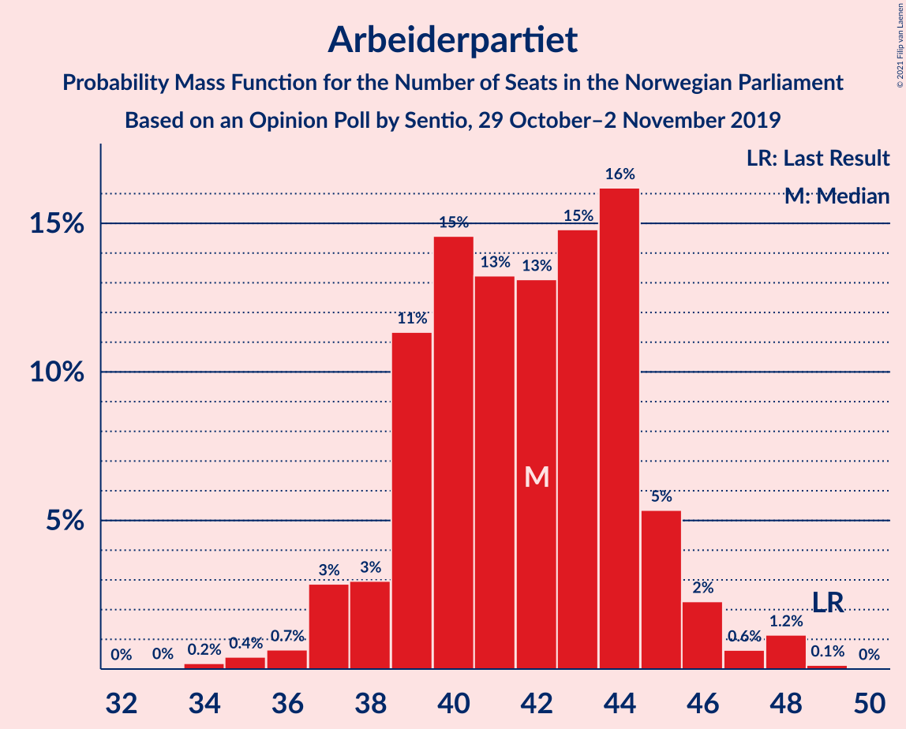
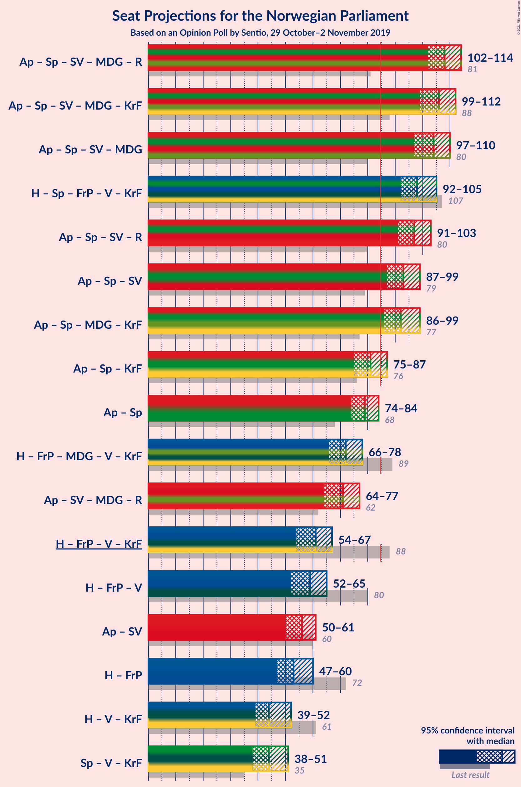
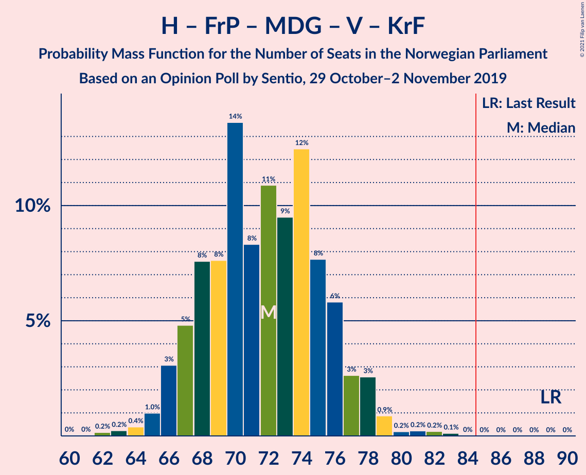
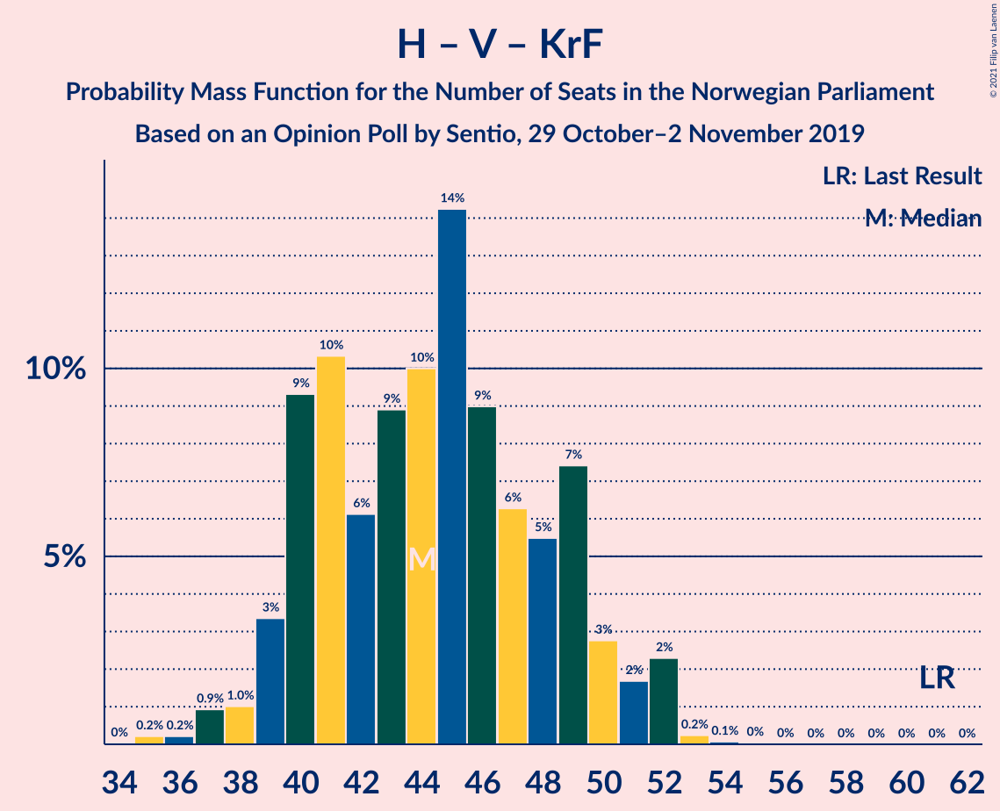

# Opinion Poll by Sentio, 29 October–2 November 2019

<a href="#voting-intentions">Voting Intentions</a> | <a href="#seats">Seats</a> | <a href="#coalitions">Coalitions</a> | <a href="#technical-information">Technical Information</a>

## Voting Intentions

### Confidence Intervals

| Party | Last Result | Poll Result | 80% Confidence Interval | 90% Confidence Interval | 95% Confidence Interval | 99% Confidence Interval |
|:-----:|:-----------:|:-----------:|:-----------------------:|:-----------------------:|:-----------------------:|:-----------------------:|
| Arbeiderpartiet | 27.4% | 22.6% | 21.0–24.4% |20.5–24.9% |20.1–25.3% |19.3–26.2% |
| Høyre | 25.0% | 20.8% | 19.2–22.5% |18.8–23.0% |18.4–23.4% |17.7–24.3% |
| Senterpartiet | 10.3% | 20.0% | 18.4–21.7% |18.0–22.2% |17.6–22.6% |16.9–23.4% |
| Fremskrittspartiet | 15.2% | 9.2% | 8.1–10.5% |7.8–10.8% |7.6–11.2% |7.1–11.8% |
| Sosialistisk Venstreparti | 6.0% | 7.7% | 6.7–8.9% |6.4–9.2% |6.2–9.5% |5.8–10.1% |
| Miljøpartiet De Grønne | 3.2% | 6.3% | 5.4–7.4% |5.2–7.7% |5.0–8.0% |4.6–8.6% |
| Rødt | 2.4% | 3.9% | 3.2–4.8% |3.0–5.1% |2.9–5.3% |2.6–5.8% |
| Venstre | 4.4% | 3.9% | 3.2–4.8% |3.0–5.1% |2.9–5.3% |2.6–5.8% |
| Kristelig Folkeparti | 4.2% | 3.1% | 2.5–3.9% |2.3–4.2% |2.2–4.4% |1.9–4.8% |

*Note:* The poll result column reflects the actual value used in the calculations. Published results may vary slightly, and in addition be rounded to fewer digits.

## Seats

### Confidence Intervals

| Party | Last Result | Median | 80% Confidence Interval | 90% Confidence Interval | 95% Confidence Interval | 99% Confidence Interval |
|:-----:|:-----------:|:------:|:-----------------------:|:-----------------------:|:-----------------------:|:-----------------------:|
| <a href="#arbeiderpartiet">Arbeiderpartiet</a> | 49 | 43 | 38–43 |34–47 |34–47 |34–47 |
| <a href="#høyre">Høyre</a> | 45 | 35 | 34–41 |34–41 |34–41 |34–43 |
| <a href="#senterpartiet">Senterpartiet</a> | 19 | 38 | 36–43 |35–43 |35–43 |35–43 |
| <a href="#fremskrittspartiet">Fremskrittspartiet</a> | 27 | 17 | 16–21 |16–21 |16–21 |14–21 |
| <a href="#sosialistisk-venstreparti">Sosialistisk Venstreparti</a> | 11 | 10 | 10–13 |10–13 |10–13 |9–13 |
| <a href="#miljøpartiet-de-grønne">Miljøpartiet De Grønne</a> | 1 | 10 | 10–11 |9–11 |9–12 |9–14 |
| <a href="#rødt">Rødt</a> | 1 | 9 | 1–9 |1–9 |1–9 |1–9 |
| <a href="#venstre">Venstre</a> | 8 | 7 | 7–9 |2–9 |2–9 |2–9 |
| <a href="#kristelig-folkeparti">Kristelig Folkeparti</a> | 8 | 1 | 1–2 |1–2 |1–3 |0–7 |

### Arbeiderpartiet

*For a full overview of the results for this party, see the [Arbeiderpartiet](party-arbeiderpartiet.html) page.*

| Number of Seats | Probability | Accumulated | Special Marks |
|:---------------:|:-----------:|:-----------:|:-------------:|
| 33 | 0.1% | 100% |  |
| 34 | 6% | 99.9% |  |
| 35 | 0% | 94% |  |
| 36 | 0% | 94% |  |
| 37 | 0% | 94% |  |
| 38 | 21% | 94% |  |
| 39 | 2% | 73% |  |
| 40 | 17% | 71% |  |
| 41 | 0% | 54% |  |
| 42 | 0.1% | 54% |  |
| 43 | 48% | 54% | Median |
| 44 | 0.1% | 6% |  |
| 45 | 0% | 5% |  |
| 46 | 0% | 5% |  |
| 47 | 5% | 5% |  |
| 48 | 0% | 0% |  |
| 49 | 0% | 0% | Last Result |

### Høyre

*For a full overview of the results for this party, see the [Høyre](party-høyre.html) page.*

| Number of Seats | Probability | Accumulated | Special Marks |
|:---------------:|:-----------:|:-----------:|:-------------:|
| 33 | 0% | 100% |  |
| 34 | 16% | 99.9% |  |
| 35 | 46% | 84% | Median |
| 36 | 3% | 37% |  |
| 37 | 0% | 34% |  |
| 38 | 0% | 34% |  |
| 39 | 6% | 34% |  |
| 40 | 6% | 28% |  |
| 41 | 21% | 23% |  |
| 42 | 0% | 2% |  |
| 43 | 2% | 2% |  |
| 44 | 0% | 0% |  |
| 45 | 0% | 0% | Last Result |

### Senterpartiet

*For a full overview of the results for this party, see the [Senterpartiet](party-senterpartiet.html) page.*

| Number of Seats | Probability | Accumulated | Special Marks |
|:---------------:|:-----------:|:-----------:|:-------------:|
| 19 | 0% | 100% | Last Result |
| 20 | 0% | 100% |  |
| 21 | 0% | 100% |  |
| 22 | 0% | 100% |  |
| 23 | 0% | 100% |  |
| 24 | 0% | 100% |  |
| 25 | 0% | 100% |  |
| 26 | 0% | 100% |  |
| 27 | 0% | 100% |  |
| 28 | 0% | 100% |  |
| 29 | 0% | 100% |  |
| 30 | 0% | 100% |  |
| 31 | 0% | 100% |  |
| 32 | 0% | 100% |  |
| 33 | 0% | 100% |  |
| 34 | 0% | 100% |  |
| 35 | 5% | 100% |  |
| 36 | 21% | 95% |  |
| 37 | 2% | 74% |  |
| 38 | 47% | 72% | Median |
| 39 | 6% | 25% |  |
| 40 | 0.1% | 19% |  |
| 41 | 2% | 19% |  |
| 42 | 0% | 17% |  |
| 43 | 17% | 17% |  |
| 44 | 0.2% | 0.2% |  |
| 45 | 0% | 0% |  |

### Fremskrittspartiet

*For a full overview of the results for this party, see the [Fremskrittspartiet](party-fremskrittspartiet.html) page.*

| Number of Seats | Probability | Accumulated | Special Marks |
|:---------------:|:-----------:|:-----------:|:-------------:|
| 12 | 0% | 100% |  |
| 13 | 0% | 99.9% |  |
| 14 | 0.9% | 99.9% |  |
| 15 | 0.4% | 99.1% |  |
| 16 | 48% | 98.7% |  |
| 17 | 6% | 50% | Median |
| 18 | 18% | 45% |  |
| 19 | 0% | 26% |  |
| 20 | 0% | 26% |  |
| 21 | 26% | 26% |  |
| 22 | 0% | 0% |  |
| 23 | 0% | 0% |  |
| 24 | 0% | 0% |  |
| 25 | 0% | 0% |  |
| 26 | 0% | 0% |  |
| 27 | 0% | 0% | Last Result |

### Sosialistisk Venstreparti

*For a full overview of the results for this party, see the [Sosialistisk Venstreparti](party-sosialistiskvenstreparti.html) page.*

| Number of Seats | Probability | Accumulated | Special Marks |
|:---------------:|:-----------:|:-----------:|:-------------:|
| 9 | 2% | 100% |  |
| 10 | 48% | 98% | Median |
| 11 | 22% | 49% | Last Result |
| 12 | 6% | 27% |  |
| 13 | 21% | 21% |  |
| 14 | 0.1% | 0.1% |  |
| 15 | 0% | 0% |  |

### Miljøpartiet De Grønne

*For a full overview of the results for this party, see the [Miljøpartiet De Grønne](party-miljøpartietdegrønne.html) page.*

| Number of Seats | Probability | Accumulated | Special Marks |
|:---------------:|:-----------:|:-----------:|:-------------:|
| 1 | 0% | 100% | Last Result |
| 2 | 0% | 100% |  |
| 3 | 0% | 100% |  |
| 4 | 0% | 100% |  |
| 5 | 0% | 100% |  |
| 6 | 0% | 100% |  |
| 7 | 0% | 100% |  |
| 8 | 0.5% | 100% |  |
| 9 | 6% | 99.5% |  |
| 10 | 46% | 94% | Median |
| 11 | 44% | 48% |  |
| 12 | 2% | 3% |  |
| 13 | 0.1% | 0.9% |  |
| 14 | 0.8% | 0.8% |  |
| 15 | 0% | 0% |  |

### Rødt

*For a full overview of the results for this party, see the [Rødt](party-rødt.html) page.*

| Number of Seats | Probability | Accumulated | Special Marks |
|:---------------:|:-----------:|:-----------:|:-------------:|
| 1 | 21% | 100% | Last Result |
| 2 | 27% | 79% |  |
| 3 | 0% | 53% |  |
| 4 | 0% | 53% |  |
| 5 | 0% | 53% |  |
| 6 | 0% | 53% |  |
| 7 | 0.5% | 53% |  |
| 8 | 0.5% | 52% |  |
| 9 | 52% | 52% | Median |
| 10 | 0.1% | 0.1% |  |
| 11 | 0% | 0% |  |

### Venstre

*For a full overview of the results for this party, see the [Venstre](party-venstre.html) page.*

| Number of Seats | Probability | Accumulated | Special Marks |
|:---------------:|:-----------:|:-----------:|:-------------:|
| 2 | 8% | 100% |  |
| 3 | 0% | 92% |  |
| 4 | 0% | 92% |  |
| 5 | 0% | 92% |  |
| 6 | 0% | 92% |  |
| 7 | 74% | 92% | Median |
| 8 | 1.5% | 18% | Last Result |
| 9 | 16% | 16% |  |
| 10 | 0% | 0% |  |

### Kristelig Folkeparti

*For a full overview of the results for this party, see the [Kristelig Folkeparti](party-kristeligfolkeparti.html) page.*

| Number of Seats | Probability | Accumulated | Special Marks |
|:---------------:|:-----------:|:-----------:|:-------------:|
| 0 | 0.9% | 100% |  |
| 1 | 89% | 99.1% | Median |
| 2 | 6% | 10% |  |
| 3 | 2% | 4% |  |
| 4 | 0% | 2% |  |
| 5 | 0% | 2% |  |
| 6 | 0% | 2% |  |
| 7 | 2% | 2% |  |
| 8 | 0.1% | 0.1% | Last Result |
| 9 | 0% | 0% |  |

## Coalitions

### Confidence Intervals

| Coalition | Last Result | Median | Majority? | 80% Confidence Interval | 90% Confidence Interval | 95% Confidence Interval | 99% Confidence Interval |
|:---------:|:-----------:|:------:|:---------:|:-----------------------:|:-----------------------:|:-----------------------:|:-----------------------:|
| Arbeiderpartiet – Senterpartiet – Sosialistisk Venstreparti – Miljøpartiet De Grønne – Rødt | 81 | 107 | 100% | 99–110 | 99–110 | 99–110 | 99–111 |
| Arbeiderpartiet – Senterpartiet – Sosialistisk Venstreparti – Miljøpartiet De Grønne – Kristelig Folkeparti | 88 | 102 | 100% | 99–106 | 97–106 | 97–108 | 97–109 |
| Høyre – Senterpartiet – Fremskrittspartiet – Venstre – Kristelig Folkeparti | 107 | 100 | 100% | 97–106 | 97–106 | 97–106 | 97–107 |
| Arbeiderpartiet – Senterpartiet – Sosialistisk Venstreparti – Miljøpartiet De Grønne | 80 | 101 | 100% | 98–105 | 96–105 | 96–105 | 95–109 |
| Arbeiderpartiet – Senterpartiet – Sosialistisk Venstreparti – Rødt | 80 | 96 | 100% | 88–100 | 88–100 | 88–100 | 88–100 |
| Arbeiderpartiet – Senterpartiet – Miljøpartiet De Grønne – Kristelig Folkeparti | 77 | 92 | 100% | 86–95 | 85–95 | 85–97 | 85–99 |
| Arbeiderpartiet – Senterpartiet – Sosialistisk Venstreparti | 79 | 91 | 100% | 87–94 | 85–94 | 85–94 | 85–95 |
| Arbeiderpartiet – Senterpartiet – Kristelig Folkeparti | 76 | 82 | 2% | 75–84 | 74–84 | 74–84 | 74–87 |
| Arbeiderpartiet – Senterpartiet | 68 | 81 | 0.1% | 74–83 | 73–83 | 73–83 | 73–84 |
| Høyre – Fremskrittspartiet – Miljøpartiet De Grønne – Venstre – Kristelig Folkeparti | 89 | 73 | 0% | 69–81 | 69–81 | 69–81 | 69–81 |
| Høyre – Fremskrittspartiet – Venstre – Kristelig Folkeparti | 88 | 62 | 0% | 59–70 | 59–70 | 59–70 | 58–70 |
| Høyre – Fremskrittspartiet – Venstre | 80 | 61 | 0% | 58–69 | 58–69 | 58–69 | 58–69 |
| Høyre – Fremskrittspartiet | 72 | 52 | 0% | 51–62 | 51–62 | 51–62 | 50–62 |
| Arbeiderpartiet – Sosialistisk Venstreparti | 60 | 53 | 0% | 51–53 | 46–58 | 46–58 | 46–58 |
| Senterpartiet – Venstre – Kristelig Folkeparti | 35 | 46 | 0% | 44–53 | 39–53 | 39–53 | 39–53 |
| Høyre – Venstre – Kristelig Folkeparti | 61 | 44 | 0% | 43–49 | 43–49 | 43–49 | 43–52 |

### Arbeiderpartiet – Senterpartiet – Sosialistisk Venstreparti – Miljøpartiet De Grønne – Rødt

| Number of Seats | Probability | Accumulated | Special Marks |
|:---------------:|:-----------:|:-----------:|:-------------:|
| 81 | 0% | 100% | Last Result |
| 82 | 0% | 100% |  |
| 83 | 0% | 100% |  |
| 84 | 0% | 100% |  |
| 85 | 0% | 100% | Majority |
| 86 | 0% | 100% |  |
| 87 | 0% | 100% |  |
| 88 | 0% | 100% |  |
| 89 | 0% | 100% |  |
| 90 | 0% | 100% |  |
| 91 | 0% | 100% |  |
| 92 | 0% | 100% |  |
| 93 | 0% | 100% |  |
| 94 | 0% | 100% |  |
| 95 | 0% | 100% |  |
| 96 | 0% | 100% |  |
| 97 | 0% | 100% |  |
| 98 | 0% | 100% |  |
| 99 | 22% | 100% |  |
| 100 | 0% | 78% |  |
| 101 | 0% | 78% |  |
| 102 | 0.5% | 78% |  |
| 103 | 0.2% | 77% |  |
| 104 | 5% | 77% |  |
| 105 | 6% | 71% |  |
| 106 | 0% | 66% |  |
| 107 | 19% | 66% |  |
| 108 | 0.4% | 47% |  |
| 109 | 0% | 47% |  |
| 110 | 46% | 47% | Median |
| 111 | 0.7% | 0.8% |  |
| 112 | 0% | 0.1% |  |
| 113 | 0% | 0.1% |  |
| 114 | 0% | 0% |  |

### Arbeiderpartiet – Senterpartiet – Sosialistisk Venstreparti – Miljøpartiet De Grønne – Kristelig Folkeparti

| Number of Seats | Probability | Accumulated | Special Marks |
|:---------------:|:-----------:|:-----------:|:-------------:|
| 88 | 0% | 100% | Last Result |
| 89 | 0% | 100% |  |
| 90 | 0% | 100% |  |
| 91 | 0% | 100% |  |
| 92 | 0% | 100% |  |
| 93 | 0% | 100% |  |
| 94 | 0% | 100% |  |
| 95 | 0% | 100% |  |
| 96 | 0% | 100% |  |
| 97 | 6% | 100% |  |
| 98 | 0% | 94% |  |
| 99 | 21% | 94% |  |
| 100 | 0% | 73% |  |
| 101 | 0.4% | 73% |  |
| 102 | 46% | 73% | Median |
| 103 | 0% | 27% |  |
| 104 | 7% | 27% |  |
| 105 | 0.1% | 19% |  |
| 106 | 16% | 19% |  |
| 107 | 0% | 3% |  |
| 108 | 2% | 3% |  |
| 109 | 0.7% | 0.9% |  |
| 110 | 0% | 0.1% |  |
| 111 | 0% | 0.1% |  |
| 112 | 0.1% | 0.1% |  |
| 113 | 0% | 0% |  |

### Høyre – Senterpartiet – Fremskrittspartiet – Venstre – Kristelig Folkeparti

| Number of Seats | Probability | Accumulated | Special Marks |
|:---------------:|:-----------:|:-----------:|:-------------:|
| 92 | 0.3% | 100% |  |
| 93 | 0% | 99.7% |  |
| 94 | 0% | 99.7% |  |
| 95 | 0% | 99.7% |  |
| 96 | 0% | 99.7% |  |
| 97 | 46% | 99.7% |  |
| 98 | 0.1% | 54% | Median |
| 99 | 0.3% | 54% |  |
| 100 | 6% | 53% |  |
| 101 | 0.8% | 48% |  |
| 102 | 0% | 47% |  |
| 103 | 8% | 47% |  |
| 104 | 0% | 39% |  |
| 105 | 17% | 39% |  |
| 106 | 20% | 23% |  |
| 107 | 2% | 2% | Last Result |
| 108 | 0% | 0.1% |  |
| 109 | 0% | 0.1% |  |
| 110 | 0.1% | 0.1% |  |
| 111 | 0% | 0% |  |

### Arbeiderpartiet – Senterpartiet – Sosialistisk Venstreparti – Miljøpartiet De Grønne

| Number of Seats | Probability | Accumulated | Special Marks |
|:---------------:|:-----------:|:-----------:|:-------------:|
| 80 | 0% | 100% | Last Result |
| 81 | 0% | 100% |  |
| 82 | 0% | 100% |  |
| 83 | 0% | 100% |  |
| 84 | 0% | 100% |  |
| 85 | 0% | 100% | Majority |
| 86 | 0% | 100% |  |
| 87 | 0% | 100% |  |
| 88 | 0% | 100% |  |
| 89 | 0% | 100% |  |
| 90 | 0% | 100% |  |
| 91 | 0% | 100% |  |
| 92 | 0% | 100% |  |
| 93 | 0% | 100% |  |
| 94 | 0% | 100% |  |
| 95 | 0.5% | 100% |  |
| 96 | 6% | 99.5% |  |
| 97 | 2% | 94% |  |
| 98 | 21% | 92% |  |
| 99 | 0.1% | 71% |  |
| 100 | 0.3% | 71% |  |
| 101 | 46% | 71% | Median |
| 102 | 5% | 25% |  |
| 103 | 0% | 19% |  |
| 104 | 0% | 19% |  |
| 105 | 19% | 19% |  |
| 106 | 0% | 0.9% |  |
| 107 | 0% | 0.9% |  |
| 108 | 0% | 0.8% |  |
| 109 | 0.8% | 0.8% |  |
| 110 | 0% | 0% |  |

### Arbeiderpartiet – Senterpartiet – Sosialistisk Venstreparti – Rødt

| Number of Seats | Probability | Accumulated | Special Marks |
|:---------------:|:-----------:|:-----------:|:-------------:|
| 80 | 0% | 100% | Last Result |
| 81 | 0% | 100% |  |
| 82 | 0% | 100% |  |
| 83 | 0% | 100% |  |
| 84 | 0% | 100% |  |
| 85 | 0% | 100% | Majority |
| 86 | 0% | 100% |  |
| 87 | 0% | 100% |  |
| 88 | 22% | 100% |  |
| 89 | 0% | 78% |  |
| 90 | 0.1% | 78% |  |
| 91 | 0% | 77% |  |
| 92 | 0% | 77% |  |
| 93 | 0.1% | 77% |  |
| 94 | 6% | 77% |  |
| 95 | 7% | 71% |  |
| 96 | 17% | 64% |  |
| 97 | 0.7% | 47% |  |
| 98 | 0.1% | 46% |  |
| 99 | 0.3% | 46% |  |
| 100 | 46% | 46% | Median |
| 101 | 0% | 0.1% |  |
| 102 | 0% | 0.1% |  |
| 103 | 0% | 0% |  |

### Arbeiderpartiet – Senterpartiet – Miljøpartiet De Grønne – Kristelig Folkeparti

| Number of Seats | Probability | Accumulated | Special Marks |
|:---------------:|:-----------:|:-----------:|:-------------:|
| 77 | 0% | 100% | Last Result |
| 78 | 0% | 100% |  |
| 79 | 0% | 100% |  |
| 80 | 0% | 100% |  |
| 81 | 0% | 100% |  |
| 82 | 0% | 100% |  |
| 83 | 0% | 100% |  |
| 84 | 0% | 100% |  |
| 85 | 6% | 100% | Majority |
| 86 | 21% | 94% |  |
| 87 | 0.1% | 73% |  |
| 88 | 0% | 73% |  |
| 89 | 0% | 73% |  |
| 90 | 0% | 73% |  |
| 91 | 0.2% | 73% |  |
| 92 | 46% | 73% | Median |
| 93 | 6% | 27% |  |
| 94 | 2% | 21% |  |
| 95 | 16% | 19% |  |
| 96 | 0.1% | 3% |  |
| 97 | 0.7% | 3% |  |
| 98 | 0% | 2% |  |
| 99 | 2% | 2% |  |
| 100 | 0% | 0.1% |  |
| 101 | 0% | 0.1% |  |
| 102 | 0.1% | 0.1% |  |
| 103 | 0% | 0% |  |

### Arbeiderpartiet – Senterpartiet – Sosialistisk Venstreparti

| Number of Seats | Probability | Accumulated | Special Marks |
|:---------------:|:-----------:|:-----------:|:-------------:|
| 79 | 0% | 100% | Last Result |
| 80 | 0% | 100% |  |
| 81 | 0% | 100% |  |
| 82 | 0% | 100% |  |
| 83 | 0% | 100% |  |
| 84 | 0% | 100% |  |
| 85 | 6% | 100% | Majority |
| 86 | 2% | 94% |  |
| 87 | 21% | 92% |  |
| 88 | 0.1% | 71% |  |
| 89 | 0% | 71% |  |
| 90 | 0.1% | 71% |  |
| 91 | 46% | 71% | Median |
| 92 | 0% | 25% |  |
| 93 | 8% | 25% |  |
| 94 | 16% | 17% |  |
| 95 | 0.9% | 0.9% |  |
| 96 | 0% | 0% |  |

### Arbeiderpartiet – Senterpartiet – Kristelig Folkeparti

| Number of Seats | Probability | Accumulated | Special Marks |
|:---------------:|:-----------:|:-----------:|:-------------:|
| 74 | 6% | 100% |  |
| 75 | 20% | 94% |  |
| 76 | 0% | 74% | Last Result |
| 77 | 0% | 74% |  |
| 78 | 0.6% | 74% |  |
| 79 | 0.1% | 73% |  |
| 80 | 0.2% | 73% |  |
| 81 | 0% | 73% |  |
| 82 | 46% | 73% | Median |
| 83 | 3% | 27% |  |
| 84 | 22% | 24% |  |
| 85 | 0.1% | 2% | Majority |
| 86 | 0% | 2% |  |
| 87 | 2% | 2% |  |
| 88 | 0.1% | 0.1% |  |
| 89 | 0% | 0% |  |

### Arbeiderpartiet – Senterpartiet

| Number of Seats | Probability | Accumulated | Special Marks |
|:---------------:|:-----------:|:-----------:|:-------------:|
| 68 | 0% | 100% | Last Result |
| 69 | 0% | 100% |  |
| 70 | 0% | 100% |  |
| 71 | 0% | 100% |  |
| 72 | 0% | 100% |  |
| 73 | 6% | 100% |  |
| 74 | 20% | 94% |  |
| 75 | 0% | 74% |  |
| 76 | 3% | 74% |  |
| 77 | 0.1% | 71% |  |
| 78 | 0.1% | 71% |  |
| 79 | 0% | 71% |  |
| 80 | 0.1% | 71% |  |
| 81 | 46% | 71% | Median |
| 82 | 6% | 25% |  |
| 83 | 17% | 19% |  |
| 84 | 2% | 2% |  |
| 85 | 0.1% | 0.1% | Majority |
| 86 | 0% | 0% |  |

### Høyre – Fremskrittspartiet – Miljøpartiet De Grønne – Venstre – Kristelig Folkeparti

| Number of Seats | Probability | Accumulated | Special Marks |
|:---------------:|:-----------:|:-----------:|:-------------:|
| 62 | 0.3% | 100% |  |
| 63 | 0% | 99.7% |  |
| 64 | 0% | 99.7% |  |
| 65 | 0% | 99.7% |  |
| 66 | 0% | 99.7% |  |
| 67 | 0.1% | 99.7% |  |
| 68 | 0% | 99.6% |  |
| 69 | 46% | 99.6% |  |
| 70 | 0% | 54% | Median |
| 71 | 0.1% | 54% |  |
| 72 | 0.7% | 53% |  |
| 73 | 17% | 53% |  |
| 74 | 7% | 36% |  |
| 75 | 6% | 29% |  |
| 76 | 0% | 23% |  |
| 77 | 0% | 23% |  |
| 78 | 0% | 23% |  |
| 79 | 0.1% | 23% |  |
| 80 | 0% | 22% |  |
| 81 | 22% | 22% |  |
| 82 | 0% | 0% |  |
| 83 | 0% | 0% |  |
| 84 | 0% | 0% |  |
| 85 | 0% | 0% | Majority |
| 86 | 0% | 0% |  |
| 87 | 0% | 0% |  |
| 88 | 0% | 0% |  |
| 89 | 0% | 0% | Last Result |

### Høyre – Fremskrittspartiet – Venstre – Kristelig Folkeparti

| Number of Seats | Probability | Accumulated | Special Marks |
|:---------------:|:-----------:|:-----------:|:-------------:|
| 53 | 0.3% | 100% |  |
| 54 | 0% | 99.7% |  |
| 55 | 0% | 99.7% |  |
| 56 | 0% | 99.7% |  |
| 57 | 0% | 99.6% |  |
| 58 | 0.7% | 99.6% |  |
| 59 | 46% | 98.9% |  |
| 60 | 0% | 53% | Median |
| 61 | 0.2% | 53% |  |
| 62 | 19% | 53% |  |
| 63 | 0% | 34% |  |
| 64 | 6% | 34% |  |
| 65 | 5% | 28% |  |
| 66 | 0.1% | 23% |  |
| 67 | 0.5% | 23% |  |
| 68 | 0% | 22% |  |
| 69 | 0% | 22% |  |
| 70 | 22% | 22% |  |
| 71 | 0% | 0% |  |
| 72 | 0% | 0% |  |
| 73 | 0% | 0% |  |
| 74 | 0% | 0% |  |
| 75 | 0% | 0% |  |
| 76 | 0% | 0% |  |
| 77 | 0% | 0% |  |
| 78 | 0% | 0% |  |
| 79 | 0% | 0% |  |
| 80 | 0% | 0% |  |
| 81 | 0% | 0% |  |
| 82 | 0% | 0% |  |
| 83 | 0% | 0% |  |
| 84 | 0% | 0% |  |
| 85 | 0% | 0% | Majority |
| 86 | 0% | 0% |  |
| 87 | 0% | 0% |  |
| 88 | 0% | 0% | Last Result |

### Høyre – Fremskrittspartiet – Venstre

| Number of Seats | Probability | Accumulated | Special Marks |
|:---------------:|:-----------:|:-----------:|:-------------:|
| 52 | 0.3% | 100% |  |
| 53 | 0% | 99.7% |  |
| 54 | 0% | 99.7% |  |
| 55 | 0.1% | 99.7% |  |
| 56 | 0.1% | 99.6% |  |
| 57 | 0% | 99.5% |  |
| 58 | 47% | 99.5% |  |
| 59 | 2% | 53% | Median |
| 60 | 0% | 51% |  |
| 61 | 16% | 50% |  |
| 62 | 0.2% | 34% |  |
| 63 | 13% | 34% |  |
| 64 | 0% | 21% |  |
| 65 | 0.5% | 21% |  |
| 66 | 0% | 20% |  |
| 67 | 0% | 20% |  |
| 68 | 0% | 20% |  |
| 69 | 20% | 20% |  |
| 70 | 0% | 0% |  |
| 71 | 0% | 0% |  |
| 72 | 0% | 0% |  |
| 73 | 0% | 0% |  |
| 74 | 0% | 0% |  |
| 75 | 0% | 0% |  |
| 76 | 0% | 0% |  |
| 77 | 0% | 0% |  |
| 78 | 0% | 0% |  |
| 79 | 0% | 0% |  |
| 80 | 0% | 0% | Last Result |

### Høyre – Fremskrittspartiet

| Number of Seats | Probability | Accumulated | Special Marks |
|:---------------:|:-----------:|:-----------:|:-------------:|
| 47 | 0% | 100% |  |
| 48 | 0% | 99.9% |  |
| 49 | 0% | 99.9% |  |
| 50 | 1.0% | 99.9% |  |
| 51 | 46% | 98.9% |  |
| 52 | 18% | 53% | Median |
| 53 | 0.1% | 35% |  |
| 54 | 0.2% | 34% |  |
| 55 | 0.1% | 34% |  |
| 56 | 6% | 34% |  |
| 57 | 0.5% | 28% |  |
| 58 | 0% | 28% |  |
| 59 | 0% | 28% |  |
| 60 | 0% | 28% |  |
| 61 | 7% | 28% |  |
| 62 | 20% | 20% |  |
| 63 | 0% | 0% |  |
| 64 | 0% | 0% |  |
| 65 | 0% | 0% |  |
| 66 | 0% | 0% |  |
| 67 | 0% | 0% |  |
| 68 | 0% | 0% |  |
| 69 | 0% | 0% |  |
| 70 | 0% | 0% |  |
| 71 | 0% | 0% |  |
| 72 | 0% | 0% | Last Result |

### Arbeiderpartiet – Sosialistisk Venstreparti

| Number of Seats | Probability | Accumulated | Special Marks |
|:---------------:|:-----------:|:-----------:|:-------------:|
| 44 | 0.1% | 100% |  |
| 45 | 0% | 99.9% |  |
| 46 | 6% | 99.9% |  |
| 47 | 0% | 94% |  |
| 48 | 0.2% | 94% |  |
| 49 | 2% | 94% |  |
| 50 | 0.1% | 92% |  |
| 51 | 37% | 92% |  |
| 52 | 3% | 55% |  |
| 53 | 46% | 52% | Median |
| 54 | 0.2% | 6% |  |
| 55 | 0% | 6% |  |
| 56 | 0% | 6% |  |
| 57 | 0.1% | 6% |  |
| 58 | 5% | 5% |  |
| 59 | 0% | 0% |  |
| 60 | 0% | 0% | Last Result |

### Senterpartiet – Venstre – Kristelig Folkeparti

| Number of Seats | Probability | Accumulated | Special Marks |
|:---------------:|:-----------:|:-----------:|:-------------:|
| 35 | 0% | 100% | Last Result |
| 36 | 0% | 100% |  |
| 37 | 0% | 100% |  |
| 38 | 0% | 100% |  |
| 39 | 5% | 100% |  |
| 40 | 0% | 95% |  |
| 41 | 0% | 95% |  |
| 42 | 0.3% | 95% |  |
| 43 | 0.2% | 94% |  |
| 44 | 21% | 94% |  |
| 45 | 0.2% | 74% |  |
| 46 | 48% | 73% | Median |
| 47 | 6% | 25% |  |
| 48 | 0.5% | 20% |  |
| 49 | 0.1% | 19% |  |
| 50 | 0% | 19% |  |
| 51 | 3% | 19% |  |
| 52 | 0% | 16% |  |
| 53 | 16% | 16% |  |
| 54 | 0% | 0.1% |  |
| 55 | 0.1% | 0.1% |  |
| 56 | 0% | 0% |  |

### Høyre – Venstre – Kristelig Folkeparti

| Number of Seats | Probability | Accumulated | Special Marks |
|:---------------:|:-----------:|:-----------:|:-------------:|
| 38 | 0.3% | 100% |  |
| 39 | 0% | 99.7% |  |
| 40 | 0% | 99.7% |  |
| 41 | 0% | 99.7% |  |
| 42 | 0.1% | 99.7% |  |
| 43 | 46% | 99.6% | Median |
| 44 | 23% | 54% |  |
| 45 | 0.1% | 31% |  |
| 46 | 3% | 31% |  |
| 47 | 6% | 28% |  |
| 48 | 0% | 23% |  |
| 49 | 20% | 23% |  |
| 50 | 0.1% | 2% |  |
| 51 | 0% | 2% |  |
| 52 | 2% | 2% |  |
| 53 | 0% | 0% |  |
| 54 | 0% | 0% |  |
| 55 | 0% | 0% |  |
| 56 | 0% | 0% |  |
| 57 | 0% | 0% |  |
| 58 | 0% | 0% |  |
| 59 | 0% | 0% |  |
| 60 | 0% | 0% |  |
| 61 | 0% | 0% | Last Result |

## Technical Information

### Opinion Poll

+ **Polling firm:** Sentio
+ **Commissioner(s):** —
+ **Fieldwork period:** 29 October–2 November 2019

### Calculations

+ **Sample size:** 1000
+ **Simulations done:** 1,024
+ **Error estimate:** 2.44%

