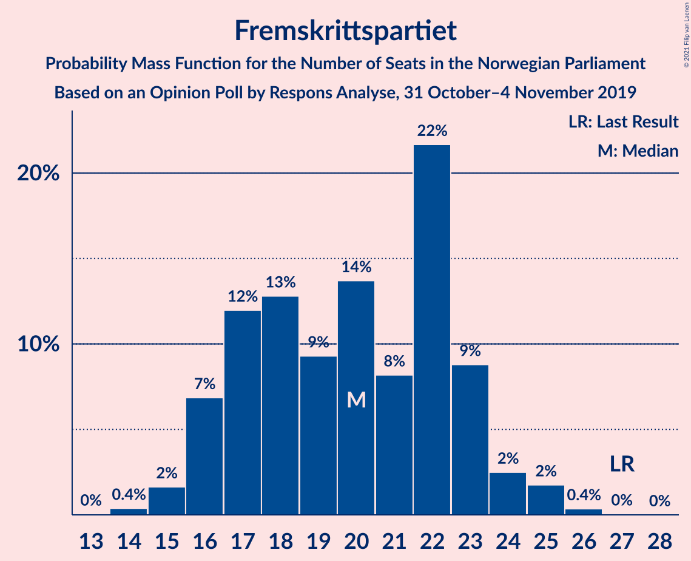
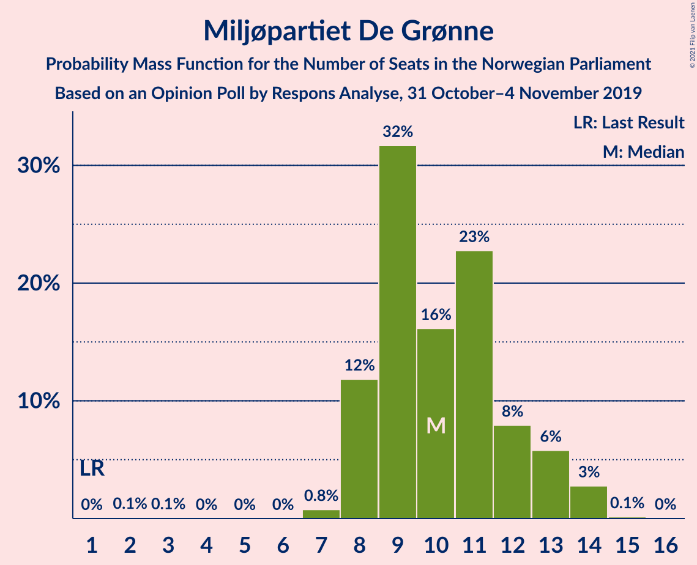
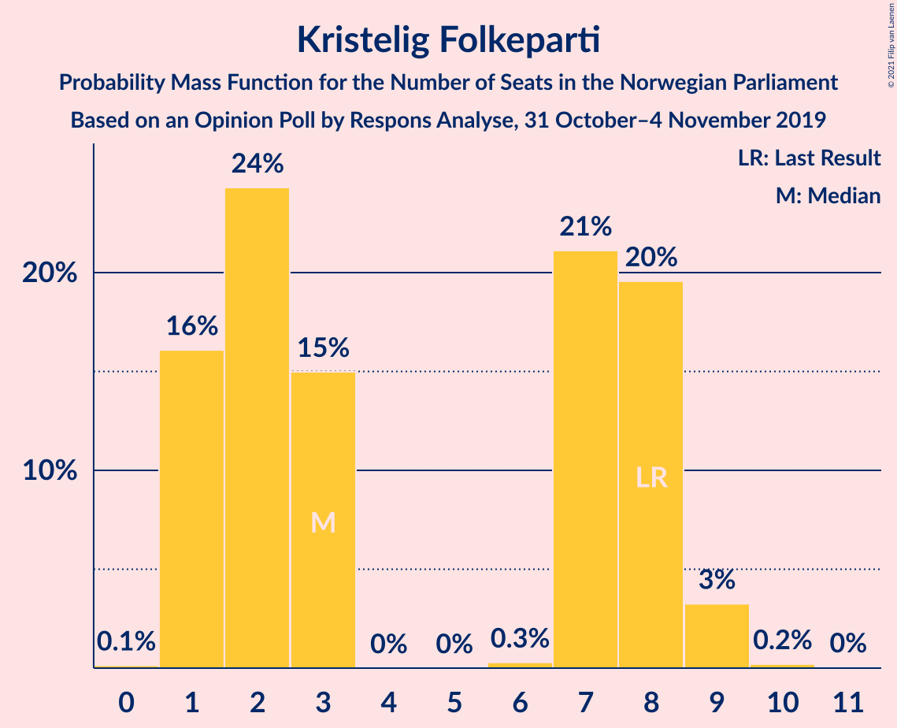
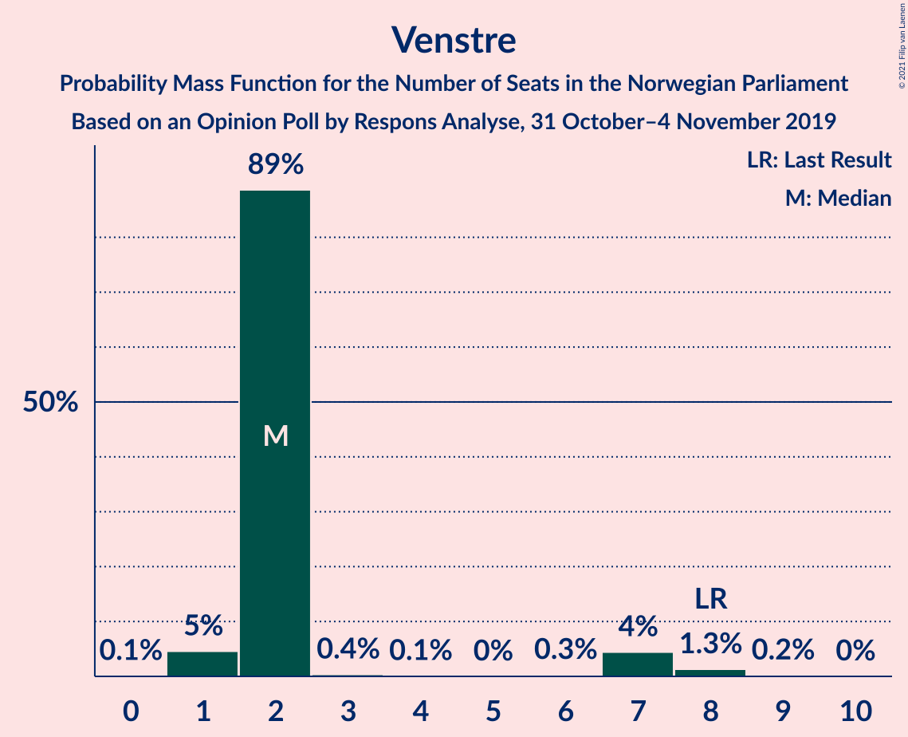
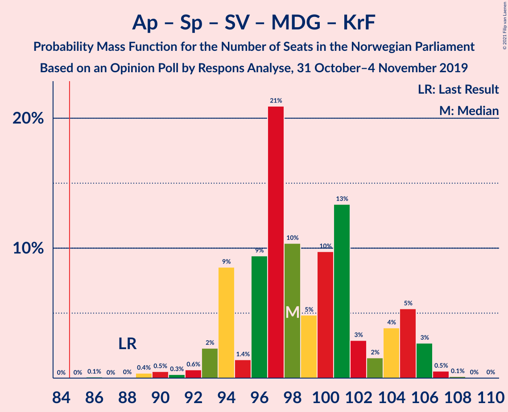
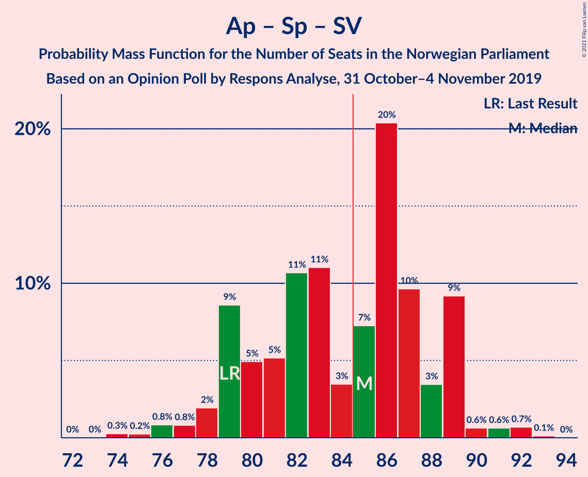
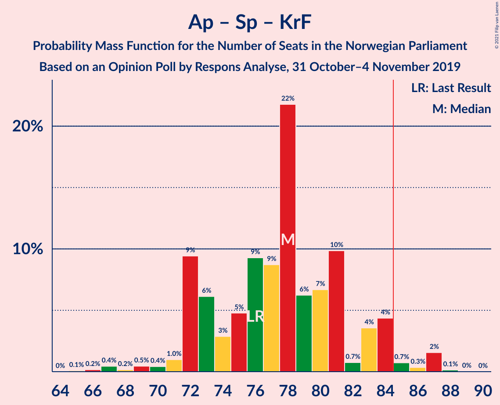
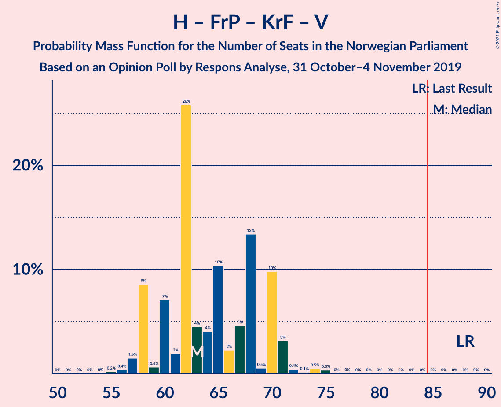
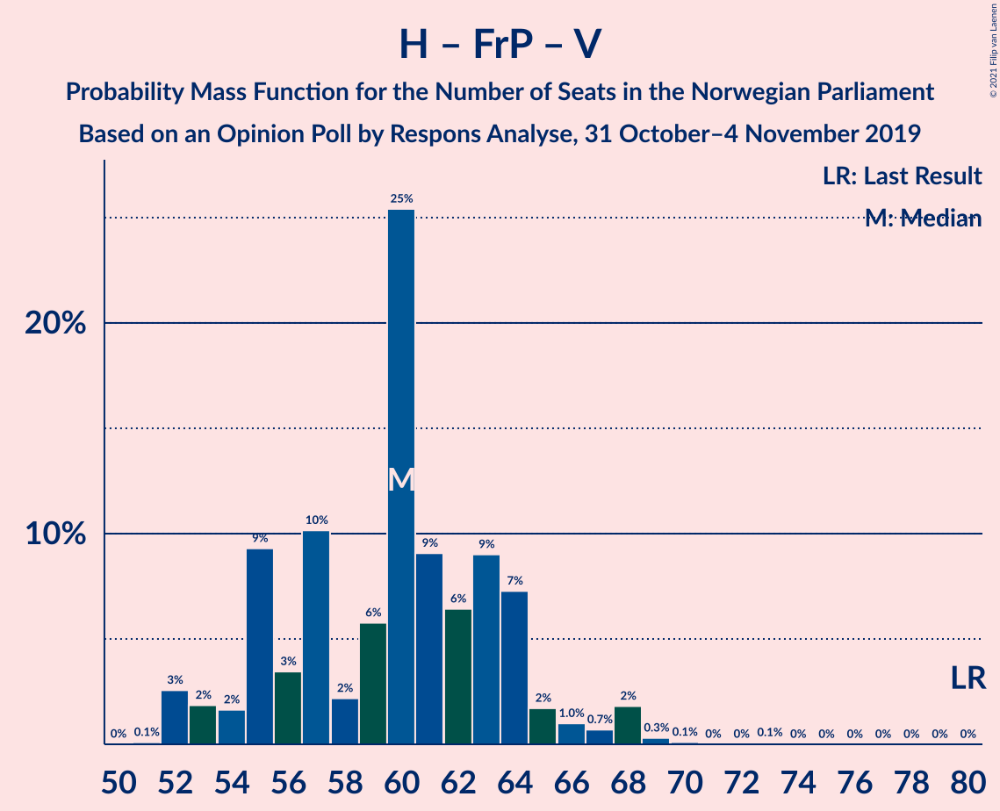
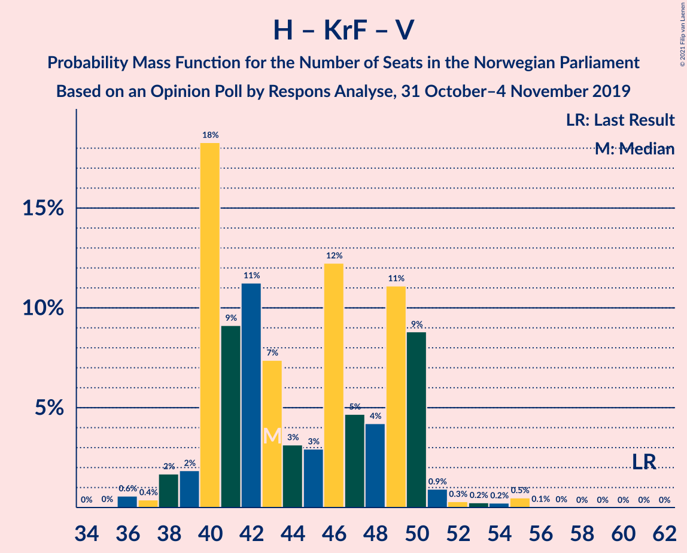

# Opinion Poll by Respons Analyse, 31 October–4 November 2019

<a href="#voting-intentions">Voting Intentions</a> | <a href="#seats">Seats</a> | <a href="#coalitions">Coalitions</a> | <a href="#technical-information">Technical Information</a>

## Voting Intentions

### Confidence Intervals

| Party | Last Result | Poll Result | 80% Confidence Interval | 90% Confidence Interval | 95% Confidence Interval | 99% Confidence Interval |
|:-----:|:-----------:|:-----------:|:-----------------------:|:-----------------------:|:-----------------------:|:-----------------------:|
| Arbeiderpartiet | 27.4% | 23.0% | 21.4–24.8% |20.9–25.3% |20.5–25.7% |19.8–26.6% |
| Høyre | 25.0% | 21.3% | 19.7–23.1% |19.3–23.6% |18.9–24.0% |18.2–24.8% |
| Senterpartiet | 10.3% | 16.5% | 15.0–18.0% |14.6–18.5% |14.3–18.9% |13.6–19.7% |
| Fremskrittspartiet | 15.2% | 11.4% | 10.2–12.8% |9.8–13.1% |9.5–13.5% |9.0–14.2% |
| Sosialistisk Venstreparti | 6.0% | 6.5% | 5.6–7.6% |5.3–7.9% |5.1–8.2% |4.7–8.7% |
| Rødt | 2.4% | 6.0% | 5.1–7.1% |4.9–7.4% |4.7–7.6% |4.3–8.2% |
| Miljøpartiet De Grønne | 3.2% | 5.9% | 5.0–7.0% |4.8–7.3% |4.6–7.5% |4.2–8.1% |
| Kristelig Folkeparti | 4.2% | 3.9% | 3.2–4.8% |3.0–5.0% |2.9–5.3% |2.6–5.7% |
| Venstre | 4.4% | 3.2% | 2.6–4.0% |2.4–4.3% |2.3–4.5% |2.0–4.9% |

*Note:* The poll result column reflects the actual value used in the calculations. Published results may vary slightly, and in addition be rounded to fewer digits.

## Seats

### Confidence Intervals

| Party | Last Result | Median | 80% Confidence Interval | 90% Confidence Interval | 95% Confidence Interval | 99% Confidence Interval |
|:-----:|:-----------:|:------:|:-----------------------:|:-----------------------:|:-----------------------:|:-----------------------:|
| <a href="#arbeiderpartiet">Arbeiderpartiet</a> | 49 | 45 | 41–45 |41–45 |41–46 |40–47 |
| <a href="#høyre">Høyre</a> | 45 | 36 | 35–42 |35–42 |35–42 |33–42 |
| <a href="#senterpartiet">Senterpartiet</a> | 19 | 28 | 28–34 |28–34 |26–34 |25–36 |
| <a href="#fremskrittspartiet">Fremskrittspartiet</a> | 27 | 21 | 13–23 |13–23 |13–23 |13–23 |
| <a href="#sosialistisk-venstreparti">Sosialistisk Venstreparti</a> | 11 | 9 | 9–14 |9–14 |9–14 |8–14 |
| <a href="#rødt">Rødt</a> | 1 | 9 | 9–12 |9–12 |8–12 |7–12 |
| <a href="#miljøpartiet-de-grønne">Miljøpartiet De Grønne</a> | 1 | 10 | 8–11 |8–11 |8–14 |8–15 |
| <a href="#kristelig-folkeparti">Kristelig Folkeparti</a> | 8 | 8 | 7–10 |3–10 |3–10 |1–10 |
| <a href="#venstre">Venstre</a> | 8 | 1 | 1–6 |1–6 |1–6 |0–7 |

### Arbeiderpartiet

*For a full overview of the results for this party, see the [Arbeiderpartiet](party-arbeiderpartiet.html) page.*

| Number of Seats | Probability | Accumulated | Special Marks |
|:---------------:|:-----------:|:-----------:|:-------------:|
| 39 | 0% | 100% |  |
| 40 | 1.0% | 99.9% |  |
| 41 | 43% | 98.9% |  |
| 42 | 1.1% | 56% |  |
| 43 | 0.1% | 55% |  |
| 44 | 1.2% | 55% |  |
| 45 | 50% | 54% | Median |
| 46 | 3% | 4% |  |
| 47 | 0.6% | 0.9% |  |
| 48 | 0.3% | 0.3% |  |
| 49 | 0% | 0% | Last Result |

### Høyre

*For a full overview of the results for this party, see the [Høyre](party-høyre.html) page.*

| Number of Seats | Probability | Accumulated | Special Marks |
|:---------------:|:-----------:|:-----------:|:-------------:|
| 32 | 0.5% | 100% |  |
| 33 | 0.3% | 99.5% |  |
| 34 | 0.4% | 99.2% |  |
| 35 | 32% | 98.8% |  |
| 36 | 21% | 67% | Median |
| 37 | 16% | 46% |  |
| 38 | 0.2% | 30% |  |
| 39 | 0% | 30% |  |
| 40 | 1.2% | 30% |  |
| 41 | 0.2% | 28% |  |
| 42 | 28% | 28% |  |
| 43 | 0% | 0.2% |  |
| 44 | 0% | 0.2% |  |
| 45 | 0% | 0.2% | Last Result |
| 46 | 0.1% | 0.2% |  |
| 47 | 0.2% | 0.2% |  |
| 48 | 0% | 0% |  |

### Senterpartiet

*For a full overview of the results for this party, see the [Senterpartiet](party-senterpartiet.html) page.*

| Number of Seats | Probability | Accumulated | Special Marks |
|:---------------:|:-----------:|:-----------:|:-------------:|
| 19 | 0% | 100% | Last Result |
| 20 | 0% | 100% |  |
| 21 | 0.1% | 100% |  |
| 22 | 0% | 99.9% |  |
| 23 | 0.1% | 99.9% |  |
| 24 | 0.1% | 99.8% |  |
| 25 | 0.4% | 99.7% |  |
| 26 | 2% | 99.3% |  |
| 27 | 0% | 97% |  |
| 28 | 50% | 97% | Median |
| 29 | 0% | 47% |  |
| 30 | 0.8% | 47% |  |
| 31 | 1.5% | 46% |  |
| 32 | 14% | 45% |  |
| 33 | 0% | 30% |  |
| 34 | 29% | 30% |  |
| 35 | 0.7% | 1.4% |  |
| 36 | 0.3% | 0.8% |  |
| 37 | 0.4% | 0.4% |  |
| 38 | 0.1% | 0.1% |  |
| 39 | 0% | 0% |  |

### Fremskrittspartiet

*For a full overview of the results for this party, see the [Fremskrittspartiet](party-fremskrittspartiet.html) page.*

| Number of Seats | Probability | Accumulated | Special Marks |
|:---------------:|:-----------:|:-----------:|:-------------:|
| 13 | 43% | 100% |  |
| 14 | 1.3% | 57% |  |
| 15 | 0.3% | 56% |  |
| 16 | 0.1% | 56% |  |
| 17 | 0% | 56% |  |
| 18 | 0% | 56% |  |
| 19 | 0.8% | 56% |  |
| 20 | 2% | 55% |  |
| 21 | 31% | 53% | Median |
| 22 | 0.1% | 21% |  |
| 23 | 21% | 21% |  |
| 24 | 0% | 0.4% |  |
| 25 | 0% | 0.4% |  |
| 26 | 0.3% | 0.4% |  |
| 27 | 0% | 0.1% | Last Result |
| 28 | 0% | 0.1% |  |
| 29 | 0% | 0.1% |  |
| 30 | 0.1% | 0.1% |  |
| 31 | 0% | 0% |  |

### Sosialistisk Venstreparti

*For a full overview of the results for this party, see the [Sosialistisk Venstreparti](party-sosialistiskvenstreparti.html) page.*

| Number of Seats | Probability | Accumulated | Special Marks |
|:---------------:|:-----------:|:-----------:|:-------------:|
| 7 | 0.1% | 100% |  |
| 8 | 0.7% | 99.9% |  |
| 9 | 60% | 99.2% | Median |
| 10 | 18% | 39% |  |
| 11 | 1.5% | 21% | Last Result |
| 12 | 3% | 20% |  |
| 13 | 0.4% | 16% |  |
| 14 | 16% | 16% |  |
| 15 | 0% | 0.4% |  |
| 16 | 0.4% | 0.4% |  |
| 17 | 0% | 0% |  |

### Rødt

*For a full overview of the results for this party, see the [Rødt](party-rødt.html) page.*

| Number of Seats | Probability | Accumulated | Special Marks |
|:---------------:|:-----------:|:-----------:|:-------------:|
| 1 | 0% | 100% | Last Result |
| 2 | 0% | 100% |  |
| 3 | 0% | 100% |  |
| 4 | 0% | 100% |  |
| 5 | 0% | 100% |  |
| 6 | 0% | 100% |  |
| 7 | 0.5% | 100% |  |
| 8 | 4% | 99.5% |  |
| 9 | 46% | 96% | Median |
| 10 | 20% | 50% |  |
| 11 | 1.4% | 30% |  |
| 12 | 28% | 28% |  |
| 13 | 0.1% | 0.1% |  |
| 14 | 0% | 0% |  |

### Miljøpartiet De Grønne

*For a full overview of the results for this party, see the [Miljøpartiet De Grønne](party-miljøpartietdegrønne.html) page.*

| Number of Seats | Probability | Accumulated | Special Marks |
|:---------------:|:-----------:|:-----------:|:-------------:|
| 1 | 0% | 100% | Last Result |
| 2 | 0.3% | 100% |  |
| 3 | 0% | 99.7% |  |
| 4 | 0% | 99.7% |  |
| 5 | 0% | 99.7% |  |
| 6 | 0% | 99.7% |  |
| 7 | 0.1% | 99.7% |  |
| 8 | 19% | 99.6% |  |
| 9 | 28% | 81% |  |
| 10 | 15% | 53% | Median |
| 11 | 33% | 38% |  |
| 12 | 0% | 5% |  |
| 13 | 0.8% | 5% |  |
| 14 | 3% | 4% |  |
| 15 | 1.2% | 1.2% |  |
| 16 | 0% | 0% |  |

### Kristelig Folkeparti

*For a full overview of the results for this party, see the [Kristelig Folkeparti](party-kristeligfolkeparti.html) page.*

| Number of Seats | Probability | Accumulated | Special Marks |
|:---------------:|:-----------:|:-----------:|:-------------:|
| 1 | 2% | 100% |  |
| 2 | 0% | 98% |  |
| 3 | 4% | 98% |  |
| 4 | 0% | 94% |  |
| 5 | 0% | 94% |  |
| 6 | 0.1% | 94% |  |
| 7 | 43% | 94% |  |
| 8 | 19% | 51% | Last Result, Median |
| 9 | 0% | 32% |  |
| 10 | 32% | 32% |  |
| 11 | 0% | 0% |  |

### Venstre

*For a full overview of the results for this party, see the [Venstre](party-venstre.html) page.*

| Number of Seats | Probability | Accumulated | Special Marks |
|:---------------:|:-----------:|:-----------:|:-------------:|
| 0 | 2% | 100% |  |
| 1 | 52% | 98% | Median |
| 2 | 30% | 45% |  |
| 3 | 0% | 15% |  |
| 4 | 0% | 15% |  |
| 5 | 0% | 15% |  |
| 6 | 14% | 15% |  |
| 7 | 0.1% | 0.6% |  |
| 8 | 0.4% | 0.5% | Last Result |
| 9 | 0% | 0% |  |

## Coalitions

### Confidence Intervals

| Coalition | Last Result | Median | Majority? | 80% Confidence Interval | 90% Confidence Interval | 95% Confidence Interval | 99% Confidence Interval |
|:---------:|:-----------:|:------:|:---------:|:-----------------------:|:-----------------------:|:-----------------------:|:-----------------------:|
| Arbeiderpartiet – Senterpartiet – Sosialistisk Venstreparti – Rødt – Miljøpartiet De Grønne | 81 | 102 | 100% | 101–106 | 101–106 | 101–110 | 101–111 |
| Arbeiderpartiet – Senterpartiet – Sosialistisk Venstreparti – Miljøpartiet De Grønne – Kristelig Folkeparti | 88 | 101 | 100% | 99–104 | 99–104 | 99–104 | 94–109 |
| Arbeiderpartiet – Senterpartiet – Sosialistisk Venstreparti – Miljøpartiet De Grønne | 80 | 93 | 99.9% | 91–97 | 91–98 | 91–100 | 91–102 |
| Høyre – Senterpartiet – Fremskrittspartiet – Kristelig Folkeparti – Venstre | 107 | 95 | 100% | 95–98 | 92–98 | 89–98 | 89–99 |
| Arbeiderpartiet – Senterpartiet – Sosialistisk Venstreparti – Rødt | 80 | 93 | 99.8% | 91–96 | 91–96 | 91–97 | 91–100 |
| Arbeiderpartiet – Senterpartiet – Miljøpartiet De Grønne – Kristelig Folkeparti | 77 | 91 | 99.3% | 89–94 | 89–94 | 89–94 | 82–96 |
| Arbeiderpartiet – Senterpartiet – Sosialistisk Venstreparti | 79 | 83 | 18% | 82–87 | 82–87 | 82–89 | 82–91 |
| Arbeiderpartiet – Senterpartiet – Kristelig Folkeparti | 76 | 82 | 0.5% | 80–83 | 78–83 | 75–83 | 75–84 |
| Høyre – Fremskrittspartiet – Miljøpartiet De Grønne – Kristelig Folkeparti – Venstre | 89 | 76 | 0.2% | 73–78 | 73–78 | 72–78 | 69–78 |
| Arbeiderpartiet – Senterpartiet | 68 | 73 | 0% | 73–75 | 73–75 | 72–75 | 70–82 |
| Høyre – Fremskrittspartiet – Kristelig Folkeparti – Venstre | 88 | 67 | 0% | 63–68 | 63–68 | 59–68 | 58–68 |
| Høyre – Fremskrittspartiet – Venstre | 80 | 57 | 0% | 56–60 | 56–60 | 56–60 | 53–64 |
| Høyre – Fremskrittspartiet | 72 | 56 | 0% | 50–59 | 50–59 | 50–59 | 50–62 |
| Arbeiderpartiet – Sosialistisk Venstreparti | 60 | 54 | 0% | 50–55 | 50–55 | 50–58 | 50–59 |
| Høyre – Kristelig Folkeparti – Venstre | 61 | 46 | 0% | 45–51 | 42–51 | 40–51 | 38–51 |
| Senterpartiet – Kristelig Folkeparti – Venstre | 35 | 39 | 0% | 37–45 | 37–45 | 30–45 | 30–45 |

### Arbeiderpartiet – Senterpartiet – Sosialistisk Venstreparti – Rødt – Miljøpartiet De Grønne

| Number of Seats | Probability | Accumulated | Special Marks |
|:---------------:|:-----------:|:-----------:|:-------------:|
| 81 | 0% | 100% | Last Result |
| 82 | 0% | 100% |  |
| 83 | 0% | 100% |  |
| 84 | 0% | 100% |  |
| 85 | 0% | 100% | Majority |
| 86 | 0% | 100% |  |
| 87 | 0% | 100% |  |
| 88 | 0% | 100% |  |
| 89 | 0% | 100% |  |
| 90 | 0% | 100% |  |
| 91 | 0% | 100% |  |
| 92 | 0.1% | 100% |  |
| 93 | 0% | 99.9% |  |
| 94 | 0% | 99.9% |  |
| 95 | 0% | 99.9% |  |
| 96 | 0% | 99.9% |  |
| 97 | 0% | 99.9% |  |
| 98 | 0.1% | 99.8% |  |
| 99 | 0% | 99.7% |  |
| 100 | 0% | 99.7% |  |
| 101 | 19% | 99.6% | Median |
| 102 | 32% | 81% |  |
| 103 | 0% | 49% |  |
| 104 | 0.1% | 49% |  |
| 105 | 28% | 49% |  |
| 106 | 17% | 21% |  |
| 107 | 0.8% | 4% |  |
| 108 | 0.5% | 3% |  |
| 109 | 0.1% | 3% |  |
| 110 | 1.3% | 3% |  |
| 111 | 1.2% | 2% |  |
| 112 | 0% | 0.3% |  |
| 113 | 0% | 0.3% |  |
| 114 | 0.3% | 0.3% |  |
| 115 | 0% | 0% |  |

### Arbeiderpartiet – Senterpartiet – Sosialistisk Venstreparti – Miljøpartiet De Grønne – Kristelig Folkeparti

| Number of Seats | Probability | Accumulated | Special Marks |
|:---------------:|:-----------:|:-----------:|:-------------:|
| 88 | 0% | 100% | Last Result |
| 89 | 0% | 100% |  |
| 90 | 0.1% | 100% |  |
| 91 | 0% | 99.9% |  |
| 92 | 0.1% | 99.9% |  |
| 93 | 0.3% | 99.8% |  |
| 94 | 0.1% | 99.5% |  |
| 95 | 0% | 99.4% |  |
| 96 | 0% | 99.3% |  |
| 97 | 0% | 99.3% |  |
| 98 | 0% | 99.3% |  |
| 99 | 18% | 99.3% |  |
| 100 | 28% | 81% | Median |
| 101 | 4% | 53% |  |
| 102 | 0.4% | 49% |  |
| 103 | 33% | 49% |  |
| 104 | 15% | 16% |  |
| 105 | 0% | 0.8% |  |
| 106 | 0% | 0.8% |  |
| 107 | 0% | 0.8% |  |
| 108 | 0% | 0.8% |  |
| 109 | 0.8% | 0.8% |  |
| 110 | 0% | 0% |  |

### Arbeiderpartiet – Senterpartiet – Sosialistisk Venstreparti – Miljøpartiet De Grønne

| Number of Seats | Probability | Accumulated | Special Marks |
|:---------------:|:-----------:|:-----------:|:-------------:|
| 80 | 0% | 100% | Last Result |
| 81 | 0% | 100% |  |
| 82 | 0% | 100% |  |
| 83 | 0.1% | 100% |  |
| 84 | 0.1% | 99.9% |  |
| 85 | 0% | 99.9% | Majority |
| 86 | 0% | 99.9% |  |
| 87 | 0.2% | 99.9% |  |
| 88 | 0% | 99.7% |  |
| 89 | 0% | 99.7% |  |
| 90 | 0% | 99.7% |  |
| 91 | 18% | 99.7% |  |
| 92 | 0.3% | 81% | Median |
| 93 | 60% | 81% |  |
| 94 | 0.4% | 22% |  |
| 95 | 0.2% | 21% |  |
| 96 | 0% | 21% |  |
| 97 | 15% | 21% |  |
| 98 | 2% | 6% |  |
| 99 | 0% | 3% |  |
| 100 | 2% | 3% |  |
| 101 | 0.5% | 1.2% |  |
| 102 | 0.4% | 0.7% |  |
| 103 | 0% | 0.4% |  |
| 104 | 0% | 0.3% |  |
| 105 | 0% | 0.3% |  |
| 106 | 0.3% | 0.3% |  |
| 107 | 0% | 0% |  |

### Høyre – Senterpartiet – Fremskrittspartiet – Kristelig Folkeparti – Venstre

| Number of Seats | Probability | Accumulated | Special Marks |
|:---------------:|:-----------:|:-----------:|:-------------:|
| 88 | 0.1% | 100% |  |
| 89 | 4% | 99.9% |  |
| 90 | 0% | 96% |  |
| 91 | 0.3% | 96% |  |
| 92 | 1.3% | 96% |  |
| 93 | 0.9% | 95% |  |
| 94 | 0% | 94% | Median |
| 95 | 46% | 94% |  |
| 96 | 19% | 48% |  |
| 97 | 0% | 29% |  |
| 98 | 28% | 29% |  |
| 99 | 0.5% | 0.7% |  |
| 100 | 0% | 0.2% |  |
| 101 | 0.1% | 0.2% |  |
| 102 | 0% | 0.1% |  |
| 103 | 0% | 0.1% |  |
| 104 | 0% | 0% |  |
| 105 | 0% | 0% |  |
| 106 | 0% | 0% |  |
| 107 | 0% | 0% | Last Result |

### Arbeiderpartiet – Senterpartiet – Sosialistisk Venstreparti – Rødt

| Number of Seats | Probability | Accumulated | Special Marks |
|:---------------:|:-----------:|:-----------:|:-------------:|
| 80 | 0% | 100% | Last Result |
| 81 | 0% | 100% |  |
| 82 | 0% | 100% |  |
| 83 | 0% | 100% |  |
| 84 | 0.2% | 100% |  |
| 85 | 0% | 99.8% | Majority |
| 86 | 0% | 99.8% |  |
| 87 | 0% | 99.8% |  |
| 88 | 0% | 99.7% |  |
| 89 | 0% | 99.7% |  |
| 90 | 0.1% | 99.7% |  |
| 91 | 31% | 99.6% | Median |
| 92 | 2% | 68% |  |
| 93 | 18% | 66% |  |
| 94 | 1.3% | 47% |  |
| 95 | 0.9% | 46% |  |
| 96 | 42% | 45% |  |
| 97 | 0.5% | 3% |  |
| 98 | 0% | 2% |  |
| 99 | 0.6% | 2% |  |
| 100 | 2% | 2% |  |
| 101 | 0.1% | 0.1% |  |
| 102 | 0% | 0% |  |

### Arbeiderpartiet – Senterpartiet – Miljøpartiet De Grønne – Kristelig Folkeparti

| Number of Seats | Probability | Accumulated | Special Marks |
|:---------------:|:-----------:|:-----------:|:-------------:|
| 77 | 0% | 100% | Last Result |
| 78 | 0.1% | 100% |  |
| 79 | 0.1% | 99.9% |  |
| 80 | 0% | 99.8% |  |
| 81 | 0% | 99.8% |  |
| 82 | 0.3% | 99.8% |  |
| 83 | 0.2% | 99.5% |  |
| 84 | 0% | 99.3% |  |
| 85 | 0% | 99.3% | Majority |
| 86 | 0.4% | 99.3% |  |
| 87 | 1.2% | 98.9% |  |
| 88 | 0.1% | 98% |  |
| 89 | 21% | 98% |  |
| 90 | 14% | 77% |  |
| 91 | 28% | 63% | Median |
| 92 | 2% | 35% |  |
| 93 | 0% | 33% |  |
| 94 | 32% | 33% |  |
| 95 | 0.2% | 1.0% |  |
| 96 | 0.4% | 0.8% |  |
| 97 | 0% | 0.5% |  |
| 98 | 0% | 0.5% |  |
| 99 | 0% | 0.5% |  |
| 100 | 0% | 0.5% |  |
| 101 | 0.5% | 0.5% |  |
| 102 | 0% | 0% |  |

### Arbeiderpartiet – Senterpartiet – Sosialistisk Venstreparti

| Number of Seats | Probability | Accumulated | Special Marks |
|:---------------:|:-----------:|:-----------:|:-------------:|
| 73 | 0.2% | 100% |  |
| 74 | 0% | 99.8% |  |
| 75 | 0% | 99.8% |  |
| 76 | 0.1% | 99.8% |  |
| 77 | 0% | 99.7% |  |
| 78 | 0% | 99.7% |  |
| 79 | 0% | 99.7% | Last Result |
| 80 | 0.1% | 99.7% |  |
| 81 | 0% | 99.7% |  |
| 82 | 32% | 99.6% | Median |
| 83 | 18% | 68% |  |
| 84 | 31% | 50% |  |
| 85 | 1.0% | 18% | Majority |
| 86 | 0.4% | 18% |  |
| 87 | 14% | 17% |  |
| 88 | 0% | 3% |  |
| 89 | 1.2% | 3% |  |
| 90 | 0.7% | 2% |  |
| 91 | 0.3% | 0.8% |  |
| 92 | 0.5% | 0.5% |  |
| 93 | 0% | 0% |  |

### Arbeiderpartiet – Senterpartiet – Kristelig Folkeparti

| Number of Seats | Probability | Accumulated | Special Marks |
|:---------------:|:-----------:|:-----------:|:-------------:|
| 68 | 0.1% | 100% |  |
| 69 | 0.1% | 99.9% |  |
| 70 | 0.1% | 99.8% |  |
| 71 | 0% | 99.7% |  |
| 72 | 0% | 99.7% |  |
| 73 | 0% | 99.7% |  |
| 74 | 0% | 99.6% |  |
| 75 | 2% | 99.6% |  |
| 76 | 1.2% | 97% | Last Result |
| 77 | 0.9% | 96% |  |
| 78 | 0.4% | 95% |  |
| 79 | 0.8% | 95% |  |
| 80 | 15% | 94% |  |
| 81 | 19% | 79% | Median |
| 82 | 28% | 61% |  |
| 83 | 32% | 33% |  |
| 84 | 0.5% | 1.0% |  |
| 85 | 0% | 0.5% | Majority |
| 86 | 0% | 0.5% |  |
| 87 | 0% | 0.5% |  |
| 88 | 0% | 0.5% |  |
| 89 | 0% | 0.5% |  |
| 90 | 0.5% | 0.5% |  |
| 91 | 0% | 0% |  |

### Høyre – Fremskrittspartiet – Miljøpartiet De Grønne – Kristelig Folkeparti – Venstre

| Number of Seats | Probability | Accumulated | Special Marks |
|:---------------:|:-----------:|:-----------:|:-------------:|
| 68 | 0.1% | 100% |  |
| 69 | 2% | 99.9% |  |
| 70 | 0.6% | 98% |  |
| 71 | 0% | 98% |  |
| 72 | 0.5% | 98% |  |
| 73 | 42% | 97% |  |
| 74 | 0.9% | 55% |  |
| 75 | 1.3% | 54% |  |
| 76 | 18% | 53% | Median |
| 77 | 2% | 34% |  |
| 78 | 31% | 32% |  |
| 79 | 0.1% | 0.4% |  |
| 80 | 0% | 0.3% |  |
| 81 | 0% | 0.3% |  |
| 82 | 0% | 0.3% |  |
| 83 | 0% | 0.2% |  |
| 84 | 0% | 0.2% |  |
| 85 | 0.2% | 0.2% | Majority |
| 86 | 0% | 0% |  |
| 87 | 0% | 0% |  |
| 88 | 0% | 0% |  |
| 89 | 0% | 0% | Last Result |

### Arbeiderpartiet – Senterpartiet

| Number of Seats | Probability | Accumulated | Special Marks |
|:---------------:|:-----------:|:-----------:|:-------------:|
| 62 | 0.1% | 100% |  |
| 63 | 0% | 99.8% |  |
| 64 | 0.1% | 99.8% |  |
| 65 | 0% | 99.8% |  |
| 66 | 0% | 99.7% |  |
| 67 | 0.1% | 99.7% |  |
| 68 | 0% | 99.7% | Last Result |
| 69 | 0% | 99.7% |  |
| 70 | 0.4% | 99.7% |  |
| 71 | 0.1% | 99.2% |  |
| 72 | 3% | 99.2% |  |
| 73 | 64% | 96% | Median |
| 74 | 0.9% | 32% |  |
| 75 | 29% | 31% |  |
| 76 | 0.2% | 2% |  |
| 77 | 0% | 2% |  |
| 78 | 0.3% | 2% |  |
| 79 | 0.3% | 1.2% |  |
| 80 | 0% | 0.9% |  |
| 81 | 0.1% | 0.9% |  |
| 82 | 0.5% | 0.8% |  |
| 83 | 0.4% | 0.4% |  |
| 84 | 0% | 0% |  |

### Høyre – Fremskrittspartiet – Kristelig Folkeparti – Venstre

| Number of Seats | Probability | Accumulated | Special Marks |
|:---------------:|:-----------:|:-----------:|:-------------:|
| 55 | 0.3% | 100% |  |
| 56 | 0% | 99.7% |  |
| 57 | 0% | 99.7% |  |
| 58 | 1.2% | 99.7% |  |
| 59 | 1.3% | 98% |  |
| 60 | 0.1% | 97% |  |
| 61 | 0.5% | 97% |  |
| 62 | 0.8% | 97% |  |
| 63 | 17% | 96% |  |
| 64 | 28% | 79% |  |
| 65 | 0.1% | 51% |  |
| 66 | 0% | 51% | Median |
| 67 | 32% | 51% |  |
| 68 | 19% | 19% |  |
| 69 | 0% | 0.4% |  |
| 70 | 0% | 0.3% |  |
| 71 | 0.1% | 0.3% |  |
| 72 | 0% | 0.2% |  |
| 73 | 0% | 0.1% |  |
| 74 | 0% | 0.1% |  |
| 75 | 0% | 0.1% |  |
| 76 | 0% | 0.1% |  |
| 77 | 0.1% | 0.1% |  |
| 78 | 0% | 0% |  |
| 79 | 0% | 0% |  |
| 80 | 0% | 0% |  |
| 81 | 0% | 0% |  |
| 82 | 0% | 0% |  |
| 83 | 0% | 0% |  |
| 84 | 0% | 0% |  |
| 85 | 0% | 0% | Majority |
| 86 | 0% | 0% |  |
| 87 | 0% | 0% |  |
| 88 | 0% | 0% | Last Result |

### Høyre – Fremskrittspartiet – Venstre

| Number of Seats | Probability | Accumulated | Special Marks |
|:---------------:|:-----------:|:-----------:|:-------------:|
| 52 | 0.3% | 100% |  |
| 53 | 0.5% | 99.7% |  |
| 54 | 0% | 99.2% |  |
| 55 | 0.8% | 99.2% |  |
| 56 | 16% | 98% |  |
| 57 | 61% | 83% |  |
| 58 | 0.4% | 22% | Median |
| 59 | 0.5% | 22% |  |
| 60 | 21% | 21% |  |
| 61 | 0.1% | 0.7% |  |
| 62 | 0% | 0.7% |  |
| 63 | 0% | 0.7% |  |
| 64 | 0.2% | 0.7% |  |
| 65 | 0% | 0.4% |  |
| 66 | 0% | 0.4% |  |
| 67 | 0.3% | 0.4% |  |
| 68 | 0% | 0.1% |  |
| 69 | 0% | 0.1% |  |
| 70 | 0% | 0.1% |  |
| 71 | 0.1% | 0.1% |  |
| 72 | 0% | 0% |  |
| 73 | 0% | 0% |  |
| 74 | 0% | 0% |  |
| 75 | 0% | 0% |  |
| 76 | 0% | 0% |  |
| 77 | 0% | 0% |  |
| 78 | 0% | 0% |  |
| 79 | 0% | 0% |  |
| 80 | 0% | 0% | Last Result |

### Høyre – Fremskrittspartiet

| Number of Seats | Probability | Accumulated | Special Marks |
|:---------------:|:-----------:|:-----------:|:-------------:|
| 50 | 15% | 100% |  |
| 51 | 0.5% | 85% |  |
| 52 | 0.4% | 85% |  |
| 53 | 0.1% | 84% |  |
| 54 | 1.1% | 84% |  |
| 55 | 29% | 83% |  |
| 56 | 31% | 54% |  |
| 57 | 2% | 23% | Median |
| 58 | 0% | 21% |  |
| 59 | 21% | 21% |  |
| 60 | 0% | 0.7% |  |
| 61 | 0% | 0.7% |  |
| 62 | 0.2% | 0.6% |  |
| 63 | 0% | 0.4% |  |
| 64 | 0% | 0.4% |  |
| 65 | 0.1% | 0.4% |  |
| 66 | 0.3% | 0.3% |  |
| 67 | 0% | 0% |  |
| 68 | 0% | 0% |  |
| 69 | 0% | 0% |  |
| 70 | 0% | 0% |  |
| 71 | 0% | 0% |  |
| 72 | 0% | 0% | Last Result |

### Arbeiderpartiet – Sosialistisk Venstreparti

| Number of Seats | Probability | Accumulated | Special Marks |
|:---------------:|:-----------:|:-----------:|:-------------:|
| 47 | 0% | 100% |  |
| 48 | 0% | 99.9% |  |
| 49 | 0.2% | 99.9% |  |
| 50 | 28% | 99.7% |  |
| 51 | 0.9% | 72% |  |
| 52 | 0.2% | 71% |  |
| 53 | 0% | 71% |  |
| 54 | 32% | 71% | Median |
| 55 | 34% | 38% |  |
| 56 | 0% | 4% |  |
| 57 | 0.1% | 4% |  |
| 58 | 4% | 4% |  |
| 59 | 0.3% | 0.7% |  |
| 60 | 0% | 0.4% | Last Result |
| 61 | 0.4% | 0.4% |  |
| 62 | 0% | 0% |  |

### Høyre – Kristelig Folkeparti – Venstre

| Number of Seats | Probability | Accumulated | Special Marks |
|:---------------:|:-----------:|:-----------:|:-------------:|
| 36 | 0.3% | 100% |  |
| 37 | 0% | 99.7% |  |
| 38 | 1.3% | 99.7% |  |
| 39 | 0% | 98% |  |
| 40 | 2% | 98% |  |
| 41 | 0% | 96% |  |
| 42 | 1.5% | 96% |  |
| 43 | 0% | 94% |  |
| 44 | 0.4% | 94% |  |
| 45 | 19% | 94% | Median |
| 46 | 31% | 75% |  |
| 47 | 0.1% | 43% |  |
| 48 | 0% | 43% |  |
| 49 | 0.1% | 43% |  |
| 50 | 14% | 43% |  |
| 51 | 28% | 29% |  |
| 52 | 0% | 0.3% |  |
| 53 | 0.1% | 0.3% |  |
| 54 | 0% | 0.2% |  |
| 55 | 0% | 0.2% |  |
| 56 | 0.1% | 0.2% |  |
| 57 | 0% | 0% |  |
| 58 | 0% | 0% |  |
| 59 | 0% | 0% |  |
| 60 | 0% | 0% |  |
| 61 | 0% | 0% | Last Result |

### Senterpartiet – Kristelig Folkeparti – Venstre

| Number of Seats | Probability | Accumulated | Special Marks |
|:---------------:|:-----------:|:-----------:|:-------------:|
| 26 | 0.1% | 100% |  |
| 27 | 0% | 99.9% |  |
| 28 | 0% | 99.9% |  |
| 29 | 0% | 99.9% |  |
| 30 | 3% | 99.9% |  |
| 31 | 0% | 97% |  |
| 32 | 1.2% | 97% |  |
| 33 | 0.3% | 96% |  |
| 34 | 0% | 96% |  |
| 35 | 0.4% | 96% | Last Result |
| 36 | 0.1% | 95% |  |
| 37 | 19% | 95% | Median |
| 38 | 0% | 76% |  |
| 39 | 33% | 76% |  |
| 40 | 0.1% | 44% |  |
| 41 | 0% | 44% |  |
| 42 | 0% | 44% |  |
| 43 | 28% | 44% |  |
| 44 | 0% | 15% |  |
| 45 | 15% | 15% |  |
| 46 | 0.4% | 0.4% |  |
| 47 | 0% | 0% |  |

## Technical Information

### Opinion Poll

+ **Polling firm:** Respons Analyse
+ **Commissioner(s):** —
+ **Fieldwork period:** 31 October–4 November 2019

### Calculations

+ **Sample size:** 1003
+ **Simulations done:** 1,024
+ **Error estimate:** 4.36%

