# Opinion Poll by Norfakta, 5–6 November 2019

<a href="#voting-intentions">Voting Intentions</a> | <a href="#seats">Seats</a> | <a href="#coalitions">Coalitions</a> | <a href="#technical-information">Technical Information</a>

## Voting Intentions

### Confidence Intervals

| Party | Last Result | Poll Result | 80% Confidence Interval | 90% Confidence Interval | 95% Confidence Interval | 99% Confidence Interval |
|:-----:|:-----------:|:-----------:|:-----------------------:|:-----------------------:|:-----------------------:|:-----------------------:|
| Høyre | 25.0% | 22.9% | 21.1–24.9% |20.6–25.5% |20.1–26.0% |19.3–27.0% |
| Arbeiderpartiet | 27.4% | 22.3% | 20.5–24.3% |20.0–24.8% |19.5–25.3% |18.7–26.3% |
| Senterpartiet | 10.3% | 19.2% | 17.5–21.1% |17.1–21.7% |16.6–22.1% |15.9–23.1% |
| Fremskrittspartiet | 15.2% | 8.4% | 7.2–9.8% |6.9–10.2% |6.6–10.5% |6.1–11.2% |
| Sosialistisk Venstreparti | 6.0% | 7.1% | 6.0–8.4% |5.7–8.8% |5.5–9.1% |5.0–9.8% |
| Miljøpartiet De Grønne | 3.2% | 6.1% | 5.1–7.3% |4.8–7.7% |4.6–8.0% |4.2–8.6% |
| Venstre | 4.4% | 4.3% | 3.5–5.4% |3.3–5.7% |3.1–6.0% |2.7–6.5% |
| Rødt | 2.4% | 4.2% | 3.4–5.2% |3.2–5.5% |3.0–5.8% |2.7–6.4% |
| Kristelig Folkeparti | 4.2% | 3.4% | 2.7–4.4% |2.5–4.7% |2.4–4.9% |2.1–5.4% |

*Note:* The poll result column reflects the actual value used in the calculations. Published results may vary slightly, and in addition be rounded to fewer digits.

## Seats

### Confidence Intervals

| Party | Last Result | Median | 80% Confidence Interval | 90% Confidence Interval | 95% Confidence Interval | 99% Confidence Interval |
|:-----:|:-----------:|:------:|:-----------------------:|:-----------------------:|:-----------------------:|:-----------------------:|
| <a href="#høyre">Høyre</a> | 45 | 40 | 35–44 |35–45 |35–46 |33–48 |
| <a href="#arbeiderpartiet">Arbeiderpartiet</a> | 49 | 41 | 38–44 |37–45 |36–45 |34–47 |
| <a href="#senterpartiet">Senterpartiet</a> | 19 | 36 | 34–39 |33–40 |32–41 |30–43 |
| <a href="#fremskrittspartiet">Fremskrittspartiet</a> | 27 | 14 | 12–17 |11–18 |11–18 |10–20 |
| <a href="#sosialistisk-venstreparti">Sosialistisk Venstreparti</a> | 11 | 12 | 10–15 |10–15 |9–16 |8–17 |
| <a href="#miljøpartiet-de-grønne">Miljøpartiet De Grønne</a> | 1 | 10 | 9–12 |8–13 |8–14 |7–15 |
| <a href="#venstre">Venstre</a> | 8 | 7 | 2–9 |2–9 |2–10 |2–11 |
| <a href="#rødt">Rødt</a> | 1 | 7 | 2–9 |2–9 |1–10 |1–11 |
| <a href="#kristelig-folkeparti">Kristelig Folkeparti</a> | 8 | 3 | 1–7 |1–7 |0–8 |0–9 |

### Høyre

*For a full overview of the results for this party, see the [Høyre](party-høyre.html) page.*

| Number of Seats | Probability | Accumulated | Special Marks |
|:---------------:|:-----------:|:-----------:|:-------------:|
| 32 | 0.1% | 100% |  |
| 33 | 0.7% | 99.9% |  |
| 34 | 2% | 99.2% |  |
| 35 | 9% | 98% |  |
| 36 | 8% | 89% |  |
| 37 | 4% | 81% |  |
| 38 | 9% | 77% |  |
| 39 | 9% | 68% |  |
| 40 | 12% | 59% | Median |
| 41 | 19% | 47% |  |
| 42 | 11% | 28% |  |
| 43 | 6% | 17% |  |
| 44 | 3% | 11% |  |
| 45 | 4% | 8% | Last Result |
| 46 | 2% | 4% |  |
| 47 | 1.0% | 2% |  |
| 48 | 0.3% | 0.6% |  |
| 49 | 0.2% | 0.3% |  |
| 50 | 0.1% | 0.2% |  |
| 51 | 0% | 0.1% |  |
| 52 | 0% | 0% |  |

### Arbeiderpartiet

*For a full overview of the results for this party, see the [Arbeiderpartiet](party-arbeiderpartiet.html) page.*

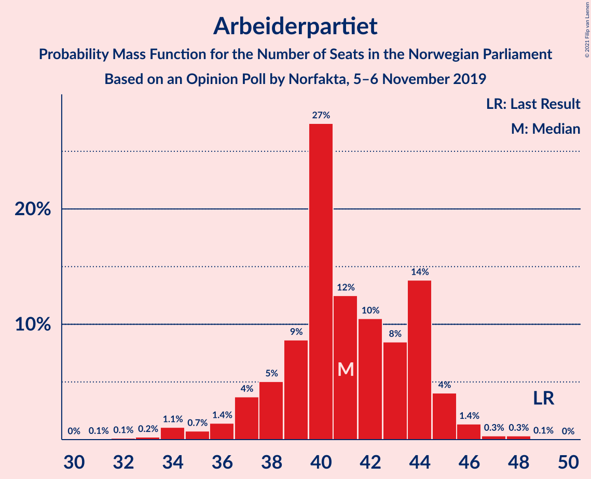

| Number of Seats | Probability | Accumulated | Special Marks |
|:---------------:|:-----------:|:-----------:|:-------------:|
| 30 | 0% | 100% |  |
| 31 | 0.1% | 99.9% |  |
| 32 | 0.1% | 99.9% |  |
| 33 | 0.2% | 99.8% |  |
| 34 | 1.1% | 99.5% |  |
| 35 | 0.7% | 98% |  |
| 36 | 1.4% | 98% |  |
| 37 | 4% | 96% |  |
| 38 | 5% | 93% |  |
| 39 | 9% | 88% |  |
| 40 | 27% | 79% |  |
| 41 | 12% | 51% | Median |
| 42 | 10% | 39% |  |
| 43 | 8% | 28% |  |
| 44 | 14% | 20% |  |
| 45 | 4% | 6% |  |
| 46 | 1.4% | 2% |  |
| 47 | 0.3% | 0.8% |  |
| 48 | 0.3% | 0.5% |  |
| 49 | 0.1% | 0.1% | Last Result |
| 50 | 0% | 0% |  |

### Senterpartiet

*For a full overview of the results for this party, see the [Senterpartiet](party-senterpartiet.html) page.*

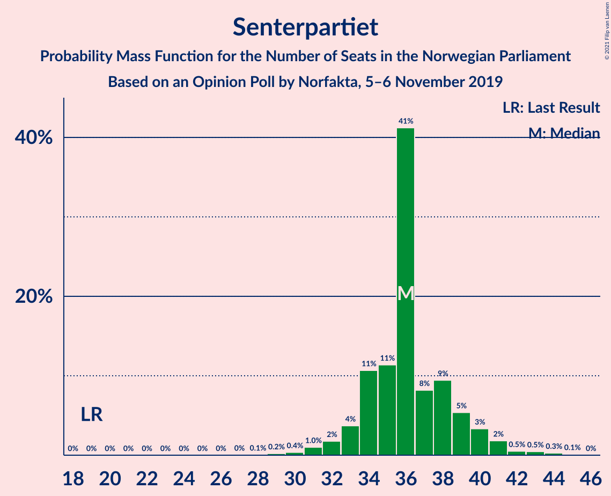

| Number of Seats | Probability | Accumulated | Special Marks |
|:---------------:|:-----------:|:-----------:|:-------------:|
| 19 | 0% | 100% | Last Result |
| 20 | 0% | 100% |  |
| 21 | 0% | 100% |  |
| 22 | 0% | 100% |  |
| 23 | 0% | 100% |  |
| 24 | 0% | 100% |  |
| 25 | 0% | 100% |  |
| 26 | 0% | 100% |  |
| 27 | 0% | 100% |  |
| 28 | 0.1% | 99.9% |  |
| 29 | 0.2% | 99.9% |  |
| 30 | 0.4% | 99.7% |  |
| 31 | 1.0% | 99.3% |  |
| 32 | 2% | 98% |  |
| 33 | 4% | 97% |  |
| 34 | 11% | 93% |  |
| 35 | 11% | 82% |  |
| 36 | 41% | 71% | Median |
| 37 | 8% | 30% |  |
| 38 | 9% | 21% |  |
| 39 | 5% | 12% |  |
| 40 | 3% | 7% |  |
| 41 | 2% | 3% |  |
| 42 | 0.5% | 1.4% |  |
| 43 | 0.5% | 0.9% |  |
| 44 | 0.3% | 0.4% |  |
| 45 | 0.1% | 0.1% |  |
| 46 | 0% | 0% |  |

### Fremskrittspartiet

*For a full overview of the results for this party, see the [Fremskrittspartiet](party-fremskrittspartiet.html) page.*

| Number of Seats | Probability | Accumulated | Special Marks |
|:---------------:|:-----------:|:-----------:|:-------------:|
| 9 | 0.2% | 100% |  |
| 10 | 2% | 99.8% |  |
| 11 | 6% | 98% |  |
| 12 | 16% | 92% |  |
| 13 | 19% | 76% |  |
| 14 | 17% | 57% | Median |
| 15 | 17% | 40% |  |
| 16 | 10% | 23% |  |
| 17 | 8% | 14% |  |
| 18 | 4% | 6% |  |
| 19 | 2% | 2% |  |
| 20 | 0.4% | 0.5% |  |
| 21 | 0.1% | 0.1% |  |
| 22 | 0% | 0% |  |
| 23 | 0% | 0% |  |
| 24 | 0% | 0% |  |
| 25 | 0% | 0% |  |
| 26 | 0% | 0% |  |
| 27 | 0% | 0% | Last Result |

### Sosialistisk Venstreparti

*For a full overview of the results for this party, see the [Sosialistisk Venstreparti](party-sosialistiskvenstreparti.html) page.*

| Number of Seats | Probability | Accumulated | Special Marks |
|:---------------:|:-----------:|:-----------:|:-------------:|
| 7 | 0.1% | 100% |  |
| 8 | 1.0% | 99.9% |  |
| 9 | 3% | 98.9% |  |
| 10 | 20% | 95% |  |
| 11 | 15% | 75% | Last Result |
| 12 | 20% | 61% | Median |
| 13 | 22% | 40% |  |
| 14 | 8% | 18% |  |
| 15 | 6% | 10% |  |
| 16 | 3% | 4% |  |
| 17 | 0.6% | 1.0% |  |
| 18 | 0.4% | 0.5% |  |
| 19 | 0% | 0.1% |  |
| 20 | 0% | 0% |  |

### Miljøpartiet De Grønne

*For a full overview of the results for this party, see the [Miljøpartiet De Grønne](party-miljøpartietdegrønne.html) page.*

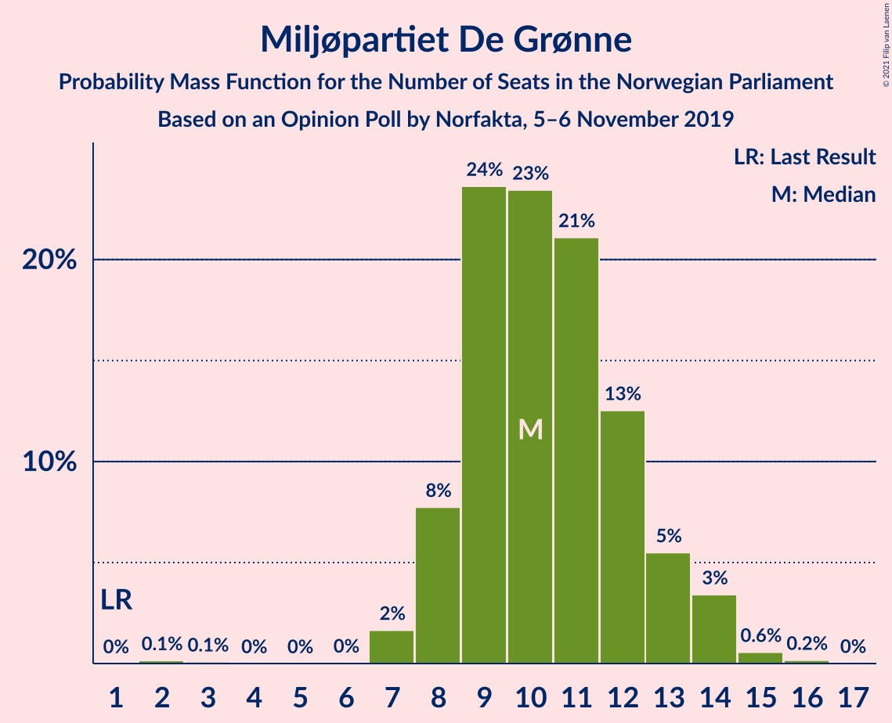

| Number of Seats | Probability | Accumulated | Special Marks |
|:---------------:|:-----------:|:-----------:|:-------------:|
| 1 | 0% | 100% | Last Result |
| 2 | 0.1% | 100% |  |
| 3 | 0.1% | 99.9% |  |
| 4 | 0% | 99.8% |  |
| 5 | 0% | 99.8% |  |
| 6 | 0% | 99.8% |  |
| 7 | 2% | 99.7% |  |
| 8 | 8% | 98% |  |
| 9 | 24% | 90% |  |
| 10 | 23% | 67% | Median |
| 11 | 21% | 43% |  |
| 12 | 13% | 22% |  |
| 13 | 5% | 10% |  |
| 14 | 3% | 4% |  |
| 15 | 0.6% | 0.7% |  |
| 16 | 0.2% | 0.2% |  |
| 17 | 0% | 0% |  |

### Venstre

*For a full overview of the results for this party, see the [Venstre](party-venstre.html) page.*

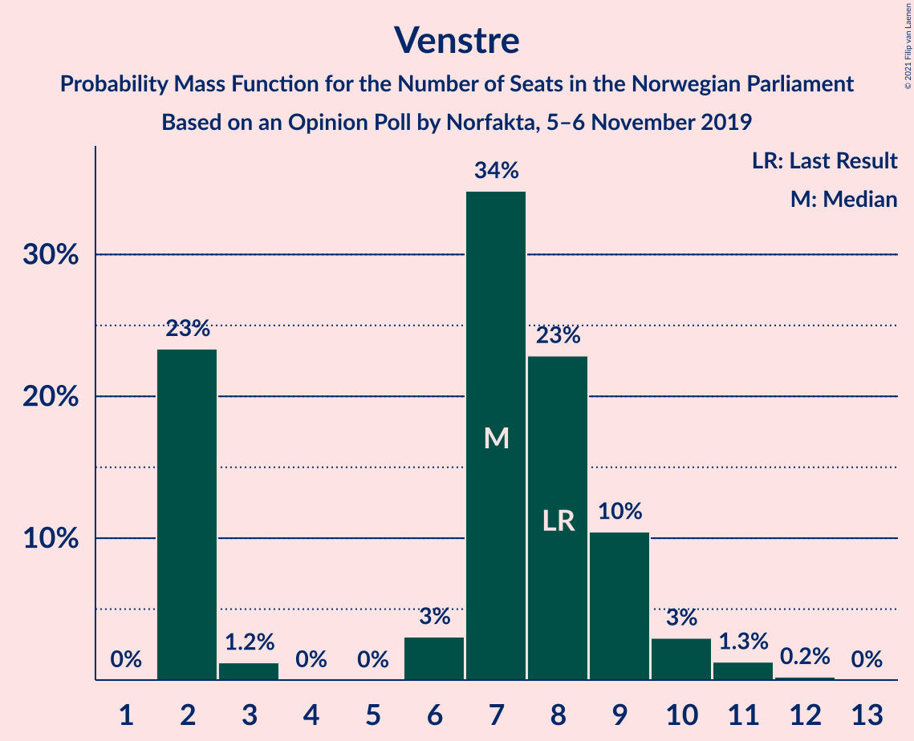

| Number of Seats | Probability | Accumulated | Special Marks |
|:---------------:|:-----------:|:-----------:|:-------------:|
| 2 | 23% | 100% |  |
| 3 | 1.2% | 77% |  |
| 4 | 0% | 75% |  |
| 5 | 0% | 75% |  |
| 6 | 3% | 75% |  |
| 7 | 34% | 72% | Median |
| 8 | 23% | 38% | Last Result |
| 9 | 10% | 15% |  |
| 10 | 3% | 5% |  |
| 11 | 1.3% | 2% |  |
| 12 | 0.2% | 0.2% |  |
| 13 | 0% | 0% |  |

### Rødt

*For a full overview of the results for this party, see the [Rødt](party-rødt.html) page.*

| Number of Seats | Probability | Accumulated | Special Marks |
|:---------------:|:-----------:|:-----------:|:-------------:|
| 1 | 3% | 100% | Last Result |
| 2 | 33% | 97% |  |
| 3 | 0% | 64% |  |
| 4 | 0% | 64% |  |
| 5 | 0% | 64% |  |
| 6 | 8% | 64% |  |
| 7 | 17% | 57% | Median |
| 8 | 24% | 40% |  |
| 9 | 12% | 16% |  |
| 10 | 3% | 4% |  |
| 11 | 0.7% | 0.8% |  |
| 12 | 0.1% | 0.1% |  |
| 13 | 0% | 0% |  |

### Kristelig Folkeparti

*For a full overview of the results for this party, see the [Kristelig Folkeparti](party-kristeligfolkeparti.html) page.*

| Number of Seats | Probability | Accumulated | Special Marks |
|:---------------:|:-----------:|:-----------:|:-------------:|
| 0 | 3% | 100% |  |
| 1 | 18% | 97% |  |
| 2 | 7% | 79% |  |
| 3 | 48% | 72% | Median |
| 4 | 0% | 24% |  |
| 5 | 0% | 24% |  |
| 6 | 8% | 24% |  |
| 7 | 13% | 17% |  |
| 8 | 3% | 4% | Last Result |
| 9 | 0.7% | 0.9% |  |
| 10 | 0.2% | 0.2% |  |
| 11 | 0% | 0% |  |

## Coalitions

### Confidence Intervals

| Coalition | Last Result | Median | Majority? | 80% Confidence Interval | 90% Confidence Interval | 95% Confidence Interval | 99% Confidence Interval |
|:---------:|:-----------:|:------:|:---------:|:-----------------------:|:-----------------------:|:-----------------------:|:-----------------------:|
| Arbeiderpartiet – Senterpartiet – Sosialistisk Venstreparti – Miljøpartiet De Grønne – Rødt | 81 | 105 | 100% | 100–111 | 99–111 | 98–112 | 96–114 |
| Arbeiderpartiet – Senterpartiet – Sosialistisk Venstreparti – Miljøpartiet De Grønne – Kristelig Folkeparti | 88 | 103 | 100% | 98–107 | 97–108 | 96–110 | 93–113 |
| Høyre – Senterpartiet – Fremskrittspartiet – Venstre – Kristelig Folkeparti | 107 | 100 | 100% | 94–105 | 94–106 | 93–108 | 91–110 |
| Arbeiderpartiet – Senterpartiet – Sosialistisk Venstreparti – Miljøpartiet De Grønne | 80 | 99 | 100% | 95–104 | 94–105 | 93–106 | 91–109 |
| Arbeiderpartiet – Senterpartiet – Sosialistisk Venstreparti – Rødt | 80 | 95 | 99.8% | 90–100 | 89–102 | 87–102 | 85–104 |
| Arbeiderpartiet – Senterpartiet – Miljøpartiet De Grønne – Kristelig Folkeparti | 77 | 91 | 95% | 87–95 | 85–96 | 84–98 | 81–99 |
| Arbeiderpartiet – Senterpartiet – Sosialistisk Venstreparti | 79 | 89 | 95% | 86–93 | 84–94 | 83–95 | 81–98 |
| Arbeiderpartiet – Senterpartiet – Kristelig Folkeparti | 76 | 81 | 10% | 76–84 | 75–86 | 73–87 | 70–89 |
| Arbeiderpartiet – Senterpartiet | 68 | 77 | 0.6% | 74–80 | 73–81 | 71–82 | 69–85 |
| Høyre – Fremskrittspartiet – Miljøpartiet De Grønne – Venstre – Kristelig Folkeparti | 89 | 74 | 0.2% | 69–79 | 67–80 | 67–82 | 65–84 |
| Høyre – Fremskrittspartiet – Venstre – Kristelig Folkeparti | 88 | 64 | 0% | 58–69 | 58–70 | 57–71 | 55–73 |
| Høyre – Fremskrittspartiet – Venstre | 80 | 60 | 0% | 55–65 | 55–67 | 54–68 | 51–70 |
| Høyre – Fremskrittspartiet | 72 | 54 | 0% | 49–59 | 48–61 | 48–62 | 47–63 |
| Arbeiderpartiet – Sosialistisk Venstreparti | 60 | 53 | 0% | 49–57 | 49–58 | 47–59 | 45–61 |
| Høyre – Venstre – Kristelig Folkeparti | 61 | 50 | 0% | 45–55 | 43–56 | 42–57 | 40–59 |
| Senterpartiet – Venstre – Kristelig Folkeparti | 35 | 46 | 0% | 41–51 | 40–52 | 39–53 | 36–55 |

### Arbeiderpartiet – Senterpartiet – Sosialistisk Venstreparti – Miljøpartiet De Grønne – Rødt

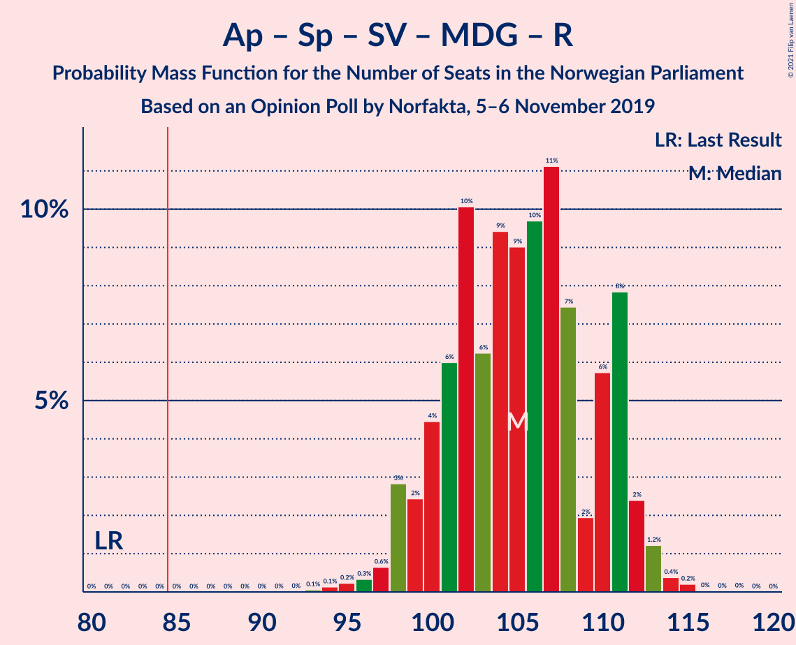

| Number of Seats | Probability | Accumulated | Special Marks |
|:---------------:|:-----------:|:-----------:|:-------------:|
| 81 | 0% | 100% | Last Result |
| 82 | 0% | 100% |  |
| 83 | 0% | 100% |  |
| 84 | 0% | 100% |  |
| 85 | 0% | 100% | Majority |
| 86 | 0% | 100% |  |
| 87 | 0% | 100% |  |
| 88 | 0% | 100% |  |
| 89 | 0% | 100% |  |
| 90 | 0% | 100% |  |
| 91 | 0% | 100% |  |
| 92 | 0% | 100% |  |
| 93 | 0.1% | 100% |  |
| 94 | 0.1% | 99.9% |  |
| 95 | 0.2% | 99.8% |  |
| 96 | 0.3% | 99.5% |  |
| 97 | 0.6% | 99.2% |  |
| 98 | 3% | 98.6% |  |
| 99 | 2% | 96% |  |
| 100 | 4% | 93% |  |
| 101 | 6% | 89% |  |
| 102 | 10% | 83% |  |
| 103 | 6% | 73% |  |
| 104 | 9% | 67% |  |
| 105 | 9% | 57% |  |
| 106 | 10% | 48% | Median |
| 107 | 11% | 38% |  |
| 108 | 7% | 27% |  |
| 109 | 2% | 20% |  |
| 110 | 6% | 18% |  |
| 111 | 8% | 12% |  |
| 112 | 2% | 4% |  |
| 113 | 1.2% | 2% |  |
| 114 | 0.4% | 0.7% |  |
| 115 | 0.2% | 0.3% |  |
| 116 | 0% | 0.1% |  |
| 117 | 0% | 0.1% |  |
| 118 | 0% | 0% |  |

### Arbeiderpartiet – Senterpartiet – Sosialistisk Venstreparti – Miljøpartiet De Grønne – Kristelig Folkeparti

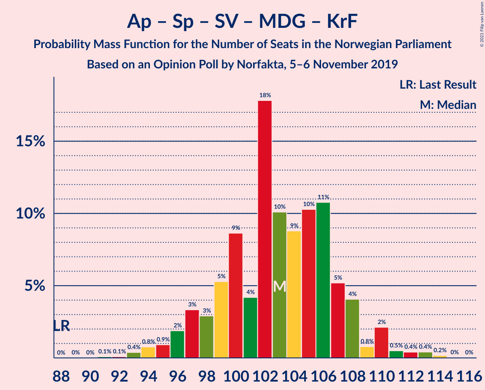

| Number of Seats | Probability | Accumulated | Special Marks |
|:---------------:|:-----------:|:-----------:|:-------------:|
| 88 | 0% | 100% | Last Result |
| 89 | 0% | 100% |  |
| 90 | 0% | 100% |  |
| 91 | 0.1% | 100% |  |
| 92 | 0.1% | 99.9% |  |
| 93 | 0.4% | 99.8% |  |
| 94 | 0.8% | 99.4% |  |
| 95 | 0.9% | 98.6% |  |
| 96 | 2% | 98% |  |
| 97 | 3% | 96% |  |
| 98 | 3% | 93% |  |
| 99 | 5% | 90% |  |
| 100 | 9% | 84% |  |
| 101 | 4% | 76% |  |
| 102 | 18% | 71% | Median |
| 103 | 10% | 54% |  |
| 104 | 9% | 44% |  |
| 105 | 10% | 35% |  |
| 106 | 11% | 24% |  |
| 107 | 5% | 14% |  |
| 108 | 4% | 9% |  |
| 109 | 0.8% | 4% |  |
| 110 | 2% | 4% |  |
| 111 | 0.5% | 2% |  |
| 112 | 0.4% | 1.1% |  |
| 113 | 0.4% | 0.7% |  |
| 114 | 0.2% | 0.2% |  |
| 115 | 0% | 0.1% |  |
| 116 | 0% | 0% |  |

### Høyre – Senterpartiet – Fremskrittspartiet – Venstre – Kristelig Folkeparti

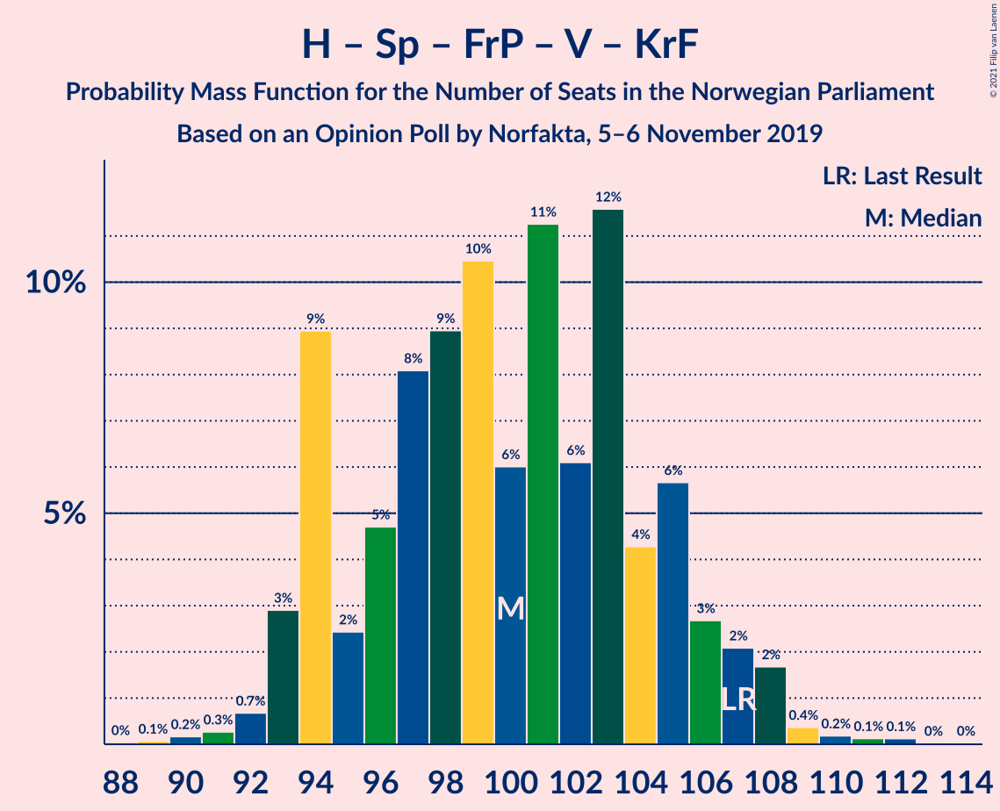

| Number of Seats | Probability | Accumulated | Special Marks |
|:---------------:|:-----------:|:-----------:|:-------------:|
| 88 | 0% | 100% |  |
| 89 | 0.1% | 99.9% |  |
| 90 | 0.2% | 99.9% |  |
| 91 | 0.3% | 99.7% |  |
| 92 | 0.7% | 99.4% |  |
| 93 | 3% | 98.7% |  |
| 94 | 9% | 96% |  |
| 95 | 2% | 87% |  |
| 96 | 5% | 84% |  |
| 97 | 8% | 80% |  |
| 98 | 9% | 72% |  |
| 99 | 10% | 63% |  |
| 100 | 6% | 52% | Median |
| 101 | 11% | 46% |  |
| 102 | 6% | 35% |  |
| 103 | 12% | 29% |  |
| 104 | 4% | 17% |  |
| 105 | 6% | 13% |  |
| 106 | 3% | 7% |  |
| 107 | 2% | 5% | Last Result |
| 108 | 2% | 3% |  |
| 109 | 0.4% | 0.9% |  |
| 110 | 0.2% | 0.5% |  |
| 111 | 0.1% | 0.3% |  |
| 112 | 0.1% | 0.2% |  |
| 113 | 0% | 0.1% |  |
| 114 | 0% | 0% |  |

### Arbeiderpartiet – Senterpartiet – Sosialistisk Venstreparti – Miljøpartiet De Grønne

| Number of Seats | Probability | Accumulated | Special Marks |
|:---------------:|:-----------:|:-----------:|:-------------:|
| 80 | 0% | 100% | Last Result |
| 81 | 0% | 100% |  |
| 82 | 0% | 100% |  |
| 83 | 0% | 100% |  |
| 84 | 0% | 100% |  |
| 85 | 0% | 100% | Majority |
| 86 | 0% | 100% |  |
| 87 | 0% | 100% |  |
| 88 | 0.1% | 100% |  |
| 89 | 0.1% | 99.9% |  |
| 90 | 0.2% | 99.9% |  |
| 91 | 0.5% | 99.6% |  |
| 92 | 0.7% | 99.1% |  |
| 93 | 2% | 98% |  |
| 94 | 2% | 97% |  |
| 95 | 5% | 94% |  |
| 96 | 11% | 89% |  |
| 97 | 11% | 79% |  |
| 98 | 6% | 67% |  |
| 99 | 12% | 61% | Median |
| 100 | 11% | 49% |  |
| 101 | 7% | 38% |  |
| 102 | 9% | 32% |  |
| 103 | 12% | 23% |  |
| 104 | 4% | 11% |  |
| 105 | 4% | 7% |  |
| 106 | 1.0% | 3% |  |
| 107 | 0.6% | 2% |  |
| 108 | 1.0% | 2% |  |
| 109 | 0.3% | 0.7% |  |
| 110 | 0.3% | 0.4% |  |
| 111 | 0.1% | 0.1% |  |
| 112 | 0% | 0% |  |

### Arbeiderpartiet – Senterpartiet – Sosialistisk Venstreparti – Rødt

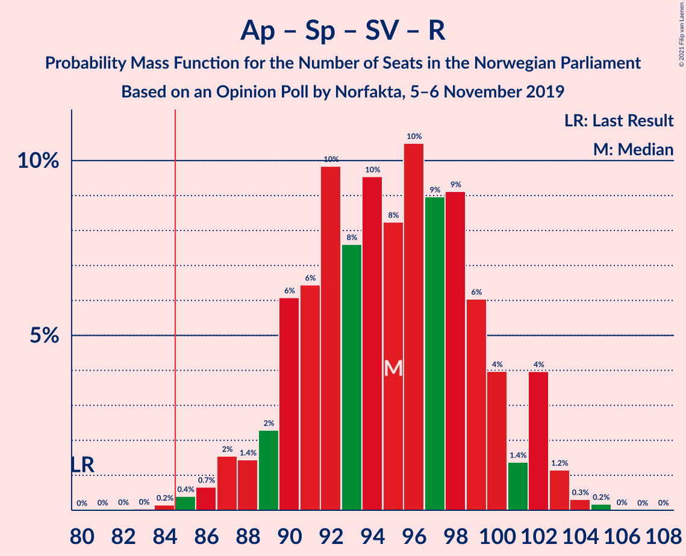

| Number of Seats | Probability | Accumulated | Special Marks |
|:---------------:|:-----------:|:-----------:|:-------------:|
| 80 | 0% | 100% | Last Result |
| 81 | 0% | 100% |  |
| 82 | 0% | 100% |  |
| 83 | 0% | 99.9% |  |
| 84 | 0.2% | 99.9% |  |
| 85 | 0.4% | 99.8% | Majority |
| 86 | 0.7% | 99.4% |  |
| 87 | 2% | 98.7% |  |
| 88 | 1.4% | 97% |  |
| 89 | 2% | 96% |  |
| 90 | 6% | 93% |  |
| 91 | 6% | 87% |  |
| 92 | 10% | 81% |  |
| 93 | 8% | 71% |  |
| 94 | 10% | 63% |  |
| 95 | 8% | 54% |  |
| 96 | 10% | 46% | Median |
| 97 | 9% | 35% |  |
| 98 | 9% | 26% |  |
| 99 | 6% | 17% |  |
| 100 | 4% | 11% |  |
| 101 | 1.4% | 7% |  |
| 102 | 4% | 6% |  |
| 103 | 1.2% | 2% |  |
| 104 | 0.3% | 0.5% |  |
| 105 | 0.2% | 0.2% |  |
| 106 | 0% | 0.1% |  |
| 107 | 0% | 0% |  |

### Arbeiderpartiet – Senterpartiet – Miljøpartiet De Grønne – Kristelig Folkeparti

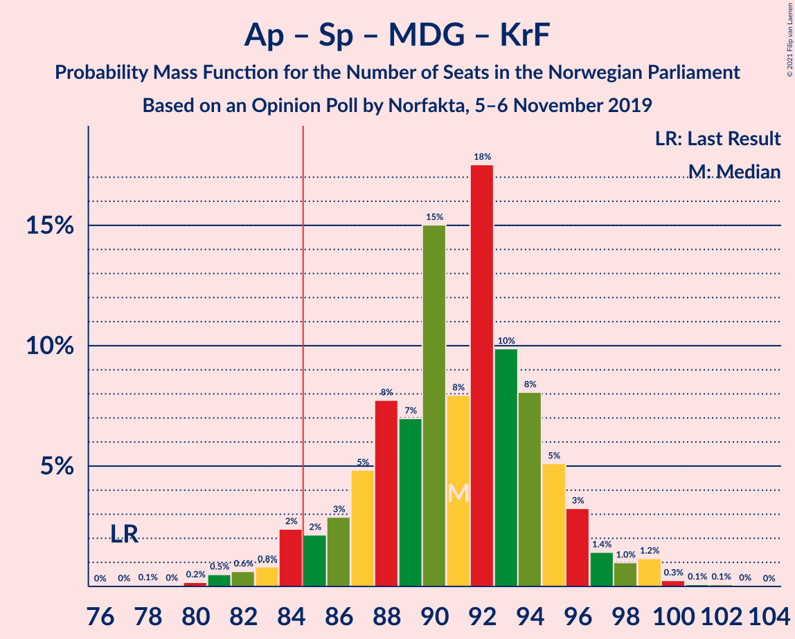

| Number of Seats | Probability | Accumulated | Special Marks |
|:---------------:|:-----------:|:-----------:|:-------------:|
| 77 | 0% | 100% | Last Result |
| 78 | 0.1% | 100% |  |
| 79 | 0% | 99.9% |  |
| 80 | 0.2% | 99.9% |  |
| 81 | 0.5% | 99.7% |  |
| 82 | 0.6% | 99.2% |  |
| 83 | 0.8% | 98.6% |  |
| 84 | 2% | 98% |  |
| 85 | 2% | 95% | Majority |
| 86 | 3% | 93% |  |
| 87 | 5% | 90% |  |
| 88 | 8% | 86% |  |
| 89 | 7% | 78% |  |
| 90 | 15% | 71% | Median |
| 91 | 8% | 56% |  |
| 92 | 18% | 48% |  |
| 93 | 10% | 30% |  |
| 94 | 8% | 20% |  |
| 95 | 5% | 12% |  |
| 96 | 3% | 7% |  |
| 97 | 1.4% | 4% |  |
| 98 | 1.0% | 3% |  |
| 99 | 1.2% | 2% |  |
| 100 | 0.3% | 0.5% |  |
| 101 | 0.1% | 0.2% |  |
| 102 | 0.1% | 0.1% |  |
| 103 | 0% | 0% |  |

### Arbeiderpartiet – Senterpartiet – Sosialistisk Venstreparti

| Number of Seats | Probability | Accumulated | Special Marks |
|:---------------:|:-----------:|:-----------:|:-------------:|
| 78 | 0.1% | 100% |  |
| 79 | 0.1% | 99.9% | Last Result |
| 80 | 0.2% | 99.8% |  |
| 81 | 0.3% | 99.7% |  |
| 82 | 1.0% | 99.3% |  |
| 83 | 1.4% | 98% |  |
| 84 | 2% | 97% |  |
| 85 | 4% | 95% | Majority |
| 86 | 12% | 91% |  |
| 87 | 10% | 78% |  |
| 88 | 11% | 69% |  |
| 89 | 13% | 58% | Median |
| 90 | 12% | 45% |  |
| 91 | 9% | 33% |  |
| 92 | 8% | 24% |  |
| 93 | 8% | 16% |  |
| 94 | 4% | 8% |  |
| 95 | 2% | 4% |  |
| 96 | 0.6% | 2% |  |
| 97 | 0.3% | 1.4% |  |
| 98 | 0.8% | 1.1% |  |
| 99 | 0.3% | 0.3% |  |
| 100 | 0% | 0.1% |  |
| 101 | 0% | 0% |  |

### Arbeiderpartiet – Senterpartiet – Kristelig Folkeparti

| Number of Seats | Probability | Accumulated | Special Marks |
|:---------------:|:-----------:|:-----------:|:-------------:|
| 68 | 0.1% | 100% |  |
| 69 | 0.1% | 99.9% |  |
| 70 | 0.4% | 99.8% |  |
| 71 | 0.3% | 99.4% |  |
| 72 | 0.7% | 99.2% |  |
| 73 | 1.1% | 98% |  |
| 74 | 1.5% | 97% |  |
| 75 | 2% | 96% |  |
| 76 | 5% | 94% | Last Result |
| 77 | 8% | 89% |  |
| 78 | 5% | 81% |  |
| 79 | 13% | 76% |  |
| 80 | 9% | 62% | Median |
| 81 | 8% | 54% |  |
| 82 | 15% | 45% |  |
| 83 | 16% | 30% |  |
| 84 | 4% | 14% |  |
| 85 | 5% | 10% | Majority |
| 86 | 2% | 5% |  |
| 87 | 1.0% | 3% |  |
| 88 | 1.3% | 2% |  |
| 89 | 0.6% | 0.9% |  |
| 90 | 0.1% | 0.3% |  |
| 91 | 0.1% | 0.2% |  |
| 92 | 0.1% | 0.1% |  |
| 93 | 0% | 0% |  |

### Arbeiderpartiet – Senterpartiet

| Number of Seats | Probability | Accumulated | Special Marks |
|:---------------:|:-----------:|:-----------:|:-------------:|
| 66 | 0% | 100% |  |
| 67 | 0.1% | 99.9% |  |
| 68 | 0.2% | 99.8% | Last Result |
| 69 | 0.6% | 99.6% |  |
| 70 | 0.6% | 99.0% |  |
| 71 | 2% | 98% |  |
| 72 | 2% | 97% |  |
| 73 | 3% | 95% |  |
| 74 | 5% | 92% |  |
| 75 | 8% | 87% |  |
| 76 | 24% | 79% |  |
| 77 | 13% | 55% | Median |
| 78 | 11% | 42% |  |
| 79 | 10% | 31% |  |
| 80 | 12% | 21% |  |
| 81 | 4% | 8% |  |
| 82 | 2% | 4% |  |
| 83 | 1.5% | 2% |  |
| 84 | 0.3% | 1.0% |  |
| 85 | 0.3% | 0.6% | Majority |
| 86 | 0.3% | 0.3% |  |
| 87 | 0% | 0% |  |

### Høyre – Fremskrittspartiet – Miljøpartiet De Grønne – Venstre – Kristelig Folkeparti

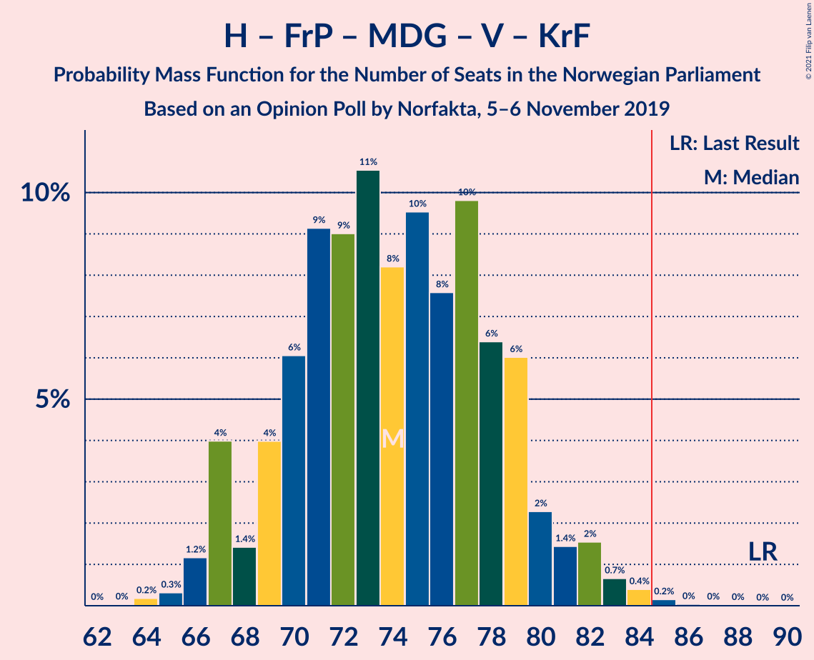

| Number of Seats | Probability | Accumulated | Special Marks |
|:---------------:|:-----------:|:-----------:|:-------------:|
| 63 | 0% | 100% |  |
| 64 | 0.2% | 99.9% |  |
| 65 | 0.3% | 99.8% |  |
| 66 | 1.2% | 99.4% |  |
| 67 | 4% | 98% |  |
| 68 | 1.4% | 94% |  |
| 69 | 4% | 93% |  |
| 70 | 6% | 89% |  |
| 71 | 9% | 83% |  |
| 72 | 9% | 74% |  |
| 73 | 11% | 65% |  |
| 74 | 8% | 54% | Median |
| 75 | 10% | 46% |  |
| 76 | 8% | 36% |  |
| 77 | 10% | 29% |  |
| 78 | 6% | 19% |  |
| 79 | 6% | 13% |  |
| 80 | 2% | 7% |  |
| 81 | 1.4% | 4% |  |
| 82 | 2% | 3% |  |
| 83 | 0.7% | 1.3% |  |
| 84 | 0.4% | 0.6% |  |
| 85 | 0.2% | 0.2% | Majority |
| 86 | 0% | 0.1% |  |
| 87 | 0% | 0.1% |  |
| 88 | 0% | 0% |  |
| 89 | 0% | 0% | Last Result |

### Høyre – Fremskrittspartiet – Venstre – Kristelig Folkeparti

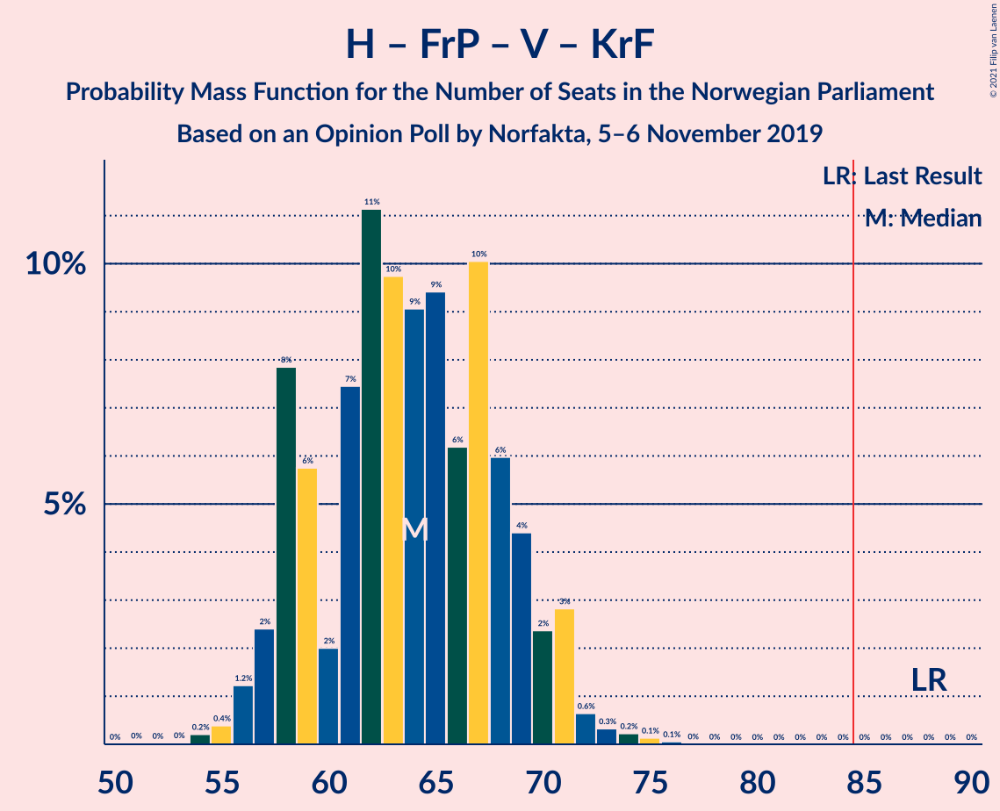

| Number of Seats | Probability | Accumulated | Special Marks |
|:---------------:|:-----------:|:-----------:|:-------------:|
| 52 | 0% | 100% |  |
| 53 | 0% | 99.9% |  |
| 54 | 0.2% | 99.9% |  |
| 55 | 0.4% | 99.7% |  |
| 56 | 1.2% | 99.3% |  |
| 57 | 2% | 98% |  |
| 58 | 8% | 96% |  |
| 59 | 6% | 88% |  |
| 60 | 2% | 82% |  |
| 61 | 7% | 80% |  |
| 62 | 11% | 73% |  |
| 63 | 10% | 61% |  |
| 64 | 9% | 52% | Median |
| 65 | 9% | 43% |  |
| 66 | 6% | 33% |  |
| 67 | 10% | 27% |  |
| 68 | 6% | 17% |  |
| 69 | 4% | 11% |  |
| 70 | 2% | 7% |  |
| 71 | 3% | 4% |  |
| 72 | 0.6% | 1.4% |  |
| 73 | 0.3% | 0.8% |  |
| 74 | 0.2% | 0.4% |  |
| 75 | 0.1% | 0.2% |  |
| 76 | 0.1% | 0.1% |  |
| 77 | 0% | 0% |  |
| 78 | 0% | 0% |  |
| 79 | 0% | 0% |  |
| 80 | 0% | 0% |  |
| 81 | 0% | 0% |  |
| 82 | 0% | 0% |  |
| 83 | 0% | 0% |  |
| 84 | 0% | 0% |  |
| 85 | 0% | 0% | Majority |
| 86 | 0% | 0% |  |
| 87 | 0% | 0% |  |
| 88 | 0% | 0% | Last Result |

### Høyre – Fremskrittspartiet – Venstre

| Number of Seats | Probability | Accumulated | Special Marks |
|:---------------:|:-----------:|:-----------:|:-------------:|
| 49 | 0.1% | 100% |  |
| 50 | 0.2% | 99.9% |  |
| 51 | 0.3% | 99.7% |  |
| 52 | 0.2% | 99.4% |  |
| 53 | 0.8% | 99.3% |  |
| 54 | 3% | 98% |  |
| 55 | 9% | 96% |  |
| 56 | 5% | 87% |  |
| 57 | 5% | 82% |  |
| 58 | 8% | 77% |  |
| 59 | 11% | 69% |  |
| 60 | 10% | 58% |  |
| 61 | 15% | 48% | Median |
| 62 | 7% | 33% |  |
| 63 | 7% | 26% |  |
| 64 | 6% | 19% |  |
| 65 | 4% | 13% |  |
| 66 | 2% | 9% |  |
| 67 | 2% | 7% |  |
| 68 | 2% | 5% |  |
| 69 | 1.1% | 2% |  |
| 70 | 0.6% | 1.1% |  |
| 71 | 0.2% | 0.4% |  |
| 72 | 0.2% | 0.3% |  |
| 73 | 0.1% | 0.1% |  |
| 74 | 0% | 0% |  |
| 75 | 0% | 0% |  |
| 76 | 0% | 0% |  |
| 77 | 0% | 0% |  |
| 78 | 0% | 0% |  |
| 79 | 0% | 0% |  |
| 80 | 0% | 0% | Last Result |

### Høyre – Fremskrittspartiet

| Number of Seats | Probability | Accumulated | Special Marks |
|:---------------:|:-----------:|:-----------:|:-------------:|
| 45 | 0.1% | 100% |  |
| 46 | 0.3% | 99.9% |  |
| 47 | 1.5% | 99.6% |  |
| 48 | 8% | 98% |  |
| 49 | 3% | 90% |  |
| 50 | 2% | 87% |  |
| 51 | 10% | 85% |  |
| 52 | 8% | 75% |  |
| 53 | 15% | 67% |  |
| 54 | 12% | 52% | Median |
| 55 | 8% | 39% |  |
| 56 | 9% | 32% |  |
| 57 | 7% | 23% |  |
| 58 | 5% | 16% |  |
| 59 | 3% | 11% |  |
| 60 | 2% | 8% |  |
| 61 | 2% | 6% |  |
| 62 | 2% | 4% |  |
| 63 | 1.4% | 2% |  |
| 64 | 0.2% | 0.5% |  |
| 65 | 0.1% | 0.3% |  |
| 66 | 0.2% | 0.2% |  |
| 67 | 0% | 0% |  |
| 68 | 0% | 0% |  |
| 69 | 0% | 0% |  |
| 70 | 0% | 0% |  |
| 71 | 0% | 0% |  |
| 72 | 0% | 0% | Last Result |

### Arbeiderpartiet – Sosialistisk Venstreparti

| Number of Seats | Probability | Accumulated | Special Marks |
|:---------------:|:-----------:|:-----------:|:-------------:|
| 42 | 0% | 100% |  |
| 43 | 0% | 99.9% |  |
| 44 | 0.1% | 99.9% |  |
| 45 | 0.5% | 99.7% |  |
| 46 | 0.8% | 99.3% |  |
| 47 | 1.3% | 98% |  |
| 48 | 2% | 97% |  |
| 49 | 5% | 95% |  |
| 50 | 13% | 90% |  |
| 51 | 8% | 77% |  |
| 52 | 12% | 69% |  |
| 53 | 14% | 57% | Median |
| 54 | 12% | 43% |  |
| 55 | 10% | 31% |  |
| 56 | 6% | 20% |  |
| 57 | 7% | 14% |  |
| 58 | 3% | 7% |  |
| 59 | 2% | 4% |  |
| 60 | 1.2% | 2% | Last Result |
| 61 | 0.4% | 0.6% |  |
| 62 | 0.1% | 0.2% |  |
| 63 | 0.1% | 0.1% |  |
| 64 | 0% | 0% |  |

### Høyre – Venstre – Kristelig Folkeparti

| Number of Seats | Probability | Accumulated | Special Marks |
|:---------------:|:-----------:|:-----------:|:-------------:|
| 38 | 0.1% | 100% |  |
| 39 | 0.1% | 99.9% |  |
| 40 | 0.4% | 99.8% |  |
| 41 | 0.5% | 99.4% |  |
| 42 | 1.5% | 98.9% |  |
| 43 | 2% | 97% |  |
| 44 | 2% | 95% |  |
| 45 | 10% | 93% |  |
| 46 | 9% | 83% |  |
| 47 | 6% | 74% |  |
| 48 | 8% | 68% |  |
| 49 | 5% | 60% |  |
| 50 | 14% | 56% | Median |
| 51 | 9% | 42% |  |
| 52 | 10% | 33% |  |
| 53 | 5% | 24% |  |
| 54 | 6% | 19% |  |
| 55 | 8% | 13% |  |
| 56 | 2% | 5% |  |
| 57 | 1.2% | 3% |  |
| 58 | 0.8% | 1.5% |  |
| 59 | 0.4% | 0.7% |  |
| 60 | 0.1% | 0.3% |  |
| 61 | 0.1% | 0.1% | Last Result |
| 62 | 0% | 0.1% |  |
| 63 | 0% | 0% |  |

### Senterpartiet – Venstre – Kristelig Folkeparti

| Number of Seats | Probability | Accumulated | Special Marks |
|:---------------:|:-----------:|:-----------:|:-------------:|
| 34 | 0.1% | 100% |  |
| 35 | 0.1% | 99.9% | Last Result |
| 36 | 0.3% | 99.8% |  |
| 37 | 0.5% | 99.5% |  |
| 38 | 1.0% | 99.0% |  |
| 39 | 3% | 98% |  |
| 40 | 3% | 95% |  |
| 41 | 7% | 93% |  |
| 42 | 3% | 86% |  |
| 43 | 5% | 83% |  |
| 44 | 11% | 78% |  |
| 45 | 8% | 67% |  |
| 46 | 20% | 58% | Median |
| 47 | 5% | 38% |  |
| 48 | 9% | 33% |  |
| 49 | 5% | 25% |  |
| 50 | 10% | 20% |  |
| 51 | 5% | 10% |  |
| 52 | 3% | 5% |  |
| 53 | 1.4% | 3% |  |
| 54 | 0.6% | 1.1% |  |
| 55 | 0.2% | 0.6% |  |
| 56 | 0.2% | 0.4% |  |
| 57 | 0.1% | 0.2% |  |
| 58 | 0.1% | 0.1% |  |
| 59 | 0% | 0% |  |

## Technical Information

### Opinion Poll

+ **Polling firm:** Norfakta
+ **Commissioner(s):** —
+ **Fieldwork period:** 5–6 November 2019

### Calculations

+ **Sample size:** 790
+ **Simulations done:** 1,048,576
+ **Error estimate:** 2.12%

