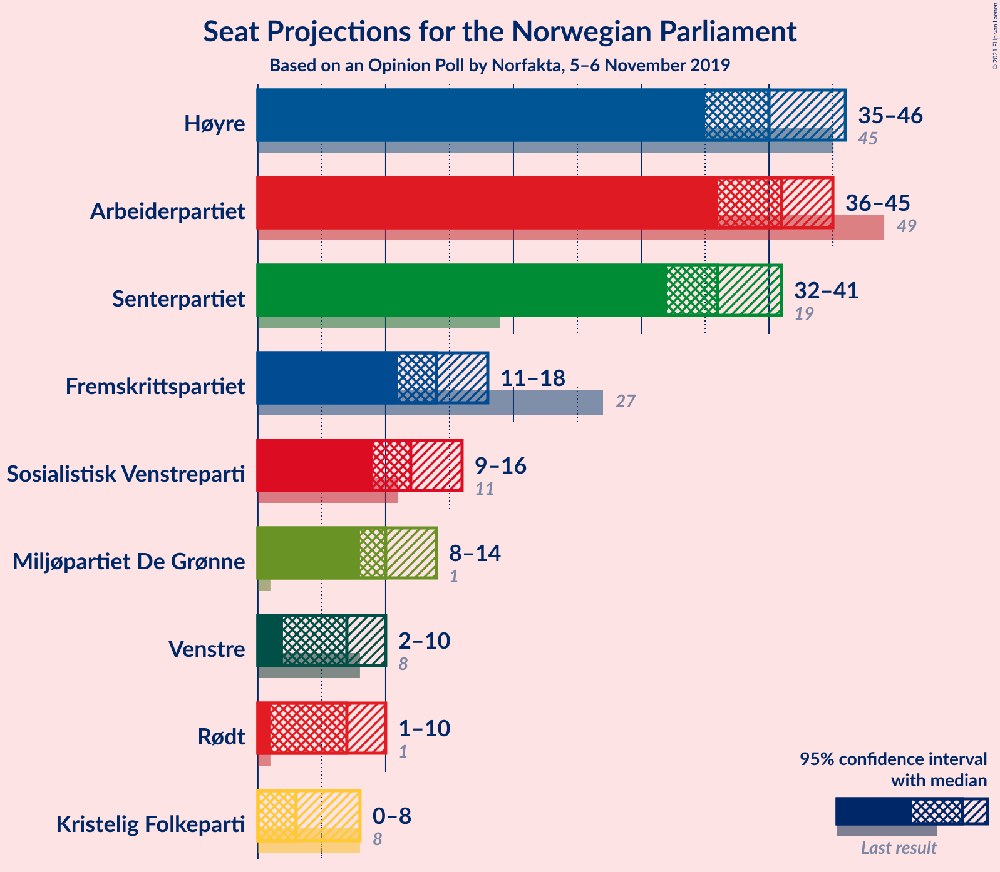
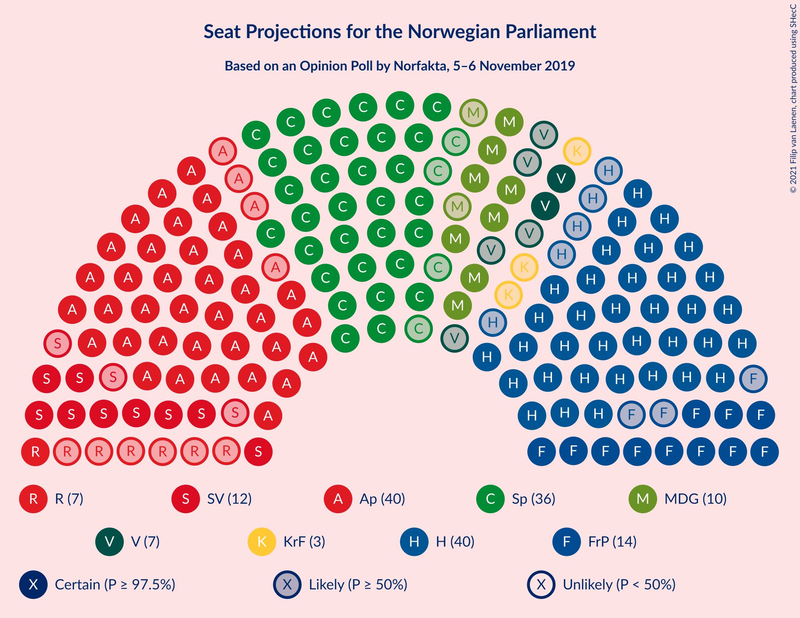
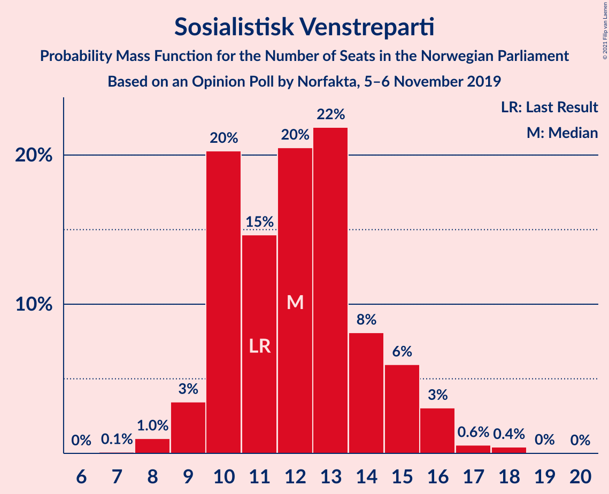
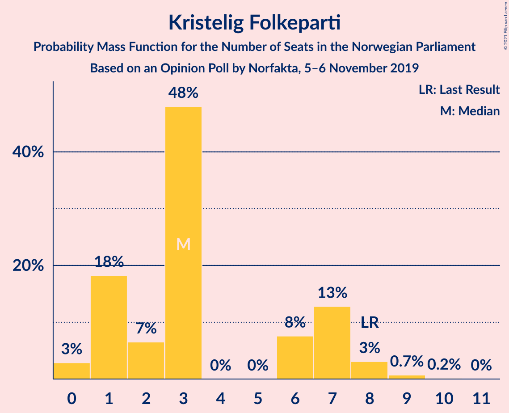
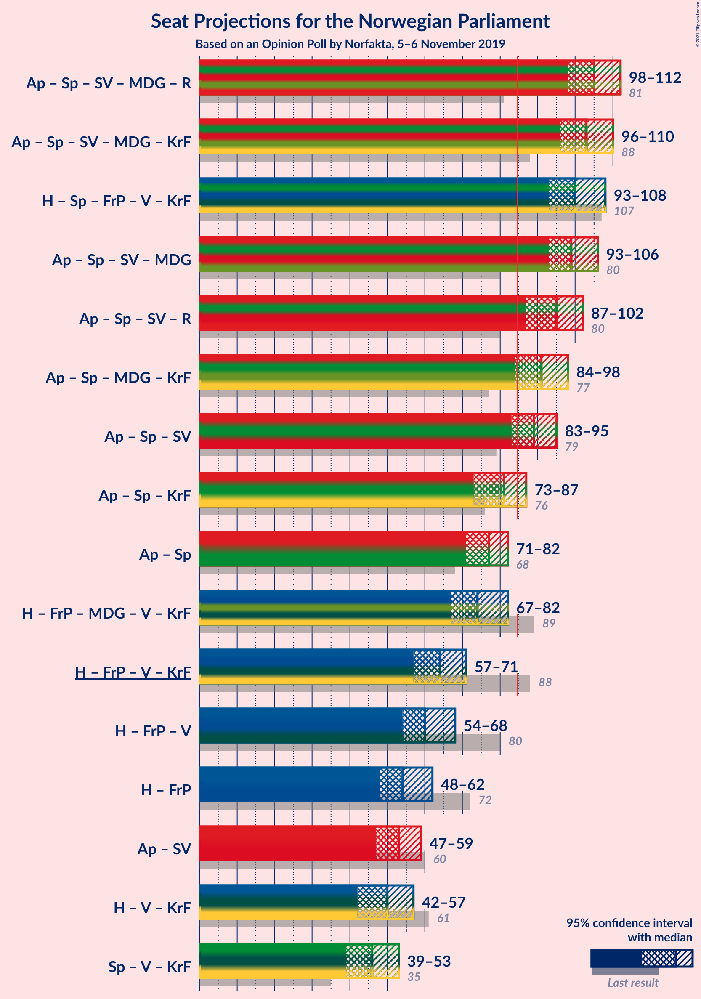
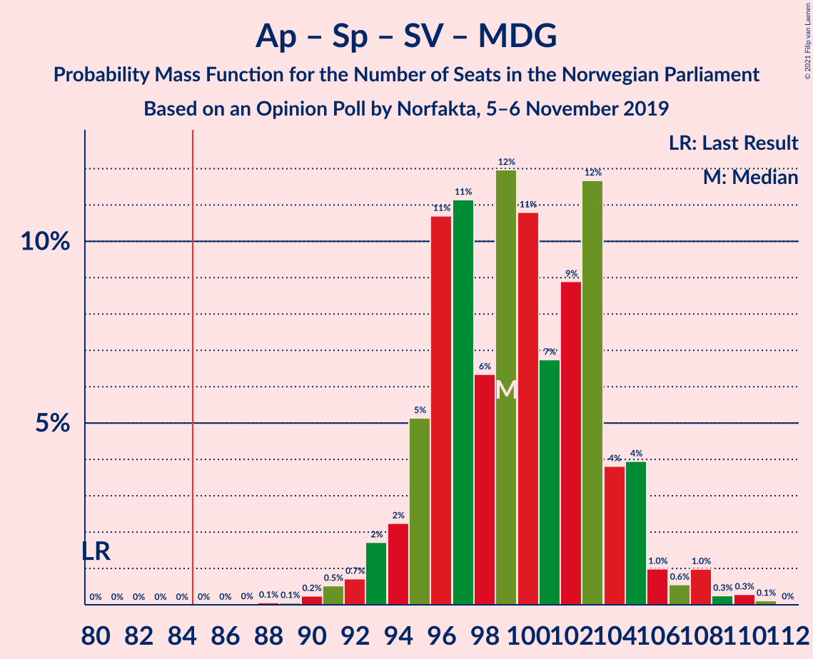
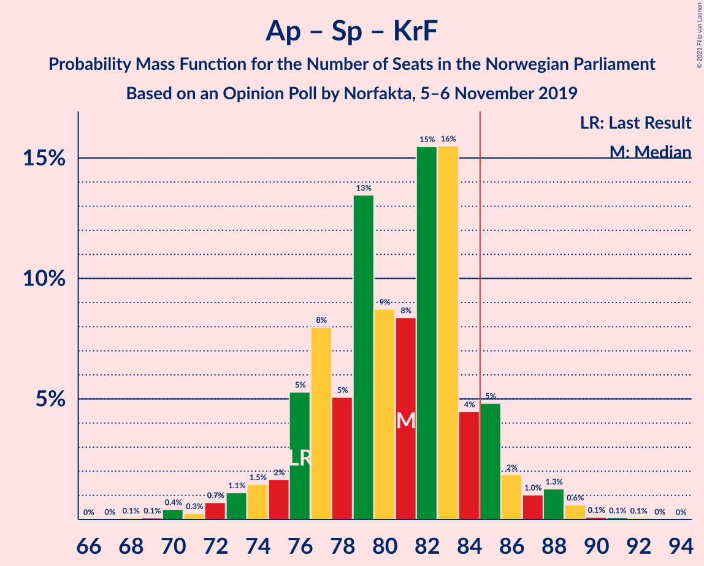
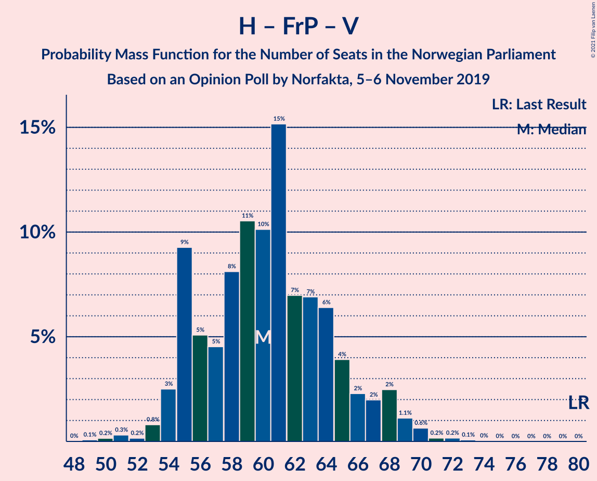
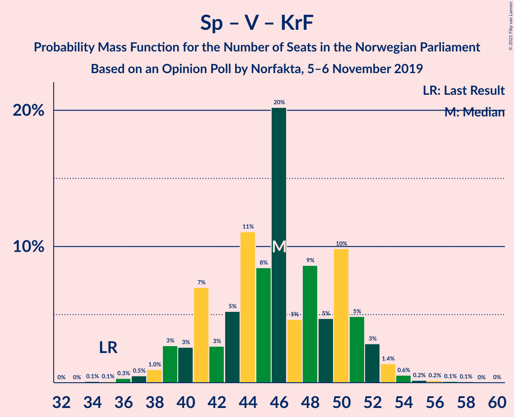

# Opinion Poll by Norfakta, 5–6 November 2019

<a href="#voting-intentions">Voting Intentions</a> | <a href="#seats">Seats</a> | <a href="#coalitions">Coalitions</a> | <a href="#technical-information">Technical Information</a>

## Voting Intentions

### Confidence Intervals

| Party | Last Result | Poll Result | 80% Confidence Interval | 90% Confidence Interval | 95% Confidence Interval | 99% Confidence Interval |
|:-----:|:-----------:|:-----------:|:-----------------------:|:-----------------------:|:-----------------------:|:-----------------------:|
| Høyre | 25.0% | 22.9% | 21.1–24.9% |20.6–25.5% |20.1–26.0% |19.3–27.0% |
| Arbeiderpartiet | 27.4% | 22.3% | 20.5–24.3% |20.0–24.8% |19.5–25.3% |18.7–26.3% |
| Senterpartiet | 10.3% | 19.2% | 17.5–21.1% |17.1–21.7% |16.6–22.1% |15.9–23.1% |
| Fremskrittspartiet | 15.2% | 8.4% | 7.2–9.8% |6.9–10.2% |6.6–10.5% |6.1–11.2% |
| Sosialistisk Venstreparti | 6.0% | 7.1% | 6.0–8.4% |5.7–8.8% |5.5–9.1% |5.0–9.8% |
| Miljøpartiet De Grønne | 3.2% | 6.1% | 5.1–7.3% |4.8–7.7% |4.6–8.0% |4.2–8.6% |
| Venstre | 4.4% | 4.3% | 3.5–5.4% |3.3–5.7% |3.1–6.0% |2.7–6.5% |
| Rødt | 2.4% | 4.2% | 3.4–5.2% |3.2–5.5% |3.0–5.8% |2.7–6.4% |
| Kristelig Folkeparti | 4.2% | 3.4% | 2.7–4.4% |2.5–4.7% |2.4–4.9% |2.1–5.4% |

*Note:* The poll result column reflects the actual value used in the calculations. Published results may vary slightly, and in addition be rounded to fewer digits.

## Seats

### Confidence Intervals

| Party | Last Result | Median | 80% Confidence Interval | 90% Confidence Interval | 95% Confidence Interval | 99% Confidence Interval |
|:-----:|:-----------:|:------:|:-----------------------:|:-----------------------:|:-----------------------:|:-----------------------:|
| <a href="#høyre">Høyre</a> | 45 | 38 | 36–44 |35–46 |34–47 |33–47 |
| <a href="#arbeiderpartiet">Arbeiderpartiet</a> | 49 | 41 | 39–44 |38–44 |36–44 |33–46 |
| <a href="#senterpartiet">Senterpartiet</a> | 19 | 38 | 34–40 |34–41 |32–43 |31–44 |
| <a href="#fremskrittspartiet">Fremskrittspartiet</a> | 27 | 14 | 12–17 |11–17 |10–19 |9–20 |
| <a href="#sosialistisk-venstreparti">Sosialistisk Venstreparti</a> | 11 | 11 | 10–14 |9–15 |9–17 |8–17 |
| <a href="#miljøpartiet-de-grønne">Miljøpartiet De Grønne</a> | 1 | 10 | 9–12 |8–12 |7–13 |7–15 |
| <a href="#venstre">Venstre</a> | 8 | 7 | 2–8 |2–10 |2–10 |2–11 |
| <a href="#rødt">Rødt</a> | 1 | 7 | 2–8 |2–9 |1–9 |1–11 |
| <a href="#kristelig-folkeparti">Kristelig Folkeparti</a> | 8 | 3 | 1–7 |0–7 |0–7 |0–9 |

### Høyre

*For a full overview of the results for this party, see the [Høyre](party-høyre.html) page.*

| Number of Seats | Probability | Accumulated | Special Marks |
|:---------------:|:-----------:|:-----------:|:-------------:|
| 32 | 0.1% | 100% |  |
| 33 | 2% | 99.8% |  |
| 34 | 2% | 98% |  |
| 35 | 5% | 95% |  |
| 36 | 30% | 91% |  |
| 37 | 3% | 61% |  |
| 38 | 13% | 58% | Median |
| 39 | 8% | 46% |  |
| 40 | 5% | 37% |  |
| 41 | 9% | 32% |  |
| 42 | 3% | 23% |  |
| 43 | 10% | 21% |  |
| 44 | 4% | 10% |  |
| 45 | 1.2% | 6% | Last Result |
| 46 | 0.5% | 5% |  |
| 47 | 4% | 5% |  |
| 48 | 0.1% | 0.3% |  |
| 49 | 0.1% | 0.2% |  |
| 50 | 0.1% | 0.1% |  |
| 51 | 0.1% | 0.1% |  |
| 52 | 0% | 0% |  |

### Arbeiderpartiet

*For a full overview of the results for this party, see the [Arbeiderpartiet](party-arbeiderpartiet.html) page.*

| Number of Seats | Probability | Accumulated | Special Marks |
|:---------------:|:-----------:|:-----------:|:-------------:|
| 30 | 0% | 100% |  |
| 31 | 0% | 99.9% |  |
| 32 | 0.2% | 99.9% |  |
| 33 | 0.3% | 99.7% |  |
| 34 | 0.1% | 99.4% |  |
| 35 | 0.5% | 99.3% |  |
| 36 | 2% | 98.8% |  |
| 37 | 0.6% | 97% |  |
| 38 | 2% | 96% |  |
| 39 | 7% | 94% |  |
| 40 | 28% | 87% |  |
| 41 | 11% | 59% | Median |
| 42 | 5% | 48% |  |
| 43 | 6% | 43% |  |
| 44 | 34% | 37% |  |
| 45 | 2% | 2% |  |
| 46 | 0.6% | 0.9% |  |
| 47 | 0.1% | 0.3% |  |
| 48 | 0.1% | 0.2% |  |
| 49 | 0% | 0.1% | Last Result |
| 50 | 0% | 0% |  |

### Senterpartiet

*For a full overview of the results for this party, see the [Senterpartiet](party-senterpartiet.html) page.*

| Number of Seats | Probability | Accumulated | Special Marks |
|:---------------:|:-----------:|:-----------:|:-------------:|
| 19 | 0% | 100% | Last Result |
| 20 | 0% | 100% |  |
| 21 | 0% | 100% |  |
| 22 | 0% | 100% |  |
| 23 | 0% | 100% |  |
| 24 | 0% | 100% |  |
| 25 | 0% | 100% |  |
| 26 | 0% | 100% |  |
| 27 | 0% | 100% |  |
| 28 | 0% | 100% |  |
| 29 | 0% | 100% |  |
| 30 | 0.2% | 99.9% |  |
| 31 | 0.6% | 99.7% |  |
| 32 | 2% | 99.1% |  |
| 33 | 2% | 97% |  |
| 34 | 6% | 95% |  |
| 35 | 3% | 89% |  |
| 36 | 14% | 86% |  |
| 37 | 16% | 72% |  |
| 38 | 40% | 56% | Median |
| 39 | 4% | 16% |  |
| 40 | 7% | 12% |  |
| 41 | 2% | 6% |  |
| 42 | 0.6% | 4% |  |
| 43 | 3% | 4% |  |
| 44 | 0.5% | 0.5% |  |
| 45 | 0% | 0.1% |  |
| 46 | 0% | 0% |  |

### Fremskrittspartiet

*For a full overview of the results for this party, see the [Fremskrittspartiet](party-fremskrittspartiet.html) page.*

| Number of Seats | Probability | Accumulated | Special Marks |
|:---------------:|:-----------:|:-----------:|:-------------:|
| 8 | 0.1% | 100% |  |
| 9 | 0.5% | 99.9% |  |
| 10 | 3% | 99.5% |  |
| 11 | 5% | 97% |  |
| 12 | 7% | 92% |  |
| 13 | 17% | 85% |  |
| 14 | 42% | 68% | Median |
| 15 | 4% | 26% |  |
| 16 | 8% | 21% |  |
| 17 | 9% | 13% |  |
| 18 | 1.1% | 4% |  |
| 19 | 2% | 3% |  |
| 20 | 0.5% | 0.6% |  |
| 21 | 0% | 0.1% |  |
| 22 | 0% | 0% |  |
| 23 | 0% | 0% |  |
| 24 | 0% | 0% |  |
| 25 | 0% | 0% |  |
| 26 | 0% | 0% |  |
| 27 | 0% | 0% | Last Result |

### Sosialistisk Venstreparti

*For a full overview of the results for this party, see the [Sosialistisk Venstreparti](party-sosialistiskvenstreparti.html) page.*

| Number of Seats | Probability | Accumulated | Special Marks |
|:---------------:|:-----------:|:-----------:|:-------------:|
| 7 | 0.3% | 100% |  |
| 8 | 0.8% | 99.7% |  |
| 9 | 4% | 98.9% |  |
| 10 | 32% | 95% |  |
| 11 | 25% | 63% | Last Result, Median |
| 12 | 12% | 38% |  |
| 13 | 11% | 26% |  |
| 14 | 9% | 16% |  |
| 15 | 3% | 7% |  |
| 16 | 0.9% | 3% |  |
| 17 | 2% | 3% |  |
| 18 | 0.2% | 0.2% |  |
| 19 | 0% | 0% |  |

### Miljøpartiet De Grønne

*For a full overview of the results for this party, see the [Miljøpartiet De Grønne](party-miljøpartietdegrønne.html) page.*

| Number of Seats | Probability | Accumulated | Special Marks |
|:---------------:|:-----------:|:-----------:|:-------------:|
| 1 | 0% | 100% | Last Result |
| 2 | 0.1% | 100% |  |
| 3 | 0.3% | 99.9% |  |
| 4 | 0% | 99.6% |  |
| 5 | 0% | 99.6% |  |
| 6 | 0% | 99.6% |  |
| 7 | 2% | 99.6% |  |
| 8 | 6% | 97% |  |
| 9 | 20% | 92% |  |
| 10 | 45% | 72% | Median |
| 11 | 15% | 27% |  |
| 12 | 9% | 12% |  |
| 13 | 2% | 4% |  |
| 14 | 0.9% | 1.5% |  |
| 15 | 0.4% | 0.6% |  |
| 16 | 0.1% | 0.2% |  |
| 17 | 0.1% | 0.1% |  |
| 18 | 0% | 0% |  |

### Venstre

*For a full overview of the results for this party, see the [Venstre](party-venstre.html) page.*

| Number of Seats | Probability | Accumulated | Special Marks |
|:---------------:|:-----------:|:-----------:|:-------------:|
| 1 | 0.1% | 100% |  |
| 2 | 18% | 99.9% |  |
| 3 | 0.1% | 82% |  |
| 4 | 0% | 82% |  |
| 5 | 0% | 82% |  |
| 6 | 1.1% | 82% |  |
| 7 | 48% | 81% | Median |
| 8 | 23% | 33% | Last Result |
| 9 | 4% | 10% |  |
| 10 | 5% | 6% |  |
| 11 | 0.9% | 1.0% |  |
| 12 | 0.1% | 0.1% |  |
| 13 | 0% | 0% |  |

### Rødt

*For a full overview of the results for this party, see the [Rødt](party-rødt.html) page.*

| Number of Seats | Probability | Accumulated | Special Marks |
|:---------------:|:-----------:|:-----------:|:-------------:|
| 1 | 5% | 100% | Last Result |
| 2 | 25% | 95% |  |
| 3 | 0% | 70% |  |
| 4 | 0% | 70% |  |
| 5 | 0% | 70% |  |
| 6 | 6% | 70% |  |
| 7 | 44% | 65% | Median |
| 8 | 15% | 21% |  |
| 9 | 5% | 6% |  |
| 10 | 0.9% | 2% |  |
| 11 | 0.5% | 0.6% |  |
| 12 | 0% | 0% |  |

### Kristelig Folkeparti

*For a full overview of the results for this party, see the [Kristelig Folkeparti](party-kristeligfolkeparti.html) page.*

| Number of Seats | Probability | Accumulated | Special Marks |
|:---------------:|:-----------:|:-----------:|:-------------:|
| 0 | 5% | 100% |  |
| 1 | 18% | 95% |  |
| 2 | 9% | 77% |  |
| 3 | 48% | 67% | Median |
| 4 | 0.1% | 20% |  |
| 5 | 0% | 20% |  |
| 6 | 3% | 20% |  |
| 7 | 15% | 17% |  |
| 8 | 1.1% | 2% | Last Result |
| 9 | 0.7% | 0.9% |  |
| 10 | 0.2% | 0.2% |  |
| 11 | 0% | 0% |  |

## Coalitions

### Confidence Intervals

| Coalition | Last Result | Median | Majority? | 80% Confidence Interval | 90% Confidence Interval | 95% Confidence Interval | 99% Confidence Interval |
|:---------:|:-----------:|:------:|:---------:|:-----------------------:|:-----------------------:|:-----------------------:|:-----------------------:|
| Arbeiderpartiet – Senterpartiet – Sosialistisk Venstreparti – Miljøpartiet De Grønne – Rødt | 81 | 107 | 100% | 101–110 | 100–112 | 98–112 | 96–114 |
| Arbeiderpartiet – Senterpartiet – Sosialistisk Venstreparti – Miljøpartiet De Grønne – Kristelig Folkeparti | 88 | 105 | 100% | 98–108 | 98–109 | 96–110 | 95–113 |
| Høyre – Senterpartiet – Fremskrittspartiet – Venstre – Kristelig Folkeparti | 107 | 99 | 100% | 95–105 | 95–106 | 94–107 | 92–110 |
| Arbeiderpartiet – Senterpartiet – Sosialistisk Venstreparti – Miljøpartiet De Grønne | 80 | 102 | 100% | 96–105 | 95–105 | 93–107 | 90–110 |
| Arbeiderpartiet – Senterpartiet – Sosialistisk Venstreparti – Rødt | 80 | 97 | 99.9% | 91–100 | 89–102 | 88–103 | 86–104 |
| Arbeiderpartiet – Senterpartiet – Miljøpartiet De Grønne – Kristelig Folkeparti | 77 | 93 | 98.6% | 87–96 | 86–97 | 85–98 | 82–101 |
| Arbeiderpartiet – Senterpartiet – Sosialistisk Venstreparti | 79 | 92 | 97% | 87–94 | 85–95 | 84–95 | 81–98 |
| Arbeiderpartiet – Senterpartiet – Kristelig Folkeparti | 76 | 83 | 41% | 77–85 | 77–86 | 76–87 | 72–90 |
| Arbeiderpartiet – Senterpartiet | 68 | 79 | 0.6% | 76–82 | 74–83 | 72–83 | 70–85 |
| Høyre – Fremskrittspartiet – Miljøpartiet De Grønne – Venstre – Kristelig Folkeparti | 89 | 72 | 0.1% | 69–78 | 67–80 | 66–81 | 65–83 |
| Høyre – Fremskrittspartiet – Venstre – Kristelig Folkeparti | 88 | 62 | 0% | 59–68 | 57–69 | 57–71 | 55–73 |
| Høyre – Fremskrittspartiet – Venstre | 80 | 58 | 0% | 55–65 | 55–67 | 54–68 | 51–70 |
| Høyre – Fremskrittspartiet | 72 | 52 | 0% | 50–58 | 49–60 | 47–61 | 46–63 |
| Høyre – Venstre – Kristelig Folkeparti | 61 | 47 | 0% | 45–54 | 43–56 | 42–59 | 40–60 |
| Arbeiderpartiet – Sosialistisk Venstreparti | 60 | 54 | 0% | 50–57 | 49–57 | 48–57 | 45–59 |
| Senterpartiet – Venstre – Kristelig Folkeparti | 35 | 48 | 0% | 43–52 | 41–54 | 40–54 | 39–55 |

### Arbeiderpartiet – Senterpartiet – Sosialistisk Venstreparti – Miljøpartiet De Grønne – Rødt

| Number of Seats | Probability | Accumulated | Special Marks |
|:---------------:|:-----------:|:-----------:|:-------------:|
| 81 | 0% | 100% | Last Result |
| 82 | 0% | 100% |  |
| 83 | 0% | 100% |  |
| 84 | 0% | 100% |  |
| 85 | 0% | 100% | Majority |
| 86 | 0% | 100% |  |
| 87 | 0% | 100% |  |
| 88 | 0% | 100% |  |
| 89 | 0% | 100% |  |
| 90 | 0% | 100% |  |
| 91 | 0% | 100% |  |
| 92 | 0% | 100% |  |
| 93 | 0% | 100% |  |
| 94 | 0.1% | 100% |  |
| 95 | 0.2% | 99.9% |  |
| 96 | 0.4% | 99.7% |  |
| 97 | 0.5% | 99.4% |  |
| 98 | 3% | 98.9% |  |
| 99 | 1.1% | 96% |  |
| 100 | 4% | 95% |  |
| 101 | 4% | 91% |  |
| 102 | 8% | 87% |  |
| 103 | 5% | 79% |  |
| 104 | 6% | 74% |  |
| 105 | 10% | 68% |  |
| 106 | 3% | 58% |  |
| 107 | 7% | 56% | Median |
| 108 | 6% | 48% |  |
| 109 | 30% | 42% |  |
| 110 | 3% | 12% |  |
| 111 | 0.7% | 9% |  |
| 112 | 7% | 9% |  |
| 113 | 0.6% | 1.3% |  |
| 114 | 0.2% | 0.7% |  |
| 115 | 0.4% | 0.5% |  |
| 116 | 0% | 0.1% |  |
| 117 | 0% | 0% |  |

### Arbeiderpartiet – Senterpartiet – Sosialistisk Venstreparti – Miljøpartiet De Grønne – Kristelig Folkeparti

| Number of Seats | Probability | Accumulated | Special Marks |
|:---------------:|:-----------:|:-----------:|:-------------:|
| 88 | 0% | 100% | Last Result |
| 89 | 0% | 100% |  |
| 90 | 0% | 100% |  |
| 91 | 0% | 100% |  |
| 92 | 0% | 99.9% |  |
| 93 | 0.1% | 99.9% |  |
| 94 | 0.2% | 99.8% |  |
| 95 | 1.2% | 99.6% |  |
| 96 | 1.4% | 98% |  |
| 97 | 2% | 97% |  |
| 98 | 9% | 95% |  |
| 99 | 5% | 86% |  |
| 100 | 1.4% | 82% |  |
| 101 | 1.2% | 80% |  |
| 102 | 4% | 79% |  |
| 103 | 14% | 75% | Median |
| 104 | 6% | 61% |  |
| 105 | 34% | 55% |  |
| 106 | 3% | 21% |  |
| 107 | 6% | 18% |  |
| 108 | 6% | 12% |  |
| 109 | 2% | 6% |  |
| 110 | 3% | 4% |  |
| 111 | 0.2% | 1.3% |  |
| 112 | 0.4% | 1.1% |  |
| 113 | 0.5% | 0.7% |  |
| 114 | 0.1% | 0.1% |  |
| 115 | 0% | 0.1% |  |
| 116 | 0% | 0% |  |

### Høyre – Senterpartiet – Fremskrittspartiet – Venstre – Kristelig Folkeparti

| Number of Seats | Probability | Accumulated | Special Marks |
|:---------------:|:-----------:|:-----------:|:-------------:|
| 89 | 0% | 100% |  |
| 90 | 0.3% | 99.9% |  |
| 91 | 0.1% | 99.7% |  |
| 92 | 0.3% | 99.6% |  |
| 93 | 0.7% | 99.3% |  |
| 94 | 2% | 98.6% |  |
| 95 | 7% | 96% |  |
| 96 | 2% | 90% |  |
| 97 | 3% | 87% |  |
| 98 | 34% | 84% |  |
| 99 | 4% | 50% |  |
| 100 | 3% | 46% | Median |
| 101 | 10% | 43% |  |
| 102 | 5% | 33% |  |
| 103 | 3% | 28% |  |
| 104 | 8% | 24% |  |
| 105 | 9% | 17% |  |
| 106 | 3% | 8% |  |
| 107 | 3% | 5% | Last Result |
| 108 | 0.7% | 2% |  |
| 109 | 0.5% | 1.2% |  |
| 110 | 0.2% | 0.7% |  |
| 111 | 0.3% | 0.4% |  |
| 112 | 0% | 0.1% |  |
| 113 | 0% | 0.1% |  |
| 114 | 0% | 0% |  |

### Arbeiderpartiet – Senterpartiet – Sosialistisk Venstreparti – Miljøpartiet De Grønne

| Number of Seats | Probability | Accumulated | Special Marks |
|:---------------:|:-----------:|:-----------:|:-------------:|
| 80 | 0% | 100% | Last Result |
| 81 | 0% | 100% |  |
| 82 | 0% | 100% |  |
| 83 | 0% | 100% |  |
| 84 | 0% | 100% |  |
| 85 | 0% | 100% | Majority |
| 86 | 0% | 100% |  |
| 87 | 0% | 100% |  |
| 88 | 0% | 100% |  |
| 89 | 0.1% | 99.9% |  |
| 90 | 1.2% | 99.9% |  |
| 91 | 0.2% | 98.7% |  |
| 92 | 0.5% | 98.5% |  |
| 93 | 0.5% | 98% |  |
| 94 | 2% | 97% |  |
| 95 | 1.0% | 95% |  |
| 96 | 9% | 94% |  |
| 97 | 8% | 85% |  |
| 98 | 5% | 77% |  |
| 99 | 3% | 72% |  |
| 100 | 9% | 69% | Median |
| 101 | 8% | 60% |  |
| 102 | 31% | 52% |  |
| 103 | 7% | 21% |  |
| 104 | 3% | 14% |  |
| 105 | 6% | 11% |  |
| 106 | 1.3% | 4% |  |
| 107 | 1.3% | 3% |  |
| 108 | 1.2% | 2% |  |
| 109 | 0.1% | 0.6% |  |
| 110 | 0.4% | 0.6% |  |
| 111 | 0.1% | 0.2% |  |
| 112 | 0% | 0% |  |

### Arbeiderpartiet – Senterpartiet – Sosialistisk Venstreparti – Rødt

| Number of Seats | Probability | Accumulated | Special Marks |
|:---------------:|:-----------:|:-----------:|:-------------:|
| 80 | 0% | 100% | Last Result |
| 81 | 0% | 100% |  |
| 82 | 0% | 100% |  |
| 83 | 0% | 100% |  |
| 84 | 0% | 99.9% |  |
| 85 | 0.1% | 99.9% | Majority |
| 86 | 0.6% | 99.8% |  |
| 87 | 0.3% | 99.2% |  |
| 88 | 2% | 98.8% |  |
| 89 | 4% | 97% |  |
| 90 | 2% | 93% |  |
| 91 | 4% | 91% |  |
| 92 | 4% | 87% |  |
| 93 | 8% | 83% |  |
| 94 | 7% | 75% |  |
| 95 | 7% | 69% |  |
| 96 | 9% | 61% |  |
| 97 | 7% | 52% | Median |
| 98 | 4% | 45% |  |
| 99 | 30% | 40% |  |
| 100 | 1.1% | 10% |  |
| 101 | 4% | 9% |  |
| 102 | 2% | 6% |  |
| 103 | 3% | 3% |  |
| 104 | 0.3% | 0.7% |  |
| 105 | 0.3% | 0.4% |  |
| 106 | 0.1% | 0.1% |  |
| 107 | 0% | 0% |  |

### Arbeiderpartiet – Senterpartiet – Miljøpartiet De Grønne – Kristelig Folkeparti

| Number of Seats | Probability | Accumulated | Special Marks |
|:---------------:|:-----------:|:-----------:|:-------------:|
| 77 | 0% | 100% | Last Result |
| 78 | 0% | 100% |  |
| 79 | 0% | 100% |  |
| 80 | 0% | 99.9% |  |
| 81 | 0.1% | 99.9% |  |
| 82 | 0.3% | 99.8% |  |
| 83 | 0.3% | 99.5% |  |
| 84 | 0.6% | 99.2% |  |
| 85 | 3% | 98.6% | Majority |
| 86 | 2% | 96% |  |
| 87 | 10% | 94% |  |
| 88 | 5% | 84% |  |
| 89 | 8% | 80% |  |
| 90 | 2% | 72% |  |
| 91 | 9% | 69% |  |
| 92 | 10% | 60% | Median |
| 93 | 2% | 50% |  |
| 94 | 3% | 48% |  |
| 95 | 31% | 45% |  |
| 96 | 8% | 14% |  |
| 97 | 2% | 6% |  |
| 98 | 3% | 4% |  |
| 99 | 0.4% | 1.4% |  |
| 100 | 0.1% | 1.1% |  |
| 101 | 0.8% | 0.9% |  |
| 102 | 0.1% | 0.1% |  |
| 103 | 0% | 0.1% |  |
| 104 | 0% | 0.1% |  |
| 105 | 0% | 0% |  |

### Arbeiderpartiet – Senterpartiet – Sosialistisk Venstreparti

| Number of Seats | Probability | Accumulated | Special Marks |
|:---------------:|:-----------:|:-----------:|:-------------:|
| 78 | 0% | 100% |  |
| 79 | 0% | 99.9% | Last Result |
| 80 | 0.1% | 99.9% |  |
| 81 | 1.3% | 99.8% |  |
| 82 | 0.2% | 98.5% |  |
| 83 | 0.7% | 98% |  |
| 84 | 1.1% | 98% |  |
| 85 | 2% | 97% | Majority |
| 86 | 2% | 95% |  |
| 87 | 11% | 93% |  |
| 88 | 12% | 81% |  |
| 89 | 5% | 70% |  |
| 90 | 5% | 64% | Median |
| 91 | 8% | 59% |  |
| 92 | 33% | 51% |  |
| 93 | 3% | 19% |  |
| 94 | 7% | 16% |  |
| 95 | 7% | 8% |  |
| 96 | 0.4% | 1.4% |  |
| 97 | 0.4% | 1.0% |  |
| 98 | 0.3% | 0.6% |  |
| 99 | 0.3% | 0.3% |  |
| 100 | 0% | 0% |  |

### Arbeiderpartiet – Senterpartiet – Kristelig Folkeparti

| Number of Seats | Probability | Accumulated | Special Marks |
|:---------------:|:-----------:|:-----------:|:-------------:|
| 69 | 0% | 100% |  |
| 70 | 0.1% | 99.9% |  |
| 71 | 0.3% | 99.9% |  |
| 72 | 0.2% | 99.6% |  |
| 73 | 0.5% | 99.4% |  |
| 74 | 0.3% | 99.0% |  |
| 75 | 0.6% | 98.7% |  |
| 76 | 3% | 98% | Last Result |
| 77 | 6% | 95% |  |
| 78 | 15% | 90% |  |
| 79 | 4% | 75% |  |
| 80 | 2% | 71% |  |
| 81 | 7% | 69% |  |
| 82 | 7% | 62% | Median |
| 83 | 8% | 56% |  |
| 84 | 7% | 48% |  |
| 85 | 31% | 41% | Majority |
| 86 | 6% | 10% |  |
| 87 | 1.4% | 4% |  |
| 88 | 0.9% | 2% |  |
| 89 | 0.8% | 1.4% |  |
| 90 | 0.2% | 0.6% |  |
| 91 | 0.3% | 0.4% |  |
| 92 | 0.1% | 0.1% |  |
| 93 | 0% | 0% |  |

### Arbeiderpartiet – Senterpartiet

| Number of Seats | Probability | Accumulated | Special Marks |
|:---------------:|:-----------:|:-----------:|:-------------:|
| 67 | 0.1% | 100% |  |
| 68 | 0.1% | 99.9% | Last Result |
| 69 | 0.2% | 99.8% |  |
| 70 | 0.5% | 99.6% |  |
| 71 | 0.3% | 99.2% |  |
| 72 | 2% | 98.9% |  |
| 73 | 2% | 97% |  |
| 74 | 0.5% | 95% |  |
| 75 | 4% | 95% |  |
| 76 | 14% | 91% |  |
| 77 | 14% | 77% |  |
| 78 | 12% | 63% |  |
| 79 | 4% | 51% | Median |
| 80 | 5% | 47% |  |
| 81 | 5% | 42% |  |
| 82 | 30% | 37% |  |
| 83 | 5% | 7% |  |
| 84 | 0.8% | 1.4% |  |
| 85 | 0.5% | 0.6% | Majority |
| 86 | 0.1% | 0.2% |  |
| 87 | 0% | 0.1% |  |
| 88 | 0% | 0% |  |

### Høyre – Fremskrittspartiet – Miljøpartiet De Grønne – Venstre – Kristelig Folkeparti

| Number of Seats | Probability | Accumulated | Special Marks |
|:---------------:|:-----------:|:-----------:|:-------------:|
| 63 | 0.1% | 100% |  |
| 64 | 0.3% | 99.9% |  |
| 65 | 0.3% | 99.6% |  |
| 66 | 3% | 99.3% |  |
| 67 | 2% | 97% |  |
| 68 | 4% | 94% |  |
| 69 | 1.1% | 91% |  |
| 70 | 30% | 90% |  |
| 71 | 5% | 60% |  |
| 72 | 7% | 55% | Median |
| 73 | 9% | 48% |  |
| 74 | 7% | 39% |  |
| 75 | 7% | 31% |  |
| 76 | 8% | 25% |  |
| 77 | 4% | 17% |  |
| 78 | 4% | 13% |  |
| 79 | 2% | 9% |  |
| 80 | 4% | 7% |  |
| 81 | 2% | 3% |  |
| 82 | 0.3% | 1.2% |  |
| 83 | 0.6% | 0.8% |  |
| 84 | 0.1% | 0.2% |  |
| 85 | 0% | 0.1% | Majority |
| 86 | 0% | 0.1% |  |
| 87 | 0% | 0% |  |
| 88 | 0% | 0% |  |
| 89 | 0% | 0% | Last Result |

### Høyre – Fremskrittspartiet – Venstre – Kristelig Folkeparti

| Number of Seats | Probability | Accumulated | Special Marks |
|:---------------:|:-----------:|:-----------:|:-------------:|
| 53 | 0% | 100% |  |
| 54 | 0.4% | 99.9% |  |
| 55 | 0.3% | 99.5% |  |
| 56 | 0.6% | 99.3% |  |
| 57 | 7% | 98.6% |  |
| 58 | 0.8% | 91% |  |
| 59 | 3% | 91% |  |
| 60 | 30% | 88% |  |
| 61 | 6% | 58% |  |
| 62 | 7% | 52% | Median |
| 63 | 3% | 44% |  |
| 64 | 10% | 41% |  |
| 65 | 6% | 31% |  |
| 66 | 5% | 26% |  |
| 67 | 8% | 21% |  |
| 68 | 4% | 13% |  |
| 69 | 4% | 9% |  |
| 70 | 1.1% | 5% |  |
| 71 | 3% | 4% |  |
| 72 | 0.5% | 1.1% |  |
| 73 | 0.4% | 0.6% |  |
| 74 | 0.2% | 0.3% |  |
| 75 | 0.1% | 0.1% |  |
| 76 | 0% | 0% |  |
| 77 | 0% | 0% |  |
| 78 | 0% | 0% |  |
| 79 | 0% | 0% |  |
| 80 | 0% | 0% |  |
| 81 | 0% | 0% |  |
| 82 | 0% | 0% |  |
| 83 | 0% | 0% |  |
| 84 | 0% | 0% |  |
| 85 | 0% | 0% | Majority |
| 86 | 0% | 0% |  |
| 87 | 0% | 0% |  |
| 88 | 0% | 0% | Last Result |

### Høyre – Fremskrittspartiet – Venstre

| Number of Seats | Probability | Accumulated | Special Marks |
|:---------------:|:-----------:|:-----------:|:-------------:|
| 49 | 0.3% | 100% |  |
| 50 | 0.1% | 99.7% |  |
| 51 | 0.3% | 99.6% |  |
| 52 | 0.3% | 99.3% |  |
| 53 | 0.4% | 99.0% |  |
| 54 | 3% | 98.6% |  |
| 55 | 9% | 96% |  |
| 56 | 2% | 87% |  |
| 57 | 32% | 85% |  |
| 58 | 7% | 54% |  |
| 59 | 6% | 47% | Median |
| 60 | 8% | 41% |  |
| 61 | 2% | 34% |  |
| 62 | 4% | 32% |  |
| 63 | 6% | 27% |  |
| 64 | 9% | 21% |  |
| 65 | 5% | 12% |  |
| 66 | 1.3% | 7% |  |
| 67 | 1.0% | 6% |  |
| 68 | 3% | 5% |  |
| 69 | 0.4% | 2% |  |
| 70 | 1.3% | 2% |  |
| 71 | 0.1% | 0.2% |  |
| 72 | 0.1% | 0.1% |  |
| 73 | 0% | 0% |  |
| 74 | 0% | 0% |  |
| 75 | 0% | 0% |  |
| 76 | 0% | 0% |  |
| 77 | 0% | 0% |  |
| 78 | 0% | 0% |  |
| 79 | 0% | 0% |  |
| 80 | 0% | 0% | Last Result |

### Høyre – Fremskrittspartiet

| Number of Seats | Probability | Accumulated | Special Marks |
|:---------------:|:-----------:|:-----------:|:-------------:|
| 45 | 0.1% | 100% |  |
| 46 | 0.4% | 99.8% |  |
| 47 | 3% | 99.4% |  |
| 48 | 1.3% | 97% |  |
| 49 | 3% | 96% |  |
| 50 | 29% | 93% |  |
| 51 | 7% | 64% |  |
| 52 | 9% | 56% | Median |
| 53 | 10% | 47% |  |
| 54 | 5% | 37% |  |
| 55 | 3% | 32% |  |
| 56 | 12% | 29% |  |
| 57 | 5% | 17% |  |
| 58 | 4% | 12% |  |
| 59 | 2% | 8% |  |
| 60 | 3% | 6% |  |
| 61 | 2% | 3% |  |
| 62 | 0.5% | 1.2% |  |
| 63 | 0.5% | 0.7% |  |
| 64 | 0.1% | 0.2% |  |
| 65 | 0% | 0.1% |  |
| 66 | 0% | 0.1% |  |
| 67 | 0% | 0% |  |
| 68 | 0% | 0% |  |
| 69 | 0% | 0% |  |
| 70 | 0% | 0% |  |
| 71 | 0% | 0% |  |
| 72 | 0% | 0% | Last Result |

### Høyre – Venstre – Kristelig Folkeparti

| Number of Seats | Probability | Accumulated | Special Marks |
|:---------------:|:-----------:|:-----------:|:-------------:|
| 37 | 0% | 100% |  |
| 38 | 0.1% | 99.9% |  |
| 39 | 0% | 99.8% |  |
| 40 | 0.6% | 99.8% |  |
| 41 | 0.1% | 99.3% |  |
| 42 | 2% | 99.2% |  |
| 43 | 3% | 97% |  |
| 44 | 4% | 95% |  |
| 45 | 7% | 90% |  |
| 46 | 28% | 83% |  |
| 47 | 7% | 54% |  |
| 48 | 3% | 47% | Median |
| 49 | 5% | 44% |  |
| 50 | 8% | 39% |  |
| 51 | 9% | 32% |  |
| 52 | 3% | 23% |  |
| 53 | 9% | 20% |  |
| 54 | 1.3% | 11% |  |
| 55 | 2% | 10% |  |
| 56 | 3% | 7% |  |
| 57 | 0.2% | 4% |  |
| 58 | 1.1% | 4% |  |
| 59 | 2% | 3% |  |
| 60 | 1.2% | 1.4% |  |
| 61 | 0.2% | 0.2% | Last Result |
| 62 | 0% | 0% |  |

### Arbeiderpartiet – Sosialistisk Venstreparti

| Number of Seats | Probability | Accumulated | Special Marks |
|:---------------:|:-----------:|:-----------:|:-------------:|
| 41 | 0% | 100% |  |
| 42 | 0% | 99.9% |  |
| 43 | 0.1% | 99.9% |  |
| 44 | 0.3% | 99.8% |  |
| 45 | 1.2% | 99.5% |  |
| 46 | 0.3% | 98% |  |
| 47 | 0.3% | 98% |  |
| 48 | 1.4% | 98% |  |
| 49 | 2% | 96% |  |
| 50 | 8% | 94% |  |
| 51 | 10% | 86% |  |
| 52 | 14% | 76% | Median |
| 53 | 7% | 62% |  |
| 54 | 35% | 55% |  |
| 55 | 7% | 20% |  |
| 56 | 3% | 13% |  |
| 57 | 8% | 10% |  |
| 58 | 1.3% | 2% |  |
| 59 | 0.8% | 1.2% |  |
| 60 | 0.3% | 0.3% | Last Result |
| 61 | 0% | 0.1% |  |
| 62 | 0% | 0% |  |

### Senterpartiet – Venstre – Kristelig Folkeparti

| Number of Seats | Probability | Accumulated | Special Marks |
|:---------------:|:-----------:|:-----------:|:-------------:|
| 34 | 0% | 100% |  |
| 35 | 0% | 99.9% | Last Result |
| 36 | 0.1% | 99.9% |  |
| 37 | 0% | 99.8% |  |
| 38 | 0.3% | 99.8% |  |
| 39 | 0.9% | 99.5% |  |
| 40 | 1.3% | 98.6% |  |
| 41 | 3% | 97% |  |
| 42 | 0.8% | 94% |  |
| 43 | 6% | 94% |  |
| 44 | 11% | 88% |  |
| 45 | 13% | 77% |  |
| 46 | 5% | 64% |  |
| 47 | 2% | 59% |  |
| 48 | 35% | 57% | Median |
| 49 | 3% | 22% |  |
| 50 | 3% | 19% |  |
| 51 | 2% | 16% |  |
| 52 | 6% | 14% |  |
| 53 | 2% | 8% |  |
| 54 | 4% | 6% |  |
| 55 | 1.1% | 1.5% |  |
| 56 | 0.2% | 0.3% |  |
| 57 | 0% | 0.1% |  |
| 58 | 0% | 0.1% |  |
| 59 | 0% | 0% |  |

## Technical Information

### Opinion Poll

+ **Polling firm:** Norfakta
+ **Commissioner(s):** —
+ **Fieldwork period:** 5–6 November 2019

### Calculations

+ **Sample size:** 790
+ **Simulations done:** 131,072
+ **Error estimate:** 3.06%

