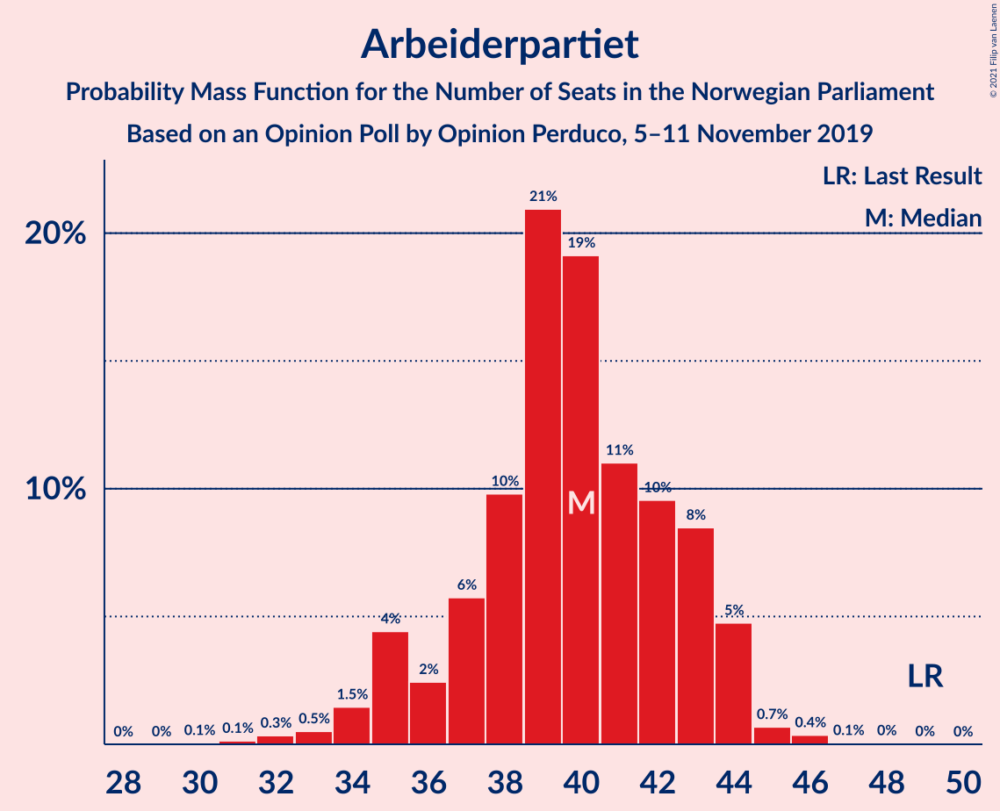
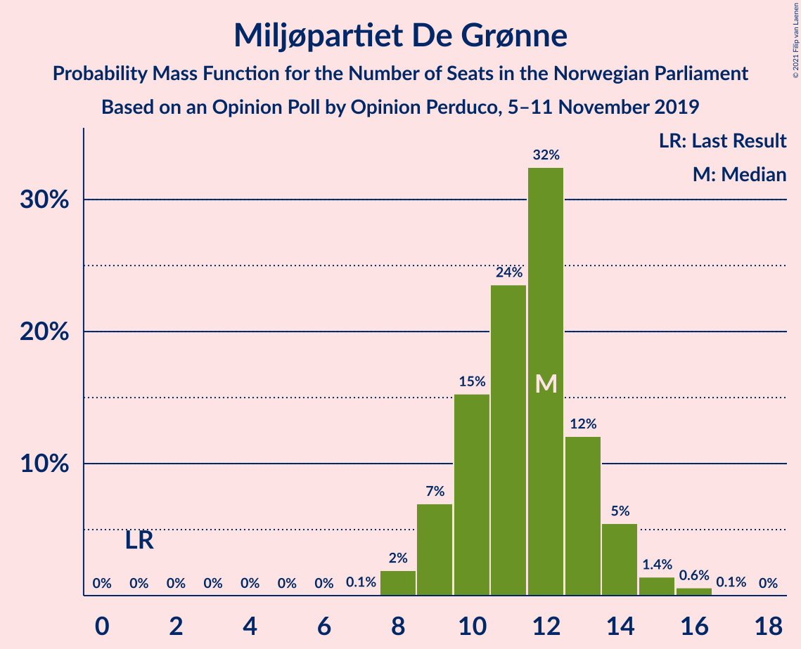
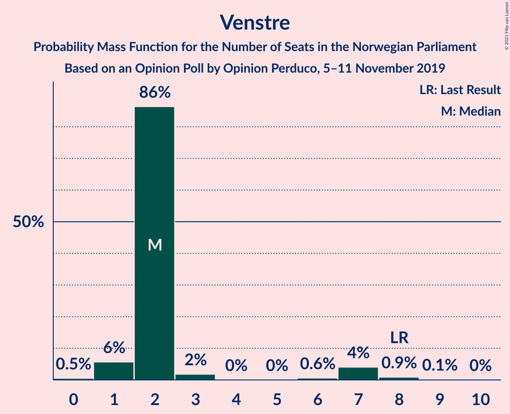
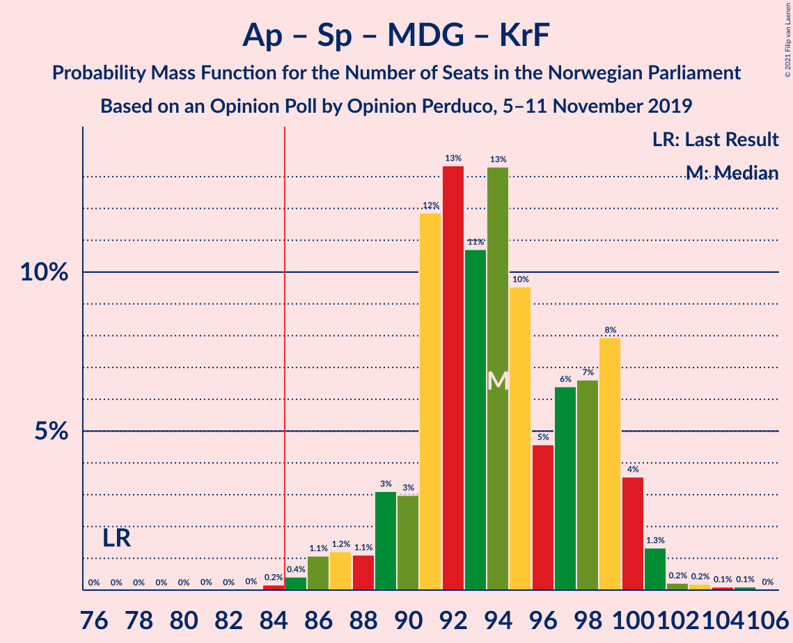
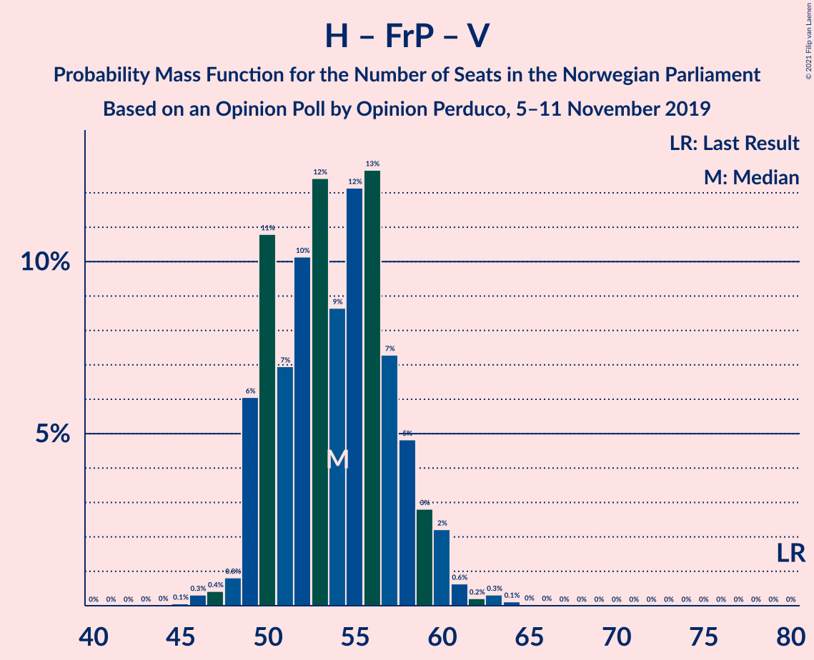
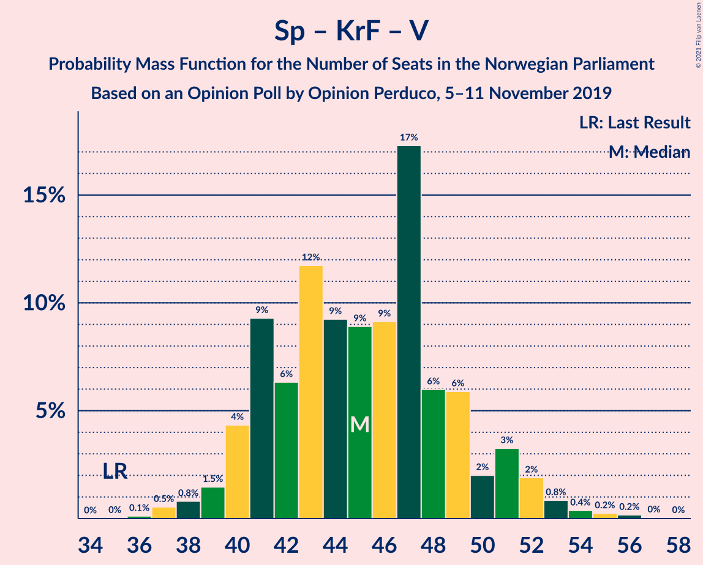

# Opinion Poll by Opinion Perduco, 5–11 November 2019

<a href="#voting-intentions">Voting Intentions</a> | <a href="#seats">Seats</a> | <a href="#coalitions">Coalitions</a> | <a href="#technical-information">Technical Information</a>

## Voting Intentions

### Confidence Intervals

| Party | Last Result | Poll Result | 80% Confidence Interval | 90% Confidence Interval | 95% Confidence Interval | 99% Confidence Interval |
|:-----:|:-----------:|:-----------:|:-----------------------:|:-----------------------:|:-----------------------:|:-----------------------:|
| Arbeiderpartiet | 27.4% | 21.7% | 20.0–23.5% |19.6–24.0% |19.2–24.4% |18.4–25.3% |
| Senterpartiet | 10.3% | 20.9% | 19.2–22.6% |18.8–23.1% |18.4–23.5% |17.6–24.4% |
| Høyre | 25.0% | 20.6% | 19.0–22.4% |18.6–22.9% |18.2–23.3% |17.5–24.2% |
| Fremskrittspartiet | 15.2% | 8.9% | 7.8–10.2% |7.5–10.6% |7.3–10.9% |6.8–11.5% |
| Sosialistisk Venstreparti | 6.0% | 8.4% | 7.3–9.7% |7.1–10.0% |6.8–10.3% |6.3–11.0% |
| Miljøpartiet De Grønne | 3.2% | 6.5% | 5.6–7.7% |5.3–8.0% |5.1–8.3% |4.7–8.9% |
| Rødt | 2.4% | 4.4% | 3.6–5.3% |3.4–5.6% |3.2–5.8% |2.9–6.3% |
| Kristelig Folkeparti | 4.2% | 3.8% | 3.2–4.8% |3.0–5.0% |2.8–5.3% |2.5–5.7% |
| Venstre | 4.4% | 3.0% | 2.4–3.8% |2.2–4.1% |2.1–4.3% |1.8–4.7% |

*Note:* The poll result column reflects the actual value used in the calculations. Published results may vary slightly, and in addition be rounded to fewer digits.

## Seats

### Confidence Intervals

| Party | Last Result | Median | 80% Confidence Interval | 90% Confidence Interval | 95% Confidence Interval | 99% Confidence Interval |
|:-----:|:-----------:|:------:|:-----------------------:|:-----------------------:|:-----------------------:|:-----------------------:|
| <a href="#arbeiderpartiet">Arbeiderpartiet</a> | 49 | 40 | 35–43 |35–43 |35–44 |32–44 |
| <a href="#senterpartiet">Senterpartiet</a> | 19 | 39 | 35–42 |35–42 |35–43 |33–45 |
| <a href="#høyre">Høyre</a> | 45 | 36 | 34–38 |32–41 |30–42 |30–42 |
| <a href="#fremskrittspartiet">Fremskrittspartiet</a> | 27 | 17 | 13–18 |13–18 |12–18 |12–19 |
| <a href="#sosialistisk-venstreparti">Sosialistisk Venstreparti</a> | 11 | 15 | 13–16 |13–18 |12–18 |11–19 |
| <a href="#miljøpartiet-de-grønne">Miljøpartiet De Grønne</a> | 1 | 11 | 10–13 |8–16 |8–16 |8–16 |
| <a href="#rødt">Rødt</a> | 1 | 7 | 2–9 |2–9 |2–10 |1–10 |
| <a href="#kristelig-folkeparti">Kristelig Folkeparti</a> | 8 | 3 | 3–7 |1–8 |1–8 |0–9 |
| <a href="#venstre">Venstre</a> | 8 | 2 | 1–2 |1–2 |1–7 |1–8 |

### Arbeiderpartiet

*For a full overview of the results for this party, see the [Arbeiderpartiet](party-arbeiderpartiet.html) page.*

| Number of Seats | Probability | Accumulated | Special Marks |
|:---------------:|:-----------:|:-----------:|:-------------:|
| 31 | 0.2% | 100% |  |
| 32 | 0.5% | 99.8% |  |
| 33 | 0.3% | 99.3% |  |
| 34 | 0.6% | 99.1% |  |
| 35 | 33% | 98% |  |
| 36 | 0.9% | 65% |  |
| 37 | 2% | 64% |  |
| 38 | 7% | 63% |  |
| 39 | 4% | 56% |  |
| 40 | 8% | 52% | Median |
| 41 | 16% | 45% |  |
| 42 | 16% | 29% |  |
| 43 | 9% | 14% |  |
| 44 | 4% | 4% |  |
| 45 | 0.3% | 0.4% |  |
| 46 | 0.1% | 0.2% |  |
| 47 | 0% | 0% |  |
| 48 | 0% | 0% |  |
| 49 | 0% | 0% | Last Result |

### Senterpartiet

*For a full overview of the results for this party, see the [Senterpartiet](party-senterpartiet.html) page.*

| Number of Seats | Probability | Accumulated | Special Marks |
|:---------------:|:-----------:|:-----------:|:-------------:|
| 19 | 0% | 100% | Last Result |
| 20 | 0% | 100% |  |
| 21 | 0% | 100% |  |
| 22 | 0% | 100% |  |
| 23 | 0% | 100% |  |
| 24 | 0% | 100% |  |
| 25 | 0% | 100% |  |
| 26 | 0% | 100% |  |
| 27 | 0% | 100% |  |
| 28 | 0% | 100% |  |
| 29 | 0% | 100% |  |
| 30 | 0% | 100% |  |
| 31 | 0.1% | 100% |  |
| 32 | 0.3% | 99.9% |  |
| 33 | 0.1% | 99.6% |  |
| 34 | 0.6% | 99.4% |  |
| 35 | 17% | 98.8% |  |
| 36 | 15% | 81% |  |
| 37 | 6% | 66% |  |
| 38 | 9% | 60% |  |
| 39 | 14% | 52% | Median |
| 40 | 1.3% | 37% |  |
| 41 | 1.3% | 36% |  |
| 42 | 32% | 35% |  |
| 43 | 2% | 3% |  |
| 44 | 0.5% | 1.2% |  |
| 45 | 0.7% | 0.8% |  |
| 46 | 0% | 0.1% |  |
| 47 | 0% | 0% |  |

### Høyre

*For a full overview of the results for this party, see the [Høyre](party-høyre.html) page.*

| Number of Seats | Probability | Accumulated | Special Marks |
|:---------------:|:-----------:|:-----------:|:-------------:|
| 29 | 0.1% | 100% |  |
| 30 | 3% | 99.9% |  |
| 31 | 0.6% | 97% |  |
| 32 | 3% | 96% |  |
| 33 | 3% | 93% |  |
| 34 | 7% | 90% |  |
| 35 | 30% | 83% |  |
| 36 | 11% | 54% | Median |
| 37 | 32% | 43% |  |
| 38 | 2% | 11% |  |
| 39 | 3% | 10% |  |
| 40 | 0.9% | 7% |  |
| 41 | 1.4% | 6% |  |
| 42 | 4% | 5% |  |
| 43 | 0.1% | 0.2% |  |
| 44 | 0.1% | 0.1% |  |
| 45 | 0% | 0% | Last Result |

### Fremskrittspartiet

*For a full overview of the results for this party, see the [Fremskrittspartiet](party-fremskrittspartiet.html) page.*

| Number of Seats | Probability | Accumulated | Special Marks |
|:---------------:|:-----------:|:-----------:|:-------------:|
| 10 | 0.2% | 100% |  |
| 11 | 0.3% | 99.8% |  |
| 12 | 3% | 99.5% |  |
| 13 | 9% | 97% |  |
| 14 | 7% | 88% |  |
| 15 | 10% | 81% |  |
| 16 | 17% | 71% |  |
| 17 | 5% | 54% | Median |
| 18 | 47% | 49% |  |
| 19 | 1.1% | 1.5% |  |
| 20 | 0.2% | 0.3% |  |
| 21 | 0.1% | 0.2% |  |
| 22 | 0% | 0% |  |
| 23 | 0% | 0% |  |
| 24 | 0% | 0% |  |
| 25 | 0% | 0% |  |
| 26 | 0% | 0% |  |
| 27 | 0% | 0% | Last Result |

### Sosialistisk Venstreparti

*For a full overview of the results for this party, see the [Sosialistisk Venstreparti](party-sosialistiskvenstreparti.html) page.*

| Number of Seats | Probability | Accumulated | Special Marks |
|:---------------:|:-----------:|:-----------:|:-------------:|
| 10 | 0.2% | 100% |  |
| 11 | 1.2% | 99.8% | Last Result |
| 12 | 3% | 98.6% |  |
| 13 | 12% | 96% |  |
| 14 | 33% | 84% |  |
| 15 | 35% | 51% | Median |
| 16 | 7% | 16% |  |
| 17 | 3% | 9% |  |
| 18 | 5% | 6% |  |
| 19 | 1.1% | 1.2% |  |
| 20 | 0.1% | 0.1% |  |
| 21 | 0% | 0% |  |

### Miljøpartiet De Grønne

*For a full overview of the results for this party, see the [Miljøpartiet De Grønne](party-miljøpartietdegrønne.html) page.*

| Number of Seats | Probability | Accumulated | Special Marks |
|:---------------:|:-----------:|:-----------:|:-------------:|
| 1 | 0% | 100% | Last Result |
| 2 | 0% | 100% |  |
| 3 | 0% | 100% |  |
| 4 | 0% | 100% |  |
| 5 | 0% | 100% |  |
| 6 | 0% | 100% |  |
| 7 | 0.1% | 100% |  |
| 8 | 6% | 99.9% |  |
| 9 | 3% | 94% |  |
| 10 | 4% | 91% |  |
| 11 | 64% | 87% | Median |
| 12 | 7% | 22% |  |
| 13 | 7% | 15% |  |
| 14 | 1.2% | 8% |  |
| 15 | 0.7% | 7% |  |
| 16 | 6% | 6% |  |
| 17 | 0.1% | 0.1% |  |
| 18 | 0% | 0% |  |

### Rødt

*For a full overview of the results for this party, see the [Rødt](party-rødt.html) page.*

| Number of Seats | Probability | Accumulated | Special Marks |
|:---------------:|:-----------:|:-----------:|:-------------:|
| 1 | 2% | 100% | Last Result |
| 2 | 15% | 98% |  |
| 3 | 0% | 84% |  |
| 4 | 0% | 84% |  |
| 5 | 0% | 84% |  |
| 6 | 0.5% | 84% |  |
| 7 | 40% | 83% | Median |
| 8 | 21% | 43% |  |
| 9 | 18% | 22% |  |
| 10 | 4% | 4% |  |
| 11 | 0.3% | 0.3% |  |
| 12 | 0% | 0% |  |

### Kristelig Folkeparti

*For a full overview of the results for this party, see the [Kristelig Folkeparti](party-kristeligfolkeparti.html) page.*

| Number of Seats | Probability | Accumulated | Special Marks |
|:---------------:|:-----------:|:-----------:|:-------------:|
| 0 | 1.5% | 100% |  |
| 1 | 6% | 98.5% |  |
| 2 | 2% | 93% |  |
| 3 | 60% | 91% | Median |
| 4 | 0% | 31% |  |
| 5 | 0% | 31% |  |
| 6 | 0.4% | 31% |  |
| 7 | 23% | 31% |  |
| 8 | 6% | 8% | Last Result |
| 9 | 1.0% | 1.5% |  |
| 10 | 0.4% | 0.5% |  |
| 11 | 0% | 0% |  |

### Venstre

*For a full overview of the results for this party, see the [Venstre](party-venstre.html) page.*

| Number of Seats | Probability | Accumulated | Special Marks |
|:---------------:|:-----------:|:-----------:|:-------------:|
| 0 | 0.1% | 100% |  |
| 1 | 11% | 99.9% |  |
| 2 | 85% | 89% | Median |
| 3 | 0.2% | 4% |  |
| 4 | 0% | 4% |  |
| 5 | 0% | 4% |  |
| 6 | 0.3% | 4% |  |
| 7 | 1.4% | 3% |  |
| 8 | 2% | 2% | Last Result |
| 9 | 0.3% | 0.3% |  |
| 10 | 0% | 0% |  |

## Coalitions

### Confidence Intervals

| Coalition | Last Result | Median | Majority? | 80% Confidence Interval | 90% Confidence Interval | 95% Confidence Interval | 99% Confidence Interval |
|:---------:|:-----------:|:------:|:---------:|:-----------------------:|:-----------------------:|:-----------------------:|:-----------------------:|
| Arbeiderpartiet – Senterpartiet – Sosialistisk Venstreparti – Miljøpartiet De Grønne – Rødt | 81 | 111 | 100% | 108–112 | 107–114 | 106–116 | 103–117 |
| Arbeiderpartiet – Senterpartiet – Sosialistisk Venstreparti – Miljøpartiet De Grønne – Kristelig Folkeparti | 88 | 106 | 100% | 105–113 | 105–113 | 103–113 | 101–116 |
| Arbeiderpartiet – Senterpartiet – Sosialistisk Venstreparti – Miljøpartiet De Grønne | 80 | 103 | 100% | 102–107 | 101–110 | 100–110 | 97–111 |
| Arbeiderpartiet – Senterpartiet – Sosialistisk Venstreparti – Rødt | 80 | 98 | 100% | 96–103 | 96–103 | 95–105 | 91–108 |
| Senterpartiet – Høyre – Fremskrittspartiet – Kristelig Folkeparti – Venstre | 107 | 97 | 100% | 93–102 | 93–102 | 92–102 | 89–106 |
| Arbeiderpartiet – Senterpartiet – Miljøpartiet De Grønne – Kristelig Folkeparti | 77 | 91 | 99.8% | 91–98 | 90–98 | 88–99 | 87–102 |
| Arbeiderpartiet – Senterpartiet – Sosialistisk Venstreparti | 79 | 92 | 99.8% | 90–96 | 89–96 | 88–98 | 85–99 |
| Arbeiderpartiet – Senterpartiet – Kristelig Folkeparti | 76 | 80 | 21% | 80–87 | 78–87 | 77–87 | 75–90 |
| Arbeiderpartiet – Senterpartiet | 68 | 77 | 0.5% | 76–80 | 75–81 | 74–82 | 72–85 |
| Arbeiderpartiet – Sosialistisk Venstreparti – Miljøpartiet De Grønne – Rødt | 62 | 72 | 0% | 67–76 | 67–76 | 67–77 | 63–80 |
| Høyre – Fremskrittspartiet – Miljøpartiet De Grønne – Kristelig Folkeparti – Venstre | 89 | 71 | 0% | 66–73 | 66–73 | 64–74 | 61–78 |
| Høyre – Fremskrittspartiet – Kristelig Folkeparti – Venstre | 88 | 58 | 0% | 57–61 | 55–62 | 53–63 | 52–66 |
| Høyre – Fremskrittspartiet – Venstre | 80 | 55 | 0% | 50–57 | 49–58 | 47–61 | 47–61 |
| Høyre – Fremskrittspartiet | 72 | 53 | 0% | 48–55 | 47–56 | 46–59 | 45–59 |
| Arbeiderpartiet – Sosialistisk Venstreparti | 60 | 55 | 0% | 49–57 | 49–58 | 49–58 | 47–60 |
| Senterpartiet – Kristelig Folkeparti – Venstre | 35 | 47 | 0% | 40–48 | 40–48 | 39–50 | 38–54 |
| Høyre – Kristelig Folkeparti – Venstre | 61 | 42 | 0% | 40–45 | 39–46 | 38–47 | 37–51 |

### Arbeiderpartiet – Senterpartiet – Sosialistisk Venstreparti – Miljøpartiet De Grønne – Rødt

| Number of Seats | Probability | Accumulated | Special Marks |
|:---------------:|:-----------:|:-----------:|:-------------:|
| 81 | 0% | 100% | Last Result |
| 82 | 0% | 100% |  |
| 83 | 0% | 100% |  |
| 84 | 0% | 100% |  |
| 85 | 0% | 100% | Majority |
| 86 | 0% | 100% |  |
| 87 | 0% | 100% |  |
| 88 | 0% | 100% |  |
| 89 | 0% | 100% |  |
| 90 | 0% | 100% |  |
| 91 | 0% | 100% |  |
| 92 | 0% | 100% |  |
| 93 | 0% | 100% |  |
| 94 | 0% | 100% |  |
| 95 | 0% | 100% |  |
| 96 | 0% | 100% |  |
| 97 | 0% | 100% |  |
| 98 | 0% | 100% |  |
| 99 | 0% | 100% |  |
| 100 | 0% | 100% |  |
| 101 | 0.1% | 100% |  |
| 102 | 0.2% | 99.8% |  |
| 103 | 0.4% | 99.7% |  |
| 104 | 0.2% | 99.3% |  |
| 105 | 1.3% | 99.1% |  |
| 106 | 0.4% | 98% |  |
| 107 | 4% | 97% |  |
| 108 | 4% | 93% |  |
| 109 | 32% | 89% |  |
| 110 | 6% | 57% |  |
| 111 | 22% | 51% |  |
| 112 | 19% | 29% | Median |
| 113 | 1.0% | 9% |  |
| 114 | 4% | 8% |  |
| 115 | 2% | 5% |  |
| 116 | 0.9% | 3% |  |
| 117 | 1.5% | 2% |  |
| 118 | 0.3% | 0.4% |  |
| 119 | 0% | 0.2% |  |
| 120 | 0% | 0.1% |  |
| 121 | 0.1% | 0.1% |  |
| 122 | 0% | 0% |  |

### Arbeiderpartiet – Senterpartiet – Sosialistisk Venstreparti – Miljøpartiet De Grønne – Kristelig Folkeparti

| Number of Seats | Probability | Accumulated | Special Marks |
|:---------------:|:-----------:|:-----------:|:-------------:|
| 88 | 0% | 100% | Last Result |
| 89 | 0% | 100% |  |
| 90 | 0% | 100% |  |
| 91 | 0% | 100% |  |
| 92 | 0% | 100% |  |
| 93 | 0% | 100% |  |
| 94 | 0% | 100% |  |
| 95 | 0% | 100% |  |
| 96 | 0% | 100% |  |
| 97 | 0% | 100% |  |
| 98 | 0% | 100% |  |
| 99 | 0.1% | 100% |  |
| 100 | 0.1% | 99.8% |  |
| 101 | 0.2% | 99.7% |  |
| 102 | 0.4% | 99.5% |  |
| 103 | 3% | 99.1% |  |
| 104 | 0.7% | 96% |  |
| 105 | 32% | 96% |  |
| 106 | 19% | 64% |  |
| 107 | 4% | 45% |  |
| 108 | 3% | 42% | Median |
| 109 | 4% | 38% |  |
| 110 | 11% | 34% |  |
| 111 | 7% | 23% |  |
| 112 | 4% | 16% |  |
| 113 | 10% | 12% |  |
| 114 | 0.8% | 2% |  |
| 115 | 0.3% | 1.2% |  |
| 116 | 0.6% | 1.0% |  |
| 117 | 0.2% | 0.4% |  |
| 118 | 0.1% | 0.2% |  |
| 119 | 0% | 0.1% |  |
| 120 | 0.1% | 0.1% |  |
| 121 | 0% | 0% |  |

### Arbeiderpartiet – Senterpartiet – Sosialistisk Venstreparti – Miljøpartiet De Grønne

| Number of Seats | Probability | Accumulated | Special Marks |
|:---------------:|:-----------:|:-----------:|:-------------:|
| 80 | 0% | 100% | Last Result |
| 81 | 0% | 100% |  |
| 82 | 0% | 100% |  |
| 83 | 0% | 100% |  |
| 84 | 0% | 100% |  |
| 85 | 0% | 100% | Majority |
| 86 | 0% | 100% |  |
| 87 | 0% | 100% |  |
| 88 | 0% | 100% |  |
| 89 | 0% | 100% |  |
| 90 | 0% | 100% |  |
| 91 | 0% | 100% |  |
| 92 | 0% | 100% |  |
| 93 | 0% | 100% |  |
| 94 | 0.1% | 100% |  |
| 95 | 0% | 99.8% |  |
| 96 | 0.2% | 99.8% |  |
| 97 | 0.5% | 99.6% |  |
| 98 | 0.2% | 99.2% |  |
| 99 | 1.4% | 99.0% |  |
| 100 | 2% | 98% |  |
| 101 | 4% | 96% |  |
| 102 | 33% | 91% |  |
| 103 | 27% | 58% |  |
| 104 | 6% | 32% |  |
| 105 | 10% | 26% | Median |
| 106 | 3% | 16% |  |
| 107 | 3% | 13% |  |
| 108 | 2% | 10% |  |
| 109 | 1.1% | 8% |  |
| 110 | 6% | 7% |  |
| 111 | 0.6% | 0.9% |  |
| 112 | 0.1% | 0.4% |  |
| 113 | 0.1% | 0.3% |  |
| 114 | 0.1% | 0.1% |  |
| 115 | 0% | 0% |  |

### Arbeiderpartiet – Senterpartiet – Sosialistisk Venstreparti – Rødt

| Number of Seats | Probability | Accumulated | Special Marks |
|:---------------:|:-----------:|:-----------:|:-------------:|
| 80 | 0% | 100% | Last Result |
| 81 | 0% | 100% |  |
| 82 | 0% | 100% |  |
| 83 | 0% | 100% |  |
| 84 | 0% | 100% |  |
| 85 | 0% | 100% | Majority |
| 86 | 0% | 100% |  |
| 87 | 0.1% | 100% |  |
| 88 | 0% | 99.9% |  |
| 89 | 0.1% | 99.9% |  |
| 90 | 0.1% | 99.7% |  |
| 91 | 0.2% | 99.6% |  |
| 92 | 0.2% | 99.5% |  |
| 93 | 0.4% | 99.2% |  |
| 94 | 0.7% | 98.9% |  |
| 95 | 2% | 98% |  |
| 96 | 9% | 96% |  |
| 97 | 6% | 87% |  |
| 98 | 35% | 81% |  |
| 99 | 4% | 46% |  |
| 100 | 18% | 42% |  |
| 101 | 10% | 24% | Median |
| 102 | 0.8% | 14% |  |
| 103 | 9% | 13% |  |
| 104 | 0.9% | 4% |  |
| 105 | 2% | 3% |  |
| 106 | 0.1% | 2% |  |
| 107 | 0.1% | 2% |  |
| 108 | 1.4% | 2% |  |
| 109 | 0.1% | 0.2% |  |
| 110 | 0% | 0% |  |

### Senterpartiet – Høyre – Fremskrittspartiet – Kristelig Folkeparti – Venstre

| Number of Seats | Probability | Accumulated | Special Marks |
|:---------------:|:-----------:|:-----------:|:-------------:|
| 87 | 0.3% | 100% |  |
| 88 | 0.1% | 99.7% |  |
| 89 | 0.2% | 99.6% |  |
| 90 | 0.1% | 99.4% |  |
| 91 | 0.2% | 99.3% |  |
| 92 | 2% | 99.1% |  |
| 93 | 26% | 97% |  |
| 94 | 6% | 71% |  |
| 95 | 10% | 65% |  |
| 96 | 2% | 55% |  |
| 97 | 8% | 53% | Median |
| 98 | 7% | 45% |  |
| 99 | 2% | 38% |  |
| 100 | 2% | 36% |  |
| 101 | 0.4% | 34% |  |
| 102 | 31% | 34% |  |
| 103 | 0.8% | 2% |  |
| 104 | 0.3% | 1.5% |  |
| 105 | 0.6% | 1.2% |  |
| 106 | 0.3% | 0.5% |  |
| 107 | 0.2% | 0.3% | Last Result |
| 108 | 0% | 0% |  |

### Arbeiderpartiet – Senterpartiet – Miljøpartiet De Grønne – Kristelig Folkeparti

| Number of Seats | Probability | Accumulated | Special Marks |
|:---------------:|:-----------:|:-----------:|:-------------:|
| 77 | 0% | 100% | Last Result |
| 78 | 0% | 100% |  |
| 79 | 0% | 100% |  |
| 80 | 0% | 100% |  |
| 81 | 0% | 100% |  |
| 82 | 0% | 100% |  |
| 83 | 0% | 100% |  |
| 84 | 0.2% | 100% |  |
| 85 | 0.1% | 99.8% | Majority |
| 86 | 0% | 99.7% |  |
| 87 | 0.2% | 99.7% |  |
| 88 | 3% | 99.5% |  |
| 89 | 0.8% | 96% |  |
| 90 | 0.8% | 95% |  |
| 91 | 48% | 95% |  |
| 92 | 5% | 46% |  |
| 93 | 5% | 41% | Median |
| 94 | 3% | 36% |  |
| 95 | 8% | 33% |  |
| 96 | 1.1% | 25% |  |
| 97 | 12% | 23% |  |
| 98 | 9% | 12% |  |
| 99 | 1.5% | 3% |  |
| 100 | 0.6% | 1.4% |  |
| 101 | 0.3% | 0.8% |  |
| 102 | 0.1% | 0.6% |  |
| 103 | 0.4% | 0.4% |  |
| 104 | 0% | 0% |  |

### Arbeiderpartiet – Senterpartiet – Sosialistisk Venstreparti

| Number of Seats | Probability | Accumulated | Special Marks |
|:---------------:|:-----------:|:-----------:|:-------------:|
| 79 | 0% | 100% | Last Result |
| 80 | 0% | 100% |  |
| 81 | 0.1% | 100% |  |
| 82 | 0% | 99.9% |  |
| 83 | 0% | 99.8% |  |
| 84 | 0% | 99.8% |  |
| 85 | 0.4% | 99.8% | Majority |
| 86 | 0.1% | 99.4% |  |
| 87 | 1.3% | 99.2% |  |
| 88 | 1.4% | 98% |  |
| 89 | 5% | 97% |  |
| 90 | 3% | 92% |  |
| 91 | 31% | 89% |  |
| 92 | 27% | 58% |  |
| 93 | 3% | 30% |  |
| 94 | 13% | 28% | Median |
| 95 | 3% | 15% |  |
| 96 | 7% | 11% |  |
| 97 | 2% | 4% |  |
| 98 | 0.6% | 3% |  |
| 99 | 2% | 2% |  |
| 100 | 0.1% | 0.4% |  |
| 101 | 0.3% | 0.4% |  |
| 102 | 0.1% | 0.1% |  |
| 103 | 0% | 0% |  |

### Arbeiderpartiet – Senterpartiet – Kristelig Folkeparti

| Number of Seats | Probability | Accumulated | Special Marks |
|:---------------:|:-----------:|:-----------:|:-------------:|
| 72 | 0% | 100% |  |
| 73 | 0.1% | 99.9% |  |
| 74 | 0.1% | 99.9% |  |
| 75 | 0.6% | 99.8% |  |
| 76 | 0.3% | 99.2% | Last Result |
| 77 | 4% | 98.9% |  |
| 78 | 1.3% | 95% |  |
| 79 | 2% | 94% |  |
| 80 | 48% | 92% |  |
| 81 | 4% | 44% |  |
| 82 | 11% | 40% | Median |
| 83 | 3% | 29% |  |
| 84 | 5% | 26% |  |
| 85 | 0.8% | 21% | Majority |
| 86 | 9% | 20% |  |
| 87 | 9% | 11% |  |
| 88 | 0.3% | 2% |  |
| 89 | 1.4% | 2% |  |
| 90 | 0.2% | 0.6% |  |
| 91 | 0.3% | 0.4% |  |
| 92 | 0.1% | 0.1% |  |
| 93 | 0% | 0% |  |

### Arbeiderpartiet – Senterpartiet

| Number of Seats | Probability | Accumulated | Special Marks |
|:---------------:|:-----------:|:-----------:|:-------------:|
| 68 | 0.1% | 100% | Last Result |
| 69 | 0% | 99.8% |  |
| 70 | 0.1% | 99.8% |  |
| 71 | 0.1% | 99.7% |  |
| 72 | 0.9% | 99.6% |  |
| 73 | 0.7% | 98.7% |  |
| 74 | 3% | 98% |  |
| 75 | 3% | 95% |  |
| 76 | 6% | 92% |  |
| 77 | 51% | 86% |  |
| 78 | 1.3% | 35% |  |
| 79 | 19% | 33% | Median |
| 80 | 8% | 14% |  |
| 81 | 3% | 6% |  |
| 82 | 2% | 3% |  |
| 83 | 0.1% | 0.7% |  |
| 84 | 0.1% | 0.6% |  |
| 85 | 0.3% | 0.5% | Majority |
| 86 | 0.1% | 0.2% |  |
| 87 | 0.1% | 0.1% |  |
| 88 | 0% | 0% |  |

### Arbeiderpartiet – Sosialistisk Venstreparti – Miljøpartiet De Grønne – Rødt

| Number of Seats | Probability | Accumulated | Special Marks |
|:---------------:|:-----------:|:-----------:|:-------------:|
| 62 | 0.2% | 100% | Last Result |
| 63 | 0.3% | 99.7% |  |
| 64 | 0.6% | 99.5% |  |
| 65 | 0.3% | 98.8% |  |
| 66 | 0.8% | 98.5% |  |
| 67 | 31% | 98% |  |
| 68 | 0.4% | 66% |  |
| 69 | 2% | 66% |  |
| 70 | 2% | 64% |  |
| 71 | 7% | 62% |  |
| 72 | 8% | 55% |  |
| 73 | 2% | 47% | Median |
| 74 | 10% | 45% |  |
| 75 | 6% | 35% |  |
| 76 | 26% | 29% |  |
| 77 | 2% | 3% |  |
| 78 | 0.2% | 0.9% |  |
| 79 | 0.1% | 0.7% |  |
| 80 | 0.2% | 0.6% |  |
| 81 | 0.1% | 0.4% |  |
| 82 | 0.3% | 0.3% |  |
| 83 | 0% | 0% |  |

### Høyre – Fremskrittspartiet – Miljøpartiet De Grønne – Kristelig Folkeparti – Venstre

| Number of Seats | Probability | Accumulated | Special Marks |
|:---------------:|:-----------:|:-----------:|:-------------:|
| 60 | 0.1% | 100% |  |
| 61 | 1.4% | 99.8% |  |
| 62 | 0.1% | 98% |  |
| 63 | 0.1% | 98% |  |
| 64 | 2% | 98% |  |
| 65 | 0.9% | 97% |  |
| 66 | 9% | 96% |  |
| 67 | 0.8% | 87% |  |
| 68 | 10% | 86% |  |
| 69 | 18% | 76% | Median |
| 70 | 4% | 58% |  |
| 71 | 35% | 54% |  |
| 72 | 6% | 19% |  |
| 73 | 9% | 13% |  |
| 74 | 2% | 4% |  |
| 75 | 0.7% | 2% |  |
| 76 | 0.4% | 1.1% |  |
| 77 | 0.2% | 0.8% |  |
| 78 | 0.2% | 0.5% |  |
| 79 | 0.1% | 0.4% |  |
| 80 | 0.1% | 0.3% |  |
| 81 | 0% | 0.1% |  |
| 82 | 0.1% | 0.1% |  |
| 83 | 0% | 0% |  |
| 84 | 0% | 0% |  |
| 85 | 0% | 0% | Majority |
| 86 | 0% | 0% |  |
| 87 | 0% | 0% |  |
| 88 | 0% | 0% |  |
| 89 | 0% | 0% | Last Result |

### Høyre – Fremskrittspartiet – Kristelig Folkeparti – Venstre

| Number of Seats | Probability | Accumulated | Special Marks |
|:---------------:|:-----------:|:-----------:|:-------------:|
| 48 | 0.1% | 100% |  |
| 49 | 0% | 99.9% |  |
| 50 | 0% | 99.9% |  |
| 51 | 0.3% | 99.8% |  |
| 52 | 1.5% | 99.6% |  |
| 53 | 0.9% | 98% |  |
| 54 | 2% | 97% |  |
| 55 | 4% | 95% |  |
| 56 | 1.0% | 92% |  |
| 57 | 19% | 91% |  |
| 58 | 22% | 71% | Median |
| 59 | 6% | 49% |  |
| 60 | 32% | 43% |  |
| 61 | 4% | 11% |  |
| 62 | 4% | 7% |  |
| 63 | 0.4% | 3% |  |
| 64 | 1.3% | 2% |  |
| 65 | 0.2% | 0.9% |  |
| 66 | 0.4% | 0.7% |  |
| 67 | 0.2% | 0.3% |  |
| 68 | 0.1% | 0.2% |  |
| 69 | 0% | 0% |  |
| 70 | 0% | 0% |  |
| 71 | 0% | 0% |  |
| 72 | 0% | 0% |  |
| 73 | 0% | 0% |  |
| 74 | 0% | 0% |  |
| 75 | 0% | 0% |  |
| 76 | 0% | 0% |  |
| 77 | 0% | 0% |  |
| 78 | 0% | 0% |  |
| 79 | 0% | 0% |  |
| 80 | 0% | 0% |  |
| 81 | 0% | 0% |  |
| 82 | 0% | 0% |  |
| 83 | 0% | 0% |  |
| 84 | 0% | 0% |  |
| 85 | 0% | 0% | Majority |
| 86 | 0% | 0% |  |
| 87 | 0% | 0% |  |
| 88 | 0% | 0% | Last Result |

### Høyre – Fremskrittspartiet – Venstre

| Number of Seats | Probability | Accumulated | Special Marks |
|:---------------:|:-----------:|:-----------:|:-------------:|
| 45 | 0.1% | 100% |  |
| 46 | 0% | 99.9% |  |
| 47 | 3% | 99.8% |  |
| 48 | 0.5% | 96% |  |
| 49 | 2% | 96% |  |
| 50 | 14% | 94% |  |
| 51 | 6% | 80% |  |
| 52 | 3% | 74% |  |
| 53 | 2% | 71% |  |
| 54 | 10% | 69% |  |
| 55 | 17% | 59% | Median |
| 56 | 1.5% | 43% |  |
| 57 | 33% | 41% |  |
| 58 | 4% | 8% |  |
| 59 | 0.4% | 5% |  |
| 60 | 1.4% | 4% |  |
| 61 | 3% | 3% |  |
| 62 | 0% | 0.2% |  |
| 63 | 0.1% | 0.2% |  |
| 64 | 0% | 0.1% |  |
| 65 | 0% | 0.1% |  |
| 66 | 0% | 0.1% |  |
| 67 | 0% | 0.1% |  |
| 68 | 0% | 0% |  |
| 69 | 0% | 0% |  |
| 70 | 0% | 0% |  |
| 71 | 0% | 0% |  |
| 72 | 0% | 0% |  |
| 73 | 0% | 0% |  |
| 74 | 0% | 0% |  |
| 75 | 0% | 0% |  |
| 76 | 0% | 0% |  |
| 77 | 0% | 0% |  |
| 78 | 0% | 0% |  |
| 79 | 0% | 0% |  |
| 80 | 0% | 0% | Last Result |

### Høyre – Fremskrittspartiet

| Number of Seats | Probability | Accumulated | Special Marks |
|:---------------:|:-----------:|:-----------:|:-------------:|
| 43 | 0.1% | 100% |  |
| 44 | 0% | 99.9% |  |
| 45 | 0.4% | 99.8% |  |
| 46 | 3% | 99.4% |  |
| 47 | 2% | 96% |  |
| 48 | 15% | 94% |  |
| 49 | 2% | 79% |  |
| 50 | 9% | 78% |  |
| 51 | 2% | 68% |  |
| 52 | 10% | 66% |  |
| 53 | 16% | 56% | Median |
| 54 | 1.0% | 40% |  |
| 55 | 32% | 39% |  |
| 56 | 3% | 7% |  |
| 57 | 0.1% | 5% |  |
| 58 | 0.6% | 4% |  |
| 59 | 4% | 4% |  |
| 60 | 0% | 0.1% |  |
| 61 | 0% | 0.1% |  |
| 62 | 0% | 0.1% |  |
| 63 | 0% | 0% |  |
| 64 | 0% | 0% |  |
| 65 | 0% | 0% |  |
| 66 | 0% | 0% |  |
| 67 | 0% | 0% |  |
| 68 | 0% | 0% |  |
| 69 | 0% | 0% |  |
| 70 | 0% | 0% |  |
| 71 | 0% | 0% |  |
| 72 | 0% | 0% | Last Result |

### Arbeiderpartiet – Sosialistisk Venstreparti

| Number of Seats | Probability | Accumulated | Special Marks |
|:---------------:|:-----------:|:-----------:|:-------------:|
| 45 | 0.2% | 100% |  |
| 46 | 0.1% | 99.8% |  |
| 47 | 0.5% | 99.6% |  |
| 48 | 0.8% | 99.1% |  |
| 49 | 31% | 98% |  |
| 50 | 5% | 68% |  |
| 51 | 1.4% | 63% |  |
| 52 | 2% | 62% |  |
| 53 | 3% | 60% |  |
| 54 | 3% | 57% |  |
| 55 | 5% | 54% | Median |
| 56 | 18% | 49% |  |
| 57 | 23% | 31% |  |
| 58 | 6% | 8% |  |
| 59 | 1.4% | 2% |  |
| 60 | 0.7% | 1.0% | Last Result |
| 61 | 0.1% | 0.4% |  |
| 62 | 0.2% | 0.3% |  |
| 63 | 0.1% | 0.1% |  |
| 64 | 0% | 0% |  |

### Senterpartiet – Kristelig Folkeparti – Venstre

| Number of Seats | Probability | Accumulated | Special Marks |
|:---------------:|:-----------:|:-----------:|:-------------:|
| 35 | 0% | 100% | Last Result |
| 36 | 0.3% | 100% |  |
| 37 | 0% | 99.6% |  |
| 38 | 1.4% | 99.6% |  |
| 39 | 3% | 98% |  |
| 40 | 16% | 95% |  |
| 41 | 2% | 80% |  |
| 42 | 0.3% | 78% |  |
| 43 | 7% | 77% |  |
| 44 | 4% | 70% | Median |
| 45 | 10% | 66% |  |
| 46 | 4% | 55% |  |
| 47 | 38% | 51% |  |
| 48 | 9% | 13% |  |
| 49 | 0.7% | 4% |  |
| 50 | 0.9% | 3% |  |
| 51 | 0.8% | 2% |  |
| 52 | 0.3% | 1.5% |  |
| 53 | 0.5% | 1.2% |  |
| 54 | 0.3% | 0.7% |  |
| 55 | 0.3% | 0.4% |  |
| 56 | 0.1% | 0.1% |  |
| 57 | 0% | 0% |  |

### Høyre – Kristelig Folkeparti – Venstre

| Number of Seats | Probability | Accumulated | Special Marks |
|:---------------:|:-----------:|:-----------:|:-------------:|
| 35 | 0.1% | 100% |  |
| 36 | 0.3% | 99.8% |  |
| 37 | 0.7% | 99.5% |  |
| 38 | 4% | 98.8% |  |
| 39 | 3% | 95% |  |
| 40 | 16% | 92% |  |
| 41 | 8% | 76% | Median |
| 42 | 32% | 68% |  |
| 43 | 14% | 36% |  |
| 44 | 9% | 22% |  |
| 45 | 5% | 13% |  |
| 46 | 4% | 8% |  |
| 47 | 2% | 4% |  |
| 48 | 0.3% | 2% |  |
| 49 | 0.5% | 2% |  |
| 50 | 0.2% | 1.2% |  |
| 51 | 0.6% | 1.0% |  |
| 52 | 0.3% | 0.5% |  |
| 53 | 0% | 0.2% |  |
| 54 | 0.1% | 0.2% |  |
| 55 | 0% | 0% |  |
| 56 | 0% | 0% |  |
| 57 | 0% | 0% |  |
| 58 | 0% | 0% |  |
| 59 | 0% | 0% |  |
| 60 | 0% | 0% |  |
| 61 | 0% | 0% | Last Result |

## Technical Information

### Opinion Poll

+ **Polling firm:** Opinion Perduco
+ **Commissioner(s):** —
+ **Fieldwork period:** 5–11 November 2019

### Calculations

+ **Sample size:** 964
+ **Simulations done:** 65,536
+ **Error estimate:** 3.75%

