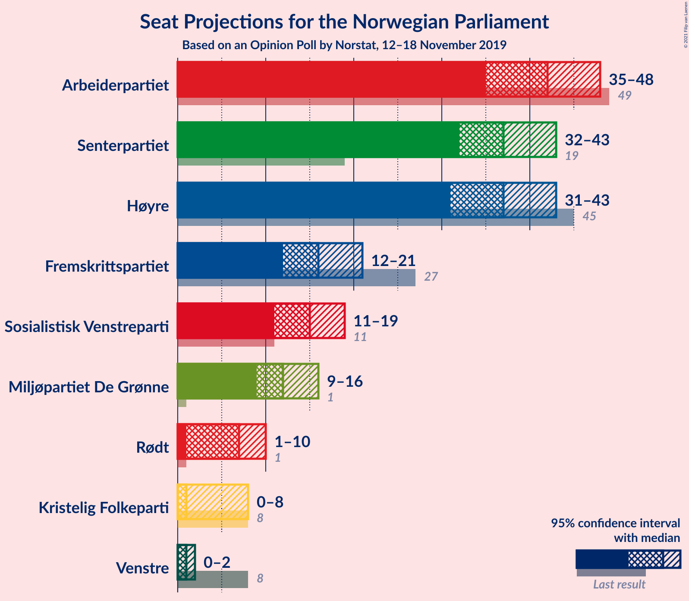
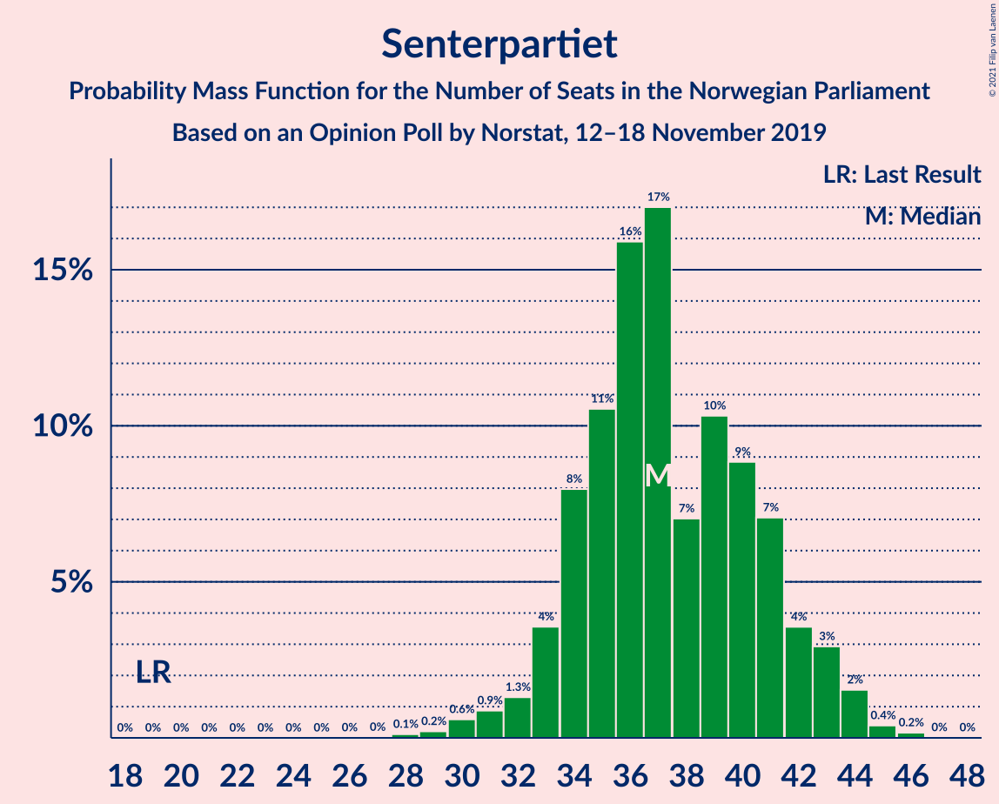
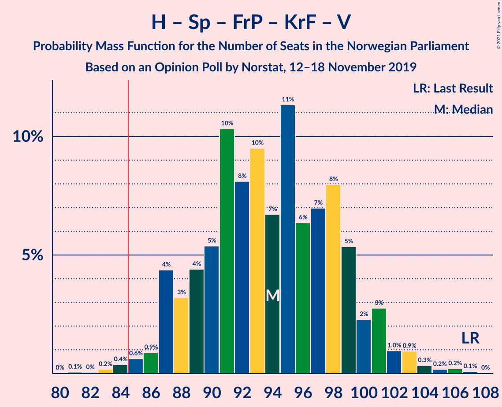

# Opinion Poll by Norstat, 12–18 November 2019

<a href="#voting-intentions">Voting Intentions</a> | <a href="#seats">Seats</a> | <a href="#coalitions">Coalitions</a> | <a href="#technical-information">Technical Information</a>

## Voting Intentions

### Confidence Intervals

| Party | Last Result | Poll Result | 80% Confidence Interval | 90% Confidence Interval | 95% Confidence Interval | 99% Confidence Interval |
|:-----:|:-----------:|:-----------:|:-----------------------:|:-----------------------:|:-----------------------:|:-----------------------:|
| Arbeiderpartiet | 27.4% | 22.9% | 20.9–25.2% |20.3–25.8% |19.8–26.4% |18.9–27.5% |
| Høyre | 25.0% | 20.9% | 18.9–23.1% |18.3–23.7% |17.9–24.2% |16.9–25.3% |
| Senterpartiet | 10.3% | 20.1% | 18.1–22.2% |17.6–22.8% |17.1–23.4% |16.2–24.4% |
| Fremskrittspartiet | 15.2% | 9.1% | 7.8–10.7% |7.4–11.2% |7.1–11.6% |6.5–12.4% |
| Sosialistisk Venstreparti | 6.0% | 8.1% | 6.9–9.7% |6.5–10.1% |6.2–10.5% |5.7–11.3% |
| Miljøpartiet De Grønne | 3.2% | 6.8% | 5.7–8.3% |5.4–8.7% |5.1–9.1% |4.6–9.9% |
| Rødt | 2.4% | 4.1% | 3.3–5.3% |3.0–5.7% |2.8–6.0% |2.5–6.6% |
| Kristelig Folkeparti | 4.2% | 2.9% | 2.2–3.9% |2.0–4.2% |1.8–4.5% |1.5–5.0% |
| Venstre | 4.4% | 2.1% | 1.5–3.0% |1.3–3.3% |1.2–3.5% |1.0–4.0% |

*Note:* The poll result column reflects the actual value used in the calculations. Published results may vary slightly, and in addition be rounded to fewer digits.

## Seats

### Confidence Intervals

| Party | Last Result | Median | 80% Confidence Interval | 90% Confidence Interval | 95% Confidence Interval | 99% Confidence Interval |
|:-----:|:-----------:|:------:|:-----------------------:|:-----------------------:|:-----------------------:|:-----------------------:|
| <a href="#arbeiderpartiet">Arbeiderpartiet</a> | 49 | 44 | 41–50 |41–50 |38–50 |33–50 |
| <a href="#høyre">Høyre</a> | 45 | 39 | 31–39 |31–39 |29–39 |28–43 |
| <a href="#senterpartiet">Senterpartiet</a> | 19 | 38 | 38–43 |38–43 |38–43 |35–45 |
| <a href="#fremskrittspartiet">Fremskrittspartiet</a> | 27 | 18 | 12–18 |12–18 |10–18 |10–18 |
| <a href="#sosialistisk-venstreparti">Sosialistisk Venstreparti</a> | 11 | 16 | 14–16 |13–16 |13–16 |11–18 |
| <a href="#miljøpartiet-de-grønne">Miljøpartiet De Grønne</a> | 1 | 12 | 11–13 |9–13 |9–16 |7–19 |
| <a href="#rødt">Rødt</a> | 1 | 2 | 2–6 |2–7 |2–9 |2–9 |
| <a href="#kristelig-folkeparti">Kristelig Folkeparti</a> | 8 | 0 | 0–2 |0–9 |0–10 |0–10 |
| <a href="#venstre">Venstre</a> | 8 | 0 | 0 |0–1 |0–1 |0–2 |

### Arbeiderpartiet

*For a full overview of the results for this party, see the [Arbeiderpartiet](party-arbeiderpartiet.html) page.*

| Number of Seats | Probability | Accumulated | Special Marks |
|:---------------:|:-----------:|:-----------:|:-------------:|
| 33 | 0.6% | 100% |  |
| 34 | 0.1% | 99.3% |  |
| 35 | 0% | 99.2% |  |
| 36 | 0% | 99.2% |  |
| 37 | 0% | 99.2% |  |
| 38 | 2% | 99.2% |  |
| 39 | 0% | 97% |  |
| 40 | 0% | 97% |  |
| 41 | 8% | 97% |  |
| 42 | 2% | 89% |  |
| 43 | 1.1% | 87% |  |
| 44 | 63% | 86% | Median |
| 45 | 0% | 24% |  |
| 46 | 0% | 24% |  |
| 47 | 0% | 24% |  |
| 48 | 3% | 24% |  |
| 49 | 0% | 21% | Last Result |
| 50 | 21% | 21% |  |
| 51 | 0% | 0% |  |

### Høyre

*For a full overview of the results for this party, see the [Høyre](party-høyre.html) page.*

| Number of Seats | Probability | Accumulated | Special Marks |
|:---------------:|:-----------:|:-----------:|:-------------:|
| 25 | 0.2% | 100% |  |
| 26 | 0% | 99.8% |  |
| 27 | 0.1% | 99.8% |  |
| 28 | 2% | 99.8% |  |
| 29 | 1.5% | 98% |  |
| 30 | 0.1% | 97% |  |
| 31 | 8% | 97% |  |
| 32 | 0% | 88% |  |
| 33 | 24% | 88% |  |
| 34 | 0.7% | 64% |  |
| 35 | 0.3% | 64% |  |
| 36 | 0.3% | 63% |  |
| 37 | 0% | 63% |  |
| 38 | 0% | 63% |  |
| 39 | 62% | 63% | Median |
| 40 | 0% | 0.8% |  |
| 41 | 0.1% | 0.8% |  |
| 42 | 0% | 0.8% |  |
| 43 | 0.7% | 0.7% |  |
| 44 | 0% | 0.1% |  |
| 45 | 0% | 0.1% | Last Result |
| 46 | 0% | 0% |  |

### Senterpartiet

*For a full overview of the results for this party, see the [Senterpartiet](party-senterpartiet.html) page.*

| Number of Seats | Probability | Accumulated | Special Marks |
|:---------------:|:-----------:|:-----------:|:-------------:|
| 19 | 0% | 100% | Last Result |
| 20 | 0% | 100% |  |
| 21 | 0% | 100% |  |
| 22 | 0% | 100% |  |
| 23 | 0% | 100% |  |
| 24 | 0% | 100% |  |
| 25 | 0% | 100% |  |
| 26 | 0% | 100% |  |
| 27 | 0% | 100% |  |
| 28 | 0% | 100% |  |
| 29 | 0% | 100% |  |
| 30 | 0% | 100% |  |
| 31 | 0% | 100% |  |
| 32 | 0% | 100% |  |
| 33 | 0% | 100% |  |
| 34 | 0% | 100% |  |
| 35 | 1.0% | 99.9% |  |
| 36 | 0% | 98.9% |  |
| 37 | 0% | 98.9% |  |
| 38 | 62% | 98.9% | Median |
| 39 | 2% | 36% |  |
| 40 | 8% | 35% |  |
| 41 | 0% | 26% |  |
| 42 | 3% | 26% |  |
| 43 | 21% | 23% |  |
| 44 | 0% | 2% |  |
| 45 | 2% | 2% |  |
| 46 | 0.2% | 0.2% |  |
| 47 | 0% | 0% |  |

### Fremskrittspartiet

*For a full overview of the results for this party, see the [Fremskrittspartiet](party-fremskrittspartiet.html) page.*

| Number of Seats | Probability | Accumulated | Special Marks |
|:---------------:|:-----------:|:-----------:|:-------------:|
| 10 | 3% | 100% |  |
| 11 | 0% | 97% |  |
| 12 | 21% | 97% |  |
| 13 | 1.0% | 76% |  |
| 14 | 5% | 75% |  |
| 15 | 5% | 70% |  |
| 16 | 0.5% | 65% |  |
| 17 | 2% | 64% |  |
| 18 | 62% | 63% | Median |
| 19 | 0.1% | 0.3% |  |
| 20 | 0% | 0.2% |  |
| 21 | 0% | 0.1% |  |
| 22 | 0% | 0.1% |  |
| 23 | 0% | 0.1% |  |
| 24 | 0.1% | 0.1% |  |
| 25 | 0% | 0% |  |
| 26 | 0% | 0% |  |
| 27 | 0% | 0% | Last Result |

### Sosialistisk Venstreparti

*For a full overview of the results for this party, see the [Sosialistisk Venstreparti](party-sosialistiskvenstreparti.html) page.*

| Number of Seats | Probability | Accumulated | Special Marks |
|:---------------:|:-----------:|:-----------:|:-------------:|
| 8 | 0.1% | 100% |  |
| 9 | 0% | 99.9% |  |
| 10 | 0.3% | 99.8% |  |
| 11 | 0.7% | 99.6% | Last Result |
| 12 | 0.1% | 98.9% |  |
| 13 | 8% | 98.8% |  |
| 14 | 2% | 91% |  |
| 15 | 25% | 89% |  |
| 16 | 63% | 65% | Median |
| 17 | 0% | 2% |  |
| 18 | 2% | 2% |  |
| 19 | 0.1% | 0.1% |  |
| 20 | 0% | 0% |  |

### Miljøpartiet De Grønne

*For a full overview of the results for this party, see the [Miljøpartiet De Grønne](party-miljøpartietdegrønne.html) page.*

| Number of Seats | Probability | Accumulated | Special Marks |
|:---------------:|:-----------:|:-----------:|:-------------:|
| 1 | 0% | 100% | Last Result |
| 2 | 0% | 100% |  |
| 3 | 0.1% | 100% |  |
| 4 | 0% | 99.9% |  |
| 5 | 0% | 99.9% |  |
| 6 | 0% | 99.9% |  |
| 7 | 0.5% | 99.9% |  |
| 8 | 0% | 99.4% |  |
| 9 | 5% | 99.3% |  |
| 10 | 4% | 94% |  |
| 11 | 2% | 90% |  |
| 12 | 65% | 89% | Median |
| 13 | 21% | 24% |  |
| 14 | 0% | 3% |  |
| 15 | 0% | 3% |  |
| 16 | 0.3% | 3% |  |
| 17 | 0.8% | 2% |  |
| 18 | 0% | 1.5% |  |
| 19 | 1.5% | 1.5% |  |
| 20 | 0% | 0% |  |

### Rødt

*For a full overview of the results for this party, see the [Rødt](party-rødt.html) page.*

| Number of Seats | Probability | Accumulated | Special Marks |
|:---------------:|:-----------:|:-----------:|:-------------:|
| 1 | 0% | 100% | Last Result |
| 2 | 87% | 100% | Median |
| 3 | 0% | 13% |  |
| 4 | 0% | 13% |  |
| 5 | 0% | 13% |  |
| 6 | 5% | 13% |  |
| 7 | 4% | 8% |  |
| 8 | 0.3% | 4% |  |
| 9 | 4% | 4% |  |
| 10 | 0% | 0.1% |  |
| 11 | 0% | 0% |  |

### Kristelig Folkeparti

*For a full overview of the results for this party, see the [Kristelig Folkeparti](party-kristeligfolkeparti.html) page.*

| Number of Seats | Probability | Accumulated | Special Marks |
|:---------------:|:-----------:|:-----------:|:-------------:|
| 0 | 64% | 100% | Median |
| 1 | 25% | 36% |  |
| 2 | 2% | 11% |  |
| 3 | 0% | 9% |  |
| 4 | 0% | 9% |  |
| 5 | 0% | 9% |  |
| 6 | 0% | 9% |  |
| 7 | 0.2% | 9% |  |
| 8 | 0.8% | 9% | Last Result |
| 9 | 5% | 8% |  |
| 10 | 4% | 4% |  |
| 11 | 0% | 0% |  |

### Venstre

*For a full overview of the results for this party, see the [Venstre](party-venstre.html) page.*

| Number of Seats | Probability | Accumulated | Special Marks |
|:---------------:|:-----------:|:-----------:|:-------------:|
| 0 | 95% | 100% | Median |
| 1 | 3% | 5% |  |
| 2 | 2% | 2% |  |
| 3 | 0% | 0.1% |  |
| 4 | 0% | 0.1% |  |
| 5 | 0% | 0.1% |  |
| 6 | 0% | 0.1% |  |
| 7 | 0% | 0% |  |
| 8 | 0% | 0% | Last Result |

## Coalitions

### Confidence Intervals

| Coalition | Last Result | Median | Majority? | 80% Confidence Interval | 90% Confidence Interval | 95% Confidence Interval | 99% Confidence Interval |
|:---------:|:-----------:|:------:|:---------:|:-----------------------:|:-----------------------:|:-----------------------:|:-----------------------:|
| Arbeiderpartiet – Senterpartiet – Sosialistisk Venstreparti – Miljøpartiet De Grønne – Rødt | 81 | 112 | 100% | 112–123 | 109–123 | 109–123 | 106–123 |
| Arbeiderpartiet – Senterpartiet – Sosialistisk Venstreparti – Miljøpartiet De Grønne – Kristelig Folkeparti | 88 | 110 | 100% | 110–122 | 110–122 | 110–122 | 99–122 |
| Arbeiderpartiet – Senterpartiet – Sosialistisk Venstreparti – Miljøpartiet De Grønne | 80 | 110 | 100% | 106–121 | 103–121 | 103–121 | 98–121 |
| Arbeiderpartiet – Senterpartiet – Sosialistisk Venstreparti – Rødt | 80 | 100 | 100% | 100–110 | 100–110 | 100–110 | 95–110 |
| Arbeiderpartiet – Senterpartiet – Sosialistisk Venstreparti | 79 | 98 | 99.9% | 96–108 | 94–108 | 94–108 | 89–108 |
| Arbeiderpartiet – Senterpartiet – Miljøpartiet De Grønne – Kristelig Folkeparti | 77 | 94 | 99.3% | 94–107 | 94–107 | 94–107 | 83–107 |
| Høyre – Senterpartiet – Fremskrittspartiet – Kristelig Folkeparti – Venstre | 107 | 95 | 99.9% | 89–95 | 89–95 | 86–96 | 85–104 |
| Arbeiderpartiet – Senterpartiet – Kristelig Folkeparti | 76 | 82 | 35% | 82–94 | 82–94 | 82–94 | 76–94 |
| Arbeiderpartiet – Senterpartiet | 68 | 82 | 24% | 81–93 | 81–93 | 81–93 | 75–93 |
| Høyre – Fremskrittspartiet – Miljøpartiet De Grønne – Kristelig Folkeparti – Venstre | 89 | 69 | 0% | 59–69 | 59–69 | 56–69 | 56–73 |
| Arbeiderpartiet – Sosialistisk Venstreparti | 60 | 60 | 0% | 56–65 | 54–65 | 54–65 | 49–65 |
| Høyre – Fremskrittspartiet – Kristelig Folkeparti – Venstre | 88 | 57 | 0% | 46–57 | 46–57 | 44–57 | 44–62 |
| Høyre – Fremskrittspartiet | 72 | 57 | 0% | 45–57 | 45–57 | 43–57 | 43–59 |
| Høyre – Fremskrittspartiet – Venstre | 80 | 57 | 0% | 45–57 | 45–57 | 43–57 | 43–61 |
| Senterpartiet – Kristelig Folkeparti – Venstre | 35 | 38 | 0% | 38–48 | 38–49 | 38–50 | 38–50 |
| Høyre – Kristelig Folkeparti – Venstre | 61 | 39 | 0% | 34–40 | 34–41 | 31–41 | 31–46 |

### Arbeiderpartiet – Senterpartiet – Sosialistisk Venstreparti – Miljøpartiet De Grønne – Rødt

| Number of Seats | Probability | Accumulated | Special Marks |
|:---------------:|:-----------:|:-----------:|:-------------:|
| 81 | 0% | 100% | Last Result |
| 82 | 0% | 100% |  |
| 83 | 0% | 100% |  |
| 84 | 0% | 100% |  |
| 85 | 0% | 100% | Majority |
| 86 | 0% | 100% |  |
| 87 | 0% | 100% |  |
| 88 | 0% | 100% |  |
| 89 | 0% | 100% |  |
| 90 | 0% | 100% |  |
| 91 | 0% | 100% |  |
| 92 | 0% | 100% |  |
| 93 | 0% | 100% |  |
| 94 | 0% | 100% |  |
| 95 | 0% | 100% |  |
| 96 | 0% | 100% |  |
| 97 | 0% | 100% |  |
| 98 | 0% | 100% |  |
| 99 | 0% | 100% |  |
| 100 | 0% | 100% |  |
| 101 | 0% | 100% |  |
| 102 | 0% | 100% |  |
| 103 | 0.1% | 100% |  |
| 104 | 0.1% | 99.9% |  |
| 105 | 0.1% | 99.8% |  |
| 106 | 0.3% | 99.7% |  |
| 107 | 0.5% | 99.4% |  |
| 108 | 0.3% | 98.9% |  |
| 109 | 5% | 98.6% |  |
| 110 | 0.1% | 94% |  |
| 111 | 0% | 94% |  |
| 112 | 62% | 94% | Median |
| 113 | 4% | 31% |  |
| 114 | 0% | 27% |  |
| 115 | 0% | 27% |  |
| 116 | 0% | 27% |  |
| 117 | 3% | 27% |  |
| 118 | 0.2% | 24% |  |
| 119 | 0% | 24% |  |
| 120 | 0% | 24% |  |
| 121 | 2% | 24% |  |
| 122 | 0% | 23% |  |
| 123 | 23% | 23% |  |
| 124 | 0% | 0% |  |

### Arbeiderpartiet – Senterpartiet – Sosialistisk Venstreparti – Miljøpartiet De Grønne – Kristelig Folkeparti

| Number of Seats | Probability | Accumulated | Special Marks |
|:---------------:|:-----------:|:-----------:|:-------------:|
| 88 | 0% | 100% | Last Result |
| 89 | 0% | 100% |  |
| 90 | 0% | 100% |  |
| 91 | 0% | 100% |  |
| 92 | 0% | 100% |  |
| 93 | 0% | 100% |  |
| 94 | 0% | 100% |  |
| 95 | 0.1% | 100% |  |
| 96 | 0% | 99.9% |  |
| 97 | 0% | 99.9% |  |
| 98 | 0.1% | 99.9% |  |
| 99 | 0.6% | 99.8% |  |
| 100 | 0% | 99.3% |  |
| 101 | 0% | 99.3% |  |
| 102 | 0.1% | 99.3% |  |
| 103 | 0.1% | 99.2% |  |
| 104 | 0% | 99.0% |  |
| 105 | 0% | 99.0% |  |
| 106 | 0.3% | 99.0% |  |
| 107 | 0% | 98.8% |  |
| 108 | 0% | 98.8% |  |
| 109 | 0% | 98.7% |  |
| 110 | 62% | 98.7% | Median |
| 111 | 0.2% | 36% |  |
| 112 | 5% | 36% |  |
| 113 | 0% | 31% |  |
| 114 | 4% | 31% |  |
| 115 | 0% | 27% |  |
| 116 | 6% | 27% |  |
| 117 | 0% | 21% |  |
| 118 | 0% | 21% |  |
| 119 | 0% | 21% |  |
| 120 | 0% | 21% |  |
| 121 | 0% | 21% |  |
| 122 | 21% | 21% |  |
| 123 | 0% | 0% |  |

### Arbeiderpartiet – Senterpartiet – Sosialistisk Venstreparti – Miljøpartiet De Grønne

| Number of Seats | Probability | Accumulated | Special Marks |
|:---------------:|:-----------:|:-----------:|:-------------:|
| 80 | 0% | 100% | Last Result |
| 81 | 0% | 100% |  |
| 82 | 0% | 100% |  |
| 83 | 0% | 100% |  |
| 84 | 0% | 100% |  |
| 85 | 0% | 100% | Majority |
| 86 | 0% | 100% |  |
| 87 | 0% | 100% |  |
| 88 | 0% | 100% |  |
| 89 | 0% | 100% |  |
| 90 | 0% | 100% |  |
| 91 | 0% | 100% |  |
| 92 | 0% | 100% |  |
| 93 | 0% | 100% |  |
| 94 | 0.1% | 100% |  |
| 95 | 0% | 99.9% |  |
| 96 | 0% | 99.9% |  |
| 97 | 0% | 99.9% |  |
| 98 | 0.6% | 99.9% |  |
| 99 | 0% | 99.3% |  |
| 100 | 0.1% | 99.3% |  |
| 101 | 0% | 99.2% |  |
| 102 | 0.2% | 99.2% |  |
| 103 | 5% | 99.0% |  |
| 104 | 0.2% | 94% |  |
| 105 | 0% | 94% |  |
| 106 | 4% | 94% |  |
| 107 | 0% | 89% |  |
| 108 | 0% | 89% |  |
| 109 | 0% | 89% |  |
| 110 | 62% | 89% | Median |
| 111 | 0% | 27% |  |
| 112 | 2% | 27% |  |
| 113 | 0% | 25% |  |
| 114 | 1.5% | 25% |  |
| 115 | 3% | 24% |  |
| 116 | 0% | 21% |  |
| 117 | 0% | 21% |  |
| 118 | 0% | 21% |  |
| 119 | 0% | 21% |  |
| 120 | 0% | 21% |  |
| 121 | 21% | 21% |  |
| 122 | 0% | 0% |  |

### Arbeiderpartiet – Senterpartiet – Sosialistisk Venstreparti – Rødt

| Number of Seats | Probability | Accumulated | Special Marks |
|:---------------:|:-----------:|:-----------:|:-------------:|
| 80 | 0% | 100% | Last Result |
| 81 | 0% | 100% |  |
| 82 | 0% | 100% |  |
| 83 | 0% | 100% |  |
| 84 | 0% | 100% |  |
| 85 | 0% | 100% | Majority |
| 86 | 0% | 100% |  |
| 87 | 0% | 100% |  |
| 88 | 0% | 100% |  |
| 89 | 0% | 100% |  |
| 90 | 0.2% | 100% |  |
| 91 | 0% | 99.7% |  |
| 92 | 0% | 99.7% |  |
| 93 | 0% | 99.7% |  |
| 94 | 0% | 99.6% |  |
| 95 | 0.2% | 99.6% |  |
| 96 | 0.7% | 99.4% |  |
| 97 | 0% | 98.7% |  |
| 98 | 0.3% | 98.7% |  |
| 99 | 0% | 98% |  |
| 100 | 68% | 98% | Median |
| 101 | 0.1% | 31% |  |
| 102 | 0% | 31% |  |
| 103 | 4% | 31% |  |
| 104 | 1.5% | 27% |  |
| 105 | 3% | 26% |  |
| 106 | 0% | 23% |  |
| 107 | 0% | 23% |  |
| 108 | 0.2% | 23% |  |
| 109 | 0% | 23% |  |
| 110 | 23% | 23% |  |
| 111 | 0% | 0% |  |

### Arbeiderpartiet – Senterpartiet – Sosialistisk Venstreparti

| Number of Seats | Probability | Accumulated | Special Marks |
|:---------------:|:-----------:|:-----------:|:-------------:|
| 79 | 0% | 100% | Last Result |
| 80 | 0% | 100% |  |
| 81 | 0% | 100% |  |
| 82 | 0% | 100% |  |
| 83 | 0% | 100% |  |
| 84 | 0.1% | 100% |  |
| 85 | 0% | 99.9% | Majority |
| 86 | 0% | 99.9% |  |
| 87 | 0% | 99.8% |  |
| 88 | 0.2% | 99.8% |  |
| 89 | 0.7% | 99.6% |  |
| 90 | 0% | 98.9% |  |
| 91 | 0.6% | 98.9% |  |
| 92 | 0.1% | 98% |  |
| 93 | 0.2% | 98% |  |
| 94 | 5% | 98% |  |
| 95 | 1.5% | 93% |  |
| 96 | 4% | 92% |  |
| 97 | 0% | 88% |  |
| 98 | 62% | 88% | Median |
| 99 | 0% | 26% |  |
| 100 | 0.2% | 26% |  |
| 101 | 2% | 26% |  |
| 102 | 0% | 24% |  |
| 103 | 3% | 24% |  |
| 104 | 0% | 21% |  |
| 105 | 0% | 21% |  |
| 106 | 0% | 21% |  |
| 107 | 0% | 21% |  |
| 108 | 21% | 21% |  |
| 109 | 0% | 0% |  |

### Arbeiderpartiet – Senterpartiet – Miljøpartiet De Grønne – Kristelig Folkeparti

| Number of Seats | Probability | Accumulated | Special Marks |
|:---------------:|:-----------:|:-----------:|:-------------:|
| 77 | 0% | 100% | Last Result |
| 78 | 0% | 100% |  |
| 79 | 0% | 100% |  |
| 80 | 0.1% | 100% |  |
| 81 | 0% | 99.9% |  |
| 82 | 0% | 99.9% |  |
| 83 | 0.6% | 99.9% |  |
| 84 | 0% | 99.3% |  |
| 85 | 0% | 99.3% | Majority |
| 86 | 0% | 99.3% |  |
| 87 | 0% | 99.2% |  |
| 88 | 0% | 99.2% |  |
| 89 | 0% | 99.2% |  |
| 90 | 0% | 99.2% |  |
| 91 | 0% | 99.2% |  |
| 92 | 0.3% | 99.2% |  |
| 93 | 0% | 98.9% |  |
| 94 | 62% | 98.9% | Median |
| 95 | 0.2% | 37% |  |
| 96 | 2% | 37% |  |
| 97 | 0% | 35% |  |
| 98 | 0.1% | 35% |  |
| 99 | 5% | 35% |  |
| 100 | 1.5% | 30% |  |
| 101 | 4% | 28% |  |
| 102 | 0% | 25% |  |
| 103 | 3% | 25% |  |
| 104 | 0% | 21% |  |
| 105 | 0% | 21% |  |
| 106 | 0% | 21% |  |
| 107 | 21% | 21% |  |
| 108 | 0% | 0% |  |

### Høyre – Senterpartiet – Fremskrittspartiet – Kristelig Folkeparti – Venstre

| Number of Seats | Probability | Accumulated | Special Marks |
|:---------------:|:-----------:|:-----------:|:-------------:|
| 82 | 0.1% | 100% |  |
| 83 | 0% | 99.9% |  |
| 84 | 0% | 99.9% |  |
| 85 | 1.5% | 99.9% | Majority |
| 86 | 3% | 98% |  |
| 87 | 0% | 96% |  |
| 88 | 0% | 96% |  |
| 89 | 22% | 96% |  |
| 90 | 0% | 74% |  |
| 91 | 1.0% | 74% |  |
| 92 | 0% | 73% |  |
| 93 | 2% | 73% |  |
| 94 | 5% | 72% |  |
| 95 | 62% | 67% | Median |
| 96 | 4% | 4% |  |
| 97 | 0% | 0.9% |  |
| 98 | 0.1% | 0.9% |  |
| 99 | 0% | 0.8% |  |
| 100 | 0% | 0.8% |  |
| 101 | 0.1% | 0.8% |  |
| 102 | 0% | 0.7% |  |
| 103 | 0% | 0.7% |  |
| 104 | 0.5% | 0.7% |  |
| 105 | 0% | 0.2% |  |
| 106 | 0% | 0.2% |  |
| 107 | 0.1% | 0.2% | Last Result |
| 108 | 0% | 0% |  |

### Arbeiderpartiet – Senterpartiet – Kristelig Folkeparti

| Number of Seats | Probability | Accumulated | Special Marks |
|:---------------:|:-----------:|:-----------:|:-------------:|
| 73 | 0.1% | 100% |  |
| 74 | 0% | 99.9% |  |
| 75 | 0% | 99.8% |  |
| 76 | 0.6% | 99.8% | Last Result |
| 77 | 0.1% | 99.3% |  |
| 78 | 0% | 99.2% |  |
| 79 | 0% | 99.2% |  |
| 80 | 0% | 99.2% |  |
| 81 | 2% | 99.2% |  |
| 82 | 62% | 98% | Median |
| 83 | 0% | 35% |  |
| 84 | 0% | 35% |  |
| 85 | 2% | 35% | Majority |
| 86 | 1.0% | 33% |  |
| 87 | 0% | 32% |  |
| 88 | 0% | 32% |  |
| 89 | 0% | 32% |  |
| 90 | 5% | 32% |  |
| 91 | 6% | 27% |  |
| 92 | 0% | 21% |  |
| 93 | 0% | 21% |  |
| 94 | 21% | 21% |  |
| 95 | 0% | 0% |  |

### Arbeiderpartiet – Senterpartiet

| Number of Seats | Probability | Accumulated | Special Marks |
|:---------------:|:-----------:|:-----------:|:-------------:|
| 68 | 0% | 100% | Last Result |
| 69 | 0.1% | 100% |  |
| 70 | 0% | 99.9% |  |
| 71 | 0% | 99.9% |  |
| 72 | 0% | 99.9% |  |
| 73 | 0.1% | 99.9% |  |
| 74 | 0% | 99.8% |  |
| 75 | 0.5% | 99.8% |  |
| 76 | 0.1% | 99.2% |  |
| 77 | 0% | 99.1% |  |
| 78 | 0.9% | 99.1% |  |
| 79 | 0% | 98% |  |
| 80 | 0% | 98% |  |
| 81 | 10% | 98% |  |
| 82 | 62% | 88% | Median |
| 83 | 2% | 26% |  |
| 84 | 0.2% | 24% |  |
| 85 | 0.1% | 24% | Majority |
| 86 | 0% | 24% |  |
| 87 | 0% | 24% |  |
| 88 | 0% | 24% |  |
| 89 | 0% | 24% |  |
| 90 | 3% | 24% |  |
| 91 | 0% | 21% |  |
| 92 | 0% | 21% |  |
| 93 | 21% | 21% |  |
| 94 | 0% | 0% |  |

### Høyre – Fremskrittspartiet – Miljøpartiet De Grønne – Kristelig Folkeparti – Venstre

| Number of Seats | Probability | Accumulated | Special Marks |
|:---------------:|:-----------:|:-----------:|:-------------:|
| 53 | 0.2% | 100% |  |
| 54 | 0% | 99.8% |  |
| 55 | 0% | 99.8% |  |
| 56 | 3% | 99.8% |  |
| 57 | 0% | 97% |  |
| 58 | 0% | 97% |  |
| 59 | 23% | 97% |  |
| 60 | 0.1% | 74% |  |
| 61 | 0.3% | 74% |  |
| 62 | 0% | 74% |  |
| 63 | 5% | 74% |  |
| 64 | 0% | 69% |  |
| 65 | 1.5% | 69% |  |
| 66 | 4% | 68% |  |
| 67 | 0% | 64% |  |
| 68 | 0% | 64% |  |
| 69 | 63% | 64% | Median |
| 70 | 0% | 1.3% |  |
| 71 | 0% | 1.3% |  |
| 72 | 0.2% | 1.3% |  |
| 73 | 0.7% | 1.0% |  |
| 74 | 0.2% | 0.3% |  |
| 75 | 0% | 0.1% |  |
| 76 | 0% | 0.1% |  |
| 77 | 0% | 0% |  |
| 78 | 0% | 0% |  |
| 79 | 0% | 0% |  |
| 80 | 0% | 0% |  |
| 81 | 0% | 0% |  |
| 82 | 0% | 0% |  |
| 83 | 0% | 0% |  |
| 84 | 0% | 0% |  |
| 85 | 0% | 0% | Majority |
| 86 | 0% | 0% |  |
| 87 | 0% | 0% |  |
| 88 | 0% | 0% |  |
| 89 | 0% | 0% | Last Result |

### Arbeiderpartiet – Sosialistisk Venstreparti

| Number of Seats | Probability | Accumulated | Special Marks |
|:---------------:|:-----------:|:-----------:|:-------------:|
| 48 | 0.1% | 100% |  |
| 49 | 0.6% | 99.9% |  |
| 50 | 0% | 99.3% |  |
| 51 | 0.1% | 99.3% |  |
| 52 | 0% | 99.1% |  |
| 53 | 0.3% | 99.1% |  |
| 54 | 6% | 98.8% |  |
| 55 | 0% | 93% |  |
| 56 | 7% | 93% |  |
| 57 | 0% | 86% |  |
| 58 | 0.3% | 86% |  |
| 59 | 0% | 86% |  |
| 60 | 62% | 86% | Last Result, Median |
| 61 | 3% | 24% |  |
| 62 | 0% | 21% |  |
| 63 | 0% | 21% |  |
| 64 | 0% | 21% |  |
| 65 | 21% | 21% |  |
| 66 | 0% | 0% |  |

### Høyre – Fremskrittspartiet – Kristelig Folkeparti – Venstre

| Number of Seats | Probability | Accumulated | Special Marks |
|:---------------:|:-----------:|:-----------:|:-------------:|
| 43 | 0.2% | 100% |  |
| 44 | 3% | 99.8% |  |
| 45 | 0% | 97% |  |
| 46 | 23% | 97% |  |
| 47 | 0% | 74% |  |
| 48 | 2% | 74% |  |
| 49 | 0% | 73% |  |
| 50 | 0% | 73% |  |
| 51 | 0.3% | 73% |  |
| 52 | 0% | 73% |  |
| 53 | 0% | 73% |  |
| 54 | 5% | 73% |  |
| 55 | 0% | 68% |  |
| 56 | 4% | 68% |  |
| 57 | 62% | 63% | Median |
| 58 | 0.1% | 1.0% |  |
| 59 | 0.1% | 0.9% |  |
| 60 | 0.1% | 0.9% |  |
| 61 | 0% | 0.8% |  |
| 62 | 0.5% | 0.8% |  |
| 63 | 0% | 0.2% |  |
| 64 | 0% | 0.2% |  |
| 65 | 0.2% | 0.2% |  |
| 66 | 0% | 0% |  |
| 67 | 0% | 0% |  |
| 68 | 0% | 0% |  |
| 69 | 0% | 0% |  |
| 70 | 0% | 0% |  |
| 71 | 0% | 0% |  |
| 72 | 0% | 0% |  |
| 73 | 0% | 0% |  |
| 74 | 0% | 0% |  |
| 75 | 0% | 0% |  |
| 76 | 0% | 0% |  |
| 77 | 0% | 0% |  |
| 78 | 0% | 0% |  |
| 79 | 0% | 0% |  |
| 80 | 0% | 0% |  |
| 81 | 0% | 0% |  |
| 82 | 0% | 0% |  |
| 83 | 0% | 0% |  |
| 84 | 0% | 0% |  |
| 85 | 0% | 0% | Majority |
| 86 | 0% | 0% |  |
| 87 | 0% | 0% |  |
| 88 | 0% | 0% | Last Result |

### Høyre – Fremskrittspartiet

| Number of Seats | Probability | Accumulated | Special Marks |
|:---------------:|:-----------:|:-----------:|:-------------:|
| 40 | 0.2% | 100% |  |
| 41 | 0.1% | 99.8% |  |
| 42 | 0% | 99.8% |  |
| 43 | 3% | 99.8% |  |
| 44 | 1.5% | 97% |  |
| 45 | 28% | 96% |  |
| 46 | 4% | 68% |  |
| 47 | 0.7% | 64% |  |
| 48 | 0.2% | 64% |  |
| 49 | 0% | 63% |  |
| 50 | 0.1% | 63% |  |
| 51 | 0.3% | 63% |  |
| 52 | 0% | 63% |  |
| 53 | 0% | 63% |  |
| 54 | 0% | 63% |  |
| 55 | 0.1% | 63% |  |
| 56 | 0% | 63% |  |
| 57 | 62% | 63% | Median |
| 58 | 0% | 0.8% |  |
| 59 | 0.6% | 0.8% |  |
| 60 | 0% | 0.2% |  |
| 61 | 0% | 0.2% |  |
| 62 | 0.1% | 0.2% |  |
| 63 | 0% | 0% |  |
| 64 | 0% | 0% |  |
| 65 | 0% | 0% |  |
| 66 | 0% | 0% |  |
| 67 | 0% | 0% |  |
| 68 | 0% | 0% |  |
| 69 | 0% | 0% |  |
| 70 | 0% | 0% |  |
| 71 | 0% | 0% |  |
| 72 | 0% | 0% | Last Result |

### Høyre – Fremskrittspartiet – Venstre

| Number of Seats | Probability | Accumulated | Special Marks |
|:---------------:|:-----------:|:-----------:|:-------------:|
| 41 | 0.2% | 100% |  |
| 42 | 0% | 99.8% |  |
| 43 | 3% | 99.8% |  |
| 44 | 0% | 97% |  |
| 45 | 26% | 97% |  |
| 46 | 7% | 71% |  |
| 47 | 0% | 64% |  |
| 48 | 0.7% | 64% |  |
| 49 | 0.2% | 64% |  |
| 50 | 0% | 64% |  |
| 51 | 0.3% | 63% |  |
| 52 | 0.1% | 63% |  |
| 53 | 0% | 63% |  |
| 54 | 0% | 63% |  |
| 55 | 0% | 63% |  |
| 56 | 0% | 63% |  |
| 57 | 62% | 63% | Median |
| 58 | 0% | 0.9% |  |
| 59 | 0.1% | 0.9% |  |
| 60 | 0% | 0.8% |  |
| 61 | 0.6% | 0.8% |  |
| 62 | 0% | 0.2% |  |
| 63 | 0% | 0.2% |  |
| 64 | 0.1% | 0.2% |  |
| 65 | 0% | 0% |  |
| 66 | 0% | 0% |  |
| 67 | 0% | 0% |  |
| 68 | 0% | 0% |  |
| 69 | 0% | 0% |  |
| 70 | 0% | 0% |  |
| 71 | 0% | 0% |  |
| 72 | 0% | 0% |  |
| 73 | 0% | 0% |  |
| 74 | 0% | 0% |  |
| 75 | 0% | 0% |  |
| 76 | 0% | 0% |  |
| 77 | 0% | 0% |  |
| 78 | 0% | 0% |  |
| 79 | 0% | 0% |  |
| 80 | 0% | 0% | Last Result |

### Senterpartiet – Kristelig Folkeparti – Venstre

| Number of Seats | Probability | Accumulated | Special Marks |
|:---------------:|:-----------:|:-----------:|:-------------:|
| 35 | 0% | 100% | Last Result |
| 36 | 0% | 100% |  |
| 37 | 0% | 100% |  |
| 38 | 62% | 100% | Median |
| 39 | 0.1% | 37% |  |
| 40 | 0% | 37% |  |
| 41 | 2% | 37% |  |
| 42 | 0% | 36% |  |
| 43 | 3% | 36% |  |
| 44 | 22% | 33% |  |
| 45 | 0.7% | 11% |  |
| 46 | 0.1% | 10% |  |
| 47 | 0% | 10% |  |
| 48 | 2% | 10% |  |
| 49 | 5% | 9% |  |
| 50 | 4% | 4% |  |
| 51 | 0% | 0% |  |

### Høyre – Kristelig Folkeparti – Venstre

| Number of Seats | Probability | Accumulated | Special Marks |
|:---------------:|:-----------:|:-----------:|:-------------:|
| 28 | 0.2% | 100% |  |
| 29 | 0.1% | 99.8% |  |
| 30 | 0% | 99.8% |  |
| 31 | 3% | 99.8% |  |
| 32 | 0% | 97% |  |
| 33 | 0% | 97% |  |
| 34 | 24% | 97% |  |
| 35 | 0.1% | 73% |  |
| 36 | 0.3% | 73% |  |
| 37 | 0% | 72% |  |
| 38 | 0% | 72% |  |
| 39 | 62% | 72% | Median |
| 40 | 5% | 10% |  |
| 41 | 4% | 5% |  |
| 42 | 0% | 2% |  |
| 43 | 0.9% | 2% |  |
| 44 | 0.1% | 0.9% |  |
| 45 | 0% | 0.8% |  |
| 46 | 0.7% | 0.8% |  |
| 47 | 0% | 0.1% |  |
| 48 | 0% | 0.1% |  |
| 49 | 0% | 0.1% |  |
| 50 | 0% | 0.1% |  |
| 51 | 0% | 0.1% |  |
| 52 | 0% | 0% |  |
| 53 | 0% | 0% |  |
| 54 | 0% | 0% |  |
| 55 | 0% | 0% |  |
| 56 | 0% | 0% |  |
| 57 | 0% | 0% |  |
| 58 | 0% | 0% |  |
| 59 | 0% | 0% |  |
| 60 | 0% | 0% |  |
| 61 | 0% | 0% | Last Result |

## Technical Information

### Opinion Poll

+ **Polling firm:** Norstat
+ **Commissioner(s):** —
+ **Fieldwork period:** 12–18 November 2019

### Calculations

+ **Sample size:** 628
+ **Simulations done:** 1,024
+ **Error estimate:** 6.28%

