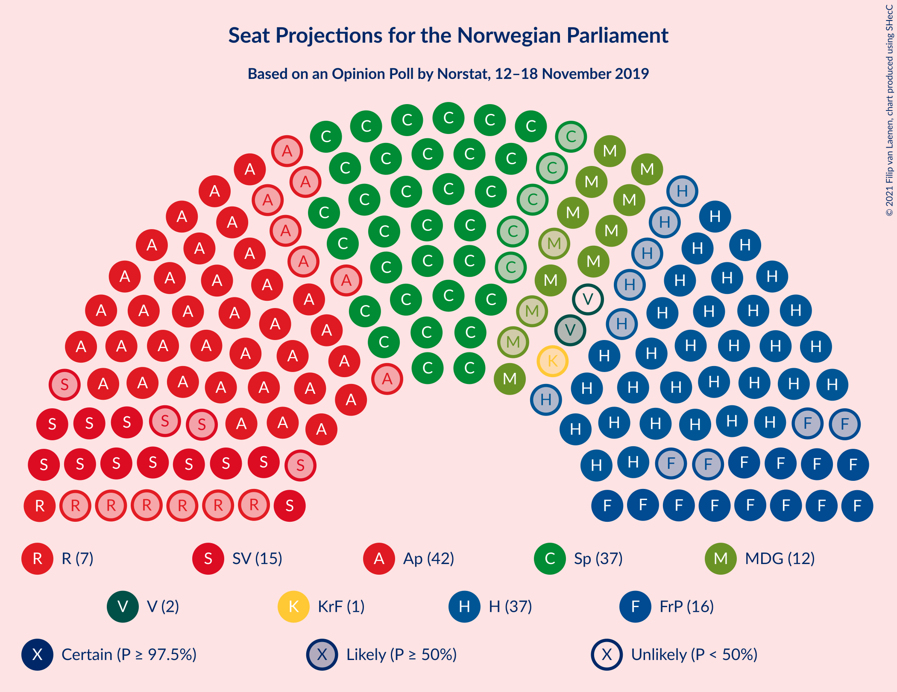
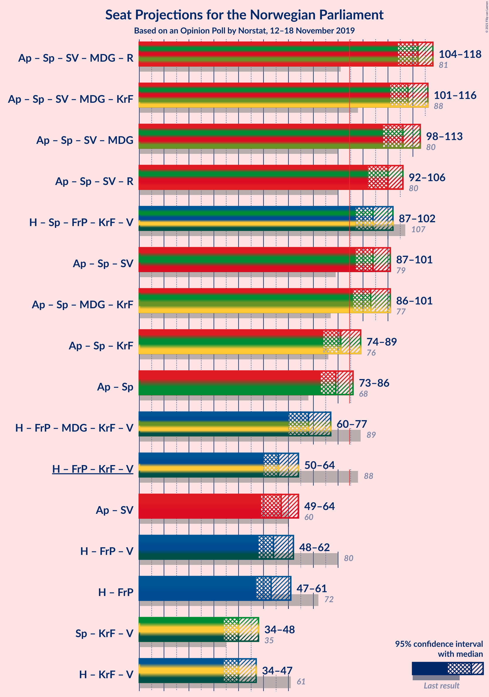
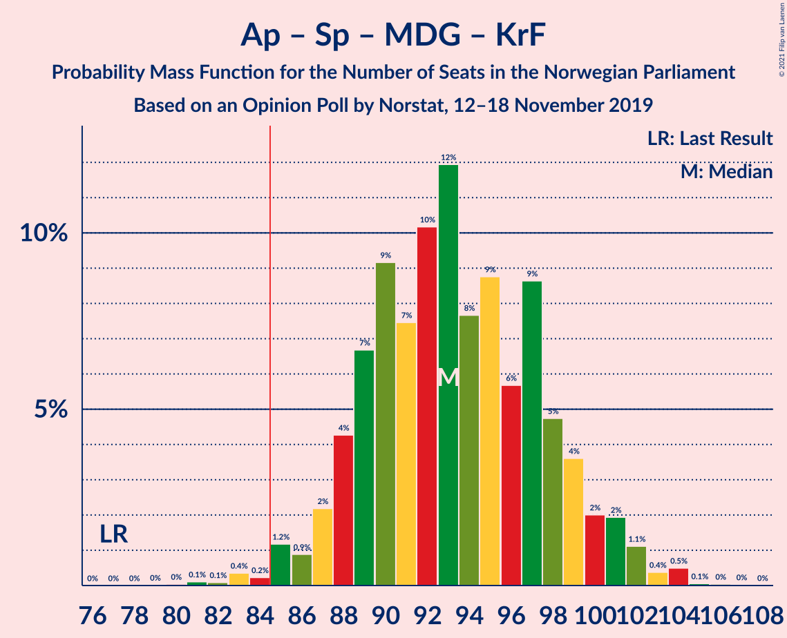
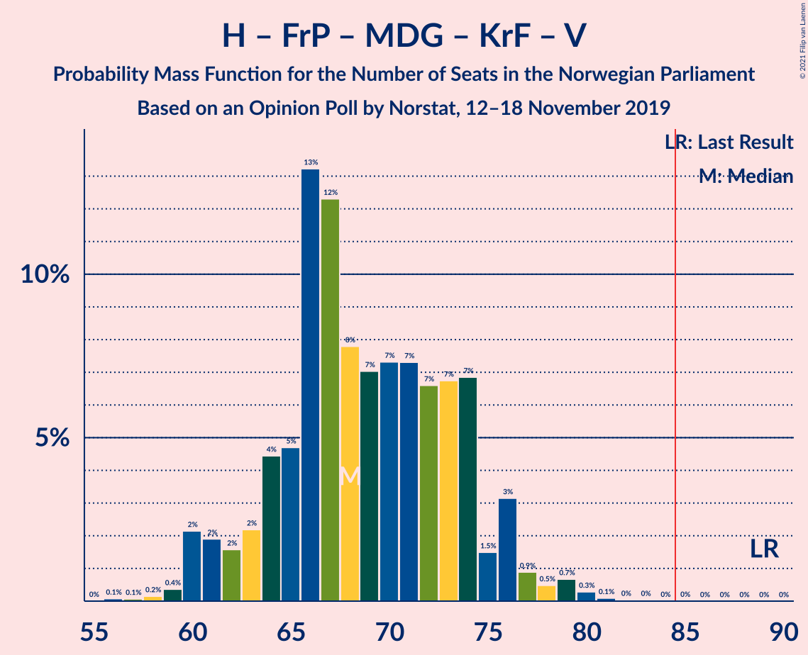
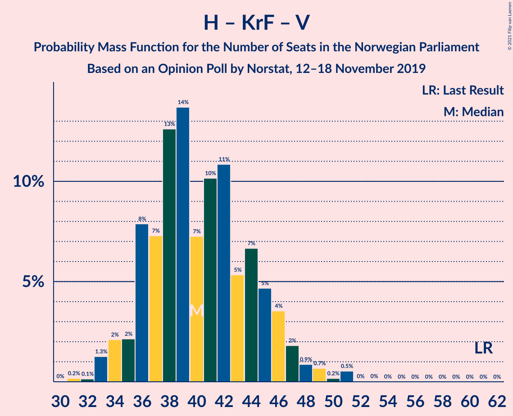

# Opinion Poll by Norstat, 12–18 November 2019

<a href="#voting-intentions">Voting Intentions</a> | <a href="#seats">Seats</a> | <a href="#coalitions">Coalitions</a> | <a href="#technical-information">Technical Information</a>

## Voting Intentions

### Confidence Intervals

| Party | Last Result | Poll Result | 80% Confidence Interval | 90% Confidence Interval | 95% Confidence Interval | 99% Confidence Interval |
|:-----:|:-----------:|:-----------:|:-----------------------:|:-----------------------:|:-----------------------:|:-----------------------:|
| Arbeiderpartiet | 27.4% | 22.9% | 20.9–25.2% |20.3–25.8% |19.8–26.4% |18.9–27.5% |
| Høyre | 25.0% | 20.9% | 18.9–23.1% |18.3–23.7% |17.9–24.2% |16.9–25.3% |
| Senterpartiet | 10.3% | 20.1% | 18.1–22.2% |17.6–22.8% |17.1–23.4% |16.2–24.4% |
| Fremskrittspartiet | 15.2% | 9.1% | 7.8–10.7% |7.4–11.2% |7.1–11.6% |6.5–12.4% |
| Sosialistisk Venstreparti | 6.0% | 8.1% | 6.9–9.7% |6.5–10.1% |6.2–10.5% |5.7–11.3% |
| Miljøpartiet De Grønne | 3.2% | 6.8% | 5.7–8.3% |5.4–8.7% |5.1–9.1% |4.6–9.9% |
| Rødt | 2.4% | 4.1% | 3.3–5.3% |3.0–5.7% |2.8–6.0% |2.5–6.6% |
| Kristelig Folkeparti | 4.2% | 2.9% | 2.2–3.9% |2.0–4.2% |1.8–4.5% |1.5–5.0% |
| Venstre | 4.4% | 2.1% | 1.5–3.0% |1.3–3.3% |1.2–3.5% |1.0–4.0% |

*Note:* The poll result column reflects the actual value used in the calculations. Published results may vary slightly, and in addition be rounded to fewer digits.

## Seats

### Confidence Intervals

| Party | Last Result | Median | 80% Confidence Interval | 90% Confidence Interval | 95% Confidence Interval | 99% Confidence Interval |
|:-----:|:-----------:|:------:|:-----------------------:|:-----------------------:|:-----------------------:|:-----------------------:|
| <a href="#arbeiderpartiet">Arbeiderpartiet</a> | 49 | 42 | 38–46 |36–47 |35–48 |34–50 |
| <a href="#høyre">Høyre</a> | 45 | 37 | 33–42 |32–43 |31–43 |30–46 |
| <a href="#senterpartiet">Senterpartiet</a> | 19 | 37 | 34–41 |33–43 |32–43 |30–45 |
| <a href="#fremskrittspartiet">Fremskrittspartiet</a> | 27 | 16 | 14–19 |13–20 |12–21 |11–23 |
| <a href="#sosialistisk-venstreparti">Sosialistisk Venstreparti</a> | 11 | 15 | 12–17 |11–18 |11–19 |10–20 |
| <a href="#miljøpartiet-de-grønne">Miljøpartiet De Grønne</a> | 1 | 12 | 10–15 |9–16 |9–16 |8–18 |
| <a href="#rødt">Rødt</a> | 1 | 7 | 2–9 |2–10 |1–10 |1–11 |
| <a href="#kristelig-folkeparti">Kristelig Folkeparti</a> | 8 | 1 | 0–3 |0–7 |0–8 |0–9 |
| <a href="#venstre">Venstre</a> | 8 | 1 | 0–2 |0–2 |0–2 |0–7 |

### Arbeiderpartiet

*For a full overview of the results for this party, see the [Arbeiderpartiet](party-arbeiderpartiet.html) page.*

| Number of Seats | Probability | Accumulated | Special Marks |
|:---------------:|:-----------:|:-----------:|:-------------:|
| 31 | 0% | 100% |  |
| 32 | 0.1% | 99.9% |  |
| 33 | 0.3% | 99.8% |  |
| 34 | 1.4% | 99.6% |  |
| 35 | 1.1% | 98% |  |
| 36 | 3% | 97% |  |
| 37 | 4% | 94% |  |
| 38 | 5% | 90% |  |
| 39 | 8% | 86% |  |
| 40 | 9% | 78% |  |
| 41 | 12% | 68% |  |
| 42 | 9% | 56% | Median |
| 43 | 19% | 47% |  |
| 44 | 11% | 27% |  |
| 45 | 7% | 17% |  |
| 46 | 4% | 10% |  |
| 47 | 2% | 6% |  |
| 48 | 2% | 3% |  |
| 49 | 0.4% | 1.0% | Last Result |
| 50 | 0.4% | 0.6% |  |
| 51 | 0.1% | 0.2% |  |
| 52 | 0% | 0.1% |  |
| 53 | 0% | 0% |  |

### Høyre

*For a full overview of the results for this party, see the [Høyre](party-høyre.html) page.*

| Number of Seats | Probability | Accumulated | Special Marks |
|:---------------:|:-----------:|:-----------:|:-------------:|
| 27 | 0% | 100% |  |
| 28 | 0.1% | 99.9% |  |
| 29 | 0.2% | 99.8% |  |
| 30 | 0.6% | 99.6% |  |
| 31 | 2% | 99.0% |  |
| 32 | 3% | 97% |  |
| 33 | 5% | 94% |  |
| 34 | 13% | 90% |  |
| 35 | 8% | 77% |  |
| 36 | 16% | 69% |  |
| 37 | 11% | 53% | Median |
| 38 | 8% | 43% |  |
| 39 | 13% | 35% |  |
| 40 | 5% | 22% |  |
| 41 | 6% | 17% |  |
| 42 | 3% | 11% |  |
| 43 | 6% | 8% |  |
| 44 | 1.2% | 2% |  |
| 45 | 0.3% | 1.1% | Last Result |
| 46 | 0.6% | 0.8% |  |
| 47 | 0.1% | 0.2% |  |
| 48 | 0.1% | 0.1% |  |
| 49 | 0% | 0% |  |

### Senterpartiet

*For a full overview of the results for this party, see the [Senterpartiet](party-senterpartiet.html) page.*

| Number of Seats | Probability | Accumulated | Special Marks |
|:---------------:|:-----------:|:-----------:|:-------------:|
| 19 | 0% | 100% | Last Result |
| 20 | 0% | 100% |  |
| 21 | 0% | 100% |  |
| 22 | 0% | 100% |  |
| 23 | 0% | 100% |  |
| 24 | 0% | 100% |  |
| 25 | 0% | 100% |  |
| 26 | 0% | 100% |  |
| 27 | 0% | 100% |  |
| 28 | 0.1% | 100% |  |
| 29 | 0.2% | 99.8% |  |
| 30 | 0.6% | 99.6% |  |
| 31 | 0.9% | 99.0% |  |
| 32 | 1.3% | 98% |  |
| 33 | 4% | 97% |  |
| 34 | 8% | 93% |  |
| 35 | 11% | 85% |  |
| 36 | 16% | 75% |  |
| 37 | 17% | 59% | Median |
| 38 | 7% | 42% |  |
| 39 | 10% | 35% |  |
| 40 | 9% | 25% |  |
| 41 | 7% | 16% |  |
| 42 | 4% | 9% |  |
| 43 | 3% | 5% |  |
| 44 | 2% | 2% |  |
| 45 | 0.4% | 0.6% |  |
| 46 | 0.2% | 0.2% |  |
| 47 | 0% | 0% |  |

### Fremskrittspartiet

*For a full overview of the results for this party, see the [Fremskrittspartiet](party-fremskrittspartiet.html) page.*

| Number of Seats | Probability | Accumulated | Special Marks |
|:---------------:|:-----------:|:-----------:|:-------------:|
| 10 | 0.2% | 100% |  |
| 11 | 0.9% | 99.8% |  |
| 12 | 3% | 98.9% |  |
| 13 | 6% | 96% |  |
| 14 | 11% | 90% |  |
| 15 | 16% | 79% |  |
| 16 | 17% | 63% | Median |
| 17 | 18% | 46% |  |
| 18 | 15% | 29% |  |
| 19 | 6% | 14% |  |
| 20 | 5% | 7% |  |
| 21 | 1.4% | 3% |  |
| 22 | 0.6% | 1.1% |  |
| 23 | 0.4% | 0.5% |  |
| 24 | 0.1% | 0.1% |  |
| 25 | 0% | 0% |  |
| 26 | 0% | 0% |  |
| 27 | 0% | 0% | Last Result |

### Sosialistisk Venstreparti

*For a full overview of the results for this party, see the [Sosialistisk Venstreparti](party-sosialistiskvenstreparti.html) page.*

| Number of Seats | Probability | Accumulated | Special Marks |
|:---------------:|:-----------:|:-----------:|:-------------:|
| 9 | 0.4% | 100% |  |
| 10 | 2% | 99.5% |  |
| 11 | 5% | 98% | Last Result |
| 12 | 9% | 93% |  |
| 13 | 14% | 83% |  |
| 14 | 19% | 69% |  |
| 15 | 17% | 50% | Median |
| 16 | 14% | 33% |  |
| 17 | 12% | 19% |  |
| 18 | 4% | 7% |  |
| 19 | 2% | 3% |  |
| 20 | 0.8% | 1.1% |  |
| 21 | 0.2% | 0.3% |  |
| 22 | 0.1% | 0.1% |  |
| 23 | 0% | 0% |  |

### Miljøpartiet De Grønne

*For a full overview of the results for this party, see the [Miljøpartiet De Grønne](party-miljøpartietdegrønne.html) page.*

| Number of Seats | Probability | Accumulated | Special Marks |
|:---------------:|:-----------:|:-----------:|:-------------:|
| 1 | 0% | 100% | Last Result |
| 2 | 0% | 100% |  |
| 3 | 0% | 100% |  |
| 4 | 0% | 100% |  |
| 5 | 0% | 100% |  |
| 6 | 0% | 100% |  |
| 7 | 0.2% | 100% |  |
| 8 | 1.3% | 99.8% |  |
| 9 | 6% | 98.5% |  |
| 10 | 10% | 92% |  |
| 11 | 16% | 82% |  |
| 12 | 24% | 66% | Median |
| 13 | 16% | 42% |  |
| 14 | 15% | 26% |  |
| 15 | 5% | 11% |  |
| 16 | 4% | 6% |  |
| 17 | 1.1% | 2% |  |
| 18 | 0.4% | 0.6% |  |
| 19 | 0.1% | 0.1% |  |
| 20 | 0% | 0% |  |

### Rødt

*For a full overview of the results for this party, see the [Rødt](party-rødt.html) page.*

| Number of Seats | Probability | Accumulated | Special Marks |
|:---------------:|:-----------:|:-----------:|:-------------:|
| 1 | 3% | 100% | Last Result |
| 2 | 39% | 97% |  |
| 3 | 0% | 59% |  |
| 4 | 0% | 59% |  |
| 5 | 0% | 59% |  |
| 6 | 1.2% | 59% |  |
| 7 | 14% | 58% | Median |
| 8 | 23% | 44% |  |
| 9 | 12% | 21% |  |
| 10 | 6% | 9% |  |
| 11 | 2% | 2% |  |
| 12 | 0.4% | 0.5% |  |
| 13 | 0.1% | 0.1% |  |
| 14 | 0% | 0% |  |

### Kristelig Folkeparti

*For a full overview of the results for this party, see the [Kristelig Folkeparti](party-kristeligfolkeparti.html) page.*

| Number of Seats | Probability | Accumulated | Special Marks |
|:---------------:|:-----------:|:-----------:|:-------------:|
| 0 | 19% | 100% |  |
| 1 | 40% | 81% | Median |
| 2 | 12% | 41% |  |
| 3 | 20% | 29% |  |
| 4 | 0% | 9% |  |
| 5 | 0% | 9% |  |
| 6 | 0.5% | 9% |  |
| 7 | 5% | 9% |  |
| 8 | 3% | 4% | Last Result |
| 9 | 0.7% | 0.8% |  |
| 10 | 0.1% | 0.1% |  |
| 11 | 0% | 0% |  |

### Venstre

*For a full overview of the results for this party, see the [Venstre](party-venstre.html) page.*

| Number of Seats | Probability | Accumulated | Special Marks |
|:---------------:|:-----------:|:-----------:|:-------------:|
| 0 | 34% | 100% |  |
| 1 | 20% | 66% | Median |
| 2 | 45% | 46% |  |
| 3 | 0.1% | 0.7% |  |
| 4 | 0% | 0.6% |  |
| 5 | 0% | 0.6% |  |
| 6 | 0% | 0.6% |  |
| 7 | 0.4% | 0.6% |  |
| 8 | 0.1% | 0.2% | Last Result |
| 9 | 0% | 0% |  |

## Coalitions

### Confidence Intervals

| Coalition | Last Result | Median | Majority? | 80% Confidence Interval | 90% Confidence Interval | 95% Confidence Interval | 99% Confidence Interval |
|:---------:|:-----------:|:------:|:---------:|:-----------------------:|:-----------------------:|:-----------------------:|:-----------------------:|
| Arbeiderpartiet – Senterpartiet – Sosialistisk Venstreparti – Miljøpartiet De Grønne – Rødt | 81 | 112 | 100% | 107–116 | 105–117 | 104–118 | 102–120 |
| Arbeiderpartiet – Senterpartiet – Sosialistisk Venstreparti – Miljøpartiet De Grønne – Kristelig Folkeparti | 88 | 108 | 100% | 103–114 | 102–114 | 101–116 | 98–118 |
| Arbeiderpartiet – Senterpartiet – Sosialistisk Venstreparti – Miljøpartiet De Grønne | 80 | 106 | 100% | 101–111 | 100–113 | 98–113 | 96–116 |
| Arbeiderpartiet – Senterpartiet – Sosialistisk Venstreparti – Rødt | 80 | 100 | 100% | 94–104 | 93–105 | 92–106 | 89–109 |
| Høyre – Senterpartiet – Fremskrittspartiet – Kristelig Folkeparti – Venstre | 107 | 94 | 99.3% | 89–99 | 87–101 | 87–102 | 84–105 |
| Arbeiderpartiet – Senterpartiet – Sosialistisk Venstreparti | 79 | 94 | 99.3% | 89–99 | 88–101 | 87–101 | 84–103 |
| Arbeiderpartiet – Senterpartiet – Miljøpartiet De Grønne – Kristelig Folkeparti | 77 | 93 | 99.2% | 89–98 | 87–100 | 86–101 | 83–104 |
| Arbeiderpartiet – Senterpartiet – Kristelig Folkeparti | 76 | 81 | 21% | 77–86 | 76–88 | 74–89 | 70–91 |
| Arbeiderpartiet – Senterpartiet | 68 | 79 | 5% | 75–84 | 74–84 | 73–86 | 69–88 |
| Høyre – Fremskrittspartiet – Miljøpartiet De Grønne – Kristelig Folkeparti – Venstre | 89 | 68 | 0% | 64–74 | 62–76 | 60–77 | 59–79 |
| Høyre – Fremskrittspartiet – Kristelig Folkeparti – Venstre | 88 | 56 | 0% | 52–62 | 51–63 | 50–64 | 48–66 |
| Arbeiderpartiet – Sosialistisk Venstreparti | 60 | 57 | 0% | 52–61 | 50–62 | 49–64 | 47–65 |
| Høyre – Fremskrittspartiet – Venstre | 80 | 54 | 0% | 50–60 | 49–62 | 48–62 | 46–64 |
| Høyre – Fremskrittspartiet | 72 | 53 | 0% | 49–59 | 48–60 | 47–61 | 45–63 |
| Senterpartiet – Kristelig Folkeparti – Venstre | 35 | 40 | 0% | 36–45 | 35–47 | 34–48 | 32–50 |
| Høyre – Kristelig Folkeparti – Venstre | 61 | 40 | 0% | 36–45 | 35–46 | 34–47 | 33–51 |

### Arbeiderpartiet – Senterpartiet – Sosialistisk Venstreparti – Miljøpartiet De Grønne – Rødt

| Number of Seats | Probability | Accumulated | Special Marks |
|:---------------:|:-----------:|:-----------:|:-------------:|
| 81 | 0% | 100% | Last Result |
| 82 | 0% | 100% |  |
| 83 | 0% | 100% |  |
| 84 | 0% | 100% |  |
| 85 | 0% | 100% | Majority |
| 86 | 0% | 100% |  |
| 87 | 0% | 100% |  |
| 88 | 0% | 100% |  |
| 89 | 0% | 100% |  |
| 90 | 0% | 100% |  |
| 91 | 0% | 100% |  |
| 92 | 0% | 100% |  |
| 93 | 0% | 100% |  |
| 94 | 0% | 100% |  |
| 95 | 0% | 100% |  |
| 96 | 0% | 100% |  |
| 97 | 0% | 100% |  |
| 98 | 0% | 100% |  |
| 99 | 0.1% | 99.9% |  |
| 100 | 0.1% | 99.9% |  |
| 101 | 0.2% | 99.8% |  |
| 102 | 0.5% | 99.5% |  |
| 103 | 0.8% | 99.0% |  |
| 104 | 2% | 98% |  |
| 105 | 3% | 97% |  |
| 106 | 3% | 94% |  |
| 107 | 6% | 91% |  |
| 108 | 6% | 85% |  |
| 109 | 7% | 79% |  |
| 110 | 7% | 72% |  |
| 111 | 12% | 65% |  |
| 112 | 8% | 53% |  |
| 113 | 10% | 44% | Median |
| 114 | 8% | 34% |  |
| 115 | 15% | 27% |  |
| 116 | 3% | 12% |  |
| 117 | 4% | 9% |  |
| 118 | 2% | 5% |  |
| 119 | 1.2% | 2% |  |
| 120 | 0.7% | 1.1% |  |
| 121 | 0.2% | 0.4% |  |
| 122 | 0.1% | 0.2% |  |
| 123 | 0% | 0.1% |  |
| 124 | 0% | 0% |  |

### Arbeiderpartiet – Senterpartiet – Sosialistisk Venstreparti – Miljøpartiet De Grønne – Kristelig Folkeparti

| Number of Seats | Probability | Accumulated | Special Marks |
|:---------------:|:-----------:|:-----------:|:-------------:|
| 88 | 0% | 100% | Last Result |
| 89 | 0% | 100% |  |
| 90 | 0% | 100% |  |
| 91 | 0% | 100% |  |
| 92 | 0% | 100% |  |
| 93 | 0% | 100% |  |
| 94 | 0% | 100% |  |
| 95 | 0% | 100% |  |
| 96 | 0.2% | 99.9% |  |
| 97 | 0.1% | 99.7% |  |
| 98 | 0.6% | 99.6% |  |
| 99 | 0.8% | 99.1% |  |
| 100 | 0.7% | 98% |  |
| 101 | 2% | 98% |  |
| 102 | 5% | 96% |  |
| 103 | 3% | 91% |  |
| 104 | 6% | 88% |  |
| 105 | 9% | 81% |  |
| 106 | 12% | 73% |  |
| 107 | 8% | 61% | Median |
| 108 | 9% | 53% |  |
| 109 | 10% | 44% |  |
| 110 | 8% | 34% |  |
| 111 | 7% | 26% |  |
| 112 | 5% | 19% |  |
| 113 | 3% | 14% |  |
| 114 | 6% | 10% |  |
| 115 | 2% | 5% |  |
| 116 | 2% | 3% |  |
| 117 | 0.5% | 1.1% |  |
| 118 | 0.3% | 0.5% |  |
| 119 | 0.2% | 0.3% |  |
| 120 | 0.1% | 0.1% |  |
| 121 | 0% | 0% |  |

### Arbeiderpartiet – Senterpartiet – Sosialistisk Venstreparti – Miljøpartiet De Grønne

| Number of Seats | Probability | Accumulated | Special Marks |
|:---------------:|:-----------:|:-----------:|:-------------:|
| 80 | 0% | 100% | Last Result |
| 81 | 0% | 100% |  |
| 82 | 0% | 100% |  |
| 83 | 0% | 100% |  |
| 84 | 0% | 100% |  |
| 85 | 0% | 100% | Majority |
| 86 | 0% | 100% |  |
| 87 | 0% | 100% |  |
| 88 | 0% | 100% |  |
| 89 | 0% | 100% |  |
| 90 | 0% | 100% |  |
| 91 | 0% | 100% |  |
| 92 | 0% | 100% |  |
| 93 | 0% | 100% |  |
| 94 | 0.1% | 99.9% |  |
| 95 | 0.2% | 99.9% |  |
| 96 | 0.3% | 99.6% |  |
| 97 | 0.8% | 99.3% |  |
| 98 | 1.0% | 98.5% |  |
| 99 | 1.4% | 97% |  |
| 100 | 3% | 96% |  |
| 101 | 6% | 93% |  |
| 102 | 5% | 87% |  |
| 103 | 7% | 82% |  |
| 104 | 9% | 75% |  |
| 105 | 11% | 66% |  |
| 106 | 13% | 55% | Median |
| 107 | 9% | 42% |  |
| 108 | 7% | 33% |  |
| 109 | 7% | 26% |  |
| 110 | 6% | 18% |  |
| 111 | 3% | 13% |  |
| 112 | 3% | 10% |  |
| 113 | 5% | 6% |  |
| 114 | 0.7% | 2% |  |
| 115 | 0.4% | 1.0% |  |
| 116 | 0.4% | 0.6% |  |
| 117 | 0.1% | 0.2% |  |
| 118 | 0.1% | 0.2% |  |
| 119 | 0% | 0.1% |  |
| 120 | 0% | 0% |  |

### Arbeiderpartiet – Senterpartiet – Sosialistisk Venstreparti – Rødt

| Number of Seats | Probability | Accumulated | Special Marks |
|:---------------:|:-----------:|:-----------:|:-------------:|
| 80 | 0% | 100% | Last Result |
| 81 | 0% | 100% |  |
| 82 | 0% | 100% |  |
| 83 | 0% | 100% |  |
| 84 | 0% | 100% |  |
| 85 | 0% | 100% | Majority |
| 86 | 0.1% | 100% |  |
| 87 | 0.1% | 99.9% |  |
| 88 | 0.2% | 99.8% |  |
| 89 | 0.4% | 99.7% |  |
| 90 | 0.8% | 99.3% |  |
| 91 | 0.8% | 98.5% |  |
| 92 | 1.3% | 98% |  |
| 93 | 4% | 96% |  |
| 94 | 3% | 93% |  |
| 95 | 8% | 90% |  |
| 96 | 7% | 82% |  |
| 97 | 7% | 74% |  |
| 98 | 8% | 68% |  |
| 99 | 8% | 59% |  |
| 100 | 7% | 51% |  |
| 101 | 8% | 44% | Median |
| 102 | 12% | 37% |  |
| 103 | 13% | 24% |  |
| 104 | 4% | 11% |  |
| 105 | 4% | 7% |  |
| 106 | 1.0% | 3% |  |
| 107 | 1.1% | 2% |  |
| 108 | 0.8% | 1.4% |  |
| 109 | 0.4% | 0.6% |  |
| 110 | 0.1% | 0.3% |  |
| 111 | 0.1% | 0.1% |  |
| 112 | 0% | 0.1% |  |
| 113 | 0% | 0% |  |

### Høyre – Senterpartiet – Fremskrittspartiet – Kristelig Folkeparti – Venstre

| Number of Seats | Probability | Accumulated | Special Marks |
|:---------------:|:-----------:|:-----------:|:-------------:|
| 81 | 0.1% | 100% |  |
| 82 | 0% | 99.9% |  |
| 83 | 0.2% | 99.9% |  |
| 84 | 0.4% | 99.7% |  |
| 85 | 0.6% | 99.3% | Majority |
| 86 | 0.9% | 98.7% |  |
| 87 | 4% | 98% |  |
| 88 | 3% | 93% |  |
| 89 | 4% | 90% |  |
| 90 | 5% | 86% |  |
| 91 | 10% | 80% |  |
| 92 | 8% | 70% | Median |
| 93 | 10% | 62% |  |
| 94 | 7% | 52% |  |
| 95 | 11% | 46% |  |
| 96 | 6% | 34% |  |
| 97 | 7% | 28% |  |
| 98 | 8% | 21% |  |
| 99 | 5% | 13% |  |
| 100 | 2% | 8% |  |
| 101 | 3% | 6% |  |
| 102 | 1.0% | 3% |  |
| 103 | 0.9% | 2% |  |
| 104 | 0.3% | 0.8% |  |
| 105 | 0.2% | 0.5% |  |
| 106 | 0.2% | 0.3% |  |
| 107 | 0.1% | 0.1% | Last Result |
| 108 | 0% | 0% |  |

### Arbeiderpartiet – Senterpartiet – Sosialistisk Venstreparti

| Number of Seats | Probability | Accumulated | Special Marks |
|:---------------:|:-----------:|:-----------:|:-------------:|
| 79 | 0% | 100% | Last Result |
| 80 | 0% | 100% |  |
| 81 | 0% | 100% |  |
| 82 | 0.1% | 100% |  |
| 83 | 0.3% | 99.9% |  |
| 84 | 0.2% | 99.5% |  |
| 85 | 0.5% | 99.3% | Majority |
| 86 | 0.8% | 98.8% |  |
| 87 | 2% | 98% |  |
| 88 | 4% | 96% |  |
| 89 | 4% | 92% |  |
| 90 | 4% | 88% |  |
| 91 | 10% | 84% |  |
| 92 | 9% | 74% |  |
| 93 | 13% | 65% |  |
| 94 | 14% | 52% | Median |
| 95 | 12% | 38% |  |
| 96 | 6% | 26% |  |
| 97 | 7% | 21% |  |
| 98 | 3% | 13% |  |
| 99 | 2% | 11% |  |
| 100 | 3% | 8% |  |
| 101 | 4% | 6% |  |
| 102 | 0.3% | 2% |  |
| 103 | 1.1% | 1.4% |  |
| 104 | 0.2% | 0.3% |  |
| 105 | 0.1% | 0.1% |  |
| 106 | 0.1% | 0.1% |  |
| 107 | 0% | 0% |  |

### Arbeiderpartiet – Senterpartiet – Miljøpartiet De Grønne – Kristelig Folkeparti

| Number of Seats | Probability | Accumulated | Special Marks |
|:---------------:|:-----------:|:-----------:|:-------------:|
| 77 | 0% | 100% | Last Result |
| 78 | 0% | 100% |  |
| 79 | 0% | 100% |  |
| 80 | 0% | 100% |  |
| 81 | 0.1% | 99.9% |  |
| 82 | 0.1% | 99.8% |  |
| 83 | 0.4% | 99.7% |  |
| 84 | 0.2% | 99.4% |  |
| 85 | 1.2% | 99.2% | Majority |
| 86 | 0.9% | 98% |  |
| 87 | 2% | 97% |  |
| 88 | 4% | 95% |  |
| 89 | 7% | 91% |  |
| 90 | 9% | 84% |  |
| 91 | 7% | 75% |  |
| 92 | 10% | 67% | Median |
| 93 | 12% | 57% |  |
| 94 | 8% | 45% |  |
| 95 | 9% | 38% |  |
| 96 | 6% | 29% |  |
| 97 | 9% | 23% |  |
| 98 | 5% | 14% |  |
| 99 | 4% | 10% |  |
| 100 | 2% | 6% |  |
| 101 | 2% | 4% |  |
| 102 | 1.1% | 2% |  |
| 103 | 0.4% | 1.0% |  |
| 104 | 0.5% | 0.6% |  |
| 105 | 0.1% | 0.1% |  |
| 106 | 0% | 0.1% |  |
| 107 | 0% | 0% |  |

### Arbeiderpartiet – Senterpartiet – Kristelig Folkeparti

| Number of Seats | Probability | Accumulated | Special Marks |
|:---------------:|:-----------:|:-----------:|:-------------:|
| 69 | 0.2% | 100% |  |
| 70 | 0.3% | 99.8% |  |
| 71 | 0.4% | 99.5% |  |
| 72 | 0.3% | 99.1% |  |
| 73 | 0.7% | 98.8% |  |
| 74 | 1.2% | 98% |  |
| 75 | 2% | 97% |  |
| 76 | 3% | 95% | Last Result |
| 77 | 9% | 92% |  |
| 78 | 12% | 83% |  |
| 79 | 10% | 71% |  |
| 80 | 9% | 61% | Median |
| 81 | 9% | 52% |  |
| 82 | 6% | 43% |  |
| 83 | 9% | 37% |  |
| 84 | 7% | 28% |  |
| 85 | 8% | 21% | Majority |
| 86 | 3% | 13% |  |
| 87 | 5% | 10% |  |
| 88 | 2% | 5% |  |
| 89 | 1.2% | 4% |  |
| 90 | 2% | 2% |  |
| 91 | 0.7% | 1.0% |  |
| 92 | 0.1% | 0.3% |  |
| 93 | 0.1% | 0.2% |  |
| 94 | 0% | 0.1% |  |
| 95 | 0% | 0% |  |

### Arbeiderpartiet – Senterpartiet

| Number of Seats | Probability | Accumulated | Special Marks |
|:---------------:|:-----------:|:-----------:|:-------------:|
| 67 | 0% | 100% |  |
| 68 | 0.2% | 99.9% | Last Result |
| 69 | 0.3% | 99.7% |  |
| 70 | 0.4% | 99.4% |  |
| 71 | 0.4% | 99.0% |  |
| 72 | 0.9% | 98.6% |  |
| 73 | 2% | 98% |  |
| 74 | 2% | 96% |  |
| 75 | 5% | 94% |  |
| 76 | 10% | 88% |  |
| 77 | 9% | 78% |  |
| 78 | 15% | 69% |  |
| 79 | 11% | 54% | Median |
| 80 | 11% | 43% |  |
| 81 | 6% | 32% |  |
| 82 | 7% | 25% |  |
| 83 | 6% | 18% |  |
| 84 | 7% | 12% |  |
| 85 | 1.1% | 5% | Majority |
| 86 | 1.5% | 3% |  |
| 87 | 0.7% | 2% |  |
| 88 | 0.9% | 1.3% |  |
| 89 | 0.1% | 0.5% |  |
| 90 | 0.3% | 0.3% |  |
| 91 | 0% | 0% |  |

### Høyre – Fremskrittspartiet – Miljøpartiet De Grønne – Kristelig Folkeparti – Venstre

| Number of Seats | Probability | Accumulated | Special Marks |
|:---------------:|:-----------:|:-----------:|:-------------:|
| 56 | 0.1% | 100% |  |
| 57 | 0.1% | 99.9% |  |
| 58 | 0.2% | 99.8% |  |
| 59 | 0.4% | 99.7% |  |
| 60 | 2% | 99.3% |  |
| 61 | 2% | 97% |  |
| 62 | 2% | 95% |  |
| 63 | 2% | 94% |  |
| 64 | 4% | 91% |  |
| 65 | 5% | 87% |  |
| 66 | 13% | 82% |  |
| 67 | 12% | 69% | Median |
| 68 | 8% | 57% |  |
| 69 | 7% | 49% |  |
| 70 | 7% | 42% |  |
| 71 | 7% | 35% |  |
| 72 | 7% | 27% |  |
| 73 | 7% | 21% |  |
| 74 | 7% | 14% |  |
| 75 | 1.5% | 7% |  |
| 76 | 3% | 6% |  |
| 77 | 0.9% | 3% |  |
| 78 | 0.5% | 2% |  |
| 79 | 0.7% | 1.1% |  |
| 80 | 0.3% | 0.5% |  |
| 81 | 0.1% | 0.2% |  |
| 82 | 0% | 0.1% |  |
| 83 | 0% | 0.1% |  |
| 84 | 0% | 0% |  |
| 85 | 0% | 0% | Majority |
| 86 | 0% | 0% |  |
| 87 | 0% | 0% |  |
| 88 | 0% | 0% |  |
| 89 | 0% | 0% | Last Result |

### Høyre – Fremskrittspartiet – Kristelig Folkeparti – Venstre

| Number of Seats | Probability | Accumulated | Special Marks |
|:---------------:|:-----------:|:-----------:|:-------------:|
| 45 | 0.1% | 100% |  |
| 46 | 0.1% | 99.9% |  |
| 47 | 0.3% | 99.8% |  |
| 48 | 0.8% | 99.5% |  |
| 49 | 1.1% | 98.7% |  |
| 50 | 2% | 98% |  |
| 51 | 4% | 96% |  |
| 52 | 5% | 92% |  |
| 53 | 4% | 86% |  |
| 54 | 16% | 82% |  |
| 55 | 8% | 66% | Median |
| 56 | 10% | 58% |  |
| 57 | 9% | 48% |  |
| 58 | 11% | 39% |  |
| 59 | 7% | 28% |  |
| 60 | 6% | 22% |  |
| 61 | 6% | 16% |  |
| 62 | 4% | 10% |  |
| 63 | 2% | 6% |  |
| 64 | 2% | 4% |  |
| 65 | 1.2% | 2% |  |
| 66 | 0.4% | 0.8% |  |
| 67 | 0.2% | 0.4% |  |
| 68 | 0.1% | 0.2% |  |
| 69 | 0% | 0.1% |  |
| 70 | 0% | 0.1% |  |
| 71 | 0% | 0% |  |
| 72 | 0% | 0% |  |
| 73 | 0% | 0% |  |
| 74 | 0% | 0% |  |
| 75 | 0% | 0% |  |
| 76 | 0% | 0% |  |
| 77 | 0% | 0% |  |
| 78 | 0% | 0% |  |
| 79 | 0% | 0% |  |
| 80 | 0% | 0% |  |
| 81 | 0% | 0% |  |
| 82 | 0% | 0% |  |
| 83 | 0% | 0% |  |
| 84 | 0% | 0% |  |
| 85 | 0% | 0% | Majority |
| 86 | 0% | 0% |  |
| 87 | 0% | 0% |  |
| 88 | 0% | 0% | Last Result |

### Arbeiderpartiet – Sosialistisk Venstreparti

| Number of Seats | Probability | Accumulated | Special Marks |
|:---------------:|:-----------:|:-----------:|:-------------:|
| 45 | 0.1% | 100% |  |
| 46 | 0.2% | 99.9% |  |
| 47 | 0.4% | 99.7% |  |
| 48 | 0.9% | 99.3% |  |
| 49 | 1.4% | 98% |  |
| 50 | 3% | 97% |  |
| 51 | 3% | 94% |  |
| 52 | 6% | 91% |  |
| 53 | 6% | 85% |  |
| 54 | 8% | 79% |  |
| 55 | 10% | 72% |  |
| 56 | 10% | 61% |  |
| 57 | 14% | 51% | Median |
| 58 | 12% | 37% |  |
| 59 | 8% | 25% |  |
| 60 | 6% | 17% | Last Result |
| 61 | 3% | 11% |  |
| 62 | 5% | 8% |  |
| 63 | 0.9% | 3% |  |
| 64 | 0.7% | 3% |  |
| 65 | 1.4% | 2% |  |
| 66 | 0.2% | 0.4% |  |
| 67 | 0.2% | 0.3% |  |
| 68 | 0% | 0.1% |  |
| 69 | 0% | 0% |  |

### Høyre – Fremskrittspartiet – Venstre

| Number of Seats | Probability | Accumulated | Special Marks |
|:---------------:|:-----------:|:-----------:|:-------------:|
| 43 | 0% | 100% |  |
| 44 | 0.1% | 99.9% |  |
| 45 | 0.2% | 99.8% |  |
| 46 | 0.6% | 99.7% |  |
| 47 | 1.3% | 99.1% |  |
| 48 | 2% | 98% |  |
| 49 | 5% | 96% |  |
| 50 | 4% | 90% |  |
| 51 | 8% | 87% |  |
| 52 | 9% | 79% |  |
| 53 | 12% | 70% |  |
| 54 | 9% | 58% | Median |
| 55 | 6% | 49% |  |
| 56 | 13% | 42% |  |
| 57 | 6% | 29% |  |
| 58 | 8% | 23% |  |
| 59 | 3% | 14% |  |
| 60 | 4% | 11% |  |
| 61 | 2% | 7% |  |
| 62 | 4% | 6% |  |
| 63 | 0.7% | 2% |  |
| 64 | 0.5% | 1.0% |  |
| 65 | 0.2% | 0.4% |  |
| 66 | 0.2% | 0.3% |  |
| 67 | 0.1% | 0.1% |  |
| 68 | 0% | 0% |  |
| 69 | 0% | 0% |  |
| 70 | 0% | 0% |  |
| 71 | 0% | 0% |  |
| 72 | 0% | 0% |  |
| 73 | 0% | 0% |  |
| 74 | 0% | 0% |  |
| 75 | 0% | 0% |  |
| 76 | 0% | 0% |  |
| 77 | 0% | 0% |  |
| 78 | 0% | 0% |  |
| 79 | 0% | 0% |  |
| 80 | 0% | 0% | Last Result |

### Høyre – Fremskrittspartiet

| Number of Seats | Probability | Accumulated | Special Marks |
|:---------------:|:-----------:|:-----------:|:-------------:|
| 42 | 0.1% | 100% |  |
| 43 | 0.1% | 99.9% |  |
| 44 | 0.2% | 99.8% |  |
| 45 | 0.4% | 99.6% |  |
| 46 | 2% | 99.2% |  |
| 47 | 3% | 98% |  |
| 48 | 5% | 95% |  |
| 49 | 7% | 90% |  |
| 50 | 5% | 83% |  |
| 51 | 8% | 78% |  |
| 52 | 14% | 70% |  |
| 53 | 8% | 56% | Median |
| 54 | 11% | 48% |  |
| 55 | 8% | 37% |  |
| 56 | 9% | 30% |  |
| 57 | 3% | 21% |  |
| 58 | 7% | 18% |  |
| 59 | 4% | 11% |  |
| 60 | 4% | 7% |  |
| 61 | 1.1% | 3% |  |
| 62 | 0.9% | 2% |  |
| 63 | 0.2% | 0.7% |  |
| 64 | 0.3% | 0.5% |  |
| 65 | 0.1% | 0.2% |  |
| 66 | 0% | 0.1% |  |
| 67 | 0% | 0% |  |
| 68 | 0% | 0% |  |
| 69 | 0% | 0% |  |
| 70 | 0% | 0% |  |
| 71 | 0% | 0% |  |
| 72 | 0% | 0% | Last Result |

### Senterpartiet – Kristelig Folkeparti – Venstre

| Number of Seats | Probability | Accumulated | Special Marks |
|:---------------:|:-----------:|:-----------:|:-------------:|
| 29 | 0.1% | 100% |  |
| 30 | 0.1% | 99.9% |  |
| 31 | 0.2% | 99.9% |  |
| 32 | 0.3% | 99.7% |  |
| 33 | 0.7% | 99.4% |  |
| 34 | 2% | 98.7% |  |
| 35 | 2% | 97% | Last Result |
| 36 | 5% | 95% |  |
| 37 | 8% | 89% |  |
| 38 | 10% | 82% |  |
| 39 | 13% | 72% | Median |
| 40 | 16% | 58% |  |
| 41 | 9% | 42% |  |
| 42 | 8% | 33% |  |
| 43 | 4% | 25% |  |
| 44 | 6% | 21% |  |
| 45 | 5% | 15% |  |
| 46 | 4% | 10% |  |
| 47 | 4% | 6% |  |
| 48 | 1.2% | 3% |  |
| 49 | 0.7% | 1.4% |  |
| 50 | 0.3% | 0.7% |  |
| 51 | 0.2% | 0.4% |  |
| 52 | 0.1% | 0.2% |  |
| 53 | 0.1% | 0.1% |  |
| 54 | 0% | 0% |  |

### Høyre – Kristelig Folkeparti – Venstre

| Number of Seats | Probability | Accumulated | Special Marks |
|:---------------:|:-----------:|:-----------:|:-------------:|
| 30 | 0% | 100% |  |
| 31 | 0.2% | 99.9% |  |
| 32 | 0.1% | 99.8% |  |
| 33 | 1.3% | 99.6% |  |
| 34 | 2% | 98% |  |
| 35 | 2% | 96% |  |
| 36 | 8% | 94% |  |
| 37 | 7% | 86% |  |
| 38 | 13% | 79% |  |
| 39 | 14% | 66% | Median |
| 40 | 7% | 53% |  |
| 41 | 10% | 45% |  |
| 42 | 11% | 35% |  |
| 43 | 5% | 24% |  |
| 44 | 7% | 19% |  |
| 45 | 5% | 12% |  |
| 46 | 4% | 8% |  |
| 47 | 2% | 4% |  |
| 48 | 0.9% | 2% |  |
| 49 | 0.7% | 1.5% |  |
| 50 | 0.2% | 0.8% |  |
| 51 | 0.5% | 0.6% |  |
| 52 | 0% | 0.1% |  |
| 53 | 0% | 0% |  |
| 54 | 0% | 0% |  |
| 55 | 0% | 0% |  |
| 56 | 0% | 0% |  |
| 57 | 0% | 0% |  |
| 58 | 0% | 0% |  |
| 59 | 0% | 0% |  |
| 60 | 0% | 0% |  |
| 61 | 0% | 0% | Last Result |

## Technical Information

### Opinion Poll

+ **Polling firm:** Norstat
+ **Commissioner(s):** —
+ **Fieldwork period:** 12–18 November 2019

### Calculations

+ **Sample size:** 628
+ **Simulations done:** 1,048,576
+ **Error estimate:** 2.00%

