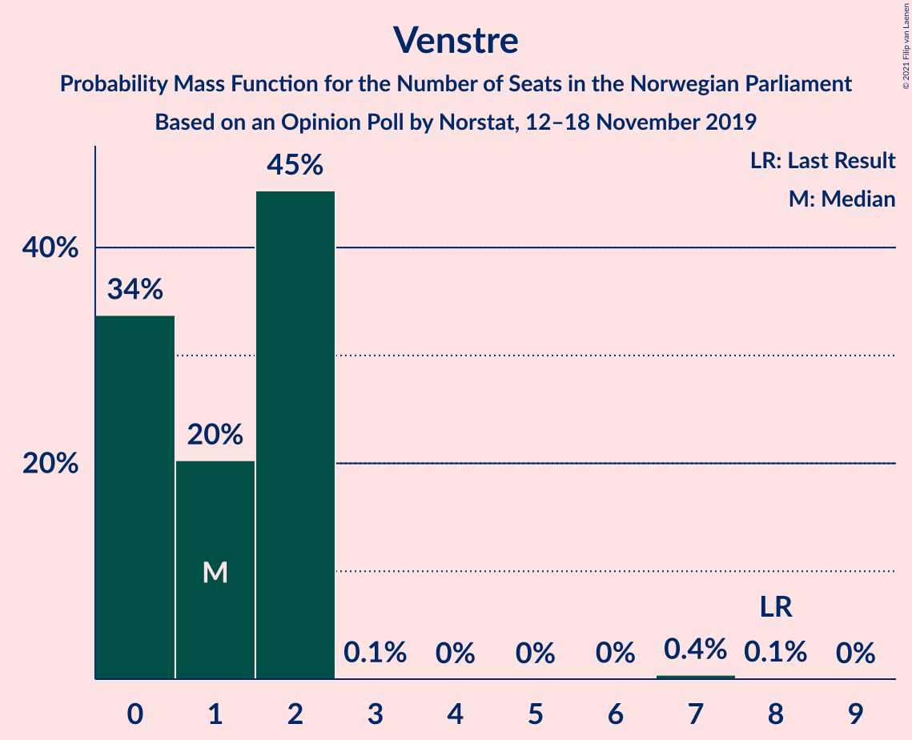
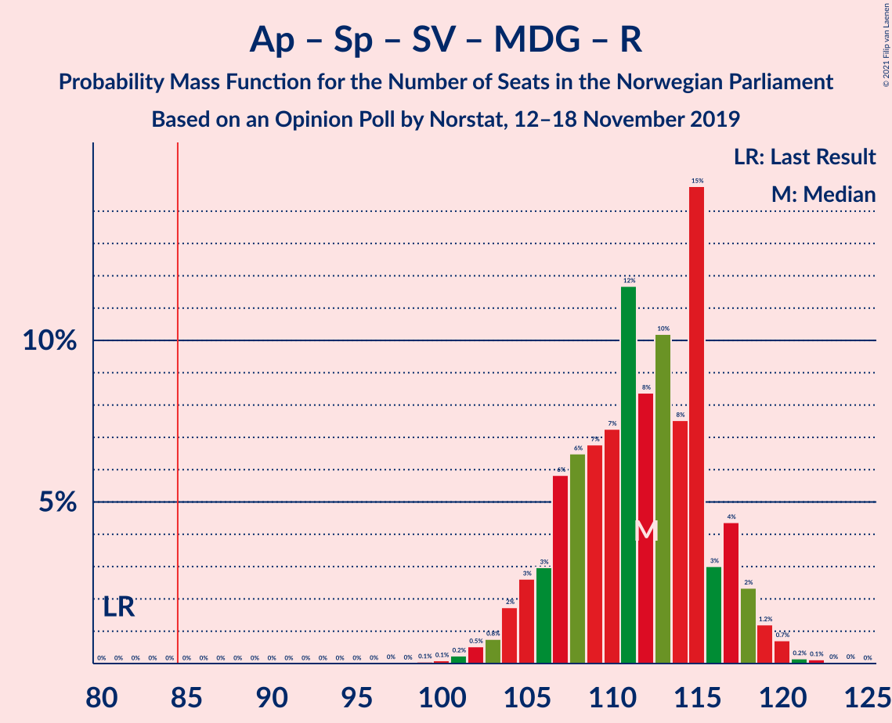
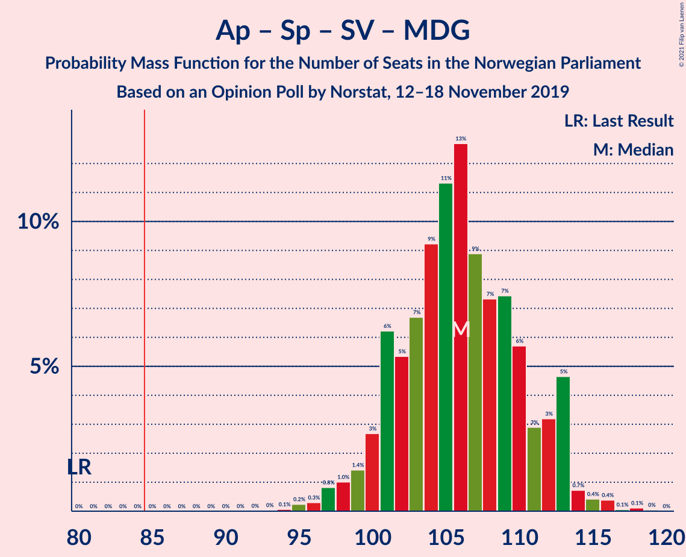
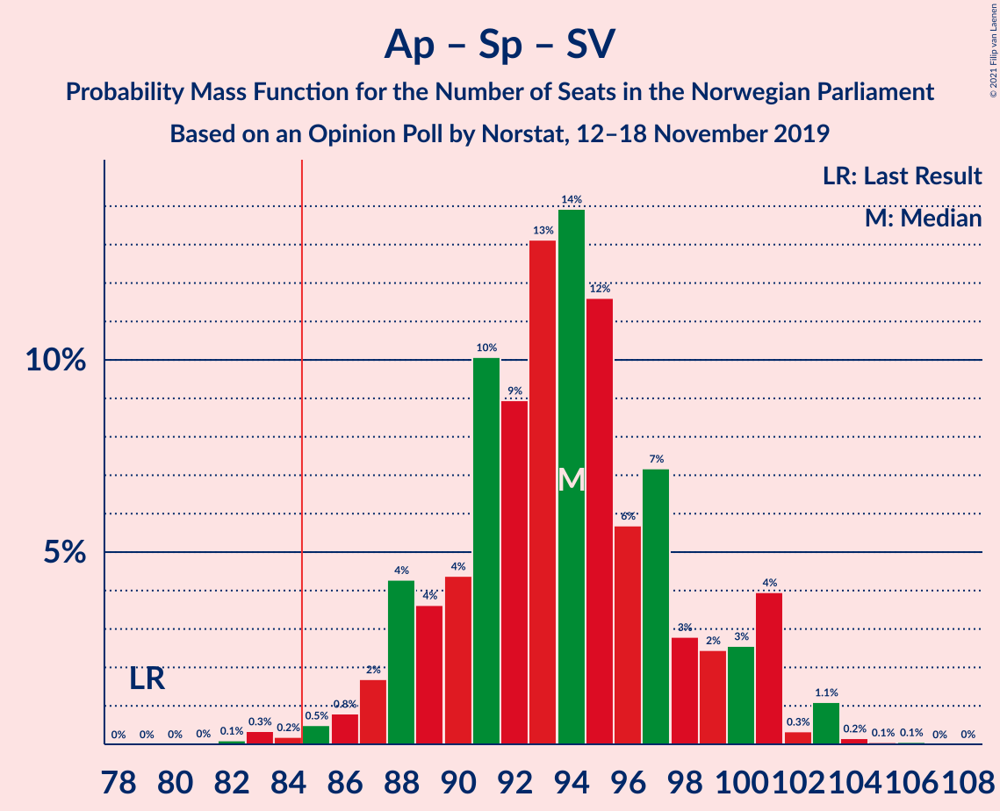
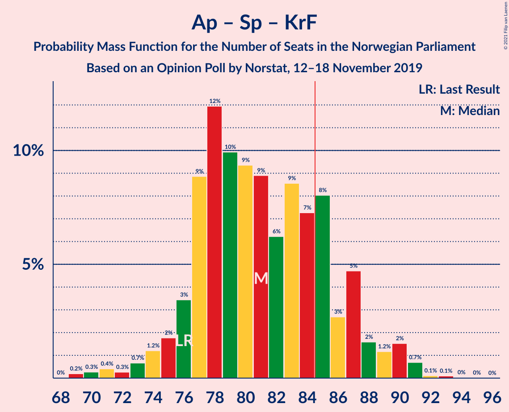
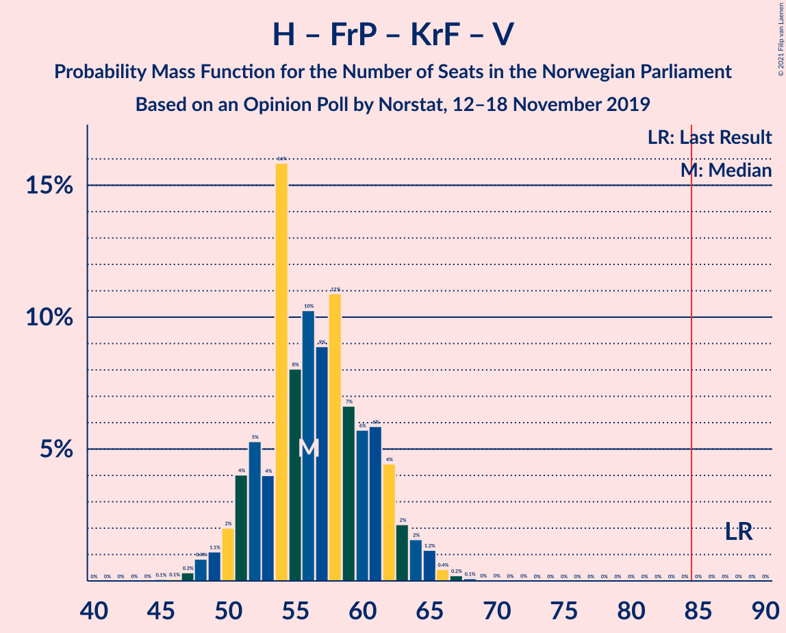
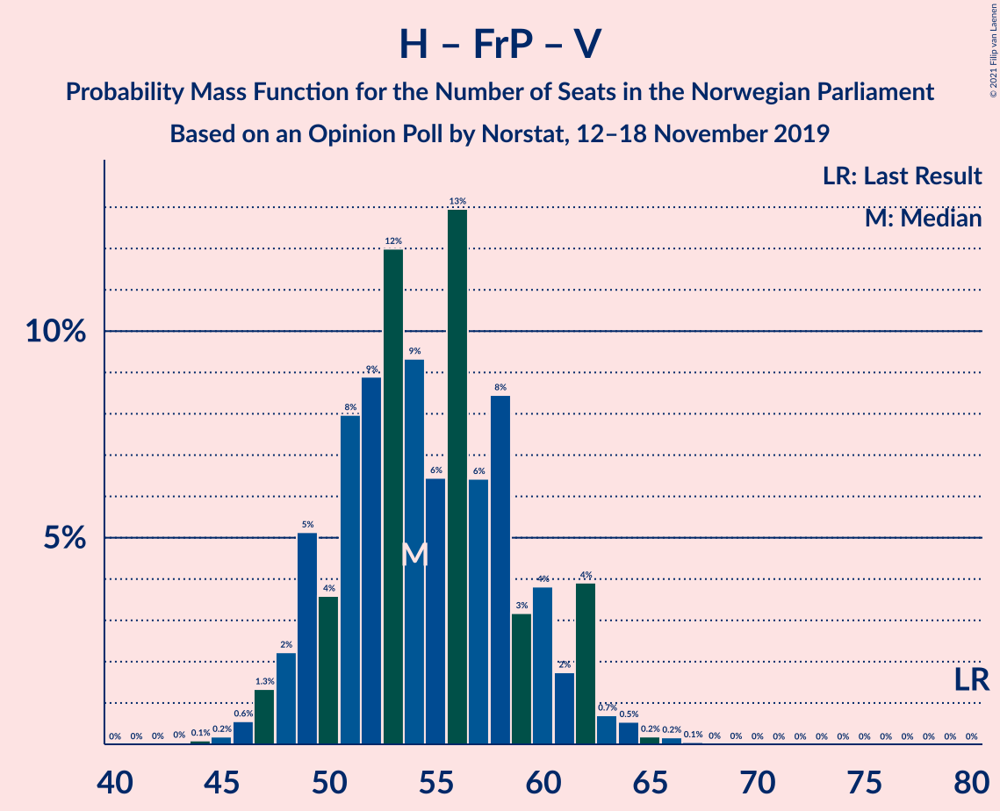
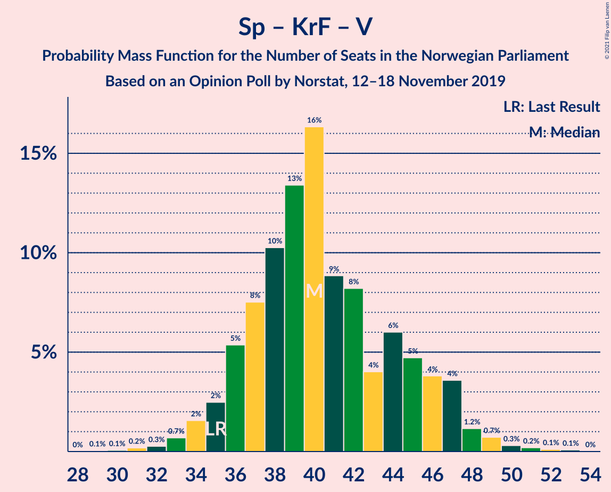

# Opinion Poll by Norstat, 12–18 November 2019

<a href="#voting-intentions">Voting Intentions</a> | <a href="#seats">Seats</a> | <a href="#coalitions">Coalitions</a> | <a href="#technical-information">Technical Information</a>

## Voting Intentions

### Confidence Intervals

| Party | Last Result | Poll Result | 80% Confidence Interval | 90% Confidence Interval | 95% Confidence Interval | 99% Confidence Interval |
|:-----:|:-----------:|:-----------:|:-----------------------:|:-----------------------:|:-----------------------:|:-----------------------:|
| Arbeiderpartiet | 27.4% | 22.9% | 20.9–25.2% |20.3–25.8% |19.8–26.4% |18.9–27.5% |
| Høyre | 25.0% | 20.9% | 18.9–23.1% |18.3–23.7% |17.9–24.2% |16.9–25.3% |
| Senterpartiet | 10.3% | 20.1% | 18.1–22.2% |17.6–22.8% |17.1–23.4% |16.2–24.4% |
| Fremskrittspartiet | 15.2% | 9.1% | 7.8–10.7% |7.4–11.2% |7.1–11.6% |6.5–12.4% |
| Sosialistisk Venstreparti | 6.0% | 8.1% | 6.9–9.7% |6.5–10.1% |6.2–10.5% |5.7–11.3% |
| Miljøpartiet De Grønne | 3.2% | 6.8% | 5.7–8.3% |5.4–8.7% |5.1–9.1% |4.6–9.9% |
| Rødt | 2.4% | 4.1% | 3.3–5.3% |3.0–5.7% |2.8–6.0% |2.5–6.6% |
| Kristelig Folkeparti | 4.2% | 2.9% | 2.2–3.9% |2.0–4.2% |1.8–4.5% |1.5–5.0% |
| Venstre | 4.4% | 2.1% | 1.5–3.0% |1.3–3.3% |1.2–3.5% |1.0–4.0% |

*Note:* The poll result column reflects the actual value used in the calculations. Published results may vary slightly, and in addition be rounded to fewer digits.

## Seats

### Confidence Intervals

| Party | Last Result | Median | 80% Confidence Interval | 90% Confidence Interval | 95% Confidence Interval | 99% Confidence Interval |
|:-----:|:-----------:|:------:|:-----------------------:|:-----------------------:|:-----------------------:|:-----------------------:|
| <a href="#arbeiderpartiet">Arbeiderpartiet</a> | 49 | 42 | 37–45 |37–45 |37–46 |34–50 |
| <a href="#høyre">Høyre</a> | 45 | 36 | 32–40 |31–41 |31–42 |31–45 |
| <a href="#senterpartiet">Senterpartiet</a> | 19 | 39 | 36–41 |35–41 |31–42 |30–43 |
| <a href="#fremskrittspartiet">Fremskrittspartiet</a> | 27 | 17 | 15–18 |14–19 |13–20 |12–20 |
| <a href="#sosialistisk-venstreparti">Sosialistisk Venstreparti</a> | 11 | 15 | 12–17 |11–17 |11–19 |9–20 |
| <a href="#miljøpartiet-de-grønne">Miljøpartiet De Grønne</a> | 1 | 12 | 10–14 |9–15 |9–16 |7–17 |
| <a href="#rødt">Rødt</a> | 1 | 7 | 2–9 |2–10 |2–10 |1–12 |
| <a href="#kristelig-folkeparti">Kristelig Folkeparti</a> | 8 | 1 | 0–3 |0–7 |0–8 |0–9 |
| <a href="#venstre">Venstre</a> | 8 | 1 | 0–2 |0–2 |0–2 |0–2 |

### Arbeiderpartiet

*For a full overview of the results for this party, see the [Arbeiderpartiet](party-arbeiderpartiet.html) page.*

| Number of Seats | Probability | Accumulated | Special Marks |
|:---------------:|:-----------:|:-----------:|:-------------:|
| 31 | 0% | 100% |  |
| 32 | 0.1% | 99.9% |  |
| 33 | 0.3% | 99.8% |  |
| 34 | 0.2% | 99.5% |  |
| 35 | 0.5% | 99.3% |  |
| 36 | 0.7% | 98.8% |  |
| 37 | 12% | 98% |  |
| 38 | 10% | 86% |  |
| 39 | 11% | 76% |  |
| 40 | 10% | 65% |  |
| 41 | 5% | 55% |  |
| 42 | 4% | 51% | Median |
| 43 | 15% | 47% |  |
| 44 | 6% | 32% |  |
| 45 | 23% | 26% |  |
| 46 | 1.0% | 3% |  |
| 47 | 0.3% | 2% |  |
| 48 | 0.2% | 1.4% |  |
| 49 | 0.4% | 1.2% | Last Result |
| 50 | 0.7% | 0.8% |  |
| 51 | 0% | 0.1% |  |
| 52 | 0% | 0% |  |

### Høyre

*For a full overview of the results for this party, see the [Høyre](party-høyre.html) page.*

| Number of Seats | Probability | Accumulated | Special Marks |
|:---------------:|:-----------:|:-----------:|:-------------:|
| 28 | 0% | 100% |  |
| 29 | 0.1% | 99.9% |  |
| 30 | 0.2% | 99.8% |  |
| 31 | 10% | 99.7% |  |
| 32 | 6% | 90% |  |
| 33 | 6% | 84% |  |
| 34 | 23% | 78% |  |
| 35 | 4% | 55% |  |
| 36 | 10% | 51% | Median |
| 37 | 7% | 41% |  |
| 38 | 6% | 34% |  |
| 39 | 16% | 27% |  |
| 40 | 4% | 12% |  |
| 41 | 3% | 7% |  |
| 42 | 2% | 4% |  |
| 43 | 0.8% | 2% |  |
| 44 | 0.4% | 1.0% |  |
| 45 | 0.5% | 0.7% | Last Result |
| 46 | 0% | 0.2% |  |
| 47 | 0.1% | 0.1% |  |
| 48 | 0% | 0.1% |  |
| 49 | 0% | 0% |  |

### Senterpartiet

*For a full overview of the results for this party, see the [Senterpartiet](party-senterpartiet.html) page.*

| Number of Seats | Probability | Accumulated | Special Marks |
|:---------------:|:-----------:|:-----------:|:-------------:|
| 19 | 0% | 100% | Last Result |
| 20 | 0% | 100% |  |
| 21 | 0% | 100% |  |
| 22 | 0% | 100% |  |
| 23 | 0% | 100% |  |
| 24 | 0% | 100% |  |
| 25 | 0% | 100% |  |
| 26 | 0% | 100% |  |
| 27 | 0% | 100% |  |
| 28 | 0% | 100% |  |
| 29 | 0.3% | 99.9% |  |
| 30 | 1.3% | 99.6% |  |
| 31 | 1.4% | 98% |  |
| 32 | 0.3% | 97% |  |
| 33 | 0.6% | 97% |  |
| 34 | 0.7% | 96% |  |
| 35 | 4% | 95% |  |
| 36 | 16% | 92% |  |
| 37 | 15% | 76% |  |
| 38 | 4% | 60% |  |
| 39 | 25% | 56% | Median |
| 40 | 13% | 31% |  |
| 41 | 13% | 17% |  |
| 42 | 3% | 4% |  |
| 43 | 1.1% | 2% |  |
| 44 | 0.2% | 0.4% |  |
| 45 | 0.2% | 0.3% |  |
| 46 | 0% | 0% |  |

### Fremskrittspartiet

*For a full overview of the results for this party, see the [Fremskrittspartiet](party-fremskrittspartiet.html) page.*

| Number of Seats | Probability | Accumulated | Special Marks |
|:---------------:|:-----------:|:-----------:|:-------------:|
| 9 | 0.1% | 100% |  |
| 10 | 0.1% | 99.9% |  |
| 11 | 0.3% | 99.8% |  |
| 12 | 1.2% | 99.5% |  |
| 13 | 2% | 98% |  |
| 14 | 3% | 96% |  |
| 15 | 8% | 93% |  |
| 16 | 11% | 86% |  |
| 17 | 33% | 74% | Median |
| 18 | 34% | 41% |  |
| 19 | 3% | 7% |  |
| 20 | 4% | 4% |  |
| 21 | 0.2% | 0.4% |  |
| 22 | 0.2% | 0.3% |  |
| 23 | 0% | 0.1% |  |
| 24 | 0% | 0% |  |
| 25 | 0% | 0% |  |
| 26 | 0% | 0% |  |
| 27 | 0% | 0% | Last Result |

### Sosialistisk Venstreparti

*For a full overview of the results for this party, see the [Sosialistisk Venstreparti](party-sosialistiskvenstreparti.html) page.*

| Number of Seats | Probability | Accumulated | Special Marks |
|:---------------:|:-----------:|:-----------:|:-------------:|
| 9 | 0.9% | 100% |  |
| 10 | 1.1% | 99.1% |  |
| 11 | 3% | 98% | Last Result |
| 12 | 9% | 95% |  |
| 13 | 12% | 85% |  |
| 14 | 15% | 74% |  |
| 15 | 10% | 59% | Median |
| 16 | 13% | 49% |  |
| 17 | 32% | 36% |  |
| 18 | 1.1% | 4% |  |
| 19 | 0.9% | 3% |  |
| 20 | 2% | 2% |  |
| 21 | 0.1% | 0.2% |  |
| 22 | 0% | 0.1% |  |
| 23 | 0% | 0% |  |

### Miljøpartiet De Grønne

*For a full overview of the results for this party, see the [Miljøpartiet De Grønne](party-miljøpartietdegrønne.html) page.*

| Number of Seats | Probability | Accumulated | Special Marks |
|:---------------:|:-----------:|:-----------:|:-------------:|
| 1 | 0% | 100% | Last Result |
| 2 | 0% | 100% |  |
| 3 | 0.1% | 100% |  |
| 4 | 0% | 99.9% |  |
| 5 | 0% | 99.9% |  |
| 6 | 0% | 99.9% |  |
| 7 | 0.5% | 99.9% |  |
| 8 | 1.0% | 99.3% |  |
| 9 | 8% | 98% |  |
| 10 | 5% | 90% |  |
| 11 | 15% | 85% |  |
| 12 | 36% | 70% | Median |
| 13 | 19% | 34% |  |
| 14 | 8% | 14% |  |
| 15 | 3% | 7% |  |
| 16 | 3% | 3% |  |
| 17 | 0.3% | 0.6% |  |
| 18 | 0.3% | 0.3% |  |
| 19 | 0% | 0% |  |

### Rødt

*For a full overview of the results for this party, see the [Rødt](party-rødt.html) page.*

| Number of Seats | Probability | Accumulated | Special Marks |
|:---------------:|:-----------:|:-----------:|:-------------:|
| 1 | 2% | 100% | Last Result |
| 2 | 37% | 98% |  |
| 3 | 0.1% | 61% |  |
| 4 | 0% | 61% |  |
| 5 | 0% | 61% |  |
| 6 | 0.6% | 61% |  |
| 7 | 17% | 60% | Median |
| 8 | 17% | 43% |  |
| 9 | 16% | 26% |  |
| 10 | 8% | 10% |  |
| 11 | 1.2% | 2% |  |
| 12 | 0.6% | 0.6% |  |
| 13 | 0% | 0.1% |  |
| 14 | 0% | 0% |  |

### Kristelig Folkeparti

*For a full overview of the results for this party, see the [Kristelig Folkeparti](party-kristeligfolkeparti.html) page.*

| Number of Seats | Probability | Accumulated | Special Marks |
|:---------------:|:-----------:|:-----------:|:-------------:|
| 0 | 13% | 100% |  |
| 1 | 49% | 87% | Median |
| 2 | 18% | 38% |  |
| 3 | 14% | 20% |  |
| 4 | 0% | 6% |  |
| 5 | 0% | 6% |  |
| 6 | 0.1% | 6% |  |
| 7 | 3% | 6% |  |
| 8 | 2% | 3% | Last Result |
| 9 | 1.2% | 1.3% |  |
| 10 | 0% | 0.1% |  |
| 11 | 0% | 0% |  |

### Venstre

*For a full overview of the results for this party, see the [Venstre](party-venstre.html) page.*

| Number of Seats | Probability | Accumulated | Special Marks |
|:---------------:|:-----------:|:-----------:|:-------------:|
| 0 | 27% | 100% |  |
| 1 | 46% | 73% | Median |
| 2 | 26% | 26% |  |
| 3 | 0.1% | 0.4% |  |
| 4 | 0% | 0.3% |  |
| 5 | 0% | 0.3% |  |
| 6 | 0% | 0.3% |  |
| 7 | 0.3% | 0.3% |  |
| 8 | 0% | 0% | Last Result |

## Coalitions

### Confidence Intervals

| Coalition | Last Result | Median | Majority? | 80% Confidence Interval | 90% Confidence Interval | 95% Confidence Interval | 99% Confidence Interval |
|:---------:|:-----------:|:------:|:---------:|:-----------------------:|:-----------------------:|:-----------------------:|:-----------------------:|
| Arbeiderpartiet – Senterpartiet – Sosialistisk Venstreparti – Miljøpartiet De Grønne – Rødt | 81 | 114 | 100% | 107–116 | 105–118 | 104–118 | 102–120 |
| Arbeiderpartiet – Senterpartiet – Sosialistisk Venstreparti – Miljøpartiet De Grønne – Kristelig Folkeparti | 88 | 108 | 100% | 104–114 | 102–114 | 99–114 | 96–116 |
| Arbeiderpartiet – Senterpartiet – Sosialistisk Venstreparti – Miljøpartiet De Grønne | 80 | 106 | 100% | 101–113 | 100–113 | 97–113 | 95–114 |
| Arbeiderpartiet – Senterpartiet – Sosialistisk Venstreparti – Rødt | 80 | 102 | 100% | 96–104 | 93–105 | 92–106 | 90–108 |
| Høyre – Senterpartiet – Fremskrittspartiet – Kristelig Folkeparti – Venstre | 107 | 93 | 99.7% | 90–98 | 88–99 | 88–101 | 86–106 |
| Arbeiderpartiet – Senterpartiet – Sosialistisk Venstreparti | 79 | 95 | 98% | 88–101 | 88–101 | 85–101 | 83–103 |
| Arbeiderpartiet – Senterpartiet – Miljøpartiet De Grønne – Kristelig Folkeparti | 77 | 93 | 98.5% | 89–97 | 88–97 | 85–99 | 83–101 |
| Arbeiderpartiet – Senterpartiet – Kristelig Folkeparti | 76 | 82 | 26% | 77–85 | 77–86 | 72–87 | 70–89 |
| Arbeiderpartiet – Senterpartiet | 68 | 79 | 2% | 75–84 | 75–84 | 70–84 | 69–88 |
| Høyre – Fremskrittspartiet – Miljøpartiet De Grønne – Kristelig Folkeparti – Venstre | 89 | 66 | 0% | 63–72 | 61–74 | 60–76 | 60–77 |
| Høyre – Fremskrittspartiet – Kristelig Folkeparti – Venstre | 88 | 55 | 0% | 51–60 | 50–63 | 48–63 | 48–65 |
| Arbeiderpartiet – Sosialistisk Venstreparti | 60 | 55 | 0% | 51–62 | 51–62 | 49–62 | 47–65 |
| Høyre – Fremskrittspartiet – Venstre | 80 | 53 | 0% | 50–57 | 48–59 | 47–62 | 47–63 |
| Høyre – Fremskrittspartiet | 72 | 53 | 0% | 49–56 | 47–58 | 46–60 | 46–62 |
| Høyre – Kristelig Folkeparti – Venstre | 61 | 38 | 0% | 34–43 | 34–45 | 33–48 | 33–49 |
| Senterpartiet – Kristelig Folkeparti – Venstre | 35 | 41 | 0% | 38–44 | 37–45 | 34–46 | 32–50 |

### Arbeiderpartiet – Senterpartiet – Sosialistisk Venstreparti – Miljøpartiet De Grønne – Rødt

| Number of Seats | Probability | Accumulated | Special Marks |
|:---------------:|:-----------:|:-----------:|:-------------:|
| 81 | 0% | 100% | Last Result |
| 82 | 0% | 100% |  |
| 83 | 0% | 100% |  |
| 84 | 0% | 100% |  |
| 85 | 0% | 100% | Majority |
| 86 | 0% | 100% |  |
| 87 | 0% | 100% |  |
| 88 | 0% | 100% |  |
| 89 | 0% | 100% |  |
| 90 | 0% | 100% |  |
| 91 | 0% | 100% |  |
| 92 | 0% | 100% |  |
| 93 | 0% | 100% |  |
| 94 | 0% | 100% |  |
| 95 | 0% | 100% |  |
| 96 | 0% | 100% |  |
| 97 | 0% | 100% |  |
| 98 | 0% | 100% |  |
| 99 | 0.1% | 100% |  |
| 100 | 0.1% | 99.9% |  |
| 101 | 0.3% | 99.8% |  |
| 102 | 0.9% | 99.6% |  |
| 103 | 0.7% | 98.6% |  |
| 104 | 2% | 98% |  |
| 105 | 1.1% | 96% |  |
| 106 | 4% | 95% |  |
| 107 | 2% | 91% |  |
| 108 | 2% | 89% |  |
| 109 | 4% | 87% |  |
| 110 | 5% | 83% |  |
| 111 | 16% | 78% |  |
| 112 | 7% | 62% |  |
| 113 | 2% | 55% |  |
| 114 | 12% | 52% |  |
| 115 | 30% | 41% | Median |
| 116 | 2% | 10% |  |
| 117 | 2% | 8% |  |
| 118 | 5% | 6% |  |
| 119 | 0.3% | 0.8% |  |
| 120 | 0.3% | 0.5% |  |
| 121 | 0.1% | 0.2% |  |
| 122 | 0% | 0.1% |  |
| 123 | 0% | 0% |  |

### Arbeiderpartiet – Senterpartiet – Sosialistisk Venstreparti – Miljøpartiet De Grønne – Kristelig Folkeparti

| Number of Seats | Probability | Accumulated | Special Marks |
|:---------------:|:-----------:|:-----------:|:-------------:|
| 88 | 0% | 100% | Last Result |
| 89 | 0% | 100% |  |
| 90 | 0% | 100% |  |
| 91 | 0% | 100% |  |
| 92 | 0% | 100% |  |
| 93 | 0% | 100% |  |
| 94 | 0% | 100% |  |
| 95 | 0% | 100% |  |
| 96 | 0.5% | 99.9% |  |
| 97 | 0% | 99.4% |  |
| 98 | 1.2% | 99.4% |  |
| 99 | 0.9% | 98% |  |
| 100 | 0.1% | 97% |  |
| 101 | 0.9% | 97% |  |
| 102 | 2% | 96% |  |
| 103 | 3% | 94% |  |
| 104 | 11% | 92% |  |
| 105 | 6% | 81% |  |
| 106 | 16% | 75% |  |
| 107 | 4% | 59% |  |
| 108 | 10% | 55% |  |
| 109 | 3% | 44% | Median |
| 110 | 3% | 41% |  |
| 111 | 12% | 38% |  |
| 112 | 3% | 26% |  |
| 113 | 0.8% | 23% |  |
| 114 | 20% | 23% |  |
| 115 | 2% | 2% |  |
| 116 | 0.3% | 0.6% |  |
| 117 | 0.2% | 0.4% |  |
| 118 | 0.1% | 0.1% |  |
| 119 | 0% | 0% |  |

### Arbeiderpartiet – Senterpartiet – Sosialistisk Venstreparti – Miljøpartiet De Grønne

| Number of Seats | Probability | Accumulated | Special Marks |
|:---------------:|:-----------:|:-----------:|:-------------:|
| 80 | 0% | 100% | Last Result |
| 81 | 0% | 100% |  |
| 82 | 0% | 100% |  |
| 83 | 0% | 100% |  |
| 84 | 0% | 100% |  |
| 85 | 0% | 100% | Majority |
| 86 | 0% | 100% |  |
| 87 | 0% | 100% |  |
| 88 | 0% | 100% |  |
| 89 | 0% | 100% |  |
| 90 | 0% | 100% |  |
| 91 | 0% | 100% |  |
| 92 | 0% | 100% |  |
| 93 | 0.1% | 100% |  |
| 94 | 0.1% | 99.9% |  |
| 95 | 0.4% | 99.8% |  |
| 96 | 0.6% | 99.4% |  |
| 97 | 1.3% | 98.8% |  |
| 98 | 1.0% | 97% |  |
| 99 | 0.6% | 96% |  |
| 100 | 2% | 96% |  |
| 101 | 6% | 94% |  |
| 102 | 8% | 88% |  |
| 103 | 3% | 80% |  |
| 104 | 13% | 77% |  |
| 105 | 7% | 64% |  |
| 106 | 10% | 56% |  |
| 107 | 10% | 46% |  |
| 108 | 1.2% | 37% | Median |
| 109 | 0.8% | 35% |  |
| 110 | 11% | 34% |  |
| 111 | 0.4% | 23% |  |
| 112 | 1.0% | 23% |  |
| 113 | 20% | 22% |  |
| 114 | 2% | 2% |  |
| 115 | 0.3% | 0.5% |  |
| 116 | 0.1% | 0.2% |  |
| 117 | 0% | 0.1% |  |
| 118 | 0% | 0.1% |  |
| 119 | 0% | 0% |  |

### Arbeiderpartiet – Senterpartiet – Sosialistisk Venstreparti – Rødt

| Number of Seats | Probability | Accumulated | Special Marks |
|:---------------:|:-----------:|:-----------:|:-------------:|
| 80 | 0% | 100% | Last Result |
| 81 | 0% | 100% |  |
| 82 | 0% | 100% |  |
| 83 | 0% | 100% |  |
| 84 | 0% | 100% |  |
| 85 | 0% | 100% | Majority |
| 86 | 0.1% | 99.9% |  |
| 87 | 0% | 99.9% |  |
| 88 | 0.1% | 99.9% |  |
| 89 | 0.1% | 99.7% |  |
| 90 | 0.6% | 99.7% |  |
| 91 | 0.5% | 99.1% |  |
| 92 | 3% | 98.6% |  |
| 93 | 2% | 96% |  |
| 94 | 1.3% | 94% |  |
| 95 | 2% | 92% |  |
| 96 | 4% | 90% |  |
| 97 | 10% | 87% |  |
| 98 | 9% | 77% |  |
| 99 | 4% | 67% |  |
| 100 | 2% | 63% |  |
| 101 | 5% | 61% |  |
| 102 | 11% | 56% |  |
| 103 | 34% | 45% | Median |
| 104 | 0.9% | 10% |  |
| 105 | 7% | 9% |  |
| 106 | 0.4% | 3% |  |
| 107 | 2% | 2% |  |
| 108 | 0.7% | 0.9% |  |
| 109 | 0.1% | 0.1% |  |
| 110 | 0% | 0.1% |  |
| 111 | 0% | 0% |  |

### Høyre – Senterpartiet – Fremskrittspartiet – Kristelig Folkeparti – Venstre

| Number of Seats | Probability | Accumulated | Special Marks |
|:---------------:|:-----------:|:-----------:|:-------------:|
| 82 | 0.1% | 100% |  |
| 83 | 0.1% | 99.9% |  |
| 84 | 0.1% | 99.8% |  |
| 85 | 0.1% | 99.7% | Majority |
| 86 | 0.5% | 99.6% |  |
| 87 | 0.4% | 99.1% |  |
| 88 | 6% | 98.7% |  |
| 89 | 2% | 93% |  |
| 90 | 4% | 91% |  |
| 91 | 14% | 86% |  |
| 92 | 2% | 72% |  |
| 93 | 23% | 71% |  |
| 94 | 10% | 48% | Median |
| 95 | 11% | 38% |  |
| 96 | 7% | 27% |  |
| 97 | 2% | 19% |  |
| 98 | 9% | 18% |  |
| 99 | 4% | 8% |  |
| 100 | 1.0% | 5% |  |
| 101 | 2% | 4% |  |
| 102 | 0.5% | 2% |  |
| 103 | 0.3% | 2% |  |
| 104 | 0.4% | 1.2% |  |
| 105 | 0.2% | 0.8% |  |
| 106 | 0.5% | 0.6% |  |
| 107 | 0.1% | 0.1% | Last Result |
| 108 | 0% | 0% |  |

### Arbeiderpartiet – Senterpartiet – Sosialistisk Venstreparti

| Number of Seats | Probability | Accumulated | Special Marks |
|:---------------:|:-----------:|:-----------:|:-------------:|
| 79 | 0% | 100% | Last Result |
| 80 | 0% | 100% |  |
| 81 | 0% | 100% |  |
| 82 | 0.2% | 100% |  |
| 83 | 2% | 99.8% |  |
| 84 | 0.1% | 98% |  |
| 85 | 0.8% | 98% | Majority |
| 86 | 0.8% | 97% |  |
| 87 | 0.5% | 96% |  |
| 88 | 6% | 96% |  |
| 89 | 1.3% | 90% |  |
| 90 | 2% | 88% |  |
| 91 | 10% | 86% |  |
| 92 | 9% | 76% |  |
| 93 | 7% | 67% |  |
| 94 | 8% | 61% |  |
| 95 | 19% | 53% |  |
| 96 | 2% | 34% | Median |
| 97 | 8% | 32% |  |
| 98 | 0.6% | 24% |  |
| 99 | 1.4% | 23% |  |
| 100 | 0.5% | 22% |  |
| 101 | 20% | 22% |  |
| 102 | 0.1% | 2% |  |
| 103 | 1.3% | 2% |  |
| 104 | 0.2% | 0.3% |  |
| 105 | 0% | 0.1% |  |
| 106 | 0% | 0% |  |

### Arbeiderpartiet – Senterpartiet – Miljøpartiet De Grønne – Kristelig Folkeparti

| Number of Seats | Probability | Accumulated | Special Marks |
|:---------------:|:-----------:|:-----------:|:-------------:|
| 77 | 0% | 100% | Last Result |
| 78 | 0% | 100% |  |
| 79 | 0% | 100% |  |
| 80 | 0% | 100% |  |
| 81 | 0.4% | 100% |  |
| 82 | 0% | 99.6% |  |
| 83 | 0.9% | 99.5% |  |
| 84 | 0.1% | 98.6% |  |
| 85 | 1.3% | 98.5% | Majority |
| 86 | 0.8% | 97% |  |
| 87 | 0.9% | 96% |  |
| 88 | 2% | 96% |  |
| 89 | 8% | 94% |  |
| 90 | 10% | 86% |  |
| 91 | 13% | 75% |  |
| 92 | 2% | 62% |  |
| 93 | 11% | 60% |  |
| 94 | 5% | 48% | Median |
| 95 | 4% | 44% |  |
| 96 | 8% | 39% |  |
| 97 | 26% | 31% |  |
| 98 | 2% | 5% |  |
| 99 | 2% | 3% |  |
| 100 | 0.5% | 2% |  |
| 101 | 0.5% | 1.0% |  |
| 102 | 0% | 0.5% |  |
| 103 | 0.4% | 0.4% |  |
| 104 | 0% | 0.1% |  |
| 105 | 0% | 0.1% |  |
| 106 | 0% | 0% |  |

### Arbeiderpartiet – Senterpartiet – Kristelig Folkeparti

| Number of Seats | Probability | Accumulated | Special Marks |
|:---------------:|:-----------:|:-----------:|:-------------:|
| 68 | 0% | 100% |  |
| 69 | 0.4% | 99.9% |  |
| 70 | 0.7% | 99.5% |  |
| 71 | 1.3% | 98.8% |  |
| 72 | 0.1% | 98% |  |
| 73 | 0.3% | 97% |  |
| 74 | 0.2% | 97% |  |
| 75 | 0.5% | 97% |  |
| 76 | 0.8% | 96% | Last Result |
| 77 | 14% | 96% |  |
| 78 | 8% | 82% |  |
| 79 | 7% | 73% |  |
| 80 | 7% | 66% |  |
| 81 | 8% | 59% |  |
| 82 | 6% | 51% | Median |
| 83 | 3% | 45% |  |
| 84 | 15% | 41% |  |
| 85 | 21% | 26% | Majority |
| 86 | 1.0% | 5% |  |
| 87 | 2% | 4% |  |
| 88 | 1.2% | 2% |  |
| 89 | 0.7% | 1.1% |  |
| 90 | 0.1% | 0.4% |  |
| 91 | 0.3% | 0.3% |  |
| 92 | 0% | 0.1% |  |
| 93 | 0% | 0% |  |

### Arbeiderpartiet – Senterpartiet

| Number of Seats | Probability | Accumulated | Special Marks |
|:---------------:|:-----------:|:-----------:|:-------------:|
| 67 | 0% | 100% |  |
| 68 | 0.4% | 99.9% | Last Result |
| 69 | 0.7% | 99.5% |  |
| 70 | 1.3% | 98.8% |  |
| 71 | 0.2% | 97% |  |
| 72 | 0.6% | 97% |  |
| 73 | 0.2% | 97% |  |
| 74 | 0.8% | 96% |  |
| 75 | 15% | 96% |  |
| 76 | 2% | 81% |  |
| 77 | 6% | 79% |  |
| 78 | 14% | 73% |  |
| 79 | 10% | 59% |  |
| 80 | 7% | 49% |  |
| 81 | 5% | 42% | Median |
| 82 | 2% | 37% |  |
| 83 | 13% | 35% |  |
| 84 | 20% | 22% |  |
| 85 | 0.4% | 2% | Majority |
| 86 | 0.2% | 1.2% |  |
| 87 | 0.4% | 0.9% |  |
| 88 | 0.4% | 0.6% |  |
| 89 | 0.1% | 0.2% |  |
| 90 | 0% | 0% |  |

### Høyre – Fremskrittspartiet – Miljøpartiet De Grønne – Kristelig Folkeparti – Venstre

| Number of Seats | Probability | Accumulated | Special Marks |
|:---------------:|:-----------:|:-----------:|:-------------:|
| 57 | 0% | 100% |  |
| 58 | 0.1% | 99.9% |  |
| 59 | 0.1% | 99.8% |  |
| 60 | 4% | 99.7% |  |
| 61 | 1.1% | 95% |  |
| 62 | 3% | 94% |  |
| 63 | 2% | 91% |  |
| 64 | 7% | 89% |  |
| 65 | 0.8% | 83% |  |
| 66 | 35% | 82% |  |
| 67 | 7% | 47% | Median |
| 68 | 5% | 40% |  |
| 69 | 3% | 34% |  |
| 70 | 3% | 32% |  |
| 71 | 8% | 29% |  |
| 72 | 11% | 20% |  |
| 73 | 4% | 10% |  |
| 74 | 1.5% | 6% |  |
| 75 | 1.1% | 5% |  |
| 76 | 1.1% | 3% |  |
| 77 | 2% | 2% |  |
| 78 | 0.1% | 0.5% |  |
| 79 | 0.2% | 0.4% |  |
| 80 | 0.1% | 0.2% |  |
| 81 | 0.1% | 0.2% |  |
| 82 | 0% | 0.1% |  |
| 83 | 0.1% | 0.1% |  |
| 84 | 0% | 0% |  |
| 85 | 0% | 0% | Majority |
| 86 | 0% | 0% |  |
| 87 | 0% | 0% |  |
| 88 | 0% | 0% |  |
| 89 | 0% | 0% | Last Result |

### Høyre – Fremskrittspartiet – Kristelig Folkeparti – Venstre

| Number of Seats | Probability | Accumulated | Special Marks |
|:---------------:|:-----------:|:-----------:|:-------------:|
| 46 | 0.1% | 100% |  |
| 47 | 0% | 99.9% |  |
| 48 | 4% | 99.9% |  |
| 49 | 0.4% | 96% |  |
| 50 | 0.4% | 95% |  |
| 51 | 7% | 95% |  |
| 52 | 3% | 88% |  |
| 53 | 2% | 85% |  |
| 54 | 32% | 83% |  |
| 55 | 9% | 51% | Median |
| 56 | 2% | 43% |  |
| 57 | 7% | 40% |  |
| 58 | 17% | 33% |  |
| 59 | 4% | 16% |  |
| 60 | 4% | 12% |  |
| 61 | 2% | 8% |  |
| 62 | 1.2% | 7% |  |
| 63 | 4% | 5% |  |
| 64 | 1.0% | 2% |  |
| 65 | 0.6% | 0.9% |  |
| 66 | 0.1% | 0.4% |  |
| 67 | 0.1% | 0.3% |  |
| 68 | 0.1% | 0.2% |  |
| 69 | 0% | 0.1% |  |
| 70 | 0.1% | 0.1% |  |
| 71 | 0% | 0% |  |
| 72 | 0% | 0% |  |
| 73 | 0% | 0% |  |
| 74 | 0% | 0% |  |
| 75 | 0% | 0% |  |
| 76 | 0% | 0% |  |
| 77 | 0% | 0% |  |
| 78 | 0% | 0% |  |
| 79 | 0% | 0% |  |
| 80 | 0% | 0% |  |
| 81 | 0% | 0% |  |
| 82 | 0% | 0% |  |
| 83 | 0% | 0% |  |
| 84 | 0% | 0% |  |
| 85 | 0% | 0% | Majority |
| 86 | 0% | 0% |  |
| 87 | 0% | 0% |  |
| 88 | 0% | 0% | Last Result |

### Arbeiderpartiet – Sosialistisk Venstreparti

| Number of Seats | Probability | Accumulated | Special Marks |
|:---------------:|:-----------:|:-----------:|:-------------:|
| 44 | 0% | 100% |  |
| 45 | 0% | 99.9% |  |
| 46 | 0.2% | 99.9% |  |
| 47 | 0.2% | 99.7% |  |
| 48 | 1.0% | 99.5% |  |
| 49 | 1.3% | 98.5% |  |
| 50 | 2% | 97% |  |
| 51 | 6% | 95% |  |
| 52 | 8% | 89% |  |
| 53 | 4% | 81% |  |
| 54 | 10% | 77% |  |
| 55 | 18% | 67% |  |
| 56 | 3% | 50% |  |
| 57 | 7% | 47% | Median |
| 58 | 9% | 39% |  |
| 59 | 5% | 31% |  |
| 60 | 2% | 25% | Last Result |
| 61 | 0.7% | 23% |  |
| 62 | 20% | 23% |  |
| 63 | 0.4% | 2% |  |
| 64 | 0.5% | 2% |  |
| 65 | 1.4% | 2% |  |
| 66 | 0.1% | 0.1% |  |
| 67 | 0% | 0.1% |  |
| 68 | 0% | 0.1% |  |
| 69 | 0% | 0% |  |

### Høyre – Fremskrittspartiet – Venstre

| Number of Seats | Probability | Accumulated | Special Marks |
|:---------------:|:-----------:|:-----------:|:-------------:|
| 45 | 0.1% | 100% |  |
| 46 | 0.2% | 99.9% |  |
| 47 | 4% | 99.7% |  |
| 48 | 1.3% | 96% |  |
| 49 | 0.8% | 94% |  |
| 50 | 7% | 94% |  |
| 51 | 8% | 86% |  |
| 52 | 4% | 78% |  |
| 53 | 25% | 74% |  |
| 54 | 5% | 49% | Median |
| 55 | 8% | 44% |  |
| 56 | 25% | 36% |  |
| 57 | 3% | 11% |  |
| 58 | 2% | 8% |  |
| 59 | 2% | 6% |  |
| 60 | 0.4% | 4% |  |
| 61 | 0.4% | 4% |  |
| 62 | 2% | 3% |  |
| 63 | 0.8% | 1.2% |  |
| 64 | 0.2% | 0.5% |  |
| 65 | 0.1% | 0.3% |  |
| 66 | 0.1% | 0.2% |  |
| 67 | 0% | 0.1% |  |
| 68 | 0% | 0.1% |  |
| 69 | 0% | 0% |  |
| 70 | 0% | 0% |  |
| 71 | 0% | 0% |  |
| 72 | 0% | 0% |  |
| 73 | 0% | 0% |  |
| 74 | 0% | 0% |  |
| 75 | 0% | 0% |  |
| 76 | 0% | 0% |  |
| 77 | 0% | 0% |  |
| 78 | 0% | 0% |  |
| 79 | 0% | 0% |  |
| 80 | 0% | 0% | Last Result |

### Høyre – Fremskrittspartiet

| Number of Seats | Probability | Accumulated | Special Marks |
|:---------------:|:-----------:|:-----------:|:-------------:|
| 44 | 0% | 100% |  |
| 45 | 0.1% | 99.9% |  |
| 46 | 4% | 99.8% |  |
| 47 | 0.7% | 95% |  |
| 48 | 1.4% | 95% |  |
| 49 | 12% | 93% |  |
| 50 | 3% | 81% |  |
| 51 | 5% | 78% |  |
| 52 | 21% | 73% |  |
| 53 | 7% | 52% | Median |
| 54 | 17% | 45% |  |
| 55 | 2% | 28% |  |
| 56 | 18% | 25% |  |
| 57 | 2% | 7% |  |
| 58 | 0.9% | 5% |  |
| 59 | 0.9% | 4% |  |
| 60 | 2% | 3% |  |
| 61 | 0.7% | 1.2% |  |
| 62 | 0.3% | 0.5% |  |
| 63 | 0.1% | 0.2% |  |
| 64 | 0% | 0.1% |  |
| 65 | 0% | 0.1% |  |
| 66 | 0% | 0.1% |  |
| 67 | 0% | 0% |  |
| 68 | 0% | 0% |  |
| 69 | 0% | 0% |  |
| 70 | 0% | 0% |  |
| 71 | 0% | 0% |  |
| 72 | 0% | 0% | Last Result |

### Høyre – Kristelig Folkeparti – Venstre

| Number of Seats | Probability | Accumulated | Special Marks |
|:---------------:|:-----------:|:-----------:|:-------------:|
| 31 | 0.1% | 100% |  |
| 32 | 0.1% | 99.8% |  |
| 33 | 4% | 99.7% |  |
| 34 | 8% | 95% |  |
| 35 | 2% | 87% |  |
| 36 | 28% | 85% |  |
| 37 | 4% | 57% |  |
| 38 | 7% | 53% | Median |
| 39 | 5% | 46% |  |
| 40 | 4% | 41% |  |
| 41 | 19% | 37% |  |
| 42 | 3% | 18% |  |
| 43 | 5% | 15% |  |
| 44 | 2% | 10% |  |
| 45 | 4% | 7% |  |
| 46 | 0.6% | 4% |  |
| 47 | 0.5% | 3% |  |
| 48 | 1.3% | 3% |  |
| 49 | 1.1% | 1.3% |  |
| 50 | 0.1% | 0.2% |  |
| 51 | 0.1% | 0.2% |  |
| 52 | 0% | 0.1% |  |
| 53 | 0% | 0% |  |
| 54 | 0% | 0% |  |
| 55 | 0% | 0% |  |
| 56 | 0% | 0% |  |
| 57 | 0% | 0% |  |
| 58 | 0% | 0% |  |
| 59 | 0% | 0% |  |
| 60 | 0% | 0% |  |
| 61 | 0% | 0% | Last Result |

### Senterpartiet – Kristelig Folkeparti – Venstre

| Number of Seats | Probability | Accumulated | Special Marks |
|:---------------:|:-----------:|:-----------:|:-------------:|
| 30 | 0% | 100% |  |
| 31 | 0.3% | 99.9% |  |
| 32 | 0.1% | 99.6% |  |
| 33 | 1.4% | 99.5% |  |
| 34 | 1.3% | 98% |  |
| 35 | 0.3% | 97% | Last Result |
| 36 | 1.2% | 97% |  |
| 37 | 3% | 95% |  |
| 38 | 11% | 92% |  |
| 39 | 11% | 82% |  |
| 40 | 3% | 71% |  |
| 41 | 21% | 68% | Median |
| 42 | 28% | 47% |  |
| 43 | 3% | 19% |  |
| 44 | 9% | 16% |  |
| 45 | 4% | 7% |  |
| 46 | 0.6% | 3% |  |
| 47 | 0.6% | 2% |  |
| 48 | 0.3% | 1.4% |  |
| 49 | 0.4% | 1.2% |  |
| 50 | 0.4% | 0.8% |  |
| 51 | 0.2% | 0.4% |  |
| 52 | 0.2% | 0.2% |  |
| 53 | 0% | 0% |  |

## Technical Information

### Opinion Poll

+ **Polling firm:** Norstat
+ **Commissioner(s):** —
+ **Fieldwork period:** 12–18 November 2019

### Calculations

+ **Sample size:** 628
+ **Simulations done:** 131,072
+ **Error estimate:** 3.66%

