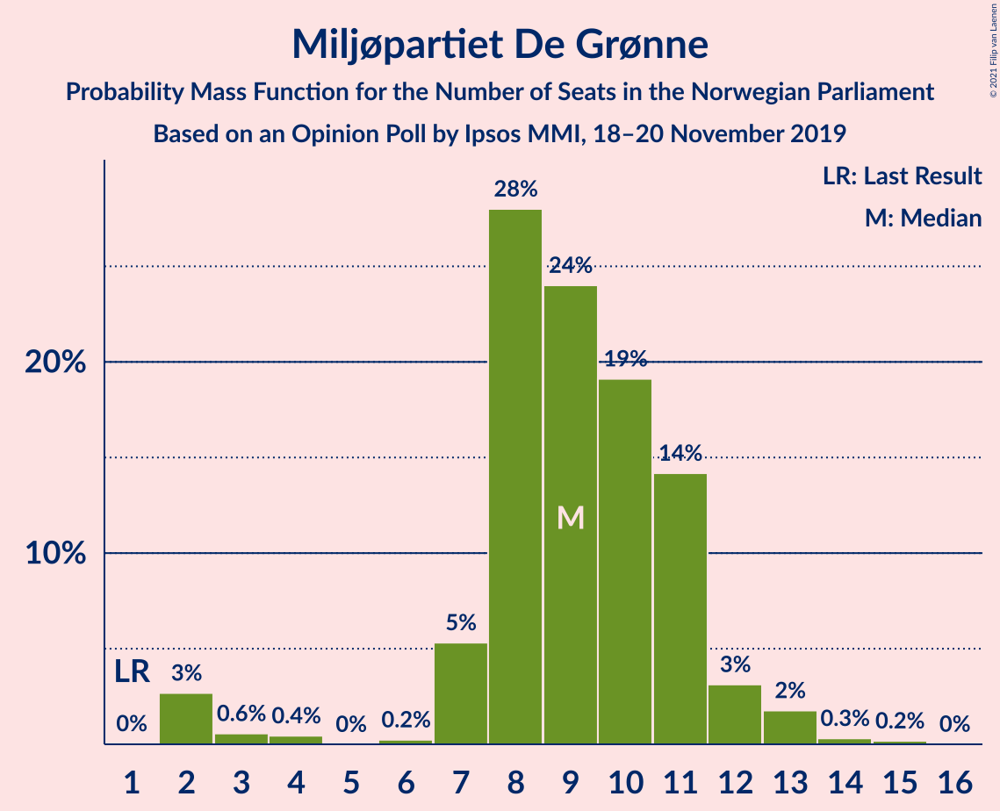
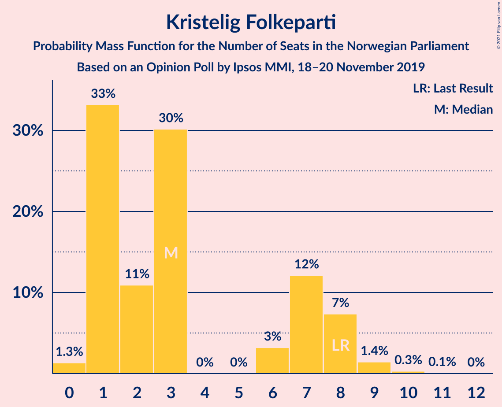
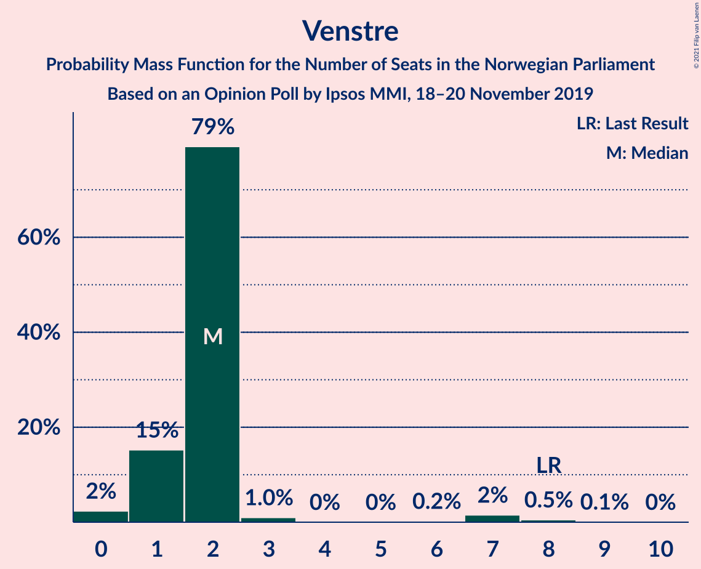
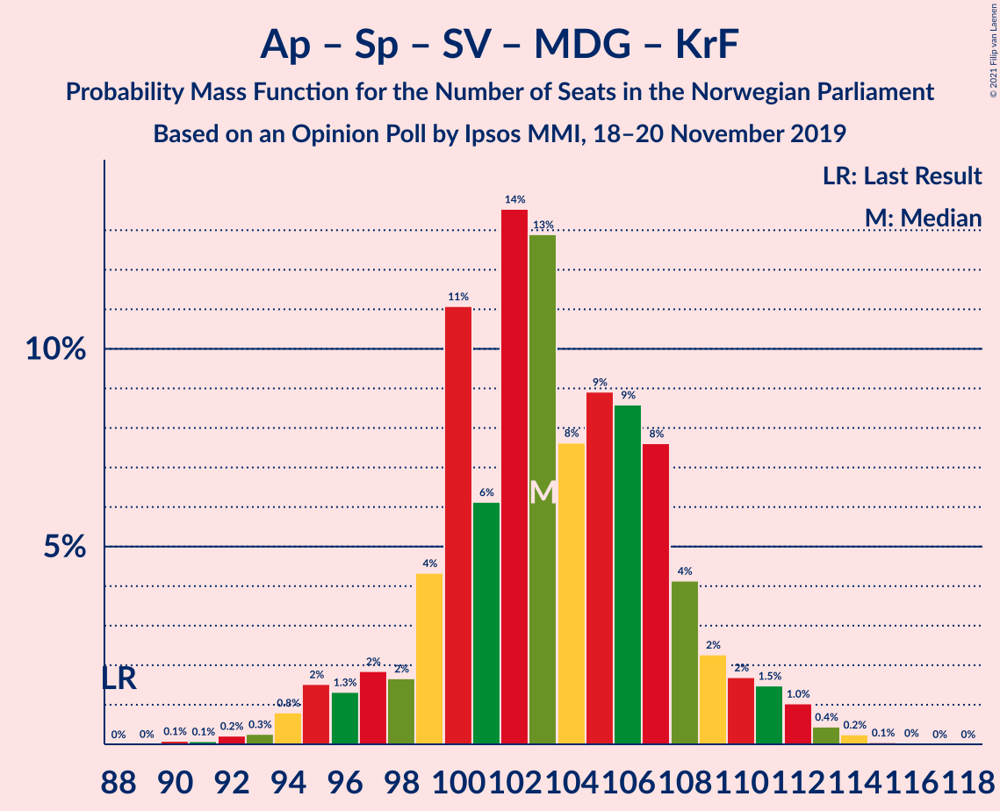
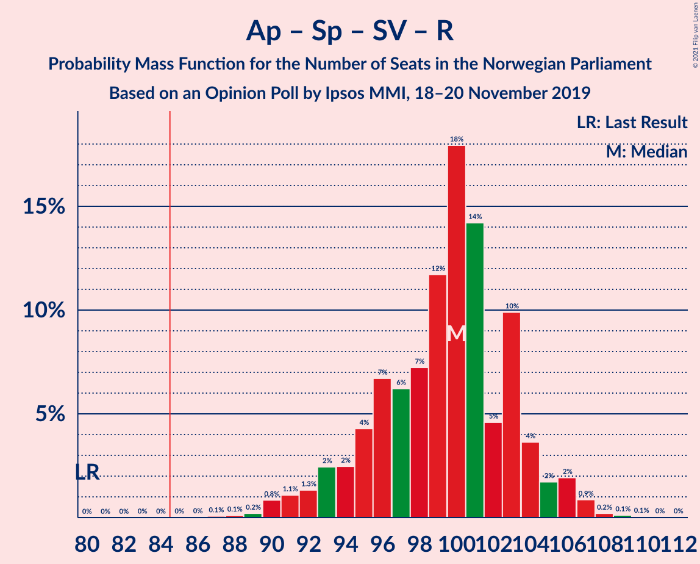
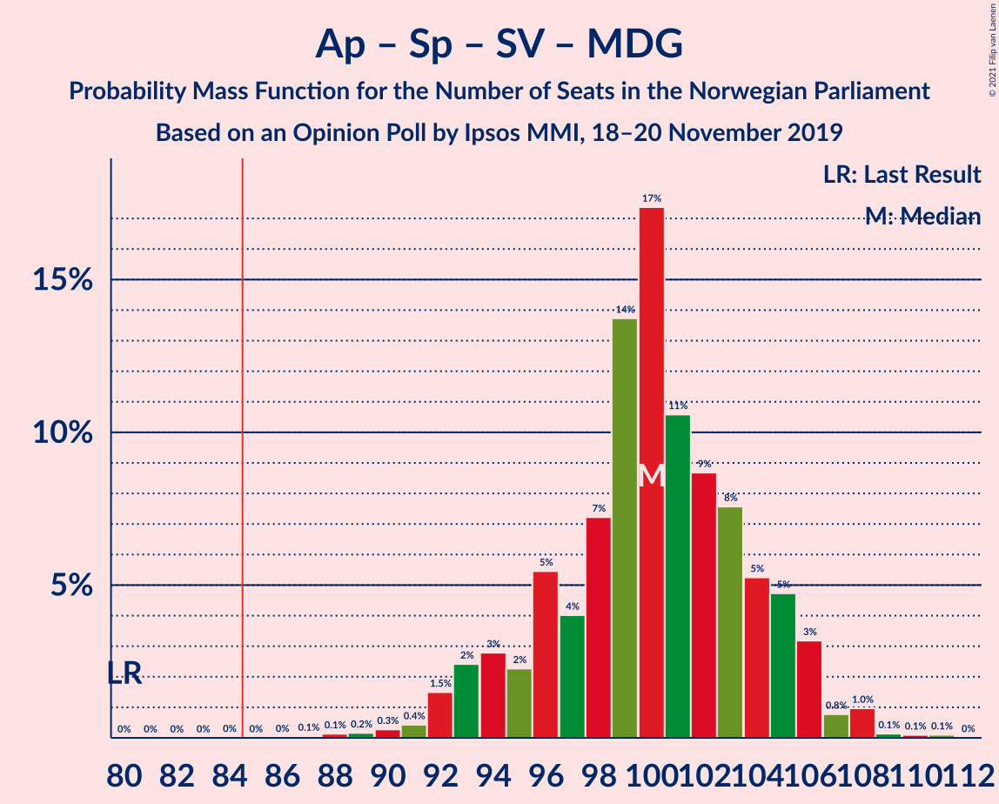
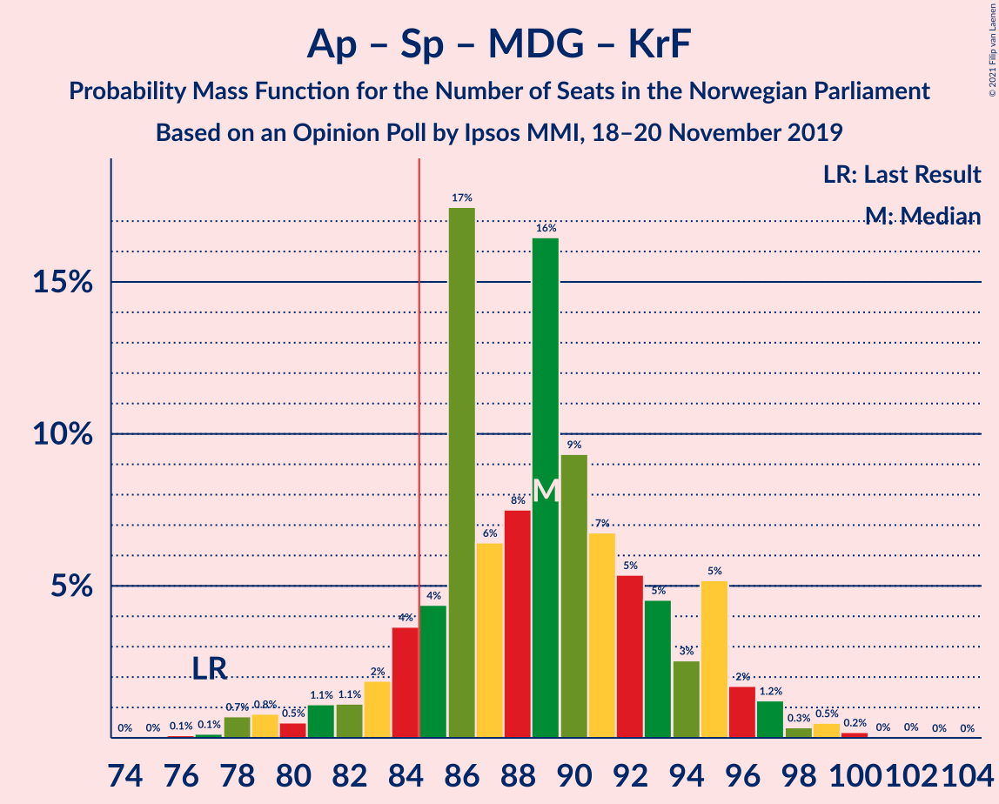

# Opinion Poll by Ipsos MMI, 18–20 November 2019

<a href="#voting-intentions">Voting Intentions</a> | <a href="#seats">Seats</a> | <a href="#coalitions">Coalitions</a> | <a href="#technical-information">Technical Information</a>

## Voting Intentions

### Confidence Intervals

| Party | Last Result | Poll Result | 80% Confidence Interval | 90% Confidence Interval | 95% Confidence Interval | 99% Confidence Interval |
|:-----:|:-----------:|:-----------:|:-----------------------:|:-----------------------:|:-----------------------:|:-----------------------:|
| Arbeiderpartiet | 27.4% | 22.0% | 20.1–24.1% |19.6–24.6% |19.1–25.1% |18.2–26.2% |
| Høyre | 25.0% | 20.9% | 19.0–22.9% |18.5–23.5% |18.0–24.0% |17.2–25.0% |
| Senterpartiet | 10.3% | 19.2% | 17.4–21.2% |16.9–21.7% |16.5–22.2% |15.7–23.2% |
| Fremskrittspartiet | 15.2% | 9.7% | 8.4–11.3% |8.1–11.7% |7.8–12.1% |7.2–12.9% |
| Sosialistisk Venstreparti | 6.0% | 8.3% | 7.1–9.8% |6.8–10.2% |6.5–10.6% |6.0–11.4% |
| Miljøpartiet De Grønne | 3.2% | 5.3% | 4.4–6.5% |4.1–6.9% |3.9–7.2% |3.5–7.8% |
| Rødt | 2.4% | 5.0% | 4.1–6.2% |3.8–6.6% |3.6–6.9% |3.2–7.5% |
| Kristelig Folkeparti | 4.2% | 3.5% | 2.7–4.5% |2.5–4.8% |2.4–5.1% |2.1–5.6% |
| Venstre | 4.4% | 2.6% | 2.0–3.6% |1.8–3.9% |1.7–4.1% |1.4–4.6% |

*Note:* The poll result column reflects the actual value used in the calculations. Published results may vary slightly, and in addition be rounded to fewer digits.

## Seats

### Confidence Intervals

| Party | Last Result | Median | 80% Confidence Interval | 90% Confidence Interval | 95% Confidence Interval | 99% Confidence Interval |
|:-----:|:-----------:|:------:|:-----------------------:|:-----------------------:|:-----------------------:|:-----------------------:|
| <a href="#arbeiderpartiet">Arbeiderpartiet</a> | 49 | 45 | 41–45 |41–45 |41–45 |40–45 |
| <a href="#høyre">Høyre</a> | 45 | 35 | 29–35 |29–35 |29–35 |29–35 |
| <a href="#senterpartiet">Senterpartiet</a> | 19 | 35 | 35–39 |35–39 |35–39 |34–39 |
| <a href="#fremskrittspartiet">Fremskrittspartiet</a> | 27 | 18 | 17–18 |17–18 |17–19 |15–22 |
| <a href="#sosialistisk-venstreparti">Sosialistisk Venstreparti</a> | 11 | 11 | 11–16 |11–16 |11–16 |11–20 |
| <a href="#miljøpartiet-de-grønne">Miljøpartiet De Grønne</a> | 1 | 8 | 8 |8 |8 |7–9 |
| <a href="#rødt">Rødt</a> | 1 | 9 | 9–11 |9–11 |8–11 |7–11 |
| <a href="#kristelig-folkeparti">Kristelig Folkeparti</a> | 8 | 1 | 1–7 |1–7 |1–7 |1–7 |
| <a href="#venstre">Venstre</a> | 8 | 0 | 0–1 |0–1 |0–2 |0–2 |

### Arbeiderpartiet

*For a full overview of the results for this party, see the [Arbeiderpartiet](party-arbeiderpartiet.html) page.*

| Number of Seats | Probability | Accumulated | Special Marks |
|:---------------:|:-----------:|:-----------:|:-------------:|
| 36 | 0.3% | 100% |  |
| 37 | 0% | 99.7% |  |
| 38 | 0.1% | 99.7% |  |
| 39 | 0% | 99.6% |  |
| 40 | 0.3% | 99.6% |  |
| 41 | 46% | 99.3% |  |
| 42 | 0.5% | 54% |  |
| 43 | 0% | 53% |  |
| 44 | 0% | 53% |  |
| 45 | 53% | 53% | Median |
| 46 | 0% | 0.3% |  |
| 47 | 0.3% | 0.3% |  |
| 48 | 0% | 0% |  |
| 49 | 0% | 0% | Last Result |

### Høyre

*For a full overview of the results for this party, see the [Høyre](party-høyre.html) page.*

| Number of Seats | Probability | Accumulated | Special Marks |
|:---------------:|:-----------:|:-----------:|:-------------:|
| 29 | 46% | 100% |  |
| 30 | 2% | 54% |  |
| 31 | 0% | 52% |  |
| 32 | 0% | 52% |  |
| 33 | 0.1% | 52% |  |
| 34 | 0.6% | 52% |  |
| 35 | 51% | 52% | Median |
| 36 | 0% | 0.2% |  |
| 37 | 0% | 0.2% |  |
| 38 | 0.1% | 0.2% |  |
| 39 | 0.1% | 0.1% |  |
| 40 | 0% | 0.1% |  |
| 41 | 0% | 0.1% |  |
| 42 | 0.1% | 0.1% |  |
| 43 | 0% | 0% |  |
| 44 | 0% | 0% |  |
| 45 | 0% | 0% | Last Result |

### Senterpartiet

*For a full overview of the results for this party, see the [Senterpartiet](party-senterpartiet.html) page.*

| Number of Seats | Probability | Accumulated | Special Marks |
|:---------------:|:-----------:|:-----------:|:-------------:|
| 19 | 0% | 100% | Last Result |
| 20 | 0% | 100% |  |
| 21 | 0% | 100% |  |
| 22 | 0% | 100% |  |
| 23 | 0% | 100% |  |
| 24 | 0% | 100% |  |
| 25 | 0% | 100% |  |
| 26 | 0% | 100% |  |
| 27 | 0% | 100% |  |
| 28 | 0% | 100% |  |
| 29 | 0% | 100% |  |
| 30 | 0% | 100% |  |
| 31 | 0% | 100% |  |
| 32 | 0.1% | 100% |  |
| 33 | 0.3% | 99.9% |  |
| 34 | 0.5% | 99.5% |  |
| 35 | 53% | 99.1% | Median |
| 36 | 0% | 46% |  |
| 37 | 0.1% | 46% |  |
| 38 | 0.1% | 46% |  |
| 39 | 46% | 46% |  |
| 40 | 0% | 0.3% |  |
| 41 | 0% | 0.3% |  |
| 42 | 0% | 0.3% |  |
| 43 | 0% | 0.3% |  |
| 44 | 0% | 0.3% |  |
| 45 | 0% | 0.3% |  |
| 46 | 0.3% | 0.3% |  |
| 47 | 0% | 0% |  |

### Fremskrittspartiet

*For a full overview of the results for this party, see the [Fremskrittspartiet](party-fremskrittspartiet.html) page.*

| Number of Seats | Probability | Accumulated | Special Marks |
|:---------------:|:-----------:|:-----------:|:-------------:|
| 10 | 0.1% | 100% |  |
| 11 | 0% | 99.9% |  |
| 12 | 0% | 99.9% |  |
| 13 | 0% | 99.9% |  |
| 14 | 0% | 99.9% |  |
| 15 | 1.0% | 99.9% |  |
| 16 | 0% | 98.9% |  |
| 17 | 45% | 98.9% |  |
| 18 | 51% | 54% | Median |
| 19 | 2% | 3% |  |
| 20 | 0.1% | 1.0% |  |
| 21 | 0.3% | 0.9% |  |
| 22 | 0.3% | 0.6% |  |
| 23 | 0% | 0.4% |  |
| 24 | 0% | 0.3% |  |
| 25 | 0% | 0.3% |  |
| 26 | 0.3% | 0.3% |  |
| 27 | 0% | 0% | Last Result |

### Sosialistisk Venstreparti

*For a full overview of the results for this party, see the [Sosialistisk Venstreparti](party-sosialistiskvenstreparti.html) page.*

| Number of Seats | Probability | Accumulated | Special Marks |
|:---------------:|:-----------:|:-----------:|:-------------:|
| 9 | 0.1% | 100% |  |
| 10 | 0.3% | 99.9% |  |
| 11 | 51% | 99.6% | Last Result, Median |
| 12 | 0% | 49% |  |
| 13 | 0% | 49% |  |
| 14 | 1.5% | 49% |  |
| 15 | 0% | 47% |  |
| 16 | 45% | 47% |  |
| 17 | 0% | 2% |  |
| 18 | 0.1% | 2% |  |
| 19 | 0% | 2% |  |
| 20 | 2% | 2% |  |
| 21 | 0% | 0% |  |

### Miljøpartiet De Grønne

*For a full overview of the results for this party, see the [Miljøpartiet De Grønne](party-miljøpartietdegrønne.html) page.*

| Number of Seats | Probability | Accumulated | Special Marks |
|:---------------:|:-----------:|:-----------:|:-------------:|
| 1 | 0% | 100% | Last Result |
| 2 | 0% | 100% |  |
| 3 | 0.3% | 100% |  |
| 4 | 0% | 99.7% |  |
| 5 | 0% | 99.7% |  |
| 6 | 0% | 99.7% |  |
| 7 | 2% | 99.7% |  |
| 8 | 97% | 98% | Median |
| 9 | 0.7% | 1.0% |  |
| 10 | 0.1% | 0.3% |  |
| 11 | 0.1% | 0.2% |  |
| 12 | 0% | 0.1% |  |
| 13 | 0% | 0.1% |  |
| 14 | 0% | 0.1% |  |
| 15 | 0% | 0.1% |  |
| 16 | 0.1% | 0.1% |  |
| 17 | 0% | 0% |  |

### Rødt

*For a full overview of the results for this party, see the [Rødt](party-rødt.html) page.*

| Number of Seats | Probability | Accumulated | Special Marks |
|:---------------:|:-----------:|:-----------:|:-------------:|
| 1 | 0% | 100% | Last Result |
| 2 | 0.3% | 100% |  |
| 3 | 0% | 99.7% |  |
| 4 | 0% | 99.7% |  |
| 5 | 0% | 99.7% |  |
| 6 | 0% | 99.7% |  |
| 7 | 0.7% | 99.7% |  |
| 8 | 2% | 99.0% |  |
| 9 | 51% | 97% | Median |
| 10 | 1.2% | 46% |  |
| 11 | 45% | 45% |  |
| 12 | 0% | 0% |  |

### Kristelig Folkeparti

*For a full overview of the results for this party, see the [Kristelig Folkeparti](party-kristeligfolkeparti.html) page.*

| Number of Seats | Probability | Accumulated | Special Marks |
|:---------------:|:-----------:|:-----------:|:-------------:|
| 0 | 0.3% | 100% |  |
| 1 | 51% | 99.7% | Median |
| 2 | 0.8% | 49% |  |
| 3 | 3% | 48% |  |
| 4 | 0% | 45% |  |
| 5 | 0% | 45% |  |
| 6 | 0% | 45% |  |
| 7 | 45% | 45% |  |
| 8 | 0% | 0% | Last Result |

### Venstre

*For a full overview of the results for this party, see the [Venstre](party-venstre.html) page.*

| Number of Seats | Probability | Accumulated | Special Marks |
|:---------------:|:-----------:|:-----------:|:-------------:|
| 0 | 51% | 100% | Median |
| 1 | 46% | 49% |  |
| 2 | 3% | 3% |  |
| 3 | 0% | 0% |  |
| 4 | 0% | 0% |  |
| 5 | 0% | 0% |  |
| 6 | 0% | 0% |  |
| 7 | 0% | 0% |  |
| 8 | 0% | 0% | Last Result |

## Coalitions

### Confidence Intervals

| Coalition | Last Result | Median | Majority? | 80% Confidence Interval | 90% Confidence Interval | 95% Confidence Interval | 99% Confidence Interval |
|:---------:|:-----------:|:------:|:---------:|:-----------------------:|:-----------------------:|:-----------------------:|:-----------------------:|
| Arbeiderpartiet – Senterpartiet – Sosialistisk Venstreparti – Miljøpartiet De Grønne – Rødt | 81 | 108 | 100% | 108–115 | 108–115 | 108–115 | 103–115 |
| Arbeiderpartiet – Senterpartiet – Sosialistisk Venstreparti – Miljøpartiet De Grønne – Kristelig Folkeparti | 88 | 100 | 100% | 100–111 | 100–111 | 100–111 | 100–111 |
| Arbeiderpartiet – Senterpartiet – Sosialistisk Venstreparti – Rødt | 80 | 100 | 100% | 100–107 | 100–107 | 100–107 | 97–108 |
| Arbeiderpartiet – Senterpartiet – Sosialistisk Venstreparti – Miljøpartiet De Grønne | 80 | 99 | 100% | 99–104 | 99–104 | 99–104 | 99–107 |
| Arbeiderpartiet – Senterpartiet – Sosialistisk Venstreparti | 79 | 91 | 99.6% | 91–96 | 91–96 | 91–96 | 90–100 |
| Arbeiderpartiet – Senterpartiet – Miljøpartiet De Grønne – Kristelig Folkeparti | 77 | 89 | 99.6% | 89–95 | 89–95 | 89–95 | 85–95 |
| Høyre – Senterpartiet – Fremskrittspartiet – Kristelig Folkeparti – Venstre | 107 | 89 | 100% | 89–93 | 89–93 | 89–93 | 87–97 |
| Arbeiderpartiet – Senterpartiet – Kristelig Folkeparti | 76 | 81 | 45% | 81–87 | 81–87 | 81–87 | 78–87 |
| Arbeiderpartiet – Senterpartiet | 68 | 80 | 0% | 80 | 80 | 80 | 76–82 |
| Høyre – Fremskrittspartiet – Miljøpartiet De Grønne – Kristelig Folkeparti – Venstre | 89 | 62 | 0% | 62 | 62 | 61–62 | 56–69 |
| Arbeiderpartiet – Sosialistisk Venstreparti | 60 | 56 | 0% | 56–57 | 56–57 | 56–57 | 50–65 |
| Høyre – Fremskrittspartiet – Kristelig Folkeparti – Venstre | 88 | 54 | 0% | 54 | 54 | 54 | 48–58 |
| Høyre – Fremskrittspartiet – Venstre | 80 | 53 | 0% | 47–53 | 47–53 | 47–53 | 45–58 |
| Høyre – Fremskrittspartiet | 72 | 53 | 0% | 46–53 | 46–53 | 46–53 | 44–56 |
| Senterpartiet – Kristelig Folkeparti – Venstre | 35 | 36 | 0% | 36–47 | 36–47 | 36–47 | 36–47 |
| Høyre – Kristelig Folkeparti – Venstre | 61 | 36 | 0% | 36–37 | 36–37 | 35–37 | 33–38 |

### Arbeiderpartiet – Senterpartiet – Sosialistisk Venstreparti – Miljøpartiet De Grønne – Rødt

| Number of Seats | Probability | Accumulated | Special Marks |
|:---------------:|:-----------:|:-----------:|:-------------:|
| 81 | 0% | 100% | Last Result |
| 82 | 0% | 100% |  |
| 83 | 0% | 100% |  |
| 84 | 0% | 100% |  |
| 85 | 0% | 100% | Majority |
| 86 | 0% | 100% |  |
| 87 | 0% | 100% |  |
| 88 | 0% | 100% |  |
| 89 | 0% | 100% |  |
| 90 | 0% | 100% |  |
| 91 | 0% | 100% |  |
| 92 | 0% | 100% |  |
| 93 | 0% | 100% |  |
| 94 | 0% | 100% |  |
| 95 | 0% | 100% |  |
| 96 | 0% | 100% |  |
| 97 | 0% | 100% |  |
| 98 | 0.3% | 100% |  |
| 99 | 0% | 99.7% |  |
| 100 | 0% | 99.7% |  |
| 101 | 0% | 99.6% |  |
| 102 | 0% | 99.6% |  |
| 103 | 0.3% | 99.6% |  |
| 104 | 0% | 99.4% |  |
| 105 | 0% | 99.4% |  |
| 106 | 0.4% | 99.4% |  |
| 107 | 0% | 99.0% |  |
| 108 | 51% | 99.0% | Median |
| 109 | 0% | 48% |  |
| 110 | 0.1% | 48% |  |
| 111 | 0.3% | 48% |  |
| 112 | 1.0% | 48% |  |
| 113 | 0% | 47% |  |
| 114 | 0.1% | 47% |  |
| 115 | 47% | 47% |  |
| 116 | 0% | 0% |  |

### Arbeiderpartiet – Senterpartiet – Sosialistisk Venstreparti – Miljøpartiet De Grønne – Kristelig Folkeparti

| Number of Seats | Probability | Accumulated | Special Marks |
|:---------------:|:-----------:|:-----------:|:-------------:|
| 88 | 0% | 100% | Last Result |
| 89 | 0% | 100% |  |
| 90 | 0% | 100% |  |
| 91 | 0% | 100% |  |
| 92 | 0% | 100% |  |
| 93 | 0.3% | 100% |  |
| 94 | 0% | 99.6% |  |
| 95 | 0% | 99.6% |  |
| 96 | 0% | 99.6% |  |
| 97 | 0% | 99.6% |  |
| 98 | 0% | 99.6% |  |
| 99 | 0% | 99.6% |  |
| 100 | 51% | 99.6% | Median |
| 101 | 0.7% | 49% |  |
| 102 | 0% | 48% |  |
| 103 | 0.3% | 48% |  |
| 104 | 0.1% | 48% |  |
| 105 | 1.1% | 48% |  |
| 106 | 0% | 47% |  |
| 107 | 0% | 47% |  |
| 108 | 0.1% | 47% |  |
| 109 | 0% | 47% |  |
| 110 | 2% | 47% |  |
| 111 | 45% | 45% |  |
| 112 | 0% | 0% |  |

### Arbeiderpartiet – Senterpartiet – Sosialistisk Venstreparti – Rødt

| Number of Seats | Probability | Accumulated | Special Marks |
|:---------------:|:-----------:|:-----------:|:-------------:|
| 80 | 0% | 100% | Last Result |
| 81 | 0% | 100% |  |
| 82 | 0% | 100% |  |
| 83 | 0% | 100% |  |
| 84 | 0% | 100% |  |
| 85 | 0% | 100% | Majority |
| 86 | 0% | 100% |  |
| 87 | 0% | 100% |  |
| 88 | 0% | 100% |  |
| 89 | 0% | 100% |  |
| 90 | 0.3% | 100% |  |
| 91 | 0% | 99.7% |  |
| 92 | 0% | 99.7% |  |
| 93 | 0% | 99.7% |  |
| 94 | 0% | 99.6% |  |
| 95 | 0% | 99.6% |  |
| 96 | 0% | 99.6% |  |
| 97 | 0.4% | 99.6% |  |
| 98 | 0.1% | 99.2% |  |
| 99 | 0.1% | 99.2% |  |
| 100 | 51% | 99.1% | Median |
| 101 | 0% | 48% |  |
| 102 | 0.3% | 48% |  |
| 103 | 0% | 48% |  |
| 104 | 1.1% | 48% |  |
| 105 | 0% | 47% |  |
| 106 | 0% | 47% |  |
| 107 | 45% | 47% |  |
| 108 | 2% | 2% |  |
| 109 | 0% | 0% |  |

### Arbeiderpartiet – Senterpartiet – Sosialistisk Venstreparti – Miljøpartiet De Grønne

| Number of Seats | Probability | Accumulated | Special Marks |
|:---------------:|:-----------:|:-----------:|:-------------:|
| 80 | 0% | 100% | Last Result |
| 81 | 0% | 100% |  |
| 82 | 0% | 100% |  |
| 83 | 0% | 100% |  |
| 84 | 0% | 100% |  |
| 85 | 0% | 100% | Majority |
| 86 | 0% | 100% |  |
| 87 | 0% | 100% |  |
| 88 | 0% | 100% |  |
| 89 | 0% | 100% |  |
| 90 | 0% | 100% |  |
| 91 | 0.4% | 100% |  |
| 92 | 0% | 99.6% |  |
| 93 | 0% | 99.6% |  |
| 94 | 0% | 99.6% |  |
| 95 | 0% | 99.6% |  |
| 96 | 0% | 99.6% |  |
| 97 | 0% | 99.6% |  |
| 98 | 0% | 99.6% |  |
| 99 | 51% | 99.6% | Median |
| 100 | 0.1% | 49% |  |
| 101 | 0.3% | 48% |  |
| 102 | 1.3% | 48% |  |
| 103 | 0% | 47% |  |
| 104 | 45% | 47% |  |
| 105 | 0.1% | 2% |  |
| 106 | 0% | 2% |  |
| 107 | 2% | 2% |  |
| 108 | 0% | 0% |  |

### Arbeiderpartiet – Senterpartiet – Sosialistisk Venstreparti

| Number of Seats | Probability | Accumulated | Special Marks |
|:---------------:|:-----------:|:-----------:|:-------------:|
| 79 | 0% | 100% | Last Result |
| 80 | 0% | 100% |  |
| 81 | 0% | 100% |  |
| 82 | 0% | 100% |  |
| 83 | 0.3% | 100% |  |
| 84 | 0% | 99.6% |  |
| 85 | 0% | 99.6% | Majority |
| 86 | 0% | 99.6% |  |
| 87 | 0% | 99.6% |  |
| 88 | 0.1% | 99.6% |  |
| 89 | 0% | 99.5% |  |
| 90 | 0.4% | 99.5% |  |
| 91 | 51% | 99.2% | Median |
| 92 | 0.1% | 48% |  |
| 93 | 0.3% | 48% |  |
| 94 | 1.1% | 48% |  |
| 95 | 0% | 47% |  |
| 96 | 45% | 47% |  |
| 97 | 0% | 2% |  |
| 98 | 0.3% | 2% |  |
| 99 | 0% | 2% |  |
| 100 | 2% | 2% |  |
| 101 | 0% | 0% |  |

### Arbeiderpartiet – Senterpartiet – Miljøpartiet De Grønne – Kristelig Folkeparti

| Number of Seats | Probability | Accumulated | Special Marks |
|:---------------:|:-----------:|:-----------:|:-------------:|
| 77 | 0% | 100% | Last Result |
| 78 | 0% | 100% |  |
| 79 | 0% | 100% |  |
| 80 | 0% | 100% |  |
| 81 | 0% | 100% |  |
| 82 | 0% | 100% |  |
| 83 | 0.3% | 100% |  |
| 84 | 0% | 99.6% |  |
| 85 | 0.3% | 99.6% | Majority |
| 86 | 0% | 99.4% |  |
| 87 | 0.5% | 99.4% |  |
| 88 | 0.1% | 98.9% |  |
| 89 | 51% | 98.8% | Median |
| 90 | 2% | 48% |  |
| 91 | 1.0% | 46% |  |
| 92 | 0.3% | 45% |  |
| 93 | 0% | 45% |  |
| 94 | 0.1% | 45% |  |
| 95 | 45% | 45% |  |
| 96 | 0% | 0% |  |

### Høyre – Senterpartiet – Fremskrittspartiet – Kristelig Folkeparti – Venstre

| Number of Seats | Probability | Accumulated | Special Marks |
|:---------------:|:-----------:|:-----------:|:-------------:|
| 87 | 1.1% | 100% |  |
| 88 | 0% | 98.9% |  |
| 89 | 53% | 98.9% | Median |
| 90 | 0% | 46% |  |
| 91 | 0% | 46% |  |
| 92 | 0.1% | 46% |  |
| 93 | 45% | 46% |  |
| 94 | 0% | 0.6% |  |
| 95 | 0% | 0.6% |  |
| 96 | 0% | 0.6% |  |
| 97 | 0.3% | 0.6% |  |
| 98 | 0% | 0.3% |  |
| 99 | 0% | 0.3% |  |
| 100 | 0% | 0.3% |  |
| 101 | 0% | 0.3% |  |
| 102 | 0% | 0.3% |  |
| 103 | 0% | 0.3% |  |
| 104 | 0.3% | 0.3% |  |
| 105 | 0% | 0% |  |
| 106 | 0% | 0% |  |
| 107 | 0% | 0% | Last Result |

### Arbeiderpartiet – Senterpartiet – Kristelig Folkeparti

| Number of Seats | Probability | Accumulated | Special Marks |
|:---------------:|:-----------:|:-----------:|:-------------:|
| 71 | 0.1% | 100% |  |
| 72 | 0% | 99.9% |  |
| 73 | 0% | 99.9% |  |
| 74 | 0% | 99.9% |  |
| 75 | 0.3% | 99.9% |  |
| 76 | 0% | 99.5% | Last Result |
| 77 | 0% | 99.5% |  |
| 78 | 0.5% | 99.5% |  |
| 79 | 0% | 99.1% |  |
| 80 | 0% | 99.1% |  |
| 81 | 51% | 99.1% | Median |
| 82 | 0.3% | 48% |  |
| 83 | 3% | 48% |  |
| 84 | 0% | 45% |  |
| 85 | 0% | 45% | Majority |
| 86 | 0% | 45% |  |
| 87 | 45% | 45% |  |
| 88 | 0% | 0% |  |

### Arbeiderpartiet – Senterpartiet

| Number of Seats | Probability | Accumulated | Special Marks |
|:---------------:|:-----------:|:-----------:|:-------------:|
| 68 | 0% | 100% | Last Result |
| 69 | 0% | 100% |  |
| 70 | 0.1% | 100% |  |
| 71 | 0% | 99.9% |  |
| 72 | 0% | 99.9% |  |
| 73 | 0.3% | 99.9% |  |
| 74 | 0% | 99.5% |  |
| 75 | 0% | 99.5% |  |
| 76 | 0.5% | 99.5% |  |
| 77 | 0% | 99.1% |  |
| 78 | 0% | 99.1% |  |
| 79 | 0% | 99.1% |  |
| 80 | 98% | 99.1% | Median |
| 81 | 0% | 0.6% |  |
| 82 | 0.6% | 0.6% |  |
| 83 | 0% | 0% |  |

### Høyre – Fremskrittspartiet – Miljøpartiet De Grønne – Kristelig Folkeparti – Venstre

| Number of Seats | Probability | Accumulated | Special Marks |
|:---------------:|:-----------:|:-----------:|:-------------:|
| 56 | 1.0% | 100% |  |
| 57 | 0% | 99.0% |  |
| 58 | 0% | 99.0% |  |
| 59 | 0% | 99.0% |  |
| 60 | 0% | 99.0% |  |
| 61 | 2% | 99.0% |  |
| 62 | 95% | 97% | Median |
| 63 | 0% | 1.3% |  |
| 64 | 0.4% | 1.3% |  |
| 65 | 0.1% | 0.9% |  |
| 66 | 0% | 0.8% |  |
| 67 | 0.3% | 0.8% |  |
| 68 | 0% | 0.5% |  |
| 69 | 0.1% | 0.5% |  |
| 70 | 0% | 0.5% |  |
| 71 | 0.1% | 0.5% |  |
| 72 | 0.3% | 0.4% |  |
| 73 | 0% | 0% |  |
| 74 | 0% | 0% |  |
| 75 | 0% | 0% |  |
| 76 | 0% | 0% |  |
| 77 | 0% | 0% |  |
| 78 | 0% | 0% |  |
| 79 | 0% | 0% |  |
| 80 | 0% | 0% |  |
| 81 | 0% | 0% |  |
| 82 | 0% | 0% |  |
| 83 | 0% | 0% |  |
| 84 | 0% | 0% |  |
| 85 | 0% | 0% | Majority |
| 86 | 0% | 0% |  |
| 87 | 0% | 0% |  |
| 88 | 0% | 0% |  |
| 89 | 0% | 0% | Last Result |

### Arbeiderpartiet – Sosialistisk Venstreparti

| Number of Seats | Probability | Accumulated | Special Marks |
|:---------------:|:-----------:|:-----------:|:-------------:|
| 47 | 0.3% | 100% |  |
| 48 | 0% | 99.7% |  |
| 49 | 0% | 99.7% |  |
| 50 | 0.3% | 99.7% |  |
| 51 | 0% | 99.4% |  |
| 52 | 0% | 99.4% |  |
| 53 | 0% | 99.4% |  |
| 54 | 0.1% | 99.4% |  |
| 55 | 1.0% | 99.3% |  |
| 56 | 51% | 98% | Median |
| 57 | 45% | 47% |  |
| 58 | 0.1% | 2% |  |
| 59 | 0% | 2% |  |
| 60 | 0% | 2% | Last Result |
| 61 | 0% | 2% |  |
| 62 | 0% | 2% |  |
| 63 | 0.3% | 2% |  |
| 64 | 0% | 2% |  |
| 65 | 2% | 2% |  |
| 66 | 0% | 0% |  |

### Høyre – Fremskrittspartiet – Kristelig Folkeparti – Venstre

| Number of Seats | Probability | Accumulated | Special Marks |
|:---------------:|:-----------:|:-----------:|:-------------:|
| 48 | 1.0% | 100% |  |
| 49 | 0% | 99.0% |  |
| 50 | 0% | 99.0% |  |
| 51 | 0% | 99.0% |  |
| 52 | 0% | 99.0% |  |
| 53 | 0% | 99.0% |  |
| 54 | 97% | 99.0% | Median |
| 55 | 0.5% | 2% |  |
| 56 | 0% | 1.0% |  |
| 57 | 0% | 1.0% |  |
| 58 | 0.5% | 1.0% |  |
| 59 | 0.1% | 0.5% |  |
| 60 | 0% | 0.4% |  |
| 61 | 0% | 0.4% |  |
| 62 | 0% | 0.4% |  |
| 63 | 0% | 0.4% |  |
| 64 | 0.3% | 0.4% |  |
| 65 | 0% | 0% |  |
| 66 | 0% | 0% |  |
| 67 | 0% | 0% |  |
| 68 | 0% | 0% |  |
| 69 | 0% | 0% |  |
| 70 | 0% | 0% |  |
| 71 | 0% | 0% |  |
| 72 | 0% | 0% |  |
| 73 | 0% | 0% |  |
| 74 | 0% | 0% |  |
| 75 | 0% | 0% |  |
| 76 | 0% | 0% |  |
| 77 | 0% | 0% |  |
| 78 | 0% | 0% |  |
| 79 | 0% | 0% |  |
| 80 | 0% | 0% |  |
| 81 | 0% | 0% |  |
| 82 | 0% | 0% |  |
| 83 | 0% | 0% |  |
| 84 | 0% | 0% |  |
| 85 | 0% | 0% | Majority |
| 86 | 0% | 0% |  |
| 87 | 0% | 0% |  |
| 88 | 0% | 0% | Last Result |

### Høyre – Fremskrittspartiet – Venstre

| Number of Seats | Probability | Accumulated | Special Marks |
|:---------------:|:-----------:|:-----------:|:-------------:|
| 45 | 1.0% | 100% |  |
| 46 | 0% | 99.0% |  |
| 47 | 45% | 99.0% |  |
| 48 | 0% | 54% |  |
| 49 | 0% | 54% |  |
| 50 | 0% | 54% |  |
| 51 | 2% | 54% |  |
| 52 | 0% | 52% |  |
| 53 | 51% | 52% | Median |
| 54 | 0.1% | 1.1% |  |
| 55 | 0% | 1.0% |  |
| 56 | 0% | 1.0% |  |
| 57 | 0.3% | 1.0% |  |
| 58 | 0.3% | 0.6% |  |
| 59 | 0% | 0.4% |  |
| 60 | 0% | 0.4% |  |
| 61 | 0% | 0.3% |  |
| 62 | 0.3% | 0.3% |  |
| 63 | 0% | 0% |  |
| 64 | 0% | 0% |  |
| 65 | 0% | 0% |  |
| 66 | 0% | 0% |  |
| 67 | 0% | 0% |  |
| 68 | 0% | 0% |  |
| 69 | 0% | 0% |  |
| 70 | 0% | 0% |  |
| 71 | 0% | 0% |  |
| 72 | 0% | 0% |  |
| 73 | 0% | 0% |  |
| 74 | 0% | 0% |  |
| 75 | 0% | 0% |  |
| 76 | 0% | 0% |  |
| 77 | 0% | 0% |  |
| 78 | 0% | 0% |  |
| 79 | 0% | 0% |  |
| 80 | 0% | 0% | Last Result |

### Høyre – Fremskrittspartiet

| Number of Seats | Probability | Accumulated | Special Marks |
|:---------------:|:-----------:|:-----------:|:-------------:|
| 44 | 1.0% | 100% |  |
| 45 | 0% | 99.0% |  |
| 46 | 45% | 99.0% |  |
| 47 | 0% | 54% |  |
| 48 | 0% | 54% |  |
| 49 | 2% | 54% |  |
| 50 | 0% | 52% |  |
| 51 | 0% | 52% |  |
| 52 | 0.1% | 52% |  |
| 53 | 51% | 52% | Median |
| 54 | 0% | 1.0% |  |
| 55 | 0% | 1.0% |  |
| 56 | 0.5% | 1.0% |  |
| 57 | 0.1% | 0.4% |  |
| 58 | 0% | 0.4% |  |
| 59 | 0% | 0.3% |  |
| 60 | 0.3% | 0.3% |  |
| 61 | 0% | 0% |  |
| 62 | 0% | 0% |  |
| 63 | 0% | 0% |  |
| 64 | 0% | 0% |  |
| 65 | 0% | 0% |  |
| 66 | 0% | 0% |  |
| 67 | 0% | 0% |  |
| 68 | 0% | 0% |  |
| 69 | 0% | 0% |  |
| 70 | 0% | 0% |  |
| 71 | 0% | 0% |  |
| 72 | 0% | 0% | Last Result |

### Senterpartiet – Kristelig Folkeparti – Venstre

| Number of Seats | Probability | Accumulated | Special Marks |
|:---------------:|:-----------:|:-----------:|:-------------:|
| 34 | 0.1% | 100% |  |
| 35 | 0% | 99.9% | Last Result |
| 36 | 51% | 99.9% | Median |
| 37 | 0.6% | 49% |  |
| 38 | 0% | 48% |  |
| 39 | 0% | 48% |  |
| 40 | 2% | 48% |  |
| 41 | 0% | 46% |  |
| 42 | 0% | 46% |  |
| 43 | 1.1% | 46% |  |
| 44 | 0% | 45% |  |
| 45 | 0% | 45% |  |
| 46 | 0% | 45% |  |
| 47 | 45% | 45% |  |
| 48 | 0.3% | 0.3% |  |
| 49 | 0% | 0% |  |

### Høyre – Kristelig Folkeparti – Venstre

| Number of Seats | Probability | Accumulated | Special Marks |
|:---------------:|:-----------:|:-----------:|:-------------:|
| 33 | 1.0% | 100% |  |
| 34 | 0% | 99.0% |  |
| 35 | 2% | 99.0% |  |
| 36 | 51% | 97% | Median |
| 37 | 45% | 46% |  |
| 38 | 0.3% | 0.6% |  |
| 39 | 0% | 0.2% |  |
| 40 | 0.1% | 0.2% |  |
| 41 | 0% | 0.1% |  |
| 42 | 0% | 0.1% |  |
| 43 | 0% | 0.1% |  |
| 44 | 0.1% | 0.1% |  |
| 45 | 0.1% | 0.1% |  |
| 46 | 0% | 0% |  |
| 47 | 0% | 0% |  |
| 48 | 0% | 0% |  |
| 49 | 0% | 0% |  |
| 50 | 0% | 0% |  |
| 51 | 0% | 0% |  |
| 52 | 0% | 0% |  |
| 53 | 0% | 0% |  |
| 54 | 0% | 0% |  |
| 55 | 0% | 0% |  |
| 56 | 0% | 0% |  |
| 57 | 0% | 0% |  |
| 58 | 0% | 0% |  |
| 59 | 0% | 0% |  |
| 60 | 0% | 0% |  |
| 61 | 0% | 0% | Last Result |

## Technical Information

### Opinion Poll

+ **Polling firm:** Ipsos MMI
+ **Commissioner(s):** —
+ **Fieldwork period:** 18–20 November 2019

### Calculations

+ **Sample size:** 719
+ **Simulations done:** 1,024
+ **Error estimate:** 2.26%

