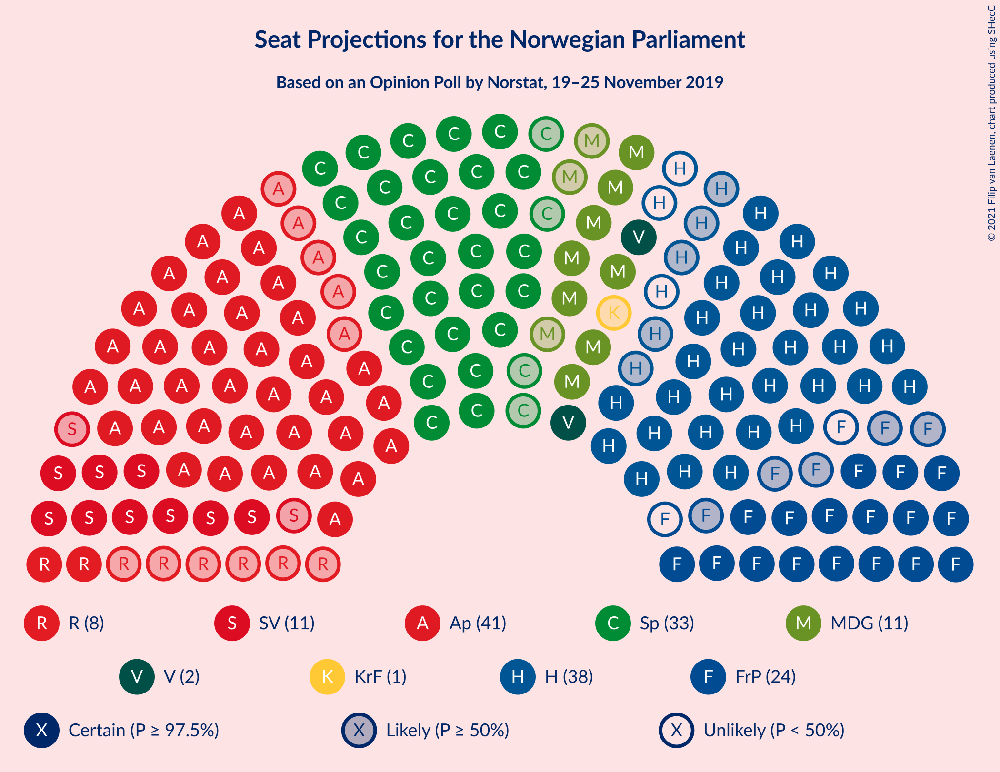
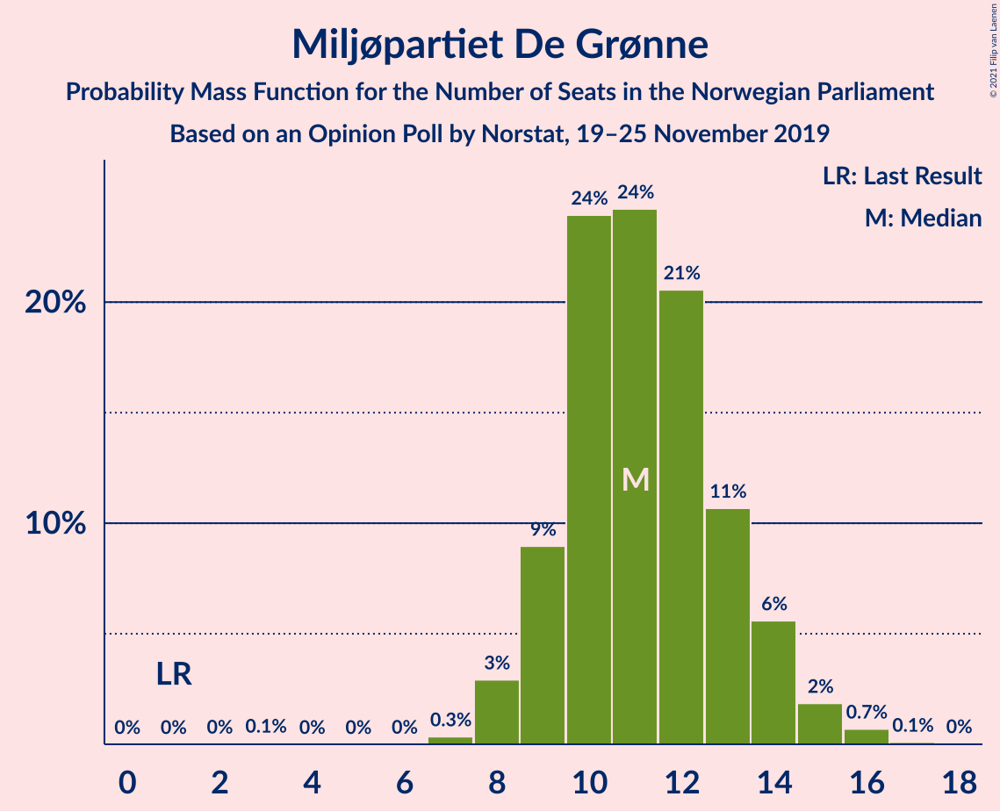
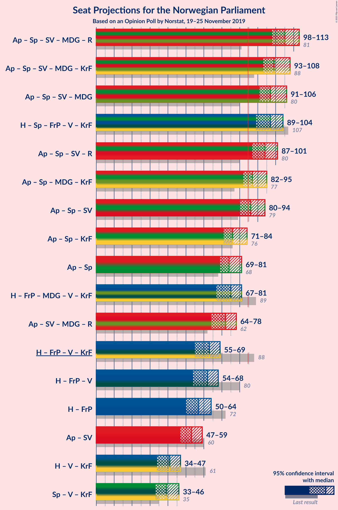
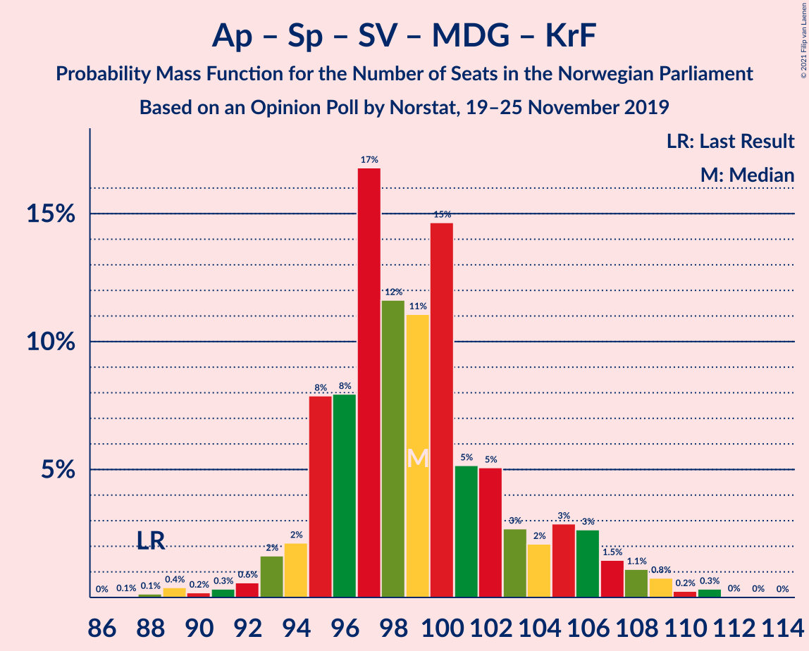
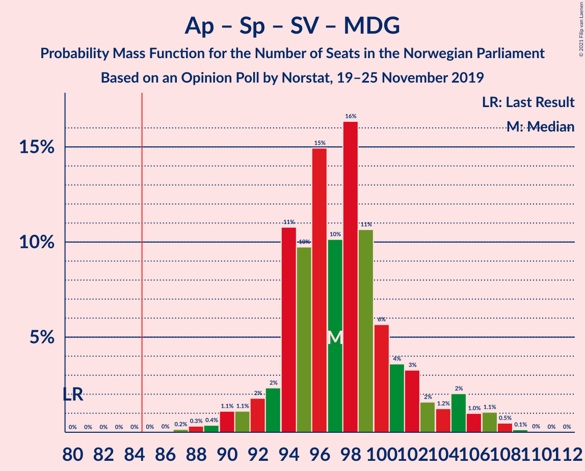

# Opinion Poll by Norstat, 19–25 November 2019

<a href="#voting-intentions">Voting Intentions</a> | <a href="#seats">Seats</a> | <a href="#coalitions">Coalitions</a> | <a href="#technical-information">Technical Information</a>

## Voting Intentions

### Confidence Intervals

| Party | Last Result | Poll Result | 80% Confidence Interval | 90% Confidence Interval | 95% Confidence Interval | 99% Confidence Interval |
|:-----:|:-----------:|:-----------:|:-----------------------:|:-----------------------:|:-----------------------:|:-----------------------:|
| Arbeiderpartiet | 27.4% | 22.8% | 20.9–24.9% |20.4–25.5% |20.0–26.0% |19.1–27.0% |
| Høyre | 25.0% | 19.6% | 17.9–21.6% |17.4–22.1% |16.9–22.6% |16.1–23.6% |
| Senterpartiet | 10.3% | 18.0% | 16.3–19.9% |15.8–20.5% |15.4–20.9% |14.6–21.9% |
| Fremskrittspartiet | 15.2% | 12.6% | 11.1–14.2% |10.7–14.7% |10.4–15.1% |9.7–16.0% |
| Sosialistisk Venstreparti | 6.0% | 6.5% | 5.5–7.8% |5.2–8.2% |5.0–8.6% |4.5–9.2% |
| Miljøpartiet De Grønne | 3.2% | 6.4% | 5.4–7.7% |5.1–8.1% |4.9–8.4% |4.4–9.1% |
| Rødt | 2.4% | 4.5% | 3.7–5.7% |3.5–6.0% |3.3–6.3% |2.9–6.9% |
| Venstre | 4.4% | 3.5% | 2.7–4.5% |2.5–4.8% |2.4–5.0% |2.1–5.6% |
| Kristelig Folkeparti | 4.2% | 2.8% | 2.2–3.7% |2.0–4.0% |1.8–4.3% |1.6–4.8% |

*Note:* The poll result column reflects the actual value used in the calculations. Published results may vary slightly, and in addition be rounded to fewer digits.

## Seats

### Confidence Intervals

| Party | Last Result | Median | 80% Confidence Interval | 90% Confidence Interval | 95% Confidence Interval | 99% Confidence Interval |
|:-----:|:-----------:|:------:|:-----------------------:|:-----------------------:|:-----------------------:|:-----------------------:|
| <a href="#arbeiderpartiet">Arbeiderpartiet</a> | 49 | 44 | 39–45 |38–45 |38–46 |35–48 |
| <a href="#høyre">Høyre</a> | 45 | 36 | 32–38 |30–38 |29–41 |29–41 |
| <a href="#senterpartiet">Senterpartiet</a> | 19 | 32 | 31–38 |30–39 |30–41 |27–41 |
| <a href="#fremskrittspartiet">Fremskrittspartiet</a> | 27 | 20 | 19–25 |19–27 |18–27 |16–28 |
| <a href="#sosialistisk-venstreparti">Sosialistisk Venstreparti</a> | 11 | 10 | 10–14 |9–14 |9–15 |8–16 |
| <a href="#miljøpartiet-de-grønne">Miljøpartiet De Grønne</a> | 1 | 11 | 9–13 |9–13 |8–14 |7–16 |
| <a href="#rødt">Rødt</a> | 1 | 7 | 2–10 |2–10 |2–10 |2–11 |
| <a href="#venstre">Venstre</a> | 8 | 4 | 2–7 |2–8 |2–8 |2–9 |
| <a href="#kristelig-folkeparti">Kristelig Folkeparti</a> | 8 | 1 | 1–3 |1–3 |0–3 |0–8 |

### Arbeiderpartiet

*For a full overview of the results for this party, see the [Arbeiderpartiet](party-arbeiderpartiet.html) page.*

| Number of Seats | Probability | Accumulated | Special Marks |
|:---------------:|:-----------:|:-----------:|:-------------:|
| 32 | 0% | 100% |  |
| 33 | 0% | 99.9% |  |
| 34 | 0.1% | 99.9% |  |
| 35 | 0.3% | 99.8% |  |
| 36 | 0.5% | 99.4% |  |
| 37 | 0.7% | 99.0% |  |
| 38 | 5% | 98% |  |
| 39 | 18% | 94% |  |
| 40 | 8% | 75% |  |
| 41 | 2% | 68% |  |
| 42 | 7% | 66% |  |
| 43 | 5% | 59% |  |
| 44 | 9% | 54% | Median |
| 45 | 41% | 44% |  |
| 46 | 2% | 3% |  |
| 47 | 0.3% | 1.2% |  |
| 48 | 0.5% | 0.9% |  |
| 49 | 0.3% | 0.4% | Last Result |
| 50 | 0% | 0.1% |  |
| 51 | 0% | 0.1% |  |
| 52 | 0% | 0.1% |  |
| 53 | 0% | 0% |  |

### Høyre

*For a full overview of the results for this party, see the [Høyre](party-høyre.html) page.*

| Number of Seats | Probability | Accumulated | Special Marks |
|:---------------:|:-----------:|:-----------:|:-------------:|
| 25 | 0% | 100% |  |
| 26 | 0% | 99.9% |  |
| 27 | 0.1% | 99.9% |  |
| 28 | 0.2% | 99.8% |  |
| 29 | 3% | 99.6% |  |
| 30 | 3% | 97% |  |
| 31 | 2% | 94% |  |
| 32 | 3% | 91% |  |
| 33 | 4% | 88% |  |
| 34 | 3% | 84% |  |
| 35 | 10% | 82% |  |
| 36 | 41% | 71% | Median |
| 37 | 9% | 30% |  |
| 38 | 18% | 22% |  |
| 39 | 0.6% | 4% |  |
| 40 | 0.6% | 3% |  |
| 41 | 3% | 3% |  |
| 42 | 0% | 0.3% |  |
| 43 | 0% | 0.2% |  |
| 44 | 0.2% | 0.2% |  |
| 45 | 0% | 0% | Last Result |

### Senterpartiet

*For a full overview of the results for this party, see the [Senterpartiet](party-senterpartiet.html) page.*

| Number of Seats | Probability | Accumulated | Special Marks |
|:---------------:|:-----------:|:-----------:|:-------------:|
| 19 | 0% | 100% | Last Result |
| 20 | 0% | 100% |  |
| 21 | 0% | 100% |  |
| 22 | 0% | 100% |  |
| 23 | 0% | 100% |  |
| 24 | 0% | 100% |  |
| 25 | 0% | 100% |  |
| 26 | 0.3% | 99.9% |  |
| 27 | 0.5% | 99.7% |  |
| 28 | 0.6% | 99.2% |  |
| 29 | 0.9% | 98.6% |  |
| 30 | 3% | 98% |  |
| 31 | 10% | 95% |  |
| 32 | 40% | 84% | Median |
| 33 | 0.4% | 44% |  |
| 34 | 16% | 44% |  |
| 35 | 5% | 27% |  |
| 36 | 1.3% | 23% |  |
| 37 | 2% | 22% |  |
| 38 | 14% | 20% |  |
| 39 | 3% | 6% |  |
| 40 | 0.2% | 3% |  |
| 41 | 3% | 3% |  |
| 42 | 0.3% | 0.3% |  |
| 43 | 0% | 0% |  |

### Fremskrittspartiet

*For a full overview of the results for this party, see the [Fremskrittspartiet](party-fremskrittspartiet.html) page.*

| Number of Seats | Probability | Accumulated | Special Marks |
|:---------------:|:-----------:|:-----------:|:-------------:|
| 15 | 0% | 100% |  |
| 16 | 0.6% | 99.9% |  |
| 17 | 1.4% | 99.3% |  |
| 18 | 1.2% | 98% |  |
| 19 | 14% | 97% |  |
| 20 | 38% | 83% | Median |
| 21 | 6% | 45% |  |
| 22 | 5% | 39% |  |
| 23 | 17% | 34% |  |
| 24 | 2% | 17% |  |
| 25 | 5% | 15% |  |
| 26 | 0.8% | 10% |  |
| 27 | 8% | 9% | Last Result |
| 28 | 0.2% | 0.6% |  |
| 29 | 0% | 0.4% |  |
| 30 | 0.2% | 0.3% |  |
| 31 | 0.1% | 0.1% |  |
| 32 | 0% | 0% |  |

### Sosialistisk Venstreparti

*For a full overview of the results for this party, see the [Sosialistisk Venstreparti](party-sosialistiskvenstreparti.html) page.*

| Number of Seats | Probability | Accumulated | Special Marks |
|:---------------:|:-----------:|:-----------:|:-------------:|
| 2 | 0% | 100% |  |
| 3 | 0% | 99.9% |  |
| 4 | 0% | 99.9% |  |
| 5 | 0% | 99.9% |  |
| 6 | 0% | 99.9% |  |
| 7 | 0.1% | 99.9% |  |
| 8 | 0.6% | 99.8% |  |
| 9 | 5% | 99.2% |  |
| 10 | 53% | 95% | Median |
| 11 | 5% | 41% | Last Result |
| 12 | 22% | 36% |  |
| 13 | 3% | 15% |  |
| 14 | 7% | 11% |  |
| 15 | 3% | 4% |  |
| 16 | 0.6% | 0.7% |  |
| 17 | 0.1% | 0.1% |  |
| 18 | 0% | 0% |  |

### Miljøpartiet De Grønne

*For a full overview of the results for this party, see the [Miljøpartiet De Grønne](party-miljøpartietdegrønne.html) page.*

| Number of Seats | Probability | Accumulated | Special Marks |
|:---------------:|:-----------:|:-----------:|:-------------:|
| 1 | 0% | 100% | Last Result |
| 2 | 0% | 100% |  |
| 3 | 0.2% | 100% |  |
| 4 | 0% | 99.8% |  |
| 5 | 0% | 99.8% |  |
| 6 | 0% | 99.8% |  |
| 7 | 0.3% | 99.8% |  |
| 8 | 4% | 99.5% |  |
| 9 | 7% | 95% |  |
| 10 | 8% | 88% |  |
| 11 | 48% | 80% | Median |
| 12 | 17% | 32% |  |
| 13 | 10% | 15% |  |
| 14 | 3% | 5% |  |
| 15 | 0.6% | 1.3% |  |
| 16 | 0.6% | 0.7% |  |
| 17 | 0% | 0% |  |

### Rødt

*For a full overview of the results for this party, see the [Rødt](party-rødt.html) page.*

| Number of Seats | Probability | Accumulated | Special Marks |
|:---------------:|:-----------:|:-----------:|:-------------:|
| 1 | 0.3% | 100% | Last Result |
| 2 | 21% | 99.7% |  |
| 3 | 1.0% | 79% |  |
| 4 | 0% | 78% |  |
| 5 | 0% | 78% |  |
| 6 | 3% | 78% |  |
| 7 | 41% | 75% | Median |
| 8 | 12% | 34% |  |
| 9 | 12% | 22% |  |
| 10 | 9% | 10% |  |
| 11 | 0.8% | 1.1% |  |
| 12 | 0.3% | 0.4% |  |
| 13 | 0% | 0% |  |

### Venstre

*For a full overview of the results for this party, see the [Venstre](party-venstre.html) page.*

| Number of Seats | Probability | Accumulated | Special Marks |
|:---------------:|:-----------:|:-----------:|:-------------:|
| 1 | 0.4% | 100% |  |
| 2 | 39% | 99.6% |  |
| 3 | 0.3% | 61% |  |
| 4 | 14% | 60% | Median |
| 5 | 0% | 47% |  |
| 6 | 0.8% | 47% |  |
| 7 | 41% | 46% |  |
| 8 | 4% | 5% | Last Result |
| 9 | 1.4% | 2% |  |
| 10 | 0.1% | 0.2% |  |
| 11 | 0% | 0.1% |  |
| 12 | 0% | 0% |  |

### Kristelig Folkeparti

*For a full overview of the results for this party, see the [Kristelig Folkeparti](party-kristeligfolkeparti.html) page.*

| Number of Seats | Probability | Accumulated | Special Marks |
|:---------------:|:-----------:|:-----------:|:-------------:|
| 0 | 4% | 100% |  |
| 1 | 70% | 96% | Median |
| 2 | 7% | 26% |  |
| 3 | 16% | 18% |  |
| 4 | 0% | 2% |  |
| 5 | 0% | 2% |  |
| 6 | 0.1% | 2% |  |
| 7 | 1.3% | 2% |  |
| 8 | 0.5% | 0.8% | Last Result |
| 9 | 0.2% | 0.3% |  |
| 10 | 0% | 0% |  |

## Coalitions

### Confidence Intervals

| Coalition | Last Result | Median | Majority? | 80% Confidence Interval | 90% Confidence Interval | 95% Confidence Interval | 99% Confidence Interval |
|:---------:|:-----------:|:------:|:---------:|:-----------------------:|:-----------------------:|:-----------------------:|:-----------------------:|
| Arbeiderpartiet – Senterpartiet – Sosialistisk Venstreparti – Miljøpartiet De Grønne – Rødt | 81 | 105 | 100% | 102–110 | 101–111 | 101–113 | 94–113 |
| Arbeiderpartiet – Senterpartiet – Sosialistisk Venstreparti – Miljøpartiet De Grønne – Kristelig Folkeparti | 88 | 99 | 100% | 97–103 | 95–106 | 95–108 | 90–108 |
| Arbeiderpartiet – Senterpartiet – Sosialistisk Venstreparti – Miljøpartiet De Grønne | 80 | 98 | 100% | 94–101 | 93–103 | 93–105 | 89–106 |
| Høyre – Senterpartiet – Fremskrittspartiet – Venstre – Kristelig Folkeparti | 107 | 96 | 99.9% | 93–104 | 91–104 | 89–104 | 88–104 |
| Arbeiderpartiet – Senterpartiet – Sosialistisk Venstreparti – Rødt | 80 | 94 | 99.2% | 91–98 | 90–100 | 88–102 | 83–102 |
| Arbeiderpartiet – Senterpartiet – Miljøpartiet De Grønne – Kristelig Folkeparti | 77 | 89 | 90% | 85–92 | 83–95 | 83–98 | 78–98 |
| Arbeiderpartiet – Senterpartiet – Sosialistisk Venstreparti | 79 | 87 | 83% | 83–90 | 83–91 | 82–94 | 78–94 |
| Arbeiderpartiet – Senterpartiet – Kristelig Folkeparti | 76 | 78 | 4% | 75–81 | 74–83 | 70–87 | 68–87 |
| Arbeiderpartiet – Senterpartiet | 68 | 77 | 0.1% | 73–78 | 72–80 | 69–84 | 67–84 |
| Høyre – Fremskrittspartiet – Miljøpartiet De Grønne – Venstre – Kristelig Folkeparti | 89 | 75 | 0.4% | 69–78 | 69–78 | 67–79 | 64–83 |
| Høyre – Fremskrittspartiet – Venstre – Kristelig Folkeparti | 88 | 64 | 0% | 59–67 | 57–67 | 56–68 | 54–72 |
| Høyre – Fremskrittspartiet – Venstre | 80 | 63 | 0% | 57–65 | 55–65 | 53–65 | 52–71 |
| Høyre – Fremskrittspartiet | 72 | 56 | 0% | 53–62 | 52–62 | 51–63 | 48–65 |
| Arbeiderpartiet – Sosialistisk Venstreparti | 60 | 55 | 0% | 51–55 | 50–57 | 49–58 | 47–61 |
| Høyre – Venstre – Kristelig Folkeparti | 61 | 43 | 0% | 37–44 | 35–45 | 35–47 | 33–49 |
| Senterpartiet – Venstre – Kristelig Folkeparti | 35 | 40 | 0% | 36–43 | 35–46 | 33–47 | 30–48 |

### Arbeiderpartiet – Senterpartiet – Sosialistisk Venstreparti – Miljøpartiet De Grønne – Rødt

| Number of Seats | Probability | Accumulated | Special Marks |
|:---------------:|:-----------:|:-----------:|:-------------:|
| 81 | 0% | 100% | Last Result |
| 82 | 0% | 100% |  |
| 83 | 0% | 100% |  |
| 84 | 0% | 100% |  |
| 85 | 0% | 100% | Majority |
| 86 | 0% | 100% |  |
| 87 | 0% | 100% |  |
| 88 | 0.1% | 100% |  |
| 89 | 0% | 99.9% |  |
| 90 | 0% | 99.9% |  |
| 91 | 0.2% | 99.9% |  |
| 92 | 0.1% | 99.7% |  |
| 93 | 0.1% | 99.7% |  |
| 94 | 0.1% | 99.5% |  |
| 95 | 0.2% | 99.5% |  |
| 96 | 0.2% | 99.2% |  |
| 97 | 0.2% | 99.0% |  |
| 98 | 0.3% | 98.9% |  |
| 99 | 0.7% | 98.5% |  |
| 100 | 0.3% | 98% |  |
| 101 | 6% | 98% |  |
| 102 | 12% | 92% |  |
| 103 | 16% | 79% |  |
| 104 | 2% | 64% | Median |
| 105 | 39% | 61% |  |
| 106 | 1.4% | 22% |  |
| 107 | 2% | 21% |  |
| 108 | 3% | 19% |  |
| 109 | 0.5% | 17% |  |
| 110 | 8% | 16% |  |
| 111 | 4% | 8% |  |
| 112 | 2% | 5% |  |
| 113 | 3% | 3% |  |
| 114 | 0.1% | 0.5% |  |
| 115 | 0.1% | 0.4% |  |
| 116 | 0.1% | 0.3% |  |
| 117 | 0.2% | 0.2% |  |
| 118 | 0% | 0% |  |

### Arbeiderpartiet – Senterpartiet – Sosialistisk Venstreparti – Miljøpartiet De Grønne – Kristelig Folkeparti

| Number of Seats | Probability | Accumulated | Special Marks |
|:---------------:|:-----------:|:-----------:|:-------------:|
| 88 | 0.1% | 100% | Last Result |
| 89 | 0.1% | 99.8% |  |
| 90 | 0.3% | 99.7% |  |
| 91 | 0.6% | 99.4% |  |
| 92 | 0.2% | 98.8% |  |
| 93 | 0.4% | 98.6% |  |
| 94 | 0.6% | 98% |  |
| 95 | 5% | 98% |  |
| 96 | 0.4% | 93% |  |
| 97 | 9% | 92% |  |
| 98 | 3% | 83% | Median |
| 99 | 40% | 80% |  |
| 100 | 4% | 40% |  |
| 101 | 5% | 37% |  |
| 102 | 21% | 32% |  |
| 103 | 1.5% | 11% |  |
| 104 | 0.6% | 9% |  |
| 105 | 3% | 9% |  |
| 106 | 0.9% | 6% |  |
| 107 | 0.8% | 5% |  |
| 108 | 4% | 4% |  |
| 109 | 0% | 0.5% |  |
| 110 | 0% | 0.4% |  |
| 111 | 0.2% | 0.4% |  |
| 112 | 0.2% | 0.2% |  |
| 113 | 0% | 0% |  |

### Arbeiderpartiet – Senterpartiet – Sosialistisk Venstreparti – Miljøpartiet De Grønne

| Number of Seats | Probability | Accumulated | Special Marks |
|:---------------:|:-----------:|:-----------:|:-------------:|
| 80 | 0% | 100% | Last Result |
| 81 | 0% | 100% |  |
| 82 | 0% | 100% |  |
| 83 | 0% | 100% |  |
| 84 | 0% | 100% |  |
| 85 | 0% | 100% | Majority |
| 86 | 0.1% | 100% |  |
| 87 | 0.1% | 99.9% |  |
| 88 | 0.1% | 99.8% |  |
| 89 | 0.4% | 99.7% |  |
| 90 | 0.4% | 99.3% |  |
| 91 | 0.4% | 98.8% |  |
| 92 | 0.6% | 98% |  |
| 93 | 4% | 98% |  |
| 94 | 10% | 94% |  |
| 95 | 1.2% | 84% |  |
| 96 | 3% | 83% |  |
| 97 | 0.6% | 80% | Median |
| 98 | 40% | 80% |  |
| 99 | 4% | 40% |  |
| 100 | 5% | 36% |  |
| 101 | 22% | 31% |  |
| 102 | 2% | 8% |  |
| 103 | 2% | 6% |  |
| 104 | 0.6% | 4% |  |
| 105 | 3% | 3% |  |
| 106 | 0.3% | 0.6% |  |
| 107 | 0.3% | 0.3% |  |
| 108 | 0% | 0.1% |  |
| 109 | 0% | 0.1% |  |
| 110 | 0% | 0% |  |

### Høyre – Senterpartiet – Fremskrittspartiet – Venstre – Kristelig Folkeparti

| Number of Seats | Probability | Accumulated | Special Marks |
|:---------------:|:-----------:|:-----------:|:-------------:|
| 84 | 0.1% | 100% |  |
| 85 | 0.1% | 99.9% | Majority |
| 86 | 0% | 99.8% |  |
| 87 | 0.1% | 99.8% |  |
| 88 | 0.5% | 99.7% |  |
| 89 | 2% | 99.3% |  |
| 90 | 2% | 97% |  |
| 91 | 2% | 95% |  |
| 92 | 3% | 93% |  |
| 93 | 7% | 90% | Median |
| 94 | 5% | 84% |  |
| 95 | 2% | 79% |  |
| 96 | 39% | 77% |  |
| 97 | 4% | 38% |  |
| 98 | 9% | 34% |  |
| 99 | 2% | 25% |  |
| 100 | 4% | 23% |  |
| 101 | 4% | 19% |  |
| 102 | 0.4% | 15% |  |
| 103 | 0.4% | 15% |  |
| 104 | 14% | 14% |  |
| 105 | 0.1% | 0.4% |  |
| 106 | 0.1% | 0.3% |  |
| 107 | 0.1% | 0.2% | Last Result |
| 108 | 0.1% | 0.1% |  |
| 109 | 0% | 0% |  |

### Arbeiderpartiet – Senterpartiet – Sosialistisk Venstreparti – Rødt

| Number of Seats | Probability | Accumulated | Special Marks |
|:---------------:|:-----------:|:-----------:|:-------------:|
| 78 | 0.1% | 100% |  |
| 79 | 0% | 99.9% |  |
| 80 | 0.2% | 99.9% | Last Result |
| 81 | 0.2% | 99.7% |  |
| 82 | 0% | 99.6% |  |
| 83 | 0.2% | 99.6% |  |
| 84 | 0.1% | 99.4% |  |
| 85 | 0.1% | 99.2% | Majority |
| 86 | 0.3% | 99.2% |  |
| 87 | 0.6% | 98.9% |  |
| 88 | 0.8% | 98% |  |
| 89 | 0.1% | 97% |  |
| 90 | 3% | 97% |  |
| 91 | 24% | 95% |  |
| 92 | 2% | 70% |  |
| 93 | 8% | 68% | Median |
| 94 | 38% | 60% |  |
| 95 | 0.9% | 22% |  |
| 96 | 2% | 21% |  |
| 97 | 7% | 20% |  |
| 98 | 3% | 13% |  |
| 99 | 1.5% | 10% |  |
| 100 | 5% | 8% |  |
| 101 | 0.3% | 4% |  |
| 102 | 3% | 3% |  |
| 103 | 0.1% | 0.4% |  |
| 104 | 0.1% | 0.3% |  |
| 105 | 0.2% | 0.3% |  |
| 106 | 0% | 0% |  |

### Arbeiderpartiet – Senterpartiet – Miljøpartiet De Grønne – Kristelig Folkeparti

| Number of Seats | Probability | Accumulated | Special Marks |
|:---------------:|:-----------:|:-----------:|:-------------:|
| 77 | 0.4% | 100% | Last Result |
| 78 | 0.1% | 99.6% |  |
| 79 | 0.5% | 99.5% |  |
| 80 | 0.4% | 99.0% |  |
| 81 | 0.5% | 98.6% |  |
| 82 | 0.2% | 98% |  |
| 83 | 4% | 98% |  |
| 84 | 4% | 94% |  |
| 85 | 0.1% | 90% | Majority |
| 86 | 2% | 90% |  |
| 87 | 9% | 88% |  |
| 88 | 8% | 79% | Median |
| 89 | 41% | 71% |  |
| 90 | 16% | 31% |  |
| 91 | 4% | 15% |  |
| 92 | 3% | 10% |  |
| 93 | 2% | 8% |  |
| 94 | 0.8% | 6% |  |
| 95 | 0.7% | 5% |  |
| 96 | 0.7% | 4% |  |
| 97 | 0.6% | 4% |  |
| 98 | 3% | 3% |  |
| 99 | 0.2% | 0.5% |  |
| 100 | 0% | 0.2% |  |
| 101 | 0.2% | 0.2% |  |
| 102 | 0% | 0% |  |

### Arbeiderpartiet – Senterpartiet – Sosialistisk Venstreparti

| Number of Seats | Probability | Accumulated | Special Marks |
|:---------------:|:-----------:|:-----------:|:-------------:|
| 76 | 0.1% | 100% |  |
| 77 | 0.1% | 99.9% |  |
| 78 | 0.3% | 99.8% |  |
| 79 | 0.2% | 99.5% | Last Result |
| 80 | 0.5% | 99.2% |  |
| 81 | 1.1% | 98.8% |  |
| 82 | 0.5% | 98% |  |
| 83 | 7% | 97% |  |
| 84 | 7% | 90% |  |
| 85 | 2% | 83% | Majority |
| 86 | 2% | 81% | Median |
| 87 | 39% | 79% |  |
| 88 | 8% | 39% |  |
| 89 | 17% | 32% |  |
| 90 | 7% | 15% |  |
| 91 | 4% | 8% |  |
| 92 | 0.3% | 4% |  |
| 93 | 0.6% | 4% |  |
| 94 | 3% | 3% |  |
| 95 | 0.2% | 0.2% |  |
| 96 | 0% | 0.1% |  |
| 97 | 0% | 0.1% |  |
| 98 | 0% | 0% |  |

### Arbeiderpartiet – Senterpartiet – Kristelig Folkeparti

| Number of Seats | Probability | Accumulated | Special Marks |
|:---------------:|:-----------:|:-----------:|:-------------:|
| 66 | 0% | 100% |  |
| 67 | 0.1% | 99.9% |  |
| 68 | 0.4% | 99.8% |  |
| 69 | 0.5% | 99.4% |  |
| 70 | 1.4% | 98.9% |  |
| 71 | 0.5% | 97% |  |
| 72 | 0.4% | 97% |  |
| 73 | 0.5% | 97% |  |
| 74 | 5% | 96% |  |
| 75 | 6% | 91% |  |
| 76 | 10% | 85% | Last Result |
| 77 | 2% | 74% | Median |
| 78 | 53% | 72% |  |
| 79 | 7% | 19% |  |
| 80 | 0.6% | 12% |  |
| 81 | 4% | 12% |  |
| 82 | 2% | 7% |  |
| 83 | 1.0% | 5% |  |
| 84 | 0.7% | 4% |  |
| 85 | 0.1% | 4% | Majority |
| 86 | 0.6% | 3% |  |
| 87 | 3% | 3% |  |
| 88 | 0.2% | 0.2% |  |
| 89 | 0% | 0% |  |

### Arbeiderpartiet – Senterpartiet

| Number of Seats | Probability | Accumulated | Special Marks |
|:---------------:|:-----------:|:-----------:|:-------------:|
| 64 | 0% | 100% |  |
| 65 | 0.1% | 99.9% |  |
| 66 | 0.1% | 99.8% |  |
| 67 | 0.4% | 99.7% |  |
| 68 | 0.5% | 99.3% | Last Result |
| 69 | 2% | 98.8% |  |
| 70 | 0.6% | 97% |  |
| 71 | 0.4% | 97% |  |
| 72 | 4% | 96% |  |
| 73 | 9% | 92% |  |
| 74 | 7% | 83% |  |
| 75 | 5% | 76% |  |
| 76 | 3% | 72% | Median |
| 77 | 50% | 68% |  |
| 78 | 8% | 18% |  |
| 79 | 2% | 10% |  |
| 80 | 4% | 7% |  |
| 81 | 0.7% | 4% |  |
| 82 | 0.1% | 3% |  |
| 83 | 0.4% | 3% |  |
| 84 | 3% | 3% |  |
| 85 | 0% | 0.1% | Majority |
| 86 | 0% | 0% |  |

### Høyre – Fremskrittspartiet – Miljøpartiet De Grønne – Venstre – Kristelig Folkeparti

| Number of Seats | Probability | Accumulated | Special Marks |
|:---------------:|:-----------:|:-----------:|:-------------:|
| 63 | 0% | 100% |  |
| 64 | 0.5% | 99.9% |  |
| 65 | 0.4% | 99.5% |  |
| 66 | 0.2% | 99.1% |  |
| 67 | 3% | 98.8% |  |
| 68 | 0.4% | 96% |  |
| 69 | 7% | 96% |  |
| 70 | 1.5% | 89% |  |
| 71 | 8% | 87% |  |
| 72 | 7% | 79% | Median |
| 73 | 2% | 72% |  |
| 74 | 1.3% | 71% |  |
| 75 | 38% | 69% |  |
| 76 | 6% | 31% |  |
| 77 | 2% | 25% |  |
| 78 | 21% | 24% |  |
| 79 | 0.8% | 3% |  |
| 80 | 0.1% | 2% |  |
| 81 | 0.3% | 2% |  |
| 82 | 0.5% | 1.4% |  |
| 83 | 0.4% | 0.9% |  |
| 84 | 0.1% | 0.5% |  |
| 85 | 0.1% | 0.4% | Majority |
| 86 | 0.1% | 0.3% |  |
| 87 | 0% | 0.2% |  |
| 88 | 0.1% | 0.1% |  |
| 89 | 0% | 0% | Last Result |

### Høyre – Fremskrittspartiet – Venstre – Kristelig Folkeparti

| Number of Seats | Probability | Accumulated | Special Marks |
|:---------------:|:-----------:|:-----------:|:-------------:|
| 52 | 0.3% | 100% |  |
| 53 | 0.2% | 99.7% |  |
| 54 | 0.1% | 99.5% |  |
| 55 | 0.3% | 99.4% |  |
| 56 | 3% | 99.2% |  |
| 57 | 2% | 96% |  |
| 58 | 4% | 94% |  |
| 59 | 9% | 91% |  |
| 60 | 0.9% | 81% |  |
| 61 | 8% | 80% | Median |
| 62 | 2% | 72% |  |
| 63 | 1.1% | 71% |  |
| 64 | 39% | 69% |  |
| 65 | 2% | 30% |  |
| 66 | 16% | 28% |  |
| 67 | 10% | 12% |  |
| 68 | 0.7% | 3% |  |
| 69 | 0.2% | 2% |  |
| 70 | 0.6% | 2% |  |
| 71 | 0.2% | 1.0% |  |
| 72 | 0.4% | 0.8% |  |
| 73 | 0.1% | 0.4% |  |
| 74 | 0.1% | 0.3% |  |
| 75 | 0% | 0.2% |  |
| 76 | 0% | 0.1% |  |
| 77 | 0.1% | 0.1% |  |
| 78 | 0% | 0% |  |
| 79 | 0% | 0% |  |
| 80 | 0% | 0% |  |
| 81 | 0% | 0% |  |
| 82 | 0% | 0% |  |
| 83 | 0% | 0% |  |
| 84 | 0% | 0% |  |
| 85 | 0% | 0% | Majority |
| 86 | 0% | 0% |  |
| 87 | 0% | 0% |  |
| 88 | 0% | 0% | Last Result |

### Høyre – Fremskrittspartiet – Venstre

| Number of Seats | Probability | Accumulated | Special Marks |
|:---------------:|:-----------:|:-----------:|:-------------:|
| 49 | 0.1% | 100% |  |
| 50 | 0.3% | 99.9% |  |
| 51 | 0% | 99.6% |  |
| 52 | 0.2% | 99.6% |  |
| 53 | 3% | 99.3% |  |
| 54 | 0.9% | 97% |  |
| 55 | 2% | 96% |  |
| 56 | 0.7% | 94% |  |
| 57 | 5% | 93% |  |
| 58 | 10% | 89% |  |
| 59 | 2% | 79% |  |
| 60 | 6% | 77% | Median |
| 61 | 1.3% | 71% |  |
| 62 | 4% | 69% |  |
| 63 | 39% | 65% |  |
| 64 | 7% | 27% |  |
| 65 | 17% | 19% |  |
| 66 | 0.2% | 2% |  |
| 67 | 0.5% | 2% |  |
| 68 | 0.4% | 2% |  |
| 69 | 0.6% | 1.4% |  |
| 70 | 0.1% | 0.7% |  |
| 71 | 0.4% | 0.6% |  |
| 72 | 0.1% | 0.2% |  |
| 73 | 0% | 0.1% |  |
| 74 | 0% | 0.1% |  |
| 75 | 0% | 0.1% |  |
| 76 | 0.1% | 0.1% |  |
| 77 | 0% | 0% |  |
| 78 | 0% | 0% |  |
| 79 | 0% | 0% |  |
| 80 | 0% | 0% | Last Result |

### Høyre – Fremskrittspartiet

| Number of Seats | Probability | Accumulated | Special Marks |
|:---------------:|:-----------:|:-----------:|:-------------:|
| 46 | 0.1% | 100% |  |
| 47 | 0.1% | 99.9% |  |
| 48 | 1.0% | 99.9% |  |
| 49 | 0.2% | 98.9% |  |
| 50 | 0.5% | 98.6% |  |
| 51 | 3% | 98% |  |
| 52 | 1.3% | 95% |  |
| 53 | 5% | 94% |  |
| 54 | 0.4% | 89% |  |
| 55 | 7% | 89% |  |
| 56 | 47% | 81% | Median |
| 57 | 1.4% | 35% |  |
| 58 | 4% | 33% |  |
| 59 | 0.8% | 30% |  |
| 60 | 3% | 29% |  |
| 61 | 14% | 26% |  |
| 62 | 7% | 12% |  |
| 63 | 3% | 4% |  |
| 64 | 0.4% | 1.0% |  |
| 65 | 0.1% | 0.6% |  |
| 66 | 0.1% | 0.5% |  |
| 67 | 0.2% | 0.4% |  |
| 68 | 0.1% | 0.2% |  |
| 69 | 0% | 0.1% |  |
| 70 | 0.1% | 0.1% |  |
| 71 | 0% | 0% |  |
| 72 | 0% | 0% | Last Result |

### Arbeiderpartiet – Sosialistisk Venstreparti

| Number of Seats | Probability | Accumulated | Special Marks |
|:---------------:|:-----------:|:-----------:|:-------------:|
| 44 | 0.1% | 100% |  |
| 45 | 0% | 99.9% |  |
| 46 | 0.3% | 99.8% |  |
| 47 | 0.7% | 99.5% |  |
| 48 | 0.8% | 98.8% |  |
| 49 | 0.6% | 98% |  |
| 50 | 7% | 97% |  |
| 51 | 15% | 91% |  |
| 52 | 7% | 75% |  |
| 53 | 6% | 68% |  |
| 54 | 11% | 62% | Median |
| 55 | 42% | 51% |  |
| 56 | 2% | 9% |  |
| 57 | 3% | 7% |  |
| 58 | 2% | 4% |  |
| 59 | 0.5% | 1.3% |  |
| 60 | 0.1% | 0.7% | Last Result |
| 61 | 0.3% | 0.6% |  |
| 62 | 0.1% | 0.3% |  |
| 63 | 0.1% | 0.1% |  |
| 64 | 0% | 0.1% |  |
| 65 | 0% | 0.1% |  |
| 66 | 0% | 0% |  |

### Høyre – Venstre – Kristelig Folkeparti

| Number of Seats | Probability | Accumulated | Special Marks |
|:---------------:|:-----------:|:-----------:|:-------------:|
| 31 | 0.1% | 100% |  |
| 32 | 0.3% | 99.9% |  |
| 33 | 0.2% | 99.6% |  |
| 34 | 2% | 99.4% |  |
| 35 | 4% | 98% |  |
| 36 | 1.2% | 94% |  |
| 37 | 3% | 92% |  |
| 38 | 3% | 90% |  |
| 39 | 3% | 86% |  |
| 40 | 18% | 83% |  |
| 41 | 1.4% | 65% | Median |
| 42 | 5% | 64% |  |
| 43 | 15% | 59% |  |
| 44 | 38% | 43% |  |
| 45 | 0.7% | 5% |  |
| 46 | 2% | 4% |  |
| 47 | 2% | 3% |  |
| 48 | 0.4% | 0.9% |  |
| 49 | 0.2% | 0.6% |  |
| 50 | 0.3% | 0.4% |  |
| 51 | 0% | 0.1% |  |
| 52 | 0% | 0% |  |
| 53 | 0% | 0% |  |
| 54 | 0% | 0% |  |
| 55 | 0% | 0% |  |
| 56 | 0% | 0% |  |
| 57 | 0% | 0% |  |
| 58 | 0% | 0% |  |
| 59 | 0% | 0% |  |
| 60 | 0% | 0% |  |
| 61 | 0% | 0% | Last Result |

### Senterpartiet – Venstre – Kristelig Folkeparti

| Number of Seats | Probability | Accumulated | Special Marks |
|:---------------:|:-----------:|:-----------:|:-------------:|
| 29 | 0.1% | 100% |  |
| 30 | 0.5% | 99.9% |  |
| 31 | 0% | 99.4% |  |
| 32 | 0.7% | 99.4% |  |
| 33 | 2% | 98.7% |  |
| 34 | 1.0% | 97% |  |
| 35 | 3% | 96% | Last Result |
| 36 | 7% | 93% |  |
| 37 | 9% | 87% | Median |
| 38 | 9% | 77% |  |
| 39 | 4% | 68% |  |
| 40 | 38% | 64% |  |
| 41 | 2% | 27% |  |
| 42 | 1.3% | 25% |  |
| 43 | 15% | 23% |  |
| 44 | 0.8% | 8% |  |
| 45 | 2% | 8% |  |
| 46 | 3% | 6% |  |
| 47 | 2% | 3% |  |
| 48 | 0.4% | 0.9% |  |
| 49 | 0.1% | 0.5% |  |
| 50 | 0% | 0.3% |  |
| 51 | 0.3% | 0.3% |  |
| 52 | 0% | 0% |  |

## Technical Information

### Opinion Poll

+ **Polling firm:** Norstat
+ **Commissioner(s):** —
+ **Fieldwork period:** 19–25 November 2019

### Calculations

+ **Sample size:** 749
+ **Simulations done:** 65,536
+ **Error estimate:** 2.85%

