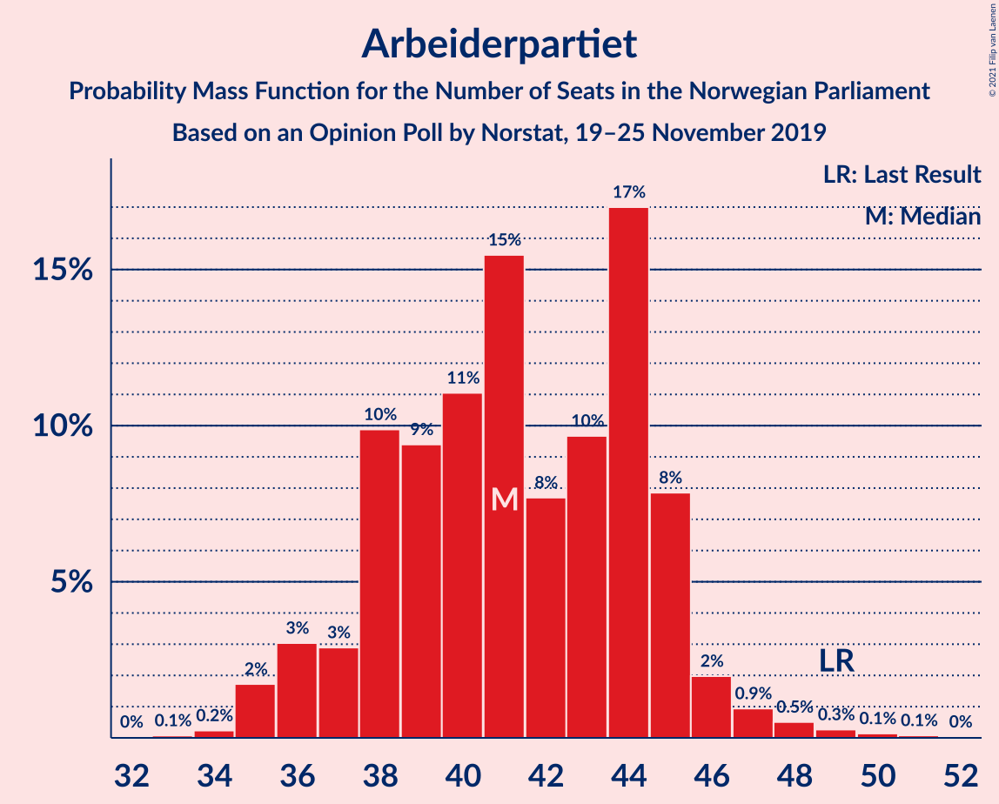
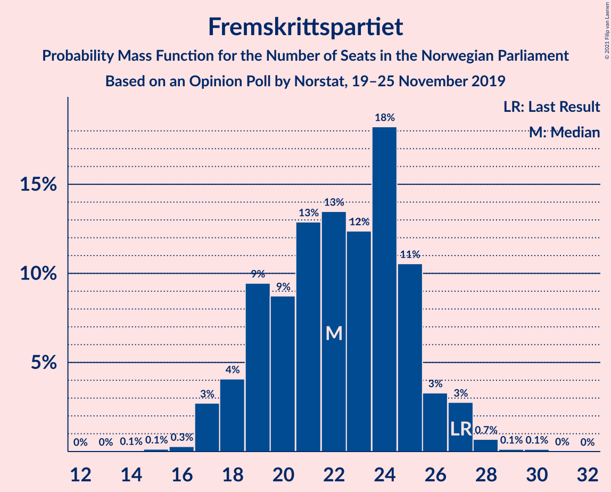
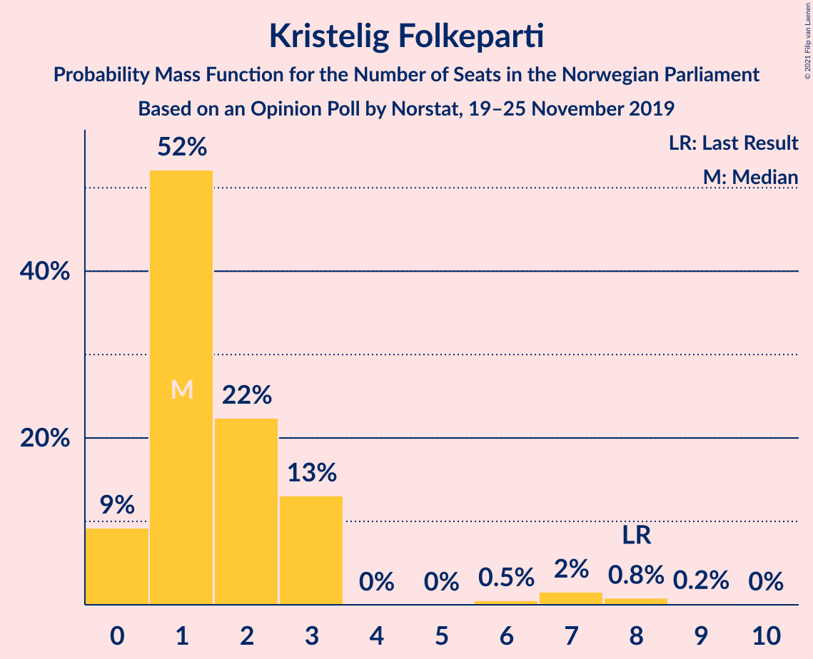
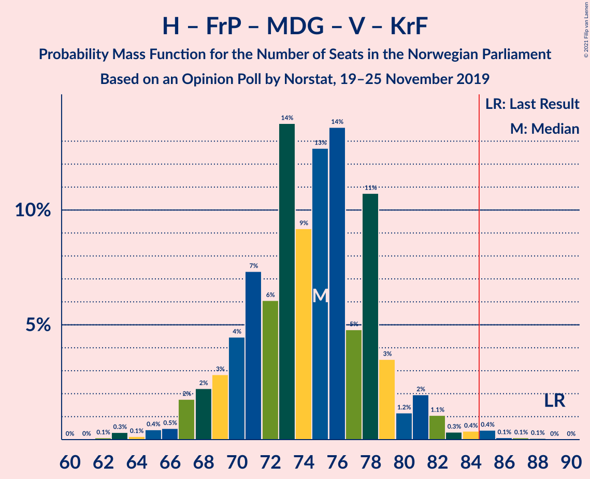
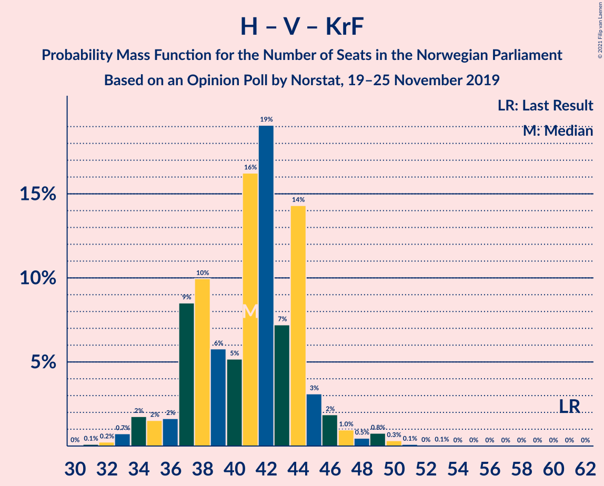

# Opinion Poll by Norstat, 19–25 November 2019

<a href="#voting-intentions">Voting Intentions</a> | <a href="#seats">Seats</a> | <a href="#coalitions">Coalitions</a> | <a href="#technical-information">Technical Information</a>

## Voting Intentions

### Confidence Intervals

| Party | Last Result | Poll Result | 80% Confidence Interval | 90% Confidence Interval | 95% Confidence Interval | 99% Confidence Interval |
|:-----:|:-----------:|:-----------:|:-----------------------:|:-----------------------:|:-----------------------:|:-----------------------:|
| Arbeiderpartiet | 27.4% | 22.8% | 20.9–24.9% |20.4–25.5% |20.0–26.0% |19.1–27.0% |
| Høyre | 25.0% | 19.6% | 17.9–21.6% |17.4–22.1% |16.9–22.6% |16.1–23.6% |
| Senterpartiet | 10.3% | 18.0% | 16.3–19.9% |15.8–20.5% |15.4–20.9% |14.6–21.9% |
| Fremskrittspartiet | 15.2% | 12.6% | 11.1–14.2% |10.7–14.7% |10.4–15.1% |9.7–16.0% |
| Sosialistisk Venstreparti | 6.0% | 6.5% | 5.5–7.8% |5.2–8.2% |5.0–8.6% |4.5–9.2% |
| Miljøpartiet De Grønne | 3.2% | 6.4% | 5.4–7.7% |5.1–8.1% |4.9–8.4% |4.4–9.1% |
| Rødt | 2.4% | 4.5% | 3.7–5.7% |3.5–6.0% |3.3–6.3% |2.9–6.9% |
| Venstre | 4.4% | 3.5% | 2.7–4.5% |2.5–4.8% |2.4–5.0% |2.1–5.6% |
| Kristelig Folkeparti | 4.2% | 2.8% | 2.2–3.7% |2.0–4.0% |1.8–4.3% |1.6–4.8% |

*Note:* The poll result column reflects the actual value used in the calculations. Published results may vary slightly, and in addition be rounded to fewer digits.

## Seats

### Confidence Intervals

| Party | Last Result | Median | 80% Confidence Interval | 90% Confidence Interval | 95% Confidence Interval | 99% Confidence Interval |
|:-----:|:-----------:|:------:|:-----------------------:|:-----------------------:|:-----------------------:|:-----------------------:|
| <a href="#arbeiderpartiet">Arbeiderpartiet</a> | 49 | 44 | 39–45 |38–45 |37–46 |35–48 |
| <a href="#høyre">Høyre</a> | 45 | 36 | 32–39 |30–39 |30–40 |28–42 |
| <a href="#senterpartiet">Senterpartiet</a> | 19 | 33 | 31–38 |30–38 |29–39 |27–41 |
| <a href="#fremskrittspartiet">Fremskrittspartiet</a> | 27 | 21 | 18–26 |18–27 |17–27 |17–28 |
| <a href="#sosialistisk-venstreparti">Sosialistisk Venstreparti</a> | 11 | 11 | 9–13 |9–14 |9–15 |8–16 |
| <a href="#miljøpartiet-de-grønne">Miljøpartiet De Grønne</a> | 1 | 11 | 9–13 |9–14 |8–15 |7–16 |
| <a href="#rødt">Rødt</a> | 1 | 7 | 2–10 |2–10 |2–10 |2–11 |
| <a href="#venstre">Venstre</a> | 8 | 4 | 2–7 |2–8 |2–8 |1–10 |
| <a href="#kristelig-folkeparti">Kristelig Folkeparti</a> | 8 | 1 | 0–3 |0–3 |0–6 |0–8 |

### Arbeiderpartiet

*For a full overview of the results for this party, see the [Arbeiderpartiet](party-arbeiderpartiet.html) page.*

| Number of Seats | Probability | Accumulated | Special Marks |
|:---------------:|:-----------:|:-----------:|:-------------:|
| 33 | 0.1% | 100% |  |
| 34 | 0.1% | 99.9% |  |
| 35 | 0.3% | 99.8% |  |
| 36 | 0.8% | 99.5% |  |
| 37 | 2% | 98.7% |  |
| 38 | 3% | 97% |  |
| 39 | 20% | 93% |  |
| 40 | 5% | 74% |  |
| 41 | 4% | 68% |  |
| 42 | 5% | 64% |  |
| 43 | 8% | 59% |  |
| 44 | 16% | 51% | Median |
| 45 | 32% | 35% |  |
| 46 | 1.4% | 3% |  |
| 47 | 0.6% | 2% |  |
| 48 | 0.6% | 1.0% |  |
| 49 | 0.2% | 0.4% | Last Result |
| 50 | 0% | 0.2% |  |
| 51 | 0.1% | 0.2% |  |
| 52 | 0% | 0% |  |

### Høyre

*For a full overview of the results for this party, see the [Høyre](party-høyre.html) page.*

| Number of Seats | Probability | Accumulated | Special Marks |
|:---------------:|:-----------:|:-----------:|:-------------:|
| 25 | 0% | 100% |  |
| 26 | 0.1% | 99.9% |  |
| 27 | 0.1% | 99.8% |  |
| 28 | 0.4% | 99.7% |  |
| 29 | 2% | 99.4% |  |
| 30 | 5% | 98% |  |
| 31 | 3% | 93% |  |
| 32 | 3% | 90% |  |
| 33 | 7% | 88% |  |
| 34 | 5% | 80% |  |
| 35 | 20% | 75% |  |
| 36 | 24% | 55% | Median |
| 37 | 7% | 31% |  |
| 38 | 12% | 24% |  |
| 39 | 9% | 12% |  |
| 40 | 0.8% | 3% |  |
| 41 | 2% | 2% |  |
| 42 | 0.6% | 0.8% |  |
| 43 | 0% | 0.2% |  |
| 44 | 0.2% | 0.2% |  |
| 45 | 0% | 0% | Last Result |

### Senterpartiet

*For a full overview of the results for this party, see the [Senterpartiet](party-senterpartiet.html) page.*

| Number of Seats | Probability | Accumulated | Special Marks |
|:---------------:|:-----------:|:-----------:|:-------------:|
| 19 | 0% | 100% | Last Result |
| 20 | 0% | 100% |  |
| 21 | 0% | 100% |  |
| 22 | 0% | 100% |  |
| 23 | 0% | 100% |  |
| 24 | 0% | 100% |  |
| 25 | 0.2% | 100% |  |
| 26 | 0.2% | 99.8% |  |
| 27 | 0.4% | 99.6% |  |
| 28 | 1.1% | 99.2% |  |
| 29 | 1.2% | 98% |  |
| 30 | 5% | 97% |  |
| 31 | 9% | 92% |  |
| 32 | 24% | 83% |  |
| 33 | 23% | 59% | Median |
| 34 | 10% | 36% |  |
| 35 | 3% | 26% |  |
| 36 | 3% | 22% |  |
| 37 | 4% | 20% |  |
| 38 | 11% | 15% |  |
| 39 | 2% | 4% |  |
| 40 | 0.3% | 2% |  |
| 41 | 2% | 2% |  |
| 42 | 0.4% | 0.5% |  |
| 43 | 0% | 0% |  |

### Fremskrittspartiet

*For a full overview of the results for this party, see the [Fremskrittspartiet](party-fremskrittspartiet.html) page.*

| Number of Seats | Probability | Accumulated | Special Marks |
|:---------------:|:-----------:|:-----------:|:-------------:|
| 15 | 0% | 100% |  |
| 16 | 0.4% | 99.9% |  |
| 17 | 3% | 99.5% |  |
| 18 | 10% | 97% |  |
| 19 | 9% | 87% |  |
| 20 | 22% | 78% |  |
| 21 | 15% | 56% | Median |
| 22 | 9% | 41% |  |
| 23 | 13% | 32% |  |
| 24 | 2% | 19% |  |
| 25 | 4% | 17% |  |
| 26 | 5% | 13% |  |
| 27 | 8% | 8% | Last Result |
| 28 | 0.3% | 0.6% |  |
| 29 | 0.1% | 0.3% |  |
| 30 | 0.2% | 0.2% |  |
| 31 | 0.1% | 0.1% |  |
| 32 | 0% | 0% |  |

### Sosialistisk Venstreparti

*For a full overview of the results for this party, see the [Sosialistisk Venstreparti](party-sosialistiskvenstreparti.html) page.*

| Number of Seats | Probability | Accumulated | Special Marks |
|:---------------:|:-----------:|:-----------:|:-------------:|
| 7 | 0.2% | 100% |  |
| 8 | 0.9% | 99.8% |  |
| 9 | 12% | 98.9% |  |
| 10 | 37% | 87% |  |
| 11 | 4% | 50% | Last Result, Median |
| 12 | 29% | 46% |  |
| 13 | 7% | 17% |  |
| 14 | 6% | 9% |  |
| 15 | 2% | 3% |  |
| 16 | 0.7% | 0.9% |  |
| 17 | 0.1% | 0.2% |  |
| 18 | 0.1% | 0.1% |  |
| 19 | 0% | 0% |  |

### Miljøpartiet De Grønne

*For a full overview of the results for this party, see the [Miljøpartiet De Grønne](party-miljøpartietdegrønne.html) page.*

| Number of Seats | Probability | Accumulated | Special Marks |
|:---------------:|:-----------:|:-----------:|:-------------:|
| 1 | 0% | 100% | Last Result |
| 2 | 0% | 100% |  |
| 3 | 0.3% | 100% |  |
| 4 | 0% | 99.7% |  |
| 5 | 0% | 99.7% |  |
| 6 | 0% | 99.7% |  |
| 7 | 0.2% | 99.7% |  |
| 8 | 4% | 99.4% |  |
| 9 | 7% | 96% |  |
| 10 | 6% | 89% |  |
| 11 | 43% | 82% | Median |
| 12 | 25% | 39% |  |
| 13 | 7% | 14% |  |
| 14 | 3% | 7% |  |
| 15 | 0.9% | 3% |  |
| 16 | 2% | 2% |  |
| 17 | 0% | 0% |  |

### Rødt

*For a full overview of the results for this party, see the [Rødt](party-rødt.html) page.*

| Number of Seats | Probability | Accumulated | Special Marks |
|:---------------:|:-----------:|:-----------:|:-------------:|
| 1 | 0.3% | 100% | Last Result |
| 2 | 16% | 99.7% |  |
| 3 | 0.6% | 84% |  |
| 4 | 0% | 83% |  |
| 5 | 0% | 83% |  |
| 6 | 2% | 83% |  |
| 7 | 37% | 81% | Median |
| 8 | 23% | 45% |  |
| 9 | 9% | 22% |  |
| 10 | 11% | 13% |  |
| 11 | 1.1% | 1.5% |  |
| 12 | 0.4% | 0.4% |  |
| 13 | 0% | 0.1% |  |
| 14 | 0% | 0% |  |

### Venstre

*For a full overview of the results for this party, see the [Venstre](party-venstre.html) page.*

| Number of Seats | Probability | Accumulated | Special Marks |
|:---------------:|:-----------:|:-----------:|:-------------:|
| 1 | 0.5% | 100% |  |
| 2 | 48% | 99.4% |  |
| 3 | 0.7% | 51% |  |
| 4 | 8% | 50% | Median |
| 5 | 0% | 43% |  |
| 6 | 0.5% | 43% |  |
| 7 | 37% | 42% |  |
| 8 | 4% | 5% | Last Result |
| 9 | 0.9% | 2% |  |
| 10 | 0.8% | 0.8% |  |
| 11 | 0% | 0% |  |

### Kristelig Folkeparti

*For a full overview of the results for this party, see the [Kristelig Folkeparti](party-kristeligfolkeparti.html) page.*

| Number of Seats | Probability | Accumulated | Special Marks |
|:---------------:|:-----------:|:-----------:|:-------------:|
| 0 | 13% | 100% |  |
| 1 | 63% | 87% | Median |
| 2 | 7% | 24% |  |
| 3 | 14% | 17% |  |
| 4 | 0% | 4% |  |
| 5 | 0% | 4% |  |
| 6 | 1.3% | 4% |  |
| 7 | 1.2% | 2% |  |
| 8 | 0.8% | 1.1% | Last Result |
| 9 | 0.2% | 0.2% |  |
| 10 | 0% | 0% |  |

## Coalitions

### Confidence Intervals

| Coalition | Last Result | Median | Majority? | 80% Confidence Interval | 90% Confidence Interval | 95% Confidence Interval | 99% Confidence Interval |
|:---------:|:-----------:|:------:|:---------:|:-----------------------:|:-----------------------:|:-----------------------:|:-----------------------:|
| Arbeiderpartiet – Senterpartiet – Sosialistisk Venstreparti – Miljøpartiet De Grønne – Rødt | 81 | 105 | 100% | 101–110 | 100–111 | 98–113 | 95–115 |
| Arbeiderpartiet – Senterpartiet – Sosialistisk Venstreparti – Miljøpartiet De Grønne – Kristelig Folkeparti | 88 | 100 | 100% | 96–104 | 95–106 | 94–108 | 90–109 |
| Arbeiderpartiet – Senterpartiet – Sosialistisk Venstreparti – Miljøpartiet De Grønne | 80 | 99 | 100% | 94–101 | 93–103 | 91–105 | 89–107 |
| Høyre – Senterpartiet – Fremskrittspartiet – Venstre – Kristelig Folkeparti | 107 | 96 | 99.9% | 92–103 | 90–104 | 89–104 | 87–107 |
| Arbeiderpartiet – Senterpartiet – Sosialistisk Venstreparti – Rødt | 80 | 94 | 99.1% | 91–97 | 89–100 | 87–101 | 83–103 |
| Arbeiderpartiet – Senterpartiet – Miljøpartiet De Grønne – Kristelig Folkeparti | 77 | 89 | 89% | 84–92 | 83–94 | 82–96 | 79–98 |
| Arbeiderpartiet – Senterpartiet – Sosialistisk Venstreparti | 79 | 87 | 82% | 83–90 | 82–91 | 81–94 | 78–95 |
| Arbeiderpartiet – Senterpartiet – Kristelig Folkeparti | 76 | 78 | 3% | 74–81 | 72–82 | 70–85 | 68–87 |
| Arbeiderpartiet – Senterpartiet | 68 | 77 | 0.1% | 72–79 | 70–80 | 69–82 | 67–84 |
| Høyre – Fremskrittspartiet – Miljøpartiet De Grønne – Venstre – Kristelig Folkeparti | 89 | 75 | 0.6% | 70–78 | 68–79 | 67–82 | 63–85 |
| Høyre – Fremskrittspartiet – Venstre – Kristelig Folkeparti | 88 | 63 | 0% | 59–67 | 57–67 | 56–69 | 52–73 |
| Høyre – Fremskrittspartiet – Venstre | 80 | 62 | 0% | 57–65 | 55–65 | 53–67 | 51–71 |
| Høyre – Fremskrittspartiet | 72 | 56 | 0% | 53–61 | 51–63 | 51–64 | 48–66 |
| Arbeiderpartiet – Sosialistisk Venstreparti | 60 | 54 | 0% | 51–56 | 50–57 | 48–58 | 46–62 |
| Høyre – Venstre – Kristelig Folkeparti | 61 | 42 | 0% | 37–44 | 35–45 | 33–47 | 33–49 |
| Senterpartiet – Venstre – Kristelig Folkeparti | 35 | 40 | 0% | 35–44 | 33–46 | 33–47 | 30–48 |

### Arbeiderpartiet – Senterpartiet – Sosialistisk Venstreparti – Miljøpartiet De Grønne – Rødt

| Number of Seats | Probability | Accumulated | Special Marks |
|:---------------:|:-----------:|:-----------:|:-------------:|
| 81 | 0% | 100% | Last Result |
| 82 | 0% | 100% |  |
| 83 | 0% | 100% |  |
| 84 | 0% | 100% |  |
| 85 | 0% | 100% | Majority |
| 86 | 0% | 100% |  |
| 87 | 0% | 100% |  |
| 88 | 0% | 100% |  |
| 89 | 0% | 100% |  |
| 90 | 0% | 100% |  |
| 91 | 0.1% | 100% |  |
| 92 | 0.1% | 99.8% |  |
| 93 | 0.1% | 99.8% |  |
| 94 | 0% | 99.6% |  |
| 95 | 0.3% | 99.6% |  |
| 96 | 0.6% | 99.3% |  |
| 97 | 0.2% | 98.7% |  |
| 98 | 1.5% | 98.5% |  |
| 99 | 1.1% | 97% |  |
| 100 | 1.2% | 96% |  |
| 101 | 5% | 95% |  |
| 102 | 10% | 90% |  |
| 103 | 9% | 80% |  |
| 104 | 2% | 70% |  |
| 105 | 23% | 69% |  |
| 106 | 13% | 45% | Median |
| 107 | 6% | 33% |  |
| 108 | 13% | 27% |  |
| 109 | 2% | 14% |  |
| 110 | 5% | 12% |  |
| 111 | 3% | 7% |  |
| 112 | 1.0% | 4% |  |
| 113 | 2% | 3% |  |
| 114 | 0.4% | 1.1% |  |
| 115 | 0.3% | 0.7% |  |
| 116 | 0.2% | 0.4% |  |
| 117 | 0.2% | 0.2% |  |
| 118 | 0% | 0% |  |

### Arbeiderpartiet – Senterpartiet – Sosialistisk Venstreparti – Miljøpartiet De Grønne – Kristelig Folkeparti

| Number of Seats | Probability | Accumulated | Special Marks |
|:---------------:|:-----------:|:-----------:|:-------------:|
| 87 | 0% | 100% |  |
| 88 | 0.1% | 99.9% | Last Result |
| 89 | 0.2% | 99.8% |  |
| 90 | 0.2% | 99.7% |  |
| 91 | 0.8% | 99.4% |  |
| 92 | 0.3% | 98.6% |  |
| 93 | 0.8% | 98% |  |
| 94 | 0.6% | 98% |  |
| 95 | 6% | 97% |  |
| 96 | 4% | 91% |  |
| 97 | 7% | 87% |  |
| 98 | 4% | 80% |  |
| 99 | 24% | 76% |  |
| 100 | 15% | 52% | Median |
| 101 | 12% | 38% |  |
| 102 | 13% | 25% |  |
| 103 | 2% | 12% |  |
| 104 | 3% | 11% |  |
| 105 | 2% | 8% |  |
| 106 | 1.2% | 5% |  |
| 107 | 0.7% | 4% |  |
| 108 | 3% | 4% |  |
| 109 | 0.2% | 0.7% |  |
| 110 | 0.2% | 0.5% |  |
| 111 | 0.1% | 0.3% |  |
| 112 | 0.1% | 0.1% |  |
| 113 | 0% | 0% |  |

### Arbeiderpartiet – Senterpartiet – Sosialistisk Venstreparti – Miljøpartiet De Grønne

| Number of Seats | Probability | Accumulated | Special Marks |
|:---------------:|:-----------:|:-----------:|:-------------:|
| 80 | 0% | 100% | Last Result |
| 81 | 0% | 100% |  |
| 82 | 0% | 100% |  |
| 83 | 0% | 100% |  |
| 84 | 0% | 100% |  |
| 85 | 0% | 100% | Majority |
| 86 | 0.1% | 100% |  |
| 87 | 0.2% | 99.9% |  |
| 88 | 0.2% | 99.7% |  |
| 89 | 0.3% | 99.6% |  |
| 90 | 0.9% | 99.3% |  |
| 91 | 1.5% | 98% |  |
| 92 | 0.9% | 97% |  |
| 93 | 3% | 96% |  |
| 94 | 8% | 93% |  |
| 95 | 1.4% | 84% |  |
| 96 | 5% | 83% |  |
| 97 | 0.6% | 78% |  |
| 98 | 27% | 77% |  |
| 99 | 10% | 50% | Median |
| 100 | 16% | 40% |  |
| 101 | 14% | 23% |  |
| 102 | 3% | 9% |  |
| 103 | 1.4% | 6% |  |
| 104 | 1.3% | 5% |  |
| 105 | 3% | 4% |  |
| 106 | 0.2% | 0.9% |  |
| 107 | 0.5% | 0.7% |  |
| 108 | 0.1% | 0.2% |  |
| 109 | 0% | 0.1% |  |
| 110 | 0% | 0% |  |

### Høyre – Senterpartiet – Fremskrittspartiet – Venstre – Kristelig Folkeparti

| Number of Seats | Probability | Accumulated | Special Marks |
|:---------------:|:-----------:|:-----------:|:-------------:|
| 84 | 0.1% | 100% |  |
| 85 | 0% | 99.9% | Majority |
| 86 | 0.1% | 99.9% |  |
| 87 | 0.3% | 99.8% |  |
| 88 | 0.7% | 99.4% |  |
| 89 | 2% | 98.7% |  |
| 90 | 4% | 97% |  |
| 91 | 2% | 93% |  |
| 92 | 4% | 91% |  |
| 93 | 4% | 87% |  |
| 94 | 13% | 82% |  |
| 95 | 4% | 70% | Median |
| 96 | 33% | 66% |  |
| 97 | 3% | 33% |  |
| 98 | 8% | 30% |  |
| 99 | 5% | 22% |  |
| 100 | 3% | 17% |  |
| 101 | 3% | 14% |  |
| 102 | 0.3% | 11% |  |
| 103 | 1.5% | 10% |  |
| 104 | 8% | 9% |  |
| 105 | 0.1% | 1.0% |  |
| 106 | 0.2% | 0.9% |  |
| 107 | 0.5% | 0.7% | Last Result |
| 108 | 0.1% | 0.2% |  |
| 109 | 0% | 0% |  |

### Arbeiderpartiet – Senterpartiet – Sosialistisk Venstreparti – Rødt

| Number of Seats | Probability | Accumulated | Special Marks |
|:---------------:|:-----------:|:-----------:|:-------------:|
| 79 | 0% | 100% |  |
| 80 | 0.1% | 99.9% | Last Result |
| 81 | 0.1% | 99.8% |  |
| 82 | 0% | 99.7% |  |
| 83 | 0.2% | 99.7% |  |
| 84 | 0.4% | 99.5% |  |
| 85 | 0.3% | 99.1% | Majority |
| 86 | 0.2% | 98.9% |  |
| 87 | 2% | 98.6% |  |
| 88 | 1.1% | 97% |  |
| 89 | 2% | 96% |  |
| 90 | 3% | 94% |  |
| 91 | 16% | 92% |  |
| 92 | 3% | 76% |  |
| 93 | 5% | 72% |  |
| 94 | 31% | 67% |  |
| 95 | 8% | 36% | Median |
| 96 | 2% | 28% |  |
| 97 | 16% | 25% |  |
| 98 | 2% | 10% |  |
| 99 | 2% | 8% |  |
| 100 | 3% | 6% |  |
| 101 | 0.7% | 3% |  |
| 102 | 2% | 2% |  |
| 103 | 0.1% | 0.5% |  |
| 104 | 0% | 0.4% |  |
| 105 | 0.1% | 0.4% |  |
| 106 | 0.2% | 0.2% |  |
| 107 | 0% | 0% |  |

### Arbeiderpartiet – Senterpartiet – Miljøpartiet De Grønne – Kristelig Folkeparti

| Number of Seats | Probability | Accumulated | Special Marks |
|:---------------:|:-----------:|:-----------:|:-------------:|
| 75 | 0% | 100% |  |
| 76 | 0% | 99.9% |  |
| 77 | 0.3% | 99.9% | Last Result |
| 78 | 0% | 99.6% |  |
| 79 | 0.5% | 99.6% |  |
| 80 | 0.3% | 99.1% |  |
| 81 | 1.2% | 98.8% |  |
| 82 | 0.7% | 98% |  |
| 83 | 5% | 97% |  |
| 84 | 3% | 92% |  |
| 85 | 4% | 89% | Majority |
| 86 | 3% | 85% |  |
| 87 | 7% | 82% |  |
| 88 | 9% | 74% |  |
| 89 | 32% | 65% | Median |
| 90 | 10% | 33% |  |
| 91 | 11% | 23% |  |
| 92 | 3% | 12% |  |
| 93 | 2% | 9% |  |
| 94 | 4% | 7% |  |
| 95 | 0.6% | 4% |  |
| 96 | 0.5% | 3% |  |
| 97 | 0.6% | 2% |  |
| 98 | 1.5% | 2% |  |
| 99 | 0.1% | 0.3% |  |
| 100 | 0% | 0.1% |  |
| 101 | 0.1% | 0.1% |  |
| 102 | 0% | 0% |  |

### Arbeiderpartiet – Senterpartiet – Sosialistisk Venstreparti

| Number of Seats | Probability | Accumulated | Special Marks |
|:---------------:|:-----------:|:-----------:|:-------------:|
| 76 | 0.1% | 100% |  |
| 77 | 0.2% | 99.8% |  |
| 78 | 0.2% | 99.6% |  |
| 79 | 0.2% | 99.3% | Last Result |
| 80 | 0.8% | 99.1% |  |
| 81 | 1.5% | 98% |  |
| 82 | 4% | 97% |  |
| 83 | 6% | 93% |  |
| 84 | 4% | 87% |  |
| 85 | 6% | 82% | Majority |
| 86 | 3% | 76% |  |
| 87 | 31% | 73% |  |
| 88 | 8% | 42% | Median |
| 89 | 21% | 34% |  |
| 90 | 5% | 13% |  |
| 91 | 2% | 7% |  |
| 92 | 1.1% | 5% |  |
| 93 | 1.1% | 4% |  |
| 94 | 2% | 3% |  |
| 95 | 0.5% | 0.9% |  |
| 96 | 0.1% | 0.5% |  |
| 97 | 0.3% | 0.4% |  |
| 98 | 0% | 0.1% |  |
| 99 | 0.1% | 0.1% |  |
| 100 | 0% | 0% |  |

### Arbeiderpartiet – Senterpartiet – Kristelig Folkeparti

| Number of Seats | Probability | Accumulated | Special Marks |
|:---------------:|:-----------:|:-----------:|:-------------:|
| 65 | 0% | 100% |  |
| 66 | 0% | 99.9% |  |
| 67 | 0.1% | 99.9% |  |
| 68 | 0.4% | 99.7% |  |
| 69 | 0.7% | 99.4% |  |
| 70 | 3% | 98.7% |  |
| 71 | 0.5% | 96% |  |
| 72 | 4% | 95% |  |
| 73 | 1.3% | 92% |  |
| 74 | 5% | 90% |  |
| 75 | 5% | 85% |  |
| 76 | 9% | 80% | Last Result |
| 77 | 4% | 71% |  |
| 78 | 42% | 67% | Median |
| 79 | 12% | 25% |  |
| 80 | 0.9% | 12% |  |
| 81 | 3% | 11% |  |
| 82 | 5% | 9% |  |
| 83 | 0.9% | 4% |  |
| 84 | 0.5% | 3% |  |
| 85 | 0.2% | 3% | Majority |
| 86 | 0.5% | 2% |  |
| 87 | 2% | 2% |  |
| 88 | 0.1% | 0.2% |  |
| 89 | 0% | 0% |  |

### Arbeiderpartiet – Senterpartiet

| Number of Seats | Probability | Accumulated | Special Marks |
|:---------------:|:-----------:|:-----------:|:-------------:|
| 63 | 0.1% | 100% |  |
| 64 | 0% | 99.9% |  |
| 65 | 0.2% | 99.9% |  |
| 66 | 0.1% | 99.8% |  |
| 67 | 0.4% | 99.6% |  |
| 68 | 1.1% | 99.2% | Last Result |
| 69 | 1.0% | 98% |  |
| 70 | 3% | 97% |  |
| 71 | 0.7% | 95% |  |
| 72 | 7% | 94% |  |
| 73 | 8% | 87% |  |
| 74 | 5% | 79% |  |
| 75 | 6% | 74% |  |
| 76 | 6% | 67% |  |
| 77 | 38% | 62% | Median |
| 78 | 13% | 23% |  |
| 79 | 5% | 11% |  |
| 80 | 2% | 6% |  |
| 81 | 1.3% | 4% |  |
| 82 | 0.4% | 3% |  |
| 83 | 0.3% | 2% |  |
| 84 | 2% | 2% |  |
| 85 | 0% | 0.1% | Majority |
| 86 | 0% | 0% |  |

### Høyre – Fremskrittspartiet – Miljøpartiet De Grønne – Venstre – Kristelig Folkeparti

| Number of Seats | Probability | Accumulated | Special Marks |
|:---------------:|:-----------:|:-----------:|:-------------:|
| 62 | 0.3% | 100% |  |
| 63 | 0.4% | 99.7% |  |
| 64 | 0.3% | 99.3% |  |
| 65 | 0.3% | 99.1% |  |
| 66 | 0.3% | 98.7% |  |
| 67 | 3% | 98% |  |
| 68 | 1.5% | 96% |  |
| 69 | 4% | 94% |  |
| 70 | 2% | 90% |  |
| 71 | 7% | 88% |  |
| 72 | 16% | 82% |  |
| 73 | 3% | 66% | Median |
| 74 | 8% | 63% |  |
| 75 | 30% | 54% |  |
| 76 | 4% | 24% |  |
| 77 | 3% | 20% |  |
| 78 | 12% | 17% |  |
| 79 | 2% | 5% |  |
| 80 | 0.3% | 4% |  |
| 81 | 0.7% | 3% |  |
| 82 | 2% | 3% |  |
| 83 | 0.3% | 1.0% |  |
| 84 | 0.2% | 0.8% |  |
| 85 | 0.3% | 0.6% | Majority |
| 86 | 0.1% | 0.2% |  |
| 87 | 0% | 0.1% |  |
| 88 | 0.1% | 0.1% |  |
| 89 | 0% | 0% | Last Result |

### Høyre – Fremskrittspartiet – Venstre – Kristelig Folkeparti

| Number of Seats | Probability | Accumulated | Special Marks |
|:---------------:|:-----------:|:-----------:|:-------------:|
| 52 | 0.5% | 100% |  |
| 53 | 0.4% | 99.5% |  |
| 54 | 0.4% | 99.0% |  |
| 55 | 0.5% | 98.7% |  |
| 56 | 2% | 98% |  |
| 57 | 2% | 96% |  |
| 58 | 4% | 95% |  |
| 59 | 6% | 91% |  |
| 60 | 5% | 85% |  |
| 61 | 16% | 80% |  |
| 62 | 6% | 64% | Median |
| 63 | 13% | 58% |  |
| 64 | 24% | 46% |  |
| 65 | 1.5% | 22% |  |
| 66 | 9% | 21% |  |
| 67 | 7% | 12% |  |
| 68 | 2% | 5% |  |
| 69 | 1.2% | 3% |  |
| 70 | 0.8% | 2% |  |
| 71 | 0.2% | 1.3% |  |
| 72 | 0.2% | 1.0% |  |
| 73 | 0.5% | 0.8% |  |
| 74 | 0.2% | 0.3% |  |
| 75 | 0% | 0.1% |  |
| 76 | 0% | 0.1% |  |
| 77 | 0.1% | 0.1% |  |
| 78 | 0% | 0% |  |
| 79 | 0% | 0% |  |
| 80 | 0% | 0% |  |
| 81 | 0% | 0% |  |
| 82 | 0% | 0% |  |
| 83 | 0% | 0% |  |
| 84 | 0% | 0% |  |
| 85 | 0% | 0% | Majority |
| 86 | 0% | 0% |  |
| 87 | 0% | 0% |  |
| 88 | 0% | 0% | Last Result |

### Høyre – Fremskrittspartiet – Venstre

| Number of Seats | Probability | Accumulated | Special Marks |
|:---------------:|:-----------:|:-----------:|:-------------:|
| 49 | 0.1% | 100% |  |
| 50 | 0.4% | 99.9% |  |
| 51 | 0.1% | 99.5% |  |
| 52 | 0.5% | 99.4% |  |
| 53 | 2% | 98.9% |  |
| 54 | 0.8% | 97% |  |
| 55 | 3% | 96% |  |
| 56 | 0.9% | 94% |  |
| 57 | 5% | 93% |  |
| 58 | 7% | 87% |  |
| 59 | 4% | 80% |  |
| 60 | 13% | 76% |  |
| 61 | 4% | 63% | Median |
| 62 | 14% | 59% |  |
| 63 | 26% | 45% |  |
| 64 | 4% | 20% |  |
| 65 | 11% | 15% |  |
| 66 | 1.4% | 5% |  |
| 67 | 1.2% | 3% |  |
| 68 | 0.7% | 2% |  |
| 69 | 0.8% | 2% |  |
| 70 | 0.2% | 0.7% |  |
| 71 | 0.3% | 0.6% |  |
| 72 | 0.1% | 0.3% |  |
| 73 | 0.1% | 0.2% |  |
| 74 | 0% | 0.1% |  |
| 75 | 0.1% | 0.1% |  |
| 76 | 0% | 0% |  |
| 77 | 0% | 0% |  |
| 78 | 0% | 0% |  |
| 79 | 0% | 0% |  |
| 80 | 0% | 0% | Last Result |

### Høyre – Fremskrittspartiet

| Number of Seats | Probability | Accumulated | Special Marks |
|:---------------:|:-----------:|:-----------:|:-------------:|
| 46 | 0% | 100% |  |
| 47 | 0.1% | 99.9% |  |
| 48 | 0.8% | 99.8% |  |
| 49 | 0.3% | 99.0% |  |
| 50 | 1.2% | 98.7% |  |
| 51 | 3% | 98% |  |
| 52 | 1.0% | 95% |  |
| 53 | 14% | 94% |  |
| 54 | 0.8% | 80% |  |
| 55 | 10% | 79% |  |
| 56 | 28% | 69% |  |
| 57 | 3% | 41% | Median |
| 58 | 3% | 38% |  |
| 59 | 3% | 35% |  |
| 60 | 10% | 32% |  |
| 61 | 12% | 22% |  |
| 62 | 5% | 10% |  |
| 63 | 2% | 5% |  |
| 64 | 1.3% | 3% |  |
| 65 | 1.0% | 2% |  |
| 66 | 0.1% | 0.5% |  |
| 67 | 0.2% | 0.4% |  |
| 68 | 0.1% | 0.2% |  |
| 69 | 0% | 0.1% |  |
| 70 | 0% | 0.1% |  |
| 71 | 0% | 0% |  |
| 72 | 0% | 0% | Last Result |

### Arbeiderpartiet – Sosialistisk Venstreparti

| Number of Seats | Probability | Accumulated | Special Marks |
|:---------------:|:-----------:|:-----------:|:-------------:|
| 43 | 0% | 100% |  |
| 44 | 0.1% | 99.9% |  |
| 45 | 0.1% | 99.8% |  |
| 46 | 0.3% | 99.7% |  |
| 47 | 1.0% | 99.4% |  |
| 48 | 1.3% | 98% |  |
| 49 | 2% | 97% |  |
| 50 | 5% | 95% |  |
| 51 | 17% | 91% |  |
| 52 | 8% | 73% |  |
| 53 | 6% | 65% |  |
| 54 | 14% | 59% |  |
| 55 | 24% | 45% | Median |
| 56 | 14% | 21% |  |
| 57 | 4% | 7% |  |
| 58 | 2% | 3% |  |
| 59 | 0.4% | 2% |  |
| 60 | 0.2% | 1.1% | Last Result |
| 61 | 0.3% | 1.0% |  |
| 62 | 0.4% | 0.7% |  |
| 63 | 0.1% | 0.2% |  |
| 64 | 0% | 0.2% |  |
| 65 | 0.1% | 0.2% |  |
| 66 | 0.1% | 0.1% |  |
| 67 | 0% | 0% |  |

### Høyre – Venstre – Kristelig Folkeparti

| Number of Seats | Probability | Accumulated | Special Marks |
|:---------------:|:-----------:|:-----------:|:-------------:|
| 31 | 0.1% | 100% |  |
| 32 | 0.2% | 99.9% |  |
| 33 | 2% | 99.7% |  |
| 34 | 2% | 97% |  |
| 35 | 3% | 96% |  |
| 36 | 1.3% | 93% |  |
| 37 | 6% | 91% |  |
| 38 | 2% | 85% |  |
| 39 | 6% | 83% |  |
| 40 | 15% | 76% |  |
| 41 | 4% | 62% | Median |
| 42 | 12% | 58% |  |
| 43 | 19% | 46% |  |
| 44 | 22% | 27% |  |
| 45 | 0.5% | 5% |  |
| 46 | 2% | 5% |  |
| 47 | 2% | 3% |  |
| 48 | 0.3% | 1.0% |  |
| 49 | 0.4% | 0.8% |  |
| 50 | 0.3% | 0.3% |  |
| 51 | 0% | 0.1% |  |
| 52 | 0% | 0.1% |  |
| 53 | 0% | 0% |  |
| 54 | 0% | 0% |  |
| 55 | 0% | 0% |  |
| 56 | 0% | 0% |  |
| 57 | 0% | 0% |  |
| 58 | 0% | 0% |  |
| 59 | 0% | 0% |  |
| 60 | 0% | 0% |  |
| 61 | 0% | 0% | Last Result |

### Senterpartiet – Venstre – Kristelig Folkeparti

| Number of Seats | Probability | Accumulated | Special Marks |
|:---------------:|:-----------:|:-----------:|:-------------:|
| 28 | 0% | 100% |  |
| 29 | 0.1% | 99.9% |  |
| 30 | 0.5% | 99.9% |  |
| 31 | 0.1% | 99.4% |  |
| 32 | 0.4% | 99.3% |  |
| 33 | 6% | 98.8% |  |
| 34 | 0.9% | 93% |  |
| 35 | 6% | 92% | Last Result |
| 36 | 13% | 87% |  |
| 37 | 7% | 74% |  |
| 38 | 6% | 67% | Median |
| 39 | 5% | 61% |  |
| 40 | 21% | 56% |  |
| 41 | 11% | 35% |  |
| 42 | 2% | 23% |  |
| 43 | 10% | 21% |  |
| 44 | 4% | 11% |  |
| 45 | 1.4% | 6% |  |
| 46 | 2% | 5% |  |
| 47 | 2% | 3% |  |
| 48 | 0.3% | 0.7% |  |
| 49 | 0.1% | 0.4% |  |
| 50 | 0% | 0.2% |  |
| 51 | 0.2% | 0.2% |  |
| 52 | 0% | 0% |  |

## Technical Information

### Opinion Poll

+ **Polling firm:** Norstat
+ **Commissioner(s):** —
+ **Fieldwork period:** 19–25 November 2019

### Calculations

+ **Sample size:** 749
+ **Simulations done:** 131,072
+ **Error estimate:** 1.83%

