# Opinion Poll by Kantar TNS, 25–29 November 2019

<a href="#voting-intentions">Voting Intentions</a> | <a href="#seats">Seats</a> | <a href="#coalitions">Coalitions</a> | <a href="#technical-information">Technical Information</a>

## Voting Intentions

### Confidence Intervals

| Party | Last Result | Poll Result | 80% Confidence Interval | 90% Confidence Interval | 95% Confidence Interval | 99% Confidence Interval |
|:-----:|:-----------:|:-----------:|:-----------------------:|:-----------------------:|:-----------------------:|:-----------------------:|
| Arbeiderpartiet | 27.4% | 21.9% | 20.1–23.9% |19.6–24.4% |19.2–24.9% |18.3–25.9% |
| Høyre | 25.0% | 19.1% | 17.4–21.0% |17.0–21.6% |16.6–22.0% |15.8–23.0% |
| Senterpartiet | 10.3% | 17.6% | 16.0–19.5% |15.5–20.0% |15.1–20.5% |14.4–21.4% |
| Fremskrittspartiet | 15.2% | 9.8% | 8.6–11.3% |8.2–11.7% |7.9–12.1% |7.4–12.8% |
| Sosialistisk Venstreparti | 6.0% | 7.9% | 6.8–9.3% |6.5–9.7% |6.2–10.0% |5.7–10.7% |
| Miljøpartiet De Grønne | 3.2% | 6.0% | 5.1–7.3% |4.8–7.6% |4.6–7.9% |4.2–8.6% |
| Rødt | 2.4% | 5.0% | 4.2–6.2% |3.9–6.5% |3.7–6.8% |3.3–7.4% |
| Venstre | 4.4% | 4.4% | 3.6–5.5% |3.4–5.8% |3.2–6.1% |2.8–6.6% |
| Kristelig Folkeparti | 4.2% | 4.2% | 3.4–5.2% |3.2–5.5% |3.0–5.8% |2.6–6.3% |

*Note:* The poll result column reflects the actual value used in the calculations. Published results may vary slightly, and in addition be rounded to fewer digits.

## Seats

### Confidence Intervals

| Party | Last Result | Median | 80% Confidence Interval | 90% Confidence Interval | 95% Confidence Interval | 99% Confidence Interval |
|:-----:|:-----------:|:------:|:-----------------------:|:-----------------------:|:-----------------------:|:-----------------------:|
| <a href="#arbeiderpartiet">Arbeiderpartiet</a> | 49 | 42 | 39–44 |38–44 |37–45 |34–46 |
| <a href="#høyre">Høyre</a> | 45 | 33 | 30–36 |29–38 |29–39 |28–41 |
| <a href="#senterpartiet">Senterpartiet</a> | 19 | 35 | 32–38 |30–39 |29–39 |27–41 |
| <a href="#fremskrittspartiet">Fremskrittspartiet</a> | 27 | 16 | 13–19 |12–20 |12–21 |11–23 |
| <a href="#sosialistisk-venstreparti">Sosialistisk Venstreparti</a> | 11 | 12 | 10–15 |9–16 |9–17 |8–18 |
| <a href="#miljøpartiet-de-grønne">Miljøpartiet De Grønne</a> | 1 | 9 | 8–11 |7–12 |7–12 |6–14 |
| <a href="#rødt">Rødt</a> | 1 | 8 | 6–10 |6–10 |2–11 |2–12 |
| <a href="#venstre">Venstre</a> | 8 | 6 | 2–8 |2–9 |2–10 |2–10 |
| <a href="#kristelig-folkeparti">Kristelig Folkeparti</a> | 8 | 6 | 2–8 |1–9 |1–9 |1–10 |

### Arbeiderpartiet

*For a full overview of the results for this party, see the [Arbeiderpartiet](party-arbeiderpartiet.html) page.*

| Number of Seats | Probability | Accumulated | Special Marks |
|:---------------:|:-----------:|:-----------:|:-------------:|
| 31 | 0.1% | 100% |  |
| 32 | 0.2% | 99.9% |  |
| 33 | 0.1% | 99.7% |  |
| 34 | 0.2% | 99.6% |  |
| 35 | 0.7% | 99.4% |  |
| 36 | 1.0% | 98.7% |  |
| 37 | 2% | 98% |  |
| 38 | 5% | 96% |  |
| 39 | 12% | 90% |  |
| 40 | 5% | 78% |  |
| 41 | 15% | 73% |  |
| 42 | 21% | 58% | Median |
| 43 | 23% | 37% |  |
| 44 | 11% | 14% |  |
| 45 | 2% | 3% |  |
| 46 | 0.5% | 0.8% |  |
| 47 | 0.2% | 0.4% |  |
| 48 | 0% | 0.2% |  |
| 49 | 0.1% | 0.2% | Last Result |
| 50 | 0.1% | 0.1% |  |
| 51 | 0% | 0% |  |

### Høyre

*For a full overview of the results for this party, see the [Høyre](party-høyre.html) page.*

| Number of Seats | Probability | Accumulated | Special Marks |
|:---------------:|:-----------:|:-----------:|:-------------:|
| 26 | 0% | 100% |  |
| 27 | 0.1% | 99.9% |  |
| 28 | 0.5% | 99.8% |  |
| 29 | 5% | 99.3% |  |
| 30 | 7% | 94% |  |
| 31 | 17% | 87% |  |
| 32 | 17% | 70% |  |
| 33 | 15% | 53% | Median |
| 34 | 21% | 38% |  |
| 35 | 7% | 18% |  |
| 36 | 3% | 11% |  |
| 37 | 3% | 8% |  |
| 38 | 1.3% | 5% |  |
| 39 | 3% | 4% |  |
| 40 | 0.8% | 1.4% |  |
| 41 | 0.3% | 0.6% |  |
| 42 | 0.1% | 0.2% |  |
| 43 | 0.1% | 0.1% |  |
| 44 | 0% | 0% |  |
| 45 | 0% | 0% | Last Result |

### Senterpartiet

*For a full overview of the results for this party, see the [Senterpartiet](party-senterpartiet.html) page.*

| Number of Seats | Probability | Accumulated | Special Marks |
|:---------------:|:-----------:|:-----------:|:-------------:|
| 19 | 0% | 100% | Last Result |
| 20 | 0% | 100% |  |
| 21 | 0% | 100% |  |
| 22 | 0% | 100% |  |
| 23 | 0% | 100% |  |
| 24 | 0% | 100% |  |
| 25 | 0.1% | 99.9% |  |
| 26 | 0.3% | 99.9% |  |
| 27 | 0.3% | 99.6% |  |
| 28 | 0.9% | 99.3% |  |
| 29 | 3% | 98% |  |
| 30 | 2% | 96% |  |
| 31 | 2% | 94% |  |
| 32 | 7% | 92% |  |
| 33 | 12% | 84% |  |
| 34 | 20% | 73% |  |
| 35 | 5% | 52% | Median |
| 36 | 16% | 47% |  |
| 37 | 11% | 31% |  |
| 38 | 11% | 20% |  |
| 39 | 7% | 9% |  |
| 40 | 1.4% | 2% |  |
| 41 | 0.4% | 0.6% |  |
| 42 | 0.1% | 0.2% |  |
| 43 | 0% | 0.1% |  |
| 44 | 0% | 0% |  |

### Fremskrittspartiet

*For a full overview of the results for this party, see the [Fremskrittspartiet](party-fremskrittspartiet.html) page.*

| Number of Seats | Probability | Accumulated | Special Marks |
|:---------------:|:-----------:|:-----------:|:-------------:|
| 9 | 0.1% | 100% |  |
| 10 | 0.2% | 99.9% |  |
| 11 | 2% | 99.8% |  |
| 12 | 4% | 98% |  |
| 13 | 10% | 94% |  |
| 14 | 9% | 84% |  |
| 15 | 10% | 75% |  |
| 16 | 18% | 66% | Median |
| 17 | 12% | 48% |  |
| 18 | 23% | 36% |  |
| 19 | 4% | 13% |  |
| 20 | 6% | 9% |  |
| 21 | 1.3% | 3% |  |
| 22 | 0.8% | 2% |  |
| 23 | 0.4% | 0.7% |  |
| 24 | 0.1% | 0.3% |  |
| 25 | 0.1% | 0.2% |  |
| 26 | 0% | 0.1% |  |
| 27 | 0% | 0% | Last Result |

### Sosialistisk Venstreparti

*For a full overview of the results for this party, see the [Sosialistisk Venstreparti](party-sosialistiskvenstreparti.html) page.*

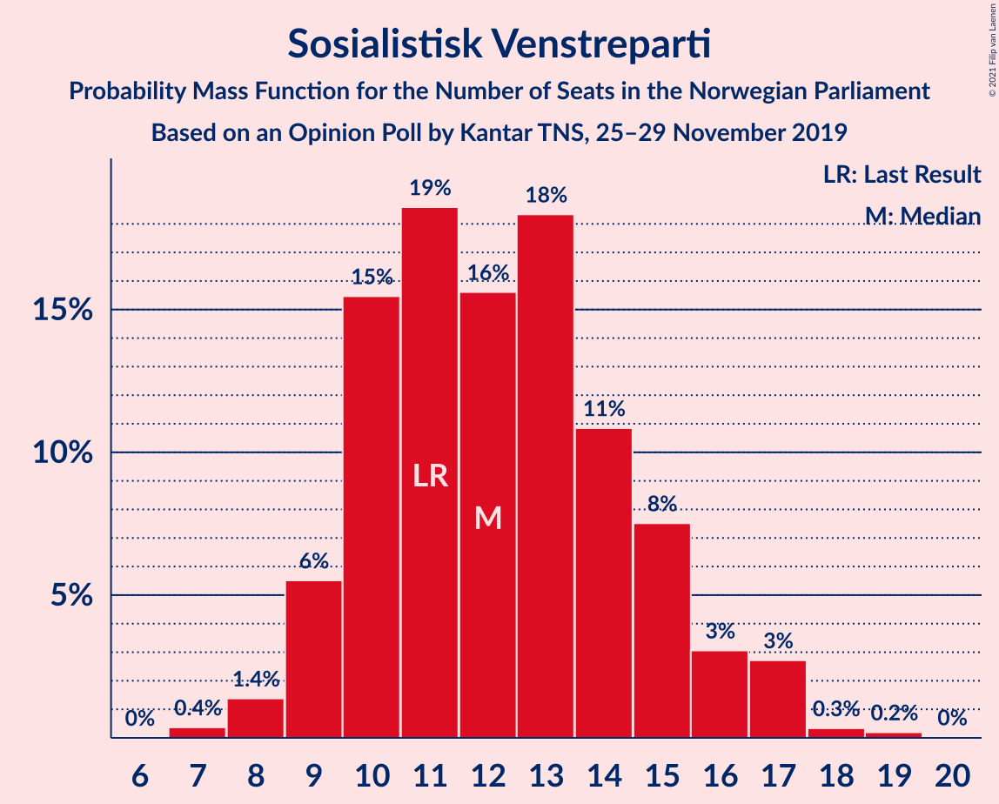

| Number of Seats | Probability | Accumulated | Special Marks |
|:---------------:|:-----------:|:-----------:|:-------------:|
| 7 | 0.4% | 100% |  |
| 8 | 1.4% | 99.6% |  |
| 9 | 6% | 98% |  |
| 10 | 15% | 93% |  |
| 11 | 19% | 77% | Last Result |
| 12 | 16% | 59% | Median |
| 13 | 18% | 43% |  |
| 14 | 11% | 25% |  |
| 15 | 8% | 14% |  |
| 16 | 3% | 6% |  |
| 17 | 3% | 3% |  |
| 18 | 0.3% | 0.6% |  |
| 19 | 0.2% | 0.2% |  |
| 20 | 0% | 0% |  |

### Miljøpartiet De Grønne

*For a full overview of the results for this party, see the [Miljøpartiet De Grønne](party-miljøpartietdegrønne.html) page.*

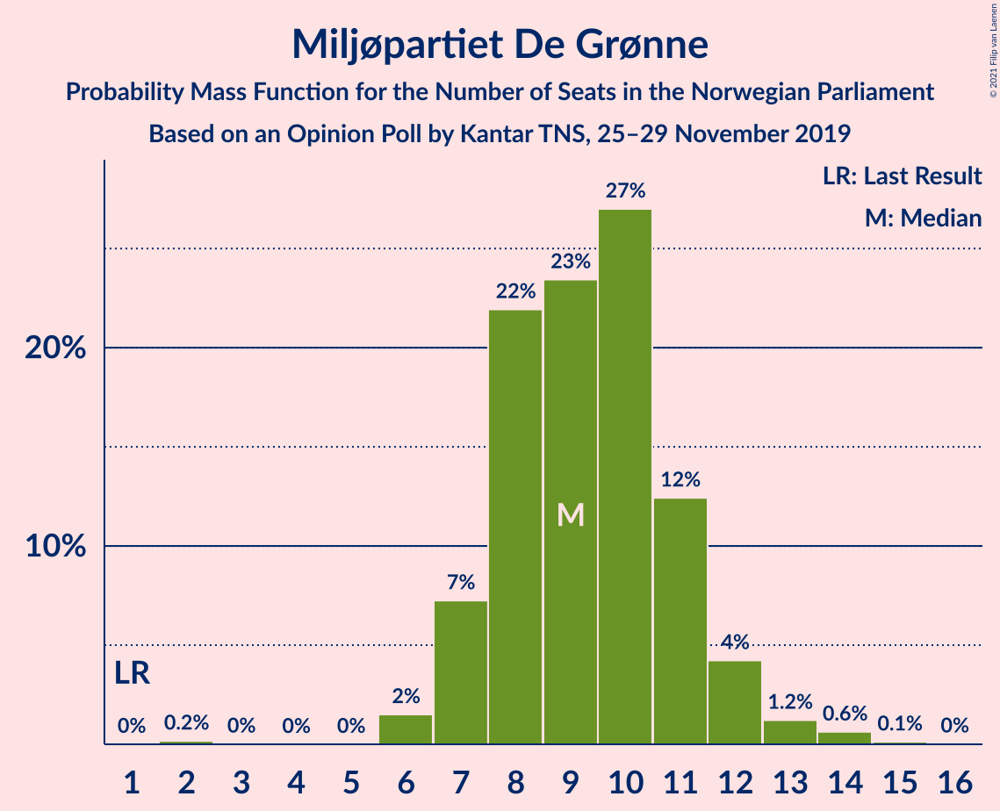

| Number of Seats | Probability | Accumulated | Special Marks |
|:---------------:|:-----------:|:-----------:|:-------------:|
| 1 | 0% | 100% | Last Result |
| 2 | 0.2% | 100% |  |
| 3 | 0% | 99.8% |  |
| 4 | 0% | 99.8% |  |
| 5 | 0% | 99.8% |  |
| 6 | 2% | 99.8% |  |
| 7 | 7% | 98% |  |
| 8 | 22% | 91% |  |
| 9 | 23% | 69% | Median |
| 10 | 27% | 46% |  |
| 11 | 12% | 19% |  |
| 12 | 4% | 6% |  |
| 13 | 1.2% | 2% |  |
| 14 | 0.6% | 0.8% |  |
| 15 | 0.1% | 0.2% |  |
| 16 | 0% | 0% |  |

### Rødt

*For a full overview of the results for this party, see the [Rødt](party-rødt.html) page.*

| Number of Seats | Probability | Accumulated | Special Marks |
|:---------------:|:-----------:|:-----------:|:-------------:|
| 1 | 0.1% | 100% | Last Result |
| 2 | 5% | 99.9% |  |
| 3 | 0% | 95% |  |
| 4 | 0% | 95% |  |
| 5 | 0.2% | 95% |  |
| 6 | 11% | 95% |  |
| 7 | 23% | 84% |  |
| 8 | 32% | 61% | Median |
| 9 | 18% | 29% |  |
| 10 | 8% | 11% |  |
| 11 | 2% | 3% |  |
| 12 | 0.8% | 1.0% |  |
| 13 | 0.1% | 0.2% |  |
| 14 | 0% | 0% |  |

### Venstre

*For a full overview of the results for this party, see the [Venstre](party-venstre.html) page.*

| Number of Seats | Probability | Accumulated | Special Marks |
|:---------------:|:-----------:|:-----------:|:-------------:|
| 1 | 0.1% | 100% |  |
| 2 | 34% | 99.9% |  |
| 3 | 1.1% | 65% |  |
| 4 | 0% | 64% |  |
| 5 | 4% | 64% |  |
| 6 | 17% | 61% | Median |
| 7 | 19% | 44% |  |
| 8 | 16% | 25% | Last Result |
| 9 | 6% | 9% |  |
| 10 | 3% | 3% |  |
| 11 | 0.2% | 0.3% |  |
| 12 | 0.1% | 0.1% |  |
| 13 | 0% | 0% |  |

### Kristelig Folkeparti

*For a full overview of the results for this party, see the [Kristelig Folkeparti](party-kristeligfolkeparti.html) page.*

| Number of Seats | Probability | Accumulated | Special Marks |
|:---------------:|:-----------:|:-----------:|:-------------:|
| 1 | 6% | 100% |  |
| 2 | 10% | 94% |  |
| 3 | 24% | 84% |  |
| 4 | 0% | 60% |  |
| 5 | 0.9% | 60% |  |
| 6 | 22% | 59% | Median |
| 7 | 23% | 37% |  |
| 8 | 9% | 15% | Last Result |
| 9 | 5% | 6% |  |
| 10 | 0.6% | 0.9% |  |
| 11 | 0.3% | 0.3% |  |
| 12 | 0% | 0% |  |

## Coalitions

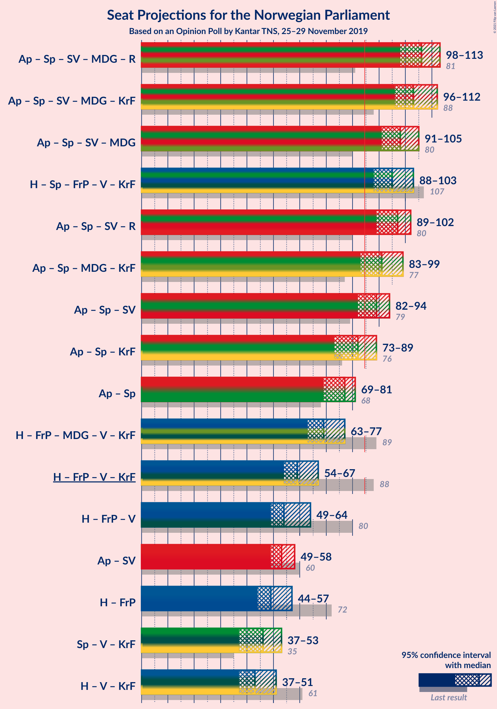

### Confidence Intervals

| Coalition | Last Result | Median | Majority? | 80% Confidence Interval | 90% Confidence Interval | 95% Confidence Interval | 99% Confidence Interval |
|:---------:|:-----------:|:------:|:---------:|:-----------------------:|:-----------------------:|:-----------------------:|:-----------------------:|
| Arbeiderpartiet – Senterpartiet – Sosialistisk Venstreparti – Miljøpartiet De Grønne – Rødt | 81 | 106 | 100% | 101–110 | 99–111 | 98–113 | 95–114 |
| Arbeiderpartiet – Senterpartiet – Sosialistisk Venstreparti – Miljøpartiet De Grønne – Kristelig Folkeparti | 88 | 103 | 100% | 98–108 | 97–110 | 96–112 | 91–113 |
| Arbeiderpartiet – Senterpartiet – Sosialistisk Venstreparti – Miljøpartiet De Grønne | 80 | 98 | 99.9% | 94–101 | 92–103 | 91–105 | 88–107 |
| Høyre – Senterpartiet – Fremskrittspartiet – Venstre – Kristelig Folkeparti | 107 | 95 | 99.8% | 90–100 | 88–102 | 88–103 | 86–105 |
| Arbeiderpartiet – Senterpartiet – Sosialistisk Venstreparti – Rødt | 80 | 97 | 99.6% | 92–101 | 90–101 | 89–102 | 85–105 |
| Arbeiderpartiet – Senterpartiet – Miljøpartiet De Grønne – Kristelig Folkeparti | 77 | 91 | 93% | 86–96 | 84–98 | 83–99 | 81–100 |
| Arbeiderpartiet – Senterpartiet – Sosialistisk Venstreparti | 79 | 89 | 90% | 85–92 | 83–93 | 82–94 | 79–96 |
| Arbeiderpartiet – Senterpartiet – Kristelig Folkeparti | 76 | 82 | 19% | 77–87 | 74–88 | 73–89 | 71–90 |
| Arbeiderpartiet – Senterpartiet | 68 | 77 | 0.1% | 72–80 | 70–81 | 69–81 | 67–83 |
| Høyre – Fremskrittspartiet – Miljøpartiet De Grønne – Venstre – Kristelig Folkeparti | 89 | 69 | 0.1% | 64–75 | 63–77 | 63–77 | 60–81 |
| Høyre – Fremskrittspartiet – Venstre – Kristelig Folkeparti | 88 | 59 | 0% | 55–65 | 54–66 | 54–67 | 50–71 |
| Høyre – Fremskrittspartiet – Venstre | 80 | 54 | 0% | 50–59 | 50–61 | 49–64 | 47–65 |
| Arbeiderpartiet – Sosialistisk Venstreparti | 60 | 53 | 0% | 51–57 | 50–57 | 49–58 | 46–60 |
| Høyre – Fremskrittspartiet | 72 | 49 | 0% | 46–53 | 44–55 | 44–57 | 42–59 |
| Senterpartiet – Venstre – Kristelig Folkeparti | 35 | 46 | 0% | 38–52 | 38–52 | 37–53 | 34–55 |
| Høyre – Venstre – Kristelig Folkeparti | 61 | 43 | 0% | 39–49 | 38–50 | 37–51 | 36–55 |

### Arbeiderpartiet – Senterpartiet – Sosialistisk Venstreparti – Miljøpartiet De Grønne – Rødt

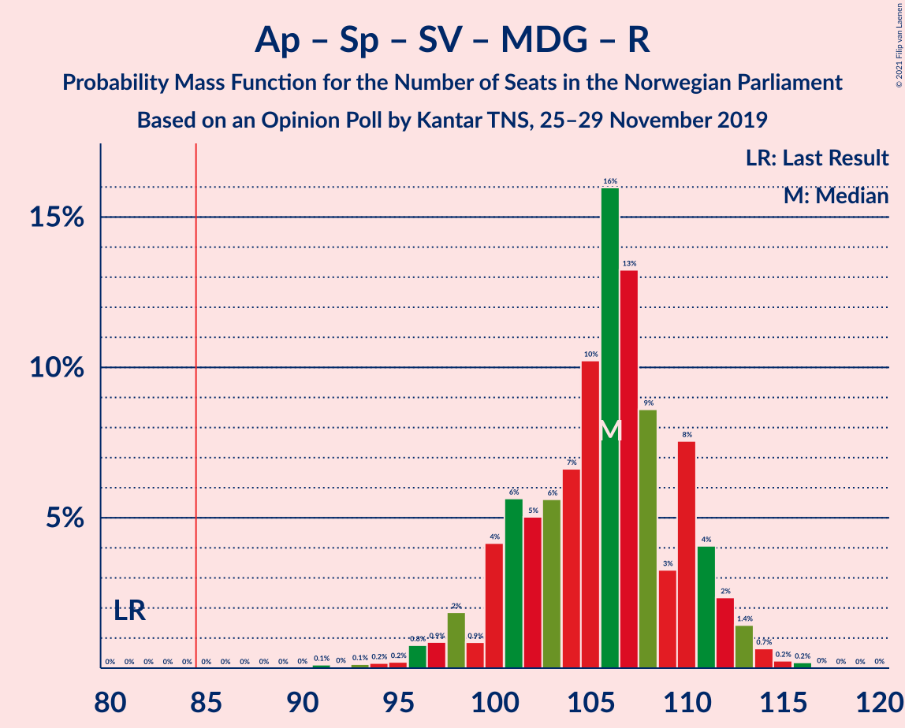

| Number of Seats | Probability | Accumulated | Special Marks |
|:---------------:|:-----------:|:-----------:|:-------------:|
| 81 | 0% | 100% | Last Result |
| 82 | 0% | 100% |  |
| 83 | 0% | 100% |  |
| 84 | 0% | 100% |  |
| 85 | 0% | 100% | Majority |
| 86 | 0% | 100% |  |
| 87 | 0% | 100% |  |
| 88 | 0% | 100% |  |
| 89 | 0% | 100% |  |
| 90 | 0% | 100% |  |
| 91 | 0.1% | 100% |  |
| 92 | 0% | 99.9% |  |
| 93 | 0.1% | 99.8% |  |
| 94 | 0.2% | 99.7% |  |
| 95 | 0.2% | 99.5% |  |
| 96 | 0.8% | 99.3% |  |
| 97 | 0.9% | 98.5% |  |
| 98 | 2% | 98% |  |
| 99 | 0.9% | 96% |  |
| 100 | 4% | 95% |  |
| 101 | 6% | 91% |  |
| 102 | 5% | 85% |  |
| 103 | 6% | 80% |  |
| 104 | 7% | 75% |  |
| 105 | 10% | 68% |  |
| 106 | 16% | 58% | Median |
| 107 | 13% | 42% |  |
| 108 | 9% | 28% |  |
| 109 | 3% | 20% |  |
| 110 | 8% | 17% |  |
| 111 | 4% | 9% |  |
| 112 | 2% | 5% |  |
| 113 | 1.4% | 3% |  |
| 114 | 0.7% | 1.1% |  |
| 115 | 0.2% | 0.5% |  |
| 116 | 0.2% | 0.3% |  |
| 117 | 0% | 0.1% |  |
| 118 | 0% | 0% |  |

### Arbeiderpartiet – Senterpartiet – Sosialistisk Venstreparti – Miljøpartiet De Grønne – Kristelig Folkeparti

| Number of Seats | Probability | Accumulated | Special Marks |
|:---------------:|:-----------:|:-----------:|:-------------:|
| 88 | 0% | 100% | Last Result |
| 89 | 0% | 100% |  |
| 90 | 0% | 99.9% |  |
| 91 | 0.5% | 99.9% |  |
| 92 | 0.2% | 99.5% |  |
| 93 | 0.3% | 99.3% |  |
| 94 | 0.3% | 99.0% |  |
| 95 | 1.1% | 98.7% |  |
| 96 | 1.2% | 98% |  |
| 97 | 4% | 96% |  |
| 98 | 4% | 93% |  |
| 99 | 3% | 88% |  |
| 100 | 5% | 85% |  |
| 101 | 18% | 80% |  |
| 102 | 6% | 63% |  |
| 103 | 10% | 57% |  |
| 104 | 10% | 47% | Median |
| 105 | 13% | 37% |  |
| 106 | 6% | 23% |  |
| 107 | 7% | 18% |  |
| 108 | 5% | 11% |  |
| 109 | 0.9% | 6% |  |
| 110 | 0.9% | 5% |  |
| 111 | 2% | 4% |  |
| 112 | 1.3% | 3% |  |
| 113 | 1.3% | 2% |  |
| 114 | 0.2% | 0.2% |  |
| 115 | 0% | 0.1% |  |
| 116 | 0% | 0% |  |

### Arbeiderpartiet – Senterpartiet – Sosialistisk Venstreparti – Miljøpartiet De Grønne

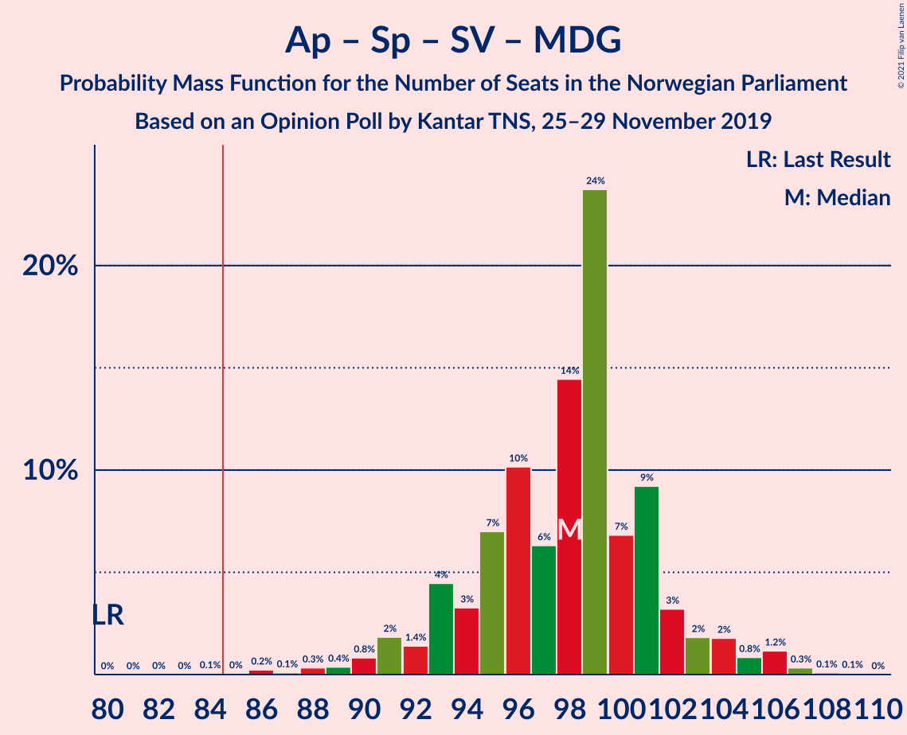

| Number of Seats | Probability | Accumulated | Special Marks |
|:---------------:|:-----------:|:-----------:|:-------------:|
| 80 | 0% | 100% | Last Result |
| 81 | 0% | 100% |  |
| 82 | 0% | 100% |  |
| 83 | 0% | 100% |  |
| 84 | 0.1% | 100% |  |
| 85 | 0% | 99.9% | Majority |
| 86 | 0.2% | 99.9% |  |
| 87 | 0.1% | 99.6% |  |
| 88 | 0.3% | 99.5% |  |
| 89 | 0.4% | 99.2% |  |
| 90 | 0.8% | 98.8% |  |
| 91 | 2% | 98% |  |
| 92 | 1.4% | 96% |  |
| 93 | 4% | 95% |  |
| 94 | 3% | 90% |  |
| 95 | 7% | 87% |  |
| 96 | 10% | 80% |  |
| 97 | 6% | 70% |  |
| 98 | 14% | 64% | Median |
| 99 | 24% | 49% |  |
| 100 | 7% | 25% |  |
| 101 | 9% | 19% |  |
| 102 | 3% | 9% |  |
| 103 | 2% | 6% |  |
| 104 | 2% | 4% |  |
| 105 | 0.8% | 3% |  |
| 106 | 1.2% | 2% |  |
| 107 | 0.3% | 0.5% |  |
| 108 | 0.1% | 0.2% |  |
| 109 | 0.1% | 0.1% |  |
| 110 | 0% | 0% |  |

### Høyre – Senterpartiet – Fremskrittspartiet – Venstre – Kristelig Folkeparti

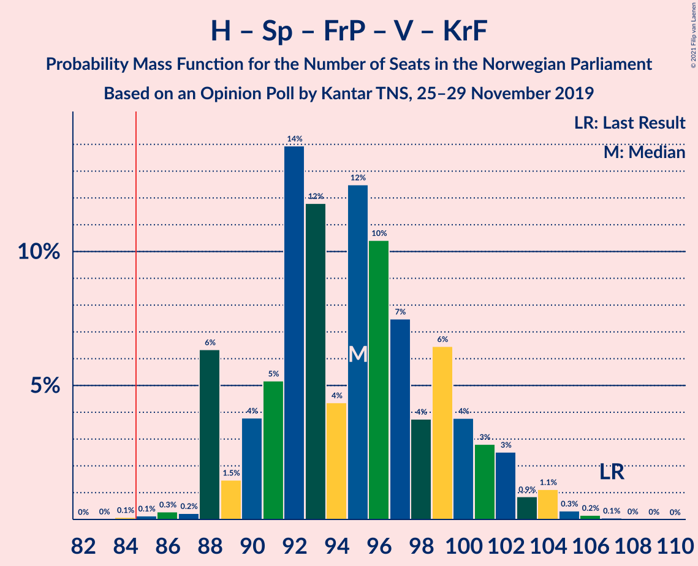

| Number of Seats | Probability | Accumulated | Special Marks |
|:---------------:|:-----------:|:-----------:|:-------------:|
| 83 | 0% | 100% |  |
| 84 | 0.1% | 99.9% |  |
| 85 | 0.1% | 99.8% | Majority |
| 86 | 0.3% | 99.7% |  |
| 87 | 0.2% | 99.4% |  |
| 88 | 6% | 99.2% |  |
| 89 | 1.5% | 93% |  |
| 90 | 4% | 91% |  |
| 91 | 5% | 88% |  |
| 92 | 14% | 82% |  |
| 93 | 12% | 68% |  |
| 94 | 4% | 57% |  |
| 95 | 12% | 52% |  |
| 96 | 10% | 40% | Median |
| 97 | 7% | 29% |  |
| 98 | 4% | 22% |  |
| 99 | 6% | 18% |  |
| 100 | 4% | 12% |  |
| 101 | 3% | 8% |  |
| 102 | 3% | 5% |  |
| 103 | 0.9% | 3% |  |
| 104 | 1.1% | 2% |  |
| 105 | 0.3% | 0.6% |  |
| 106 | 0.2% | 0.3% |  |
| 107 | 0.1% | 0.1% | Last Result |
| 108 | 0% | 0.1% |  |
| 109 | 0% | 0% |  |

### Arbeiderpartiet – Senterpartiet – Sosialistisk Venstreparti – Rødt

| Number of Seats | Probability | Accumulated | Special Marks |
|:---------------:|:-----------:|:-----------:|:-------------:|
| 80 | 0% | 100% | Last Result |
| 81 | 0% | 100% |  |
| 82 | 0% | 100% |  |
| 83 | 0.1% | 100% |  |
| 84 | 0.2% | 99.8% |  |
| 85 | 0.1% | 99.6% | Majority |
| 86 | 0.5% | 99.5% |  |
| 87 | 0.4% | 99.0% |  |
| 88 | 0.7% | 98.6% |  |
| 89 | 2% | 98% |  |
| 90 | 2% | 96% |  |
| 91 | 2% | 95% |  |
| 92 | 7% | 93% |  |
| 93 | 6% | 85% |  |
| 94 | 7% | 79% |  |
| 95 | 7% | 71% |  |
| 96 | 8% | 64% |  |
| 97 | 16% | 57% | Median |
| 98 | 14% | 41% |  |
| 99 | 10% | 26% |  |
| 100 | 6% | 16% |  |
| 101 | 6% | 10% |  |
| 102 | 3% | 4% |  |
| 103 | 0.4% | 1.4% |  |
| 104 | 0.4% | 1.0% |  |
| 105 | 0.5% | 0.6% |  |
| 106 | 0% | 0.1% |  |
| 107 | 0% | 0% |  |

### Arbeiderpartiet – Senterpartiet – Miljøpartiet De Grønne – Kristelig Folkeparti

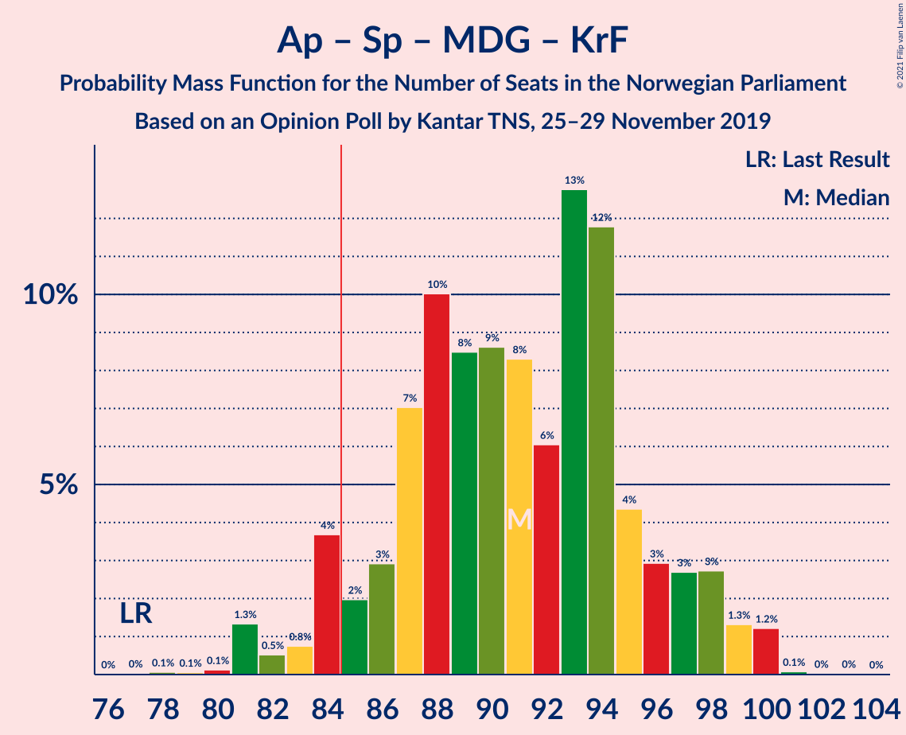

| Number of Seats | Probability | Accumulated | Special Marks |
|:---------------:|:-----------:|:-----------:|:-------------:|
| 77 | 0% | 100% | Last Result |
| 78 | 0.1% | 99.9% |  |
| 79 | 0.1% | 99.9% |  |
| 80 | 0.1% | 99.8% |  |
| 81 | 1.3% | 99.7% |  |
| 82 | 0.5% | 98% |  |
| 83 | 0.8% | 98% |  |
| 84 | 4% | 97% |  |
| 85 | 2% | 93% | Majority |
| 86 | 3% | 91% |  |
| 87 | 7% | 88% |  |
| 88 | 10% | 81% |  |
| 89 | 8% | 71% |  |
| 90 | 9% | 63% |  |
| 91 | 8% | 54% |  |
| 92 | 6% | 46% | Median |
| 93 | 13% | 40% |  |
| 94 | 12% | 27% |  |
| 95 | 4% | 15% |  |
| 96 | 3% | 11% |  |
| 97 | 3% | 8% |  |
| 98 | 3% | 5% |  |
| 99 | 1.3% | 3% |  |
| 100 | 1.2% | 1.4% |  |
| 101 | 0.1% | 0.2% |  |
| 102 | 0% | 0.1% |  |
| 103 | 0% | 0% |  |

### Arbeiderpartiet – Senterpartiet – Sosialistisk Venstreparti

| Number of Seats | Probability | Accumulated | Special Marks |
|:---------------:|:-----------:|:-----------:|:-------------:|
| 76 | 0.1% | 100% |  |
| 77 | 0.1% | 99.9% |  |
| 78 | 0.2% | 99.7% |  |
| 79 | 0.2% | 99.5% | Last Result |
| 80 | 0.4% | 99.4% |  |
| 81 | 1.3% | 99.0% |  |
| 82 | 2% | 98% |  |
| 83 | 1.2% | 96% |  |
| 84 | 4% | 95% |  |
| 85 | 5% | 90% | Majority |
| 86 | 7% | 85% |  |
| 87 | 8% | 78% |  |
| 88 | 9% | 71% |  |
| 89 | 15% | 62% | Median |
| 90 | 30% | 47% |  |
| 91 | 4% | 17% |  |
| 92 | 7% | 13% |  |
| 93 | 2% | 6% |  |
| 94 | 2% | 4% |  |
| 95 | 0.4% | 2% |  |
| 96 | 1.2% | 2% |  |
| 97 | 0% | 0.3% |  |
| 98 | 0.2% | 0.3% |  |
| 99 | 0% | 0.1% |  |
| 100 | 0% | 0% |  |

### Arbeiderpartiet – Senterpartiet – Kristelig Folkeparti

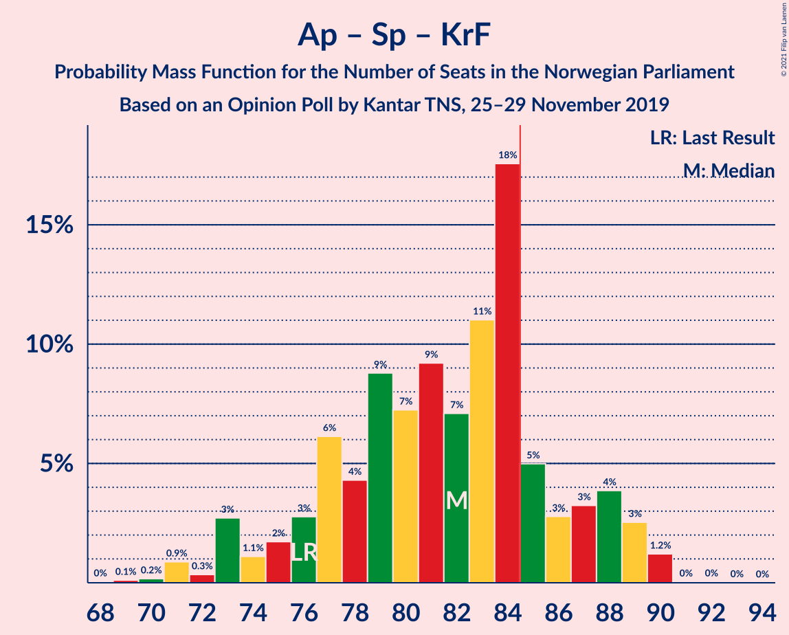

| Number of Seats | Probability | Accumulated | Special Marks |
|:---------------:|:-----------:|:-----------:|:-------------:|
| 68 | 0% | 100% |  |
| 69 | 0.1% | 99.9% |  |
| 70 | 0.2% | 99.8% |  |
| 71 | 0.9% | 99.6% |  |
| 72 | 0.3% | 98.8% |  |
| 73 | 3% | 98% |  |
| 74 | 1.1% | 96% |  |
| 75 | 2% | 95% |  |
| 76 | 3% | 93% | Last Result |
| 77 | 6% | 90% |  |
| 78 | 4% | 84% |  |
| 79 | 9% | 80% |  |
| 80 | 7% | 71% |  |
| 81 | 9% | 64% |  |
| 82 | 7% | 54% |  |
| 83 | 11% | 47% | Median |
| 84 | 18% | 36% |  |
| 85 | 5% | 19% | Majority |
| 86 | 3% | 14% |  |
| 87 | 3% | 11% |  |
| 88 | 4% | 8% |  |
| 89 | 3% | 4% |  |
| 90 | 1.2% | 1.3% |  |
| 91 | 0% | 0.1% |  |
| 92 | 0% | 0.1% |  |
| 93 | 0% | 0% |  |

### Arbeiderpartiet – Senterpartiet

| Number of Seats | Probability | Accumulated | Special Marks |
|:---------------:|:-----------:|:-----------:|:-------------:|
| 63 | 0.1% | 100% |  |
| 64 | 0.1% | 99.9% |  |
| 65 | 0.1% | 99.9% |  |
| 66 | 0.3% | 99.8% |  |
| 67 | 0.4% | 99.5% |  |
| 68 | 1.2% | 99.1% | Last Result |
| 69 | 1.1% | 98% |  |
| 70 | 2% | 97% |  |
| 71 | 3% | 95% |  |
| 72 | 3% | 91% |  |
| 73 | 3% | 88% |  |
| 74 | 7% | 85% |  |
| 75 | 12% | 78% |  |
| 76 | 10% | 66% |  |
| 77 | 14% | 56% | Median |
| 78 | 20% | 43% |  |
| 79 | 7% | 23% |  |
| 80 | 8% | 15% |  |
| 81 | 5% | 7% |  |
| 82 | 0.7% | 2% |  |
| 83 | 1.2% | 1.4% |  |
| 84 | 0.1% | 0.2% |  |
| 85 | 0.1% | 0.1% | Majority |
| 86 | 0% | 0% |  |

### Høyre – Fremskrittspartiet – Miljøpartiet De Grønne – Venstre – Kristelig Folkeparti

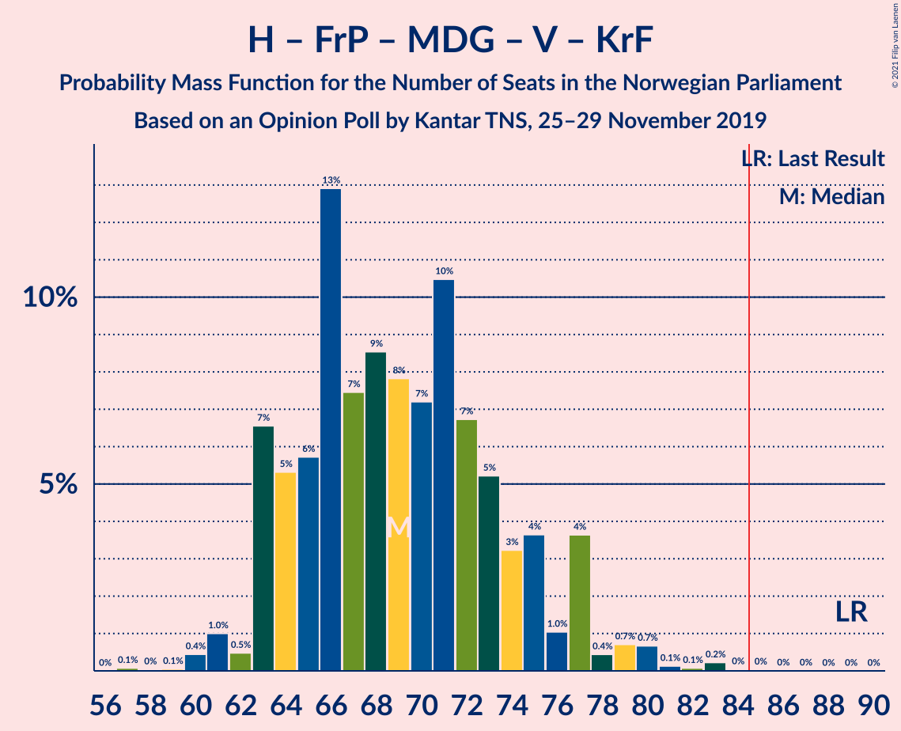

| Number of Seats | Probability | Accumulated | Special Marks |
|:---------------:|:-----------:|:-----------:|:-------------:|
| 57 | 0.1% | 100% |  |
| 58 | 0% | 99.9% |  |
| 59 | 0.1% | 99.9% |  |
| 60 | 0.4% | 99.8% |  |
| 61 | 1.0% | 99.4% |  |
| 62 | 0.5% | 98% |  |
| 63 | 7% | 98% |  |
| 64 | 5% | 91% |  |
| 65 | 6% | 86% |  |
| 66 | 13% | 80% |  |
| 67 | 7% | 67% |  |
| 68 | 9% | 60% |  |
| 69 | 8% | 51% |  |
| 70 | 7% | 44% | Median |
| 71 | 10% | 36% |  |
| 72 | 7% | 26% |  |
| 73 | 5% | 19% |  |
| 74 | 3% | 14% |  |
| 75 | 4% | 11% |  |
| 76 | 1.0% | 7% |  |
| 77 | 4% | 6% |  |
| 78 | 0.4% | 2% |  |
| 79 | 0.7% | 2% |  |
| 80 | 0.7% | 1.2% |  |
| 81 | 0.1% | 0.5% |  |
| 82 | 0.1% | 0.4% |  |
| 83 | 0.2% | 0.3% |  |
| 84 | 0% | 0.1% |  |
| 85 | 0% | 0.1% | Majority |
| 86 | 0% | 0% |  |
| 87 | 0% | 0% |  |
| 88 | 0% | 0% |  |
| 89 | 0% | 0% | Last Result |

### Høyre – Fremskrittspartiet – Venstre – Kristelig Folkeparti

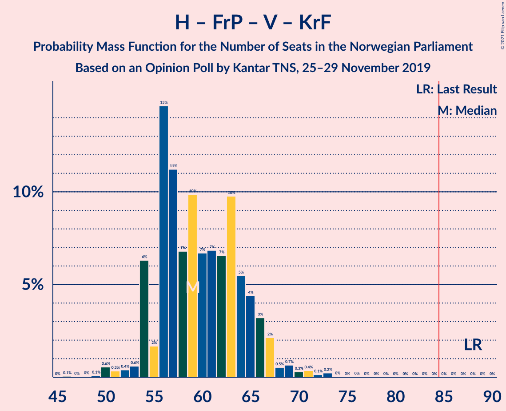

| Number of Seats | Probability | Accumulated | Special Marks |
|:---------------:|:-----------:|:-----------:|:-------------:|
| 46 | 0.1% | 100% |  |
| 47 | 0% | 99.9% |  |
| 48 | 0% | 99.9% |  |
| 49 | 0.1% | 99.9% |  |
| 50 | 0.6% | 99.8% |  |
| 51 | 0.3% | 99.2% |  |
| 52 | 0.4% | 98.9% |  |
| 53 | 0.6% | 98.5% |  |
| 54 | 6% | 98% |  |
| 55 | 2% | 92% |  |
| 56 | 15% | 90% |  |
| 57 | 11% | 75% |  |
| 58 | 7% | 64% |  |
| 59 | 10% | 57% |  |
| 60 | 7% | 47% |  |
| 61 | 7% | 41% | Median |
| 62 | 7% | 34% |  |
| 63 | 10% | 27% |  |
| 64 | 5% | 18% |  |
| 65 | 4% | 12% |  |
| 66 | 3% | 8% |  |
| 67 | 2% | 4% |  |
| 68 | 0.5% | 2% |  |
| 69 | 0.7% | 2% |  |
| 70 | 0.3% | 1.1% |  |
| 71 | 0.4% | 0.8% |  |
| 72 | 0.1% | 0.5% |  |
| 73 | 0.2% | 0.3% |  |
| 74 | 0% | 0.1% |  |
| 75 | 0% | 0% |  |
| 76 | 0% | 0% |  |
| 77 | 0% | 0% |  |
| 78 | 0% | 0% |  |
| 79 | 0% | 0% |  |
| 80 | 0% | 0% |  |
| 81 | 0% | 0% |  |
| 82 | 0% | 0% |  |
| 83 | 0% | 0% |  |
| 84 | 0% | 0% |  |
| 85 | 0% | 0% | Majority |
| 86 | 0% | 0% |  |
| 87 | 0% | 0% |  |
| 88 | 0% | 0% | Last Result |

### Høyre – Fremskrittspartiet – Venstre

| Number of Seats | Probability | Accumulated | Special Marks |
|:---------------:|:-----------:|:-----------:|:-------------:|
| 44 | 0% | 100% |  |
| 45 | 0.2% | 99.9% |  |
| 46 | 0.3% | 99.8% |  |
| 47 | 0.8% | 99.5% |  |
| 48 | 0.8% | 98.7% |  |
| 49 | 3% | 98% |  |
| 50 | 10% | 95% |  |
| 51 | 7% | 85% |  |
| 52 | 12% | 78% |  |
| 53 | 12% | 66% |  |
| 54 | 9% | 54% |  |
| 55 | 6% | 46% | Median |
| 56 | 11% | 39% |  |
| 57 | 7% | 29% |  |
| 58 | 8% | 22% |  |
| 59 | 4% | 14% |  |
| 60 | 3% | 9% |  |
| 61 | 2% | 7% |  |
| 62 | 0.9% | 5% |  |
| 63 | 0.9% | 4% |  |
| 64 | 2% | 3% |  |
| 65 | 0.3% | 0.7% |  |
| 66 | 0.1% | 0.4% |  |
| 67 | 0.2% | 0.3% |  |
| 68 | 0% | 0.1% |  |
| 69 | 0% | 0% |  |
| 70 | 0% | 0% |  |
| 71 | 0% | 0% |  |
| 72 | 0% | 0% |  |
| 73 | 0% | 0% |  |
| 74 | 0% | 0% |  |
| 75 | 0% | 0% |  |
| 76 | 0% | 0% |  |
| 77 | 0% | 0% |  |
| 78 | 0% | 0% |  |
| 79 | 0% | 0% |  |
| 80 | 0% | 0% | Last Result |

### Arbeiderpartiet – Sosialistisk Venstreparti

| Number of Seats | Probability | Accumulated | Special Marks |
|:---------------:|:-----------:|:-----------:|:-------------:|
| 42 | 0% | 100% |  |
| 43 | 0% | 99.9% |  |
| 44 | 0.1% | 99.9% |  |
| 45 | 0.3% | 99.8% |  |
| 46 | 0.4% | 99.5% |  |
| 47 | 0.6% | 99.1% |  |
| 48 | 0.9% | 98.6% |  |
| 49 | 2% | 98% |  |
| 50 | 5% | 96% |  |
| 51 | 9% | 91% |  |
| 52 | 11% | 82% |  |
| 53 | 26% | 71% |  |
| 54 | 6% | 45% | Median |
| 55 | 12% | 39% |  |
| 56 | 17% | 27% |  |
| 57 | 6% | 10% |  |
| 58 | 3% | 5% |  |
| 59 | 0.7% | 1.5% |  |
| 60 | 0.4% | 0.7% | Last Result |
| 61 | 0.2% | 0.4% |  |
| 62 | 0% | 0.2% |  |
| 63 | 0.1% | 0.1% |  |
| 64 | 0% | 0.1% |  |
| 65 | 0% | 0% |  |

### Høyre – Fremskrittspartiet

| Number of Seats | Probability | Accumulated | Special Marks |
|:---------------:|:-----------:|:-----------:|:-------------:|
| 40 | 0% | 100% |  |
| 41 | 0.2% | 99.9% |  |
| 42 | 0.6% | 99.8% |  |
| 43 | 2% | 99.2% |  |
| 44 | 3% | 98% |  |
| 45 | 3% | 94% |  |
| 46 | 4% | 91% |  |
| 47 | 16% | 87% |  |
| 48 | 18% | 71% |  |
| 49 | 10% | 52% | Median |
| 50 | 13% | 42% |  |
| 51 | 14% | 29% |  |
| 52 | 3% | 15% |  |
| 53 | 3% | 12% |  |
| 54 | 1.2% | 9% |  |
| 55 | 4% | 8% |  |
| 56 | 1.1% | 4% |  |
| 57 | 2% | 3% |  |
| 58 | 0.3% | 1.1% |  |
| 59 | 0.4% | 0.7% |  |
| 60 | 0.1% | 0.4% |  |
| 61 | 0.2% | 0.3% |  |
| 62 | 0.1% | 0.1% |  |
| 63 | 0% | 0% |  |
| 64 | 0% | 0% |  |
| 65 | 0% | 0% |  |
| 66 | 0% | 0% |  |
| 67 | 0% | 0% |  |
| 68 | 0% | 0% |  |
| 69 | 0% | 0% |  |
| 70 | 0% | 0% |  |
| 71 | 0% | 0% |  |
| 72 | 0% | 0% | Last Result |

### Senterpartiet – Venstre – Kristelig Folkeparti

| Number of Seats | Probability | Accumulated | Special Marks |
|:---------------:|:-----------:|:-----------:|:-------------:|
| 31 | 0.1% | 100% |  |
| 32 | 0.1% | 99.9% |  |
| 33 | 0.1% | 99.9% |  |
| 34 | 0.4% | 99.8% |  |
| 35 | 0.1% | 99.5% | Last Result |
| 36 | 0.2% | 99.4% |  |
| 37 | 3% | 99.2% |  |
| 38 | 7% | 97% |  |
| 39 | 3% | 90% |  |
| 40 | 0.7% | 87% |  |
| 41 | 2% | 86% |  |
| 42 | 8% | 84% |  |
| 43 | 5% | 76% |  |
| 44 | 14% | 71% |  |
| 45 | 5% | 57% |  |
| 46 | 12% | 53% |  |
| 47 | 4% | 41% | Median |
| 48 | 12% | 37% |  |
| 49 | 5% | 24% |  |
| 50 | 6% | 20% |  |
| 51 | 2% | 13% |  |
| 52 | 7% | 12% |  |
| 53 | 4% | 5% |  |
| 54 | 0.5% | 1.2% |  |
| 55 | 0.4% | 0.7% |  |
| 56 | 0.2% | 0.2% |  |
| 57 | 0.1% | 0.1% |  |
| 58 | 0% | 0% |  |

### Høyre – Venstre – Kristelig Folkeparti

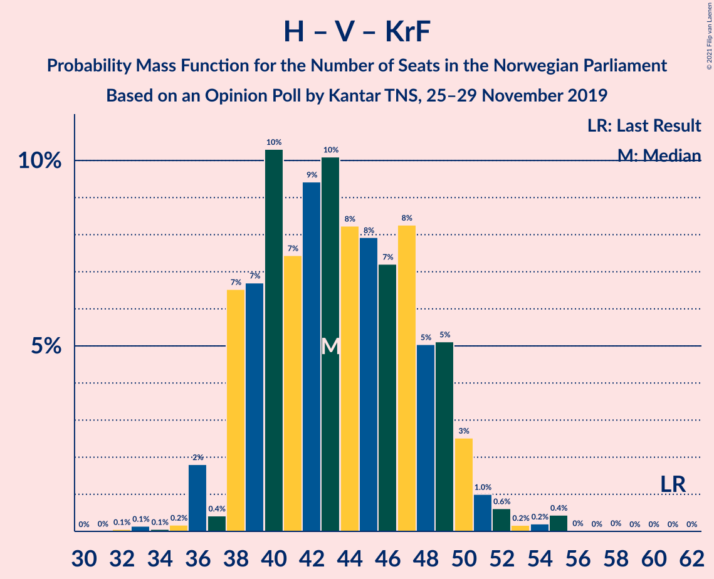

| Number of Seats | Probability | Accumulated | Special Marks |
|:---------------:|:-----------:|:-----------:|:-------------:|
| 32 | 0.1% | 100% |  |
| 33 | 0.1% | 99.9% |  |
| 34 | 0.1% | 99.8% |  |
| 35 | 0.2% | 99.7% |  |
| 36 | 2% | 99.6% |  |
| 37 | 0.4% | 98% |  |
| 38 | 7% | 97% |  |
| 39 | 7% | 91% |  |
| 40 | 10% | 84% |  |
| 41 | 7% | 74% |  |
| 42 | 9% | 66% |  |
| 43 | 10% | 57% |  |
| 44 | 8% | 47% |  |
| 45 | 8% | 39% | Median |
| 46 | 7% | 31% |  |
| 47 | 8% | 23% |  |
| 48 | 5% | 15% |  |
| 49 | 5% | 10% |  |
| 50 | 3% | 5% |  |
| 51 | 1.0% | 3% |  |
| 52 | 0.6% | 2% |  |
| 53 | 0.2% | 0.9% |  |
| 54 | 0.2% | 0.7% |  |
| 55 | 0.4% | 0.5% |  |
| 56 | 0% | 0.1% |  |
| 57 | 0% | 0% |  |
| 58 | 0% | 0% |  |
| 59 | 0% | 0% |  |
| 60 | 0% | 0% |  |
| 61 | 0% | 0% | Last Result |

## Technical Information

### Opinion Poll

+ **Polling firm:** Kantar TNS
+ **Commissioner(s):** —
+ **Fieldwork period:** 25–29 November 2019

### Calculations

+ **Sample size:** 794
+ **Simulations done:** 524,288
+ **Error estimate:** 1.77%

