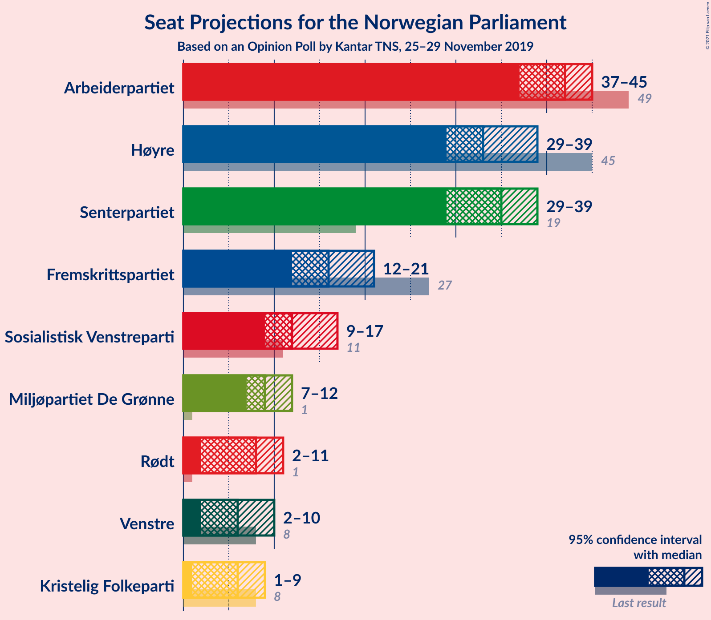
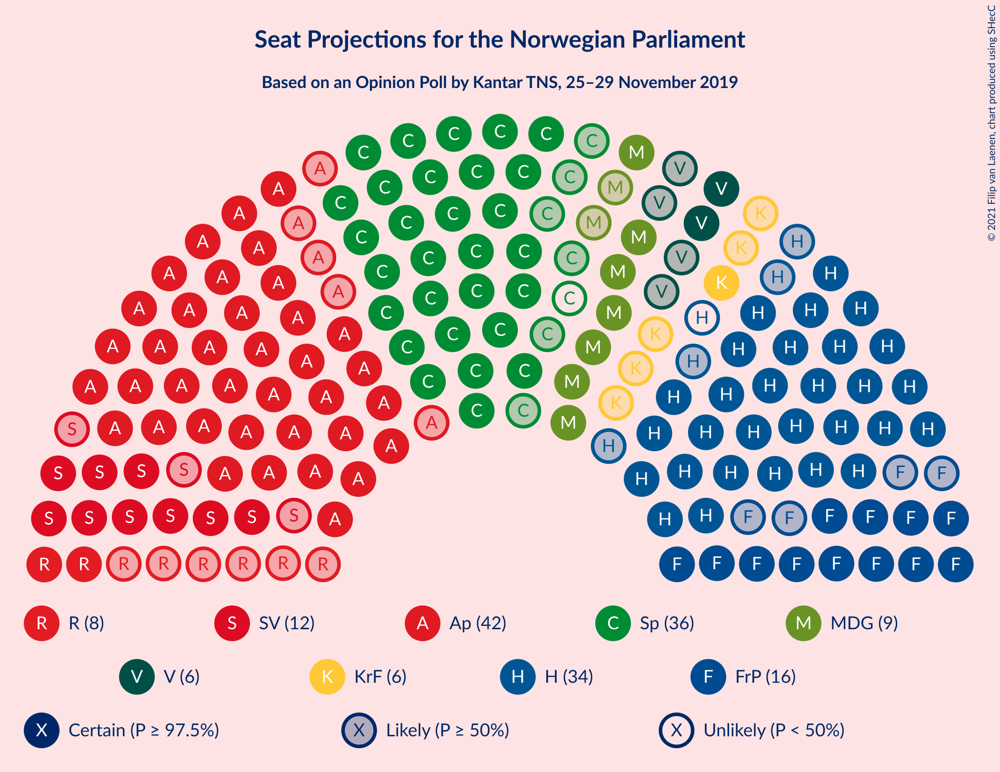
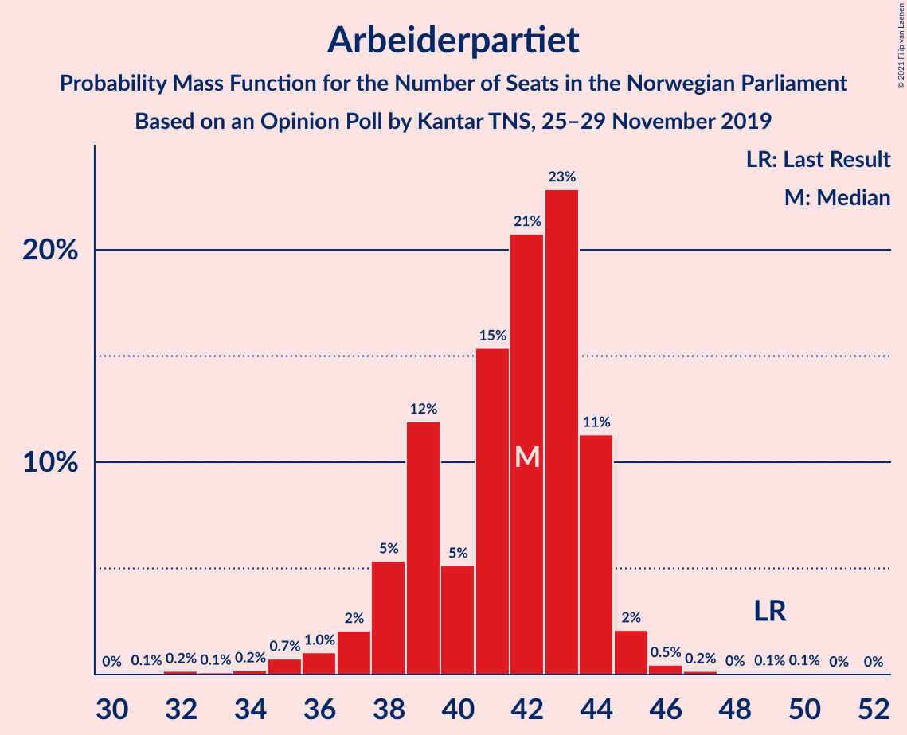
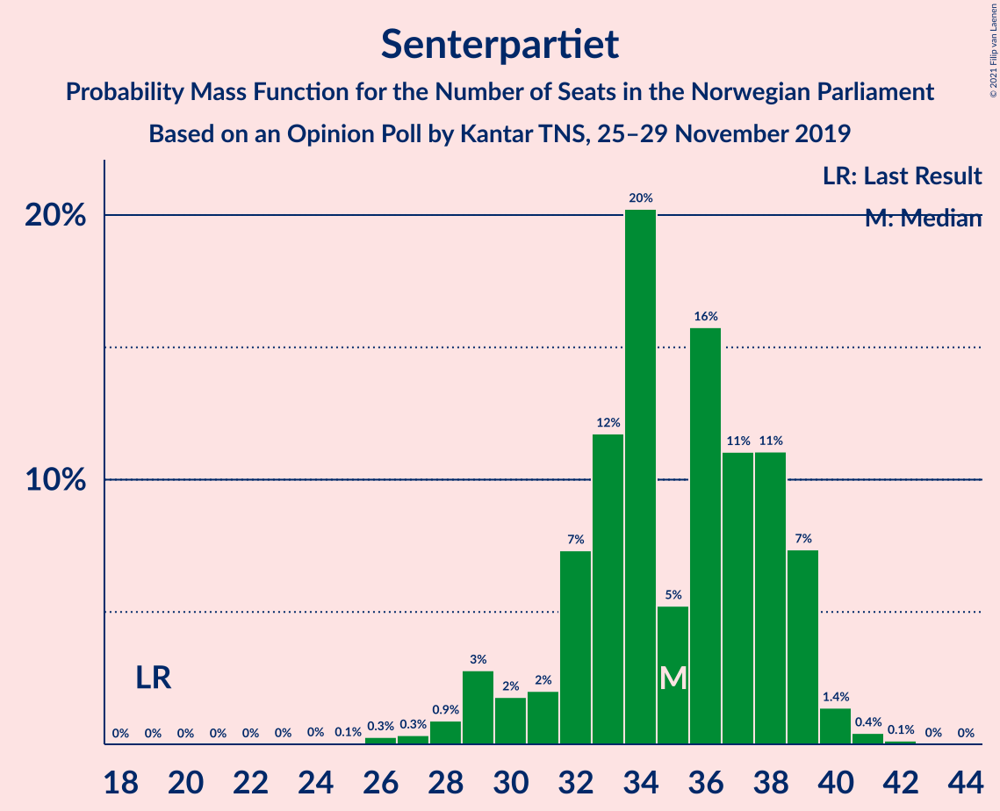
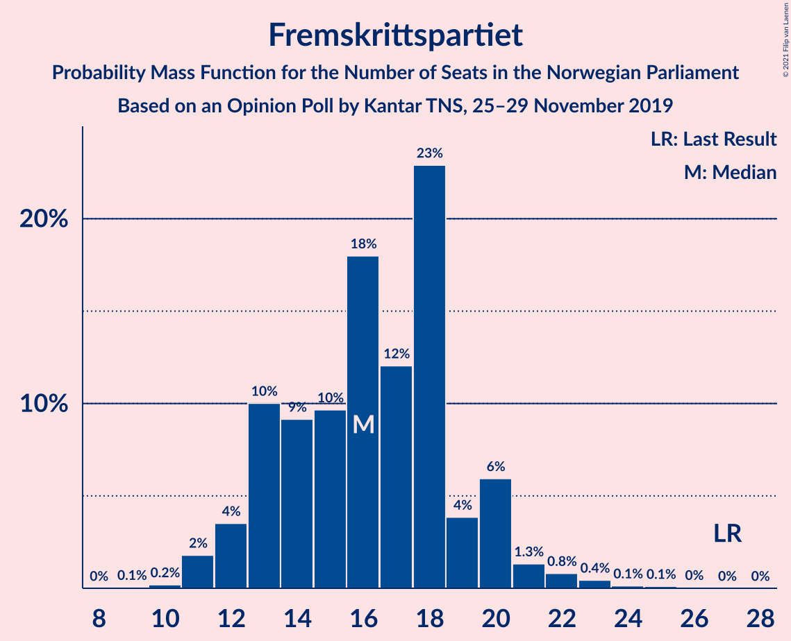
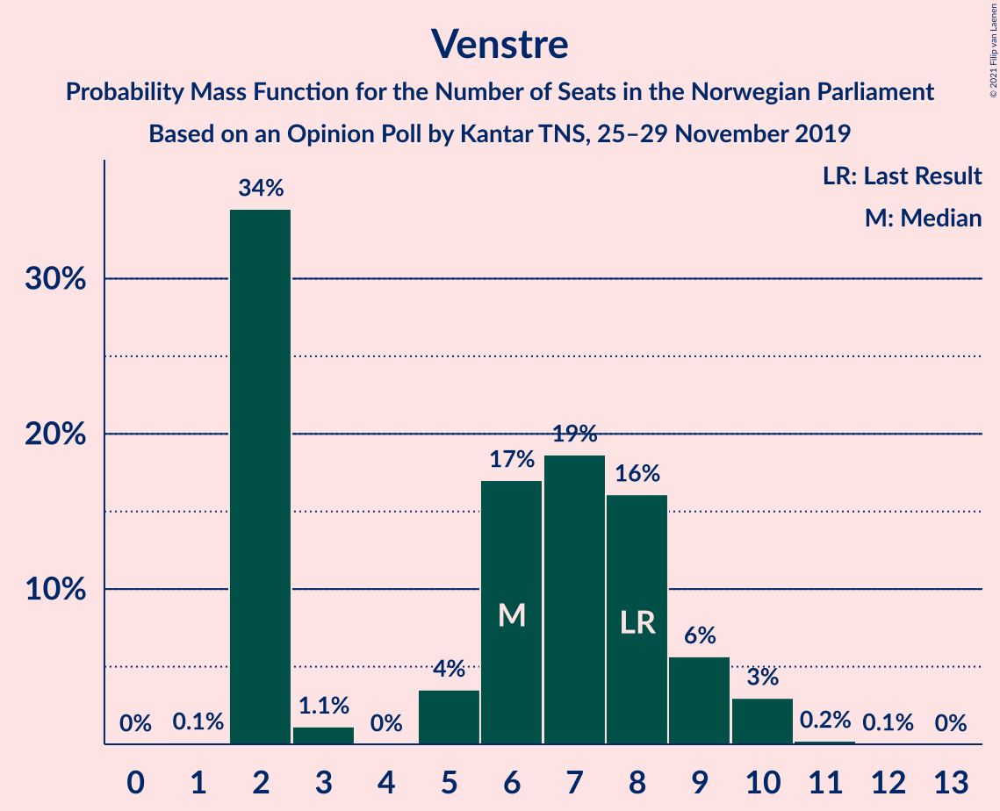
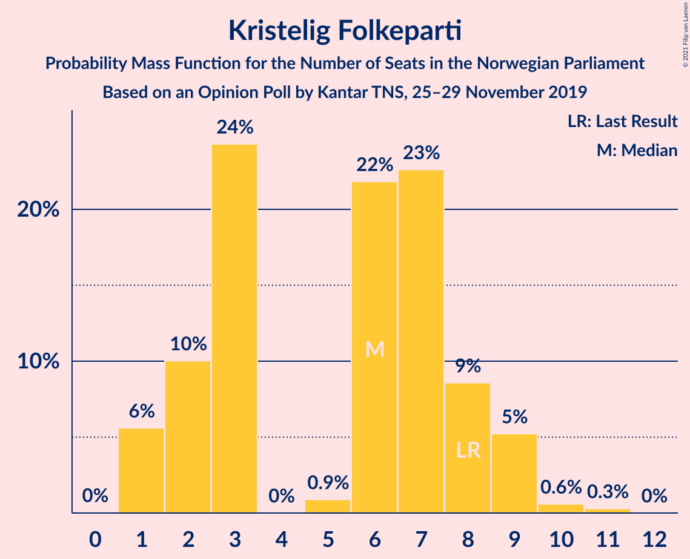
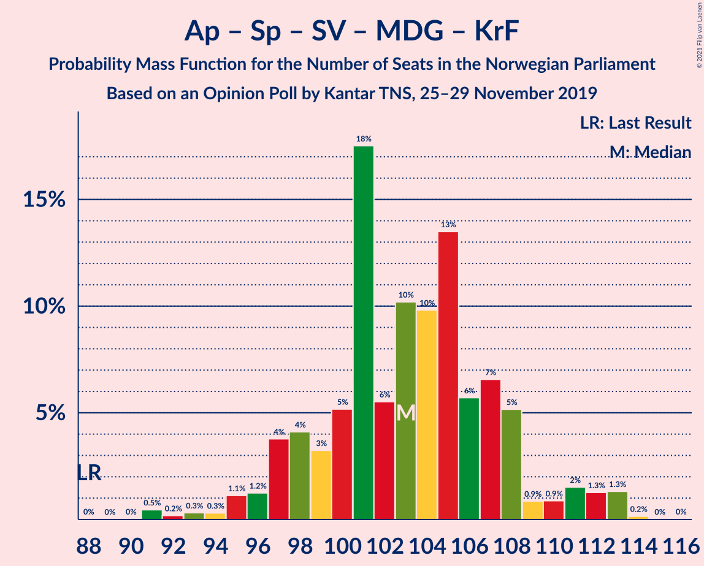
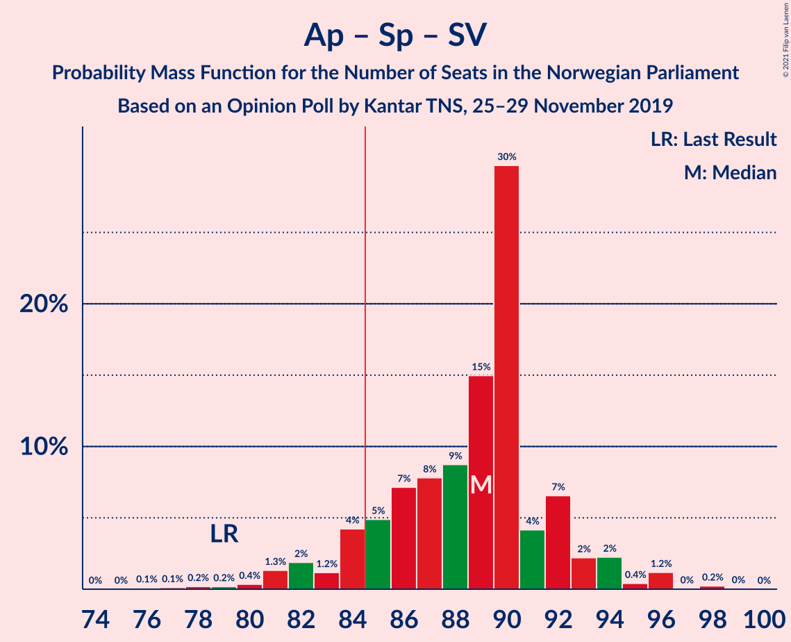
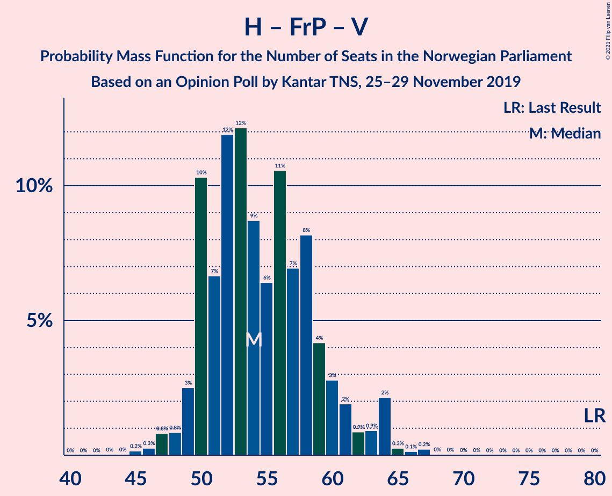

# Opinion Poll by Kantar TNS, 25–29 November 2019

<a href="#voting-intentions">Voting Intentions</a> | <a href="#seats">Seats</a> | <a href="#coalitions">Coalitions</a> | <a href="#technical-information">Technical Information</a>

## Voting Intentions

### Confidence Intervals

| Party | Last Result | Poll Result | 80% Confidence Interval | 90% Confidence Interval | 95% Confidence Interval | 99% Confidence Interval |
|:-----:|:-----------:|:-----------:|:-----------------------:|:-----------------------:|:-----------------------:|:-----------------------:|
| Arbeiderpartiet | 27.4% | 21.9% | 20.1–23.9% |19.6–24.4% |19.2–24.9% |18.3–25.9% |
| Høyre | 25.0% | 19.1% | 17.4–21.0% |17.0–21.6% |16.6–22.0% |15.8–23.0% |
| Senterpartiet | 10.3% | 17.6% | 16.0–19.5% |15.5–20.0% |15.1–20.5% |14.4–21.4% |
| Fremskrittspartiet | 15.2% | 9.8% | 8.6–11.3% |8.2–11.7% |7.9–12.1% |7.4–12.8% |
| Sosialistisk Venstreparti | 6.0% | 7.9% | 6.8–9.3% |6.5–9.7% |6.2–10.0% |5.7–10.7% |
| Miljøpartiet De Grønne | 3.2% | 6.0% | 5.1–7.3% |4.8–7.6% |4.6–7.9% |4.2–8.6% |
| Rødt | 2.4% | 5.0% | 4.2–6.2% |3.9–6.5% |3.7–6.8% |3.3–7.4% |
| Venstre | 4.4% | 4.4% | 3.6–5.5% |3.4–5.8% |3.2–6.1% |2.8–6.6% |
| Kristelig Folkeparti | 4.2% | 4.2% | 3.4–5.2% |3.2–5.5% |3.0–5.8% |2.6–6.3% |

*Note:* The poll result column reflects the actual value used in the calculations. Published results may vary slightly, and in addition be rounded to fewer digits.

## Seats

### Confidence Intervals

| Party | Last Result | Median | 80% Confidence Interval | 90% Confidence Interval | 95% Confidence Interval | 99% Confidence Interval |
|:-----:|:-----------:|:------:|:-----------------------:|:-----------------------:|:-----------------------:|:-----------------------:|
| <a href="#arbeiderpartiet">Arbeiderpartiet</a> | 49 | 43 | 40–44 |37–44 |35–44 |34–45 |
| <a href="#høyre">Høyre</a> | 45 | 33 | 30–35 |29–37 |29–38 |28–41 |
| <a href="#senterpartiet">Senterpartiet</a> | 19 | 34 | 33–39 |32–39 |30–40 |28–40 |
| <a href="#fremskrittspartiet">Fremskrittspartiet</a> | 27 | 16 | 14–18 |13–18 |12–20 |11–22 |
| <a href="#sosialistisk-venstreparti">Sosialistisk Venstreparti</a> | 11 | 13 | 9–15 |9–15 |9–16 |8–18 |
| <a href="#miljøpartiet-de-grønne">Miljøpartiet De Grønne</a> | 1 | 9 | 8–11 |7–12 |7–12 |6–14 |
| <a href="#rødt">Rødt</a> | 1 | 8 | 6–9 |6–10 |2–10 |2–11 |
| <a href="#venstre">Venstre</a> | 8 | 6 | 2–8 |2–10 |2–10 |2–10 |
| <a href="#kristelig-folkeparti">Kristelig Folkeparti</a> | 8 | 3 | 2–8 |2–9 |1–9 |1–10 |

### Arbeiderpartiet

*For a full overview of the results for this party, see the [Arbeiderpartiet](party-arbeiderpartiet.html) page.*

| Number of Seats | Probability | Accumulated | Special Marks |
|:---------------:|:-----------:|:-----------:|:-------------:|
| 31 | 0.1% | 100% |  |
| 32 | 0.2% | 99.8% |  |
| 33 | 0% | 99.6% |  |
| 34 | 0.3% | 99.6% |  |
| 35 | 2% | 99.3% |  |
| 36 | 2% | 97% |  |
| 37 | 1.2% | 95% |  |
| 38 | 1.5% | 94% |  |
| 39 | 2% | 93% |  |
| 40 | 3% | 91% |  |
| 41 | 17% | 89% |  |
| 42 | 8% | 72% |  |
| 43 | 37% | 63% | Median |
| 44 | 25% | 27% |  |
| 45 | 1.0% | 1.4% |  |
| 46 | 0.2% | 0.4% |  |
| 47 | 0.2% | 0.2% |  |
| 48 | 0% | 0% |  |
| 49 | 0% | 0% | Last Result |

### Høyre

*For a full overview of the results for this party, see the [Høyre](party-høyre.html) page.*

| Number of Seats | Probability | Accumulated | Special Marks |
|:---------------:|:-----------:|:-----------:|:-------------:|
| 26 | 0.1% | 100% |  |
| 27 | 0.2% | 99.9% |  |
| 28 | 0.5% | 99.7% |  |
| 29 | 6% | 99.1% |  |
| 30 | 11% | 93% |  |
| 31 | 14% | 82% |  |
| 32 | 9% | 68% |  |
| 33 | 16% | 59% | Median |
| 34 | 33% | 44% |  |
| 35 | 5% | 11% |  |
| 36 | 1.3% | 6% |  |
| 37 | 2% | 5% |  |
| 38 | 1.0% | 3% |  |
| 39 | 0.6% | 2% |  |
| 40 | 0.5% | 1.3% |  |
| 41 | 0.6% | 0.8% |  |
| 42 | 0% | 0.2% |  |
| 43 | 0.2% | 0.2% |  |
| 44 | 0% | 0% |  |
| 45 | 0% | 0% | Last Result |

### Senterpartiet

*For a full overview of the results for this party, see the [Senterpartiet](party-senterpartiet.html) page.*

| Number of Seats | Probability | Accumulated | Special Marks |
|:---------------:|:-----------:|:-----------:|:-------------:|
| 19 | 0% | 100% | Last Result |
| 20 | 0% | 100% |  |
| 21 | 0% | 100% |  |
| 22 | 0% | 100% |  |
| 23 | 0% | 100% |  |
| 24 | 0.1% | 100% |  |
| 25 | 0.1% | 99.9% |  |
| 26 | 0.1% | 99.8% |  |
| 27 | 0.2% | 99.7% |  |
| 28 | 0.5% | 99.6% |  |
| 29 | 1.0% | 99.1% |  |
| 30 | 0.7% | 98% |  |
| 31 | 2% | 97% |  |
| 32 | 5% | 96% |  |
| 33 | 12% | 90% |  |
| 34 | 41% | 78% | Median |
| 35 | 9% | 38% |  |
| 36 | 4% | 28% |  |
| 37 | 3% | 24% |  |
| 38 | 11% | 22% |  |
| 39 | 7% | 10% |  |
| 40 | 2% | 3% |  |
| 41 | 0.4% | 0.5% |  |
| 42 | 0% | 0.1% |  |
| 43 | 0% | 0% |  |

### Fremskrittspartiet

*For a full overview of the results for this party, see the [Fremskrittspartiet](party-fremskrittspartiet.html) page.*

| Number of Seats | Probability | Accumulated | Special Marks |
|:---------------:|:-----------:|:-----------:|:-------------:|
| 9 | 0.1% | 100% |  |
| 10 | 0.1% | 99.9% |  |
| 11 | 0.5% | 99.8% |  |
| 12 | 4% | 99.2% |  |
| 13 | 5% | 96% |  |
| 14 | 15% | 91% |  |
| 15 | 7% | 76% |  |
| 16 | 24% | 68% | Median |
| 17 | 9% | 44% |  |
| 18 | 31% | 36% |  |
| 19 | 2% | 5% |  |
| 20 | 0.5% | 3% |  |
| 21 | 1.5% | 2% |  |
| 22 | 0.4% | 0.8% |  |
| 23 | 0.3% | 0.5% |  |
| 24 | 0% | 0.2% |  |
| 25 | 0% | 0.2% |  |
| 26 | 0.1% | 0.1% |  |
| 27 | 0% | 0% | Last Result |

### Sosialistisk Venstreparti

*For a full overview of the results for this party, see the [Sosialistisk Venstreparti](party-sosialistiskvenstreparti.html) page.*

| Number of Seats | Probability | Accumulated | Special Marks |
|:---------------:|:-----------:|:-----------:|:-------------:|
| 7 | 0.1% | 100% |  |
| 8 | 2% | 99.9% |  |
| 9 | 10% | 98% |  |
| 10 | 8% | 88% |  |
| 11 | 12% | 80% | Last Result |
| 12 | 17% | 68% |  |
| 13 | 31% | 51% | Median |
| 14 | 5% | 20% |  |
| 15 | 11% | 15% |  |
| 16 | 2% | 5% |  |
| 17 | 1.4% | 2% |  |
| 18 | 0.7% | 0.8% |  |
| 19 | 0.1% | 0.2% |  |
| 20 | 0% | 0% |  |

### Miljøpartiet De Grønne

*For a full overview of the results for this party, see the [Miljøpartiet De Grønne](party-miljøpartietdegrønne.html) page.*

| Number of Seats | Probability | Accumulated | Special Marks |
|:---------------:|:-----------:|:-----------:|:-------------:|
| 1 | 0% | 100% | Last Result |
| 2 | 0.1% | 100% |  |
| 3 | 0% | 99.9% |  |
| 4 | 0% | 99.9% |  |
| 5 | 0% | 99.9% |  |
| 6 | 0.9% | 99.9% |  |
| 7 | 7% | 99.0% |  |
| 8 | 5% | 92% |  |
| 9 | 49% | 87% | Median |
| 10 | 12% | 38% |  |
| 11 | 17% | 26% |  |
| 12 | 7% | 8% |  |
| 13 | 0.4% | 1.2% |  |
| 14 | 0.7% | 0.8% |  |
| 15 | 0.2% | 0.2% |  |
| 16 | 0% | 0% |  |

### Rødt

*For a full overview of the results for this party, see the [Rødt](party-rødt.html) page.*

| Number of Seats | Probability | Accumulated | Special Marks |
|:---------------:|:-----------:|:-----------:|:-------------:|
| 1 | 0.1% | 100% | Last Result |
| 2 | 4% | 99.9% |  |
| 3 | 0% | 96% |  |
| 4 | 0% | 96% |  |
| 5 | 0% | 96% |  |
| 6 | 18% | 96% |  |
| 7 | 23% | 78% |  |
| 8 | 13% | 55% | Median |
| 9 | 34% | 42% |  |
| 10 | 6% | 8% |  |
| 11 | 1.3% | 2% |  |
| 12 | 0.4% | 0.5% |  |
| 13 | 0.1% | 0.1% |  |
| 14 | 0% | 0% |  |

### Venstre

*For a full overview of the results for this party, see the [Venstre](party-venstre.html) page.*

| Number of Seats | Probability | Accumulated | Special Marks |
|:---------------:|:-----------:|:-----------:|:-------------:|
| 1 | 0.2% | 100% |  |
| 2 | 49% | 99.8% |  |
| 3 | 0.6% | 51% |  |
| 4 | 0% | 50% |  |
| 5 | 0.3% | 50% |  |
| 6 | 9% | 50% | Median |
| 7 | 12% | 41% |  |
| 8 | 20% | 29% | Last Result |
| 9 | 3% | 9% |  |
| 10 | 5% | 6% |  |
| 11 | 0.1% | 0.2% |  |
| 12 | 0.1% | 0.1% |  |
| 13 | 0% | 0% |  |

### Kristelig Folkeparti

*For a full overview of the results for this party, see the [Kristelig Folkeparti](party-kristeligfolkeparti.html) page.*

| Number of Seats | Probability | Accumulated | Special Marks |
|:---------------:|:-----------:|:-----------:|:-------------:|
| 1 | 3% | 100% |  |
| 2 | 27% | 97% |  |
| 3 | 21% | 69% | Median |
| 4 | 0% | 48% |  |
| 5 | 0% | 48% |  |
| 6 | 16% | 48% |  |
| 7 | 14% | 32% |  |
| 8 | 11% | 17% | Last Result |
| 9 | 6% | 7% |  |
| 10 | 1.0% | 1.3% |  |
| 11 | 0.3% | 0.4% |  |
| 12 | 0% | 0% |  |

## Coalitions

### Confidence Intervals

| Coalition | Last Result | Median | Majority? | 80% Confidence Interval | 90% Confidence Interval | 95% Confidence Interval | 99% Confidence Interval |
|:---------:|:-----------:|:------:|:---------:|:-----------------------:|:-----------------------:|:-----------------------:|:-----------------------:|
| Arbeiderpartiet – Senterpartiet – Sosialistisk Venstreparti – Miljøpartiet De Grønne – Rødt | 81 | 107 | 100% | 101–111 | 99–112 | 97–113 | 94–114 |
| Arbeiderpartiet – Senterpartiet – Sosialistisk Venstreparti – Miljøpartiet De Grønne – Kristelig Folkeparti | 88 | 104 | 100% | 99–108 | 98–111 | 96–113 | 92–113 |
| Arbeiderpartiet – Senterpartiet – Sosialistisk Venstreparti – Miljøpartiet De Grønne | 80 | 99 | 99.9% | 95–103 | 92–104 | 89–104 | 87–107 |
| Arbeiderpartiet – Senterpartiet – Sosialistisk Venstreparti – Rødt | 80 | 98 | 99.6% | 93–101 | 90–101 | 89–102 | 85–105 |
| Høyre – Senterpartiet – Fremskrittspartiet – Venstre – Kristelig Folkeparti | 107 | 93 | 99.9% | 88–101 | 88–101 | 88–101 | 88–104 |
| Arbeiderpartiet – Senterpartiet – Miljøpartiet De Grønne – Kristelig Folkeparti | 77 | 90 | 96% | 87–98 | 85–98 | 83–100 | 81–100 |
| Arbeiderpartiet – Senterpartiet – Sosialistisk Venstreparti | 79 | 90 | 94% | 86–92 | 83–94 | 81–94 | 78–98 |
| Arbeiderpartiet – Senterpartiet – Kristelig Folkeparti | 76 | 81 | 24% | 77–88 | 76–88 | 74–90 | 71–90 |
| Arbeiderpartiet – Senterpartiet | 68 | 77 | 0% | 74–81 | 71–81 | 69–81 | 66–82 |
| Høyre – Fremskrittspartiet – Miljøpartiet De Grønne – Venstre – Kristelig Folkeparti | 89 | 68 | 0% | 63–73 | 63–74 | 61–76 | 60–80 |
| Høyre – Fremskrittspartiet – Venstre – Kristelig Folkeparti | 88 | 58 | 0% | 54–63 | 54–65 | 51–67 | 50–71 |
| Høyre – Fremskrittspartiet – Venstre | 80 | 53 | 0% | 50–58 | 49–60 | 47–62 | 47–64 |
| Arbeiderpartiet – Sosialistisk Venstreparti | 60 | 56 | 0% | 51–56 | 50–58 | 48–58 | 45–60 |
| Høyre – Fremskrittspartiet | 72 | 49 | 0% | 46–53 | 45–53 | 43–55 | 42–58 |
| Senterpartiet – Venstre – Kristelig Folkeparti | 35 | 44 | 0% | 38–53 | 38–53 | 37–53 | 37–54 |
| Høyre – Venstre – Kristelig Folkeparti | 61 | 42 | 0% | 38–49 | 38–49 | 37–51 | 36–53 |

### Arbeiderpartiet – Senterpartiet – Sosialistisk Venstreparti – Miljøpartiet De Grønne – Rødt

| Number of Seats | Probability | Accumulated | Special Marks |
|:---------------:|:-----------:|:-----------:|:-------------:|
| 81 | 0% | 100% | Last Result |
| 82 | 0% | 100% |  |
| 83 | 0% | 100% |  |
| 84 | 0% | 100% |  |
| 85 | 0% | 100% | Majority |
| 86 | 0% | 100% |  |
| 87 | 0% | 100% |  |
| 88 | 0% | 100% |  |
| 89 | 0% | 100% |  |
| 90 | 0% | 100% |  |
| 91 | 0% | 100% |  |
| 92 | 0.1% | 99.9% |  |
| 93 | 0.1% | 99.8% |  |
| 94 | 0.4% | 99.8% |  |
| 95 | 0.2% | 99.4% |  |
| 96 | 1.2% | 99.2% |  |
| 97 | 0.6% | 98% |  |
| 98 | 1.3% | 97% |  |
| 99 | 1.3% | 96% |  |
| 100 | 0.8% | 95% |  |
| 101 | 5% | 94% |  |
| 102 | 3% | 89% |  |
| 103 | 3% | 86% |  |
| 104 | 5% | 83% |  |
| 105 | 13% | 78% |  |
| 106 | 8% | 65% |  |
| 107 | 10% | 57% | Median |
| 108 | 23% | 47% |  |
| 109 | 2% | 24% |  |
| 110 | 9% | 23% |  |
| 111 | 8% | 14% |  |
| 112 | 2% | 5% |  |
| 113 | 1.2% | 3% |  |
| 114 | 1.4% | 2% |  |
| 115 | 0.1% | 0.5% |  |
| 116 | 0.4% | 0.4% |  |
| 117 | 0% | 0% |  |

### Arbeiderpartiet – Senterpartiet – Sosialistisk Venstreparti – Miljøpartiet De Grønne – Kristelig Folkeparti

| Number of Seats | Probability | Accumulated | Special Marks |
|:---------------:|:-----------:|:-----------:|:-------------:|
| 88 | 0.1% | 100% | Last Result |
| 89 | 0% | 99.9% |  |
| 90 | 0% | 99.9% |  |
| 91 | 0.1% | 99.9% |  |
| 92 | 0.3% | 99.8% |  |
| 93 | 0.8% | 99.5% |  |
| 94 | 0.3% | 98.7% |  |
| 95 | 0.4% | 98% |  |
| 96 | 2% | 98% |  |
| 97 | 1.0% | 96% |  |
| 98 | 5% | 95% |  |
| 99 | 3% | 90% |  |
| 100 | 2% | 87% |  |
| 101 | 23% | 85% |  |
| 102 | 4% | 61% | Median |
| 103 | 7% | 57% |  |
| 104 | 6% | 50% |  |
| 105 | 15% | 44% |  |
| 106 | 11% | 29% |  |
| 107 | 3% | 18% |  |
| 108 | 6% | 15% |  |
| 109 | 2% | 9% |  |
| 110 | 1.5% | 7% |  |
| 111 | 0.5% | 5% |  |
| 112 | 0.8% | 5% |  |
| 113 | 4% | 4% |  |
| 114 | 0.1% | 0.1% |  |
| 115 | 0% | 0% |  |

### Arbeiderpartiet – Senterpartiet – Sosialistisk Venstreparti – Miljøpartiet De Grønne

| Number of Seats | Probability | Accumulated | Special Marks |
|:---------------:|:-----------:|:-----------:|:-------------:|
| 80 | 0% | 100% | Last Result |
| 81 | 0% | 100% |  |
| 82 | 0% | 100% |  |
| 83 | 0% | 100% |  |
| 84 | 0% | 100% |  |
| 85 | 0.1% | 99.9% | Majority |
| 86 | 0.3% | 99.9% |  |
| 87 | 0.2% | 99.5% |  |
| 88 | 0.9% | 99.3% |  |
| 89 | 1.1% | 98% |  |
| 90 | 0.4% | 97% |  |
| 91 | 1.4% | 97% |  |
| 92 | 0.8% | 96% |  |
| 93 | 0.4% | 95% |  |
| 94 | 1.3% | 94% |  |
| 95 | 6% | 93% |  |
| 96 | 5% | 87% |  |
| 97 | 4% | 82% |  |
| 98 | 3% | 78% |  |
| 99 | 42% | 75% | Median |
| 100 | 8% | 33% |  |
| 101 | 9% | 25% |  |
| 102 | 6% | 16% |  |
| 103 | 3% | 10% |  |
| 104 | 6% | 7% |  |
| 105 | 0.5% | 2% |  |
| 106 | 0.1% | 1.1% |  |
| 107 | 0.9% | 0.9% |  |
| 108 | 0% | 0.1% |  |
| 109 | 0% | 0.1% |  |
| 110 | 0% | 0% |  |

### Arbeiderpartiet – Senterpartiet – Sosialistisk Venstreparti – Rødt

| Number of Seats | Probability | Accumulated | Special Marks |
|:---------------:|:-----------:|:-----------:|:-------------:|
| 80 | 0% | 100% | Last Result |
| 81 | 0% | 100% |  |
| 82 | 0% | 100% |  |
| 83 | 0% | 99.9% |  |
| 84 | 0.3% | 99.9% |  |
| 85 | 0.2% | 99.6% | Majority |
| 86 | 0.1% | 99.4% |  |
| 87 | 0.2% | 99.3% |  |
| 88 | 1.0% | 99.0% |  |
| 89 | 2% | 98% |  |
| 90 | 1.3% | 96% |  |
| 91 | 1.2% | 94% |  |
| 92 | 0.6% | 93% |  |
| 93 | 6% | 93% |  |
| 94 | 7% | 87% |  |
| 95 | 5% | 80% |  |
| 96 | 16% | 75% |  |
| 97 | 9% | 59% |  |
| 98 | 6% | 51% | Median |
| 99 | 29% | 44% |  |
| 100 | 3% | 15% |  |
| 101 | 7% | 12% |  |
| 102 | 3% | 5% |  |
| 103 | 0.3% | 2% |  |
| 104 | 0.5% | 1.5% |  |
| 105 | 1.0% | 1.0% |  |
| 106 | 0% | 0.1% |  |
| 107 | 0% | 0% |  |

### Høyre – Senterpartiet – Fremskrittspartiet – Venstre – Kristelig Folkeparti

| Number of Seats | Probability | Accumulated | Special Marks |
|:---------------:|:-----------:|:-----------:|:-------------:|
| 83 | 0% | 100% |  |
| 84 | 0% | 99.9% |  |
| 85 | 0.1% | 99.9% | Majority |
| 86 | 0.1% | 99.9% |  |
| 87 | 0.2% | 99.8% |  |
| 88 | 22% | 99.5% |  |
| 89 | 3% | 78% |  |
| 90 | 3% | 75% |  |
| 91 | 13% | 72% |  |
| 92 | 5% | 59% | Median |
| 93 | 13% | 53% |  |
| 94 | 3% | 40% |  |
| 95 | 7% | 37% |  |
| 96 | 1.4% | 30% |  |
| 97 | 10% | 29% |  |
| 98 | 3% | 18% |  |
| 99 | 2% | 15% |  |
| 100 | 3% | 13% |  |
| 101 | 8% | 10% |  |
| 102 | 0.1% | 2% |  |
| 103 | 1.1% | 2% |  |
| 104 | 0.3% | 0.6% |  |
| 105 | 0.1% | 0.4% |  |
| 106 | 0% | 0.2% |  |
| 107 | 0.2% | 0.2% | Last Result |
| 108 | 0% | 0% |  |

### Arbeiderpartiet – Senterpartiet – Miljøpartiet De Grønne – Kristelig Folkeparti

| Number of Seats | Probability | Accumulated | Special Marks |
|:---------------:|:-----------:|:-----------:|:-------------:|
| 77 | 0% | 100% | Last Result |
| 78 | 0.1% | 99.9% |  |
| 79 | 0.1% | 99.9% |  |
| 80 | 0.1% | 99.8% |  |
| 81 | 0.6% | 99.7% |  |
| 82 | 0.9% | 99.1% |  |
| 83 | 0.8% | 98% |  |
| 84 | 1.4% | 97% |  |
| 85 | 1.5% | 96% | Majority |
| 86 | 0.7% | 94% |  |
| 87 | 6% | 94% |  |
| 88 | 28% | 88% |  |
| 89 | 6% | 60% | Median |
| 90 | 6% | 54% |  |
| 91 | 4% | 48% |  |
| 92 | 1.1% | 43% |  |
| 93 | 13% | 42% |  |
| 94 | 4% | 29% |  |
| 95 | 4% | 25% |  |
| 96 | 3% | 21% |  |
| 97 | 8% | 18% |  |
| 98 | 6% | 10% |  |
| 99 | 0.4% | 5% |  |
| 100 | 4% | 4% |  |
| 101 | 0% | 0.1% |  |
| 102 | 0% | 0.1% |  |
| 103 | 0.1% | 0.1% |  |
| 104 | 0% | 0% |  |

### Arbeiderpartiet – Senterpartiet – Sosialistisk Venstreparti

| Number of Seats | Probability | Accumulated | Special Marks |
|:---------------:|:-----------:|:-----------:|:-------------:|
| 76 | 0.2% | 100% |  |
| 77 | 0.2% | 99.7% |  |
| 78 | 0.1% | 99.5% |  |
| 79 | 0.3% | 99.4% | Last Result |
| 80 | 0.6% | 99.1% |  |
| 81 | 2% | 98.6% |  |
| 82 | 0.5% | 96% |  |
| 83 | 1.0% | 96% |  |
| 84 | 0.8% | 95% |  |
| 85 | 3% | 94% | Majority |
| 86 | 2% | 91% |  |
| 87 | 5% | 89% |  |
| 88 | 9% | 84% |  |
| 89 | 10% | 75% |  |
| 90 | 47% | 64% | Median |
| 91 | 2% | 17% |  |
| 92 | 6% | 15% |  |
| 93 | 3% | 9% |  |
| 94 | 5% | 6% |  |
| 95 | 0.3% | 1.3% |  |
| 96 | 0% | 1.0% |  |
| 97 | 0% | 0.9% |  |
| 98 | 0.8% | 0.9% |  |
| 99 | 0% | 0% |  |

### Arbeiderpartiet – Senterpartiet – Kristelig Folkeparti

| Number of Seats | Probability | Accumulated | Special Marks |
|:---------------:|:-----------:|:-----------:|:-------------:|
| 67 | 0% | 100% |  |
| 68 | 0% | 99.9% |  |
| 69 | 0.2% | 99.9% |  |
| 70 | 0.1% | 99.8% |  |
| 71 | 0.3% | 99.7% |  |
| 72 | 0.5% | 99.3% |  |
| 73 | 1.0% | 98.8% |  |
| 74 | 0.5% | 98% |  |
| 75 | 2% | 97% |  |
| 76 | 0.7% | 96% | Last Result |
| 77 | 10% | 95% |  |
| 78 | 3% | 85% |  |
| 79 | 24% | 82% |  |
| 80 | 8% | 58% | Median |
| 81 | 5% | 50% |  |
| 82 | 4% | 45% |  |
| 83 | 1.2% | 42% |  |
| 84 | 17% | 41% |  |
| 85 | 2% | 24% | Majority |
| 86 | 2% | 22% |  |
| 87 | 7% | 19% |  |
| 88 | 8% | 13% |  |
| 89 | 0.4% | 4% |  |
| 90 | 4% | 4% |  |
| 91 | 0% | 0.1% |  |
| 92 | 0.1% | 0.1% |  |
| 93 | 0% | 0% |  |

### Arbeiderpartiet – Senterpartiet

| Number of Seats | Probability | Accumulated | Special Marks |
|:---------------:|:-----------:|:-----------:|:-------------:|
| 63 | 0.1% | 100% |  |
| 64 | 0.1% | 99.9% |  |
| 65 | 0.1% | 99.8% |  |
| 66 | 0.4% | 99.6% |  |
| 67 | 0.8% | 99.3% |  |
| 68 | 0.9% | 98% | Last Result |
| 69 | 1.0% | 98% |  |
| 70 | 1.1% | 97% |  |
| 71 | 1.2% | 95% |  |
| 72 | 2% | 94% |  |
| 73 | 1.1% | 93% |  |
| 74 | 7% | 92% |  |
| 75 | 9% | 85% |  |
| 76 | 4% | 76% |  |
| 77 | 31% | 72% | Median |
| 78 | 13% | 42% |  |
| 79 | 9% | 28% |  |
| 80 | 2% | 19% |  |
| 81 | 16% | 17% |  |
| 82 | 0.3% | 0.5% |  |
| 83 | 0.2% | 0.3% |  |
| 84 | 0% | 0% |  |

### Høyre – Fremskrittspartiet – Miljøpartiet De Grønne – Venstre – Kristelig Folkeparti

| Number of Seats | Probability | Accumulated | Special Marks |
|:---------------:|:-----------:|:-----------:|:-------------:|
| 59 | 0.1% | 100% |  |
| 60 | 1.0% | 99.9% |  |
| 61 | 3% | 98.9% |  |
| 62 | 1.0% | 96% |  |
| 63 | 21% | 95% |  |
| 64 | 1.1% | 74% |  |
| 65 | 1.1% | 73% |  |
| 66 | 11% | 71% |  |
| 67 | 9% | 61% | Median |
| 68 | 7% | 52% |  |
| 69 | 2% | 45% |  |
| 70 | 10% | 43% |  |
| 71 | 8% | 33% |  |
| 72 | 9% | 25% |  |
| 73 | 8% | 15% |  |
| 74 | 3% | 8% |  |
| 75 | 2% | 5% |  |
| 76 | 0.8% | 3% |  |
| 77 | 0.3% | 2% |  |
| 78 | 0.5% | 2% |  |
| 79 | 0.4% | 2% |  |
| 80 | 1.0% | 1.3% |  |
| 81 | 0.2% | 0.4% |  |
| 82 | 0.1% | 0.2% |  |
| 83 | 0% | 0.1% |  |
| 84 | 0% | 0% |  |
| 85 | 0% | 0% | Majority |
| 86 | 0% | 0% |  |
| 87 | 0% | 0% |  |
| 88 | 0% | 0% |  |
| 89 | 0% | 0% | Last Result |

### Høyre – Fremskrittspartiet – Venstre – Kristelig Folkeparti

| Number of Seats | Probability | Accumulated | Special Marks |
|:---------------:|:-----------:|:-----------:|:-------------:|
| 49 | 0% | 100% |  |
| 50 | 2% | 99.9% |  |
| 51 | 0.8% | 98% |  |
| 52 | 0.8% | 97% |  |
| 53 | 1.2% | 96% |  |
| 54 | 21% | 95% |  |
| 55 | 2% | 74% |  |
| 56 | 2% | 72% |  |
| 57 | 14% | 70% |  |
| 58 | 8% | 56% | Median |
| 59 | 10% | 48% |  |
| 60 | 8% | 38% |  |
| 61 | 3% | 31% |  |
| 62 | 10% | 27% |  |
| 63 | 8% | 18% |  |
| 64 | 3% | 10% |  |
| 65 | 2% | 7% |  |
| 66 | 1.5% | 5% |  |
| 67 | 0.9% | 3% |  |
| 68 | 0.5% | 2% |  |
| 69 | 0.6% | 2% |  |
| 70 | 0.7% | 1.2% |  |
| 71 | 0.4% | 0.6% |  |
| 72 | 0% | 0.2% |  |
| 73 | 0.1% | 0.1% |  |
| 74 | 0% | 0.1% |  |
| 75 | 0% | 0% |  |
| 76 | 0% | 0% |  |
| 77 | 0% | 0% |  |
| 78 | 0% | 0% |  |
| 79 | 0% | 0% |  |
| 80 | 0% | 0% |  |
| 81 | 0% | 0% |  |
| 82 | 0% | 0% |  |
| 83 | 0% | 0% |  |
| 84 | 0% | 0% |  |
| 85 | 0% | 0% | Majority |
| 86 | 0% | 0% |  |
| 87 | 0% | 0% |  |
| 88 | 0% | 0% | Last Result |

### Høyre – Fremskrittspartiet – Venstre

| Number of Seats | Probability | Accumulated | Special Marks |
|:---------------:|:-----------:|:-----------:|:-------------:|
| 44 | 0.1% | 100% |  |
| 45 | 0.1% | 99.9% |  |
| 46 | 0.2% | 99.8% |  |
| 47 | 2% | 99.6% |  |
| 48 | 1.3% | 97% |  |
| 49 | 5% | 96% |  |
| 50 | 3% | 91% |  |
| 51 | 12% | 88% |  |
| 52 | 24% | 75% |  |
| 53 | 2% | 52% |  |
| 54 | 8% | 50% |  |
| 55 | 7% | 42% | Median |
| 56 | 12% | 35% |  |
| 57 | 12% | 22% |  |
| 58 | 2% | 10% |  |
| 59 | 3% | 9% |  |
| 60 | 1.0% | 6% |  |
| 61 | 2% | 5% |  |
| 62 | 1.3% | 3% |  |
| 63 | 1.2% | 2% |  |
| 64 | 0.2% | 0.6% |  |
| 65 | 0.1% | 0.4% |  |
| 66 | 0.2% | 0.3% |  |
| 67 | 0.1% | 0.2% |  |
| 68 | 0% | 0.1% |  |
| 69 | 0% | 0% |  |
| 70 | 0% | 0% |  |
| 71 | 0% | 0% |  |
| 72 | 0% | 0% |  |
| 73 | 0% | 0% |  |
| 74 | 0% | 0% |  |
| 75 | 0% | 0% |  |
| 76 | 0% | 0% |  |
| 77 | 0% | 0% |  |
| 78 | 0% | 0% |  |
| 79 | 0% | 0% |  |
| 80 | 0% | 0% | Last Result |

### Arbeiderpartiet – Sosialistisk Venstreparti

| Number of Seats | Probability | Accumulated | Special Marks |
|:---------------:|:-----------:|:-----------:|:-------------:|
| 40 | 0.1% | 100% |  |
| 41 | 0% | 99.9% |  |
| 42 | 0.1% | 99.9% |  |
| 43 | 0% | 99.9% |  |
| 44 | 0.1% | 99.8% |  |
| 45 | 0.6% | 99.8% |  |
| 46 | 0.3% | 99.2% |  |
| 47 | 0.8% | 98.9% |  |
| 48 | 1.2% | 98% |  |
| 49 | 1.2% | 97% |  |
| 50 | 3% | 96% |  |
| 51 | 3% | 92% |  |
| 52 | 12% | 90% |  |
| 53 | 7% | 78% |  |
| 54 | 9% | 71% |  |
| 55 | 12% | 63% |  |
| 56 | 41% | 50% | Median |
| 57 | 4% | 9% |  |
| 58 | 3% | 5% |  |
| 59 | 1.2% | 2% |  |
| 60 | 0.6% | 0.8% | Last Result |
| 61 | 0.1% | 0.2% |  |
| 62 | 0.1% | 0.1% |  |
| 63 | 0% | 0% |  |

### Høyre – Fremskrittspartiet

| Number of Seats | Probability | Accumulated | Special Marks |
|:---------------:|:-----------:|:-----------:|:-------------:|
| 40 | 0.1% | 100% |  |
| 41 | 0.1% | 99.9% |  |
| 42 | 2% | 99.8% |  |
| 43 | 1.0% | 98% |  |
| 44 | 2% | 97% |  |
| 45 | 4% | 96% |  |
| 46 | 3% | 91% |  |
| 47 | 19% | 89% |  |
| 48 | 13% | 70% |  |
| 49 | 13% | 57% | Median |
| 50 | 24% | 44% |  |
| 51 | 9% | 21% |  |
| 52 | 0.9% | 12% |  |
| 53 | 6% | 11% |  |
| 54 | 1.1% | 4% |  |
| 55 | 2% | 3% |  |
| 56 | 0.4% | 2% |  |
| 57 | 0.7% | 1.2% |  |
| 58 | 0.1% | 0.6% |  |
| 59 | 0.1% | 0.5% |  |
| 60 | 0.1% | 0.4% |  |
| 61 | 0.1% | 0.3% |  |
| 62 | 0.1% | 0.1% |  |
| 63 | 0% | 0% |  |
| 64 | 0% | 0% |  |
| 65 | 0% | 0% |  |
| 66 | 0% | 0% |  |
| 67 | 0% | 0% |  |
| 68 | 0% | 0% |  |
| 69 | 0% | 0% |  |
| 70 | 0% | 0% |  |
| 71 | 0% | 0% |  |
| 72 | 0% | 0% | Last Result |

### Senterpartiet – Venstre – Kristelig Folkeparti

| Number of Seats | Probability | Accumulated | Special Marks |
|:---------------:|:-----------:|:-----------:|:-------------:|
| 31 | 0.1% | 100% |  |
| 32 | 0% | 99.9% |  |
| 33 | 0% | 99.9% |  |
| 34 | 0% | 99.9% |  |
| 35 | 0.1% | 99.8% | Last Result |
| 36 | 0.1% | 99.7% |  |
| 37 | 2% | 99.6% |  |
| 38 | 22% | 97% |  |
| 39 | 0.6% | 75% |  |
| 40 | 0.4% | 75% |  |
| 41 | 0.9% | 74% |  |
| 42 | 15% | 74% |  |
| 43 | 7% | 59% | Median |
| 44 | 8% | 52% |  |
| 45 | 4% | 44% |  |
| 46 | 7% | 40% |  |
| 47 | 4% | 33% |  |
| 48 | 3% | 29% |  |
| 49 | 2% | 26% |  |
| 50 | 12% | 24% |  |
| 51 | 0.6% | 12% |  |
| 52 | 1.4% | 12% |  |
| 53 | 10% | 10% |  |
| 54 | 0.3% | 0.6% |  |
| 55 | 0.1% | 0.3% |  |
| 56 | 0.2% | 0.2% |  |
| 57 | 0% | 0% |  |

### Høyre – Venstre – Kristelig Folkeparti

| Number of Seats | Probability | Accumulated | Special Marks |
|:---------------:|:-----------:|:-----------:|:-------------:|
| 33 | 0.3% | 100% |  |
| 34 | 0% | 99.7% |  |
| 35 | 0% | 99.7% |  |
| 36 | 2% | 99.6% |  |
| 37 | 0.9% | 98% |  |
| 38 | 23% | 97% |  |
| 39 | 11% | 74% |  |
| 40 | 4% | 63% |  |
| 41 | 5% | 59% |  |
| 42 | 12% | 54% | Median |
| 43 | 6% | 41% |  |
| 44 | 10% | 36% |  |
| 45 | 3% | 26% |  |
| 46 | 1.0% | 23% |  |
| 47 | 7% | 22% |  |
| 48 | 2% | 15% |  |
| 49 | 9% | 13% |  |
| 50 | 1.5% | 4% |  |
| 51 | 1.3% | 3% |  |
| 52 | 0.6% | 1.3% |  |
| 53 | 0.2% | 0.7% |  |
| 54 | 0.4% | 0.5% |  |
| 55 | 0% | 0.1% |  |
| 56 | 0% | 0% |  |
| 57 | 0% | 0% |  |
| 58 | 0% | 0% |  |
| 59 | 0% | 0% |  |
| 60 | 0% | 0% |  |
| 61 | 0% | 0% | Last Result |

## Technical Information

### Opinion Poll

+ **Polling firm:** Kantar TNS
+ **Commissioner(s):** —
+ **Fieldwork period:** 25–29 November 2019

### Calculations

+ **Sample size:** 794
+ **Simulations done:** 131,072
+ **Error estimate:** 1.52%

