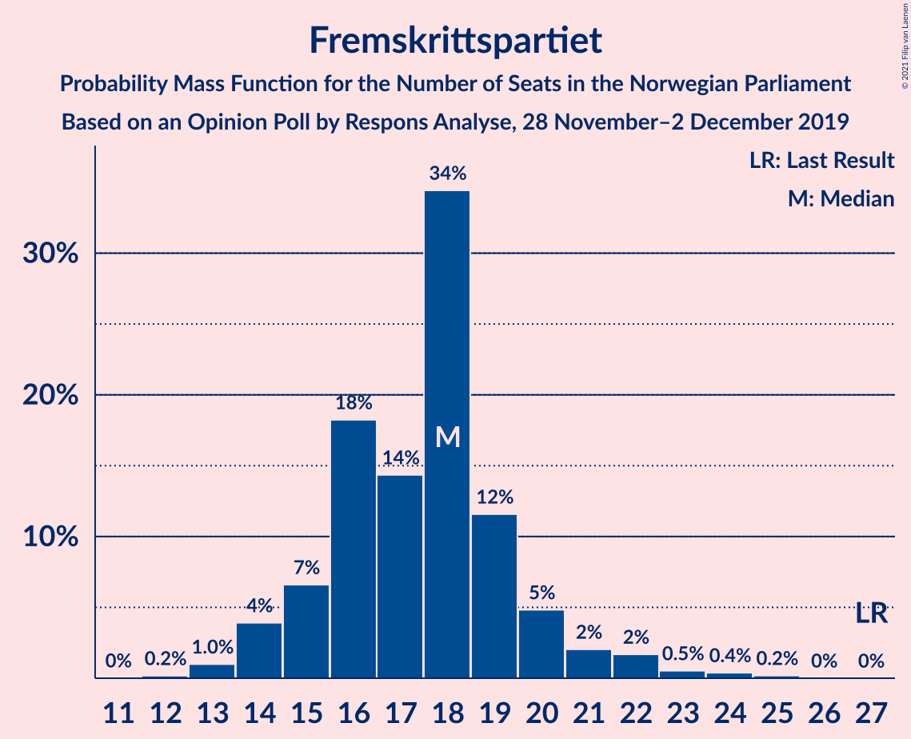
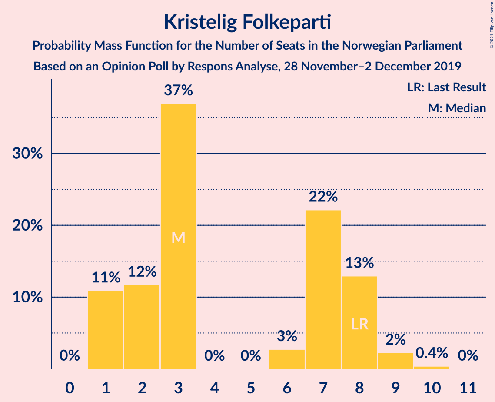
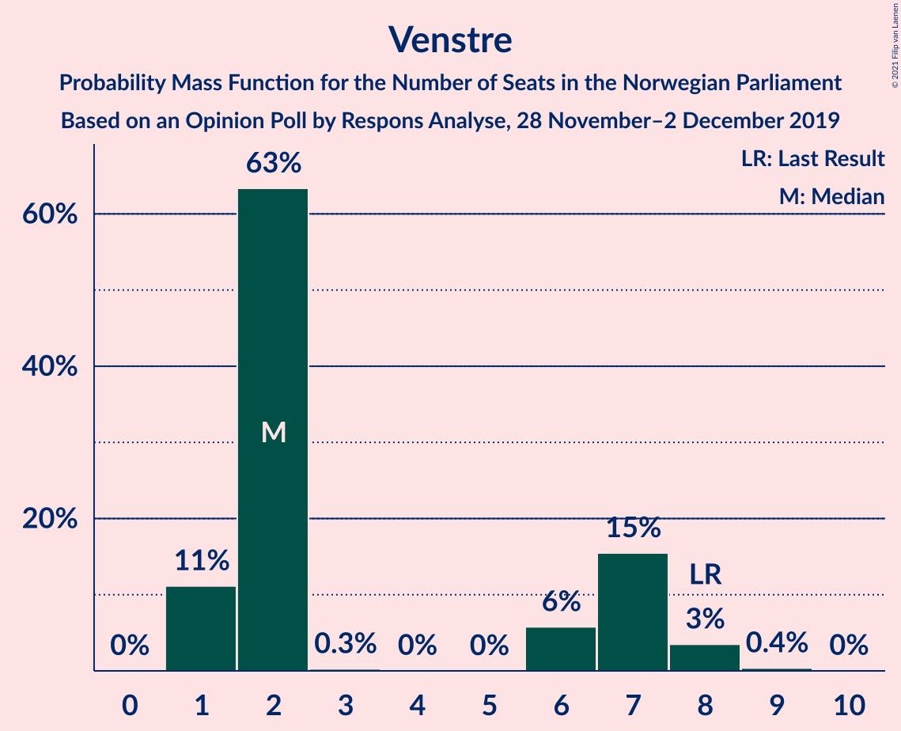
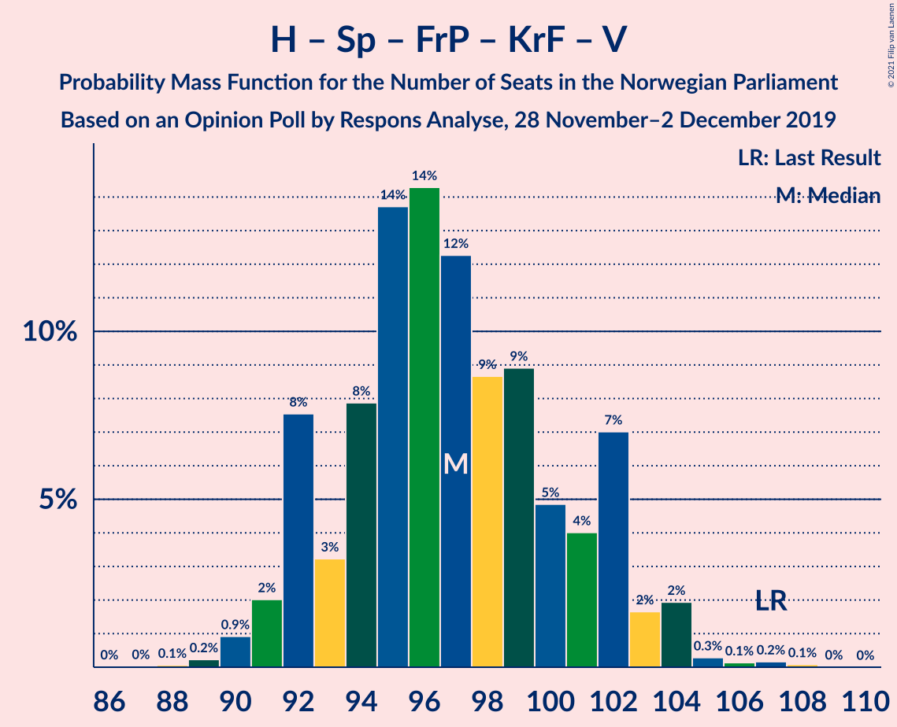
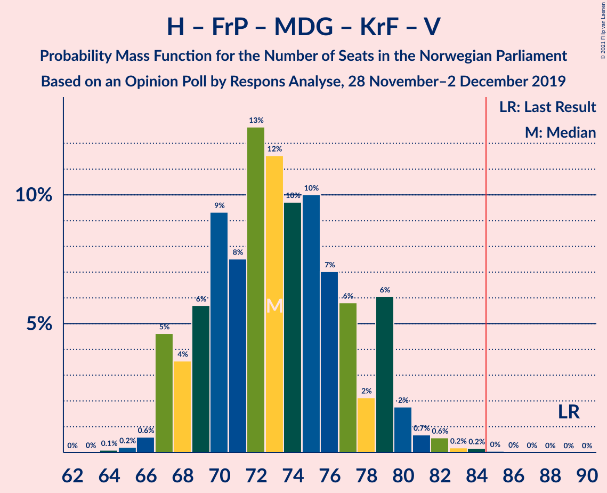
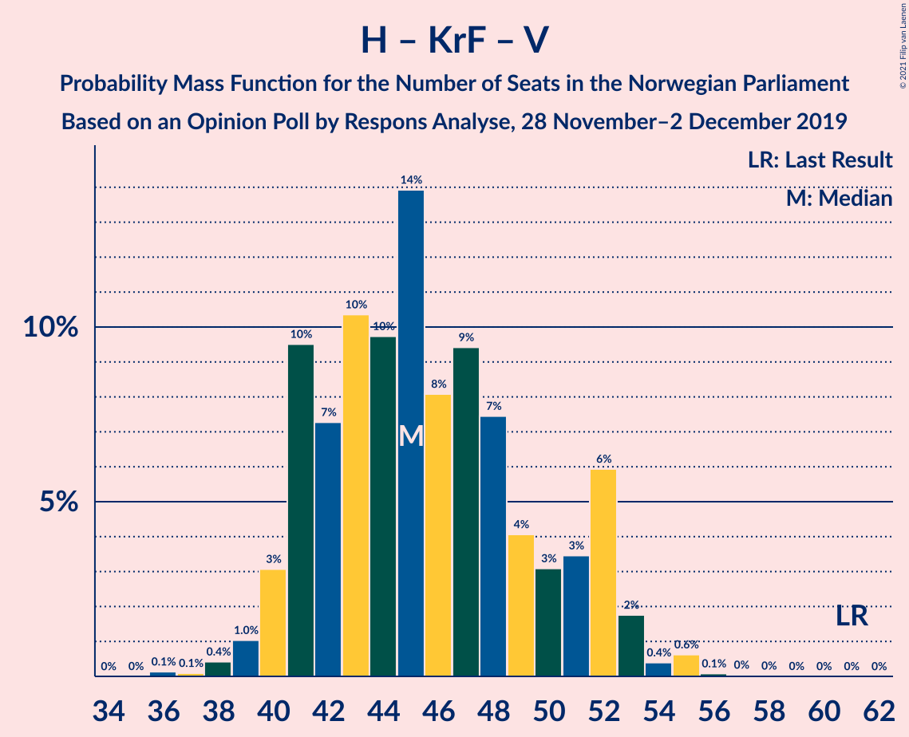

# Opinion Poll by Respons Analyse, 28 November–2 December 2019

<a href="#voting-intentions">Voting Intentions</a> | <a href="#seats">Seats</a> | <a href="#coalitions">Coalitions</a> | <a href="#technical-information">Technical Information</a>

## Voting Intentions

### Confidence Intervals

| Party | Last Result | Poll Result | 80% Confidence Interval | 90% Confidence Interval | 95% Confidence Interval | 99% Confidence Interval |
|:-----:|:-----------:|:-----------:|:-----------------------:|:-----------------------:|:-----------------------:|:-----------------------:|
| Arbeiderpartiet | 27.4% | 23.0% | 21.4–24.8% |20.9–25.3% |20.5–25.7% |19.7–26.6% |
| Høyre | 25.0% | 22.0% | 20.4–23.7% |19.9–24.2% |19.5–24.7% |18.8–25.5% |
| Senterpartiet | 10.3% | 17.4% | 15.9–19.0% |15.5–19.5% |15.2–19.9% |14.5–20.7% |
| Fremskrittspartiet | 15.2% | 10.3% | 9.2–11.6% |8.8–12.0% |8.6–12.3% |8.0–13.0% |
| Sosialistisk Venstreparti | 6.0% | 6.2% | 5.3–7.3% |5.1–7.6% |4.9–7.9% |4.5–8.4% |
| Miljøpartiet De Grønne | 3.2% | 5.9% | 5.0–7.0% |4.8–7.3% |4.6–7.5% |4.2–8.1% |
| Rødt | 2.4% | 5.3% | 4.5–6.3% |4.3–6.6% |4.1–6.9% |3.7–7.4% |
| Kristelig Folkeparti | 4.2% | 3.9% | 3.2–4.8% |3.0–5.1% |2.9–5.3% |2.6–5.8% |
| Venstre | 4.4% | 3.5% | 2.9–4.4% |2.7–4.6% |2.5–4.8% |2.2–5.3% |

*Note:* The poll result column reflects the actual value used in the calculations. Published results may vary slightly, and in addition be rounded to fewer digits.

## Seats

### Confidence Intervals

| Party | Last Result | Median | 80% Confidence Interval | 90% Confidence Interval | 95% Confidence Interval | 99% Confidence Interval |
|:-----:|:-----------:|:------:|:-----------------------:|:-----------------------:|:-----------------------:|:-----------------------:|
| <a href="#arbeiderpartiet">Arbeiderpartiet</a> | 49 | 43 | 39–44 |39–45 |38–46 |37–49 |
| <a href="#høyre">Høyre</a> | 45 | 38 | 34–42 |33–43 |33–43 |32–45 |
| <a href="#senterpartiet">Senterpartiet</a> | 19 | 34 | 31–37 |29–38 |27–38 |26–39 |
| <a href="#fremskrittspartiet">Fremskrittspartiet</a> | 27 | 18 | 15–19 |14–20 |14–22 |13–24 |
| <a href="#sosialistisk-venstreparti">Sosialistisk Venstreparti</a> | 11 | 10 | 9–12 |8–13 |8–13 |7–15 |
| <a href="#miljøpartiet-de-grønne">Miljøpartiet De Grønne</a> | 1 | 10 | 8–12 |8–12 |8–13 |7–14 |
| <a href="#rødt">Rødt</a> | 1 | 9 | 8–11 |7–11 |2–12 |2–13 |
| <a href="#kristelig-folkeparti">Kristelig Folkeparti</a> | 8 | 3 | 1–8 |1–8 |1–9 |1–9 |
| <a href="#venstre">Venstre</a> | 8 | 2 | 1–7 |1–7 |1–8 |1–8 |

### Arbeiderpartiet

*For a full overview of the results for this party, see the [Arbeiderpartiet](party-arbeiderpartiet.html) page.*

| Number of Seats | Probability | Accumulated | Special Marks |
|:---------------:|:-----------:|:-----------:|:-------------:|
| 33 | 0% | 100% |  |
| 34 | 0% | 99.9% |  |
| 35 | 0.1% | 99.9% |  |
| 36 | 0.2% | 99.8% |  |
| 37 | 0.8% | 99.5% |  |
| 38 | 3% | 98.7% |  |
| 39 | 9% | 95% |  |
| 40 | 6% | 87% |  |
| 41 | 12% | 81% |  |
| 42 | 10% | 68% |  |
| 43 | 20% | 58% | Median |
| 44 | 29% | 38% |  |
| 45 | 6% | 9% |  |
| 46 | 2% | 3% |  |
| 47 | 0.2% | 1.1% |  |
| 48 | 0.3% | 1.0% |  |
| 49 | 0.6% | 0.7% | Last Result |
| 50 | 0% | 0.1% |  |
| 51 | 0% | 0% |  |

### Høyre

*For a full overview of the results for this party, see the [Høyre](party-høyre.html) page.*

| Number of Seats | Probability | Accumulated | Special Marks |
|:---------------:|:-----------:|:-----------:|:-------------:|
| 31 | 0.2% | 100% |  |
| 32 | 1.2% | 99.8% |  |
| 33 | 4% | 98.6% |  |
| 34 | 5% | 94% |  |
| 35 | 9% | 89% |  |
| 36 | 13% | 80% |  |
| 37 | 13% | 68% |  |
| 38 | 15% | 55% | Median |
| 39 | 9% | 40% |  |
| 40 | 13% | 30% |  |
| 41 | 6% | 18% |  |
| 42 | 5% | 12% |  |
| 43 | 6% | 7% |  |
| 44 | 0.7% | 2% |  |
| 45 | 0.7% | 0.9% | Last Result |
| 46 | 0.1% | 0.1% |  |
| 47 | 0% | 0% |  |

### Senterpartiet

*For a full overview of the results for this party, see the [Senterpartiet](party-senterpartiet.html) page.*

| Number of Seats | Probability | Accumulated | Special Marks |
|:---------------:|:-----------:|:-----------:|:-------------:|
| 19 | 0% | 100% | Last Result |
| 20 | 0% | 100% |  |
| 21 | 0% | 100% |  |
| 22 | 0% | 100% |  |
| 23 | 0% | 100% |  |
| 24 | 0.1% | 100% |  |
| 25 | 0.2% | 99.9% |  |
| 26 | 0.9% | 99.7% |  |
| 27 | 1.4% | 98.8% |  |
| 28 | 2% | 97% |  |
| 29 | 3% | 96% |  |
| 30 | 1.0% | 93% |  |
| 31 | 2% | 92% |  |
| 32 | 7% | 90% |  |
| 33 | 30% | 83% |  |
| 34 | 18% | 53% | Median |
| 35 | 12% | 34% |  |
| 36 | 7% | 22% |  |
| 37 | 6% | 15% |  |
| 38 | 7% | 9% |  |
| 39 | 1.3% | 2% |  |
| 40 | 0.3% | 0.4% |  |
| 41 | 0% | 0.1% |  |
| 42 | 0% | 0% |  |

### Fremskrittspartiet

*For a full overview of the results for this party, see the [Fremskrittspartiet](party-fremskrittspartiet.html) page.*

| Number of Seats | Probability | Accumulated | Special Marks |
|:---------------:|:-----------:|:-----------:|:-------------:|
| 12 | 0.2% | 100% |  |
| 13 | 1.0% | 99.8% |  |
| 14 | 4% | 98.8% |  |
| 15 | 7% | 95% |  |
| 16 | 18% | 88% |  |
| 17 | 14% | 70% |  |
| 18 | 34% | 56% | Median |
| 19 | 12% | 21% |  |
| 20 | 5% | 10% |  |
| 21 | 2% | 5% |  |
| 22 | 2% | 3% |  |
| 23 | 0.5% | 1.1% |  |
| 24 | 0.4% | 0.6% |  |
| 25 | 0.2% | 0.2% |  |
| 26 | 0% | 0% |  |
| 27 | 0% | 0% | Last Result |

### Sosialistisk Venstreparti

*For a full overview of the results for this party, see the [Sosialistisk Venstreparti](party-sosialistiskvenstreparti.html) page.*

| Number of Seats | Probability | Accumulated | Special Marks |
|:---------------:|:-----------:|:-----------:|:-------------:|
| 2 | 0.1% | 100% |  |
| 3 | 0% | 99.9% |  |
| 4 | 0% | 99.9% |  |
| 5 | 0% | 99.9% |  |
| 6 | 0% | 99.9% |  |
| 7 | 0.4% | 99.9% |  |
| 8 | 7% | 99.5% |  |
| 9 | 20% | 92% |  |
| 10 | 22% | 72% | Median |
| 11 | 20% | 50% | Last Result |
| 12 | 22% | 30% |  |
| 13 | 5% | 7% |  |
| 14 | 1.2% | 2% |  |
| 15 | 0.9% | 1.0% |  |
| 16 | 0.1% | 0.1% |  |
| 17 | 0% | 0% |  |

### Miljøpartiet De Grønne

*For a full overview of the results for this party, see the [Miljøpartiet De Grønne](party-miljøpartietdegrønne.html) page.*

| Number of Seats | Probability | Accumulated | Special Marks |
|:---------------:|:-----------:|:-----------:|:-------------:|
| 1 | 0% | 100% | Last Result |
| 2 | 0.1% | 100% |  |
| 3 | 0% | 99.9% |  |
| 4 | 0% | 99.9% |  |
| 5 | 0% | 99.9% |  |
| 6 | 0.1% | 99.9% |  |
| 7 | 1.3% | 99.8% |  |
| 8 | 9% | 98% |  |
| 9 | 23% | 89% |  |
| 10 | 24% | 66% | Median |
| 11 | 26% | 42% |  |
| 12 | 12% | 17% |  |
| 13 | 4% | 4% |  |
| 14 | 0.5% | 0.6% |  |
| 15 | 0.1% | 0.1% |  |
| 16 | 0.1% | 0.1% |  |
| 17 | 0% | 0% |  |

### Rødt

*For a full overview of the results for this party, see the [Rødt](party-rødt.html) page.*

| Number of Seats | Probability | Accumulated | Special Marks |
|:---------------:|:-----------:|:-----------:|:-------------:|
| 1 | 0% | 100% | Last Result |
| 2 | 3% | 100% |  |
| 3 | 0% | 97% |  |
| 4 | 0% | 97% |  |
| 5 | 0% | 97% |  |
| 6 | 0.3% | 97% |  |
| 7 | 6% | 96% |  |
| 8 | 22% | 90% |  |
| 9 | 27% | 69% | Median |
| 10 | 31% | 42% |  |
| 11 | 7% | 11% |  |
| 12 | 3% | 4% |  |
| 13 | 0.7% | 0.8% |  |
| 14 | 0.1% | 0.1% |  |
| 15 | 0% | 0% |  |

### Kristelig Folkeparti

*For a full overview of the results for this party, see the [Kristelig Folkeparti](party-kristeligfolkeparti.html) page.*

| Number of Seats | Probability | Accumulated | Special Marks |
|:---------------:|:-----------:|:-----------:|:-------------:|
| 1 | 11% | 100% |  |
| 2 | 12% | 89% |  |
| 3 | 37% | 77% | Median |
| 4 | 0% | 40% |  |
| 5 | 0% | 40% |  |
| 6 | 3% | 40% |  |
| 7 | 22% | 38% |  |
| 8 | 13% | 16% | Last Result |
| 9 | 2% | 3% |  |
| 10 | 0.4% | 0.4% |  |
| 11 | 0% | 0% |  |

### Venstre

*For a full overview of the results for this party, see the [Venstre](party-venstre.html) page.*

| Number of Seats | Probability | Accumulated | Special Marks |
|:---------------:|:-----------:|:-----------:|:-------------:|
| 1 | 11% | 100% |  |
| 2 | 63% | 89% | Median |
| 3 | 0.3% | 25% |  |
| 4 | 0% | 25% |  |
| 5 | 0% | 25% |  |
| 6 | 6% | 25% |  |
| 7 | 15% | 19% |  |
| 8 | 3% | 4% | Last Result |
| 9 | 0.4% | 0.4% |  |
| 10 | 0% | 0% |  |

## Coalitions

### Confidence Intervals

| Coalition | Last Result | Median | Majority? | 80% Confidence Interval | 90% Confidence Interval | 95% Confidence Interval | 99% Confidence Interval |
|:---------:|:-----------:|:------:|:---------:|:-----------------------:|:-----------------------:|:-----------------------:|:-----------------------:|
| Arbeiderpartiet – Senterpartiet – Sosialistisk Venstreparti – Miljøpartiet De Grønne – Rødt | 81 | 106 | 100% | 101–110 | 100–111 | 98–111 | 96–113 |
| Arbeiderpartiet – Senterpartiet – Sosialistisk Venstreparti – Miljøpartiet De Grønne – Kristelig Folkeparti | 88 | 102 | 100% | 98–105 | 96–107 | 94–108 | 91–110 |
| Høyre – Senterpartiet – Fremskrittspartiet – Kristelig Folkeparti – Venstre | 107 | 97 | 100% | 92–102 | 92–102 | 91–104 | 90–105 |
| Arbeiderpartiet – Senterpartiet – Sosialistisk Venstreparti – Miljøpartiet De Grønne | 80 | 97 | 100% | 92–101 | 91–101 | 90–102 | 88–104 |
| Arbeiderpartiet – Senterpartiet – Sosialistisk Venstreparti – Rødt | 80 | 96 | 99.9% | 91–100 | 90–102 | 89–102 | 87–103 |
| Arbeiderpartiet – Senterpartiet – Miljøpartiet De Grønne – Kristelig Folkeparti | 77 | 91 | 96% | 87–95 | 85–96 | 83–97 | 80–99 |
| Arbeiderpartiet – Senterpartiet – Sosialistisk Venstreparti | 79 | 87 | 79% | 82–91 | 81–92 | 80–92 | 78–93 |
| Arbeiderpartiet – Senterpartiet – Kristelig Folkeparti | 76 | 80 | 12% | 76–86 | 75–87 | 74–87 | 70–89 |
| Arbeiderpartiet – Senterpartiet | 68 | 76 | 0.1% | 72–80 | 71–80 | 70–81 | 67–82 |
| Høyre – Fremskrittspartiet – Miljøpartiet De Grønne – Kristelig Folkeparti – Venstre | 89 | 73 | 0.1% | 69–78 | 67–79 | 67–80 | 66–82 |
| Høyre – Fremskrittspartiet – Kristelig Folkeparti – Venstre | 88 | 63 | 0% | 59–68 | 58–69 | 58–71 | 56–72 |
| Høyre – Fremskrittspartiet – Venstre | 80 | 58 | 0% | 55–62 | 54–64 | 51–66 | 51–69 |
| Høyre – Fremskrittspartiet | 72 | 55 | 0% | 51–60 | 50–61 | 49–62 | 49–65 |
| Arbeiderpartiet – Sosialistisk Venstreparti | 60 | 53 | 0% | 49–56 | 48–56 | 48–58 | 46–59 |
| Høyre – Kristelig Folkeparti – Venstre | 61 | 45 | 0% | 41–51 | 41–52 | 40–53 | 38–55 |
| Senterpartiet – Kristelig Folkeparti – Venstre | 35 | 42 | 0% | 37–46 | 36–47 | 34–49 | 31–52 |

### Arbeiderpartiet – Senterpartiet – Sosialistisk Venstreparti – Miljøpartiet De Grønne – Rødt

| Number of Seats | Probability | Accumulated | Special Marks |
|:---------------:|:-----------:|:-----------:|:-------------:|
| 81 | 0% | 100% | Last Result |
| 82 | 0% | 100% |  |
| 83 | 0% | 100% |  |
| 84 | 0% | 100% |  |
| 85 | 0% | 100% | Majority |
| 86 | 0% | 100% |  |
| 87 | 0% | 100% |  |
| 88 | 0% | 100% |  |
| 89 | 0% | 100% |  |
| 90 | 0% | 100% |  |
| 91 | 0% | 100% |  |
| 92 | 0% | 100% |  |
| 93 | 0% | 100% |  |
| 94 | 0.1% | 99.9% |  |
| 95 | 0.1% | 99.9% |  |
| 96 | 0.2% | 99.7% |  |
| 97 | 0.6% | 99.5% |  |
| 98 | 2% | 98.9% |  |
| 99 | 1.1% | 97% |  |
| 100 | 5% | 96% |  |
| 101 | 4% | 91% |  |
| 102 | 4% | 87% |  |
| 103 | 6% | 83% |  |
| 104 | 6% | 77% |  |
| 105 | 12% | 71% |  |
| 106 | 17% | 59% | Median |
| 107 | 7% | 42% |  |
| 108 | 8% | 36% |  |
| 109 | 6% | 27% |  |
| 110 | 15% | 21% |  |
| 111 | 5% | 6% |  |
| 112 | 0.9% | 1.5% |  |
| 113 | 0.3% | 0.6% |  |
| 114 | 0.2% | 0.3% |  |
| 115 | 0% | 0.1% |  |
| 116 | 0% | 0.1% |  |
| 117 | 0% | 0% |  |

### Arbeiderpartiet – Senterpartiet – Sosialistisk Venstreparti – Miljøpartiet De Grønne – Kristelig Folkeparti

| Number of Seats | Probability | Accumulated | Special Marks |
|:---------------:|:-----------:|:-----------:|:-------------:|
| 88 | 0% | 100% | Last Result |
| 89 | 0.1% | 100% |  |
| 90 | 0% | 99.9% |  |
| 91 | 0.4% | 99.8% |  |
| 92 | 0.6% | 99.5% |  |
| 93 | 1.1% | 98.9% |  |
| 94 | 0.7% | 98% |  |
| 95 | 1.3% | 97% |  |
| 96 | 2% | 96% |  |
| 97 | 1.2% | 94% |  |
| 98 | 12% | 92% |  |
| 99 | 7% | 81% |  |
| 100 | 8% | 73% | Median |
| 101 | 12% | 65% |  |
| 102 | 12% | 53% |  |
| 103 | 21% | 40% |  |
| 104 | 7% | 20% |  |
| 105 | 4% | 12% |  |
| 106 | 3% | 9% |  |
| 107 | 2% | 5% |  |
| 108 | 3% | 4% |  |
| 109 | 0.2% | 0.7% |  |
| 110 | 0.3% | 0.6% |  |
| 111 | 0.2% | 0.3% |  |
| 112 | 0% | 0.1% |  |
| 113 | 0% | 0% |  |

### Høyre – Senterpartiet – Fremskrittspartiet – Kristelig Folkeparti – Venstre

| Number of Seats | Probability | Accumulated | Special Marks |
|:---------------:|:-----------:|:-----------:|:-------------:|
| 87 | 0% | 100% |  |
| 88 | 0.1% | 99.9% |  |
| 89 | 0.2% | 99.9% |  |
| 90 | 0.9% | 99.6% |  |
| 91 | 2% | 98.7% |  |
| 92 | 8% | 97% |  |
| 93 | 3% | 89% |  |
| 94 | 8% | 86% |  |
| 95 | 14% | 78% | Median |
| 96 | 14% | 64% |  |
| 97 | 12% | 50% |  |
| 98 | 9% | 38% |  |
| 99 | 9% | 29% |  |
| 100 | 5% | 20% |  |
| 101 | 4% | 15% |  |
| 102 | 7% | 11% |  |
| 103 | 2% | 4% |  |
| 104 | 2% | 3% |  |
| 105 | 0.3% | 0.7% |  |
| 106 | 0.1% | 0.4% |  |
| 107 | 0.2% | 0.3% | Last Result |
| 108 | 0.1% | 0.1% |  |
| 109 | 0% | 0% |  |

### Arbeiderpartiet – Senterpartiet – Sosialistisk Venstreparti – Miljøpartiet De Grønne

| Number of Seats | Probability | Accumulated | Special Marks |
|:---------------:|:-----------:|:-----------:|:-------------:|
| 80 | 0% | 100% | Last Result |
| 81 | 0% | 100% |  |
| 82 | 0% | 100% |  |
| 83 | 0% | 100% |  |
| 84 | 0% | 100% |  |
| 85 | 0.1% | 100% | Majority |
| 86 | 0.2% | 99.9% |  |
| 87 | 0.2% | 99.7% |  |
| 88 | 0.2% | 99.5% |  |
| 89 | 1.4% | 99.3% |  |
| 90 | 1.5% | 98% |  |
| 91 | 5% | 96% |  |
| 92 | 2% | 91% |  |
| 93 | 5% | 89% |  |
| 94 | 5% | 84% |  |
| 95 | 8% | 79% |  |
| 96 | 13% | 71% |  |
| 97 | 12% | 58% | Median |
| 98 | 11% | 45% |  |
| 99 | 8% | 35% |  |
| 100 | 12% | 27% |  |
| 101 | 11% | 15% |  |
| 102 | 3% | 4% |  |
| 103 | 0.6% | 1.3% |  |
| 104 | 0.4% | 0.7% |  |
| 105 | 0.2% | 0.3% |  |
| 106 | 0.1% | 0.1% |  |
| 107 | 0.1% | 0.1% |  |
| 108 | 0% | 0% |  |

### Arbeiderpartiet – Senterpartiet – Sosialistisk Venstreparti – Rødt

| Number of Seats | Probability | Accumulated | Special Marks |
|:---------------:|:-----------:|:-----------:|:-------------:|
| 80 | 0% | 100% | Last Result |
| 81 | 0% | 100% |  |
| 82 | 0% | 100% |  |
| 83 | 0% | 100% |  |
| 84 | 0.1% | 100% |  |
| 85 | 0.2% | 99.9% | Majority |
| 86 | 0.2% | 99.7% |  |
| 87 | 0.6% | 99.6% |  |
| 88 | 0.8% | 99.0% |  |
| 89 | 2% | 98% |  |
| 90 | 6% | 96% |  |
| 91 | 2% | 90% |  |
| 92 | 6% | 88% |  |
| 93 | 7% | 82% |  |
| 94 | 10% | 75% |  |
| 95 | 10% | 65% |  |
| 96 | 12% | 55% | Median |
| 97 | 13% | 44% |  |
| 98 | 7% | 31% |  |
| 99 | 9% | 24% |  |
| 100 | 6% | 14% |  |
| 101 | 4% | 9% |  |
| 102 | 4% | 5% |  |
| 103 | 0.6% | 0.8% |  |
| 104 | 0.2% | 0.3% |  |
| 105 | 0.1% | 0.1% |  |
| 106 | 0% | 0% |  |

### Arbeiderpartiet – Senterpartiet – Miljøpartiet De Grønne – Kristelig Folkeparti

| Number of Seats | Probability | Accumulated | Special Marks |
|:---------------:|:-----------:|:-----------:|:-------------:|
| 77 | 0% | 100% | Last Result |
| 78 | 0.1% | 100% |  |
| 79 | 0.3% | 99.9% |  |
| 80 | 0.2% | 99.6% |  |
| 81 | 0.6% | 99.4% |  |
| 82 | 0.3% | 98.8% |  |
| 83 | 1.0% | 98% |  |
| 84 | 0.9% | 97% |  |
| 85 | 3% | 96% | Majority |
| 86 | 2% | 94% |  |
| 87 | 6% | 92% |  |
| 88 | 6% | 86% |  |
| 89 | 9% | 81% |  |
| 90 | 7% | 71% | Median |
| 91 | 29% | 64% |  |
| 92 | 9% | 35% |  |
| 93 | 7% | 26% |  |
| 94 | 6% | 19% |  |
| 95 | 6% | 14% |  |
| 96 | 5% | 8% |  |
| 97 | 2% | 3% |  |
| 98 | 0.5% | 1.1% |  |
| 99 | 0.1% | 0.6% |  |
| 100 | 0.2% | 0.4% |  |
| 101 | 0.2% | 0.3% |  |
| 102 | 0.1% | 0.1% |  |
| 103 | 0% | 0% |  |

### Arbeiderpartiet – Senterpartiet – Sosialistisk Venstreparti

| Number of Seats | Probability | Accumulated | Special Marks |
|:---------------:|:-----------:|:-----------:|:-------------:|
| 76 | 0.1% | 100% |  |
| 77 | 0.3% | 99.8% |  |
| 78 | 0.2% | 99.6% |  |
| 79 | 0.9% | 99.4% | Last Result |
| 80 | 2% | 98% |  |
| 81 | 5% | 97% |  |
| 82 | 3% | 92% |  |
| 83 | 4% | 89% |  |
| 84 | 6% | 85% |  |
| 85 | 9% | 79% | Majority |
| 86 | 18% | 70% |  |
| 87 | 11% | 52% | Median |
| 88 | 10% | 42% |  |
| 89 | 12% | 32% |  |
| 90 | 8% | 20% |  |
| 91 | 4% | 12% |  |
| 92 | 7% | 9% |  |
| 93 | 1.3% | 2% |  |
| 94 | 0.2% | 0.4% |  |
| 95 | 0.1% | 0.1% |  |
| 96 | 0.1% | 0.1% |  |
| 97 | 0% | 0% |  |

### Arbeiderpartiet – Senterpartiet – Kristelig Folkeparti

| Number of Seats | Probability | Accumulated | Special Marks |
|:---------------:|:-----------:|:-----------:|:-------------:|
| 68 | 0% | 100% |  |
| 69 | 0.3% | 99.9% |  |
| 70 | 0.5% | 99.6% |  |
| 71 | 0.3% | 99.1% |  |
| 72 | 0.3% | 98.8% |  |
| 73 | 0.7% | 98.5% |  |
| 74 | 2% | 98% |  |
| 75 | 2% | 96% |  |
| 76 | 5% | 94% | Last Result |
| 77 | 4% | 88% |  |
| 78 | 5% | 84% |  |
| 79 | 16% | 79% |  |
| 80 | 18% | 62% | Median |
| 81 | 3% | 44% |  |
| 82 | 10% | 41% |  |
| 83 | 8% | 30% |  |
| 84 | 10% | 23% |  |
| 85 | 2% | 12% | Majority |
| 86 | 4% | 11% |  |
| 87 | 6% | 7% |  |
| 88 | 0.6% | 1.1% |  |
| 89 | 0.3% | 0.6% |  |
| 90 | 0.1% | 0.3% |  |
| 91 | 0.1% | 0.1% |  |
| 92 | 0% | 0% |  |

### Arbeiderpartiet – Senterpartiet

| Number of Seats | Probability | Accumulated | Special Marks |
|:---------------:|:-----------:|:-----------:|:-------------:|
| 64 | 0.1% | 100% |  |
| 65 | 0.1% | 99.9% |  |
| 66 | 0.2% | 99.9% |  |
| 67 | 0.3% | 99.7% |  |
| 68 | 1.0% | 99.4% | Last Result |
| 69 | 0.8% | 98% |  |
| 70 | 1.4% | 98% |  |
| 71 | 3% | 96% |  |
| 72 | 7% | 94% |  |
| 73 | 3% | 86% |  |
| 74 | 7% | 83% |  |
| 75 | 7% | 77% |  |
| 76 | 19% | 69% |  |
| 77 | 18% | 50% | Median |
| 78 | 8% | 31% |  |
| 79 | 10% | 23% |  |
| 80 | 9% | 13% |  |
| 81 | 2% | 4% |  |
| 82 | 1.3% | 2% |  |
| 83 | 0.2% | 0.4% |  |
| 84 | 0.1% | 0.2% |  |
| 85 | 0% | 0.1% | Majority |
| 86 | 0% | 0% |  |

### Høyre – Fremskrittspartiet – Miljøpartiet De Grønne – Kristelig Folkeparti – Venstre

| Number of Seats | Probability | Accumulated | Special Marks |
|:---------------:|:-----------:|:-----------:|:-------------:|
| 63 | 0% | 100% |  |
| 64 | 0.1% | 99.9% |  |
| 65 | 0.2% | 99.9% |  |
| 66 | 0.6% | 99.7% |  |
| 67 | 5% | 99.1% |  |
| 68 | 4% | 94% |  |
| 69 | 6% | 91% |  |
| 70 | 9% | 85% |  |
| 71 | 8% | 76% | Median |
| 72 | 13% | 68% |  |
| 73 | 12% | 56% |  |
| 74 | 10% | 44% |  |
| 75 | 10% | 34% |  |
| 76 | 7% | 24% |  |
| 77 | 6% | 17% |  |
| 78 | 2% | 12% |  |
| 79 | 6% | 10% |  |
| 80 | 2% | 3% |  |
| 81 | 0.7% | 2% |  |
| 82 | 0.6% | 1.0% |  |
| 83 | 0.2% | 0.4% |  |
| 84 | 0.2% | 0.3% |  |
| 85 | 0% | 0.1% | Majority |
| 86 | 0% | 0% |  |
| 87 | 0% | 0% |  |
| 88 | 0% | 0% |  |
| 89 | 0% | 0% | Last Result |

### Høyre – Fremskrittspartiet – Kristelig Folkeparti – Venstre

| Number of Seats | Probability | Accumulated | Special Marks |
|:---------------:|:-----------:|:-----------:|:-------------:|
| 53 | 0.1% | 100% |  |
| 54 | 0% | 99.9% |  |
| 55 | 0.3% | 99.9% |  |
| 56 | 0.3% | 99.6% |  |
| 57 | 1.2% | 99.3% |  |
| 58 | 5% | 98% |  |
| 59 | 15% | 93% |  |
| 60 | 6% | 79% |  |
| 61 | 8% | 72% | Median |
| 62 | 7% | 64% |  |
| 63 | 17% | 57% |  |
| 64 | 12% | 41% |  |
| 65 | 6% | 28% |  |
| 66 | 6% | 23% |  |
| 67 | 4% | 16% |  |
| 68 | 4% | 13% |  |
| 69 | 5% | 9% |  |
| 70 | 1.0% | 4% |  |
| 71 | 2% | 3% |  |
| 72 | 0.4% | 0.9% |  |
| 73 | 0.2% | 0.5% |  |
| 74 | 0.1% | 0.2% |  |
| 75 | 0.1% | 0.1% |  |
| 76 | 0% | 0.1% |  |
| 77 | 0% | 0% |  |
| 78 | 0% | 0% |  |
| 79 | 0% | 0% |  |
| 80 | 0% | 0% |  |
| 81 | 0% | 0% |  |
| 82 | 0% | 0% |  |
| 83 | 0% | 0% |  |
| 84 | 0% | 0% |  |
| 85 | 0% | 0% | Majority |
| 86 | 0% | 0% |  |
| 87 | 0% | 0% |  |
| 88 | 0% | 0% | Last Result |

### Høyre – Fremskrittspartiet – Venstre

| Number of Seats | Probability | Accumulated | Special Marks |
|:---------------:|:-----------:|:-----------:|:-------------:|
| 49 | 0.1% | 100% |  |
| 50 | 0.1% | 99.9% |  |
| 51 | 3% | 99.8% |  |
| 52 | 0.5% | 97% |  |
| 53 | 1.3% | 96% |  |
| 54 | 2% | 95% |  |
| 55 | 4% | 93% |  |
| 56 | 15% | 89% |  |
| 57 | 13% | 73% |  |
| 58 | 12% | 60% | Median |
| 59 | 11% | 48% |  |
| 60 | 14% | 38% |  |
| 61 | 5% | 23% |  |
| 62 | 10% | 18% |  |
| 63 | 2% | 8% |  |
| 64 | 2% | 6% |  |
| 65 | 2% | 5% |  |
| 66 | 0.8% | 3% |  |
| 67 | 1.2% | 2% |  |
| 68 | 0.2% | 0.8% |  |
| 69 | 0.4% | 0.6% |  |
| 70 | 0.1% | 0.2% |  |
| 71 | 0% | 0.1% |  |
| 72 | 0% | 0% |  |
| 73 | 0% | 0% |  |
| 74 | 0% | 0% |  |
| 75 | 0% | 0% |  |
| 76 | 0% | 0% |  |
| 77 | 0% | 0% |  |
| 78 | 0% | 0% |  |
| 79 | 0% | 0% |  |
| 80 | 0% | 0% | Last Result |

### Høyre – Fremskrittspartiet

| Number of Seats | Probability | Accumulated | Special Marks |
|:---------------:|:-----------:|:-----------:|:-------------:|
| 46 | 0.1% | 100% |  |
| 47 | 0.2% | 99.9% |  |
| 48 | 0.1% | 99.8% |  |
| 49 | 4% | 99.6% |  |
| 50 | 2% | 96% |  |
| 51 | 6% | 94% |  |
| 52 | 7% | 88% |  |
| 53 | 7% | 82% |  |
| 54 | 14% | 74% |  |
| 55 | 14% | 60% |  |
| 56 | 11% | 46% | Median |
| 57 | 7% | 35% |  |
| 58 | 14% | 28% |  |
| 59 | 4% | 14% |  |
| 60 | 3% | 10% |  |
| 61 | 5% | 8% |  |
| 62 | 0.8% | 3% |  |
| 63 | 1.2% | 2% |  |
| 64 | 0.3% | 1.0% |  |
| 65 | 0.4% | 0.6% |  |
| 66 | 0.1% | 0.2% |  |
| 67 | 0% | 0.1% |  |
| 68 | 0.1% | 0.1% |  |
| 69 | 0% | 0% |  |
| 70 | 0% | 0% |  |
| 71 | 0% | 0% |  |
| 72 | 0% | 0% | Last Result |

### Arbeiderpartiet – Sosialistisk Venstreparti

| Number of Seats | Probability | Accumulated | Special Marks |
|:---------------:|:-----------:|:-----------:|:-------------:|
| 43 | 0% | 100% |  |
| 44 | 0.1% | 99.9% |  |
| 45 | 0.2% | 99.9% |  |
| 46 | 0.2% | 99.7% |  |
| 47 | 1.5% | 99.5% |  |
| 48 | 7% | 98% |  |
| 49 | 3% | 91% |  |
| 50 | 5% | 88% |  |
| 51 | 8% | 83% |  |
| 52 | 16% | 75% |  |
| 53 | 18% | 58% | Median |
| 54 | 10% | 40% |  |
| 55 | 10% | 31% |  |
| 56 | 16% | 20% |  |
| 57 | 1.4% | 5% |  |
| 58 | 2% | 3% |  |
| 59 | 0.8% | 1.0% |  |
| 60 | 0.1% | 0.2% | Last Result |
| 61 | 0.1% | 0.1% |  |
| 62 | 0% | 0.1% |  |
| 63 | 0% | 0% |  |

### Høyre – Kristelig Folkeparti – Venstre

| Number of Seats | Probability | Accumulated | Special Marks |
|:---------------:|:-----------:|:-----------:|:-------------:|
| 36 | 0.1% | 100% |  |
| 37 | 0.1% | 99.9% |  |
| 38 | 0.4% | 99.8% |  |
| 39 | 1.0% | 99.3% |  |
| 40 | 3% | 98% |  |
| 41 | 10% | 95% |  |
| 42 | 7% | 86% |  |
| 43 | 10% | 78% | Median |
| 44 | 10% | 68% |  |
| 45 | 14% | 58% |  |
| 46 | 8% | 44% |  |
| 47 | 9% | 36% |  |
| 48 | 7% | 27% |  |
| 49 | 4% | 19% |  |
| 50 | 3% | 15% |  |
| 51 | 3% | 12% |  |
| 52 | 6% | 9% |  |
| 53 | 2% | 3% |  |
| 54 | 0.4% | 1.2% |  |
| 55 | 0.6% | 0.8% |  |
| 56 | 0.1% | 0.2% |  |
| 57 | 0% | 0.1% |  |
| 58 | 0% | 0% |  |
| 59 | 0% | 0% |  |
| 60 | 0% | 0% |  |
| 61 | 0% | 0% | Last Result |

### Senterpartiet – Kristelig Folkeparti – Venstre

| Number of Seats | Probability | Accumulated | Special Marks |
|:---------------:|:-----------:|:-----------:|:-------------:|
| 30 | 0.1% | 100% |  |
| 31 | 0.9% | 99.9% |  |
| 32 | 0.4% | 99.1% |  |
| 33 | 0.3% | 98.7% |  |
| 34 | 1.3% | 98% |  |
| 35 | 1.0% | 97% | Last Result |
| 36 | 5% | 96% |  |
| 37 | 6% | 91% |  |
| 38 | 18% | 86% |  |
| 39 | 6% | 68% | Median |
| 40 | 5% | 62% |  |
| 41 | 3% | 57% |  |
| 42 | 12% | 55% |  |
| 43 | 10% | 43% |  |
| 44 | 9% | 33% |  |
| 45 | 8% | 24% |  |
| 46 | 9% | 17% |  |
| 47 | 3% | 7% |  |
| 48 | 1.4% | 4% |  |
| 49 | 2% | 3% |  |
| 50 | 0.5% | 1.5% |  |
| 51 | 0.3% | 1.0% |  |
| 52 | 0.6% | 0.7% |  |
| 53 | 0.1% | 0.1% |  |
| 54 | 0% | 0% |  |

## Technical Information

### Opinion Poll

+ **Polling firm:** Respons Analyse
+ **Commissioner(s):** —
+ **Fieldwork period:** 28 November–2 December 2019

### Calculations

+ **Sample size:** 1000
+ **Simulations done:** 524,288
+ **Error estimate:** 1.72%

