# Opinion Poll by Respons Analyse, 28 November–2 December 2019

<a href="#voting-intentions">Voting Intentions</a> | <a href="#seats">Seats</a> | <a href="#coalitions">Coalitions</a> | <a href="#technical-information">Technical Information</a>

## Voting Intentions

### Confidence Intervals

| Party | Last Result | Poll Result | 80% Confidence Interval | 90% Confidence Interval | 95% Confidence Interval | 99% Confidence Interval |
|:-----:|:-----------:|:-----------:|:-----------------------:|:-----------------------:|:-----------------------:|:-----------------------:|
| Arbeiderpartiet | 27.4% | 23.0% | 21.4–24.8% |20.9–25.3% |20.5–25.7% |19.7–26.6% |
| Høyre | 25.0% | 22.0% | 20.4–23.7% |19.9–24.2% |19.5–24.7% |18.8–25.5% |
| Senterpartiet | 10.3% | 17.4% | 15.9–19.0% |15.5–19.5% |15.2–19.9% |14.5–20.7% |
| Fremskrittspartiet | 15.2% | 10.3% | 9.2–11.6% |8.8–12.0% |8.6–12.3% |8.0–13.0% |
| Sosialistisk Venstreparti | 6.0% | 6.2% | 5.3–7.3% |5.1–7.6% |4.9–7.9% |4.5–8.4% |
| Miljøpartiet De Grønne | 3.2% | 5.9% | 5.0–7.0% |4.8–7.3% |4.6–7.5% |4.2–8.1% |
| Rødt | 2.4% | 5.3% | 4.5–6.3% |4.3–6.6% |4.1–6.9% |3.7–7.4% |
| Kristelig Folkeparti | 4.2% | 3.9% | 3.2–4.8% |3.0–5.1% |2.9–5.3% |2.6–5.8% |
| Venstre | 4.4% | 3.5% | 2.9–4.4% |2.7–4.6% |2.5–4.8% |2.2–5.3% |

*Note:* The poll result column reflects the actual value used in the calculations. Published results may vary slightly, and in addition be rounded to fewer digits.

## Seats

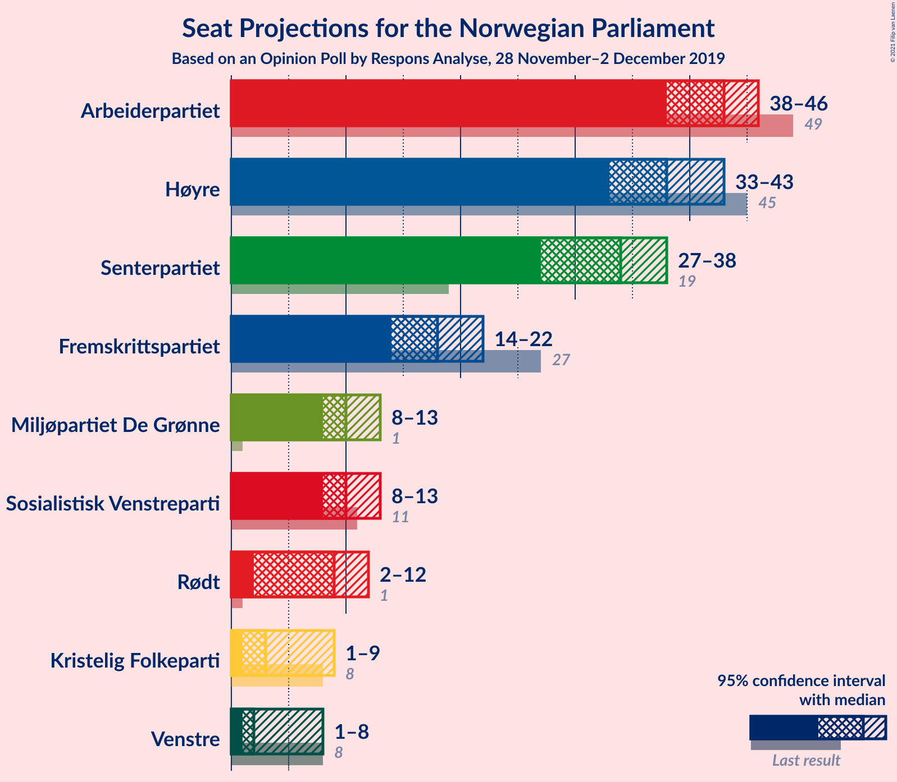

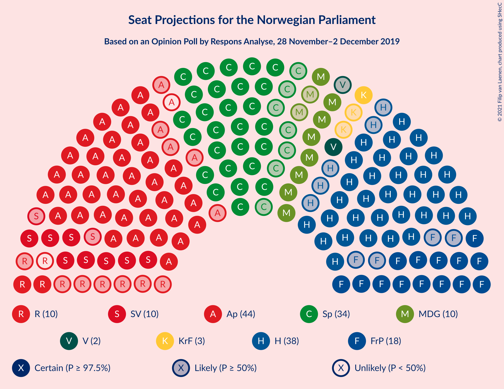

### Confidence Intervals

| Party | Last Result | Median | 80% Confidence Interval | 90% Confidence Interval | 95% Confidence Interval | 99% Confidence Interval |
|:-----:|:-----------:|:------:|:-----------------------:|:-----------------------:|:-----------------------:|:-----------------------:|
| <a href="#arbeiderpartiet">Arbeiderpartiet</a> | 49 | 41 | 39–45 |39–45 |38–46 |36–48 |
| <a href="#høyre">Høyre</a> | 45 | 38 | 36–43 |34–43 |33–43 |32–44 |
| <a href="#senterpartiet">Senterpartiet</a> | 19 | 34 | 31–38 |29–38 |26–38 |26–39 |
| <a href="#fremskrittspartiet">Fremskrittspartiet</a> | 27 | 18 | 16–20 |15–21 |14–22 |13–24 |
| <a href="#sosialistisk-venstreparti">Sosialistisk Venstreparti</a> | 11 | 10 | 8–12 |8–13 |8–13 |8–14 |
| <a href="#miljøpartiet-de-grønne">Miljøpartiet De Grønne</a> | 1 | 10 | 8–11 |8–12 |8–13 |7–13 |
| <a href="#rødt">Rødt</a> | 1 | 9 | 7–11 |2–11 |2–11 |2–13 |
| <a href="#kristelig-folkeparti">Kristelig Folkeparti</a> | 8 | 7 | 1–8 |1–8 |1–9 |1–9 |
| <a href="#venstre">Venstre</a> | 8 | 2 | 1–7 |1–7 |1–8 |1–8 |

### Arbeiderpartiet

*For a full overview of the results for this party, see the [Arbeiderpartiet](party-arbeiderpartiet.html) page.*

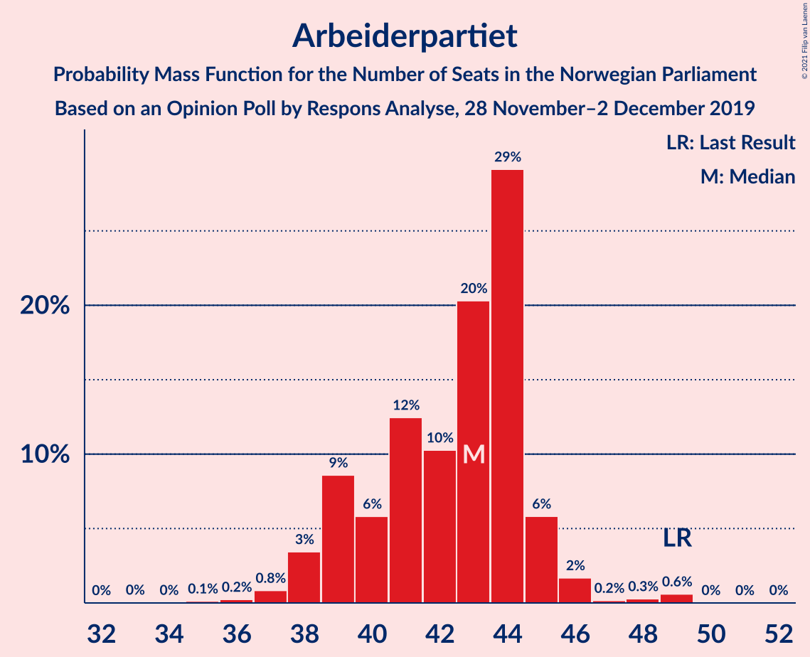

| Number of Seats | Probability | Accumulated | Special Marks |
|:---------------:|:-----------:|:-----------:|:-------------:|
| 35 | 0.3% | 100% |  |
| 36 | 0.2% | 99.7% |  |
| 37 | 1.0% | 99.5% |  |
| 38 | 2% | 98% |  |
| 39 | 16% | 96% |  |
| 40 | 6% | 80% |  |
| 41 | 26% | 75% | Median |
| 42 | 8% | 48% |  |
| 43 | 5% | 41% |  |
| 44 | 23% | 35% |  |
| 45 | 9% | 13% |  |
| 46 | 4% | 4% |  |
| 47 | 0.2% | 0.7% |  |
| 48 | 0% | 0.5% |  |
| 49 | 0.4% | 0.5% | Last Result |
| 50 | 0% | 0.1% |  |
| 51 | 0% | 0% |  |

### Høyre

*For a full overview of the results for this party, see the [Høyre](party-høyre.html) page.*

| Number of Seats | Probability | Accumulated | Special Marks |
|:---------------:|:-----------:|:-----------:|:-------------:|
| 31 | 0.2% | 100% |  |
| 32 | 2% | 99.7% |  |
| 33 | 2% | 98% |  |
| 34 | 3% | 96% |  |
| 35 | 1.4% | 93% |  |
| 36 | 8% | 91% |  |
| 37 | 21% | 83% |  |
| 38 | 17% | 62% | Median |
| 39 | 18% | 45% |  |
| 40 | 5% | 27% |  |
| 41 | 1.3% | 22% |  |
| 42 | 4% | 20% |  |
| 43 | 15% | 16% |  |
| 44 | 0.4% | 0.8% |  |
| 45 | 0.3% | 0.4% | Last Result |
| 46 | 0% | 0.1% |  |
| 47 | 0% | 0.1% |  |
| 48 | 0% | 0% |  |

### Senterpartiet

*For a full overview of the results for this party, see the [Senterpartiet](party-senterpartiet.html) page.*

| Number of Seats | Probability | Accumulated | Special Marks |
|:---------------:|:-----------:|:-----------:|:-------------:|
| 19 | 0% | 100% | Last Result |
| 20 | 0% | 100% |  |
| 21 | 0% | 100% |  |
| 22 | 0% | 100% |  |
| 23 | 0% | 100% |  |
| 24 | 0.2% | 100% |  |
| 25 | 0.1% | 99.8% |  |
| 26 | 2% | 99.8% |  |
| 27 | 1.1% | 97% |  |
| 28 | 0.6% | 96% |  |
| 29 | 4% | 96% |  |
| 30 | 0.5% | 92% |  |
| 31 | 2% | 92% |  |
| 32 | 2% | 90% |  |
| 33 | 29% | 88% |  |
| 34 | 25% | 59% | Median |
| 35 | 14% | 35% |  |
| 36 | 3% | 21% |  |
| 37 | 2% | 17% |  |
| 38 | 14% | 15% |  |
| 39 | 0.6% | 0.8% |  |
| 40 | 0.2% | 0.2% |  |
| 41 | 0% | 0% |  |

### Fremskrittspartiet

*For a full overview of the results for this party, see the [Fremskrittspartiet](party-fremskrittspartiet.html) page.*

| Number of Seats | Probability | Accumulated | Special Marks |
|:---------------:|:-----------:|:-----------:|:-------------:|
| 12 | 0.1% | 100% |  |
| 13 | 1.0% | 99.9% |  |
| 14 | 3% | 98.9% |  |
| 15 | 2% | 96% |  |
| 16 | 15% | 93% |  |
| 17 | 22% | 78% |  |
| 18 | 37% | 56% | Median |
| 19 | 5% | 19% |  |
| 20 | 8% | 13% |  |
| 21 | 3% | 5% |  |
| 22 | 1.1% | 3% |  |
| 23 | 1.0% | 2% |  |
| 24 | 0.5% | 0.8% |  |
| 25 | 0.3% | 0.3% |  |
| 26 | 0% | 0% |  |
| 27 | 0% | 0% | Last Result |

### Sosialistisk Venstreparti

*For a full overview of the results for this party, see the [Sosialistisk Venstreparti](party-sosialistiskvenstreparti.html) page.*

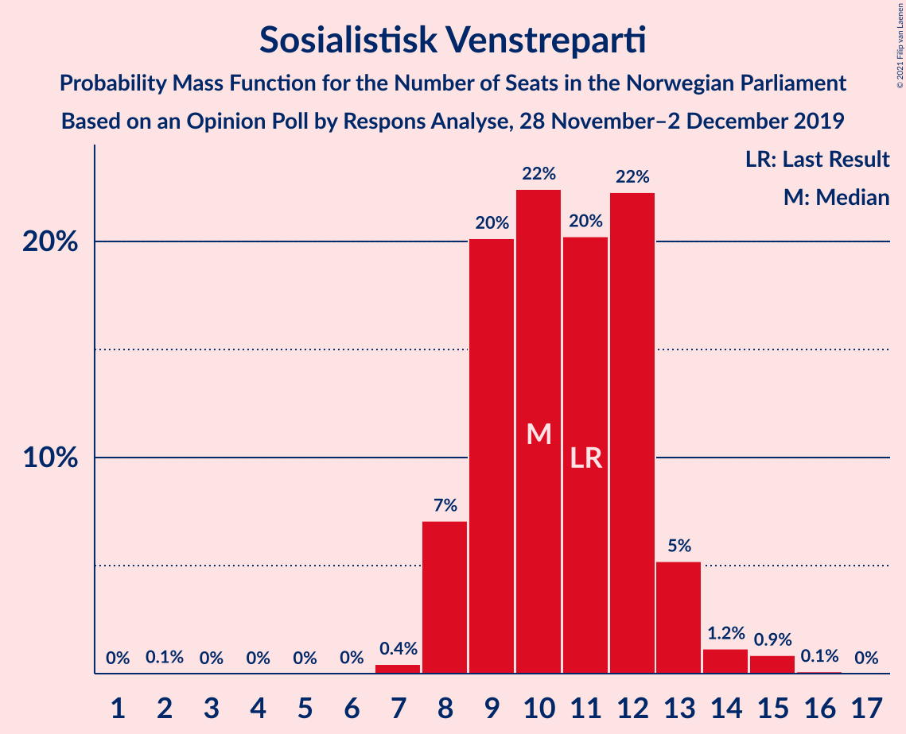

| Number of Seats | Probability | Accumulated | Special Marks |
|:---------------:|:-----------:|:-----------:|:-------------:|
| 2 | 0.1% | 100% |  |
| 3 | 0% | 99.9% |  |
| 4 | 0% | 99.9% |  |
| 5 | 0% | 99.9% |  |
| 6 | 0% | 99.9% |  |
| 7 | 0.3% | 99.9% |  |
| 8 | 12% | 99.6% |  |
| 9 | 23% | 88% |  |
| 10 | 21% | 65% | Median |
| 11 | 30% | 44% | Last Result |
| 12 | 8% | 13% |  |
| 13 | 4% | 5% |  |
| 14 | 0.7% | 1.1% |  |
| 15 | 0.4% | 0.4% |  |
| 16 | 0.1% | 0.1% |  |
| 17 | 0% | 0% |  |

### Miljøpartiet De Grønne

*For a full overview of the results for this party, see the [Miljøpartiet De Grønne](party-miljøpartietdegrønne.html) page.*

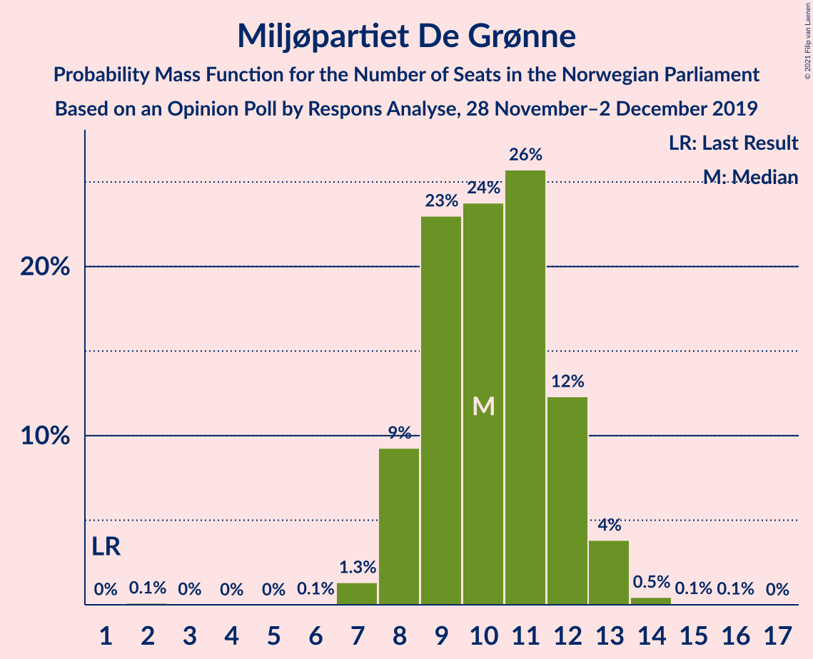

| Number of Seats | Probability | Accumulated | Special Marks |
|:---------------:|:-----------:|:-----------:|:-------------:|
| 1 | 0% | 100% | Last Result |
| 2 | 0.1% | 100% |  |
| 3 | 0% | 99.9% |  |
| 4 | 0% | 99.9% |  |
| 5 | 0% | 99.9% |  |
| 6 | 0.1% | 99.9% |  |
| 7 | 0.5% | 99.8% |  |
| 8 | 14% | 99.2% |  |
| 9 | 23% | 85% |  |
| 10 | 26% | 63% | Median |
| 11 | 29% | 36% |  |
| 12 | 4% | 7% |  |
| 13 | 3% | 4% |  |
| 14 | 0.1% | 0.2% |  |
| 15 | 0.1% | 0.1% |  |
| 16 | 0% | 0% |  |

### Rødt

*For a full overview of the results for this party, see the [Rødt](party-rødt.html) page.*

| Number of Seats | Probability | Accumulated | Special Marks |
|:---------------:|:-----------:|:-----------:|:-------------:|
| 1 | 0% | 100% | Last Result |
| 2 | 8% | 100% |  |
| 3 | 0% | 92% |  |
| 4 | 0% | 92% |  |
| 5 | 0% | 92% |  |
| 6 | 0.3% | 92% |  |
| 7 | 4% | 92% |  |
| 8 | 10% | 87% |  |
| 9 | 41% | 77% | Median |
| 10 | 19% | 36% |  |
| 11 | 16% | 18% |  |
| 12 | 0.9% | 2% |  |
| 13 | 0.5% | 0.7% |  |
| 14 | 0.1% | 0.1% |  |
| 15 | 0% | 0% |  |

### Kristelig Folkeparti

*For a full overview of the results for this party, see the [Kristelig Folkeparti](party-kristeligfolkeparti.html) page.*

| Number of Seats | Probability | Accumulated | Special Marks |
|:---------------:|:-----------:|:-----------:|:-------------:|
| 1 | 18% | 100% |  |
| 2 | 4% | 81% |  |
| 3 | 23% | 77% |  |
| 4 | 0% | 54% |  |
| 5 | 0% | 54% |  |
| 6 | 1.0% | 54% |  |
| 7 | 40% | 53% | Median |
| 8 | 8% | 13% | Last Result |
| 9 | 5% | 5% |  |
| 10 | 0.2% | 0.3% |  |
| 11 | 0% | 0% |  |

### Venstre

*For a full overview of the results for this party, see the [Venstre](party-venstre.html) page.*

| Number of Seats | Probability | Accumulated | Special Marks |
|:---------------:|:-----------:|:-----------:|:-------------:|
| 1 | 15% | 100% |  |
| 2 | 59% | 85% | Median |
| 3 | 0% | 26% |  |
| 4 | 0% | 26% |  |
| 5 | 0% | 26% |  |
| 6 | 13% | 26% |  |
| 7 | 8% | 13% |  |
| 8 | 4% | 4% | Last Result |
| 9 | 0.3% | 0.3% |  |
| 10 | 0% | 0% |  |

## Coalitions

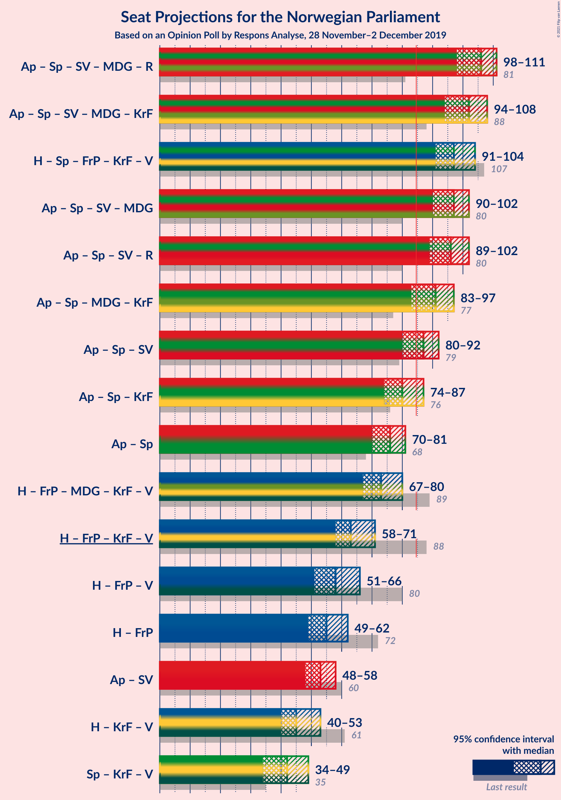

### Confidence Intervals

| Coalition | Last Result | Median | Majority? | 80% Confidence Interval | 90% Confidence Interval | 95% Confidence Interval | 99% Confidence Interval |
|:---------:|:-----------:|:------:|:---------:|:-----------------------:|:-----------------------:|:-----------------------:|:-----------------------:|
| Arbeiderpartiet – Senterpartiet – Sosialistisk Venstreparti – Miljøpartiet De Grønne – Rødt | 81 | 105 | 100% | 100–110 | 100–110 | 99–112 | 97–112 |
| Arbeiderpartiet – Senterpartiet – Sosialistisk Venstreparti – Miljøpartiet De Grønne – Kristelig Folkeparti | 88 | 102 | 100% | 98–105 | 97–107 | 95–107 | 92–111 |
| Høyre – Senterpartiet – Fremskrittspartiet – Kristelig Folkeparti – Venstre | 107 | 97 | 100% | 94–102 | 93–103 | 90–103 | 90–104 |
| Arbeiderpartiet – Senterpartiet – Sosialistisk Venstreparti – Miljøpartiet De Grønne | 80 | 96 | 100% | 91–100 | 91–101 | 90–102 | 87–104 |
| Arbeiderpartiet – Senterpartiet – Sosialistisk Venstreparti – Rødt | 80 | 95 | 99.9% | 90–101 | 90–101 | 89–101 | 87–103 |
| Arbeiderpartiet – Senterpartiet – Miljøpartiet De Grønne – Kristelig Folkeparti | 77 | 91 | 97% | 87–95 | 86–97 | 84–97 | 81–101 |
| Arbeiderpartiet – Senterpartiet – Sosialistisk Venstreparti | 79 | 86 | 70% | 81–90 | 81–91 | 81–92 | 77–93 |
| Arbeiderpartiet – Senterpartiet – Kristelig Folkeparti | 76 | 82 | 18% | 76–86 | 75–87 | 74–87 | 71–89 |
| Arbeiderpartiet – Senterpartiet | 68 | 76 | 0.1% | 72–79 | 72–80 | 70–80 | 66–82 |
| Høyre – Fremskrittspartiet – Miljøpartiet De Grønne – Kristelig Folkeparti – Venstre | 89 | 74 | 0.1% | 68–79 | 68–79 | 67–80 | 66–82 |
| Høyre – Fremskrittspartiet – Kristelig Folkeparti – Venstre | 88 | 64 | 0% | 59–69 | 59–69 | 57–70 | 56–72 |
| Høyre – Fremskrittspartiet – Venstre | 80 | 60 | 0% | 56–62 | 54–63 | 53–65 | 51–68 |
| Høyre – Fremskrittspartiet | 72 | 56 | 0% | 52–61 | 51–61 | 50–61 | 49–65 |
| Arbeiderpartiet – Sosialistisk Venstreparti | 60 | 52 | 0% | 48–55 | 48–56 | 48–58 | 46–59 |
| Høyre – Kristelig Folkeparti – Venstre | 61 | 46 | 0% | 43–52 | 41–52 | 41–52 | 38–54 |
| Senterpartiet – Kristelig Folkeparti – Venstre | 35 | 43 | 0% | 36–46 | 36–46 | 32–48 | 31–50 |

### Arbeiderpartiet – Senterpartiet – Sosialistisk Venstreparti – Miljøpartiet De Grønne – Rødt

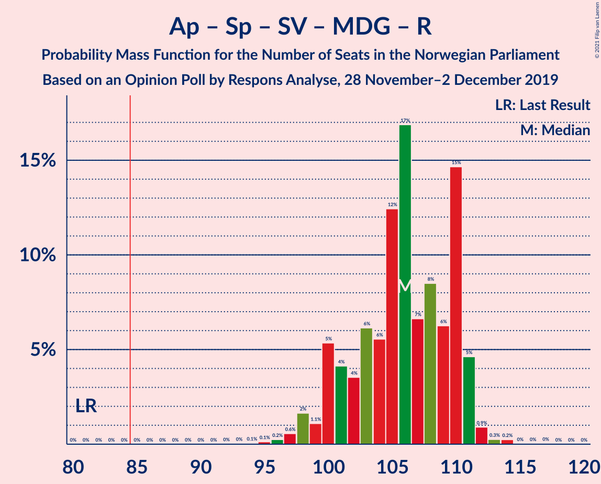

| Number of Seats | Probability | Accumulated | Special Marks |
|:---------------:|:-----------:|:-----------:|:-------------:|
| 81 | 0% | 100% | Last Result |
| 82 | 0% | 100% |  |
| 83 | 0% | 100% |  |
| 84 | 0% | 100% |  |
| 85 | 0% | 100% | Majority |
| 86 | 0% | 100% |  |
| 87 | 0% | 100% |  |
| 88 | 0% | 100% |  |
| 89 | 0% | 100% |  |
| 90 | 0% | 100% |  |
| 91 | 0% | 100% |  |
| 92 | 0% | 100% |  |
| 93 | 0.1% | 100% |  |
| 94 | 0% | 99.9% |  |
| 95 | 0.1% | 99.9% |  |
| 96 | 0.1% | 99.8% |  |
| 97 | 0.5% | 99.7% |  |
| 98 | 2% | 99.2% |  |
| 99 | 1.4% | 98% |  |
| 100 | 13% | 96% |  |
| 101 | 3% | 83% |  |
| 102 | 7% | 80% |  |
| 103 | 3% | 72% |  |
| 104 | 9% | 69% | Median |
| 105 | 21% | 60% |  |
| 106 | 14% | 39% |  |
| 107 | 1.3% | 24% |  |
| 108 | 6% | 23% |  |
| 109 | 4% | 17% |  |
| 110 | 9% | 13% |  |
| 111 | 0.9% | 3% |  |
| 112 | 2% | 3% |  |
| 113 | 0.1% | 0.5% |  |
| 114 | 0.3% | 0.4% |  |
| 115 | 0% | 0.1% |  |
| 116 | 0.1% | 0.1% |  |
| 117 | 0% | 0% |  |

### Arbeiderpartiet – Senterpartiet – Sosialistisk Venstreparti – Miljøpartiet De Grønne – Kristelig Folkeparti

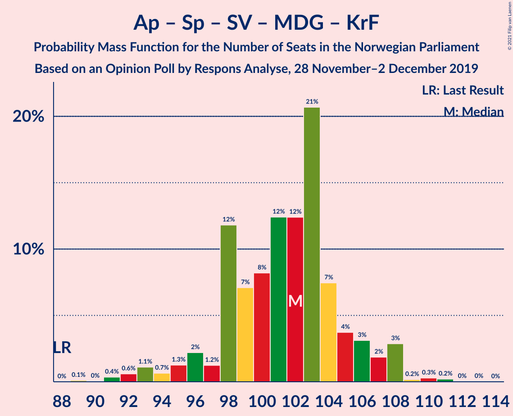

| Number of Seats | Probability | Accumulated | Special Marks |
|:---------------:|:-----------:|:-----------:|:-------------:|
| 88 | 0% | 100% | Last Result |
| 89 | 0.1% | 100% |  |
| 90 | 0.1% | 99.9% |  |
| 91 | 0.3% | 99.8% |  |
| 92 | 0.4% | 99.6% |  |
| 93 | 0.7% | 99.2% |  |
| 94 | 0.6% | 98% |  |
| 95 | 0.5% | 98% |  |
| 96 | 2% | 97% |  |
| 97 | 0.6% | 95% |  |
| 98 | 33% | 95% |  |
| 99 | 3% | 61% |  |
| 100 | 3% | 58% |  |
| 101 | 3% | 55% |  |
| 102 | 22% | 52% | Median |
| 103 | 11% | 30% |  |
| 104 | 5% | 19% |  |
| 105 | 4% | 13% |  |
| 106 | 3% | 9% |  |
| 107 | 5% | 6% |  |
| 108 | 0.7% | 2% |  |
| 109 | 0.1% | 1.0% |  |
| 110 | 0.4% | 0.9% |  |
| 111 | 0.5% | 0.5% |  |
| 112 | 0% | 0.1% |  |
| 113 | 0% | 0% |  |

### Høyre – Senterpartiet – Fremskrittspartiet – Kristelig Folkeparti – Venstre

| Number of Seats | Probability | Accumulated | Special Marks |
|:---------------:|:-----------:|:-----------:|:-------------:|
| 87 | 0% | 100% |  |
| 88 | 0% | 99.9% |  |
| 89 | 0.1% | 99.9% |  |
| 90 | 3% | 99.9% |  |
| 91 | 0.9% | 97% |  |
| 92 | 0.7% | 96% |  |
| 93 | 4% | 96% |  |
| 94 | 3% | 92% |  |
| 95 | 8% | 88% |  |
| 96 | 2% | 81% |  |
| 97 | 31% | 79% |  |
| 98 | 4% | 49% |  |
| 99 | 12% | 44% | Median |
| 100 | 4% | 32% |  |
| 101 | 4% | 28% |  |
| 102 | 18% | 24% |  |
| 103 | 4% | 5% |  |
| 104 | 1.2% | 2% |  |
| 105 | 0.1% | 0.4% |  |
| 106 | 0% | 0.3% |  |
| 107 | 0.2% | 0.2% | Last Result |
| 108 | 0% | 0% |  |

### Arbeiderpartiet – Senterpartiet – Sosialistisk Venstreparti – Miljøpartiet De Grønne

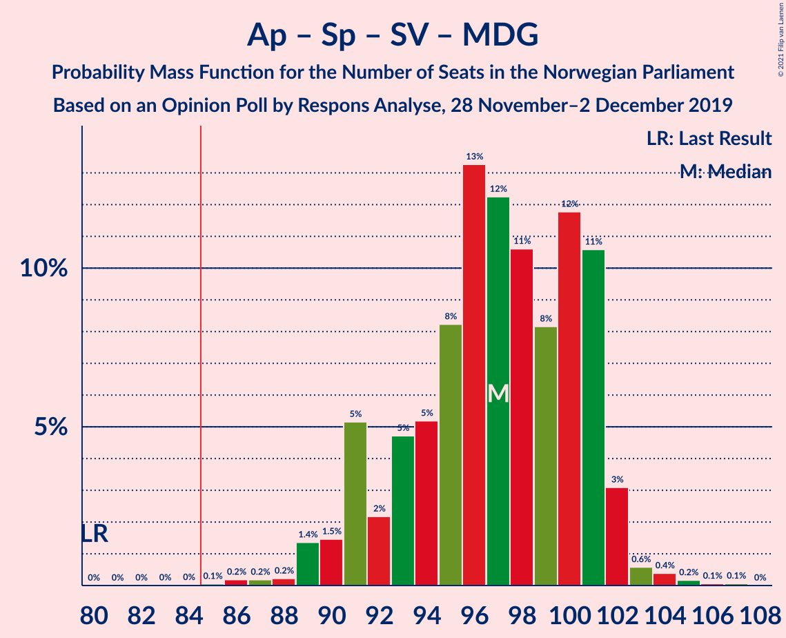

| Number of Seats | Probability | Accumulated | Special Marks |
|:---------------:|:-----------:|:-----------:|:-------------:|
| 80 | 0% | 100% | Last Result |
| 81 | 0% | 100% |  |
| 82 | 0% | 100% |  |
| 83 | 0% | 100% |  |
| 84 | 0% | 100% |  |
| 85 | 0% | 100% | Majority |
| 86 | 0.2% | 99.9% |  |
| 87 | 0.3% | 99.8% |  |
| 88 | 0.1% | 99.5% |  |
| 89 | 0.3% | 99.3% |  |
| 90 | 2% | 99.1% |  |
| 91 | 13% | 97% |  |
| 92 | 1.1% | 83% |  |
| 93 | 3% | 82% |  |
| 94 | 8% | 80% |  |
| 95 | 14% | 72% | Median |
| 96 | 10% | 58% |  |
| 97 | 22% | 49% |  |
| 98 | 1.0% | 27% |  |
| 99 | 12% | 26% |  |
| 100 | 7% | 14% |  |
| 101 | 3% | 7% |  |
| 102 | 3% | 5% |  |
| 103 | 0.3% | 1.2% |  |
| 104 | 0.7% | 0.9% |  |
| 105 | 0.1% | 0.2% |  |
| 106 | 0% | 0.1% |  |
| 107 | 0.1% | 0.1% |  |
| 108 | 0% | 0% |  |

### Arbeiderpartiet – Senterpartiet – Sosialistisk Venstreparti – Rødt

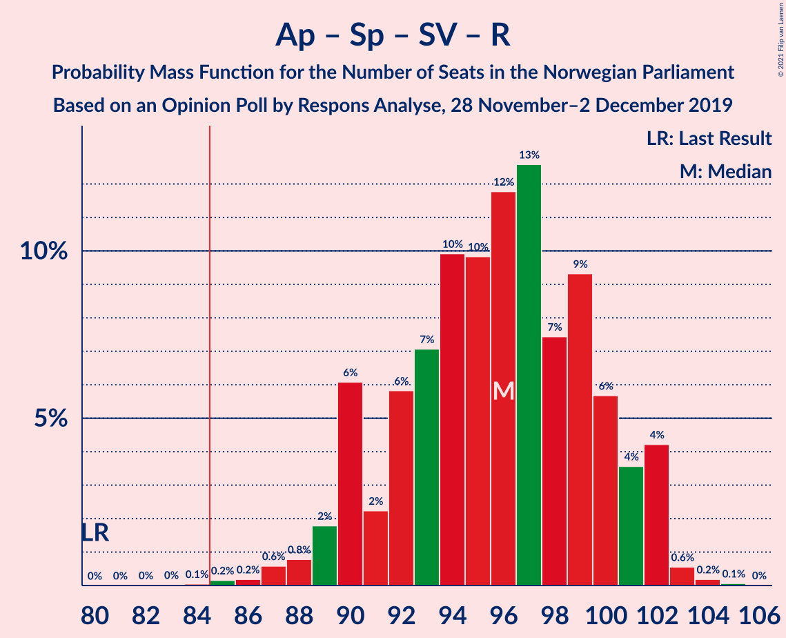

| Number of Seats | Probability | Accumulated | Special Marks |
|:---------------:|:-----------:|:-----------:|:-------------:|
| 80 | 0% | 100% | Last Result |
| 81 | 0% | 100% |  |
| 82 | 0% | 100% |  |
| 83 | 0% | 100% |  |
| 84 | 0.1% | 100% |  |
| 85 | 0.1% | 99.9% | Majority |
| 86 | 0.2% | 99.8% |  |
| 87 | 1.0% | 99.5% |  |
| 88 | 0.8% | 98.5% |  |
| 89 | 0.7% | 98% |  |
| 90 | 15% | 97% |  |
| 91 | 3% | 82% |  |
| 92 | 6% | 79% |  |
| 93 | 9% | 72% |  |
| 94 | 5% | 63% | Median |
| 95 | 16% | 58% |  |
| 96 | 11% | 42% |  |
| 97 | 13% | 31% |  |
| 98 | 2% | 19% |  |
| 99 | 3% | 17% |  |
| 100 | 3% | 14% |  |
| 101 | 9% | 11% |  |
| 102 | 0.5% | 2% |  |
| 103 | 2% | 2% |  |
| 104 | 0.2% | 0.3% |  |
| 105 | 0.1% | 0.1% |  |
| 106 | 0% | 0% |  |

### Arbeiderpartiet – Senterpartiet – Miljøpartiet De Grønne – Kristelig Folkeparti

| Number of Seats | Probability | Accumulated | Special Marks |
|:---------------:|:-----------:|:-----------:|:-------------:|
| 77 | 0% | 100% | Last Result |
| 78 | 0% | 100% |  |
| 79 | 0.2% | 100% |  |
| 80 | 0.2% | 99.8% |  |
| 81 | 0.5% | 99.5% |  |
| 82 | 0.2% | 99.1% |  |
| 83 | 0.9% | 98.9% |  |
| 84 | 0.6% | 98% |  |
| 85 | 0.9% | 97% | Majority |
| 86 | 3% | 97% |  |
| 87 | 14% | 93% |  |
| 88 | 4% | 80% |  |
| 89 | 17% | 76% |  |
| 90 | 5% | 58% |  |
| 91 | 13% | 54% |  |
| 92 | 14% | 41% | Median |
| 93 | 3% | 27% |  |
| 94 | 8% | 24% |  |
| 95 | 9% | 16% |  |
| 96 | 0.7% | 7% |  |
| 97 | 5% | 6% |  |
| 98 | 0.5% | 1.4% |  |
| 99 | 0.1% | 0.9% |  |
| 100 | 0.2% | 0.8% |  |
| 101 | 0.6% | 0.6% |  |
| 102 | 0% | 0% |  |

### Arbeiderpartiet – Senterpartiet – Sosialistisk Venstreparti

| Number of Seats | Probability | Accumulated | Special Marks |
|:---------------:|:-----------:|:-----------:|:-------------:|
| 76 | 0.2% | 100% |  |
| 77 | 0.3% | 99.7% |  |
| 78 | 0.2% | 99.4% |  |
| 79 | 1.2% | 99.3% | Last Result |
| 80 | 0.3% | 98% |  |
| 81 | 13% | 98% |  |
| 82 | 3% | 85% |  |
| 83 | 4% | 81% |  |
| 84 | 7% | 77% |  |
| 85 | 6% | 70% | Median, Majority |
| 86 | 18% | 65% |  |
| 87 | 19% | 46% |  |
| 88 | 2% | 27% |  |
| 89 | 4% | 26% |  |
| 90 | 14% | 21% |  |
| 91 | 4% | 7% |  |
| 92 | 2% | 3% |  |
| 93 | 0.2% | 0.6% |  |
| 94 | 0.2% | 0.4% |  |
| 95 | 0.1% | 0.2% |  |
| 96 | 0.1% | 0.1% |  |
| 97 | 0% | 0% |  |

### Arbeiderpartiet – Senterpartiet – Kristelig Folkeparti

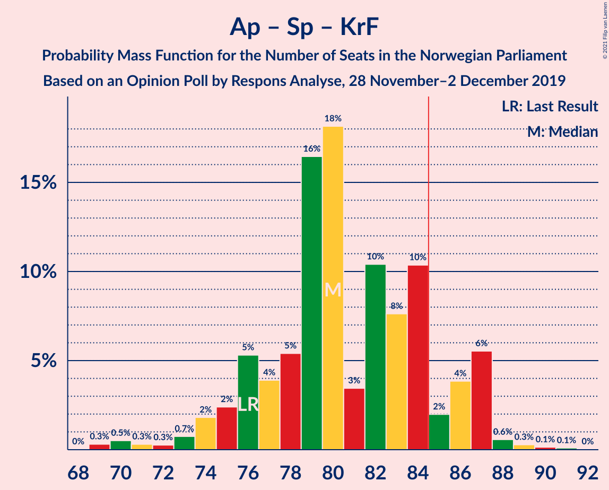

| Number of Seats | Probability | Accumulated | Special Marks |
|:---------------:|:-----------:|:-----------:|:-------------:|
| 67 | 0.1% | 100% |  |
| 68 | 0% | 99.9% |  |
| 69 | 0.1% | 99.8% |  |
| 70 | 0% | 99.8% |  |
| 71 | 0.4% | 99.7% |  |
| 72 | 0.4% | 99.4% |  |
| 73 | 0.8% | 99.0% |  |
| 74 | 0.7% | 98% |  |
| 75 | 3% | 97% |  |
| 76 | 15% | 94% | Last Result |
| 77 | 4% | 80% |  |
| 78 | 6% | 75% |  |
| 79 | 14% | 70% |  |
| 80 | 3% | 55% |  |
| 81 | 2% | 53% |  |
| 82 | 13% | 51% | Median |
| 83 | 8% | 37% |  |
| 84 | 11% | 29% |  |
| 85 | 2% | 18% | Majority |
| 86 | 10% | 16% |  |
| 87 | 5% | 6% |  |
| 88 | 1.2% | 2% |  |
| 89 | 0.4% | 0.6% |  |
| 90 | 0.2% | 0.2% |  |
| 91 | 0% | 0% |  |

### Arbeiderpartiet – Senterpartiet

| Number of Seats | Probability | Accumulated | Special Marks |
|:---------------:|:-----------:|:-----------:|:-------------:|
| 64 | 0.2% | 100% |  |
| 65 | 0.2% | 99.8% |  |
| 66 | 0.2% | 99.7% |  |
| 67 | 0.2% | 99.5% |  |
| 68 | 1.0% | 99.3% | Last Result |
| 69 | 0.1% | 98% |  |
| 70 | 1.0% | 98% |  |
| 71 | 0.3% | 97% |  |
| 72 | 17% | 97% |  |
| 73 | 3% | 80% |  |
| 74 | 9% | 77% |  |
| 75 | 17% | 68% | Median |
| 76 | 3% | 51% |  |
| 77 | 15% | 48% |  |
| 78 | 2% | 33% |  |
| 79 | 21% | 30% |  |
| 80 | 7% | 10% |  |
| 81 | 1.4% | 2% |  |
| 82 | 0.5% | 0.8% |  |
| 83 | 0.2% | 0.4% |  |
| 84 | 0.1% | 0.2% |  |
| 85 | 0.1% | 0.1% | Majority |
| 86 | 0% | 0% |  |

### Høyre – Fremskrittspartiet – Miljøpartiet De Grønne – Kristelig Folkeparti – Venstre

| Number of Seats | Probability | Accumulated | Special Marks |
|:---------------:|:-----------:|:-----------:|:-------------:|
| 64 | 0.1% | 100% |  |
| 65 | 0.2% | 99.9% |  |
| 66 | 2% | 99.6% |  |
| 67 | 0.7% | 98% |  |
| 68 | 9% | 97% |  |
| 69 | 3% | 89% |  |
| 70 | 3% | 86% |  |
| 71 | 2% | 83% |  |
| 72 | 13% | 81% |  |
| 73 | 10% | 68% |  |
| 74 | 16% | 58% |  |
| 75 | 5% | 42% | Median |
| 76 | 9% | 36% |  |
| 77 | 6% | 27% |  |
| 78 | 3% | 21% |  |
| 79 | 15% | 18% |  |
| 80 | 0.7% | 3% |  |
| 81 | 0.8% | 2% |  |
| 82 | 1.0% | 1.5% |  |
| 83 | 0.2% | 0.5% |  |
| 84 | 0.1% | 0.2% |  |
| 85 | 0.1% | 0.1% | Majority |
| 86 | 0% | 0% |  |
| 87 | 0% | 0% |  |
| 88 | 0% | 0% |  |
| 89 | 0% | 0% | Last Result |

### Høyre – Fremskrittspartiet – Kristelig Folkeparti – Venstre

| Number of Seats | Probability | Accumulated | Special Marks |
|:---------------:|:-----------:|:-----------:|:-------------:|
| 53 | 0.1% | 100% |  |
| 54 | 0% | 99.9% |  |
| 55 | 0.3% | 99.9% |  |
| 56 | 0.1% | 99.6% |  |
| 57 | 2% | 99.5% |  |
| 58 | 0.9% | 97% |  |
| 59 | 10% | 97% |  |
| 60 | 4% | 87% |  |
| 61 | 6% | 83% |  |
| 62 | 1.3% | 77% |  |
| 63 | 14% | 75% |  |
| 64 | 21% | 61% |  |
| 65 | 9% | 40% | Median |
| 66 | 4% | 31% |  |
| 67 | 7% | 27% |  |
| 68 | 3% | 20% |  |
| 69 | 13% | 17% |  |
| 70 | 1.2% | 3% |  |
| 71 | 1.5% | 2% |  |
| 72 | 0.4% | 0.7% |  |
| 73 | 0.1% | 0.3% |  |
| 74 | 0.1% | 0.2% |  |
| 75 | 0% | 0.1% |  |
| 76 | 0.1% | 0.1% |  |
| 77 | 0% | 0% |  |
| 78 | 0% | 0% |  |
| 79 | 0% | 0% |  |
| 80 | 0% | 0% |  |
| 81 | 0% | 0% |  |
| 82 | 0% | 0% |  |
| 83 | 0% | 0% |  |
| 84 | 0% | 0% |  |
| 85 | 0% | 0% | Majority |
| 86 | 0% | 0% |  |
| 87 | 0% | 0% |  |
| 88 | 0% | 0% | Last Result |

### Høyre – Fremskrittspartiet – Venstre

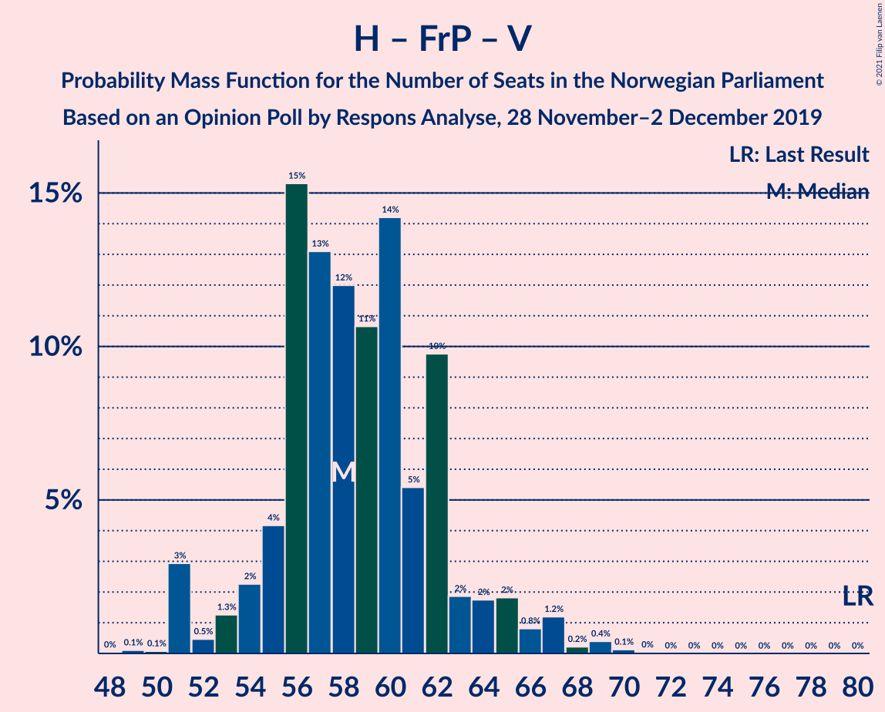

| Number of Seats | Probability | Accumulated | Special Marks |
|:---------------:|:-----------:|:-----------:|:-------------:|
| 48 | 0.1% | 100% |  |
| 49 | 0% | 99.9% |  |
| 50 | 0.1% | 99.9% |  |
| 51 | 1.0% | 99.8% |  |
| 52 | 0.6% | 98.8% |  |
| 53 | 2% | 98% |  |
| 54 | 4% | 96% |  |
| 55 | 2% | 92% |  |
| 56 | 11% | 91% |  |
| 57 | 19% | 79% |  |
| 58 | 4% | 61% | Median |
| 59 | 5% | 57% |  |
| 60 | 9% | 52% |  |
| 61 | 5% | 43% |  |
| 62 | 31% | 38% |  |
| 63 | 2% | 7% |  |
| 64 | 2% | 5% |  |
| 65 | 1.3% | 3% |  |
| 66 | 0.7% | 2% |  |
| 67 | 0.7% | 1.2% |  |
| 68 | 0.2% | 0.6% |  |
| 69 | 0.3% | 0.4% |  |
| 70 | 0.1% | 0.1% |  |
| 71 | 0% | 0% |  |
| 72 | 0% | 0% |  |
| 73 | 0% | 0% |  |
| 74 | 0% | 0% |  |
| 75 | 0% | 0% |  |
| 76 | 0% | 0% |  |
| 77 | 0% | 0% |  |
| 78 | 0% | 0% |  |
| 79 | 0% | 0% |  |
| 80 | 0% | 0% | Last Result |

### Høyre – Fremskrittspartiet

| Number of Seats | Probability | Accumulated | Special Marks |
|:---------------:|:-----------:|:-----------:|:-------------:|
| 46 | 0.1% | 100% |  |
| 47 | 0.1% | 99.9% |  |
| 48 | 0.1% | 99.8% |  |
| 49 | 1.3% | 99.7% |  |
| 50 | 2% | 98% |  |
| 51 | 3% | 97% |  |
| 52 | 7% | 94% |  |
| 53 | 3% | 87% |  |
| 54 | 12% | 84% |  |
| 55 | 20% | 72% |  |
| 56 | 15% | 52% | Median |
| 57 | 6% | 37% |  |
| 58 | 7% | 31% |  |
| 59 | 5% | 25% |  |
| 60 | 5% | 20% |  |
| 61 | 13% | 15% |  |
| 62 | 0.5% | 2% |  |
| 63 | 0.6% | 2% |  |
| 64 | 0.3% | 1.0% |  |
| 65 | 0.5% | 0.8% |  |
| 66 | 0.2% | 0.3% |  |
| 67 | 0.1% | 0.1% |  |
| 68 | 0% | 0% |  |
| 69 | 0% | 0% |  |
| 70 | 0% | 0% |  |
| 71 | 0% | 0% |  |
| 72 | 0% | 0% | Last Result |

### Arbeiderpartiet – Sosialistisk Venstreparti

| Number of Seats | Probability | Accumulated | Special Marks |
|:---------------:|:-----------:|:-----------:|:-------------:|
| 44 | 0% | 100% |  |
| 45 | 0.2% | 99.9% |  |
| 46 | 0.2% | 99.7% |  |
| 47 | 1.2% | 99.5% |  |
| 48 | 14% | 98% |  |
| 49 | 4% | 84% |  |
| 50 | 3% | 80% |  |
| 51 | 7% | 77% | Median |
| 52 | 33% | 70% |  |
| 53 | 6% | 36% |  |
| 54 | 12% | 30% |  |
| 55 | 10% | 18% |  |
| 56 | 3% | 7% |  |
| 57 | 0.8% | 4% |  |
| 58 | 3% | 3% |  |
| 59 | 0.5% | 0.6% |  |
| 60 | 0% | 0.1% | Last Result |
| 61 | 0% | 0.1% |  |
| 62 | 0% | 0% |  |

### Høyre – Kristelig Folkeparti – Venstre

| Number of Seats | Probability | Accumulated | Special Marks |
|:---------------:|:-----------:|:-----------:|:-------------:|
| 36 | 0.1% | 100% |  |
| 37 | 0.1% | 99.9% |  |
| 38 | 0.4% | 99.9% |  |
| 39 | 1.1% | 99.4% |  |
| 40 | 0.5% | 98% |  |
| 41 | 4% | 98% |  |
| 42 | 2% | 94% |  |
| 43 | 12% | 92% |  |
| 44 | 4% | 80% |  |
| 45 | 16% | 76% |  |
| 46 | 19% | 60% |  |
| 47 | 10% | 40% | Median |
| 48 | 7% | 30% |  |
| 49 | 3% | 24% |  |
| 50 | 2% | 21% |  |
| 51 | 2% | 19% |  |
| 52 | 15% | 17% |  |
| 53 | 1.4% | 2% |  |
| 54 | 0.2% | 0.6% |  |
| 55 | 0.3% | 0.4% |  |
| 56 | 0% | 0.1% |  |
| 57 | 0% | 0.1% |  |
| 58 | 0% | 0% |  |
| 59 | 0% | 0% |  |
| 60 | 0% | 0% |  |
| 61 | 0% | 0% | Last Result |

### Senterpartiet – Kristelig Folkeparti – Venstre

| Number of Seats | Probability | Accumulated | Special Marks |
|:---------------:|:-----------:|:-----------:|:-------------:|
| 30 | 0.1% | 100% |  |
| 31 | 2% | 99.9% |  |
| 32 | 0.6% | 98% |  |
| 33 | 0.2% | 97% |  |
| 34 | 1.1% | 97% |  |
| 35 | 0.5% | 96% | Last Result |
| 36 | 13% | 95% |  |
| 37 | 1.4% | 82% |  |
| 38 | 3% | 80% |  |
| 39 | 3% | 77% |  |
| 40 | 1.3% | 74% |  |
| 41 | 2% | 73% |  |
| 42 | 13% | 71% |  |
| 43 | 19% | 58% | Median |
| 44 | 14% | 39% |  |
| 45 | 4% | 25% |  |
| 46 | 16% | 21% |  |
| 47 | 2% | 5% |  |
| 48 | 1.5% | 3% |  |
| 49 | 0.9% | 2% |  |
| 50 | 0.6% | 1.0% |  |
| 51 | 0.1% | 0.4% |  |
| 52 | 0.1% | 0.3% |  |
| 53 | 0.2% | 0.2% |  |
| 54 | 0% | 0% |  |

## Technical Information

### Opinion Poll

+ **Polling firm:** Respons Analyse
+ **Commissioner(s):** —
+ **Fieldwork period:** 28 November–2 December 2019

### Calculations

+ **Sample size:** 1000
+ **Simulations done:** 131,072
+ **Error estimate:** 1.91%

