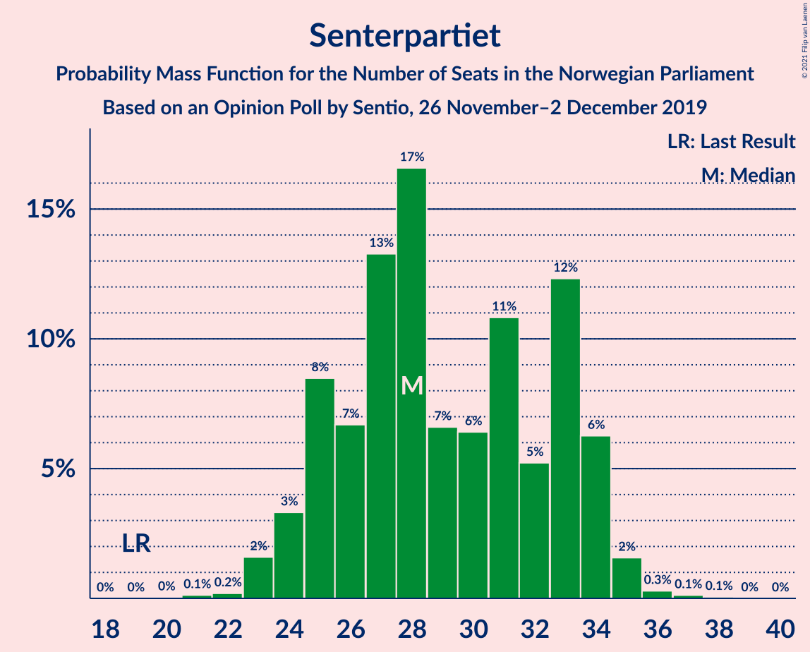
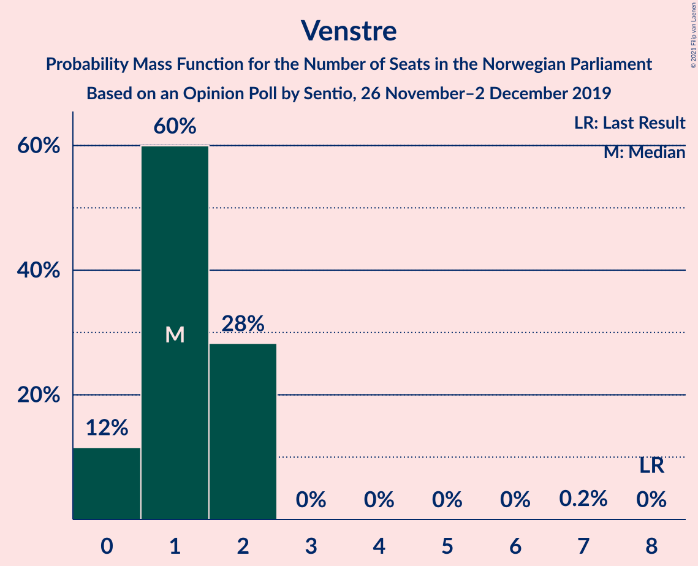
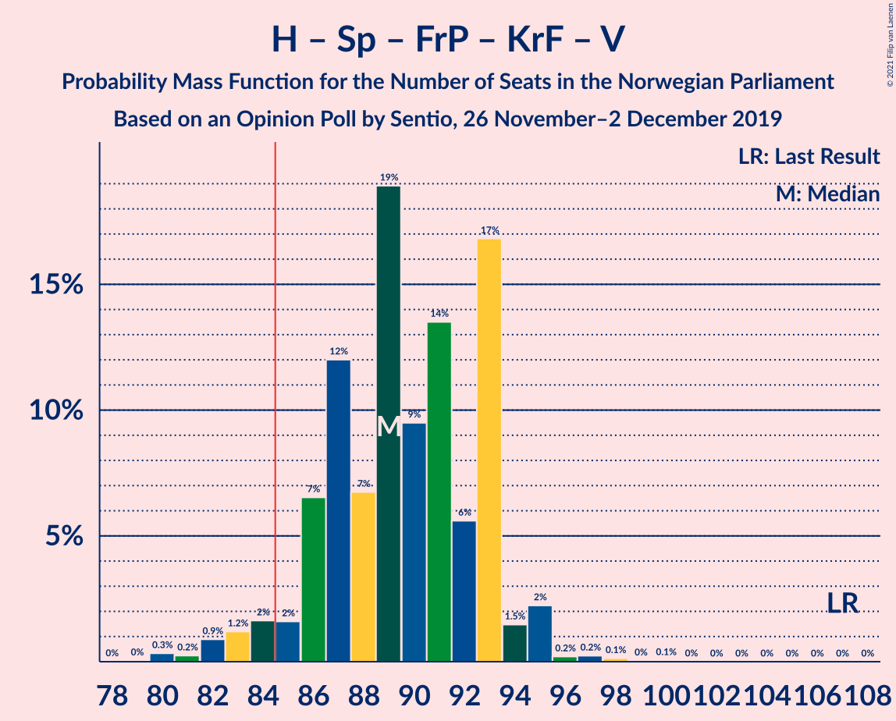
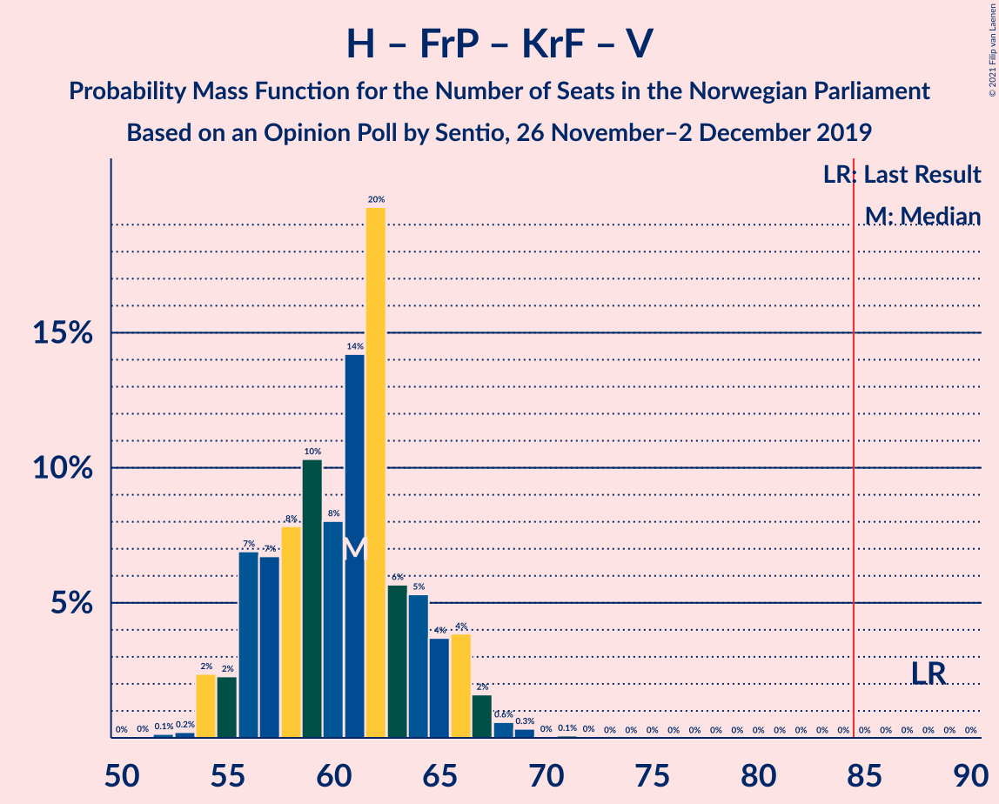
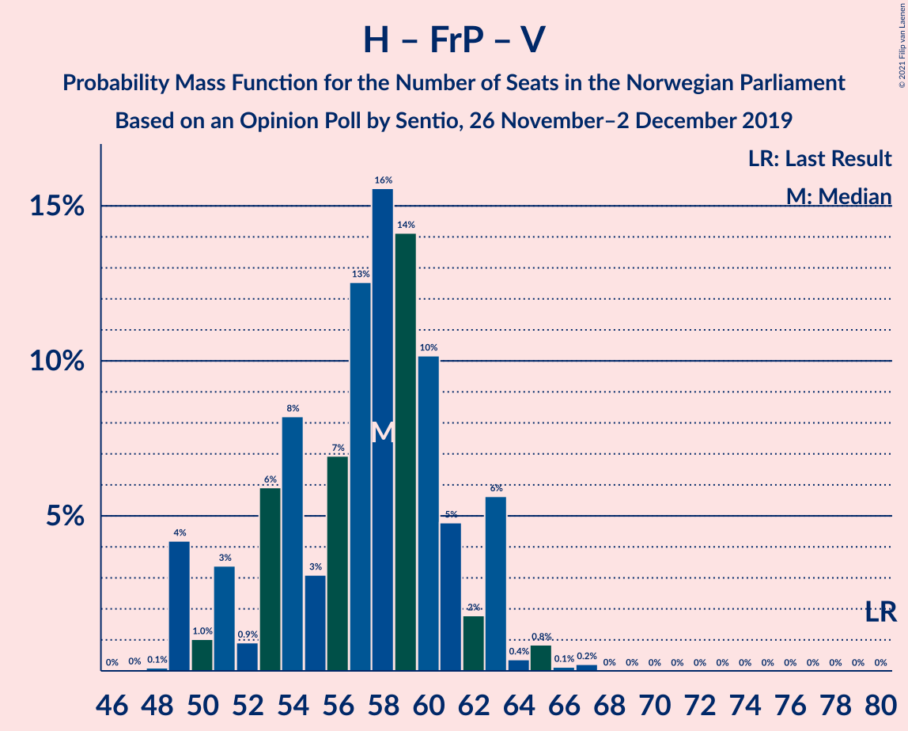
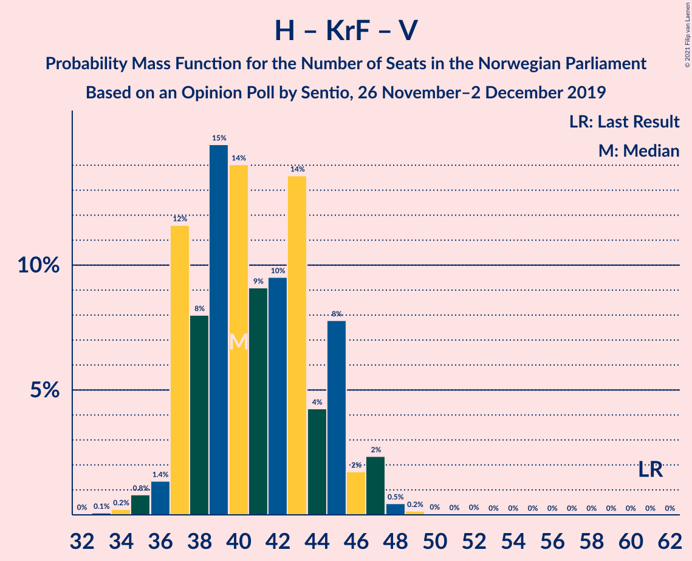
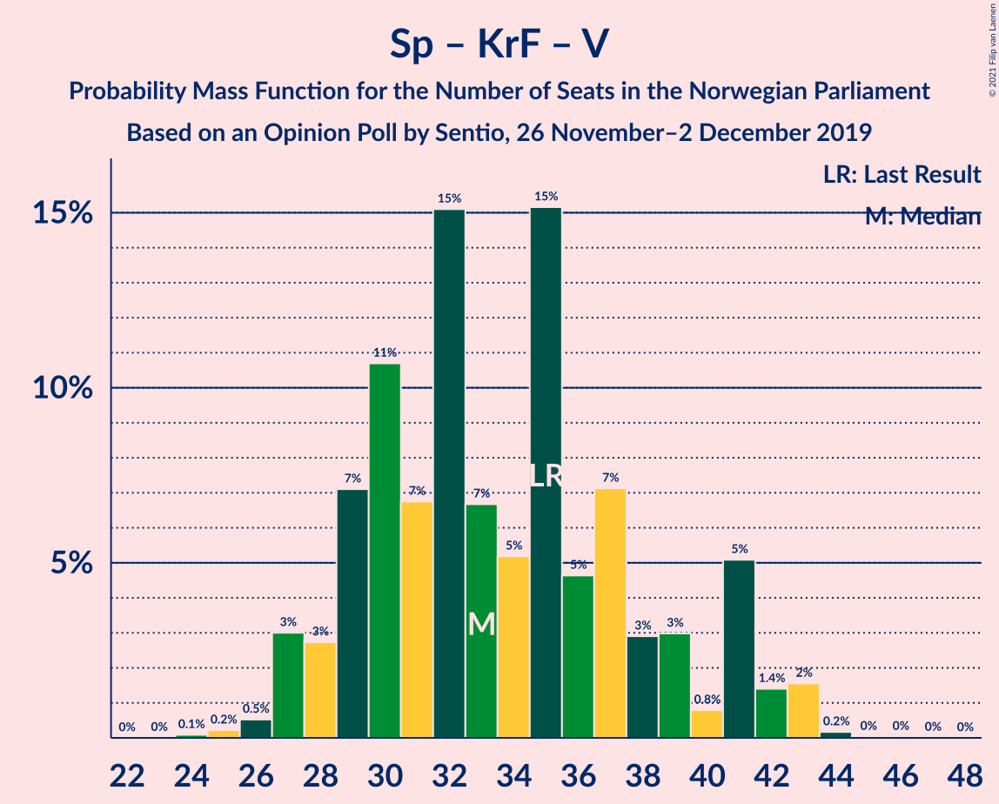

# Opinion Poll by Sentio, 26 November–2 December 2019

<a href="#voting-intentions">Voting Intentions</a> | <a href="#seats">Seats</a> | <a href="#coalitions">Coalitions</a> | <a href="#technical-information">Technical Information</a>

## Voting Intentions

### Confidence Intervals

| Party | Last Result | Poll Result | 80% Confidence Interval | 90% Confidence Interval | 95% Confidence Interval | 99% Confidence Interval |
|:-----:|:-----------:|:-----------:|:-----------------------:|:-----------------------:|:-----------------------:|:-----------------------:|
| Arbeiderpartiet | 27.4% | 24.2% | 22.5–26.0% |22.1–26.5% |21.6–27.0% |20.9–27.8% |
| Høyre | 25.0% | 20.8% | 19.2–22.5% |18.8–23.0% |18.4–23.4% |17.7–24.3% |
| Senterpartiet | 10.3% | 15.6% | 14.2–17.2% |13.8–17.6% |13.5–18.0% |12.8–18.8% |
| Fremskrittspartiet | 15.2% | 11.1% | 9.9–12.5% |9.6–12.9% |9.3–13.2% |8.7–13.9% |
| Sosialistisk Venstreparti | 6.0% | 8.3% | 7.3–9.5% |7.0–9.9% |6.7–10.2% |6.3–10.8% |
| Miljøpartiet De Grønne | 3.2% | 6.9% | 6.0–8.0% |5.7–8.4% |5.5–8.7% |5.1–9.2% |
| Rødt | 2.4% | 5.6% | 4.8–6.6% |4.5–7.0% |4.3–7.2% |4.0–7.7% |
| Kristelig Folkeparti | 4.2% | 3.5% | 2.9–4.4% |2.7–4.6% |2.5–4.8% |2.2–5.3% |
| Venstre | 4.4% | 2.4% | 1.9–3.2% |1.7–3.4% |1.6–3.6% |1.4–3.9% |

*Note:* The poll result column reflects the actual value used in the calculations. Published results may vary slightly, and in addition be rounded to fewer digits.

## Seats

### Confidence Intervals

| Party | Last Result | Median | 80% Confidence Interval | 90% Confidence Interval | 95% Confidence Interval | 99% Confidence Interval |
|:-----:|:-----------:|:------:|:-----------------------:|:-----------------------:|:-----------------------:|:-----------------------:|
| <a href="#arbeiderpartiet">Arbeiderpartiet</a> | 49 | 44 | 40–45 |39–47 |39–47 |38–50 |
| <a href="#høyre">Høyre</a> | 45 | 36 | 33–39 |31–41 |31–41 |31–42 |
| <a href="#senterpartiet">Senterpartiet</a> | 19 | 28 | 25–34 |24–34 |24–34 |22–36 |
| <a href="#fremskrittspartiet">Fremskrittspartiet</a> | 27 | 20 | 16–22 |16–23 |16–23 |14–25 |
| <a href="#sosialistisk-venstreparti">Sosialistisk Venstreparti</a> | 11 | 14 | 12–17 |12–17 |11–18 |10–19 |
| <a href="#miljøpartiet-de-grønne">Miljøpartiet De Grønne</a> | 1 | 13 | 11–14 |10–15 |10–15 |9–16 |
| <a href="#rødt">Rødt</a> | 1 | 10 | 9–12 |8–12 |7–13 |2–14 |
| <a href="#kristelig-folkeparti">Kristelig Folkeparti</a> | 8 | 3 | 1–7 |1–7 |0–8 |0–9 |
| <a href="#venstre">Venstre</a> | 8 | 1 | 0–2 |0–2 |0–2 |0–2 |

### Arbeiderpartiet

*For a full overview of the results for this party, see the [Arbeiderpartiet](party-arbeiderpartiet.html) page.*

| Number of Seats | Probability | Accumulated | Special Marks |
|:---------------:|:-----------:|:-----------:|:-------------:|
| 36 | 0.1% | 100% |  |
| 37 | 0.2% | 99.9% |  |
| 38 | 0.6% | 99.8% |  |
| 39 | 8% | 99.2% |  |
| 40 | 2% | 92% |  |
| 41 | 8% | 90% |  |
| 42 | 13% | 82% |  |
| 43 | 13% | 69% |  |
| 44 | 19% | 55% | Median |
| 45 | 28% | 36% |  |
| 46 | 3% | 8% |  |
| 47 | 4% | 6% |  |
| 48 | 0.7% | 2% |  |
| 49 | 0.7% | 1.2% | Last Result |
| 50 | 0.2% | 0.5% |  |
| 51 | 0.1% | 0.3% |  |
| 52 | 0.1% | 0.2% |  |
| 53 | 0% | 0.1% |  |
| 54 | 0% | 0% |  |

### Høyre

*For a full overview of the results for this party, see the [Høyre](party-høyre.html) page.*

| Number of Seats | Probability | Accumulated | Special Marks |
|:---------------:|:-----------:|:-----------:|:-------------:|
| 29 | 0.1% | 100% |  |
| 30 | 0.3% | 99.9% |  |
| 31 | 5% | 99.7% |  |
| 32 | 0.9% | 95% |  |
| 33 | 6% | 94% |  |
| 34 | 3% | 88% |  |
| 35 | 9% | 84% |  |
| 36 | 36% | 75% | Median |
| 37 | 10% | 39% |  |
| 38 | 2% | 30% |  |
| 39 | 18% | 28% |  |
| 40 | 1.4% | 9% |  |
| 41 | 6% | 8% |  |
| 42 | 1.4% | 2% |  |
| 43 | 0.1% | 0.3% |  |
| 44 | 0.1% | 0.2% |  |
| 45 | 0.1% | 0.1% | Last Result |
| 46 | 0% | 0% |  |

### Senterpartiet

*For a full overview of the results for this party, see the [Senterpartiet](party-senterpartiet.html) page.*

| Number of Seats | Probability | Accumulated | Special Marks |
|:---------------:|:-----------:|:-----------:|:-------------:|
| 19 | 0% | 100% | Last Result |
| 20 | 0.2% | 100% |  |
| 21 | 0.3% | 99.8% |  |
| 22 | 0.2% | 99.6% |  |
| 23 | 1.2% | 99.4% |  |
| 24 | 5% | 98% |  |
| 25 | 15% | 93% |  |
| 26 | 5% | 78% |  |
| 27 | 13% | 73% |  |
| 28 | 18% | 61% | Median |
| 29 | 11% | 43% |  |
| 30 | 3% | 31% |  |
| 31 | 5% | 29% |  |
| 32 | 3% | 24% |  |
| 33 | 10% | 21% |  |
| 34 | 10% | 11% |  |
| 35 | 0.4% | 1.2% |  |
| 36 | 0.5% | 0.7% |  |
| 37 | 0.2% | 0.2% |  |
| 38 | 0% | 0% |  |

### Fremskrittspartiet

*For a full overview of the results for this party, see the [Fremskrittspartiet](party-fremskrittspartiet.html) page.*

| Number of Seats | Probability | Accumulated | Special Marks |
|:---------------:|:-----------:|:-----------:|:-------------:|
| 14 | 0.5% | 100% |  |
| 15 | 0.8% | 99.5% |  |
| 16 | 19% | 98.7% |  |
| 17 | 11% | 80% |  |
| 18 | 8% | 69% |  |
| 19 | 8% | 61% |  |
| 20 | 16% | 53% | Median |
| 21 | 10% | 36% |  |
| 22 | 19% | 27% |  |
| 23 | 6% | 8% |  |
| 24 | 2% | 2% |  |
| 25 | 0.3% | 0.6% |  |
| 26 | 0.3% | 0.3% |  |
| 27 | 0% | 0% | Last Result |

### Sosialistisk Venstreparti

*For a full overview of the results for this party, see the [Sosialistisk Venstreparti](party-sosialistiskvenstreparti.html) page.*

| Number of Seats | Probability | Accumulated | Special Marks |
|:---------------:|:-----------:|:-----------:|:-------------:|
| 10 | 0.5% | 100% |  |
| 11 | 3% | 99.5% | Last Result |
| 12 | 7% | 97% |  |
| 13 | 7% | 90% |  |
| 14 | 44% | 82% | Median |
| 15 | 16% | 38% |  |
| 16 | 9% | 22% |  |
| 17 | 10% | 13% |  |
| 18 | 3% | 4% |  |
| 19 | 0.7% | 0.9% |  |
| 20 | 0.2% | 0.2% |  |
| 21 | 0% | 0% |  |

### Miljøpartiet De Grønne

*For a full overview of the results for this party, see the [Miljøpartiet De Grønne](party-miljøpartietdegrønne.html) page.*

| Number of Seats | Probability | Accumulated | Special Marks |
|:---------------:|:-----------:|:-----------:|:-------------:|
| 1 | 0% | 100% | Last Result |
| 2 | 0% | 100% |  |
| 3 | 0% | 100% |  |
| 4 | 0% | 100% |  |
| 5 | 0% | 100% |  |
| 6 | 0% | 100% |  |
| 7 | 0% | 100% |  |
| 8 | 0.1% | 100% |  |
| 9 | 1.5% | 99.9% |  |
| 10 | 5% | 98% |  |
| 11 | 22% | 93% |  |
| 12 | 19% | 71% |  |
| 13 | 27% | 52% | Median |
| 14 | 19% | 26% |  |
| 15 | 6% | 6% |  |
| 16 | 0.3% | 0.5% |  |
| 17 | 0.2% | 0.3% |  |
| 18 | 0% | 0% |  |

### Rødt

*For a full overview of the results for this party, see the [Rødt](party-rødt.html) page.*

| Number of Seats | Probability | Accumulated | Special Marks |
|:---------------:|:-----------:|:-----------:|:-------------:|
| 1 | 0% | 100% | Last Result |
| 2 | 0.6% | 100% |  |
| 3 | 0% | 99.4% |  |
| 4 | 0% | 99.4% |  |
| 5 | 0% | 99.4% |  |
| 6 | 0% | 99.4% |  |
| 7 | 2% | 99.4% |  |
| 8 | 4% | 97% |  |
| 9 | 42% | 94% |  |
| 10 | 30% | 52% | Median |
| 11 | 8% | 22% |  |
| 12 | 11% | 14% |  |
| 13 | 2% | 3% |  |
| 14 | 0.9% | 1.0% |  |
| 15 | 0.1% | 0.1% |  |
| 16 | 0% | 0% |  |

### Kristelig Folkeparti

*For a full overview of the results for this party, see the [Kristelig Folkeparti](party-kristeligfolkeparti.html) page.*

| Number of Seats | Probability | Accumulated | Special Marks |
|:---------------:|:-----------:|:-----------:|:-------------:|
| 0 | 3% | 100% |  |
| 1 | 21% | 97% |  |
| 2 | 23% | 76% |  |
| 3 | 32% | 53% | Median |
| 4 | 0% | 22% |  |
| 5 | 0% | 22% |  |
| 6 | 0% | 22% |  |
| 7 | 19% | 22% |  |
| 8 | 2% | 3% | Last Result |
| 9 | 0.7% | 0.8% |  |
| 10 | 0.1% | 0.2% |  |
| 11 | 0% | 0% |  |

### Venstre

*For a full overview of the results for this party, see the [Venstre](party-venstre.html) page.*

| Number of Seats | Probability | Accumulated | Special Marks |
|:---------------:|:-----------:|:-----------:|:-------------:|
| 0 | 14% | 100% |  |
| 1 | 52% | 86% | Median |
| 2 | 34% | 34% |  |
| 3 | 0% | 0.3% |  |
| 4 | 0% | 0.3% |  |
| 5 | 0% | 0.3% |  |
| 6 | 0% | 0.3% |  |
| 7 | 0.3% | 0.3% |  |
| 8 | 0% | 0% | Last Result |

## Coalitions

### Confidence Intervals

| Coalition | Last Result | Median | Majority? | 80% Confidence Interval | 90% Confidence Interval | 95% Confidence Interval | 99% Confidence Interval |
|:---------:|:-----------:|:------:|:---------:|:-----------------------:|:-----------------------:|:-----------------------:|:-----------------------:|
| Arbeiderpartiet – Senterpartiet – Sosialistisk Venstreparti – Miljøpartiet De Grønne – Rødt | 81 | 108 | 100% | 105–114 | 104–115 | 102–115 | 101–116 |
| Arbeiderpartiet – Senterpartiet – Sosialistisk Venstreparti – Miljøpartiet De Grønne – Kristelig Folkeparti | 88 | 101 | 100% | 97–107 | 97–109 | 96–109 | 94–110 |
| Arbeiderpartiet – Senterpartiet – Sosialistisk Venstreparti – Miljøpartiet De Grønne | 80 | 98 | 100% | 96–103 | 94–104 | 92–105 | 91–106 |
| Arbeiderpartiet – Senterpartiet – Sosialistisk Venstreparti – Rødt | 80 | 96 | 100% | 91–102 | 91–104 | 90–104 | 88–105 |
| Arbeiderpartiet – Senterpartiet – Miljøpartiet De Grønne – Kristelig Folkeparti | 77 | 88 | 72% | 83–92 | 83–95 | 82–95 | 79–97 |
| Høyre – Senterpartiet – Fremskrittspartiet – Kristelig Folkeparti – Venstre | 107 | 89 | 92% | 86–91 | 84–93 | 83–94 | 81–97 |
| Arbeiderpartiet – Senterpartiet – Sosialistisk Venstreparti | 79 | 87 | 60% | 82–92 | 82–92 | 81–93 | 78–95 |
| Arbeiderpartiet – Senterpartiet – Kristelig Folkeparti | 76 | 75 | 0.9% | 69–80 | 69–82 | 69–82 | 67–85 |
| Høyre – Fremskrittspartiet – Miljøpartiet De Grønne – Kristelig Folkeparti – Venstre | 89 | 73 | 0% | 67–78 | 65–78 | 65–79 | 64–81 |
| Arbeiderpartiet – Senterpartiet | 68 | 72 | 0% | 68–77 | 67–78 | 66–78 | 64–81 |
| Høyre – Fremskrittspartiet – Kristelig Folkeparti – Venstre | 88 | 61 | 0% | 55–64 | 54–65 | 54–67 | 53–68 |
| Arbeiderpartiet – Sosialistisk Venstreparti | 60 | 58 | 0% | 54–61 | 54–62 | 54–64 | 52–65 |
| Høyre – Fremskrittspartiet – Venstre | 80 | 58 | 0% | 53–62 | 51–63 | 51–63 | 50–65 |
| Høyre – Fremskrittspartiet | 72 | 56 | 0% | 52–61 | 49–62 | 49–62 | 48–64 |
| Høyre – Kristelig Folkeparti – Venstre | 61 | 41 | 0% | 37–45 | 37–45 | 36–45 | 34–48 |
| Senterpartiet – Kristelig Folkeparti – Venstre | 35 | 32 | 0% | 28–39 | 27–42 | 27–42 | 25–43 |

### Arbeiderpartiet – Senterpartiet – Sosialistisk Venstreparti – Miljøpartiet De Grønne – Rødt

| Number of Seats | Probability | Accumulated | Special Marks |
|:---------------:|:-----------:|:-----------:|:-------------:|
| 81 | 0% | 100% | Last Result |
| 82 | 0% | 100% |  |
| 83 | 0% | 100% |  |
| 84 | 0% | 100% |  |
| 85 | 0% | 100% | Majority |
| 86 | 0% | 100% |  |
| 87 | 0% | 100% |  |
| 88 | 0% | 100% |  |
| 89 | 0% | 100% |  |
| 90 | 0% | 100% |  |
| 91 | 0% | 100% |  |
| 92 | 0% | 100% |  |
| 93 | 0% | 100% |  |
| 94 | 0% | 100% |  |
| 95 | 0% | 100% |  |
| 96 | 0% | 100% |  |
| 97 | 0% | 100% |  |
| 98 | 0.1% | 100% |  |
| 99 | 0% | 99.9% |  |
| 100 | 0% | 99.8% |  |
| 101 | 0.6% | 99.8% |  |
| 102 | 3% | 99.2% |  |
| 103 | 0.4% | 96% |  |
| 104 | 3% | 95% |  |
| 105 | 6% | 92% |  |
| 106 | 6% | 86% |  |
| 107 | 20% | 80% |  |
| 108 | 16% | 60% |  |
| 109 | 7% | 44% | Median |
| 110 | 4% | 37% |  |
| 111 | 10% | 33% |  |
| 112 | 11% | 23% |  |
| 113 | 1.3% | 12% |  |
| 114 | 4% | 11% |  |
| 115 | 6% | 6% |  |
| 116 | 0.2% | 0.6% |  |
| 117 | 0.3% | 0.4% |  |
| 118 | 0.1% | 0.1% |  |
| 119 | 0% | 0% |  |

### Arbeiderpartiet – Senterpartiet – Sosialistisk Venstreparti – Miljøpartiet De Grønne – Kristelig Folkeparti

| Number of Seats | Probability | Accumulated | Special Marks |
|:---------------:|:-----------:|:-----------:|:-------------:|
| 88 | 0% | 100% | Last Result |
| 89 | 0% | 100% |  |
| 90 | 0% | 100% |  |
| 91 | 0% | 100% |  |
| 92 | 0.1% | 100% |  |
| 93 | 0% | 99.8% |  |
| 94 | 0.5% | 99.8% |  |
| 95 | 2% | 99.4% |  |
| 96 | 0.5% | 98% |  |
| 97 | 7% | 97% |  |
| 98 | 5% | 90% |  |
| 99 | 8% | 85% |  |
| 100 | 25% | 77% |  |
| 101 | 3% | 52% |  |
| 102 | 4% | 49% | Median |
| 103 | 6% | 45% |  |
| 104 | 7% | 38% |  |
| 105 | 6% | 31% |  |
| 106 | 14% | 26% |  |
| 107 | 4% | 11% |  |
| 108 | 1.5% | 7% |  |
| 109 | 5% | 6% |  |
| 110 | 0.4% | 0.8% |  |
| 111 | 0.1% | 0.3% |  |
| 112 | 0.1% | 0.2% |  |
| 113 | 0% | 0.1% |  |
| 114 | 0% | 0.1% |  |
| 115 | 0% | 0% |  |

### Arbeiderpartiet – Senterpartiet – Sosialistisk Venstreparti – Miljøpartiet De Grønne

| Number of Seats | Probability | Accumulated | Special Marks |
|:---------------:|:-----------:|:-----------:|:-------------:|
| 80 | 0% | 100% | Last Result |
| 81 | 0% | 100% |  |
| 82 | 0% | 100% |  |
| 83 | 0% | 100% |  |
| 84 | 0% | 100% |  |
| 85 | 0% | 100% | Majority |
| 86 | 0% | 100% |  |
| 87 | 0% | 100% |  |
| 88 | 0.1% | 100% |  |
| 89 | 0.1% | 99.9% |  |
| 90 | 0.1% | 99.8% |  |
| 91 | 2% | 99.7% |  |
| 92 | 0.9% | 98% |  |
| 93 | 2% | 97% |  |
| 94 | 0.8% | 95% |  |
| 95 | 2% | 94% |  |
| 96 | 6% | 92% |  |
| 97 | 26% | 86% |  |
| 98 | 10% | 59% |  |
| 99 | 12% | 49% | Median |
| 100 | 5% | 38% |  |
| 101 | 6% | 32% |  |
| 102 | 11% | 27% |  |
| 103 | 10% | 15% |  |
| 104 | 2% | 6% |  |
| 105 | 3% | 4% |  |
| 106 | 0.4% | 0.8% |  |
| 107 | 0.1% | 0.4% |  |
| 108 | 0.3% | 0.4% |  |
| 109 | 0.1% | 0.1% |  |
| 110 | 0% | 0% |  |

### Arbeiderpartiet – Senterpartiet – Sosialistisk Venstreparti – Rødt

| Number of Seats | Probability | Accumulated | Special Marks |
|:---------------:|:-----------:|:-----------:|:-------------:|
| 80 | 0% | 100% | Last Result |
| 81 | 0% | 100% |  |
| 82 | 0% | 100% |  |
| 83 | 0% | 100% |  |
| 84 | 0% | 100% |  |
| 85 | 0% | 100% | Majority |
| 86 | 0% | 100% |  |
| 87 | 0.3% | 99.9% |  |
| 88 | 0.2% | 99.7% |  |
| 89 | 0.7% | 99.4% |  |
| 90 | 2% | 98.7% |  |
| 91 | 7% | 97% |  |
| 92 | 1.4% | 90% |  |
| 93 | 11% | 88% |  |
| 94 | 19% | 77% |  |
| 95 | 3% | 58% |  |
| 96 | 13% | 55% | Median |
| 97 | 6% | 42% |  |
| 98 | 13% | 36% |  |
| 99 | 1.2% | 23% |  |
| 100 | 5% | 21% |  |
| 101 | 6% | 17% |  |
| 102 | 4% | 10% |  |
| 103 | 0.4% | 7% |  |
| 104 | 6% | 7% |  |
| 105 | 0.1% | 0.5% |  |
| 106 | 0.2% | 0.4% |  |
| 107 | 0.2% | 0.2% |  |
| 108 | 0% | 0% |  |

### Arbeiderpartiet – Senterpartiet – Miljøpartiet De Grønne – Kristelig Folkeparti

| Number of Seats | Probability | Accumulated | Special Marks |
|:---------------:|:-----------:|:-----------:|:-------------:|
| 77 | 0% | 100% | Last Result |
| 78 | 0.1% | 100% |  |
| 79 | 0.4% | 99.9% |  |
| 80 | 0.3% | 99.4% |  |
| 81 | 1.4% | 99.1% |  |
| 82 | 0.9% | 98% |  |
| 83 | 12% | 97% |  |
| 84 | 12% | 85% |  |
| 85 | 5% | 72% | Majority |
| 86 | 13% | 67% |  |
| 87 | 2% | 54% |  |
| 88 | 11% | 51% | Median |
| 89 | 5% | 40% |  |
| 90 | 11% | 36% |  |
| 91 | 5% | 25% |  |
| 92 | 11% | 20% |  |
| 93 | 2% | 9% |  |
| 94 | 1.0% | 7% |  |
| 95 | 5% | 6% |  |
| 96 | 0.2% | 1.0% |  |
| 97 | 0.6% | 0.7% |  |
| 98 | 0% | 0.1% |  |
| 99 | 0% | 0.1% |  |
| 100 | 0% | 0.1% |  |
| 101 | 0% | 0.1% |  |
| 102 | 0% | 0% |  |

### Høyre – Senterpartiet – Fremskrittspartiet – Kristelig Folkeparti – Venstre

| Number of Seats | Probability | Accumulated | Special Marks |
|:---------------:|:-----------:|:-----------:|:-------------:|
| 79 | 0.1% | 100% |  |
| 80 | 0% | 99.8% |  |
| 81 | 0.3% | 99.8% |  |
| 82 | 1.2% | 99.5% |  |
| 83 | 1.2% | 98% |  |
| 84 | 6% | 97% |  |
| 85 | 1.3% | 92% | Majority |
| 86 | 9% | 90% |  |
| 87 | 15% | 82% |  |
| 88 | 9% | 67% | Median |
| 89 | 15% | 58% |  |
| 90 | 5% | 43% |  |
| 91 | 28% | 37% |  |
| 92 | 1.1% | 9% |  |
| 93 | 5% | 8% |  |
| 94 | 2% | 3% |  |
| 95 | 0.8% | 2% |  |
| 96 | 0.4% | 1.1% |  |
| 97 | 0.5% | 0.7% |  |
| 98 | 0.1% | 0.2% |  |
| 99 | 0% | 0.1% |  |
| 100 | 0% | 0% |  |
| 101 | 0% | 0% |  |
| 102 | 0% | 0% |  |
| 103 | 0% | 0% |  |
| 104 | 0% | 0% |  |
| 105 | 0% | 0% |  |
| 106 | 0% | 0% |  |
| 107 | 0% | 0% | Last Result |

### Arbeiderpartiet – Senterpartiet – Sosialistisk Venstreparti

| Number of Seats | Probability | Accumulated | Special Marks |
|:---------------:|:-----------:|:-----------:|:-------------:|
| 77 | 0.4% | 100% |  |
| 78 | 0.4% | 99.6% |  |
| 79 | 0.4% | 99.2% | Last Result |
| 80 | 1.2% | 98.8% |  |
| 81 | 2% | 98% |  |
| 82 | 7% | 96% |  |
| 83 | 12% | 89% |  |
| 84 | 17% | 77% |  |
| 85 | 2% | 60% | Majority |
| 86 | 6% | 58% | Median |
| 87 | 17% | 52% |  |
| 88 | 5% | 35% |  |
| 89 | 9% | 29% |  |
| 90 | 1.1% | 20% |  |
| 91 | 6% | 19% |  |
| 92 | 9% | 13% |  |
| 93 | 2% | 4% |  |
| 94 | 0.6% | 1.3% |  |
| 95 | 0.3% | 0.7% |  |
| 96 | 0.1% | 0.4% |  |
| 97 | 0.1% | 0.3% |  |
| 98 | 0.2% | 0.2% |  |
| 99 | 0% | 0% |  |

### Arbeiderpartiet – Senterpartiet – Kristelig Folkeparti

| Number of Seats | Probability | Accumulated | Special Marks |
|:---------------:|:-----------:|:-----------:|:-------------:|
| 65 | 0.2% | 100% |  |
| 66 | 0.1% | 99.7% |  |
| 67 | 0.3% | 99.7% |  |
| 68 | 0.7% | 99.3% |  |
| 69 | 10% | 98.6% |  |
| 70 | 8% | 89% |  |
| 71 | 0.6% | 81% |  |
| 72 | 10% | 80% |  |
| 73 | 13% | 71% |  |
| 74 | 6% | 57% |  |
| 75 | 6% | 51% | Median |
| 76 | 4% | 45% | Last Result |
| 77 | 6% | 40% |  |
| 78 | 4% | 34% |  |
| 79 | 6% | 30% |  |
| 80 | 16% | 24% |  |
| 81 | 0.7% | 8% |  |
| 82 | 5% | 7% |  |
| 83 | 0.8% | 2% |  |
| 84 | 0.2% | 1.1% |  |
| 85 | 0.6% | 0.9% | Majority |
| 86 | 0.2% | 0.3% |  |
| 87 | 0.1% | 0.1% |  |
| 88 | 0.1% | 0.1% |  |
| 89 | 0% | 0% |  |

### Høyre – Fremskrittspartiet – Miljøpartiet De Grønne – Kristelig Folkeparti – Venstre

| Number of Seats | Probability | Accumulated | Special Marks |
|:---------------:|:-----------:|:-----------:|:-------------:|
| 62 | 0.2% | 100% |  |
| 63 | 0.2% | 99.8% |  |
| 64 | 0.1% | 99.6% |  |
| 65 | 6% | 99.5% |  |
| 66 | 0.4% | 93% |  |
| 67 | 4% | 93% |  |
| 68 | 6% | 90% |  |
| 69 | 5% | 83% |  |
| 70 | 1.2% | 79% |  |
| 71 | 13% | 77% |  |
| 72 | 6% | 64% |  |
| 73 | 13% | 58% | Median |
| 74 | 3% | 45% |  |
| 75 | 19% | 42% |  |
| 76 | 11% | 23% |  |
| 77 | 1.4% | 12% |  |
| 78 | 7% | 10% |  |
| 79 | 2% | 3% |  |
| 80 | 0.7% | 1.3% |  |
| 81 | 0.2% | 0.6% |  |
| 82 | 0.3% | 0.3% |  |
| 83 | 0% | 0.1% |  |
| 84 | 0% | 0% |  |
| 85 | 0% | 0% | Majority |
| 86 | 0% | 0% |  |
| 87 | 0% | 0% |  |
| 88 | 0% | 0% |  |
| 89 | 0% | 0% | Last Result |

### Arbeiderpartiet – Senterpartiet

| Number of Seats | Probability | Accumulated | Special Marks |
|:---------------:|:-----------:|:-----------:|:-------------:|
| 62 | 0.1% | 100% |  |
| 63 | 0.3% | 99.9% |  |
| 64 | 0.2% | 99.7% |  |
| 65 | 2% | 99.5% |  |
| 66 | 0.8% | 98% |  |
| 67 | 5% | 97% |  |
| 68 | 12% | 92% | Last Result |
| 69 | 2% | 80% |  |
| 70 | 20% | 78% |  |
| 71 | 6% | 59% |  |
| 72 | 7% | 53% | Median |
| 73 | 15% | 46% |  |
| 74 | 6% | 31% |  |
| 75 | 9% | 25% |  |
| 76 | 1.2% | 16% |  |
| 77 | 7% | 15% |  |
| 78 | 6% | 8% |  |
| 79 | 0.6% | 1.4% |  |
| 80 | 0.2% | 0.8% |  |
| 81 | 0.3% | 0.6% |  |
| 82 | 0.2% | 0.3% |  |
| 83 | 0.1% | 0.1% |  |
| 84 | 0% | 0% |  |

### Høyre – Fremskrittspartiet – Kristelig Folkeparti – Venstre

| Number of Seats | Probability | Accumulated | Special Marks |
|:---------------:|:-----------:|:-----------:|:-------------:|
| 51 | 0.1% | 100% |  |
| 52 | 0.3% | 99.9% |  |
| 53 | 0.2% | 99.6% |  |
| 54 | 6% | 99.4% |  |
| 55 | 4% | 94% |  |
| 56 | 1.3% | 89% |  |
| 57 | 11% | 88% |  |
| 58 | 10% | 77% |  |
| 59 | 4% | 67% |  |
| 60 | 7% | 63% | Median |
| 61 | 16% | 56% |  |
| 62 | 20% | 40% |  |
| 63 | 6% | 20% |  |
| 64 | 6% | 14% |  |
| 65 | 3% | 8% |  |
| 66 | 0.4% | 5% |  |
| 67 | 3% | 4% |  |
| 68 | 0.6% | 0.8% |  |
| 69 | 0% | 0.2% |  |
| 70 | 0% | 0.2% |  |
| 71 | 0.1% | 0.1% |  |
| 72 | 0% | 0% |  |
| 73 | 0% | 0% |  |
| 74 | 0% | 0% |  |
| 75 | 0% | 0% |  |
| 76 | 0% | 0% |  |
| 77 | 0% | 0% |  |
| 78 | 0% | 0% |  |
| 79 | 0% | 0% |  |
| 80 | 0% | 0% |  |
| 81 | 0% | 0% |  |
| 82 | 0% | 0% |  |
| 83 | 0% | 0% |  |
| 84 | 0% | 0% |  |
| 85 | 0% | 0% | Majority |
| 86 | 0% | 0% |  |
| 87 | 0% | 0% |  |
| 88 | 0% | 0% | Last Result |

### Arbeiderpartiet – Sosialistisk Venstreparti

| Number of Seats | Probability | Accumulated | Special Marks |
|:---------------:|:-----------:|:-----------:|:-------------:|
| 50 | 0.1% | 100% |  |
| 51 | 0.2% | 99.9% |  |
| 52 | 0.8% | 99.7% |  |
| 53 | 0.6% | 98.9% |  |
| 54 | 10% | 98% |  |
| 55 | 7% | 88% |  |
| 56 | 12% | 81% |  |
| 57 | 8% | 69% |  |
| 58 | 13% | 61% | Median |
| 59 | 33% | 48% |  |
| 60 | 4% | 15% | Last Result |
| 61 | 2% | 11% |  |
| 62 | 5% | 9% |  |
| 63 | 1.1% | 4% |  |
| 64 | 2% | 3% |  |
| 65 | 0.7% | 0.9% |  |
| 66 | 0% | 0.1% |  |
| 67 | 0.1% | 0.1% |  |
| 68 | 0% | 0% |  |

### Høyre – Fremskrittspartiet – Venstre

| Number of Seats | Probability | Accumulated | Special Marks |
|:---------------:|:-----------:|:-----------:|:-------------:|
| 48 | 0% | 100% |  |
| 49 | 0.3% | 99.9% |  |
| 50 | 0.8% | 99.7% |  |
| 51 | 5% | 98.8% |  |
| 52 | 1.4% | 94% |  |
| 53 | 10% | 93% |  |
| 54 | 21% | 83% |  |
| 55 | 2% | 61% |  |
| 56 | 2% | 59% |  |
| 57 | 6% | 57% | Median |
| 58 | 7% | 51% |  |
| 59 | 16% | 44% |  |
| 60 | 14% | 28% |  |
| 61 | 2% | 14% |  |
| 62 | 3% | 12% |  |
| 63 | 7% | 9% |  |
| 64 | 0.4% | 2% |  |
| 65 | 2% | 2% |  |
| 66 | 0.1% | 0.2% |  |
| 67 | 0% | 0% |  |
| 68 | 0% | 0% |  |
| 69 | 0% | 0% |  |
| 70 | 0% | 0% |  |
| 71 | 0% | 0% |  |
| 72 | 0% | 0% |  |
| 73 | 0% | 0% |  |
| 74 | 0% | 0% |  |
| 75 | 0% | 0% |  |
| 76 | 0% | 0% |  |
| 77 | 0% | 0% |  |
| 78 | 0% | 0% |  |
| 79 | 0% | 0% |  |
| 80 | 0% | 0% | Last Result |

### Høyre – Fremskrittspartiet

| Number of Seats | Probability | Accumulated | Special Marks |
|:---------------:|:-----------:|:-----------:|:-------------:|
| 47 | 0.1% | 100% |  |
| 48 | 0.5% | 99.9% |  |
| 49 | 5% | 99.4% |  |
| 50 | 1.1% | 94% |  |
| 51 | 1.0% | 93% |  |
| 52 | 19% | 92% |  |
| 53 | 10% | 73% |  |
| 54 | 4% | 63% |  |
| 55 | 5% | 59% |  |
| 56 | 4% | 53% | Median |
| 57 | 5% | 49% |  |
| 58 | 16% | 44% |  |
| 59 | 13% | 28% |  |
| 60 | 4% | 14% |  |
| 61 | 1.5% | 11% |  |
| 62 | 7% | 9% |  |
| 63 | 0.4% | 2% |  |
| 64 | 1.4% | 1.5% |  |
| 65 | 0% | 0.1% |  |
| 66 | 0% | 0% |  |
| 67 | 0% | 0% |  |
| 68 | 0% | 0% |  |
| 69 | 0% | 0% |  |
| 70 | 0% | 0% |  |
| 71 | 0% | 0% |  |
| 72 | 0% | 0% | Last Result |

### Høyre – Kristelig Folkeparti – Venstre

| Number of Seats | Probability | Accumulated | Special Marks |
|:---------------:|:-----------:|:-----------:|:-------------:|
| 33 | 0.1% | 100% |  |
| 34 | 0.5% | 99.9% |  |
| 35 | 0.7% | 99.4% |  |
| 36 | 2% | 98.6% |  |
| 37 | 9% | 97% |  |
| 38 | 8% | 88% |  |
| 39 | 9% | 80% |  |
| 40 | 20% | 71% | Median |
| 41 | 9% | 50% |  |
| 42 | 13% | 42% |  |
| 43 | 12% | 29% |  |
| 44 | 1.3% | 17% |  |
| 45 | 14% | 16% |  |
| 46 | 0.4% | 2% |  |
| 47 | 1.0% | 2% |  |
| 48 | 0.2% | 0.6% |  |
| 49 | 0.2% | 0.4% |  |
| 50 | 0% | 0.2% |  |
| 51 | 0.1% | 0.2% |  |
| 52 | 0.1% | 0.1% |  |
| 53 | 0% | 0% |  |
| 54 | 0% | 0% |  |
| 55 | 0% | 0% |  |
| 56 | 0% | 0% |  |
| 57 | 0% | 0% |  |
| 58 | 0% | 0% |  |
| 59 | 0% | 0% |  |
| 60 | 0% | 0% |  |
| 61 | 0% | 0% | Last Result |

### Senterpartiet – Kristelig Folkeparti – Venstre

| Number of Seats | Probability | Accumulated | Special Marks |
|:---------------:|:-----------:|:-----------:|:-------------:|
| 24 | 0.3% | 100% |  |
| 25 | 0.7% | 99.7% |  |
| 26 | 0.3% | 99.1% |  |
| 27 | 6% | 98.7% |  |
| 28 | 4% | 93% |  |
| 29 | 18% | 89% |  |
| 30 | 4% | 70% |  |
| 31 | 3% | 67% |  |
| 32 | 18% | 64% | Median |
| 33 | 5% | 46% |  |
| 34 | 3% | 41% |  |
| 35 | 10% | 38% | Last Result |
| 36 | 4% | 28% |  |
| 37 | 11% | 24% |  |
| 38 | 2% | 13% |  |
| 39 | 4% | 11% |  |
| 40 | 0.5% | 7% |  |
| 41 | 0.9% | 6% |  |
| 42 | 4% | 5% |  |
| 43 | 0.6% | 1.0% |  |
| 44 | 0.2% | 0.4% |  |
| 45 | 0.1% | 0.2% |  |
| 46 | 0.1% | 0.1% |  |
| 47 | 0% | 0% |  |

## Technical Information

### Opinion Poll

+ **Polling firm:** Sentio
+ **Commissioner(s):** —
+ **Fieldwork period:** 26 November–2 December 2019

### Calculations

+ **Sample size:** 1000
+ **Simulations done:** 131,072
+ **Error estimate:** 3.05%

