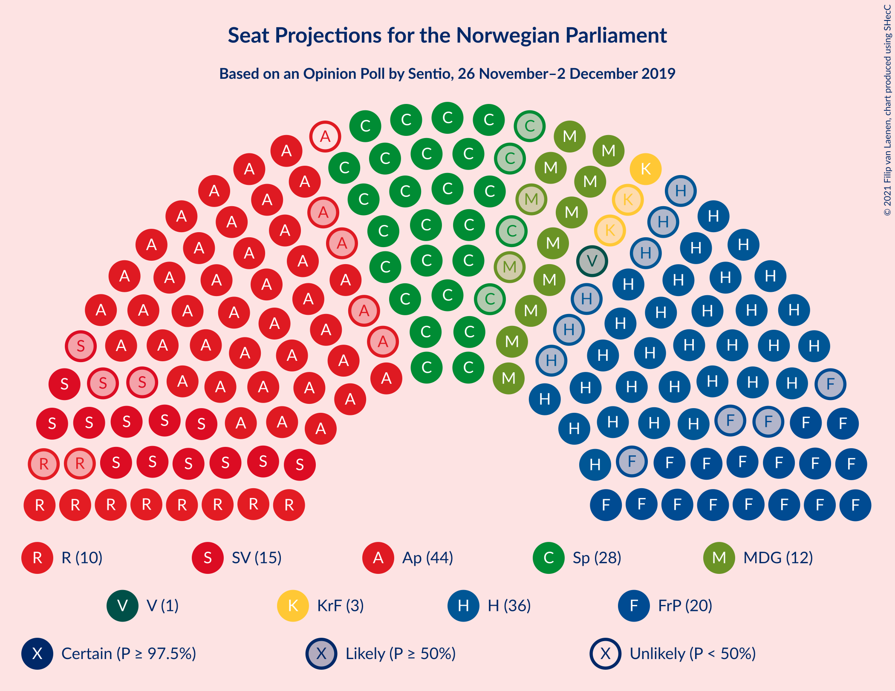
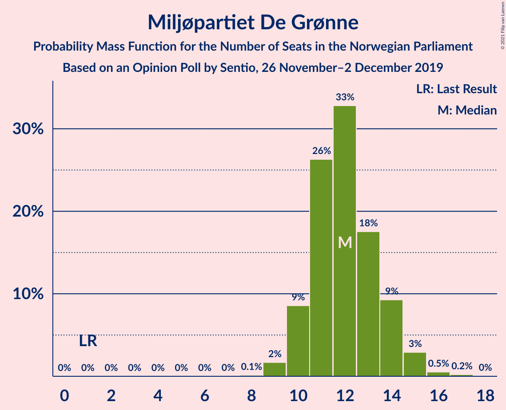
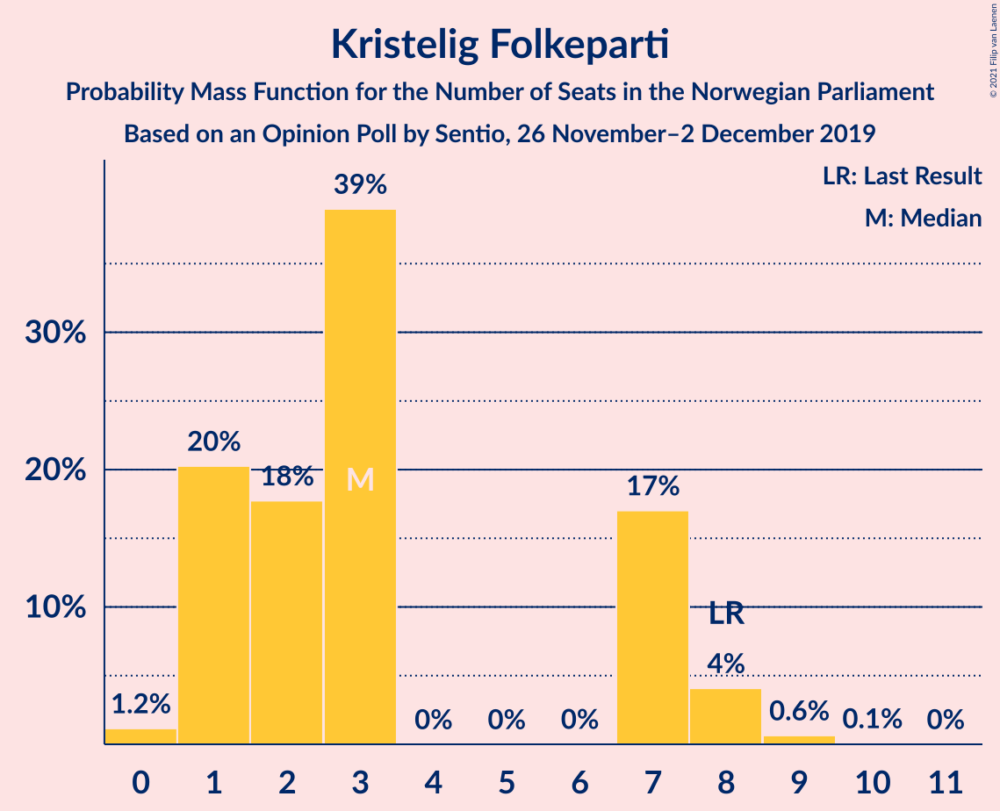
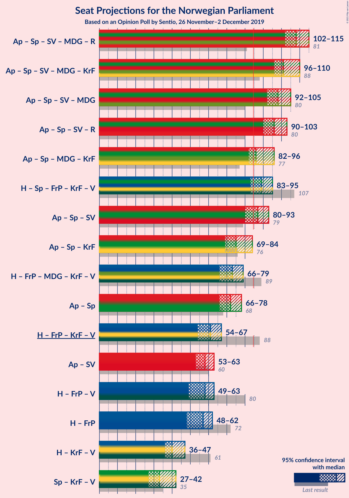
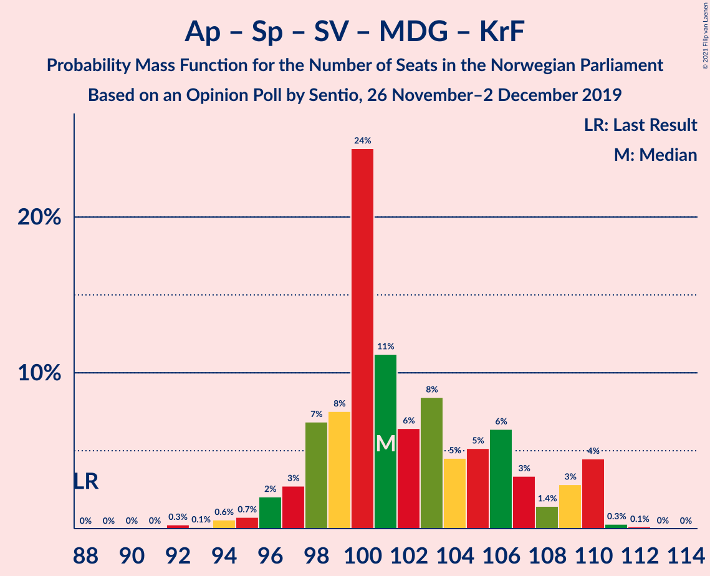
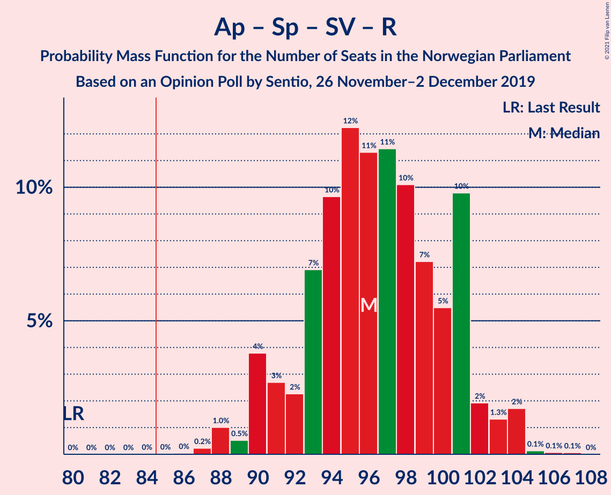
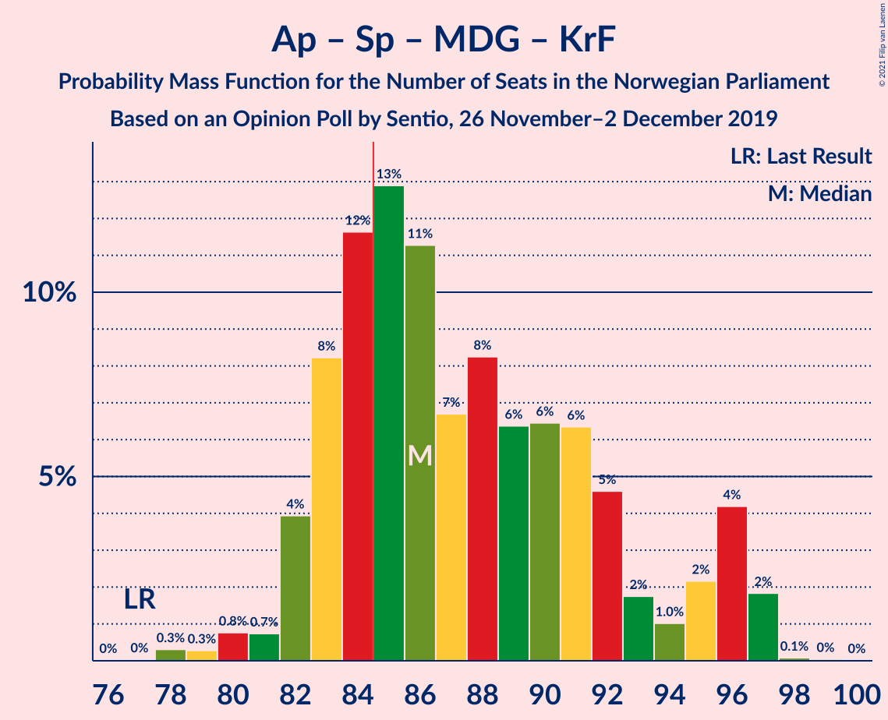
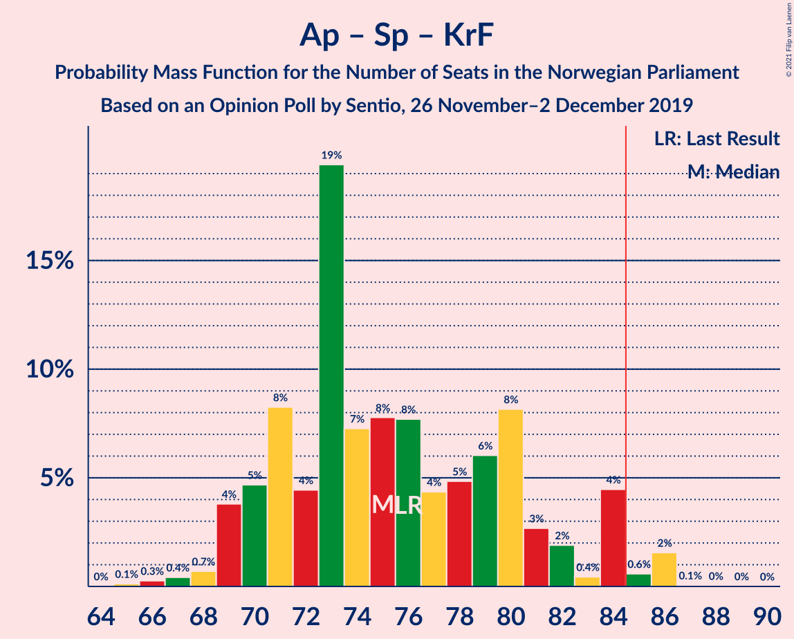

# Opinion Poll by Sentio, 26 November–2 December 2019

<a href="#voting-intentions">Voting Intentions</a> | <a href="#seats">Seats</a> | <a href="#coalitions">Coalitions</a> | <a href="#technical-information">Technical Information</a>

## Voting Intentions

### Confidence Intervals

| Party | Last Result | Poll Result | 80% Confidence Interval | 90% Confidence Interval | 95% Confidence Interval | 99% Confidence Interval |
|:-----:|:-----------:|:-----------:|:-----------------------:|:-----------------------:|:-----------------------:|:-----------------------:|
| Arbeiderpartiet | 27.4% | 24.2% | 22.5–26.0% |22.1–26.5% |21.6–27.0% |20.9–27.8% |
| Høyre | 25.0% | 20.8% | 19.2–22.5% |18.8–23.0% |18.4–23.4% |17.7–24.3% |
| Senterpartiet | 10.3% | 15.6% | 14.2–17.2% |13.8–17.6% |13.5–18.0% |12.8–18.8% |
| Fremskrittspartiet | 15.2% | 11.1% | 9.9–12.5% |9.6–12.9% |9.3–13.2% |8.7–13.9% |
| Sosialistisk Venstreparti | 6.0% | 8.3% | 7.3–9.5% |7.0–9.9% |6.7–10.2% |6.3–10.8% |
| Miljøpartiet De Grønne | 3.2% | 6.9% | 6.0–8.0% |5.7–8.4% |5.5–8.7% |5.1–9.2% |
| Rødt | 2.4% | 5.6% | 4.8–6.6% |4.5–7.0% |4.3–7.2% |4.0–7.7% |
| Kristelig Folkeparti | 4.2% | 3.5% | 2.9–4.4% |2.7–4.6% |2.5–4.8% |2.2–5.3% |
| Venstre | 4.4% | 2.4% | 1.9–3.2% |1.7–3.4% |1.6–3.6% |1.4–3.9% |

*Note:* The poll result column reflects the actual value used in the calculations. Published results may vary slightly, and in addition be rounded to fewer digits.

## Seats

### Confidence Intervals

| Party | Last Result | Median | 80% Confidence Interval | 90% Confidence Interval | 95% Confidence Interval | 99% Confidence Interval |
|:-----:|:-----------:|:------:|:-----------------------:|:-----------------------:|:-----------------------:|:-----------------------:|
| <a href="#arbeiderpartiet">Arbeiderpartiet</a> | 49 | 43 | 39–46 |39–47 |39–48 |37–50 |
| <a href="#høyre">Høyre</a> | 45 | 36 | 33–40 |31–41 |30–41 |30–43 |
| <a href="#senterpartiet">Senterpartiet</a> | 19 | 28 | 25–33 |24–34 |24–34 |23–35 |
| <a href="#fremskrittspartiet">Fremskrittspartiet</a> | 27 | 20 | 17–23 |16–23 |16–23 |15–25 |
| <a href="#sosialistisk-venstreparti">Sosialistisk Venstreparti</a> | 11 | 15 | 12–17 |12–17 |12–18 |11–19 |
| <a href="#miljøpartiet-de-grønne">Miljøpartiet De Grønne</a> | 1 | 12 | 10–14 |10–14 |10–15 |9–16 |
| <a href="#rødt">Rødt</a> | 1 | 10 | 8–12 |8–12 |8–13 |7–13 |
| <a href="#kristelig-folkeparti">Kristelig Folkeparti</a> | 8 | 3 | 1–7 |1–7 |1–8 |0–9 |
| <a href="#venstre">Venstre</a> | 8 | 1 | 0–2 |0–2 |0–2 |0–2 |

### Arbeiderpartiet

*For a full overview of the results for this party, see the [Arbeiderpartiet](party-arbeiderpartiet.html) page.*

| Number of Seats | Probability | Accumulated | Special Marks |
|:---------------:|:-----------:|:-----------:|:-------------:|
| 36 | 0% | 100% |  |
| 37 | 0.5% | 99.9% |  |
| 38 | 1.0% | 99.4% |  |
| 39 | 10% | 98% |  |
| 40 | 5% | 89% |  |
| 41 | 10% | 84% |  |
| 42 | 14% | 74% |  |
| 43 | 11% | 61% | Median |
| 44 | 28% | 50% |  |
| 45 | 11% | 22% |  |
| 46 | 5% | 11% |  |
| 47 | 3% | 6% |  |
| 48 | 0.9% | 3% |  |
| 49 | 0.8% | 2% | Last Result |
| 50 | 0.8% | 1.1% |  |
| 51 | 0.1% | 0.3% |  |
| 52 | 0.1% | 0.2% |  |
| 53 | 0% | 0.1% |  |
| 54 | 0% | 0.1% |  |
| 55 | 0% | 0% |  |

### Høyre

*For a full overview of the results for this party, see the [Høyre](party-høyre.html) page.*

| Number of Seats | Probability | Accumulated | Special Marks |
|:---------------:|:-----------:|:-----------:|:-------------:|
| 29 | 0.1% | 100% |  |
| 30 | 4% | 99.9% |  |
| 31 | 3% | 96% |  |
| 32 | 2% | 93% |  |
| 33 | 5% | 91% |  |
| 34 | 8% | 86% |  |
| 35 | 17% | 79% |  |
| 36 | 18% | 62% | Median |
| 37 | 8% | 44% |  |
| 38 | 11% | 36% |  |
| 39 | 15% | 25% |  |
| 40 | 3% | 10% |  |
| 41 | 6% | 7% |  |
| 42 | 0.5% | 1.3% |  |
| 43 | 0.7% | 0.8% |  |
| 44 | 0.1% | 0.1% |  |
| 45 | 0.1% | 0.1% | Last Result |
| 46 | 0% | 0% |  |

### Senterpartiet

*For a full overview of the results for this party, see the [Senterpartiet](party-senterpartiet.html) page.*

| Number of Seats | Probability | Accumulated | Special Marks |
|:---------------:|:-----------:|:-----------:|:-------------:|
| 19 | 0% | 100% | Last Result |
| 20 | 0% | 100% |  |
| 21 | 0.1% | 100% |  |
| 22 | 0.2% | 99.8% |  |
| 23 | 2% | 99.6% |  |
| 24 | 3% | 98% |  |
| 25 | 8% | 95% |  |
| 26 | 7% | 86% |  |
| 27 | 13% | 80% |  |
| 28 | 17% | 66% | Median |
| 29 | 7% | 50% |  |
| 30 | 6% | 43% |  |
| 31 | 11% | 37% |  |
| 32 | 5% | 26% |  |
| 33 | 12% | 21% |  |
| 34 | 6% | 8% |  |
| 35 | 2% | 2% |  |
| 36 | 0.3% | 0.5% |  |
| 37 | 0.1% | 0.2% |  |
| 38 | 0.1% | 0.1% |  |
| 39 | 0% | 0% |  |

### Fremskrittspartiet

*For a full overview of the results for this party, see the [Fremskrittspartiet](party-fremskrittspartiet.html) page.*

| Number of Seats | Probability | Accumulated | Special Marks |
|:---------------:|:-----------:|:-----------:|:-------------:|
| 14 | 0.2% | 100% |  |
| 15 | 0.7% | 99.7% |  |
| 16 | 8% | 99.0% |  |
| 17 | 6% | 91% |  |
| 18 | 19% | 85% |  |
| 19 | 14% | 65% |  |
| 20 | 11% | 51% | Median |
| 21 | 13% | 40% |  |
| 22 | 17% | 27% |  |
| 23 | 8% | 10% |  |
| 24 | 1.3% | 2% |  |
| 25 | 0.7% | 0.9% |  |
| 26 | 0.2% | 0.2% |  |
| 27 | 0% | 0% | Last Result |

### Sosialistisk Venstreparti

*For a full overview of the results for this party, see the [Sosialistisk Venstreparti](party-sosialistiskvenstreparti.html) page.*

| Number of Seats | Probability | Accumulated | Special Marks |
|:---------------:|:-----------:|:-----------:|:-------------:|
| 10 | 0.3% | 100% |  |
| 11 | 2% | 99.7% | Last Result |
| 12 | 10% | 98% |  |
| 13 | 12% | 87% |  |
| 14 | 24% | 75% |  |
| 15 | 26% | 51% | Median |
| 16 | 12% | 25% |  |
| 17 | 10% | 13% |  |
| 18 | 2% | 3% |  |
| 19 | 0.8% | 1.0% |  |
| 20 | 0.1% | 0.1% |  |
| 21 | 0% | 0% |  |

### Miljøpartiet De Grønne

*For a full overview of the results for this party, see the [Miljøpartiet De Grønne](party-miljøpartietdegrønne.html) page.*

| Number of Seats | Probability | Accumulated | Special Marks |
|:---------------:|:-----------:|:-----------:|:-------------:|
| 1 | 0% | 100% | Last Result |
| 2 | 0% | 100% |  |
| 3 | 0% | 100% |  |
| 4 | 0% | 100% |  |
| 5 | 0% | 100% |  |
| 6 | 0% | 100% |  |
| 7 | 0% | 100% |  |
| 8 | 0.1% | 100% |  |
| 9 | 2% | 99.9% |  |
| 10 | 9% | 98% |  |
| 11 | 26% | 90% |  |
| 12 | 33% | 63% | Median |
| 13 | 18% | 30% |  |
| 14 | 9% | 13% |  |
| 15 | 3% | 4% |  |
| 16 | 0.5% | 0.8% |  |
| 17 | 0.2% | 0.2% |  |
| 18 | 0% | 0% |  |

### Rødt

*For a full overview of the results for this party, see the [Rødt](party-rødt.html) page.*

| Number of Seats | Probability | Accumulated | Special Marks |
|:---------------:|:-----------:|:-----------:|:-------------:|
| 1 | 0% | 100% | Last Result |
| 2 | 0.3% | 100% |  |
| 3 | 0% | 99.7% |  |
| 4 | 0% | 99.7% |  |
| 5 | 0% | 99.7% |  |
| 6 | 0% | 99.7% |  |
| 7 | 1.3% | 99.7% |  |
| 8 | 14% | 98% |  |
| 9 | 20% | 84% |  |
| 10 | 40% | 64% | Median |
| 11 | 11% | 23% |  |
| 12 | 7% | 12% |  |
| 13 | 4% | 4% |  |
| 14 | 0.4% | 0.5% |  |
| 15 | 0.1% | 0.1% |  |
| 16 | 0% | 0% |  |

### Kristelig Folkeparti

*For a full overview of the results for this party, see the [Kristelig Folkeparti](party-kristeligfolkeparti.html) page.*

| Number of Seats | Probability | Accumulated | Special Marks |
|:---------------:|:-----------:|:-----------:|:-------------:|
| 0 | 1.2% | 100% |  |
| 1 | 20% | 98.8% |  |
| 2 | 18% | 79% |  |
| 3 | 39% | 61% | Median |
| 4 | 0% | 22% |  |
| 5 | 0% | 22% |  |
| 6 | 0% | 22% |  |
| 7 | 17% | 22% |  |
| 8 | 4% | 5% | Last Result |
| 9 | 0.6% | 0.7% |  |
| 10 | 0.1% | 0.1% |  |
| 11 | 0% | 0% |  |

### Venstre

*For a full overview of the results for this party, see the [Venstre](party-venstre.html) page.*

| Number of Seats | Probability | Accumulated | Special Marks |
|:---------------:|:-----------:|:-----------:|:-------------:|
| 0 | 12% | 100% |  |
| 1 | 60% | 88% | Median |
| 2 | 28% | 28% |  |
| 3 | 0% | 0.2% |  |
| 4 | 0% | 0.2% |  |
| 5 | 0% | 0.2% |  |
| 6 | 0% | 0.2% |  |
| 7 | 0.2% | 0.2% |  |
| 8 | 0% | 0% | Last Result |

## Coalitions

### Confidence Intervals

| Coalition | Last Result | Median | Majority? | 80% Confidence Interval | 90% Confidence Interval | 95% Confidence Interval | 99% Confidence Interval |
|:---------:|:-----------:|:------:|:---------:|:-----------------------:|:-----------------------:|:-----------------------:|:-----------------------:|
| Arbeiderpartiet – Senterpartiet – Sosialistisk Venstreparti – Miljøpartiet De Grønne – Rødt | 81 | 108 | 100% | 104–113 | 103–114 | 102–115 | 100–115 |
| Arbeiderpartiet – Senterpartiet – Sosialistisk Venstreparti – Miljøpartiet De Grønne – Kristelig Folkeparti | 88 | 101 | 100% | 98–107 | 97–109 | 96–110 | 94–110 |
| Arbeiderpartiet – Senterpartiet – Sosialistisk Venstreparti – Miljøpartiet De Grønne | 80 | 98 | 100% | 95–103 | 94–104 | 92–105 | 90–106 |
| Arbeiderpartiet – Senterpartiet – Sosialistisk Venstreparti – Rødt | 80 | 96 | 100% | 92–101 | 90–102 | 90–103 | 88–104 |
| Arbeiderpartiet – Senterpartiet – Miljøpartiet De Grønne – Kristelig Folkeparti | 77 | 86 | 74% | 83–93 | 82–96 | 82–96 | 79–97 |
| Høyre – Senterpartiet – Fremskrittspartiet – Kristelig Folkeparti – Venstre | 107 | 89 | 96% | 86–93 | 85–93 | 83–95 | 81–96 |
| Arbeiderpartiet – Senterpartiet – Sosialistisk Venstreparti | 79 | 87 | 73% | 82–91 | 82–92 | 80–93 | 78–94 |
| Arbeiderpartiet – Senterpartiet – Kristelig Folkeparti | 76 | 75 | 2% | 70–81 | 69–84 | 69–84 | 67–86 |
| Høyre – Fremskrittspartiet – Miljøpartiet De Grønne – Kristelig Folkeparti – Venstre | 89 | 73 | 0% | 68–77 | 67–79 | 66–79 | 65–81 |
| Arbeiderpartiet – Senterpartiet | 68 | 72 | 0% | 68–77 | 67–78 | 66–78 | 64–79 |
| Høyre – Fremskrittspartiet – Kristelig Folkeparti – Venstre | 88 | 61 | 0% | 56–65 | 55–66 | 54–67 | 54–69 |
| Arbeiderpartiet – Sosialistisk Venstreparti | 60 | 58 | 0% | 54–60 | 54–62 | 53–63 | 52–64 |
| Høyre – Fremskrittspartiet – Venstre | 80 | 58 | 0% | 53–61 | 50–63 | 49–63 | 49–65 |
| Høyre – Fremskrittspartiet | 72 | 57 | 0% | 51–60 | 49–62 | 48–62 | 48–64 |
| Høyre – Kristelig Folkeparti – Venstre | 61 | 40 | 0% | 37–45 | 37–45 | 36–47 | 35–48 |
| Senterpartiet – Kristelig Folkeparti – Venstre | 35 | 33 | 0% | 29–39 | 28–41 | 27–42 | 26–43 |

### Arbeiderpartiet – Senterpartiet – Sosialistisk Venstreparti – Miljøpartiet De Grønne – Rødt

| Number of Seats | Probability | Accumulated | Special Marks |
|:---------------:|:-----------:|:-----------:|:-------------:|
| 81 | 0% | 100% | Last Result |
| 82 | 0% | 100% |  |
| 83 | 0% | 100% |  |
| 84 | 0% | 100% |  |
| 85 | 0% | 100% | Majority |
| 86 | 0% | 100% |  |
| 87 | 0% | 100% |  |
| 88 | 0% | 100% |  |
| 89 | 0% | 100% |  |
| 90 | 0% | 100% |  |
| 91 | 0% | 100% |  |
| 92 | 0% | 100% |  |
| 93 | 0% | 100% |  |
| 94 | 0% | 100% |  |
| 95 | 0% | 100% |  |
| 96 | 0% | 100% |  |
| 97 | 0% | 100% |  |
| 98 | 0.1% | 99.9% |  |
| 99 | 0% | 99.9% |  |
| 100 | 0.3% | 99.8% |  |
| 101 | 0.6% | 99.5% |  |
| 102 | 2% | 98.9% |  |
| 103 | 4% | 97% |  |
| 104 | 4% | 93% |  |
| 105 | 5% | 90% |  |
| 106 | 6% | 84% |  |
| 107 | 20% | 79% |  |
| 108 | 14% | 59% | Median |
| 109 | 8% | 45% |  |
| 110 | 10% | 37% |  |
| 111 | 8% | 27% |  |
| 112 | 7% | 19% |  |
| 113 | 7% | 12% |  |
| 114 | 2% | 5% |  |
| 115 | 2% | 3% |  |
| 116 | 0.2% | 0.4% |  |
| 117 | 0.1% | 0.2% |  |
| 118 | 0% | 0.1% |  |
| 119 | 0% | 0% |  |

### Arbeiderpartiet – Senterpartiet – Sosialistisk Venstreparti – Miljøpartiet De Grønne – Kristelig Folkeparti

| Number of Seats | Probability | Accumulated | Special Marks |
|:---------------:|:-----------:|:-----------:|:-------------:|
| 88 | 0% | 100% | Last Result |
| 89 | 0% | 100% |  |
| 90 | 0% | 100% |  |
| 91 | 0% | 100% |  |
| 92 | 0.3% | 100% |  |
| 93 | 0.1% | 99.7% |  |
| 94 | 0.6% | 99.6% |  |
| 95 | 0.7% | 99.1% |  |
| 96 | 2% | 98% |  |
| 97 | 3% | 96% |  |
| 98 | 7% | 94% |  |
| 99 | 8% | 87% |  |
| 100 | 24% | 79% |  |
| 101 | 11% | 55% | Median |
| 102 | 6% | 44% |  |
| 103 | 8% | 37% |  |
| 104 | 5% | 29% |  |
| 105 | 5% | 24% |  |
| 106 | 6% | 19% |  |
| 107 | 3% | 13% |  |
| 108 | 1.4% | 9% |  |
| 109 | 3% | 8% |  |
| 110 | 4% | 5% |  |
| 111 | 0.3% | 0.5% |  |
| 112 | 0.1% | 0.2% |  |
| 113 | 0% | 0% |  |

### Arbeiderpartiet – Senterpartiet – Sosialistisk Venstreparti – Miljøpartiet De Grønne

| Number of Seats | Probability | Accumulated | Special Marks |
|:---------------:|:-----------:|:-----------:|:-------------:|
| 80 | 0% | 100% | Last Result |
| 81 | 0% | 100% |  |
| 82 | 0% | 100% |  |
| 83 | 0% | 100% |  |
| 84 | 0% | 100% |  |
| 85 | 0% | 100% | Majority |
| 86 | 0% | 100% |  |
| 87 | 0% | 100% |  |
| 88 | 0.1% | 100% |  |
| 89 | 0.1% | 99.9% |  |
| 90 | 0.4% | 99.8% |  |
| 91 | 0.6% | 99.5% |  |
| 92 | 2% | 98.8% |  |
| 93 | 1.3% | 97% |  |
| 94 | 3% | 96% |  |
| 95 | 8% | 93% |  |
| 96 | 5% | 85% |  |
| 97 | 18% | 80% |  |
| 98 | 18% | 62% | Median |
| 99 | 10% | 44% |  |
| 100 | 4% | 34% |  |
| 101 | 9% | 30% |  |
| 102 | 7% | 21% |  |
| 103 | 8% | 14% |  |
| 104 | 3% | 5% |  |
| 105 | 2% | 3% |  |
| 106 | 0.3% | 0.6% |  |
| 107 | 0.1% | 0.3% |  |
| 108 | 0.1% | 0.2% |  |
| 109 | 0% | 0.1% |  |
| 110 | 0% | 0% |  |

### Arbeiderpartiet – Senterpartiet – Sosialistisk Venstreparti – Rødt

| Number of Seats | Probability | Accumulated | Special Marks |
|:---------------:|:-----------:|:-----------:|:-------------:|
| 80 | 0% | 100% | Last Result |
| 81 | 0% | 100% |  |
| 82 | 0% | 100% |  |
| 83 | 0% | 100% |  |
| 84 | 0% | 100% |  |
| 85 | 0% | 100% | Majority |
| 86 | 0% | 100% |  |
| 87 | 0.2% | 99.9% |  |
| 88 | 1.0% | 99.7% |  |
| 89 | 0.5% | 98.7% |  |
| 90 | 4% | 98% |  |
| 91 | 3% | 94% |  |
| 92 | 2% | 92% |  |
| 93 | 7% | 89% |  |
| 94 | 10% | 82% |  |
| 95 | 12% | 73% |  |
| 96 | 11% | 61% | Median |
| 97 | 11% | 49% |  |
| 98 | 10% | 38% |  |
| 99 | 7% | 28% |  |
| 100 | 5% | 21% |  |
| 101 | 10% | 15% |  |
| 102 | 2% | 5% |  |
| 103 | 1.3% | 3% |  |
| 104 | 2% | 2% |  |
| 105 | 0.1% | 0.3% |  |
| 106 | 0.1% | 0.1% |  |
| 107 | 0.1% | 0.1% |  |
| 108 | 0% | 0% |  |

### Arbeiderpartiet – Senterpartiet – Miljøpartiet De Grønne – Kristelig Folkeparti

| Number of Seats | Probability | Accumulated | Special Marks |
|:---------------:|:-----------:|:-----------:|:-------------:|
| 77 | 0% | 100% | Last Result |
| 78 | 0.3% | 99.9% |  |
| 79 | 0.3% | 99.6% |  |
| 80 | 0.8% | 99.3% |  |
| 81 | 0.7% | 98.6% |  |
| 82 | 4% | 98% |  |
| 83 | 8% | 94% |  |
| 84 | 12% | 86% |  |
| 85 | 13% | 74% | Majority |
| 86 | 11% | 61% | Median |
| 87 | 7% | 50% |  |
| 88 | 8% | 43% |  |
| 89 | 6% | 35% |  |
| 90 | 6% | 29% |  |
| 91 | 6% | 22% |  |
| 92 | 5% | 16% |  |
| 93 | 2% | 11% |  |
| 94 | 1.0% | 9% |  |
| 95 | 2% | 8% |  |
| 96 | 4% | 6% |  |
| 97 | 2% | 2% |  |
| 98 | 0.1% | 0.2% |  |
| 99 | 0% | 0.1% |  |
| 100 | 0% | 0% |  |

### Høyre – Senterpartiet – Fremskrittspartiet – Kristelig Folkeparti – Venstre

| Number of Seats | Probability | Accumulated | Special Marks |
|:---------------:|:-----------:|:-----------:|:-------------:|
| 79 | 0% | 100% |  |
| 80 | 0.3% | 99.9% |  |
| 81 | 0.2% | 99.6% |  |
| 82 | 0.9% | 99.4% |  |
| 83 | 1.2% | 98% |  |
| 84 | 2% | 97% |  |
| 85 | 2% | 96% | Majority |
| 86 | 7% | 94% |  |
| 87 | 12% | 87% |  |
| 88 | 7% | 75% | Median |
| 89 | 19% | 69% |  |
| 90 | 9% | 50% |  |
| 91 | 14% | 40% |  |
| 92 | 6% | 27% |  |
| 93 | 17% | 21% |  |
| 94 | 1.5% | 4% |  |
| 95 | 2% | 3% |  |
| 96 | 0.2% | 0.7% |  |
| 97 | 0.2% | 0.5% |  |
| 98 | 0.1% | 0.2% |  |
| 99 | 0% | 0.1% |  |
| 100 | 0.1% | 0.1% |  |
| 101 | 0% | 0% |  |
| 102 | 0% | 0% |  |
| 103 | 0% | 0% |  |
| 104 | 0% | 0% |  |
| 105 | 0% | 0% |  |
| 106 | 0% | 0% |  |
| 107 | 0% | 0% | Last Result |

### Arbeiderpartiet – Senterpartiet – Sosialistisk Venstreparti

| Number of Seats | Probability | Accumulated | Special Marks |
|:---------------:|:-----------:|:-----------:|:-------------:|
| 77 | 0.2% | 100% |  |
| 78 | 1.2% | 99.8% |  |
| 79 | 0.5% | 98.5% | Last Result |
| 80 | 0.8% | 98% |  |
| 81 | 0.8% | 97% |  |
| 82 | 7% | 96% |  |
| 83 | 9% | 90% |  |
| 84 | 8% | 81% |  |
| 85 | 11% | 73% | Majority |
| 86 | 9% | 63% | Median |
| 87 | 20% | 54% |  |
| 88 | 6% | 34% |  |
| 89 | 6% | 28% |  |
| 90 | 5% | 23% |  |
| 91 | 10% | 17% |  |
| 92 | 4% | 7% |  |
| 93 | 3% | 3% |  |
| 94 | 0.5% | 0.8% |  |
| 95 | 0.2% | 0.3% |  |
| 96 | 0.1% | 0.2% |  |
| 97 | 0.1% | 0.1% |  |
| 98 | 0.1% | 0.1% |  |
| 99 | 0% | 0% |  |

### Arbeiderpartiet – Senterpartiet – Kristelig Folkeparti

| Number of Seats | Probability | Accumulated | Special Marks |
|:---------------:|:-----------:|:-----------:|:-------------:|
| 65 | 0.1% | 100% |  |
| 66 | 0.3% | 99.9% |  |
| 67 | 0.4% | 99.6% |  |
| 68 | 0.7% | 99.2% |  |
| 69 | 4% | 98% |  |
| 70 | 5% | 95% |  |
| 71 | 8% | 90% |  |
| 72 | 4% | 82% |  |
| 73 | 19% | 77% |  |
| 74 | 7% | 58% | Median |
| 75 | 8% | 51% |  |
| 76 | 8% | 43% | Last Result |
| 77 | 4% | 35% |  |
| 78 | 5% | 31% |  |
| 79 | 6% | 26% |  |
| 80 | 8% | 20% |  |
| 81 | 3% | 12% |  |
| 82 | 2% | 9% |  |
| 83 | 0.4% | 7% |  |
| 84 | 4% | 7% |  |
| 85 | 0.6% | 2% | Majority |
| 86 | 2% | 2% |  |
| 87 | 0.1% | 0.1% |  |
| 88 | 0% | 0.1% |  |
| 89 | 0% | 0% |  |

### Høyre – Fremskrittspartiet – Miljøpartiet De Grønne – Kristelig Folkeparti – Venstre

| Number of Seats | Probability | Accumulated | Special Marks |
|:---------------:|:-----------:|:-----------:|:-------------:|
| 62 | 0.1% | 100% |  |
| 63 | 0.1% | 99.9% |  |
| 64 | 0.1% | 99.9% |  |
| 65 | 2% | 99.7% |  |
| 66 | 1.3% | 98% |  |
| 67 | 2% | 97% |  |
| 68 | 10% | 95% |  |
| 69 | 5% | 85% |  |
| 70 | 7% | 79% |  |
| 71 | 10% | 72% |  |
| 72 | 11% | 62% | Median |
| 73 | 11% | 51% |  |
| 74 | 12% | 39% |  |
| 75 | 10% | 27% |  |
| 76 | 7% | 18% |  |
| 77 | 2% | 11% |  |
| 78 | 3% | 8% |  |
| 79 | 4% | 6% |  |
| 80 | 0.5% | 2% |  |
| 81 | 1.0% | 1.3% |  |
| 82 | 0.2% | 0.3% |  |
| 83 | 0% | 0.1% |  |
| 84 | 0% | 0% |  |
| 85 | 0% | 0% | Majority |
| 86 | 0% | 0% |  |
| 87 | 0% | 0% |  |
| 88 | 0% | 0% |  |
| 89 | 0% | 0% | Last Result |

### Arbeiderpartiet – Senterpartiet

| Number of Seats | Probability | Accumulated | Special Marks |
|:---------------:|:-----------:|:-----------:|:-------------:|
| 62 | 0.1% | 100% |  |
| 63 | 0.2% | 99.9% |  |
| 64 | 0.5% | 99.8% |  |
| 65 | 1.1% | 99.3% |  |
| 66 | 1.4% | 98% |  |
| 67 | 4% | 97% |  |
| 68 | 6% | 93% | Last Result |
| 69 | 5% | 86% |  |
| 70 | 20% | 82% |  |
| 71 | 10% | 61% | Median |
| 72 | 11% | 52% |  |
| 73 | 11% | 40% |  |
| 74 | 4% | 29% |  |
| 75 | 5% | 25% |  |
| 76 | 4% | 21% |  |
| 77 | 8% | 17% |  |
| 78 | 7% | 9% |  |
| 79 | 2% | 2% |  |
| 80 | 0.2% | 0.5% |  |
| 81 | 0.2% | 0.3% |  |
| 82 | 0.1% | 0.1% |  |
| 83 | 0% | 0% |  |

### Høyre – Fremskrittspartiet – Kristelig Folkeparti – Venstre

| Number of Seats | Probability | Accumulated | Special Marks |
|:---------------:|:-----------:|:-----------:|:-------------:|
| 51 | 0% | 100% |  |
| 52 | 0.1% | 99.9% |  |
| 53 | 0.2% | 99.8% |  |
| 54 | 2% | 99.6% |  |
| 55 | 2% | 97% |  |
| 56 | 7% | 95% |  |
| 57 | 7% | 88% |  |
| 58 | 8% | 81% |  |
| 59 | 10% | 73% |  |
| 60 | 8% | 63% | Median |
| 61 | 14% | 55% |  |
| 62 | 20% | 41% |  |
| 63 | 6% | 21% |  |
| 64 | 5% | 16% |  |
| 65 | 4% | 10% |  |
| 66 | 4% | 7% |  |
| 67 | 2% | 3% |  |
| 68 | 0.6% | 1.1% |  |
| 69 | 0.3% | 0.5% |  |
| 70 | 0% | 0.2% |  |
| 71 | 0.1% | 0.1% |  |
| 72 | 0% | 0.1% |  |
| 73 | 0% | 0% |  |
| 74 | 0% | 0% |  |
| 75 | 0% | 0% |  |
| 76 | 0% | 0% |  |
| 77 | 0% | 0% |  |
| 78 | 0% | 0% |  |
| 79 | 0% | 0% |  |
| 80 | 0% | 0% |  |
| 81 | 0% | 0% |  |
| 82 | 0% | 0% |  |
| 83 | 0% | 0% |  |
| 84 | 0% | 0% |  |
| 85 | 0% | 0% | Majority |
| 86 | 0% | 0% |  |
| 87 | 0% | 0% |  |
| 88 | 0% | 0% | Last Result |

### Arbeiderpartiet – Sosialistisk Venstreparti

| Number of Seats | Probability | Accumulated | Special Marks |
|:---------------:|:-----------:|:-----------:|:-------------:|
| 49 | 0% | 100% |  |
| 50 | 0.1% | 99.9% |  |
| 51 | 0.3% | 99.8% |  |
| 52 | 1.0% | 99.5% |  |
| 53 | 2% | 98% |  |
| 54 | 13% | 97% |  |
| 55 | 9% | 84% |  |
| 56 | 10% | 75% |  |
| 57 | 9% | 65% |  |
| 58 | 17% | 56% | Median |
| 59 | 22% | 39% |  |
| 60 | 8% | 17% | Last Result |
| 61 | 2% | 9% |  |
| 62 | 3% | 7% |  |
| 63 | 2% | 4% |  |
| 64 | 2% | 2% |  |
| 65 | 0.4% | 0.5% |  |
| 66 | 0.1% | 0.1% |  |
| 67 | 0% | 0.1% |  |
| 68 | 0% | 0.1% |  |
| 69 | 0% | 0% |  |

### Høyre – Fremskrittspartiet – Venstre

| Number of Seats | Probability | Accumulated | Special Marks |
|:---------------:|:-----------:|:-----------:|:-------------:|
| 47 | 0% | 100% |  |
| 48 | 0.1% | 99.9% |  |
| 49 | 4% | 99.8% |  |
| 50 | 1.0% | 96% |  |
| 51 | 3% | 95% |  |
| 52 | 0.9% | 91% |  |
| 53 | 6% | 90% |  |
| 54 | 8% | 84% |  |
| 55 | 3% | 76% |  |
| 56 | 7% | 73% |  |
| 57 | 13% | 66% | Median |
| 58 | 16% | 54% |  |
| 59 | 14% | 38% |  |
| 60 | 10% | 24% |  |
| 61 | 5% | 14% |  |
| 62 | 2% | 9% |  |
| 63 | 6% | 7% |  |
| 64 | 0.4% | 2% |  |
| 65 | 0.8% | 1.2% |  |
| 66 | 0.1% | 0.4% |  |
| 67 | 0.2% | 0.2% |  |
| 68 | 0% | 0% |  |
| 69 | 0% | 0% |  |
| 70 | 0% | 0% |  |
| 71 | 0% | 0% |  |
| 72 | 0% | 0% |  |
| 73 | 0% | 0% |  |
| 74 | 0% | 0% |  |
| 75 | 0% | 0% |  |
| 76 | 0% | 0% |  |
| 77 | 0% | 0% |  |
| 78 | 0% | 0% |  |
| 79 | 0% | 0% |  |
| 80 | 0% | 0% | Last Result |

### Høyre – Fremskrittspartiet

| Number of Seats | Probability | Accumulated | Special Marks |
|:---------------:|:-----------:|:-----------:|:-------------:|
| 47 | 0.1% | 100% |  |
| 48 | 4% | 99.8% |  |
| 49 | 2% | 95% |  |
| 50 | 2% | 93% |  |
| 51 | 2% | 91% |  |
| 52 | 6% | 89% |  |
| 53 | 6% | 83% |  |
| 54 | 5% | 76% |  |
| 55 | 8% | 71% |  |
| 56 | 13% | 64% | Median |
| 57 | 14% | 50% |  |
| 58 | 14% | 37% |  |
| 59 | 11% | 22% |  |
| 60 | 2% | 11% |  |
| 61 | 2% | 9% |  |
| 62 | 5% | 7% |  |
| 63 | 1.4% | 2% |  |
| 64 | 0.4% | 0.7% |  |
| 65 | 0.3% | 0.3% |  |
| 66 | 0% | 0% |  |
| 67 | 0% | 0% |  |
| 68 | 0% | 0% |  |
| 69 | 0% | 0% |  |
| 70 | 0% | 0% |  |
| 71 | 0% | 0% |  |
| 72 | 0% | 0% | Last Result |

### Høyre – Kristelig Folkeparti – Venstre

| Number of Seats | Probability | Accumulated | Special Marks |
|:---------------:|:-----------:|:-----------:|:-------------:|
| 33 | 0.1% | 100% |  |
| 34 | 0.2% | 99.9% |  |
| 35 | 0.8% | 99.7% |  |
| 36 | 1.4% | 98.8% |  |
| 37 | 12% | 97% |  |
| 38 | 8% | 86% |  |
| 39 | 15% | 78% |  |
| 40 | 14% | 63% | Median |
| 41 | 9% | 49% |  |
| 42 | 10% | 40% |  |
| 43 | 14% | 30% |  |
| 44 | 4% | 17% |  |
| 45 | 8% | 13% |  |
| 46 | 2% | 5% |  |
| 47 | 2% | 3% |  |
| 48 | 0.5% | 0.7% |  |
| 49 | 0.2% | 0.3% |  |
| 50 | 0% | 0.1% |  |
| 51 | 0% | 0.1% |  |
| 52 | 0% | 0% |  |
| 53 | 0% | 0% |  |
| 54 | 0% | 0% |  |
| 55 | 0% | 0% |  |
| 56 | 0% | 0% |  |
| 57 | 0% | 0% |  |
| 58 | 0% | 0% |  |
| 59 | 0% | 0% |  |
| 60 | 0% | 0% |  |
| 61 | 0% | 0% | Last Result |

### Senterpartiet – Kristelig Folkeparti – Venstre

| Number of Seats | Probability | Accumulated | Special Marks |
|:---------------:|:-----------:|:-----------:|:-------------:|
| 24 | 0.1% | 100% |  |
| 25 | 0.2% | 99.9% |  |
| 26 | 0.5% | 99.7% |  |
| 27 | 3% | 99.2% |  |
| 28 | 3% | 96% |  |
| 29 | 7% | 93% |  |
| 30 | 11% | 86% |  |
| 31 | 7% | 76% |  |
| 32 | 15% | 69% | Median |
| 33 | 7% | 54% |  |
| 34 | 5% | 47% |  |
| 35 | 15% | 42% | Last Result |
| 36 | 5% | 27% |  |
| 37 | 7% | 22% |  |
| 38 | 3% | 15% |  |
| 39 | 3% | 12% |  |
| 40 | 0.8% | 9% |  |
| 41 | 5% | 8% |  |
| 42 | 1.4% | 3% |  |
| 43 | 2% | 2% |  |
| 44 | 0.2% | 0.3% |  |
| 45 | 0% | 0.1% |  |
| 46 | 0% | 0.1% |  |
| 47 | 0% | 0% |  |

## Technical Information

### Opinion Poll

+ **Polling firm:** Sentio
+ **Commissioner(s):** —
+ **Fieldwork period:** 26 November–2 December 2019

### Calculations

+ **Sample size:** 1000
+ **Simulations done:** 524,288
+ **Error estimate:** 3.16%

