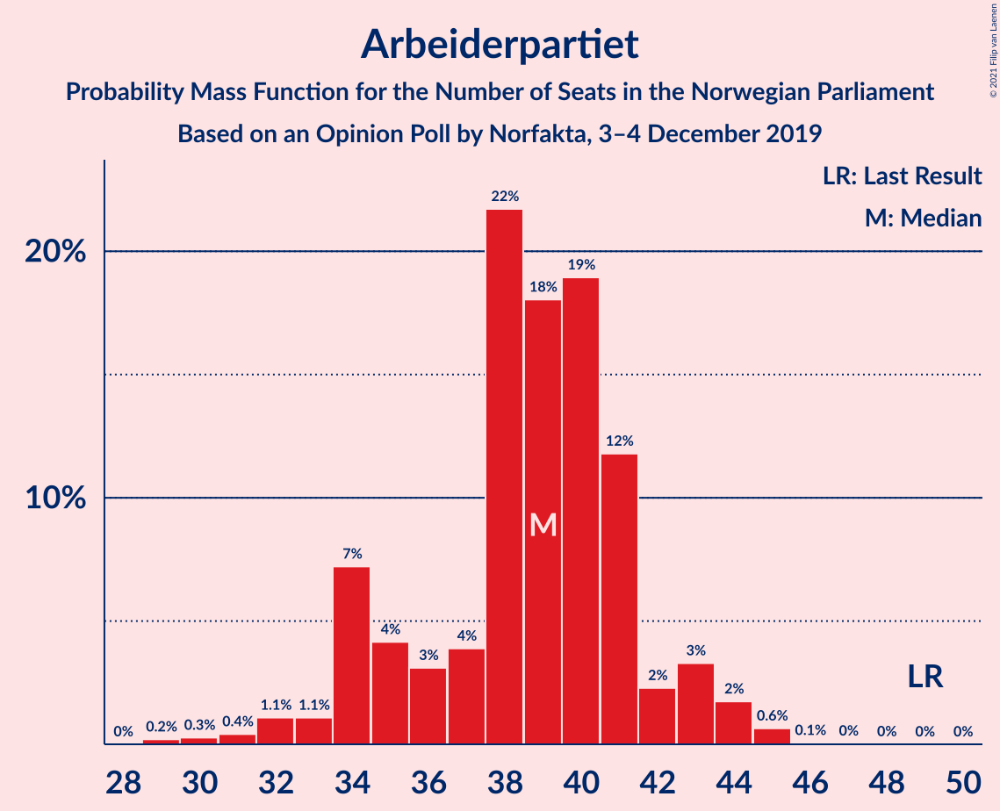
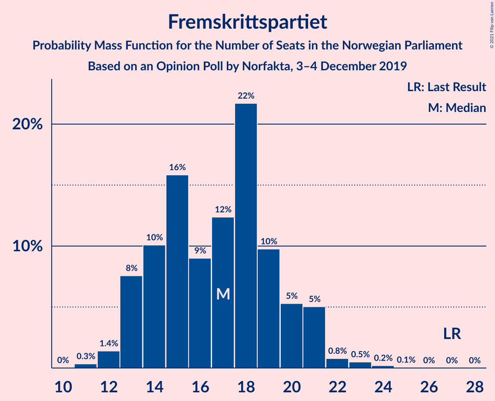
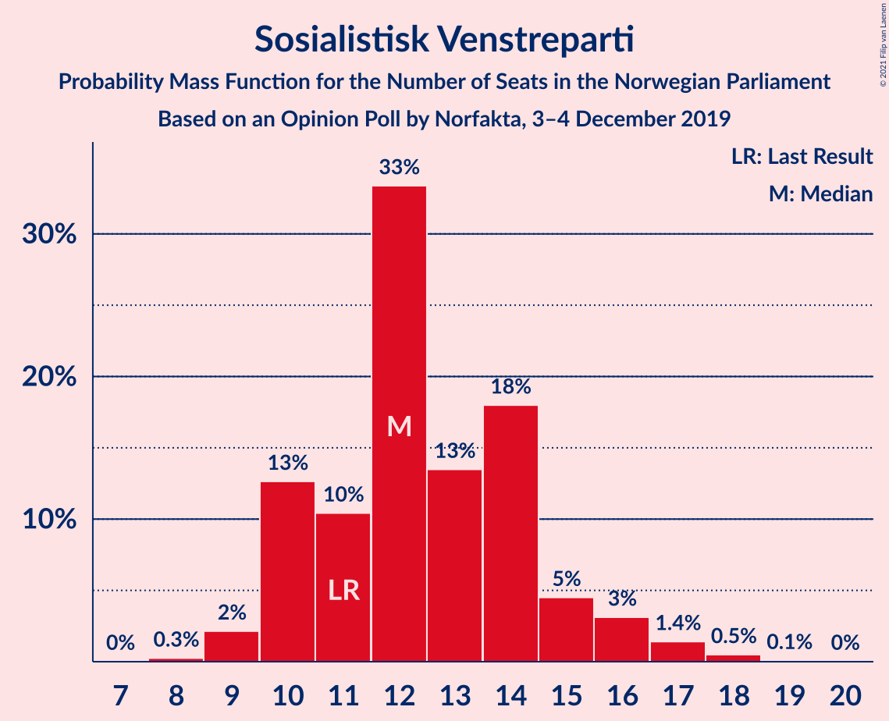
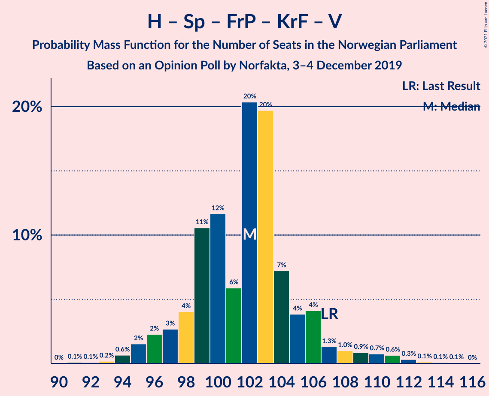
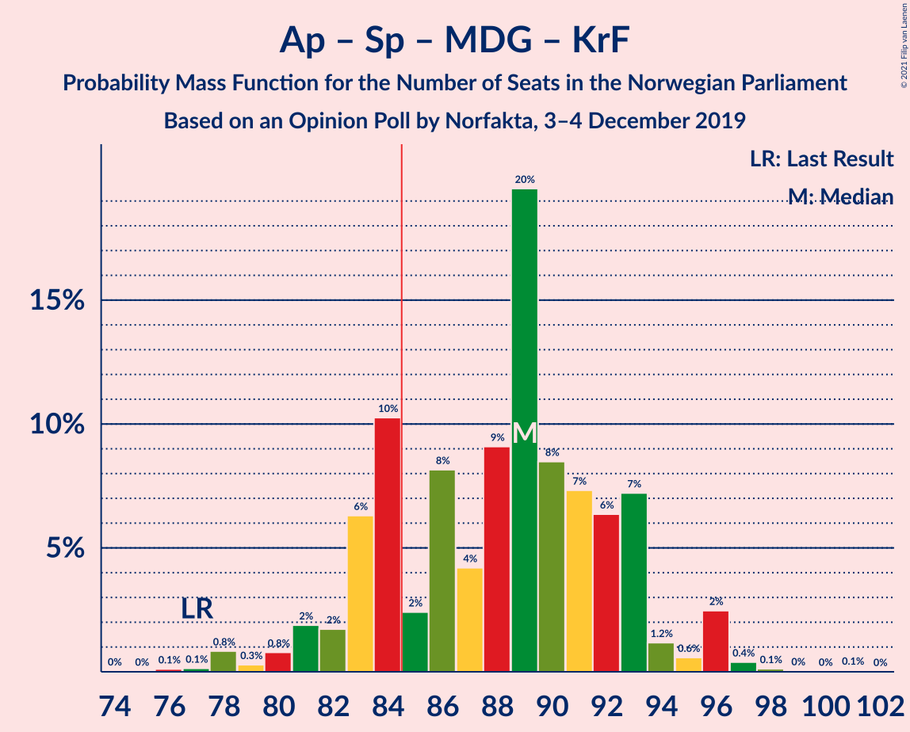
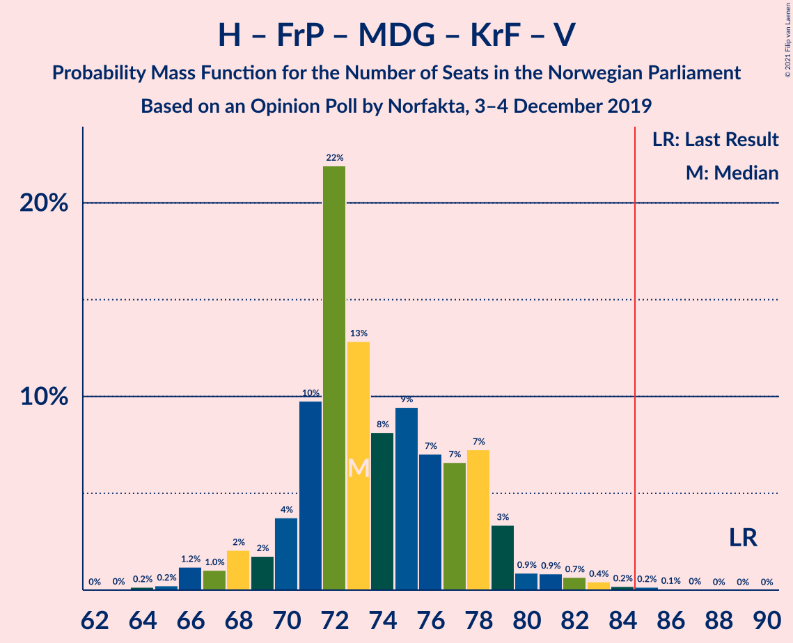
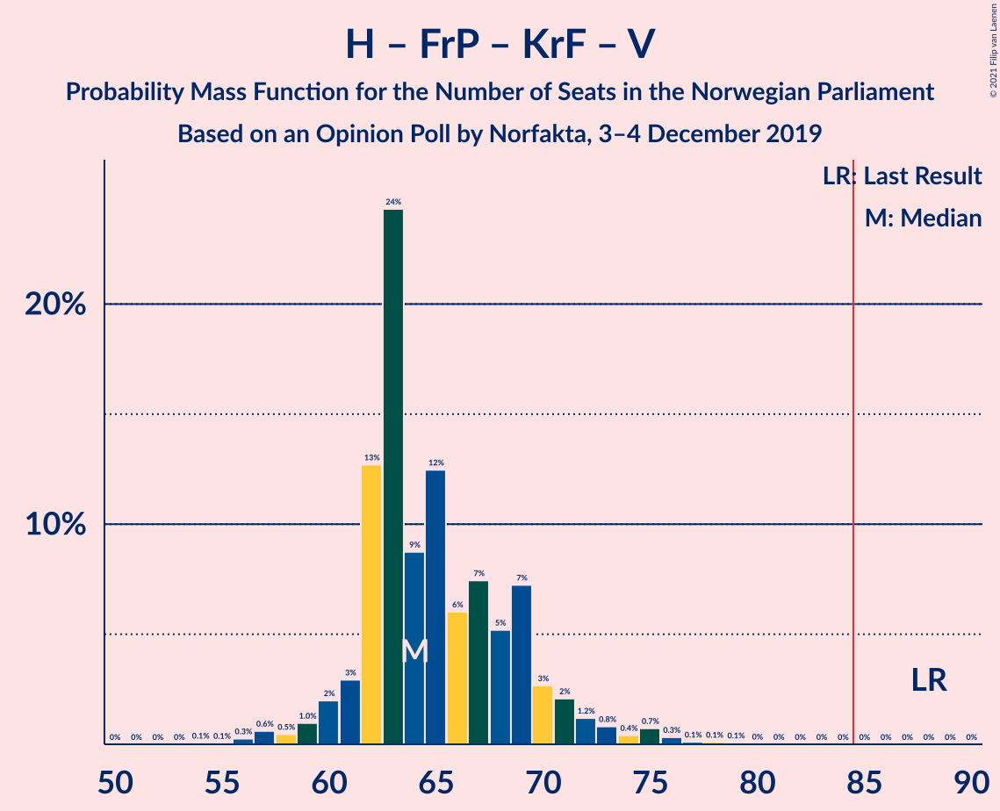
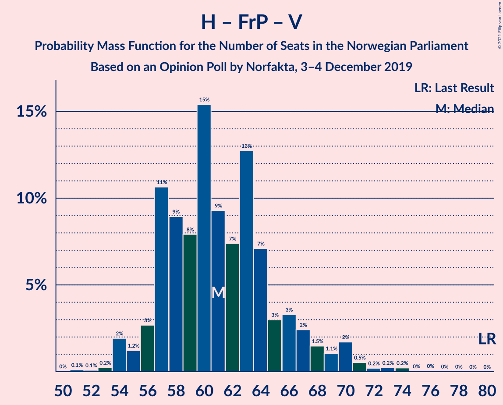
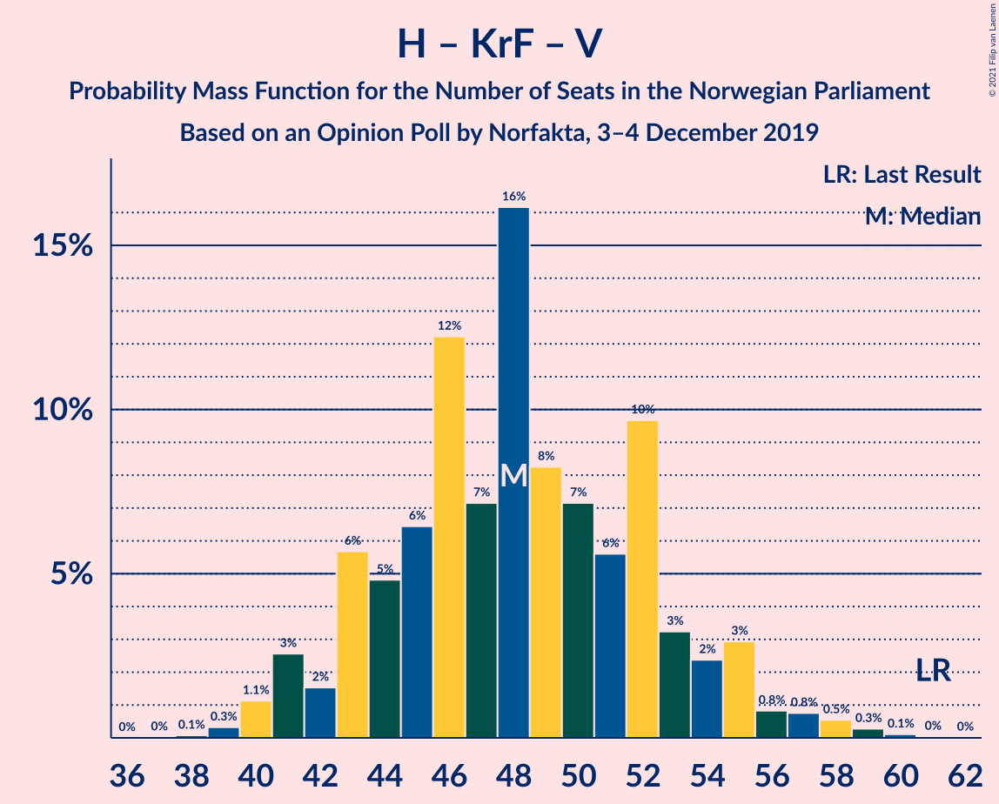

# Opinion Poll by Norfakta, 3–4 December 2019

<a href="#voting-intentions">Voting Intentions</a> | <a href="#seats">Seats</a> | <a href="#coalitions">Coalitions</a> | <a href="#technical-information">Technical Information</a>

## Voting Intentions

### Confidence Intervals

| Party | Last Result | Poll Result | 80% Confidence Interval | 90% Confidence Interval | 95% Confidence Interval | 99% Confidence Interval |
|:-----:|:-----------:|:-----------:|:-----------------------:|:-----------------------:|:-----------------------:|:-----------------------:|
| Høyre | 25.0% | 22.6% | 20.8–24.6% |20.3–25.1% |19.8–25.6% |19.0–26.6% |
| Arbeiderpartiet | 27.4% | 21.4% | 19.6–23.3% |19.1–23.8% |18.7–24.3% |17.8–25.3% |
| Senterpartiet | 10.3% | 19.3% | 17.6–21.1% |17.1–21.7% |16.7–22.1% |15.9–23.0% |
| Fremskrittspartiet | 15.2% | 10.1% | 8.9–11.6% |8.5–12.0% |8.2–12.4% |7.7–13.1% |
| Sosialistisk Venstreparti | 6.0% | 7.7% | 6.6–9.0% |6.3–9.4% |6.0–9.7% |5.5–10.4% |
| Miljøpartiet De Grønne | 3.2% | 5.1% | 4.2–6.2% |3.9–6.5% |3.7–6.8% |3.4–7.4% |
| Rødt | 2.4% | 4.0% | 3.2–5.0% |3.0–5.3% |2.8–5.5% |2.5–6.1% |
| Venstre | 4.4% | 4.0% | 3.2–5.0% |3.0–5.3% |2.8–5.5% |2.5–6.1% |
| Kristelig Folkeparti | 4.2% | 4.0% | 3.2–5.0% |3.0–5.3% |2.8–5.5% |2.5–6.1% |

*Note:* The poll result column reflects the actual value used in the calculations. Published results may vary slightly, and in addition be rounded to fewer digits.

## Seats

### Confidence Intervals

| Party | Last Result | Median | 80% Confidence Interval | 90% Confidence Interval | 95% Confidence Interval | 99% Confidence Interval |
|:-----:|:-----------:|:------:|:-----------------------:|:-----------------------:|:-----------------------:|:-----------------------:|
| <a href="#høyre">Høyre</a> | 45 | 39 | 37–43 |34–45 |33–45 |32–46 |
| <a href="#arbeiderpartiet">Arbeiderpartiet</a> | 49 | 39 | 35–41 |34–43 |33–43 |30–44 |
| <a href="#senterpartiet">Senterpartiet</a> | 19 | 37 | 34–39 |32–39 |30–40 |28–43 |
| <a href="#fremskrittspartiet">Fremskrittspartiet</a> | 27 | 16 | 14–18 |14–20 |13–21 |11–24 |
| <a href="#sosialistisk-venstreparti">Sosialistisk Venstreparti</a> | 11 | 12 | 11–15 |10–15 |10–16 |9–18 |
| <a href="#miljøpartiet-de-grønne">Miljøpartiet De Grønne</a> | 1 | 9 | 7–11 |7–11 |2–11 |1–12 |
| <a href="#rødt">Rødt</a> | 1 | 8 | 6–8 |2–9 |2–9 |2–10 |
| <a href="#venstre">Venstre</a> | 8 | 6 | 2–8 |2–10 |2–10 |1–10 |
| <a href="#kristelig-folkeparti">Kristelig Folkeparti</a> | 8 | 3 | 1–6 |1–8 |1–8 |1–10 |

### Høyre

*For a full overview of the results for this party, see the [Høyre](party-høyre.html) page.*

| Number of Seats | Probability | Accumulated | Special Marks |
|:---------------:|:-----------:|:-----------:|:-------------:|
| 31 | 0.1% | 100% |  |
| 32 | 0.8% | 99.9% |  |
| 33 | 3% | 99.1% |  |
| 34 | 3% | 96% |  |
| 35 | 2% | 93% |  |
| 36 | 0.7% | 91% |  |
| 37 | 5% | 90% |  |
| 38 | 5% | 85% |  |
| 39 | 34% | 80% | Median |
| 40 | 4% | 46% |  |
| 41 | 25% | 42% |  |
| 42 | 5% | 18% |  |
| 43 | 3% | 12% |  |
| 44 | 3% | 10% |  |
| 45 | 5% | 7% | Last Result |
| 46 | 1.3% | 2% |  |
| 47 | 0.3% | 0.5% |  |
| 48 | 0.1% | 0.2% |  |
| 49 | 0% | 0.1% |  |
| 50 | 0% | 0.1% |  |
| 51 | 0% | 0% |  |

### Arbeiderpartiet

*For a full overview of the results for this party, see the [Arbeiderpartiet](party-arbeiderpartiet.html) page.*

| Number of Seats | Probability | Accumulated | Special Marks |
|:---------------:|:-----------:|:-----------:|:-------------:|
| 29 | 0.1% | 100% |  |
| 30 | 0.4% | 99.9% |  |
| 31 | 0.6% | 99.5% |  |
| 32 | 0.8% | 98.9% |  |
| 33 | 1.4% | 98% |  |
| 34 | 3% | 97% |  |
| 35 | 4% | 94% |  |
| 36 | 2% | 90% |  |
| 37 | 3% | 88% |  |
| 38 | 34% | 85% |  |
| 39 | 26% | 51% | Median |
| 40 | 8% | 25% |  |
| 41 | 8% | 17% |  |
| 42 | 4% | 9% |  |
| 43 | 4% | 6% |  |
| 44 | 1.4% | 2% |  |
| 45 | 0.2% | 0.3% |  |
| 46 | 0.1% | 0.2% |  |
| 47 | 0.1% | 0.1% |  |
| 48 | 0% | 0% |  |
| 49 | 0% | 0% | Last Result |

### Senterpartiet

*For a full overview of the results for this party, see the [Senterpartiet](party-senterpartiet.html) page.*

| Number of Seats | Probability | Accumulated | Special Marks |
|:---------------:|:-----------:|:-----------:|:-------------:|
| 19 | 0% | 100% | Last Result |
| 20 | 0% | 100% |  |
| 21 | 0% | 100% |  |
| 22 | 0% | 100% |  |
| 23 | 0% | 100% |  |
| 24 | 0% | 100% |  |
| 25 | 0% | 100% |  |
| 26 | 0% | 100% |  |
| 27 | 0% | 100% |  |
| 28 | 0.5% | 99.9% |  |
| 29 | 0.6% | 99.4% |  |
| 30 | 2% | 98.9% |  |
| 31 | 1.4% | 97% |  |
| 32 | 1.2% | 96% |  |
| 33 | 4% | 95% |  |
| 34 | 5% | 91% |  |
| 35 | 6% | 86% |  |
| 36 | 24% | 80% |  |
| 37 | 7% | 56% | Median |
| 38 | 9% | 49% |  |
| 39 | 36% | 39% |  |
| 40 | 2% | 4% |  |
| 41 | 0.3% | 2% |  |
| 42 | 0.2% | 1.4% |  |
| 43 | 0.8% | 1.2% |  |
| 44 | 0% | 0.4% |  |
| 45 | 0.3% | 0.3% |  |
| 46 | 0.1% | 0.1% |  |
| 47 | 0% | 0% |  |

### Fremskrittspartiet

*For a full overview of the results for this party, see the [Fremskrittspartiet](party-fremskrittspartiet.html) page.*

| Number of Seats | Probability | Accumulated | Special Marks |
|:---------------:|:-----------:|:-----------:|:-------------:|
| 11 | 0.5% | 100% |  |
| 12 | 2% | 99.5% |  |
| 13 | 2% | 98% |  |
| 14 | 6% | 96% |  |
| 15 | 35% | 90% |  |
| 16 | 10% | 55% | Median |
| 17 | 6% | 44% |  |
| 18 | 29% | 39% |  |
| 19 | 2% | 10% |  |
| 20 | 3% | 7% |  |
| 21 | 2% | 4% |  |
| 22 | 0.9% | 2% |  |
| 23 | 0.3% | 0.9% |  |
| 24 | 0.5% | 0.6% |  |
| 25 | 0% | 0.1% |  |
| 26 | 0% | 0% |  |
| 27 | 0% | 0% | Last Result |

### Sosialistisk Venstreparti

*For a full overview of the results for this party, see the [Sosialistisk Venstreparti](party-sosialistiskvenstreparti.html) page.*

| Number of Seats | Probability | Accumulated | Special Marks |
|:---------------:|:-----------:|:-----------:|:-------------:|
| 8 | 0.1% | 100% |  |
| 9 | 1.4% | 99.9% |  |
| 10 | 4% | 98% |  |
| 11 | 5% | 94% | Last Result |
| 12 | 61% | 89% | Median |
| 13 | 5% | 28% |  |
| 14 | 12% | 22% |  |
| 15 | 6% | 10% |  |
| 16 | 2% | 4% |  |
| 17 | 1.2% | 2% |  |
| 18 | 0.6% | 0.8% |  |
| 19 | 0.2% | 0.2% |  |
| 20 | 0% | 0% |  |

### Miljøpartiet De Grønne

*For a full overview of the results for this party, see the [Miljøpartiet De Grønne](party-miljøpartietdegrønne.html) page.*

| Number of Seats | Probability | Accumulated | Special Marks |
|:---------------:|:-----------:|:-----------:|:-------------:|
| 1 | 0.6% | 100% | Last Result |
| 2 | 3% | 99.4% |  |
| 3 | 0.2% | 97% |  |
| 4 | 0% | 96% |  |
| 5 | 0% | 96% |  |
| 6 | 0.5% | 96% |  |
| 7 | 9% | 96% |  |
| 8 | 5% | 87% |  |
| 9 | 41% | 82% | Median |
| 10 | 14% | 41% |  |
| 11 | 25% | 26% |  |
| 12 | 2% | 2% |  |
| 13 | 0.2% | 0.2% |  |
| 14 | 0% | 0% |  |

### Rødt

*For a full overview of the results for this party, see the [Rødt](party-rødt.html) page.*

| Number of Seats | Probability | Accumulated | Special Marks |
|:---------------:|:-----------:|:-----------:|:-------------:|
| 1 | 0.4% | 100% | Last Result |
| 2 | 9% | 99.6% |  |
| 3 | 0% | 90% |  |
| 4 | 0% | 90% |  |
| 5 | 0% | 90% |  |
| 6 | 1.3% | 90% |  |
| 7 | 10% | 89% |  |
| 8 | 72% | 79% | Median |
| 9 | 5% | 7% |  |
| 10 | 2% | 2% |  |
| 11 | 0% | 0% |  |

### Venstre

*For a full overview of the results for this party, see the [Venstre](party-venstre.html) page.*

| Number of Seats | Probability | Accumulated | Special Marks |
|:---------------:|:-----------:|:-----------:|:-------------:|
| 1 | 0.7% | 100% |  |
| 2 | 36% | 99.3% |  |
| 3 | 1.3% | 63% |  |
| 4 | 0% | 62% |  |
| 5 | 0% | 62% |  |
| 6 | 36% | 62% | Median |
| 7 | 11% | 26% |  |
| 8 | 5% | 15% | Last Result |
| 9 | 3% | 10% |  |
| 10 | 7% | 7% |  |
| 11 | 0.1% | 0.2% |  |
| 12 | 0.1% | 0.1% |  |
| 13 | 0% | 0% |  |

### Kristelig Folkeparti

*For a full overview of the results for this party, see the [Kristelig Folkeparti](party-kristeligfolkeparti.html) page.*

| Number of Seats | Probability | Accumulated | Special Marks |
|:---------------:|:-----------:|:-----------:|:-------------:|
| 0 | 0.4% | 100% |  |
| 1 | 15% | 99.6% |  |
| 2 | 24% | 85% |  |
| 3 | 44% | 61% | Median |
| 4 | 0% | 17% |  |
| 5 | 0% | 17% |  |
| 6 | 7% | 17% |  |
| 7 | 4% | 10% |  |
| 8 | 4% | 6% | Last Result |
| 9 | 0.6% | 1.1% |  |
| 10 | 0.1% | 0.6% |  |
| 11 | 0.4% | 0.4% |  |
| 12 | 0.1% | 0.1% |  |
| 13 | 0% | 0% |  |

## Coalitions

### Confidence Intervals

| Coalition | Last Result | Median | Majority? | 80% Confidence Interval | 90% Confidence Interval | 95% Confidence Interval | 99% Confidence Interval |
|:---------:|:-----------:|:------:|:---------:|:-----------------------:|:-----------------------:|:-----------------------:|:-----------------------:|
| Arbeiderpartiet – Senterpartiet – Sosialistisk Venstreparti – Miljøpartiet De Grønne – Rødt | 81 | 106 | 100% | 99–107 | 97–109 | 96–110 | 94–112 |
| Høyre – Senterpartiet – Fremskrittspartiet – Kristelig Folkeparti – Venstre | 107 | 102 | 100% | 98–105 | 97–106 | 95–110 | 94–111 |
| Arbeiderpartiet – Senterpartiet – Sosialistisk Venstreparti – Miljøpartiet De Grønne – Kristelig Folkeparti | 88 | 101 | 100% | 98–103 | 95–106 | 93–108 | 91–108 |
| Arbeiderpartiet – Senterpartiet – Sosialistisk Venstreparti – Miljøpartiet De Grønne | 80 | 98 | 99.8% | 93–100 | 90–102 | 88–103 | 86–104 |
| Arbeiderpartiet – Senterpartiet – Sosialistisk Venstreparti – Rødt | 80 | 96 | 99.8% | 91–99 | 89–101 | 87–103 | 85–103 |
| Arbeiderpartiet – Senterpartiet – Miljøpartiet De Grønne – Kristelig Folkeparti | 77 | 88 | 86% | 84–90 | 83–93 | 81–96 | 79–96 |
| Arbeiderpartiet – Senterpartiet – Sosialistisk Venstreparti | 79 | 89 | 91% | 85–92 | 83–93 | 80–95 | 79–96 |
| Arbeiderpartiet – Senterpartiet – Kristelig Folkeparti | 76 | 80 | 5% | 75–83 | 74–85 | 72–86 | 69–87 |
| Høyre – Fremskrittspartiet – Miljøpartiet De Grønne – Kristelig Folkeparti – Venstre | 89 | 73 | 0.2% | 70–78 | 68–80 | 66–82 | 66–84 |
| Arbeiderpartiet – Senterpartiet | 68 | 76 | 0.1% | 71–78 | 69–80 | 69–81 | 67–82 |
| Høyre – Fremskrittspartiet – Kristelig Folkeparti – Venstre | 88 | 63 | 0% | 62–70 | 60–72 | 59–73 | 57–75 |
| Høyre – Fremskrittspartiet – Venstre | 80 | 60 | 0% | 58–67 | 56–68 | 54–70 | 54–71 |
| Høyre – Fremskrittspartiet | 72 | 56 | 0% | 52–61 | 50–61 | 47–62 | 47–64 |
| Arbeiderpartiet – Sosialistisk Venstreparti | 60 | 51 | 0% | 48–55 | 47–56 | 46–58 | 42–58 |
| Høyre – Kristelig Folkeparti – Venstre | 61 | 48 | 0% | 45–52 | 43–55 | 42–56 | 39–59 |
| Senterpartiet – Kristelig Folkeparti – Venstre | 35 | 46 | 0% | 40–50 | 40–51 | 38–52 | 35–55 |

### Arbeiderpartiet – Senterpartiet – Sosialistisk Venstreparti – Miljøpartiet De Grønne – Rødt

| Number of Seats | Probability | Accumulated | Special Marks |
|:---------------:|:-----------:|:-----------:|:-------------:|
| 81 | 0% | 100% | Last Result |
| 82 | 0% | 100% |  |
| 83 | 0% | 100% |  |
| 84 | 0% | 100% |  |
| 85 | 0% | 100% | Majority |
| 86 | 0% | 100% |  |
| 87 | 0% | 100% |  |
| 88 | 0% | 100% |  |
| 89 | 0% | 100% |  |
| 90 | 0% | 100% |  |
| 91 | 0.1% | 99.9% |  |
| 92 | 0.1% | 99.8% |  |
| 93 | 0.2% | 99.8% |  |
| 94 | 2% | 99.6% |  |
| 95 | 0.3% | 98% |  |
| 96 | 2% | 98% |  |
| 97 | 2% | 96% |  |
| 98 | 2% | 94% |  |
| 99 | 2% | 92% |  |
| 100 | 2% | 89% |  |
| 101 | 3% | 87% |  |
| 102 | 3% | 84% |  |
| 103 | 7% | 81% |  |
| 104 | 3% | 74% |  |
| 105 | 4% | 71% | Median |
| 106 | 54% | 67% |  |
| 107 | 4% | 14% |  |
| 108 | 3% | 9% |  |
| 109 | 3% | 6% |  |
| 110 | 2% | 3% |  |
| 111 | 0.5% | 1.1% |  |
| 112 | 0.1% | 0.6% |  |
| 113 | 0.4% | 0.4% |  |
| 114 | 0% | 0.1% |  |
| 115 | 0% | 0% |  |

### Høyre – Senterpartiet – Fremskrittspartiet – Kristelig Folkeparti – Venstre

| Number of Seats | Probability | Accumulated | Special Marks |
|:---------------:|:-----------:|:-----------:|:-------------:|
| 92 | 0.1% | 100% |  |
| 93 | 0.2% | 99.9% |  |
| 94 | 1.3% | 99.7% |  |
| 95 | 2% | 98% |  |
| 96 | 0.9% | 96% |  |
| 97 | 2% | 95% |  |
| 98 | 5% | 93% |  |
| 99 | 25% | 88% |  |
| 100 | 2% | 63% |  |
| 101 | 2% | 62% | Median |
| 102 | 37% | 59% |  |
| 103 | 6% | 23% |  |
| 104 | 5% | 17% |  |
| 105 | 4% | 11% |  |
| 106 | 2% | 7% |  |
| 107 | 0.9% | 5% | Last Result |
| 108 | 0.4% | 4% |  |
| 109 | 1.1% | 4% |  |
| 110 | 1.1% | 3% |  |
| 111 | 1.1% | 1.4% |  |
| 112 | 0.1% | 0.3% |  |
| 113 | 0% | 0.2% |  |
| 114 | 0% | 0.1% |  |
| 115 | 0.1% | 0.1% |  |
| 116 | 0% | 0% |  |

### Arbeiderpartiet – Senterpartiet – Sosialistisk Venstreparti – Miljøpartiet De Grønne – Kristelig Folkeparti

| Number of Seats | Probability | Accumulated | Special Marks |
|:---------------:|:-----------:|:-----------:|:-------------:|
| 88 | 0% | 100% | Last Result |
| 89 | 0% | 99.9% |  |
| 90 | 0.1% | 99.9% |  |
| 91 | 0.6% | 99.9% |  |
| 92 | 0.3% | 99.3% |  |
| 93 | 2% | 99.0% |  |
| 94 | 1.3% | 97% |  |
| 95 | 1.1% | 96% |  |
| 96 | 2% | 95% |  |
| 97 | 3% | 93% |  |
| 98 | 9% | 90% |  |
| 99 | 1.5% | 81% |  |
| 100 | 26% | 80% | Median |
| 101 | 37% | 54% |  |
| 102 | 5% | 17% |  |
| 103 | 3% | 12% |  |
| 104 | 2% | 9% |  |
| 105 | 2% | 7% |  |
| 106 | 1.5% | 5% |  |
| 107 | 0.8% | 4% |  |
| 108 | 3% | 3% |  |
| 109 | 0% | 0.3% |  |
| 110 | 0.1% | 0.3% |  |
| 111 | 0.1% | 0.1% |  |
| 112 | 0% | 0.1% |  |
| 113 | 0% | 0% |  |

### Arbeiderpartiet – Senterpartiet – Sosialistisk Venstreparti – Miljøpartiet De Grønne

| Number of Seats | Probability | Accumulated | Special Marks |
|:---------------:|:-----------:|:-----------:|:-------------:|
| 80 | 0% | 100% | Last Result |
| 81 | 0% | 100% |  |
| 82 | 0% | 100% |  |
| 83 | 0% | 100% |  |
| 84 | 0.1% | 100% |  |
| 85 | 0.1% | 99.8% | Majority |
| 86 | 2% | 99.8% |  |
| 87 | 0.2% | 98% |  |
| 88 | 0.8% | 98% |  |
| 89 | 1.4% | 97% |  |
| 90 | 1.4% | 96% |  |
| 91 | 1.5% | 94% |  |
| 92 | 1.5% | 93% |  |
| 93 | 2% | 91% |  |
| 94 | 2% | 90% |  |
| 95 | 7% | 88% |  |
| 96 | 3% | 81% |  |
| 97 | 5% | 78% | Median |
| 98 | 55% | 73% |  |
| 99 | 6% | 18% |  |
| 100 | 4% | 12% |  |
| 101 | 2% | 8% |  |
| 102 | 3% | 6% |  |
| 103 | 2% | 3% |  |
| 104 | 0.5% | 0.6% |  |
| 105 | 0.1% | 0.2% |  |
| 106 | 0% | 0.1% |  |
| 107 | 0% | 0% |  |

### Arbeiderpartiet – Senterpartiet – Sosialistisk Venstreparti – Rødt

| Number of Seats | Probability | Accumulated | Special Marks |
|:---------------:|:-----------:|:-----------:|:-------------:|
| 80 | 0% | 100% | Last Result |
| 81 | 0% | 100% |  |
| 82 | 0% | 100% |  |
| 83 | 0.1% | 100% |  |
| 84 | 0.1% | 99.9% |  |
| 85 | 0.3% | 99.8% | Majority |
| 86 | 1.0% | 99.4% |  |
| 87 | 2% | 98% |  |
| 88 | 1.2% | 96% |  |
| 89 | 0.7% | 95% |  |
| 90 | 4% | 94% |  |
| 91 | 3% | 90% |  |
| 92 | 2% | 87% |  |
| 93 | 5% | 85% |  |
| 94 | 4% | 80% |  |
| 95 | 24% | 76% |  |
| 96 | 6% | 52% | Median |
| 97 | 33% | 46% |  |
| 98 | 1.1% | 13% |  |
| 99 | 4% | 12% |  |
| 100 | 1.5% | 8% |  |
| 101 | 3% | 6% |  |
| 102 | 0.3% | 3% |  |
| 103 | 3% | 3% |  |
| 104 | 0.1% | 0.3% |  |
| 105 | 0.1% | 0.1% |  |
| 106 | 0% | 0.1% |  |
| 107 | 0% | 0% |  |

### Arbeiderpartiet – Senterpartiet – Miljøpartiet De Grønne – Kristelig Folkeparti

| Number of Seats | Probability | Accumulated | Special Marks |
|:---------------:|:-----------:|:-----------:|:-------------:|
| 75 | 0% | 100% |  |
| 76 | 0.1% | 99.9% |  |
| 77 | 0% | 99.9% | Last Result |
| 78 | 0.1% | 99.8% |  |
| 79 | 0.3% | 99.7% |  |
| 80 | 0.7% | 99.4% |  |
| 81 | 2% | 98.7% |  |
| 82 | 1.1% | 97% |  |
| 83 | 5% | 96% |  |
| 84 | 5% | 91% |  |
| 85 | 4% | 86% | Majority |
| 86 | 9% | 82% |  |
| 87 | 2% | 73% |  |
| 88 | 21% | 71% | Median |
| 89 | 35% | 49% |  |
| 90 | 5% | 14% |  |
| 91 | 2% | 9% |  |
| 92 | 1.2% | 7% |  |
| 93 | 2% | 6% |  |
| 94 | 0.5% | 4% |  |
| 95 | 0.6% | 4% |  |
| 96 | 3% | 3% |  |
| 97 | 0.1% | 0.3% |  |
| 98 | 0.1% | 0.2% |  |
| 99 | 0% | 0.1% |  |
| 100 | 0% | 0% |  |

### Arbeiderpartiet – Senterpartiet – Sosialistisk Venstreparti

| Number of Seats | Probability | Accumulated | Special Marks |
|:---------------:|:-----------:|:-----------:|:-------------:|
| 76 | 0% | 100% |  |
| 77 | 0.1% | 99.9% |  |
| 78 | 0.2% | 99.8% |  |
| 79 | 2% | 99.6% | Last Result |
| 80 | 1.5% | 98% |  |
| 81 | 0.7% | 96% |  |
| 82 | 0.2% | 95% |  |
| 83 | 2% | 95% |  |
| 84 | 2% | 93% |  |
| 85 | 4% | 91% | Majority |
| 86 | 5% | 87% |  |
| 87 | 24% | 83% |  |
| 88 | 7% | 59% | Median |
| 89 | 36% | 51% |  |
| 90 | 2% | 15% |  |
| 91 | 2% | 13% |  |
| 92 | 3% | 11% |  |
| 93 | 4% | 8% |  |
| 94 | 2% | 4% |  |
| 95 | 0.8% | 3% |  |
| 96 | 2% | 2% |  |
| 97 | 0.1% | 0.2% |  |
| 98 | 0% | 0.1% |  |
| 99 | 0% | 0% |  |

### Arbeiderpartiet – Senterpartiet – Kristelig Folkeparti

| Number of Seats | Probability | Accumulated | Special Marks |
|:---------------:|:-----------:|:-----------:|:-------------:|
| 66 | 0.1% | 100% |  |
| 67 | 0.1% | 99.9% |  |
| 68 | 0.1% | 99.9% |  |
| 69 | 0.5% | 99.8% |  |
| 70 | 0.8% | 99.2% |  |
| 71 | 0.8% | 98% |  |
| 72 | 0.8% | 98% |  |
| 73 | 1.2% | 97% |  |
| 74 | 5% | 96% |  |
| 75 | 3% | 91% |  |
| 76 | 7% | 88% | Last Result |
| 77 | 23% | 81% |  |
| 78 | 2% | 58% |  |
| 79 | 5% | 56% | Median |
| 80 | 36% | 52% |  |
| 81 | 3% | 16% |  |
| 82 | 2% | 13% |  |
| 83 | 2% | 10% |  |
| 84 | 2% | 8% |  |
| 85 | 2% | 5% | Majority |
| 86 | 3% | 4% |  |
| 87 | 0.4% | 0.8% |  |
| 88 | 0.2% | 0.4% |  |
| 89 | 0.1% | 0.2% |  |
| 90 | 0.1% | 0.1% |  |
| 91 | 0% | 0% |  |

### Høyre – Fremskrittspartiet – Miljøpartiet De Grønne – Kristelig Folkeparti – Venstre

| Number of Seats | Probability | Accumulated | Special Marks |
|:---------------:|:-----------:|:-----------:|:-------------:|
| 63 | 0% | 100% |  |
| 64 | 0.1% | 99.9% |  |
| 65 | 0.1% | 99.9% |  |
| 66 | 3% | 99.7% |  |
| 67 | 0.3% | 97% |  |
| 68 | 3% | 97% |  |
| 69 | 1.5% | 94% |  |
| 70 | 4% | 92% |  |
| 71 | 1.1% | 88% |  |
| 72 | 33% | 87% |  |
| 73 | 6% | 54% | Median |
| 74 | 24% | 48% |  |
| 75 | 4% | 24% |  |
| 76 | 5% | 20% |  |
| 77 | 2% | 15% |  |
| 78 | 3% | 13% |  |
| 79 | 4% | 10% |  |
| 80 | 0.6% | 6% |  |
| 81 | 1.2% | 5% |  |
| 82 | 2% | 4% |  |
| 83 | 1.0% | 2% |  |
| 84 | 0.3% | 0.6% |  |
| 85 | 0.1% | 0.2% | Majority |
| 86 | 0.1% | 0.1% |  |
| 87 | 0% | 0% |  |
| 88 | 0% | 0% |  |
| 89 | 0% | 0% | Last Result |

### Arbeiderpartiet – Senterpartiet

| Number of Seats | Probability | Accumulated | Special Marks |
|:---------------:|:-----------:|:-----------:|:-------------:|
| 64 | 0% | 100% |  |
| 65 | 0.2% | 99.9% |  |
| 66 | 0.1% | 99.7% |  |
| 67 | 0.7% | 99.6% |  |
| 68 | 1.1% | 98.9% | Last Result |
| 69 | 4% | 98% |  |
| 70 | 1.2% | 94% |  |
| 71 | 4% | 93% |  |
| 72 | 3% | 89% |  |
| 73 | 2% | 86% |  |
| 74 | 6% | 84% |  |
| 75 | 26% | 79% |  |
| 76 | 5% | 53% | Median |
| 77 | 35% | 48% |  |
| 78 | 4% | 13% |  |
| 79 | 1.1% | 9% |  |
| 80 | 5% | 8% |  |
| 81 | 2% | 3% |  |
| 82 | 0.6% | 0.8% |  |
| 83 | 0.1% | 0.3% |  |
| 84 | 0.1% | 0.2% |  |
| 85 | 0.1% | 0.1% | Majority |
| 86 | 0% | 0% |  |

### Høyre – Fremskrittspartiet – Kristelig Folkeparti – Venstre

| Number of Seats | Probability | Accumulated | Special Marks |
|:---------------:|:-----------:|:-----------:|:-------------:|
| 55 | 0% | 100% |  |
| 56 | 0.4% | 99.9% |  |
| 57 | 0.1% | 99.6% |  |
| 58 | 0.5% | 99.4% |  |
| 59 | 2% | 98.9% |  |
| 60 | 3% | 97% |  |
| 61 | 3% | 94% |  |
| 62 | 4% | 91% |  |
| 63 | 53% | 86% |  |
| 64 | 4% | 33% | Median |
| 65 | 3% | 29% |  |
| 66 | 7% | 26% |  |
| 67 | 3% | 19% |  |
| 68 | 3% | 16% |  |
| 69 | 2% | 13% |  |
| 70 | 2% | 11% |  |
| 71 | 2% | 8% |  |
| 72 | 2% | 6% |  |
| 73 | 2% | 4% |  |
| 74 | 0.3% | 2% |  |
| 75 | 2% | 2% |  |
| 76 | 0.2% | 0.4% |  |
| 77 | 0.1% | 0.2% |  |
| 78 | 0.1% | 0.1% |  |
| 79 | 0% | 0.1% |  |
| 80 | 0% | 0% |  |
| 81 | 0% | 0% |  |
| 82 | 0% | 0% |  |
| 83 | 0% | 0% |  |
| 84 | 0% | 0% |  |
| 85 | 0% | 0% | Majority |
| 86 | 0% | 0% |  |
| 87 | 0% | 0% |  |
| 88 | 0% | 0% | Last Result |

### Høyre – Fremskrittspartiet – Venstre

| Number of Seats | Probability | Accumulated | Special Marks |
|:---------------:|:-----------:|:-----------:|:-------------:|
| 52 | 0.1% | 100% |  |
| 53 | 0.4% | 99.9% |  |
| 54 | 3% | 99.5% |  |
| 55 | 1.1% | 97% |  |
| 56 | 1.3% | 96% |  |
| 57 | 0.6% | 94% |  |
| 58 | 5% | 94% |  |
| 59 | 4% | 88% |  |
| 60 | 36% | 85% |  |
| 61 | 23% | 49% | Median |
| 62 | 2% | 26% |  |
| 63 | 6% | 23% |  |
| 64 | 3% | 17% |  |
| 65 | 2% | 14% |  |
| 66 | 2% | 12% |  |
| 67 | 3% | 10% |  |
| 68 | 2% | 7% |  |
| 69 | 2% | 5% |  |
| 70 | 2% | 3% |  |
| 71 | 0.8% | 1.3% |  |
| 72 | 0.2% | 0.5% |  |
| 73 | 0.2% | 0.3% |  |
| 74 | 0.1% | 0.2% |  |
| 75 | 0% | 0.1% |  |
| 76 | 0% | 0% |  |
| 77 | 0% | 0% |  |
| 78 | 0% | 0% |  |
| 79 | 0% | 0% |  |
| 80 | 0% | 0% | Last Result |

### Høyre – Fremskrittspartiet

| Number of Seats | Probability | Accumulated | Special Marks |
|:---------------:|:-----------:|:-----------:|:-------------:|
| 47 | 2% | 100% |  |
| 48 | 0.5% | 97% |  |
| 49 | 0.9% | 97% |  |
| 50 | 1.2% | 96% |  |
| 51 | 2% | 95% |  |
| 52 | 5% | 93% |  |
| 53 | 2% | 88% |  |
| 54 | 34% | 86% |  |
| 55 | 3% | 53% | Median |
| 56 | 3% | 50% |  |
| 57 | 6% | 47% |  |
| 58 | 4% | 42% |  |
| 59 | 24% | 38% |  |
| 60 | 2% | 14% |  |
| 61 | 8% | 12% |  |
| 62 | 2% | 4% |  |
| 63 | 0.6% | 2% |  |
| 64 | 1.2% | 2% |  |
| 65 | 0.3% | 0.5% |  |
| 66 | 0.1% | 0.2% |  |
| 67 | 0.1% | 0.1% |  |
| 68 | 0% | 0% |  |
| 69 | 0% | 0% |  |
| 70 | 0% | 0% |  |
| 71 | 0% | 0% |  |
| 72 | 0% | 0% | Last Result |

### Arbeiderpartiet – Sosialistisk Venstreparti

| Number of Seats | Probability | Accumulated | Special Marks |
|:---------------:|:-----------:|:-----------:|:-------------:|
| 41 | 0.1% | 100% |  |
| 42 | 1.0% | 99.9% |  |
| 43 | 0.1% | 98.9% |  |
| 44 | 0.6% | 98.8% |  |
| 45 | 0.3% | 98% |  |
| 46 | 1.1% | 98% |  |
| 47 | 2% | 97% |  |
| 48 | 6% | 95% |  |
| 49 | 3% | 89% |  |
| 50 | 35% | 86% |  |
| 51 | 23% | 51% | Median |
| 52 | 5% | 28% |  |
| 53 | 2% | 23% |  |
| 54 | 7% | 21% |  |
| 55 | 9% | 14% |  |
| 56 | 2% | 5% |  |
| 57 | 0.7% | 4% |  |
| 58 | 3% | 3% |  |
| 59 | 0.2% | 0.3% |  |
| 60 | 0.1% | 0.1% | Last Result |
| 61 | 0% | 0% |  |

### Høyre – Kristelig Folkeparti – Venstre

| Number of Seats | Probability | Accumulated | Special Marks |
|:---------------:|:-----------:|:-----------:|:-------------:|
| 39 | 0.6% | 100% |  |
| 40 | 0.3% | 99.3% |  |
| 41 | 0.5% | 99.1% |  |
| 42 | 2% | 98.5% |  |
| 43 | 2% | 97% |  |
| 44 | 3% | 95% |  |
| 45 | 23% | 92% |  |
| 46 | 4% | 68% |  |
| 47 | 2% | 64% |  |
| 48 | 35% | 62% | Median |
| 49 | 2% | 27% |  |
| 50 | 7% | 25% |  |
| 51 | 4% | 18% |  |
| 52 | 4% | 14% |  |
| 53 | 1.3% | 10% |  |
| 54 | 2% | 8% |  |
| 55 | 3% | 6% |  |
| 56 | 2% | 3% |  |
| 57 | 0.2% | 2% |  |
| 58 | 0.8% | 1.5% |  |
| 59 | 0.3% | 0.6% |  |
| 60 | 0.1% | 0.3% |  |
| 61 | 0.1% | 0.1% | Last Result |
| 62 | 0% | 0% |  |

### Senterpartiet – Kristelig Folkeparti – Venstre

| Number of Seats | Probability | Accumulated | Special Marks |
|:---------------:|:-----------:|:-----------:|:-------------:|
| 33 | 0.1% | 100% |  |
| 34 | 0.4% | 99.9% |  |
| 35 | 0.3% | 99.5% | Last Result |
| 36 | 0.4% | 99.2% |  |
| 37 | 1.1% | 98.8% |  |
| 38 | 0.4% | 98% |  |
| 39 | 2% | 97% |  |
| 40 | 21% | 96% |  |
| 41 | 3% | 74% |  |
| 42 | 4% | 71% |  |
| 43 | 3% | 67% |  |
| 44 | 5% | 64% |  |
| 45 | 6% | 59% |  |
| 46 | 3% | 53% | Median |
| 47 | 3% | 49% |  |
| 48 | 34% | 47% |  |
| 49 | 1.3% | 12% |  |
| 50 | 3% | 11% |  |
| 51 | 4% | 8% |  |
| 52 | 1.2% | 4% |  |
| 53 | 0.8% | 2% |  |
| 54 | 0.5% | 2% |  |
| 55 | 0.6% | 1.0% |  |
| 56 | 0.1% | 0.4% |  |
| 57 | 0.1% | 0.3% |  |
| 58 | 0.2% | 0.3% |  |
| 59 | 0% | 0% |  |

## Technical Information

### Opinion Poll

+ **Polling firm:** Norfakta
+ **Commissioner(s):** —
+ **Fieldwork period:** 3–4 December 2019

### Calculations

+ **Sample size:** 810
+ **Simulations done:** 131,072
+ **Error estimate:** 2.55%

