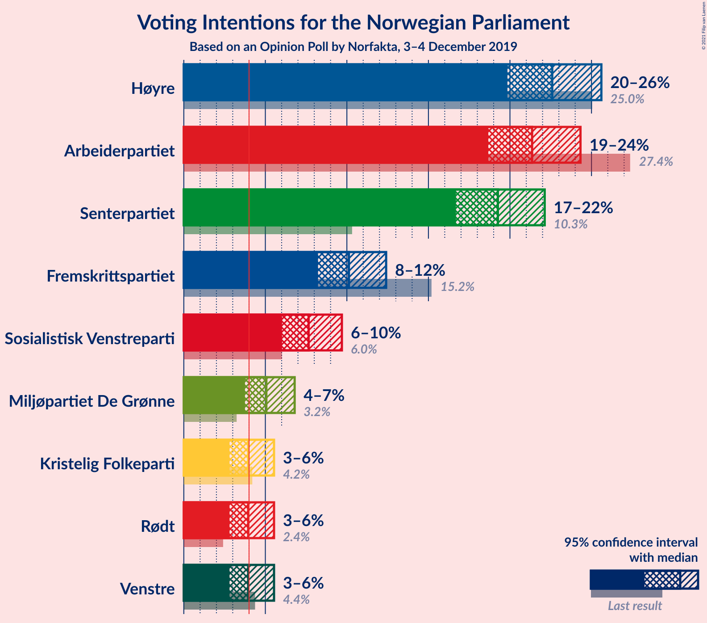
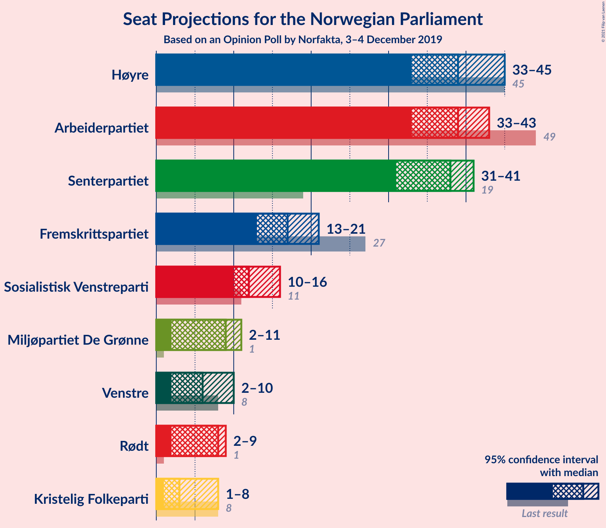
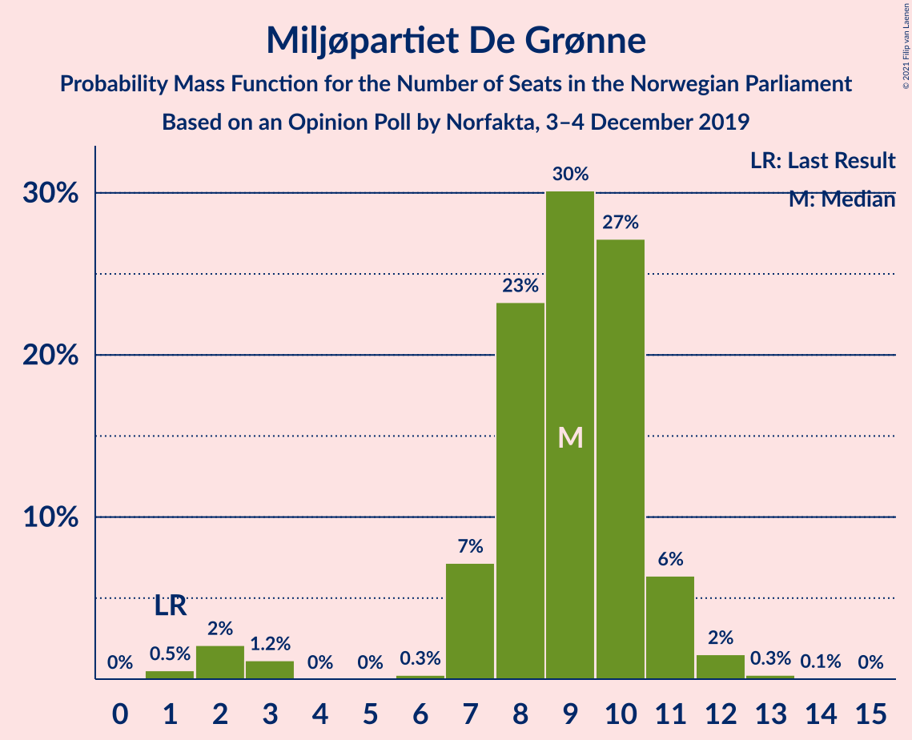
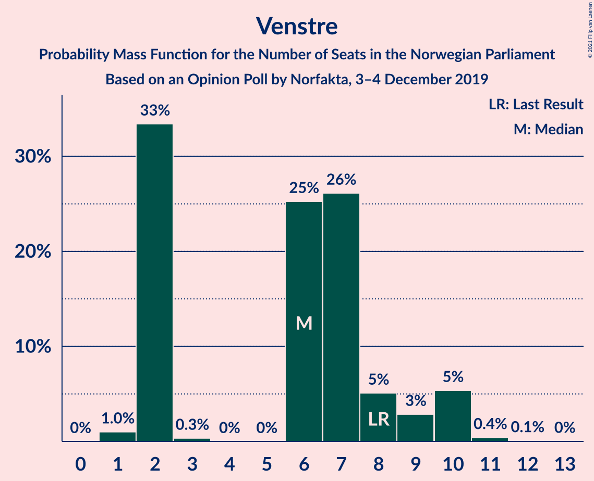
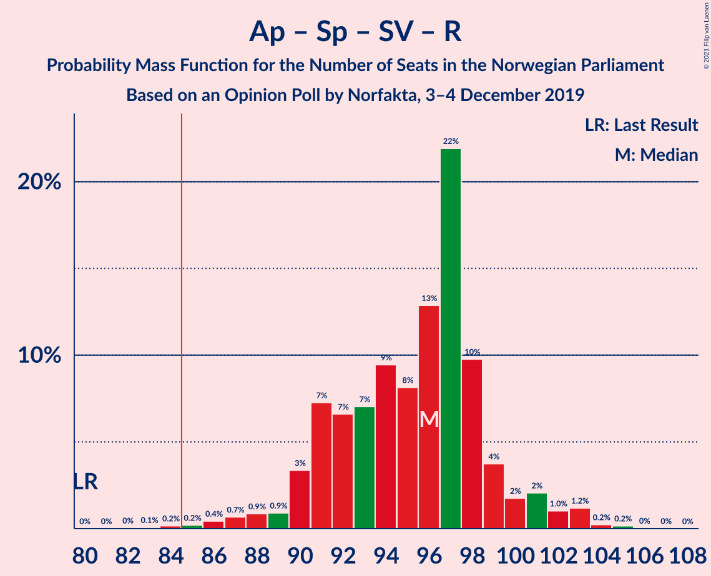
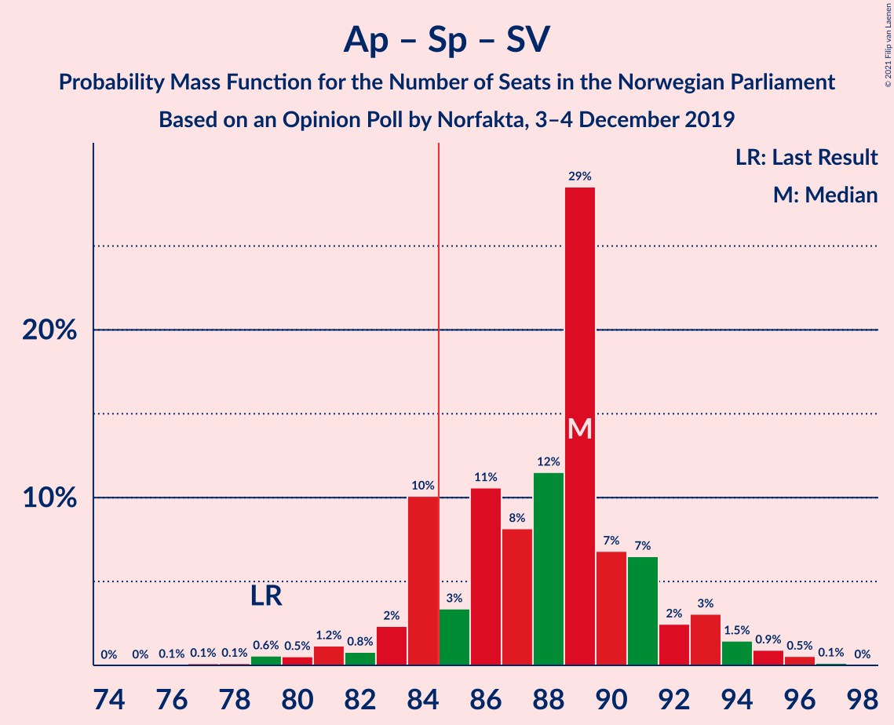
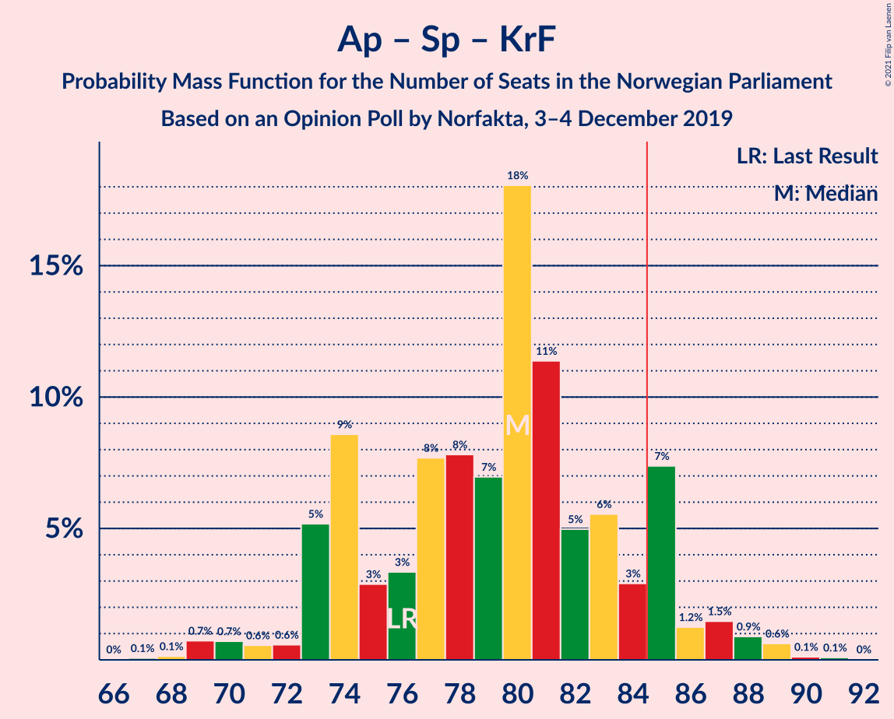
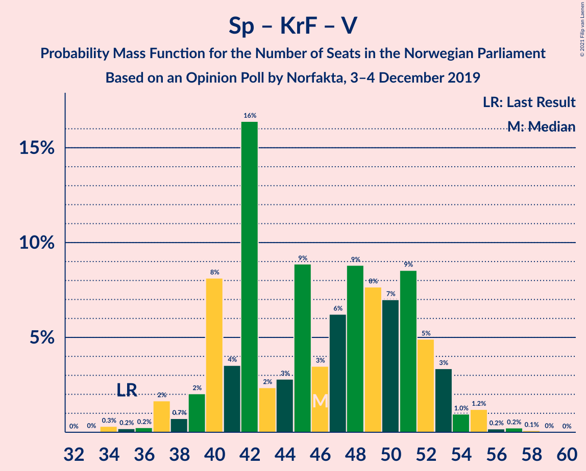

# Opinion Poll by Norfakta, 3–4 December 2019

<a href="#voting-intentions">Voting Intentions</a> | <a href="#seats">Seats</a> | <a href="#coalitions">Coalitions</a> | <a href="#technical-information">Technical Information</a>

## Voting Intentions

### Confidence Intervals

| Party | Last Result | Poll Result | 80% Confidence Interval | 90% Confidence Interval | 95% Confidence Interval | 99% Confidence Interval |
|:-----:|:-----------:|:-----------:|:-----------------------:|:-----------------------:|:-----------------------:|:-----------------------:|
| Høyre | 25.0% | 22.6% | 20.8–24.6% |20.3–25.1% |19.8–25.6% |19.0–26.6% |
| Arbeiderpartiet | 27.4% | 21.4% | 19.6–23.3% |19.1–23.8% |18.7–24.3% |17.8–25.3% |
| Senterpartiet | 10.3% | 19.3% | 17.6–21.1% |17.1–21.7% |16.7–22.1% |15.9–23.0% |
| Fremskrittspartiet | 15.2% | 10.1% | 8.9–11.6% |8.5–12.0% |8.2–12.4% |7.7–13.1% |
| Sosialistisk Venstreparti | 6.0% | 7.7% | 6.6–9.0% |6.3–9.4% |6.0–9.7% |5.5–10.4% |
| Miljøpartiet De Grønne | 3.2% | 5.1% | 4.2–6.2% |3.9–6.5% |3.7–6.8% |3.4–7.4% |
| Rødt | 2.4% | 4.0% | 3.2–5.0% |3.0–5.3% |2.8–5.5% |2.5–6.1% |
| Venstre | 4.4% | 4.0% | 3.2–5.0% |3.0–5.3% |2.8–5.5% |2.5–6.1% |
| Kristelig Folkeparti | 4.2% | 4.0% | 3.2–5.0% |3.0–5.3% |2.8–5.5% |2.5–6.1% |

*Note:* The poll result column reflects the actual value used in the calculations. Published results may vary slightly, and in addition be rounded to fewer digits.

## Seats

### Confidence Intervals

| Party | Last Result | Median | 80% Confidence Interval | 90% Confidence Interval | 95% Confidence Interval | 99% Confidence Interval |
|:-----:|:-----------:|:------:|:-----------------------:|:-----------------------:|:-----------------------:|:-----------------------:|
| <a href="#høyre">Høyre</a> | 45 | 39 | 35–43 |33–44 |33–45 |32–47 |
| <a href="#arbeiderpartiet">Arbeiderpartiet</a> | 49 | 39 | 34–41 |34–43 |33–43 |31–45 |
| <a href="#senterpartiet">Senterpartiet</a> | 19 | 38 | 33–40 |32–41 |31–41 |29–43 |
| <a href="#fremskrittspartiet">Fremskrittspartiet</a> | 27 | 17 | 14–20 |13–21 |13–21 |12–23 |
| <a href="#sosialistisk-venstreparti">Sosialistisk Venstreparti</a> | 11 | 12 | 10–14 |10–16 |10–16 |9–18 |
| <a href="#miljøpartiet-de-grønne">Miljøpartiet De Grønne</a> | 1 | 9 | 7–10 |7–11 |2–11 |1–12 |
| <a href="#rødt">Rødt</a> | 1 | 8 | 7–9 |2–9 |2–9 |1–10 |
| <a href="#venstre">Venstre</a> | 8 | 6 | 2–8 |2–10 |2–10 |1–11 |
| <a href="#kristelig-folkeparti">Kristelig Folkeparti</a> | 8 | 3 | 1–7 |1–7 |1–8 |1–10 |

### Høyre

*For a full overview of the results for this party, see the [Høyre](party-høyre.html) page.*

| Number of Seats | Probability | Accumulated | Special Marks |
|:---------------:|:-----------:|:-----------:|:-------------:|
| 31 | 0.1% | 100% |  |
| 32 | 2% | 99.9% |  |
| 33 | 4% | 98% |  |
| 34 | 3% | 94% |  |
| 35 | 4% | 91% |  |
| 36 | 13% | 88% |  |
| 37 | 3% | 75% |  |
| 38 | 10% | 72% |  |
| 39 | 19% | 61% | Median |
| 40 | 12% | 42% |  |
| 41 | 9% | 31% |  |
| 42 | 8% | 22% |  |
| 43 | 7% | 14% |  |
| 44 | 3% | 7% |  |
| 45 | 2% | 4% | Last Result |
| 46 | 1.2% | 2% |  |
| 47 | 0.4% | 0.6% |  |
| 48 | 0.1% | 0.2% |  |
| 49 | 0.1% | 0.1% |  |
| 50 | 0% | 0% |  |

### Arbeiderpartiet

*For a full overview of the results for this party, see the [Arbeiderpartiet](party-arbeiderpartiet.html) page.*

| Number of Seats | Probability | Accumulated | Special Marks |
|:---------------:|:-----------:|:-----------:|:-------------:|
| 29 | 0.2% | 100% |  |
| 30 | 0.3% | 99.8% |  |
| 31 | 0.4% | 99.5% |  |
| 32 | 1.1% | 99.1% |  |
| 33 | 1.1% | 98% |  |
| 34 | 7% | 97% |  |
| 35 | 4% | 90% |  |
| 36 | 3% | 86% |  |
| 37 | 4% | 82% |  |
| 38 | 22% | 79% |  |
| 39 | 18% | 57% | Median |
| 40 | 19% | 39% |  |
| 41 | 12% | 20% |  |
| 42 | 2% | 8% |  |
| 43 | 3% | 6% |  |
| 44 | 2% | 2% |  |
| 45 | 0.6% | 0.8% |  |
| 46 | 0.1% | 0.1% |  |
| 47 | 0% | 0% |  |
| 48 | 0% | 0% |  |
| 49 | 0% | 0% | Last Result |

### Senterpartiet

*For a full overview of the results for this party, see the [Senterpartiet](party-senterpartiet.html) page.*

| Number of Seats | Probability | Accumulated | Special Marks |
|:---------------:|:-----------:|:-----------:|:-------------:|
| 19 | 0% | 100% | Last Result |
| 20 | 0% | 100% |  |
| 21 | 0% | 100% |  |
| 22 | 0% | 100% |  |
| 23 | 0% | 100% |  |
| 24 | 0% | 100% |  |
| 25 | 0% | 100% |  |
| 26 | 0% | 100% |  |
| 27 | 0% | 100% |  |
| 28 | 0.2% | 99.9% |  |
| 29 | 0.4% | 99.8% |  |
| 30 | 1.1% | 99.3% |  |
| 31 | 0.7% | 98% |  |
| 32 | 6% | 97% |  |
| 33 | 7% | 92% |  |
| 34 | 5% | 85% |  |
| 35 | 5% | 80% |  |
| 36 | 13% | 75% |  |
| 37 | 12% | 62% |  |
| 38 | 25% | 50% | Median |
| 39 | 15% | 26% |  |
| 40 | 5% | 11% |  |
| 41 | 4% | 6% |  |
| 42 | 0.5% | 2% |  |
| 43 | 1.0% | 1.4% |  |
| 44 | 0.2% | 0.4% |  |
| 45 | 0.2% | 0.2% |  |
| 46 | 0% | 0% |  |

### Fremskrittspartiet

*For a full overview of the results for this party, see the [Fremskrittspartiet](party-fremskrittspartiet.html) page.*

| Number of Seats | Probability | Accumulated | Special Marks |
|:---------------:|:-----------:|:-----------:|:-------------:|
| 11 | 0.3% | 100% |  |
| 12 | 1.4% | 99.6% |  |
| 13 | 8% | 98% |  |
| 14 | 10% | 91% |  |
| 15 | 16% | 81% |  |
| 16 | 9% | 65% |  |
| 17 | 12% | 56% | Median |
| 18 | 22% | 43% |  |
| 19 | 10% | 22% |  |
| 20 | 5% | 12% |  |
| 21 | 5% | 7% |  |
| 22 | 0.8% | 2% |  |
| 23 | 0.5% | 0.8% |  |
| 24 | 0.2% | 0.3% |  |
| 25 | 0.1% | 0.1% |  |
| 26 | 0% | 0% |  |
| 27 | 0% | 0% | Last Result |

### Sosialistisk Venstreparti

*For a full overview of the results for this party, see the [Sosialistisk Venstreparti](party-sosialistiskvenstreparti.html) page.*

| Number of Seats | Probability | Accumulated | Special Marks |
|:---------------:|:-----------:|:-----------:|:-------------:|
| 8 | 0.3% | 100% |  |
| 9 | 2% | 99.7% |  |
| 10 | 13% | 98% |  |
| 11 | 10% | 85% | Last Result |
| 12 | 33% | 75% | Median |
| 13 | 13% | 41% |  |
| 14 | 18% | 28% |  |
| 15 | 5% | 10% |  |
| 16 | 3% | 5% |  |
| 17 | 1.4% | 2% |  |
| 18 | 0.5% | 0.6% |  |
| 19 | 0.1% | 0.1% |  |
| 20 | 0% | 0% |  |

### Miljøpartiet De Grønne

*For a full overview of the results for this party, see the [Miljøpartiet De Grønne](party-miljøpartietdegrønne.html) page.*

| Number of Seats | Probability | Accumulated | Special Marks |
|:---------------:|:-----------:|:-----------:|:-------------:|
| 1 | 0.5% | 100% | Last Result |
| 2 | 2% | 99.5% |  |
| 3 | 1.2% | 97% |  |
| 4 | 0% | 96% |  |
| 5 | 0% | 96% |  |
| 6 | 0.3% | 96% |  |
| 7 | 7% | 96% |  |
| 8 | 23% | 89% |  |
| 9 | 30% | 66% | Median |
| 10 | 27% | 35% |  |
| 11 | 6% | 8% |  |
| 12 | 2% | 2% |  |
| 13 | 0.3% | 0.3% |  |
| 14 | 0.1% | 0.1% |  |
| 15 | 0% | 0% |  |

### Rødt

*For a full overview of the results for this party, see the [Rødt](party-rødt.html) page.*

| Number of Seats | Probability | Accumulated | Special Marks |
|:---------------:|:-----------:|:-----------:|:-------------:|
| 1 | 0.6% | 100% | Last Result |
| 2 | 8% | 99.4% |  |
| 3 | 0% | 91% |  |
| 4 | 0% | 91% |  |
| 5 | 0% | 91% |  |
| 6 | 0.9% | 91% |  |
| 7 | 20% | 90% |  |
| 8 | 59% | 70% | Median |
| 9 | 9% | 11% |  |
| 10 | 1.5% | 2% |  |
| 11 | 0% | 0% |  |

### Venstre

*For a full overview of the results for this party, see the [Venstre](party-venstre.html) page.*

| Number of Seats | Probability | Accumulated | Special Marks |
|:---------------:|:-----------:|:-----------:|:-------------:|
| 1 | 1.0% | 100% |  |
| 2 | 33% | 99.0% |  |
| 3 | 0.3% | 66% |  |
| 4 | 0% | 65% |  |
| 5 | 0% | 65% |  |
| 6 | 25% | 65% | Median |
| 7 | 26% | 40% |  |
| 8 | 5% | 14% | Last Result |
| 9 | 3% | 9% |  |
| 10 | 5% | 6% |  |
| 11 | 0.4% | 0.5% |  |
| 12 | 0.1% | 0.1% |  |
| 13 | 0% | 0% |  |

### Kristelig Folkeparti

*For a full overview of the results for this party, see the [Kristelig Folkeparti](party-kristeligfolkeparti.html) page.*

| Number of Seats | Probability | Accumulated | Special Marks |
|:---------------:|:-----------:|:-----------:|:-------------:|
| 0 | 0.2% | 100% |  |
| 1 | 11% | 99.8% |  |
| 2 | 25% | 89% |  |
| 3 | 27% | 64% | Median |
| 4 | 0% | 37% |  |
| 5 | 0% | 37% |  |
| 6 | 24% | 37% |  |
| 7 | 10% | 13% |  |
| 8 | 2% | 3% | Last Result |
| 9 | 0.8% | 1.4% |  |
| 10 | 0.3% | 0.6% |  |
| 11 | 0.2% | 0.2% |  |
| 12 | 0.1% | 0.1% |  |
| 13 | 0% | 0% |  |

## Coalitions

### Confidence Intervals

| Coalition | Last Result | Median | Majority? | 80% Confidence Interval | 90% Confidence Interval | 95% Confidence Interval | 99% Confidence Interval |
|:---------:|:-----------:|:------:|:---------:|:-----------------------:|:-----------------------:|:-----------------------:|:-----------------------:|
| Arbeiderpartiet – Senterpartiet – Sosialistisk Venstreparti – Miljøpartiet De Grønne – Rødt | 81 | 105 | 100% | 100–107 | 98–108 | 96–109 | 93–112 |
| Høyre – Senterpartiet – Fremskrittspartiet – Kristelig Folkeparti – Venstre | 107 | 102 | 100% | 98–105 | 97–107 | 95–109 | 94–112 |
| Arbeiderpartiet – Senterpartiet – Sosialistisk Venstreparti – Miljøpartiet De Grønne – Kristelig Folkeparti | 88 | 101 | 100% | 97–104 | 96–106 | 94–106 | 91–109 |
| Arbeiderpartiet – Senterpartiet – Sosialistisk Venstreparti – Miljøpartiet De Grønne | 80 | 97 | 99.8% | 93–100 | 92–101 | 90–102 | 86–104 |
| Arbeiderpartiet – Senterpartiet – Sosialistisk Venstreparti – Rødt | 80 | 96 | 99.7% | 91–99 | 90–100 | 89–102 | 86–103 |
| Arbeiderpartiet – Senterpartiet – Miljøpartiet De Grønne – Kristelig Folkeparti | 77 | 89 | 78% | 83–93 | 82–93 | 81–96 | 78–97 |
| Arbeiderpartiet – Senterpartiet – Sosialistisk Venstreparti | 79 | 89 | 84% | 84–91 | 83–93 | 81–94 | 79–96 |
| Arbeiderpartiet – Senterpartiet – Kristelig Folkeparti | 76 | 80 | 12% | 74–85 | 73–85 | 72–87 | 69–89 |
| Arbeiderpartiet – Senterpartiet | 68 | 76 | 0% | 71–79 | 70–80 | 69–81 | 66–83 |
| Høyre – Fremskrittspartiet – Miljøpartiet De Grønne – Kristelig Folkeparti – Venstre | 89 | 73 | 0.3% | 70–78 | 69–79 | 67–80 | 66–83 |
| Høyre – Fremskrittspartiet – Kristelig Folkeparti – Venstre | 88 | 64 | 0% | 62–69 | 61–71 | 60–73 | 57–76 |
| Høyre – Fremskrittspartiet – Venstre | 80 | 61 | 0% | 57–66 | 56–68 | 55–70 | 54–73 |
| Høyre – Fremskrittspartiet | 72 | 56 | 0% | 50–61 | 50–62 | 49–63 | 47–66 |
| Arbeiderpartiet – Sosialistisk Venstreparti | 60 | 51 | 0% | 48–55 | 47–56 | 46–57 | 43–59 |
| Høyre – Kristelig Folkeparti – Venstre | 61 | 48 | 0% | 43–53 | 42–55 | 41–56 | 40–58 |
| Senterpartiet – Kristelig Folkeparti – Venstre | 35 | 46 | 0% | 40–52 | 39–53 | 38–54 | 35–56 |

### Arbeiderpartiet – Senterpartiet – Sosialistisk Venstreparti – Miljøpartiet De Grønne – Rødt

| Number of Seats | Probability | Accumulated | Special Marks |
|:---------------:|:-----------:|:-----------:|:-------------:|
| 81 | 0% | 100% | Last Result |
| 82 | 0% | 100% |  |
| 83 | 0% | 100% |  |
| 84 | 0% | 100% |  |
| 85 | 0% | 100% | Majority |
| 86 | 0% | 100% |  |
| 87 | 0% | 100% |  |
| 88 | 0% | 100% |  |
| 89 | 0% | 100% |  |
| 90 | 0.1% | 100% |  |
| 91 | 0.1% | 99.9% |  |
| 92 | 0.1% | 99.8% |  |
| 93 | 0.3% | 99.7% |  |
| 94 | 0.7% | 99.4% |  |
| 95 | 0.4% | 98.6% |  |
| 96 | 0.8% | 98% |  |
| 97 | 1.2% | 97% |  |
| 98 | 2% | 96% |  |
| 99 | 3% | 94% |  |
| 100 | 7% | 91% |  |
| 101 | 5% | 84% |  |
| 102 | 7% | 79% |  |
| 103 | 6% | 72% |  |
| 104 | 12% | 66% |  |
| 105 | 9% | 53% |  |
| 106 | 24% | 44% | Median |
| 107 | 13% | 20% |  |
| 108 | 3% | 7% |  |
| 109 | 2% | 4% |  |
| 110 | 1.0% | 2% |  |
| 111 | 0.5% | 1.4% |  |
| 112 | 0.6% | 1.0% |  |
| 113 | 0.3% | 0.4% |  |
| 114 | 0.1% | 0.1% |  |
| 115 | 0.1% | 0.1% |  |
| 116 | 0% | 0% |  |

### Høyre – Senterpartiet – Fremskrittspartiet – Kristelig Folkeparti – Venstre

| Number of Seats | Probability | Accumulated | Special Marks |
|:---------------:|:-----------:|:-----------:|:-------------:|
| 91 | 0.1% | 100% |  |
| 92 | 0.1% | 99.9% |  |
| 93 | 0.2% | 99.8% |  |
| 94 | 0.6% | 99.6% |  |
| 95 | 2% | 99.0% |  |
| 96 | 2% | 97% |  |
| 97 | 3% | 95% |  |
| 98 | 4% | 93% |  |
| 99 | 11% | 88% |  |
| 100 | 12% | 78% |  |
| 101 | 6% | 66% |  |
| 102 | 20% | 60% |  |
| 103 | 20% | 40% | Median |
| 104 | 7% | 20% |  |
| 105 | 4% | 13% |  |
| 106 | 4% | 9% |  |
| 107 | 1.3% | 5% | Last Result |
| 108 | 1.0% | 4% |  |
| 109 | 0.9% | 3% |  |
| 110 | 0.7% | 2% |  |
| 111 | 0.6% | 1.2% |  |
| 112 | 0.3% | 0.6% |  |
| 113 | 0.1% | 0.3% |  |
| 114 | 0.1% | 0.1% |  |
| 115 | 0.1% | 0.1% |  |
| 116 | 0% | 0% |  |

### Arbeiderpartiet – Senterpartiet – Sosialistisk Venstreparti – Miljøpartiet De Grønne – Kristelig Folkeparti

| Number of Seats | Probability | Accumulated | Special Marks |
|:---------------:|:-----------:|:-----------:|:-------------:|
| 88 | 0% | 100% | Last Result |
| 89 | 0.2% | 100% |  |
| 90 | 0.1% | 99.8% |  |
| 91 | 0.3% | 99.7% |  |
| 92 | 0.8% | 99.4% |  |
| 93 | 1.0% | 98.7% |  |
| 94 | 0.7% | 98% |  |
| 95 | 2% | 97% |  |
| 96 | 3% | 95% |  |
| 97 | 8% | 92% |  |
| 98 | 10% | 84% |  |
| 99 | 11% | 74% |  |
| 100 | 11% | 63% |  |
| 101 | 15% | 52% | Median |
| 102 | 9% | 36% |  |
| 103 | 6% | 27% |  |
| 104 | 14% | 22% |  |
| 105 | 2% | 7% |  |
| 106 | 3% | 6% |  |
| 107 | 0.5% | 2% |  |
| 108 | 1.4% | 2% |  |
| 109 | 0.3% | 0.6% |  |
| 110 | 0.1% | 0.4% |  |
| 111 | 0.1% | 0.2% |  |
| 112 | 0.1% | 0.1% |  |
| 113 | 0% | 0.1% |  |
| 114 | 0% | 0% |  |

### Arbeiderpartiet – Senterpartiet – Sosialistisk Venstreparti – Miljøpartiet De Grønne

| Number of Seats | Probability | Accumulated | Special Marks |
|:---------------:|:-----------:|:-----------:|:-------------:|
| 80 | 0% | 100% | Last Result |
| 81 | 0% | 100% |  |
| 82 | 0.1% | 100% |  |
| 83 | 0% | 99.9% |  |
| 84 | 0.1% | 99.9% |  |
| 85 | 0.2% | 99.8% | Majority |
| 86 | 0.5% | 99.6% |  |
| 87 | 0.3% | 99.1% |  |
| 88 | 0.4% | 98.8% |  |
| 89 | 0.6% | 98% |  |
| 90 | 1.4% | 98% |  |
| 91 | 0.8% | 96% |  |
| 92 | 2% | 96% |  |
| 93 | 7% | 93% |  |
| 94 | 8% | 86% |  |
| 95 | 5% | 78% |  |
| 96 | 13% | 74% |  |
| 97 | 13% | 60% |  |
| 98 | 23% | 47% | Median |
| 99 | 14% | 25% |  |
| 100 | 4% | 10% |  |
| 101 | 3% | 6% |  |
| 102 | 2% | 3% |  |
| 103 | 1.2% | 2% |  |
| 104 | 0.2% | 0.6% |  |
| 105 | 0.2% | 0.4% |  |
| 106 | 0.1% | 0.1% |  |
| 107 | 0.1% | 0.1% |  |
| 108 | 0% | 0% |  |

### Arbeiderpartiet – Senterpartiet – Sosialistisk Venstreparti – Rødt

| Number of Seats | Probability | Accumulated | Special Marks |
|:---------------:|:-----------:|:-----------:|:-------------:|
| 80 | 0% | 100% | Last Result |
| 81 | 0% | 100% |  |
| 82 | 0% | 100% |  |
| 83 | 0.1% | 99.9% |  |
| 84 | 0.2% | 99.9% |  |
| 85 | 0.2% | 99.7% | Majority |
| 86 | 0.4% | 99.5% |  |
| 87 | 0.7% | 99.1% |  |
| 88 | 0.9% | 98% |  |
| 89 | 0.9% | 98% |  |
| 90 | 3% | 97% |  |
| 91 | 7% | 93% |  |
| 92 | 7% | 86% |  |
| 93 | 7% | 79% |  |
| 94 | 9% | 72% |  |
| 95 | 8% | 63% |  |
| 96 | 13% | 55% |  |
| 97 | 22% | 42% | Median |
| 98 | 10% | 20% |  |
| 99 | 4% | 10% |  |
| 100 | 2% | 6% |  |
| 101 | 2% | 5% |  |
| 102 | 1.0% | 3% |  |
| 103 | 1.2% | 2% |  |
| 104 | 0.2% | 0.4% |  |
| 105 | 0.2% | 0.2% |  |
| 106 | 0% | 0.1% |  |
| 107 | 0% | 0% |  |

### Arbeiderpartiet – Senterpartiet – Miljøpartiet De Grønne – Kristelig Folkeparti

| Number of Seats | Probability | Accumulated | Special Marks |
|:---------------:|:-----------:|:-----------:|:-------------:|
| 75 | 0% | 100% |  |
| 76 | 0.1% | 99.9% |  |
| 77 | 0.1% | 99.8% | Last Result |
| 78 | 0.8% | 99.7% |  |
| 79 | 0.3% | 98.9% |  |
| 80 | 0.8% | 98.6% |  |
| 81 | 2% | 98% |  |
| 82 | 2% | 96% |  |
| 83 | 6% | 94% |  |
| 84 | 10% | 88% |  |
| 85 | 2% | 78% | Majority |
| 86 | 8% | 75% |  |
| 87 | 4% | 67% |  |
| 88 | 9% | 63% |  |
| 89 | 20% | 54% | Median |
| 90 | 8% | 34% |  |
| 91 | 7% | 26% |  |
| 92 | 6% | 18% |  |
| 93 | 7% | 12% |  |
| 94 | 1.2% | 5% |  |
| 95 | 0.6% | 4% |  |
| 96 | 2% | 3% |  |
| 97 | 0.4% | 0.6% |  |
| 98 | 0.1% | 0.2% |  |
| 99 | 0% | 0.1% |  |
| 100 | 0% | 0.1% |  |
| 101 | 0.1% | 0.1% |  |
| 102 | 0% | 0% |  |

### Arbeiderpartiet – Senterpartiet – Sosialistisk Venstreparti

| Number of Seats | Probability | Accumulated | Special Marks |
|:---------------:|:-----------:|:-----------:|:-------------:|
| 76 | 0.1% | 100% |  |
| 77 | 0.1% | 99.9% |  |
| 78 | 0.1% | 99.8% |  |
| 79 | 0.6% | 99.7% | Last Result |
| 80 | 0.5% | 99.1% |  |
| 81 | 1.2% | 98.6% |  |
| 82 | 0.8% | 97% |  |
| 83 | 2% | 97% |  |
| 84 | 10% | 94% |  |
| 85 | 3% | 84% | Majority |
| 86 | 11% | 81% |  |
| 87 | 8% | 70% |  |
| 88 | 12% | 62% |  |
| 89 | 29% | 51% | Median |
| 90 | 7% | 22% |  |
| 91 | 7% | 15% |  |
| 92 | 2% | 9% |  |
| 93 | 3% | 6% |  |
| 94 | 1.5% | 3% |  |
| 95 | 0.9% | 2% |  |
| 96 | 0.5% | 0.7% |  |
| 97 | 0.1% | 0.2% |  |
| 98 | 0% | 0% |  |

### Arbeiderpartiet – Senterpartiet – Kristelig Folkeparti

| Number of Seats | Probability | Accumulated | Special Marks |
|:---------------:|:-----------:|:-----------:|:-------------:|
| 67 | 0.1% | 100% |  |
| 68 | 0.1% | 99.9% |  |
| 69 | 0.7% | 99.8% |  |
| 70 | 0.7% | 99.0% |  |
| 71 | 0.6% | 98% |  |
| 72 | 0.6% | 98% |  |
| 73 | 5% | 97% |  |
| 74 | 9% | 92% |  |
| 75 | 3% | 83% |  |
| 76 | 3% | 81% | Last Result |
| 77 | 8% | 77% |  |
| 78 | 8% | 70% |  |
| 79 | 7% | 62% |  |
| 80 | 18% | 55% | Median |
| 81 | 11% | 37% |  |
| 82 | 5% | 25% |  |
| 83 | 6% | 20% |  |
| 84 | 3% | 15% |  |
| 85 | 7% | 12% | Majority |
| 86 | 1.2% | 4% |  |
| 87 | 1.5% | 3% |  |
| 88 | 0.9% | 2% |  |
| 89 | 0.6% | 0.9% |  |
| 90 | 0.1% | 0.2% |  |
| 91 | 0.1% | 0.1% |  |
| 92 | 0% | 0% |  |

### Arbeiderpartiet – Senterpartiet

| Number of Seats | Probability | Accumulated | Special Marks |
|:---------------:|:-----------:|:-----------:|:-------------:|
| 63 | 0.1% | 100% |  |
| 64 | 0.1% | 99.9% |  |
| 65 | 0.2% | 99.9% |  |
| 66 | 0.2% | 99.7% |  |
| 67 | 1.2% | 99.5% |  |
| 68 | 0.6% | 98% | Last Result |
| 69 | 1.1% | 98% |  |
| 70 | 4% | 97% |  |
| 71 | 4% | 92% |  |
| 72 | 8% | 88% |  |
| 73 | 3% | 81% |  |
| 74 | 9% | 78% |  |
| 75 | 16% | 69% |  |
| 76 | 8% | 53% |  |
| 77 | 22% | 45% | Median |
| 78 | 10% | 23% |  |
| 79 | 5% | 13% |  |
| 80 | 3% | 7% |  |
| 81 | 3% | 5% |  |
| 82 | 0.6% | 2% |  |
| 83 | 0.9% | 1.1% |  |
| 84 | 0.1% | 0.2% |  |
| 85 | 0% | 0% | Majority |

### Høyre – Fremskrittspartiet – Miljøpartiet De Grønne – Kristelig Folkeparti – Venstre

| Number of Seats | Probability | Accumulated | Special Marks |
|:---------------:|:-----------:|:-----------:|:-------------:|
| 63 | 0% | 100% |  |
| 64 | 0.2% | 99.9% |  |
| 65 | 0.2% | 99.8% |  |
| 66 | 1.2% | 99.6% |  |
| 67 | 1.0% | 98% |  |
| 68 | 2% | 97% |  |
| 69 | 2% | 95% |  |
| 70 | 4% | 93% |  |
| 71 | 10% | 90% |  |
| 72 | 22% | 80% |  |
| 73 | 13% | 58% |  |
| 74 | 8% | 45% | Median |
| 75 | 9% | 37% |  |
| 76 | 7% | 28% |  |
| 77 | 7% | 21% |  |
| 78 | 7% | 14% |  |
| 79 | 3% | 7% |  |
| 80 | 0.9% | 3% |  |
| 81 | 0.9% | 2% |  |
| 82 | 0.7% | 2% |  |
| 83 | 0.4% | 0.9% |  |
| 84 | 0.2% | 0.5% |  |
| 85 | 0.2% | 0.3% | Majority |
| 86 | 0.1% | 0.1% |  |
| 87 | 0% | 0.1% |  |
| 88 | 0% | 0% |  |
| 89 | 0% | 0% | Last Result |

### Høyre – Fremskrittspartiet – Kristelig Folkeparti – Venstre

| Number of Seats | Probability | Accumulated | Special Marks |
|:---------------:|:-----------:|:-----------:|:-------------:|
| 54 | 0.1% | 100% |  |
| 55 | 0.1% | 99.9% |  |
| 56 | 0.3% | 99.9% |  |
| 57 | 0.6% | 99.6% |  |
| 58 | 0.5% | 99.0% |  |
| 59 | 1.0% | 98.6% |  |
| 60 | 2% | 98% |  |
| 61 | 3% | 96% |  |
| 62 | 13% | 93% |  |
| 63 | 24% | 80% |  |
| 64 | 9% | 56% |  |
| 65 | 12% | 47% | Median |
| 66 | 6% | 34% |  |
| 67 | 7% | 28% |  |
| 68 | 5% | 21% |  |
| 69 | 7% | 16% |  |
| 70 | 3% | 9% |  |
| 71 | 2% | 6% |  |
| 72 | 1.2% | 4% |  |
| 73 | 0.8% | 3% |  |
| 74 | 0.4% | 2% |  |
| 75 | 0.7% | 1.4% |  |
| 76 | 0.3% | 0.6% |  |
| 77 | 0.1% | 0.3% |  |
| 78 | 0.1% | 0.2% |  |
| 79 | 0.1% | 0.1% |  |
| 80 | 0% | 0% |  |
| 81 | 0% | 0% |  |
| 82 | 0% | 0% |  |
| 83 | 0% | 0% |  |
| 84 | 0% | 0% |  |
| 85 | 0% | 0% | Majority |
| 86 | 0% | 0% |  |
| 87 | 0% | 0% |  |
| 88 | 0% | 0% | Last Result |

### Høyre – Fremskrittspartiet – Venstre

| Number of Seats | Probability | Accumulated | Special Marks |
|:---------------:|:-----------:|:-----------:|:-------------:|
| 50 | 0% | 100% |  |
| 51 | 0.1% | 99.9% |  |
| 52 | 0.1% | 99.8% |  |
| 53 | 0.2% | 99.8% |  |
| 54 | 2% | 99.5% |  |
| 55 | 1.2% | 98% |  |
| 56 | 3% | 96% |  |
| 57 | 11% | 94% |  |
| 58 | 9% | 83% |  |
| 59 | 8% | 74% |  |
| 60 | 15% | 66% |  |
| 61 | 9% | 51% |  |
| 62 | 7% | 41% | Median |
| 63 | 13% | 34% |  |
| 64 | 7% | 21% |  |
| 65 | 3% | 14% |  |
| 66 | 3% | 11% |  |
| 67 | 2% | 8% |  |
| 68 | 1.5% | 6% |  |
| 69 | 1.1% | 4% |  |
| 70 | 2% | 3% |  |
| 71 | 0.5% | 1.3% |  |
| 72 | 0.2% | 0.8% |  |
| 73 | 0.2% | 0.6% |  |
| 74 | 0.2% | 0.3% |  |
| 75 | 0% | 0.1% |  |
| 76 | 0% | 0.1% |  |
| 77 | 0% | 0% |  |
| 78 | 0% | 0% |  |
| 79 | 0% | 0% |  |
| 80 | 0% | 0% | Last Result |

### Høyre – Fremskrittspartiet

| Number of Seats | Probability | Accumulated | Special Marks |
|:---------------:|:-----------:|:-----------:|:-------------:|
| 46 | 0.1% | 100% |  |
| 47 | 1.3% | 99.9% |  |
| 48 | 0.8% | 98.6% |  |
| 49 | 1.2% | 98% |  |
| 50 | 7% | 97% |  |
| 51 | 9% | 89% |  |
| 52 | 9% | 80% |  |
| 53 | 2% | 71% |  |
| 54 | 10% | 69% |  |
| 55 | 4% | 59% |  |
| 56 | 6% | 55% | Median |
| 57 | 14% | 49% |  |
| 58 | 7% | 35% |  |
| 59 | 9% | 28% |  |
| 60 | 3% | 19% |  |
| 61 | 9% | 16% |  |
| 62 | 3% | 7% |  |
| 63 | 2% | 5% |  |
| 64 | 2% | 2% |  |
| 65 | 0.3% | 0.9% |  |
| 66 | 0.5% | 0.6% |  |
| 67 | 0.1% | 0.2% |  |
| 68 | 0% | 0% |  |
| 69 | 0% | 0% |  |
| 70 | 0% | 0% |  |
| 71 | 0% | 0% |  |
| 72 | 0% | 0% | Last Result |

### Arbeiderpartiet – Sosialistisk Venstreparti

| Number of Seats | Probability | Accumulated | Special Marks |
|:---------------:|:-----------:|:-----------:|:-------------:|
| 41 | 0.2% | 100% |  |
| 42 | 0.3% | 99.8% |  |
| 43 | 0.2% | 99.5% |  |
| 44 | 0.6% | 99.3% |  |
| 45 | 0.6% | 98.8% |  |
| 46 | 1.0% | 98% |  |
| 47 | 2% | 97% |  |
| 48 | 11% | 95% |  |
| 49 | 5% | 83% |  |
| 50 | 20% | 79% |  |
| 51 | 27% | 59% | Median |
| 52 | 10% | 32% |  |
| 53 | 6% | 22% |  |
| 54 | 4% | 17% |  |
| 55 | 6% | 13% |  |
| 56 | 2% | 6% |  |
| 57 | 2% | 4% |  |
| 58 | 2% | 2% |  |
| 59 | 0.4% | 0.6% |  |
| 60 | 0.1% | 0.2% | Last Result |
| 61 | 0% | 0% |  |

### Høyre – Kristelig Folkeparti – Venstre

| Number of Seats | Probability | Accumulated | Special Marks |
|:---------------:|:-----------:|:-----------:|:-------------:|
| 38 | 0.1% | 100% |  |
| 39 | 0.3% | 99.9% |  |
| 40 | 1.1% | 99.6% |  |
| 41 | 3% | 98% |  |
| 42 | 2% | 96% |  |
| 43 | 6% | 94% |  |
| 44 | 5% | 89% |  |
| 45 | 6% | 84% |  |
| 46 | 12% | 77% |  |
| 47 | 7% | 65% |  |
| 48 | 16% | 58% | Median |
| 49 | 8% | 42% |  |
| 50 | 7% | 34% |  |
| 51 | 6% | 26% |  |
| 52 | 10% | 21% |  |
| 53 | 3% | 11% |  |
| 54 | 2% | 8% |  |
| 55 | 3% | 6% |  |
| 56 | 0.8% | 3% |  |
| 57 | 0.8% | 2% |  |
| 58 | 0.5% | 1.0% |  |
| 59 | 0.3% | 0.5% |  |
| 60 | 0.1% | 0.2% |  |
| 61 | 0% | 0.1% | Last Result |
| 62 | 0% | 0% |  |

### Senterpartiet – Kristelig Folkeparti – Venstre

| Number of Seats | Probability | Accumulated | Special Marks |
|:---------------:|:-----------:|:-----------:|:-------------:|
| 33 | 0% | 100% |  |
| 34 | 0.3% | 99.9% |  |
| 35 | 0.2% | 99.6% | Last Result |
| 36 | 0.2% | 99.4% |  |
| 37 | 2% | 99.2% |  |
| 38 | 0.7% | 98% |  |
| 39 | 2% | 97% |  |
| 40 | 8% | 95% |  |
| 41 | 4% | 87% |  |
| 42 | 16% | 83% |  |
| 43 | 2% | 67% |  |
| 44 | 3% | 64% |  |
| 45 | 9% | 62% |  |
| 46 | 3% | 53% |  |
| 47 | 6% | 49% | Median |
| 48 | 9% | 43% |  |
| 49 | 8% | 34% |  |
| 50 | 7% | 27% |  |
| 51 | 9% | 20% |  |
| 52 | 5% | 11% |  |
| 53 | 3% | 6% |  |
| 54 | 1.0% | 3% |  |
| 55 | 1.2% | 2% |  |
| 56 | 0.2% | 0.6% |  |
| 57 | 0.2% | 0.4% |  |
| 58 | 0.1% | 0.1% |  |
| 59 | 0% | 0% |  |

## Technical Information

### Opinion Poll

+ **Polling firm:** Norfakta
+ **Commissioner(s):** —
+ **Fieldwork period:** 3–4 December 2019

### Calculations

+ **Sample size:** 810
+ **Simulations done:** 524,288
+ **Error estimate:** 2.44%

