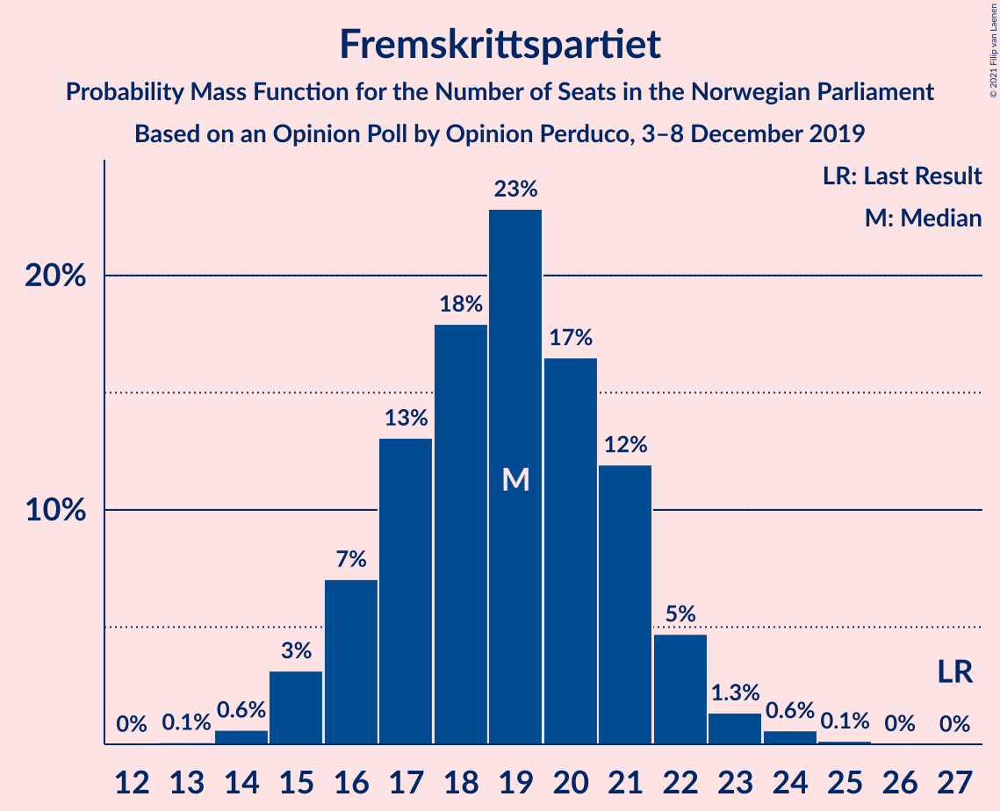
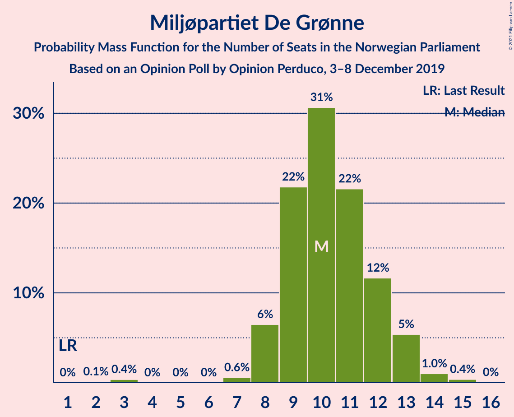
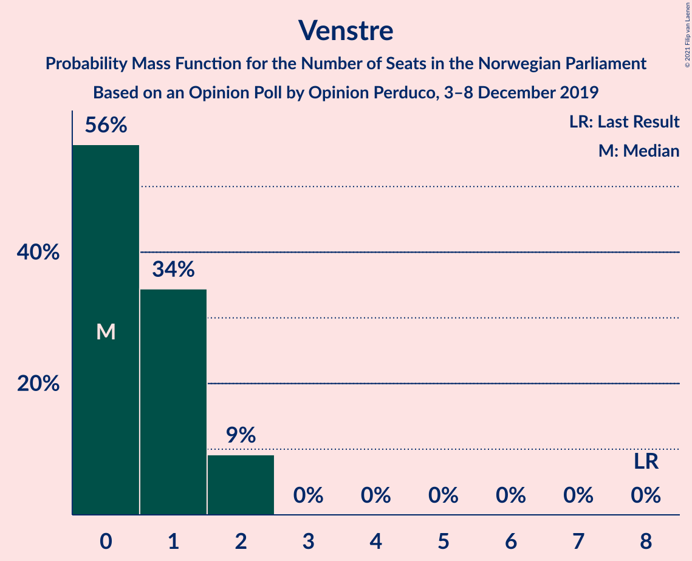
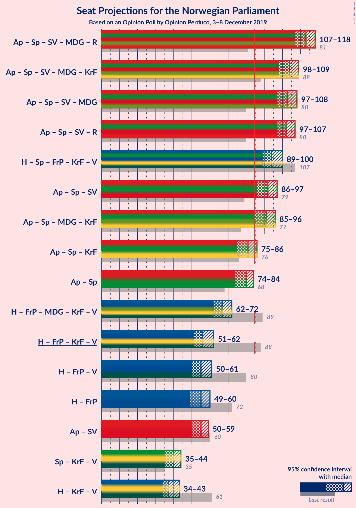
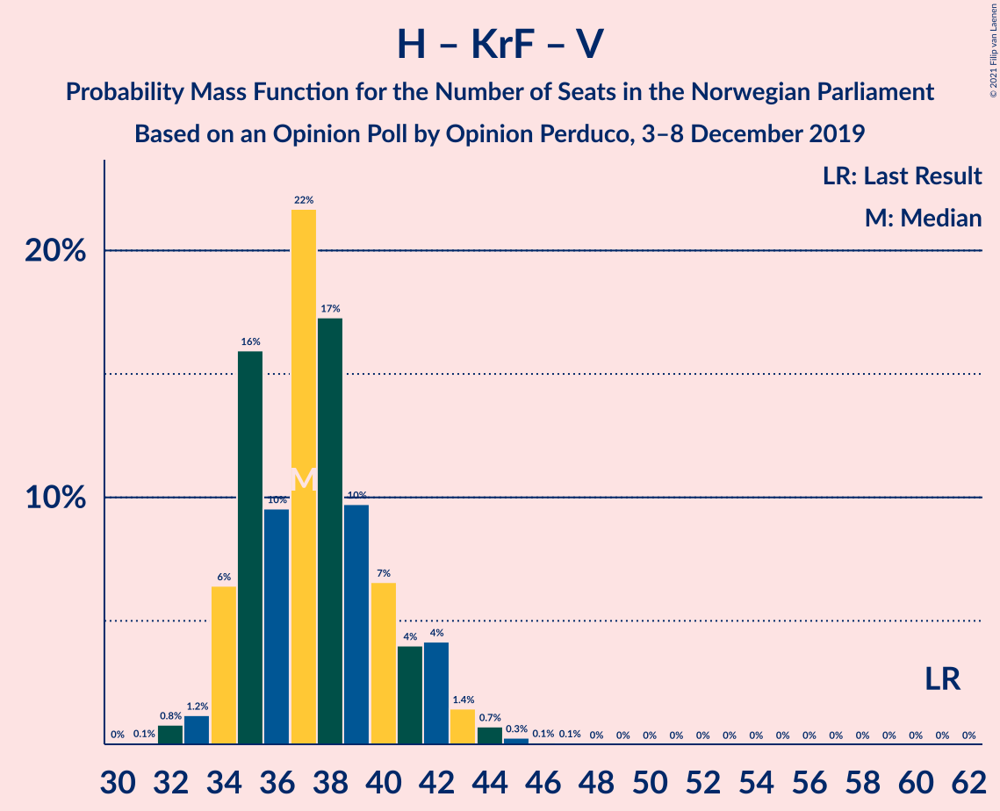

# Opinion Poll by Opinion Perduco, 3–8 December 2019

<a href="#voting-intentions">Voting Intentions</a> | <a href="#seats">Seats</a> | <a href="#coalitions">Coalitions</a> | <a href="#technical-information">Technical Information</a>

## Voting Intentions

### Confidence Intervals

| Party | Last Result | Poll Result | 80% Confidence Interval | 90% Confidence Interval | 95% Confidence Interval | 99% Confidence Interval |
|:-----:|:-----------:|:-----------:|:-----------------------:|:-----------------------:|:-----------------------:|:-----------------------:|
| Arbeiderpartiet | 27.4% | 22.9% | 21.2–24.7% |20.7–25.2% |20.3–25.6% |19.6–26.5% |
| Høyre | 25.0% | 20.6% | 19.0–22.3% |18.5–22.8% |18.2–23.3% |17.4–24.1% |
| Senterpartiet | 10.3% | 20.2% | 18.6–21.9% |18.2–22.4% |17.8–22.8% |17.0–23.7% |
| Fremskrittspartiet | 15.2% | 10.7% | 9.5–12.0% |9.1–12.4% |8.9–12.8% |8.3–13.5% |
| Sosialistisk Venstreparti | 6.0% | 7.5% | 6.5–8.7% |6.2–9.0% |6.0–9.3% |5.5–9.9% |
| Miljøpartiet De Grønne | 3.2% | 5.9% | 5.0–7.0% |4.8–7.3% |4.6–7.6% |4.2–8.1% |
| Rødt | 2.4% | 5.7% | 4.8–6.8% |4.6–7.1% |4.4–7.3% |4.0–7.9% |
| Kristelig Folkeparti | 4.2% | 2.6% | 2.0–3.4% |1.9–3.6% |1.8–3.8% |1.5–4.2% |
| Venstre | 4.4% | 1.9% | 1.4–2.6% |1.3–2.8% |1.2–2.9% |1.0–3.3% |

*Note:* The poll result column reflects the actual value used in the calculations. Published results may vary slightly, and in addition be rounded to fewer digits.

## Seats

### Confidence Intervals

| Party | Last Result | Median | 80% Confidence Interval | 90% Confidence Interval | 95% Confidence Interval | 99% Confidence Interval |
|:-----:|:-----------:|:------:|:-----------------------:|:-----------------------:|:-----------------------:|:-----------------------:|
| <a href="#arbeiderpartiet">Arbeiderpartiet</a> | 49 | 40 | 38–46 |38–46 |37–46 |36–46 |
| <a href="#høyre">Høyre</a> | 45 | 36 | 34–39 |33–40 |32–41 |30–43 |
| <a href="#senterpartiet">Senterpartiet</a> | 19 | 38 | 34–40 |34–41 |34–41 |32–44 |
| <a href="#fremskrittspartiet">Fremskrittspartiet</a> | 27 | 19 | 16–21 |16–21 |16–22 |14–23 |
| <a href="#sosialistisk-venstreparti">Sosialistisk Venstreparti</a> | 11 | 13 | 12–14 |12–16 |10–16 |9–17 |
| <a href="#miljøpartiet-de-grønne">Miljøpartiet De Grønne</a> | 1 | 10 | 9–12 |9–13 |8–14 |7–14 |
| <a href="#rødt">Rødt</a> | 1 | 11 | 9–11 |2–12 |2–12 |2–14 |
| <a href="#kristelig-folkeparti">Kristelig Folkeparti</a> | 8 | 1 | 0–3 |0–3 |0–3 |0–7 |
| <a href="#venstre">Venstre</a> | 8 | 0 | 0–2 |0–2 |0–2 |0–2 |

### Arbeiderpartiet

*For a full overview of the results for this party, see the [Arbeiderpartiet](party-arbeiderpartiet.html) page.*

| Number of Seats | Probability | Accumulated | Special Marks |
|:---------------:|:-----------:|:-----------:|:-------------:|
| 33 | 0.1% | 100% |  |
| 34 | 0.2% | 99.9% |  |
| 35 | 0.1% | 99.7% |  |
| 36 | 1.1% | 99.5% |  |
| 37 | 3% | 98% |  |
| 38 | 18% | 96% |  |
| 39 | 23% | 78% |  |
| 40 | 21% | 55% | Median |
| 41 | 2% | 34% |  |
| 42 | 9% | 33% |  |
| 43 | 8% | 24% |  |
| 44 | 2% | 16% |  |
| 45 | 1.4% | 13% |  |
| 46 | 12% | 12% |  |
| 47 | 0.2% | 0.4% |  |
| 48 | 0.1% | 0.2% |  |
| 49 | 0.1% | 0.1% | Last Result |
| 50 | 0% | 0% |  |

### Høyre

*For a full overview of the results for this party, see the [Høyre](party-høyre.html) page.*

| Number of Seats | Probability | Accumulated | Special Marks |
|:---------------:|:-----------:|:-----------:|:-------------:|
| 29 | 0.2% | 100% |  |
| 30 | 0.7% | 99.8% |  |
| 31 | 0.7% | 99.0% |  |
| 32 | 3% | 98% |  |
| 33 | 2% | 96% |  |
| 34 | 15% | 94% |  |
| 35 | 17% | 79% |  |
| 36 | 22% | 61% | Median |
| 37 | 7% | 39% |  |
| 38 | 20% | 32% |  |
| 39 | 6% | 12% |  |
| 40 | 1.2% | 6% |  |
| 41 | 4% | 5% |  |
| 42 | 0.1% | 0.7% |  |
| 43 | 0.6% | 0.6% |  |
| 44 | 0% | 0% |  |
| 45 | 0% | 0% | Last Result |

### Senterpartiet

*For a full overview of the results for this party, see the [Senterpartiet](party-senterpartiet.html) page.*

| Number of Seats | Probability | Accumulated | Special Marks |
|:---------------:|:-----------:|:-----------:|:-------------:|
| 19 | 0% | 100% | Last Result |
| 20 | 0% | 100% |  |
| 21 | 0% | 100% |  |
| 22 | 0% | 100% |  |
| 23 | 0% | 100% |  |
| 24 | 0% | 100% |  |
| 25 | 0% | 100% |  |
| 26 | 0% | 100% |  |
| 27 | 0% | 100% |  |
| 28 | 0% | 100% |  |
| 29 | 0% | 100% |  |
| 30 | 0.1% | 100% |  |
| 31 | 0.2% | 99.8% |  |
| 32 | 0.4% | 99.6% |  |
| 33 | 1.2% | 99.3% |  |
| 34 | 15% | 98% |  |
| 35 | 5% | 83% |  |
| 36 | 3% | 78% |  |
| 37 | 18% | 75% |  |
| 38 | 19% | 57% | Median |
| 39 | 3% | 39% |  |
| 40 | 26% | 35% |  |
| 41 | 7% | 9% |  |
| 42 | 0.1% | 2% |  |
| 43 | 0.1% | 2% |  |
| 44 | 2% | 2% |  |
| 45 | 0% | 0.2% |  |
| 46 | 0.1% | 0.1% |  |
| 47 | 0% | 0% |  |

### Fremskrittspartiet

*For a full overview of the results for this party, see the [Fremskrittspartiet](party-fremskrittspartiet.html) page.*

| Number of Seats | Probability | Accumulated | Special Marks |
|:---------------:|:-----------:|:-----------:|:-------------:|
| 14 | 0.9% | 100% |  |
| 15 | 0.5% | 99.1% |  |
| 16 | 10% | 98.6% |  |
| 17 | 22% | 89% |  |
| 18 | 15% | 66% |  |
| 19 | 25% | 52% | Median |
| 20 | 2% | 27% |  |
| 21 | 22% | 25% |  |
| 22 | 2% | 3% |  |
| 23 | 0.5% | 0.9% |  |
| 24 | 0.3% | 0.4% |  |
| 25 | 0.1% | 0.1% |  |
| 26 | 0% | 0% |  |
| 27 | 0% | 0% | Last Result |

### Sosialistisk Venstreparti

*For a full overview of the results for this party, see the [Sosialistisk Venstreparti](party-sosialistiskvenstreparti.html) page.*

| Number of Seats | Probability | Accumulated | Special Marks |
|:---------------:|:-----------:|:-----------:|:-------------:|
| 9 | 1.4% | 100% |  |
| 10 | 1.4% | 98.6% |  |
| 11 | 2% | 97% | Last Result |
| 12 | 25% | 95% |  |
| 13 | 31% | 71% | Median |
| 14 | 31% | 40% |  |
| 15 | 3% | 8% |  |
| 16 | 4% | 5% |  |
| 17 | 2% | 2% |  |
| 18 | 0.2% | 0.2% |  |
| 19 | 0% | 0% |  |

### Miljøpartiet De Grønne

*For a full overview of the results for this party, see the [Miljøpartiet De Grønne](party-miljøpartietdegrønne.html) page.*

| Number of Seats | Probability | Accumulated | Special Marks |
|:---------------:|:-----------:|:-----------:|:-------------:|
| 1 | 0% | 100% | Last Result |
| 2 | 0.1% | 100% |  |
| 3 | 0.2% | 99.9% |  |
| 4 | 0% | 99.7% |  |
| 5 | 0% | 99.7% |  |
| 6 | 0% | 99.7% |  |
| 7 | 0.6% | 99.7% |  |
| 8 | 4% | 99.2% |  |
| 9 | 32% | 95% |  |
| 10 | 23% | 63% | Median |
| 11 | 12% | 39% |  |
| 12 | 20% | 28% |  |
| 13 | 4% | 8% |  |
| 14 | 4% | 4% |  |
| 15 | 0.1% | 0.1% |  |
| 16 | 0% | 0% |  |

### Rødt

*For a full overview of the results for this party, see the [Rødt](party-rødt.html) page.*

| Number of Seats | Probability | Accumulated | Special Marks |
|:---------------:|:-----------:|:-----------:|:-------------:|
| 1 | 0% | 100% | Last Result |
| 2 | 6% | 100% |  |
| 3 | 0% | 94% |  |
| 4 | 0% | 94% |  |
| 5 | 0% | 94% |  |
| 6 | 0% | 94% |  |
| 7 | 0.3% | 94% |  |
| 8 | 2% | 94% |  |
| 9 | 8% | 92% |  |
| 10 | 25% | 84% |  |
| 11 | 50% | 59% | Median |
| 12 | 7% | 9% |  |
| 13 | 0.9% | 2% |  |
| 14 | 1.0% | 1.2% |  |
| 15 | 0.3% | 0.3% |  |
| 16 | 0% | 0% |  |

### Kristelig Folkeparti

*For a full overview of the results for this party, see the [Kristelig Folkeparti](party-kristeligfolkeparti.html) page.*

| Number of Seats | Probability | Accumulated | Special Marks |
|:---------------:|:-----------:|:-----------:|:-------------:|
| 0 | 14% | 100% |  |
| 1 | 51% | 86% | Median |
| 2 | 18% | 35% |  |
| 3 | 16% | 17% |  |
| 4 | 0% | 0.8% |  |
| 5 | 0% | 0.8% |  |
| 6 | 0% | 0.8% |  |
| 7 | 0.7% | 0.8% |  |
| 8 | 0.1% | 0.1% | Last Result |
| 9 | 0% | 0% |  |

### Venstre

*For a full overview of the results for this party, see the [Venstre](party-venstre.html) page.*

| Number of Seats | Probability | Accumulated | Special Marks |
|:---------------:|:-----------:|:-----------:|:-------------:|
| 0 | 51% | 100% | Median |
| 1 | 27% | 49% |  |
| 2 | 22% | 22% |  |
| 3 | 0% | 0% |  |
| 4 | 0% | 0% |  |
| 5 | 0% | 0% |  |
| 6 | 0% | 0% |  |
| 7 | 0% | 0% |  |
| 8 | 0% | 0% | Last Result |

## Coalitions

### Confidence Intervals

| Coalition | Last Result | Median | Majority? | 80% Confidence Interval | 90% Confidence Interval | 95% Confidence Interval | 99% Confidence Interval |
|:---------:|:-----------:|:------:|:---------:|:-----------------------:|:-----------------------:|:-----------------------:|:-----------------------:|
| Arbeiderpartiet – Senterpartiet – Sosialistisk Venstreparti – Miljøpartiet De Grønne – Rødt | 81 | 112 | 100% | 108–117 | 107–118 | 106–118 | 105–120 |
| Arbeiderpartiet – Senterpartiet – Sosialistisk Venstreparti – Miljøpartiet De Grønne – Kristelig Folkeparti | 88 | 104 | 100% | 100–107 | 98–108 | 95–110 | 95–111 |
| Arbeiderpartiet – Senterpartiet – Sosialistisk Venstreparti – Rødt | 80 | 102 | 100% | 98–105 | 97–108 | 97–108 | 94–109 |
| Arbeiderpartiet – Senterpartiet – Sosialistisk Venstreparti – Miljøpartiet De Grønne | 80 | 101 | 100% | 100–106 | 97–107 | 94–108 | 94–109 |
| Høyre – Senterpartiet – Fremskrittspartiet – Kristelig Folkeparti – Venstre | 107 | 95 | 100% | 89–98 | 89–101 | 89–101 | 88–102 |
| Arbeiderpartiet – Senterpartiet – Sosialistisk Venstreparti | 79 | 92 | 99.7% | 88–95 | 87–97 | 86–97 | 85–98 |
| Arbeiderpartiet – Senterpartiet – Miljøpartiet De Grønne – Kristelig Folkeparti | 77 | 90 | 95% | 87–94 | 84–95 | 83–95 | 83–98 |
| Arbeiderpartiet – Senterpartiet – Kristelig Folkeparti | 76 | 80 | 2% | 77–83 | 75–84 | 75–84 | 72–87 |
| Arbeiderpartiet – Senterpartiet | 68 | 79 | 0.5% | 76–82 | 74–83 | 74–84 | 71–84 |
| Høyre – Fremskrittspartiet – Miljøpartiet De Grønne – Kristelig Folkeparti – Venstre | 89 | 67 | 0% | 64–71 | 61–72 | 61–72 | 60–74 |
| Høyre – Fremskrittspartiet – Kristelig Folkeparti – Venstre | 88 | 57 | 0% | 52–61 | 51–62 | 51–63 | 49–64 |
| Høyre – Fremskrittspartiet – Venstre | 80 | 56 | 0% | 51–60 | 51–61 | 50–62 | 47–63 |
| Høyre – Fremskrittspartiet | 72 | 55 | 0% | 51–58 | 50–61 | 49–62 | 47–63 |
| Arbeiderpartiet – Sosialistisk Venstreparti | 60 | 53 | 0% | 50–60 | 50–60 | 50–60 | 48–60 |
| Senterpartiet – Kristelig Folkeparti – Venstre | 35 | 40 | 0% | 35–43 | 35–44 | 35–45 | 34–46 |
| Høyre – Kristelig Folkeparti – Venstre | 61 | 38 | 0% | 35–42 | 34–42 | 34–42 | 32–44 |

### Arbeiderpartiet – Senterpartiet – Sosialistisk Venstreparti – Miljøpartiet De Grønne – Rødt

| Number of Seats | Probability | Accumulated | Special Marks |
|:---------------:|:-----------:|:-----------:|:-------------:|
| 81 | 0% | 100% | Last Result |
| 82 | 0% | 100% |  |
| 83 | 0% | 100% |  |
| 84 | 0% | 100% |  |
| 85 | 0% | 100% | Majority |
| 86 | 0% | 100% |  |
| 87 | 0% | 100% |  |
| 88 | 0% | 100% |  |
| 89 | 0% | 100% |  |
| 90 | 0% | 100% |  |
| 91 | 0% | 100% |  |
| 92 | 0% | 100% |  |
| 93 | 0% | 100% |  |
| 94 | 0% | 100% |  |
| 95 | 0% | 100% |  |
| 96 | 0% | 100% |  |
| 97 | 0% | 100% |  |
| 98 | 0% | 100% |  |
| 99 | 0% | 100% |  |
| 100 | 0% | 100% |  |
| 101 | 0% | 100% |  |
| 102 | 0% | 100% |  |
| 103 | 0.1% | 100% |  |
| 104 | 0.4% | 99.9% |  |
| 105 | 0.2% | 99.5% |  |
| 106 | 4% | 99.3% |  |
| 107 | 0.9% | 95% |  |
| 108 | 7% | 94% |  |
| 109 | 0.5% | 87% |  |
| 110 | 18% | 87% |  |
| 111 | 2% | 69% |  |
| 112 | 34% | 67% | Median |
| 113 | 3% | 32% |  |
| 114 | 16% | 29% |  |
| 115 | 2% | 14% |  |
| 116 | 1.0% | 12% |  |
| 117 | 4% | 11% |  |
| 118 | 6% | 7% |  |
| 119 | 0.5% | 1.2% |  |
| 120 | 0.7% | 0.7% |  |
| 121 | 0% | 0% |  |

### Arbeiderpartiet – Senterpartiet – Sosialistisk Venstreparti – Miljøpartiet De Grønne – Kristelig Folkeparti

| Number of Seats | Probability | Accumulated | Special Marks |
|:---------------:|:-----------:|:-----------:|:-------------:|
| 88 | 0% | 100% | Last Result |
| 89 | 0% | 100% |  |
| 90 | 0% | 100% |  |
| 91 | 0% | 100% |  |
| 92 | 0% | 100% |  |
| 93 | 0% | 100% |  |
| 94 | 0% | 100% |  |
| 95 | 4% | 99.9% |  |
| 96 | 0.2% | 96% |  |
| 97 | 0.5% | 96% |  |
| 98 | 1.2% | 96% |  |
| 99 | 2% | 94% |  |
| 100 | 4% | 92% |  |
| 101 | 2% | 89% |  |
| 102 | 32% | 87% | Median |
| 103 | 2% | 55% |  |
| 104 | 27% | 53% |  |
| 105 | 7% | 26% |  |
| 106 | 2% | 19% |  |
| 107 | 12% | 17% |  |
| 108 | 2% | 6% |  |
| 109 | 0.7% | 3% |  |
| 110 | 1.4% | 3% |  |
| 111 | 1.1% | 1.3% |  |
| 112 | 0.1% | 0.2% |  |
| 113 | 0.1% | 0.1% |  |
| 114 | 0% | 0% |  |

### Arbeiderpartiet – Senterpartiet – Sosialistisk Venstreparti – Rødt

| Number of Seats | Probability | Accumulated | Special Marks |
|:---------------:|:-----------:|:-----------:|:-------------:|
| 80 | 0% | 100% | Last Result |
| 81 | 0% | 100% |  |
| 82 | 0% | 100% |  |
| 83 | 0% | 100% |  |
| 84 | 0% | 100% |  |
| 85 | 0% | 100% | Majority |
| 86 | 0% | 100% |  |
| 87 | 0% | 100% |  |
| 88 | 0% | 100% |  |
| 89 | 0% | 100% |  |
| 90 | 0% | 100% |  |
| 91 | 0% | 100% |  |
| 92 | 0% | 100% |  |
| 93 | 0.1% | 99.9% |  |
| 94 | 0.3% | 99.8% |  |
| 95 | 0.8% | 99.5% |  |
| 96 | 0.9% | 98.7% |  |
| 97 | 6% | 98% |  |
| 98 | 23% | 92% |  |
| 99 | 0.8% | 68% |  |
| 100 | 2% | 68% |  |
| 101 | 4% | 65% |  |
| 102 | 15% | 61% | Median |
| 103 | 18% | 46% |  |
| 104 | 4% | 28% |  |
| 105 | 14% | 24% |  |
| 106 | 3% | 9% |  |
| 107 | 0.9% | 6% |  |
| 108 | 4% | 5% |  |
| 109 | 0.7% | 0.9% |  |
| 110 | 0% | 0.2% |  |
| 111 | 0.1% | 0.1% |  |
| 112 | 0% | 0% |  |

### Arbeiderpartiet – Senterpartiet – Sosialistisk Venstreparti – Miljøpartiet De Grønne

| Number of Seats | Probability | Accumulated | Special Marks |
|:---------------:|:-----------:|:-----------:|:-------------:|
| 80 | 0% | 100% | Last Result |
| 81 | 0% | 100% |  |
| 82 | 0% | 100% |  |
| 83 | 0% | 100% |  |
| 84 | 0% | 100% |  |
| 85 | 0% | 100% | Majority |
| 86 | 0% | 100% |  |
| 87 | 0% | 100% |  |
| 88 | 0% | 100% |  |
| 89 | 0% | 100% |  |
| 90 | 0% | 100% |  |
| 91 | 0% | 100% |  |
| 92 | 0% | 100% |  |
| 93 | 0.1% | 100% |  |
| 94 | 4% | 99.9% |  |
| 95 | 0.2% | 96% |  |
| 96 | 0.3% | 96% |  |
| 97 | 2% | 96% |  |
| 98 | 1.0% | 94% |  |
| 99 | 2% | 93% |  |
| 100 | 21% | 91% |  |
| 101 | 28% | 70% | Median |
| 102 | 4% | 42% |  |
| 103 | 15% | 38% |  |
| 104 | 4% | 24% |  |
| 105 | 3% | 20% |  |
| 106 | 8% | 17% |  |
| 107 | 6% | 9% |  |
| 108 | 1.4% | 3% |  |
| 109 | 1.4% | 2% |  |
| 110 | 0.1% | 0.2% |  |
| 111 | 0% | 0.1% |  |
| 112 | 0.1% | 0.1% |  |
| 113 | 0% | 0% |  |

### Høyre – Senterpartiet – Fremskrittspartiet – Kristelig Folkeparti – Venstre

| Number of Seats | Probability | Accumulated | Special Marks |
|:---------------:|:-----------:|:-----------:|:-------------:|
| 85 | 0.1% | 100% | Majority |
| 86 | 0.1% | 99.9% |  |
| 87 | 0.2% | 99.8% |  |
| 88 | 0.3% | 99.6% |  |
| 89 | 14% | 99.3% |  |
| 90 | 0.3% | 86% |  |
| 91 | 4% | 85% |  |
| 92 | 8% | 81% |  |
| 93 | 3% | 73% |  |
| 94 | 17% | 70% | Median |
| 95 | 4% | 53% |  |
| 96 | 3% | 49% |  |
| 97 | 34% | 46% |  |
| 98 | 5% | 12% |  |
| 99 | 0.8% | 7% |  |
| 100 | 0.8% | 6% |  |
| 101 | 5% | 6% |  |
| 102 | 0.4% | 0.7% |  |
| 103 | 0.1% | 0.3% |  |
| 104 | 0% | 0.2% |  |
| 105 | 0.1% | 0.1% |  |
| 106 | 0% | 0% |  |
| 107 | 0% | 0% | Last Result |

### Arbeiderpartiet – Senterpartiet – Sosialistisk Venstreparti

| Number of Seats | Probability | Accumulated | Special Marks |
|:---------------:|:-----------:|:-----------:|:-------------:|
| 79 | 0% | 100% | Last Result |
| 80 | 0% | 100% |  |
| 81 | 0% | 100% |  |
| 82 | 0.1% | 100% |  |
| 83 | 0% | 99.9% |  |
| 84 | 0.2% | 99.9% |  |
| 85 | 0.3% | 99.7% | Majority |
| 86 | 4% | 99.4% |  |
| 87 | 2% | 95% |  |
| 88 | 18% | 93% |  |
| 89 | 3% | 75% |  |
| 90 | 3% | 72% |  |
| 91 | 17% | 70% | Median |
| 92 | 19% | 52% |  |
| 93 | 1.2% | 33% |  |
| 94 | 14% | 32% |  |
| 95 | 11% | 18% |  |
| 96 | 1.2% | 7% |  |
| 97 | 5% | 6% |  |
| 98 | 0.8% | 1.2% |  |
| 99 | 0.1% | 0.3% |  |
| 100 | 0.1% | 0.2% |  |
| 101 | 0.1% | 0.1% |  |
| 102 | 0% | 0% |  |

### Arbeiderpartiet – Senterpartiet – Miljøpartiet De Grønne – Kristelig Folkeparti

| Number of Seats | Probability | Accumulated | Special Marks |
|:---------------:|:-----------:|:-----------:|:-------------:|
| 77 | 0% | 100% | Last Result |
| 78 | 0% | 100% |  |
| 79 | 0% | 100% |  |
| 80 | 0% | 100% |  |
| 81 | 0.3% | 99.9% |  |
| 82 | 0.1% | 99.7% |  |
| 83 | 4% | 99.6% |  |
| 84 | 1.3% | 96% |  |
| 85 | 0.6% | 95% | Majority |
| 86 | 3% | 94% |  |
| 87 | 2% | 91% |  |
| 88 | 3% | 89% |  |
| 89 | 17% | 86% | Median |
| 90 | 41% | 69% |  |
| 91 | 3% | 28% |  |
| 92 | 6% | 26% |  |
| 93 | 5% | 20% |  |
| 94 | 10% | 15% |  |
| 95 | 3% | 5% |  |
| 96 | 0.7% | 2% |  |
| 97 | 0.4% | 1.2% |  |
| 98 | 0.6% | 0.7% |  |
| 99 | 0.1% | 0.2% |  |
| 100 | 0% | 0% |  |

### Arbeiderpartiet – Senterpartiet – Kristelig Folkeparti

| Number of Seats | Probability | Accumulated | Special Marks |
|:---------------:|:-----------:|:-----------:|:-------------:|
| 70 | 0% | 100% |  |
| 71 | 0.1% | 99.9% |  |
| 72 | 0.8% | 99.8% |  |
| 73 | 0.1% | 99.1% |  |
| 74 | 1.1% | 99.0% |  |
| 75 | 4% | 98% |  |
| 76 | 1.5% | 94% | Last Result |
| 77 | 6% | 92% |  |
| 78 | 19% | 87% |  |
| 79 | 4% | 68% | Median |
| 80 | 28% | 63% |  |
| 81 | 13% | 35% |  |
| 82 | 9% | 22% |  |
| 83 | 6% | 13% |  |
| 84 | 6% | 8% |  |
| 85 | 0.8% | 2% | Majority |
| 86 | 0.3% | 1.0% |  |
| 87 | 0.2% | 0.7% |  |
| 88 | 0.1% | 0.5% |  |
| 89 | 0.3% | 0.3% |  |
| 90 | 0% | 0.1% |  |
| 91 | 0% | 0% |  |

### Arbeiderpartiet – Senterpartiet

| Number of Seats | Probability | Accumulated | Special Marks |
|:---------------:|:-----------:|:-----------:|:-------------:|
| 68 | 0% | 100% | Last Result |
| 69 | 0% | 100% |  |
| 70 | 0.1% | 100% |  |
| 71 | 0.7% | 99.8% |  |
| 72 | 0.2% | 99.1% |  |
| 73 | 0.5% | 98.9% |  |
| 74 | 5% | 98% |  |
| 75 | 2% | 94% |  |
| 76 | 19% | 92% |  |
| 77 | 17% | 73% |  |
| 78 | 2% | 56% | Median |
| 79 | 22% | 54% |  |
| 80 | 13% | 32% |  |
| 81 | 7% | 19% |  |
| 82 | 6% | 12% |  |
| 83 | 1.3% | 6% |  |
| 84 | 4% | 5% |  |
| 85 | 0.1% | 0.5% | Majority |
| 86 | 0.2% | 0.4% |  |
| 87 | 0.1% | 0.2% |  |
| 88 | 0.1% | 0.1% |  |
| 89 | 0% | 0% |  |

### Høyre – Fremskrittspartiet – Miljøpartiet De Grønne – Kristelig Folkeparti – Venstre

| Number of Seats | Probability | Accumulated | Special Marks |
|:---------------:|:-----------:|:-----------:|:-------------:|
| 58 | 0.1% | 100% |  |
| 59 | 0% | 99.9% |  |
| 60 | 0.7% | 99.8% |  |
| 61 | 4% | 99.1% |  |
| 62 | 0.9% | 95% |  |
| 63 | 3% | 94% |  |
| 64 | 14% | 91% |  |
| 65 | 4% | 76% |  |
| 66 | 18% | 72% | Median |
| 67 | 15% | 54% |  |
| 68 | 4% | 39% |  |
| 69 | 2% | 35% |  |
| 70 | 0.8% | 32% |  |
| 71 | 23% | 31% |  |
| 72 | 6% | 8% |  |
| 73 | 0.9% | 2% |  |
| 74 | 0.8% | 1.3% |  |
| 75 | 0.3% | 0.5% |  |
| 76 | 0.1% | 0.2% |  |
| 77 | 0% | 0.1% |  |
| 78 | 0% | 0% |  |
| 79 | 0% | 0% |  |
| 80 | 0% | 0% |  |
| 81 | 0% | 0% |  |
| 82 | 0% | 0% |  |
| 83 | 0% | 0% |  |
| 84 | 0% | 0% |  |
| 85 | 0% | 0% | Majority |
| 86 | 0% | 0% |  |
| 87 | 0% | 0% |  |
| 88 | 0% | 0% |  |
| 89 | 0% | 0% | Last Result |

### Høyre – Fremskrittspartiet – Kristelig Folkeparti – Venstre

| Number of Seats | Probability | Accumulated | Special Marks |
|:---------------:|:-----------:|:-----------:|:-------------:|
| 49 | 0.7% | 100% |  |
| 50 | 0.5% | 99.3% |  |
| 51 | 6% | 98.8% |  |
| 52 | 4% | 93% |  |
| 53 | 1.0% | 89% |  |
| 54 | 2% | 88% |  |
| 55 | 16% | 86% |  |
| 56 | 3% | 71% | Median |
| 57 | 34% | 68% |  |
| 58 | 2% | 33% |  |
| 59 | 18% | 31% |  |
| 60 | 0.5% | 13% |  |
| 61 | 7% | 13% |  |
| 62 | 0.9% | 6% |  |
| 63 | 4% | 5% |  |
| 64 | 0.2% | 0.7% |  |
| 65 | 0.4% | 0.5% |  |
| 66 | 0.1% | 0.1% |  |
| 67 | 0% | 0% |  |
| 68 | 0% | 0% |  |
| 69 | 0% | 0% |  |
| 70 | 0% | 0% |  |
| 71 | 0% | 0% |  |
| 72 | 0% | 0% |  |
| 73 | 0% | 0% |  |
| 74 | 0% | 0% |  |
| 75 | 0% | 0% |  |
| 76 | 0% | 0% |  |
| 77 | 0% | 0% |  |
| 78 | 0% | 0% |  |
| 79 | 0% | 0% |  |
| 80 | 0% | 0% |  |
| 81 | 0% | 0% |  |
| 82 | 0% | 0% |  |
| 83 | 0% | 0% |  |
| 84 | 0% | 0% |  |
| 85 | 0% | 0% | Majority |
| 86 | 0% | 0% |  |
| 87 | 0% | 0% |  |
| 88 | 0% | 0% | Last Result |

### Høyre – Fremskrittspartiet – Venstre

| Number of Seats | Probability | Accumulated | Special Marks |
|:---------------:|:-----------:|:-----------:|:-------------:|
| 47 | 0.6% | 100% |  |
| 48 | 0.3% | 99.4% |  |
| 49 | 1.2% | 99.0% |  |
| 50 | 1.0% | 98% |  |
| 51 | 8% | 97% |  |
| 52 | 1.0% | 88% |  |
| 53 | 2% | 87% |  |
| 54 | 26% | 85% |  |
| 55 | 5% | 59% | Median |
| 56 | 18% | 54% |  |
| 57 | 21% | 36% |  |
| 58 | 2% | 15% |  |
| 59 | 1.0% | 13% |  |
| 60 | 7% | 12% |  |
| 61 | 0.8% | 5% |  |
| 62 | 4% | 4% |  |
| 63 | 0.6% | 0.8% |  |
| 64 | 0.1% | 0.2% |  |
| 65 | 0.1% | 0.1% |  |
| 66 | 0% | 0% |  |
| 67 | 0% | 0% |  |
| 68 | 0% | 0% |  |
| 69 | 0% | 0% |  |
| 70 | 0% | 0% |  |
| 71 | 0% | 0% |  |
| 72 | 0% | 0% |  |
| 73 | 0% | 0% |  |
| 74 | 0% | 0% |  |
| 75 | 0% | 0% |  |
| 76 | 0% | 0% |  |
| 77 | 0% | 0% |  |
| 78 | 0% | 0% |  |
| 79 | 0% | 0% |  |
| 80 | 0% | 0% | Last Result |

### Høyre – Fremskrittspartiet

| Number of Seats | Probability | Accumulated | Special Marks |
|:---------------:|:-----------:|:-----------:|:-------------:|
| 47 | 0.7% | 100% |  |
| 48 | 0.4% | 99.3% |  |
| 49 | 2% | 98.9% |  |
| 50 | 5% | 97% |  |
| 51 | 5% | 92% |  |
| 52 | 12% | 87% |  |
| 53 | 5% | 75% |  |
| 54 | 14% | 71% |  |
| 55 | 22% | 57% | Median |
| 56 | 4% | 35% |  |
| 57 | 17% | 31% |  |
| 58 | 6% | 14% |  |
| 59 | 1.0% | 8% |  |
| 60 | 2% | 7% |  |
| 61 | 0.8% | 5% |  |
| 62 | 4% | 4% |  |
| 63 | 0.5% | 0.7% |  |
| 64 | 0.1% | 0.1% |  |
| 65 | 0% | 0% |  |
| 66 | 0% | 0% |  |
| 67 | 0% | 0% |  |
| 68 | 0% | 0% |  |
| 69 | 0% | 0% |  |
| 70 | 0% | 0% |  |
| 71 | 0% | 0% |  |
| 72 | 0% | 0% | Last Result |

### Arbeiderpartiet – Sosialistisk Venstreparti

| Number of Seats | Probability | Accumulated | Special Marks |
|:---------------:|:-----------:|:-----------:|:-------------:|
| 45 | 0% | 100% |  |
| 46 | 0.1% | 99.9% |  |
| 47 | 0% | 99.9% |  |
| 48 | 1.0% | 99.8% |  |
| 49 | 0.5% | 98.8% |  |
| 50 | 17% | 98% |  |
| 51 | 7% | 81% |  |
| 52 | 18% | 74% |  |
| 53 | 6% | 56% | Median |
| 54 | 17% | 50% |  |
| 55 | 8% | 33% |  |
| 56 | 7% | 25% |  |
| 57 | 1.2% | 18% |  |
| 58 | 4% | 17% |  |
| 59 | 0.5% | 13% |  |
| 60 | 12% | 12% | Last Result |
| 61 | 0.2% | 0.3% |  |
| 62 | 0.1% | 0.2% |  |
| 63 | 0% | 0% |  |

### Senterpartiet – Kristelig Folkeparti – Venstre

| Number of Seats | Probability | Accumulated | Special Marks |
|:---------------:|:-----------:|:-----------:|:-------------:|
| 31 | 0% | 100% |  |
| 32 | 0.1% | 99.9% |  |
| 33 | 0.3% | 99.8% |  |
| 34 | 2% | 99.5% |  |
| 35 | 14% | 98% | Last Result |
| 36 | 4% | 84% |  |
| 37 | 3% | 80% |  |
| 38 | 4% | 77% |  |
| 39 | 5% | 73% | Median |
| 40 | 21% | 68% |  |
| 41 | 6% | 47% |  |
| 42 | 29% | 42% |  |
| 43 | 8% | 13% |  |
| 44 | 3% | 6% |  |
| 45 | 0.5% | 3% |  |
| 46 | 2% | 2% |  |
| 47 | 0.1% | 0.3% |  |
| 48 | 0.1% | 0.2% |  |
| 49 | 0.1% | 0.2% |  |
| 50 | 0% | 0% |  |

### Høyre – Kristelig Folkeparti – Venstre

| Number of Seats | Probability | Accumulated | Special Marks |
|:---------------:|:-----------:|:-----------:|:-------------:|
| 30 | 0.1% | 100% |  |
| 31 | 0% | 99.9% |  |
| 32 | 0.8% | 99.9% |  |
| 33 | 0.6% | 99.1% |  |
| 34 | 4% | 98% |  |
| 35 | 6% | 95% |  |
| 36 | 14% | 89% |  |
| 37 | 2% | 75% | Median |
| 38 | 25% | 73% |  |
| 39 | 17% | 47% |  |
| 40 | 16% | 30% |  |
| 41 | 4% | 14% |  |
| 42 | 9% | 10% |  |
| 43 | 0.9% | 2% |  |
| 44 | 0.4% | 0.6% |  |
| 45 | 0.2% | 0.2% |  |
| 46 | 0% | 0.1% |  |
| 47 | 0% | 0% |  |
| 48 | 0% | 0% |  |
| 49 | 0% | 0% |  |
| 50 | 0% | 0% |  |
| 51 | 0% | 0% |  |
| 52 | 0% | 0% |  |
| 53 | 0% | 0% |  |
| 54 | 0% | 0% |  |
| 55 | 0% | 0% |  |
| 56 | 0% | 0% |  |
| 57 | 0% | 0% |  |
| 58 | 0% | 0% |  |
| 59 | 0% | 0% |  |
| 60 | 0% | 0% |  |
| 61 | 0% | 0% | Last Result |

## Technical Information

### Opinion Poll

+ **Polling firm:** Opinion Perduco
+ **Commissioner(s):** —
+ **Fieldwork period:** 3–8 December 2019

### Calculations

+ **Sample size:** 966
+ **Simulations done:** 65,536
+ **Error estimate:** 4.04%

