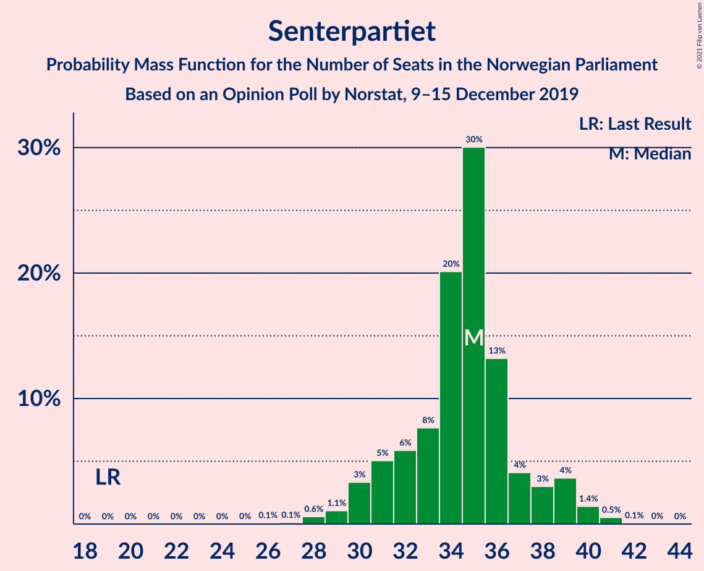
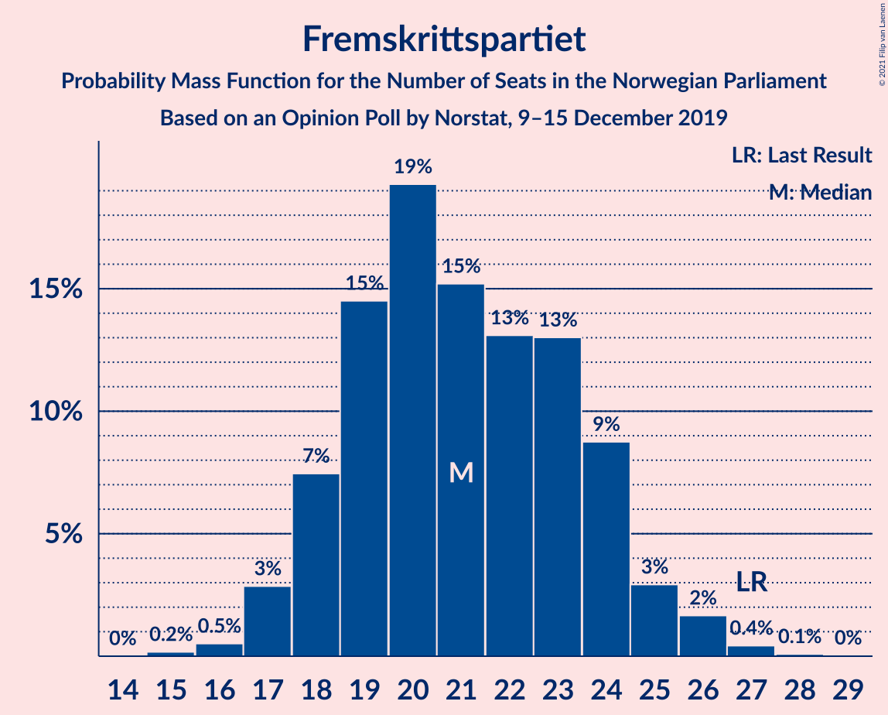
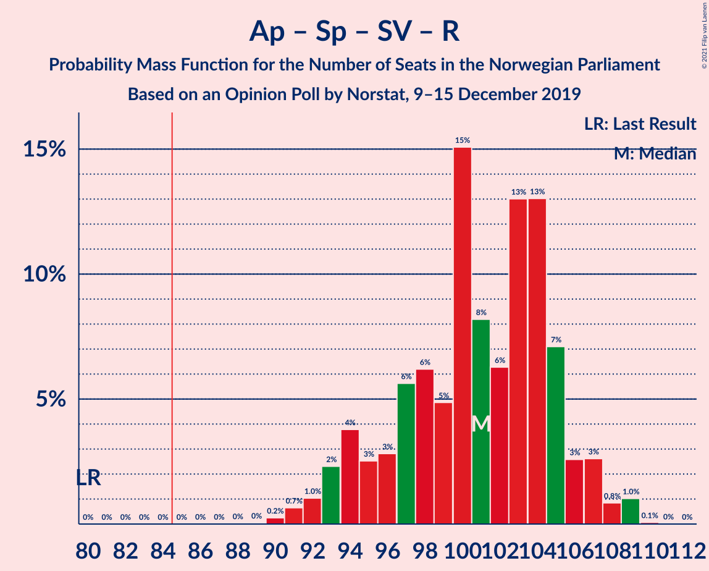
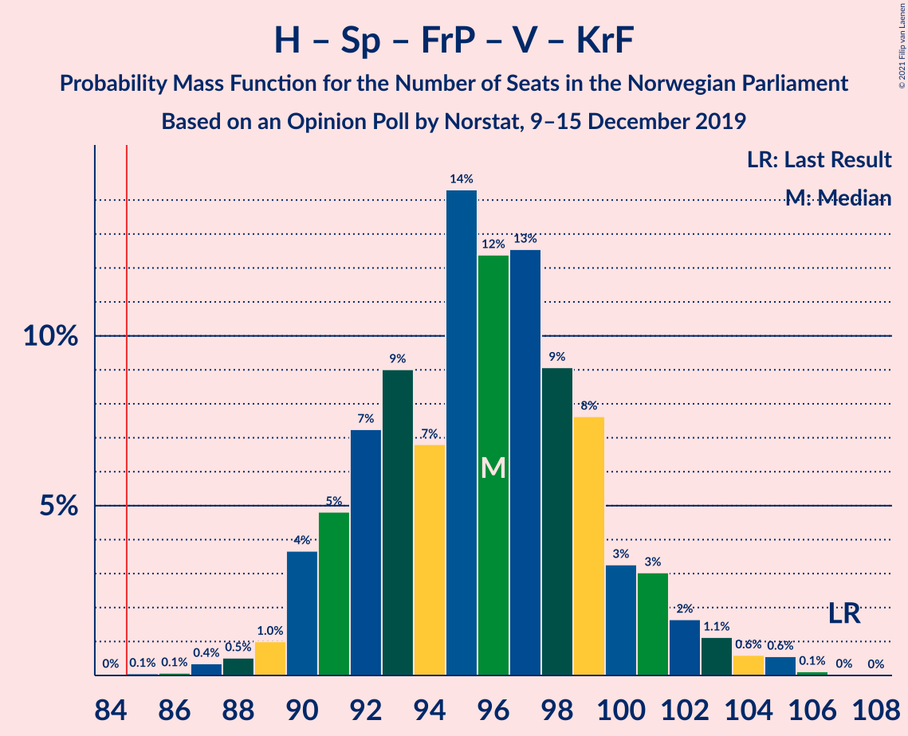
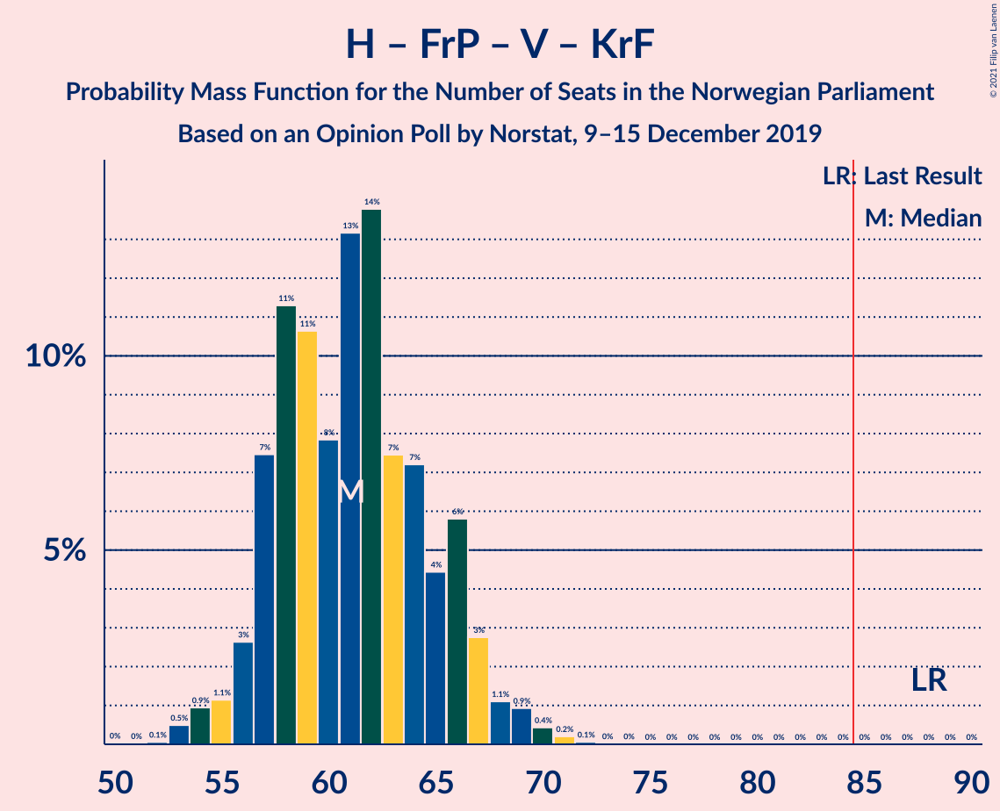
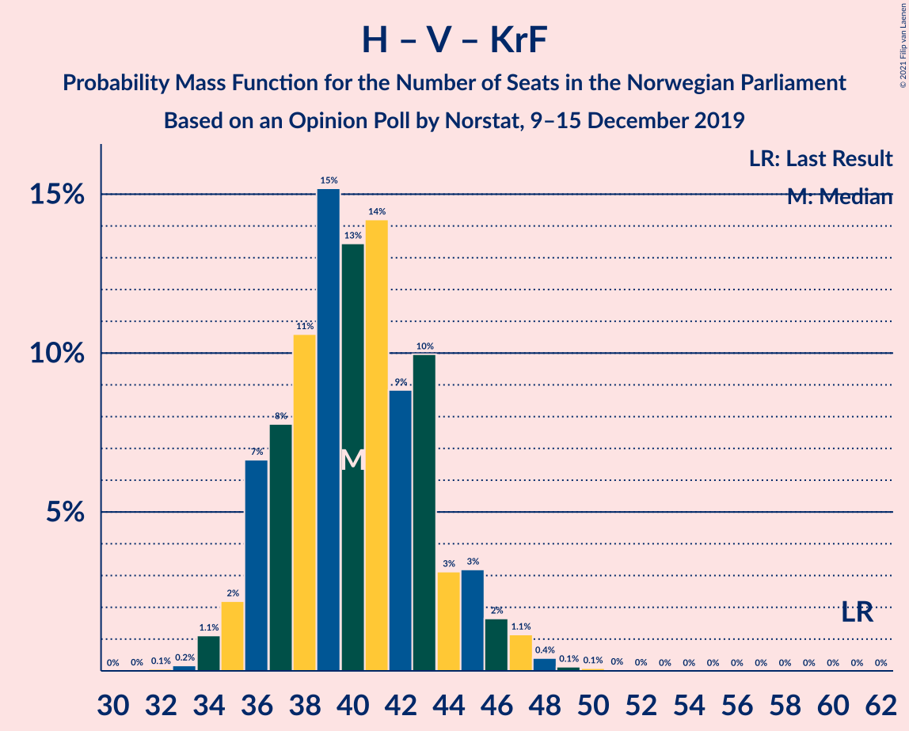

# Opinion Poll by Norstat, 9–15 December 2019

<a href="#voting-intentions">Voting Intentions</a> | <a href="#seats">Seats</a> | <a href="#coalitions">Coalitions</a> | <a href="#technical-information">Technical Information</a>

## Voting Intentions

### Confidence Intervals

| Party | Last Result | Poll Result | 80% Confidence Interval | 90% Confidence Interval | 95% Confidence Interval | 99% Confidence Interval |
|:-----:|:-----------:|:-----------:|:-----------------------:|:-----------------------:|:-----------------------:|:-----------------------:|
| Arbeiderpartiet | 30.8% | 25.5% | 23.8–27.3% |23.3–27.8% |22.9–28.3% |22.1–29.2% |
| Høyre | 26.8% | 20.9% | 19.3–22.6% |18.8–23.1% |18.5–23.5% |17.7–24.4% |
| Senterpartiet | 5.5% | 18.5% | 17.0–20.2% |16.6–20.6% |16.2–21.0% |15.5–21.9% |
| Fremskrittspartiet | 16.3% | 11.8% | 10.6–13.2% |10.2–13.6% |9.9–14.0% |9.4–14.7% |
| Sosialistisk Venstreparti | 4.1% | 7.1% | 6.1–8.3% |5.9–8.6% |5.7–8.9% |5.2–9.5% |
| Rødt | 1.1% | 4.6% | 3.8–5.6% |3.6–5.9% |3.4–6.1% |3.1–6.6% |
| Miljøpartiet De Grønne | 2.8% | 4.6% | 3.8–5.6% |3.6–5.9% |3.4–6.1% |3.1–6.6% |
| Venstre | 5.2% | 2.9% | 2.3–3.7% |2.1–3.9% |2.0–4.2% |1.8–4.6% |
| Kristelig Folkeparti | 5.6% | 2.6% | 2.1–3.4% |1.9–3.6% |1.8–3.8% |1.6–4.2% |

*Note:* The poll result column reflects the actual value used in the calculations. Published results may vary slightly, and in addition be rounded to fewer digits.

## Seats

### Confidence Intervals

| Party | Last Result | Median | 80% Confidence Interval | 90% Confidence Interval | 95% Confidence Interval | 99% Confidence Interval |
|:-----:|:-----------:|:------:|:-----------------------:|:-----------------------:|:-----------------------:|:-----------------------:|
| <a href="#arbeiderpartiet">Arbeiderpartiet</a> | 55 | 47 | 47 |47 |47–49 |42–49 |
| <a href="#høyre">Høyre</a> | 48 | 35 | 35 |35–36 |35–36 |35–46 |
| <a href="#senterpartiet">Senterpartiet</a> | 10 | 32 | 32 |31–32 |31–32 |27–32 |
| <a href="#fremskrittspartiet">Fremskrittspartiet</a> | 29 | 18 | 18 |18 |18 |18–23 |
| <a href="#sosialistisk-venstreparti">Sosialistisk Venstreparti</a> | 7 | 12 | 12 |12 |10–12 |10–12 |
| <a href="#rødt">Rødt</a> | 0 | 7 | 7 |7 |6–7 |6–8 |
| <a href="#miljøpartiet-de-grønne">Miljøpartiet De Grønne</a> | 1 | 9 | 9 |9 |9–10 |7–10 |
| <a href="#venstre">Venstre</a> | 9 | 6 | 6 |2–6 |2–6 |1–6 |
| <a href="#kristelig-folkeparti">Kristelig Folkeparti</a> | 10 | 2 | 2 |2 |2–6 |2–6 |

### Arbeiderpartiet

*For a full overview of the results for this party, see the [Arbeiderpartiet](party-arbeiderpartiet.html) page.*

| Number of Seats | Probability | Accumulated | Special Marks |
|:---------------:|:-----------:|:-----------:|:-------------:|
| 42 | 2% | 100% |  |
| 43 | 0% | 98% |  |
| 44 | 0.1% | 98% |  |
| 45 | 0.1% | 98% |  |
| 46 | 0% | 98% |  |
| 47 | 94% | 98% | Median |
| 48 | 0% | 4% |  |
| 49 | 4% | 4% |  |
| 50 | 0% | 0.3% |  |
| 51 | 0.2% | 0.3% |  |
| 52 | 0% | 0% |  |
| 53 | 0% | 0% |  |
| 54 | 0% | 0% |  |
| 55 | 0% | 0% | Last Result |

### Høyre

*For a full overview of the results for this party, see the [Høyre](party-høyre.html) page.*

| Number of Seats | Probability | Accumulated | Special Marks |
|:---------------:|:-----------:|:-----------:|:-------------:|
| 33 | 0% | 100% |  |
| 34 | 0% | 99.9% |  |
| 35 | 94% | 99.9% | Median |
| 36 | 4% | 6% |  |
| 37 | 0.1% | 2% |  |
| 38 | 0.2% | 2% |  |
| 39 | 0% | 2% |  |
| 40 | 0% | 2% |  |
| 41 | 0% | 2% |  |
| 42 | 0.1% | 2% |  |
| 43 | 0% | 1.5% |  |
| 44 | 0% | 1.5% |  |
| 45 | 0% | 1.5% |  |
| 46 | 1.5% | 1.5% |  |
| 47 | 0% | 0% |  |
| 48 | 0% | 0% | Last Result |

### Senterpartiet

*For a full overview of the results for this party, see the [Senterpartiet](party-senterpartiet.html) page.*

| Number of Seats | Probability | Accumulated | Special Marks |
|:---------------:|:-----------:|:-----------:|:-------------:|
| 10 | 0% | 100% | Last Result |
| 11 | 0% | 100% |  |
| 12 | 0% | 100% |  |
| 13 | 0% | 100% |  |
| 14 | 0% | 100% |  |
| 15 | 0% | 100% |  |
| 16 | 0% | 100% |  |
| 17 | 0% | 100% |  |
| 18 | 0% | 100% |  |
| 19 | 0% | 100% |  |
| 20 | 0% | 100% |  |
| 21 | 0% | 100% |  |
| 22 | 0% | 100% |  |
| 23 | 0% | 100% |  |
| 24 | 0% | 100% |  |
| 25 | 0% | 100% |  |
| 26 | 0% | 100% |  |
| 27 | 1.5% | 100% |  |
| 28 | 0% | 98.5% |  |
| 29 | 0.1% | 98.5% |  |
| 30 | 0% | 98% |  |
| 31 | 4% | 98% |  |
| 32 | 94% | 94% | Median |
| 33 | 0% | 0.2% |  |
| 34 | 0% | 0.2% |  |
| 35 | 0% | 0.2% |  |
| 36 | 0% | 0.2% |  |
| 37 | 0% | 0.2% |  |
| 38 | 0% | 0.2% |  |
| 39 | 0.1% | 0.2% |  |
| 40 | 0% | 0.1% |  |
| 41 | 0% | 0.1% |  |
| 42 | 0% | 0.1% |  |
| 43 | 0.1% | 0.1% |  |
| 44 | 0% | 0% |  |

### Fremskrittspartiet

*For a full overview of the results for this party, see the [Fremskrittspartiet](party-fremskrittspartiet.html) page.*

| Number of Seats | Probability | Accumulated | Special Marks |
|:---------------:|:-----------:|:-----------:|:-------------:|
| 13 | 0.2% | 100% |  |
| 14 | 0% | 99.8% |  |
| 15 | 0% | 99.8% |  |
| 16 | 0% | 99.7% |  |
| 17 | 0.1% | 99.7% |  |
| 18 | 98% | 99.6% | Median |
| 19 | 0% | 2% |  |
| 20 | 0% | 2% |  |
| 21 | 0.1% | 2% |  |
| 22 | 0% | 2% |  |
| 23 | 1.5% | 2% |  |
| 24 | 0.1% | 0.1% |  |
| 25 | 0% | 0% |  |
| 26 | 0% | 0% |  |
| 27 | 0% | 0% |  |
| 28 | 0% | 0% |  |
| 29 | 0% | 0% | Last Result |

### Sosialistisk Venstreparti

*For a full overview of the results for this party, see the [Sosialistisk Venstreparti](party-sosialistiskvenstreparti.html) page.*

| Number of Seats | Probability | Accumulated | Special Marks |
|:---------------:|:-----------:|:-----------:|:-------------:|
| 7 | 0% | 100% | Last Result |
| 8 | 0% | 100% |  |
| 9 | 0.2% | 100% |  |
| 10 | 4% | 99.8% |  |
| 11 | 0% | 96% |  |
| 12 | 95% | 96% | Median |
| 13 | 0.2% | 0.4% |  |
| 14 | 0% | 0.2% |  |
| 15 | 0.1% | 0.2% |  |
| 16 | 0% | 0.1% |  |
| 17 | 0% | 0.1% |  |
| 18 | 0.1% | 0.1% |  |
| 19 | 0% | 0% |  |

### Rødt

*For a full overview of the results for this party, see the [Rødt](party-rødt.html) page.*

| Number of Seats | Probability | Accumulated | Special Marks |
|:---------------:|:-----------:|:-----------:|:-------------:|
| 0 | 0% | 100% | Last Result |
| 1 | 0% | 100% |  |
| 2 | 0.2% | 100% |  |
| 3 | 0% | 99.8% |  |
| 4 | 0% | 99.8% |  |
| 5 | 0% | 99.8% |  |
| 6 | 4% | 99.8% |  |
| 7 | 94% | 96% | Median |
| 8 | 2% | 2% |  |
| 9 | 0% | 0.1% |  |
| 10 | 0.1% | 0.1% |  |
| 11 | 0% | 0% |  |

### Miljøpartiet De Grønne

*For a full overview of the results for this party, see the [Miljøpartiet De Grønne](party-miljøpartietdegrønne.html) page.*

| Number of Seats | Probability | Accumulated | Special Marks |
|:---------------:|:-----------:|:-----------:|:-------------:|
| 0 | 0.1% | 100% |  |
| 1 | 0% | 99.9% | Last Result |
| 2 | 0% | 99.9% |  |
| 3 | 0% | 99.9% |  |
| 4 | 0% | 99.9% |  |
| 5 | 0% | 99.9% |  |
| 6 | 0.2% | 99.9% |  |
| 7 | 2% | 99.7% |  |
| 8 | 0.1% | 98% |  |
| 9 | 94% | 98% | Median |
| 10 | 4% | 4% |  |
| 11 | 0% | 0% |  |

### Venstre

*For a full overview of the results for this party, see the [Venstre](party-venstre.html) page.*

| Number of Seats | Probability | Accumulated | Special Marks |
|:---------------:|:-----------:|:-----------:|:-------------:|
| 0 | 0.1% | 100% |  |
| 1 | 2% | 99.9% |  |
| 2 | 4% | 98% |  |
| 3 | 0.1% | 94% |  |
| 4 | 0% | 94% |  |
| 5 | 0% | 94% |  |
| 6 | 94% | 94% | Median |
| 7 | 0.2% | 0.3% |  |
| 8 | 0% | 0.1% |  |
| 9 | 0.1% | 0.1% | Last Result |
| 10 | 0% | 0% |  |

### Kristelig Folkeparti

*For a full overview of the results for this party, see the [Kristelig Folkeparti](party-kristeligfolkeparti.html) page.*

| Number of Seats | Probability | Accumulated | Special Marks |
|:---------------:|:-----------:|:-----------:|:-------------:|
| 0 | 0.3% | 100% |  |
| 1 | 0.1% | 99.7% |  |
| 2 | 95% | 99.7% | Median |
| 3 | 0% | 4% |  |
| 4 | 0% | 4% |  |
| 5 | 0% | 4% |  |
| 6 | 4% | 4% |  |
| 7 | 0% | 0% |  |
| 8 | 0% | 0% |  |
| 9 | 0% | 0% |  |
| 10 | 0% | 0% | Last Result |

## Coalitions

### Confidence Intervals

| Coalition | Last Result | Median | Majority? | 80% Confidence Interval | 90% Confidence Interval | 95% Confidence Interval | 99% Confidence Interval |
|:---------:|:-----------:|:------:|:---------:|:-----------------------:|:-----------------------:|:-----------------------:|:-----------------------:|
| Arbeiderpartiet – Senterpartiet – Sosialistisk Venstreparti – Rødt | 72 | 98 | 100% | 98 | 96–98 | 96–98 | 89–98 |
| Høyre – Senterpartiet – Fremskrittspartiet – Venstre – Kristelig Folkeparti | 106 | 93 | 100% | 93 | 93 | 93 | 93–99 |
| Arbeiderpartiet – Senterpartiet – Sosialistisk Venstreparti | 72 | 91 | 98.5% | 91 | 90–91 | 90–91 | 81–91 |
| Arbeiderpartiet – Senterpartiet – Kristelig Folkeparti | 75 | 81 | 4% | 81 | 81 | 81–86 | 71–86 |
| Arbeiderpartiet – Senterpartiet | 65 | 79 | 0.1% | 79 | 79 | 79–80 | 69–80 |
| Høyre – Fremskrittspartiet – Venstre – Kristelig Folkeparti | 96 | 61 | 0% | 61 | 61–62 | 61–62 | 61–72 |
| Arbeiderpartiet – Sosialistisk Venstreparti | 62 | 59 | 0% | 59 | 59 | 59 | 54–59 |
| Høyre – Fremskrittspartiet | 77 | 53 | 0% | 53 | 53–54 | 53–54 | 53–69 |
| Høyre – Venstre – Kristelig Folkeparti | 67 | 43 | 0% | 43 | 43–44 | 43–44 | 43–49 |
| Senterpartiet – Venstre – Kristelig Folkeparti | 29 | 40 | 0% | 40 | 39–40 | 39–40 | 30–41 |

### Arbeiderpartiet – Senterpartiet – Sosialistisk Venstreparti – Rødt

| Number of Seats | Probability | Accumulated | Special Marks |
|:---------------:|:-----------:|:-----------:|:-------------:|
| 72 | 0% | 100% | Last Result |
| 73 | 0% | 100% |  |
| 74 | 0% | 100% |  |
| 75 | 0% | 100% |  |
| 76 | 0% | 100% |  |
| 77 | 0% | 100% |  |
| 78 | 0% | 100% |  |
| 79 | 0% | 100% |  |
| 80 | 0% | 100% |  |
| 81 | 0% | 100% |  |
| 82 | 0% | 100% |  |
| 83 | 0% | 100% |  |
| 84 | 0% | 100% |  |
| 85 | 0% | 100% | Majority |
| 86 | 0% | 100% |  |
| 87 | 0% | 100% |  |
| 88 | 0% | 100% |  |
| 89 | 1.5% | 100% |  |
| 90 | 0% | 98.5% |  |
| 91 | 0% | 98.5% |  |
| 92 | 0% | 98.5% |  |
| 93 | 0% | 98.5% |  |
| 94 | 0% | 98.5% |  |
| 95 | 0% | 98.5% |  |
| 96 | 4% | 98.5% |  |
| 97 | 0% | 94% |  |
| 98 | 94% | 94% | Median |
| 99 | 0% | 0.2% |  |
| 100 | 0% | 0.2% |  |
| 101 | 0% | 0.1% |  |
| 102 | 0% | 0.1% |  |
| 103 | 0% | 0.1% |  |
| 104 | 0% | 0.1% |  |
| 105 | 0% | 0.1% |  |
| 106 | 0% | 0.1% |  |
| 107 | 0.1% | 0.1% |  |
| 108 | 0% | 0% |  |

### Høyre – Senterpartiet – Fremskrittspartiet – Venstre – Kristelig Folkeparti

| Number of Seats | Probability | Accumulated | Special Marks |
|:---------------:|:-----------:|:-----------:|:-------------:|
| 93 | 98% | 100% | Median |
| 94 | 0.1% | 2% |  |
| 95 | 0.3% | 2% |  |
| 96 | 0% | 2% |  |
| 97 | 0% | 2% |  |
| 98 | 0% | 2% |  |
| 99 | 2% | 2% |  |
| 100 | 0% | 0.1% |  |
| 101 | 0% | 0.1% |  |
| 102 | 0% | 0.1% |  |
| 103 | 0% | 0.1% |  |
| 104 | 0.1% | 0.1% |  |
| 105 | 0% | 0% |  |
| 106 | 0% | 0% | Last Result |

### Arbeiderpartiet – Senterpartiet – Sosialistisk Venstreparti

| Number of Seats | Probability | Accumulated | Special Marks |
|:---------------:|:-----------:|:-----------:|:-------------:|
| 72 | 0% | 100% | Last Result |
| 73 | 0% | 100% |  |
| 74 | 0% | 100% |  |
| 75 | 0% | 100% |  |
| 76 | 0% | 100% |  |
| 77 | 0% | 100% |  |
| 78 | 0% | 100% |  |
| 79 | 0% | 100% |  |
| 80 | 0% | 100% |  |
| 81 | 1.5% | 100% |  |
| 82 | 0% | 98.5% |  |
| 83 | 0% | 98.5% |  |
| 84 | 0% | 98.5% |  |
| 85 | 0% | 98.5% | Majority |
| 86 | 0% | 98.5% |  |
| 87 | 0% | 98.5% |  |
| 88 | 0.1% | 98.5% |  |
| 89 | 0% | 98% |  |
| 90 | 4% | 98% |  |
| 91 | 94% | 94% | Median |
| 92 | 0% | 0.3% |  |
| 93 | 0% | 0.3% |  |
| 94 | 0.1% | 0.3% |  |
| 95 | 0% | 0.2% |  |
| 96 | 0.1% | 0.2% |  |
| 97 | 0% | 0.2% |  |
| 98 | 0% | 0.2% |  |
| 99 | 0% | 0.1% |  |
| 100 | 0% | 0.1% |  |
| 101 | 0% | 0.1% |  |
| 102 | 0% | 0.1% |  |
| 103 | 0% | 0.1% |  |
| 104 | 0% | 0.1% |  |
| 105 | 0.1% | 0.1% |  |
| 106 | 0% | 0% |  |

### Arbeiderpartiet – Senterpartiet – Kristelig Folkeparti

| Number of Seats | Probability | Accumulated | Special Marks |
|:---------------:|:-----------:|:-----------:|:-------------:|
| 71 | 1.5% | 100% |  |
| 72 | 0% | 98.5% |  |
| 73 | 0% | 98.5% |  |
| 74 | 0% | 98.5% |  |
| 75 | 0% | 98.5% | Last Result |
| 76 | 0.1% | 98.5% |  |
| 77 | 0% | 98% |  |
| 78 | 0% | 98% |  |
| 79 | 0% | 98% |  |
| 80 | 0% | 98% |  |
| 81 | 94% | 98% | Median |
| 82 | 0% | 4% |  |
| 83 | 0% | 4% |  |
| 84 | 0% | 4% |  |
| 85 | 0% | 4% | Majority |
| 86 | 4% | 4% |  |
| 87 | 0.1% | 0.4% |  |
| 88 | 0.2% | 0.3% |  |
| 89 | 0% | 0.1% |  |
| 90 | 0% | 0.1% |  |
| 91 | 0% | 0.1% |  |
| 92 | 0.1% | 0.1% |  |
| 93 | 0% | 0% |  |

### Arbeiderpartiet – Senterpartiet

| Number of Seats | Probability | Accumulated | Special Marks |
|:---------------:|:-----------:|:-----------:|:-------------:|
| 65 | 0% | 100% | Last Result |
| 66 | 0% | 100% |  |
| 67 | 0% | 100% |  |
| 68 | 0% | 100% |  |
| 69 | 1.5% | 100% |  |
| 70 | 0% | 98.5% |  |
| 71 | 0% | 98.5% |  |
| 72 | 0% | 98.5% |  |
| 73 | 0% | 98.5% |  |
| 74 | 0% | 98.5% |  |
| 75 | 0.1% | 98.5% |  |
| 76 | 0.1% | 98% |  |
| 77 | 0% | 98% |  |
| 78 | 0% | 98% |  |
| 79 | 94% | 98% | Median |
| 80 | 4% | 4% |  |
| 81 | 0.1% | 0.5% |  |
| 82 | 0.3% | 0.4% |  |
| 83 | 0% | 0.2% |  |
| 84 | 0% | 0.1% |  |
| 85 | 0% | 0.1% | Majority |
| 86 | 0% | 0.1% |  |
| 87 | 0% | 0.1% |  |
| 88 | 0% | 0.1% |  |
| 89 | 0% | 0.1% |  |
| 90 | 0% | 0.1% |  |
| 91 | 0% | 0.1% |  |
| 92 | 0.1% | 0.1% |  |
| 93 | 0% | 0% |  |

### Høyre – Fremskrittspartiet – Venstre – Kristelig Folkeparti

| Number of Seats | Probability | Accumulated | Special Marks |
|:---------------:|:-----------:|:-----------:|:-------------:|
| 57 | 0% | 100% |  |
| 58 | 0% | 99.9% |  |
| 59 | 0% | 99.9% |  |
| 60 | 0.1% | 99.9% |  |
| 61 | 94% | 99.8% | Median |
| 62 | 4% | 6% |  |
| 63 | 0% | 2% |  |
| 64 | 0.3% | 2% |  |
| 65 | 0% | 1.5% |  |
| 66 | 0% | 1.5% |  |
| 67 | 0% | 1.5% |  |
| 68 | 0% | 1.5% |  |
| 69 | 0% | 1.5% |  |
| 70 | 0% | 1.5% |  |
| 71 | 0% | 1.5% |  |
| 72 | 1.5% | 1.5% |  |
| 73 | 0% | 0% |  |
| 74 | 0% | 0% |  |
| 75 | 0% | 0% |  |
| 76 | 0% | 0% |  |
| 77 | 0% | 0% |  |
| 78 | 0% | 0% |  |
| 79 | 0% | 0% |  |
| 80 | 0% | 0% |  |
| 81 | 0% | 0% |  |
| 82 | 0% | 0% |  |
| 83 | 0% | 0% |  |
| 84 | 0% | 0% |  |
| 85 | 0% | 0% | Majority |
| 86 | 0% | 0% |  |
| 87 | 0% | 0% |  |
| 88 | 0% | 0% |  |
| 89 | 0% | 0% |  |
| 90 | 0% | 0% |  |
| 91 | 0% | 0% |  |
| 92 | 0% | 0% |  |
| 93 | 0% | 0% |  |
| 94 | 0% | 0% |  |
| 95 | 0% | 0% |  |
| 96 | 0% | 0% | Last Result |

### Arbeiderpartiet – Sosialistisk Venstreparti

| Number of Seats | Probability | Accumulated | Special Marks |
|:---------------:|:-----------:|:-----------:|:-------------:|
| 54 | 1.5% | 100% |  |
| 55 | 0% | 98.5% |  |
| 56 | 0% | 98.5% |  |
| 57 | 0.1% | 98.5% |  |
| 58 | 0% | 98% |  |
| 59 | 98% | 98% | Median |
| 60 | 0.2% | 0.4% |  |
| 61 | 0% | 0.2% |  |
| 62 | 0.1% | 0.2% | Last Result |
| 63 | 0% | 0.1% |  |
| 64 | 0% | 0.1% |  |
| 65 | 0.1% | 0.1% |  |
| 66 | 0% | 0% |  |

### Høyre – Fremskrittspartiet

| Number of Seats | Probability | Accumulated | Special Marks |
|:---------------:|:-----------:|:-----------:|:-------------:|
| 51 | 0.2% | 100% |  |
| 52 | 0.1% | 99.8% |  |
| 53 | 94% | 99.7% | Median |
| 54 | 4% | 6% |  |
| 55 | 0% | 2% |  |
| 56 | 0% | 2% |  |
| 57 | 0% | 2% |  |
| 58 | 0.1% | 2% |  |
| 59 | 0.1% | 2% |  |
| 60 | 0% | 2% |  |
| 61 | 0.1% | 2% |  |
| 62 | 0% | 1.5% |  |
| 63 | 0% | 1.5% |  |
| 64 | 0% | 1.5% |  |
| 65 | 0% | 1.5% |  |
| 66 | 0% | 1.5% |  |
| 67 | 0% | 1.5% |  |
| 68 | 0% | 1.5% |  |
| 69 | 1.5% | 1.5% |  |
| 70 | 0% | 0% |  |
| 71 | 0% | 0% |  |
| 72 | 0% | 0% |  |
| 73 | 0% | 0% |  |
| 74 | 0% | 0% |  |
| 75 | 0% | 0% |  |
| 76 | 0% | 0% |  |
| 77 | 0% | 0% | Last Result |

### Høyre – Venstre – Kristelig Folkeparti

| Number of Seats | Probability | Accumulated | Special Marks |
|:---------------:|:-----------:|:-----------:|:-------------:|
| 36 | 0% | 100% |  |
| 37 | 0% | 99.9% |  |
| 38 | 0% | 99.9% |  |
| 39 | 0.1% | 99.9% |  |
| 40 | 0.1% | 99.8% |  |
| 41 | 0% | 99.8% |  |
| 42 | 0% | 99.8% |  |
| 43 | 94% | 99.8% | Median |
| 44 | 4% | 6% |  |
| 45 | 0.1% | 2% |  |
| 46 | 0% | 2% |  |
| 47 | 0% | 2% |  |
| 48 | 0% | 2% |  |
| 49 | 1.5% | 2% |  |
| 50 | 0% | 0.2% |  |
| 51 | 0.2% | 0.2% |  |
| 52 | 0% | 0% |  |
| 53 | 0% | 0% |  |
| 54 | 0% | 0% |  |
| 55 | 0% | 0% |  |
| 56 | 0% | 0% |  |
| 57 | 0% | 0% |  |
| 58 | 0% | 0% |  |
| 59 | 0% | 0% |  |
| 60 | 0% | 0% |  |
| 61 | 0% | 0% |  |
| 62 | 0% | 0% |  |
| 63 | 0% | 0% |  |
| 64 | 0% | 0% |  |
| 65 | 0% | 0% |  |
| 66 | 0% | 0% |  |
| 67 | 0% | 0% | Last Result |

### Senterpartiet – Venstre – Kristelig Folkeparti

| Number of Seats | Probability | Accumulated | Special Marks |
|:---------------:|:-----------:|:-----------:|:-------------:|
| 29 | 0% | 100% | Last Result |
| 30 | 1.5% | 100% |  |
| 31 | 0% | 98.5% |  |
| 32 | 0.1% | 98.5% |  |
| 33 | 0% | 98% |  |
| 34 | 0% | 98% |  |
| 35 | 0% | 98% |  |
| 36 | 0% | 98% |  |
| 37 | 0% | 98% |  |
| 38 | 0% | 98% |  |
| 39 | 4% | 98% |  |
| 40 | 94% | 94% | Median |
| 41 | 0.1% | 0.5% |  |
| 42 | 0.1% | 0.4% |  |
| 43 | 0% | 0.3% |  |
| 44 | 0.2% | 0.3% |  |
| 45 | 0.1% | 0.1% |  |
| 46 | 0% | 0% |  |

## Technical Information

### Opinion Poll

+ **Polling firm:** Norstat
+ **Commissioner(s):** —
+ **Fieldwork period:** 9–15 December 2019

### Calculations

+ **Sample size:** 1000
+ **Simulations done:** 512
+ **Error estimate:** 1.46%

