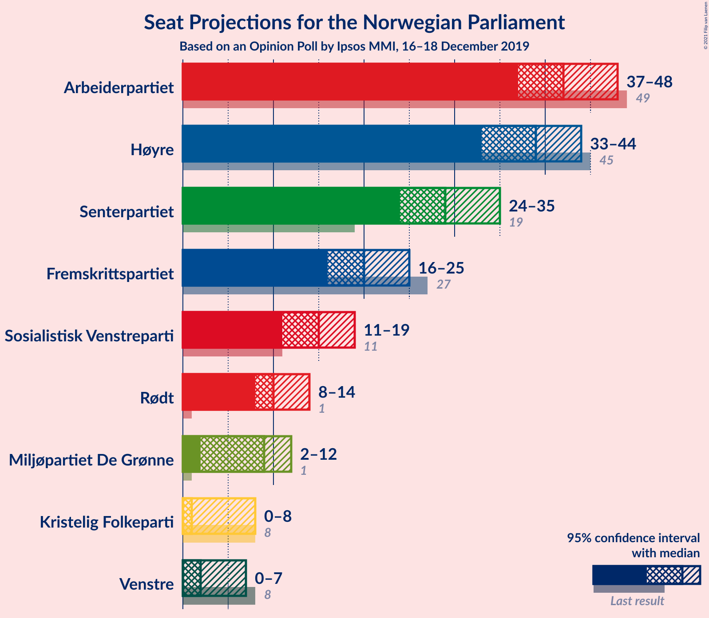
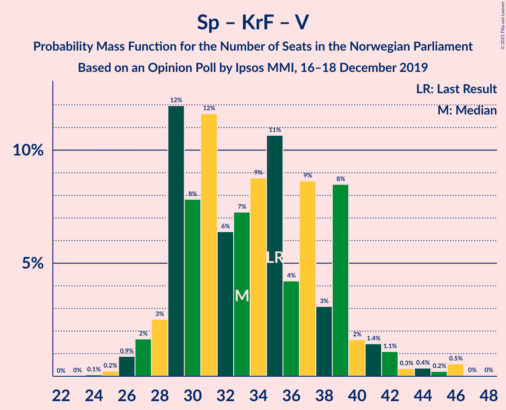

# Opinion Poll by Ipsos MMI, 16–18 December 2019

<a href="#voting-intentions">Voting Intentions</a> | <a href="#seats">Seats</a> | <a href="#coalitions">Coalitions</a> | <a href="#technical-information">Technical Information</a>

## Voting Intentions

### Confidence Intervals

| Party | Last Result | Poll Result | 80% Confidence Interval | 90% Confidence Interval | 95% Confidence Interval | 99% Confidence Interval |
|:-----:|:-----------:|:-----------:|:-----------------------:|:-----------------------:|:-----------------------:|:-----------------------:|
| Arbeiderpartiet | 27.4% | 23.4% | 21.4–25.5% |20.9–26.1% |20.4–26.6% |19.5–27.6% |
| Høyre | 25.0% | 22.1% | 20.2–24.2% |19.7–24.8% |19.2–25.3% |18.4–26.3% |
| Senterpartiet | 10.3% | 15.9% | 14.2–17.7% |13.8–18.2% |13.4–18.7% |12.6–19.6% |
| Fremskrittspartiet | 15.2% | 11.3% | 9.9–12.9% |9.5–13.4% |9.2–13.8% |8.5–14.6% |
| Sosialistisk Venstreparti | 6.0% | 8.5% | 7.3–10.0% |7.0–10.4% |6.7–10.8% |6.1–11.5% |
| Rødt | 2.4% | 5.8% | 4.9–7.1% |4.6–7.5% |4.3–7.8% |3.9–8.5% |
| Miljøpartiet De Grønne | 3.2% | 5.0% | 4.1–6.2% |3.8–6.6% |3.6–6.9% |3.2–7.5% |
| Kristelig Folkeparti | 4.2% | 3.1% | 2.4–4.1% |2.2–4.3% |2.0–4.6% |1.7–5.1% |
| Venstre | 4.4% | 2.8% | 2.1–3.7% |2.0–4.0% |1.8–4.3% |1.5–4.8% |

*Note:* The poll result column reflects the actual value used in the calculations. Published results may vary slightly, and in addition be rounded to fewer digits.

## Seats

### Confidence Intervals

| Party | Last Result | Median | 80% Confidence Interval | 90% Confidence Interval | 95% Confidence Interval | 99% Confidence Interval |
|:-----:|:-----------:|:------:|:-----------------------:|:-----------------------:|:-----------------------:|:-----------------------:|
| <a href="#arbeiderpartiet">Arbeiderpartiet</a> | 49 | 43 | 40–46 |40–46 |39–47 |36–49 |
| <a href="#høyre">Høyre</a> | 45 | 38 | 36–44 |35–44 |34–44 |32–49 |
| <a href="#senterpartiet">Senterpartiet</a> | 19 | 29 | 26–33 |25–34 |25–34 |23–37 |
| <a href="#fremskrittspartiet">Fremskrittspartiet</a> | 27 | 19 | 17–23 |17–25 |17–25 |15–25 |
| <a href="#sosialistisk-venstreparti">Sosialistisk Venstreparti</a> | 11 | 15 | 13–18 |13–18 |12–18 |11–20 |
| <a href="#rødt">Rødt</a> | 1 | 10 | 9–12 |8–12 |8–13 |7–14 |
| <a href="#miljøpartiet-de-grønne">Miljøpartiet De Grønne</a> | 1 | 8 | 7–10 |7–11 |2–11 |2–12 |
| <a href="#kristelig-folkeparti">Kristelig Folkeparti</a> | 8 | 2 | 1–3 |1–3 |0–7 |0–8 |
| <a href="#venstre">Venstre</a> | 8 | 1 | 1–2 |1–2 |0–2 |0–8 |

### Arbeiderpartiet

*For a full overview of the results for this party, see the [Arbeiderpartiet](party-arbeiderpartiet.html) page.*

| Number of Seats | Probability | Accumulated | Special Marks |
|:---------------:|:-----------:|:-----------:|:-------------:|
| 33 | 0.1% | 100% |  |
| 34 | 0% | 99.8% |  |
| 35 | 0.3% | 99.8% |  |
| 36 | 0.5% | 99.5% |  |
| 37 | 0.2% | 99.1% |  |
| 38 | 1.0% | 98.8% |  |
| 39 | 0.7% | 98% |  |
| 40 | 15% | 97% |  |
| 41 | 20% | 82% |  |
| 42 | 2% | 62% |  |
| 43 | 40% | 60% | Median |
| 44 | 6% | 19% |  |
| 45 | 0.5% | 13% |  |
| 46 | 9% | 13% |  |
| 47 | 2% | 3% |  |
| 48 | 0.1% | 1.0% |  |
| 49 | 0.7% | 0.9% | Last Result |
| 50 | 0.1% | 0.2% |  |
| 51 | 0% | 0.1% |  |
| 52 | 0% | 0.1% |  |
| 53 | 0.1% | 0.1% |  |
| 54 | 0% | 0% |  |

### Høyre

*For a full overview of the results for this party, see the [Høyre](party-høyre.html) page.*

| Number of Seats | Probability | Accumulated | Special Marks |
|:---------------:|:-----------:|:-----------:|:-------------:|
| 31 | 0.2% | 100% |  |
| 32 | 1.1% | 99.8% |  |
| 33 | 0.3% | 98.7% |  |
| 34 | 2% | 98% |  |
| 35 | 3% | 97% |  |
| 36 | 5% | 94% |  |
| 37 | 0.5% | 89% |  |
| 38 | 42% | 89% | Median |
| 39 | 1.2% | 47% |  |
| 40 | 18% | 46% |  |
| 41 | 0.4% | 28% |  |
| 42 | 1.2% | 28% |  |
| 43 | 3% | 26% |  |
| 44 | 21% | 23% |  |
| 45 | 0.8% | 2% | Last Result |
| 46 | 0.7% | 1.4% |  |
| 47 | 0.1% | 0.7% |  |
| 48 | 0.1% | 0.6% |  |
| 49 | 0.6% | 0.6% |  |
| 50 | 0% | 0% |  |

### Senterpartiet

*For a full overview of the results for this party, see the [Senterpartiet](party-senterpartiet.html) page.*

| Number of Seats | Probability | Accumulated | Special Marks |
|:---------------:|:-----------:|:-----------:|:-------------:|
| 19 | 0% | 100% | Last Result |
| 20 | 0% | 100% |  |
| 21 | 0.1% | 100% |  |
| 22 | 0.1% | 99.9% |  |
| 23 | 1.0% | 99.8% |  |
| 24 | 0.9% | 98.9% |  |
| 25 | 8% | 98% |  |
| 26 | 12% | 90% |  |
| 27 | 4% | 79% |  |
| 28 | 19% | 75% |  |
| 29 | 6% | 56% | Median |
| 30 | 2% | 50% |  |
| 31 | 1.1% | 48% |  |
| 32 | 15% | 47% |  |
| 33 | 22% | 32% |  |
| 34 | 9% | 10% |  |
| 35 | 0.3% | 1.4% |  |
| 36 | 0.3% | 1.1% |  |
| 37 | 0.7% | 0.8% |  |
| 38 | 0.1% | 0.1% |  |
| 39 | 0% | 0% |  |

### Fremskrittspartiet

*For a full overview of the results for this party, see the [Fremskrittspartiet](party-fremskrittspartiet.html) page.*

| Number of Seats | Probability | Accumulated | Special Marks |
|:---------------:|:-----------:|:-----------:|:-------------:|
| 13 | 0.1% | 100% |  |
| 14 | 0.1% | 99.9% |  |
| 15 | 0.7% | 99.7% |  |
| 16 | 0.6% | 99.0% |  |
| 17 | 12% | 98% |  |
| 18 | 17% | 87% |  |
| 19 | 24% | 70% | Median |
| 20 | 2% | 46% |  |
| 21 | 26% | 44% |  |
| 22 | 0.9% | 18% |  |
| 23 | 9% | 17% |  |
| 24 | 0.4% | 8% |  |
| 25 | 7% | 8% |  |
| 26 | 0.1% | 0.2% |  |
| 27 | 0% | 0.1% | Last Result |
| 28 | 0% | 0.1% |  |
| 29 | 0% | 0% |  |

### Sosialistisk Venstreparti

*For a full overview of the results for this party, see the [Sosialistisk Venstreparti](party-sosialistiskvenstreparti.html) page.*

| Number of Seats | Probability | Accumulated | Special Marks |
|:---------------:|:-----------:|:-----------:|:-------------:|
| 10 | 0.2% | 100% |  |
| 11 | 0.3% | 99.8% | Last Result |
| 12 | 3% | 99.5% |  |
| 13 | 25% | 97% |  |
| 14 | 4% | 72% |  |
| 15 | 37% | 68% | Median |
| 16 | 11% | 31% |  |
| 17 | 4% | 20% |  |
| 18 | 14% | 16% |  |
| 19 | 0.6% | 2% |  |
| 20 | 1.3% | 1.4% |  |
| 21 | 0% | 0.1% |  |
| 22 | 0.1% | 0.1% |  |
| 23 | 0% | 0% |  |

### Rødt

*For a full overview of the results for this party, see the [Rødt](party-rødt.html) page.*

| Number of Seats | Probability | Accumulated | Special Marks |
|:---------------:|:-----------:|:-----------:|:-------------:|
| 1 | 0% | 100% | Last Result |
| 2 | 0.4% | 100% |  |
| 3 | 0% | 99.6% |  |
| 4 | 0% | 99.6% |  |
| 5 | 0% | 99.6% |  |
| 6 | 0% | 99.6% |  |
| 7 | 0.3% | 99.6% |  |
| 8 | 5% | 99.4% |  |
| 9 | 30% | 95% |  |
| 10 | 28% | 64% | Median |
| 11 | 16% | 36% |  |
| 12 | 16% | 20% |  |
| 13 | 1.3% | 4% |  |
| 14 | 2% | 2% |  |
| 15 | 0.3% | 0.4% |  |
| 16 | 0.1% | 0.2% |  |
| 17 | 0% | 0% |  |

### Miljøpartiet De Grønne

*For a full overview of the results for this party, see the [Miljøpartiet De Grønne](party-miljøpartietdegrønne.html) page.*

| Number of Seats | Probability | Accumulated | Special Marks |
|:---------------:|:-----------:|:-----------:|:-------------:|
| 1 | 0.5% | 100% | Last Result |
| 2 | 3% | 99.5% |  |
| 3 | 0.3% | 96% |  |
| 4 | 0% | 96% |  |
| 5 | 0% | 96% |  |
| 6 | 0% | 96% |  |
| 7 | 17% | 96% |  |
| 8 | 40% | 80% | Median |
| 9 | 4% | 39% |  |
| 10 | 27% | 35% |  |
| 11 | 6% | 8% |  |
| 12 | 2% | 2% |  |
| 13 | 0.2% | 0.4% |  |
| 14 | 0.2% | 0.2% |  |
| 15 | 0% | 0% |  |

### Kristelig Folkeparti

*For a full overview of the results for this party, see the [Kristelig Folkeparti](party-kristeligfolkeparti.html) page.*

| Number of Seats | Probability | Accumulated | Special Marks |
|:---------------:|:-----------:|:-----------:|:-------------:|
| 0 | 4% | 100% |  |
| 1 | 46% | 96% |  |
| 2 | 39% | 51% | Median |
| 3 | 7% | 12% |  |
| 4 | 0% | 4% |  |
| 5 | 0% | 4% |  |
| 6 | 0% | 4% |  |
| 7 | 2% | 4% |  |
| 8 | 2% | 2% | Last Result |
| 9 | 0.4% | 0.4% |  |
| 10 | 0% | 0% |  |

### Venstre

*For a full overview of the results for this party, see the [Venstre](party-venstre.html) page.*

| Number of Seats | Probability | Accumulated | Special Marks |
|:---------------:|:-----------:|:-----------:|:-------------:|
| 0 | 3% | 100% |  |
| 1 | 50% | 97% | Median |
| 2 | 45% | 47% |  |
| 3 | 0% | 2% |  |
| 4 | 0% | 2% |  |
| 5 | 0% | 2% |  |
| 6 | 0% | 2% |  |
| 7 | 0.6% | 2% |  |
| 8 | 0.6% | 0.9% | Last Result |
| 9 | 0.3% | 0.3% |  |
| 10 | 0% | 0% |  |

## Coalitions

### Confidence Intervals

| Coalition | Last Result | Median | Majority? | 80% Confidence Interval | 90% Confidence Interval | 95% Confidence Interval | 99% Confidence Interval |
|:---------:|:-----------:|:------:|:---------:|:-----------------------:|:-----------------------:|:-----------------------:|:-----------------------:|
| Arbeiderpartiet – Senterpartiet – Sosialistisk Venstreparti – Rødt – Miljøpartiet De Grønne | 81 | 107 | 100% | 102–111 | 99–111 | 99–113 | 96–114 |
| Arbeiderpartiet – Senterpartiet – Sosialistisk Venstreparti – Miljøpartiet De Grønne – Kristelig Folkeparti | 88 | 99 | 100% | 93–101 | 90–101 | 88–105 | 87–107 |
| Arbeiderpartiet – Senterpartiet – Sosialistisk Venstreparti – Rødt | 80 | 99 | 99.9% | 92–104 | 92–104 | 92–104 | 89–106 |
| Arbeiderpartiet – Senterpartiet – Sosialistisk Venstreparti – Miljøpartiet De Grønne | 80 | 97 | 99.8% | 91–100 | 89–100 | 87–101 | 86–104 |
| Høyre – Senterpartiet – Fremskrittspartiet – Kristelig Folkeparti – Venstre | 107 | 94 | 99.0% | 86–97 | 86–97 | 86–98 | 84–101 |
| Arbeiderpartiet – Senterpartiet – Sosialistisk Venstreparti | 79 | 87 | 67% | 82–93 | 81–93 | 80–93 | 79–95 |
| Arbeiderpartiet – Senterpartiet – Miljøpartiet De Grønne – Kristelig Folkeparti | 77 | 83 | 31% | 78–86 | 75–88 | 74–89 | 70–93 |
| Arbeiderpartiet – Senterpartiet – Kristelig Folkeparti | 76 | 75 | 0.1% | 70–78 | 68–80 | 68–81 | 64–84 |
| Arbeiderpartiet – Senterpartiet | 68 | 73 | 0% | 68–76 | 67–76 | 66–78 | 63–80 |
| Høyre – Fremskrittspartiet – Miljøpartiet De Grønne – Kristelig Folkeparti – Venstre | 89 | 70 | 0.1% | 65–77 | 65–77 | 65–77 | 63–79 |
| Høyre – Fremskrittspartiet – Kristelig Folkeparti – Venstre | 88 | 62 | 0% | 58–67 | 58–70 | 56–70 | 55–72 |
| Høyre – Fremskrittspartiet – Venstre | 80 | 59 | 0% | 57–66 | 56–68 | 55–69 | 52–70 |
| Høyre – Fremskrittspartiet | 72 | 57 | 0% | 56–65 | 55–66 | 52–67 | 51–68 |
| Arbeiderpartiet – Sosialistisk Venstreparti | 60 | 58 | 0% | 54–61 | 53–61 | 53–62 | 50–67 |
| Høyre – Kristelig Folkeparti – Venstre | 61 | 42 | 0% | 40–47 | 40–48 | 38–49 | 37–52 |
| Senterpartiet – Kristelig Folkeparti – Venstre | 35 | 34 | 0% | 29–37 | 29–37 | 29–40 | 26–44 |

### Arbeiderpartiet – Senterpartiet – Sosialistisk Venstreparti – Rødt – Miljøpartiet De Grønne

| Number of Seats | Probability | Accumulated | Special Marks |
|:---------------:|:-----------:|:-----------:|:-------------:|
| 81 | 0% | 100% | Last Result |
| 82 | 0% | 100% |  |
| 83 | 0% | 100% |  |
| 84 | 0% | 100% |  |
| 85 | 0% | 100% | Majority |
| 86 | 0% | 100% |  |
| 87 | 0% | 100% |  |
| 88 | 0% | 100% |  |
| 89 | 0% | 100% |  |
| 90 | 0% | 100% |  |
| 91 | 0% | 99.9% |  |
| 92 | 0% | 99.9% |  |
| 93 | 0% | 99.9% |  |
| 94 | 0.1% | 99.9% |  |
| 95 | 0.2% | 99.8% |  |
| 96 | 0.1% | 99.6% |  |
| 97 | 0.5% | 99.5% |  |
| 98 | 0.8% | 99.0% |  |
| 99 | 4% | 98% |  |
| 100 | 0.9% | 94% |  |
| 101 | 0.6% | 93% |  |
| 102 | 24% | 93% |  |
| 103 | 4% | 68% |  |
| 104 | 0.4% | 64% |  |
| 105 | 4% | 64% | Median |
| 106 | 8% | 59% |  |
| 107 | 2% | 51% |  |
| 108 | 22% | 49% |  |
| 109 | 9% | 28% |  |
| 110 | 2% | 18% |  |
| 111 | 12% | 17% |  |
| 112 | 1.3% | 5% |  |
| 113 | 3% | 3% |  |
| 114 | 0.7% | 0.7% |  |
| 115 | 0% | 0.1% |  |
| 116 | 0% | 0.1% |  |
| 117 | 0% | 0% |  |

### Arbeiderpartiet – Senterpartiet – Sosialistisk Venstreparti – Miljøpartiet De Grønne – Kristelig Folkeparti

| Number of Seats | Probability | Accumulated | Special Marks |
|:---------------:|:-----------:|:-----------:|:-------------:|
| 87 | 0.7% | 100% |  |
| 88 | 3% | 99.3% | Last Result |
| 89 | 0.2% | 96% |  |
| 90 | 1.0% | 96% |  |
| 91 | 2% | 95% |  |
| 92 | 0.4% | 93% |  |
| 93 | 17% | 93% |  |
| 94 | 9% | 75% |  |
| 95 | 2% | 66% |  |
| 96 | 0.3% | 64% |  |
| 97 | 1.3% | 64% | Median |
| 98 | 8% | 63% |  |
| 99 | 9% | 55% |  |
| 100 | 5% | 45% |  |
| 101 | 36% | 41% |  |
| 102 | 0.6% | 5% |  |
| 103 | 0.9% | 4% |  |
| 104 | 0.7% | 4% |  |
| 105 | 1.3% | 3% |  |
| 106 | 0.2% | 1.4% |  |
| 107 | 1.1% | 1.2% |  |
| 108 | 0.1% | 0.1% |  |
| 109 | 0% | 0.1% |  |
| 110 | 0% | 0% |  |

### Arbeiderpartiet – Senterpartiet – Sosialistisk Venstreparti – Rødt

| Number of Seats | Probability | Accumulated | Special Marks |
|:---------------:|:-----------:|:-----------:|:-------------:|
| 80 | 0% | 100% | Last Result |
| 81 | 0% | 100% |  |
| 82 | 0% | 100% |  |
| 83 | 0% | 100% |  |
| 84 | 0% | 99.9% |  |
| 85 | 0% | 99.9% | Majority |
| 86 | 0% | 99.9% |  |
| 87 | 0.2% | 99.9% |  |
| 88 | 0.2% | 99.7% |  |
| 89 | 0.1% | 99.6% |  |
| 90 | 0.4% | 99.4% |  |
| 91 | 1.0% | 99.0% |  |
| 92 | 21% | 98% |  |
| 93 | 1.0% | 77% |  |
| 94 | 11% | 77% |  |
| 95 | 3% | 66% |  |
| 96 | 0.5% | 63% |  |
| 97 | 3% | 62% | Median |
| 98 | 8% | 60% |  |
| 99 | 11% | 51% |  |
| 100 | 21% | 40% |  |
| 101 | 3% | 19% |  |
| 102 | 0.6% | 16% |  |
| 103 | 1.2% | 15% |  |
| 104 | 13% | 14% |  |
| 105 | 0.2% | 0.9% |  |
| 106 | 0.5% | 0.7% |  |
| 107 | 0% | 0.2% |  |
| 108 | 0.1% | 0.1% |  |
| 109 | 0% | 0% |  |

### Arbeiderpartiet – Senterpartiet – Sosialistisk Venstreparti – Miljøpartiet De Grønne

| Number of Seats | Probability | Accumulated | Special Marks |
|:---------------:|:-----------:|:-----------:|:-------------:|
| 80 | 0% | 100% | Last Result |
| 81 | 0.1% | 100% |  |
| 82 | 0% | 99.9% |  |
| 83 | 0% | 99.9% |  |
| 84 | 0.1% | 99.9% |  |
| 85 | 0.2% | 99.8% | Majority |
| 86 | 0.7% | 99.6% |  |
| 87 | 3% | 99.0% |  |
| 88 | 0.7% | 96% |  |
| 89 | 2% | 95% |  |
| 90 | 1.0% | 93% |  |
| 91 | 2% | 92% |  |
| 92 | 24% | 89% |  |
| 93 | 0.9% | 65% |  |
| 94 | 2% | 64% |  |
| 95 | 0.8% | 63% | Median |
| 96 | 1.2% | 62% |  |
| 97 | 21% | 61% |  |
| 98 | 1.4% | 40% |  |
| 99 | 21% | 39% |  |
| 100 | 14% | 18% |  |
| 101 | 3% | 5% |  |
| 102 | 0.3% | 2% |  |
| 103 | 0.4% | 1.3% |  |
| 104 | 0.8% | 0.9% |  |
| 105 | 0% | 0.1% |  |
| 106 | 0% | 0.1% |  |
| 107 | 0% | 0.1% |  |
| 108 | 0% | 0% |  |

### Høyre – Senterpartiet – Fremskrittspartiet – Kristelig Folkeparti – Venstre

| Number of Seats | Probability | Accumulated | Special Marks |
|:---------------:|:-----------:|:-----------:|:-------------:|
| 81 | 0% | 100% |  |
| 82 | 0% | 99.9% |  |
| 83 | 0% | 99.9% |  |
| 84 | 0.9% | 99.9% |  |
| 85 | 1.0% | 99.0% | Majority |
| 86 | 9% | 98% |  |
| 87 | 0.6% | 89% |  |
| 88 | 2% | 89% |  |
| 89 | 0.7% | 87% | Median |
| 90 | 14% | 86% |  |
| 91 | 0.7% | 72% |  |
| 92 | 10% | 71% |  |
| 93 | 4% | 62% |  |
| 94 | 23% | 57% |  |
| 95 | 21% | 35% |  |
| 96 | 0.5% | 14% |  |
| 97 | 11% | 14% |  |
| 98 | 0.3% | 3% |  |
| 99 | 0.5% | 2% |  |
| 100 | 1.0% | 2% |  |
| 101 | 0.4% | 0.9% |  |
| 102 | 0.1% | 0.4% |  |
| 103 | 0.2% | 0.3% |  |
| 104 | 0% | 0.1% |  |
| 105 | 0% | 0.1% |  |
| 106 | 0% | 0% |  |
| 107 | 0% | 0% | Last Result |

### Arbeiderpartiet – Senterpartiet – Sosialistisk Venstreparti

| Number of Seats | Probability | Accumulated | Special Marks |
|:---------------:|:-----------:|:-----------:|:-------------:|
| 73 | 0% | 100% |  |
| 74 | 0% | 99.9% |  |
| 75 | 0% | 99.9% |  |
| 76 | 0% | 99.9% |  |
| 77 | 0.3% | 99.9% |  |
| 78 | 0.1% | 99.6% |  |
| 79 | 0.7% | 99.5% | Last Result |
| 80 | 4% | 98.8% |  |
| 81 | 0.3% | 95% |  |
| 82 | 18% | 95% |  |
| 83 | 2% | 77% |  |
| 84 | 8% | 75% |  |
| 85 | 1.0% | 67% | Majority |
| 86 | 5% | 66% |  |
| 87 | 12% | 62% | Median |
| 88 | 2% | 50% |  |
| 89 | 10% | 48% |  |
| 90 | 1.3% | 38% |  |
| 91 | 21% | 36% |  |
| 92 | 2% | 16% |  |
| 93 | 13% | 14% |  |
| 94 | 0.2% | 1.3% |  |
| 95 | 0.9% | 1.2% |  |
| 96 | 0.1% | 0.3% |  |
| 97 | 0.1% | 0.2% |  |
| 98 | 0% | 0.1% |  |
| 99 | 0% | 0% |  |

### Arbeiderpartiet – Senterpartiet – Miljøpartiet De Grønne – Kristelig Folkeparti

| Number of Seats | Probability | Accumulated | Special Marks |
|:---------------:|:-----------:|:-----------:|:-------------:|
| 70 | 0.7% | 100% |  |
| 71 | 0.7% | 99.3% |  |
| 72 | 0% | 98.6% |  |
| 73 | 0.1% | 98.5% |  |
| 74 | 1.2% | 98% |  |
| 75 | 4% | 97% |  |
| 76 | 0.4% | 93% |  |
| 77 | 0.3% | 93% | Last Result |
| 78 | 8% | 92% |  |
| 79 | 1.1% | 84% |  |
| 80 | 19% | 83% |  |
| 81 | 0.4% | 64% |  |
| 82 | 0.4% | 63% | Median |
| 83 | 21% | 63% |  |
| 84 | 12% | 42% |  |
| 85 | 0.2% | 31% | Majority |
| 86 | 21% | 30% |  |
| 87 | 5% | 10% |  |
| 88 | 0.4% | 5% |  |
| 89 | 2% | 5% |  |
| 90 | 0.2% | 2% |  |
| 91 | 1.4% | 2% |  |
| 92 | 0.1% | 0.8% |  |
| 93 | 0.6% | 0.7% |  |
| 94 | 0.1% | 0.1% |  |
| 95 | 0% | 0% |  |

### Arbeiderpartiet – Senterpartiet – Kristelig Folkeparti

| Number of Seats | Probability | Accumulated | Special Marks |
|:---------------:|:-----------:|:-----------:|:-------------:|
| 63 | 0% | 100% |  |
| 64 | 0.9% | 99.9% |  |
| 65 | 0.1% | 99.0% |  |
| 66 | 0.3% | 98.9% |  |
| 67 | 0.2% | 98.6% |  |
| 68 | 4% | 98% |  |
| 69 | 0.4% | 94% |  |
| 70 | 25% | 94% |  |
| 71 | 0.7% | 68% |  |
| 72 | 5% | 68% |  |
| 73 | 1.2% | 63% |  |
| 74 | 9% | 62% | Median |
| 75 | 7% | 52% |  |
| 76 | 17% | 45% | Last Result |
| 77 | 0.5% | 27% |  |
| 78 | 21% | 27% |  |
| 79 | 0.3% | 6% |  |
| 80 | 3% | 5% |  |
| 81 | 1.5% | 3% |  |
| 82 | 0.1% | 1.2% |  |
| 83 | 0.4% | 1.1% |  |
| 84 | 0.6% | 0.7% |  |
| 85 | 0% | 0.1% | Majority |
| 86 | 0% | 0.1% |  |
| 87 | 0% | 0% |  |

### Arbeiderpartiet – Senterpartiet

| Number of Seats | Probability | Accumulated | Special Marks |
|:---------------:|:-----------:|:-----------:|:-------------:|
| 60 | 0% | 100% |  |
| 61 | 0.1% | 99.9% |  |
| 62 | 0.3% | 99.9% |  |
| 63 | 0.7% | 99.6% |  |
| 64 | 0.1% | 98.9% |  |
| 65 | 0.5% | 98.8% |  |
| 66 | 0.9% | 98% |  |
| 67 | 4% | 97% |  |
| 68 | 7% | 93% | Last Result |
| 69 | 20% | 86% |  |
| 70 | 2% | 65% |  |
| 71 | 0.6% | 63% |  |
| 72 | 11% | 63% | Median |
| 73 | 6% | 52% |  |
| 74 | 9% | 46% |  |
| 75 | 13% | 37% |  |
| 76 | 21% | 25% |  |
| 77 | 1.0% | 4% |  |
| 78 | 0.2% | 3% |  |
| 79 | 0.5% | 2% |  |
| 80 | 2% | 2% |  |
| 81 | 0% | 0.2% |  |
| 82 | 0% | 0.1% |  |
| 83 | 0.1% | 0.1% |  |
| 84 | 0% | 0% |  |

### Høyre – Fremskrittspartiet – Miljøpartiet De Grønne – Kristelig Folkeparti – Venstre

| Number of Seats | Probability | Accumulated | Special Marks |
|:---------------:|:-----------:|:-----------:|:-------------:|
| 61 | 0.1% | 100% |  |
| 62 | 0% | 99.9% |  |
| 63 | 0.5% | 99.8% |  |
| 64 | 0.2% | 99.3% |  |
| 65 | 13% | 99.1% |  |
| 66 | 1.2% | 86% |  |
| 67 | 0.6% | 85% |  |
| 68 | 3% | 84% | Median |
| 69 | 21% | 81% |  |
| 70 | 11% | 60% |  |
| 71 | 8% | 49% |  |
| 72 | 3% | 40% |  |
| 73 | 0.5% | 38% |  |
| 74 | 3% | 37% |  |
| 75 | 11% | 34% |  |
| 76 | 1.0% | 23% |  |
| 77 | 21% | 22% |  |
| 78 | 1.0% | 2% |  |
| 79 | 0.3% | 0.8% |  |
| 80 | 0.1% | 0.4% |  |
| 81 | 0.2% | 0.3% |  |
| 82 | 0.1% | 0.2% |  |
| 83 | 0% | 0.1% |  |
| 84 | 0% | 0.1% |  |
| 85 | 0% | 0.1% | Majority |
| 86 | 0% | 0.1% |  |
| 87 | 0% | 0% |  |
| 88 | 0% | 0% |  |
| 89 | 0% | 0% | Last Result |

### Høyre – Fremskrittspartiet – Kristelig Folkeparti – Venstre

| Number of Seats | Probability | Accumulated | Special Marks |
|:---------------:|:-----------:|:-----------:|:-------------:|
| 53 | 0% | 100% |  |
| 54 | 0% | 99.9% |  |
| 55 | 0.7% | 99.9% |  |
| 56 | 3% | 99.2% |  |
| 57 | 1.3% | 97% |  |
| 58 | 12% | 95% |  |
| 59 | 2% | 83% |  |
| 60 | 9% | 81% | Median |
| 61 | 22% | 72% |  |
| 62 | 2% | 51% |  |
| 63 | 8% | 49% |  |
| 64 | 4% | 41% |  |
| 65 | 0.4% | 36% |  |
| 66 | 4% | 36% |  |
| 67 | 24% | 32% |  |
| 68 | 0.6% | 7% |  |
| 69 | 0.9% | 7% |  |
| 70 | 4% | 6% |  |
| 71 | 0.7% | 2% |  |
| 72 | 0.5% | 0.9% |  |
| 73 | 0.1% | 0.4% |  |
| 74 | 0.1% | 0.3% |  |
| 75 | 0.1% | 0.2% |  |
| 76 | 0% | 0.1% |  |
| 77 | 0% | 0.1% |  |
| 78 | 0% | 0.1% |  |
| 79 | 0% | 0.1% |  |
| 80 | 0% | 0% |  |
| 81 | 0% | 0% |  |
| 82 | 0% | 0% |  |
| 83 | 0% | 0% |  |
| 84 | 0% | 0% |  |
| 85 | 0% | 0% | Majority |
| 86 | 0% | 0% |  |
| 87 | 0% | 0% |  |
| 88 | 0% | 0% | Last Result |

### Høyre – Fremskrittspartiet – Venstre

| Number of Seats | Probability | Accumulated | Special Marks |
|:---------------:|:-----------:|:-----------:|:-------------:|
| 51 | 0% | 100% |  |
| 52 | 2% | 99.9% |  |
| 53 | 0.2% | 98% |  |
| 54 | 0.3% | 98% |  |
| 55 | 2% | 98% |  |
| 56 | 2% | 96% |  |
| 57 | 14% | 94% |  |
| 58 | 9% | 80% | Median |
| 59 | 22% | 71% |  |
| 60 | 0.8% | 49% |  |
| 61 | 4% | 48% |  |
| 62 | 8% | 44% |  |
| 63 | 2% | 35% |  |
| 64 | 2% | 33% |  |
| 65 | 8% | 31% |  |
| 66 | 18% | 23% |  |
| 67 | 0.2% | 6% |  |
| 68 | 0.7% | 6% |  |
| 69 | 4% | 5% |  |
| 70 | 0.7% | 0.9% |  |
| 71 | 0% | 0.2% |  |
| 72 | 0.1% | 0.2% |  |
| 73 | 0% | 0% |  |
| 74 | 0% | 0% |  |
| 75 | 0% | 0% |  |
| 76 | 0% | 0% |  |
| 77 | 0% | 0% |  |
| 78 | 0% | 0% |  |
| 79 | 0% | 0% |  |
| 80 | 0% | 0% | Last Result |

### Høyre – Fremskrittspartiet

| Number of Seats | Probability | Accumulated | Special Marks |
|:---------------:|:-----------:|:-----------:|:-------------:|
| 48 | 0% | 100% |  |
| 49 | 0% | 99.9% |  |
| 50 | 0.2% | 99.9% |  |
| 51 | 2% | 99.7% |  |
| 52 | 0.5% | 98% |  |
| 53 | 2% | 97% |  |
| 54 | 0.3% | 95% |  |
| 55 | 3% | 95% |  |
| 56 | 13% | 92% |  |
| 57 | 30% | 79% | Median |
| 58 | 1.4% | 49% |  |
| 59 | 4% | 48% |  |
| 60 | 1.0% | 43% |  |
| 61 | 9% | 42% |  |
| 62 | 2% | 33% |  |
| 63 | 7% | 31% |  |
| 64 | 0.1% | 24% |  |
| 65 | 18% | 24% |  |
| 66 | 0.6% | 5% |  |
| 67 | 4% | 5% |  |
| 68 | 0.9% | 1.0% |  |
| 69 | 0.1% | 0.1% |  |
| 70 | 0% | 0.1% |  |
| 71 | 0% | 0% |  |
| 72 | 0% | 0% | Last Result |

### Arbeiderpartiet – Sosialistisk Venstreparti

| Number of Seats | Probability | Accumulated | Special Marks |
|:---------------:|:-----------:|:-----------:|:-------------:|
| 47 | 0.1% | 100% |  |
| 48 | 0% | 99.9% |  |
| 49 | 0.2% | 99.8% |  |
| 50 | 0.6% | 99.6% |  |
| 51 | 0.2% | 99.0% |  |
| 52 | 0.5% | 98.8% |  |
| 53 | 4% | 98% |  |
| 54 | 17% | 95% |  |
| 55 | 10% | 77% |  |
| 56 | 3% | 67% |  |
| 57 | 8% | 65% |  |
| 58 | 22% | 57% | Median |
| 59 | 9% | 35% |  |
| 60 | 0.4% | 26% | Last Result |
| 61 | 23% | 26% |  |
| 62 | 1.3% | 4% |  |
| 63 | 1.2% | 2% |  |
| 64 | 0.2% | 1.1% |  |
| 65 | 0.2% | 1.0% |  |
| 66 | 0% | 0.8% |  |
| 67 | 0.7% | 0.7% |  |
| 68 | 0% | 0.1% |  |
| 69 | 0% | 0% |  |

### Høyre – Kristelig Folkeparti – Venstre

| Number of Seats | Probability | Accumulated | Special Marks |
|:---------------:|:-----------:|:-----------:|:-------------:|
| 34 | 0.1% | 100% |  |
| 35 | 0.1% | 99.9% |  |
| 36 | 0.1% | 99.7% |  |
| 37 | 2% | 99.6% |  |
| 38 | 0.8% | 98% |  |
| 39 | 2% | 97% |  |
| 40 | 14% | 95% |  |
| 41 | 5% | 81% | Median |
| 42 | 35% | 76% |  |
| 43 | 12% | 41% |  |
| 44 | 0.7% | 30% |  |
| 45 | 0.8% | 29% |  |
| 46 | 18% | 28% |  |
| 47 | 5% | 10% |  |
| 48 | 2% | 6% |  |
| 49 | 1.2% | 3% |  |
| 50 | 0.5% | 2% |  |
| 51 | 0.1% | 2% |  |
| 52 | 1.3% | 1.4% |  |
| 53 | 0.1% | 0.2% |  |
| 54 | 0% | 0.1% |  |
| 55 | 0% | 0.1% |  |
| 56 | 0% | 0.1% |  |
| 57 | 0% | 0.1% |  |
| 58 | 0.1% | 0.1% |  |
| 59 | 0% | 0% |  |
| 60 | 0% | 0% |  |
| 61 | 0% | 0% | Last Result |

### Senterpartiet – Kristelig Folkeparti – Venstre

| Number of Seats | Probability | Accumulated | Special Marks |
|:---------------:|:-----------:|:-----------:|:-------------:|
| 24 | 0.1% | 100% |  |
| 25 | 0.1% | 99.9% |  |
| 26 | 0.7% | 99.8% |  |
| 27 | 0.4% | 99.2% |  |
| 28 | 1.1% | 98.8% |  |
| 29 | 16% | 98% |  |
| 30 | 23% | 82% |  |
| 31 | 1.2% | 59% |  |
| 32 | 0.2% | 58% | Median |
| 33 | 4% | 58% |  |
| 34 | 18% | 54% |  |
| 35 | 2% | 36% | Last Result |
| 36 | 8% | 34% |  |
| 37 | 21% | 26% |  |
| 38 | 0.7% | 4% |  |
| 39 | 1.2% | 4% |  |
| 40 | 0.4% | 3% |  |
| 41 | 0.4% | 2% |  |
| 42 | 0.8% | 2% |  |
| 43 | 0.3% | 0.8% |  |
| 44 | 0.2% | 0.5% |  |
| 45 | 0% | 0.4% |  |
| 46 | 0.3% | 0.3% |  |
| 47 | 0% | 0% |  |

## Technical Information

### Opinion Poll

+ **Polling firm:** Ipsos MMI
+ **Commissioner(s):** —
+ **Fieldwork period:** 16–18 December 2019

### Calculations

+ **Sample size:** 719
+ **Simulations done:** 65,536
+ **Error estimate:** 1.63%

