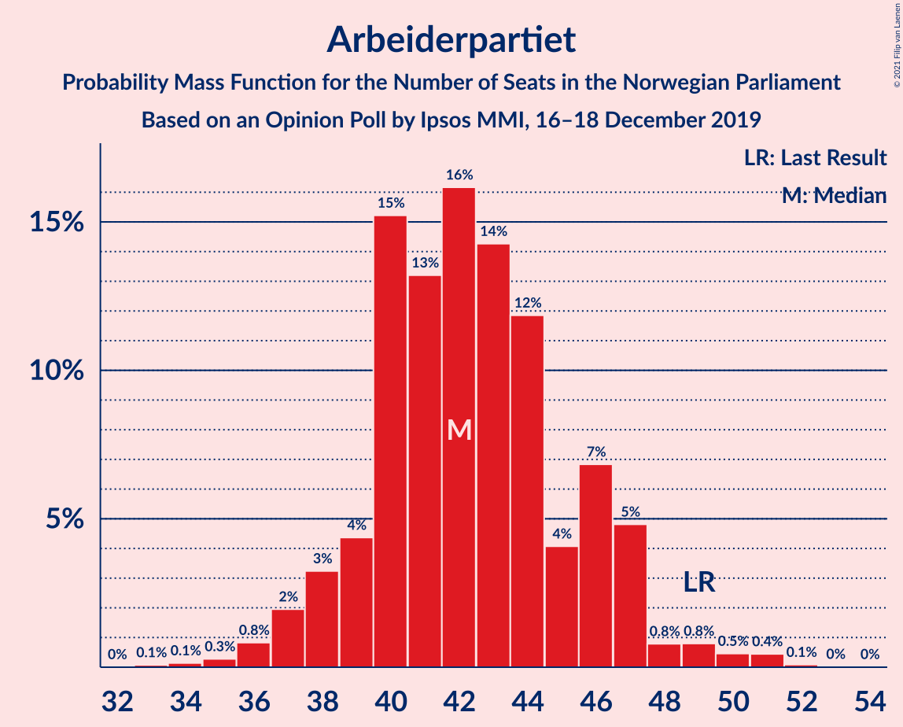
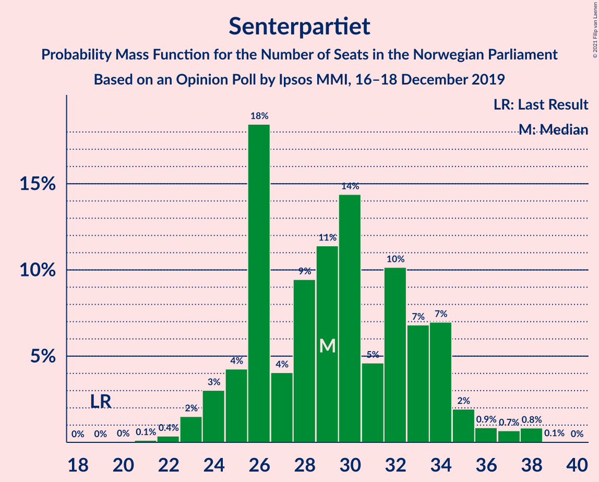
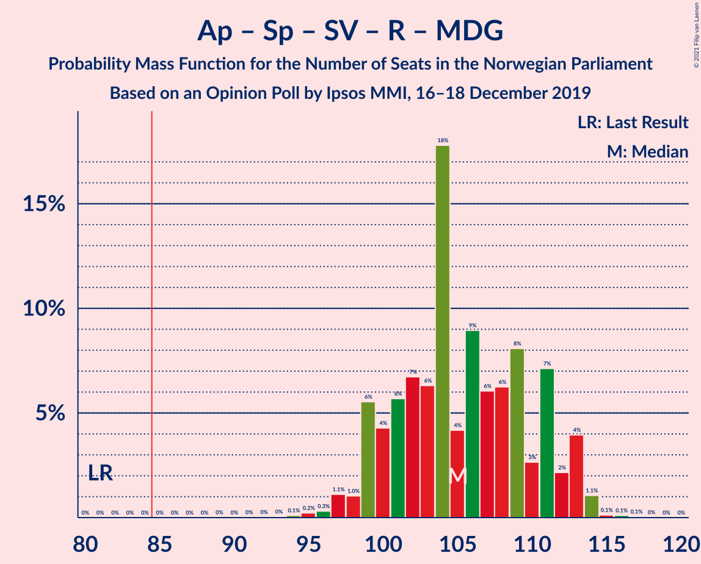
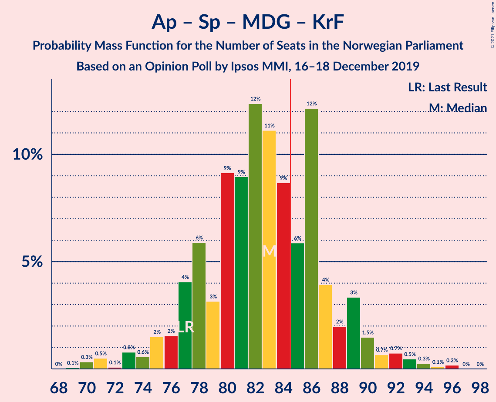
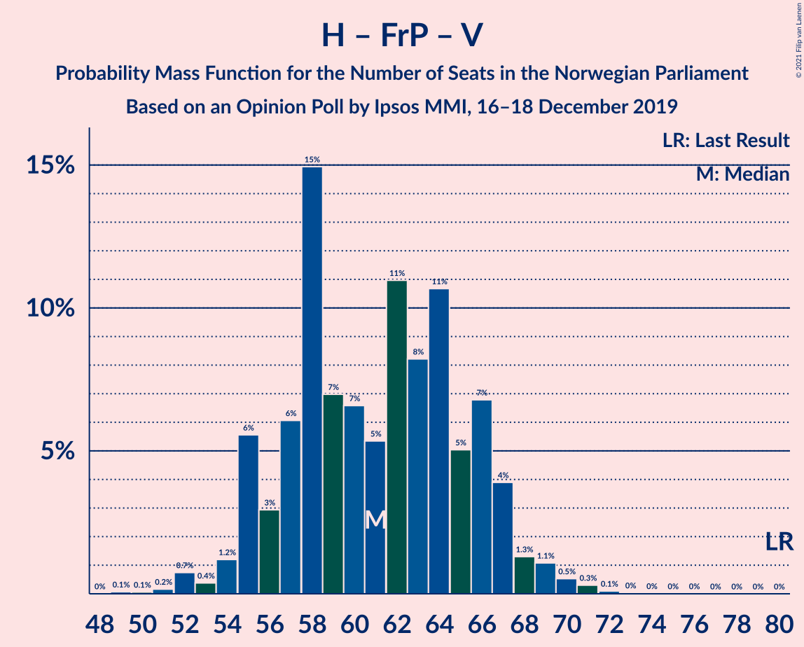

# Opinion Poll by Ipsos MMI, 16–18 December 2019

<a href="#voting-intentions">Voting Intentions</a> | <a href="#seats">Seats</a> | <a href="#coalitions">Coalitions</a> | <a href="#technical-information">Technical Information</a>

## Voting Intentions

### Confidence Intervals

| Party | Last Result | Poll Result | 80% Confidence Interval | 90% Confidence Interval | 95% Confidence Interval | 99% Confidence Interval |
|:-----:|:-----------:|:-----------:|:-----------------------:|:-----------------------:|:-----------------------:|:-----------------------:|
| Arbeiderpartiet | 27.4% | 23.4% | 21.4–25.5% |20.9–26.1% |20.4–26.6% |19.5–27.6% |
| Høyre | 25.0% | 22.1% | 20.2–24.2% |19.7–24.8% |19.2–25.3% |18.4–26.3% |
| Senterpartiet | 10.3% | 15.9% | 14.2–17.7% |13.8–18.2% |13.4–18.7% |12.6–19.6% |
| Fremskrittspartiet | 15.2% | 11.3% | 9.9–12.9% |9.5–13.4% |9.2–13.8% |8.5–14.6% |
| Sosialistisk Venstreparti | 6.0% | 8.5% | 7.3–10.0% |7.0–10.4% |6.7–10.8% |6.1–11.5% |
| Rødt | 2.4% | 5.8% | 4.9–7.1% |4.6–7.5% |4.3–7.8% |3.9–8.5% |
| Miljøpartiet De Grønne | 3.2% | 5.0% | 4.1–6.2% |3.8–6.6% |3.6–6.9% |3.2–7.5% |
| Kristelig Folkeparti | 4.2% | 3.1% | 2.4–4.1% |2.2–4.3% |2.0–4.6% |1.7–5.1% |
| Venstre | 4.4% | 2.8% | 2.1–3.7% |2.0–4.0% |1.8–4.3% |1.5–4.8% |

*Note:* The poll result column reflects the actual value used in the calculations. Published results may vary slightly, and in addition be rounded to fewer digits.

## Seats

### Confidence Intervals

| Party | Last Result | Median | 80% Confidence Interval | 90% Confidence Interval | 95% Confidence Interval | 99% Confidence Interval |
|:-----:|:-----------:|:------:|:-----------------------:|:-----------------------:|:-----------------------:|:-----------------------:|
| <a href="#arbeiderpartiet">Arbeiderpartiet</a> | 49 | 43 | 41–46 |40–46 |39–47 |35–49 |
| <a href="#høyre">Høyre</a> | 45 | 38 | 38–44 |35–44 |35–44 |33–49 |
| <a href="#senterpartiet">Senterpartiet</a> | 19 | 28 | 25–33 |25–33 |25–34 |23–37 |
| <a href="#fremskrittspartiet">Fremskrittspartiet</a> | 27 | 19 | 17–25 |17–25 |17–25 |15–25 |
| <a href="#sosialistisk-venstreparti">Sosialistisk Venstreparti</a> | 11 | 15 | 13–16 |13–17 |12–18 |12–20 |
| <a href="#rødt">Rødt</a> | 1 | 10 | 9–12 |9–12 |9–13 |7–15 |
| <a href="#miljøpartiet-de-grønne">Miljøpartiet De Grønne</a> | 1 | 9 | 8–10 |8–10 |7–12 |2–12 |
| <a href="#kristelig-folkeparti">Kristelig Folkeparti</a> | 8 | 2 | 1–2 |0–3 |0–7 |0–8 |
| <a href="#venstre">Venstre</a> | 8 | 2 | 1–2 |1–2 |0–2 |0–8 |

### Arbeiderpartiet

*For a full overview of the results for this party, see the [Arbeiderpartiet](party-arbeiderpartiet.html) page.*

| Number of Seats | Probability | Accumulated | Special Marks |
|:---------------:|:-----------:|:-----------:|:-------------:|
| 33 | 0.2% | 100% |  |
| 34 | 0% | 99.8% |  |
| 35 | 0.4% | 99.8% |  |
| 36 | 0.4% | 99.4% |  |
| 37 | 0.2% | 99.0% |  |
| 38 | 1.0% | 98.8% |  |
| 39 | 0.8% | 98% |  |
| 40 | 7% | 97% |  |
| 41 | 28% | 90% |  |
| 42 | 1.3% | 62% |  |
| 43 | 42% | 61% | Median |
| 44 | 1.3% | 19% |  |
| 45 | 0.2% | 17% |  |
| 46 | 14% | 17% |  |
| 47 | 2% | 3% |  |
| 48 | 0.1% | 1.3% |  |
| 49 | 1.0% | 1.2% | Last Result |
| 50 | 0.1% | 0.2% |  |
| 51 | 0% | 0.1% |  |
| 52 | 0% | 0.1% |  |
| 53 | 0.1% | 0.1% |  |
| 54 | 0% | 0% |  |

### Høyre

*For a full overview of the results for this party, see the [Høyre](party-høyre.html) page.*

| Number of Seats | Probability | Accumulated | Special Marks |
|:---------------:|:-----------:|:-----------:|:-------------:|
| 31 | 0.2% | 100% |  |
| 32 | 0.2% | 99.8% |  |
| 33 | 0.2% | 99.6% |  |
| 34 | 1.1% | 99.4% |  |
| 35 | 4% | 98% |  |
| 36 | 1.0% | 94% |  |
| 37 | 0.3% | 93% |  |
| 38 | 44% | 93% | Median |
| 39 | 1.2% | 48% |  |
| 40 | 16% | 47% |  |
| 41 | 0.3% | 31% |  |
| 42 | 2% | 31% |  |
| 43 | 1.1% | 29% |  |
| 44 | 26% | 28% |  |
| 45 | 1.0% | 2% | Last Result |
| 46 | 0% | 1.0% |  |
| 47 | 0% | 1.0% |  |
| 48 | 0.1% | 0.9% |  |
| 49 | 0.8% | 0.9% |  |
| 50 | 0% | 0% |  |

### Senterpartiet

*For a full overview of the results for this party, see the [Senterpartiet](party-senterpartiet.html) page.*

| Number of Seats | Probability | Accumulated | Special Marks |
|:---------------:|:-----------:|:-----------:|:-------------:|
| 19 | 0% | 100% | Last Result |
| 20 | 0% | 100% |  |
| 21 | 0% | 100% |  |
| 22 | 0.1% | 100% |  |
| 23 | 1.3% | 99.9% |  |
| 24 | 0.7% | 98.6% |  |
| 25 | 11% | 98% |  |
| 26 | 14% | 87% |  |
| 27 | 0.8% | 73% |  |
| 28 | 27% | 72% | Median |
| 29 | 3% | 45% |  |
| 30 | 1.1% | 42% |  |
| 31 | 1.2% | 41% |  |
| 32 | 3% | 40% |  |
| 33 | 34% | 37% |  |
| 34 | 2% | 3% |  |
| 35 | 0.2% | 1.2% |  |
| 36 | 0.3% | 1.0% |  |
| 37 | 0.6% | 0.7% |  |
| 38 | 0.1% | 0.1% |  |
| 39 | 0% | 0% |  |

### Fremskrittspartiet

*For a full overview of the results for this party, see the [Fremskrittspartiet](party-fremskrittspartiet.html) page.*

| Number of Seats | Probability | Accumulated | Special Marks |
|:---------------:|:-----------:|:-----------:|:-------------:|
| 14 | 0.1% | 100% |  |
| 15 | 0.9% | 99.9% |  |
| 16 | 0.4% | 99.0% |  |
| 17 | 18% | 98.6% |  |
| 18 | 3% | 81% |  |
| 19 | 32% | 77% | Median |
| 20 | 2% | 45% |  |
| 21 | 27% | 43% |  |
| 22 | 0.7% | 16% |  |
| 23 | 3% | 15% |  |
| 24 | 0.2% | 12% |  |
| 25 | 11% | 12% |  |
| 26 | 0% | 0.1% |  |
| 27 | 0% | 0.1% | Last Result |
| 28 | 0% | 0.1% |  |
| 29 | 0% | 0% |  |

### Sosialistisk Venstreparti

*For a full overview of the results for this party, see the [Sosialistisk Venstreparti](party-sosialistiskvenstreparti.html) page.*

| Number of Seats | Probability | Accumulated | Special Marks |
|:---------------:|:-----------:|:-----------:|:-------------:|
| 10 | 0.2% | 100% |  |
| 11 | 0.2% | 99.8% | Last Result |
| 12 | 3% | 99.6% |  |
| 13 | 27% | 97% |  |
| 14 | 1.4% | 69% |  |
| 15 | 45% | 68% | Median |
| 16 | 15% | 23% |  |
| 17 | 5% | 8% |  |
| 18 | 2% | 3% |  |
| 19 | 0.3% | 1.3% |  |
| 20 | 0.9% | 1.0% |  |
| 21 | 0% | 0.1% |  |
| 22 | 0% | 0% |  |

### Rødt

*For a full overview of the results for this party, see the [Rødt](party-rødt.html) page.*

| Number of Seats | Probability | Accumulated | Special Marks |
|:---------------:|:-----------:|:-----------:|:-------------:|
| 1 | 0% | 100% | Last Result |
| 2 | 0.4% | 100% |  |
| 3 | 0% | 99.6% |  |
| 4 | 0% | 99.6% |  |
| 5 | 0% | 99.6% |  |
| 6 | 0% | 99.6% |  |
| 7 | 0.3% | 99.6% |  |
| 8 | 0.6% | 99.3% |  |
| 9 | 34% | 98.6% |  |
| 10 | 40% | 64% | Median |
| 11 | 4% | 24% |  |
| 12 | 18% | 20% |  |
| 13 | 2% | 3% |  |
| 14 | 0.7% | 1.2% |  |
| 15 | 0.3% | 0.5% |  |
| 16 | 0.2% | 0.2% |  |
| 17 | 0% | 0% |  |

### Miljøpartiet De Grønne

*For a full overview of the results for this party, see the [Miljøpartiet De Grønne](party-miljøpartietdegrønne.html) page.*

| Number of Seats | Probability | Accumulated | Special Marks |
|:---------------:|:-----------:|:-----------:|:-------------:|
| 1 | 0.3% | 100% | Last Result |
| 2 | 1.4% | 99.7% |  |
| 3 | 0.1% | 98% |  |
| 4 | 0% | 98% |  |
| 5 | 0% | 98% |  |
| 6 | 0% | 98% |  |
| 7 | 2% | 98% |  |
| 8 | 46% | 96% |  |
| 9 | 6% | 50% | Median |
| 10 | 40% | 45% |  |
| 11 | 2% | 4% |  |
| 12 | 3% | 3% |  |
| 13 | 0% | 0.3% |  |
| 14 | 0.2% | 0.2% |  |
| 15 | 0% | 0% |  |

### Kristelig Folkeparti

*For a full overview of the results for this party, see the [Kristelig Folkeparti](party-kristeligfolkeparti.html) page.*

| Number of Seats | Probability | Accumulated | Special Marks |
|:---------------:|:-----------:|:-----------:|:-------------:|
| 0 | 5% | 100% |  |
| 1 | 33% | 95% |  |
| 2 | 57% | 62% | Median |
| 3 | 2% | 5% |  |
| 4 | 0% | 3% |  |
| 5 | 0% | 3% |  |
| 6 | 0% | 3% |  |
| 7 | 0.8% | 3% |  |
| 8 | 2% | 2% | Last Result |
| 9 | 0.4% | 0.4% |  |
| 10 | 0% | 0% |  |

### Venstre

*For a full overview of the results for this party, see the [Venstre](party-venstre.html) page.*

| Number of Seats | Probability | Accumulated | Special Marks |
|:---------------:|:-----------:|:-----------:|:-------------:|
| 0 | 3% | 100% |  |
| 1 | 45% | 97% |  |
| 2 | 52% | 53% | Median |
| 3 | 0% | 1.0% |  |
| 4 | 0% | 1.0% |  |
| 5 | 0% | 1.0% |  |
| 6 | 0% | 1.0% |  |
| 7 | 0.3% | 1.0% |  |
| 8 | 0.2% | 0.7% | Last Result |
| 9 | 0.5% | 0.5% |  |
| 10 | 0% | 0% |  |

## Coalitions

### Confidence Intervals

| Coalition | Last Result | Median | Majority? | 80% Confidence Interval | 90% Confidence Interval | 95% Confidence Interval | 99% Confidence Interval |
|:---------:|:-----------:|:------:|:---------:|:-----------------------:|:-----------------------:|:-----------------------:|:-----------------------:|
| Arbeiderpartiet – Senterpartiet – Sosialistisk Venstreparti – Rødt – Miljøpartiet De Grønne | 81 | 108 | 100% | 102–109 | 102–112 | 100–113 | 97–114 |
| Arbeiderpartiet – Senterpartiet – Sosialistisk Venstreparti – Miljøpartiet De Grønne – Kristelig Folkeparti | 88 | 99 | 100% | 93–101 | 93–101 | 91–105 | 87–106 |
| Arbeiderpartiet – Senterpartiet – Sosialistisk Venstreparti – Rødt | 80 | 99 | 100% | 92–100 | 92–101 | 92–103 | 89–106 |
| Arbeiderpartiet – Senterpartiet – Sosialistisk Venstreparti – Miljøpartiet De Grønne | 80 | 97 | 99.9% | 92–99 | 92–101 | 89–101 | 86–104 |
| Høyre – Senterpartiet – Fremskrittspartiet – Kristelig Folkeparti – Venstre | 107 | 94 | 98.7% | 86–95 | 86–95 | 86–97 | 84–100 |
| Arbeiderpartiet – Senterpartiet – Sosialistisk Venstreparti | 79 | 87 | 59% | 82–91 | 82–91 | 82–92 | 78–95 |
| Arbeiderpartiet – Senterpartiet – Miljøpartiet De Grønne – Kristelig Folkeparti | 77 | 84 | 37% | 78–86 | 78–87 | 75–89 | 71–93 |
| Arbeiderpartiet – Senterpartiet – Kristelig Folkeparti | 76 | 74 | 0.1% | 70–78 | 70–78 | 70–80 | 64–84 |
| Arbeiderpartiet – Senterpartiet | 68 | 72 | 0% | 68–76 | 68–76 | 66–79 | 63–80 |
| Høyre – Fremskrittspartiet – Miljøpartiet De Grønne – Kristelig Folkeparti – Venstre | 89 | 70 | 0% | 69–77 | 68–77 | 66–77 | 63–79 |
| Høyre – Fremskrittspartiet – Kristelig Folkeparti – Venstre | 88 | 61 | 0% | 60–67 | 57–67 | 56–69 | 55–72 |
| Høyre – Fremskrittspartiet – Venstre | 80 | 59 | 0% | 58–66 | 56–66 | 55–66 | 52–70 |
| Høyre – Fremskrittspartiet | 72 | 57 | 0% | 57–65 | 55–65 | 53–65 | 51–68 |
| Arbeiderpartiet – Sosialistisk Venstreparti | 60 | 58 | 0% | 54–61 | 54–61 | 54–62 | 50–67 |
| Høyre – Kristelig Folkeparti – Venstre | 61 | 42 | 0% | 42–46 | 39–46 | 38–48 | 37–52 |
| Senterpartiet – Kristelig Folkeparti – Venstre | 35 | 30 | 0% | 29–37 | 29–37 | 29–39 | 26–43 |

### Arbeiderpartiet – Senterpartiet – Sosialistisk Venstreparti – Rødt – Miljøpartiet De Grønne

| Number of Seats | Probability | Accumulated | Special Marks |
|:---------------:|:-----------:|:-----------:|:-------------:|
| 81 | 0% | 100% | Last Result |
| 82 | 0% | 100% |  |
| 83 | 0% | 100% |  |
| 84 | 0% | 100% |  |
| 85 | 0% | 100% | Majority |
| 86 | 0% | 100% |  |
| 87 | 0% | 100% |  |
| 88 | 0% | 100% |  |
| 89 | 0% | 100% |  |
| 90 | 0% | 100% |  |
| 91 | 0% | 100% |  |
| 92 | 0% | 100% |  |
| 93 | 0% | 100% |  |
| 94 | 0.1% | 100% |  |
| 95 | 0.1% | 99.8% |  |
| 96 | 0.1% | 99.7% |  |
| 97 | 0.4% | 99.6% |  |
| 98 | 1.1% | 99.2% |  |
| 99 | 0.2% | 98% |  |
| 100 | 1.2% | 98% |  |
| 101 | 0.7% | 97% |  |
| 102 | 37% | 96% |  |
| 103 | 1.4% | 59% |  |
| 104 | 0.1% | 58% |  |
| 105 | 1.0% | 57% | Median |
| 106 | 2% | 56% |  |
| 107 | 1.1% | 55% |  |
| 108 | 33% | 54% |  |
| 109 | 14% | 21% |  |
| 110 | 0.4% | 7% |  |
| 111 | 0.1% | 6% |  |
| 112 | 2% | 6% |  |
| 113 | 4% | 5% |  |
| 114 | 1.0% | 1.1% |  |
| 115 | 0% | 0.1% |  |
| 116 | 0% | 0.1% |  |
| 117 | 0% | 0.1% |  |
| 118 | 0% | 0% |  |

### Arbeiderpartiet – Senterpartiet – Sosialistisk Venstreparti – Miljøpartiet De Grønne – Kristelig Folkeparti

| Number of Seats | Probability | Accumulated | Special Marks |
|:---------------:|:-----------:|:-----------:|:-------------:|
| 87 | 1.0% | 100% |  |
| 88 | 0.1% | 99.0% | Last Result |
| 89 | 0.1% | 98.9% |  |
| 90 | 0.5% | 98.8% |  |
| 91 | 1.2% | 98% |  |
| 92 | 0.5% | 97% |  |
| 93 | 26% | 97% |  |
| 94 | 11% | 70% |  |
| 95 | 2% | 59% |  |
| 96 | 0.3% | 57% |  |
| 97 | 0.5% | 57% | Median |
| 98 | 1.0% | 56% |  |
| 99 | 14% | 55% |  |
| 100 | 2% | 41% |  |
| 101 | 36% | 39% |  |
| 102 | 0.3% | 4% |  |
| 103 | 0.2% | 4% |  |
| 104 | 0.8% | 3% |  |
| 105 | 2% | 3% |  |
| 106 | 0.3% | 0.6% |  |
| 107 | 0.2% | 0.3% |  |
| 108 | 0% | 0.1% |  |
| 109 | 0% | 0.1% |  |
| 110 | 0% | 0.1% |  |
| 111 | 0% | 0% |  |

### Arbeiderpartiet – Senterpartiet – Sosialistisk Venstreparti – Rødt

| Number of Seats | Probability | Accumulated | Special Marks |
|:---------------:|:-----------:|:-----------:|:-------------:|
| 80 | 0% | 100% | Last Result |
| 81 | 0% | 100% |  |
| 82 | 0% | 100% |  |
| 83 | 0% | 100% |  |
| 84 | 0% | 100% |  |
| 85 | 0% | 100% | Majority |
| 86 | 0% | 100% |  |
| 87 | 0.2% | 100% |  |
| 88 | 0.2% | 99.7% |  |
| 89 | 0.1% | 99.5% |  |
| 90 | 0.4% | 99.4% |  |
| 91 | 1.2% | 99.0% |  |
| 92 | 27% | 98% |  |
| 93 | 0.6% | 71% |  |
| 94 | 11% | 71% |  |
| 95 | 2% | 60% |  |
| 96 | 0.4% | 58% | Median |
| 97 | 2% | 57% |  |
| 98 | 2% | 55% |  |
| 99 | 14% | 54% |  |
| 100 | 32% | 40% |  |
| 101 | 2% | 7% |  |
| 102 | 0.7% | 5% |  |
| 103 | 2% | 4% |  |
| 104 | 1.2% | 2% |  |
| 105 | 0.3% | 1.2% |  |
| 106 | 0.7% | 0.9% |  |
| 107 | 0% | 0.2% |  |
| 108 | 0.1% | 0.2% |  |
| 109 | 0% | 0.1% |  |
| 110 | 0% | 0% |  |

### Arbeiderpartiet – Senterpartiet – Sosialistisk Venstreparti – Miljøpartiet De Grønne

| Number of Seats | Probability | Accumulated | Special Marks |
|:---------------:|:-----------:|:-----------:|:-------------:|
| 80 | 0% | 100% | Last Result |
| 81 | 0% | 100% |  |
| 82 | 0% | 100% |  |
| 83 | 0% | 100% |  |
| 84 | 0.1% | 100% |  |
| 85 | 0.3% | 99.9% | Majority |
| 86 | 1.0% | 99.6% |  |
| 87 | 0.1% | 98.6% |  |
| 88 | 0.6% | 98% |  |
| 89 | 0.4% | 98% |  |
| 90 | 1.3% | 97% |  |
| 91 | 0.7% | 96% |  |
| 92 | 37% | 95% |  |
| 93 | 0.7% | 59% |  |
| 94 | 2% | 58% |  |
| 95 | 0.5% | 56% | Median |
| 96 | 0.4% | 55% |  |
| 97 | 15% | 55% |  |
| 98 | 2% | 40% |  |
| 99 | 31% | 38% |  |
| 100 | 0.3% | 7% |  |
| 101 | 4% | 6% |  |
| 102 | 0.3% | 2% |  |
| 103 | 0.4% | 2% |  |
| 104 | 1.1% | 1.3% |  |
| 105 | 0% | 0.1% |  |
| 106 | 0% | 0.1% |  |
| 107 | 0% | 0.1% |  |
| 108 | 0% | 0% |  |

### Høyre – Senterpartiet – Fremskrittspartiet – Kristelig Folkeparti – Venstre

| Number of Seats | Probability | Accumulated | Special Marks |
|:---------------:|:-----------:|:-----------:|:-------------:|
| 82 | 0% | 100% |  |
| 83 | 0% | 99.9% |  |
| 84 | 1.3% | 99.9% |  |
| 85 | 0.1% | 98.7% | Majority |
| 86 | 13% | 98.6% |  |
| 87 | 0.8% | 85% |  |
| 88 | 3% | 85% |  |
| 89 | 0.8% | 82% | Median |
| 90 | 2% | 81% |  |
| 91 | 0.8% | 79% |  |
| 92 | 12% | 79% |  |
| 93 | 1.2% | 67% |  |
| 94 | 32% | 66% |  |
| 95 | 30% | 33% |  |
| 96 | 0.3% | 3% |  |
| 97 | 0.5% | 3% |  |
| 98 | 0.4% | 2% |  |
| 99 | 0.6% | 2% |  |
| 100 | 1.0% | 1.4% |  |
| 101 | 0.2% | 0.5% |  |
| 102 | 0.2% | 0.3% |  |
| 103 | 0% | 0.1% |  |
| 104 | 0% | 0.1% |  |
| 105 | 0% | 0.1% |  |
| 106 | 0% | 0.1% |  |
| 107 | 0% | 0% | Last Result |

### Arbeiderpartiet – Senterpartiet – Sosialistisk Venstreparti

| Number of Seats | Probability | Accumulated | Special Marks |
|:---------------:|:-----------:|:-----------:|:-------------:|
| 77 | 0.4% | 100% |  |
| 78 | 0% | 99.5% |  |
| 79 | 1.0% | 99.5% | Last Result |
| 80 | 0.6% | 98% |  |
| 81 | 0.2% | 98% |  |
| 82 | 27% | 98% |  |
| 83 | 0.8% | 71% |  |
| 84 | 11% | 70% |  |
| 85 | 1.0% | 59% | Majority |
| 86 | 2% | 58% | Median |
| 87 | 14% | 56% |  |
| 88 | 2% | 42% |  |
| 89 | 3% | 40% |  |
| 90 | 2% | 38% |  |
| 91 | 31% | 36% |  |
| 92 | 2% | 4% |  |
| 93 | 0.7% | 2% |  |
| 94 | 0.2% | 2% |  |
| 95 | 1.3% | 2% |  |
| 96 | 0.1% | 0.3% |  |
| 97 | 0.1% | 0.2% |  |
| 98 | 0% | 0% |  |

### Arbeiderpartiet – Senterpartiet – Miljøpartiet De Grønne – Kristelig Folkeparti

| Number of Seats | Probability | Accumulated | Special Marks |
|:---------------:|:-----------:|:-----------:|:-------------:|
| 71 | 1.0% | 100% |  |
| 72 | 0.1% | 99.0% |  |
| 73 | 0.1% | 98.9% |  |
| 74 | 0.1% | 98.8% |  |
| 75 | 2% | 98.7% |  |
| 76 | 0.3% | 97% |  |
| 77 | 0.1% | 97% | Last Result |
| 78 | 12% | 97% |  |
| 79 | 1.3% | 85% |  |
| 80 | 27% | 83% |  |
| 81 | 0.3% | 57% |  |
| 82 | 0.2% | 56% | Median |
| 83 | 1.3% | 56% |  |
| 84 | 18% | 55% |  |
| 85 | 0.2% | 37% | Majority |
| 86 | 31% | 37% |  |
| 87 | 1.3% | 5% |  |
| 88 | 0.6% | 4% |  |
| 89 | 2% | 4% |  |
| 90 | 0.2% | 2% |  |
| 91 | 0.7% | 2% |  |
| 92 | 0.1% | 1.0% |  |
| 93 | 0.8% | 0.9% |  |
| 94 | 0.1% | 0.1% |  |
| 95 | 0% | 0.1% |  |
| 96 | 0% | 0.1% |  |
| 97 | 0% | 0% |  |

### Arbeiderpartiet – Senterpartiet – Kristelig Folkeparti

| Number of Seats | Probability | Accumulated | Special Marks |
|:---------------:|:-----------:|:-----------:|:-------------:|
| 63 | 0.1% | 100% |  |
| 64 | 1.3% | 99.9% |  |
| 65 | 0.1% | 98.6% |  |
| 66 | 0.4% | 98% |  |
| 67 | 0.2% | 98% |  |
| 68 | 0.2% | 98% |  |
| 69 | 0.1% | 98% |  |
| 70 | 38% | 98% |  |
| 71 | 0.8% | 59% |  |
| 72 | 3% | 58% |  |
| 73 | 2% | 55% | Median |
| 74 | 14% | 53% |  |
| 75 | 0.4% | 39% |  |
| 76 | 2% | 39% | Last Result |
| 77 | 0.3% | 37% |  |
| 78 | 32% | 37% |  |
| 79 | 0.1% | 4% |  |
| 80 | 2% | 4% |  |
| 81 | 0.4% | 2% |  |
| 82 | 0.1% | 2% |  |
| 83 | 0.6% | 1.5% |  |
| 84 | 0.8% | 0.9% |  |
| 85 | 0% | 0.1% | Majority |
| 86 | 0.1% | 0.1% |  |
| 87 | 0% | 0% |  |

### Arbeiderpartiet – Senterpartiet

| Number of Seats | Probability | Accumulated | Special Marks |
|:---------------:|:-----------:|:-----------:|:-------------:|
| 61 | 0% | 100% |  |
| 62 | 0.4% | 99.9% |  |
| 63 | 1.0% | 99.5% |  |
| 64 | 0.1% | 98.5% |  |
| 65 | 0.7% | 98% |  |
| 66 | 0.6% | 98% |  |
| 67 | 0.6% | 97% |  |
| 68 | 11% | 97% | Last Result |
| 69 | 28% | 86% |  |
| 70 | 1.3% | 57% |  |
| 71 | 0.7% | 56% | Median |
| 72 | 17% | 55% |  |
| 73 | 0.5% | 39% |  |
| 74 | 2% | 38% |  |
| 75 | 0.3% | 36% |  |
| 76 | 32% | 36% |  |
| 77 | 1.3% | 4% |  |
| 78 | 0.3% | 3% |  |
| 79 | 0.4% | 3% |  |
| 80 | 2% | 2% |  |
| 81 | 0.1% | 0.2% |  |
| 82 | 0% | 0.1% |  |
| 83 | 0.1% | 0.1% |  |
| 84 | 0% | 0% |  |

### Høyre – Fremskrittspartiet – Miljøpartiet De Grønne – Kristelig Folkeparti – Venstre

| Number of Seats | Probability | Accumulated | Special Marks |
|:---------------:|:-----------:|:-----------:|:-------------:|
| 60 | 0% | 100% |  |
| 61 | 0.1% | 99.9% |  |
| 62 | 0% | 99.8% |  |
| 63 | 0.7% | 99.8% |  |
| 64 | 0.3% | 99.1% |  |
| 65 | 1.2% | 98.8% |  |
| 66 | 2% | 98% |  |
| 67 | 0.7% | 96% |  |
| 68 | 2% | 95% |  |
| 69 | 32% | 93% |  |
| 70 | 14% | 60% | Median |
| 71 | 2% | 46% |  |
| 72 | 2% | 44% |  |
| 73 | 0.4% | 43% |  |
| 74 | 2% | 42% |  |
| 75 | 11% | 40% |  |
| 76 | 0.6% | 29% |  |
| 77 | 27% | 29% |  |
| 78 | 1.2% | 2% |  |
| 79 | 0.4% | 0.8% |  |
| 80 | 0.1% | 0.5% |  |
| 81 | 0.2% | 0.4% |  |
| 82 | 0.1% | 0.2% |  |
| 83 | 0% | 0% |  |
| 84 | 0% | 0% |  |
| 85 | 0% | 0% | Majority |
| 86 | 0% | 0% |  |
| 87 | 0% | 0% |  |
| 88 | 0% | 0% |  |
| 89 | 0% | 0% | Last Result |

### Høyre – Fremskrittspartiet – Kristelig Folkeparti – Venstre

| Number of Seats | Probability | Accumulated | Special Marks |
|:---------------:|:-----------:|:-----------:|:-------------:|
| 52 | 0% | 100% |  |
| 53 | 0% | 99.9% |  |
| 54 | 0% | 99.9% |  |
| 55 | 1.0% | 99.9% |  |
| 56 | 4% | 98.9% |  |
| 57 | 2% | 95% |  |
| 58 | 0.1% | 94% |  |
| 59 | 0.4% | 93% |  |
| 60 | 14% | 93% |  |
| 61 | 33% | 79% | Median |
| 62 | 1.1% | 46% |  |
| 63 | 2% | 45% |  |
| 64 | 1.0% | 44% |  |
| 65 | 0.1% | 43% |  |
| 66 | 1.4% | 42% |  |
| 67 | 37% | 41% |  |
| 68 | 0.7% | 4% |  |
| 69 | 1.2% | 3% |  |
| 70 | 0.1% | 2% |  |
| 71 | 1.1% | 2% |  |
| 72 | 0.4% | 0.6% |  |
| 73 | 0.1% | 0.3% |  |
| 74 | 0% | 0.2% |  |
| 75 | 0.1% | 0.1% |  |
| 76 | 0% | 0% |  |
| 77 | 0% | 0% |  |
| 78 | 0% | 0% |  |
| 79 | 0% | 0% |  |
| 80 | 0% | 0% |  |
| 81 | 0% | 0% |  |
| 82 | 0% | 0% |  |
| 83 | 0% | 0% |  |
| 84 | 0% | 0% |  |
| 85 | 0% | 0% | Majority |
| 86 | 0% | 0% |  |
| 87 | 0% | 0% |  |
| 88 | 0% | 0% | Last Result |

### Høyre – Fremskrittspartiet – Venstre

| Number of Seats | Probability | Accumulated | Special Marks |
|:---------------:|:-----------:|:-----------:|:-------------:|
| 51 | 0% | 100% |  |
| 52 | 0.8% | 99.9% |  |
| 53 | 0.3% | 99.1% |  |
| 54 | 0.3% | 98.8% |  |
| 55 | 2% | 98.5% |  |
| 56 | 2% | 97% |  |
| 57 | 2% | 94% |  |
| 58 | 14% | 92% |  |
| 59 | 33% | 78% | Median |
| 60 | 0.8% | 45% |  |
| 61 | 1.0% | 44% |  |
| 62 | 1.3% | 43% |  |
| 63 | 0.4% | 42% |  |
| 64 | 0.4% | 41% |  |
| 65 | 12% | 41% |  |
| 66 | 27% | 29% |  |
| 67 | 0.2% | 2% |  |
| 68 | 1.0% | 2% |  |
| 69 | 0.2% | 1.3% |  |
| 70 | 1.0% | 1.1% |  |
| 71 | 0% | 0.2% |  |
| 72 | 0.1% | 0.1% |  |
| 73 | 0% | 0% |  |
| 74 | 0% | 0% |  |
| 75 | 0% | 0% |  |
| 76 | 0% | 0% |  |
| 77 | 0% | 0% |  |
| 78 | 0% | 0% |  |
| 79 | 0% | 0% |  |
| 80 | 0% | 0% | Last Result |

### Høyre – Fremskrittspartiet

| Number of Seats | Probability | Accumulated | Special Marks |
|:---------------:|:-----------:|:-----------:|:-------------:|
| 49 | 0% | 100% |  |
| 50 | 0.3% | 99.9% |  |
| 51 | 0.8% | 99.6% |  |
| 52 | 0.5% | 98.8% |  |
| 53 | 2% | 98% |  |
| 54 | 0.2% | 96% |  |
| 55 | 4% | 96% |  |
| 56 | 0.4% | 92% |  |
| 57 | 45% | 91% | Median |
| 58 | 2% | 46% |  |
| 59 | 1.0% | 44% |  |
| 60 | 1.2% | 43% |  |
| 61 | 0.5% | 42% |  |
| 62 | 0.9% | 42% |  |
| 63 | 10% | 41% |  |
| 64 | 0.2% | 30% |  |
| 65 | 28% | 30% |  |
| 66 | 0.9% | 2% |  |
| 67 | 0.2% | 1.2% |  |
| 68 | 1.0% | 1.1% |  |
| 69 | 0% | 0.1% |  |
| 70 | 0% | 0.1% |  |
| 71 | 0% | 0% |  |
| 72 | 0% | 0% | Last Result |

### Arbeiderpartiet – Sosialistisk Venstreparti

| Number of Seats | Probability | Accumulated | Special Marks |
|:---------------:|:-----------:|:-----------:|:-------------:|
| 47 | 0.2% | 100% |  |
| 48 | 0% | 99.8% |  |
| 49 | 0.1% | 99.8% |  |
| 50 | 0.7% | 99.7% |  |
| 51 | 0.1% | 98.9% |  |
| 52 | 0.5% | 98.8% |  |
| 53 | 0.7% | 98% |  |
| 54 | 26% | 98% |  |
| 55 | 1.0% | 71% |  |
| 56 | 4% | 70% |  |
| 57 | 5% | 67% |  |
| 58 | 32% | 61% | Median |
| 59 | 13% | 29% |  |
| 60 | 0.5% | 16% | Last Result |
| 61 | 13% | 16% |  |
| 62 | 0.8% | 3% |  |
| 63 | 0.3% | 2% |  |
| 64 | 0.1% | 1.5% |  |
| 65 | 0.2% | 1.3% |  |
| 66 | 0% | 1.1% |  |
| 67 | 1.0% | 1.1% |  |
| 68 | 0.1% | 0.1% |  |
| 69 | 0% | 0% |  |

### Høyre – Kristelig Folkeparti – Venstre

| Number of Seats | Probability | Accumulated | Special Marks |
|:---------------:|:-----------:|:-----------:|:-------------:|
| 34 | 0.1% | 100% |  |
| 35 | 0.2% | 99.9% |  |
| 36 | 0.1% | 99.7% |  |
| 37 | 2% | 99.6% |  |
| 38 | 1.1% | 98% |  |
| 39 | 3% | 96% |  |
| 40 | 0.9% | 93% |  |
| 41 | 1.4% | 93% |  |
| 42 | 42% | 91% | Median |
| 43 | 17% | 49% |  |
| 44 | 0.3% | 32% |  |
| 45 | 1.0% | 32% |  |
| 46 | 27% | 31% |  |
| 47 | 0.6% | 4% |  |
| 48 | 1.1% | 3% |  |
| 49 | 0.4% | 2% |  |
| 50 | 0.5% | 2% |  |
| 51 | 0.1% | 1.4% |  |
| 52 | 1.2% | 1.4% |  |
| 53 | 0.1% | 0.1% |  |
| 54 | 0% | 0% |  |
| 55 | 0% | 0% |  |
| 56 | 0% | 0% |  |
| 57 | 0% | 0% |  |
| 58 | 0% | 0% |  |
| 59 | 0% | 0% |  |
| 60 | 0% | 0% |  |
| 61 | 0% | 0% | Last Result |

### Senterpartiet – Kristelig Folkeparti – Venstre

| Number of Seats | Probability | Accumulated | Special Marks |
|:---------------:|:-----------:|:-----------:|:-------------:|
| 25 | 0.1% | 100% |  |
| 26 | 1.0% | 99.9% |  |
| 27 | 0% | 98.9% |  |
| 28 | 0.3% | 98.9% |  |
| 29 | 24% | 98.5% |  |
| 30 | 28% | 74% |  |
| 31 | 2% | 46% |  |
| 32 | 0.2% | 44% | Median |
| 33 | 3% | 44% |  |
| 34 | 2% | 41% |  |
| 35 | 2% | 39% | Last Result |
| 36 | 0.7% | 37% |  |
| 37 | 33% | 36% |  |
| 38 | 0.4% | 3% |  |
| 39 | 0.6% | 3% |  |
| 40 | 0.2% | 2% |  |
| 41 | 0.5% | 2% |  |
| 42 | 1.1% | 2% |  |
| 43 | 0.4% | 0.6% |  |
| 44 | 0% | 0.2% |  |
| 45 | 0% | 0.2% |  |
| 46 | 0.1% | 0.1% |  |
| 47 | 0% | 0% |  |

## Technical Information

### Opinion Poll

+ **Polling firm:** Ipsos MMI
+ **Commissioner(s):** —
+ **Fieldwork period:** 16–18 December 2019

### Calculations

+ **Sample size:** 719
+ **Simulations done:** 32,768
+ **Error estimate:** 3.09%

