# Opinion Poll by Norstat for Aftenposten and NRK, 30 December 2019–5 January 2020

<a href="#voting-intentions">Voting Intentions</a> | <a href="#seats">Seats</a> | <a href="#coalitions">Coalitions</a> | <a href="#technical-information">Technical Information</a>

## Voting Intentions

### Confidence Intervals

| Party | Last Result | Poll Result | 80% Confidence Interval | 90% Confidence Interval | 95% Confidence Interval | 99% Confidence Interval |
|:-----:|:-----------:|:-----------:|:-----------------------:|:-----------------------:|:-----------------------:|:-----------------------:|
| Arbeiderpartiet | 27.4% | 26.1% | 24.4–28.0% |23.9–28.6% |23.5–29.0% |22.6–29.9% |
| Høyre | 25.0% | 22.4% | 20.7–24.2% |20.3–24.7% |19.9–25.1% |19.1–26.0% |
| Senterpartiet | 10.3% | 15.7% | 14.3–17.3% |13.9–17.8% |13.6–18.2% |12.9–19.0% |
| Fremskrittspartiet | 15.2% | 10.3% | 9.1–11.7% |8.8–12.1% |8.5–12.4% |8.0–13.1% |
| Sosialistisk Venstreparti | 6.0% | 7.2% | 6.2–8.4% |5.9–8.7% |5.7–9.0% |5.3–9.6% |
| Miljøpartiet De Grønne | 3.2% | 6.0% | 5.2–7.1% |4.9–7.5% |4.7–7.7% |4.3–8.3% |
| Rødt | 2.4% | 3.6% | 3.0–4.6% |2.8–4.8% |2.6–5.0% |2.3–5.5% |
| Kristelig Folkeparti | 4.2% | 3.6% | 3.0–4.6% |2.8–4.8% |2.6–5.0% |2.3–5.5% |
| Venstre | 4.4% | 2.3% | 1.8–3.0% |1.6–3.3% |1.5–3.5% |1.3–3.9% |

*Note:* The poll result column reflects the actual value used in the calculations. Published results may vary slightly, and in addition be rounded to fewer digits.

## Seats

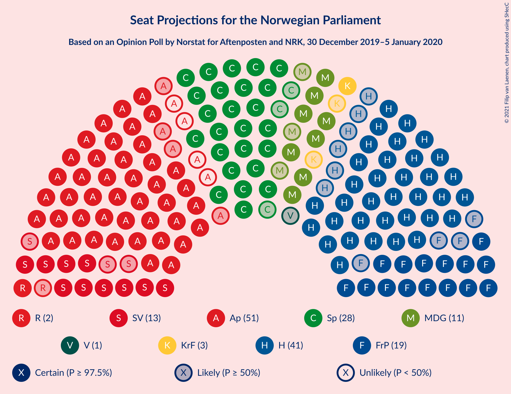

### Confidence Intervals

| Party | Last Result | Median | 80% Confidence Interval | 90% Confidence Interval | 95% Confidence Interval | 99% Confidence Interval |
|:-----:|:-----------:|:------:|:-----------------------:|:-----------------------:|:-----------------------:|:-----------------------:|
| <a href="#arbeiderpartiet">Arbeiderpartiet</a> | 49 | 47 | 44–52 |43–52 |43–53 |42–55 |
| <a href="#høyre">Høyre</a> | 45 | 41 | 37–43 |36–44 |35–45 |34–47 |
| <a href="#senterpartiet">Senterpartiet</a> | 19 | 28 | 26–33 |26–34 |25–35 |23–36 |
| <a href="#fremskrittspartiet">Fremskrittspartiet</a> | 27 | 19 | 16–21 |16–22 |15–22 |14–23 |
| <a href="#sosialistisk-venstreparti">Sosialistisk Venstreparti</a> | 11 | 13 | 11–15 |11–16 |10–16 |9–18 |
| <a href="#miljøpartiet-de-grønne">Miljøpartiet De Grønne</a> | 1 | 11 | 9–13 |9–13 |8–14 |8–15 |
| <a href="#rødt">Rødt</a> | 1 | 2 | 2–8 |1–8 |1–9 |1–9 |
| <a href="#kristelig-folkeparti">Kristelig Folkeparti</a> | 8 | 3 | 1–8 |1–8 |1–9 |1–10 |
| <a href="#venstre">Venstre</a> | 8 | 1 | 1–2 |0–2 |0–2 |0–2 |

### Arbeiderpartiet

*For a full overview of the results for this party, see the [Arbeiderpartiet](party-arbeiderpartiet.html) page.*

| Number of Seats | Probability | Accumulated | Special Marks |
|:---------------:|:-----------:|:-----------:|:-------------:|
| 39 | 0% | 100% |  |
| 40 | 0.1% | 99.9% |  |
| 41 | 0.3% | 99.8% |  |
| 42 | 0.7% | 99.6% |  |
| 43 | 7% | 98.9% |  |
| 44 | 7% | 92% |  |
| 45 | 5% | 84% |  |
| 46 | 17% | 80% |  |
| 47 | 14% | 63% | Median |
| 48 | 9% | 49% |  |
| 49 | 4% | 40% | Last Result |
| 50 | 5% | 36% |  |
| 51 | 19% | 31% |  |
| 52 | 8% | 12% |  |
| 53 | 0.7% | 3% |  |
| 54 | 2% | 2% |  |
| 55 | 0.5% | 0.8% |  |
| 56 | 0.2% | 0.4% |  |
| 57 | 0.1% | 0.2% |  |
| 58 | 0% | 0.1% |  |
| 59 | 0% | 0% |  |

### Høyre

*For a full overview of the results for this party, see the [Høyre](party-høyre.html) page.*

| Number of Seats | Probability | Accumulated | Special Marks |
|:---------------:|:-----------:|:-----------:|:-------------:|
| 32 | 0.1% | 100% |  |
| 33 | 0.4% | 99.9% |  |
| 34 | 0.5% | 99.6% |  |
| 35 | 2% | 99.1% |  |
| 36 | 3% | 97% |  |
| 37 | 4% | 94% |  |
| 38 | 10% | 90% |  |
| 39 | 16% | 79% |  |
| 40 | 13% | 63% |  |
| 41 | 17% | 50% | Median |
| 42 | 13% | 33% |  |
| 43 | 12% | 21% |  |
| 44 | 4% | 9% |  |
| 45 | 3% | 5% | Last Result |
| 46 | 0.9% | 2% |  |
| 47 | 0.6% | 1.0% |  |
| 48 | 0.3% | 0.4% |  |
| 49 | 0.1% | 0.1% |  |
| 50 | 0% | 0% |  |

### Senterpartiet

*For a full overview of the results for this party, see the [Senterpartiet](party-senterpartiet.html) page.*

| Number of Seats | Probability | Accumulated | Special Marks |
|:---------------:|:-----------:|:-----------:|:-------------:|
| 19 | 0% | 100% | Last Result |
| 20 | 0% | 100% |  |
| 21 | 0% | 100% |  |
| 22 | 0.2% | 99.9% |  |
| 23 | 0.3% | 99.7% |  |
| 24 | 1.2% | 99.4% |  |
| 25 | 3% | 98% |  |
| 26 | 8% | 95% |  |
| 27 | 20% | 87% |  |
| 28 | 24% | 67% | Median |
| 29 | 8% | 43% |  |
| 30 | 8% | 35% |  |
| 31 | 8% | 27% |  |
| 32 | 4% | 19% |  |
| 33 | 7% | 14% |  |
| 34 | 4% | 7% |  |
| 35 | 2% | 4% |  |
| 36 | 1.5% | 2% |  |
| 37 | 0.1% | 0.1% |  |
| 38 | 0% | 0% |  |

### Fremskrittspartiet

*For a full overview of the results for this party, see the [Fremskrittspartiet](party-fremskrittspartiet.html) page.*

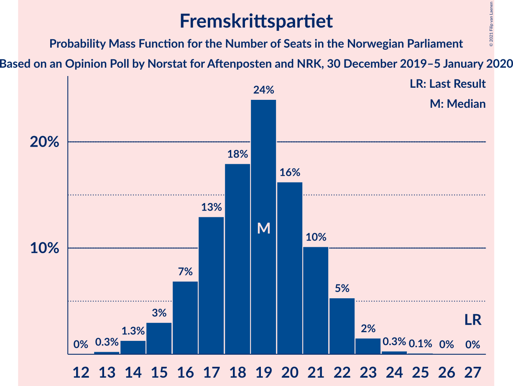

| Number of Seats | Probability | Accumulated | Special Marks |
|:---------------:|:-----------:|:-----------:|:-------------:|
| 13 | 0.3% | 100% |  |
| 14 | 1.3% | 99.7% |  |
| 15 | 3% | 98% |  |
| 16 | 7% | 95% |  |
| 17 | 13% | 89% |  |
| 18 | 18% | 76% |  |
| 19 | 24% | 58% | Median |
| 20 | 16% | 34% |  |
| 21 | 10% | 17% |  |
| 22 | 5% | 7% |  |
| 23 | 2% | 2% |  |
| 24 | 0.3% | 0.4% |  |
| 25 | 0.1% | 0.1% |  |
| 26 | 0% | 0% |  |
| 27 | 0% | 0% | Last Result |

### Sosialistisk Venstreparti

*For a full overview of the results for this party, see the [Sosialistisk Venstreparti](party-sosialistiskvenstreparti.html) page.*

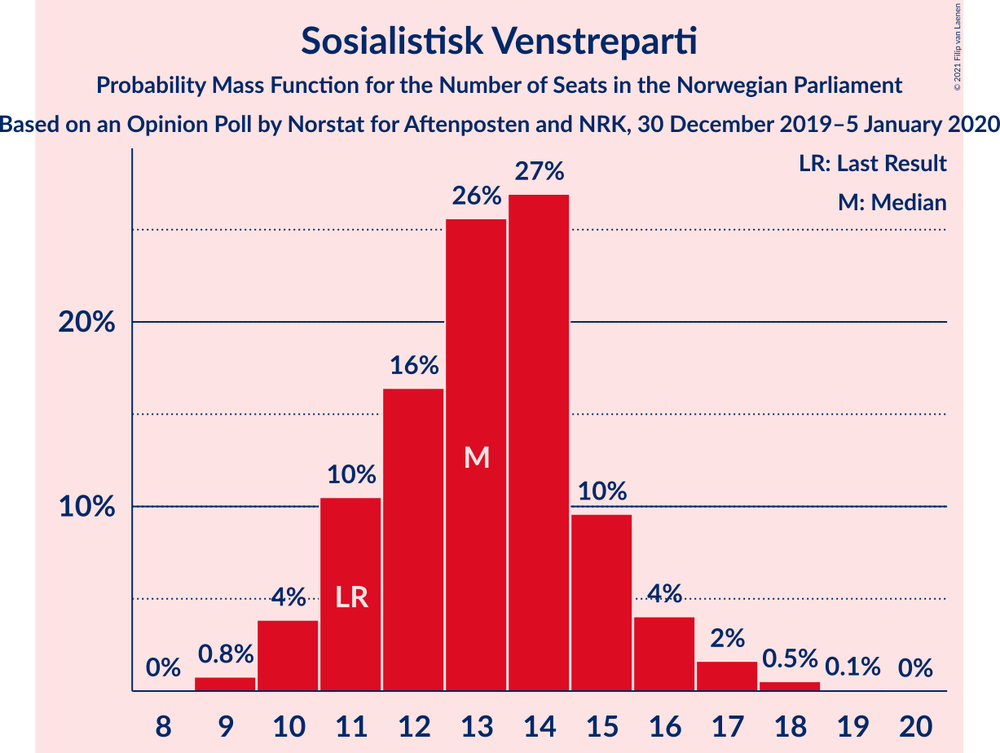

| Number of Seats | Probability | Accumulated | Special Marks |
|:---------------:|:-----------:|:-----------:|:-------------:|
| 9 | 0.8% | 100% |  |
| 10 | 4% | 99.2% |  |
| 11 | 10% | 95% | Last Result |
| 12 | 16% | 85% |  |
| 13 | 26% | 68% | Median |
| 14 | 27% | 43% |  |
| 15 | 10% | 16% |  |
| 16 | 4% | 6% |  |
| 17 | 2% | 2% |  |
| 18 | 0.5% | 0.6% |  |
| 19 | 0.1% | 0.1% |  |
| 20 | 0% | 0% |  |

### Miljøpartiet De Grønne

*For a full overview of the results for this party, see the [Miljøpartiet De Grønne](party-miljøpartietdegrønne.html) page.*

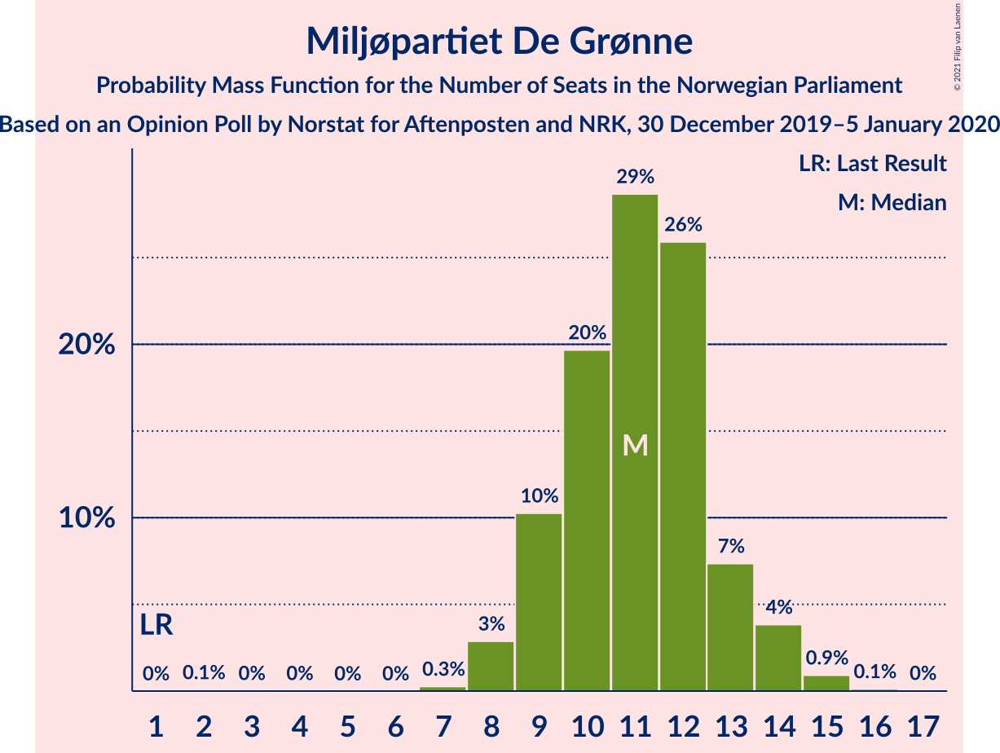

| Number of Seats | Probability | Accumulated | Special Marks |
|:---------------:|:-----------:|:-----------:|:-------------:|
| 1 | 0% | 100% | Last Result |
| 2 | 0.1% | 100% |  |
| 3 | 0% | 99.9% |  |
| 4 | 0% | 99.9% |  |
| 5 | 0% | 99.9% |  |
| 6 | 0% | 99.9% |  |
| 7 | 0.3% | 99.9% |  |
| 8 | 3% | 99.6% |  |
| 9 | 10% | 97% |  |
| 10 | 20% | 86% |  |
| 11 | 29% | 67% | Median |
| 12 | 26% | 38% |  |
| 13 | 7% | 12% |  |
| 14 | 4% | 5% |  |
| 15 | 0.9% | 1.1% |  |
| 16 | 0.1% | 0.1% |  |
| 17 | 0% | 0% |  |

### Rødt

*For a full overview of the results for this party, see the [Rødt](party-rødt.html) page.*

| Number of Seats | Probability | Accumulated | Special Marks |
|:---------------:|:-----------:|:-----------:|:-------------:|
| 1 | 5% | 100% | Last Result |
| 2 | 70% | 95% | Median |
| 3 | 0.1% | 25% |  |
| 4 | 0% | 25% |  |
| 5 | 0% | 25% |  |
| 6 | 0.1% | 25% |  |
| 7 | 13% | 24% |  |
| 8 | 7% | 12% |  |
| 9 | 4% | 5% |  |
| 10 | 0.4% | 0.5% |  |
| 11 | 0.1% | 0.1% |  |
| 12 | 0% | 0% |  |

### Kristelig Folkeparti

*For a full overview of the results for this party, see the [Kristelig Folkeparti](party-kristeligfolkeparti.html) page.*

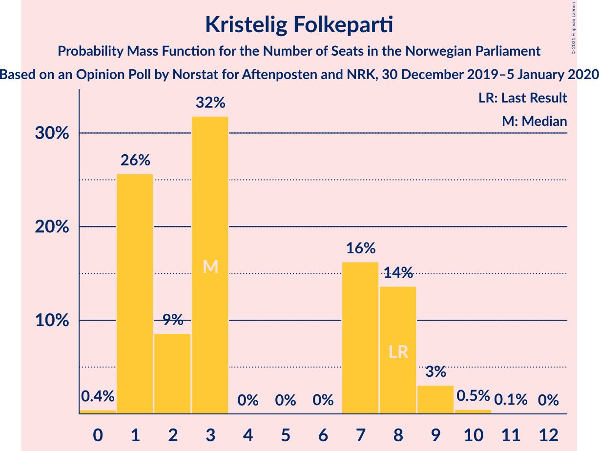

| Number of Seats | Probability | Accumulated | Special Marks |
|:---------------:|:-----------:|:-----------:|:-------------:|
| 0 | 0.4% | 100% |  |
| 1 | 26% | 99.6% |  |
| 2 | 9% | 74% |  |
| 3 | 32% | 65% | Median |
| 4 | 0% | 34% |  |
| 5 | 0% | 34% |  |
| 6 | 0% | 34% |  |
| 7 | 16% | 34% |  |
| 8 | 14% | 17% | Last Result |
| 9 | 3% | 4% |  |
| 10 | 0.5% | 0.6% |  |
| 11 | 0.1% | 0.1% |  |
| 12 | 0% | 0% |  |

### Venstre

*For a full overview of the results for this party, see the [Venstre](party-venstre.html) page.*

| Number of Seats | Probability | Accumulated | Special Marks |
|:---------------:|:-----------:|:-----------:|:-------------:|
| 0 | 10% | 100% |  |
| 1 | 46% | 90% | Median |
| 2 | 44% | 44% |  |
| 3 | 0.3% | 0.5% |  |
| 4 | 0% | 0.2% |  |
| 5 | 0% | 0.2% |  |
| 6 | 0% | 0.2% |  |
| 7 | 0.1% | 0.2% |  |
| 8 | 0% | 0% | Last Result |

## Coalitions

### Confidence Intervals

| Coalition | Last Result | Median | Majority? | 80% Confidence Interval | 90% Confidence Interval | 95% Confidence Interval | 99% Confidence Interval |
|:---------:|:-----------:|:------:|:---------:|:-----------------------:|:-----------------------:|:-----------------------:|:-----------------------:|
| Arbeiderpartiet – Senterpartiet – Sosialistisk Venstreparti – Miljøpartiet De Grønne – Kristelig Folkeparti | 88 | 106 | 100% | 100–109 | 99–111 | 98–111 | 96–114 |
| Arbeiderpartiet – Senterpartiet – Sosialistisk Venstreparti – Miljøpartiet De Grønne – Rødt | 81 | 105 | 100% | 100–108 | 99–110 | 98–111 | 95–113 |
| Arbeiderpartiet – Senterpartiet – Sosialistisk Venstreparti – Miljøpartiet De Grønne | 80 | 101 | 100% | 96–105 | 95–106 | 94–107 | 92–109 |
| Høyre – Senterpartiet – Fremskrittspartiet – Kristelig Folkeparti – Venstre | 107 | 93 | 99.5% | 90–98 | 88–100 | 87–101 | 84–102 |
| Arbeiderpartiet – Senterpartiet – Sosialistisk Venstreparti – Rødt | 80 | 94 | 99.6% | 89–97 | 88–99 | 87–100 | 85–102 |
| Arbeiderpartiet – Senterpartiet – Miljøpartiet De Grønne – Kristelig Folkeparti | 77 | 92 | 98.7% | 87–97 | 86–97 | 85–98 | 83–101 |
| Arbeiderpartiet – Senterpartiet – Sosialistisk Venstreparti | 79 | 91 | 95% | 86–93 | 84–94 | 83–96 | 81–99 |
| Arbeiderpartiet – Senterpartiet – Kristelig Folkeparti | 76 | 80 | 18% | 76–86 | 75–87 | 74–88 | 73–90 |
| Arbeiderpartiet – Senterpartiet | 68 | 78 | 0.9% | 72–80 | 71–81 | 71–83 | 69–86 |
| Høyre – Fremskrittspartiet – Miljøpartiet De Grønne – Kristelig Folkeparti – Venstre | 89 | 75 | 0.3% | 72–80 | 70–81 | 68–82 | 67–84 |
| Høyre – Fremskrittspartiet – Kristelig Folkeparti – Venstre | 88 | 64 | 0% | 60–69 | 59–70 | 58–71 | 56–74 |
| Arbeiderpartiet – Sosialistisk Venstreparti | 60 | 61 | 0% | 57–65 | 56–66 | 55–67 | 53–69 |
| Høyre – Fremskrittspartiet – Venstre | 80 | 61 | 0% | 57–64 | 55–66 | 54–66 | 52–69 |
| Høyre – Fremskrittspartiet | 72 | 59 | 0% | 55–63 | 54–64 | 53–65 | 51–67 |
| Høyre – Kristelig Folkeparti – Venstre | 61 | 46 | 0% | 42–50 | 41–51 | 40–52 | 38–54 |
| Senterpartiet – Kristelig Folkeparti – Venstre | 35 | 34 | 0% | 30–39 | 29–42 | 29–43 | 27–45 |

### Arbeiderpartiet – Senterpartiet – Sosialistisk Venstreparti – Miljøpartiet De Grønne – Kristelig Folkeparti

| Number of Seats | Probability | Accumulated | Special Marks |
|:---------------:|:-----------:|:-----------:|:-------------:|
| 88 | 0% | 100% | Last Result |
| 89 | 0% | 100% |  |
| 90 | 0% | 100% |  |
| 91 | 0% | 100% |  |
| 92 | 0% | 100% |  |
| 93 | 0.1% | 100% |  |
| 94 | 0.1% | 99.9% |  |
| 95 | 0.1% | 99.8% |  |
| 96 | 0.2% | 99.7% |  |
| 97 | 0.7% | 99.4% |  |
| 98 | 2% | 98.8% |  |
| 99 | 5% | 97% |  |
| 100 | 3% | 92% |  |
| 101 | 5% | 89% |  |
| 102 | 6% | 85% | Median |
| 103 | 9% | 79% |  |
| 104 | 9% | 69% |  |
| 105 | 10% | 61% |  |
| 106 | 20% | 51% |  |
| 107 | 11% | 31% |  |
| 108 | 5% | 20% |  |
| 109 | 8% | 15% |  |
| 110 | 2% | 7% |  |
| 111 | 3% | 5% |  |
| 112 | 1.0% | 2% |  |
| 113 | 0.5% | 1.0% |  |
| 114 | 0.3% | 0.5% |  |
| 115 | 0.1% | 0.2% |  |
| 116 | 0% | 0.1% |  |
| 117 | 0% | 0% |  |

### Arbeiderpartiet – Senterpartiet – Sosialistisk Venstreparti – Miljøpartiet De Grønne – Rødt

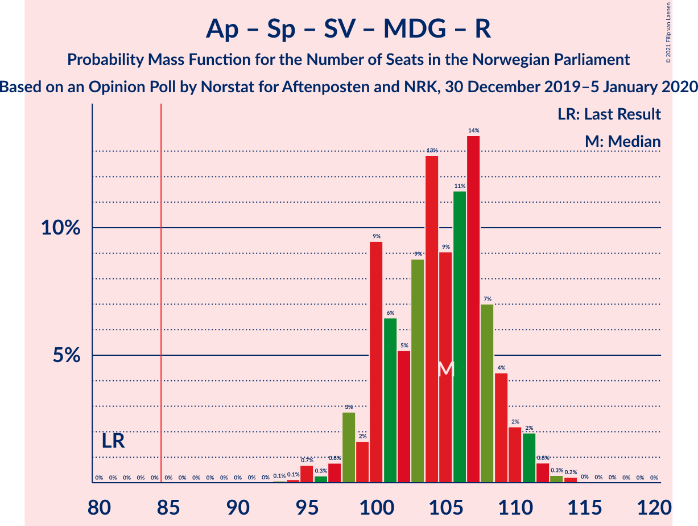

| Number of Seats | Probability | Accumulated | Special Marks |
|:---------------:|:-----------:|:-----------:|:-------------:|
| 81 | 0% | 100% | Last Result |
| 82 | 0% | 100% |  |
| 83 | 0% | 100% |  |
| 84 | 0% | 100% |  |
| 85 | 0% | 100% | Majority |
| 86 | 0% | 100% |  |
| 87 | 0% | 100% |  |
| 88 | 0% | 100% |  |
| 89 | 0% | 100% |  |
| 90 | 0% | 100% |  |
| 91 | 0% | 100% |  |
| 92 | 0% | 100% |  |
| 93 | 0.1% | 100% |  |
| 94 | 0.1% | 99.9% |  |
| 95 | 0.7% | 99.8% |  |
| 96 | 0.3% | 99.1% |  |
| 97 | 0.8% | 98.8% |  |
| 98 | 3% | 98% |  |
| 99 | 2% | 95% |  |
| 100 | 9% | 94% |  |
| 101 | 6% | 84% | Median |
| 102 | 5% | 78% |  |
| 103 | 9% | 73% |  |
| 104 | 13% | 64% |  |
| 105 | 9% | 51% |  |
| 106 | 11% | 42% |  |
| 107 | 14% | 30% |  |
| 108 | 7% | 17% |  |
| 109 | 4% | 10% |  |
| 110 | 2% | 6% |  |
| 111 | 2% | 3% |  |
| 112 | 0.8% | 1.4% |  |
| 113 | 0.3% | 0.6% |  |
| 114 | 0.2% | 0.3% |  |
| 115 | 0% | 0.1% |  |
| 116 | 0% | 0% |  |

### Arbeiderpartiet – Senterpartiet – Sosialistisk Venstreparti – Miljøpartiet De Grønne

| Number of Seats | Probability | Accumulated | Special Marks |
|:---------------:|:-----------:|:-----------:|:-------------:|
| 80 | 0% | 100% | Last Result |
| 81 | 0% | 100% |  |
| 82 | 0% | 100% |  |
| 83 | 0% | 100% |  |
| 84 | 0% | 100% |  |
| 85 | 0% | 100% | Majority |
| 86 | 0% | 100% |  |
| 87 | 0% | 100% |  |
| 88 | 0% | 100% |  |
| 89 | 0% | 100% |  |
| 90 | 0.1% | 99.9% |  |
| 91 | 0.2% | 99.8% |  |
| 92 | 0.3% | 99.6% |  |
| 93 | 1.3% | 99.3% |  |
| 94 | 2% | 98% |  |
| 95 | 3% | 96% |  |
| 96 | 5% | 94% |  |
| 97 | 4% | 89% |  |
| 98 | 13% | 86% |  |
| 99 | 7% | 73% | Median |
| 100 | 6% | 65% |  |
| 101 | 10% | 60% |  |
| 102 | 13% | 50% |  |
| 103 | 6% | 37% |  |
| 104 | 11% | 30% |  |
| 105 | 13% | 19% |  |
| 106 | 4% | 7% |  |
| 107 | 0.8% | 3% |  |
| 108 | 0.7% | 2% |  |
| 109 | 1.2% | 1.5% |  |
| 110 | 0.2% | 0.3% |  |
| 111 | 0.1% | 0.1% |  |
| 112 | 0% | 0% |  |

### Høyre – Senterpartiet – Fremskrittspartiet – Kristelig Folkeparti – Venstre

| Number of Seats | Probability | Accumulated | Special Marks |
|:---------------:|:-----------:|:-----------:|:-------------:|
| 81 | 0% | 100% |  |
| 82 | 0.1% | 99.9% |  |
| 83 | 0.1% | 99.8% |  |
| 84 | 0.2% | 99.7% |  |
| 85 | 0.8% | 99.5% | Majority |
| 86 | 1.1% | 98.7% |  |
| 87 | 1.1% | 98% |  |
| 88 | 2% | 96% |  |
| 89 | 3% | 94% |  |
| 90 | 15% | 92% |  |
| 91 | 6% | 76% |  |
| 92 | 14% | 71% | Median |
| 93 | 12% | 57% |  |
| 94 | 6% | 44% |  |
| 95 | 8% | 38% |  |
| 96 | 12% | 30% |  |
| 97 | 4% | 18% |  |
| 98 | 5% | 13% |  |
| 99 | 3% | 9% |  |
| 100 | 2% | 6% |  |
| 101 | 3% | 4% |  |
| 102 | 0.9% | 1.2% |  |
| 103 | 0.2% | 0.4% |  |
| 104 | 0.1% | 0.1% |  |
| 105 | 0% | 0% |  |
| 106 | 0% | 0% |  |
| 107 | 0% | 0% | Last Result |

### Arbeiderpartiet – Senterpartiet – Sosialistisk Venstreparti – Rødt

| Number of Seats | Probability | Accumulated | Special Marks |
|:---------------:|:-----------:|:-----------:|:-------------:|
| 80 | 0% | 100% | Last Result |
| 81 | 0% | 100% |  |
| 82 | 0% | 100% |  |
| 83 | 0.1% | 99.9% |  |
| 84 | 0.2% | 99.8% |  |
| 85 | 0.4% | 99.6% | Majority |
| 86 | 0.8% | 99.2% |  |
| 87 | 3% | 98% |  |
| 88 | 4% | 96% |  |
| 89 | 9% | 92% |  |
| 90 | 6% | 83% | Median |
| 91 | 5% | 77% |  |
| 92 | 6% | 72% |  |
| 93 | 12% | 66% |  |
| 94 | 12% | 54% |  |
| 95 | 19% | 42% |  |
| 96 | 7% | 23% |  |
| 97 | 7% | 16% |  |
| 98 | 2% | 8% |  |
| 99 | 2% | 6% |  |
| 100 | 2% | 4% |  |
| 101 | 2% | 2% |  |
| 102 | 0.4% | 0.7% |  |
| 103 | 0.2% | 0.3% |  |
| 104 | 0.1% | 0.1% |  |
| 105 | 0.1% | 0.1% |  |
| 106 | 0% | 0% |  |

### Arbeiderpartiet – Senterpartiet – Miljøpartiet De Grønne – Kristelig Folkeparti

| Number of Seats | Probability | Accumulated | Special Marks |
|:---------------:|:-----------:|:-----------:|:-------------:|
| 77 | 0% | 100% | Last Result |
| 78 | 0% | 100% |  |
| 79 | 0% | 100% |  |
| 80 | 0% | 100% |  |
| 81 | 0.1% | 100% |  |
| 82 | 0.2% | 99.9% |  |
| 83 | 0.2% | 99.6% |  |
| 84 | 0.7% | 99.4% |  |
| 85 | 2% | 98.7% | Majority |
| 86 | 3% | 96% |  |
| 87 | 5% | 93% |  |
| 88 | 4% | 88% |  |
| 89 | 8% | 84% | Median |
| 90 | 9% | 76% |  |
| 91 | 11% | 67% |  |
| 92 | 17% | 56% |  |
| 93 | 10% | 39% |  |
| 94 | 6% | 29% |  |
| 95 | 7% | 23% |  |
| 96 | 5% | 16% |  |
| 97 | 6% | 11% |  |
| 98 | 2% | 5% |  |
| 99 | 1.1% | 2% |  |
| 100 | 0.5% | 1.2% |  |
| 101 | 0.3% | 0.7% |  |
| 102 | 0.3% | 0.4% |  |
| 103 | 0.1% | 0.1% |  |
| 104 | 0% | 0% |  |

### Arbeiderpartiet – Senterpartiet – Sosialistisk Venstreparti

| Number of Seats | Probability | Accumulated | Special Marks |
|:---------------:|:-----------:|:-----------:|:-------------:|
| 79 | 0.1% | 100% | Last Result |
| 80 | 0.2% | 99.9% |  |
| 81 | 0.3% | 99.7% |  |
| 82 | 0.4% | 99.4% |  |
| 83 | 2% | 99.0% |  |
| 84 | 2% | 97% |  |
| 85 | 4% | 95% | Majority |
| 86 | 6% | 90% |  |
| 87 | 10% | 84% |  |
| 88 | 8% | 74% | Median |
| 89 | 6% | 66% |  |
| 90 | 8% | 60% |  |
| 91 | 13% | 52% |  |
| 92 | 12% | 38% |  |
| 93 | 17% | 27% |  |
| 94 | 4% | 9% |  |
| 95 | 2% | 5% |  |
| 96 | 0.6% | 3% |  |
| 97 | 0.7% | 2% |  |
| 98 | 0.8% | 2% |  |
| 99 | 0.7% | 0.8% |  |
| 100 | 0.1% | 0.1% |  |
| 101 | 0% | 0.1% |  |
| 102 | 0% | 0% |  |

### Arbeiderpartiet – Senterpartiet – Kristelig Folkeparti

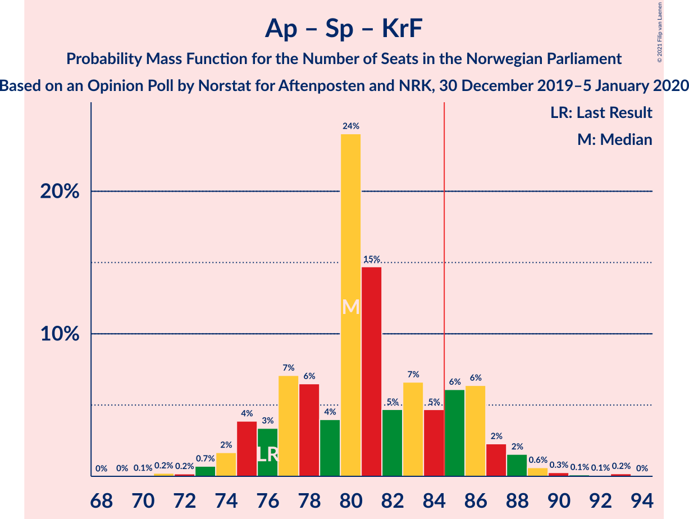

| Number of Seats | Probability | Accumulated | Special Marks |
|:---------------:|:-----------:|:-----------:|:-------------:|
| 70 | 0.1% | 100% |  |
| 71 | 0.2% | 99.9% |  |
| 72 | 0.2% | 99.7% |  |
| 73 | 0.7% | 99.5% |  |
| 74 | 2% | 98.8% |  |
| 75 | 4% | 97% |  |
| 76 | 3% | 93% | Last Result |
| 77 | 7% | 90% |  |
| 78 | 6% | 83% | Median |
| 79 | 4% | 76% |  |
| 80 | 24% | 72% |  |
| 81 | 15% | 48% |  |
| 82 | 5% | 34% |  |
| 83 | 7% | 29% |  |
| 84 | 5% | 22% |  |
| 85 | 6% | 18% | Majority |
| 86 | 6% | 11% |  |
| 87 | 2% | 5% |  |
| 88 | 2% | 3% |  |
| 89 | 0.6% | 1.3% |  |
| 90 | 0.3% | 0.6% |  |
| 91 | 0.1% | 0.4% |  |
| 92 | 0.1% | 0.3% |  |
| 93 | 0.2% | 0.2% |  |
| 94 | 0% | 0% |  |

### Arbeiderpartiet – Senterpartiet

| Number of Seats | Probability | Accumulated | Special Marks |
|:---------------:|:-----------:|:-----------:|:-------------:|
| 66 | 0% | 100% |  |
| 67 | 0.1% | 99.9% |  |
| 68 | 0.2% | 99.8% | Last Result |
| 69 | 0.9% | 99.5% |  |
| 70 | 0.7% | 98.6% |  |
| 71 | 4% | 98% |  |
| 72 | 5% | 94% |  |
| 73 | 9% | 90% |  |
| 74 | 7% | 81% |  |
| 75 | 5% | 74% | Median |
| 76 | 8% | 69% |  |
| 77 | 10% | 61% |  |
| 78 | 12% | 51% |  |
| 79 | 26% | 39% |  |
| 80 | 5% | 14% |  |
| 81 | 4% | 9% |  |
| 82 | 2% | 5% |  |
| 83 | 1.0% | 3% |  |
| 84 | 0.9% | 2% |  |
| 85 | 0.3% | 0.9% | Majority |
| 86 | 0.3% | 0.5% |  |
| 87 | 0.2% | 0.2% |  |
| 88 | 0% | 0% |  |

### Høyre – Fremskrittspartiet – Miljøpartiet De Grønne – Kristelig Folkeparti – Venstre

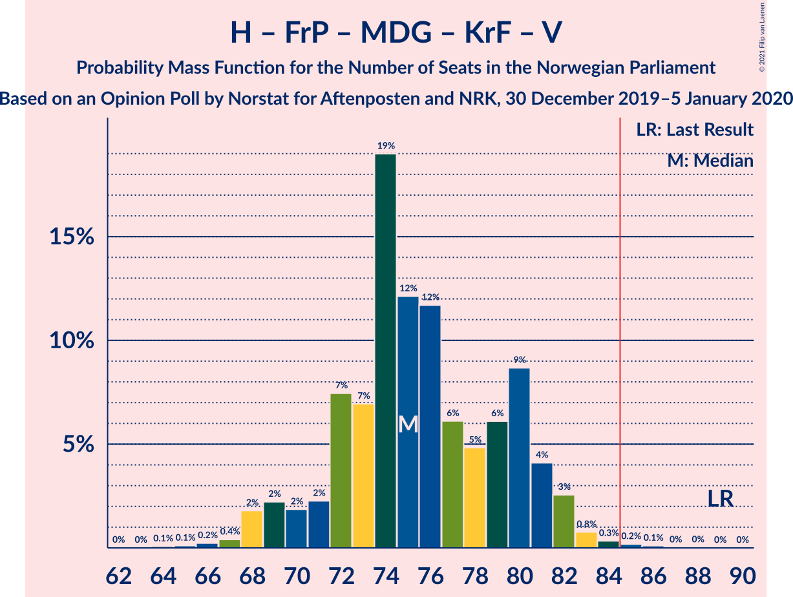

| Number of Seats | Probability | Accumulated | Special Marks |
|:---------------:|:-----------:|:-----------:|:-------------:|
| 64 | 0.1% | 100% |  |
| 65 | 0.1% | 99.9% |  |
| 66 | 0.2% | 99.8% |  |
| 67 | 0.4% | 99.6% |  |
| 68 | 2% | 99.2% |  |
| 69 | 2% | 97% |  |
| 70 | 2% | 95% |  |
| 71 | 2% | 93% |  |
| 72 | 7% | 91% |  |
| 73 | 7% | 84% |  |
| 74 | 19% | 77% |  |
| 75 | 12% | 58% | Median |
| 76 | 12% | 46% |  |
| 77 | 6% | 34% |  |
| 78 | 5% | 28% |  |
| 79 | 6% | 23% |  |
| 80 | 9% | 17% |  |
| 81 | 4% | 8% |  |
| 82 | 3% | 4% |  |
| 83 | 0.8% | 1.4% |  |
| 84 | 0.3% | 0.7% |  |
| 85 | 0.2% | 0.3% | Majority |
| 86 | 0.1% | 0.2% |  |
| 87 | 0% | 0.1% |  |
| 88 | 0% | 0% |  |
| 89 | 0% | 0% | Last Result |

### Høyre – Fremskrittspartiet – Kristelig Folkeparti – Venstre

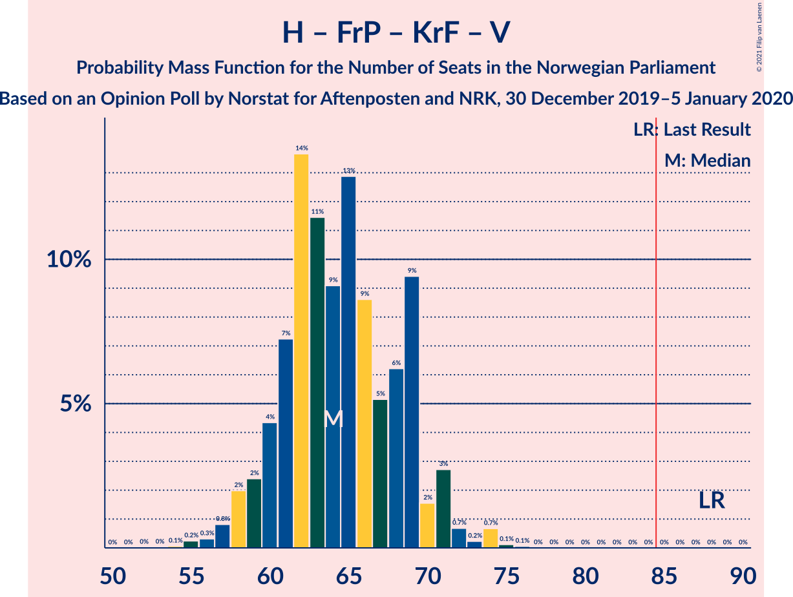

| Number of Seats | Probability | Accumulated | Special Marks |
|:---------------:|:-----------:|:-----------:|:-------------:|
| 53 | 0% | 100% |  |
| 54 | 0.1% | 99.9% |  |
| 55 | 0.2% | 99.9% |  |
| 56 | 0.3% | 99.6% |  |
| 57 | 0.8% | 99.3% |  |
| 58 | 2% | 98.5% |  |
| 59 | 2% | 97% |  |
| 60 | 4% | 94% |  |
| 61 | 7% | 90% |  |
| 62 | 14% | 83% |  |
| 63 | 11% | 69% |  |
| 64 | 9% | 57% | Median |
| 65 | 13% | 48% |  |
| 66 | 9% | 35% |  |
| 67 | 5% | 27% |  |
| 68 | 6% | 22% |  |
| 69 | 9% | 15% |  |
| 70 | 2% | 6% |  |
| 71 | 3% | 4% |  |
| 72 | 0.7% | 2% |  |
| 73 | 0.2% | 1.1% |  |
| 74 | 0.7% | 0.9% |  |
| 75 | 0.1% | 0.2% |  |
| 76 | 0.1% | 0.1% |  |
| 77 | 0% | 0% |  |
| 78 | 0% | 0% |  |
| 79 | 0% | 0% |  |
| 80 | 0% | 0% |  |
| 81 | 0% | 0% |  |
| 82 | 0% | 0% |  |
| 83 | 0% | 0% |  |
| 84 | 0% | 0% |  |
| 85 | 0% | 0% | Majority |
| 86 | 0% | 0% |  |
| 87 | 0% | 0% |  |
| 88 | 0% | 0% | Last Result |

### Arbeiderpartiet – Sosialistisk Venstreparti

| Number of Seats | Probability | Accumulated | Special Marks |
|:---------------:|:-----------:|:-----------:|:-------------:|
| 52 | 0.1% | 100% |  |
| 53 | 0.5% | 99.8% |  |
| 54 | 1.0% | 99.3% |  |
| 55 | 3% | 98% |  |
| 56 | 5% | 96% |  |
| 57 | 10% | 91% |  |
| 58 | 6% | 81% |  |
| 59 | 8% | 75% |  |
| 60 | 15% | 67% | Last Result, Median |
| 61 | 8% | 52% |  |
| 62 | 8% | 44% |  |
| 63 | 8% | 36% |  |
| 64 | 4% | 28% |  |
| 65 | 14% | 24% |  |
| 66 | 7% | 10% |  |
| 67 | 1.5% | 3% |  |
| 68 | 0.9% | 2% |  |
| 69 | 0.3% | 0.6% |  |
| 70 | 0.2% | 0.3% |  |
| 71 | 0% | 0.1% |  |
| 72 | 0% | 0% |  |

### Høyre – Fremskrittspartiet – Venstre

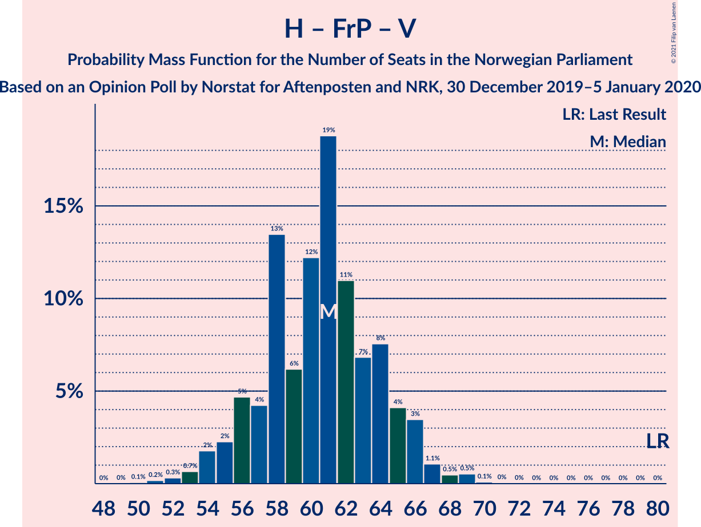

| Number of Seats | Probability | Accumulated | Special Marks |
|:---------------:|:-----------:|:-----------:|:-------------:|
| 50 | 0.1% | 100% |  |
| 51 | 0.2% | 99.9% |  |
| 52 | 0.3% | 99.7% |  |
| 53 | 0.7% | 99.4% |  |
| 54 | 2% | 98.8% |  |
| 55 | 2% | 97% |  |
| 56 | 5% | 95% |  |
| 57 | 4% | 90% |  |
| 58 | 13% | 86% |  |
| 59 | 6% | 72% |  |
| 60 | 12% | 66% |  |
| 61 | 19% | 54% | Median |
| 62 | 11% | 35% |  |
| 63 | 7% | 24% |  |
| 64 | 8% | 17% |  |
| 65 | 4% | 10% |  |
| 66 | 3% | 6% |  |
| 67 | 1.1% | 2% |  |
| 68 | 0.5% | 1.2% |  |
| 69 | 0.5% | 0.7% |  |
| 70 | 0.1% | 0.2% |  |
| 71 | 0% | 0.1% |  |
| 72 | 0% | 0% |  |
| 73 | 0% | 0% |  |
| 74 | 0% | 0% |  |
| 75 | 0% | 0% |  |
| 76 | 0% | 0% |  |
| 77 | 0% | 0% |  |
| 78 | 0% | 0% |  |
| 79 | 0% | 0% |  |
| 80 | 0% | 0% | Last Result |

### Høyre – Fremskrittspartiet

| Number of Seats | Probability | Accumulated | Special Marks |
|:---------------:|:-----------:|:-----------:|:-------------:|
| 49 | 0% | 100% |  |
| 50 | 0.2% | 99.9% |  |
| 51 | 0.5% | 99.7% |  |
| 52 | 0.9% | 99.2% |  |
| 53 | 2% | 98% |  |
| 54 | 3% | 96% |  |
| 55 | 3% | 93% |  |
| 56 | 13% | 89% |  |
| 57 | 6% | 76% |  |
| 58 | 8% | 70% |  |
| 59 | 13% | 62% |  |
| 60 | 15% | 49% | Median |
| 61 | 13% | 34% |  |
| 62 | 6% | 21% |  |
| 63 | 6% | 15% |  |
| 64 | 4% | 9% |  |
| 65 | 3% | 5% |  |
| 66 | 0.8% | 2% |  |
| 67 | 0.6% | 0.8% |  |
| 68 | 0.1% | 0.2% |  |
| 69 | 0.1% | 0.1% |  |
| 70 | 0% | 0% |  |
| 71 | 0% | 0% |  |
| 72 | 0% | 0% | Last Result |

### Høyre – Kristelig Folkeparti – Venstre

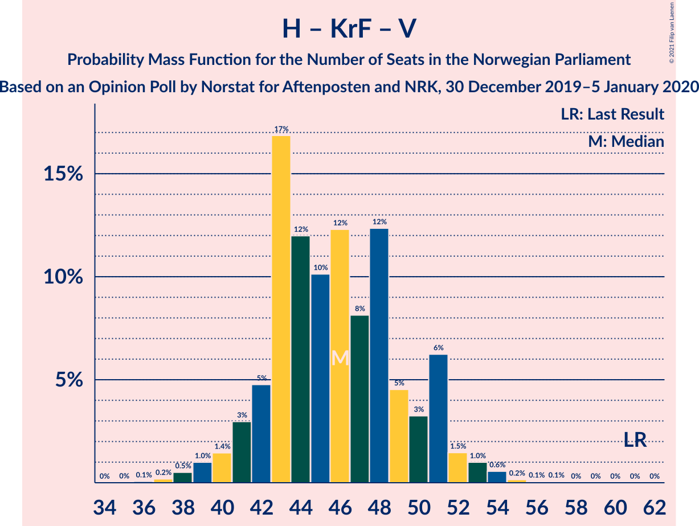

| Number of Seats | Probability | Accumulated | Special Marks |
|:---------------:|:-----------:|:-----------:|:-------------:|
| 36 | 0.1% | 100% |  |
| 37 | 0.2% | 99.9% |  |
| 38 | 0.5% | 99.7% |  |
| 39 | 1.0% | 99.2% |  |
| 40 | 1.4% | 98% |  |
| 41 | 3% | 97% |  |
| 42 | 5% | 94% |  |
| 43 | 17% | 89% |  |
| 44 | 12% | 72% |  |
| 45 | 10% | 60% | Median |
| 46 | 12% | 50% |  |
| 47 | 8% | 38% |  |
| 48 | 12% | 30% |  |
| 49 | 5% | 17% |  |
| 50 | 3% | 13% |  |
| 51 | 6% | 10% |  |
| 52 | 1.5% | 3% |  |
| 53 | 1.0% | 2% |  |
| 54 | 0.6% | 0.8% |  |
| 55 | 0.2% | 0.3% |  |
| 56 | 0.1% | 0.1% |  |
| 57 | 0.1% | 0.1% |  |
| 58 | 0% | 0% |  |
| 59 | 0% | 0% |  |
| 60 | 0% | 0% |  |
| 61 | 0% | 0% | Last Result |

### Senterpartiet – Kristelig Folkeparti – Venstre

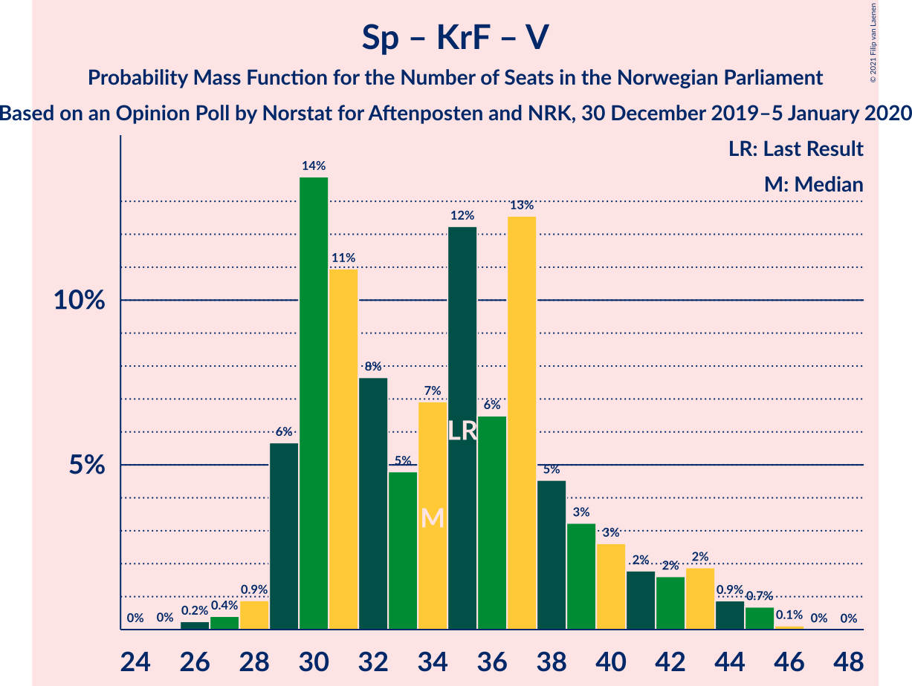

| Number of Seats | Probability | Accumulated | Special Marks |
|:---------------:|:-----------:|:-----------:|:-------------:|
| 25 | 0% | 100% |  |
| 26 | 0.2% | 99.9% |  |
| 27 | 0.4% | 99.7% |  |
| 28 | 0.9% | 99.3% |  |
| 29 | 6% | 98% |  |
| 30 | 14% | 93% |  |
| 31 | 11% | 79% |  |
| 32 | 8% | 68% | Median |
| 33 | 5% | 60% |  |
| 34 | 7% | 56% |  |
| 35 | 12% | 49% | Last Result |
| 36 | 6% | 36% |  |
| 37 | 13% | 30% |  |
| 38 | 5% | 17% |  |
| 39 | 3% | 13% |  |
| 40 | 3% | 10% |  |
| 41 | 2% | 7% |  |
| 42 | 2% | 5% |  |
| 43 | 2% | 4% |  |
| 44 | 0.9% | 2% |  |
| 45 | 0.7% | 0.8% |  |
| 46 | 0.1% | 0.1% |  |
| 47 | 0% | 0% |  |

## Technical Information

### Opinion Poll

+ **Polling firm:** Norstat
+ **Commissioner(s):** Aftenposten and NRK
+ **Fieldwork period:** 30 December 2019–5 January 2020

### Calculations

+ **Sample size:** 960
+ **Simulations done:** 1,048,576
+ **Error estimate:** 1.04%

