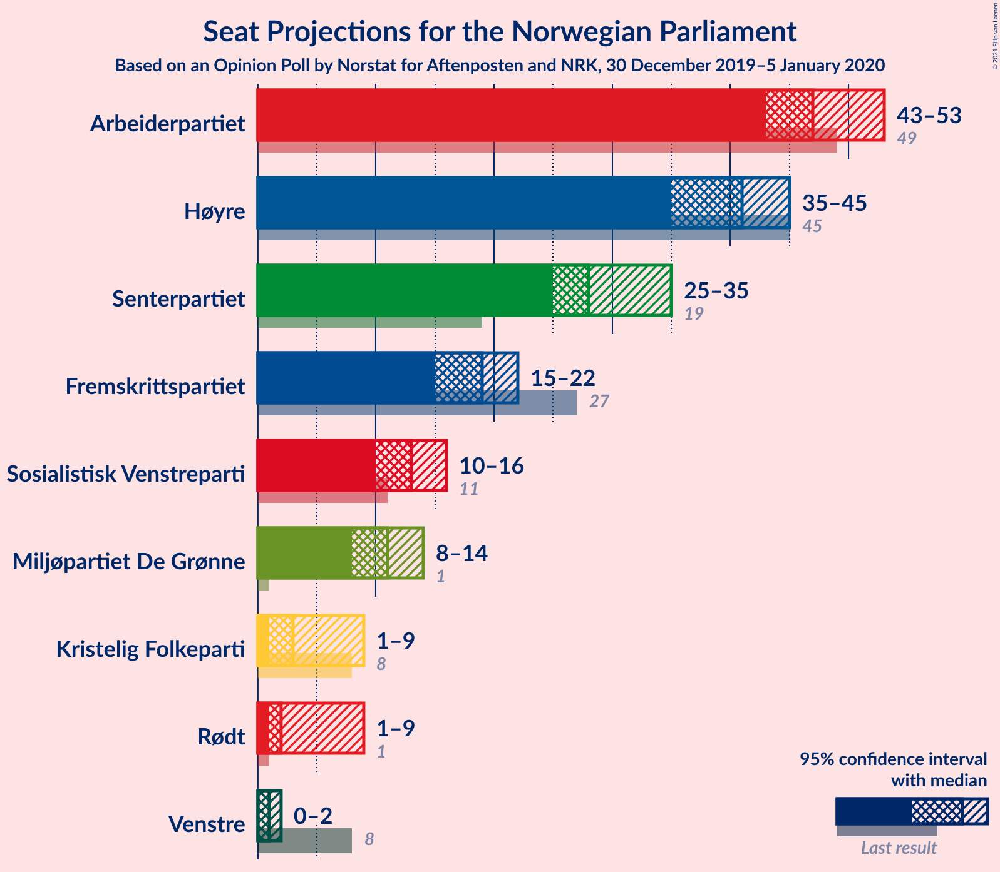
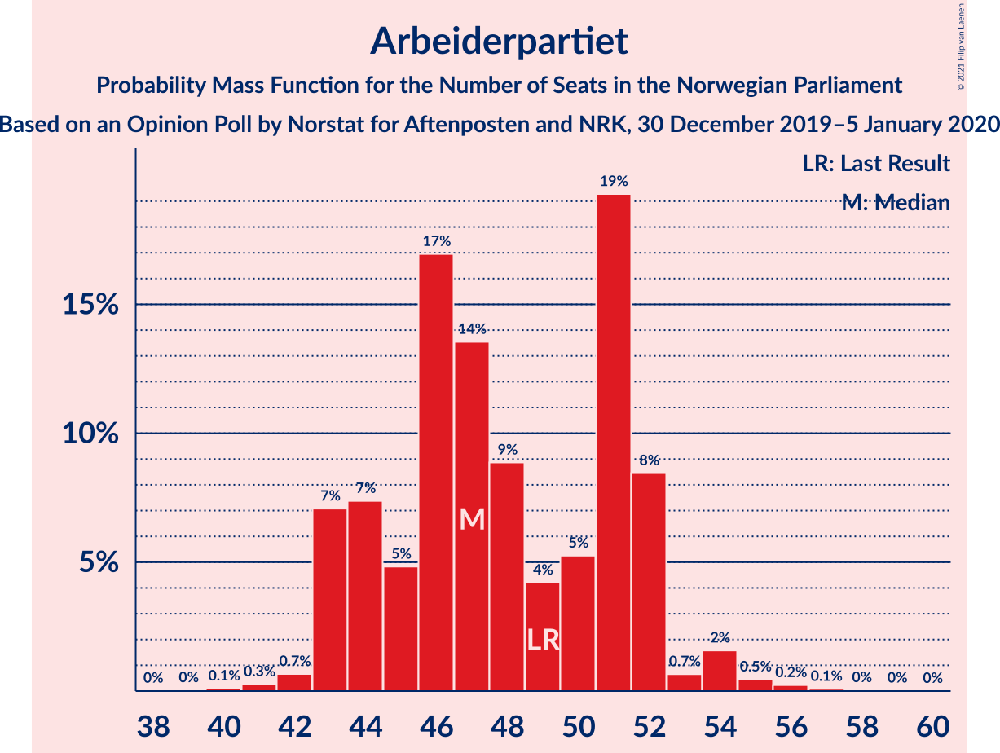
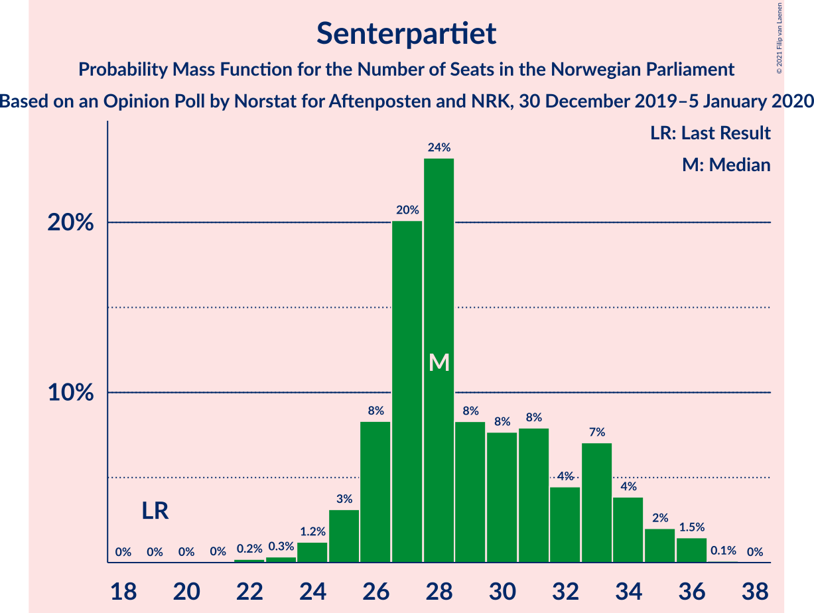
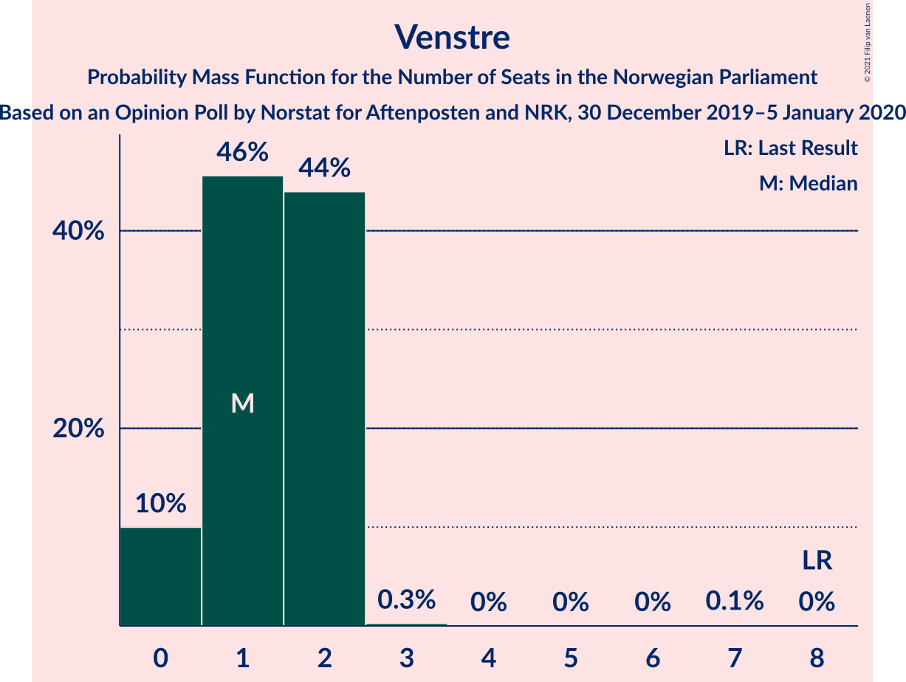
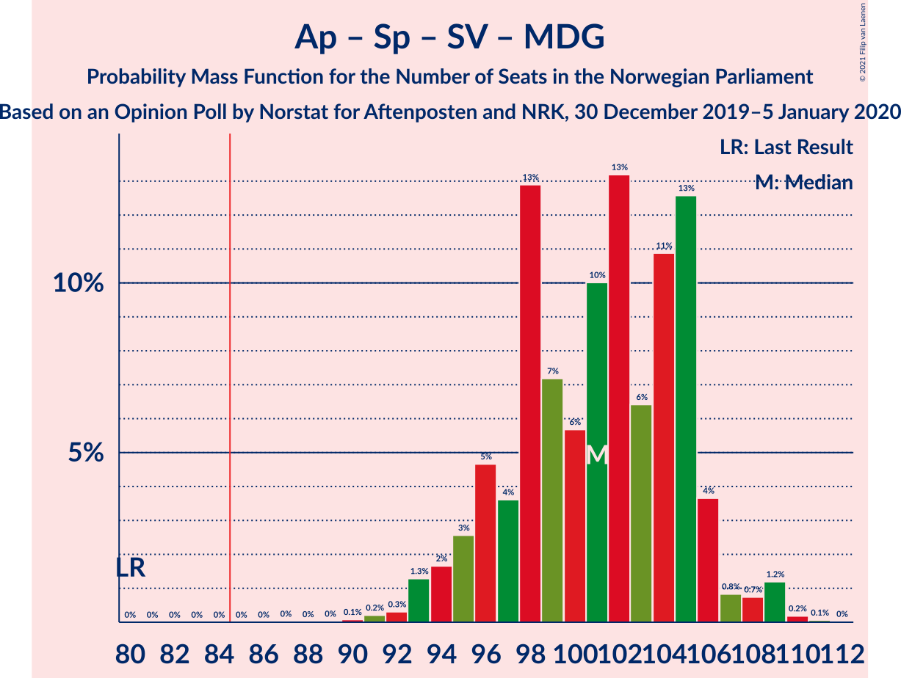
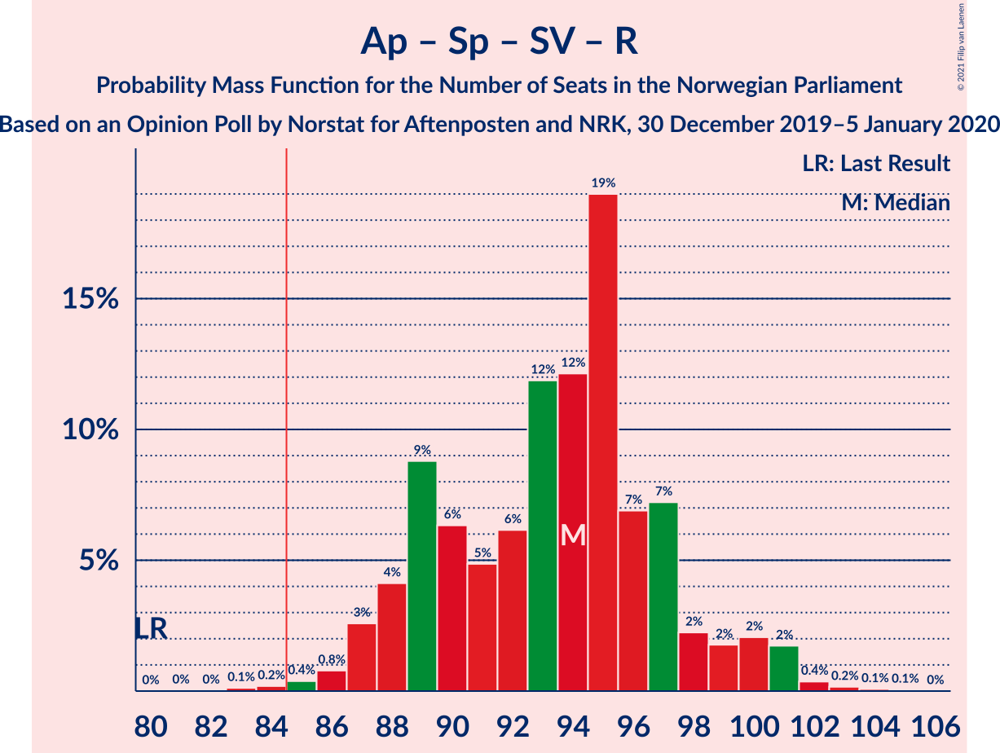
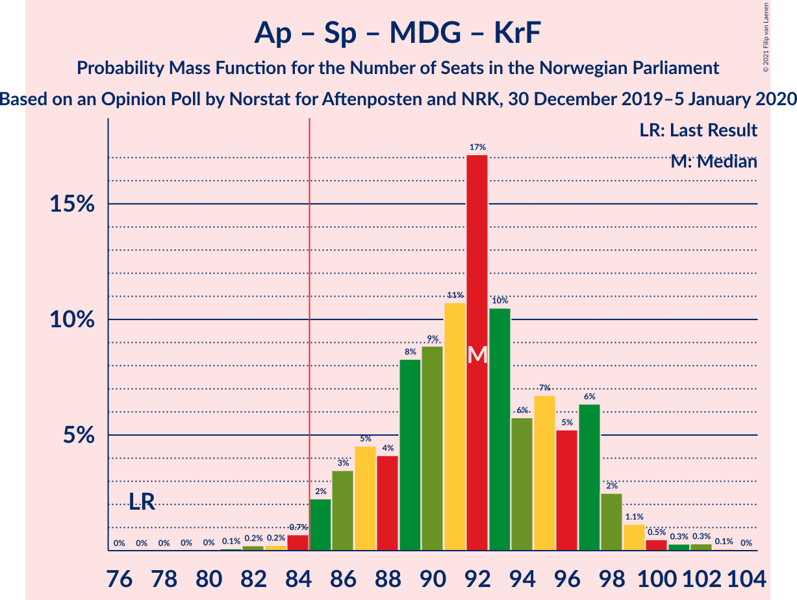

# Opinion Poll by Norstat for Aftenposten and NRK, 30 December 2019–5 January 2020

<a href="#voting-intentions">Voting Intentions</a> | <a href="#seats">Seats</a> | <a href="#coalitions">Coalitions</a> | <a href="#technical-information">Technical Information</a>

## Voting Intentions

### Confidence Intervals

| Party | Last Result | Poll Result | 80% Confidence Interval | 90% Confidence Interval | 95% Confidence Interval | 99% Confidence Interval |
|:-----:|:-----------:|:-----------:|:-----------------------:|:-----------------------:|:-----------------------:|:-----------------------:|
| Arbeiderpartiet | 27.4% | 26.1% | 24.4–28.0% |23.9–28.6% |23.5–29.0% |22.6–29.9% |
| Høyre | 25.0% | 22.4% | 20.7–24.2% |20.3–24.7% |19.9–25.1% |19.1–26.0% |
| Senterpartiet | 10.3% | 15.7% | 14.3–17.3% |13.9–17.8% |13.6–18.2% |12.9–19.0% |
| Fremskrittspartiet | 15.2% | 10.3% | 9.1–11.7% |8.8–12.1% |8.5–12.4% |8.0–13.1% |
| Sosialistisk Venstreparti | 6.0% | 7.2% | 6.2–8.4% |5.9–8.7% |5.7–9.0% |5.3–9.6% |
| Miljøpartiet De Grønne | 3.2% | 6.0% | 5.2–7.1% |4.9–7.5% |4.7–7.7% |4.3–8.3% |
| Rødt | 2.4% | 3.6% | 3.0–4.6% |2.8–4.8% |2.6–5.0% |2.3–5.5% |
| Kristelig Folkeparti | 4.2% | 3.6% | 3.0–4.6% |2.8–4.8% |2.6–5.0% |2.3–5.5% |
| Venstre | 4.4% | 2.3% | 1.8–3.0% |1.6–3.3% |1.5–3.5% |1.3–3.9% |

*Note:* The poll result column reflects the actual value used in the calculations. Published results may vary slightly, and in addition be rounded to fewer digits.

## Seats

### Confidence Intervals

| Party | Last Result | Median | 80% Confidence Interval | 90% Confidence Interval | 95% Confidence Interval | 99% Confidence Interval |
|:-----:|:-----------:|:------:|:-----------------------:|:-----------------------:|:-----------------------:|:-----------------------:|
| <a href="#arbeiderpartiet">Arbeiderpartiet</a> | 49 | 48 | 43–51 |43–51 |43–53 |42–55 |
| <a href="#høyre">Høyre</a> | 45 | 40 | 37–44 |36–44 |35–45 |33–47 |
| <a href="#senterpartiet">Senterpartiet</a> | 19 | 28 | 27–33 |27–35 |25–35 |23–37 |
| <a href="#fremskrittspartiet">Fremskrittspartiet</a> | 27 | 19 | 17–21 |15–21 |14–22 |14–24 |
| <a href="#sosialistisk-venstreparti">Sosialistisk Venstreparti</a> | 11 | 14 | 11–15 |11–15 |10–16 |10–17 |
| <a href="#miljøpartiet-de-grønne">Miljøpartiet De Grønne</a> | 1 | 11 | 9–13 |9–13 |9–13 |8–14 |
| <a href="#rødt">Rødt</a> | 1 | 2 | 2–7 |1–8 |1–8 |1–9 |
| <a href="#kristelig-folkeparti">Kristelig Folkeparti</a> | 8 | 3 | 2–8 |1–8 |1–9 |1–9 |
| <a href="#venstre">Venstre</a> | 8 | 1 | 0–2 |0–2 |0–2 |0–2 |

### Arbeiderpartiet

*For a full overview of the results for this party, see the [Arbeiderpartiet](party-arbeiderpartiet.html) page.*

| Number of Seats | Probability | Accumulated | Special Marks |
|:---------------:|:-----------:|:-----------:|:-------------:|
| 40 | 0.2% | 100% |  |
| 41 | 0.2% | 99.8% |  |
| 42 | 0.3% | 99.6% |  |
| 43 | 24% | 99.2% |  |
| 44 | 2% | 75% |  |
| 45 | 4% | 73% |  |
| 46 | 11% | 69% |  |
| 47 | 6% | 58% |  |
| 48 | 7% | 52% | Median |
| 49 | 3% | 46% | Last Result |
| 50 | 2% | 43% |  |
| 51 | 36% | 40% |  |
| 52 | 0.7% | 4% |  |
| 53 | 2% | 3% |  |
| 54 | 0.4% | 1.1% |  |
| 55 | 0.4% | 0.7% |  |
| 56 | 0.2% | 0.3% |  |
| 57 | 0.1% | 0.1% |  |
| 58 | 0% | 0.1% |  |
| 59 | 0% | 0% |  |

### Høyre

*For a full overview of the results for this party, see the [Høyre](party-høyre.html) page.*

| Number of Seats | Probability | Accumulated | Special Marks |
|:---------------:|:-----------:|:-----------:|:-------------:|
| 31 | 0.1% | 100% |  |
| 32 | 0.1% | 99.9% |  |
| 33 | 0.5% | 99.8% |  |
| 34 | 1.0% | 99.3% |  |
| 35 | 2% | 98% |  |
| 36 | 3% | 97% |  |
| 37 | 6% | 94% |  |
| 38 | 13% | 87% |  |
| 39 | 2% | 74% |  |
| 40 | 29% | 72% | Median |
| 41 | 5% | 42% |  |
| 42 | 21% | 37% |  |
| 43 | 0.9% | 17% |  |
| 44 | 11% | 16% |  |
| 45 | 3% | 4% | Last Result |
| 46 | 0.2% | 1.0% |  |
| 47 | 0.3% | 0.8% |  |
| 48 | 0.1% | 0.5% |  |
| 49 | 0.3% | 0.3% |  |
| 50 | 0% | 0% |  |

### Senterpartiet

*For a full overview of the results for this party, see the [Senterpartiet](party-senterpartiet.html) page.*

| Number of Seats | Probability | Accumulated | Special Marks |
|:---------------:|:-----------:|:-----------:|:-------------:|
| 19 | 0% | 100% | Last Result |
| 20 | 0% | 100% |  |
| 21 | 0.1% | 100% |  |
| 22 | 0.3% | 99.9% |  |
| 23 | 0.2% | 99.6% |  |
| 24 | 0.9% | 99.4% |  |
| 25 | 1.5% | 98% |  |
| 26 | 1.4% | 97% |  |
| 27 | 32% | 96% |  |
| 28 | 18% | 64% | Median |
| 29 | 16% | 46% |  |
| 30 | 3% | 30% |  |
| 31 | 6% | 27% |  |
| 32 | 3% | 22% |  |
| 33 | 10% | 18% |  |
| 34 | 3% | 9% |  |
| 35 | 4% | 5% |  |
| 36 | 1.1% | 2% |  |
| 37 | 0.2% | 0.6% |  |
| 38 | 0.4% | 0.4% |  |
| 39 | 0% | 0% |  |

### Fremskrittspartiet

*For a full overview of the results for this party, see the [Fremskrittspartiet](party-fremskrittspartiet.html) page.*

| Number of Seats | Probability | Accumulated | Special Marks |
|:---------------:|:-----------:|:-----------:|:-------------:|
| 12 | 0.1% | 100% |  |
| 13 | 0.1% | 99.9% |  |
| 14 | 3% | 99.8% |  |
| 15 | 2% | 97% |  |
| 16 | 3% | 95% |  |
| 17 | 6% | 92% |  |
| 18 | 11% | 85% |  |
| 19 | 31% | 74% | Median |
| 20 | 19% | 43% |  |
| 21 | 19% | 24% |  |
| 22 | 2% | 5% |  |
| 23 | 2% | 2% |  |
| 24 | 0.3% | 0.6% |  |
| 25 | 0.1% | 0.3% |  |
| 26 | 0.2% | 0.2% |  |
| 27 | 0% | 0% | Last Result |

### Sosialistisk Venstreparti

*For a full overview of the results for this party, see the [Sosialistisk Venstreparti](party-sosialistiskvenstreparti.html) page.*

| Number of Seats | Probability | Accumulated | Special Marks |
|:---------------:|:-----------:|:-----------:|:-------------:|
| 9 | 0.3% | 100% |  |
| 10 | 3% | 99.7% |  |
| 11 | 7% | 97% | Last Result |
| 12 | 18% | 90% |  |
| 13 | 9% | 72% |  |
| 14 | 20% | 63% | Median |
| 15 | 40% | 43% |  |
| 16 | 2% | 3% |  |
| 17 | 0.5% | 0.7% |  |
| 18 | 0.2% | 0.3% |  |
| 19 | 0.1% | 0.1% |  |
| 20 | 0% | 0% |  |

### Miljøpartiet De Grønne

*For a full overview of the results for this party, see the [Miljøpartiet De Grønne](party-miljøpartietdegrønne.html) page.*

| Number of Seats | Probability | Accumulated | Special Marks |
|:---------------:|:-----------:|:-----------:|:-------------:|
| 1 | 0% | 100% | Last Result |
| 2 | 0.1% | 100% |  |
| 3 | 0% | 99.9% |  |
| 4 | 0% | 99.9% |  |
| 5 | 0% | 99.9% |  |
| 6 | 0% | 99.9% |  |
| 7 | 0.1% | 99.9% |  |
| 8 | 1.1% | 99.8% |  |
| 9 | 12% | 98.7% |  |
| 10 | 14% | 87% |  |
| 11 | 46% | 73% | Median |
| 12 | 17% | 27% |  |
| 13 | 9% | 10% |  |
| 14 | 1.3% | 2% |  |
| 15 | 0.4% | 0.5% |  |
| 16 | 0.1% | 0.1% |  |
| 17 | 0% | 0% |  |

### Rødt

*For a full overview of the results for this party, see the [Rødt](party-rødt.html) page.*

| Number of Seats | Probability | Accumulated | Special Marks |
|:---------------:|:-----------:|:-----------:|:-------------:|
| 1 | 9% | 100% | Last Result |
| 2 | 79% | 91% | Median |
| 3 | 0% | 12% |  |
| 4 | 0% | 12% |  |
| 5 | 0% | 12% |  |
| 6 | 0.1% | 12% |  |
| 7 | 5% | 12% |  |
| 8 | 6% | 7% |  |
| 9 | 2% | 2% |  |
| 10 | 0.2% | 0.2% |  |
| 11 | 0% | 0% |  |

### Kristelig Folkeparti

*For a full overview of the results for this party, see the [Kristelig Folkeparti](party-kristeligfolkeparti.html) page.*

| Number of Seats | Probability | Accumulated | Special Marks |
|:---------------:|:-----------:|:-----------:|:-------------:|
| 0 | 0.3% | 100% |  |
| 1 | 8% | 99.7% |  |
| 2 | 4% | 91% |  |
| 3 | 54% | 87% | Median |
| 4 | 0% | 33% |  |
| 5 | 0% | 33% |  |
| 6 | 0% | 33% |  |
| 7 | 23% | 33% |  |
| 8 | 8% | 11% | Last Result |
| 9 | 3% | 3% |  |
| 10 | 0.3% | 0.4% |  |
| 11 | 0.1% | 0.1% |  |
| 12 | 0% | 0% |  |

### Venstre

*For a full overview of the results for this party, see the [Venstre](party-venstre.html) page.*

| Number of Seats | Probability | Accumulated | Special Marks |
|:---------------:|:-----------:|:-----------:|:-------------:|
| 0 | 10% | 100% |  |
| 1 | 72% | 90% | Median |
| 2 | 17% | 18% |  |
| 3 | 0% | 0.4% |  |
| 4 | 0% | 0.4% |  |
| 5 | 0% | 0.4% |  |
| 6 | 0% | 0.4% |  |
| 7 | 0.4% | 0.4% |  |
| 8 | 0% | 0% | Last Result |

## Coalitions

### Confidence Intervals

| Coalition | Last Result | Median | Majority? | 80% Confidence Interval | 90% Confidence Interval | 95% Confidence Interval | 99% Confidence Interval |
|:---------:|:-----------:|:------:|:---------:|:-----------------------:|:-----------------------:|:-----------------------:|:-----------------------:|
| Arbeiderpartiet – Senterpartiet – Sosialistisk Venstreparti – Miljøpartiet De Grønne – Kristelig Folkeparti | 88 | 107 | 100% | 101–110 | 101–111 | 100–113 | 97–115 |
| Arbeiderpartiet – Senterpartiet – Sosialistisk Venstreparti – Miljøpartiet De Grønne – Rødt | 81 | 105 | 100% | 99–108 | 99–110 | 99–110 | 96–113 |
| Arbeiderpartiet – Senterpartiet – Sosialistisk Venstreparti – Miljøpartiet De Grønne | 80 | 102 | 100% | 97–104 | 97–106 | 97–106 | 93–109 |
| Høyre – Senterpartiet – Fremskrittspartiet – Kristelig Folkeparti – Venstre | 107 | 95 | 99.7% | 90–98 | 90–99 | 89–100 | 86–101 |
| Arbeiderpartiet – Senterpartiet – Sosialistisk Venstreparti – Rødt | 80 | 95 | 99.8% | 88–96 | 88–99 | 88–100 | 86–103 |
| Arbeiderpartiet – Senterpartiet – Miljøpartiet De Grønne – Kristelig Folkeparti | 77 | 92 | 98.8% | 87–96 | 87–99 | 87–100 | 83–102 |
| Arbeiderpartiet – Senterpartiet – Sosialistisk Venstreparti | 79 | 93 | 98.6% | 86–93 | 86–94 | 85–95 | 82–99 |
| Arbeiderpartiet – Senterpartiet – Kristelig Folkeparti | 76 | 81 | 23% | 75–87 | 75–88 | 75–89 | 72–90 |
| Arbeiderpartiet – Senterpartiet | 68 | 78 | 0.4% | 71–82 | 71–82 | 71–82 | 69–84 |
| Høyre – Fremskrittspartiet – Miljøpartiet De Grønne – Kristelig Folkeparti – Venstre | 89 | 74 | 0.2% | 73–81 | 69–81 | 69–81 | 65–83 |
| Høyre – Fremskrittspartiet – Kristelig Folkeparti – Venstre | 88 | 64 | 0% | 61–70 | 59–70 | 58–70 | 55–73 |
| Arbeiderpartiet – Sosialistisk Venstreparti | 60 | 60 | 0% | 57–66 | 56–66 | 55–66 | 54–68 |
| Høyre – Fremskrittspartiet – Venstre | 80 | 60 | 0% | 57–66 | 54–66 | 52–66 | 52–68 |
| Høyre – Fremskrittspartiet | 72 | 59 | 0% | 56–65 | 53–65 | 51–65 | 50–66 |
| Høyre – Kristelig Folkeparti – Venstre | 61 | 45 | 0% | 42–50 | 42–50 | 40–51 | 38–53 |
| Senterpartiet – Kristelig Folkeparti – Venstre | 35 | 33 | 0% | 31–40 | 30–42 | 29–42 | 27–45 |

### Arbeiderpartiet – Senterpartiet – Sosialistisk Venstreparti – Miljøpartiet De Grønne – Kristelig Folkeparti

| Number of Seats | Probability | Accumulated | Special Marks |
|:---------------:|:-----------:|:-----------:|:-------------:|
| 88 | 0% | 100% | Last Result |
| 89 | 0% | 100% |  |
| 90 | 0% | 100% |  |
| 91 | 0% | 100% |  |
| 92 | 0% | 100% |  |
| 93 | 0% | 100% |  |
| 94 | 0% | 100% |  |
| 95 | 0% | 100% |  |
| 96 | 0.4% | 99.9% |  |
| 97 | 0.5% | 99.6% |  |
| 98 | 0.4% | 99.0% |  |
| 99 | 0.5% | 98.7% |  |
| 100 | 2% | 98% |  |
| 101 | 16% | 96% |  |
| 102 | 3% | 80% |  |
| 103 | 1.2% | 78% |  |
| 104 | 15% | 76% | Median |
| 105 | 1.2% | 62% |  |
| 106 | 3% | 61% |  |
| 107 | 38% | 58% |  |
| 108 | 3% | 20% |  |
| 109 | 6% | 17% |  |
| 110 | 5% | 11% |  |
| 111 | 2% | 6% |  |
| 112 | 0.3% | 4% |  |
| 113 | 3% | 4% |  |
| 114 | 0.7% | 1.3% |  |
| 115 | 0.6% | 0.6% |  |
| 116 | 0% | 0% |  |

### Arbeiderpartiet – Senterpartiet – Sosialistisk Venstreparti – Miljøpartiet De Grønne – Rødt

| Number of Seats | Probability | Accumulated | Special Marks |
|:---------------:|:-----------:|:-----------:|:-------------:|
| 81 | 0% | 100% | Last Result |
| 82 | 0% | 100% |  |
| 83 | 0% | 100% |  |
| 84 | 0% | 100% |  |
| 85 | 0% | 100% | Majority |
| 86 | 0% | 100% |  |
| 87 | 0% | 100% |  |
| 88 | 0% | 100% |  |
| 89 | 0% | 100% |  |
| 90 | 0% | 100% |  |
| 91 | 0% | 100% |  |
| 92 | 0% | 100% |  |
| 93 | 0.1% | 100% |  |
| 94 | 0% | 99.9% |  |
| 95 | 0.1% | 99.9% |  |
| 96 | 0.3% | 99.8% |  |
| 97 | 0.3% | 99.5% |  |
| 98 | 0.2% | 99.2% |  |
| 99 | 12% | 99.0% |  |
| 100 | 13% | 87% |  |
| 101 | 2% | 74% |  |
| 102 | 5% | 72% |  |
| 103 | 4% | 67% | Median |
| 104 | 7% | 62% |  |
| 105 | 6% | 55% |  |
| 106 | 35% | 49% |  |
| 107 | 3% | 14% |  |
| 108 | 5% | 11% |  |
| 109 | 1.1% | 6% |  |
| 110 | 3% | 5% |  |
| 111 | 1.1% | 2% |  |
| 112 | 0.4% | 1.3% |  |
| 113 | 0.4% | 0.8% |  |
| 114 | 0.3% | 0.4% |  |
| 115 | 0.1% | 0.2% |  |
| 116 | 0% | 0% |  |

### Arbeiderpartiet – Senterpartiet – Sosialistisk Venstreparti – Miljøpartiet De Grønne

| Number of Seats | Probability | Accumulated | Special Marks |
|:---------------:|:-----------:|:-----------:|:-------------:|
| 80 | 0% | 100% | Last Result |
| 81 | 0% | 100% |  |
| 82 | 0% | 100% |  |
| 83 | 0% | 100% |  |
| 84 | 0% | 100% |  |
| 85 | 0% | 100% | Majority |
| 86 | 0% | 100% |  |
| 87 | 0% | 100% |  |
| 88 | 0% | 100% |  |
| 89 | 0.1% | 100% |  |
| 90 | 0% | 99.9% |  |
| 91 | 0.1% | 99.9% |  |
| 92 | 0.1% | 99.8% |  |
| 93 | 0.3% | 99.7% |  |
| 94 | 0.4% | 99.4% |  |
| 95 | 0.5% | 98.9% |  |
| 96 | 0.5% | 98% |  |
| 97 | 13% | 98% |  |
| 98 | 14% | 85% |  |
| 99 | 5% | 71% |  |
| 100 | 6% | 66% |  |
| 101 | 3% | 60% | Median |
| 102 | 8% | 57% |  |
| 103 | 4% | 49% |  |
| 104 | 38% | 45% |  |
| 105 | 0.8% | 6% |  |
| 106 | 4% | 6% |  |
| 107 | 0.7% | 2% |  |
| 108 | 0.3% | 0.9% |  |
| 109 | 0.3% | 0.7% |  |
| 110 | 0.2% | 0.4% |  |
| 111 | 0% | 0.2% |  |
| 112 | 0.1% | 0.1% |  |
| 113 | 0% | 0% |  |

### Høyre – Senterpartiet – Fremskrittspartiet – Kristelig Folkeparti – Venstre

| Number of Seats | Probability | Accumulated | Special Marks |
|:---------------:|:-----------:|:-----------:|:-------------:|
| 81 | 0.1% | 100% |  |
| 82 | 0.1% | 99.9% |  |
| 83 | 0.1% | 99.9% |  |
| 84 | 0.1% | 99.8% |  |
| 85 | 0.1% | 99.7% | Majority |
| 86 | 0.5% | 99.6% |  |
| 87 | 0.2% | 99.2% |  |
| 88 | 1.0% | 98.9% |  |
| 89 | 2% | 98% |  |
| 90 | 34% | 96% |  |
| 91 | 2% | 62% | Median |
| 92 | 2% | 59% |  |
| 93 | 3% | 58% |  |
| 94 | 3% | 55% |  |
| 95 | 8% | 51% |  |
| 96 | 3% | 44% |  |
| 97 | 6% | 41% |  |
| 98 | 29% | 35% |  |
| 99 | 3% | 6% |  |
| 100 | 2% | 3% |  |
| 101 | 0.8% | 1.2% |  |
| 102 | 0.1% | 0.5% |  |
| 103 | 0.3% | 0.4% |  |
| 104 | 0% | 0.1% |  |
| 105 | 0.1% | 0.1% |  |
| 106 | 0% | 0% |  |
| 107 | 0% | 0% | Last Result |

### Arbeiderpartiet – Senterpartiet – Sosialistisk Venstreparti – Rødt

| Number of Seats | Probability | Accumulated | Special Marks |
|:---------------:|:-----------:|:-----------:|:-------------:|
| 80 | 0.1% | 100% | Last Result |
| 81 | 0% | 99.9% |  |
| 82 | 0% | 99.9% |  |
| 83 | 0.1% | 99.9% |  |
| 84 | 0.1% | 99.8% |  |
| 85 | 0.2% | 99.8% | Majority |
| 86 | 0.2% | 99.6% |  |
| 87 | 0.4% | 99.4% |  |
| 88 | 22% | 99.1% |  |
| 89 | 3% | 77% |  |
| 90 | 6% | 74% |  |
| 91 | 2% | 68% |  |
| 92 | 1.3% | 66% | Median |
| 93 | 3% | 65% |  |
| 94 | 7% | 62% |  |
| 95 | 43% | 55% |  |
| 96 | 2% | 12% |  |
| 97 | 3% | 10% |  |
| 98 | 0.9% | 6% |  |
| 99 | 0.8% | 6% |  |
| 100 | 3% | 5% |  |
| 101 | 0.4% | 2% |  |
| 102 | 0.6% | 1.3% |  |
| 103 | 0.2% | 0.7% |  |
| 104 | 0.4% | 0.5% |  |
| 105 | 0.1% | 0.1% |  |
| 106 | 0% | 0% |  |

### Arbeiderpartiet – Senterpartiet – Miljøpartiet De Grønne – Kristelig Folkeparti

| Number of Seats | Probability | Accumulated | Special Marks |
|:---------------:|:-----------:|:-----------:|:-------------:|
| 77 | 0% | 100% | Last Result |
| 78 | 0% | 100% |  |
| 79 | 0% | 100% |  |
| 80 | 0% | 100% |  |
| 81 | 0.2% | 100% |  |
| 82 | 0.2% | 99.8% |  |
| 83 | 0.2% | 99.6% |  |
| 84 | 0.6% | 99.4% |  |
| 85 | 0.2% | 98.8% | Majority |
| 86 | 0.3% | 98.6% |  |
| 87 | 14% | 98% |  |
| 88 | 2% | 85% |  |
| 89 | 14% | 83% |  |
| 90 | 2% | 68% | Median |
| 91 | 3% | 67% |  |
| 92 | 29% | 64% |  |
| 93 | 2% | 35% |  |
| 94 | 7% | 33% |  |
| 95 | 11% | 27% |  |
| 96 | 6% | 15% |  |
| 97 | 2% | 10% |  |
| 98 | 0.5% | 8% |  |
| 99 | 4% | 7% |  |
| 100 | 3% | 4% |  |
| 101 | 0.3% | 1.2% |  |
| 102 | 0.9% | 1.0% |  |
| 103 | 0% | 0.1% |  |
| 104 | 0% | 0% |  |

### Arbeiderpartiet – Senterpartiet – Sosialistisk Venstreparti

| Number of Seats | Probability | Accumulated | Special Marks |
|:---------------:|:-----------:|:-----------:|:-------------:|
| 78 | 0.1% | 100% |  |
| 79 | 0% | 99.9% | Last Result |
| 80 | 0% | 99.9% |  |
| 81 | 0.2% | 99.9% |  |
| 82 | 0.4% | 99.7% |  |
| 83 | 0.3% | 99.3% |  |
| 84 | 0.4% | 98.9% |  |
| 85 | 2% | 98.6% | Majority |
| 86 | 23% | 97% |  |
| 87 | 3% | 74% |  |
| 88 | 6% | 70% |  |
| 89 | 4% | 65% |  |
| 90 | 2% | 61% | Median |
| 91 | 3% | 59% |  |
| 92 | 4% | 56% |  |
| 93 | 42% | 52% |  |
| 94 | 7% | 9% |  |
| 95 | 1.1% | 3% |  |
| 96 | 0.4% | 2% |  |
| 97 | 0.6% | 1.2% |  |
| 98 | 0.1% | 0.6% |  |
| 99 | 0.3% | 0.5% |  |
| 100 | 0.1% | 0.2% |  |
| 101 | 0.1% | 0.1% |  |
| 102 | 0% | 0% |  |

### Arbeiderpartiet – Senterpartiet – Kristelig Folkeparti

| Number of Seats | Probability | Accumulated | Special Marks |
|:---------------:|:-----------:|:-----------:|:-------------:|
| 69 | 0.1% | 100% |  |
| 70 | 0% | 99.9% |  |
| 71 | 0.3% | 99.9% |  |
| 72 | 0.4% | 99.6% |  |
| 73 | 0.4% | 99.3% |  |
| 74 | 0.6% | 98.9% |  |
| 75 | 11% | 98% |  |
| 76 | 1.1% | 87% | Last Result |
| 77 | 2% | 86% |  |
| 78 | 16% | 84% |  |
| 79 | 3% | 68% | Median |
| 80 | 3% | 65% |  |
| 81 | 27% | 62% |  |
| 82 | 1.3% | 35% |  |
| 83 | 9% | 34% |  |
| 84 | 2% | 24% |  |
| 85 | 5% | 23% | Majority |
| 86 | 7% | 17% |  |
| 87 | 4% | 10% |  |
| 88 | 2% | 6% |  |
| 89 | 3% | 4% |  |
| 90 | 0.7% | 1.1% |  |
| 91 | 0.3% | 0.4% |  |
| 92 | 0.1% | 0.1% |  |
| 93 | 0% | 0% |  |

### Arbeiderpartiet – Senterpartiet

| Number of Seats | Probability | Accumulated | Special Marks |
|:---------------:|:-----------:|:-----------:|:-------------:|
| 66 | 0.1% | 100% |  |
| 67 | 0.1% | 99.9% |  |
| 68 | 0.2% | 99.9% | Last Result |
| 69 | 0.6% | 99.7% |  |
| 70 | 0.6% | 99.1% |  |
| 71 | 12% | 98.6% |  |
| 72 | 11% | 87% |  |
| 73 | 2% | 76% |  |
| 74 | 2% | 74% |  |
| 75 | 4% | 72% |  |
| 76 | 4% | 69% | Median |
| 77 | 7% | 65% |  |
| 78 | 27% | 58% |  |
| 79 | 8% | 31% |  |
| 80 | 9% | 22% |  |
| 81 | 3% | 13% |  |
| 82 | 8% | 10% |  |
| 83 | 0.5% | 2% |  |
| 84 | 0.7% | 1.1% |  |
| 85 | 0.2% | 0.4% | Majority |
| 86 | 0.1% | 0.2% |  |
| 87 | 0.1% | 0.1% |  |
| 88 | 0% | 0% |  |

### Høyre – Fremskrittspartiet – Miljøpartiet De Grønne – Kristelig Folkeparti – Venstre

| Number of Seats | Probability | Accumulated | Special Marks |
|:---------------:|:-----------:|:-----------:|:-------------:|
| 63 | 0% | 100% |  |
| 64 | 0.2% | 99.9% |  |
| 65 | 0.4% | 99.8% |  |
| 66 | 0.2% | 99.4% |  |
| 67 | 0.7% | 99.2% |  |
| 68 | 0.4% | 98.5% |  |
| 69 | 3% | 98% |  |
| 70 | 0.7% | 95% |  |
| 71 | 0.9% | 94% |  |
| 72 | 3% | 93% |  |
| 73 | 2% | 90% |  |
| 74 | 43% | 88% | Median |
| 75 | 7% | 45% |  |
| 76 | 3% | 38% |  |
| 77 | 1.3% | 35% |  |
| 78 | 2% | 34% |  |
| 79 | 6% | 32% |  |
| 80 | 3% | 26% |  |
| 81 | 22% | 23% |  |
| 82 | 0.4% | 0.9% |  |
| 83 | 0.1% | 0.5% |  |
| 84 | 0.2% | 0.4% |  |
| 85 | 0.1% | 0.2% | Majority |
| 86 | 0.1% | 0.1% |  |
| 87 | 0% | 0.1% |  |
| 88 | 0% | 0.1% |  |
| 89 | 0.1% | 0.1% | Last Result |
| 90 | 0% | 0% |  |

### Høyre – Fremskrittspartiet – Kristelig Folkeparti – Venstre

| Number of Seats | Probability | Accumulated | Special Marks |
|:---------------:|:-----------:|:-----------:|:-------------:|
| 54 | 0.2% | 100% |  |
| 55 | 0.3% | 99.8% |  |
| 56 | 0.5% | 99.5% |  |
| 57 | 0.5% | 99.0% |  |
| 58 | 1.2% | 98.6% |  |
| 59 | 3% | 97% |  |
| 60 | 1.1% | 95% |  |
| 61 | 5% | 93% |  |
| 62 | 3% | 89% |  |
| 63 | 35% | 86% | Median |
| 64 | 6% | 51% |  |
| 65 | 7% | 45% |  |
| 66 | 4% | 38% |  |
| 67 | 5% | 33% |  |
| 68 | 2% | 28% |  |
| 69 | 13% | 26% |  |
| 70 | 12% | 13% |  |
| 71 | 0.2% | 1.0% |  |
| 72 | 0.3% | 0.8% |  |
| 73 | 0.3% | 0.5% |  |
| 74 | 0.1% | 0.2% |  |
| 75 | 0% | 0.1% |  |
| 76 | 0.1% | 0.1% |  |
| 77 | 0% | 0% |  |
| 78 | 0% | 0% |  |
| 79 | 0% | 0% |  |
| 80 | 0% | 0% |  |
| 81 | 0% | 0% |  |
| 82 | 0% | 0% |  |
| 83 | 0% | 0% |  |
| 84 | 0% | 0% |  |
| 85 | 0% | 0% | Majority |
| 86 | 0% | 0% |  |
| 87 | 0% | 0% |  |
| 88 | 0% | 0% | Last Result |

### Arbeiderpartiet – Sosialistisk Venstreparti

| Number of Seats | Probability | Accumulated | Special Marks |
|:---------------:|:-----------:|:-----------:|:-------------:|
| 51 | 0.1% | 100% |  |
| 52 | 0.1% | 99.9% |  |
| 53 | 0.2% | 99.8% |  |
| 54 | 0.4% | 99.7% |  |
| 55 | 2% | 99.3% |  |
| 56 | 3% | 97% |  |
| 57 | 12% | 94% |  |
| 58 | 16% | 81% |  |
| 59 | 5% | 65% |  |
| 60 | 13% | 60% | Last Result |
| 61 | 3% | 48% |  |
| 62 | 2% | 45% | Median |
| 63 | 6% | 42% |  |
| 64 | 4% | 36% |  |
| 65 | 3% | 32% |  |
| 66 | 27% | 29% |  |
| 67 | 2% | 2% |  |
| 68 | 0.5% | 0.7% |  |
| 69 | 0.1% | 0.2% |  |
| 70 | 0% | 0.1% |  |
| 71 | 0.1% | 0.1% |  |
| 72 | 0% | 0% |  |

### Høyre – Fremskrittspartiet – Venstre

| Number of Seats | Probability | Accumulated | Special Marks |
|:---------------:|:-----------:|:-----------:|:-------------:|
| 49 | 0.1% | 100% |  |
| 50 | 0.1% | 99.9% |  |
| 51 | 0.1% | 99.8% |  |
| 52 | 3% | 99.7% |  |
| 53 | 2% | 97% |  |
| 54 | 3% | 95% |  |
| 55 | 0.9% | 92% |  |
| 56 | 1.2% | 92% |  |
| 57 | 3% | 90% |  |
| 58 | 9% | 88% |  |
| 59 | 3% | 79% |  |
| 60 | 34% | 76% | Median |
| 61 | 9% | 42% |  |
| 62 | 1.0% | 33% |  |
| 63 | 14% | 32% |  |
| 64 | 0.5% | 17% |  |
| 65 | 2% | 17% |  |
| 66 | 13% | 15% |  |
| 67 | 0.7% | 1.4% |  |
| 68 | 0.4% | 0.7% |  |
| 69 | 0.1% | 0.3% |  |
| 70 | 0.1% | 0.2% |  |
| 71 | 0.1% | 0.1% |  |
| 72 | 0% | 0% |  |
| 73 | 0% | 0% |  |
| 74 | 0% | 0% |  |
| 75 | 0% | 0% |  |
| 76 | 0% | 0% |  |
| 77 | 0% | 0% |  |
| 78 | 0% | 0% |  |
| 79 | 0% | 0% |  |
| 80 | 0% | 0% | Last Result |

### Høyre – Fremskrittspartiet

| Number of Seats | Probability | Accumulated | Special Marks |
|:---------------:|:-----------:|:-----------:|:-------------:|
| 48 | 0% | 100% |  |
| 49 | 0.1% | 99.9% |  |
| 50 | 0.3% | 99.8% |  |
| 51 | 3% | 99.5% |  |
| 52 | 0.9% | 96% |  |
| 53 | 3% | 95% |  |
| 54 | 1.0% | 93% |  |
| 55 | 0.8% | 92% |  |
| 56 | 4% | 91% |  |
| 57 | 5% | 87% |  |
| 58 | 10% | 82% |  |
| 59 | 33% | 72% | Median |
| 60 | 7% | 39% |  |
| 61 | 0.6% | 32% |  |
| 62 | 14% | 31% |  |
| 63 | 1.3% | 17% |  |
| 64 | 2% | 16% |  |
| 65 | 12% | 13% |  |
| 66 | 1.0% | 1.4% |  |
| 67 | 0.1% | 0.3% |  |
| 68 | 0.1% | 0.3% |  |
| 69 | 0.1% | 0.2% |  |
| 70 | 0.1% | 0.1% |  |
| 71 | 0% | 0% |  |
| 72 | 0% | 0% | Last Result |

### Høyre – Kristelig Folkeparti – Venstre

| Number of Seats | Probability | Accumulated | Special Marks |
|:---------------:|:-----------:|:-----------:|:-------------:|
| 36 | 0.1% | 100% |  |
| 37 | 0.3% | 99.9% |  |
| 38 | 0.2% | 99.6% |  |
| 39 | 0.6% | 99.4% |  |
| 40 | 2% | 98.8% |  |
| 41 | 1.1% | 97% |  |
| 42 | 6% | 96% |  |
| 43 | 2% | 90% |  |
| 44 | 31% | 87% | Median |
| 45 | 13% | 56% |  |
| 46 | 6% | 43% |  |
| 47 | 4% | 37% |  |
| 48 | 15% | 33% |  |
| 49 | 2% | 18% |  |
| 50 | 13% | 16% |  |
| 51 | 1.0% | 3% |  |
| 52 | 0.8% | 2% |  |
| 53 | 0.6% | 0.8% |  |
| 54 | 0.1% | 0.3% |  |
| 55 | 0.2% | 0.2% |  |
| 56 | 0% | 0% |  |
| 57 | 0% | 0% |  |
| 58 | 0% | 0% |  |
| 59 | 0% | 0% |  |
| 60 | 0% | 0% |  |
| 61 | 0% | 0% | Last Result |

### Senterpartiet – Kristelig Folkeparti – Venstre

| Number of Seats | Probability | Accumulated | Special Marks |
|:---------------:|:-----------:|:-----------:|:-------------:|
| 25 | 0.1% | 100% |  |
| 26 | 0.4% | 99.9% |  |
| 27 | 0.7% | 99.5% |  |
| 28 | 0.4% | 98.8% |  |
| 29 | 0.9% | 98% |  |
| 30 | 4% | 97% |  |
| 31 | 28% | 94% |  |
| 32 | 4% | 66% | Median |
| 33 | 14% | 62% |  |
| 34 | 2% | 48% |  |
| 35 | 7% | 46% | Last Result |
| 36 | 12% | 39% |  |
| 37 | 3% | 27% |  |
| 38 | 7% | 23% |  |
| 39 | 4% | 17% |  |
| 40 | 5% | 13% |  |
| 41 | 2% | 8% |  |
| 42 | 4% | 6% |  |
| 43 | 0.5% | 2% |  |
| 44 | 0.5% | 2% |  |
| 45 | 1.0% | 1.4% |  |
| 46 | 0.2% | 0.4% |  |
| 47 | 0.1% | 0.1% |  |
| 48 | 0% | 0% |  |

## Technical Information

### Opinion Poll

+ **Polling firm:** Norstat
+ **Commissioner(s):** Aftenposten and NRK
+ **Fieldwork period:** 30 December 2019–5 January 2020

### Calculations

+ **Sample size:** 960
+ **Simulations done:** 131,072
+ **Error estimate:** 4.08%

