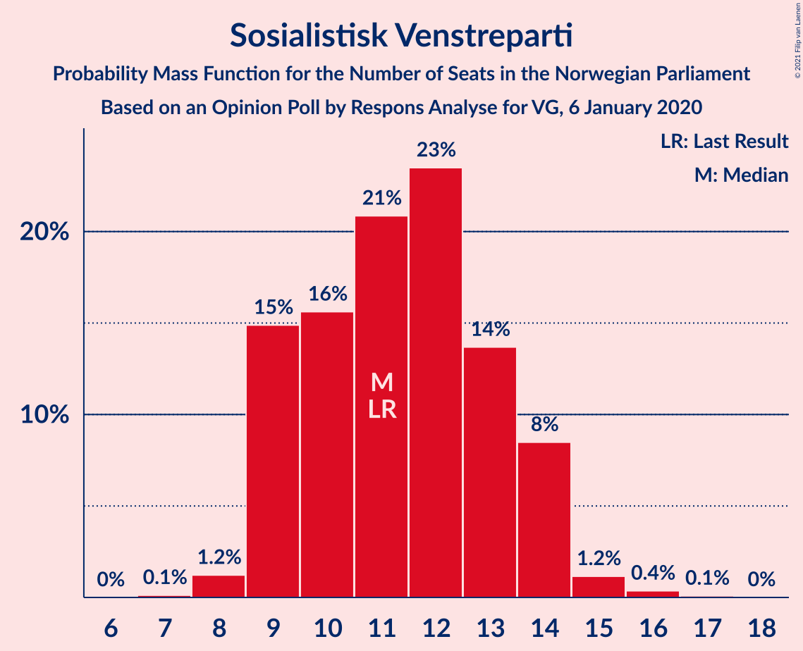
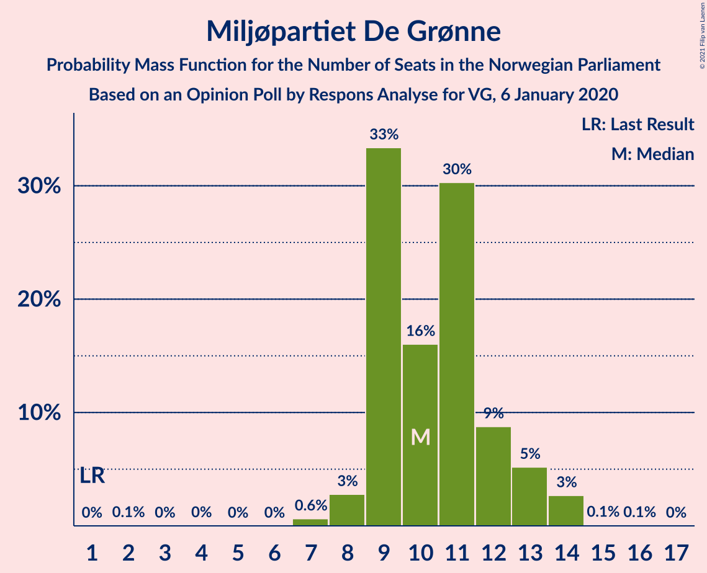
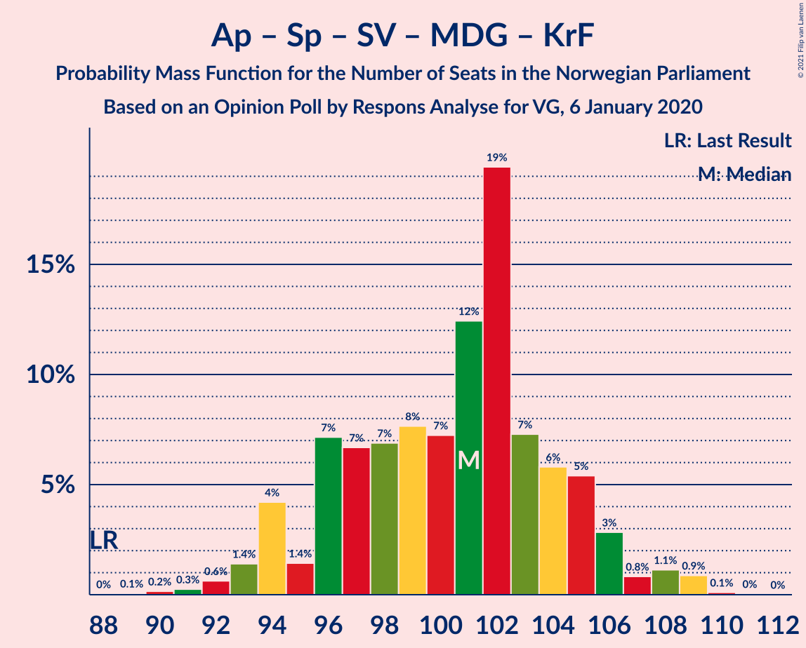
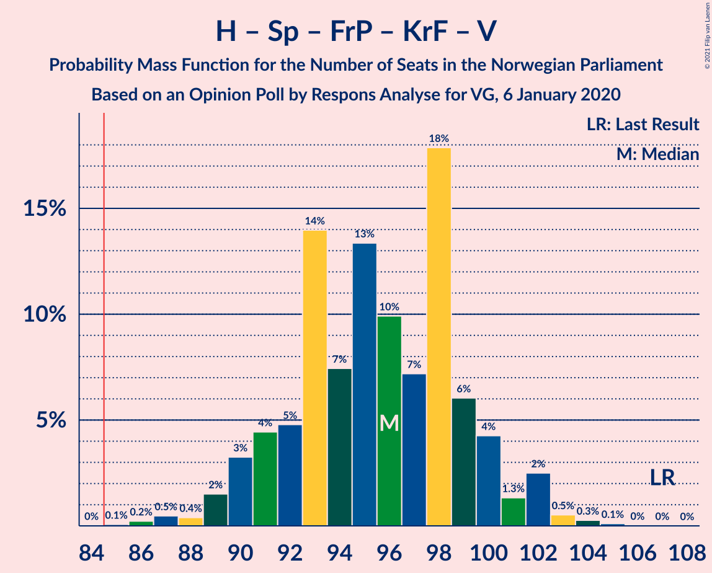
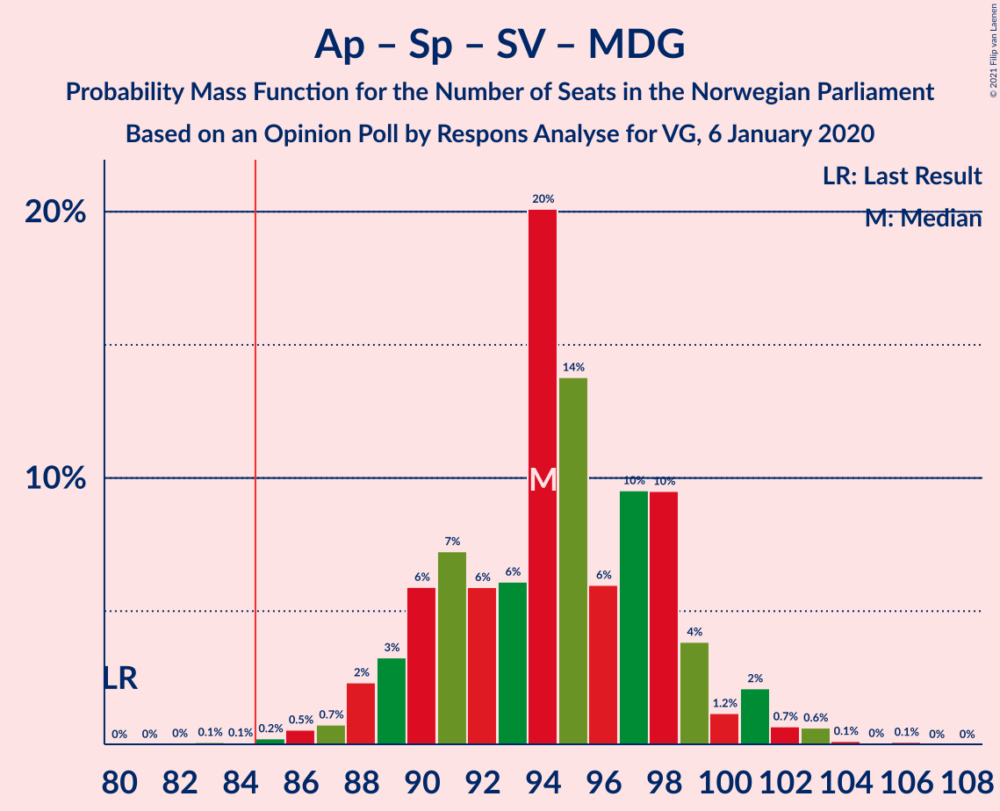
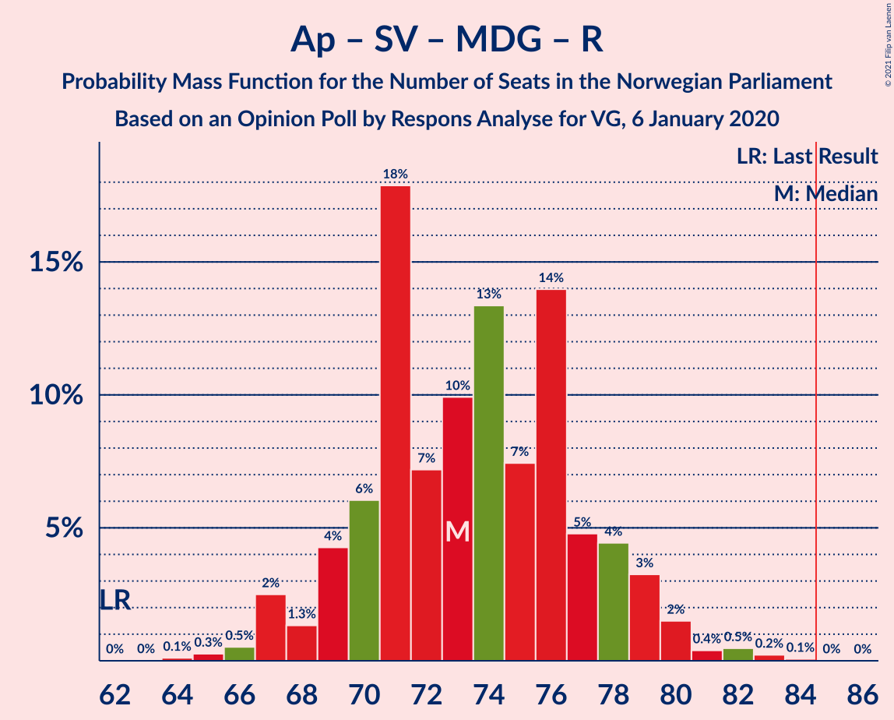
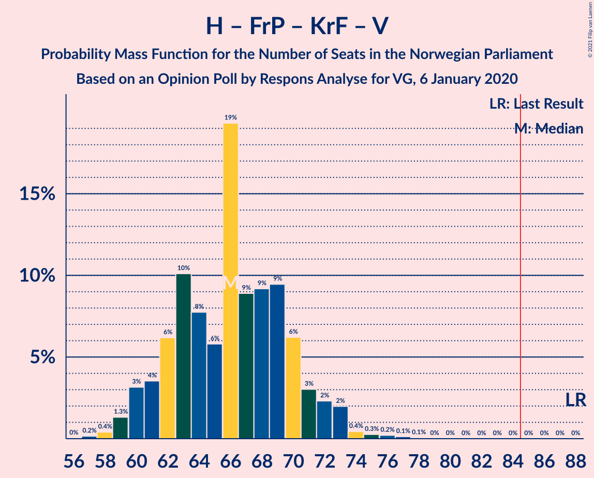
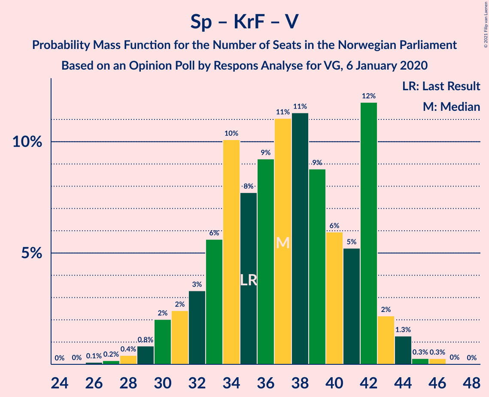

# Opinion Poll by Respons Analyse for VG, 6 January 2020

<a href="#voting-intentions">Voting Intentions</a> | <a href="#seats">Seats</a> | <a href="#coalitions">Coalitions</a> | <a href="#technical-information">Technical Information</a>

## Voting Intentions

### Confidence Intervals

| Party | Last Result | Poll Result | 80% Confidence Interval | 90% Confidence Interval | 95% Confidence Interval | 99% Confidence Interval |
|:-----:|:-----------:|:-----------:|:-----------------------:|:-----------------------:|:-----------------------:|:-----------------------:|
| Arbeiderpartiet | 27.4% | 24.0% | 22.3–25.8% |21.8–26.3% |21.4–26.7% |20.7–27.6% |
| Høyre | 25.0% | 22.4% | 20.7–24.1% |20.3–24.6% |19.9–25.1% |19.1–25.9% |
| Senterpartiet | 10.3% | 15.8% | 14.4–17.3% |14.0–17.8% |13.7–18.2% |13.0–19.0% |
| Fremskrittspartiet | 15.2% | 11.4% | 10.2–12.8% |9.8–13.2% |9.6–13.5% |9.0–14.2% |
| Sosialistisk Venstreparti | 6.0% | 6.6% | 5.7–7.7% |5.4–8.0% |5.2–8.3% |4.8–8.9% |
| Miljøpartiet De Grønne | 3.2% | 6.1% | 5.2–7.2% |5.0–7.5% |4.8–7.8% |4.4–8.3% |
| Rødt | 2.4% | 5.1% | 4.3–6.1% |4.1–6.4% |3.9–6.6% |3.6–7.2% |
| Kristelig Folkeparti | 4.2% | 4.2% | 3.5–5.1% |3.3–5.4% |3.1–5.6% |2.8–6.1% |
| Venstre | 4.4% | 2.5% | 2.0–3.3% |1.8–3.5% |1.7–3.7% |1.5–4.1% |

*Note:* The poll result column reflects the actual value used in the calculations. Published results may vary slightly, and in addition be rounded to fewer digits.

## Seats

### Confidence Intervals

| Party | Last Result | Median | 80% Confidence Interval | 90% Confidence Interval | 95% Confidence Interval | 99% Confidence Interval |
|:-----:|:-----------:|:------:|:-----------------------:|:-----------------------:|:-----------------------:|:-----------------------:|
| <a href="#arbeiderpartiet">Arbeiderpartiet</a> | 49 | 44 | 40–46 |39–47 |39–48 |37–50 |
| <a href="#høyre">Høyre</a> | 45 | 39 | 35–42 |35–43 |34–44 |33–46 |
| <a href="#senterpartiet">Senterpartiet</a> | 19 | 29 | 26–33 |25–33 |24–34 |22–35 |
| <a href="#fremskrittspartiet">Fremskrittspartiet</a> | 27 | 19 | 17–23 |16–24 |16–24 |15–25 |
| <a href="#sosialistisk-venstreparti">Sosialistisk Venstreparti</a> | 11 | 11 | 9–14 |9–14 |9–14 |8–15 |
| <a href="#miljøpartiet-de-grønne">Miljøpartiet De Grønne</a> | 1 | 10 | 9–12 |9–13 |8–14 |7–14 |
| <a href="#rødt">Rødt</a> | 1 | 9 | 7–10 |6–11 |2–11 |2–12 |
| <a href="#kristelig-folkeparti">Kristelig Folkeparti</a> | 8 | 7 | 3–8 |2–9 |1–9 |1–10 |
| <a href="#venstre">Venstre</a> | 8 | 2 | 1–2 |1–2 |0–2 |0–7 |

### Arbeiderpartiet

*For a full overview of the results for this party, see the [Arbeiderpartiet](party-arbeiderpartiet.html) page.*

| Number of Seats | Probability | Accumulated | Special Marks |
|:---------------:|:-----------:|:-----------:|:-------------:|
| 36 | 0.1% | 100% |  |
| 37 | 0.5% | 99.9% |  |
| 38 | 2% | 99.4% |  |
| 39 | 3% | 98% |  |
| 40 | 7% | 95% |  |
| 41 | 10% | 88% |  |
| 42 | 11% | 78% |  |
| 43 | 8% | 67% |  |
| 44 | 42% | 59% | Median |
| 45 | 7% | 17% |  |
| 46 | 6% | 11% |  |
| 47 | 1.4% | 5% |  |
| 48 | 2% | 4% |  |
| 49 | 1.1% | 2% | Last Result |
| 50 | 0.6% | 1.0% |  |
| 51 | 0.3% | 0.4% |  |
| 52 | 0.1% | 0.1% |  |
| 53 | 0% | 0.1% |  |
| 54 | 0% | 0% |  |

### Høyre

*For a full overview of the results for this party, see the [Høyre](party-høyre.html) page.*

| Number of Seats | Probability | Accumulated | Special Marks |
|:---------------:|:-----------:|:-----------:|:-------------:|
| 31 | 0% | 100% |  |
| 32 | 0.3% | 99.9% |  |
| 33 | 0.9% | 99.7% |  |
| 34 | 2% | 98.7% |  |
| 35 | 8% | 96% |  |
| 36 | 6% | 89% |  |
| 37 | 8% | 82% |  |
| 38 | 22% | 74% |  |
| 39 | 12% | 52% | Median |
| 40 | 14% | 40% |  |
| 41 | 13% | 26% |  |
| 42 | 6% | 13% |  |
| 43 | 4% | 7% |  |
| 44 | 1.4% | 3% |  |
| 45 | 0.6% | 1.3% | Last Result |
| 46 | 0.2% | 0.7% |  |
| 47 | 0.4% | 0.5% |  |
| 48 | 0.1% | 0.1% |  |
| 49 | 0% | 0% |  |

### Senterpartiet

*For a full overview of the results for this party, see the [Senterpartiet](party-senterpartiet.html) page.*

| Number of Seats | Probability | Accumulated | Special Marks |
|:---------------:|:-----------:|:-----------:|:-------------:|
| 19 | 0% | 100% | Last Result |
| 20 | 0.1% | 100% |  |
| 21 | 0.3% | 99.9% |  |
| 22 | 0.3% | 99.6% |  |
| 23 | 1.0% | 99.3% |  |
| 24 | 3% | 98% |  |
| 25 | 5% | 95% |  |
| 26 | 3% | 90% |  |
| 27 | 7% | 87% |  |
| 28 | 8% | 80% |  |
| 29 | 27% | 72% | Median |
| 30 | 10% | 46% |  |
| 31 | 7% | 36% |  |
| 32 | 18% | 28% |  |
| 33 | 6% | 11% |  |
| 34 | 3% | 5% |  |
| 35 | 1.0% | 1.4% |  |
| 36 | 0.4% | 0.4% |  |
| 37 | 0% | 0.1% |  |
| 38 | 0% | 0% |  |

### Fremskrittspartiet

*For a full overview of the results for this party, see the [Fremskrittspartiet](party-fremskrittspartiet.html) page.*

| Number of Seats | Probability | Accumulated | Special Marks |
|:---------------:|:-----------:|:-----------:|:-------------:|
| 14 | 0.2% | 100% |  |
| 15 | 2% | 99.8% |  |
| 16 | 4% | 98% |  |
| 17 | 7% | 94% |  |
| 18 | 22% | 87% |  |
| 19 | 19% | 65% | Median |
| 20 | 21% | 46% |  |
| 21 | 7% | 25% |  |
| 22 | 6% | 18% |  |
| 23 | 6% | 12% |  |
| 24 | 5% | 7% |  |
| 25 | 1.1% | 1.4% |  |
| 26 | 0.2% | 0.3% |  |
| 27 | 0% | 0.1% | Last Result |
| 28 | 0% | 0% |  |

### Sosialistisk Venstreparti

*For a full overview of the results for this party, see the [Sosialistisk Venstreparti](party-sosialistiskvenstreparti.html) page.*

| Number of Seats | Probability | Accumulated | Special Marks |
|:---------------:|:-----------:|:-----------:|:-------------:|
| 7 | 0.1% | 100% |  |
| 8 | 1.2% | 99.9% |  |
| 9 | 15% | 98.6% |  |
| 10 | 16% | 84% |  |
| 11 | 21% | 68% | Last Result, Median |
| 12 | 23% | 47% |  |
| 13 | 14% | 24% |  |
| 14 | 8% | 10% |  |
| 15 | 1.2% | 2% |  |
| 16 | 0.4% | 0.5% |  |
| 17 | 0.1% | 0.1% |  |
| 18 | 0% | 0% |  |

### Miljøpartiet De Grønne

*For a full overview of the results for this party, see the [Miljøpartiet De Grønne](party-miljøpartietdegrønne.html) page.*

| Number of Seats | Probability | Accumulated | Special Marks |
|:---------------:|:-----------:|:-----------:|:-------------:|
| 1 | 0% | 100% | Last Result |
| 2 | 0.1% | 100% |  |
| 3 | 0% | 99.9% |  |
| 4 | 0% | 99.9% |  |
| 5 | 0% | 99.9% |  |
| 6 | 0% | 99.9% |  |
| 7 | 0.6% | 99.9% |  |
| 8 | 3% | 99.3% |  |
| 9 | 33% | 96% |  |
| 10 | 16% | 63% | Median |
| 11 | 30% | 47% |  |
| 12 | 9% | 17% |  |
| 13 | 5% | 8% |  |
| 14 | 3% | 3% |  |
| 15 | 0.1% | 0.1% |  |
| 16 | 0.1% | 0.1% |  |
| 17 | 0% | 0% |  |

### Rødt

*For a full overview of the results for this party, see the [Rødt](party-rødt.html) page.*

| Number of Seats | Probability | Accumulated | Special Marks |
|:---------------:|:-----------:|:-----------:|:-------------:|
| 1 | 0% | 100% | Last Result |
| 2 | 5% | 100% |  |
| 3 | 0% | 95% |  |
| 4 | 0% | 95% |  |
| 5 | 0% | 95% |  |
| 6 | 0.7% | 95% |  |
| 7 | 12% | 94% |  |
| 8 | 23% | 83% |  |
| 9 | 35% | 59% | Median |
| 10 | 15% | 25% |  |
| 11 | 8% | 10% |  |
| 12 | 1.4% | 2% |  |
| 13 | 0.3% | 0.3% |  |
| 14 | 0% | 0% |  |

### Kristelig Folkeparti

*For a full overview of the results for this party, see the [Kristelig Folkeparti](party-kristeligfolkeparti.html) page.*

| Number of Seats | Probability | Accumulated | Special Marks |
|:---------------:|:-----------:|:-----------:|:-------------:|
| 1 | 4% | 100% |  |
| 2 | 5% | 96% |  |
| 3 | 26% | 92% |  |
| 4 | 0% | 66% |  |
| 5 | 0% | 66% |  |
| 6 | 0.2% | 66% |  |
| 7 | 26% | 66% | Median |
| 8 | 30% | 39% | Last Result |
| 9 | 7% | 9% |  |
| 10 | 2% | 2% |  |
| 11 | 0.4% | 0.4% |  |
| 12 | 0% | 0% |  |

### Venstre

*For a full overview of the results for this party, see the [Venstre](party-venstre.html) page.*

| Number of Seats | Probability | Accumulated | Special Marks |
|:---------------:|:-----------:|:-----------:|:-------------:|
| 0 | 4% | 100% |  |
| 1 | 29% | 96% |  |
| 2 | 66% | 67% | Median |
| 3 | 0.4% | 1.0% |  |
| 4 | 0% | 0.6% |  |
| 5 | 0% | 0.6% |  |
| 6 | 0.1% | 0.6% |  |
| 7 | 0.5% | 0.5% |  |
| 8 | 0% | 0% | Last Result |

## Coalitions

### Confidence Intervals

| Coalition | Last Result | Median | Majority? | 80% Confidence Interval | 90% Confidence Interval | 95% Confidence Interval | 99% Confidence Interval |
|:---------:|:-----------:|:------:|:---------:|:-----------------------:|:-----------------------:|:-----------------------:|:-----------------------:|
| Arbeiderpartiet – Senterpartiet – Sosialistisk Venstreparti – Miljøpartiet De Grønne – Rødt | 81 | 103 | 100% | 99–107 | 97–109 | 96–109 | 94–111 |
| Arbeiderpartiet – Senterpartiet – Sosialistisk Venstreparti – Miljøpartiet De Grønne – Kristelig Folkeparti | 88 | 101 | 100% | 96–105 | 94–106 | 93–107 | 91–109 |
| Høyre – Senterpartiet – Fremskrittspartiet – Kristelig Folkeparti – Venstre | 107 | 96 | 100% | 91–99 | 90–100 | 89–102 | 87–103 |
| Arbeiderpartiet – Senterpartiet – Sosialistisk Venstreparti – Miljøpartiet De Grønne | 80 | 94 | 99.8% | 90–98 | 89–99 | 88–101 | 86–103 |
| Arbeiderpartiet – Senterpartiet – Sosialistisk Venstreparti – Rødt | 80 | 93 | 98.9% | 88–96 | 87–98 | 86–99 | 83–100 |
| Arbeiderpartiet – Senterpartiet – Miljøpartiet De Grønne – Kristelig Folkeparti | 77 | 89 | 87% | 83–93 | 82–95 | 82–96 | 79–97 |
| Arbeiderpartiet – Senterpartiet – Sosialistisk Venstreparti | 79 | 85 | 51% | 80–88 | 79–89 | 77–90 | 75–92 |
| Arbeiderpartiet – Senterpartiet – Kristelig Folkeparti | 76 | 79 | 6% | 73–84 | 72–85 | 71–85 | 68–87 |
| Høyre – Fremskrittspartiet – Miljøpartiet De Grønne – Kristelig Folkeparti – Venstre | 89 | 76 | 1.1% | 73–81 | 71–82 | 70–83 | 69–86 |
| Arbeiderpartiet – Sosialistisk Venstreparti – Miljøpartiet De Grønne – Rødt | 62 | 73 | 0% | 70–78 | 69–79 | 67–80 | 66–82 |
| Arbeiderpartiet – Senterpartiet | 68 | 73 | 0% | 69–77 | 67–78 | 66–78 | 64–80 |
| Høyre – Fremskrittspartiet – Kristelig Folkeparti – Venstre | 88 | 66 | 0% | 62–70 | 60–72 | 60–73 | 58–75 |
| Høyre – Fremskrittspartiet – Venstre | 80 | 60 | 0% | 57–65 | 55–66 | 54–67 | 52–69 |
| Høyre – Fremskrittspartiet | 72 | 58 | 0% | 55–63 | 53–64 | 52–65 | 51–67 |
| Arbeiderpartiet – Sosialistisk Venstreparti | 60 | 55 | 0% | 51–58 | 50–59 | 50–60 | 48–62 |
| Høyre – Kristelig Folkeparti – Venstre | 61 | 47 | 0% | 43–51 | 41–52 | 40–52 | 39–55 |
| Senterpartiet – Kristelig Folkeparti – Venstre | 35 | 37 | 0% | 33–42 | 31–42 | 30–43 | 28–45 |

### Arbeiderpartiet – Senterpartiet – Sosialistisk Venstreparti – Miljøpartiet De Grønne – Rødt

| Number of Seats | Probability | Accumulated | Special Marks |
|:---------------:|:-----------:|:-----------:|:-------------:|
| 81 | 0% | 100% | Last Result |
| 82 | 0% | 100% |  |
| 83 | 0% | 100% |  |
| 84 | 0% | 100% |  |
| 85 | 0% | 100% | Majority |
| 86 | 0% | 100% |  |
| 87 | 0% | 100% |  |
| 88 | 0% | 100% |  |
| 89 | 0% | 100% |  |
| 90 | 0% | 100% |  |
| 91 | 0.1% | 100% |  |
| 92 | 0.1% | 99.9% |  |
| 93 | 0.2% | 99.8% |  |
| 94 | 0.3% | 99.6% |  |
| 95 | 0.4% | 99.3% |  |
| 96 | 2% | 98.9% |  |
| 97 | 2% | 97% |  |
| 98 | 3% | 95% |  |
| 99 | 6% | 92% |  |
| 100 | 9% | 85% |  |
| 101 | 9% | 76% |  |
| 102 | 9% | 67% |  |
| 103 | 19% | 58% | Median |
| 104 | 6% | 38% |  |
| 105 | 8% | 33% |  |
| 106 | 10% | 25% |  |
| 107 | 6% | 15% |  |
| 108 | 4% | 9% |  |
| 109 | 3% | 5% |  |
| 110 | 1.3% | 2% |  |
| 111 | 0.4% | 0.6% |  |
| 112 | 0.2% | 0.2% |  |
| 113 | 0% | 0.1% |  |
| 114 | 0% | 0% |  |

### Arbeiderpartiet – Senterpartiet – Sosialistisk Venstreparti – Miljøpartiet De Grønne – Kristelig Folkeparti

| Number of Seats | Probability | Accumulated | Special Marks |
|:---------------:|:-----------:|:-----------:|:-------------:|
| 88 | 0% | 100% | Last Result |
| 89 | 0.1% | 100% |  |
| 90 | 0.2% | 99.9% |  |
| 91 | 0.3% | 99.7% |  |
| 92 | 0.6% | 99.5% |  |
| 93 | 1.4% | 98.9% |  |
| 94 | 4% | 97% |  |
| 95 | 1.4% | 93% |  |
| 96 | 7% | 92% |  |
| 97 | 7% | 85% |  |
| 98 | 7% | 78% |  |
| 99 | 8% | 71% |  |
| 100 | 7% | 63% |  |
| 101 | 12% | 56% | Median |
| 102 | 19% | 44% |  |
| 103 | 7% | 24% |  |
| 104 | 6% | 17% |  |
| 105 | 5% | 11% |  |
| 106 | 3% | 6% |  |
| 107 | 0.8% | 3% |  |
| 108 | 1.1% | 2% |  |
| 109 | 0.9% | 1.0% |  |
| 110 | 0.1% | 0.2% |  |
| 111 | 0% | 0.1% |  |
| 112 | 0% | 0% |  |

### Høyre – Senterpartiet – Fremskrittspartiet – Kristelig Folkeparti – Venstre

| Number of Seats | Probability | Accumulated | Special Marks |
|:---------------:|:-----------:|:-----------:|:-------------:|
| 85 | 0.1% | 100% | Majority |
| 86 | 0.2% | 99.9% |  |
| 87 | 0.5% | 99.7% |  |
| 88 | 0.4% | 99.2% |  |
| 89 | 2% | 98.8% |  |
| 90 | 3% | 97% |  |
| 91 | 4% | 94% |  |
| 92 | 5% | 90% |  |
| 93 | 14% | 85% |  |
| 94 | 7% | 71% |  |
| 95 | 13% | 63% |  |
| 96 | 10% | 50% | Median |
| 97 | 7% | 40% |  |
| 98 | 18% | 33% |  |
| 99 | 6% | 15% |  |
| 100 | 4% | 9% |  |
| 101 | 1.3% | 5% |  |
| 102 | 2% | 3% |  |
| 103 | 0.5% | 0.9% |  |
| 104 | 0.3% | 0.4% |  |
| 105 | 0.1% | 0.2% |  |
| 106 | 0% | 0% |  |
| 107 | 0% | 0% | Last Result |

### Arbeiderpartiet – Senterpartiet – Sosialistisk Venstreparti – Miljøpartiet De Grønne

| Number of Seats | Probability | Accumulated | Special Marks |
|:---------------:|:-----------:|:-----------:|:-------------:|
| 80 | 0% | 100% | Last Result |
| 81 | 0% | 100% |  |
| 82 | 0% | 100% |  |
| 83 | 0.1% | 99.9% |  |
| 84 | 0.1% | 99.9% |  |
| 85 | 0.2% | 99.8% | Majority |
| 86 | 0.5% | 99.6% |  |
| 87 | 0.7% | 99.0% |  |
| 88 | 2% | 98% |  |
| 89 | 3% | 96% |  |
| 90 | 6% | 93% |  |
| 91 | 7% | 87% |  |
| 92 | 6% | 80% |  |
| 93 | 6% | 74% |  |
| 94 | 20% | 68% | Median |
| 95 | 14% | 47% |  |
| 96 | 6% | 34% |  |
| 97 | 10% | 28% |  |
| 98 | 10% | 18% |  |
| 99 | 4% | 9% |  |
| 100 | 1.2% | 5% |  |
| 101 | 2% | 4% |  |
| 102 | 0.7% | 2% |  |
| 103 | 0.6% | 0.9% |  |
| 104 | 0.1% | 0.3% |  |
| 105 | 0% | 0.1% |  |
| 106 | 0.1% | 0.1% |  |
| 107 | 0% | 0% |  |

### Arbeiderpartiet – Senterpartiet – Sosialistisk Venstreparti – Rødt

| Number of Seats | Probability | Accumulated | Special Marks |
|:---------------:|:-----------:|:-----------:|:-------------:|
| 80 | 0% | 100% | Last Result |
| 81 | 0.1% | 100% |  |
| 82 | 0.1% | 99.9% |  |
| 83 | 0.3% | 99.7% |  |
| 84 | 0.5% | 99.5% |  |
| 85 | 0.8% | 98.9% | Majority |
| 86 | 2% | 98% |  |
| 87 | 3% | 97% |  |
| 88 | 6% | 94% |  |
| 89 | 6% | 88% |  |
| 90 | 5% | 82% |  |
| 91 | 16% | 77% |  |
| 92 | 9% | 61% |  |
| 93 | 4% | 52% | Median |
| 94 | 18% | 48% |  |
| 95 | 12% | 29% |  |
| 96 | 8% | 17% |  |
| 97 | 4% | 10% |  |
| 98 | 3% | 6% |  |
| 99 | 2% | 3% |  |
| 100 | 0.6% | 0.8% |  |
| 101 | 0.1% | 0.2% |  |
| 102 | 0.1% | 0.1% |  |
| 103 | 0% | 0% |  |

### Arbeiderpartiet – Senterpartiet – Miljøpartiet De Grønne – Kristelig Folkeparti

| Number of Seats | Probability | Accumulated | Special Marks |
|:---------------:|:-----------:|:-----------:|:-------------:|
| 77 | 0% | 100% | Last Result |
| 78 | 0.2% | 99.9% |  |
| 79 | 0.3% | 99.8% |  |
| 80 | 0.4% | 99.5% |  |
| 81 | 1.4% | 99.1% |  |
| 82 | 6% | 98% |  |
| 83 | 3% | 92% |  |
| 84 | 2% | 89% |  |
| 85 | 4% | 87% | Majority |
| 86 | 6% | 84% |  |
| 87 | 9% | 78% |  |
| 88 | 12% | 69% |  |
| 89 | 7% | 57% |  |
| 90 | 14% | 50% | Median |
| 91 | 6% | 35% |  |
| 92 | 7% | 29% |  |
| 93 | 12% | 22% |  |
| 94 | 4% | 10% |  |
| 95 | 2% | 6% |  |
| 96 | 2% | 3% |  |
| 97 | 0.5% | 0.9% |  |
| 98 | 0.4% | 0.5% |  |
| 99 | 0.1% | 0.1% |  |
| 100 | 0% | 0% |  |

### Arbeiderpartiet – Senterpartiet – Sosialistisk Venstreparti

| Number of Seats | Probability | Accumulated | Special Marks |
|:---------------:|:-----------:|:-----------:|:-------------:|
| 73 | 0.1% | 100% |  |
| 74 | 0.3% | 99.9% |  |
| 75 | 0.3% | 99.6% |  |
| 76 | 0.4% | 99.3% |  |
| 77 | 1.5% | 98.9% |  |
| 78 | 2% | 97% |  |
| 79 | 4% | 96% | Last Result |
| 80 | 5% | 92% |  |
| 81 | 7% | 87% |  |
| 82 | 8% | 79% |  |
| 83 | 9% | 71% |  |
| 84 | 11% | 62% | Median |
| 85 | 20% | 51% | Majority |
| 86 | 11% | 31% |  |
| 87 | 9% | 19% |  |
| 88 | 3% | 10% |  |
| 89 | 3% | 7% |  |
| 90 | 2% | 4% |  |
| 91 | 0.6% | 2% |  |
| 92 | 0.7% | 1.0% |  |
| 93 | 0.1% | 0.2% |  |
| 94 | 0.1% | 0.1% |  |
| 95 | 0% | 0% |  |

### Arbeiderpartiet – Senterpartiet – Kristelig Folkeparti

| Number of Seats | Probability | Accumulated | Special Marks |
|:---------------:|:-----------:|:-----------:|:-------------:|
| 66 | 0.1% | 100% |  |
| 67 | 0.1% | 99.9% |  |
| 68 | 0.6% | 99.8% |  |
| 69 | 0.3% | 99.2% |  |
| 70 | 1.1% | 98.9% |  |
| 71 | 1.2% | 98% |  |
| 72 | 3% | 97% |  |
| 73 | 6% | 93% |  |
| 74 | 3% | 88% |  |
| 75 | 4% | 85% |  |
| 76 | 7% | 81% | Last Result |
| 77 | 11% | 74% |  |
| 78 | 9% | 63% |  |
| 79 | 11% | 54% |  |
| 80 | 11% | 44% | Median |
| 81 | 8% | 32% |  |
| 82 | 5% | 25% |  |
| 83 | 3% | 20% |  |
| 84 | 10% | 16% |  |
| 85 | 5% | 6% | Majority |
| 86 | 0.7% | 2% |  |
| 87 | 0.7% | 0.9% |  |
| 88 | 0.1% | 0.2% |  |
| 89 | 0% | 0.1% |  |
| 90 | 0% | 0% |  |

### Høyre – Fremskrittspartiet – Miljøpartiet De Grønne – Kristelig Folkeparti – Venstre

| Number of Seats | Probability | Accumulated | Special Marks |
|:---------------:|:-----------:|:-----------:|:-------------:|
| 67 | 0.1% | 100% |  |
| 68 | 0.1% | 99.9% |  |
| 69 | 0.6% | 99.8% |  |
| 70 | 2% | 99.2% |  |
| 71 | 3% | 97% |  |
| 72 | 4% | 94% |  |
| 73 | 8% | 90% |  |
| 74 | 12% | 83% |  |
| 75 | 18% | 71% |  |
| 76 | 4% | 52% |  |
| 77 | 9% | 48% | Median |
| 78 | 16% | 39% |  |
| 79 | 5% | 23% |  |
| 80 | 6% | 18% |  |
| 81 | 6% | 12% |  |
| 82 | 3% | 6% |  |
| 83 | 2% | 3% |  |
| 84 | 0.8% | 2% |  |
| 85 | 0.5% | 1.1% | Majority |
| 86 | 0.3% | 0.5% |  |
| 87 | 0.1% | 0.3% |  |
| 88 | 0.1% | 0.1% |  |
| 89 | 0% | 0% | Last Result |

### Arbeiderpartiet – Sosialistisk Venstreparti – Miljøpartiet De Grønne – Rødt

| Number of Seats | Probability | Accumulated | Special Marks |
|:---------------:|:-----------:|:-----------:|:-------------:|
| 62 | 0% | 100% | Last Result |
| 63 | 0% | 100% |  |
| 64 | 0.1% | 100% |  |
| 65 | 0.3% | 99.8% |  |
| 66 | 0.5% | 99.6% |  |
| 67 | 2% | 99.1% |  |
| 68 | 1.3% | 97% |  |
| 69 | 4% | 95% |  |
| 70 | 6% | 91% |  |
| 71 | 18% | 85% |  |
| 72 | 7% | 67% |  |
| 73 | 10% | 60% |  |
| 74 | 13% | 50% | Median |
| 75 | 7% | 37% |  |
| 76 | 14% | 29% |  |
| 77 | 5% | 15% |  |
| 78 | 4% | 10% |  |
| 79 | 3% | 6% |  |
| 80 | 2% | 3% |  |
| 81 | 0.4% | 1.2% |  |
| 82 | 0.5% | 0.8% |  |
| 83 | 0.2% | 0.3% |  |
| 84 | 0.1% | 0.1% |  |
| 85 | 0% | 0% | Majority |

### Arbeiderpartiet – Senterpartiet

| Number of Seats | Probability | Accumulated | Special Marks |
|:---------------:|:-----------:|:-----------:|:-------------:|
| 62 | 0.2% | 100% |  |
| 63 | 0.2% | 99.8% |  |
| 64 | 0.6% | 99.6% |  |
| 65 | 1.0% | 99.0% |  |
| 66 | 2% | 98% |  |
| 67 | 2% | 96% |  |
| 68 | 3% | 94% | Last Result |
| 69 | 6% | 91% |  |
| 70 | 10% | 85% |  |
| 71 | 10% | 75% |  |
| 72 | 7% | 64% |  |
| 73 | 18% | 57% | Median |
| 74 | 9% | 39% |  |
| 75 | 5% | 30% |  |
| 76 | 15% | 25% |  |
| 77 | 5% | 10% |  |
| 78 | 3% | 5% |  |
| 79 | 1.1% | 2% |  |
| 80 | 0.9% | 1.1% |  |
| 81 | 0.1% | 0.2% |  |
| 82 | 0.1% | 0.1% |  |
| 83 | 0% | 0% |  |

### Høyre – Fremskrittspartiet – Kristelig Folkeparti – Venstre

| Number of Seats | Probability | Accumulated | Special Marks |
|:---------------:|:-----------:|:-----------:|:-------------:|
| 56 | 0% | 100% |  |
| 57 | 0.2% | 99.9% |  |
| 58 | 0.4% | 99.8% |  |
| 59 | 1.3% | 99.4% |  |
| 60 | 3% | 98% |  |
| 61 | 4% | 95% |  |
| 62 | 6% | 91% |  |
| 63 | 10% | 85% |  |
| 64 | 8% | 75% |  |
| 65 | 6% | 67% |  |
| 66 | 19% | 62% |  |
| 67 | 9% | 42% | Median |
| 68 | 9% | 33% |  |
| 69 | 9% | 24% |  |
| 70 | 6% | 15% |  |
| 71 | 3% | 8% |  |
| 72 | 2% | 5% |  |
| 73 | 2% | 3% |  |
| 74 | 0.4% | 1.1% |  |
| 75 | 0.3% | 0.7% |  |
| 76 | 0.2% | 0.4% |  |
| 77 | 0.1% | 0.2% |  |
| 78 | 0.1% | 0.1% |  |
| 79 | 0% | 0% |  |
| 80 | 0% | 0% |  |
| 81 | 0% | 0% |  |
| 82 | 0% | 0% |  |
| 83 | 0% | 0% |  |
| 84 | 0% | 0% |  |
| 85 | 0% | 0% | Majority |
| 86 | 0% | 0% |  |
| 87 | 0% | 0% |  |
| 88 | 0% | 0% | Last Result |

### Høyre – Fremskrittspartiet – Venstre

| Number of Seats | Probability | Accumulated | Special Marks |
|:---------------:|:-----------:|:-----------:|:-------------:|
| 51 | 0.1% | 100% |  |
| 52 | 0.9% | 99.9% |  |
| 53 | 1.1% | 98.9% |  |
| 54 | 2% | 98% |  |
| 55 | 3% | 96% |  |
| 56 | 3% | 93% |  |
| 57 | 9% | 90% |  |
| 58 | 17% | 81% |  |
| 59 | 14% | 65% |  |
| 60 | 14% | 51% | Median |
| 61 | 6% | 37% |  |
| 62 | 10% | 31% |  |
| 63 | 4% | 21% |  |
| 64 | 5% | 17% |  |
| 65 | 5% | 12% |  |
| 66 | 4% | 7% |  |
| 67 | 1.3% | 3% |  |
| 68 | 0.6% | 1.3% |  |
| 69 | 0.5% | 0.7% |  |
| 70 | 0.2% | 0.2% |  |
| 71 | 0% | 0.1% |  |
| 72 | 0% | 0% |  |
| 73 | 0% | 0% |  |
| 74 | 0% | 0% |  |
| 75 | 0% | 0% |  |
| 76 | 0% | 0% |  |
| 77 | 0% | 0% |  |
| 78 | 0% | 0% |  |
| 79 | 0% | 0% |  |
| 80 | 0% | 0% | Last Result |

### Høyre – Fremskrittspartiet

| Number of Seats | Probability | Accumulated | Special Marks |
|:---------------:|:-----------:|:-----------:|:-------------:|
| 49 | 0.1% | 100% |  |
| 50 | 0.3% | 99.9% |  |
| 51 | 2% | 99.7% |  |
| 52 | 2% | 98% |  |
| 53 | 2% | 96% |  |
| 54 | 3% | 94% |  |
| 55 | 8% | 91% |  |
| 56 | 15% | 83% |  |
| 57 | 9% | 68% |  |
| 58 | 15% | 59% | Median |
| 59 | 9% | 44% |  |
| 60 | 13% | 35% |  |
| 61 | 4% | 22% |  |
| 62 | 5% | 18% |  |
| 63 | 4% | 13% |  |
| 64 | 6% | 9% |  |
| 65 | 1.1% | 3% |  |
| 66 | 1.0% | 2% |  |
| 67 | 0.5% | 0.9% |  |
| 68 | 0.3% | 0.4% |  |
| 69 | 0.1% | 0.1% |  |
| 70 | 0% | 0% |  |
| 71 | 0% | 0% |  |
| 72 | 0% | 0% | Last Result |

### Arbeiderpartiet – Sosialistisk Venstreparti

| Number of Seats | Probability | Accumulated | Special Marks |
|:---------------:|:-----------:|:-----------:|:-------------:|
| 46 | 0% | 100% |  |
| 47 | 0.2% | 99.9% |  |
| 48 | 0.6% | 99.7% |  |
| 49 | 1.1% | 99.1% |  |
| 50 | 5% | 98% |  |
| 51 | 5% | 93% |  |
| 52 | 7% | 88% |  |
| 53 | 19% | 81% |  |
| 54 | 11% | 63% |  |
| 55 | 14% | 52% | Median |
| 56 | 15% | 37% |  |
| 57 | 10% | 23% |  |
| 58 | 7% | 13% |  |
| 59 | 2% | 6% |  |
| 60 | 2% | 4% | Last Result |
| 61 | 0.9% | 2% |  |
| 62 | 0.5% | 0.8% |  |
| 63 | 0.2% | 0.3% |  |
| 64 | 0.1% | 0.1% |  |
| 65 | 0% | 0% |  |

### Høyre – Kristelig Folkeparti – Venstre

| Number of Seats | Probability | Accumulated | Special Marks |
|:---------------:|:-----------:|:-----------:|:-------------:|
| 37 | 0.1% | 100% |  |
| 38 | 0.3% | 99.9% |  |
| 39 | 0.6% | 99.6% |  |
| 40 | 2% | 99.0% |  |
| 41 | 3% | 97% |  |
| 42 | 3% | 94% |  |
| 43 | 7% | 91% |  |
| 44 | 12% | 84% |  |
| 45 | 11% | 72% |  |
| 46 | 9% | 61% |  |
| 47 | 10% | 52% |  |
| 48 | 18% | 43% | Median |
| 49 | 10% | 25% |  |
| 50 | 4% | 15% |  |
| 51 | 6% | 11% |  |
| 52 | 3% | 5% |  |
| 53 | 0.7% | 2% |  |
| 54 | 0.5% | 1.1% |  |
| 55 | 0.4% | 0.7% |  |
| 56 | 0.1% | 0.2% |  |
| 57 | 0.1% | 0.1% |  |
| 58 | 0% | 0% |  |
| 59 | 0% | 0% |  |
| 60 | 0% | 0% |  |
| 61 | 0% | 0% | Last Result |

### Senterpartiet – Kristelig Folkeparti – Venstre

| Number of Seats | Probability | Accumulated | Special Marks |
|:---------------:|:-----------:|:-----------:|:-------------:|
| 26 | 0.1% | 100% |  |
| 27 | 0.2% | 99.9% |  |
| 28 | 0.4% | 99.7% |  |
| 29 | 0.8% | 99.3% |  |
| 30 | 2% | 98% |  |
| 31 | 2% | 96% |  |
| 32 | 3% | 94% |  |
| 33 | 6% | 91% |  |
| 34 | 10% | 85% |  |
| 35 | 8% | 75% | Last Result |
| 36 | 9% | 67% |  |
| 37 | 11% | 58% |  |
| 38 | 11% | 47% | Median |
| 39 | 9% | 36% |  |
| 40 | 6% | 27% |  |
| 41 | 5% | 21% |  |
| 42 | 12% | 16% |  |
| 43 | 2% | 4% |  |
| 44 | 1.3% | 2% |  |
| 45 | 0.3% | 0.6% |  |
| 46 | 0.3% | 0.3% |  |
| 47 | 0% | 0% |  |

## Technical Information

### Opinion Poll

+ **Polling firm:** Respons Analyse
+ **Commissioner(s):** VG
+ **Fieldwork period:** 6 January 2020

### Calculations

+ **Sample size:** 1001
+ **Simulations done:** 1,048,576
+ **Error estimate:** 1.27%

