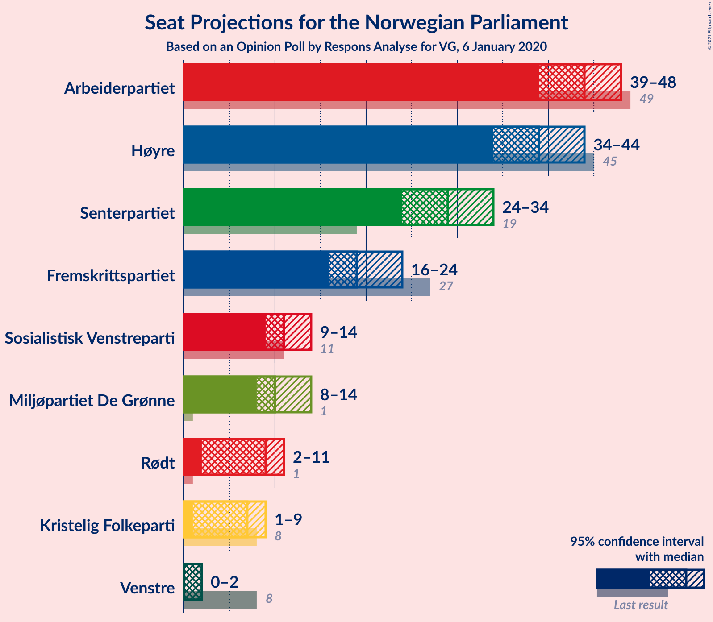
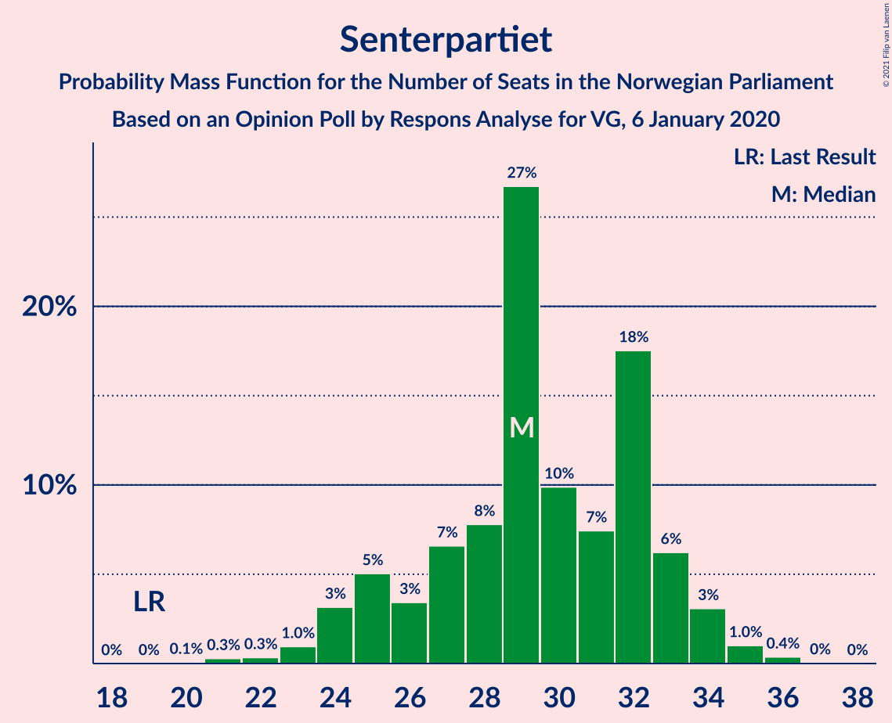
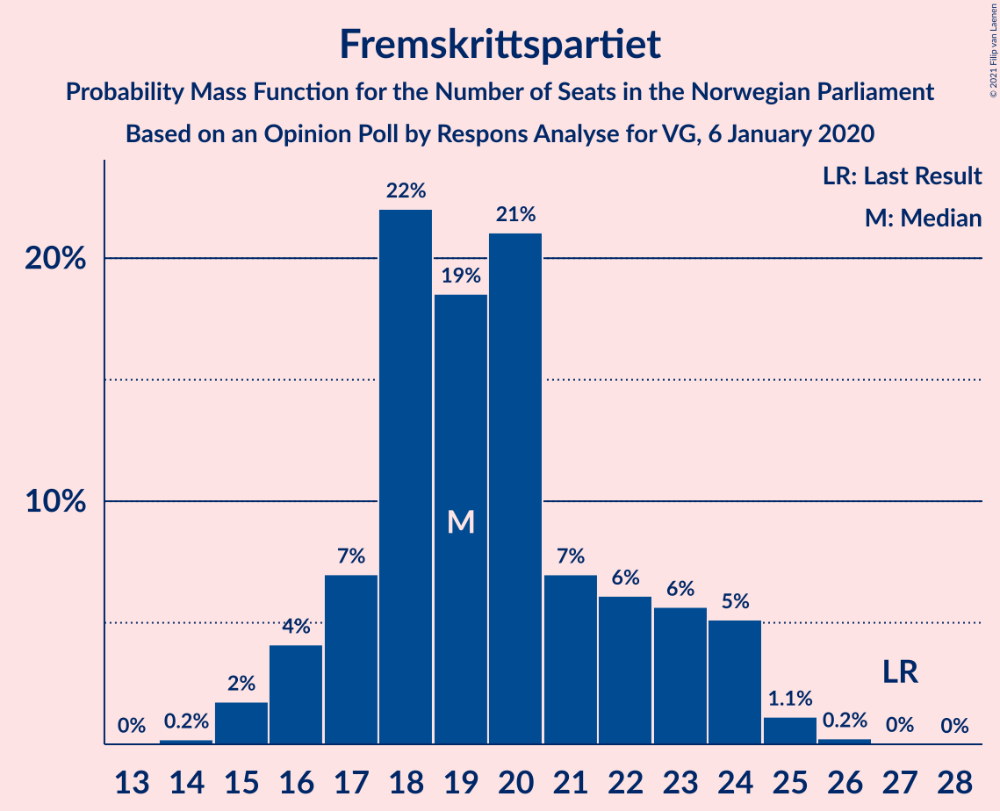
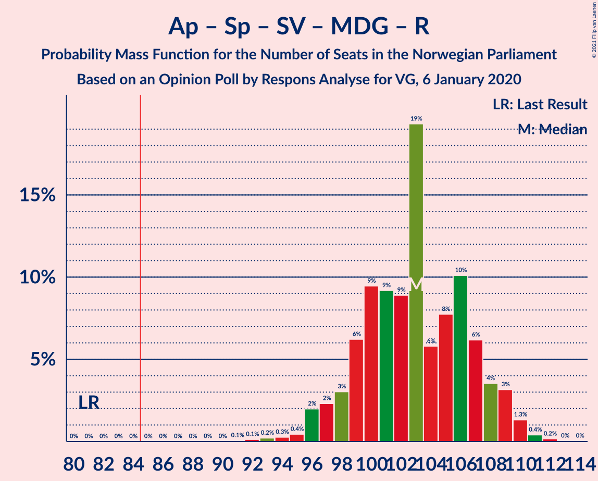
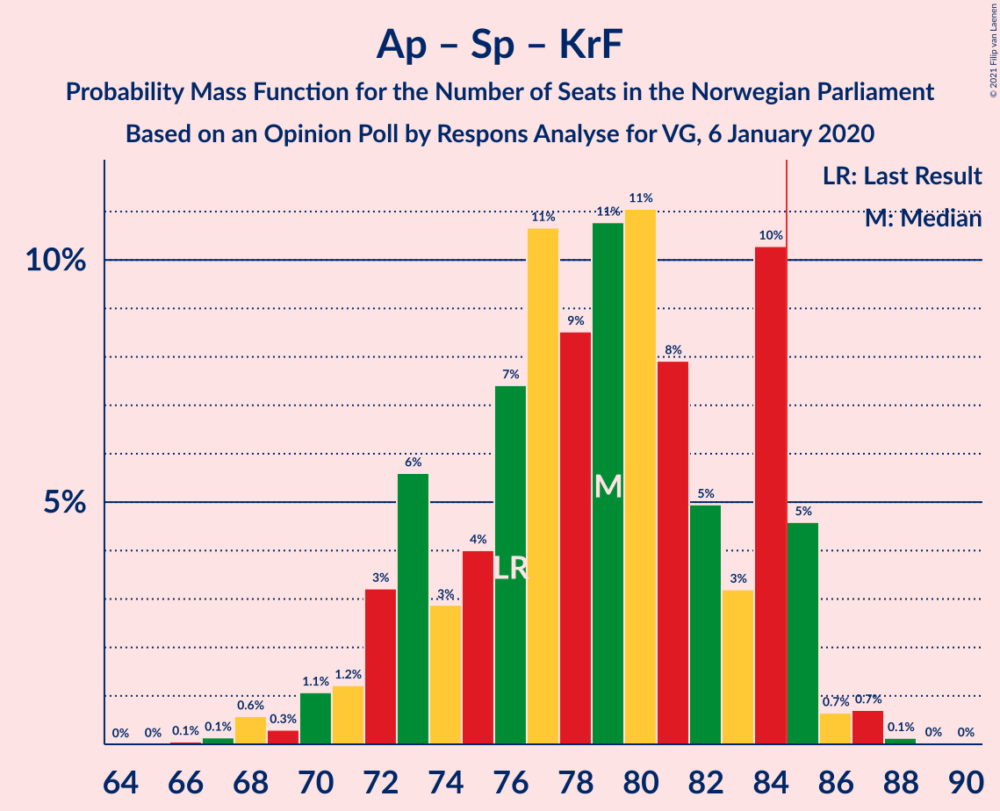

# Opinion Poll by Respons Analyse, 6 January 2020

<a href="#voting-intentions">Voting Intentions</a> | <a href="#seats">Seats</a> | <a href="#coalitions">Coalitions</a> | <a href="#technical-information">Technical Information</a>

## Voting Intentions

### Confidence Intervals

| Party | Last Result | Poll Result | 80% Confidence Interval | 90% Confidence Interval | 95% Confidence Interval | 99% Confidence Interval |
|:-----:|:-----------:|:-----------:|:-----------------------:|:-----------------------:|:-----------------------:|:-----------------------:|
| Arbeiderpartiet | 27.4% | 24.0% | 22.3–25.8% |21.8–26.3% |21.4–26.7% |20.7–27.6% |
| Høyre | 25.0% | 22.4% | 20.7–24.1% |20.3–24.6% |19.9–25.1% |19.1–25.9% |
| Senterpartiet | 10.3% | 15.8% | 14.4–17.3% |14.0–17.8% |13.7–18.2% |13.0–19.0% |
| Fremskrittspartiet | 15.2% | 11.4% | 10.2–12.8% |9.8–13.2% |9.6–13.5% |9.0–14.2% |
| Sosialistisk Venstreparti | 6.0% | 6.6% | 5.7–7.7% |5.4–8.0% |5.2–8.3% |4.8–8.9% |
| Miljøpartiet De Grønne | 3.2% | 6.1% | 5.2–7.2% |5.0–7.5% |4.8–7.8% |4.4–8.3% |
| Rødt | 2.4% | 5.1% | 4.3–6.1% |4.1–6.4% |3.9–6.6% |3.6–7.2% |
| Kristelig Folkeparti | 4.2% | 4.2% | 3.5–5.1% |3.3–5.4% |3.1–5.6% |2.8–6.1% |
| Venstre | 4.4% | 2.5% | 2.0–3.3% |1.8–3.5% |1.7–3.7% |1.5–4.1% |

*Note:* The poll result column reflects the actual value used in the calculations. Published results may vary slightly, and in addition be rounded to fewer digits.

## Seats

### Confidence Intervals

| Party | Last Result | Median | 80% Confidence Interval | 90% Confidence Interval | 95% Confidence Interval | 99% Confidence Interval |
|:-----:|:-----------:|:------:|:-----------------------:|:-----------------------:|:-----------------------:|:-----------------------:|
| <a href="#arbeiderpartiet">Arbeiderpartiet</a> | 49 | 41 | 38–50 |38–50 |38–50 |36–51 |
| <a href="#høyre">Høyre</a> | 45 | 38 | 34–42 |34–42 |33–44 |32–45 |
| <a href="#senterpartiet">Senterpartiet</a> | 19 | 31 | 26–33 |24–35 |23–36 |20–36 |
| <a href="#fremskrittspartiet">Fremskrittspartiet</a> | 27 | 20 | 17–24 |17–25 |17–25 |15–26 |
| <a href="#sosialistisk-venstreparti">Sosialistisk Venstreparti</a> | 11 | 12 | 10–14 |9–15 |9–16 |8–17 |
| <a href="#miljøpartiet-de-grønne">Miljøpartiet De Grønne</a> | 1 | 10 | 9–13 |9–13 |8–13 |8–14 |
| <a href="#rødt">Rødt</a> | 1 | 10 | 8–11 |8–11 |7–11 |2–12 |
| <a href="#kristelig-folkeparti">Kristelig Folkeparti</a> | 8 | 3 | 1–8 |1–8 |1–9 |1–10 |
| <a href="#venstre">Venstre</a> | 8 | 2 | 0–2 |0–2 |0–2 |0–2 |

### Arbeiderpartiet

*For a full overview of the results for this party, see the [Arbeiderpartiet](party-arbeiderpartiet.html) page.*

| Number of Seats | Probability | Accumulated | Special Marks |
|:---------------:|:-----------:|:-----------:|:-------------:|
| 35 | 0% | 100% |  |
| 36 | 0.5% | 99.9% |  |
| 37 | 0.1% | 99.4% |  |
| 38 | 18% | 99.3% |  |
| 39 | 4% | 81% |  |
| 40 | 24% | 76% |  |
| 41 | 3% | 52% | Median |
| 42 | 20% | 50% |  |
| 43 | 6% | 30% |  |
| 44 | 2% | 24% |  |
| 45 | 3% | 22% |  |
| 46 | 3% | 19% |  |
| 47 | 4% | 16% |  |
| 48 | 0.2% | 12% |  |
| 49 | 0.2% | 12% | Last Result |
| 50 | 11% | 12% |  |
| 51 | 0.3% | 0.5% |  |
| 52 | 0% | 0.2% |  |
| 53 | 0.1% | 0.2% |  |
| 54 | 0.1% | 0.1% |  |
| 55 | 0% | 0% |  |

### Høyre

*For a full overview of the results for this party, see the [Høyre](party-høyre.html) page.*

| Number of Seats | Probability | Accumulated | Special Marks |
|:---------------:|:-----------:|:-----------:|:-------------:|
| 31 | 0.1% | 100% |  |
| 32 | 0.9% | 99.8% |  |
| 33 | 2% | 99.0% |  |
| 34 | 9% | 97% |  |
| 35 | 1.2% | 89% |  |
| 36 | 12% | 88% |  |
| 37 | 3% | 76% |  |
| 38 | 34% | 73% | Median |
| 39 | 7% | 39% |  |
| 40 | 1.4% | 32% |  |
| 41 | 19% | 31% |  |
| 42 | 9% | 12% |  |
| 43 | 0.4% | 3% |  |
| 44 | 2% | 3% |  |
| 45 | 0.7% | 0.9% | Last Result |
| 46 | 0.1% | 0.2% |  |
| 47 | 0.1% | 0.1% |  |
| 48 | 0% | 0% |  |

### Senterpartiet

*For a full overview of the results for this party, see the [Senterpartiet](party-senterpartiet.html) page.*

| Number of Seats | Probability | Accumulated | Special Marks |
|:---------------:|:-----------:|:-----------:|:-------------:|
| 19 | 0% | 100% | Last Result |
| 20 | 1.2% | 100% |  |
| 21 | 0% | 98.8% |  |
| 22 | 0.2% | 98.7% |  |
| 23 | 2% | 98.6% |  |
| 24 | 3% | 97% |  |
| 25 | 0.7% | 93% |  |
| 26 | 4% | 93% |  |
| 27 | 27% | 88% |  |
| 28 | 7% | 62% |  |
| 29 | 3% | 54% |  |
| 30 | 1.0% | 52% |  |
| 31 | 11% | 51% | Median |
| 32 | 16% | 40% |  |
| 33 | 17% | 24% |  |
| 34 | 2% | 7% |  |
| 35 | 1.4% | 6% |  |
| 36 | 4% | 4% |  |
| 37 | 0.1% | 0.1% |  |
| 38 | 0% | 0% |  |

### Fremskrittspartiet

*For a full overview of the results for this party, see the [Fremskrittspartiet](party-fremskrittspartiet.html) page.*

| Number of Seats | Probability | Accumulated | Special Marks |
|:---------------:|:-----------:|:-----------:|:-------------:|
| 14 | 0.4% | 100% |  |
| 15 | 0.6% | 99.6% |  |
| 16 | 1.0% | 99.0% |  |
| 17 | 10% | 98% |  |
| 18 | 2% | 88% |  |
| 19 | 24% | 86% |  |
| 20 | 38% | 62% | Median |
| 21 | 3% | 24% |  |
| 22 | 8% | 21% |  |
| 23 | 2% | 14% |  |
| 24 | 2% | 11% |  |
| 25 | 7% | 9% |  |
| 26 | 1.3% | 1.3% |  |
| 27 | 0% | 0% | Last Result |

### Sosialistisk Venstreparti

*For a full overview of the results for this party, see the [Sosialistisk Venstreparti](party-sosialistiskvenstreparti.html) page.*

| Number of Seats | Probability | Accumulated | Special Marks |
|:---------------:|:-----------:|:-----------:|:-------------:|
| 7 | 0.1% | 100% |  |
| 8 | 0.6% | 99.9% |  |
| 9 | 7% | 99.3% |  |
| 10 | 13% | 92% |  |
| 11 | 12% | 79% | Last Result |
| 12 | 18% | 68% | Median |
| 13 | 19% | 50% |  |
| 14 | 24% | 30% |  |
| 15 | 3% | 6% |  |
| 16 | 1.3% | 4% |  |
| 17 | 2% | 2% |  |
| 18 | 0% | 0% |  |

### Miljøpartiet De Grønne

*For a full overview of the results for this party, see the [Miljøpartiet De Grønne](party-miljøpartietdegrønne.html) page.*

| Number of Seats | Probability | Accumulated | Special Marks |
|:---------------:|:-----------:|:-----------:|:-------------:|
| 1 | 0% | 100% | Last Result |
| 2 | 0% | 100% |  |
| 3 | 0% | 100% |  |
| 4 | 0% | 100% |  |
| 5 | 0% | 100% |  |
| 6 | 0% | 100% |  |
| 7 | 0.4% | 100% |  |
| 8 | 3% | 99.6% |  |
| 9 | 15% | 97% |  |
| 10 | 35% | 82% | Median |
| 11 | 18% | 47% |  |
| 12 | 8% | 29% |  |
| 13 | 20% | 21% |  |
| 14 | 0.9% | 1.2% |  |
| 15 | 0.2% | 0.3% |  |
| 16 | 0.1% | 0.1% |  |
| 17 | 0% | 0% |  |

### Rødt

*For a full overview of the results for this party, see the [Rødt](party-rødt.html) page.*

| Number of Seats | Probability | Accumulated | Special Marks |
|:---------------:|:-----------:|:-----------:|:-------------:|
| 1 | 0% | 100% | Last Result |
| 2 | 2% | 100% |  |
| 3 | 0% | 98% |  |
| 4 | 0% | 98% |  |
| 5 | 0% | 98% |  |
| 6 | 0.1% | 98% |  |
| 7 | 2% | 98% |  |
| 8 | 15% | 96% |  |
| 9 | 20% | 81% |  |
| 10 | 47% | 61% | Median |
| 11 | 11% | 14% |  |
| 12 | 2% | 2% |  |
| 13 | 0.2% | 0.4% |  |
| 14 | 0.1% | 0.2% |  |
| 15 | 0.1% | 0.1% |  |
| 16 | 0% | 0% |  |

### Kristelig Folkeparti

*For a full overview of the results for this party, see the [Kristelig Folkeparti](party-kristeligfolkeparti.html) page.*

| Number of Seats | Probability | Accumulated | Special Marks |
|:---------------:|:-----------:|:-----------:|:-------------:|
| 1 | 16% | 100% |  |
| 2 | 23% | 84% |  |
| 3 | 12% | 61% | Median |
| 4 | 0% | 50% |  |
| 5 | 0% | 50% |  |
| 6 | 0% | 50% |  |
| 7 | 20% | 50% |  |
| 8 | 26% | 30% | Last Result |
| 9 | 2% | 4% |  |
| 10 | 2% | 2% |  |
| 11 | 0.1% | 0.2% |  |
| 12 | 0% | 0% |  |

### Venstre

*For a full overview of the results for this party, see the [Venstre](party-venstre.html) page.*

| Number of Seats | Probability | Accumulated | Special Marks |
|:---------------:|:-----------:|:-----------:|:-------------:|
| 0 | 15% | 100% |  |
| 1 | 35% | 85% |  |
| 2 | 50% | 51% | Median |
| 3 | 0% | 0.3% |  |
| 4 | 0% | 0.3% |  |
| 5 | 0% | 0.3% |  |
| 6 | 0% | 0.3% |  |
| 7 | 0.2% | 0.3% |  |
| 8 | 0.1% | 0.1% | Last Result |
| 9 | 0% | 0% |  |

## Coalitions

### Confidence Intervals

| Coalition | Last Result | Median | Majority? | 80% Confidence Interval | 90% Confidence Interval | 95% Confidence Interval | 99% Confidence Interval |
|:---------:|:-----------:|:------:|:---------:|:-----------------------:|:-----------------------:|:-----------------------:|:-----------------------:|
| Arbeiderpartiet – Senterpartiet – Sosialistisk Venstreparti – Miljøpartiet De Grønne – Rødt | 81 | 105 | 100% | 101–107 | 99–107 | 97–107 | 93–111 |
| Arbeiderpartiet – Senterpartiet – Sosialistisk Venstreparti – Miljøpartiet De Grønne – Kristelig Folkeparti | 88 | 99 | 100% | 96–104 | 94–104 | 94–107 | 91–111 |
| Høyre – Senterpartiet – Fremskrittspartiet – Kristelig Folkeparti – Venstre | 107 | 95 | 99.9% | 92–98 | 91–99 | 91–101 | 87–104 |
| Arbeiderpartiet – Senterpartiet – Sosialistisk Venstreparti – Miljøpartiet De Grønne | 80 | 96 | 99.3% | 91–97 | 88–98 | 87–99 | 84–103 |
| Arbeiderpartiet – Senterpartiet – Sosialistisk Venstreparti – Rødt | 80 | 94 | 99.0% | 88–96 | 87–96 | 86–97 | 83–100 |
| Arbeiderpartiet – Senterpartiet – Miljøpartiet De Grønne – Kristelig Folkeparti | 77 | 87 | 73% | 83–94 | 81–94 | 80–96 | 79–99 |
| Arbeiderpartiet – Senterpartiet – Sosialistisk Venstreparti | 79 | 84 | 39% | 80–87 | 78–87 | 75–88 | 74–92 |
| Arbeiderpartiet – Senterpartiet – Kristelig Folkeparti | 76 | 76 | 14% | 71–85 | 71–85 | 68–86 | 67–89 |
| Høyre – Fremskrittspartiet – Miljøpartiet De Grønne – Kristelig Folkeparti – Venstre | 89 | 75 | 1.0% | 73–81 | 73–82 | 72–83 | 69–86 |
| Arbeiderpartiet – Senterpartiet | 68 | 72 | 0% | 68–77 | 64–77 | 64–79 | 63–81 |
| Høyre – Fremskrittspartiet – Kristelig Folkeparti – Venstre | 88 | 64 | 0% | 62–68 | 62–70 | 62–72 | 58–76 |
| Høyre – Fremskrittspartiet – Venstre | 80 | 60 | 0% | 56–63 | 56–66 | 54–66 | 51–69 |
| Høyre – Fremskrittspartiet | 72 | 58 | 0% | 55–62 | 55–64 | 52–64 | 50–68 |
| Arbeiderpartiet – Sosialistisk Venstreparti | 60 | 54 | 0% | 51–60 | 51–60 | 51–60 | 46–62 |
| Høyre – Kristelig Folkeparti – Venstre | 61 | 44 | 0% | 42–47 | 42–50 | 40–52 | 39–54 |
| Senterpartiet – Kristelig Folkeparti – Venstre | 35 | 36 | 0% | 31–39 | 30–40 | 29–43 | 28–46 |

### Arbeiderpartiet – Senterpartiet – Sosialistisk Venstreparti – Miljøpartiet De Grønne – Rødt

| Number of Seats | Probability | Accumulated | Special Marks |
|:---------------:|:-----------:|:-----------:|:-------------:|
| 81 | 0% | 100% | Last Result |
| 82 | 0% | 100% |  |
| 83 | 0% | 100% |  |
| 84 | 0% | 100% |  |
| 85 | 0% | 100% | Majority |
| 86 | 0% | 100% |  |
| 87 | 0% | 100% |  |
| 88 | 0% | 100% |  |
| 89 | 0% | 100% |  |
| 90 | 0% | 100% |  |
| 91 | 0.1% | 100% |  |
| 92 | 0% | 99.8% |  |
| 93 | 0.5% | 99.8% |  |
| 94 | 0.1% | 99.3% |  |
| 95 | 1.0% | 99.2% |  |
| 96 | 0.7% | 98% |  |
| 97 | 2% | 98% |  |
| 98 | 0.1% | 95% |  |
| 99 | 3% | 95% |  |
| 100 | 2% | 93% |  |
| 101 | 8% | 90% |  |
| 102 | 2% | 83% |  |
| 103 | 15% | 80% |  |
| 104 | 15% | 65% | Median |
| 105 | 2% | 51% |  |
| 106 | 24% | 49% |  |
| 107 | 22% | 24% |  |
| 108 | 0.7% | 2% |  |
| 109 | 0.2% | 1.3% |  |
| 110 | 0.3% | 1.1% |  |
| 111 | 0.6% | 0.8% |  |
| 112 | 0.1% | 0.3% |  |
| 113 | 0% | 0.1% |  |
| 114 | 0.1% | 0.1% |  |
| 115 | 0% | 0% |  |

### Arbeiderpartiet – Senterpartiet – Sosialistisk Venstreparti – Miljøpartiet De Grønne – Kristelig Folkeparti

| Number of Seats | Probability | Accumulated | Special Marks |
|:---------------:|:-----------:|:-----------:|:-------------:|
| 88 | 0% | 100% | Last Result |
| 89 | 0% | 100% |  |
| 90 | 0.2% | 100% |  |
| 91 | 0.5% | 99.8% |  |
| 92 | 0.1% | 99.3% |  |
| 93 | 1.2% | 99.2% |  |
| 94 | 5% | 98% |  |
| 95 | 0.7% | 93% |  |
| 96 | 5% | 93% |  |
| 97 | 22% | 87% | Median |
| 98 | 0.4% | 66% |  |
| 99 | 23% | 65% |  |
| 100 | 1.5% | 42% |  |
| 101 | 13% | 41% |  |
| 102 | 11% | 28% |  |
| 103 | 0.3% | 17% |  |
| 104 | 12% | 16% |  |
| 105 | 1.1% | 5% |  |
| 106 | 0.7% | 4% |  |
| 107 | 0.7% | 3% |  |
| 108 | 1.4% | 2% |  |
| 109 | 0.2% | 0.7% |  |
| 110 | 0% | 0.5% |  |
| 111 | 0.1% | 0.5% |  |
| 112 | 0.4% | 0.4% |  |
| 113 | 0% | 0% |  |

### Høyre – Senterpartiet – Fremskrittspartiet – Kristelig Folkeparti – Venstre

| Number of Seats | Probability | Accumulated | Special Marks |
|:---------------:|:-----------:|:-----------:|:-------------:|
| 84 | 0% | 100% |  |
| 85 | 0.1% | 99.9% | Majority |
| 86 | 0.2% | 99.9% |  |
| 87 | 0.1% | 99.6% |  |
| 88 | 0.3% | 99.5% |  |
| 89 | 0.3% | 99.2% |  |
| 90 | 0.8% | 99.0% |  |
| 91 | 4% | 98% |  |
| 92 | 13% | 95% |  |
| 93 | 15% | 82% |  |
| 94 | 17% | 67% | Median |
| 95 | 37% | 50% |  |
| 96 | 2% | 13% |  |
| 97 | 0.4% | 11% |  |
| 98 | 6% | 11% |  |
| 99 | 1.3% | 5% |  |
| 100 | 0.7% | 4% |  |
| 101 | 0.9% | 3% |  |
| 102 | 1.4% | 2% |  |
| 103 | 0.1% | 1.0% |  |
| 104 | 0.8% | 0.9% |  |
| 105 | 0% | 0% |  |
| 106 | 0% | 0% |  |
| 107 | 0% | 0% | Last Result |

### Arbeiderpartiet – Senterpartiet – Sosialistisk Venstreparti – Miljøpartiet De Grønne

| Number of Seats | Probability | Accumulated | Special Marks |
|:---------------:|:-----------:|:-----------:|:-------------:|
| 80 | 0% | 100% | Last Result |
| 81 | 0% | 100% |  |
| 82 | 0% | 100% |  |
| 83 | 0.2% | 100% |  |
| 84 | 0.5% | 99.8% |  |
| 85 | 0.3% | 99.3% | Majority |
| 86 | 0.1% | 99.1% |  |
| 87 | 2% | 99.0% |  |
| 88 | 2% | 97% |  |
| 89 | 0.7% | 94% |  |
| 90 | 0.6% | 94% |  |
| 91 | 3% | 93% |  |
| 92 | 6% | 90% |  |
| 93 | 10% | 83% |  |
| 94 | 9% | 73% | Median |
| 95 | 10% | 64% |  |
| 96 | 27% | 53% |  |
| 97 | 18% | 26% |  |
| 98 | 6% | 8% |  |
| 99 | 0.5% | 3% |  |
| 100 | 0.7% | 2% |  |
| 101 | 0.4% | 1.3% |  |
| 102 | 0.2% | 1.0% |  |
| 103 | 0.4% | 0.7% |  |
| 104 | 0.2% | 0.3% |  |
| 105 | 0.1% | 0.1% |  |
| 106 | 0% | 0% |  |

### Arbeiderpartiet – Senterpartiet – Sosialistisk Venstreparti – Rødt

| Number of Seats | Probability | Accumulated | Special Marks |
|:---------------:|:-----------:|:-----------:|:-------------:|
| 80 | 0% | 100% | Last Result |
| 81 | 0% | 99.9% |  |
| 82 | 0% | 99.9% |  |
| 83 | 0.7% | 99.9% |  |
| 84 | 0.1% | 99.2% |  |
| 85 | 0.1% | 99.0% | Majority |
| 86 | 3% | 98.9% |  |
| 87 | 3% | 96% |  |
| 88 | 4% | 94% |  |
| 89 | 0.6% | 90% |  |
| 90 | 1.4% | 89% |  |
| 91 | 7% | 88% |  |
| 92 | 6% | 81% |  |
| 93 | 10% | 74% |  |
| 94 | 19% | 64% | Median |
| 95 | 21% | 45% |  |
| 96 | 21% | 24% |  |
| 97 | 0.5% | 3% |  |
| 98 | 0.8% | 2% |  |
| 99 | 0.1% | 1.3% |  |
| 100 | 0.8% | 1.2% |  |
| 101 | 0.1% | 0.4% |  |
| 102 | 0.3% | 0.3% |  |
| 103 | 0% | 0% |  |

### Arbeiderpartiet – Senterpartiet – Miljøpartiet De Grønne – Kristelig Folkeparti

| Number of Seats | Probability | Accumulated | Special Marks |
|:---------------:|:-----------:|:-----------:|:-------------:|
| 77 | 0% | 100% | Last Result |
| 78 | 0% | 99.9% |  |
| 79 | 2% | 99.9% |  |
| 80 | 2% | 98% |  |
| 81 | 4% | 95% |  |
| 82 | 0.2% | 91% |  |
| 83 | 16% | 91% |  |
| 84 | 2% | 75% |  |
| 85 | 4% | 73% | Median, Majority |
| 86 | 18% | 69% |  |
| 87 | 18% | 52% |  |
| 88 | 2% | 34% |  |
| 89 | 5% | 32% |  |
| 90 | 0.2% | 27% |  |
| 91 | 9% | 27% |  |
| 92 | 0.5% | 18% |  |
| 93 | 2% | 17% |  |
| 94 | 12% | 15% |  |
| 95 | 0.6% | 3% |  |
| 96 | 0.4% | 3% |  |
| 97 | 0.5% | 2% |  |
| 98 | 0.1% | 2% |  |
| 99 | 2% | 2% |  |
| 100 | 0.1% | 0.3% |  |
| 101 | 0% | 0.2% |  |
| 102 | 0.2% | 0.2% |  |
| 103 | 0% | 0% |  |

### Arbeiderpartiet – Senterpartiet – Sosialistisk Venstreparti

| Number of Seats | Probability | Accumulated | Special Marks |
|:---------------:|:-----------:|:-----------:|:-------------:|
| 74 | 0.5% | 100% |  |
| 75 | 2% | 99.5% |  |
| 76 | 0.4% | 97% |  |
| 77 | 1.5% | 97% |  |
| 78 | 2% | 96% |  |
| 79 | 3% | 94% | Last Result |
| 80 | 0.7% | 91% |  |
| 81 | 2% | 90% |  |
| 82 | 10% | 88% |  |
| 83 | 11% | 78% |  |
| 84 | 28% | 67% | Median |
| 85 | 3% | 39% | Majority |
| 86 | 16% | 36% |  |
| 87 | 16% | 20% |  |
| 88 | 2% | 4% |  |
| 89 | 0.4% | 2% |  |
| 90 | 0.3% | 2% |  |
| 91 | 0.5% | 1.5% |  |
| 92 | 0.8% | 1.0% |  |
| 93 | 0.1% | 0.2% |  |
| 94 | 0% | 0.1% |  |
| 95 | 0% | 0% |  |

### Arbeiderpartiet – Senterpartiet – Kristelig Folkeparti

| Number of Seats | Probability | Accumulated | Special Marks |
|:---------------:|:-----------:|:-----------:|:-------------:|
| 67 | 2% | 100% |  |
| 68 | 1.1% | 98% |  |
| 69 | 1.2% | 97% |  |
| 70 | 0.1% | 95% |  |
| 71 | 6% | 95% |  |
| 72 | 0.3% | 89% |  |
| 73 | 31% | 89% |  |
| 74 | 2% | 57% |  |
| 75 | 4% | 55% | Median |
| 76 | 2% | 51% | Last Result |
| 77 | 16% | 49% |  |
| 78 | 5% | 33% |  |
| 79 | 1.0% | 28% |  |
| 80 | 9% | 27% |  |
| 81 | 0.2% | 18% |  |
| 82 | 2% | 18% |  |
| 83 | 0.7% | 15% |  |
| 84 | 0.3% | 15% |  |
| 85 | 11% | 14% | Majority |
| 86 | 0.7% | 3% |  |
| 87 | 0.3% | 2% |  |
| 88 | 0.6% | 2% |  |
| 89 | 1.3% | 2% |  |
| 90 | 0.2% | 0.2% |  |
| 91 | 0% | 0% |  |

### Høyre – Fremskrittspartiet – Miljøpartiet De Grønne – Kristelig Folkeparti – Venstre

| Number of Seats | Probability | Accumulated | Special Marks |
|:---------------:|:-----------:|:-----------:|:-------------:|
| 67 | 0.3% | 100% |  |
| 68 | 0.1% | 99.7% |  |
| 69 | 0.8% | 99.6% |  |
| 70 | 0.1% | 98.8% |  |
| 71 | 0.8% | 98.6% |  |
| 72 | 0.5% | 98% |  |
| 73 | 21% | 97% | Median |
| 74 | 21% | 76% |  |
| 75 | 19% | 55% |  |
| 76 | 10% | 36% |  |
| 77 | 6% | 26% |  |
| 78 | 7% | 19% |  |
| 79 | 1.4% | 12% |  |
| 80 | 0.6% | 11% |  |
| 81 | 4% | 10% |  |
| 82 | 3% | 6% |  |
| 83 | 3% | 4% |  |
| 84 | 0.1% | 1.1% |  |
| 85 | 0.1% | 1.0% | Majority |
| 86 | 0.7% | 0.8% |  |
| 87 | 0% | 0.1% |  |
| 88 | 0% | 0.1% |  |
| 89 | 0% | 0.1% | Last Result |
| 90 | 0% | 0% |  |

### Arbeiderpartiet – Senterpartiet

| Number of Seats | Probability | Accumulated | Special Marks |
|:---------------:|:-----------:|:-----------:|:-------------:|
| 62 | 0% | 100% |  |
| 63 | 2% | 99.9% |  |
| 64 | 4% | 98% |  |
| 65 | 0.2% | 94% |  |
| 66 | 3% | 94% |  |
| 67 | 0.4% | 91% |  |
| 68 | 3% | 91% | Last Result |
| 69 | 11% | 88% |  |
| 70 | 6% | 77% |  |
| 71 | 19% | 70% |  |
| 72 | 17% | 52% | Median |
| 73 | 12% | 35% |  |
| 74 | 3% | 23% |  |
| 75 | 4% | 20% |  |
| 76 | 0.5% | 16% |  |
| 77 | 12% | 15% |  |
| 78 | 0.4% | 4% |  |
| 79 | 2% | 3% |  |
| 80 | 0.5% | 1.2% |  |
| 81 | 0.6% | 0.7% |  |
| 82 | 0.1% | 0.1% |  |
| 83 | 0% | 0% |  |

### Høyre – Fremskrittspartiet – Kristelig Folkeparti – Venstre

| Number of Seats | Probability | Accumulated | Special Marks |
|:---------------:|:-----------:|:-----------:|:-------------:|
| 55 | 0.1% | 100% |  |
| 56 | 0% | 99.9% |  |
| 57 | 0.1% | 99.9% |  |
| 58 | 0.6% | 99.7% |  |
| 59 | 0.3% | 99.2% |  |
| 60 | 0.2% | 98.9% |  |
| 61 | 0.7% | 98.6% |  |
| 62 | 22% | 98% |  |
| 63 | 24% | 76% | Median |
| 64 | 2% | 51% |  |
| 65 | 15% | 49% |  |
| 66 | 15% | 35% |  |
| 67 | 2% | 20% |  |
| 68 | 8% | 17% |  |
| 69 | 2% | 10% |  |
| 70 | 3% | 7% |  |
| 71 | 0.1% | 5% |  |
| 72 | 2% | 5% |  |
| 73 | 0.7% | 2% |  |
| 74 | 1.0% | 2% |  |
| 75 | 0.1% | 0.8% |  |
| 76 | 0.5% | 0.7% |  |
| 77 | 0% | 0.2% |  |
| 78 | 0.1% | 0.2% |  |
| 79 | 0% | 0% |  |
| 80 | 0% | 0% |  |
| 81 | 0% | 0% |  |
| 82 | 0% | 0% |  |
| 83 | 0% | 0% |  |
| 84 | 0% | 0% |  |
| 85 | 0% | 0% | Majority |
| 86 | 0% | 0% |  |
| 87 | 0% | 0% |  |
| 88 | 0% | 0% | Last Result |

### Høyre – Fremskrittspartiet – Venstre

| Number of Seats | Probability | Accumulated | Special Marks |
|:---------------:|:-----------:|:-----------:|:-------------:|
| 49 | 0.3% | 100% |  |
| 50 | 0.1% | 99.7% |  |
| 51 | 0.2% | 99.6% |  |
| 52 | 0.3% | 99.4% |  |
| 53 | 0.2% | 99.2% |  |
| 54 | 2% | 98.9% |  |
| 55 | 0.6% | 97% |  |
| 56 | 9% | 96% |  |
| 57 | 11% | 88% |  |
| 58 | 11% | 76% |  |
| 59 | 5% | 65% |  |
| 60 | 20% | 60% | Median |
| 61 | 6% | 40% |  |
| 62 | 17% | 34% |  |
| 63 | 8% | 16% |  |
| 64 | 0.7% | 8% |  |
| 65 | 2% | 8% |  |
| 66 | 4% | 6% |  |
| 67 | 0.8% | 2% |  |
| 68 | 0.1% | 0.9% |  |
| 69 | 0.5% | 0.8% |  |
| 70 | 0% | 0.3% |  |
| 71 | 0.2% | 0.3% |  |
| 72 | 0% | 0.1% |  |
| 73 | 0% | 0.1% |  |
| 74 | 0% | 0% |  |
| 75 | 0% | 0% |  |
| 76 | 0% | 0% |  |
| 77 | 0% | 0% |  |
| 78 | 0% | 0% |  |
| 79 | 0% | 0% |  |
| 80 | 0% | 0% | Last Result |

### Høyre – Fremskrittspartiet

| Number of Seats | Probability | Accumulated | Special Marks |
|:---------------:|:-----------:|:-----------:|:-------------:|
| 47 | 0.2% | 100% |  |
| 48 | 0% | 99.8% |  |
| 49 | 0.2% | 99.7% |  |
| 50 | 0.1% | 99.5% |  |
| 51 | 0.3% | 99.4% |  |
| 52 | 2% | 99.1% |  |
| 53 | 0.4% | 97% |  |
| 54 | 0.6% | 97% |  |
| 55 | 9% | 97% |  |
| 56 | 12% | 87% |  |
| 57 | 1.0% | 76% |  |
| 58 | 33% | 75% | Median |
| 59 | 6% | 42% |  |
| 60 | 17% | 36% |  |
| 61 | 6% | 19% |  |
| 62 | 4% | 13% |  |
| 63 | 3% | 9% |  |
| 64 | 4% | 6% |  |
| 65 | 0.5% | 2% |  |
| 66 | 0.7% | 2% |  |
| 67 | 0.1% | 0.8% |  |
| 68 | 0.5% | 0.8% |  |
| 69 | 0.2% | 0.3% |  |
| 70 | 0.1% | 0.1% |  |
| 71 | 0% | 0.1% |  |
| 72 | 0.1% | 0.1% | Last Result |
| 73 | 0% | 0% |  |

### Arbeiderpartiet – Sosialistisk Venstreparti

| Number of Seats | Probability | Accumulated | Special Marks |
|:---------------:|:-----------:|:-----------:|:-------------:|
| 46 | 0.5% | 100% |  |
| 47 | 0.2% | 99.5% |  |
| 48 | 0.2% | 99.3% |  |
| 49 | 1.1% | 99.1% |  |
| 50 | 0.4% | 98% |  |
| 51 | 22% | 98% |  |
| 52 | 4% | 76% |  |
| 53 | 11% | 72% | Median |
| 54 | 19% | 61% |  |
| 55 | 11% | 42% |  |
| 56 | 13% | 32% |  |
| 57 | 5% | 19% |  |
| 58 | 1.0% | 14% |  |
| 59 | 0.8% | 13% |  |
| 60 | 11% | 12% | Last Result |
| 61 | 0.2% | 0.7% |  |
| 62 | 0.1% | 0.6% |  |
| 63 | 0.1% | 0.5% |  |
| 64 | 0.2% | 0.4% |  |
| 65 | 0.1% | 0.1% |  |
| 66 | 0% | 0% |  |

### Høyre – Kristelig Folkeparti – Venstre

| Number of Seats | Probability | Accumulated | Special Marks |
|:---------------:|:-----------:|:-----------:|:-------------:|
| 37 | 0.2% | 100% |  |
| 38 | 0% | 99.8% |  |
| 39 | 2% | 99.8% |  |
| 40 | 0.5% | 98% |  |
| 41 | 2% | 97% |  |
| 42 | 19% | 95% |  |
| 43 | 10% | 76% | Median |
| 44 | 17% | 66% |  |
| 45 | 14% | 49% |  |
| 46 | 24% | 35% |  |
| 47 | 2% | 12% |  |
| 48 | 2% | 9% |  |
| 49 | 1.2% | 7% |  |
| 50 | 2% | 6% |  |
| 51 | 0.6% | 4% |  |
| 52 | 0.9% | 3% |  |
| 53 | 1.4% | 2% |  |
| 54 | 0.7% | 0.8% |  |
| 55 | 0.1% | 0.2% |  |
| 56 | 0% | 0.1% |  |
| 57 | 0% | 0% |  |
| 58 | 0% | 0% |  |
| 59 | 0% | 0% |  |
| 60 | 0% | 0% |  |
| 61 | 0% | 0% | Last Result |

### Senterpartiet – Kristelig Folkeparti – Venstre

| Number of Seats | Probability | Accumulated | Special Marks |
|:---------------:|:-----------:|:-----------:|:-------------:|
| 26 | 0% | 100% |  |
| 27 | 0.1% | 99.9% |  |
| 28 | 0.8% | 99.9% |  |
| 29 | 3% | 99.1% |  |
| 30 | 4% | 96% |  |
| 31 | 2% | 92% |  |
| 32 | 5% | 90% |  |
| 33 | 2% | 85% |  |
| 34 | 0.8% | 83% |  |
| 35 | 24% | 82% | Last Result |
| 36 | 21% | 58% | Median |
| 37 | 18% | 38% |  |
| 38 | 2% | 20% |  |
| 39 | 10% | 19% |  |
| 40 | 5% | 9% |  |
| 41 | 0.3% | 3% |  |
| 42 | 0.2% | 3% |  |
| 43 | 0.3% | 3% |  |
| 44 | 0.7% | 2% |  |
| 45 | 0.3% | 2% |  |
| 46 | 1.4% | 1.4% |  |
| 47 | 0% | 0% |  |

## Technical Information

### Opinion Poll

+ **Polling firm:** Respons Analyse
+ **Commissioner(s):** —
+ **Fieldwork period:** 6 January 2020

### Calculations

+ **Sample size:** 1001
+ **Simulations done:** 32,768
+ **Error estimate:** 6.49%

