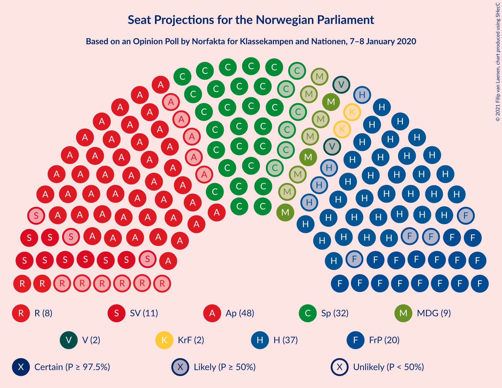
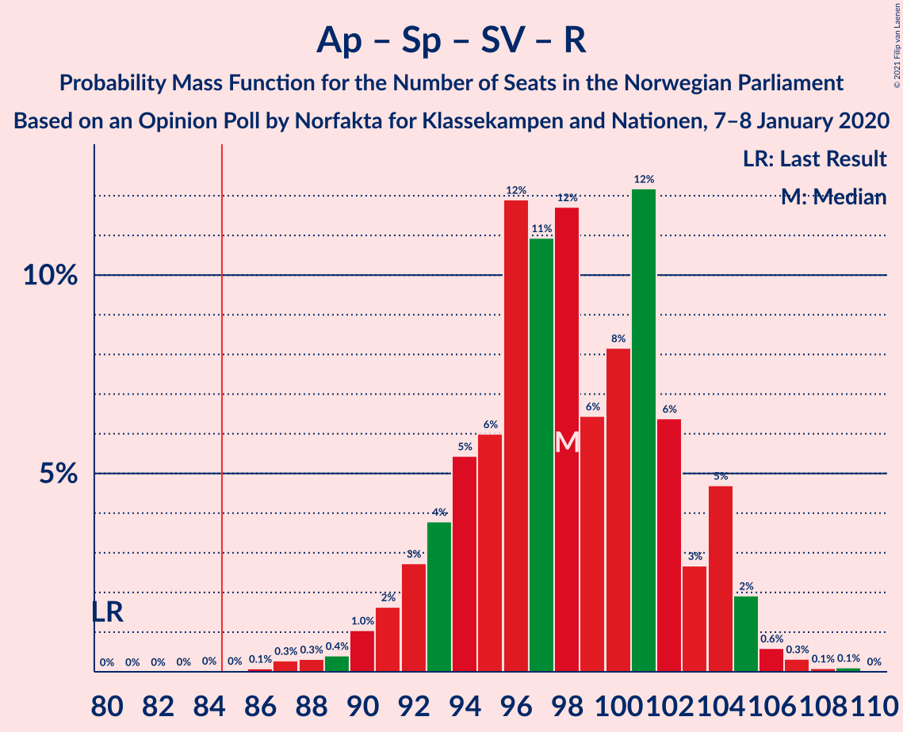
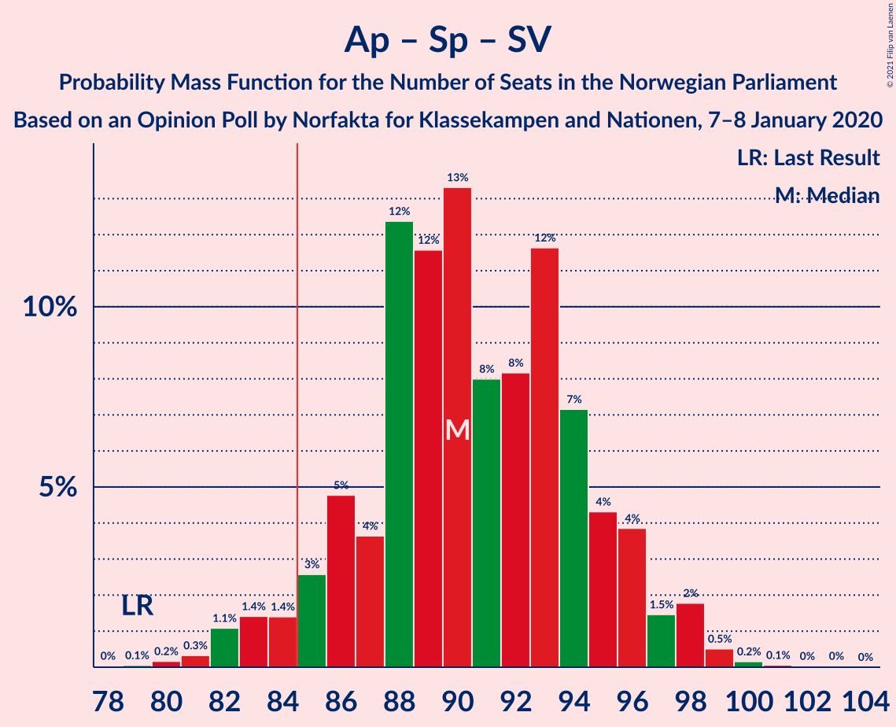
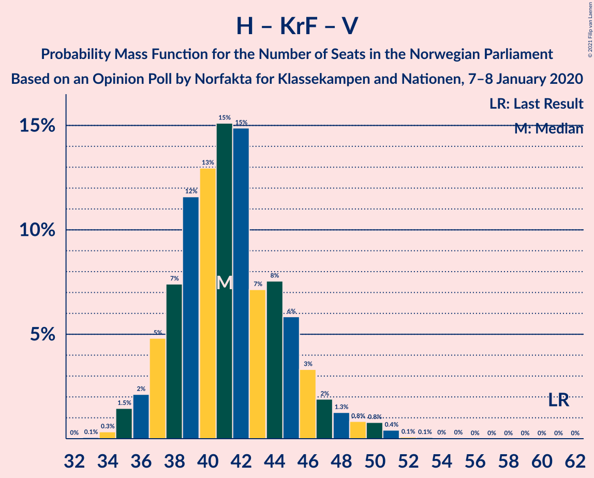

# Opinion Poll by Norfakta for Klassekampen and Nationen, 7–8 January 2020

<a href="#voting-intentions">Voting Intentions</a> | <a href="#seats">Seats</a> | <a href="#coalitions">Coalitions</a> | <a href="#technical-information">Technical Information</a>

## Voting Intentions

### Confidence Intervals

| Party | Last Result | Poll Result | 80% Confidence Interval | 90% Confidence Interval | 95% Confidence Interval | 99% Confidence Interval |
|:-----:|:-----------:|:-----------:|:-----------------------:|:-----------------------:|:-----------------------:|:-----------------------:|
| Arbeiderpartiet | 27.4% | 26.7% | 24.7–28.8% |24.2–29.4% |23.7–29.9% |22.8–30.9% |
| Høyre | 25.0% | 21.3% | 19.5–23.3% |19.0–23.8% |18.5–24.3% |17.7–25.3% |
| Senterpartiet | 10.3% | 16.5% | 14.9–18.4% |14.5–18.9% |14.1–19.3% |13.4–20.2% |
| Fremskrittspartiet | 15.2% | 10.9% | 9.6–12.5% |9.2–12.9% |8.9–13.3% |8.3–14.1% |
| Sosialistisk Venstreparti | 6.0% | 6.2% | 5.2–7.4% |4.9–7.8% |4.7–8.1% |4.2–8.7% |
| Miljøpartiet De Grønne | 3.2% | 5.3% | 4.4–6.4% |4.1–6.8% |3.9–7.1% |3.5–7.7% |
| Rødt | 2.4% | 4.7% | 3.9–5.9% |3.7–6.2% |3.5–6.5% |3.1–7.1% |
| Kristelig Folkeparti | 4.2% | 3.2% | 2.5–4.2% |2.3–4.5% |2.2–4.7% |1.9–5.2% |
| Venstre | 4.4% | 2.4% | 1.9–3.3% |1.7–3.6% |1.6–3.8% |1.3–4.2% |

*Note:* The poll result column reflects the actual value used in the calculations. Published results may vary slightly, and in addition be rounded to fewer digits.

## Seats

### Confidence Intervals

| Party | Last Result | Median | 80% Confidence Interval | 90% Confidence Interval | 95% Confidence Interval | 99% Confidence Interval |
|:-----:|:-----------:|:------:|:-----------------------:|:-----------------------:|:-----------------------:|:-----------------------:|
| <a href="#arbeiderpartiet">Arbeiderpartiet</a> | 49 | 48 | 45–53 |44–54 |43–56 |42–58 |
| <a href="#høyre">Høyre</a> | 45 | 37 | 34–40 |33–42 |33–43 |31–45 |
| <a href="#senterpartiet">Senterpartiet</a> | 19 | 32 | 27–34 |26–35 |26–36 |24–37 |
| <a href="#fremskrittspartiet">Fremskrittspartiet</a> | 27 | 20 | 17–23 |16–23 |16–24 |14–26 |
| <a href="#sosialistisk-venstreparti">Sosialistisk Venstreparti</a> | 11 | 11 | 9–13 |8–14 |8–14 |7–16 |
| <a href="#miljøpartiet-de-grønne">Miljøpartiet De Grønne</a> | 1 | 9 | 8–11 |7–12 |3–12 |2–13 |
| <a href="#rødt">Rødt</a> | 1 | 8 | 2–10 |2–11 |2–11 |2–12 |
| <a href="#kristelig-folkeparti">Kristelig Folkeparti</a> | 8 | 2 | 1–7 |1–7 |0–8 |0–9 |
| <a href="#venstre">Venstre</a> | 8 | 2 | 1–2 |0–2 |0–2 |0–7 |

### Arbeiderpartiet

*For a full overview of the results for this party, see the [Arbeiderpartiet](party-arbeiderpartiet.html) page.*

| Number of Seats | Probability | Accumulated | Special Marks |
|:---------------:|:-----------:|:-----------:|:-------------:|
| 39 | 0.1% | 100% |  |
| 40 | 0.1% | 99.9% |  |
| 41 | 0.3% | 99.8% |  |
| 42 | 0.6% | 99.6% |  |
| 43 | 2% | 99.0% |  |
| 44 | 7% | 97% |  |
| 45 | 10% | 90% |  |
| 46 | 12% | 80% |  |
| 47 | 10% | 68% |  |
| 48 | 18% | 58% | Median |
| 49 | 11% | 41% | Last Result |
| 50 | 6% | 30% |  |
| 51 | 9% | 23% |  |
| 52 | 4% | 15% |  |
| 53 | 4% | 11% |  |
| 54 | 2% | 6% |  |
| 55 | 1.0% | 4% |  |
| 56 | 1.1% | 3% |  |
| 57 | 1.0% | 2% |  |
| 58 | 0.5% | 0.5% |  |
| 59 | 0% | 0% |  |

### Høyre

*For a full overview of the results for this party, see the [Høyre](party-høyre.html) page.*

| Number of Seats | Probability | Accumulated | Special Marks |
|:---------------:|:-----------:|:-----------:|:-------------:|
| 29 | 0% | 100% |  |
| 30 | 0.1% | 99.9% |  |
| 31 | 0.6% | 99.9% |  |
| 32 | 1.3% | 99.2% |  |
| 33 | 3% | 98% |  |
| 34 | 9% | 95% |  |
| 35 | 10% | 86% |  |
| 36 | 15% | 76% |  |
| 37 | 17% | 61% | Median |
| 38 | 15% | 44% |  |
| 39 | 15% | 29% |  |
| 40 | 7% | 14% |  |
| 41 | 3% | 8% |  |
| 42 | 2% | 5% |  |
| 43 | 1.4% | 3% |  |
| 44 | 0.5% | 1.2% |  |
| 45 | 0.5% | 0.7% | Last Result |
| 46 | 0.1% | 0.2% |  |
| 47 | 0.1% | 0.1% |  |
| 48 | 0% | 0% |  |

### Senterpartiet

*For a full overview of the results for this party, see the [Senterpartiet](party-senterpartiet.html) page.*

| Number of Seats | Probability | Accumulated | Special Marks |
|:---------------:|:-----------:|:-----------:|:-------------:|
| 19 | 0% | 100% | Last Result |
| 20 | 0% | 100% |  |
| 21 | 0% | 100% |  |
| 22 | 0% | 100% |  |
| 23 | 0.2% | 99.9% |  |
| 24 | 0.4% | 99.7% |  |
| 25 | 2% | 99.3% |  |
| 26 | 4% | 98% |  |
| 27 | 5% | 94% |  |
| 28 | 9% | 89% |  |
| 29 | 11% | 80% |  |
| 30 | 9% | 69% |  |
| 31 | 5% | 60% |  |
| 32 | 10% | 55% | Median |
| 33 | 13% | 45% |  |
| 34 | 23% | 32% |  |
| 35 | 6% | 9% |  |
| 36 | 2% | 3% |  |
| 37 | 0.6% | 0.9% |  |
| 38 | 0.2% | 0.2% |  |
| 39 | 0.1% | 0.1% |  |
| 40 | 0% | 0% |  |

### Fremskrittspartiet

*For a full overview of the results for this party, see the [Fremskrittspartiet](party-fremskrittspartiet.html) page.*

| Number of Seats | Probability | Accumulated | Special Marks |
|:---------------:|:-----------:|:-----------:|:-------------:|
| 13 | 0.1% | 100% |  |
| 14 | 0.8% | 99.8% |  |
| 15 | 1.1% | 99.1% |  |
| 16 | 3% | 98% |  |
| 17 | 7% | 95% |  |
| 18 | 12% | 87% |  |
| 19 | 12% | 76% |  |
| 20 | 20% | 64% | Median |
| 21 | 17% | 44% |  |
| 22 | 17% | 28% |  |
| 23 | 6% | 10% |  |
| 24 | 3% | 5% |  |
| 25 | 1.0% | 2% |  |
| 26 | 0.5% | 0.6% |  |
| 27 | 0.1% | 0.1% | Last Result |
| 28 | 0% | 0% |  |

### Sosialistisk Venstreparti

*For a full overview of the results for this party, see the [Sosialistisk Venstreparti](party-sosialistiskvenstreparti.html) page.*

| Number of Seats | Probability | Accumulated | Special Marks |
|:---------------:|:-----------:|:-----------:|:-------------:|
| 2 | 0.2% | 100% |  |
| 3 | 0.1% | 99.8% |  |
| 4 | 0% | 99.7% |  |
| 5 | 0% | 99.7% |  |
| 6 | 0% | 99.7% |  |
| 7 | 0.8% | 99.7% |  |
| 8 | 4% | 98.9% |  |
| 9 | 14% | 94% |  |
| 10 | 22% | 81% |  |
| 11 | 27% | 59% | Last Result, Median |
| 12 | 15% | 32% |  |
| 13 | 10% | 18% |  |
| 14 | 6% | 8% |  |
| 15 | 1.3% | 2% |  |
| 16 | 0.4% | 0.6% |  |
| 17 | 0.1% | 0.1% |  |
| 18 | 0% | 0% |  |

### Miljøpartiet De Grønne

*For a full overview of the results for this party, see the [Miljøpartiet De Grønne](party-miljøpartietdegrønne.html) page.*

| Number of Seats | Probability | Accumulated | Special Marks |
|:---------------:|:-----------:|:-----------:|:-------------:|
| 1 | 0% | 100% | Last Result |
| 2 | 2% | 100% |  |
| 3 | 2% | 98% |  |
| 4 | 0.1% | 96% |  |
| 5 | 0% | 96% |  |
| 6 | 0.1% | 96% |  |
| 7 | 4% | 96% |  |
| 8 | 20% | 91% |  |
| 9 | 31% | 71% | Median |
| 10 | 21% | 40% |  |
| 11 | 11% | 19% |  |
| 12 | 6% | 8% |  |
| 13 | 2% | 2% |  |
| 14 | 0.3% | 0.3% |  |
| 15 | 0.1% | 0.1% |  |
| 16 | 0% | 0% |  |

### Rødt

*For a full overview of the results for this party, see the [Rødt](party-rødt.html) page.*

| Number of Seats | Probability | Accumulated | Special Marks |
|:---------------:|:-----------:|:-----------:|:-------------:|
| 1 | 0.1% | 100% | Last Result |
| 2 | 15% | 99.9% |  |
| 3 | 0.4% | 85% |  |
| 4 | 0% | 85% |  |
| 5 | 0% | 85% |  |
| 6 | 0.5% | 85% |  |
| 7 | 17% | 84% |  |
| 8 | 30% | 67% | Median |
| 9 | 19% | 37% |  |
| 10 | 10% | 19% |  |
| 11 | 6% | 8% |  |
| 12 | 2% | 2% |  |
| 13 | 0.2% | 0.3% |  |
| 14 | 0% | 0% |  |

### Kristelig Folkeparti

*For a full overview of the results for this party, see the [Kristelig Folkeparti](party-kristeligfolkeparti.html) page.*

| Number of Seats | Probability | Accumulated | Special Marks |
|:---------------:|:-----------:|:-----------:|:-------------:|
| 0 | 3% | 100% |  |
| 1 | 45% | 97% |  |
| 2 | 16% | 52% | Median |
| 3 | 24% | 36% |  |
| 4 | 0% | 12% |  |
| 5 | 0% | 12% |  |
| 6 | 0.5% | 12% |  |
| 7 | 9% | 12% |  |
| 8 | 3% | 3% | Last Result |
| 9 | 0.6% | 0.6% |  |
| 10 | 0.1% | 0.1% |  |
| 11 | 0% | 0% |  |

### Venstre

*For a full overview of the results for this party, see the [Venstre](party-venstre.html) page.*

| Number of Seats | Probability | Accumulated | Special Marks |
|:---------------:|:-----------:|:-----------:|:-------------:|
| 0 | 7% | 100% |  |
| 1 | 19% | 93% |  |
| 2 | 72% | 74% | Median |
| 3 | 0.4% | 2% |  |
| 4 | 0% | 2% |  |
| 5 | 0% | 2% |  |
| 6 | 0.1% | 2% |  |
| 7 | 1.2% | 2% |  |
| 8 | 0.3% | 0.3% | Last Result |
| 9 | 0% | 0% |  |

## Coalitions

### Confidence Intervals

| Coalition | Last Result | Median | Majority? | 80% Confidence Interval | 90% Confidence Interval | 95% Confidence Interval | 99% Confidence Interval |
|:---------:|:-----------:|:------:|:---------:|:-----------------------:|:-----------------------:|:-----------------------:|:-----------------------:|
| Arbeiderpartiet – Senterpartiet – Sosialistisk Venstreparti – Miljøpartiet De Grønne – Rødt | 81 | 107 | 100% | 103–112 | 101–113 | 100–114 | 96–116 |
| Arbeiderpartiet – Senterpartiet – Sosialistisk Venstreparti – Miljøpartiet De Grønne – Kristelig Folkeparti | 88 | 102 | 100% | 97–106 | 96–108 | 95–109 | 92–111 |
| Arbeiderpartiet – Senterpartiet – Sosialistisk Venstreparti – Miljøpartiet De Grønne | 80 | 100 | 100% | 95–104 | 94–106 | 92–107 | 90–109 |
| Arbeiderpartiet – Senterpartiet – Sosialistisk Venstreparti – Rødt | 80 | 98 | 99.9% | 93–103 | 92–104 | 91–105 | 88–107 |
| Høyre – Senterpartiet – Fremskrittspartiet – Kristelig Folkeparti – Venstre | 107 | 93 | 97% | 88–97 | 86–98 | 84–99 | 82–102 |
| Arbeiderpartiet – Senterpartiet – Miljøpartiet De Grønne – Kristelig Folkeparti | 77 | 91 | 97% | 87–96 | 86–97 | 84–98 | 82–100 |
| Arbeiderpartiet – Senterpartiet – Sosialistisk Venstreparti | 79 | 90 | 95% | 86–95 | 85–96 | 83–98 | 81–99 |
| Arbeiderpartiet – Senterpartiet – Kristelig Folkeparti | 76 | 82 | 26% | 78–86 | 77–88 | 75–89 | 73–90 |
| Arbeiderpartiet – Senterpartiet | 68 | 80 | 7% | 76–83 | 74–85 | 73–86 | 71–88 |
| Arbeiderpartiet – Sosialistisk Venstreparti – Miljøpartiet De Grønne – Rødt | 62 | 76 | 2% | 71–81 | 70–83 | 69–84 | 66–86 |
| Høyre – Fremskrittspartiet – Miljøpartiet De Grønne – Kristelig Folkeparti – Venstre | 89 | 71 | 0% | 65–75 | 65–77 | 64–78 | 60–81 |
| Høyre – Fremskrittspartiet – Kristelig Folkeparti – Venstre | 88 | 61 | 0% | 57–66 | 56–67 | 55–68 | 52–72 |
| Arbeiderpartiet – Sosialistisk Venstreparti | 60 | 59 | 0% | 55–63 | 54–65 | 53–67 | 52–69 |
| Høyre – Fremskrittspartiet – Venstre | 80 | 59 | 0% | 55–63 | 54–64 | 53–66 | 50–69 |
| Høyre – Fremskrittspartiet | 72 | 57 | 0% | 53–61 | 52–63 | 51–64 | 49–67 |
| Høyre – Kristelig Folkeparti – Venstre | 61 | 41 | 0% | 38–45 | 37–47 | 36–48 | 35–51 |
| Senterpartiet – Kristelig Folkeparti – Venstre | 35 | 36 | 0% | 31–39 | 30–41 | 29–43 | 27–45 |

### Arbeiderpartiet – Senterpartiet – Sosialistisk Venstreparti – Miljøpartiet De Grønne – Rødt

| Number of Seats | Probability | Accumulated | Special Marks |
|:---------------:|:-----------:|:-----------:|:-------------:|
| 81 | 0% | 100% | Last Result |
| 82 | 0% | 100% |  |
| 83 | 0% | 100% |  |
| 84 | 0% | 100% |  |
| 85 | 0% | 100% | Majority |
| 86 | 0% | 100% |  |
| 87 | 0% | 100% |  |
| 88 | 0% | 100% |  |
| 89 | 0% | 100% |  |
| 90 | 0% | 100% |  |
| 91 | 0% | 100% |  |
| 92 | 0% | 100% |  |
| 93 | 0% | 100% |  |
| 94 | 0% | 99.9% |  |
| 95 | 0.1% | 99.9% |  |
| 96 | 0.3% | 99.8% |  |
| 97 | 0.6% | 99.5% |  |
| 98 | 0.5% | 98.9% |  |
| 99 | 0.7% | 98% |  |
| 100 | 1.2% | 98% |  |
| 101 | 2% | 97% |  |
| 102 | 3% | 95% |  |
| 103 | 5% | 91% |  |
| 104 | 9% | 87% |  |
| 105 | 11% | 78% |  |
| 106 | 8% | 67% |  |
| 107 | 12% | 59% |  |
| 108 | 10% | 47% | Median |
| 109 | 10% | 37% |  |
| 110 | 12% | 28% |  |
| 111 | 5% | 16% |  |
| 112 | 4% | 11% |  |
| 113 | 5% | 7% |  |
| 114 | 1.5% | 3% |  |
| 115 | 0.8% | 1.4% |  |
| 116 | 0.4% | 0.5% |  |
| 117 | 0.1% | 0.1% |  |
| 118 | 0% | 0% |  |

### Arbeiderpartiet – Senterpartiet – Sosialistisk Venstreparti – Miljøpartiet De Grønne – Kristelig Folkeparti

| Number of Seats | Probability | Accumulated | Special Marks |
|:---------------:|:-----------:|:-----------:|:-------------:|
| 88 | 0% | 100% | Last Result |
| 89 | 0% | 100% |  |
| 90 | 0% | 100% |  |
| 91 | 0.2% | 99.9% |  |
| 92 | 0.3% | 99.8% |  |
| 93 | 0.2% | 99.4% |  |
| 94 | 0.7% | 99.2% |  |
| 95 | 1.2% | 98% |  |
| 96 | 3% | 97% |  |
| 97 | 4% | 94% |  |
| 98 | 9% | 90% |  |
| 99 | 7% | 81% |  |
| 100 | 11% | 75% |  |
| 101 | 12% | 64% |  |
| 102 | 4% | 51% | Median |
| 103 | 8% | 47% |  |
| 104 | 14% | 39% |  |
| 105 | 7% | 25% |  |
| 106 | 8% | 18% |  |
| 107 | 3% | 9% |  |
| 108 | 2% | 6% |  |
| 109 | 3% | 4% |  |
| 110 | 1.0% | 2% |  |
| 111 | 0.4% | 0.7% |  |
| 112 | 0.1% | 0.3% |  |
| 113 | 0.1% | 0.2% |  |
| 114 | 0.1% | 0.1% |  |
| 115 | 0% | 0% |  |

### Arbeiderpartiet – Senterpartiet – Sosialistisk Venstreparti – Miljøpartiet De Grønne

| Number of Seats | Probability | Accumulated | Special Marks |
|:---------------:|:-----------:|:-----------:|:-------------:|
| 80 | 0% | 100% | Last Result |
| 81 | 0% | 100% |  |
| 82 | 0% | 100% |  |
| 83 | 0% | 100% |  |
| 84 | 0% | 100% |  |
| 85 | 0% | 100% | Majority |
| 86 | 0% | 100% |  |
| 87 | 0% | 100% |  |
| 88 | 0.1% | 99.9% |  |
| 89 | 0.3% | 99.8% |  |
| 90 | 0.4% | 99.6% |  |
| 91 | 0.7% | 99.1% |  |
| 92 | 1.3% | 98% |  |
| 93 | 2% | 97% |  |
| 94 | 2% | 95% |  |
| 95 | 4% | 94% |  |
| 96 | 7% | 89% |  |
| 97 | 12% | 82% |  |
| 98 | 8% | 69% |  |
| 99 | 10% | 61% |  |
| 100 | 13% | 52% | Median |
| 101 | 8% | 39% |  |
| 102 | 11% | 31% |  |
| 103 | 6% | 21% |  |
| 104 | 6% | 15% |  |
| 105 | 3% | 9% |  |
| 106 | 2% | 6% |  |
| 107 | 1.2% | 3% |  |
| 108 | 1.4% | 2% |  |
| 109 | 0.6% | 0.8% |  |
| 110 | 0.1% | 0.2% |  |
| 111 | 0% | 0.1% |  |
| 112 | 0% | 0.1% |  |
| 113 | 0% | 0% |  |

### Arbeiderpartiet – Senterpartiet – Sosialistisk Venstreparti – Rødt

| Number of Seats | Probability | Accumulated | Special Marks |
|:---------------:|:-----------:|:-----------:|:-------------:|
| 80 | 0% | 100% | Last Result |
| 81 | 0% | 100% |  |
| 82 | 0% | 100% |  |
| 83 | 0% | 100% |  |
| 84 | 0% | 100% |  |
| 85 | 0% | 99.9% | Majority |
| 86 | 0.1% | 99.9% |  |
| 87 | 0.3% | 99.8% |  |
| 88 | 0.3% | 99.6% |  |
| 89 | 0.4% | 99.2% |  |
| 90 | 1.0% | 98.8% |  |
| 91 | 2% | 98% |  |
| 92 | 3% | 96% |  |
| 93 | 4% | 93% |  |
| 94 | 5% | 90% |  |
| 95 | 6% | 84% |  |
| 96 | 12% | 78% |  |
| 97 | 11% | 66% |  |
| 98 | 12% | 55% |  |
| 99 | 6% | 44% | Median |
| 100 | 8% | 37% |  |
| 101 | 12% | 29% |  |
| 102 | 6% | 17% |  |
| 103 | 3% | 10% |  |
| 104 | 5% | 8% |  |
| 105 | 2% | 3% |  |
| 106 | 0.6% | 1.2% |  |
| 107 | 0.3% | 0.6% |  |
| 108 | 0.1% | 0.2% |  |
| 109 | 0.1% | 0.1% |  |
| 110 | 0% | 0% |  |

### Høyre – Senterpartiet – Fremskrittspartiet – Kristelig Folkeparti – Venstre

| Number of Seats | Probability | Accumulated | Special Marks |
|:---------------:|:-----------:|:-----------:|:-------------:|
| 80 | 0% | 100% |  |
| 81 | 0.1% | 99.9% |  |
| 82 | 0.4% | 99.8% |  |
| 83 | 0.7% | 99.3% |  |
| 84 | 1.3% | 98.7% |  |
| 85 | 1.2% | 97% | Majority |
| 86 | 3% | 96% |  |
| 87 | 2% | 93% |  |
| 88 | 4% | 91% |  |
| 89 | 5% | 87% |  |
| 90 | 7% | 82% |  |
| 91 | 7% | 75% |  |
| 92 | 11% | 68% |  |
| 93 | 18% | 57% | Median |
| 94 | 10% | 40% |  |
| 95 | 7% | 30% |  |
| 96 | 5% | 23% |  |
| 97 | 8% | 18% |  |
| 98 | 5% | 9% |  |
| 99 | 2% | 5% |  |
| 100 | 0.8% | 2% |  |
| 101 | 0.8% | 2% |  |
| 102 | 0.4% | 0.8% |  |
| 103 | 0.2% | 0.4% |  |
| 104 | 0.1% | 0.1% |  |
| 105 | 0% | 0.1% |  |
| 106 | 0% | 0% |  |
| 107 | 0% | 0% | Last Result |

### Arbeiderpartiet – Senterpartiet – Miljøpartiet De Grønne – Kristelig Folkeparti

| Number of Seats | Probability | Accumulated | Special Marks |
|:---------------:|:-----------:|:-----------:|:-------------:|
| 77 | 0% | 100% | Last Result |
| 78 | 0% | 100% |  |
| 79 | 0.1% | 100% |  |
| 80 | 0.1% | 99.9% |  |
| 81 | 0.3% | 99.8% |  |
| 82 | 0.5% | 99.5% |  |
| 83 | 1.0% | 99.1% |  |
| 84 | 0.9% | 98% |  |
| 85 | 2% | 97% | Majority |
| 86 | 5% | 96% |  |
| 87 | 9% | 91% |  |
| 88 | 7% | 81% |  |
| 89 | 8% | 74% |  |
| 90 | 9% | 66% |  |
| 91 | 11% | 56% | Median |
| 92 | 8% | 45% |  |
| 93 | 10% | 37% |  |
| 94 | 10% | 27% |  |
| 95 | 6% | 17% |  |
| 96 | 3% | 11% |  |
| 97 | 4% | 8% |  |
| 98 | 1.1% | 3% |  |
| 99 | 1.3% | 2% |  |
| 100 | 0.7% | 1.0% |  |
| 101 | 0.2% | 0.3% |  |
| 102 | 0.1% | 0.1% |  |
| 103 | 0% | 0.1% |  |
| 104 | 0% | 0% |  |

### Arbeiderpartiet – Senterpartiet – Sosialistisk Venstreparti

| Number of Seats | Probability | Accumulated | Special Marks |
|:---------------:|:-----------:|:-----------:|:-------------:|
| 78 | 0% | 100% |  |
| 79 | 0.1% | 99.9% | Last Result |
| 80 | 0.2% | 99.9% |  |
| 81 | 0.3% | 99.7% |  |
| 82 | 1.1% | 99.4% |  |
| 83 | 1.4% | 98% |  |
| 84 | 1.4% | 97% |  |
| 85 | 3% | 95% | Majority |
| 86 | 5% | 93% |  |
| 87 | 4% | 88% |  |
| 88 | 12% | 84% |  |
| 89 | 12% | 72% |  |
| 90 | 13% | 61% |  |
| 91 | 8% | 47% | Median |
| 92 | 8% | 39% |  |
| 93 | 12% | 31% |  |
| 94 | 7% | 19% |  |
| 95 | 4% | 12% |  |
| 96 | 4% | 8% |  |
| 97 | 1.5% | 4% |  |
| 98 | 2% | 3% |  |
| 99 | 0.5% | 0.8% |  |
| 100 | 0.2% | 0.3% |  |
| 101 | 0.1% | 0.1% |  |
| 102 | 0% | 0.1% |  |
| 103 | 0% | 0% |  |

### Arbeiderpartiet – Senterpartiet – Kristelig Folkeparti

| Number of Seats | Probability | Accumulated | Special Marks |
|:---------------:|:-----------:|:-----------:|:-------------:|
| 70 | 0% | 100% |  |
| 71 | 0.1% | 99.9% |  |
| 72 | 0.3% | 99.9% |  |
| 73 | 0.3% | 99.5% |  |
| 74 | 1.1% | 99.2% |  |
| 75 | 2% | 98% |  |
| 76 | 1.3% | 96% | Last Result |
| 77 | 4% | 95% |  |
| 78 | 10% | 91% |  |
| 79 | 7% | 81% |  |
| 80 | 8% | 74% |  |
| 81 | 13% | 66% |  |
| 82 | 11% | 53% | Median |
| 83 | 8% | 43% |  |
| 84 | 8% | 35% |  |
| 85 | 6% | 26% | Majority |
| 86 | 11% | 20% |  |
| 87 | 4% | 9% |  |
| 88 | 2% | 6% |  |
| 89 | 3% | 4% |  |
| 90 | 0.6% | 1.1% |  |
| 91 | 0.2% | 0.5% |  |
| 92 | 0.1% | 0.3% |  |
| 93 | 0.1% | 0.1% |  |
| 94 | 0% | 0.1% |  |
| 95 | 0% | 0% |  |

### Arbeiderpartiet – Senterpartiet

| Number of Seats | Probability | Accumulated | Special Marks |
|:---------------:|:-----------:|:-----------:|:-------------:|
| 68 | 0% | 100% | Last Result |
| 69 | 0.1% | 99.9% |  |
| 70 | 0.2% | 99.8% |  |
| 71 | 0.7% | 99.6% |  |
| 72 | 1.4% | 98.9% |  |
| 73 | 2% | 98% |  |
| 74 | 2% | 96% |  |
| 75 | 3% | 94% |  |
| 76 | 5% | 91% |  |
| 77 | 12% | 85% |  |
| 78 | 9% | 74% |  |
| 79 | 13% | 64% |  |
| 80 | 14% | 51% | Median |
| 81 | 8% | 37% |  |
| 82 | 8% | 30% |  |
| 83 | 12% | 21% |  |
| 84 | 3% | 10% |  |
| 85 | 4% | 7% | Majority |
| 86 | 2% | 3% |  |
| 87 | 0.6% | 1.4% |  |
| 88 | 0.6% | 0.8% |  |
| 89 | 0.1% | 0.2% |  |
| 90 | 0% | 0.1% |  |
| 91 | 0% | 0% |  |

### Arbeiderpartiet – Sosialistisk Venstreparti – Miljøpartiet De Grønne – Rødt

| Number of Seats | Probability | Accumulated | Special Marks |
|:---------------:|:-----------:|:-----------:|:-------------:|
| 62 | 0% | 100% | Last Result |
| 63 | 0% | 100% |  |
| 64 | 0% | 99.9% |  |
| 65 | 0.1% | 99.9% |  |
| 66 | 0.5% | 99.8% |  |
| 67 | 0.5% | 99.2% |  |
| 68 | 1.0% | 98.7% |  |
| 69 | 1.2% | 98% |  |
| 70 | 3% | 96% |  |
| 71 | 5% | 93% |  |
| 72 | 9% | 88% |  |
| 73 | 5% | 79% |  |
| 74 | 8% | 74% |  |
| 75 | 10% | 66% |  |
| 76 | 17% | 57% | Median |
| 77 | 10% | 39% |  |
| 78 | 7% | 29% |  |
| 79 | 7% | 23% |  |
| 80 | 5% | 15% |  |
| 81 | 3% | 11% |  |
| 82 | 2% | 7% |  |
| 83 | 2% | 5% |  |
| 84 | 1.0% | 3% |  |
| 85 | 1.1% | 2% | Majority |
| 86 | 0.4% | 0.6% |  |
| 87 | 0.2% | 0.3% |  |
| 88 | 0% | 0.1% |  |
| 89 | 0% | 0% |  |

### Høyre – Fremskrittspartiet – Miljøpartiet De Grønne – Kristelig Folkeparti – Venstre

| Number of Seats | Probability | Accumulated | Special Marks |
|:---------------:|:-----------:|:-----------:|:-------------:|
| 59 | 0% | 100% |  |
| 60 | 0.4% | 99.9% |  |
| 61 | 0.2% | 99.5% |  |
| 62 | 0.7% | 99.3% |  |
| 63 | 0.7% | 98.6% |  |
| 64 | 3% | 98% |  |
| 65 | 5% | 95% |  |
| 66 | 3% | 90% |  |
| 67 | 6% | 87% |  |
| 68 | 13% | 80% |  |
| 69 | 8% | 67% |  |
| 70 | 7% | 59% | Median |
| 71 | 11% | 52% |  |
| 72 | 11% | 41% |  |
| 73 | 11% | 30% |  |
| 74 | 6% | 19% |  |
| 75 | 5% | 13% |  |
| 76 | 3% | 9% |  |
| 77 | 2% | 5% |  |
| 78 | 1.4% | 3% |  |
| 79 | 0.6% | 1.5% |  |
| 80 | 0.3% | 0.9% |  |
| 81 | 0.2% | 0.5% |  |
| 82 | 0.2% | 0.4% |  |
| 83 | 0.1% | 0.1% |  |
| 84 | 0% | 0.1% |  |
| 85 | 0% | 0% | Majority |
| 86 | 0% | 0% |  |
| 87 | 0% | 0% |  |
| 88 | 0% | 0% |  |
| 89 | 0% | 0% | Last Result |

### Høyre – Fremskrittspartiet – Kristelig Folkeparti – Venstre

| Number of Seats | Probability | Accumulated | Special Marks |
|:---------------:|:-----------:|:-----------:|:-------------:|
| 51 | 0.3% | 100% |  |
| 52 | 0.2% | 99.6% |  |
| 53 | 0.5% | 99.5% |  |
| 54 | 1.0% | 99.0% |  |
| 55 | 2% | 98% |  |
| 56 | 5% | 96% |  |
| 57 | 4% | 91% |  |
| 58 | 6% | 87% |  |
| 59 | 12% | 81% |  |
| 60 | 10% | 69% |  |
| 61 | 10% | 59% | Median |
| 62 | 12% | 49% |  |
| 63 | 7% | 37% |  |
| 64 | 11% | 30% |  |
| 65 | 8% | 19% |  |
| 66 | 4% | 11% |  |
| 67 | 3% | 7% |  |
| 68 | 1.4% | 4% |  |
| 69 | 0.7% | 2% |  |
| 70 | 0.5% | 2% |  |
| 71 | 0.4% | 1.2% |  |
| 72 | 0.5% | 0.8% |  |
| 73 | 0.2% | 0.3% |  |
| 74 | 0.1% | 0.1% |  |
| 75 | 0% | 0% |  |
| 76 | 0% | 0% |  |
| 77 | 0% | 0% |  |
| 78 | 0% | 0% |  |
| 79 | 0% | 0% |  |
| 80 | 0% | 0% |  |
| 81 | 0% | 0% |  |
| 82 | 0% | 0% |  |
| 83 | 0% | 0% |  |
| 84 | 0% | 0% |  |
| 85 | 0% | 0% | Majority |
| 86 | 0% | 0% |  |
| 87 | 0% | 0% |  |
| 88 | 0% | 0% | Last Result |

### Arbeiderpartiet – Sosialistisk Venstreparti

| Number of Seats | Probability | Accumulated | Special Marks |
|:---------------:|:-----------:|:-----------:|:-------------:|
| 49 | 0.1% | 100% |  |
| 50 | 0.2% | 99.9% |  |
| 51 | 0.2% | 99.7% |  |
| 52 | 0.8% | 99.5% |  |
| 53 | 1.4% | 98.7% |  |
| 54 | 4% | 97% |  |
| 55 | 8% | 93% |  |
| 56 | 8% | 85% |  |
| 57 | 8% | 77% |  |
| 58 | 9% | 69% |  |
| 59 | 17% | 60% | Median |
| 60 | 11% | 44% | Last Result |
| 61 | 10% | 33% |  |
| 62 | 8% | 22% |  |
| 63 | 6% | 15% |  |
| 64 | 3% | 9% |  |
| 65 | 2% | 6% |  |
| 66 | 1.5% | 5% |  |
| 67 | 2% | 3% |  |
| 68 | 0.8% | 1.4% |  |
| 69 | 0.5% | 0.6% |  |
| 70 | 0% | 0.1% |  |
| 71 | 0% | 0.1% |  |
| 72 | 0% | 0% |  |

### Høyre – Fremskrittspartiet – Venstre

| Number of Seats | Probability | Accumulated | Special Marks |
|:---------------:|:-----------:|:-----------:|:-------------:|
| 48 | 0% | 100% |  |
| 49 | 0.1% | 99.9% |  |
| 50 | 0.5% | 99.9% |  |
| 51 | 0.4% | 99.4% |  |
| 52 | 0.9% | 99.0% |  |
| 53 | 2% | 98% |  |
| 54 | 4% | 96% |  |
| 55 | 7% | 92% |  |
| 56 | 10% | 85% |  |
| 57 | 9% | 75% |  |
| 58 | 12% | 67% |  |
| 59 | 10% | 54% | Median |
| 60 | 11% | 44% |  |
| 61 | 10% | 33% |  |
| 62 | 6% | 24% |  |
| 63 | 10% | 17% |  |
| 64 | 3% | 8% |  |
| 65 | 2% | 5% |  |
| 66 | 1.5% | 3% |  |
| 67 | 0.5% | 1.5% |  |
| 68 | 0.4% | 1.0% |  |
| 69 | 0.3% | 0.5% |  |
| 70 | 0.2% | 0.2% |  |
| 71 | 0% | 0.1% |  |
| 72 | 0% | 0% |  |
| 73 | 0% | 0% |  |
| 74 | 0% | 0% |  |
| 75 | 0% | 0% |  |
| 76 | 0% | 0% |  |
| 77 | 0% | 0% |  |
| 78 | 0% | 0% |  |
| 79 | 0% | 0% |  |
| 80 | 0% | 0% | Last Result |

### Høyre – Fremskrittspartiet

| Number of Seats | Probability | Accumulated | Special Marks |
|:---------------:|:-----------:|:-----------:|:-------------:|
| 47 | 0.1% | 100% |  |
| 48 | 0.1% | 99.9% |  |
| 49 | 0.6% | 99.8% |  |
| 50 | 0.7% | 99.2% |  |
| 51 | 2% | 98% |  |
| 52 | 3% | 97% |  |
| 53 | 5% | 94% |  |
| 54 | 12% | 89% |  |
| 55 | 8% | 77% |  |
| 56 | 13% | 69% |  |
| 57 | 10% | 56% | Median |
| 58 | 8% | 46% |  |
| 59 | 14% | 38% |  |
| 60 | 6% | 24% |  |
| 61 | 9% | 18% |  |
| 62 | 4% | 9% |  |
| 63 | 2% | 5% |  |
| 64 | 1.2% | 3% |  |
| 65 | 0.9% | 2% |  |
| 66 | 0.4% | 1.0% |  |
| 67 | 0.4% | 0.6% |  |
| 68 | 0.2% | 0.2% |  |
| 69 | 0% | 0.1% |  |
| 70 | 0% | 0% |  |
| 71 | 0% | 0% |  |
| 72 | 0% | 0% | Last Result |

### Høyre – Kristelig Folkeparti – Venstre

| Number of Seats | Probability | Accumulated | Special Marks |
|:---------------:|:-----------:|:-----------:|:-------------:|
| 33 | 0.1% | 100% |  |
| 34 | 0.3% | 99.9% |  |
| 35 | 1.5% | 99.6% |  |
| 36 | 2% | 98% |  |
| 37 | 5% | 96% |  |
| 38 | 7% | 91% |  |
| 39 | 12% | 84% |  |
| 40 | 13% | 72% |  |
| 41 | 15% | 59% | Median |
| 42 | 15% | 44% |  |
| 43 | 7% | 29% |  |
| 44 | 8% | 22% |  |
| 45 | 6% | 15% |  |
| 46 | 3% | 9% |  |
| 47 | 2% | 5% |  |
| 48 | 1.3% | 3% |  |
| 49 | 0.8% | 2% |  |
| 50 | 0.8% | 1.4% |  |
| 51 | 0.4% | 0.6% |  |
| 52 | 0.1% | 0.2% |  |
| 53 | 0.1% | 0.1% |  |
| 54 | 0% | 0.1% |  |
| 55 | 0% | 0% |  |
| 56 | 0% | 0% |  |
| 57 | 0% | 0% |  |
| 58 | 0% | 0% |  |
| 59 | 0% | 0% |  |
| 60 | 0% | 0% |  |
| 61 | 0% | 0% | Last Result |

### Senterpartiet – Kristelig Folkeparti – Venstre

| Number of Seats | Probability | Accumulated | Special Marks |
|:---------------:|:-----------:|:-----------:|:-------------:|
| 25 | 0% | 100% |  |
| 26 | 0.2% | 99.9% |  |
| 27 | 0.4% | 99.7% |  |
| 28 | 1.4% | 99.3% |  |
| 29 | 2% | 98% |  |
| 30 | 6% | 96% |  |
| 31 | 8% | 90% |  |
| 32 | 10% | 83% |  |
| 33 | 7% | 73% |  |
| 34 | 3% | 66% |  |
| 35 | 6% | 63% | Last Result |
| 36 | 11% | 58% | Median |
| 37 | 13% | 46% |  |
| 38 | 18% | 34% |  |
| 39 | 6% | 15% |  |
| 40 | 2% | 9% |  |
| 41 | 3% | 7% |  |
| 42 | 1.1% | 4% |  |
| 43 | 1.0% | 3% |  |
| 44 | 1.0% | 2% |  |
| 45 | 0.6% | 0.8% |  |
| 46 | 0.1% | 0.2% |  |
| 47 | 0% | 0% |  |

## Technical Information

### Opinion Poll

+ **Polling firm:** Norfakta
+ **Commissioner(s):** Klassekampen and Nationen
+ **Fieldwork period:** 7–8 January 2020

### Calculations

+ **Sample size:** 780
+ **Simulations done:** 1,048,576
+ **Error estimate:** 2.21%

