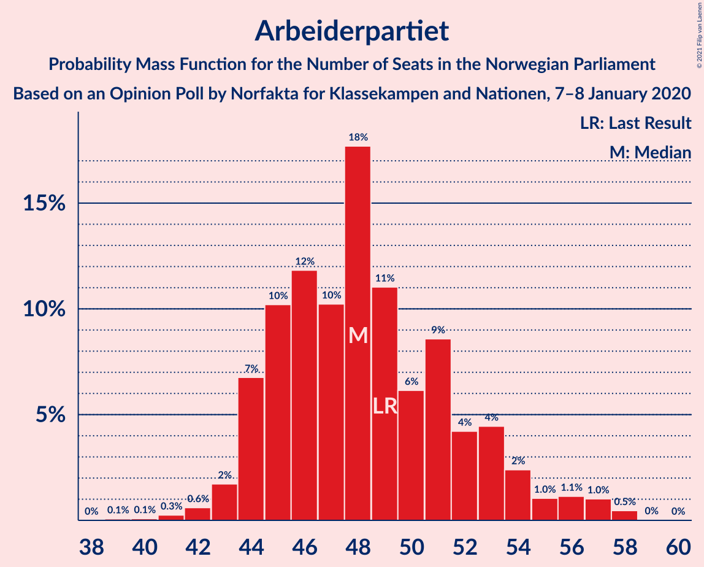
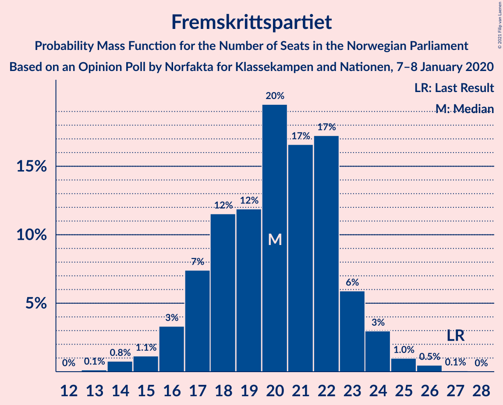
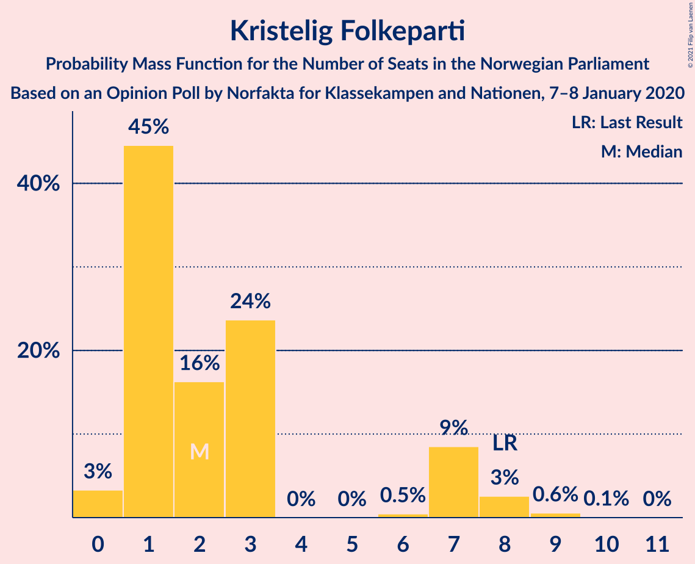
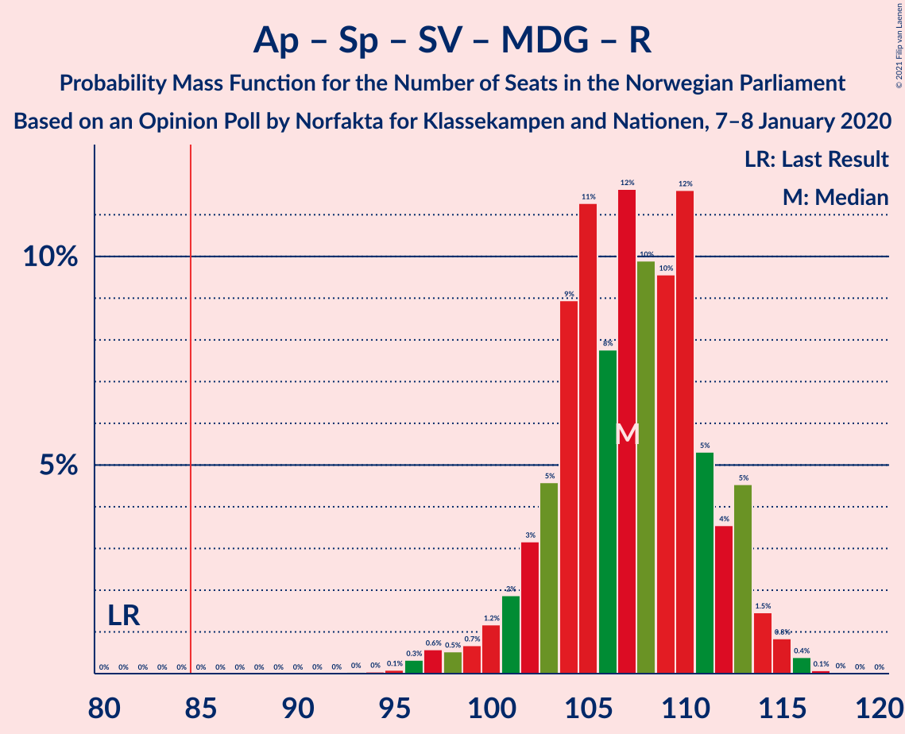
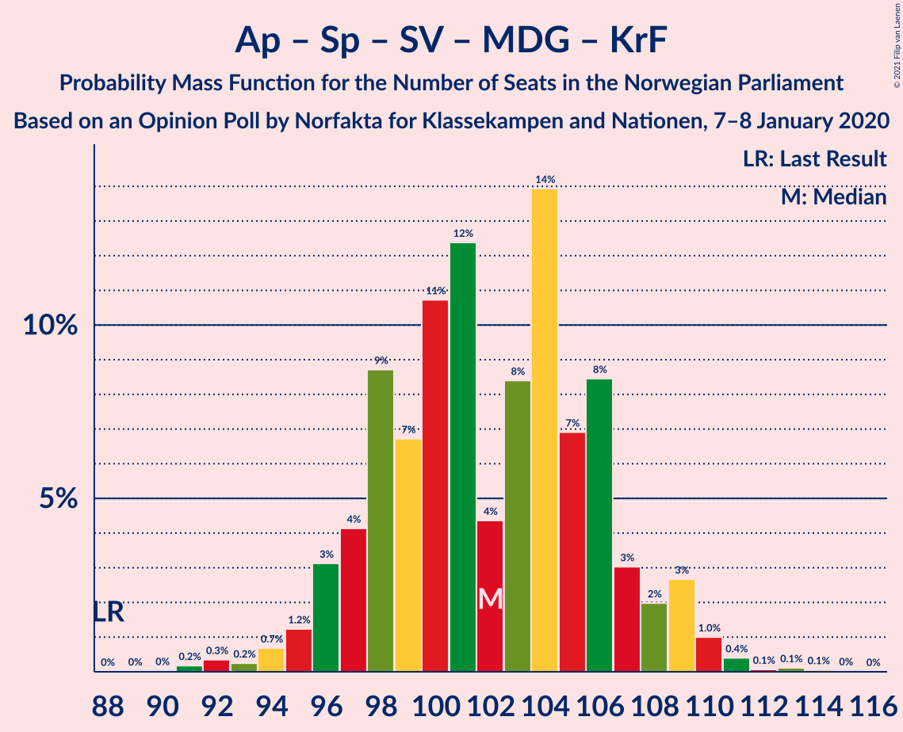
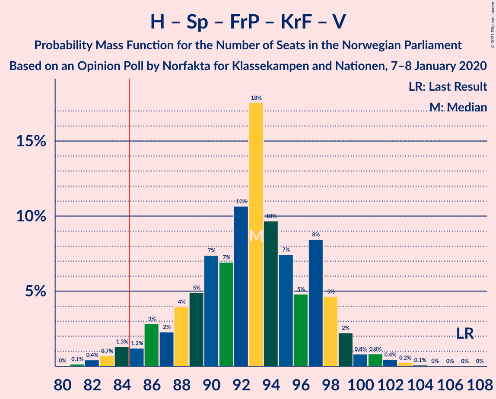
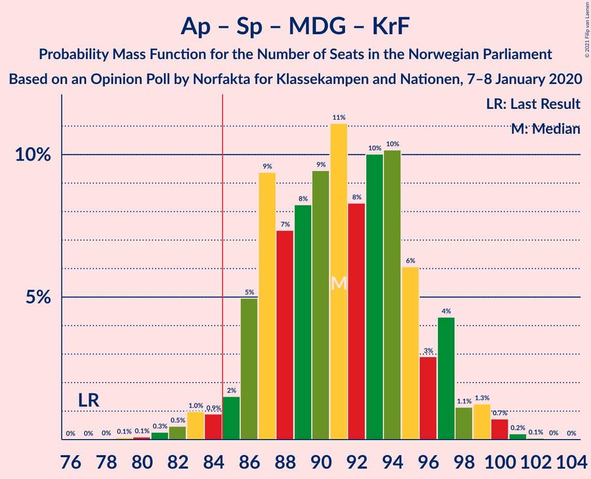
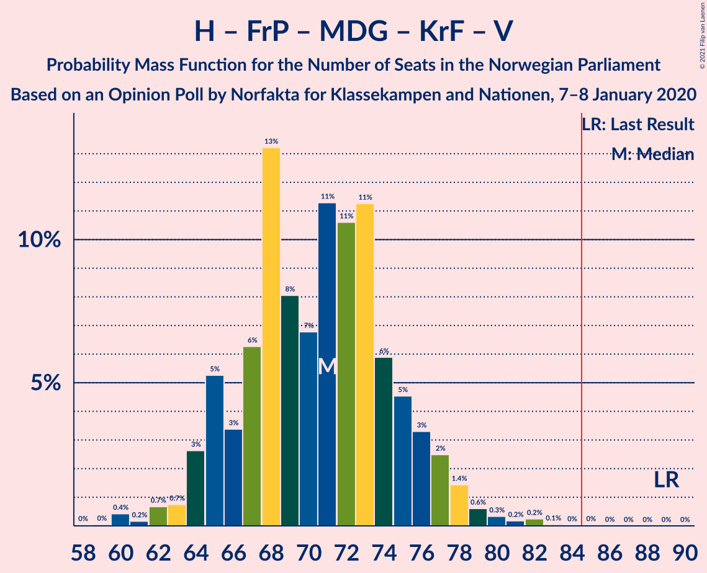

# Opinion Poll by Norfakta for Klassekampen and Nationen, 7–8 January 2020

<a href="#voting-intentions">Voting Intentions</a> | <a href="#seats">Seats</a> | <a href="#coalitions">Coalitions</a> | <a href="#technical-information">Technical Information</a>

## Voting Intentions

### Confidence Intervals

| Party | Last Result | Poll Result | 80% Confidence Interval | 90% Confidence Interval | 95% Confidence Interval | 99% Confidence Interval |
|:-----:|:-----------:|:-----------:|:-----------------------:|:-----------------------:|:-----------------------:|:-----------------------:|
| Arbeiderpartiet | 27.4% | 26.7% | 24.7–28.8% |24.2–29.4% |23.7–29.9% |22.8–30.9% |
| Høyre | 25.0% | 21.3% | 19.5–23.3% |19.0–23.8% |18.5–24.3% |17.7–25.3% |
| Senterpartiet | 10.3% | 16.5% | 14.9–18.4% |14.5–18.9% |14.1–19.3% |13.4–20.2% |
| Fremskrittspartiet | 15.2% | 10.9% | 9.6–12.5% |9.2–12.9% |8.9–13.3% |8.3–14.1% |
| Sosialistisk Venstreparti | 6.0% | 6.2% | 5.2–7.4% |4.9–7.8% |4.7–8.1% |4.2–8.7% |
| Miljøpartiet De Grønne | 3.2% | 5.3% | 4.4–6.4% |4.1–6.8% |3.9–7.1% |3.5–7.7% |
| Rødt | 2.4% | 4.7% | 3.9–5.9% |3.7–6.2% |3.5–6.5% |3.1–7.1% |
| Kristelig Folkeparti | 4.2% | 3.2% | 2.5–4.2% |2.3–4.5% |2.2–4.7% |1.9–5.2% |
| Venstre | 4.4% | 2.4% | 1.9–3.3% |1.7–3.6% |1.6–3.8% |1.3–4.2% |

*Note:* The poll result column reflects the actual value used in the calculations. Published results may vary slightly, and in addition be rounded to fewer digits.

## Seats

### Confidence Intervals

| Party | Last Result | Median | 80% Confidence Interval | 90% Confidence Interval | 95% Confidence Interval | 99% Confidence Interval |
|:-----:|:-----------:|:------:|:-----------------------:|:-----------------------:|:-----------------------:|:-----------------------:|
| <a href="#arbeiderpartiet">Arbeiderpartiet</a> | 49 | 48 | 44–53 |44–54 |43–56 |42–57 |
| <a href="#høyre">Høyre</a> | 45 | 37 | 34–41 |34–42 |33–43 |31–45 |
| <a href="#senterpartiet">Senterpartiet</a> | 19 | 32 | 27–34 |25–35 |25–36 |24–37 |
| <a href="#fremskrittspartiet">Fremskrittspartiet</a> | 27 | 20 | 17–22 |16–24 |14–25 |14–26 |
| <a href="#sosialistisk-venstreparti">Sosialistisk Venstreparti</a> | 11 | 11 | 9–13 |9–13 |8–14 |7–15 |
| <a href="#miljøpartiet-de-grønne">Miljøpartiet De Grønne</a> | 1 | 10 | 7–11 |7–12 |3–12 |2–13 |
| <a href="#rødt">Rødt</a> | 1 | 8 | 2–10 |2–11 |2–11 |2–13 |
| <a href="#kristelig-folkeparti">Kristelig Folkeparti</a> | 8 | 2 | 1–7 |1–7 |0–8 |0–8 |
| <a href="#venstre">Venstre</a> | 8 | 2 | 1–2 |0–2 |0–2 |0–7 |

### Arbeiderpartiet

*For a full overview of the results for this party, see the [Arbeiderpartiet](party-arbeiderpartiet.html) page.*

| Number of Seats | Probability | Accumulated | Special Marks |
|:---------------:|:-----------:|:-----------:|:-------------:|
| 39 | 0.1% | 100% |  |
| 40 | 0.1% | 99.9% |  |
| 41 | 0.3% | 99.9% |  |
| 42 | 0.6% | 99.5% |  |
| 43 | 4% | 98.9% |  |
| 44 | 7% | 95% |  |
| 45 | 5% | 88% |  |
| 46 | 12% | 83% |  |
| 47 | 9% | 71% |  |
| 48 | 20% | 62% | Median |
| 49 | 16% | 42% | Last Result |
| 50 | 3% | 26% |  |
| 51 | 4% | 23% |  |
| 52 | 5% | 18% |  |
| 53 | 7% | 14% |  |
| 54 | 4% | 7% |  |
| 55 | 0.4% | 3% |  |
| 56 | 0.7% | 3% |  |
| 57 | 2% | 2% |  |
| 58 | 0.2% | 0.3% |  |
| 59 | 0% | 0% |  |

### Høyre

*For a full overview of the results for this party, see the [Høyre](party-høyre.html) page.*

| Number of Seats | Probability | Accumulated | Special Marks |
|:---------------:|:-----------:|:-----------:|:-------------:|
| 30 | 0.1% | 100% |  |
| 31 | 0.6% | 99.9% |  |
| 32 | 1.1% | 99.3% |  |
| 33 | 2% | 98% |  |
| 34 | 11% | 96% |  |
| 35 | 16% | 85% |  |
| 36 | 10% | 69% |  |
| 37 | 20% | 59% | Median |
| 38 | 13% | 39% |  |
| 39 | 9% | 26% |  |
| 40 | 6% | 17% |  |
| 41 | 4% | 11% |  |
| 42 | 3% | 7% |  |
| 43 | 2% | 4% |  |
| 44 | 0.4% | 1.2% |  |
| 45 | 0.4% | 0.9% | Last Result |
| 46 | 0.3% | 0.4% |  |
| 47 | 0.1% | 0.1% |  |
| 48 | 0% | 0% |  |

### Senterpartiet

*For a full overview of the results for this party, see the [Senterpartiet](party-senterpartiet.html) page.*

| Number of Seats | Probability | Accumulated | Special Marks |
|:---------------:|:-----------:|:-----------:|:-------------:|
| 19 | 0% | 100% | Last Result |
| 20 | 0% | 100% |  |
| 21 | 0% | 100% |  |
| 22 | 0.1% | 100% |  |
| 23 | 0.1% | 99.9% |  |
| 24 | 0.5% | 99.8% |  |
| 25 | 6% | 99.4% |  |
| 26 | 1.1% | 93% |  |
| 27 | 5% | 92% |  |
| 28 | 12% | 87% |  |
| 29 | 3% | 76% |  |
| 30 | 10% | 73% |  |
| 31 | 9% | 63% |  |
| 32 | 7% | 54% | Median |
| 33 | 5% | 46% |  |
| 34 | 33% | 42% |  |
| 35 | 5% | 8% |  |
| 36 | 2% | 4% |  |
| 37 | 1.1% | 1.3% |  |
| 38 | 0.1% | 0.2% |  |
| 39 | 0.1% | 0.1% |  |
| 40 | 0% | 0% |  |

### Fremskrittspartiet

*For a full overview of the results for this party, see the [Fremskrittspartiet](party-fremskrittspartiet.html) page.*

| Number of Seats | Probability | Accumulated | Special Marks |
|:---------------:|:-----------:|:-----------:|:-------------:|
| 13 | 0.1% | 100% |  |
| 14 | 3% | 99.9% |  |
| 15 | 0.5% | 97% |  |
| 16 | 6% | 96% |  |
| 17 | 7% | 90% |  |
| 18 | 17% | 84% |  |
| 19 | 5% | 67% |  |
| 20 | 14% | 61% | Median |
| 21 | 17% | 47% |  |
| 22 | 21% | 30% |  |
| 23 | 3% | 9% |  |
| 24 | 3% | 5% |  |
| 25 | 2% | 3% |  |
| 26 | 0.3% | 0.6% |  |
| 27 | 0.2% | 0.3% | Last Result |
| 28 | 0% | 0.1% |  |
| 29 | 0% | 0% |  |

### Sosialistisk Venstreparti

*For a full overview of the results for this party, see the [Sosialistisk Venstreparti](party-sosialistiskvenstreparti.html) page.*

| Number of Seats | Probability | Accumulated | Special Marks |
|:---------------:|:-----------:|:-----------:|:-------------:|
| 2 | 0.1% | 100% |  |
| 3 | 0% | 99.9% |  |
| 4 | 0% | 99.9% |  |
| 5 | 0% | 99.9% |  |
| 6 | 0.2% | 99.9% |  |
| 7 | 0.3% | 99.8% |  |
| 8 | 4% | 99.4% |  |
| 9 | 14% | 95% |  |
| 10 | 10% | 82% |  |
| 11 | 43% | 72% | Last Result, Median |
| 12 | 19% | 29% |  |
| 13 | 6% | 10% |  |
| 14 | 3% | 4% |  |
| 15 | 2% | 2% |  |
| 16 | 0.3% | 0.3% |  |
| 17 | 0% | 0% |  |

### Miljøpartiet De Grønne

*For a full overview of the results for this party, see the [Miljøpartiet De Grønne](party-miljøpartietdegrønne.html) page.*

| Number of Seats | Probability | Accumulated | Special Marks |
|:---------------:|:-----------:|:-----------:|:-------------:|
| 1 | 0% | 100% | Last Result |
| 2 | 1.0% | 100% |  |
| 3 | 2% | 99.0% |  |
| 4 | 0.1% | 97% |  |
| 5 | 0% | 97% |  |
| 6 | 0% | 97% |  |
| 7 | 9% | 97% |  |
| 8 | 24% | 88% |  |
| 9 | 10% | 64% |  |
| 10 | 19% | 53% | Median |
| 11 | 27% | 34% |  |
| 12 | 6% | 7% |  |
| 13 | 0.5% | 0.8% |  |
| 14 | 0.2% | 0.2% |  |
| 15 | 0.1% | 0.1% |  |
| 16 | 0% | 0% |  |

### Rødt

*For a full overview of the results for this party, see the [Rødt](party-rødt.html) page.*

| Number of Seats | Probability | Accumulated | Special Marks |
|:---------------:|:-----------:|:-----------:|:-------------:|
| 1 | 0.1% | 100% | Last Result |
| 2 | 20% | 99.9% |  |
| 3 | 0% | 80% |  |
| 4 | 0% | 80% |  |
| 5 | 0% | 80% |  |
| 6 | 1.4% | 80% |  |
| 7 | 13% | 78% |  |
| 8 | 21% | 65% | Median |
| 9 | 24% | 44% |  |
| 10 | 14% | 20% |  |
| 11 | 4% | 6% |  |
| 12 | 2% | 2% |  |
| 13 | 0.4% | 0.5% |  |
| 14 | 0.1% | 0.1% |  |
| 15 | 0% | 0% |  |

### Kristelig Folkeparti

*For a full overview of the results for this party, see the [Kristelig Folkeparti](party-kristeligfolkeparti.html) page.*

| Number of Seats | Probability | Accumulated | Special Marks |
|:---------------:|:-----------:|:-----------:|:-------------:|
| 0 | 3% | 100% |  |
| 1 | 35% | 97% |  |
| 2 | 19% | 62% | Median |
| 3 | 28% | 43% |  |
| 4 | 0% | 15% |  |
| 5 | 0% | 15% |  |
| 6 | 0.3% | 15% |  |
| 7 | 11% | 15% |  |
| 8 | 3% | 4% | Last Result |
| 9 | 0.3% | 0.5% |  |
| 10 | 0.2% | 0.2% |  |
| 11 | 0% | 0% |  |

### Venstre

*For a full overview of the results for this party, see the [Venstre](party-venstre.html) page.*

| Number of Seats | Probability | Accumulated | Special Marks |
|:---------------:|:-----------:|:-----------:|:-------------:|
| 0 | 8% | 100% |  |
| 1 | 16% | 92% |  |
| 2 | 75% | 77% | Median |
| 3 | 0.1% | 2% |  |
| 4 | 0% | 1.5% |  |
| 5 | 0% | 1.5% |  |
| 6 | 0.1% | 1.5% |  |
| 7 | 1.0% | 1.4% |  |
| 8 | 0.4% | 0.4% | Last Result |
| 9 | 0% | 0% |  |

## Coalitions

### Confidence Intervals

| Coalition | Last Result | Median | Majority? | 80% Confidence Interval | 90% Confidence Interval | 95% Confidence Interval | 99% Confidence Interval |
|:---------:|:-----------:|:------:|:---------:|:-----------------------:|:-----------------------:|:-----------------------:|:-----------------------:|
| Arbeiderpartiet – Senterpartiet – Sosialistisk Venstreparti – Miljøpartiet De Grønne – Rødt | 81 | 108 | 100% | 102–111 | 102–112 | 100–114 | 97–114 |
| Arbeiderpartiet – Senterpartiet – Sosialistisk Venstreparti – Miljøpartiet De Grønne – Kristelig Folkeparti | 88 | 103 | 100% | 99–106 | 97–107 | 96–109 | 92–111 |
| Arbeiderpartiet – Senterpartiet – Sosialistisk Venstreparti – Miljøpartiet De Grønne | 80 | 100 | 100% | 95–104 | 94–105 | 92–106 | 90–110 |
| Arbeiderpartiet – Senterpartiet – Sosialistisk Venstreparti – Rødt | 80 | 98 | 100% | 94–102 | 92–104 | 91–105 | 89–106 |
| Høyre – Senterpartiet – Fremskrittspartiet – Kristelig Folkeparti – Venstre | 107 | 93 | 97% | 86–97 | 86–99 | 84–99 | 82–102 |
| Arbeiderpartiet – Senterpartiet – Miljøpartiet De Grønne – Kristelig Folkeparti | 77 | 92 | 97% | 87–95 | 87–96 | 84–97 | 81–99 |
| Arbeiderpartiet – Senterpartiet – Sosialistisk Venstreparti | 79 | 91 | 97% | 86–94 | 85–97 | 83–97 | 82–99 |
| Arbeiderpartiet – Senterpartiet – Kristelig Folkeparti | 76 | 83 | 29% | 78–86 | 77–87 | 76–88 | 73–90 |
| Arbeiderpartiet – Senterpartiet | 68 | 80 | 6% | 75–83 | 73–86 | 72–87 | 71–87 |
| Høyre – Fremskrittspartiet – Miljøpartiet De Grønne – Kristelig Folkeparti – Venstre | 89 | 71 | 0% | 67–75 | 65–76 | 64–77 | 63–79 |
| Høyre – Fremskrittspartiet – Kristelig Folkeparti – Venstre | 88 | 61 | 0% | 58–65 | 57–67 | 55–68 | 54–70 |
| Arbeiderpartiet – Sosialistisk Venstreparti | 60 | 59 | 0% | 55–64 | 55–64 | 54–68 | 51–69 |
| Høyre – Fremskrittspartiet – Venstre | 80 | 59 | 0% | 56–61 | 54–63 | 54–64 | 52–67 |
| Høyre – Fremskrittspartiet | 72 | 57 | 0% | 54–59 | 52–61 | 52–62 | 51–65 |
| Høyre – Kristelig Folkeparti – Venstre | 61 | 41 | 0% | 38–46 | 38–49 | 37–50 | 34–51 |
| Senterpartiet – Kristelig Folkeparti – Venstre | 35 | 38 | 0% | 31–39 | 28–40 | 28–42 | 26–45 |

### Arbeiderpartiet – Senterpartiet – Sosialistisk Venstreparti – Miljøpartiet De Grønne – Rødt

| Number of Seats | Probability | Accumulated | Special Marks |
|:---------------:|:-----------:|:-----------:|:-------------:|
| 81 | 0% | 100% | Last Result |
| 82 | 0% | 100% |  |
| 83 | 0% | 100% |  |
| 84 | 0% | 100% |  |
| 85 | 0% | 100% | Majority |
| 86 | 0% | 100% |  |
| 87 | 0% | 100% |  |
| 88 | 0% | 100% |  |
| 89 | 0% | 100% |  |
| 90 | 0% | 100% |  |
| 91 | 0% | 100% |  |
| 92 | 0% | 100% |  |
| 93 | 0% | 100% |  |
| 94 | 0.1% | 99.9% |  |
| 95 | 0.1% | 99.8% |  |
| 96 | 0.1% | 99.8% |  |
| 97 | 0.3% | 99.7% |  |
| 98 | 0.5% | 99.4% |  |
| 99 | 0.4% | 98.9% |  |
| 100 | 2% | 98% |  |
| 101 | 1.1% | 97% |  |
| 102 | 6% | 96% |  |
| 103 | 2% | 90% |  |
| 104 | 3% | 88% |  |
| 105 | 11% | 86% |  |
| 106 | 14% | 75% |  |
| 107 | 8% | 61% |  |
| 108 | 13% | 53% |  |
| 109 | 14% | 40% | Median |
| 110 | 14% | 26% |  |
| 111 | 4% | 12% |  |
| 112 | 3% | 7% |  |
| 113 | 0.6% | 4% |  |
| 114 | 3% | 3% |  |
| 115 | 0.3% | 0.4% |  |
| 116 | 0.1% | 0.2% |  |
| 117 | 0.1% | 0.1% |  |
| 118 | 0% | 0% |  |

### Arbeiderpartiet – Senterpartiet – Sosialistisk Venstreparti – Miljøpartiet De Grønne – Kristelig Folkeparti

| Number of Seats | Probability | Accumulated | Special Marks |
|:---------------:|:-----------:|:-----------:|:-------------:|
| 88 | 0% | 100% | Last Result |
| 89 | 0% | 100% |  |
| 90 | 0% | 99.9% |  |
| 91 | 0.2% | 99.9% |  |
| 92 | 0.3% | 99.7% |  |
| 93 | 0.4% | 99.5% |  |
| 94 | 0.8% | 99.1% |  |
| 95 | 0.5% | 98% |  |
| 96 | 0.5% | 98% |  |
| 97 | 4% | 97% |  |
| 98 | 2% | 94% |  |
| 99 | 7% | 92% |  |
| 100 | 16% | 85% |  |
| 101 | 5% | 69% |  |
| 102 | 7% | 64% |  |
| 103 | 14% | 57% | Median |
| 104 | 10% | 43% |  |
| 105 | 11% | 33% |  |
| 106 | 15% | 22% |  |
| 107 | 4% | 7% |  |
| 108 | 0.5% | 3% |  |
| 109 | 1.4% | 3% |  |
| 110 | 0.3% | 1.2% |  |
| 111 | 0.7% | 0.9% |  |
| 112 | 0% | 0.2% |  |
| 113 | 0.1% | 0.2% |  |
| 114 | 0% | 0% |  |

### Arbeiderpartiet – Senterpartiet – Sosialistisk Venstreparti – Miljøpartiet De Grønne

| Number of Seats | Probability | Accumulated | Special Marks |
|:---------------:|:-----------:|:-----------:|:-------------:|
| 80 | 0% | 100% | Last Result |
| 81 | 0% | 100% |  |
| 82 | 0% | 100% |  |
| 83 | 0% | 100% |  |
| 84 | 0% | 100% |  |
| 85 | 0% | 100% | Majority |
| 86 | 0% | 100% |  |
| 87 | 0% | 100% |  |
| 88 | 0.1% | 99.9% |  |
| 89 | 0.4% | 99.9% |  |
| 90 | 0.3% | 99.5% |  |
| 91 | 0.5% | 99.3% |  |
| 92 | 2% | 98.8% |  |
| 93 | 1.0% | 97% |  |
| 94 | 2% | 96% |  |
| 95 | 4% | 94% |  |
| 96 | 10% | 90% |  |
| 97 | 3% | 80% |  |
| 98 | 6% | 76% |  |
| 99 | 14% | 70% |  |
| 100 | 8% | 57% |  |
| 101 | 13% | 49% | Median |
| 102 | 14% | 36% |  |
| 103 | 2% | 22% |  |
| 104 | 14% | 20% |  |
| 105 | 2% | 6% |  |
| 106 | 2% | 4% |  |
| 107 | 0.3% | 2% |  |
| 108 | 1.2% | 2% |  |
| 109 | 0% | 0.6% |  |
| 110 | 0.4% | 0.5% |  |
| 111 | 0% | 0.1% |  |
| 112 | 0.1% | 0.1% |  |
| 113 | 0% | 0% |  |

### Arbeiderpartiet – Senterpartiet – Sosialistisk Venstreparti – Rødt

| Number of Seats | Probability | Accumulated | Special Marks |
|:---------------:|:-----------:|:-----------:|:-------------:|
| 80 | 0% | 100% | Last Result |
| 81 | 0% | 100% |  |
| 82 | 0% | 100% |  |
| 83 | 0% | 100% |  |
| 84 | 0% | 100% |  |
| 85 | 0% | 100% | Majority |
| 86 | 0% | 99.9% |  |
| 87 | 0.2% | 99.9% |  |
| 88 | 0.2% | 99.7% |  |
| 89 | 0.2% | 99.5% |  |
| 90 | 0.5% | 99.3% |  |
| 91 | 2% | 98.8% |  |
| 92 | 2% | 97% |  |
| 93 | 3% | 95% |  |
| 94 | 6% | 92% |  |
| 95 | 19% | 86% |  |
| 96 | 3% | 67% |  |
| 97 | 8% | 64% |  |
| 98 | 16% | 56% |  |
| 99 | 5% | 41% | Median |
| 100 | 4% | 36% |  |
| 101 | 11% | 31% |  |
| 102 | 13% | 20% |  |
| 103 | 2% | 8% |  |
| 104 | 2% | 5% |  |
| 105 | 3% | 3% |  |
| 106 | 0.3% | 0.6% |  |
| 107 | 0.2% | 0.3% |  |
| 108 | 0% | 0.1% |  |
| 109 | 0% | 0.1% |  |
| 110 | 0% | 0% |  |

### Høyre – Senterpartiet – Fremskrittspartiet – Kristelig Folkeparti – Venstre

| Number of Seats | Probability | Accumulated | Special Marks |
|:---------------:|:-----------:|:-----------:|:-------------:|
| 80 | 0% | 100% |  |
| 81 | 0% | 99.9% |  |
| 82 | 0.5% | 99.9% |  |
| 83 | 2% | 99.5% |  |
| 84 | 1.2% | 98% |  |
| 85 | 0.2% | 97% | Majority |
| 86 | 7% | 96% |  |
| 87 | 1.0% | 90% |  |
| 88 | 8% | 89% |  |
| 89 | 2% | 81% |  |
| 90 | 5% | 79% |  |
| 91 | 6% | 74% |  |
| 92 | 8% | 68% |  |
| 93 | 11% | 60% | Median |
| 94 | 9% | 49% |  |
| 95 | 14% | 41% |  |
| 96 | 6% | 27% |  |
| 97 | 14% | 21% |  |
| 98 | 1.0% | 6% |  |
| 99 | 4% | 5% |  |
| 100 | 0.4% | 2% |  |
| 101 | 0.3% | 1.2% |  |
| 102 | 0.6% | 0.9% |  |
| 103 | 0.2% | 0.3% |  |
| 104 | 0.1% | 0.1% |  |
| 105 | 0% | 0.1% |  |
| 106 | 0% | 0% |  |
| 107 | 0% | 0% | Last Result |

### Arbeiderpartiet – Senterpartiet – Miljøpartiet De Grønne – Kristelig Folkeparti

| Number of Seats | Probability | Accumulated | Special Marks |
|:---------------:|:-----------:|:-----------:|:-------------:|
| 77 | 0% | 100% | Last Result |
| 78 | 0% | 100% |  |
| 79 | 0% | 100% |  |
| 80 | 0.1% | 99.9% |  |
| 81 | 0.6% | 99.8% |  |
| 82 | 0.3% | 99.3% |  |
| 83 | 0.3% | 99.0% |  |
| 84 | 1.2% | 98.7% |  |
| 85 | 0.9% | 97% | Majority |
| 86 | 1.3% | 97% |  |
| 87 | 7% | 95% |  |
| 88 | 5% | 88% |  |
| 89 | 13% | 83% |  |
| 90 | 2% | 70% |  |
| 91 | 8% | 68% |  |
| 92 | 17% | 60% | Median |
| 93 | 7% | 43% |  |
| 94 | 14% | 36% |  |
| 95 | 16% | 22% |  |
| 96 | 1.4% | 6% |  |
| 97 | 3% | 4% |  |
| 98 | 0.6% | 2% |  |
| 99 | 0.8% | 1.1% |  |
| 100 | 0.2% | 0.4% |  |
| 101 | 0% | 0.2% |  |
| 102 | 0.1% | 0.1% |  |
| 103 | 0% | 0.1% |  |
| 104 | 0% | 0% |  |

### Arbeiderpartiet – Senterpartiet – Sosialistisk Venstreparti

| Number of Seats | Probability | Accumulated | Special Marks |
|:---------------:|:-----------:|:-----------:|:-------------:|
| 78 | 0% | 100% |  |
| 79 | 0.1% | 99.9% | Last Result |
| 80 | 0.1% | 99.9% |  |
| 81 | 0.2% | 99.8% |  |
| 82 | 0.6% | 99.5% |  |
| 83 | 2% | 98.9% |  |
| 84 | 0.5% | 97% |  |
| 85 | 3% | 97% | Majority |
| 86 | 7% | 94% |  |
| 87 | 5% | 87% |  |
| 88 | 14% | 82% |  |
| 89 | 9% | 67% |  |
| 90 | 6% | 58% |  |
| 91 | 6% | 52% | Median |
| 92 | 5% | 46% |  |
| 93 | 16% | 41% |  |
| 94 | 18% | 25% |  |
| 95 | 2% | 8% |  |
| 96 | 0.4% | 6% |  |
| 97 | 3% | 5% |  |
| 98 | 0.6% | 2% |  |
| 99 | 1.2% | 1.5% |  |
| 100 | 0% | 0.2% |  |
| 101 | 0.1% | 0.2% |  |
| 102 | 0% | 0.1% |  |
| 103 | 0.1% | 0.1% |  |
| 104 | 0% | 0% |  |

### Arbeiderpartiet – Senterpartiet – Kristelig Folkeparti

| Number of Seats | Probability | Accumulated | Special Marks |
|:---------------:|:-----------:|:-----------:|:-------------:|
| 70 | 0.1% | 100% |  |
| 71 | 0.1% | 99.9% |  |
| 72 | 0.1% | 99.8% |  |
| 73 | 0.3% | 99.7% |  |
| 74 | 0.7% | 99.3% |  |
| 75 | 0.6% | 98.6% |  |
| 76 | 2% | 98% | Last Result |
| 77 | 5% | 96% |  |
| 78 | 7% | 91% |  |
| 79 | 7% | 83% |  |
| 80 | 7% | 76% |  |
| 81 | 3% | 69% |  |
| 82 | 11% | 66% | Median |
| 83 | 9% | 55% |  |
| 84 | 18% | 46% |  |
| 85 | 11% | 29% | Majority |
| 86 | 10% | 18% |  |
| 87 | 3% | 8% |  |
| 88 | 3% | 4% |  |
| 89 | 0.5% | 1.2% |  |
| 90 | 0.4% | 0.7% |  |
| 91 | 0.1% | 0.3% |  |
| 92 | 0.1% | 0.2% |  |
| 93 | 0.1% | 0.1% |  |
| 94 | 0% | 0% |  |

### Arbeiderpartiet – Senterpartiet

| Number of Seats | Probability | Accumulated | Special Marks |
|:---------------:|:-----------:|:-----------:|:-------------:|
| 67 | 0% | 100% |  |
| 68 | 0% | 99.9% | Last Result |
| 69 | 0.1% | 99.9% |  |
| 70 | 0.1% | 99.8% |  |
| 71 | 2% | 99.7% |  |
| 72 | 0.6% | 98% |  |
| 73 | 3% | 97% |  |
| 74 | 1.1% | 95% |  |
| 75 | 7% | 94% |  |
| 76 | 5% | 87% |  |
| 77 | 12% | 82% |  |
| 78 | 9% | 70% |  |
| 79 | 6% | 61% |  |
| 80 | 5% | 55% | Median |
| 81 | 8% | 50% |  |
| 82 | 21% | 42% |  |
| 83 | 12% | 20% |  |
| 84 | 2% | 8% |  |
| 85 | 0.4% | 6% | Majority |
| 86 | 3% | 5% |  |
| 87 | 2% | 3% |  |
| 88 | 0.2% | 0.4% |  |
| 89 | 0.1% | 0.1% |  |
| 90 | 0% | 0.1% |  |
| 91 | 0% | 0.1% |  |
| 92 | 0.1% | 0.1% |  |
| 93 | 0% | 0% |  |

### Høyre – Fremskrittspartiet – Miljøpartiet De Grønne – Kristelig Folkeparti – Venstre

| Number of Seats | Probability | Accumulated | Special Marks |
|:---------------:|:-----------:|:-----------:|:-------------:|
| 59 | 0% | 100% |  |
| 60 | 0% | 99.9% |  |
| 61 | 0% | 99.9% |  |
| 62 | 0.2% | 99.9% |  |
| 63 | 0.4% | 99.6% |  |
| 64 | 3% | 99.2% |  |
| 65 | 2% | 96% |  |
| 66 | 3% | 94% |  |
| 67 | 13% | 92% |  |
| 68 | 12% | 79% |  |
| 69 | 5% | 67% |  |
| 70 | 6% | 62% |  |
| 71 | 16% | 57% | Median |
| 72 | 8% | 41% |  |
| 73 | 3% | 33% |  |
| 74 | 19% | 30% |  |
| 75 | 5% | 12% |  |
| 76 | 3% | 7% |  |
| 77 | 2% | 4% |  |
| 78 | 2% | 2% |  |
| 79 | 0.3% | 0.8% |  |
| 80 | 0.2% | 0.4% |  |
| 81 | 0.1% | 0.3% |  |
| 82 | 0.1% | 0.1% |  |
| 83 | 0% | 0% |  |
| 84 | 0% | 0% |  |
| 85 | 0% | 0% | Majority |
| 86 | 0% | 0% |  |
| 87 | 0% | 0% |  |
| 88 | 0% | 0% |  |
| 89 | 0% | 0% | Last Result |

### Høyre – Fremskrittspartiet – Kristelig Folkeparti – Venstre

| Number of Seats | Probability | Accumulated | Special Marks |
|:---------------:|:-----------:|:-----------:|:-------------:|
| 51 | 0% | 100% |  |
| 52 | 0.1% | 99.9% |  |
| 53 | 0.1% | 99.8% |  |
| 54 | 0.3% | 99.7% |  |
| 55 | 3% | 99.4% |  |
| 56 | 0.7% | 96% |  |
| 57 | 4% | 96% |  |
| 58 | 4% | 92% |  |
| 59 | 15% | 88% |  |
| 60 | 15% | 74% |  |
| 61 | 13% | 59% | Median |
| 62 | 9% | 45% |  |
| 63 | 14% | 37% |  |
| 64 | 11% | 23% |  |
| 65 | 3% | 12% |  |
| 66 | 2% | 9% |  |
| 67 | 5% | 8% |  |
| 68 | 1.0% | 3% |  |
| 69 | 2% | 2% |  |
| 70 | 0.2% | 0.6% |  |
| 71 | 0.2% | 0.4% |  |
| 72 | 0.2% | 0.3% |  |
| 73 | 0.1% | 0.1% |  |
| 74 | 0% | 0% |  |
| 75 | 0% | 0% |  |
| 76 | 0% | 0% |  |
| 77 | 0% | 0% |  |
| 78 | 0% | 0% |  |
| 79 | 0% | 0% |  |
| 80 | 0% | 0% |  |
| 81 | 0% | 0% |  |
| 82 | 0% | 0% |  |
| 83 | 0% | 0% |  |
| 84 | 0% | 0% |  |
| 85 | 0% | 0% | Majority |
| 86 | 0% | 0% |  |
| 87 | 0% | 0% |  |
| 88 | 0% | 0% | Last Result |

### Arbeiderpartiet – Sosialistisk Venstreparti

| Number of Seats | Probability | Accumulated | Special Marks |
|:---------------:|:-----------:|:-----------:|:-------------:|
| 49 | 0% | 100% |  |
| 50 | 0.3% | 99.9% |  |
| 51 | 0.2% | 99.6% |  |
| 52 | 0.3% | 99.4% |  |
| 53 | 0.8% | 99.1% |  |
| 54 | 1.0% | 98% |  |
| 55 | 14% | 97% |  |
| 56 | 9% | 83% |  |
| 57 | 3% | 74% |  |
| 58 | 7% | 71% |  |
| 59 | 15% | 64% | Median |
| 60 | 23% | 49% | Last Result |
| 61 | 3% | 26% |  |
| 62 | 7% | 23% |  |
| 63 | 4% | 16% |  |
| 64 | 8% | 12% |  |
| 65 | 0.4% | 4% |  |
| 66 | 0.3% | 4% |  |
| 67 | 0.8% | 3% |  |
| 68 | 2% | 3% |  |
| 69 | 0.6% | 0.8% |  |
| 70 | 0% | 0.2% |  |
| 71 | 0.1% | 0.2% |  |
| 72 | 0% | 0% |  |

### Høyre – Fremskrittspartiet – Venstre

| Number of Seats | Probability | Accumulated | Special Marks |
|:---------------:|:-----------:|:-----------:|:-------------:|
| 49 | 0% | 100% |  |
| 50 | 0.1% | 99.9% |  |
| 51 | 0.2% | 99.9% |  |
| 52 | 1.2% | 99.7% |  |
| 53 | 0.4% | 98.5% |  |
| 54 | 3% | 98% |  |
| 55 | 3% | 95% |  |
| 56 | 14% | 91% |  |
| 57 | 12% | 78% |  |
| 58 | 12% | 66% |  |
| 59 | 13% | 54% | Median |
| 60 | 9% | 40% |  |
| 61 | 21% | 31% |  |
| 62 | 0.9% | 10% |  |
| 63 | 4% | 9% |  |
| 64 | 2% | 4% |  |
| 65 | 0.5% | 2% |  |
| 66 | 0.9% | 2% |  |
| 67 | 0.5% | 0.8% |  |
| 68 | 0.1% | 0.3% |  |
| 69 | 0% | 0.2% |  |
| 70 | 0.1% | 0.2% |  |
| 71 | 0% | 0.1% |  |
| 72 | 0% | 0% |  |
| 73 | 0% | 0% |  |
| 74 | 0% | 0% |  |
| 75 | 0% | 0% |  |
| 76 | 0% | 0% |  |
| 77 | 0% | 0% |  |
| 78 | 0% | 0% |  |
| 79 | 0% | 0% |  |
| 80 | 0% | 0% | Last Result |

### Høyre – Fremskrittspartiet

| Number of Seats | Probability | Accumulated | Special Marks |
|:---------------:|:-----------:|:-----------:|:-------------:|
| 47 | 0% | 100% |  |
| 48 | 0.1% | 99.9% |  |
| 49 | 0.1% | 99.9% |  |
| 50 | 0.3% | 99.8% |  |
| 51 | 0.3% | 99.5% |  |
| 52 | 4% | 99.2% |  |
| 53 | 3% | 95% |  |
| 54 | 12% | 92% |  |
| 55 | 4% | 80% |  |
| 56 | 20% | 76% |  |
| 57 | 14% | 56% | Median |
| 58 | 9% | 43% |  |
| 59 | 23% | 33% |  |
| 60 | 1.0% | 10% |  |
| 61 | 5% | 9% |  |
| 62 | 2% | 4% |  |
| 63 | 0.4% | 2% |  |
| 64 | 1.0% | 2% |  |
| 65 | 0.2% | 0.7% |  |
| 66 | 0.3% | 0.5% |  |
| 67 | 0.1% | 0.2% |  |
| 68 | 0.1% | 0.1% |  |
| 69 | 0% | 0% |  |
| 70 | 0% | 0% |  |
| 71 | 0% | 0% |  |
| 72 | 0% | 0% | Last Result |

### Høyre – Kristelig Folkeparti – Venstre

| Number of Seats | Probability | Accumulated | Special Marks |
|:---------------:|:-----------:|:-----------:|:-------------:|
| 33 | 0.1% | 100% |  |
| 34 | 0.4% | 99.9% |  |
| 35 | 0.8% | 99.5% |  |
| 36 | 0.3% | 98.7% |  |
| 37 | 3% | 98% |  |
| 38 | 7% | 95% |  |
| 39 | 20% | 88% |  |
| 40 | 14% | 68% |  |
| 41 | 19% | 54% | Median |
| 42 | 5% | 35% |  |
| 43 | 7% | 30% |  |
| 44 | 4% | 23% |  |
| 45 | 2% | 19% |  |
| 46 | 7% | 17% |  |
| 47 | 2% | 10% |  |
| 48 | 2% | 8% |  |
| 49 | 1.3% | 5% |  |
| 50 | 2% | 4% |  |
| 51 | 1.4% | 2% |  |
| 52 | 0.1% | 0.3% |  |
| 53 | 0% | 0.2% |  |
| 54 | 0.1% | 0.1% |  |
| 55 | 0% | 0% |  |
| 56 | 0% | 0% |  |
| 57 | 0% | 0% |  |
| 58 | 0% | 0% |  |
| 59 | 0% | 0% |  |
| 60 | 0% | 0% |  |
| 61 | 0% | 0% | Last Result |

### Senterpartiet – Kristelig Folkeparti – Venstre

| Number of Seats | Probability | Accumulated | Special Marks |
|:---------------:|:-----------:|:-----------:|:-------------:|
| 25 | 0.1% | 100% |  |
| 26 | 1.4% | 99.9% |  |
| 27 | 0.3% | 98.6% |  |
| 28 | 4% | 98% |  |
| 29 | 1.1% | 94% |  |
| 30 | 1.4% | 93% |  |
| 31 | 11% | 92% |  |
| 32 | 4% | 81% |  |
| 33 | 10% | 77% |  |
| 34 | 3% | 67% |  |
| 35 | 5% | 64% | Last Result |
| 36 | 3% | 59% | Median |
| 37 | 4% | 57% |  |
| 38 | 23% | 53% |  |
| 39 | 22% | 29% |  |
| 40 | 4% | 8% |  |
| 41 | 0.6% | 4% |  |
| 42 | 1.2% | 3% |  |
| 43 | 1.0% | 2% |  |
| 44 | 0.3% | 1.1% |  |
| 45 | 0.7% | 0.8% |  |
| 46 | 0.1% | 0.1% |  |
| 47 | 0% | 0% |  |

## Technical Information

### Opinion Poll

+ **Polling firm:** Norfakta
+ **Commissioner(s):** Klassekampen and Nationen
+ **Fieldwork period:** 7–8 January 2020

### Calculations

+ **Sample size:** 780
+ **Simulations done:** 131,072
+ **Error estimate:** 2.33%

