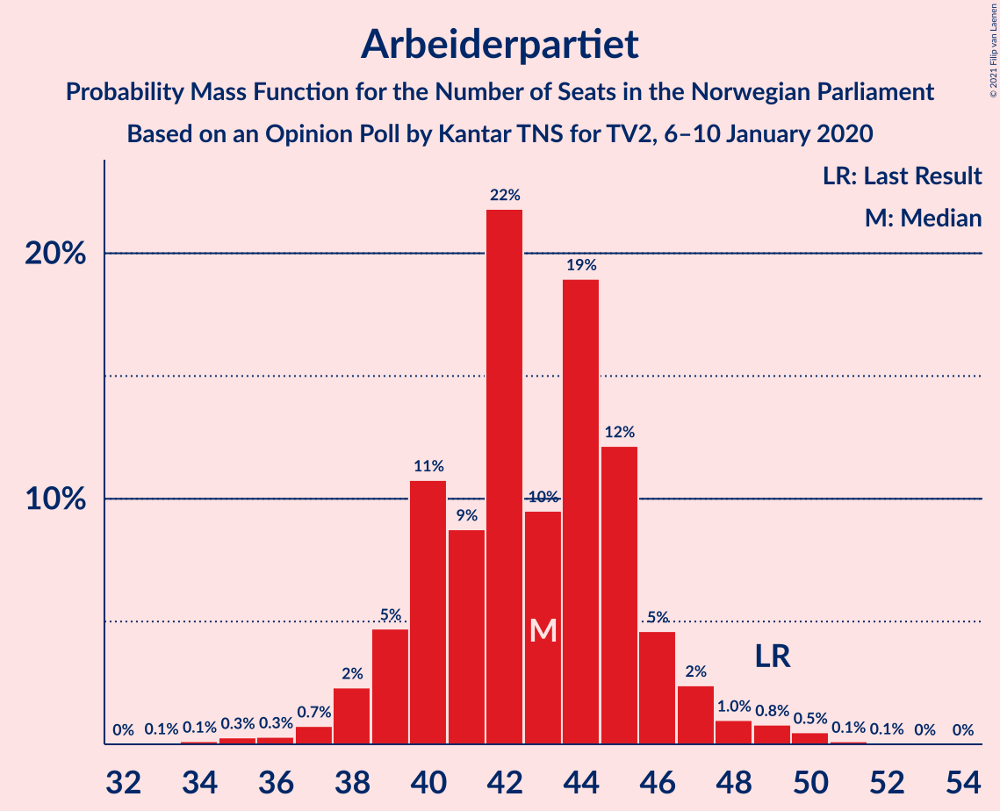
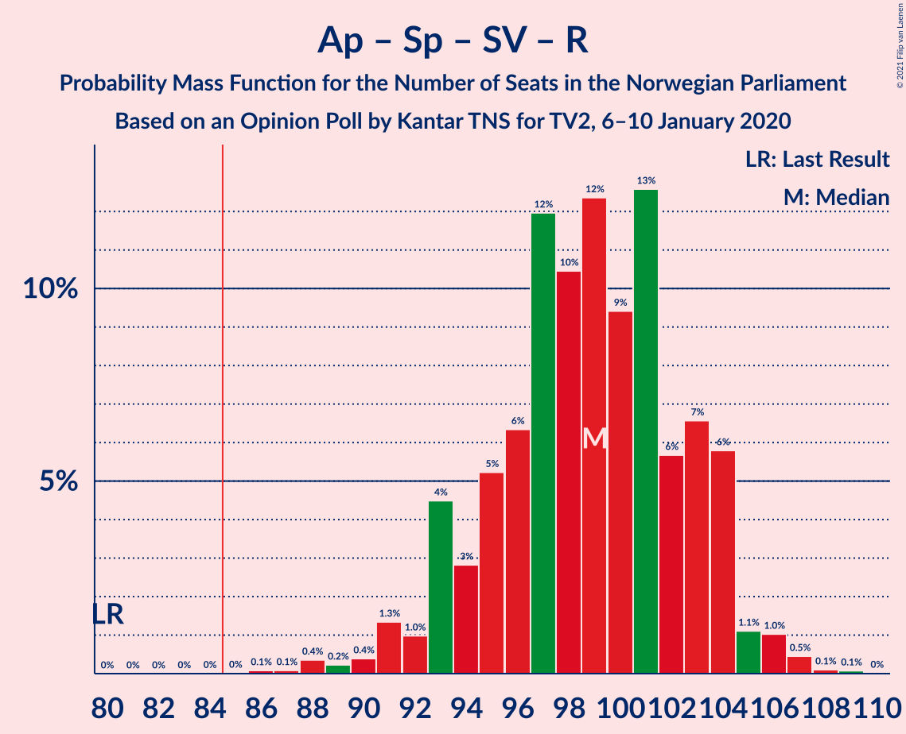
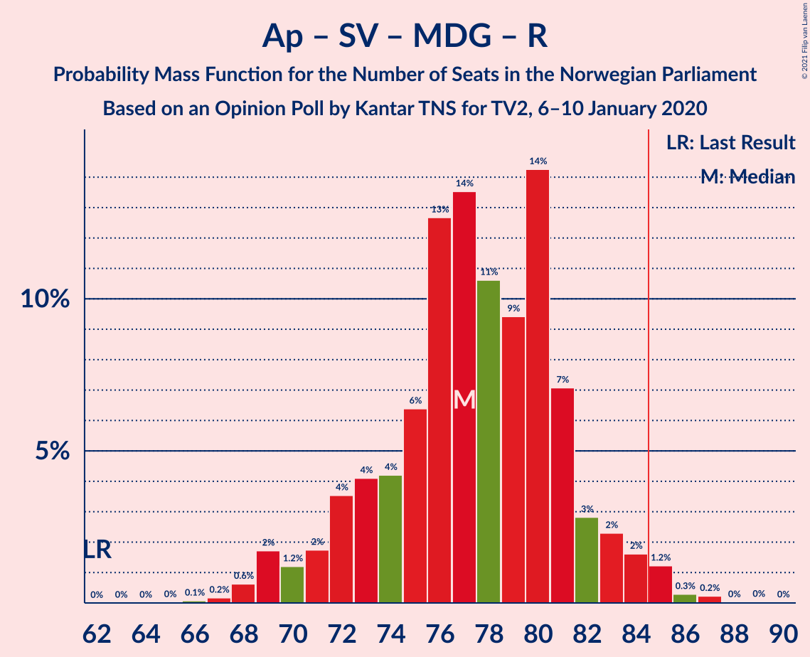
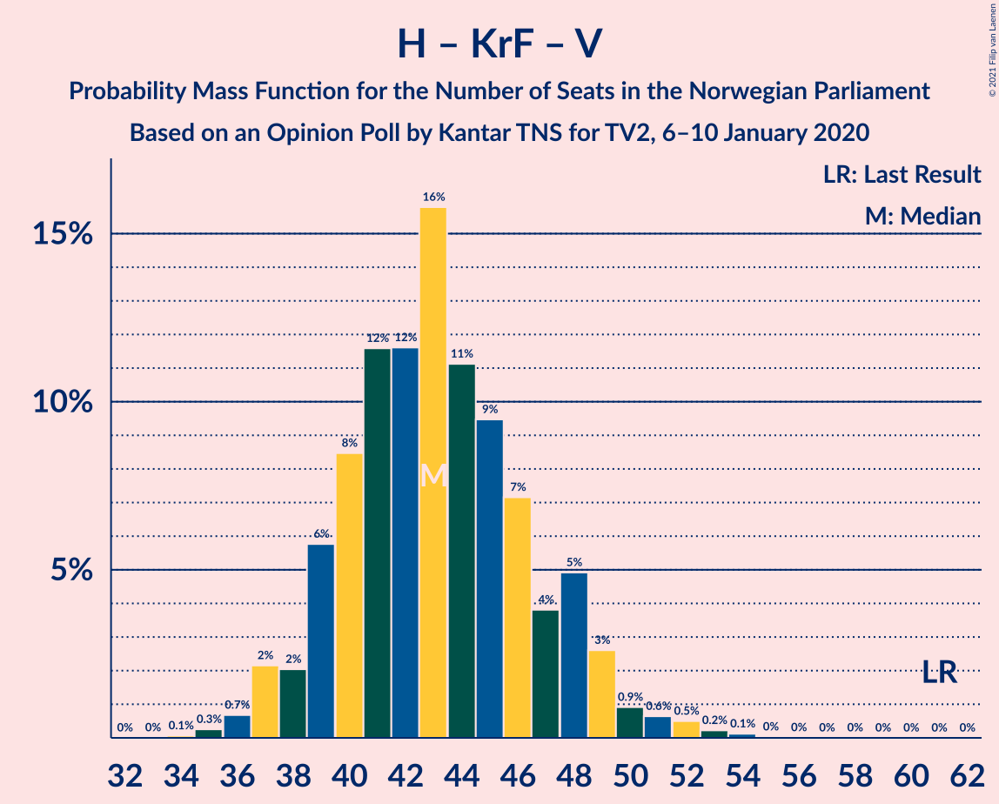

# Opinion Poll by Kantar TNS for TV2, 6–10 January 2020

<a href="#voting-intentions">Voting Intentions</a> | <a href="#seats">Seats</a> | <a href="#coalitions">Coalitions</a> | <a href="#technical-information">Technical Information</a>

## Voting Intentions

### Confidence Intervals

| Party | Last Result | Poll Result | 80% Confidence Interval | 90% Confidence Interval | 95% Confidence Interval | 99% Confidence Interval |
|:-----:|:-----------:|:-----------:|:-----------------------:|:-----------------------:|:-----------------------:|:-----------------------:|
| Arbeiderpartiet | 27.4% | 23.5% | 21.6–25.5% |21.1–26.0% |20.7–26.5% |19.8–27.5% |
| Høyre | 25.0% | 22.3% | 20.5–24.3% |20.0–24.9% |19.6–25.4% |18.7–26.3% |
| Senterpartiet | 10.3% | 17.9% | 16.3–19.8% |15.8–20.3% |15.4–20.8% |14.7–21.7% |
| Sosialistisk Venstreparti | 6.0% | 8.8% | 7.6–10.2% |7.3–10.6% |7.0–11.0% |6.5–11.7% |
| Fremskrittspartiet | 15.2% | 8.7% | 7.5–10.1% |7.2–10.5% |6.9–10.8% |6.4–11.5% |
| Miljøpartiet De Grønne | 3.2% | 6.5% | 5.5–7.8% |5.2–8.2% |5.0–8.5% |4.6–9.1% |
| Rødt | 2.4% | 4.6% | 3.8–5.7% |3.6–6.1% |3.4–6.3% |3.0–6.9% |
| Kristelig Folkeparti | 4.2% | 3.1% | 2.5–4.1% |2.3–4.4% |2.1–4.6% |1.8–5.1% |
| Venstre | 4.4% | 2.3% | 1.7–3.1% |1.6–3.3% |1.4–3.6% |1.2–4.0% |

*Note:* The poll result column reflects the actual value used in the calculations. Published results may vary slightly, and in addition be rounded to fewer digits.

## Seats

### Confidence Intervals

| Party | Last Result | Median | 80% Confidence Interval | 90% Confidence Interval | 95% Confidence Interval | 99% Confidence Interval |
|:-----:|:-----------:|:------:|:-----------------------:|:-----------------------:|:-----------------------:|:-----------------------:|
| <a href="#arbeiderpartiet">Arbeiderpartiet</a> | 49 | 43 | 40–45 |39–46 |38–47 |36–50 |
| <a href="#høyre">Høyre</a> | 45 | 40 | 36–43 |35–44 |34–45 |33–47 |
| <a href="#senterpartiet">Senterpartiet</a> | 19 | 33 | 30–36 |29–37 |27–38 |26–40 |
| <a href="#sosialistisk-venstreparti">Sosialistisk Venstreparti</a> | 11 | 16 | 13–18 |13–19 |12–19 |11–21 |
| <a href="#fremskrittspartiet">Fremskrittspartiet</a> | 27 | 15 | 13–18 |12–18 |12–19 |11–20 |
| <a href="#miljøpartiet-de-grønne">Miljøpartiet De Grønne</a> | 1 | 12 | 10–14 |9–14 |9–15 |8–16 |
| <a href="#rødt">Rødt</a> | 1 | 8 | 2–10 |2–10 |2–11 |2–12 |
| <a href="#kristelig-folkeparti">Kristelig Folkeparti</a> | 8 | 2 | 0–3 |0–7 |0–8 |0–8 |
| <a href="#venstre">Venstre</a> | 8 | 2 | 0–2 |0–2 |0–2 |0–2 |

### Arbeiderpartiet

*For a full overview of the results for this party, see the [Arbeiderpartiet](party-arbeiderpartiet.html) page.*

| Number of Seats | Probability | Accumulated | Special Marks |
|:---------------:|:-----------:|:-----------:|:-------------:|
| 33 | 0.1% | 100% |  |
| 34 | 0.1% | 99.9% |  |
| 35 | 0.3% | 99.8% |  |
| 36 | 0.3% | 99.5% |  |
| 37 | 0.7% | 99.2% |  |
| 38 | 2% | 98% |  |
| 39 | 5% | 96% |  |
| 40 | 11% | 91% |  |
| 41 | 9% | 81% |  |
| 42 | 22% | 72% |  |
| 43 | 10% | 50% | Median |
| 44 | 19% | 41% |  |
| 45 | 12% | 22% |  |
| 46 | 5% | 10% |  |
| 47 | 2% | 5% |  |
| 48 | 1.0% | 2% |  |
| 49 | 0.8% | 2% | Last Result |
| 50 | 0.5% | 0.7% |  |
| 51 | 0.1% | 0.2% |  |
| 52 | 0.1% | 0.1% |  |
| 53 | 0% | 0% |  |

### Høyre

*For a full overview of the results for this party, see the [Høyre](party-høyre.html) page.*

| Number of Seats | Probability | Accumulated | Special Marks |
|:---------------:|:-----------:|:-----------:|:-------------:|
| 31 | 0.1% | 100% |  |
| 32 | 0.1% | 99.9% |  |
| 33 | 0.6% | 99.8% |  |
| 34 | 3% | 99.2% |  |
| 35 | 4% | 97% |  |
| 36 | 8% | 92% |  |
| 37 | 11% | 84% |  |
| 38 | 10% | 73% |  |
| 39 | 10% | 63% |  |
| 40 | 15% | 53% | Median |
| 41 | 16% | 39% |  |
| 42 | 6% | 22% |  |
| 43 | 7% | 16% |  |
| 44 | 5% | 9% |  |
| 45 | 2% | 4% | Last Result |
| 46 | 1.0% | 2% |  |
| 47 | 0.8% | 1.1% |  |
| 48 | 0.1% | 0.3% |  |
| 49 | 0.1% | 0.1% |  |
| 50 | 0% | 0.1% |  |
| 51 | 0% | 0% |  |

### Senterpartiet

*For a full overview of the results for this party, see the [Senterpartiet](party-senterpartiet.html) page.*

| Number of Seats | Probability | Accumulated | Special Marks |
|:---------------:|:-----------:|:-----------:|:-------------:|
| 19 | 0% | 100% | Last Result |
| 20 | 0% | 100% |  |
| 21 | 0% | 100% |  |
| 22 | 0% | 100% |  |
| 23 | 0% | 100% |  |
| 24 | 0% | 100% |  |
| 25 | 0.1% | 100% |  |
| 26 | 0.6% | 99.9% |  |
| 27 | 2% | 99.3% |  |
| 28 | 2% | 97% |  |
| 29 | 3% | 95% |  |
| 30 | 15% | 92% |  |
| 31 | 7% | 77% |  |
| 32 | 14% | 70% |  |
| 33 | 9% | 55% | Median |
| 34 | 8% | 46% |  |
| 35 | 15% | 39% |  |
| 36 | 17% | 24% |  |
| 37 | 5% | 7% |  |
| 38 | 1.5% | 3% |  |
| 39 | 0.6% | 1.1% |  |
| 40 | 0.2% | 0.5% |  |
| 41 | 0.3% | 0.3% |  |
| 42 | 0.1% | 0.1% |  |
| 43 | 0% | 0% |  |

### Sosialistisk Venstreparti

*For a full overview of the results for this party, see the [Sosialistisk Venstreparti](party-sosialistiskvenstreparti.html) page.*

| Number of Seats | Probability | Accumulated | Special Marks |
|:---------------:|:-----------:|:-----------:|:-------------:|
| 10 | 0.1% | 100% |  |
| 11 | 1.1% | 99.9% | Last Result |
| 12 | 3% | 98.7% |  |
| 13 | 11% | 96% |  |
| 14 | 14% | 85% |  |
| 15 | 13% | 71% |  |
| 16 | 25% | 57% | Median |
| 17 | 13% | 32% |  |
| 18 | 11% | 19% |  |
| 19 | 6% | 7% |  |
| 20 | 0.9% | 2% |  |
| 21 | 0.6% | 0.7% |  |
| 22 | 0.1% | 0.1% |  |
| 23 | 0% | 0% |  |

### Fremskrittspartiet

*For a full overview of the results for this party, see the [Fremskrittspartiet](party-fremskrittspartiet.html) page.*

| Number of Seats | Probability | Accumulated | Special Marks |
|:---------------:|:-----------:|:-----------:|:-------------:|
| 10 | 0.2% | 100% |  |
| 11 | 1.2% | 99.7% |  |
| 12 | 4% | 98.5% |  |
| 13 | 11% | 94% |  |
| 14 | 14% | 83% |  |
| 15 | 22% | 69% | Median |
| 16 | 23% | 46% |  |
| 17 | 11% | 24% |  |
| 18 | 8% | 13% |  |
| 19 | 4% | 5% |  |
| 20 | 0.8% | 1.2% |  |
| 21 | 0.4% | 0.5% |  |
| 22 | 0.1% | 0.1% |  |
| 23 | 0% | 0% |  |
| 24 | 0% | 0% |  |
| 25 | 0% | 0% |  |
| 26 | 0% | 0% |  |
| 27 | 0% | 0% | Last Result |

### Miljøpartiet De Grønne

*For a full overview of the results for this party, see the [Miljøpartiet De Grønne](party-miljøpartietdegrønne.html) page.*

| Number of Seats | Probability | Accumulated | Special Marks |
|:---------------:|:-----------:|:-----------:|:-------------:|
| 1 | 0% | 100% | Last Result |
| 2 | 0% | 100% |  |
| 3 | 0% | 100% |  |
| 4 | 0% | 100% |  |
| 5 | 0% | 99.9% |  |
| 6 | 0% | 99.9% |  |
| 7 | 0.1% | 99.9% |  |
| 8 | 1.4% | 99.8% |  |
| 9 | 6% | 98% |  |
| 10 | 14% | 92% |  |
| 11 | 24% | 78% |  |
| 12 | 24% | 54% | Median |
| 13 | 19% | 30% |  |
| 14 | 8% | 11% |  |
| 15 | 2% | 3% |  |
| 16 | 0.6% | 0.8% |  |
| 17 | 0.2% | 0.2% |  |
| 18 | 0% | 0.1% |  |
| 19 | 0% | 0% |  |

### Rødt

*For a full overview of the results for this party, see the [Rødt](party-rødt.html) page.*

| Number of Seats | Probability | Accumulated | Special Marks |
|:---------------:|:-----------:|:-----------:|:-------------:|
| 1 | 0.5% | 100% | Last Result |
| 2 | 16% | 99.5% |  |
| 3 | 0% | 83% |  |
| 4 | 0% | 83% |  |
| 5 | 0% | 83% |  |
| 6 | 0.1% | 83% |  |
| 7 | 18% | 83% |  |
| 8 | 27% | 65% | Median |
| 9 | 23% | 38% |  |
| 10 | 12% | 15% |  |
| 11 | 2% | 3% |  |
| 12 | 0.9% | 1.2% |  |
| 13 | 0.3% | 0.3% |  |
| 14 | 0% | 0% |  |

### Kristelig Folkeparti

*For a full overview of the results for this party, see the [Kristelig Folkeparti](party-kristeligfolkeparti.html) page.*

| Number of Seats | Probability | Accumulated | Special Marks |
|:---------------:|:-----------:|:-----------:|:-------------:|
| 0 | 12% | 100% |  |
| 1 | 36% | 88% |  |
| 2 | 15% | 53% | Median |
| 3 | 28% | 37% |  |
| 4 | 0% | 9% |  |
| 5 | 0% | 9% |  |
| 6 | 0.1% | 9% |  |
| 7 | 6% | 9% |  |
| 8 | 2% | 3% | Last Result |
| 9 | 0.4% | 0.5% |  |
| 10 | 0.1% | 0.1% |  |
| 11 | 0% | 0% |  |

### Venstre

*For a full overview of the results for this party, see the [Venstre](party-venstre.html) page.*

| Number of Seats | Probability | Accumulated | Special Marks |
|:---------------:|:-----------:|:-----------:|:-------------:|
| 0 | 16% | 100% |  |
| 1 | 32% | 84% |  |
| 2 | 52% | 53% | Median |
| 3 | 0.1% | 0.5% |  |
| 4 | 0% | 0.4% |  |
| 5 | 0% | 0.4% |  |
| 6 | 0% | 0.4% |  |
| 7 | 0.3% | 0.4% |  |
| 8 | 0.1% | 0.1% | Last Result |
| 9 | 0% | 0% |  |

## Coalitions

### Confidence Intervals

| Coalition | Last Result | Median | Majority? | 80% Confidence Interval | 90% Confidence Interval | 95% Confidence Interval | 99% Confidence Interval |
|:---------:|:-----------:|:------:|:---------:|:-----------------------:|:-----------------------:|:-----------------------:|:-----------------------:|
| Arbeiderpartiet – Senterpartiet – Sosialistisk Venstreparti – Miljøpartiet De Grønne – Rødt | 81 | 111 | 100% | 106–115 | 105–116 | 103–117 | 100–118 |
| Arbeiderpartiet – Senterpartiet – Sosialistisk Venstreparti – Miljøpartiet De Grønne – Kristelig Folkeparti | 88 | 105 | 100% | 101–110 | 100–111 | 99–112 | 96–114 |
| Arbeiderpartiet – Senterpartiet – Sosialistisk Venstreparti – Miljøpartiet De Grønne | 80 | 103 | 100% | 99–108 | 98–109 | 96–110 | 94–111 |
| Arbeiderpartiet – Senterpartiet – Sosialistisk Venstreparti – Rødt | 80 | 99 | 100% | 94–103 | 93–104 | 91–105 | 88–107 |
| Høyre – Senterpartiet – Fremskrittspartiet – Kristelig Folkeparti – Venstre | 107 | 91 | 98% | 88–96 | 86–98 | 85–100 | 83–101 |
| Arbeiderpartiet – Senterpartiet – Sosialistisk Venstreparti | 79 | 91 | 98% | 87–95 | 86–97 | 85–98 | 82–100 |
| Arbeiderpartiet – Senterpartiet – Miljøpartiet De Grønne – Kristelig Folkeparti | 77 | 90 | 90% | 84–95 | 84–96 | 83–97 | 81–99 |
| Arbeiderpartiet – Senterpartiet – Kristelig Folkeparti | 76 | 78 | 4% | 73–83 | 72–84 | 71–86 | 69–88 |
| Arbeiderpartiet – Sosialistisk Venstreparti – Miljøpartiet De Grønne – Rødt | 62 | 77 | 2% | 73–81 | 71–83 | 69–84 | 68–86 |
| Arbeiderpartiet – Senterpartiet | 68 | 76 | 0.2% | 71–80 | 70–81 | 69–82 | 67–84 |
| Høyre – Fremskrittspartiet – Miljøpartiet De Grønne – Kristelig Folkeparti – Venstre | 89 | 70 | 0% | 66–75 | 65–76 | 64–77 | 62–81 |
| Høyre – Fremskrittspartiet – Kristelig Folkeparti – Venstre | 88 | 58 | 0% | 54–63 | 53–64 | 52–65 | 51–69 |
| Arbeiderpartiet – Sosialistisk Venstreparti | 60 | 58 | 0% | 55–62 | 53–63 | 52–64 | 50–67 |
| Høyre – Fremskrittspartiet – Venstre | 80 | 56 | 0% | 51–61 | 51–62 | 50–63 | 49–65 |
| Høyre – Fremskrittspartiet | 72 | 55 | 0% | 50–60 | 49–60 | 48–62 | 47–64 |
| Høyre – Kristelig Folkeparti – Venstre | 61 | 43 | 0% | 39–47 | 38–49 | 37–49 | 36–52 |
| Senterpartiet – Kristelig Folkeparti – Venstre | 35 | 36 | 0% | 33–41 | 32–43 | 30–44 | 28–47 |

### Arbeiderpartiet – Senterpartiet – Sosialistisk Venstreparti – Miljøpartiet De Grønne – Rødt

| Number of Seats | Probability | Accumulated | Special Marks |
|:---------------:|:-----------:|:-----------:|:-------------:|
| 81 | 0% | 100% | Last Result |
| 82 | 0% | 100% |  |
| 83 | 0% | 100% |  |
| 84 | 0% | 100% |  |
| 85 | 0% | 100% | Majority |
| 86 | 0% | 100% |  |
| 87 | 0% | 100% |  |
| 88 | 0% | 100% |  |
| 89 | 0% | 100% |  |
| 90 | 0% | 100% |  |
| 91 | 0% | 100% |  |
| 92 | 0% | 100% |  |
| 93 | 0% | 100% |  |
| 94 | 0% | 100% |  |
| 95 | 0% | 100% |  |
| 96 | 0% | 100% |  |
| 97 | 0% | 100% |  |
| 98 | 0% | 100% |  |
| 99 | 0.1% | 99.9% |  |
| 100 | 0.4% | 99.9% |  |
| 101 | 0.3% | 99.4% |  |
| 102 | 0.4% | 99.1% |  |
| 103 | 1.3% | 98.8% |  |
| 104 | 2% | 97% |  |
| 105 | 3% | 95% |  |
| 106 | 7% | 92% |  |
| 107 | 5% | 85% |  |
| 108 | 6% | 80% |  |
| 109 | 7% | 74% |  |
| 110 | 13% | 67% |  |
| 111 | 13% | 54% |  |
| 112 | 16% | 41% | Median |
| 113 | 6% | 25% |  |
| 114 | 6% | 18% |  |
| 115 | 6% | 12% |  |
| 116 | 3% | 6% |  |
| 117 | 2% | 3% |  |
| 118 | 0.7% | 1.0% |  |
| 119 | 0.3% | 0.4% |  |
| 120 | 0.1% | 0.1% |  |
| 121 | 0% | 0% |  |

### Arbeiderpartiet – Senterpartiet – Sosialistisk Venstreparti – Miljøpartiet De Grønne – Kristelig Folkeparti

| Number of Seats | Probability | Accumulated | Special Marks |
|:---------------:|:-----------:|:-----------:|:-------------:|
| 88 | 0% | 100% | Last Result |
| 89 | 0% | 100% |  |
| 90 | 0% | 100% |  |
| 91 | 0% | 100% |  |
| 92 | 0% | 100% |  |
| 93 | 0% | 100% |  |
| 94 | 0% | 100% |  |
| 95 | 0.4% | 99.9% |  |
| 96 | 0.3% | 99.5% |  |
| 97 | 0.4% | 99.2% |  |
| 98 | 1.0% | 98.8% |  |
| 99 | 3% | 98% |  |
| 100 | 4% | 95% |  |
| 101 | 5% | 91% |  |
| 102 | 12% | 86% |  |
| 103 | 7% | 75% |  |
| 104 | 12% | 67% |  |
| 105 | 9% | 55% |  |
| 106 | 10% | 47% | Median |
| 107 | 9% | 37% |  |
| 108 | 8% | 28% |  |
| 109 | 6% | 20% |  |
| 110 | 4% | 14% |  |
| 111 | 5% | 10% |  |
| 112 | 3% | 5% |  |
| 113 | 1.0% | 2% |  |
| 114 | 0.7% | 1.1% |  |
| 115 | 0.3% | 0.4% |  |
| 116 | 0.1% | 0.1% |  |
| 117 | 0% | 0.1% |  |
| 118 | 0% | 0% |  |

### Arbeiderpartiet – Senterpartiet – Sosialistisk Venstreparti – Miljøpartiet De Grønne

| Number of Seats | Probability | Accumulated | Special Marks |
|:---------------:|:-----------:|:-----------:|:-------------:|
| 80 | 0% | 100% | Last Result |
| 81 | 0% | 100% |  |
| 82 | 0% | 100% |  |
| 83 | 0% | 100% |  |
| 84 | 0% | 100% |  |
| 85 | 0% | 100% | Majority |
| 86 | 0% | 100% |  |
| 87 | 0% | 100% |  |
| 88 | 0% | 100% |  |
| 89 | 0% | 100% |  |
| 90 | 0% | 100% |  |
| 91 | 0% | 100% |  |
| 92 | 0.1% | 99.9% |  |
| 93 | 0.1% | 99.8% |  |
| 94 | 0.5% | 99.8% |  |
| 95 | 0.9% | 99.3% |  |
| 96 | 1.0% | 98% |  |
| 97 | 1.2% | 97% |  |
| 98 | 5% | 96% |  |
| 99 | 6% | 91% |  |
| 100 | 6% | 85% |  |
| 101 | 11% | 79% |  |
| 102 | 13% | 68% |  |
| 103 | 9% | 55% |  |
| 104 | 11% | 46% | Median |
| 105 | 13% | 35% |  |
| 106 | 8% | 22% |  |
| 107 | 4% | 14% |  |
| 108 | 4% | 11% |  |
| 109 | 2% | 6% |  |
| 110 | 3% | 4% |  |
| 111 | 1.1% | 2% |  |
| 112 | 0.2% | 0.5% |  |
| 113 | 0.2% | 0.3% |  |
| 114 | 0.1% | 0.1% |  |
| 115 | 0% | 0% |  |

### Arbeiderpartiet – Senterpartiet – Sosialistisk Venstreparti – Rødt

| Number of Seats | Probability | Accumulated | Special Marks |
|:---------------:|:-----------:|:-----------:|:-------------:|
| 80 | 0% | 100% | Last Result |
| 81 | 0% | 100% |  |
| 82 | 0% | 100% |  |
| 83 | 0% | 100% |  |
| 84 | 0% | 100% |  |
| 85 | 0% | 100% | Majority |
| 86 | 0.1% | 100% |  |
| 87 | 0.1% | 99.9% |  |
| 88 | 0.4% | 99.8% |  |
| 89 | 0.2% | 99.4% |  |
| 90 | 0.4% | 99.2% |  |
| 91 | 1.3% | 98.8% |  |
| 92 | 1.0% | 97% |  |
| 93 | 4% | 96% |  |
| 94 | 3% | 92% |  |
| 95 | 5% | 89% |  |
| 96 | 6% | 84% |  |
| 97 | 12% | 78% |  |
| 98 | 10% | 66% |  |
| 99 | 12% | 55% |  |
| 100 | 9% | 43% | Median |
| 101 | 13% | 33% |  |
| 102 | 6% | 21% |  |
| 103 | 7% | 15% |  |
| 104 | 6% | 9% |  |
| 105 | 1.1% | 3% |  |
| 106 | 1.0% | 2% |  |
| 107 | 0.5% | 0.7% |  |
| 108 | 0.1% | 0.2% |  |
| 109 | 0.1% | 0.1% |  |
| 110 | 0% | 0% |  |

### Høyre – Senterpartiet – Fremskrittspartiet – Kristelig Folkeparti – Venstre

| Number of Seats | Probability | Accumulated | Special Marks |
|:---------------:|:-----------:|:-----------:|:-------------:|
| 80 | 0% | 100% |  |
| 81 | 0% | 99.9% |  |
| 82 | 0.2% | 99.9% |  |
| 83 | 0.3% | 99.7% |  |
| 84 | 1.2% | 99.4% |  |
| 85 | 2% | 98% | Majority |
| 86 | 2% | 96% |  |
| 87 | 3% | 94% |  |
| 88 | 7% | 91% |  |
| 89 | 14% | 84% |  |
| 90 | 9% | 70% |  |
| 91 | 11% | 60% |  |
| 92 | 14% | 50% | Median |
| 93 | 13% | 36% |  |
| 94 | 6% | 23% |  |
| 95 | 4% | 17% |  |
| 96 | 4% | 13% |  |
| 97 | 3% | 9% |  |
| 98 | 2% | 5% |  |
| 99 | 1.1% | 4% |  |
| 100 | 2% | 3% |  |
| 101 | 0.6% | 0.9% |  |
| 102 | 0.2% | 0.3% |  |
| 103 | 0.1% | 0.1% |  |
| 104 | 0% | 0% |  |
| 105 | 0% | 0% |  |
| 106 | 0% | 0% |  |
| 107 | 0% | 0% | Last Result |

### Arbeiderpartiet – Senterpartiet – Sosialistisk Venstreparti

| Number of Seats | Probability | Accumulated | Special Marks |
|:---------------:|:-----------:|:-----------:|:-------------:|
| 79 | 0% | 100% | Last Result |
| 80 | 0% | 99.9% |  |
| 81 | 0.1% | 99.9% |  |
| 82 | 0.5% | 99.8% |  |
| 83 | 0.5% | 99.4% |  |
| 84 | 1.0% | 98.8% |  |
| 85 | 2% | 98% | Majority |
| 86 | 3% | 96% |  |
| 87 | 3% | 93% |  |
| 88 | 11% | 90% |  |
| 89 | 8% | 79% |  |
| 90 | 10% | 71% |  |
| 91 | 12% | 60% |  |
| 92 | 8% | 48% | Median |
| 93 | 11% | 40% |  |
| 94 | 11% | 30% |  |
| 95 | 9% | 18% |  |
| 96 | 5% | 10% |  |
| 97 | 2% | 5% |  |
| 98 | 1.5% | 4% |  |
| 99 | 1.4% | 2% |  |
| 100 | 0.3% | 0.6% |  |
| 101 | 0.2% | 0.3% |  |
| 102 | 0% | 0.1% |  |
| 103 | 0% | 0% |  |

### Arbeiderpartiet – Senterpartiet – Miljøpartiet De Grønne – Kristelig Folkeparti

| Number of Seats | Probability | Accumulated | Special Marks |
|:---------------:|:-----------:|:-----------:|:-------------:|
| 77 | 0% | 100% | Last Result |
| 78 | 0% | 100% |  |
| 79 | 0.1% | 99.9% |  |
| 80 | 0.2% | 99.9% |  |
| 81 | 0.9% | 99.7% |  |
| 82 | 0.8% | 98.8% |  |
| 83 | 3% | 98% |  |
| 84 | 6% | 95% |  |
| 85 | 6% | 90% | Majority |
| 86 | 10% | 84% |  |
| 87 | 4% | 74% |  |
| 88 | 10% | 70% |  |
| 89 | 10% | 60% |  |
| 90 | 9% | 50% | Median |
| 91 | 7% | 42% |  |
| 92 | 10% | 35% |  |
| 93 | 8% | 25% |  |
| 94 | 6% | 17% |  |
| 95 | 5% | 11% |  |
| 96 | 2% | 6% |  |
| 97 | 2% | 4% |  |
| 98 | 2% | 2% |  |
| 99 | 0.3% | 0.6% |  |
| 100 | 0.2% | 0.3% |  |
| 101 | 0.1% | 0.1% |  |
| 102 | 0% | 0.1% |  |
| 103 | 0% | 0% |  |

### Arbeiderpartiet – Senterpartiet – Kristelig Folkeparti

| Number of Seats | Probability | Accumulated | Special Marks |
|:---------------:|:-----------:|:-----------:|:-------------:|
| 67 | 0.1% | 100% |  |
| 68 | 0.3% | 99.9% |  |
| 69 | 0.4% | 99.6% |  |
| 70 | 0.8% | 99.2% |  |
| 71 | 3% | 98% |  |
| 72 | 2% | 96% |  |
| 73 | 12% | 93% |  |
| 74 | 6% | 82% |  |
| 75 | 4% | 76% |  |
| 76 | 8% | 71% | Last Result |
| 77 | 8% | 63% |  |
| 78 | 11% | 56% | Median |
| 79 | 9% | 45% |  |
| 80 | 6% | 36% |  |
| 81 | 11% | 30% |  |
| 82 | 5% | 19% |  |
| 83 | 6% | 14% |  |
| 84 | 3% | 8% |  |
| 85 | 1.1% | 4% | Majority |
| 86 | 1.3% | 3% |  |
| 87 | 1.2% | 2% |  |
| 88 | 0.4% | 0.6% |  |
| 89 | 0.1% | 0.2% |  |
| 90 | 0.1% | 0.1% |  |
| 91 | 0% | 0% |  |

### Arbeiderpartiet – Sosialistisk Venstreparti – Miljøpartiet De Grønne – Rødt

| Number of Seats | Probability | Accumulated | Special Marks |
|:---------------:|:-----------:|:-----------:|:-------------:|
| 62 | 0% | 100% | Last Result |
| 63 | 0% | 100% |  |
| 64 | 0% | 100% |  |
| 65 | 0% | 100% |  |
| 66 | 0.1% | 100% |  |
| 67 | 0.2% | 99.9% |  |
| 68 | 0.6% | 99.7% |  |
| 69 | 2% | 99.1% |  |
| 70 | 1.2% | 97% |  |
| 71 | 2% | 96% |  |
| 72 | 4% | 94% |  |
| 73 | 4% | 91% |  |
| 74 | 4% | 87% |  |
| 75 | 6% | 83% |  |
| 76 | 13% | 76% |  |
| 77 | 14% | 63% |  |
| 78 | 11% | 50% |  |
| 79 | 9% | 39% | Median |
| 80 | 14% | 30% |  |
| 81 | 7% | 16% |  |
| 82 | 3% | 9% |  |
| 83 | 2% | 6% |  |
| 84 | 2% | 3% |  |
| 85 | 1.2% | 2% | Majority |
| 86 | 0.3% | 0.6% |  |
| 87 | 0.2% | 0.3% |  |
| 88 | 0% | 0.1% |  |
| 89 | 0% | 0.1% |  |
| 90 | 0% | 0% |  |

### Arbeiderpartiet – Senterpartiet

| Number of Seats | Probability | Accumulated | Special Marks |
|:---------------:|:-----------:|:-----------:|:-------------:|
| 64 | 0% | 100% |  |
| 65 | 0.1% | 99.9% |  |
| 66 | 0.1% | 99.8% |  |
| 67 | 0.7% | 99.8% |  |
| 68 | 1.2% | 99.1% | Last Result |
| 69 | 2% | 98% |  |
| 70 | 2% | 96% |  |
| 71 | 5% | 94% |  |
| 72 | 11% | 89% |  |
| 73 | 7% | 78% |  |
| 74 | 7% | 71% |  |
| 75 | 6% | 63% |  |
| 76 | 14% | 57% | Median |
| 77 | 10% | 44% |  |
| 78 | 9% | 33% |  |
| 79 | 8% | 24% |  |
| 80 | 10% | 16% |  |
| 81 | 4% | 7% |  |
| 82 | 1.2% | 3% |  |
| 83 | 1.5% | 2% |  |
| 84 | 0.3% | 0.5% |  |
| 85 | 0.1% | 0.2% | Majority |
| 86 | 0.1% | 0.1% |  |
| 87 | 0% | 0% |  |

### Høyre – Fremskrittspartiet – Miljøpartiet De Grønne – Kristelig Folkeparti – Venstre

| Number of Seats | Probability | Accumulated | Special Marks |
|:---------------:|:-----------:|:-----------:|:-------------:|
| 59 | 0% | 100% |  |
| 60 | 0.1% | 99.9% |  |
| 61 | 0.1% | 99.9% |  |
| 62 | 0.5% | 99.8% |  |
| 63 | 1.1% | 99.3% |  |
| 64 | 1.2% | 98% |  |
| 65 | 6% | 97% |  |
| 66 | 7% | 91% |  |
| 67 | 6% | 85% |  |
| 68 | 13% | 79% |  |
| 69 | 9% | 66% |  |
| 70 | 12% | 57% |  |
| 71 | 10% | 44% | Median |
| 72 | 12% | 34% |  |
| 73 | 6% | 22% |  |
| 74 | 5% | 16% |  |
| 75 | 3% | 11% |  |
| 76 | 4% | 8% |  |
| 77 | 0.9% | 3% |  |
| 78 | 1.3% | 2% |  |
| 79 | 0.4% | 1.1% |  |
| 80 | 0.2% | 0.8% |  |
| 81 | 0.4% | 0.5% |  |
| 82 | 0.1% | 0.2% |  |
| 83 | 0.1% | 0.1% |  |
| 84 | 0% | 0% |  |
| 85 | 0% | 0% | Majority |
| 86 | 0% | 0% |  |
| 87 | 0% | 0% |  |
| 88 | 0% | 0% |  |
| 89 | 0% | 0% | Last Result |

### Høyre – Fremskrittspartiet – Kristelig Folkeparti – Venstre

| Number of Seats | Probability | Accumulated | Special Marks |
|:---------------:|:-----------:|:-----------:|:-------------:|
| 49 | 0.1% | 100% |  |
| 50 | 0.3% | 99.9% |  |
| 51 | 0.7% | 99.6% |  |
| 52 | 2% | 98.9% |  |
| 53 | 3% | 97% |  |
| 54 | 6% | 94% |  |
| 55 | 6% | 88% |  |
| 56 | 7% | 82% |  |
| 57 | 16% | 75% |  |
| 58 | 13% | 59% |  |
| 59 | 13% | 46% | Median |
| 60 | 7% | 32% |  |
| 61 | 6% | 26% |  |
| 62 | 5% | 20% |  |
| 63 | 7% | 14% |  |
| 64 | 3% | 7% |  |
| 65 | 2% | 4% |  |
| 66 | 1.3% | 2% |  |
| 67 | 0.3% | 1.2% |  |
| 68 | 0.3% | 0.8% |  |
| 69 | 0.4% | 0.5% |  |
| 70 | 0.1% | 0.1% |  |
| 71 | 0% | 0.1% |  |
| 72 | 0% | 0% |  |
| 73 | 0% | 0% |  |
| 74 | 0% | 0% |  |
| 75 | 0% | 0% |  |
| 76 | 0% | 0% |  |
| 77 | 0% | 0% |  |
| 78 | 0% | 0% |  |
| 79 | 0% | 0% |  |
| 80 | 0% | 0% |  |
| 81 | 0% | 0% |  |
| 82 | 0% | 0% |  |
| 83 | 0% | 0% |  |
| 84 | 0% | 0% |  |
| 85 | 0% | 0% | Majority |
| 86 | 0% | 0% |  |
| 87 | 0% | 0% |  |
| 88 | 0% | 0% | Last Result |

### Arbeiderpartiet – Sosialistisk Venstreparti

| Number of Seats | Probability | Accumulated | Special Marks |
|:---------------:|:-----------:|:-----------:|:-------------:|
| 48 | 0% | 100% |  |
| 49 | 0.1% | 99.9% |  |
| 50 | 0.3% | 99.8% |  |
| 51 | 0.6% | 99.4% |  |
| 52 | 2% | 98.8% |  |
| 53 | 2% | 97% |  |
| 54 | 4% | 95% |  |
| 55 | 5% | 91% |  |
| 56 | 10% | 86% |  |
| 57 | 13% | 76% |  |
| 58 | 19% | 63% |  |
| 59 | 14% | 44% | Median |
| 60 | 7% | 31% | Last Result |
| 61 | 10% | 24% |  |
| 62 | 4% | 14% |  |
| 63 | 5% | 9% |  |
| 64 | 3% | 5% |  |
| 65 | 1.1% | 2% |  |
| 66 | 0.5% | 1.1% |  |
| 67 | 0.3% | 0.6% |  |
| 68 | 0.1% | 0.2% |  |
| 69 | 0% | 0.1% |  |
| 70 | 0% | 0% |  |

### Høyre – Fremskrittspartiet – Venstre

| Number of Seats | Probability | Accumulated | Special Marks |
|:---------------:|:-----------:|:-----------:|:-------------:|
| 47 | 0.1% | 100% |  |
| 48 | 0.3% | 99.8% |  |
| 49 | 2% | 99.5% |  |
| 50 | 2% | 98% |  |
| 51 | 6% | 95% |  |
| 52 | 5% | 89% |  |
| 53 | 7% | 84% |  |
| 54 | 7% | 78% |  |
| 55 | 9% | 70% |  |
| 56 | 13% | 62% |  |
| 57 | 12% | 49% | Median |
| 58 | 13% | 37% |  |
| 59 | 7% | 24% |  |
| 60 | 4% | 17% |  |
| 61 | 5% | 13% |  |
| 62 | 4% | 8% |  |
| 63 | 2% | 3% |  |
| 64 | 0.6% | 2% |  |
| 65 | 0.6% | 1.0% |  |
| 66 | 0.2% | 0.4% |  |
| 67 | 0.1% | 0.2% |  |
| 68 | 0% | 0.1% |  |
| 69 | 0% | 0% |  |
| 70 | 0% | 0% |  |
| 71 | 0% | 0% |  |
| 72 | 0% | 0% |  |
| 73 | 0% | 0% |  |
| 74 | 0% | 0% |  |
| 75 | 0% | 0% |  |
| 76 | 0% | 0% |  |
| 77 | 0% | 0% |  |
| 78 | 0% | 0% |  |
| 79 | 0% | 0% |  |
| 80 | 0% | 0% | Last Result |

### Høyre – Fremskrittspartiet

| Number of Seats | Probability | Accumulated | Special Marks |
|:---------------:|:-----------:|:-----------:|:-------------:|
| 46 | 0.1% | 100% |  |
| 47 | 0.7% | 99.8% |  |
| 48 | 2% | 99.1% |  |
| 49 | 2% | 97% |  |
| 50 | 7% | 94% |  |
| 51 | 4% | 87% |  |
| 52 | 7% | 83% |  |
| 53 | 8% | 76% |  |
| 54 | 12% | 69% |  |
| 55 | 12% | 56% | Median |
| 56 | 16% | 44% |  |
| 57 | 8% | 28% |  |
| 58 | 6% | 21% |  |
| 59 | 4% | 15% |  |
| 60 | 6% | 11% |  |
| 61 | 2% | 5% |  |
| 62 | 2% | 3% |  |
| 63 | 0.6% | 1.3% |  |
| 64 | 0.4% | 0.7% |  |
| 65 | 0.2% | 0.3% |  |
| 66 | 0.1% | 0.1% |  |
| 67 | 0% | 0% |  |
| 68 | 0% | 0% |  |
| 69 | 0% | 0% |  |
| 70 | 0% | 0% |  |
| 71 | 0% | 0% |  |
| 72 | 0% | 0% | Last Result |

### Høyre – Kristelig Folkeparti – Venstre

| Number of Seats | Probability | Accumulated | Special Marks |
|:---------------:|:-----------:|:-----------:|:-------------:|
| 34 | 0.1% | 100% |  |
| 35 | 0.3% | 99.9% |  |
| 36 | 0.7% | 99.7% |  |
| 37 | 2% | 99.0% |  |
| 38 | 2% | 97% |  |
| 39 | 6% | 95% |  |
| 40 | 8% | 89% |  |
| 41 | 12% | 81% |  |
| 42 | 12% | 69% |  |
| 43 | 16% | 57% |  |
| 44 | 11% | 42% | Median |
| 45 | 9% | 30% |  |
| 46 | 7% | 21% |  |
| 47 | 4% | 14% |  |
| 48 | 5% | 10% |  |
| 49 | 3% | 5% |  |
| 50 | 0.9% | 2% |  |
| 51 | 0.6% | 2% |  |
| 52 | 0.5% | 0.9% |  |
| 53 | 0.2% | 0.4% |  |
| 54 | 0.1% | 0.2% |  |
| 55 | 0% | 0.1% |  |
| 56 | 0% | 0% |  |
| 57 | 0% | 0% |  |
| 58 | 0% | 0% |  |
| 59 | 0% | 0% |  |
| 60 | 0% | 0% |  |
| 61 | 0% | 0% | Last Result |

### Senterpartiet – Kristelig Folkeparti – Venstre

| Number of Seats | Probability | Accumulated | Special Marks |
|:---------------:|:-----------:|:-----------:|:-------------:|
| 28 | 0.7% | 100% |  |
| 29 | 0.8% | 99.3% |  |
| 30 | 1.0% | 98% |  |
| 31 | 2% | 97% |  |
| 32 | 3% | 95% |  |
| 33 | 13% | 93% |  |
| 34 | 9% | 80% |  |
| 35 | 9% | 70% | Last Result |
| 36 | 13% | 61% |  |
| 37 | 9% | 48% | Median |
| 38 | 10% | 40% |  |
| 39 | 10% | 30% |  |
| 40 | 7% | 20% |  |
| 41 | 5% | 13% |  |
| 42 | 2% | 8% |  |
| 43 | 2% | 6% |  |
| 44 | 2% | 4% |  |
| 45 | 0.9% | 2% |  |
| 46 | 0.4% | 1.0% |  |
| 47 | 0.4% | 0.6% |  |
| 48 | 0.1% | 0.1% |  |
| 49 | 0% | 0.1% |  |
| 50 | 0% | 0% |  |

## Technical Information

### Opinion Poll

+ **Polling firm:** Kantar TNS
+ **Commissioner(s):** TV2
+ **Fieldwork period:** 6–10 January 2020

### Calculations

+ **Sample size:** 797
+ **Simulations done:** 1,048,576
+ **Error estimate:** 1.95%

