# Opinion Poll by Kantar TNS for TV2, 6–10 January 2020

<a href="#voting-intentions">Voting Intentions</a> | <a href="#seats">Seats</a> | <a href="#coalitions">Coalitions</a> | <a href="#technical-information">Technical Information</a>

## Voting Intentions

### Confidence Intervals

| Party | Last Result | Poll Result | 80% Confidence Interval | 90% Confidence Interval | 95% Confidence Interval | 99% Confidence Interval |
|:-----:|:-----------:|:-----------:|:-----------------------:|:-----------------------:|:-----------------------:|:-----------------------:|
| Arbeiderpartiet | 27.4% | 23.5% | 21.6–25.5% |21.1–26.0% |20.7–26.5% |19.8–27.5% |
| Høyre | 25.0% | 22.3% | 20.5–24.3% |20.0–24.9% |19.6–25.4% |18.7–26.3% |
| Senterpartiet | 10.3% | 17.9% | 16.3–19.8% |15.8–20.3% |15.4–20.8% |14.7–21.7% |
| Sosialistisk Venstreparti | 6.0% | 8.8% | 7.6–10.2% |7.3–10.6% |7.0–11.0% |6.5–11.7% |
| Fremskrittspartiet | 15.2% | 8.7% | 7.5–10.1% |7.2–10.5% |6.9–10.8% |6.4–11.5% |
| Miljøpartiet De Grønne | 3.2% | 6.5% | 5.5–7.8% |5.2–8.2% |5.0–8.5% |4.6–9.1% |
| Rødt | 2.4% | 4.6% | 3.8–5.7% |3.6–6.1% |3.4–6.3% |3.0–6.9% |
| Kristelig Folkeparti | 4.2% | 3.1% | 2.5–4.1% |2.3–4.4% |2.1–4.6% |1.8–5.1% |
| Venstre | 4.4% | 2.3% | 1.7–3.1% |1.6–3.3% |1.4–3.6% |1.2–4.0% |

*Note:* The poll result column reflects the actual value used in the calculations. Published results may vary slightly, and in addition be rounded to fewer digits.

## Seats

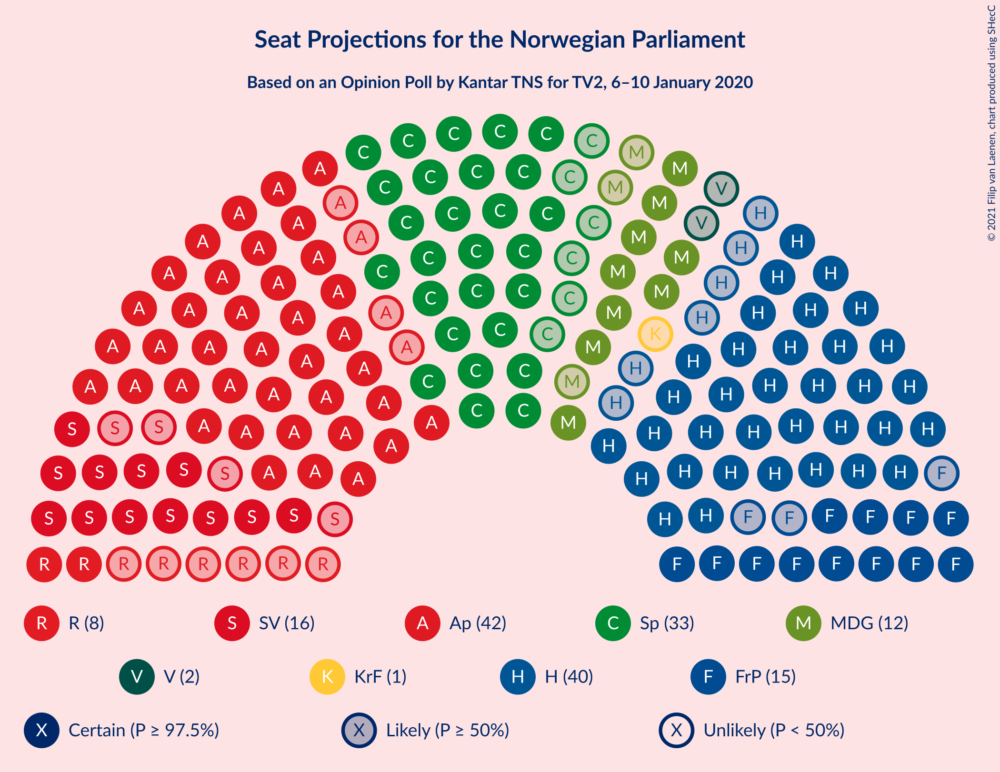

### Confidence Intervals

| Party | Last Result | Median | 80% Confidence Interval | 90% Confidence Interval | 95% Confidence Interval | 99% Confidence Interval |
|:-----:|:-----------:|:------:|:-----------------------:|:-----------------------:|:-----------------------:|:-----------------------:|
| <a href="#arbeiderpartiet">Arbeiderpartiet</a> | 49 | 44 | 40–45 |39–46 |38–47 |36–49 |
| <a href="#høyre">Høyre</a> | 45 | 39 | 35–43 |34–44 |34–46 |33–47 |
| <a href="#senterpartiet">Senterpartiet</a> | 19 | 35 | 30–36 |27–37 |27–37 |27–39 |
| <a href="#sosialistisk-venstreparti">Sosialistisk Venstreparti</a> | 11 | 15 | 13–18 |13–19 |12–19 |11–21 |
| <a href="#fremskrittspartiet">Fremskrittspartiet</a> | 27 | 15 | 13–17 |13–18 |12–19 |11–20 |
| <a href="#miljøpartiet-de-grønne">Miljøpartiet De Grønne</a> | 1 | 12 | 10–13 |9–14 |9–14 |8–15 |
| <a href="#rødt">Rødt</a> | 1 | 8 | 2–10 |2–10 |2–10 |2–12 |
| <a href="#kristelig-folkeparti">Kristelig Folkeparti</a> | 8 | 2 | 1–7 |0–7 |0–8 |0–8 |
| <a href="#venstre">Venstre</a> | 8 | 1 | 0–2 |0–2 |0–2 |0–2 |

### Arbeiderpartiet

*For a full overview of the results for this party, see the [Arbeiderpartiet](party-arbeiderpartiet.html) page.*

| Number of Seats | Probability | Accumulated | Special Marks |
|:---------------:|:-----------:|:-----------:|:-------------:|
| 34 | 0.1% | 100% |  |
| 35 | 0% | 99.9% |  |
| 36 | 0.7% | 99.9% |  |
| 37 | 0.5% | 99.1% |  |
| 38 | 2% | 98.7% |  |
| 39 | 2% | 97% |  |
| 40 | 8% | 95% |  |
| 41 | 10% | 87% |  |
| 42 | 18% | 77% |  |
| 43 | 5% | 59% |  |
| 44 | 35% | 54% | Median |
| 45 | 12% | 19% |  |
| 46 | 5% | 7% |  |
| 47 | 1.3% | 3% |  |
| 48 | 0.8% | 1.4% |  |
| 49 | 0.3% | 0.5% | Last Result |
| 50 | 0.1% | 0.2% |  |
| 51 | 0.1% | 0.1% |  |
| 52 | 0% | 0% |  |

### Høyre

*For a full overview of the results for this party, see the [Høyre](party-høyre.html) page.*

| Number of Seats | Probability | Accumulated | Special Marks |
|:---------------:|:-----------:|:-----------:|:-------------:|
| 31 | 0.1% | 100% |  |
| 32 | 0.1% | 99.9% |  |
| 33 | 0.4% | 99.9% |  |
| 34 | 7% | 99.5% |  |
| 35 | 7% | 92% |  |
| 36 | 12% | 85% |  |
| 37 | 15% | 72% |  |
| 38 | 2% | 57% |  |
| 39 | 12% | 55% | Median |
| 40 | 5% | 43% |  |
| 41 | 21% | 38% |  |
| 42 | 3% | 16% |  |
| 43 | 5% | 14% |  |
| 44 | 5% | 9% |  |
| 45 | 0.4% | 4% | Last Result |
| 46 | 2% | 4% |  |
| 47 | 0.8% | 1.2% |  |
| 48 | 0.1% | 0.4% |  |
| 49 | 0.2% | 0.3% |  |
| 50 | 0% | 0.1% |  |
| 51 | 0.1% | 0.1% |  |
| 52 | 0% | 0% |  |

### Senterpartiet

*For a full overview of the results for this party, see the [Senterpartiet](party-senterpartiet.html) page.*

| Number of Seats | Probability | Accumulated | Special Marks |
|:---------------:|:-----------:|:-----------:|:-------------:|
| 19 | 0% | 100% | Last Result |
| 20 | 0% | 100% |  |
| 21 | 0% | 100% |  |
| 22 | 0% | 100% |  |
| 23 | 0% | 100% |  |
| 24 | 0% | 100% |  |
| 25 | 0.1% | 100% |  |
| 26 | 0.2% | 99.8% |  |
| 27 | 6% | 99.6% |  |
| 28 | 1.4% | 93% |  |
| 29 | 2% | 92% |  |
| 30 | 12% | 90% |  |
| 31 | 10% | 78% |  |
| 32 | 2% | 68% |  |
| 33 | 4% | 66% |  |
| 34 | 7% | 62% |  |
| 35 | 19% | 55% | Median |
| 36 | 30% | 36% |  |
| 37 | 5% | 6% |  |
| 38 | 0.5% | 1.4% |  |
| 39 | 0.6% | 0.9% |  |
| 40 | 0% | 0.2% |  |
| 41 | 0.2% | 0.2% |  |
| 42 | 0% | 0% |  |

### Sosialistisk Venstreparti

*For a full overview of the results for this party, see the [Sosialistisk Venstreparti](party-sosialistiskvenstreparti.html) page.*

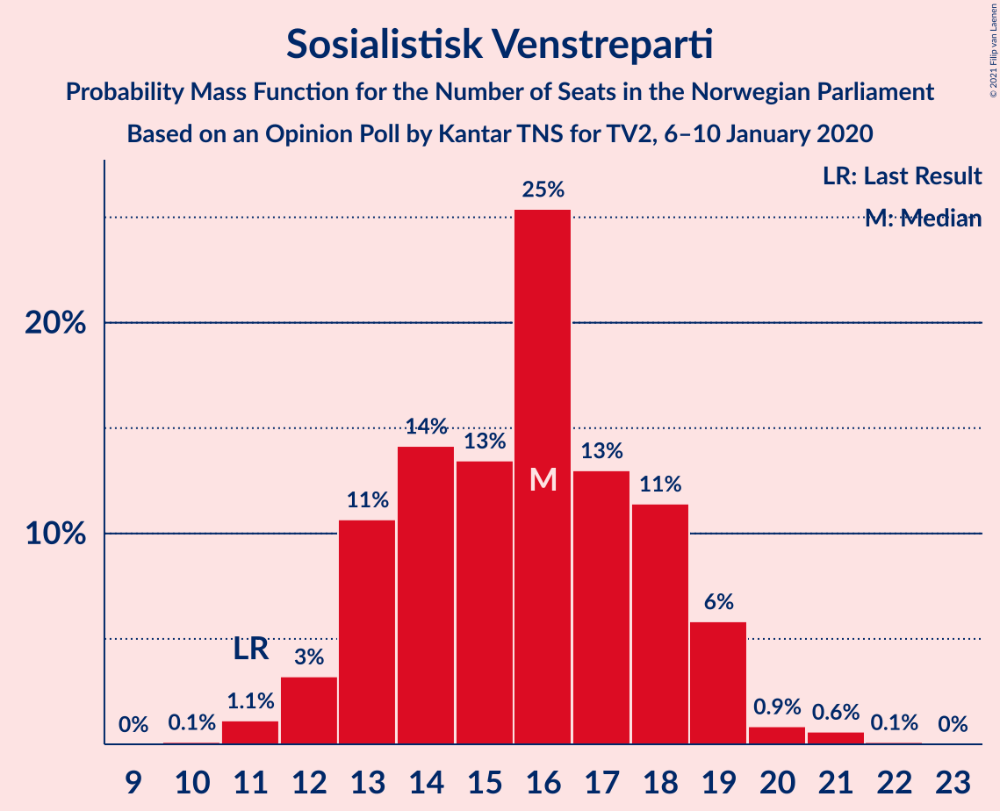

| Number of Seats | Probability | Accumulated | Special Marks |
|:---------------:|:-----------:|:-----------:|:-------------:|
| 10 | 0.1% | 100% |  |
| 11 | 1.0% | 99.9% | Last Result |
| 12 | 2% | 98.9% |  |
| 13 | 20% | 97% |  |
| 14 | 9% | 77% |  |
| 15 | 23% | 68% | Median |
| 16 | 6% | 46% |  |
| 17 | 13% | 39% |  |
| 18 | 21% | 26% |  |
| 19 | 3% | 5% |  |
| 20 | 1.3% | 2% |  |
| 21 | 0.4% | 0.5% |  |
| 22 | 0.1% | 0.1% |  |
| 23 | 0% | 0% |  |

### Fremskrittspartiet

*For a full overview of the results for this party, see the [Fremskrittspartiet](party-fremskrittspartiet.html) page.*

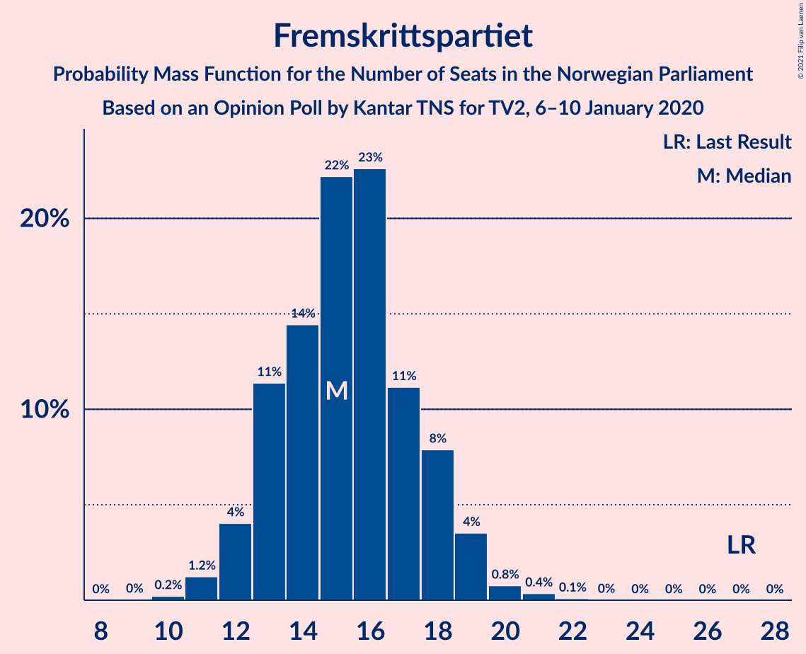

| Number of Seats | Probability | Accumulated | Special Marks |
|:---------------:|:-----------:|:-----------:|:-------------:|
| 10 | 0.2% | 100% |  |
| 11 | 0.8% | 99.8% |  |
| 12 | 3% | 99.0% |  |
| 13 | 17% | 96% |  |
| 14 | 26% | 78% |  |
| 15 | 15% | 52% | Median |
| 16 | 17% | 37% |  |
| 17 | 12% | 20% |  |
| 18 | 4% | 8% |  |
| 19 | 3% | 4% |  |
| 20 | 1.1% | 1.4% |  |
| 21 | 0.3% | 0.3% |  |
| 22 | 0% | 0% |  |
| 23 | 0% | 0% |  |
| 24 | 0% | 0% |  |
| 25 | 0% | 0% |  |
| 26 | 0% | 0% |  |
| 27 | 0% | 0% | Last Result |

### Miljøpartiet De Grønne

*For a full overview of the results for this party, see the [Miljøpartiet De Grønne](party-miljøpartietdegrønne.html) page.*

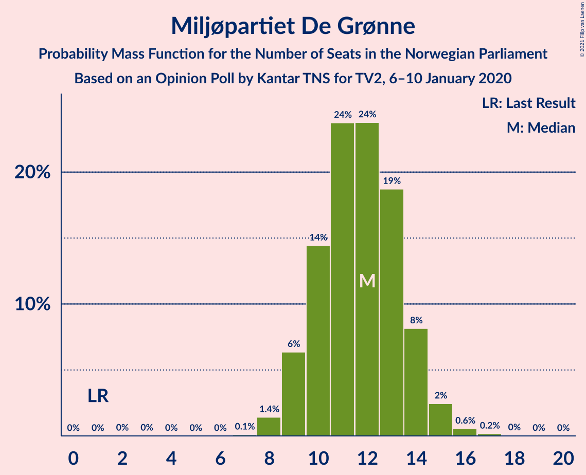

| Number of Seats | Probability | Accumulated | Special Marks |
|:---------------:|:-----------:|:-----------:|:-------------:|
| 1 | 0% | 100% | Last Result |
| 2 | 0% | 100% |  |
| 3 | 0% | 100% |  |
| 4 | 0% | 99.9% |  |
| 5 | 0% | 99.9% |  |
| 6 | 0% | 99.9% |  |
| 7 | 0.1% | 99.9% |  |
| 8 | 1.5% | 99.9% |  |
| 9 | 4% | 98% |  |
| 10 | 10% | 94% |  |
| 11 | 33% | 84% |  |
| 12 | 23% | 51% | Median |
| 13 | 20% | 28% |  |
| 14 | 6% | 9% |  |
| 15 | 2% | 2% |  |
| 16 | 0.3% | 0.5% |  |
| 17 | 0.1% | 0.2% |  |
| 18 | 0.1% | 0.1% |  |
| 19 | 0% | 0% |  |

### Rødt

*For a full overview of the results for this party, see the [Rødt](party-rødt.html) page.*

| Number of Seats | Probability | Accumulated | Special Marks |
|:---------------:|:-----------:|:-----------:|:-------------:|
| 1 | 0.2% | 100% | Last Result |
| 2 | 16% | 99.8% |  |
| 3 | 0% | 84% |  |
| 4 | 0% | 84% |  |
| 5 | 0% | 84% |  |
| 6 | 0% | 84% |  |
| 7 | 24% | 84% |  |
| 8 | 25% | 60% | Median |
| 9 | 7% | 35% |  |
| 10 | 25% | 27% |  |
| 11 | 2% | 2% |  |
| 12 | 0.4% | 0.5% |  |
| 13 | 0.1% | 0.1% |  |
| 14 | 0% | 0% |  |

### Kristelig Folkeparti

*For a full overview of the results for this party, see the [Kristelig Folkeparti](party-kristeligfolkeparti.html) page.*

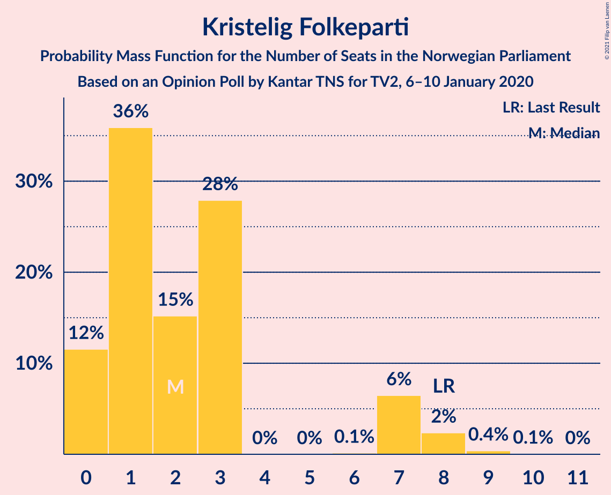

| Number of Seats | Probability | Accumulated | Special Marks |
|:---------------:|:-----------:|:-----------:|:-------------:|
| 0 | 8% | 100% |  |
| 1 | 31% | 92% |  |
| 2 | 12% | 61% | Median |
| 3 | 36% | 50% |  |
| 4 | 0% | 14% |  |
| 5 | 0% | 14% |  |
| 6 | 0.1% | 14% |  |
| 7 | 9% | 13% |  |
| 8 | 4% | 4% | Last Result |
| 9 | 0.3% | 0.4% |  |
| 10 | 0.1% | 0.1% |  |
| 11 | 0% | 0% |  |

### Venstre

*For a full overview of the results for this party, see the [Venstre](party-venstre.html) page.*

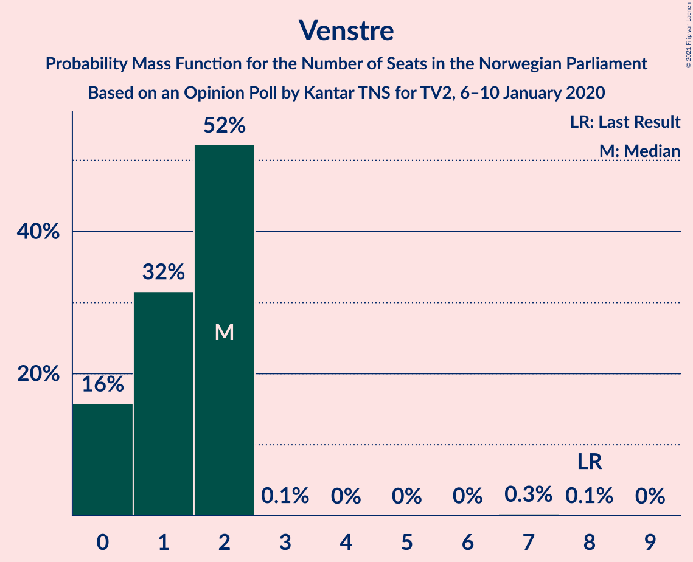

| Number of Seats | Probability | Accumulated | Special Marks |
|:---------------:|:-----------:|:-----------:|:-------------:|
| 0 | 15% | 100% |  |
| 1 | 42% | 85% | Median |
| 2 | 43% | 44% |  |
| 3 | 0.1% | 0.3% |  |
| 4 | 0% | 0.2% |  |
| 5 | 0% | 0.2% |  |
| 6 | 0% | 0.2% |  |
| 7 | 0.1% | 0.2% |  |
| 8 | 0.1% | 0.1% | Last Result |
| 9 | 0% | 0% |  |

## Coalitions

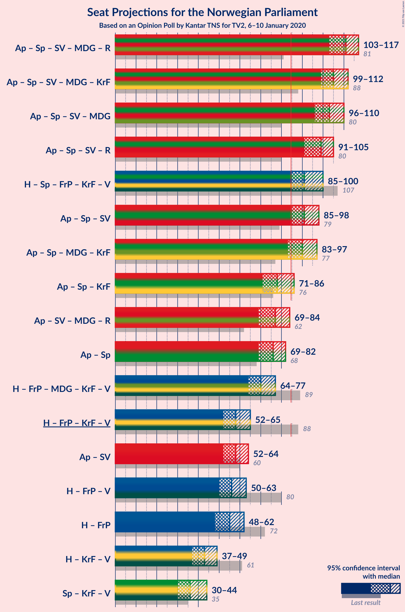

### Confidence Intervals

| Coalition | Last Result | Median | Majority? | 80% Confidence Interval | 90% Confidence Interval | 95% Confidence Interval | 99% Confidence Interval |
|:---------:|:-----------:|:------:|:---------:|:-----------------------:|:-----------------------:|:-----------------------:|:-----------------------:|
| Arbeiderpartiet – Senterpartiet – Sosialistisk Venstreparti – Miljøpartiet De Grønne – Rødt | 81 | 112 | 100% | 107–116 | 104–116 | 103–117 | 100–118 |
| Arbeiderpartiet – Senterpartiet – Sosialistisk Venstreparti – Miljøpartiet De Grønne – Kristelig Folkeparti | 88 | 107 | 100% | 101–111 | 101–112 | 100–112 | 97–115 |
| Arbeiderpartiet – Senterpartiet – Sosialistisk Venstreparti – Miljøpartiet De Grønne | 80 | 105 | 100% | 100–106 | 98–108 | 97–110 | 95–111 |
| Arbeiderpartiet – Senterpartiet – Sosialistisk Venstreparti – Rødt | 80 | 99 | 100% | 96–104 | 93–104 | 91–105 | 88–106 |
| Høyre – Senterpartiet – Fremskrittspartiet – Kristelig Folkeparti – Venstre | 107 | 91 | 98.8% | 88–97 | 87–97 | 87–99 | 84–100 |
| Arbeiderpartiet – Senterpartiet – Miljøpartiet De Grønne – Kristelig Folkeparti | 77 | 91 | 93% | 85–95 | 84–98 | 84–98 | 81–100 |
| Arbeiderpartiet – Senterpartiet – Sosialistisk Venstreparti | 79 | 92 | 99.1% | 89–96 | 86–97 | 86–97 | 83–100 |
| Arbeiderpartiet – Senterpartiet – Kristelig Folkeparti | 76 | 79 | 8% | 74–84 | 73–87 | 73–87 | 68–88 |
| Arbeiderpartiet – Senterpartiet | 68 | 77 | 0.2% | 71–81 | 71–81 | 70–81 | 67–83 |
| Høyre – Fremskrittspartiet – Miljøpartiet De Grønne – Kristelig Folkeparti – Venstre | 89 | 70 | 0% | 65–73 | 65–76 | 64–78 | 62–81 |
| Høyre – Fremskrittspartiet – Kristelig Folkeparti – Venstre | 88 | 57 | 0% | 53–62 | 53–64 | 52–66 | 51–69 |
| Arbeiderpartiet – Sosialistisk Venstreparti | 60 | 59 | 0% | 55–61 | 54–63 | 54–64 | 49–65 |
| Høyre – Fremskrittspartiet – Venstre | 80 | 54 | 0% | 51–60 | 49–61 | 49–62 | 48–64 |
| Høyre – Fremskrittspartiet | 72 | 53 | 0% | 50–59 | 48–60 | 48–60 | 47–63 |
| Høyre – Kristelig Folkeparti – Venstre | 61 | 43 | 0% | 37–47 | 37–49 | 36–51 | 35–52 |
| Senterpartiet – Kristelig Folkeparti – Venstre | 35 | 37 | 0% | 32–42 | 31–44 | 30–44 | 29–47 |

### Arbeiderpartiet – Senterpartiet – Sosialistisk Venstreparti – Miljøpartiet De Grønne – Rødt

| Number of Seats | Probability | Accumulated | Special Marks |
|:---------------:|:-----------:|:-----------:|:-------------:|
| 81 | 0% | 100% | Last Result |
| 82 | 0% | 100% |  |
| 83 | 0% | 100% |  |
| 84 | 0% | 100% |  |
| 85 | 0% | 100% | Majority |
| 86 | 0% | 100% |  |
| 87 | 0% | 100% |  |
| 88 | 0% | 100% |  |
| 89 | 0% | 100% |  |
| 90 | 0% | 100% |  |
| 91 | 0% | 100% |  |
| 92 | 0% | 100% |  |
| 93 | 0% | 100% |  |
| 94 | 0% | 100% |  |
| 95 | 0% | 100% |  |
| 96 | 0% | 100% |  |
| 97 | 0% | 100% |  |
| 98 | 0% | 100% |  |
| 99 | 0.1% | 100% |  |
| 100 | 1.0% | 99.9% |  |
| 101 | 0.8% | 98.9% |  |
| 102 | 0.2% | 98% |  |
| 103 | 0.5% | 98% |  |
| 104 | 2% | 97% |  |
| 105 | 1.3% | 95% |  |
| 106 | 3% | 94% |  |
| 107 | 13% | 91% |  |
| 108 | 5% | 78% |  |
| 109 | 3% | 73% |  |
| 110 | 10% | 70% |  |
| 111 | 6% | 60% |  |
| 112 | 14% | 54% |  |
| 113 | 7% | 40% |  |
| 114 | 9% | 33% | Median |
| 115 | 11% | 23% |  |
| 116 | 8% | 12% |  |
| 117 | 3% | 4% |  |
| 118 | 0.8% | 0.9% |  |
| 119 | 0% | 0.1% |  |
| 120 | 0.1% | 0.1% |  |
| 121 | 0% | 0% |  |

### Arbeiderpartiet – Senterpartiet – Sosialistisk Venstreparti – Miljøpartiet De Grønne – Kristelig Folkeparti

| Number of Seats | Probability | Accumulated | Special Marks |
|:---------------:|:-----------:|:-----------:|:-------------:|
| 88 | 0% | 100% | Last Result |
| 89 | 0% | 100% |  |
| 90 | 0% | 100% |  |
| 91 | 0% | 100% |  |
| 92 | 0% | 100% |  |
| 93 | 0% | 100% |  |
| 94 | 0.1% | 100% |  |
| 95 | 0.1% | 99.9% |  |
| 96 | 0.1% | 99.8% |  |
| 97 | 0.5% | 99.7% |  |
| 98 | 0.5% | 99.2% |  |
| 99 | 1.0% | 98.7% |  |
| 100 | 3% | 98% |  |
| 101 | 5% | 95% |  |
| 102 | 4% | 90% |  |
| 103 | 9% | 86% |  |
| 104 | 3% | 77% |  |
| 105 | 9% | 74% |  |
| 106 | 10% | 65% |  |
| 107 | 16% | 55% |  |
| 108 | 14% | 39% | Median |
| 109 | 12% | 25% |  |
| 110 | 2% | 13% |  |
| 111 | 4% | 11% |  |
| 112 | 5% | 8% |  |
| 113 | 0.7% | 2% |  |
| 114 | 0.9% | 2% |  |
| 115 | 0.7% | 0.8% |  |
| 116 | 0.1% | 0.1% |  |
| 117 | 0% | 0% |  |

### Arbeiderpartiet – Senterpartiet – Sosialistisk Venstreparti – Miljøpartiet De Grønne

| Number of Seats | Probability | Accumulated | Special Marks |
|:---------------:|:-----------:|:-----------:|:-------------:|
| 80 | 0% | 100% | Last Result |
| 81 | 0% | 100% |  |
| 82 | 0% | 100% |  |
| 83 | 0% | 100% |  |
| 84 | 0% | 100% |  |
| 85 | 0% | 100% | Majority |
| 86 | 0% | 100% |  |
| 87 | 0% | 100% |  |
| 88 | 0% | 100% |  |
| 89 | 0% | 100% |  |
| 90 | 0% | 100% |  |
| 91 | 0% | 100% |  |
| 92 | 0.1% | 100% |  |
| 93 | 0% | 99.9% |  |
| 94 | 0.1% | 99.8% |  |
| 95 | 0.4% | 99.7% |  |
| 96 | 0.9% | 99.3% |  |
| 97 | 1.0% | 98% |  |
| 98 | 4% | 97% |  |
| 99 | 1.4% | 94% |  |
| 100 | 14% | 92% |  |
| 101 | 1.4% | 78% |  |
| 102 | 8% | 77% |  |
| 103 | 4% | 69% |  |
| 104 | 14% | 65% |  |
| 105 | 23% | 51% |  |
| 106 | 20% | 28% | Median |
| 107 | 1.5% | 8% |  |
| 108 | 2% | 7% |  |
| 109 | 1.1% | 5% |  |
| 110 | 2% | 3% |  |
| 111 | 1.0% | 1.3% |  |
| 112 | 0.1% | 0.3% |  |
| 113 | 0.1% | 0.2% |  |
| 114 | 0.1% | 0.1% |  |
| 115 | 0% | 0% |  |

### Arbeiderpartiet – Senterpartiet – Sosialistisk Venstreparti – Rødt

| Number of Seats | Probability | Accumulated | Special Marks |
|:---------------:|:-----------:|:-----------:|:-------------:|
| 80 | 0% | 100% | Last Result |
| 81 | 0% | 100% |  |
| 82 | 0% | 100% |  |
| 83 | 0% | 100% |  |
| 84 | 0% | 100% |  |
| 85 | 0% | 100% | Majority |
| 86 | 0% | 100% |  |
| 87 | 0% | 99.9% |  |
| 88 | 1.1% | 99.9% |  |
| 89 | 0% | 98.9% |  |
| 90 | 1.1% | 98.8% |  |
| 91 | 0.6% | 98% |  |
| 92 | 1.0% | 97% |  |
| 93 | 2% | 96% |  |
| 94 | 2% | 95% |  |
| 95 | 2% | 93% |  |
| 96 | 13% | 90% |  |
| 97 | 7% | 78% |  |
| 98 | 8% | 71% |  |
| 99 | 16% | 63% |  |
| 100 | 5% | 47% |  |
| 101 | 6% | 42% |  |
| 102 | 6% | 37% | Median |
| 103 | 20% | 31% |  |
| 104 | 7% | 11% |  |
| 105 | 1.2% | 3% |  |
| 106 | 2% | 2% |  |
| 107 | 0.3% | 0.5% |  |
| 108 | 0.1% | 0.2% |  |
| 109 | 0% | 0.1% |  |
| 110 | 0% | 0% |  |

### Høyre – Senterpartiet – Fremskrittspartiet – Kristelig Folkeparti – Venstre

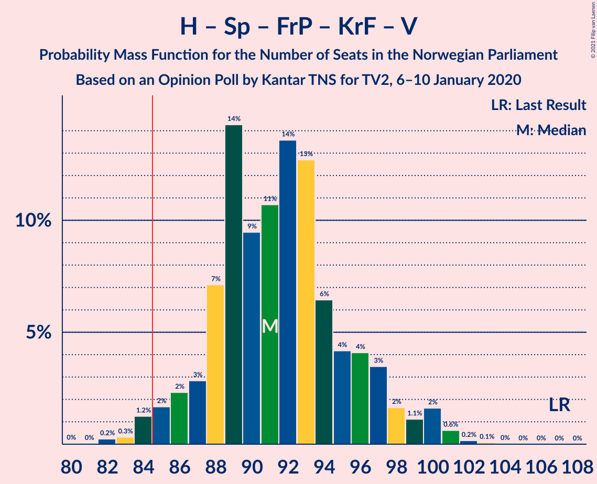

| Number of Seats | Probability | Accumulated | Special Marks |
|:---------------:|:-----------:|:-----------:|:-------------:|
| 81 | 0% | 100% |  |
| 82 | 0.1% | 99.9% |  |
| 83 | 0.1% | 99.9% |  |
| 84 | 0.9% | 99.8% |  |
| 85 | 0.1% | 98.8% | Majority |
| 86 | 0.6% | 98.7% |  |
| 87 | 3% | 98% |  |
| 88 | 11% | 95% |  |
| 89 | 19% | 83% |  |
| 90 | 10% | 64% |  |
| 91 | 12% | 54% |  |
| 92 | 19% | 42% | Median |
| 93 | 3% | 23% |  |
| 94 | 3% | 20% |  |
| 95 | 2% | 17% |  |
| 96 | 4% | 15% |  |
| 97 | 6% | 11% |  |
| 98 | 2% | 5% |  |
| 99 | 2% | 3% |  |
| 100 | 1.0% | 1.2% |  |
| 101 | 0.1% | 0.3% |  |
| 102 | 0.1% | 0.2% |  |
| 103 | 0.1% | 0.1% |  |
| 104 | 0% | 0% |  |
| 105 | 0% | 0% |  |
| 106 | 0% | 0% |  |
| 107 | 0% | 0% | Last Result |

### Arbeiderpartiet – Senterpartiet – Miljøpartiet De Grønne – Kristelig Folkeparti

| Number of Seats | Probability | Accumulated | Special Marks |
|:---------------:|:-----------:|:-----------:|:-------------:|
| 77 | 0.1% | 100% | Last Result |
| 78 | 0% | 99.9% |  |
| 79 | 0.1% | 99.9% |  |
| 80 | 0.2% | 99.8% |  |
| 81 | 0.3% | 99.6% |  |
| 82 | 0.6% | 99.3% |  |
| 83 | 0.6% | 98.7% |  |
| 84 | 5% | 98% |  |
| 85 | 8% | 93% | Majority |
| 86 | 6% | 85% |  |
| 87 | 1.3% | 79% |  |
| 88 | 4% | 78% |  |
| 89 | 10% | 74% |  |
| 90 | 5% | 63% |  |
| 91 | 13% | 58% |  |
| 92 | 11% | 45% |  |
| 93 | 2% | 34% | Median |
| 94 | 15% | 31% |  |
| 95 | 9% | 17% |  |
| 96 | 0.6% | 8% |  |
| 97 | 1.4% | 8% |  |
| 98 | 6% | 6% |  |
| 99 | 0.2% | 0.7% |  |
| 100 | 0.4% | 0.5% |  |
| 101 | 0.1% | 0.1% |  |
| 102 | 0% | 0% |  |

### Arbeiderpartiet – Senterpartiet – Sosialistisk Venstreparti

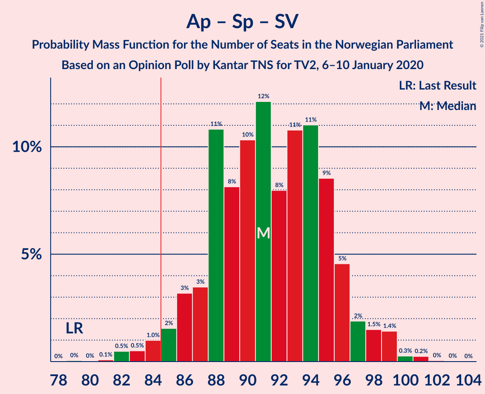

| Number of Seats | Probability | Accumulated | Special Marks |
|:---------------:|:-----------:|:-----------:|:-------------:|
| 79 | 0% | 100% | Last Result |
| 80 | 0% | 100% |  |
| 81 | 0.1% | 99.9% |  |
| 82 | 0.4% | 99.9% |  |
| 83 | 0.2% | 99.5% |  |
| 84 | 0.2% | 99.3% |  |
| 85 | 1.1% | 99.1% | Majority |
| 86 | 4% | 98% |  |
| 87 | 0.9% | 94% |  |
| 88 | 2% | 93% |  |
| 89 | 13% | 91% |  |
| 90 | 5% | 79% |  |
| 91 | 18% | 73% |  |
| 92 | 6% | 55% |  |
| 93 | 14% | 50% |  |
| 94 | 16% | 36% | Median |
| 95 | 9% | 19% |  |
| 96 | 4% | 11% |  |
| 97 | 4% | 6% |  |
| 98 | 0.9% | 2% |  |
| 99 | 0.4% | 1.3% |  |
| 100 | 0.7% | 0.9% |  |
| 101 | 0.1% | 0.2% |  |
| 102 | 0% | 0.1% |  |
| 103 | 0% | 0% |  |

### Arbeiderpartiet – Senterpartiet – Kristelig Folkeparti

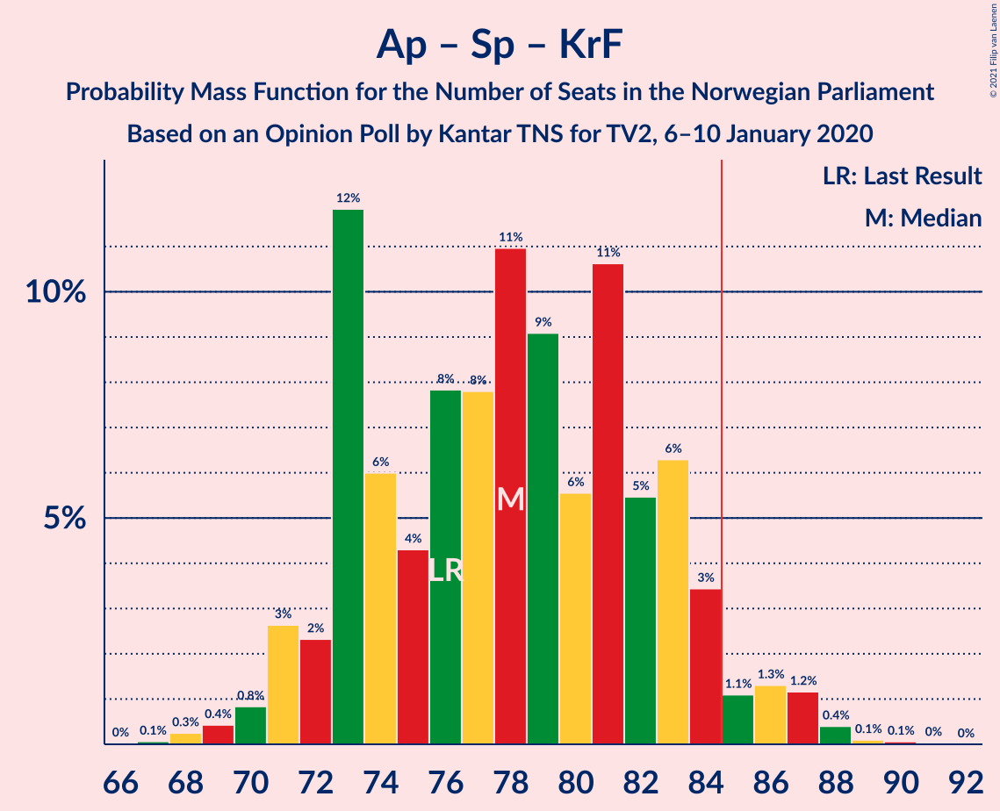

| Number of Seats | Probability | Accumulated | Special Marks |
|:---------------:|:-----------:|:-----------:|:-------------:|
| 66 | 0% | 100% |  |
| 67 | 0.2% | 99.9% |  |
| 68 | 0.3% | 99.7% |  |
| 69 | 0.1% | 99.4% |  |
| 70 | 0.7% | 99.3% |  |
| 71 | 0.4% | 98.6% |  |
| 72 | 0.5% | 98% |  |
| 73 | 3% | 98% |  |
| 74 | 11% | 95% |  |
| 75 | 5% | 84% |  |
| 76 | 10% | 78% | Last Result |
| 77 | 9% | 68% |  |
| 78 | 3% | 59% |  |
| 79 | 8% | 56% |  |
| 80 | 10% | 48% |  |
| 81 | 5% | 37% | Median |
| 82 | 7% | 32% |  |
| 83 | 15% | 26% |  |
| 84 | 3% | 11% |  |
| 85 | 1.2% | 8% | Majority |
| 86 | 0.7% | 7% |  |
| 87 | 5% | 6% |  |
| 88 | 0.5% | 0.6% |  |
| 89 | 0% | 0.2% |  |
| 90 | 0.1% | 0.2% |  |
| 91 | 0% | 0% |  |

### Arbeiderpartiet – Senterpartiet

| Number of Seats | Probability | Accumulated | Special Marks |
|:---------------:|:-----------:|:-----------:|:-------------:|
| 64 | 0.1% | 100% |  |
| 65 | 0.3% | 99.9% |  |
| 66 | 0% | 99.6% |  |
| 67 | 0.3% | 99.5% |  |
| 68 | 1.4% | 99.3% | Last Result |
| 69 | 0.4% | 98% |  |
| 70 | 0.1% | 98% |  |
| 71 | 9% | 97% |  |
| 72 | 6% | 88% |  |
| 73 | 11% | 82% |  |
| 74 | 6% | 72% |  |
| 75 | 3% | 66% |  |
| 76 | 8% | 63% |  |
| 77 | 12% | 55% |  |
| 78 | 5% | 43% |  |
| 79 | 5% | 38% | Median |
| 80 | 23% | 33% |  |
| 81 | 8% | 10% |  |
| 82 | 0.7% | 2% |  |
| 83 | 1.0% | 1.4% |  |
| 84 | 0.2% | 0.4% |  |
| 85 | 0.1% | 0.2% | Majority |
| 86 | 0.1% | 0.1% |  |
| 87 | 0% | 0% |  |

### Høyre – Fremskrittspartiet – Miljøpartiet De Grønne – Kristelig Folkeparti – Venstre

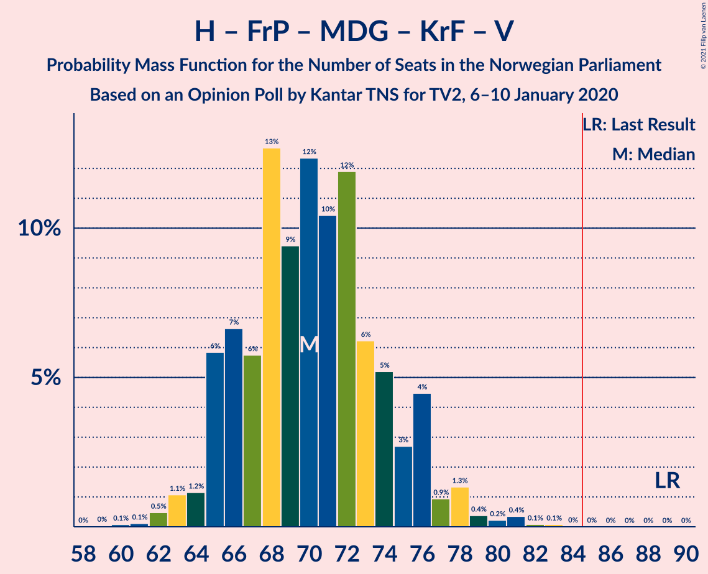

| Number of Seats | Probability | Accumulated | Special Marks |
|:---------------:|:-----------:|:-----------:|:-------------:|
| 60 | 0% | 100% |  |
| 61 | 0.1% | 99.9% |  |
| 62 | 0.3% | 99.8% |  |
| 63 | 2% | 99.5% |  |
| 64 | 1.2% | 98% |  |
| 65 | 7% | 97% |  |
| 66 | 20% | 89% |  |
| 67 | 6% | 69% |  |
| 68 | 6% | 63% |  |
| 69 | 5% | 58% | Median |
| 70 | 16% | 53% |  |
| 71 | 8% | 37% |  |
| 72 | 6% | 29% |  |
| 73 | 13% | 22% |  |
| 74 | 2% | 9% |  |
| 75 | 2% | 7% |  |
| 76 | 2% | 5% |  |
| 77 | 0.9% | 4% |  |
| 78 | 0.6% | 3% |  |
| 79 | 1.1% | 2% |  |
| 80 | 0% | 1.1% |  |
| 81 | 1.1% | 1.1% |  |
| 82 | 0% | 0.1% |  |
| 83 | 0% | 0.1% |  |
| 84 | 0% | 0% |  |
| 85 | 0% | 0% | Majority |
| 86 | 0% | 0% |  |
| 87 | 0% | 0% |  |
| 88 | 0% | 0% |  |
| 89 | 0% | 0% | Last Result |

### Høyre – Fremskrittspartiet – Kristelig Folkeparti – Venstre

| Number of Seats | Probability | Accumulated | Special Marks |
|:---------------:|:-----------:|:-----------:|:-------------:|
| 49 | 0.1% | 100% |  |
| 50 | 0% | 99.9% |  |
| 51 | 0.8% | 99.8% |  |
| 52 | 3% | 99.0% |  |
| 53 | 8% | 96% |  |
| 54 | 11% | 88% |  |
| 55 | 9% | 77% |  |
| 56 | 7% | 67% |  |
| 57 | 14% | 60% | Median |
| 58 | 6% | 46% |  |
| 59 | 10% | 40% |  |
| 60 | 3% | 30% |  |
| 61 | 5% | 27% |  |
| 62 | 13% | 22% |  |
| 63 | 2% | 9% |  |
| 64 | 1.2% | 6% |  |
| 65 | 2% | 5% |  |
| 66 | 0.5% | 3% |  |
| 67 | 0.2% | 2% |  |
| 68 | 0.8% | 2% |  |
| 69 | 1.0% | 1.1% |  |
| 70 | 0.1% | 0.1% |  |
| 71 | 0% | 0% |  |
| 72 | 0% | 0% |  |
| 73 | 0% | 0% |  |
| 74 | 0% | 0% |  |
| 75 | 0% | 0% |  |
| 76 | 0% | 0% |  |
| 77 | 0% | 0% |  |
| 78 | 0% | 0% |  |
| 79 | 0% | 0% |  |
| 80 | 0% | 0% |  |
| 81 | 0% | 0% |  |
| 82 | 0% | 0% |  |
| 83 | 0% | 0% |  |
| 84 | 0% | 0% |  |
| 85 | 0% | 0% | Majority |
| 86 | 0% | 0% |  |
| 87 | 0% | 0% |  |
| 88 | 0% | 0% | Last Result |

### Arbeiderpartiet – Sosialistisk Venstreparti

| Number of Seats | Probability | Accumulated | Special Marks |
|:---------------:|:-----------:|:-----------:|:-------------:|
| 49 | 0.5% | 100% |  |
| 50 | 0.3% | 99.4% |  |
| 51 | 0.1% | 99.2% |  |
| 52 | 0.7% | 99.0% |  |
| 53 | 0.7% | 98% |  |
| 54 | 3% | 98% |  |
| 55 | 5% | 95% |  |
| 56 | 2% | 89% |  |
| 57 | 16% | 87% |  |
| 58 | 14% | 70% |  |
| 59 | 27% | 56% | Median |
| 60 | 11% | 29% | Last Result |
| 61 | 8% | 17% |  |
| 62 | 3% | 9% |  |
| 63 | 4% | 7% |  |
| 64 | 1.4% | 3% |  |
| 65 | 1.2% | 2% |  |
| 66 | 0.1% | 0.3% |  |
| 67 | 0.1% | 0.2% |  |
| 68 | 0.1% | 0.2% |  |
| 69 | 0% | 0.1% |  |
| 70 | 0% | 0.1% |  |
| 71 | 0% | 0% |  |

### Høyre – Fremskrittspartiet – Venstre

| Number of Seats | Probability | Accumulated | Special Marks |
|:---------------:|:-----------:|:-----------:|:-------------:|
| 46 | 0.1% | 100% |  |
| 47 | 0.1% | 99.9% |  |
| 48 | 0.4% | 99.8% |  |
| 49 | 5% | 99.4% |  |
| 50 | 1.3% | 95% |  |
| 51 | 10% | 93% |  |
| 52 | 15% | 83% |  |
| 53 | 10% | 68% |  |
| 54 | 10% | 59% |  |
| 55 | 4% | 49% | Median |
| 56 | 2% | 44% |  |
| 57 | 9% | 42% |  |
| 58 | 6% | 33% |  |
| 59 | 17% | 27% |  |
| 60 | 4% | 10% |  |
| 61 | 3% | 7% |  |
| 62 | 2% | 4% |  |
| 63 | 1.2% | 2% |  |
| 64 | 0.1% | 0.6% |  |
| 65 | 0.3% | 0.5% |  |
| 66 | 0% | 0.2% |  |
| 67 | 0.2% | 0.2% |  |
| 68 | 0% | 0.1% |  |
| 69 | 0% | 0% |  |
| 70 | 0% | 0% |  |
| 71 | 0% | 0% |  |
| 72 | 0% | 0% |  |
| 73 | 0% | 0% |  |
| 74 | 0% | 0% |  |
| 75 | 0% | 0% |  |
| 76 | 0% | 0% |  |
| 77 | 0% | 0% |  |
| 78 | 0% | 0% |  |
| 79 | 0% | 0% |  |
| 80 | 0% | 0% | Last Result |

### Høyre – Fremskrittspartiet

| Number of Seats | Probability | Accumulated | Special Marks |
|:---------------:|:-----------:|:-----------:|:-------------:|
| 45 | 0% | 100% |  |
| 46 | 0.2% | 99.9% |  |
| 47 | 0.5% | 99.8% |  |
| 48 | 5% | 99.2% |  |
| 49 | 2% | 94% |  |
| 50 | 15% | 92% |  |
| 51 | 10% | 77% |  |
| 52 | 15% | 67% |  |
| 53 | 2% | 51% |  |
| 54 | 5% | 49% | Median |
| 55 | 7% | 44% |  |
| 56 | 4% | 37% |  |
| 57 | 13% | 33% |  |
| 58 | 6% | 20% |  |
| 59 | 9% | 14% |  |
| 60 | 3% | 5% |  |
| 61 | 2% | 2% |  |
| 62 | 0.2% | 0.8% |  |
| 63 | 0.2% | 0.5% |  |
| 64 | 0.2% | 0.4% |  |
| 65 | 0% | 0.2% |  |
| 66 | 0.1% | 0.2% |  |
| 67 | 0% | 0.1% |  |
| 68 | 0% | 0% |  |
| 69 | 0% | 0% |  |
| 70 | 0% | 0% |  |
| 71 | 0% | 0% |  |
| 72 | 0% | 0% | Last Result |

### Høyre – Kristelig Folkeparti – Venstre

| Number of Seats | Probability | Accumulated | Special Marks |
|:---------------:|:-----------:|:-----------:|:-------------:|
| 35 | 0.5% | 100% |  |
| 36 | 2% | 99.4% |  |
| 37 | 7% | 97% |  |
| 38 | 2% | 90% |  |
| 39 | 1.3% | 88% |  |
| 40 | 14% | 87% |  |
| 41 | 12% | 73% |  |
| 42 | 8% | 62% | Median |
| 43 | 12% | 54% |  |
| 44 | 11% | 42% |  |
| 45 | 9% | 31% |  |
| 46 | 8% | 22% |  |
| 47 | 6% | 14% |  |
| 48 | 3% | 8% |  |
| 49 | 1.1% | 5% |  |
| 50 | 1.5% | 4% |  |
| 51 | 1.4% | 3% |  |
| 52 | 1.1% | 2% |  |
| 53 | 0.2% | 0.4% |  |
| 54 | 0.2% | 0.2% |  |
| 55 | 0% | 0% |  |
| 56 | 0% | 0% |  |
| 57 | 0% | 0% |  |
| 58 | 0% | 0% |  |
| 59 | 0% | 0% |  |
| 60 | 0% | 0% |  |
| 61 | 0% | 0% | Last Result |

### Senterpartiet – Kristelig Folkeparti – Venstre

| Number of Seats | Probability | Accumulated | Special Marks |
|:---------------:|:-----------:|:-----------:|:-------------:|
| 26 | 0.1% | 100% |  |
| 27 | 0% | 99.9% |  |
| 28 | 0% | 99.9% |  |
| 29 | 0.6% | 99.9% |  |
| 30 | 2% | 99.3% |  |
| 31 | 3% | 97% |  |
| 32 | 6% | 94% |  |
| 33 | 1.0% | 88% |  |
| 34 | 3% | 87% |  |
| 35 | 9% | 83% | Last Result |
| 36 | 11% | 74% |  |
| 37 | 15% | 64% |  |
| 38 | 13% | 49% | Median |
| 39 | 10% | 36% |  |
| 40 | 15% | 27% |  |
| 41 | 2% | 12% |  |
| 42 | 1.2% | 10% |  |
| 43 | 0.7% | 9% |  |
| 44 | 6% | 8% |  |
| 45 | 0.5% | 2% |  |
| 46 | 0.5% | 2% |  |
| 47 | 1.1% | 1.2% |  |
| 48 | 0.1% | 0.1% |  |
| 49 | 0% | 0% |  |

## Technical Information

### Opinion Poll

+ **Polling firm:** Kantar TNS
+ **Commissioner(s):** TV2
+ **Fieldwork period:** 6–10 January 2020

### Calculations

+ **Sample size:** 797
+ **Simulations done:** 131,072
+ **Error estimate:** 2.39%

