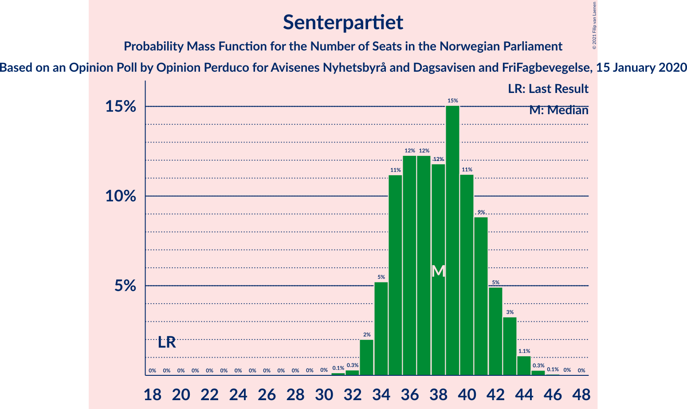
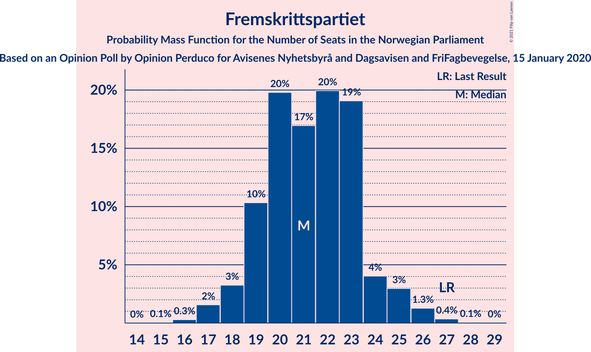
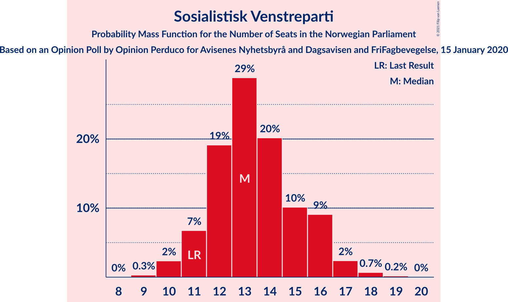
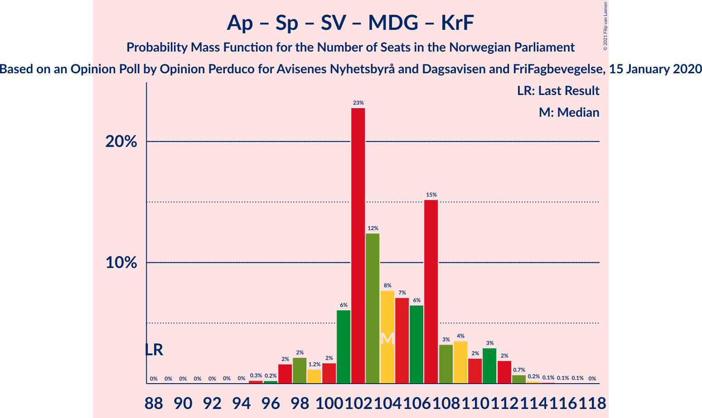
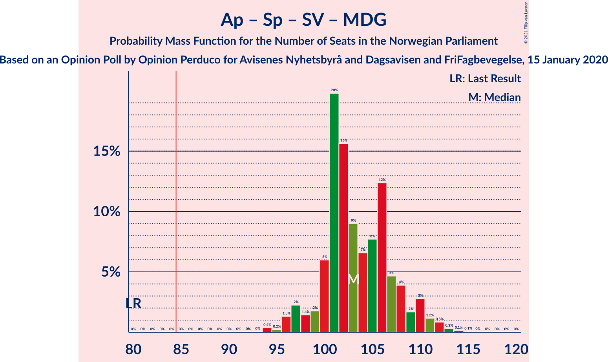
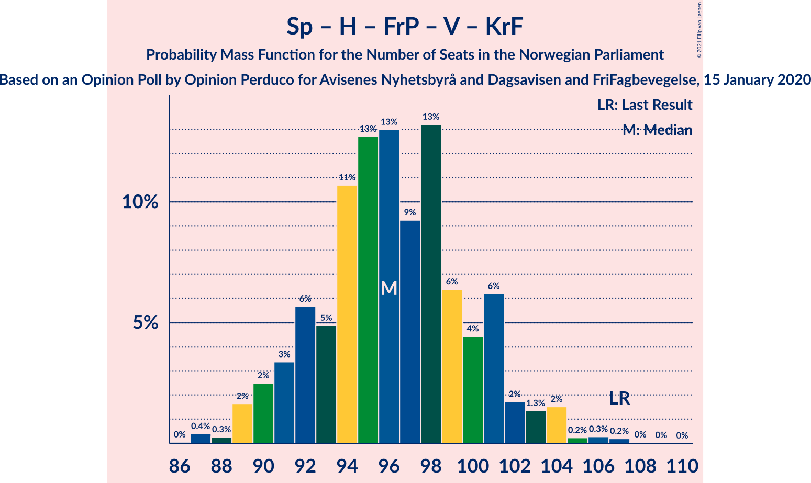
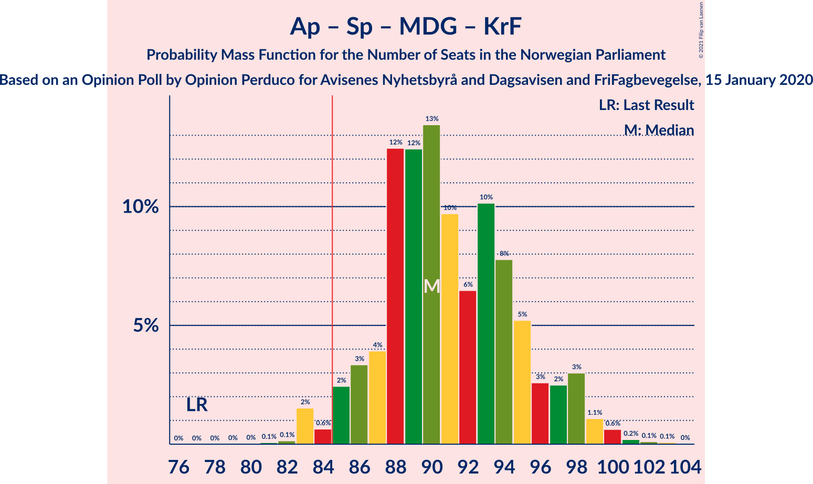
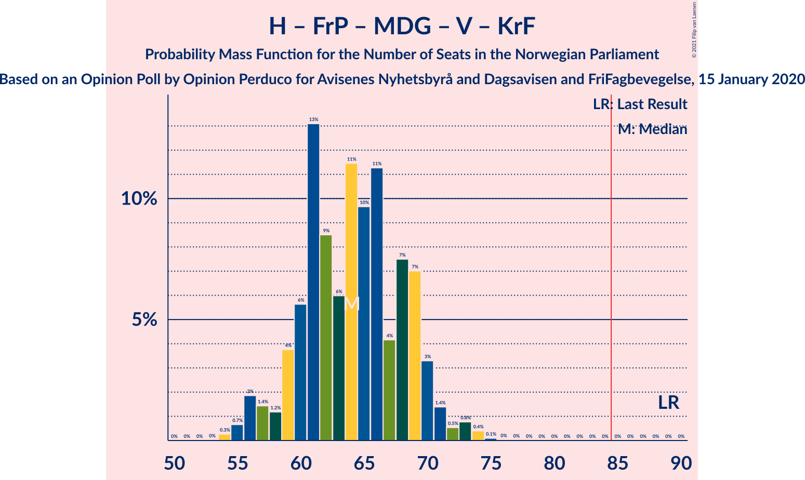
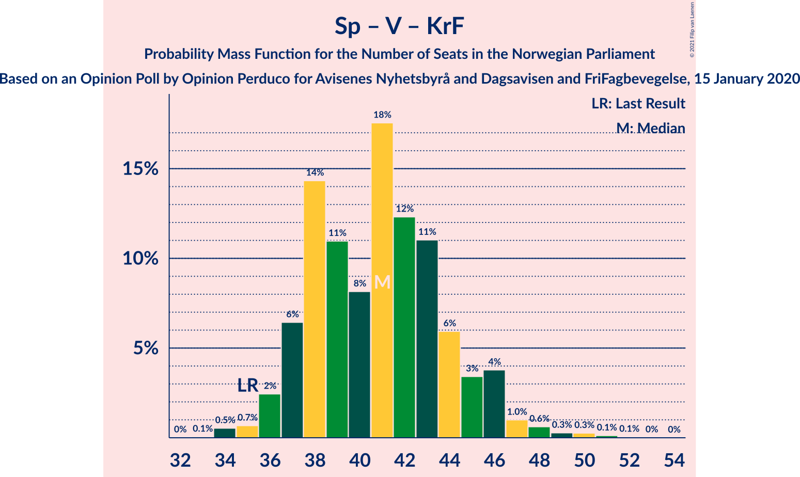
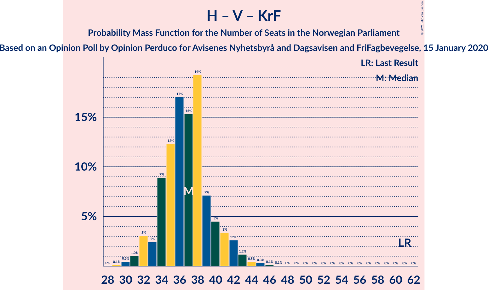

# Opinion Poll by Opinion Perduco for Avisenes Nyhetsbyrå and Dagsavisen and FriFagbevegelse, 15 January 2020

<a href="#voting-intentions">Voting Intentions</a> | <a href="#seats">Seats</a> | <a href="#coalitions">Coalitions</a> | <a href="#technical-information">Technical Information</a>

## Voting Intentions

### Confidence Intervals

| Party | Last Result | Poll Result | 80% Confidence Interval | 90% Confidence Interval | 95% Confidence Interval | 99% Confidence Interval |
|:-----:|:-----------:|:-----------:|:-----------------------:|:-----------------------:|:-----------------------:|:-----------------------:|
| Arbeiderpartiet | 27.4% | 25.5% | 23.7–27.3% |23.2–27.9% |22.8–28.3% |22.0–29.2% |
| Senterpartiet | 10.3% | 20.9% | 19.3–22.6% |18.8–23.2% |18.4–23.6% |17.7–24.4% |
| Høyre | 25.0% | 18.7% | 17.2–20.4% |16.7–20.9% |16.4–21.3% |15.7–22.1% |
| Fremskrittspartiet | 15.2% | 11.7% | 10.5–13.2% |10.2–13.6% |9.9–13.9% |9.3–14.7% |
| Sosialistisk Venstreparti | 6.0% | 7.4% | 6.4–8.6% |6.1–8.9% |5.9–9.2% |5.5–9.8% |
| Rødt | 2.4% | 4.4% | 3.6–5.3% |3.4–5.6% |3.2–5.9% |2.9–6.4% |
| Miljøpartiet De Grønne | 3.2% | 4.3% | 3.5–5.2% |3.3–5.5% |3.2–5.7% |2.8–6.2% |
| Venstre | 4.4% | 2.7% | 2.1–3.5% |2.0–3.7% |1.8–3.9% |1.6–4.4% |
| Kristelig Folkeparti | 4.2% | 2.5% | 2.0–3.3% |1.8–3.5% |1.7–3.7% |1.4–4.1% |

*Note:* The poll result column reflects the actual value used in the calculations. Published results may vary slightly, and in addition be rounded to fewer digits.

## Seats

### Confidence Intervals

| Party | Last Result | Median | 80% Confidence Interval | 90% Confidence Interval | 95% Confidence Interval | 99% Confidence Interval |
|:-----:|:-----------:|:------:|:-----------------------:|:-----------------------:|:-----------------------:|:-----------------------:|
| <a href="#arbeiderpartiet">Arbeiderpartiet</a> | 49 | 46 | 43–49 |42–50 |41–51 |40–53 |
| <a href="#senterpartiet">Senterpartiet</a> | 19 | 38 | 35–41 |34–42 |34–43 |33–44 |
| <a href="#høyre">Høyre</a> | 45 | 34 | 31–37 |30–38 |29–39 |28–41 |
| <a href="#fremskrittspartiet">Fremskrittspartiet</a> | 27 | 21 | 19–23 |18–24 |18–25 |17–26 |
| <a href="#sosialistisk-venstreparti">Sosialistisk Venstreparti</a> | 11 | 13 | 12–16 |11–16 |10–17 |10–18 |
| <a href="#rødt">Rødt</a> | 1 | 8 | 2–9 |2–10 |2–10 |2–11 |
| <a href="#miljøpartiet-de-grønne">Miljøpartiet De Grønne</a> | 1 | 8 | 2–9 |2–10 |2–10 |1–11 |
| <a href="#venstre">Venstre</a> | 8 | 2 | 1–2 |1–2 |1–3 |0–8 |
| <a href="#kristelig-folkeparti">Kristelig Folkeparti</a> | 8 | 1 | 0–3 |0–3 |0–3 |0–7 |

### Arbeiderpartiet

*For a full overview of the results for this party, see the [Arbeiderpartiet](party-arbeiderpartiet.html) page.*

| Number of Seats | Probability | Accumulated | Special Marks |
|:---------------:|:-----------:|:-----------:|:-------------:|
| 37 | 0.1% | 100% |  |
| 38 | 0.1% | 99.9% |  |
| 39 | 0.3% | 99.9% |  |
| 40 | 1.3% | 99.6% |  |
| 41 | 1.4% | 98% |  |
| 42 | 5% | 97% |  |
| 43 | 7% | 92% |  |
| 44 | 18% | 85% |  |
| 45 | 10% | 67% |  |
| 46 | 19% | 57% | Median |
| 47 | 13% | 39% |  |
| 48 | 8% | 26% |  |
| 49 | 11% | 18% | Last Result |
| 50 | 3% | 7% |  |
| 51 | 2% | 4% |  |
| 52 | 1.1% | 2% |  |
| 53 | 0.6% | 0.7% |  |
| 54 | 0.1% | 0.2% |  |
| 55 | 0% | 0.1% |  |
| 56 | 0% | 0% |  |

### Senterpartiet

*For a full overview of the results for this party, see the [Senterpartiet](party-senterpartiet.html) page.*

| Number of Seats | Probability | Accumulated | Special Marks |
|:---------------:|:-----------:|:-----------:|:-------------:|
| 19 | 0% | 100% | Last Result |
| 20 | 0% | 100% |  |
| 21 | 0% | 100% |  |
| 22 | 0% | 100% |  |
| 23 | 0% | 100% |  |
| 24 | 0% | 100% |  |
| 25 | 0% | 100% |  |
| 26 | 0% | 100% |  |
| 27 | 0% | 100% |  |
| 28 | 0% | 100% |  |
| 29 | 0% | 100% |  |
| 30 | 0% | 100% |  |
| 31 | 0.1% | 100% |  |
| 32 | 0.3% | 99.8% |  |
| 33 | 2% | 99.5% |  |
| 34 | 5% | 98% |  |
| 35 | 11% | 92% |  |
| 36 | 12% | 81% |  |
| 37 | 12% | 69% |  |
| 38 | 12% | 57% | Median |
| 39 | 15% | 45% |  |
| 40 | 11% | 30% |  |
| 41 | 9% | 18% |  |
| 42 | 5% | 10% |  |
| 43 | 3% | 5% |  |
| 44 | 1.1% | 1.5% |  |
| 45 | 0.3% | 0.4% |  |
| 46 | 0.1% | 0.1% |  |
| 47 | 0% | 0% |  |

### Høyre

*For a full overview of the results for this party, see the [Høyre](party-høyre.html) page.*

| Number of Seats | Probability | Accumulated | Special Marks |
|:---------------:|:-----------:|:-----------:|:-------------:|
| 26 | 0.1% | 100% |  |
| 27 | 0.2% | 99.9% |  |
| 28 | 0.9% | 99.7% |  |
| 29 | 2% | 98.8% |  |
| 30 | 3% | 96% |  |
| 31 | 5% | 93% |  |
| 32 | 11% | 88% |  |
| 33 | 14% | 77% |  |
| 34 | 18% | 63% | Median |
| 35 | 23% | 45% |  |
| 36 | 11% | 22% |  |
| 37 | 4% | 11% |  |
| 38 | 4% | 7% |  |
| 39 | 1.4% | 3% |  |
| 40 | 0.8% | 1.3% |  |
| 41 | 0.3% | 0.6% |  |
| 42 | 0.2% | 0.3% |  |
| 43 | 0% | 0% |  |
| 44 | 0% | 0% |  |
| 45 | 0% | 0% | Last Result |

### Fremskrittspartiet

*For a full overview of the results for this party, see the [Fremskrittspartiet](party-fremskrittspartiet.html) page.*

| Number of Seats | Probability | Accumulated | Special Marks |
|:---------------:|:-----------:|:-----------:|:-------------:|
| 15 | 0.1% | 100% |  |
| 16 | 0.3% | 99.9% |  |
| 17 | 2% | 99.7% |  |
| 18 | 3% | 98% |  |
| 19 | 10% | 95% |  |
| 20 | 20% | 85% |  |
| 21 | 17% | 65% | Median |
| 22 | 20% | 48% |  |
| 23 | 19% | 28% |  |
| 24 | 4% | 9% |  |
| 25 | 3% | 5% |  |
| 26 | 1.3% | 2% |  |
| 27 | 0.4% | 0.5% | Last Result |
| 28 | 0.1% | 0.1% |  |
| 29 | 0% | 0% |  |

### Sosialistisk Venstreparti

*For a full overview of the results for this party, see the [Sosialistisk Venstreparti](party-sosialistiskvenstreparti.html) page.*

| Number of Seats | Probability | Accumulated | Special Marks |
|:---------------:|:-----------:|:-----------:|:-------------:|
| 9 | 0.3% | 100% |  |
| 10 | 2% | 99.7% |  |
| 11 | 7% | 97% | Last Result |
| 12 | 19% | 91% |  |
| 13 | 29% | 71% | Median |
| 14 | 20% | 43% |  |
| 15 | 10% | 22% |  |
| 16 | 9% | 12% |  |
| 17 | 2% | 3% |  |
| 18 | 0.7% | 0.9% |  |
| 19 | 0.2% | 0.2% |  |
| 20 | 0% | 0% |  |

### Rødt

*For a full overview of the results for this party, see the [Rødt](party-rødt.html) page.*

| Number of Seats | Probability | Accumulated | Special Marks |
|:---------------:|:-----------:|:-----------:|:-------------:|
| 1 | 0.3% | 100% | Last Result |
| 2 | 15% | 99.7% |  |
| 3 | 0% | 84% |  |
| 4 | 0% | 84% |  |
| 5 | 0% | 84% |  |
| 6 | 0% | 84% |  |
| 7 | 9% | 84% |  |
| 8 | 34% | 75% | Median |
| 9 | 31% | 41% |  |
| 10 | 8% | 10% |  |
| 11 | 1.1% | 1.4% |  |
| 12 | 0.3% | 0.4% |  |
| 13 | 0.1% | 0.1% |  |
| 14 | 0% | 0% |  |

### Miljøpartiet De Grønne

*For a full overview of the results for this party, see the [Miljøpartiet De Grønne](party-miljøpartietdegrønne.html) page.*

| Number of Seats | Probability | Accumulated | Special Marks |
|:---------------:|:-----------:|:-----------:|:-------------:|
| 1 | 1.4% | 100% | Last Result |
| 2 | 34% | 98.6% |  |
| 3 | 5% | 65% |  |
| 4 | 0.5% | 60% |  |
| 5 | 0% | 59% |  |
| 6 | 0% | 59% |  |
| 7 | 7% | 59% |  |
| 8 | 19% | 52% | Median |
| 9 | 26% | 33% |  |
| 10 | 6% | 7% |  |
| 11 | 0.6% | 0.7% |  |
| 12 | 0.1% | 0.2% |  |
| 13 | 0% | 0% |  |

### Venstre

*For a full overview of the results for this party, see the [Venstre](party-venstre.html) page.*

| Number of Seats | Probability | Accumulated | Special Marks |
|:---------------:|:-----------:|:-----------:|:-------------:|
| 0 | 1.2% | 100% |  |
| 1 | 35% | 98.8% |  |
| 2 | 62% | 64% | Median |
| 3 | 0.7% | 3% |  |
| 4 | 0% | 2% |  |
| 5 | 0% | 2% |  |
| 6 | 0.1% | 2% |  |
| 7 | 1.2% | 2% |  |
| 8 | 0.5% | 0.5% | Last Result |
| 9 | 0% | 0% |  |

### Kristelig Folkeparti

*For a full overview of the results for this party, see the [Kristelig Folkeparti](party-kristeligfolkeparti.html) page.*

| Number of Seats | Probability | Accumulated | Special Marks |
|:---------------:|:-----------:|:-----------:|:-------------:|
| 0 | 24% | 100% |  |
| 1 | 61% | 76% | Median |
| 2 | 4% | 15% |  |
| 3 | 10% | 10% |  |
| 4 | 0% | 0.7% |  |
| 5 | 0% | 0.7% |  |
| 6 | 0% | 0.7% |  |
| 7 | 0.4% | 0.7% |  |
| 8 | 0.3% | 0.3% | Last Result |
| 9 | 0% | 0% |  |

## Coalitions

### Confidence Intervals

| Coalition | Last Result | Median | Majority? | 80% Confidence Interval | 90% Confidence Interval | 95% Confidence Interval | 99% Confidence Interval |
|:---------:|:-----------:|:------:|:---------:|:-----------------------:|:-----------------------:|:-----------------------:|:-----------------------:|
| Arbeiderpartiet – Senterpartiet – Sosialistisk Venstreparti – Rødt – Miljøpartiet De Grønne | 81 | 110 | 100% | 107–115 | 106–116 | 105–116 | 103–119 |
| Arbeiderpartiet – Senterpartiet – Sosialistisk Venstreparti – Rødt | 80 | 105 | 100% | 100–109 | 99–111 | 98–113 | 95–114 |
| Arbeiderpartiet – Senterpartiet – Sosialistisk Venstreparti – Miljøpartiet De Grønne – Kristelig Folkeparti | 88 | 104 | 100% | 101–109 | 99–111 | 98–112 | 96–113 |
| Arbeiderpartiet – Senterpartiet – Sosialistisk Venstreparti – Miljøpartiet De Grønne | 80 | 103 | 100% | 100–108 | 98–110 | 97–111 | 95–113 |
| Arbeiderpartiet – Senterpartiet – Sosialistisk Venstreparti | 79 | 98 | 100% | 93–102 | 92–104 | 91–104 | 90–106 |
| Senterpartiet – Høyre – Fremskrittspartiet – Venstre – Kristelig Folkeparti | 107 | 96 | 100% | 92–101 | 91–102 | 90–103 | 88–106 |
| Arbeiderpartiet – Senterpartiet – Miljøpartiet De Grønne – Kristelig Folkeparti | 77 | 90 | 98% | 87–96 | 86–98 | 85–98 | 83–100 |
| Arbeiderpartiet – Senterpartiet – Kristelig Folkeparti | 76 | 85 | 57% | 81–89 | 80–90 | 79–92 | 78–93 |
| Arbeiderpartiet – Senterpartiet | 68 | 84 | 47% | 80–88 | 79–89 | 79–91 | 77–92 |
| Arbeiderpartiet – Sosialistisk Venstreparti – Rødt – Miljøpartiet De Grønne | 62 | 73 | 0% | 68–77 | 67–78 | 66–79 | 63–81 |
| Høyre – Fremskrittspartiet – Miljøpartiet De Grønne – Venstre – Kristelig Folkeparti | 89 | 64 | 0% | 60–69 | 58–70 | 56–71 | 55–74 |
| Arbeiderpartiet – Sosialistisk Venstreparti | 60 | 59 | 0% | 56–63 | 55–64 | 54–65 | 52–68 |
| Høyre – Fremskrittspartiet – Venstre – Kristelig Folkeparti | 88 | 59 | 0% | 54–62 | 53–63 | 53–64 | 50–66 |
| Høyre – Fremskrittspartiet – Venstre | 80 | 58 | 0% | 53–61 | 52–62 | 52–63 | 49–65 |
| Høyre – Fremskrittspartiet | 72 | 56 | 0% | 52–59 | 51–60 | 50–61 | 47–63 |
| Senterpartiet – Venstre – Kristelig Folkeparti | 35 | 41 | 0% | 37–44 | 37–46 | 36–46 | 34–49 |
| Høyre – Venstre – Kristelig Folkeparti | 61 | 37 | 0% | 34–40 | 33–41 | 32–42 | 30–45 |

### Arbeiderpartiet – Senterpartiet – Sosialistisk Venstreparti – Rødt – Miljøpartiet De Grønne

| Number of Seats | Probability | Accumulated | Special Marks |
|:---------------:|:-----------:|:-----------:|:-------------:|
| 81 | 0% | 100% | Last Result |
| 82 | 0% | 100% |  |
| 83 | 0% | 100% |  |
| 84 | 0% | 100% |  |
| 85 | 0% | 100% | Majority |
| 86 | 0% | 100% |  |
| 87 | 0% | 100% |  |
| 88 | 0% | 100% |  |
| 89 | 0% | 100% |  |
| 90 | 0% | 100% |  |
| 91 | 0% | 100% |  |
| 92 | 0% | 100% |  |
| 93 | 0% | 100% |  |
| 94 | 0% | 100% |  |
| 95 | 0% | 100% |  |
| 96 | 0% | 100% |  |
| 97 | 0% | 100% |  |
| 98 | 0% | 100% |  |
| 99 | 0% | 100% |  |
| 100 | 0.1% | 100% |  |
| 101 | 0.1% | 99.9% |  |
| 102 | 0.2% | 99.8% |  |
| 103 | 0.7% | 99.6% |  |
| 104 | 1.0% | 98.9% |  |
| 105 | 2% | 98% |  |
| 106 | 3% | 96% |  |
| 107 | 4% | 93% |  |
| 108 | 5% | 89% |  |
| 109 | 14% | 84% |  |
| 110 | 20% | 69% |  |
| 111 | 13% | 50% |  |
| 112 | 9% | 37% |  |
| 113 | 9% | 28% | Median |
| 114 | 8% | 19% |  |
| 115 | 5% | 11% |  |
| 116 | 3% | 6% |  |
| 117 | 0.9% | 2% |  |
| 118 | 0.5% | 2% |  |
| 119 | 0.6% | 1.0% |  |
| 120 | 0.2% | 0.4% |  |
| 121 | 0.2% | 0.2% |  |
| 122 | 0% | 0% |  |

### Arbeiderpartiet – Senterpartiet – Sosialistisk Venstreparti – Rødt

| Number of Seats | Probability | Accumulated | Special Marks |
|:---------------:|:-----------:|:-----------:|:-------------:|
| 80 | 0% | 100% | Last Result |
| 81 | 0% | 100% |  |
| 82 | 0% | 100% |  |
| 83 | 0% | 100% |  |
| 84 | 0% | 100% |  |
| 85 | 0% | 100% | Majority |
| 86 | 0% | 100% |  |
| 87 | 0% | 100% |  |
| 88 | 0% | 100% |  |
| 89 | 0% | 100% |  |
| 90 | 0% | 100% |  |
| 91 | 0% | 100% |  |
| 92 | 0% | 100% |  |
| 93 | 0% | 100% |  |
| 94 | 0.1% | 99.9% |  |
| 95 | 0.4% | 99.9% |  |
| 96 | 0.8% | 99.5% |  |
| 97 | 0.5% | 98.7% |  |
| 98 | 1.4% | 98% |  |
| 99 | 3% | 97% |  |
| 100 | 7% | 93% |  |
| 101 | 7% | 86% |  |
| 102 | 4% | 79% |  |
| 103 | 11% | 75% |  |
| 104 | 10% | 64% |  |
| 105 | 11% | 54% | Median |
| 106 | 6% | 42% |  |
| 107 | 8% | 36% |  |
| 108 | 13% | 28% |  |
| 109 | 6% | 15% |  |
| 110 | 4% | 9% |  |
| 111 | 1.2% | 5% |  |
| 112 | 1.4% | 4% |  |
| 113 | 2% | 3% |  |
| 114 | 0.7% | 1.0% |  |
| 115 | 0.3% | 0.3% |  |
| 116 | 0% | 0% |  |

### Arbeiderpartiet – Senterpartiet – Sosialistisk Venstreparti – Miljøpartiet De Grønne – Kristelig Folkeparti

| Number of Seats | Probability | Accumulated | Special Marks |
|:---------------:|:-----------:|:-----------:|:-------------:|
| 88 | 0% | 100% | Last Result |
| 89 | 0% | 100% |  |
| 90 | 0% | 100% |  |
| 91 | 0% | 100% |  |
| 92 | 0% | 100% |  |
| 93 | 0% | 100% |  |
| 94 | 0% | 100% |  |
| 95 | 0.3% | 99.9% |  |
| 96 | 0.2% | 99.7% |  |
| 97 | 2% | 99.4% |  |
| 98 | 2% | 98% |  |
| 99 | 1.2% | 96% |  |
| 100 | 2% | 94% |  |
| 101 | 6% | 93% |  |
| 102 | 23% | 87% |  |
| 103 | 12% | 64% |  |
| 104 | 8% | 51% |  |
| 105 | 7% | 44% |  |
| 106 | 6% | 37% | Median |
| 107 | 15% | 30% |  |
| 108 | 3% | 15% |  |
| 109 | 4% | 12% |  |
| 110 | 2% | 8% |  |
| 111 | 3% | 6% |  |
| 112 | 2% | 3% |  |
| 113 | 0.7% | 1.2% |  |
| 114 | 0.2% | 0.4% |  |
| 115 | 0.1% | 0.2% |  |
| 116 | 0.1% | 0.1% |  |
| 117 | 0.1% | 0.1% |  |
| 118 | 0% | 0% |  |

### Arbeiderpartiet – Senterpartiet – Sosialistisk Venstreparti – Miljøpartiet De Grønne

| Number of Seats | Probability | Accumulated | Special Marks |
|:---------------:|:-----------:|:-----------:|:-------------:|
| 80 | 0% | 100% | Last Result |
| 81 | 0% | 100% |  |
| 82 | 0% | 100% |  |
| 83 | 0% | 100% |  |
| 84 | 0% | 100% |  |
| 85 | 0% | 100% | Majority |
| 86 | 0% | 100% |  |
| 87 | 0% | 100% |  |
| 88 | 0% | 100% |  |
| 89 | 0% | 100% |  |
| 90 | 0% | 100% |  |
| 91 | 0% | 100% |  |
| 92 | 0% | 100% |  |
| 93 | 0% | 100% |  |
| 94 | 0.4% | 99.9% |  |
| 95 | 0.2% | 99.6% |  |
| 96 | 1.3% | 99.4% |  |
| 97 | 2% | 98% |  |
| 98 | 1.4% | 96% |  |
| 99 | 2% | 94% |  |
| 100 | 6% | 93% |  |
| 101 | 20% | 87% |  |
| 102 | 16% | 67% |  |
| 103 | 9% | 51% |  |
| 104 | 7% | 42% |  |
| 105 | 8% | 36% | Median |
| 106 | 12% | 28% |  |
| 107 | 5% | 16% |  |
| 108 | 4% | 11% |  |
| 109 | 2% | 7% |  |
| 110 | 3% | 5% |  |
| 111 | 1.2% | 3% |  |
| 112 | 0.8% | 1.4% |  |
| 113 | 0.3% | 0.5% |  |
| 114 | 0.1% | 0.2% |  |
| 115 | 0.1% | 0.1% |  |
| 116 | 0% | 0% |  |

### Arbeiderpartiet – Senterpartiet – Sosialistisk Venstreparti

| Number of Seats | Probability | Accumulated | Special Marks |
|:---------------:|:-----------:|:-----------:|:-------------:|
| 79 | 0% | 100% | Last Result |
| 80 | 0% | 100% |  |
| 81 | 0% | 100% |  |
| 82 | 0% | 100% |  |
| 83 | 0% | 100% |  |
| 84 | 0% | 100% |  |
| 85 | 0% | 100% | Majority |
| 86 | 0% | 100% |  |
| 87 | 0.1% | 100% |  |
| 88 | 0.1% | 99.9% |  |
| 89 | 0.3% | 99.8% |  |
| 90 | 0.4% | 99.5% |  |
| 91 | 2% | 99.1% |  |
| 92 | 5% | 97% |  |
| 93 | 8% | 92% |  |
| 94 | 7% | 84% |  |
| 95 | 10% | 77% |  |
| 96 | 8% | 67% |  |
| 97 | 7% | 59% | Median |
| 98 | 12% | 52% |  |
| 99 | 16% | 41% |  |
| 100 | 7% | 25% |  |
| 101 | 5% | 17% |  |
| 102 | 5% | 12% |  |
| 103 | 2% | 8% |  |
| 104 | 4% | 6% |  |
| 105 | 2% | 2% |  |
| 106 | 0.4% | 0.8% |  |
| 107 | 0.2% | 0.4% |  |
| 108 | 0% | 0.1% |  |
| 109 | 0.1% | 0.1% |  |
| 110 | 0% | 0% |  |

### Senterpartiet – Høyre – Fremskrittspartiet – Venstre – Kristelig Folkeparti

| Number of Seats | Probability | Accumulated | Special Marks |
|:---------------:|:-----------:|:-----------:|:-------------:|
| 86 | 0% | 100% |  |
| 87 | 0.4% | 99.9% |  |
| 88 | 0.3% | 99.5% |  |
| 89 | 2% | 99.3% |  |
| 90 | 2% | 98% |  |
| 91 | 3% | 95% |  |
| 92 | 6% | 92% |  |
| 93 | 5% | 86% |  |
| 94 | 11% | 81% |  |
| 95 | 13% | 71% |  |
| 96 | 13% | 58% | Median |
| 97 | 9% | 45% |  |
| 98 | 13% | 36% |  |
| 99 | 6% | 22% |  |
| 100 | 4% | 16% |  |
| 101 | 6% | 12% |  |
| 102 | 2% | 5% |  |
| 103 | 1.3% | 4% |  |
| 104 | 2% | 2% |  |
| 105 | 0.2% | 0.8% |  |
| 106 | 0.3% | 0.5% |  |
| 107 | 0.2% | 0.3% | Last Result |
| 108 | 0% | 0.1% |  |
| 109 | 0% | 0% |  |

### Arbeiderpartiet – Senterpartiet – Miljøpartiet De Grønne – Kristelig Folkeparti

| Number of Seats | Probability | Accumulated | Special Marks |
|:---------------:|:-----------:|:-----------:|:-------------:|
| 77 | 0% | 100% | Last Result |
| 78 | 0% | 100% |  |
| 79 | 0% | 100% |  |
| 80 | 0% | 100% |  |
| 81 | 0.1% | 99.9% |  |
| 82 | 0.1% | 99.9% |  |
| 83 | 2% | 99.7% |  |
| 84 | 0.6% | 98% |  |
| 85 | 2% | 98% | Majority |
| 86 | 3% | 95% |  |
| 87 | 4% | 92% |  |
| 88 | 12% | 88% |  |
| 89 | 12% | 75% |  |
| 90 | 13% | 63% |  |
| 91 | 10% | 50% |  |
| 92 | 6% | 40% |  |
| 93 | 10% | 33% | Median |
| 94 | 8% | 23% |  |
| 95 | 5% | 15% |  |
| 96 | 3% | 10% |  |
| 97 | 2% | 8% |  |
| 98 | 3% | 5% |  |
| 99 | 1.1% | 2% |  |
| 100 | 0.6% | 1.0% |  |
| 101 | 0.2% | 0.4% |  |
| 102 | 0.1% | 0.2% |  |
| 103 | 0.1% | 0.1% |  |
| 104 | 0% | 0% |  |

### Arbeiderpartiet – Senterpartiet – Kristelig Folkeparti

| Number of Seats | Probability | Accumulated | Special Marks |
|:---------------:|:-----------:|:-----------:|:-------------:|
| 75 | 0% | 100% |  |
| 76 | 0.1% | 99.9% | Last Result |
| 77 | 0.3% | 99.9% |  |
| 78 | 0.5% | 99.5% |  |
| 79 | 2% | 99.1% |  |
| 80 | 5% | 97% |  |
| 81 | 13% | 93% |  |
| 82 | 8% | 80% |  |
| 83 | 3% | 72% |  |
| 84 | 11% | 68% |  |
| 85 | 8% | 57% | Median, Majority |
| 86 | 17% | 49% |  |
| 87 | 12% | 33% |  |
| 88 | 5% | 21% |  |
| 89 | 6% | 16% |  |
| 90 | 5% | 10% |  |
| 91 | 1.4% | 4% |  |
| 92 | 2% | 3% |  |
| 93 | 0.5% | 0.9% |  |
| 94 | 0.3% | 0.5% |  |
| 95 | 0.1% | 0.2% |  |
| 96 | 0.1% | 0.1% |  |
| 97 | 0% | 0% |  |

### Arbeiderpartiet – Senterpartiet

| Number of Seats | Probability | Accumulated | Special Marks |
|:---------------:|:-----------:|:-----------:|:-------------:|
| 68 | 0% | 100% | Last Result |
| 69 | 0% | 100% |  |
| 70 | 0% | 100% |  |
| 71 | 0% | 100% |  |
| 72 | 0% | 100% |  |
| 73 | 0% | 100% |  |
| 74 | 0% | 100% |  |
| 75 | 0.1% | 99.9% |  |
| 76 | 0.3% | 99.9% |  |
| 77 | 0.6% | 99.6% |  |
| 78 | 1.3% | 99.0% |  |
| 79 | 4% | 98% |  |
| 80 | 14% | 94% |  |
| 81 | 8% | 80% |  |
| 82 | 4% | 72% |  |
| 83 | 9% | 67% |  |
| 84 | 11% | 58% | Median |
| 85 | 13% | 47% | Majority |
| 86 | 16% | 34% |  |
| 87 | 4% | 18% |  |
| 88 | 5% | 15% |  |
| 89 | 5% | 9% |  |
| 90 | 1.5% | 4% |  |
| 91 | 2% | 3% |  |
| 92 | 0.3% | 0.6% |  |
| 93 | 0.2% | 0.3% |  |
| 94 | 0.1% | 0.1% |  |
| 95 | 0% | 0.1% |  |
| 96 | 0% | 0% |  |

### Arbeiderpartiet – Sosialistisk Venstreparti – Rødt – Miljøpartiet De Grønne

| Number of Seats | Probability | Accumulated | Special Marks |
|:---------------:|:-----------:|:-----------:|:-------------:|
| 61 | 0% | 100% |  |
| 62 | 0.2% | 99.9% | Last Result |
| 63 | 0.3% | 99.7% |  |
| 64 | 0.2% | 99.5% |  |
| 65 | 2% | 99.2% |  |
| 66 | 1.4% | 98% |  |
| 67 | 2% | 96% |  |
| 68 | 6% | 95% |  |
| 69 | 4% | 88% |  |
| 70 | 6% | 84% |  |
| 71 | 13% | 78% |  |
| 72 | 9% | 64% |  |
| 73 | 13% | 55% |  |
| 74 | 13% | 42% |  |
| 75 | 11% | 29% | Median |
| 76 | 5% | 19% |  |
| 77 | 6% | 14% |  |
| 78 | 3% | 8% |  |
| 79 | 2% | 5% |  |
| 80 | 2% | 2% |  |
| 81 | 0.3% | 0.7% |  |
| 82 | 0.4% | 0.5% |  |
| 83 | 0% | 0.1% |  |
| 84 | 0% | 0% |  |

### Høyre – Fremskrittspartiet – Miljøpartiet De Grønne – Venstre – Kristelig Folkeparti

| Number of Seats | Probability | Accumulated | Special Marks |
|:---------------:|:-----------:|:-----------:|:-------------:|
| 54 | 0.3% | 100% |  |
| 55 | 0.7% | 99.7% |  |
| 56 | 2% | 99.0% |  |
| 57 | 1.4% | 97% |  |
| 58 | 1.2% | 96% |  |
| 59 | 4% | 95% |  |
| 60 | 6% | 91% |  |
| 61 | 13% | 85% |  |
| 62 | 9% | 72% |  |
| 63 | 6% | 64% |  |
| 64 | 11% | 58% |  |
| 65 | 10% | 46% |  |
| 66 | 11% | 36% | Median |
| 67 | 4% | 25% |  |
| 68 | 7% | 21% |  |
| 69 | 7% | 14% |  |
| 70 | 3% | 7% |  |
| 71 | 1.4% | 3% |  |
| 72 | 0.5% | 2% |  |
| 73 | 0.8% | 1.3% |  |
| 74 | 0.4% | 0.5% |  |
| 75 | 0.1% | 0.1% |  |
| 76 | 0% | 0.1% |  |
| 77 | 0% | 0% |  |
| 78 | 0% | 0% |  |
| 79 | 0% | 0% |  |
| 80 | 0% | 0% |  |
| 81 | 0% | 0% |  |
| 82 | 0% | 0% |  |
| 83 | 0% | 0% |  |
| 84 | 0% | 0% |  |
| 85 | 0% | 0% | Majority |
| 86 | 0% | 0% |  |
| 87 | 0% | 0% |  |
| 88 | 0% | 0% |  |
| 89 | 0% | 0% | Last Result |

### Arbeiderpartiet – Sosialistisk Venstreparti

| Number of Seats | Probability | Accumulated | Special Marks |
|:---------------:|:-----------:|:-----------:|:-------------:|
| 50 | 0.1% | 100% |  |
| 51 | 0.2% | 99.9% |  |
| 52 | 0.7% | 99.7% |  |
| 53 | 1.0% | 99.0% |  |
| 54 | 2% | 98% |  |
| 55 | 5% | 96% |  |
| 56 | 7% | 91% |  |
| 57 | 11% | 84% |  |
| 58 | 12% | 73% |  |
| 59 | 14% | 61% | Median |
| 60 | 15% | 47% | Last Result |
| 61 | 11% | 32% |  |
| 62 | 8% | 22% |  |
| 63 | 4% | 13% |  |
| 64 | 5% | 9% |  |
| 65 | 2% | 4% |  |
| 66 | 1.0% | 2% |  |
| 67 | 0.5% | 1.2% |  |
| 68 | 0.6% | 0.7% |  |
| 69 | 0.1% | 0.2% |  |
| 70 | 0.1% | 0.1% |  |
| 71 | 0% | 0% |  |

### Høyre – Fremskrittspartiet – Venstre – Kristelig Folkeparti

| Number of Seats | Probability | Accumulated | Special Marks |
|:---------------:|:-----------:|:-----------:|:-------------:|
| 48 | 0.2% | 100% |  |
| 49 | 0.2% | 99.8% |  |
| 50 | 0.6% | 99.6% |  |
| 51 | 0.5% | 99.0% |  |
| 52 | 0.9% | 98% |  |
| 53 | 3% | 98% |  |
| 54 | 5% | 94% |  |
| 55 | 8% | 89% |  |
| 56 | 9% | 81% |  |
| 57 | 9% | 72% |  |
| 58 | 13% | 63% | Median |
| 59 | 20% | 50% |  |
| 60 | 14% | 31% |  |
| 61 | 5% | 16% |  |
| 62 | 4% | 11% |  |
| 63 | 3% | 7% |  |
| 64 | 2% | 4% |  |
| 65 | 1.0% | 2% |  |
| 66 | 0.7% | 1.1% |  |
| 67 | 0.2% | 0.4% |  |
| 68 | 0.1% | 0.2% |  |
| 69 | 0.1% | 0.1% |  |
| 70 | 0% | 0% |  |
| 71 | 0% | 0% |  |
| 72 | 0% | 0% |  |
| 73 | 0% | 0% |  |
| 74 | 0% | 0% |  |
| 75 | 0% | 0% |  |
| 76 | 0% | 0% |  |
| 77 | 0% | 0% |  |
| 78 | 0% | 0% |  |
| 79 | 0% | 0% |  |
| 80 | 0% | 0% |  |
| 81 | 0% | 0% |  |
| 82 | 0% | 0% |  |
| 83 | 0% | 0% |  |
| 84 | 0% | 0% |  |
| 85 | 0% | 0% | Majority |
| 86 | 0% | 0% |  |
| 87 | 0% | 0% |  |
| 88 | 0% | 0% | Last Result |

### Høyre – Fremskrittspartiet – Venstre

| Number of Seats | Probability | Accumulated | Special Marks |
|:---------------:|:-----------:|:-----------:|:-------------:|
| 47 | 0.1% | 100% |  |
| 48 | 0.3% | 99.9% |  |
| 49 | 0.7% | 99.6% |  |
| 50 | 0.5% | 98.9% |  |
| 51 | 0.4% | 98% |  |
| 52 | 3% | 98% |  |
| 53 | 6% | 95% |  |
| 54 | 8% | 89% |  |
| 55 | 10% | 80% |  |
| 56 | 7% | 70% |  |
| 57 | 12% | 63% | Median |
| 58 | 22% | 51% |  |
| 59 | 13% | 30% |  |
| 60 | 6% | 16% |  |
| 61 | 3% | 11% |  |
| 62 | 4% | 8% |  |
| 63 | 2% | 4% |  |
| 64 | 0.9% | 2% |  |
| 65 | 0.6% | 0.9% |  |
| 66 | 0.2% | 0.3% |  |
| 67 | 0.1% | 0.1% |  |
| 68 | 0% | 0.1% |  |
| 69 | 0% | 0% |  |
| 70 | 0% | 0% |  |
| 71 | 0% | 0% |  |
| 72 | 0% | 0% |  |
| 73 | 0% | 0% |  |
| 74 | 0% | 0% |  |
| 75 | 0% | 0% |  |
| 76 | 0% | 0% |  |
| 77 | 0% | 0% |  |
| 78 | 0% | 0% |  |
| 79 | 0% | 0% |  |
| 80 | 0% | 0% | Last Result |

### Høyre – Fremskrittspartiet

| Number of Seats | Probability | Accumulated | Special Marks |
|:---------------:|:-----------:|:-----------:|:-------------:|
| 45 | 0% | 100% |  |
| 46 | 0.3% | 99.9% |  |
| 47 | 0.4% | 99.6% |  |
| 48 | 0.7% | 99.1% |  |
| 49 | 0.6% | 98% |  |
| 50 | 3% | 98% |  |
| 51 | 3% | 95% |  |
| 52 | 9% | 92% |  |
| 53 | 8% | 83% |  |
| 54 | 11% | 75% |  |
| 55 | 12% | 64% | Median |
| 56 | 14% | 52% |  |
| 57 | 16% | 38% |  |
| 58 | 11% | 21% |  |
| 59 | 3% | 10% |  |
| 60 | 3% | 7% |  |
| 61 | 2% | 4% |  |
| 62 | 1.0% | 2% |  |
| 63 | 0.4% | 0.8% |  |
| 64 | 0.2% | 0.3% |  |
| 65 | 0.1% | 0.1% |  |
| 66 | 0% | 0% |  |
| 67 | 0% | 0% |  |
| 68 | 0% | 0% |  |
| 69 | 0% | 0% |  |
| 70 | 0% | 0% |  |
| 71 | 0% | 0% |  |
| 72 | 0% | 0% | Last Result |

### Senterpartiet – Venstre – Kristelig Folkeparti

| Number of Seats | Probability | Accumulated | Special Marks |
|:---------------:|:-----------:|:-----------:|:-------------:|
| 33 | 0.1% | 100% |  |
| 34 | 0.5% | 99.9% |  |
| 35 | 0.7% | 99.4% | Last Result |
| 36 | 2% | 98.7% |  |
| 37 | 6% | 96% |  |
| 38 | 14% | 90% |  |
| 39 | 11% | 75% |  |
| 40 | 8% | 65% |  |
| 41 | 18% | 56% | Median |
| 42 | 12% | 39% |  |
| 43 | 11% | 27% |  |
| 44 | 6% | 15% |  |
| 45 | 3% | 10% |  |
| 46 | 4% | 6% |  |
| 47 | 1.0% | 2% |  |
| 48 | 0.6% | 1.4% |  |
| 49 | 0.3% | 0.7% |  |
| 50 | 0.3% | 0.5% |  |
| 51 | 0.1% | 0.2% |  |
| 52 | 0.1% | 0.1% |  |
| 53 | 0% | 0% |  |

### Høyre – Venstre – Kristelig Folkeparti

| Number of Seats | Probability | Accumulated | Special Marks |
|:---------------:|:-----------:|:-----------:|:-------------:|
| 29 | 0.1% | 100% |  |
| 30 | 0.5% | 99.8% |  |
| 31 | 1.0% | 99.4% |  |
| 32 | 3% | 98% |  |
| 33 | 2% | 95% |  |
| 34 | 9% | 93% |  |
| 35 | 12% | 84% |  |
| 36 | 17% | 72% |  |
| 37 | 15% | 54% | Median |
| 38 | 19% | 39% |  |
| 39 | 7% | 20% |  |
| 40 | 5% | 13% |  |
| 41 | 3% | 8% |  |
| 42 | 3% | 5% |  |
| 43 | 1.2% | 2% |  |
| 44 | 0.5% | 1.0% |  |
| 45 | 0.3% | 0.6% |  |
| 46 | 0.1% | 0.2% |  |
| 47 | 0.1% | 0.1% |  |
| 48 | 0% | 0% |  |
| 49 | 0% | 0% |  |
| 50 | 0% | 0% |  |
| 51 | 0% | 0% |  |
| 52 | 0% | 0% |  |
| 53 | 0% | 0% |  |
| 54 | 0% | 0% |  |
| 55 | 0% | 0% |  |
| 56 | 0% | 0% |  |
| 57 | 0% | 0% |  |
| 58 | 0% | 0% |  |
| 59 | 0% | 0% |  |
| 60 | 0% | 0% |  |
| 61 | 0% | 0% | Last Result |

## Technical Information

### Opinion Poll

+ **Polling firm:** Opinion Perduco
+ **Commissioner(s):** Avisenes Nyhetsbyrå and Dagsavisen and FriFagbevegelse
+ **Fieldwork period:** 15 January 2020

### Calculations

+ **Sample size:** 962
+ **Simulations done:** 1,048,576
+ **Error estimate:** 1.33%

