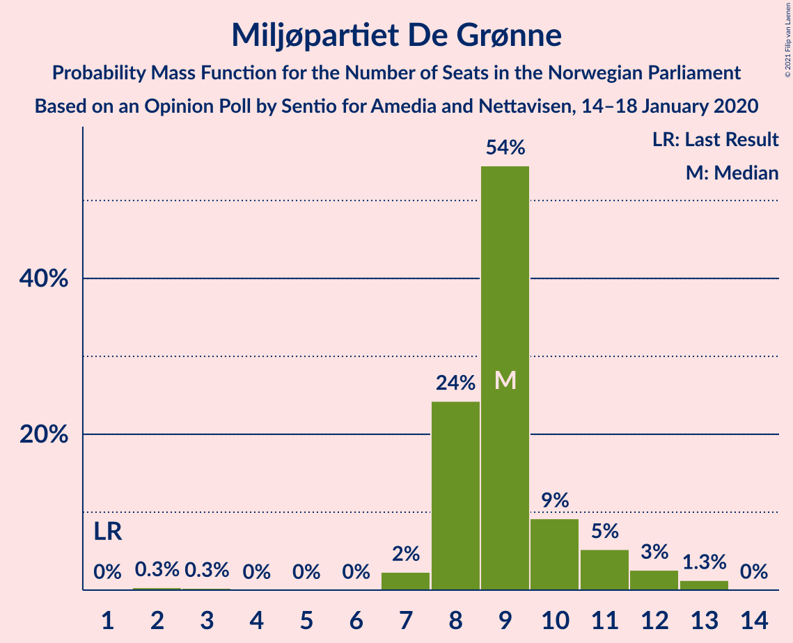
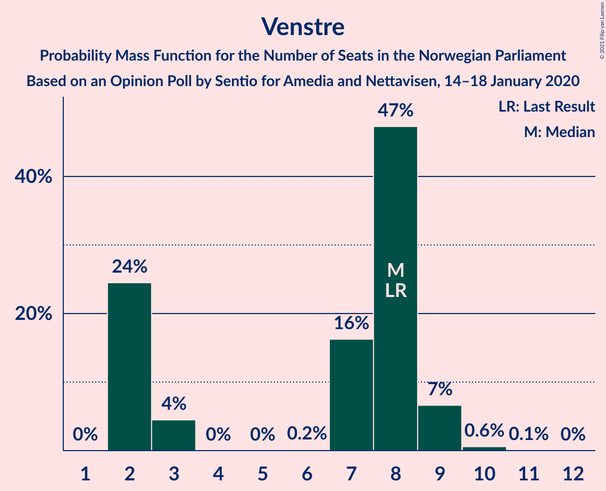
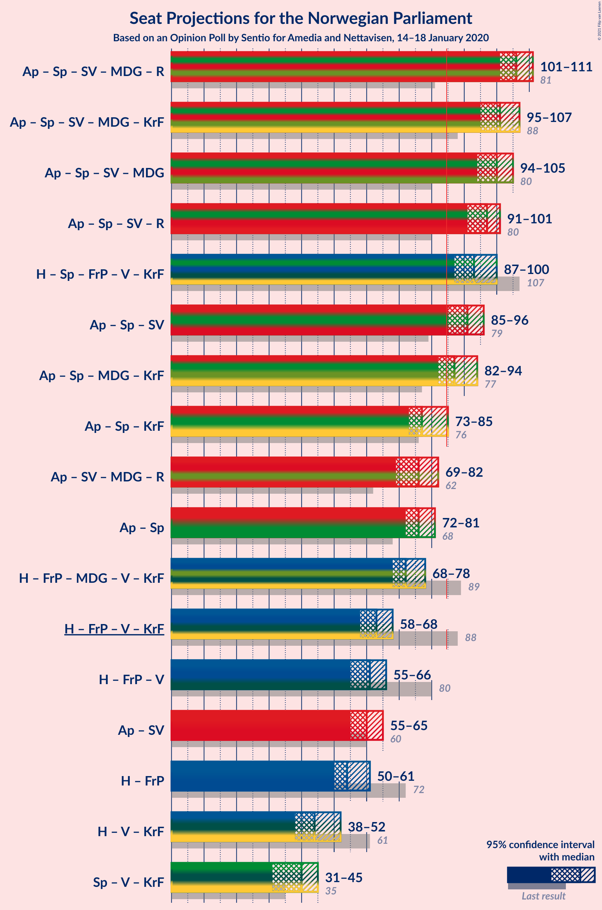
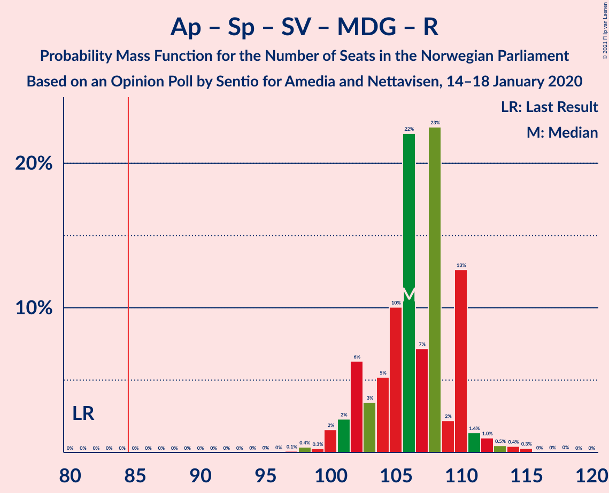
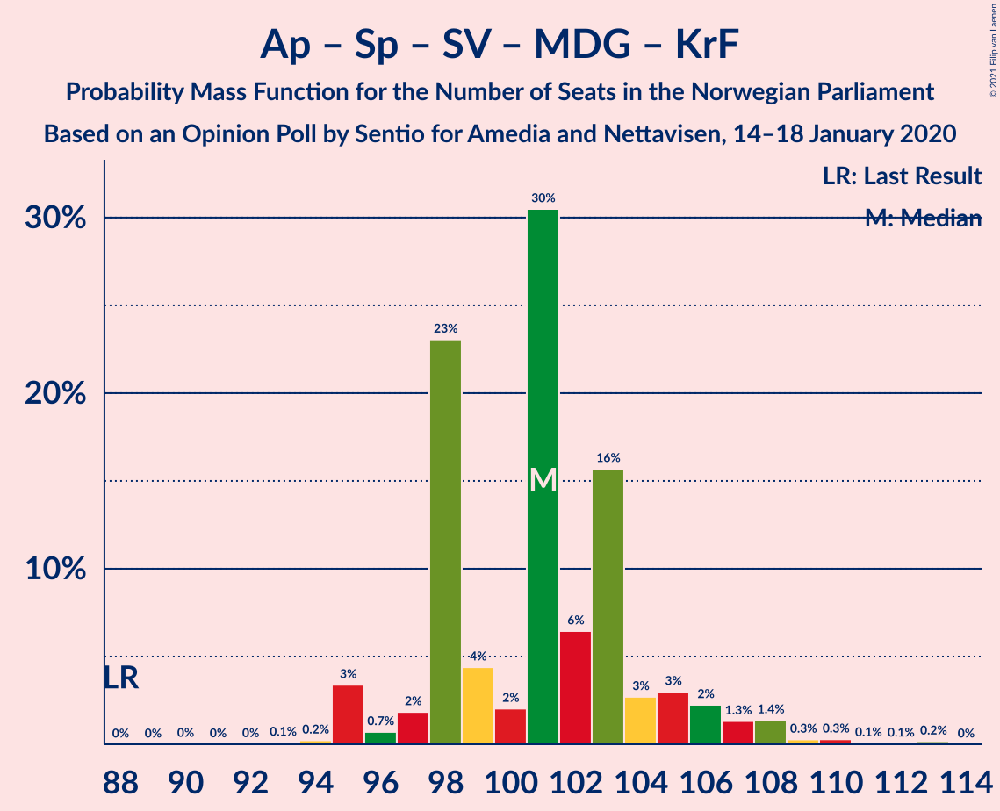
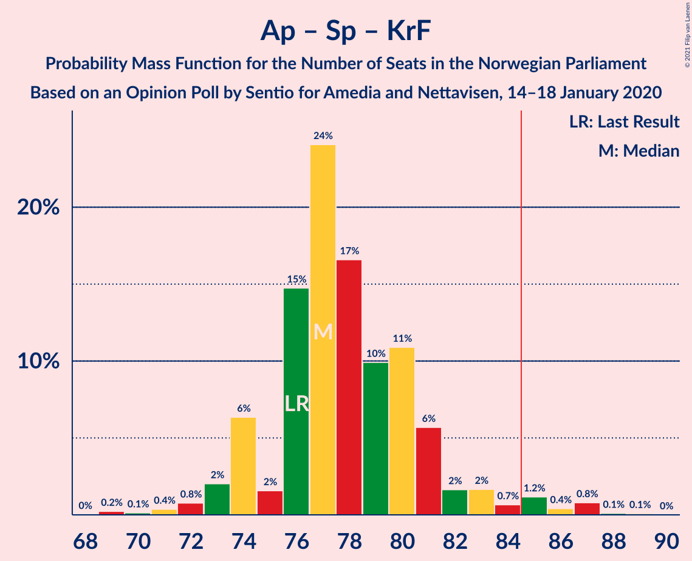
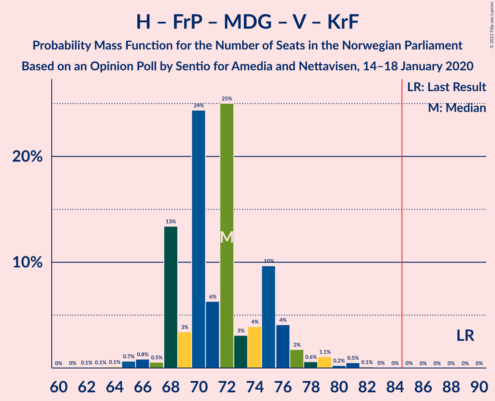
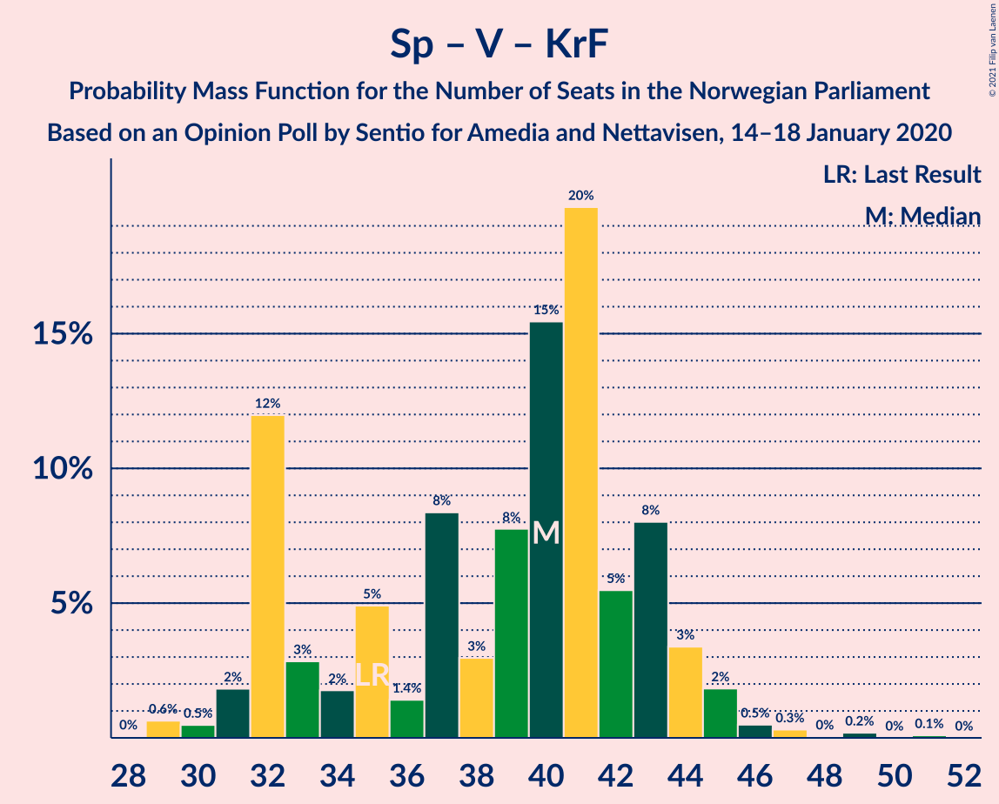

# Opinion Poll by Sentio for Amedia and Nettavisen, 14–18 January 2020

<a href="#voting-intentions">Voting Intentions</a> | <a href="#seats">Seats</a> | <a href="#coalitions">Coalitions</a> | <a href="#technical-information">Technical Information</a>

## Voting Intentions

### Confidence Intervals

| Party | Last Result | Poll Result | 80% Confidence Interval | 90% Confidence Interval | 95% Confidence Interval | 99% Confidence Interval |
|:-----:|:-----------:|:-----------:|:-----------------------:|:-----------------------:|:-----------------------:|:-----------------------:|
| Arbeiderpartiet | 27.4% | 25.4% | 23.7–27.2% |23.2–27.7% |22.8–28.2% |22.0–29.1% |
| Høyre | 25.0% | 20.6% | 19.0–22.3% |18.6–22.8% |18.2–23.2% |17.5–24.1% |
| Senterpartiet | 10.3% | 16.8% | 15.4–18.4% |15.0–18.9% |14.6–19.3% |13.9–20.0% |
| Fremskrittspartiet | 15.2% | 10.8% | 9.6–12.2% |9.3–12.5% |9.0–12.9% |8.5–13.6% |
| Sosialistisk Venstreparti | 6.0% | 7.9% | 6.9–9.1% |6.6–9.4% |6.4–9.7% |5.9–10.3% |
| Miljøpartiet De Grønne | 3.2% | 5.4% | 4.6–6.4% |4.3–6.7% |4.2–7.0% |3.8–7.5% |
| Rødt | 2.4% | 4.5% | 3.8–5.5% |3.6–5.7% |3.4–6.0% |3.0–6.5% |
| Venstre | 4.4% | 4.1% | 3.4–5.0% |3.2–5.3% |3.0–5.5% |2.7–6.0% |
| Kristelig Folkeparti | 4.2% | 3.0% | 2.4–3.8% |2.2–4.1% |2.1–4.3% |1.9–4.7% |

*Note:* The poll result column reflects the actual value used in the calculations. Published results may vary slightly, and in addition be rounded to fewer digits.

## Seats

### Confidence Intervals

| Party | Last Result | Median | 80% Confidence Interval | 90% Confidence Interval | 95% Confidence Interval | 99% Confidence Interval |
|:-----:|:-----------:|:------:|:-----------------------:|:-----------------------:|:-----------------------:|:-----------------------:|
| <a href="#arbeiderpartiet">Arbeiderpartiet</a> | 49 | 45 | 43–50 |43–50 |41–50 |40–52 |
| <a href="#høyre">Høyre</a> | 45 | 37 | 33–39 |33–41 |33–41 |31–41 |
| <a href="#senterpartiet">Senterpartiet</a> | 19 | 31 | 29–34 |28–34 |26–35 |25–37 |
| <a href="#fremskrittspartiet">Fremskrittspartiet</a> | 27 | 19 | 17–24 |17–24 |16–24 |15–25 |
| <a href="#sosialistisk-venstreparti">Sosialistisk Venstreparti</a> | 11 | 13 | 11–15 |11–17 |11–17 |10–18 |
| <a href="#miljøpartiet-de-grønne">Miljøpartiet De Grønne</a> | 1 | 8 | 7–11 |7–11 |7–12 |2–12 |
| <a href="#rødt">Rødt</a> | 1 | 8 | 2–9 |2–10 |2–10 |2–11 |
| <a href="#venstre">Venstre</a> | 8 | 8 | 2–8 |2–9 |2–9 |2–10 |
| <a href="#kristelig-folkeparti">Kristelig Folkeparti</a> | 8 | 1 | 1–7 |0–7 |0–7 |0–7 |

### Arbeiderpartiet

*For a full overview of the results for this party, see the [Arbeiderpartiet](party-arbeiderpartiet.html) page.*

| Number of Seats | Probability | Accumulated | Special Marks |
|:---------------:|:-----------:|:-----------:|:-------------:|
| 38 | 0.2% | 100% |  |
| 39 | 0.2% | 99.8% |  |
| 40 | 0.7% | 99.6% |  |
| 41 | 2% | 98.9% |  |
| 42 | 2% | 97% |  |
| 43 | 7% | 95% |  |
| 44 | 30% | 89% |  |
| 45 | 24% | 59% | Median |
| 46 | 0.9% | 35% |  |
| 47 | 15% | 34% |  |
| 48 | 1.3% | 19% |  |
| 49 | 4% | 18% | Last Result |
| 50 | 12% | 14% |  |
| 51 | 0.4% | 1.3% |  |
| 52 | 0.7% | 0.9% |  |
| 53 | 0.1% | 0.2% |  |
| 54 | 0.1% | 0.2% |  |
| 55 | 0% | 0% |  |

### Høyre

*For a full overview of the results for this party, see the [Høyre](party-høyre.html) page.*

| Number of Seats | Probability | Accumulated | Special Marks |
|:---------------:|:-----------:|:-----------:|:-------------:|
| 29 | 0.1% | 100% |  |
| 30 | 0.1% | 99.9% |  |
| 31 | 0.8% | 99.8% |  |
| 32 | 1.5% | 99.1% |  |
| 33 | 15% | 98% |  |
| 34 | 8% | 82% |  |
| 35 | 14% | 74% |  |
| 36 | 2% | 60% |  |
| 37 | 35% | 58% | Median |
| 38 | 11% | 22% |  |
| 39 | 3% | 11% |  |
| 40 | 3% | 8% |  |
| 41 | 5% | 6% |  |
| 42 | 0.1% | 0.4% |  |
| 43 | 0.2% | 0.3% |  |
| 44 | 0.1% | 0.1% |  |
| 45 | 0% | 0% | Last Result |

### Senterpartiet

*For a full overview of the results for this party, see the [Senterpartiet](party-senterpartiet.html) page.*

| Number of Seats | Probability | Accumulated | Special Marks |
|:---------------:|:-----------:|:-----------:|:-------------:|
| 19 | 0% | 100% | Last Result |
| 20 | 0% | 100% |  |
| 21 | 0% | 100% |  |
| 22 | 0% | 100% |  |
| 23 | 0% | 100% |  |
| 24 | 0% | 100% |  |
| 25 | 1.3% | 99.9% |  |
| 26 | 2% | 98.6% |  |
| 27 | 0.6% | 97% |  |
| 28 | 4% | 96% |  |
| 29 | 24% | 92% |  |
| 30 | 4% | 69% |  |
| 31 | 22% | 64% | Median |
| 32 | 5% | 42% |  |
| 33 | 18% | 37% |  |
| 34 | 16% | 19% |  |
| 35 | 2% | 3% |  |
| 36 | 0.5% | 2% |  |
| 37 | 0.9% | 1.3% |  |
| 38 | 0.1% | 0.3% |  |
| 39 | 0.2% | 0.2% |  |
| 40 | 0% | 0% |  |

### Fremskrittspartiet

*For a full overview of the results for this party, see the [Fremskrittspartiet](party-fremskrittspartiet.html) page.*

| Number of Seats | Probability | Accumulated | Special Marks |
|:---------------:|:-----------:|:-----------:|:-------------:|
| 13 | 0.1% | 100% |  |
| 14 | 0.3% | 99.9% |  |
| 15 | 0.2% | 99.6% |  |
| 16 | 3% | 99.4% |  |
| 17 | 36% | 97% |  |
| 18 | 6% | 60% |  |
| 19 | 8% | 54% | Median |
| 20 | 17% | 46% |  |
| 21 | 4% | 29% |  |
| 22 | 3% | 25% |  |
| 23 | 10% | 22% |  |
| 24 | 11% | 13% |  |
| 25 | 1.3% | 1.4% |  |
| 26 | 0.1% | 0.1% |  |
| 27 | 0% | 0% | Last Result |

### Sosialistisk Venstreparti

*For a full overview of the results for this party, see the [Sosialistisk Venstreparti](party-sosialistiskvenstreparti.html) page.*

| Number of Seats | Probability | Accumulated | Special Marks |
|:---------------:|:-----------:|:-----------:|:-------------:|
| 9 | 0.1% | 100% |  |
| 10 | 2% | 99.9% |  |
| 11 | 14% | 98% | Last Result |
| 12 | 6% | 84% |  |
| 13 | 30% | 78% | Median |
| 14 | 31% | 49% |  |
| 15 | 12% | 18% |  |
| 16 | 0.7% | 6% |  |
| 17 | 4% | 6% |  |
| 18 | 1.3% | 1.4% |  |
| 19 | 0.1% | 0.1% |  |
| 20 | 0% | 0% |  |

### Miljøpartiet De Grønne

*For a full overview of the results for this party, see the [Miljøpartiet De Grønne](party-miljøpartietdegrønne.html) page.*

| Number of Seats | Probability | Accumulated | Special Marks |
|:---------------:|:-----------:|:-----------:|:-------------:|
| 1 | 0% | 100% | Last Result |
| 2 | 0.8% | 100% |  |
| 3 | 0.1% | 99.1% |  |
| 4 | 0% | 99.0% |  |
| 5 | 0% | 99.0% |  |
| 6 | 0% | 99.0% |  |
| 7 | 17% | 99.0% |  |
| 8 | 38% | 82% | Median |
| 9 | 8% | 44% |  |
| 10 | 4% | 36% |  |
| 11 | 29% | 32% |  |
| 12 | 3% | 4% |  |
| 13 | 0.2% | 0.2% |  |
| 14 | 0% | 0% |  |

### Rødt

*For a full overview of the results for this party, see the [Rødt](party-rødt.html) page.*

| Number of Seats | Probability | Accumulated | Special Marks |
|:---------------:|:-----------:|:-----------:|:-------------:|
| 1 | 0.1% | 100% | Last Result |
| 2 | 31% | 99.9% |  |
| 3 | 0% | 69% |  |
| 4 | 0% | 69% |  |
| 5 | 0% | 69% |  |
| 6 | 0.2% | 69% |  |
| 7 | 14% | 68% |  |
| 8 | 38% | 55% | Median |
| 9 | 8% | 17% |  |
| 10 | 8% | 9% |  |
| 11 | 0.6% | 0.7% |  |
| 12 | 0.1% | 0.2% |  |
| 13 | 0% | 0% |  |

### Venstre

*For a full overview of the results for this party, see the [Venstre](party-venstre.html) page.*

| Number of Seats | Probability | Accumulated | Special Marks |
|:---------------:|:-----------:|:-----------:|:-------------:|
| 1 | 0.4% | 100% |  |
| 2 | 36% | 99.6% |  |
| 3 | 0% | 63% |  |
| 4 | 0% | 63% |  |
| 5 | 0% | 63% |  |
| 6 | 0.1% | 63% |  |
| 7 | 12% | 63% |  |
| 8 | 42% | 51% | Last Result, Median |
| 9 | 8% | 9% |  |
| 10 | 0.6% | 0.7% |  |
| 11 | 0.1% | 0.1% |  |
| 12 | 0% | 0% |  |

### Kristelig Folkeparti

*For a full overview of the results for this party, see the [Kristelig Folkeparti](party-kristeligfolkeparti.html) page.*

| Number of Seats | Probability | Accumulated | Special Marks |
|:---------------:|:-----------:|:-----------:|:-------------:|
| 0 | 5% | 100% |  |
| 1 | 58% | 95% | Median |
| 2 | 7% | 37% |  |
| 3 | 17% | 30% |  |
| 4 | 0% | 14% |  |
| 5 | 0% | 14% |  |
| 6 | 0.2% | 14% |  |
| 7 | 13% | 13% |  |
| 8 | 0.4% | 0.5% | Last Result |
| 9 | 0% | 0% |  |

## Coalitions

### Confidence Intervals

| Coalition | Last Result | Median | Majority? | 80% Confidence Interval | 90% Confidence Interval | 95% Confidence Interval | 99% Confidence Interval |
|:---------:|:-----------:|:------:|:---------:|:-----------------------:|:-----------------------:|:-----------------------:|:-----------------------:|
| Arbeiderpartiet – Senterpartiet – Sosialistisk Venstreparti – Miljøpartiet De Grønne – Rødt | 81 | 106 | 100% | 101–108 | 101–110 | 100–111 | 98–113 |
| Arbeiderpartiet – Senterpartiet – Sosialistisk Venstreparti – Miljøpartiet De Grønne – Kristelig Folkeparti | 88 | 101 | 100% | 99–104 | 98–104 | 97–107 | 94–110 |
| Arbeiderpartiet – Senterpartiet – Sosialistisk Venstreparti – Miljøpartiet De Grønne | 80 | 100 | 100% | 94–103 | 94–103 | 94–103 | 93–109 |
| Arbeiderpartiet – Senterpartiet – Sosialistisk Venstreparti – Rødt | 80 | 97 | 99.9% | 93–100 | 92–101 | 89–101 | 88–104 |
| Høyre – Senterpartiet – Fremskrittspartiet – Venstre – Kristelig Folkeparti | 107 | 95 | 99.7% | 90–101 | 90–101 | 88–101 | 86–102 |
| Arbeiderpartiet – Senterpartiet – Sosialistisk Venstreparti | 79 | 91 | 98% | 86–93 | 86–93 | 86–94 | 83–98 |
| Arbeiderpartiet – Senterpartiet – Miljøpartiet De Grønne – Kristelig Folkeparti | 77 | 88 | 92% | 85–90 | 84–92 | 83–94 | 80–96 |
| Arbeiderpartiet – Senterpartiet – Kristelig Folkeparti | 76 | 79 | 3% | 75–82 | 73–83 | 73–87 | 72–87 |
| Arbeiderpartiet – Senterpartiet | 68 | 77 | 0.2% | 74–79 | 73–80 | 72–81 | 69–83 |
| Høyre – Fremskrittspartiet – Miljøpartiet De Grønne – Venstre – Kristelig Folkeparti | 89 | 72 | 0.1% | 69–76 | 68–77 | 68–80 | 65–81 |
| Høyre – Fremskrittspartiet – Venstre – Kristelig Folkeparti | 88 | 63 | 0% | 61–68 | 59–68 | 58–69 | 56–71 |
| Høyre – Fremskrittspartiet – Venstre | 80 | 61 | 0% | 58–66 | 57–66 | 54–68 | 54–68 |
| Arbeiderpartiet – Sosialistisk Venstreparti | 60 | 59 | 0% | 55–63 | 55–64 | 54–66 | 52–66 |
| Høyre – Fremskrittspartiet | 72 | 55 | 0% | 52–61 | 51–61 | 51–61 | 47–63 |
| Høyre – Venstre – Kristelig Folkeparti | 61 | 44 | 0% | 38–51 | 38–51 | 38–51 | 37–52 |
| Senterpartiet – Venstre – Kristelig Folkeparti | 35 | 39 | 0% | 34–45 | 34–45 | 31–45 | 30–46 |

### Arbeiderpartiet – Senterpartiet – Sosialistisk Venstreparti – Miljøpartiet De Grønne – Rødt

| Number of Seats | Probability | Accumulated | Special Marks |
|:---------------:|:-----------:|:-----------:|:-------------:|
| 81 | 0% | 100% | Last Result |
| 82 | 0% | 100% |  |
| 83 | 0% | 100% |  |
| 84 | 0% | 100% |  |
| 85 | 0% | 100% | Majority |
| 86 | 0% | 100% |  |
| 87 | 0% | 100% |  |
| 88 | 0% | 100% |  |
| 89 | 0% | 100% |  |
| 90 | 0% | 100% |  |
| 91 | 0% | 100% |  |
| 92 | 0% | 100% |  |
| 93 | 0% | 100% |  |
| 94 | 0% | 100% |  |
| 95 | 0.1% | 100% |  |
| 96 | 0% | 99.9% |  |
| 97 | 0% | 99.9% |  |
| 98 | 0.5% | 99.9% |  |
| 99 | 1.1% | 99.3% |  |
| 100 | 2% | 98% |  |
| 101 | 10% | 96% |  |
| 102 | 14% | 86% |  |
| 103 | 0.5% | 72% |  |
| 104 | 1.1% | 72% |  |
| 105 | 20% | 70% | Median |
| 106 | 11% | 50% |  |
| 107 | 5% | 40% |  |
| 108 | 26% | 35% |  |
| 109 | 2% | 9% |  |
| 110 | 3% | 7% |  |
| 111 | 2% | 4% |  |
| 112 | 0.2% | 2% |  |
| 113 | 0.9% | 1.4% |  |
| 114 | 0.3% | 0.5% |  |
| 115 | 0% | 0.2% |  |
| 116 | 0% | 0.1% |  |
| 117 | 0.1% | 0.1% |  |
| 118 | 0% | 0% |  |

### Arbeiderpartiet – Senterpartiet – Sosialistisk Venstreparti – Miljøpartiet De Grønne – Kristelig Folkeparti

| Number of Seats | Probability | Accumulated | Special Marks |
|:---------------:|:-----------:|:-----------:|:-------------:|
| 88 | 0% | 100% | Last Result |
| 89 | 0% | 100% |  |
| 90 | 0% | 100% |  |
| 91 | 0% | 100% |  |
| 92 | 0% | 100% |  |
| 93 | 0.2% | 100% |  |
| 94 | 0.6% | 99.8% |  |
| 95 | 0.1% | 99.2% |  |
| 96 | 0.4% | 99.1% |  |
| 97 | 4% | 98.7% |  |
| 98 | 3% | 95% | Median |
| 99 | 14% | 92% |  |
| 100 | 11% | 79% |  |
| 101 | 32% | 68% |  |
| 102 | 6% | 37% |  |
| 103 | 11% | 31% |  |
| 104 | 15% | 19% |  |
| 105 | 0.3% | 4% |  |
| 106 | 0.2% | 4% |  |
| 107 | 3% | 4% |  |
| 108 | 0.2% | 1.1% |  |
| 109 | 0.2% | 0.9% |  |
| 110 | 0.3% | 0.6% |  |
| 111 | 0% | 0.3% |  |
| 112 | 0.1% | 0.3% |  |
| 113 | 0.2% | 0.2% |  |
| 114 | 0% | 0% |  |

### Arbeiderpartiet – Senterpartiet – Sosialistisk Venstreparti – Miljøpartiet De Grønne

| Number of Seats | Probability | Accumulated | Special Marks |
|:---------------:|:-----------:|:-----------:|:-------------:|
| 80 | 0% | 100% | Last Result |
| 81 | 0% | 100% |  |
| 82 | 0% | 100% |  |
| 83 | 0% | 100% |  |
| 84 | 0% | 100% |  |
| 85 | 0% | 100% | Majority |
| 86 | 0% | 100% |  |
| 87 | 0% | 100% |  |
| 88 | 0% | 100% |  |
| 89 | 0% | 100% |  |
| 90 | 0.2% | 100% |  |
| 91 | 0% | 99.8% |  |
| 92 | 0.1% | 99.8% |  |
| 93 | 0.6% | 99.7% |  |
| 94 | 10% | 99.1% |  |
| 95 | 1.3% | 89% |  |
| 96 | 2% | 88% |  |
| 97 | 8% | 85% | Median |
| 98 | 14% | 77% |  |
| 99 | 5% | 63% |  |
| 100 | 39% | 58% |  |
| 101 | 2% | 19% |  |
| 102 | 1.2% | 17% |  |
| 103 | 15% | 16% |  |
| 104 | 0.3% | 1.2% |  |
| 105 | 0.2% | 0.9% |  |
| 106 | 0% | 0.7% |  |
| 107 | 0.1% | 0.7% |  |
| 108 | 0% | 0.6% |  |
| 109 | 0.3% | 0.5% |  |
| 110 | 0% | 0.2% |  |
| 111 | 0% | 0.2% |  |
| 112 | 0.1% | 0.1% |  |
| 113 | 0% | 0% |  |

### Arbeiderpartiet – Senterpartiet – Sosialistisk Venstreparti – Rødt

| Number of Seats | Probability | Accumulated | Special Marks |
|:---------------:|:-----------:|:-----------:|:-------------:|
| 80 | 0% | 100% | Last Result |
| 81 | 0% | 100% |  |
| 82 | 0% | 100% |  |
| 83 | 0% | 100% |  |
| 84 | 0.1% | 100% |  |
| 85 | 0% | 99.9% | Majority |
| 86 | 0% | 99.9% |  |
| 87 | 0% | 99.9% |  |
| 88 | 2% | 99.9% |  |
| 89 | 0.1% | 98% |  |
| 90 | 1.4% | 97% |  |
| 91 | 0.9% | 96% |  |
| 92 | 0.8% | 95% |  |
| 93 | 11% | 94% |  |
| 94 | 15% | 83% |  |
| 95 | 12% | 68% |  |
| 96 | 4% | 56% |  |
| 97 | 11% | 51% | Median |
| 98 | 10% | 41% |  |
| 99 | 8% | 30% |  |
| 100 | 13% | 23% |  |
| 101 | 7% | 10% |  |
| 102 | 1.4% | 2% |  |
| 103 | 0.3% | 1.0% |  |
| 104 | 0.4% | 0.7% |  |
| 105 | 0.1% | 0.3% |  |
| 106 | 0.1% | 0.2% |  |
| 107 | 0% | 0.1% |  |
| 108 | 0% | 0% |  |

### Høyre – Senterpartiet – Fremskrittspartiet – Venstre – Kristelig Folkeparti

| Number of Seats | Probability | Accumulated | Special Marks |
|:---------------:|:-----------:|:-----------:|:-------------:|
| 84 | 0.2% | 100% |  |
| 85 | 0.1% | 99.7% | Majority |
| 86 | 1.2% | 99.6% |  |
| 87 | 0.7% | 98% |  |
| 88 | 0.4% | 98% |  |
| 89 | 1.2% | 97% |  |
| 90 | 21% | 96% |  |
| 91 | 1.0% | 75% |  |
| 92 | 3% | 74% |  |
| 93 | 8% | 71% |  |
| 94 | 11% | 63% |  |
| 95 | 12% | 52% |  |
| 96 | 11% | 40% | Median |
| 97 | 1.4% | 29% |  |
| 98 | 1.3% | 28% |  |
| 99 | 12% | 27% |  |
| 100 | 1.0% | 15% |  |
| 101 | 12% | 14% |  |
| 102 | 2% | 2% |  |
| 103 | 0.1% | 0.3% |  |
| 104 | 0.2% | 0.2% |  |
| 105 | 0% | 0% |  |
| 106 | 0% | 0% |  |
| 107 | 0% | 0% | Last Result |

### Arbeiderpartiet – Senterpartiet – Sosialistisk Venstreparti

| Number of Seats | Probability | Accumulated | Special Marks |
|:---------------:|:-----------:|:-----------:|:-------------:|
| 79 | 0% | 100% | Last Result |
| 80 | 0.2% | 100% |  |
| 81 | 0% | 99.8% |  |
| 82 | 0.1% | 99.8% |  |
| 83 | 0.3% | 99.7% |  |
| 84 | 0.9% | 99.4% |  |
| 85 | 0.4% | 98% | Majority |
| 86 | 17% | 98% |  |
| 87 | 2% | 81% |  |
| 88 | 2% | 80% |  |
| 89 | 16% | 78% | Median |
| 90 | 11% | 61% |  |
| 91 | 5% | 50% |  |
| 92 | 26% | 45% |  |
| 93 | 14% | 19% |  |
| 94 | 3% | 5% |  |
| 95 | 0.3% | 2% |  |
| 96 | 0.1% | 1.4% |  |
| 97 | 0.3% | 1.3% |  |
| 98 | 0.5% | 1.0% |  |
| 99 | 0.1% | 0.5% |  |
| 100 | 0.3% | 0.4% |  |
| 101 | 0.1% | 0.2% |  |
| 102 | 0% | 0% |  |

### Arbeiderpartiet – Senterpartiet – Miljøpartiet De Grønne – Kristelig Folkeparti

| Number of Seats | Probability | Accumulated | Special Marks |
|:---------------:|:-----------:|:-----------:|:-------------:|
| 77 | 0% | 100% | Last Result |
| 78 | 0.3% | 100% |  |
| 79 | 0.1% | 99.7% |  |
| 80 | 0.6% | 99.5% |  |
| 81 | 0.1% | 99.0% |  |
| 82 | 0.6% | 98.9% |  |
| 83 | 2% | 98% |  |
| 84 | 4% | 96% |  |
| 85 | 3% | 92% | Median, Majority |
| 86 | 17% | 89% |  |
| 87 | 16% | 72% |  |
| 88 | 23% | 57% |  |
| 89 | 2% | 34% |  |
| 90 | 22% | 32% |  |
| 91 | 4% | 10% |  |
| 92 | 0.5% | 5% |  |
| 93 | 1.2% | 5% |  |
| 94 | 3% | 4% |  |
| 95 | 0.3% | 0.9% |  |
| 96 | 0.3% | 0.6% |  |
| 97 | 0% | 0.3% |  |
| 98 | 0.1% | 0.3% |  |
| 99 | 0.1% | 0.2% |  |
| 100 | 0% | 0% |  |

### Arbeiderpartiet – Senterpartiet – Kristelig Folkeparti

| Number of Seats | Probability | Accumulated | Special Marks |
|:---------------:|:-----------:|:-----------:|:-------------:|
| 68 | 0.1% | 100% |  |
| 69 | 0.1% | 99.9% |  |
| 70 | 0.2% | 99.8% |  |
| 71 | 0.1% | 99.6% |  |
| 72 | 0.5% | 99.5% |  |
| 73 | 5% | 99.1% |  |
| 74 | 1.0% | 95% |  |
| 75 | 4% | 94% |  |
| 76 | 3% | 90% | Last Result |
| 77 | 11% | 87% | Median |
| 78 | 16% | 76% |  |
| 79 | 16% | 60% |  |
| 80 | 26% | 45% |  |
| 81 | 3% | 19% |  |
| 82 | 11% | 16% |  |
| 83 | 2% | 6% |  |
| 84 | 0.5% | 4% |  |
| 85 | 0.3% | 3% | Majority |
| 86 | 0.3% | 3% |  |
| 87 | 2% | 3% |  |
| 88 | 0.4% | 0.4% |  |
| 89 | 0% | 0% |  |

### Arbeiderpartiet – Senterpartiet

| Number of Seats | Probability | Accumulated | Special Marks |
|:---------------:|:-----------:|:-----------:|:-------------:|
| 67 | 0.2% | 100% |  |
| 68 | 0.2% | 99.8% | Last Result |
| 69 | 0.1% | 99.5% |  |
| 70 | 0.3% | 99.4% |  |
| 71 | 2% | 99.1% |  |
| 72 | 1.0% | 98% |  |
| 73 | 5% | 97% |  |
| 74 | 13% | 92% |  |
| 75 | 15% | 79% |  |
| 76 | 2% | 64% | Median |
| 77 | 13% | 62% |  |
| 78 | 18% | 49% |  |
| 79 | 23% | 30% |  |
| 80 | 4% | 7% |  |
| 81 | 0.8% | 3% |  |
| 82 | 0.9% | 2% |  |
| 83 | 0.9% | 1.3% |  |
| 84 | 0.1% | 0.4% |  |
| 85 | 0% | 0.2% | Majority |
| 86 | 0% | 0.2% |  |
| 87 | 0.2% | 0.2% |  |
| 88 | 0% | 0% |  |

### Høyre – Fremskrittspartiet – Miljøpartiet De Grønne – Venstre – Kristelig Folkeparti

| Number of Seats | Probability | Accumulated | Special Marks |
|:---------------:|:-----------:|:-----------:|:-------------:|
| 62 | 0% | 100% |  |
| 63 | 0.1% | 99.9% |  |
| 64 | 0.1% | 99.8% |  |
| 65 | 0.4% | 99.7% |  |
| 66 | 0.3% | 99.3% |  |
| 67 | 1.4% | 99.0% |  |
| 68 | 7% | 98% |  |
| 69 | 13% | 90% |  |
| 70 | 8% | 77% |  |
| 71 | 10% | 70% |  |
| 72 | 11% | 59% |  |
| 73 | 4% | 49% | Median |
| 74 | 12% | 44% |  |
| 75 | 15% | 32% |  |
| 76 | 11% | 17% |  |
| 77 | 0.8% | 6% |  |
| 78 | 0.9% | 5% |  |
| 79 | 1.4% | 4% |  |
| 80 | 0.1% | 3% |  |
| 81 | 2% | 2% |  |
| 82 | 0% | 0.1% |  |
| 83 | 0% | 0.1% |  |
| 84 | 0% | 0.1% |  |
| 85 | 0.1% | 0.1% | Majority |
| 86 | 0% | 0% |  |
| 87 | 0% | 0% |  |
| 88 | 0% | 0% |  |
| 89 | 0% | 0% | Last Result |

### Høyre – Fremskrittspartiet – Venstre – Kristelig Folkeparti

| Number of Seats | Probability | Accumulated | Special Marks |
|:---------------:|:-----------:|:-----------:|:-------------:|
| 52 | 0.1% | 100% |  |
| 53 | 0% | 99.9% |  |
| 54 | 0% | 99.9% |  |
| 55 | 0.3% | 99.8% |  |
| 56 | 0.9% | 99.5% |  |
| 57 | 0.2% | 98.6% |  |
| 58 | 2% | 98% |  |
| 59 | 3% | 96% |  |
| 60 | 2% | 93% |  |
| 61 | 26% | 91% |  |
| 62 | 5% | 65% |  |
| 63 | 11% | 60% |  |
| 64 | 20% | 50% |  |
| 65 | 1.1% | 30% | Median |
| 66 | 0.5% | 28% |  |
| 67 | 14% | 28% |  |
| 68 | 10% | 14% |  |
| 69 | 2% | 4% |  |
| 70 | 1.1% | 2% |  |
| 71 | 0.5% | 0.7% |  |
| 72 | 0% | 0.1% |  |
| 73 | 0% | 0.1% |  |
| 74 | 0.1% | 0.1% |  |
| 75 | 0% | 0% |  |
| 76 | 0% | 0% |  |
| 77 | 0% | 0% |  |
| 78 | 0% | 0% |  |
| 79 | 0% | 0% |  |
| 80 | 0% | 0% |  |
| 81 | 0% | 0% |  |
| 82 | 0% | 0% |  |
| 83 | 0% | 0% |  |
| 84 | 0% | 0% |  |
| 85 | 0% | 0% | Majority |
| 86 | 0% | 0% |  |
| 87 | 0% | 0% |  |
| 88 | 0% | 0% | Last Result |

### Høyre – Fremskrittspartiet – Venstre

| Number of Seats | Probability | Accumulated | Special Marks |
|:---------------:|:-----------:|:-----------:|:-------------:|
| 49 | 0.1% | 100% |  |
| 50 | 0% | 99.9% |  |
| 51 | 0% | 99.9% |  |
| 52 | 0.1% | 99.9% |  |
| 53 | 0.3% | 99.8% |  |
| 54 | 3% | 99.5% |  |
| 55 | 1.4% | 97% |  |
| 56 | 0.2% | 95% |  |
| 57 | 5% | 95% |  |
| 58 | 10% | 90% |  |
| 59 | 4% | 80% |  |
| 60 | 16% | 76% |  |
| 61 | 12% | 61% |  |
| 62 | 12% | 49% |  |
| 63 | 15% | 37% |  |
| 64 | 4% | 22% | Median |
| 65 | 2% | 17% |  |
| 66 | 11% | 15% |  |
| 67 | 2% | 4% |  |
| 68 | 2% | 3% |  |
| 69 | 0.1% | 0.3% |  |
| 70 | 0.1% | 0.2% |  |
| 71 | 0% | 0.1% |  |
| 72 | 0% | 0.1% |  |
| 73 | 0.1% | 0.1% |  |
| 74 | 0% | 0% |  |
| 75 | 0% | 0% |  |
| 76 | 0% | 0% |  |
| 77 | 0% | 0% |  |
| 78 | 0% | 0% |  |
| 79 | 0% | 0% |  |
| 80 | 0% | 0% | Last Result |

### Arbeiderpartiet – Sosialistisk Venstreparti

| Number of Seats | Probability | Accumulated | Special Marks |
|:---------------:|:-----------:|:-----------:|:-------------:|
| 51 | 0.2% | 100% |  |
| 52 | 0.7% | 99.8% |  |
| 53 | 0.2% | 99.1% |  |
| 54 | 1.4% | 98.9% |  |
| 55 | 13% | 97% |  |
| 56 | 6% | 84% |  |
| 57 | 18% | 78% |  |
| 58 | 2% | 60% | Median |
| 59 | 14% | 58% |  |
| 60 | 14% | 44% | Last Result |
| 61 | 12% | 30% |  |
| 62 | 1.2% | 18% |  |
| 63 | 11% | 17% |  |
| 64 | 1.2% | 6% |  |
| 65 | 1.4% | 5% |  |
| 66 | 3% | 3% |  |
| 67 | 0.2% | 0.5% |  |
| 68 | 0.2% | 0.3% |  |
| 69 | 0% | 0.1% |  |
| 70 | 0% | 0% |  |

### Høyre – Fremskrittspartiet

| Number of Seats | Probability | Accumulated | Special Marks |
|:---------------:|:-----------:|:-----------:|:-------------:|
| 47 | 0.5% | 100% |  |
| 48 | 0.1% | 99.5% |  |
| 49 | 0.4% | 99.3% |  |
| 50 | 0.9% | 98.9% |  |
| 51 | 4% | 98% |  |
| 52 | 17% | 94% |  |
| 53 | 2% | 77% |  |
| 54 | 20% | 75% |  |
| 55 | 9% | 54% |  |
| 56 | 11% | 45% | Median |
| 57 | 0.8% | 34% |  |
| 58 | 11% | 33% |  |
| 59 | 5% | 22% |  |
| 60 | 2% | 17% |  |
| 61 | 14% | 15% |  |
| 62 | 0.3% | 2% |  |
| 63 | 1.0% | 1.4% |  |
| 64 | 0.1% | 0.4% |  |
| 65 | 0.2% | 0.2% |  |
| 66 | 0% | 0% |  |
| 67 | 0% | 0% |  |
| 68 | 0% | 0% |  |
| 69 | 0% | 0% |  |
| 70 | 0% | 0% |  |
| 71 | 0% | 0% |  |
| 72 | 0% | 0% | Last Result |

### Høyre – Venstre – Kristelig Folkeparti

| Number of Seats | Probability | Accumulated | Special Marks |
|:---------------:|:-----------:|:-----------:|:-------------:|
| 35 | 0.1% | 100% |  |
| 36 | 0.2% | 99.9% |  |
| 37 | 0.7% | 99.7% |  |
| 38 | 9% | 98.9% |  |
| 39 | 2% | 90% |  |
| 40 | 11% | 87% |  |
| 41 | 4% | 76% |  |
| 42 | 8% | 72% |  |
| 43 | 5% | 64% |  |
| 44 | 15% | 59% |  |
| 45 | 6% | 44% |  |
| 46 | 11% | 38% | Median |
| 47 | 11% | 27% |  |
| 48 | 0.1% | 15% |  |
| 49 | 2% | 15% |  |
| 50 | 0.5% | 13% |  |
| 51 | 11% | 12% |  |
| 52 | 1.2% | 1.2% |  |
| 53 | 0% | 0% |  |
| 54 | 0% | 0% |  |
| 55 | 0% | 0% |  |
| 56 | 0% | 0% |  |
| 57 | 0% | 0% |  |
| 58 | 0% | 0% |  |
| 59 | 0% | 0% |  |
| 60 | 0% | 0% |  |
| 61 | 0% | 0% | Last Result |

### Senterpartiet – Venstre – Kristelig Folkeparti

| Number of Seats | Probability | Accumulated | Special Marks |
|:---------------:|:-----------:|:-----------:|:-------------:|
| 28 | 0.3% | 100% |  |
| 29 | 0.1% | 99.7% |  |
| 30 | 0.1% | 99.5% |  |
| 31 | 3% | 99.5% |  |
| 32 | 0.5% | 96% |  |
| 33 | 0.2% | 96% |  |
| 34 | 23% | 95% |  |
| 35 | 1.0% | 72% | Last Result |
| 36 | 1.5% | 71% |  |
| 37 | 0.7% | 70% |  |
| 38 | 18% | 69% |  |
| 39 | 1.5% | 50% |  |
| 40 | 3% | 49% | Median |
| 41 | 0.1% | 46% |  |
| 42 | 17% | 46% |  |
| 43 | 16% | 29% |  |
| 44 | 0.4% | 13% |  |
| 45 | 11% | 13% |  |
| 46 | 1.2% | 2% |  |
| 47 | 0.1% | 0.4% |  |
| 48 | 0.2% | 0.3% |  |
| 49 | 0.1% | 0.1% |  |
| 50 | 0% | 0% |  |

## Technical Information

### Opinion Poll

+ **Polling firm:** Sentio
+ **Commissioner(s):** Amedia and Nettavisen
+ **Fieldwork period:** 14–18 January 2020

### Calculations

+ **Sample size:** 1000
+ **Simulations done:** 65,536
+ **Error estimate:** 3.28%

