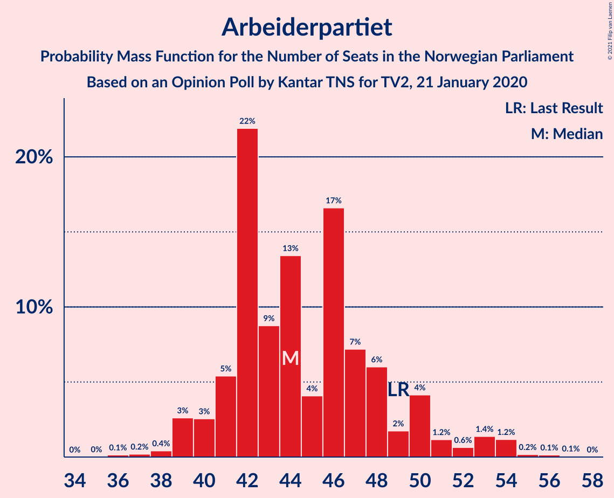
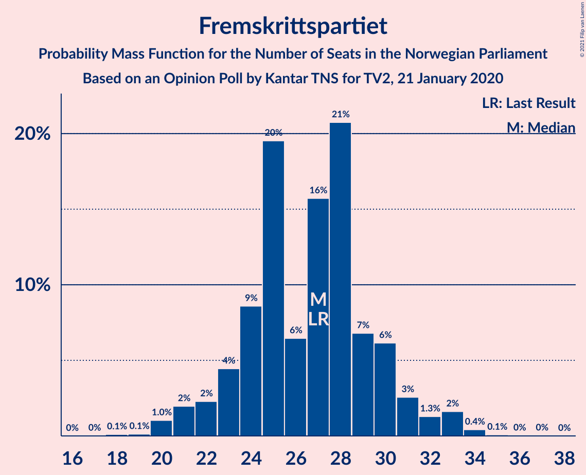
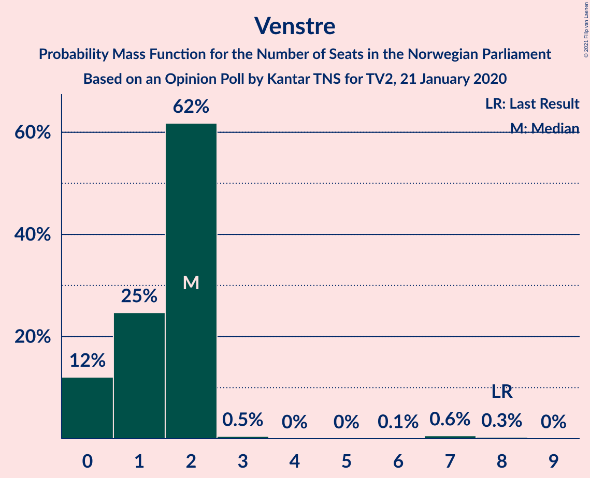
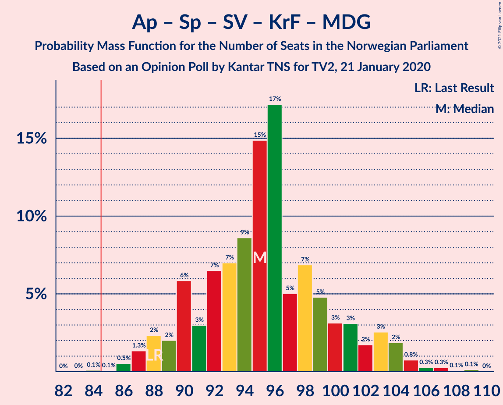
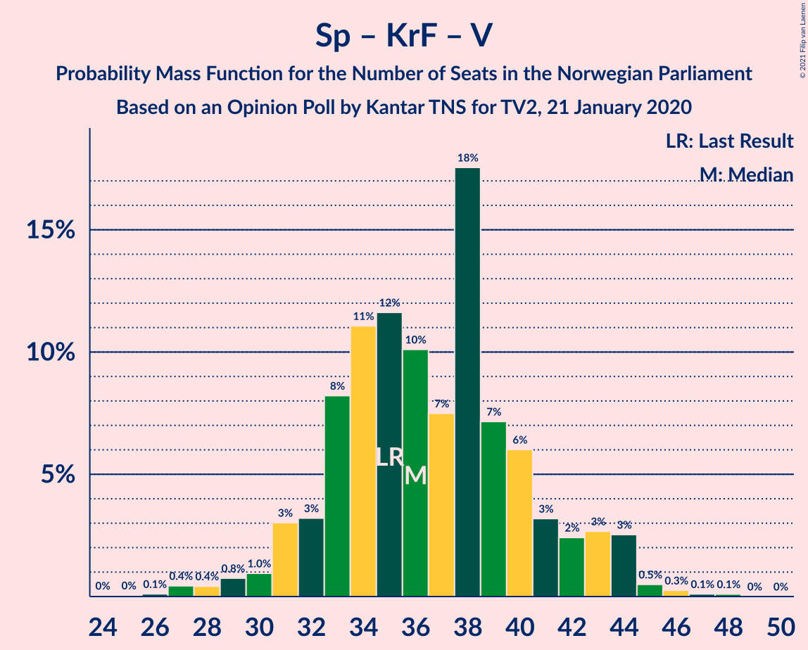

# Opinion Poll by Kantar TNS for TV2, 21 January 2020

<a href="#voting-intentions">Voting Intentions</a> | <a href="#seats">Seats</a> | <a href="#coalitions">Coalitions</a> | <a href="#technical-information">Technical Information</a>

## Voting Intentions

### Confidence Intervals

| Party | Last Result | Poll Result | 80% Confidence Interval | 90% Confidence Interval | 95% Confidence Interval | 99% Confidence Interval |
|:-----:|:-----------:|:-----------:|:-----------------------:|:-----------------------:|:-----------------------:|:-----------------------:|
| Arbeiderpartiet | 27.4% | 25.3% | 23.2–27.6% |22.6–28.3% |22.1–28.8% |21.1–29.9% |
| Høyre | 25.0% | 20.5% | 18.5–22.6% |18.0–23.2% |17.5–23.8% |16.6–24.8% |
| Fremskrittspartiet | 15.2% | 14.7% | 13.0–16.6% |12.5–17.2% |12.1–17.6% |11.4–18.6% |
| Senterpartiet | 10.3% | 14.5% | 12.9–16.5% |12.4–17.0% |12.0–17.5% |11.2–18.4% |
| Sosialistisk Venstreparti | 6.0% | 6.6% | 5.5–8.0% |5.2–8.4% |4.9–8.8% |4.4–9.5% |
| Rødt | 2.4% | 5.2% | 4.2–6.5% |3.9–6.8% |3.7–7.2% |3.3–7.8% |
| Kristelig Folkeparti | 4.2% | 5.2% | 4.2–6.5% |3.9–6.8% |3.7–7.2% |3.3–7.8% |
| Miljøpartiet De Grønne | 3.2% | 3.4% | 2.7–4.6% |2.5–4.9% |2.3–5.2% |2.0–5.7% |
| Venstre | 4.4% | 2.2% | 1.6–3.1% |1.4–3.4% |1.3–3.6% |1.1–4.1% |

*Note:* The poll result column reflects the actual value used in the calculations. Published results may vary slightly, and in addition be rounded to fewer digits.

## Seats

### Confidence Intervals

| Party | Last Result | Median | 80% Confidence Interval | 90% Confidence Interval | 95% Confidence Interval | 99% Confidence Interval |
|:-----:|:-----------:|:------:|:-----------------------:|:-----------------------:|:-----------------------:|:-----------------------:|
| <a href="#arbeiderpartiet">Arbeiderpartiet</a> | 49 | 44 | 41–49 |40–50 |39–53 |38–54 |
| <a href="#høyre">Høyre</a> | 45 | 36 | 34–41 |32–42 |31–44 |29–44 |
| <a href="#fremskrittspartiet">Fremskrittspartiet</a> | 27 | 27 | 24–30 |22–31 |21–32 |20–34 |
| <a href="#senterpartiet">Senterpartiet</a> | 19 | 25 | 22–30 |21–31 |21–32 |20–34 |
| <a href="#sosialistisk-venstreparti">Sosialistisk Venstreparti</a> | 11 | 11 | 10–15 |9–15 |8–15 |7–17 |
| <a href="#rødt">Rødt</a> | 1 | 9 | 7–11 |2–12 |2–13 |2–14 |
| <a href="#kristelig-folkeparti">Kristelig Folkeparti</a> | 8 | 9 | 7–11 |3–12 |3–13 |2–14 |
| <a href="#miljøpartiet-de-grønne">Miljøpartiet De Grønne</a> | 1 | 2 | 1–8 |1–8 |1–9 |1–10 |
| <a href="#venstre">Venstre</a> | 8 | 2 | 0–2 |0–2 |0–2 |0–7 |

### Arbeiderpartiet

*For a full overview of the results for this party, see the [Arbeiderpartiet](party-arbeiderpartiet.html) page.*

| Number of Seats | Probability | Accumulated | Special Marks |
|:---------------:|:-----------:|:-----------:|:-------------:|
| 36 | 0.1% | 100% |  |
| 37 | 0.2% | 99.8% |  |
| 38 | 0.4% | 99.6% |  |
| 39 | 3% | 99.2% |  |
| 40 | 3% | 97% |  |
| 41 | 5% | 94% |  |
| 42 | 22% | 89% |  |
| 43 | 9% | 67% |  |
| 44 | 13% | 58% | Median |
| 45 | 4% | 45% |  |
| 46 | 17% | 40% |  |
| 47 | 7% | 24% |  |
| 48 | 6% | 17% |  |
| 49 | 2% | 11% | Last Result |
| 50 | 4% | 9% |  |
| 51 | 1.2% | 5% |  |
| 52 | 0.6% | 4% |  |
| 53 | 1.4% | 3% |  |
| 54 | 1.2% | 2% |  |
| 55 | 0.2% | 0.4% |  |
| 56 | 0.1% | 0.2% |  |
| 57 | 0.1% | 0.1% |  |
| 58 | 0% | 0% |  |

### Høyre

*For a full overview of the results for this party, see the [Høyre](party-høyre.html) page.*

| Number of Seats | Probability | Accumulated | Special Marks |
|:---------------:|:-----------:|:-----------:|:-------------:|
| 27 | 0.1% | 100% |  |
| 28 | 0.3% | 99.9% |  |
| 29 | 0.8% | 99.6% |  |
| 30 | 1.3% | 98.9% |  |
| 31 | 2% | 98% |  |
| 32 | 2% | 95% |  |
| 33 | 3% | 93% |  |
| 34 | 10% | 90% |  |
| 35 | 26% | 80% |  |
| 36 | 5% | 54% | Median |
| 37 | 16% | 49% |  |
| 38 | 8% | 32% |  |
| 39 | 11% | 24% |  |
| 40 | 2% | 13% |  |
| 41 | 3% | 11% |  |
| 42 | 5% | 8% |  |
| 43 | 0.9% | 4% |  |
| 44 | 2% | 3% |  |
| 45 | 0.2% | 0.5% | Last Result |
| 46 | 0.2% | 0.3% |  |
| 47 | 0.1% | 0.2% |  |
| 48 | 0% | 0% |  |

### Fremskrittspartiet

*For a full overview of the results for this party, see the [Fremskrittspartiet](party-fremskrittspartiet.html) page.*

| Number of Seats | Probability | Accumulated | Special Marks |
|:---------------:|:-----------:|:-----------:|:-------------:|
| 18 | 0.1% | 100% |  |
| 19 | 0.1% | 99.9% |  |
| 20 | 1.0% | 99.8% |  |
| 21 | 2% | 98.7% |  |
| 22 | 2% | 97% |  |
| 23 | 4% | 94% |  |
| 24 | 9% | 90% |  |
| 25 | 20% | 81% |  |
| 26 | 6% | 62% |  |
| 27 | 16% | 55% | Last Result, Median |
| 28 | 21% | 40% |  |
| 29 | 7% | 19% |  |
| 30 | 6% | 12% |  |
| 31 | 3% | 6% |  |
| 32 | 1.3% | 3% |  |
| 33 | 2% | 2% |  |
| 34 | 0.4% | 0.6% |  |
| 35 | 0.1% | 0.1% |  |
| 36 | 0% | 0.1% |  |
| 37 | 0% | 0% |  |

### Senterpartiet

*For a full overview of the results for this party, see the [Senterpartiet](party-senterpartiet.html) page.*

| Number of Seats | Probability | Accumulated | Special Marks |
|:---------------:|:-----------:|:-----------:|:-------------:|
| 18 | 0.1% | 100% |  |
| 19 | 0.2% | 99.9% | Last Result |
| 20 | 0.7% | 99.7% |  |
| 21 | 4% | 99.0% |  |
| 22 | 5% | 95% |  |
| 23 | 8% | 90% |  |
| 24 | 13% | 81% |  |
| 25 | 26% | 68% | Median |
| 26 | 9% | 42% |  |
| 27 | 9% | 34% |  |
| 28 | 7% | 24% |  |
| 29 | 7% | 18% |  |
| 30 | 4% | 11% |  |
| 31 | 3% | 7% |  |
| 32 | 2% | 4% |  |
| 33 | 2% | 2% |  |
| 34 | 0.5% | 0.6% |  |
| 35 | 0% | 0.1% |  |
| 36 | 0.1% | 0.1% |  |
| 37 | 0% | 0% |  |

### Sosialistisk Venstreparti

*For a full overview of the results for this party, see the [Sosialistisk Venstreparti](party-sosialistiskvenstreparti.html) page.*

| Number of Seats | Probability | Accumulated | Special Marks |
|:---------------:|:-----------:|:-----------:|:-------------:|
| 1 | 0.1% | 100% |  |
| 2 | 0.1% | 99.9% |  |
| 3 | 0% | 99.8% |  |
| 4 | 0% | 99.8% |  |
| 5 | 0% | 99.8% |  |
| 6 | 0% | 99.8% |  |
| 7 | 0.3% | 99.8% |  |
| 8 | 3% | 99.5% |  |
| 9 | 6% | 97% |  |
| 10 | 17% | 90% |  |
| 11 | 34% | 74% | Last Result, Median |
| 12 | 12% | 40% |  |
| 13 | 13% | 28% |  |
| 14 | 4% | 14% |  |
| 15 | 8% | 10% |  |
| 16 | 1.4% | 2% |  |
| 17 | 0.4% | 0.5% |  |
| 18 | 0.1% | 0.1% |  |
| 19 | 0% | 0% |  |

### Rødt

*For a full overview of the results for this party, see the [Rødt](party-rødt.html) page.*

| Number of Seats | Probability | Accumulated | Special Marks |
|:---------------:|:-----------:|:-----------:|:-------------:|
| 1 | 0.1% | 100% | Last Result |
| 2 | 8% | 99.9% |  |
| 3 | 0% | 91% |  |
| 4 | 0% | 91% |  |
| 5 | 0% | 91% |  |
| 6 | 0.5% | 91% |  |
| 7 | 6% | 91% |  |
| 8 | 27% | 85% |  |
| 9 | 17% | 58% | Median |
| 10 | 21% | 42% |  |
| 11 | 14% | 21% |  |
| 12 | 4% | 7% |  |
| 13 | 3% | 3% |  |
| 14 | 0.5% | 0.7% |  |
| 15 | 0.2% | 0.2% |  |
| 16 | 0% | 0% |  |

### Kristelig Folkeparti

*For a full overview of the results for this party, see the [Kristelig Folkeparti](party-kristeligfolkeparti.html) page.*

| Number of Seats | Probability | Accumulated | Special Marks |
|:---------------:|:-----------:|:-----------:|:-------------:|
| 1 | 0.4% | 100% |  |
| 2 | 0.6% | 99.6% |  |
| 3 | 5% | 99.0% |  |
| 4 | 0% | 94% |  |
| 5 | 0% | 94% |  |
| 6 | 0.4% | 94% |  |
| 7 | 5% | 94% |  |
| 8 | 23% | 88% | Last Result |
| 9 | 20% | 66% | Median |
| 10 | 9% | 46% |  |
| 11 | 27% | 37% |  |
| 12 | 5% | 10% |  |
| 13 | 2% | 4% |  |
| 14 | 2% | 2% |  |
| 15 | 0.2% | 0.2% |  |
| 16 | 0% | 0% |  |

### Miljøpartiet De Grønne

*For a full overview of the results for this party, see the [Miljøpartiet De Grønne](party-miljøpartietdegrønne.html) page.*

| Number of Seats | Probability | Accumulated | Special Marks |
|:---------------:|:-----------:|:-----------:|:-------------:|
| 0 | 0.4% | 100% |  |
| 1 | 21% | 99.6% | Last Result |
| 2 | 31% | 79% | Median |
| 3 | 4% | 48% |  |
| 4 | 0.7% | 44% |  |
| 5 | 0% | 43% |  |
| 6 | 0.5% | 43% |  |
| 7 | 27% | 43% |  |
| 8 | 13% | 16% |  |
| 9 | 2% | 3% |  |
| 10 | 0.3% | 0.6% |  |
| 11 | 0.1% | 0.2% |  |
| 12 | 0.1% | 0.1% |  |
| 13 | 0% | 0% |  |

### Venstre

*For a full overview of the results for this party, see the [Venstre](party-venstre.html) page.*

| Number of Seats | Probability | Accumulated | Special Marks |
|:---------------:|:-----------:|:-----------:|:-------------:|
| 0 | 12% | 100% |  |
| 1 | 25% | 88% |  |
| 2 | 62% | 63% | Median |
| 3 | 0.5% | 1.5% |  |
| 4 | 0% | 1.0% |  |
| 5 | 0% | 1.0% |  |
| 6 | 0.1% | 1.0% |  |
| 7 | 0.6% | 0.9% |  |
| 8 | 0.3% | 0.3% | Last Result |
| 9 | 0% | 0% |  |

## Coalitions

### Confidence Intervals

| Coalition | Last Result | Median | Majority? | 80% Confidence Interval | 90% Confidence Interval | 95% Confidence Interval | 99% Confidence Interval |
|:---------:|:-----------:|:------:|:---------:|:-----------------------:|:-----------------------:|:-----------------------:|:-----------------------:|
| Høyre – Fremskrittspartiet – Senterpartiet – Kristelig Folkeparti – Venstre | 107 | 101 | 99.9% | 94–105 | 92–106 | 90–108 | 87–109 |
| Arbeiderpartiet – Senterpartiet – Sosialistisk Venstreparti – Kristelig Folkeparti – Miljøpartiet De Grønne | 88 | 95 | 99.8% | 90–101 | 89–103 | 88–104 | 86–106 |
| Arbeiderpartiet – Senterpartiet – Sosialistisk Venstreparti – Rødt – Miljøpartiet De Grønne | 81 | 94 | 99.8% | 90–100 | 88–103 | 87–104 | 85–108 |
| Arbeiderpartiet – Senterpartiet – Sosialistisk Venstreparti – Rødt | 80 | 90 | 95% | 86–97 | 85–99 | 84–100 | 82–102 |
| Arbeiderpartiet – Senterpartiet – Sosialistisk Venstreparti – Miljøpartiet De Grønne | 80 | 86 | 71% | 81–92 | 79–94 | 78–96 | 77–98 |
| Arbeiderpartiet – Senterpartiet – Kristelig Folkeparti – Miljøpartiet De Grønne | 77 | 84 | 44% | 79–89 | 77–91 | 77–92 | 74–95 |
| Arbeiderpartiet – Senterpartiet – Sosialistisk Venstreparti | 79 | 81 | 30% | 78–88 | 76–90 | 75–92 | 74–94 |
| Arbeiderpartiet – Senterpartiet – Kristelig Folkeparti | 76 | 79 | 13% | 76–85 | 74–87 | 73–88 | 69–90 |
| Høyre – Fremskrittspartiet – Kristelig Folkeparti – Miljøpartiet De Grønne – Venstre | 89 | 79 | 4% | 72–83 | 70–84 | 68–85 | 66–87 |
| Høyre – Fremskrittspartiet – Kristelig Folkeparti – Venstre | 88 | 75 | 0.1% | 69–79 | 66–81 | 65–82 | 61–84 |
| Arbeiderpartiet – Senterpartiet | 68 | 70 | 0% | 66–75 | 66–78 | 64–80 | 63–81 |
| Høyre – Fremskrittspartiet – Venstre | 80 | 65 | 0% | 60–70 | 58–71 | 56–72 | 54–74 |
| Høyre – Fremskrittspartiet | 72 | 63 | 0% | 58–68 | 56–70 | 54–71 | 53–72 |
| Arbeiderpartiet – Sosialistisk Venstreparti | 60 | 55 | 0% | 53–62 | 51–63 | 50–65 | 49–67 |
| Høyre – Kristelig Folkeparti – Venstre | 61 | 48 | 0% | 43–52 | 41–53 | 39–57 | 37–57 |
| Senterpartiet – Kristelig Folkeparti – Venstre | 35 | 36 | 0% | 33–41 | 31–43 | 30–44 | 27–45 |

### Høyre – Fremskrittspartiet – Senterpartiet – Kristelig Folkeparti – Venstre

| Number of Seats | Probability | Accumulated | Special Marks |
|:---------------:|:-----------:|:-----------:|:-------------:|
| 84 | 0.1% | 100% |  |
| 85 | 0.1% | 99.9% | Majority |
| 86 | 0.3% | 99.8% |  |
| 87 | 0.2% | 99.5% |  |
| 88 | 0.9% | 99.3% |  |
| 89 | 0.5% | 98% |  |
| 90 | 1.1% | 98% |  |
| 91 | 1.0% | 97% |  |
| 92 | 2% | 96% |  |
| 93 | 4% | 94% |  |
| 94 | 0.8% | 90% |  |
| 95 | 8% | 90% |  |
| 96 | 9% | 82% |  |
| 97 | 3% | 73% |  |
| 98 | 6% | 70% |  |
| 99 | 5% | 65% | Median |
| 100 | 7% | 60% |  |
| 101 | 20% | 53% |  |
| 102 | 7% | 34% |  |
| 103 | 4% | 27% |  |
| 104 | 8% | 22% |  |
| 105 | 8% | 14% |  |
| 106 | 2% | 6% |  |
| 107 | 2% | 5% | Last Result |
| 108 | 2% | 3% |  |
| 109 | 0.7% | 0.9% |  |
| 110 | 0% | 0.2% |  |
| 111 | 0.1% | 0.1% |  |
| 112 | 0% | 0% |  |

### Arbeiderpartiet – Senterpartiet – Sosialistisk Venstreparti – Kristelig Folkeparti – Miljøpartiet De Grønne

| Number of Seats | Probability | Accumulated | Special Marks |
|:---------------:|:-----------:|:-----------:|:-------------:|
| 83 | 0% | 100% |  |
| 84 | 0.1% | 99.9% |  |
| 85 | 0.1% | 99.8% | Majority |
| 86 | 0.5% | 99.8% |  |
| 87 | 1.3% | 99.2% |  |
| 88 | 2% | 98% | Last Result |
| 89 | 2% | 96% |  |
| 90 | 6% | 94% |  |
| 91 | 3% | 88% | Median |
| 92 | 7% | 85% |  |
| 93 | 7% | 78% |  |
| 94 | 9% | 71% |  |
| 95 | 15% | 63% |  |
| 96 | 17% | 48% |  |
| 97 | 5% | 31% |  |
| 98 | 7% | 26% |  |
| 99 | 5% | 19% |  |
| 100 | 3% | 14% |  |
| 101 | 3% | 11% |  |
| 102 | 2% | 8% |  |
| 103 | 3% | 6% |  |
| 104 | 2% | 3% |  |
| 105 | 0.8% | 2% |  |
| 106 | 0.3% | 0.8% |  |
| 107 | 0.3% | 0.5% |  |
| 108 | 0.1% | 0.2% |  |
| 109 | 0.1% | 0.2% |  |
| 110 | 0% | 0% |  |

### Arbeiderpartiet – Senterpartiet – Sosialistisk Venstreparti – Rødt – Miljøpartiet De Grønne

| Number of Seats | Probability | Accumulated | Special Marks |
|:---------------:|:-----------:|:-----------:|:-------------:|
| 81 | 0% | 100% | Last Result |
| 82 | 0% | 100% |  |
| 83 | 0% | 99.9% |  |
| 84 | 0.1% | 99.9% |  |
| 85 | 0.4% | 99.8% | Majority |
| 86 | 2% | 99.4% |  |
| 87 | 1.1% | 98% |  |
| 88 | 5% | 97% |  |
| 89 | 1.2% | 91% |  |
| 90 | 5% | 90% |  |
| 91 | 5% | 86% | Median |
| 92 | 8% | 81% |  |
| 93 | 16% | 73% |  |
| 94 | 9% | 57% |  |
| 95 | 4% | 49% |  |
| 96 | 10% | 45% |  |
| 97 | 6% | 35% |  |
| 98 | 13% | 28% |  |
| 99 | 4% | 15% |  |
| 100 | 3% | 11% |  |
| 101 | 2% | 8% |  |
| 102 | 2% | 7% |  |
| 103 | 1.3% | 5% |  |
| 104 | 2% | 4% |  |
| 105 | 0.4% | 2% |  |
| 106 | 0.7% | 2% |  |
| 107 | 0.4% | 0.9% |  |
| 108 | 0.5% | 0.6% |  |
| 109 | 0% | 0.1% |  |
| 110 | 0% | 0.1% |  |
| 111 | 0% | 0% |  |

### Arbeiderpartiet – Senterpartiet – Sosialistisk Venstreparti – Rødt

| Number of Seats | Probability | Accumulated | Special Marks |
|:---------------:|:-----------:|:-----------:|:-------------:|
| 79 | 0% | 100% |  |
| 80 | 0.2% | 99.9% | Last Result |
| 81 | 0.2% | 99.8% |  |
| 82 | 0.7% | 99.6% |  |
| 83 | 1.1% | 98.8% |  |
| 84 | 3% | 98% |  |
| 85 | 3% | 95% | Majority |
| 86 | 21% | 93% |  |
| 87 | 3% | 72% |  |
| 88 | 10% | 69% |  |
| 89 | 6% | 59% | Median |
| 90 | 6% | 53% |  |
| 91 | 10% | 48% |  |
| 92 | 3% | 38% |  |
| 93 | 7% | 35% |  |
| 94 | 2% | 28% |  |
| 95 | 5% | 26% |  |
| 96 | 9% | 21% |  |
| 97 | 3% | 12% |  |
| 98 | 3% | 9% |  |
| 99 | 2% | 6% |  |
| 100 | 1.3% | 4% |  |
| 101 | 1.2% | 2% |  |
| 102 | 0.7% | 1.2% |  |
| 103 | 0.3% | 0.5% |  |
| 104 | 0% | 0.2% |  |
| 105 | 0.1% | 0.1% |  |
| 106 | 0% | 0.1% |  |
| 107 | 0% | 0% |  |

### Arbeiderpartiet – Senterpartiet – Sosialistisk Venstreparti – Miljøpartiet De Grønne

| Number of Seats | Probability | Accumulated | Special Marks |
|:---------------:|:-----------:|:-----------:|:-------------:|
| 74 | 0% | 100% |  |
| 75 | 0.1% | 99.9% |  |
| 76 | 0.1% | 99.8% |  |
| 77 | 2% | 99.7% |  |
| 78 | 1.2% | 98% |  |
| 79 | 3% | 97% |  |
| 80 | 1.3% | 94% | Last Result |
| 81 | 4% | 93% |  |
| 82 | 9% | 88% | Median |
| 83 | 2% | 80% |  |
| 84 | 7% | 78% |  |
| 85 | 21% | 71% | Majority |
| 86 | 10% | 50% |  |
| 87 | 10% | 40% |  |
| 88 | 4% | 30% |  |
| 89 | 7% | 26% |  |
| 90 | 6% | 19% |  |
| 91 | 3% | 13% |  |
| 92 | 3% | 10% |  |
| 93 | 1.2% | 7% |  |
| 94 | 3% | 6% |  |
| 95 | 1.0% | 4% |  |
| 96 | 2% | 3% |  |
| 97 | 0.2% | 1.2% |  |
| 98 | 0.7% | 1.0% |  |
| 99 | 0.1% | 0.3% |  |
| 100 | 0.1% | 0.1% |  |
| 101 | 0% | 0.1% |  |
| 102 | 0% | 0% |  |

### Arbeiderpartiet – Senterpartiet – Kristelig Folkeparti – Miljøpartiet De Grønne

| Number of Seats | Probability | Accumulated | Special Marks |
|:---------------:|:-----------:|:-----------:|:-------------:|
| 71 | 0% | 100% |  |
| 72 | 0.1% | 99.9% |  |
| 73 | 0.3% | 99.9% |  |
| 74 | 0.2% | 99.6% |  |
| 75 | 0.5% | 99.4% |  |
| 76 | 1.3% | 98.8% |  |
| 77 | 4% | 98% | Last Result |
| 78 | 1.2% | 94% |  |
| 79 | 5% | 93% |  |
| 80 | 9% | 88% | Median |
| 81 | 9% | 80% |  |
| 82 | 8% | 71% |  |
| 83 | 6% | 63% |  |
| 84 | 14% | 58% |  |
| 85 | 17% | 44% | Majority |
| 86 | 5% | 27% |  |
| 87 | 4% | 21% |  |
| 88 | 6% | 17% |  |
| 89 | 4% | 11% |  |
| 90 | 2% | 7% |  |
| 91 | 2% | 5% |  |
| 92 | 0.9% | 3% |  |
| 93 | 1.0% | 2% |  |
| 94 | 0.4% | 1.3% |  |
| 95 | 0.6% | 0.9% |  |
| 96 | 0.2% | 0.4% |  |
| 97 | 0.1% | 0.2% |  |
| 98 | 0% | 0.1% |  |
| 99 | 0% | 0% |  |

### Arbeiderpartiet – Senterpartiet – Sosialistisk Venstreparti

| Number of Seats | Probability | Accumulated | Special Marks |
|:---------------:|:-----------:|:-----------:|:-------------:|
| 71 | 0% | 100% |  |
| 72 | 0.1% | 99.9% |  |
| 73 | 0.2% | 99.8% |  |
| 74 | 0.9% | 99.7% |  |
| 75 | 3% | 98.8% |  |
| 76 | 1.4% | 96% |  |
| 77 | 4% | 95% |  |
| 78 | 24% | 91% |  |
| 79 | 7% | 67% | Last Result |
| 80 | 5% | 60% | Median |
| 81 | 6% | 55% |  |
| 82 | 5% | 49% |  |
| 83 | 11% | 45% |  |
| 84 | 3% | 33% |  |
| 85 | 9% | 30% | Majority |
| 86 | 7% | 21% |  |
| 87 | 2% | 14% |  |
| 88 | 4% | 12% |  |
| 89 | 2% | 8% |  |
| 90 | 1.1% | 6% |  |
| 91 | 2% | 4% |  |
| 92 | 0.3% | 3% |  |
| 93 | 0.8% | 2% |  |
| 94 | 1.3% | 1.4% |  |
| 95 | 0.1% | 0.2% |  |
| 96 | 0.1% | 0.1% |  |
| 97 | 0% | 0% |  |

### Arbeiderpartiet – Senterpartiet – Kristelig Folkeparti

| Number of Seats | Probability | Accumulated | Special Marks |
|:---------------:|:-----------:|:-----------:|:-------------:|
| 67 | 0.1% | 100% |  |
| 68 | 0.3% | 99.9% |  |
| 69 | 0.2% | 99.7% |  |
| 70 | 0.3% | 99.5% |  |
| 71 | 0.4% | 99.2% |  |
| 72 | 0.3% | 98.7% |  |
| 73 | 1.5% | 98% |  |
| 74 | 3% | 97% |  |
| 75 | 4% | 94% |  |
| 76 | 12% | 90% | Last Result |
| 77 | 4% | 78% |  |
| 78 | 23% | 74% | Median |
| 79 | 9% | 51% |  |
| 80 | 7% | 42% |  |
| 81 | 6% | 35% |  |
| 82 | 3% | 29% |  |
| 83 | 7% | 25% |  |
| 84 | 5% | 18% |  |
| 85 | 4% | 13% | Majority |
| 86 | 2% | 9% |  |
| 87 | 3% | 6% |  |
| 88 | 2% | 4% |  |
| 89 | 1.2% | 2% |  |
| 90 | 0.4% | 0.8% |  |
| 91 | 0.1% | 0.4% |  |
| 92 | 0.2% | 0.3% |  |
| 93 | 0% | 0.1% |  |
| 94 | 0% | 0% |  |

### Høyre – Fremskrittspartiet – Kristelig Folkeparti – Miljøpartiet De Grønne – Venstre

| Number of Seats | Probability | Accumulated | Special Marks |
|:---------------:|:-----------:|:-----------:|:-------------:|
| 63 | 0% | 100% |  |
| 64 | 0.1% | 99.9% |  |
| 65 | 0% | 99.8% |  |
| 66 | 0.4% | 99.8% |  |
| 67 | 0.7% | 99.4% |  |
| 68 | 1.3% | 98.8% |  |
| 69 | 2% | 97% |  |
| 70 | 2% | 96% |  |
| 71 | 3% | 94% |  |
| 72 | 3% | 91% |  |
| 73 | 9% | 88% |  |
| 74 | 5% | 78% |  |
| 75 | 2% | 73% |  |
| 76 | 7% | 71% | Median |
| 77 | 3% | 65% |  |
| 78 | 10% | 62% |  |
| 79 | 6% | 51% |  |
| 80 | 6% | 46% |  |
| 81 | 10% | 39% |  |
| 82 | 3% | 30% |  |
| 83 | 21% | 27% |  |
| 84 | 2% | 6% |  |
| 85 | 2% | 4% | Majority |
| 86 | 1.0% | 2% |  |
| 87 | 0.7% | 1.1% |  |
| 88 | 0.2% | 0.3% |  |
| 89 | 0.1% | 0.2% | Last Result |
| 90 | 0% | 0% |  |

### Høyre – Fremskrittspartiet – Kristelig Folkeparti – Venstre

| Number of Seats | Probability | Accumulated | Special Marks |
|:---------------:|:-----------:|:-----------:|:-------------:|
| 59 | 0% | 100% |  |
| 60 | 0.1% | 99.9% |  |
| 61 | 0.5% | 99.8% |  |
| 62 | 0.4% | 99.4% |  |
| 63 | 0.8% | 99.0% |  |
| 64 | 0.5% | 98% |  |
| 65 | 2% | 98% |  |
| 66 | 1.5% | 96% |  |
| 67 | 2% | 95% |  |
| 68 | 2% | 93% |  |
| 69 | 3% | 91% |  |
| 70 | 4% | 88% |  |
| 71 | 13% | 84% |  |
| 72 | 7% | 71% |  |
| 73 | 10% | 64% |  |
| 74 | 4% | 54% | Median |
| 75 | 9% | 50% |  |
| 76 | 16% | 41% |  |
| 77 | 8% | 26% |  |
| 78 | 4% | 18% |  |
| 79 | 5% | 14% |  |
| 80 | 1.2% | 9% |  |
| 81 | 5% | 8% |  |
| 82 | 0.8% | 3% |  |
| 83 | 2% | 2% |  |
| 84 | 0.4% | 0.5% |  |
| 85 | 0.1% | 0.1% | Majority |
| 86 | 0% | 0% |  |
| 87 | 0% | 0% |  |
| 88 | 0% | 0% | Last Result |

### Arbeiderpartiet – Senterpartiet

| Number of Seats | Probability | Accumulated | Special Marks |
|:---------------:|:-----------:|:-----------:|:-------------:|
| 60 | 0.1% | 100% |  |
| 61 | 0.1% | 99.9% |  |
| 62 | 0.3% | 99.8% |  |
| 63 | 0.3% | 99.5% |  |
| 64 | 3% | 99.3% |  |
| 65 | 1.3% | 97% |  |
| 66 | 7% | 95% |  |
| 67 | 22% | 89% |  |
| 68 | 10% | 67% | Last Result |
| 69 | 3% | 56% | Median |
| 70 | 10% | 53% |  |
| 71 | 6% | 43% |  |
| 72 | 6% | 37% |  |
| 73 | 12% | 31% |  |
| 74 | 4% | 20% |  |
| 75 | 6% | 16% |  |
| 76 | 2% | 10% |  |
| 77 | 0.9% | 8% |  |
| 78 | 2% | 7% |  |
| 79 | 2% | 4% |  |
| 80 | 0.4% | 3% |  |
| 81 | 2% | 2% |  |
| 82 | 0.1% | 0.3% |  |
| 83 | 0.1% | 0.1% |  |
| 84 | 0% | 0% |  |

### Høyre – Fremskrittspartiet – Venstre

| Number of Seats | Probability | Accumulated | Special Marks |
|:---------------:|:-----------:|:-----------:|:-------------:|
| 52 | 0.1% | 100% |  |
| 53 | 0.2% | 99.8% |  |
| 54 | 0.7% | 99.7% |  |
| 55 | 1.2% | 99.0% |  |
| 56 | 2% | 98% |  |
| 57 | 1.0% | 96% |  |
| 58 | 1.1% | 95% |  |
| 59 | 4% | 94% |  |
| 60 | 3% | 90% |  |
| 61 | 2% | 87% |  |
| 62 | 6% | 85% |  |
| 63 | 13% | 79% |  |
| 64 | 12% | 66% |  |
| 65 | 18% | 54% | Median |
| 66 | 7% | 36% |  |
| 67 | 7% | 29% |  |
| 68 | 5% | 22% |  |
| 69 | 2% | 17% |  |
| 70 | 9% | 15% |  |
| 71 | 3% | 6% |  |
| 72 | 2% | 3% |  |
| 73 | 0.5% | 1.1% |  |
| 74 | 0.4% | 0.6% |  |
| 75 | 0.2% | 0.3% |  |
| 76 | 0% | 0.1% |  |
| 77 | 0.1% | 0.1% |  |
| 78 | 0% | 0% |  |
| 79 | 0% | 0% |  |
| 80 | 0% | 0% | Last Result |

### Høyre – Fremskrittspartiet

| Number of Seats | Probability | Accumulated | Special Marks |
|:---------------:|:-----------:|:-----------:|:-------------:|
| 50 | 0.1% | 100% |  |
| 51 | 0.1% | 99.9% |  |
| 52 | 0.1% | 99.8% |  |
| 53 | 0.5% | 99.7% |  |
| 54 | 2% | 99.2% |  |
| 55 | 1.3% | 97% |  |
| 56 | 2% | 96% |  |
| 57 | 2% | 95% |  |
| 58 | 3% | 93% |  |
| 59 | 4% | 90% |  |
| 60 | 5% | 86% |  |
| 61 | 6% | 81% |  |
| 62 | 19% | 75% |  |
| 63 | 18% | 56% | Median |
| 64 | 7% | 39% |  |
| 65 | 9% | 31% |  |
| 66 | 4% | 23% |  |
| 67 | 2% | 19% |  |
| 68 | 9% | 17% |  |
| 69 | 2% | 8% |  |
| 70 | 3% | 6% |  |
| 71 | 0.5% | 3% |  |
| 72 | 2% | 2% | Last Result |
| 73 | 0.2% | 0.4% |  |
| 74 | 0.1% | 0.2% |  |
| 75 | 0.1% | 0.1% |  |
| 76 | 0% | 0% |  |

### Arbeiderpartiet – Sosialistisk Venstreparti

| Number of Seats | Probability | Accumulated | Special Marks |
|:---------------:|:-----------:|:-----------:|:-------------:|
| 46 | 0.1% | 100% |  |
| 47 | 0% | 99.9% |  |
| 48 | 0.2% | 99.8% |  |
| 49 | 0.5% | 99.7% |  |
| 50 | 3% | 99.2% |  |
| 51 | 2% | 96% |  |
| 52 | 3% | 94% |  |
| 53 | 28% | 91% |  |
| 54 | 4% | 62% |  |
| 55 | 12% | 58% | Median |
| 56 | 5% | 47% |  |
| 57 | 8% | 42% |  |
| 58 | 7% | 34% |  |
| 59 | 6% | 26% |  |
| 60 | 2% | 20% | Last Result |
| 61 | 8% | 18% |  |
| 62 | 3% | 10% |  |
| 63 | 3% | 8% |  |
| 64 | 2% | 5% |  |
| 65 | 2% | 3% |  |
| 66 | 0.5% | 1.4% |  |
| 67 | 0.5% | 0.9% |  |
| 68 | 0.3% | 0.4% |  |
| 69 | 0.1% | 0.2% |  |
| 70 | 0.1% | 0.1% |  |
| 71 | 0% | 0.1% |  |
| 72 | 0% | 0% |  |

### Høyre – Kristelig Folkeparti – Venstre

| Number of Seats | Probability | Accumulated | Special Marks |
|:---------------:|:-----------:|:-----------:|:-------------:|
| 34 | 0% | 100% |  |
| 35 | 0% | 99.9% |  |
| 36 | 0.1% | 99.9% |  |
| 37 | 0.6% | 99.8% |  |
| 38 | 0.6% | 99.2% |  |
| 39 | 1.2% | 98.5% |  |
| 40 | 1.5% | 97% |  |
| 41 | 2% | 96% |  |
| 42 | 3% | 94% |  |
| 43 | 3% | 91% |  |
| 44 | 4% | 88% |  |
| 45 | 8% | 83% |  |
| 46 | 14% | 75% |  |
| 47 | 6% | 60% | Median |
| 48 | 27% | 54% |  |
| 49 | 4% | 27% |  |
| 50 | 6% | 23% |  |
| 51 | 3% | 17% |  |
| 52 | 8% | 15% |  |
| 53 | 2% | 7% |  |
| 54 | 0.5% | 4% |  |
| 55 | 0.3% | 4% |  |
| 56 | 0.9% | 3% |  |
| 57 | 2% | 3% |  |
| 58 | 0.2% | 0.3% |  |
| 59 | 0.1% | 0.1% |  |
| 60 | 0% | 0% |  |
| 61 | 0% | 0% | Last Result |

### Senterpartiet – Kristelig Folkeparti – Venstre

| Number of Seats | Probability | Accumulated | Special Marks |
|:---------------:|:-----------:|:-----------:|:-------------:|
| 25 | 0% | 100% |  |
| 26 | 0.1% | 99.9% |  |
| 27 | 0.4% | 99.8% |  |
| 28 | 0.4% | 99.4% |  |
| 29 | 0.8% | 98.9% |  |
| 30 | 1.0% | 98% |  |
| 31 | 3% | 97% |  |
| 32 | 3% | 94% |  |
| 33 | 8% | 91% |  |
| 34 | 11% | 83% |  |
| 35 | 12% | 72% | Last Result |
| 36 | 10% | 60% | Median |
| 37 | 7% | 50% |  |
| 38 | 18% | 42% |  |
| 39 | 7% | 25% |  |
| 40 | 6% | 18% |  |
| 41 | 3% | 12% |  |
| 42 | 2% | 9% |  |
| 43 | 3% | 6% |  |
| 44 | 3% | 4% |  |
| 45 | 0.5% | 1.0% |  |
| 46 | 0.3% | 0.5% |  |
| 47 | 0.1% | 0.2% |  |
| 48 | 0.1% | 0.1% |  |
| 49 | 0% | 0% |  |

## Technical Information

### Opinion Poll

+ **Polling firm:** Kantar TNS
+ **Commissioner(s):** TV2
+ **Fieldwork period:** 21 January 2020

### Calculations

+ **Sample size:** 640
+ **Simulations done:** 262,144
+ **Error estimate:** 1.92%

