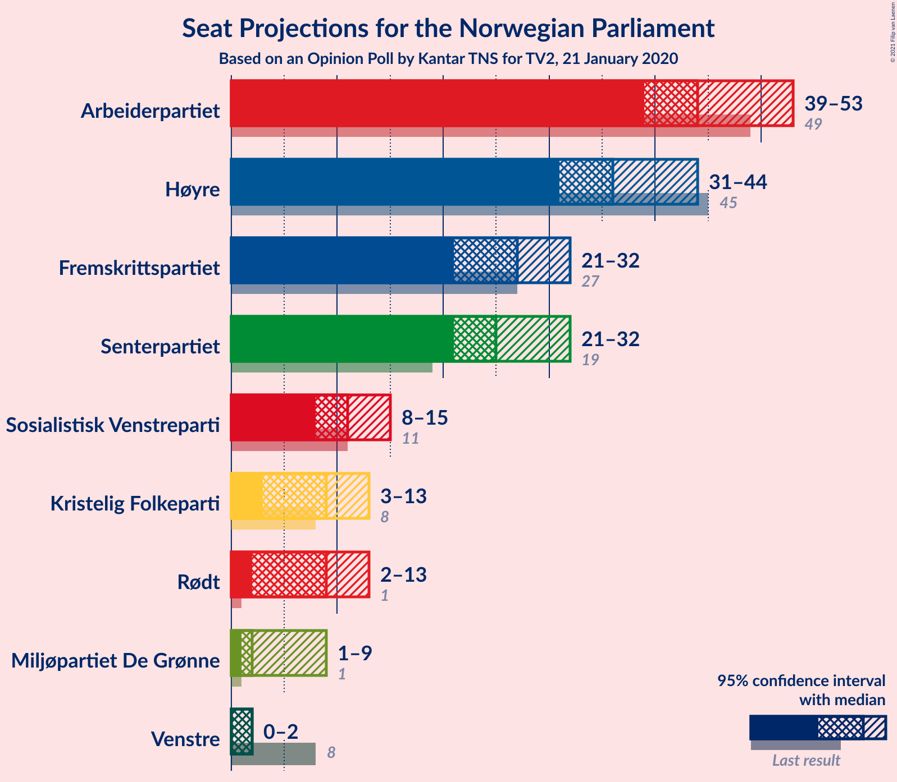
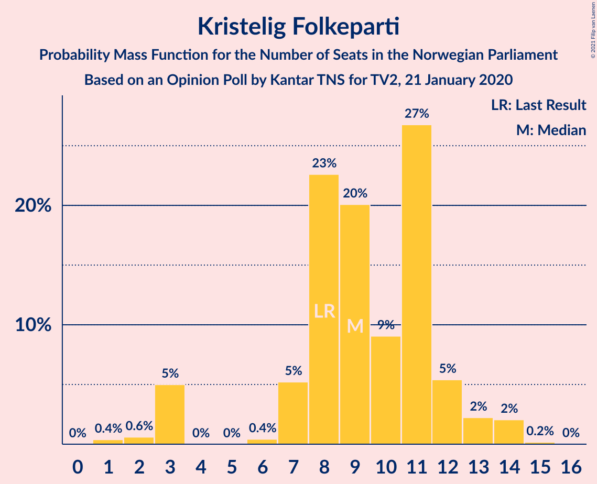
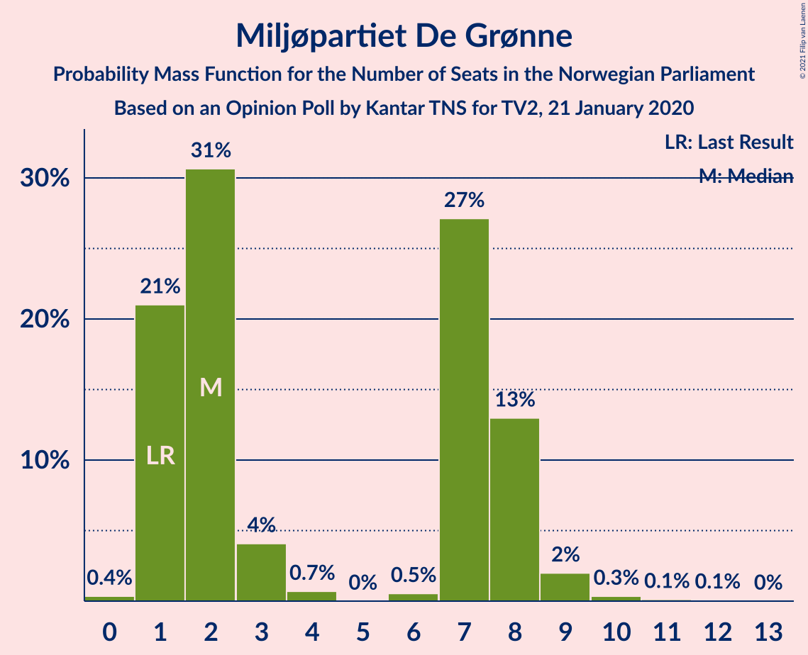
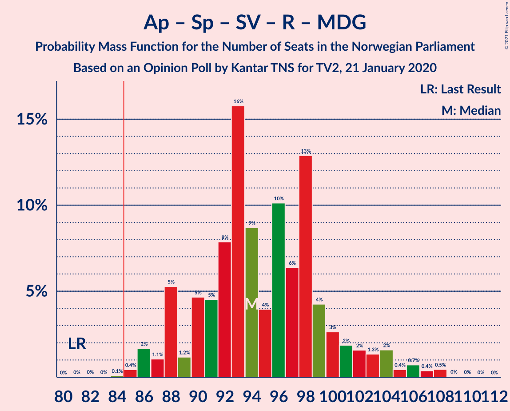
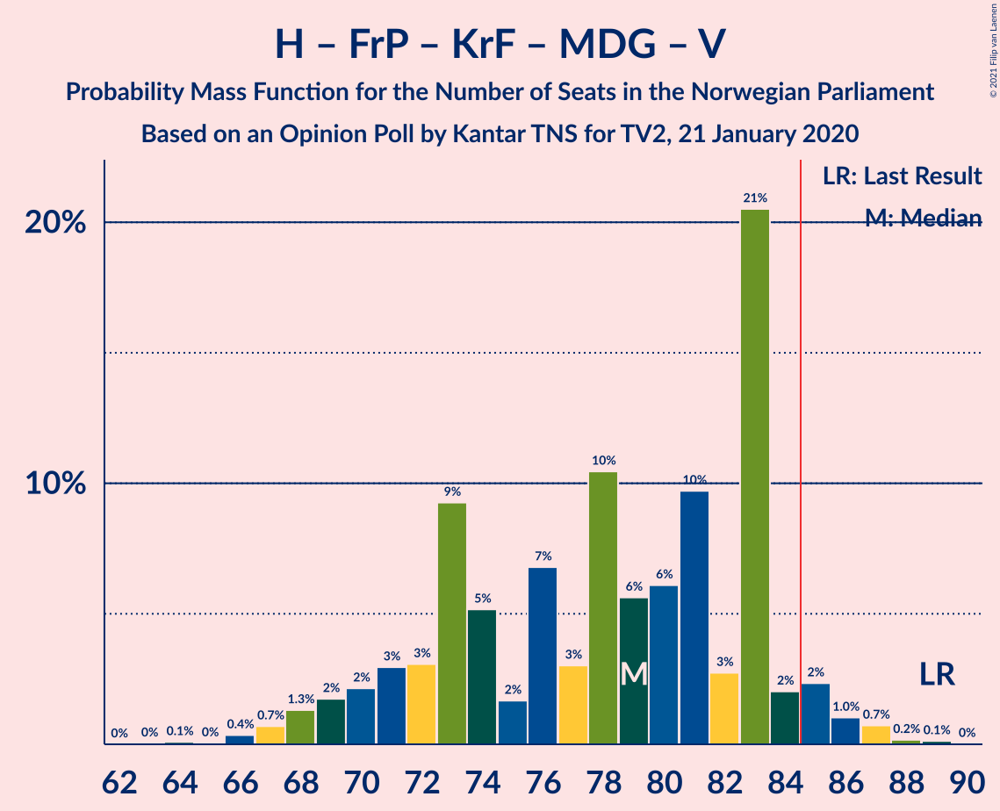
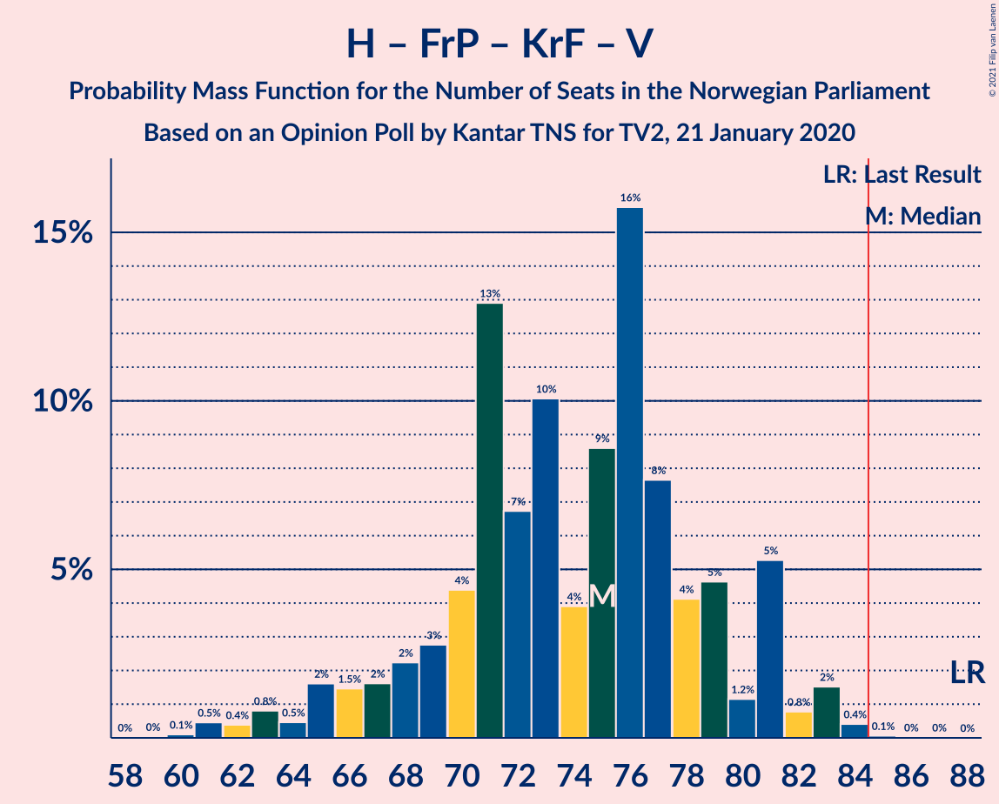
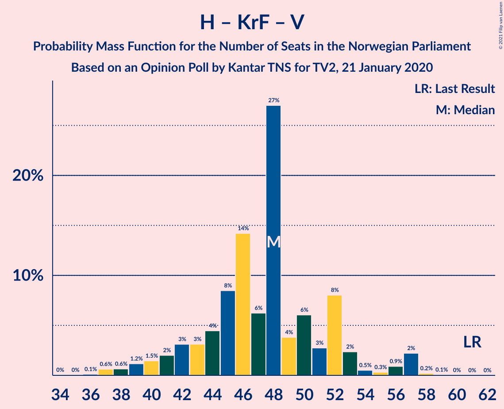

# Opinion Poll by Kantar TNS for TV2, 21 January 2020

<a href="#voting-intentions">Voting Intentions</a> | <a href="#seats">Seats</a> | <a href="#coalitions">Coalitions</a> | <a href="#technical-information">Technical Information</a>

## Voting Intentions

### Confidence Intervals

| Party | Last Result | Poll Result | 80% Confidence Interval | 90% Confidence Interval | 95% Confidence Interval | 99% Confidence Interval |
|:-----:|:-----------:|:-----------:|:-----------------------:|:-----------------------:|:-----------------------:|:-----------------------:|
| Arbeiderpartiet | 27.4% | 25.3% | 23.2–27.6% |22.6–28.3% |22.1–28.8% |21.1–29.9% |
| Høyre | 25.0% | 20.5% | 18.5–22.6% |18.0–23.2% |17.5–23.8% |16.6–24.8% |
| Fremskrittspartiet | 15.2% | 14.7% | 13.0–16.6% |12.5–17.2% |12.1–17.6% |11.4–18.6% |
| Senterpartiet | 10.3% | 14.5% | 12.9–16.5% |12.4–17.0% |12.0–17.5% |11.2–18.4% |
| Sosialistisk Venstreparti | 6.0% | 6.6% | 5.5–8.0% |5.2–8.4% |4.9–8.8% |4.4–9.5% |
| Rødt | 2.4% | 5.2% | 4.2–6.5% |3.9–6.8% |3.7–7.2% |3.3–7.8% |
| Kristelig Folkeparti | 4.2% | 5.2% | 4.2–6.5% |3.9–6.8% |3.7–7.2% |3.3–7.8% |
| Miljøpartiet De Grønne | 3.2% | 3.4% | 2.7–4.6% |2.5–4.9% |2.3–5.2% |2.0–5.7% |
| Venstre | 4.4% | 2.2% | 1.6–3.1% |1.4–3.4% |1.3–3.6% |1.1–4.1% |

*Note:* The poll result column reflects the actual value used in the calculations. Published results may vary slightly, and in addition be rounded to fewer digits.

## Seats

### Confidence Intervals

| Party | Last Result | Median | 80% Confidence Interval | 90% Confidence Interval | 95% Confidence Interval | 99% Confidence Interval |
|:-----:|:-----------:|:------:|:-----------------------:|:-----------------------:|:-----------------------:|:-----------------------:|
| <a href="#arbeiderpartiet">Arbeiderpartiet</a> | 49 | 46 | 42–52 |40–54 |40–54 |38–55 |
| <a href="#høyre">Høyre</a> | 45 | 35 | 31–40 |31–41 |29–42 |28–46 |
| <a href="#fremskrittspartiet">Fremskrittspartiet</a> | 27 | 27 | 22–30 |22–31 |21–32 |18–34 |
| <a href="#senterpartiet">Senterpartiet</a> | 19 | 24 | 21–30 |21–31 |21–32 |18–34 |
| <a href="#sosialistisk-venstreparti">Sosialistisk Venstreparti</a> | 11 | 12 | 9–15 |9–15 |8–15 |8–16 |
| <a href="#rødt">Rødt</a> | 1 | 10 | 7–13 |2–14 |2–14 |2–15 |
| <a href="#kristelig-folkeparti">Kristelig Folkeparti</a> | 8 | 9 | 3–12 |3–12 |2–13 |2–15 |
| <a href="#miljøpartiet-de-grønne">Miljøpartiet De Grønne</a> | 1 | 2 | 1–7 |1–8 |1–9 |0–10 |
| <a href="#venstre">Venstre</a> | 8 | 1 | 0–2 |0–2 |0–2 |0–8 |

### Arbeiderpartiet

*For a full overview of the results for this party, see the [Arbeiderpartiet](party-arbeiderpartiet.html) page.*

| Number of Seats | Probability | Accumulated | Special Marks |
|:---------------:|:-----------:|:-----------:|:-------------:|
| 35 | 0.1% | 100% |  |
| 36 | 0.2% | 99.9% |  |
| 37 | 0.1% | 99.7% |  |
| 38 | 0.1% | 99.6% |  |
| 39 | 0.2% | 99.5% |  |
| 40 | 4% | 99.3% |  |
| 41 | 4% | 95% |  |
| 42 | 2% | 90% |  |
| 43 | 18% | 89% |  |
| 44 | 11% | 71% |  |
| 45 | 4% | 60% |  |
| 46 | 11% | 56% | Median |
| 47 | 14% | 45% |  |
| 48 | 2% | 31% |  |
| 49 | 1.1% | 29% | Last Result |
| 50 | 5% | 28% |  |
| 51 | 0.7% | 23% |  |
| 52 | 14% | 22% |  |
| 53 | 1.3% | 8% |  |
| 54 | 6% | 7% |  |
| 55 | 0.7% | 1.1% |  |
| 56 | 0.2% | 0.4% |  |
| 57 | 0.2% | 0.2% |  |
| 58 | 0% | 0% |  |

### Høyre

*For a full overview of the results for this party, see the [Høyre](party-høyre.html) page.*

| Number of Seats | Probability | Accumulated | Special Marks |
|:---------------:|:-----------:|:-----------:|:-------------:|
| 26 | 0.2% | 100% |  |
| 27 | 0.1% | 99.8% |  |
| 28 | 0.4% | 99.7% |  |
| 29 | 2% | 99.2% |  |
| 30 | 0.8% | 97% |  |
| 31 | 9% | 97% |  |
| 32 | 2% | 88% |  |
| 33 | 11% | 86% |  |
| 34 | 15% | 75% |  |
| 35 | 13% | 60% | Median |
| 36 | 2% | 46% |  |
| 37 | 22% | 44% |  |
| 38 | 2% | 23% |  |
| 39 | 11% | 21% |  |
| 40 | 5% | 10% |  |
| 41 | 2% | 6% |  |
| 42 | 3% | 4% |  |
| 43 | 0.4% | 1.3% |  |
| 44 | 0.1% | 1.0% |  |
| 45 | 0% | 0.9% | Last Result |
| 46 | 0.7% | 0.9% |  |
| 47 | 0.1% | 0.2% |  |
| 48 | 0.1% | 0.1% |  |
| 49 | 0% | 0% |  |

### Fremskrittspartiet

*For a full overview of the results for this party, see the [Fremskrittspartiet](party-fremskrittspartiet.html) page.*

| Number of Seats | Probability | Accumulated | Special Marks |
|:---------------:|:-----------:|:-----------:|:-------------:|
| 18 | 0.5% | 100% |  |
| 19 | 0.6% | 99.4% |  |
| 20 | 1.2% | 98.8% |  |
| 21 | 2% | 98% |  |
| 22 | 6% | 95% |  |
| 23 | 14% | 89% |  |
| 24 | 0.8% | 75% |  |
| 25 | 2% | 74% |  |
| 26 | 15% | 72% |  |
| 27 | 25% | 58% | Last Result, Median |
| 28 | 5% | 33% |  |
| 29 | 14% | 28% |  |
| 30 | 7% | 13% |  |
| 31 | 1.3% | 6% |  |
| 32 | 4% | 5% |  |
| 33 | 0% | 0.8% |  |
| 34 | 0.6% | 0.7% |  |
| 35 | 0.1% | 0.1% |  |
| 36 | 0% | 0.1% |  |
| 37 | 0% | 0% |  |

### Senterpartiet

*For a full overview of the results for this party, see the [Senterpartiet](party-senterpartiet.html) page.*

| Number of Seats | Probability | Accumulated | Special Marks |
|:---------------:|:-----------:|:-----------:|:-------------:|
| 18 | 0.6% | 100% |  |
| 19 | 0.2% | 99.4% | Last Result |
| 20 | 0.5% | 99.3% |  |
| 21 | 10% | 98.8% |  |
| 22 | 23% | 89% |  |
| 23 | 15% | 66% |  |
| 24 | 9% | 51% | Median |
| 25 | 2% | 42% |  |
| 26 | 8% | 40% |  |
| 27 | 3% | 32% |  |
| 28 | 7% | 30% |  |
| 29 | 9% | 22% |  |
| 30 | 6% | 14% |  |
| 31 | 5% | 8% |  |
| 32 | 2% | 3% |  |
| 33 | 0.1% | 1.0% |  |
| 34 | 0.6% | 0.8% |  |
| 35 | 0% | 0.2% |  |
| 36 | 0.1% | 0.2% |  |
| 37 | 0% | 0% |  |

### Sosialistisk Venstreparti

*For a full overview of the results for this party, see the [Sosialistisk Venstreparti](party-sosialistiskvenstreparti.html) page.*

| Number of Seats | Probability | Accumulated | Special Marks |
|:---------------:|:-----------:|:-----------:|:-------------:|
| 1 | 0.1% | 100% |  |
| 2 | 0.1% | 99.9% |  |
| 3 | 0% | 99.8% |  |
| 4 | 0% | 99.8% |  |
| 5 | 0% | 99.8% |  |
| 6 | 0% | 99.8% |  |
| 7 | 0.3% | 99.8% |  |
| 8 | 2% | 99.5% |  |
| 9 | 17% | 97% |  |
| 10 | 14% | 80% |  |
| 11 | 5% | 66% | Last Result |
| 12 | 20% | 61% | Median |
| 13 | 19% | 41% |  |
| 14 | 10% | 22% |  |
| 15 | 10% | 12% |  |
| 16 | 2% | 2% |  |
| 17 | 0.2% | 0.3% |  |
| 18 | 0.1% | 0.2% |  |
| 19 | 0% | 0.1% |  |
| 20 | 0% | 0% |  |

### Rødt

*For a full overview of the results for this party, see the [Rødt](party-rødt.html) page.*

| Number of Seats | Probability | Accumulated | Special Marks |
|:---------------:|:-----------:|:-----------:|:-------------:|
| 1 | 0% | 100% | Last Result |
| 2 | 6% | 100% |  |
| 3 | 0% | 94% |  |
| 4 | 0% | 94% |  |
| 5 | 0% | 94% |  |
| 6 | 0% | 94% |  |
| 7 | 5% | 94% |  |
| 8 | 6% | 89% |  |
| 9 | 27% | 82% |  |
| 10 | 15% | 55% | Median |
| 11 | 10% | 40% |  |
| 12 | 10% | 30% |  |
| 13 | 12% | 20% |  |
| 14 | 6% | 8% |  |
| 15 | 2% | 2% |  |
| 16 | 0.1% | 0.1% |  |
| 17 | 0% | 0% |  |

### Kristelig Folkeparti

*For a full overview of the results for this party, see the [Kristelig Folkeparti](party-kristeligfolkeparti.html) page.*

| Number of Seats | Probability | Accumulated | Special Marks |
|:---------------:|:-----------:|:-----------:|:-------------:|
| 1 | 0.4% | 100% |  |
| 2 | 4% | 99.6% |  |
| 3 | 12% | 96% |  |
| 4 | 0% | 84% |  |
| 5 | 0% | 84% |  |
| 6 | 0% | 84% |  |
| 7 | 7% | 84% |  |
| 8 | 16% | 77% | Last Result |
| 9 | 31% | 61% | Median |
| 10 | 5% | 30% |  |
| 11 | 7% | 25% |  |
| 12 | 15% | 18% |  |
| 13 | 2% | 3% |  |
| 14 | 0.1% | 1.1% |  |
| 15 | 1.0% | 1.1% |  |
| 16 | 0% | 0% |  |

### Miljøpartiet De Grønne

*For a full overview of the results for this party, see the [Miljøpartiet De Grønne](party-miljøpartietdegrønne.html) page.*

| Number of Seats | Probability | Accumulated | Special Marks |
|:---------------:|:-----------:|:-----------:|:-------------:|
| 0 | 2% | 100% |  |
| 1 | 25% | 98% | Last Result |
| 2 | 38% | 73% | Median |
| 3 | 1.0% | 34% |  |
| 4 | 0% | 33% |  |
| 5 | 0% | 33% |  |
| 6 | 0.2% | 33% |  |
| 7 | 25% | 33% |  |
| 8 | 5% | 8% |  |
| 9 | 2% | 3% |  |
| 10 | 2% | 2% |  |
| 11 | 0.1% | 0.1% |  |
| 12 | 0% | 0% |  |

### Venstre

*For a full overview of the results for this party, see the [Venstre](party-venstre.html) page.*

| Number of Seats | Probability | Accumulated | Special Marks |
|:---------------:|:-----------:|:-----------:|:-------------:|
| 0 | 14% | 100% |  |
| 1 | 36% | 86% | Median |
| 2 | 47% | 50% |  |
| 3 | 0% | 2% |  |
| 4 | 0% | 2% |  |
| 5 | 0% | 2% |  |
| 6 | 0% | 2% |  |
| 7 | 2% | 2% |  |
| 8 | 0.6% | 0.6% | Last Result |
| 9 | 0% | 0% |  |

## Coalitions

### Confidence Intervals

| Coalition | Last Result | Median | Majority? | 80% Confidence Interval | 90% Confidence Interval | 95% Confidence Interval | 99% Confidence Interval |
|:---------:|:-----------:|:------:|:---------:|:-----------------------:|:-----------------------:|:-----------------------:|:-----------------------:|
| Høyre – Fremskrittspartiet – Senterpartiet – Kristelig Folkeparti – Venstre | 107 | 96 | 100% | 92–105 | 92–107 | 90–109 | 88–110 |
| Arbeiderpartiet – Senterpartiet – Sosialistisk Venstreparti – Kristelig Folkeparti – Miljøpartiet De Grønne | 88 | 94 | 99.8% | 90–101 | 90–103 | 87–107 | 86–110 |
| Arbeiderpartiet – Senterpartiet – Sosialistisk Venstreparti – Rødt – Miljøpartiet De Grønne | 81 | 98 | 99.6% | 92–103 | 90–104 | 88–105 | 85–108 |
| Arbeiderpartiet – Senterpartiet – Sosialistisk Venstreparti – Rødt | 80 | 93 | 98% | 85–100 | 85–100 | 85–100 | 81–103 |
| Arbeiderpartiet – Senterpartiet – Sosialistisk Venstreparti – Miljøpartiet De Grønne | 80 | 86 | 65% | 81–93 | 81–94 | 78–96 | 78–101 |
| Arbeiderpartiet – Senterpartiet – Kristelig Folkeparti – Miljøpartiet De Grønne | 77 | 83 | 38% | 78–89 | 76–91 | 76–95 | 74–97 |
| Arbeiderpartiet – Senterpartiet – Sosialistisk Venstreparti | 79 | 84 | 46% | 75–91 | 75–91 | 75–92 | 75–96 |
| Arbeiderpartiet – Senterpartiet – Kristelig Folkeparti | 76 | 79 | 24% | 75–87 | 74–87 | 73–90 | 67–91 |
| Høyre – Fremskrittspartiet – Kristelig Folkeparti – Miljøpartiet De Grønne – Venstre | 89 | 76 | 0.9% | 69–84 | 69–84 | 68–84 | 66–86 |
| Arbeiderpartiet – Senterpartiet | 68 | 71 | 0% | 66–78 | 65–78 | 65–80 | 63–84 |
| Høyre – Fremskrittspartiet – Kristelig Folkeparti – Venstre | 88 | 71 | 0.3% | 66–77 | 65–79 | 63–80 | 61–84 |
| Høyre – Fremskrittspartiet – Venstre | 80 | 63 | 0% | 58–69 | 57–73 | 55–74 | 52–75 |
| Høyre – Fremskrittspartiet | 72 | 62 | 0% | 57–67 | 56–70 | 53–72 | 50–73 |
| Arbeiderpartiet – Sosialistisk Venstreparti | 60 | 58 | 0% | 52–64 | 50–67 | 50–67 | 49–68 |
| Høyre – Kristelig Folkeparti – Venstre | 61 | 46 | 0% | 41–49 | 39–52 | 39–53 | 35–56 |
| Senterpartiet – Kristelig Folkeparti – Venstre | 35 | 35 | 0% | 31–41 | 28–42 | 28–43 | 27–45 |

### Høyre – Fremskrittspartiet – Senterpartiet – Kristelig Folkeparti – Venstre

| Number of Seats | Probability | Accumulated | Special Marks |
|:---------------:|:-----------:|:-----------:|:-------------:|
| 85 | 0.1% | 100% | Majority |
| 86 | 0% | 99.9% |  |
| 87 | 0.2% | 99.9% |  |
| 88 | 0.4% | 99.7% |  |
| 89 | 0.2% | 99.2% |  |
| 90 | 2% | 99.1% |  |
| 91 | 0.8% | 97% |  |
| 92 | 16% | 97% |  |
| 93 | 7% | 80% |  |
| 94 | 13% | 74% |  |
| 95 | 2% | 61% |  |
| 96 | 19% | 59% | Median |
| 97 | 5% | 39% |  |
| 98 | 2% | 35% |  |
| 99 | 11% | 32% |  |
| 100 | 0.8% | 22% |  |
| 101 | 2% | 21% |  |
| 102 | 4% | 19% |  |
| 103 | 0.6% | 15% |  |
| 104 | 2% | 14% |  |
| 105 | 3% | 12% |  |
| 106 | 0.5% | 9% |  |
| 107 | 5% | 8% | Last Result |
| 108 | 0.7% | 3% |  |
| 109 | 2% | 3% |  |
| 110 | 0.4% | 0.8% |  |
| 111 | 0.3% | 0.4% |  |
| 112 | 0% | 0.1% |  |
| 113 | 0% | 0.1% |  |
| 114 | 0% | 0.1% |  |
| 115 | 0.1% | 0.1% |  |
| 116 | 0% | 0% |  |

### Arbeiderpartiet – Senterpartiet – Sosialistisk Venstreparti – Kristelig Folkeparti – Miljøpartiet De Grønne

| Number of Seats | Probability | Accumulated | Special Marks |
|:---------------:|:-----------:|:-----------:|:-------------:|
| 80 | 0.1% | 100% |  |
| 81 | 0% | 99.9% |  |
| 82 | 0% | 99.9% |  |
| 83 | 0.1% | 99.9% |  |
| 84 | 0% | 99.8% |  |
| 85 | 0.1% | 99.8% | Majority |
| 86 | 1.0% | 99.7% |  |
| 87 | 2% | 98.6% |  |
| 88 | 0.8% | 97% | Last Result |
| 89 | 0.2% | 96% |  |
| 90 | 6% | 96% |  |
| 91 | 20% | 90% |  |
| 92 | 2% | 70% |  |
| 93 | 8% | 68% | Median |
| 94 | 14% | 59% |  |
| 95 | 6% | 45% |  |
| 96 | 3% | 38% |  |
| 97 | 3% | 35% |  |
| 98 | 1.2% | 32% |  |
| 99 | 3% | 31% |  |
| 100 | 8% | 28% |  |
| 101 | 14% | 20% |  |
| 102 | 2% | 7% |  |
| 103 | 1.3% | 5% |  |
| 104 | 0.6% | 4% |  |
| 105 | 0.1% | 3% |  |
| 106 | 0.3% | 3% |  |
| 107 | 0.6% | 3% |  |
| 108 | 0.2% | 2% |  |
| 109 | 0.5% | 2% |  |
| 110 | 1.5% | 2% |  |
| 111 | 0% | 0% |  |

### Arbeiderpartiet – Senterpartiet – Sosialistisk Venstreparti – Rødt – Miljøpartiet De Grønne

| Number of Seats | Probability | Accumulated | Special Marks |
|:---------------:|:-----------:|:-----------:|:-------------:|
| 81 | 0.1% | 100% | Last Result |
| 82 | 0.2% | 99.9% |  |
| 83 | 0% | 99.7% |  |
| 84 | 0.1% | 99.7% |  |
| 85 | 0.3% | 99.6% | Majority |
| 86 | 1.1% | 99.3% |  |
| 87 | 0.4% | 98% |  |
| 88 | 0.4% | 98% |  |
| 89 | 2% | 97% |  |
| 90 | 2% | 95% |  |
| 91 | 1.4% | 94% |  |
| 92 | 12% | 92% |  |
| 93 | 3% | 80% |  |
| 94 | 11% | 78% | Median |
| 95 | 7% | 66% |  |
| 96 | 4% | 59% |  |
| 97 | 3% | 56% |  |
| 98 | 18% | 52% |  |
| 99 | 11% | 34% |  |
| 100 | 5% | 23% |  |
| 101 | 6% | 18% |  |
| 102 | 1.3% | 12% |  |
| 103 | 1.1% | 10% |  |
| 104 | 6% | 9% |  |
| 105 | 0.8% | 3% |  |
| 106 | 2% | 2% |  |
| 107 | 0.1% | 0.7% |  |
| 108 | 0.5% | 0.6% |  |
| 109 | 0.1% | 0.1% |  |
| 110 | 0% | 0% |  |

### Arbeiderpartiet – Senterpartiet – Sosialistisk Venstreparti – Rødt

| Number of Seats | Probability | Accumulated | Special Marks |
|:---------------:|:-----------:|:-----------:|:-------------:|
| 78 | 0% | 100% |  |
| 79 | 0.1% | 99.9% |  |
| 80 | 0.2% | 99.8% | Last Result |
| 81 | 0.2% | 99.6% |  |
| 82 | 0% | 99.5% |  |
| 83 | 0.5% | 99.4% |  |
| 84 | 0.5% | 99.0% |  |
| 85 | 11% | 98% | Majority |
| 86 | 0.7% | 88% |  |
| 87 | 3% | 87% |  |
| 88 | 3% | 84% |  |
| 89 | 3% | 81% |  |
| 90 | 2% | 78% |  |
| 91 | 3% | 76% |  |
| 92 | 17% | 73% | Median |
| 93 | 8% | 56% |  |
| 94 | 4% | 47% |  |
| 95 | 1.1% | 44% |  |
| 96 | 14% | 43% |  |
| 97 | 14% | 29% |  |
| 98 | 0.8% | 15% |  |
| 99 | 4% | 14% |  |
| 100 | 8% | 10% |  |
| 101 | 1.2% | 2% |  |
| 102 | 0% | 1.2% |  |
| 103 | 1.1% | 1.1% |  |
| 104 | 0% | 0.1% |  |
| 105 | 0% | 0% |  |

### Arbeiderpartiet – Senterpartiet – Sosialistisk Venstreparti – Miljøpartiet De Grønne

| Number of Seats | Probability | Accumulated | Special Marks |
|:---------------:|:-----------:|:-----------:|:-------------:|
| 72 | 0.1% | 100% |  |
| 73 | 0% | 99.9% |  |
| 74 | 0.1% | 99.9% |  |
| 75 | 0% | 99.8% |  |
| 76 | 0.1% | 99.8% |  |
| 77 | 0.1% | 99.7% |  |
| 78 | 2% | 99.5% |  |
| 79 | 0.3% | 97% |  |
| 80 | 2% | 97% | Last Result |
| 81 | 8% | 96% |  |
| 82 | 16% | 87% |  |
| 83 | 2% | 71% |  |
| 84 | 4% | 70% | Median |
| 85 | 1.4% | 65% | Majority |
| 86 | 14% | 64% |  |
| 87 | 2% | 50% |  |
| 88 | 4% | 47% |  |
| 89 | 18% | 43% |  |
| 90 | 7% | 26% |  |
| 91 | 0.7% | 19% |  |
| 92 | 7% | 18% |  |
| 93 | 6% | 12% |  |
| 94 | 2% | 5% |  |
| 95 | 0.8% | 4% |  |
| 96 | 0.8% | 3% |  |
| 97 | 0% | 2% |  |
| 98 | 0.1% | 2% |  |
| 99 | 1.5% | 2% |  |
| 100 | 0% | 0.7% |  |
| 101 | 0.2% | 0.7% |  |
| 102 | 0% | 0.5% |  |
| 103 | 0% | 0.4% |  |
| 104 | 0% | 0.4% |  |
| 105 | 0% | 0.4% |  |
| 106 | 0.4% | 0.4% |  |
| 107 | 0% | 0% |  |

### Arbeiderpartiet – Senterpartiet – Kristelig Folkeparti – Miljøpartiet De Grønne

| Number of Seats | Probability | Accumulated | Special Marks |
|:---------------:|:-----------:|:-----------:|:-------------:|
| 69 | 0.1% | 100% |  |
| 70 | 0.1% | 99.9% |  |
| 71 | 0% | 99.8% |  |
| 72 | 0.1% | 99.8% |  |
| 73 | 0.1% | 99.7% |  |
| 74 | 1.1% | 99.7% |  |
| 75 | 0.9% | 98.6% |  |
| 76 | 5% | 98% |  |
| 77 | 2% | 92% | Last Result |
| 78 | 7% | 91% |  |
| 79 | 6% | 84% |  |
| 80 | 4% | 78% |  |
| 81 | 5% | 74% | Median |
| 82 | 17% | 69% |  |
| 83 | 2% | 52% |  |
| 84 | 11% | 49% |  |
| 85 | 11% | 38% | Majority |
| 86 | 2% | 28% |  |
| 87 | 3% | 25% |  |
| 88 | 2% | 23% |  |
| 89 | 13% | 21% |  |
| 90 | 0.9% | 8% |  |
| 91 | 2% | 7% |  |
| 92 | 1.2% | 5% |  |
| 93 | 0.6% | 4% |  |
| 94 | 0.6% | 3% |  |
| 95 | 0.2% | 3% |  |
| 96 | 0.7% | 2% |  |
| 97 | 2% | 2% |  |
| 98 | 0% | 0.1% |  |
| 99 | 0% | 0% |  |

### Arbeiderpartiet – Senterpartiet – Sosialistisk Venstreparti

| Number of Seats | Probability | Accumulated | Special Marks |
|:---------------:|:-----------:|:-----------:|:-------------:|
| 70 | 0.1% | 100% |  |
| 71 | 0.1% | 99.9% |  |
| 72 | 0.1% | 99.8% |  |
| 73 | 0% | 99.7% |  |
| 74 | 0% | 99.7% |  |
| 75 | 10% | 99.6% |  |
| 76 | 2% | 90% |  |
| 77 | 0.7% | 88% |  |
| 78 | 3% | 87% |  |
| 79 | 17% | 84% | Last Result |
| 80 | 8% | 67% |  |
| 81 | 2% | 59% |  |
| 82 | 3% | 58% | Median |
| 83 | 3% | 55% |  |
| 84 | 5% | 51% |  |
| 85 | 3% | 46% | Majority |
| 86 | 8% | 43% |  |
| 87 | 13% | 35% |  |
| 88 | 5% | 22% |  |
| 89 | 5% | 16% |  |
| 90 | 1.2% | 12% |  |
| 91 | 6% | 11% |  |
| 92 | 3% | 4% |  |
| 93 | 0.2% | 2% |  |
| 94 | 0.9% | 1.4% |  |
| 95 | 0% | 0.5% |  |
| 96 | 0% | 0.5% |  |
| 97 | 0.5% | 0.5% |  |
| 98 | 0% | 0% |  |

### Arbeiderpartiet – Senterpartiet – Kristelig Folkeparti

| Number of Seats | Probability | Accumulated | Special Marks |
|:---------------:|:-----------:|:-----------:|:-------------:|
| 67 | 0.5% | 100% |  |
| 68 | 0% | 99.4% |  |
| 69 | 0.2% | 99.4% |  |
| 70 | 0% | 99.2% |  |
| 71 | 0.4% | 99.2% |  |
| 72 | 0.4% | 98.8% |  |
| 73 | 1.3% | 98% |  |
| 74 | 6% | 97% |  |
| 75 | 12% | 91% |  |
| 76 | 7% | 80% | Last Result |
| 77 | 13% | 73% |  |
| 78 | 9% | 59% |  |
| 79 | 4% | 51% | Median |
| 80 | 6% | 47% |  |
| 81 | 7% | 40% |  |
| 82 | 3% | 33% |  |
| 83 | 2% | 30% |  |
| 84 | 3% | 28% |  |
| 85 | 3% | 24% | Majority |
| 86 | 2% | 21% |  |
| 87 | 15% | 19% |  |
| 88 | 0.3% | 4% |  |
| 89 | 1.0% | 4% |  |
| 90 | 2% | 3% |  |
| 91 | 0.5% | 0.6% |  |
| 92 | 0% | 0.1% |  |
| 93 | 0.1% | 0.1% |  |
| 94 | 0% | 0% |  |

### Høyre – Fremskrittspartiet – Kristelig Folkeparti – Miljøpartiet De Grønne – Venstre

| Number of Seats | Probability | Accumulated | Special Marks |
|:---------------:|:-----------:|:-----------:|:-------------:|
| 63 | 0% | 100% |  |
| 64 | 0% | 99.9% |  |
| 65 | 0.3% | 99.9% |  |
| 66 | 1.1% | 99.6% |  |
| 67 | 0.2% | 98.5% |  |
| 68 | 1.2% | 98% |  |
| 69 | 8% | 97% |  |
| 70 | 5% | 90% |  |
| 71 | 0.9% | 85% |  |
| 72 | 14% | 84% |  |
| 73 | 14% | 70% |  |
| 74 | 1.1% | 56% | Median |
| 75 | 4% | 55% |  |
| 76 | 9% | 51% |  |
| 77 | 17% | 43% |  |
| 78 | 4% | 26% |  |
| 79 | 2% | 22% |  |
| 80 | 3% | 20% |  |
| 81 | 3% | 17% |  |
| 82 | 2% | 15% |  |
| 83 | 0.8% | 12% |  |
| 84 | 11% | 12% |  |
| 85 | 0.1% | 0.9% | Majority |
| 86 | 0.5% | 0.9% |  |
| 87 | 0% | 0.4% |  |
| 88 | 0.1% | 0.4% |  |
| 89 | 0.2% | 0.2% | Last Result |
| 90 | 0% | 0.1% |  |
| 91 | 0% | 0% |  |

### Arbeiderpartiet – Senterpartiet

| Number of Seats | Probability | Accumulated | Special Marks |
|:---------------:|:-----------:|:-----------:|:-------------:|
| 59 | 0.1% | 100% |  |
| 60 | 0% | 99.9% |  |
| 61 | 0.1% | 99.9% |  |
| 62 | 0.2% | 99.8% |  |
| 63 | 0.3% | 99.6% |  |
| 64 | 1.2% | 99.3% |  |
| 65 | 6% | 98% |  |
| 66 | 11% | 93% |  |
| 67 | 9% | 81% |  |
| 68 | 2% | 72% | Last Result |
| 69 | 13% | 71% |  |
| 70 | 5% | 58% | Median |
| 71 | 9% | 53% |  |
| 72 | 2% | 44% |  |
| 73 | 3% | 42% |  |
| 74 | 1.4% | 39% |  |
| 75 | 15% | 37% |  |
| 76 | 5% | 22% |  |
| 77 | 2% | 17% |  |
| 78 | 10% | 15% |  |
| 79 | 2% | 5% |  |
| 80 | 1.2% | 3% |  |
| 81 | 1.0% | 2% |  |
| 82 | 0.4% | 0.9% |  |
| 83 | 0% | 0.5% |  |
| 84 | 0.5% | 0.5% |  |
| 85 | 0% | 0% | Majority |

### Høyre – Fremskrittspartiet – Kristelig Folkeparti – Venstre

| Number of Seats | Probability | Accumulated | Special Marks |
|:---------------:|:-----------:|:-----------:|:-------------:|
| 60 | 0.2% | 100% |  |
| 61 | 0.5% | 99.8% |  |
| 62 | 0.1% | 99.3% |  |
| 63 | 2% | 99.2% |  |
| 64 | 0.9% | 97% |  |
| 65 | 6% | 96% |  |
| 66 | 1.1% | 90% |  |
| 67 | 1.4% | 89% |  |
| 68 | 7% | 88% |  |
| 69 | 5% | 80% |  |
| 70 | 11% | 75% |  |
| 71 | 18% | 64% |  |
| 72 | 3% | 46% | Median |
| 73 | 4% | 43% |  |
| 74 | 7% | 39% |  |
| 75 | 11% | 33% |  |
| 76 | 3% | 22% |  |
| 77 | 12% | 19% |  |
| 78 | 1.3% | 7% |  |
| 79 | 2% | 6% |  |
| 80 | 2% | 4% |  |
| 81 | 0.4% | 2% |  |
| 82 | 0.4% | 2% |  |
| 83 | 0.6% | 1.3% |  |
| 84 | 0.3% | 0.6% |  |
| 85 | 0.1% | 0.3% | Majority |
| 86 | 0% | 0.2% |  |
| 87 | 0.2% | 0.2% |  |
| 88 | 0% | 0% | Last Result |

### Høyre – Fremskrittspartiet – Venstre

| Number of Seats | Probability | Accumulated | Special Marks |
|:---------------:|:-----------:|:-----------:|:-------------:|
| 52 | 2% | 100% |  |
| 53 | 0.8% | 98% |  |
| 54 | 0.1% | 98% |  |
| 55 | 0.4% | 98% |  |
| 56 | 1.2% | 97% |  |
| 57 | 2% | 96% |  |
| 58 | 7% | 94% |  |
| 59 | 15% | 87% |  |
| 60 | 4% | 72% |  |
| 61 | 2% | 68% |  |
| 62 | 14% | 66% |  |
| 63 | 2% | 52% | Median |
| 64 | 4% | 50% |  |
| 65 | 11% | 46% |  |
| 66 | 10% | 35% |  |
| 67 | 1.1% | 26% |  |
| 68 | 12% | 25% |  |
| 69 | 4% | 13% |  |
| 70 | 1.4% | 8% |  |
| 71 | 0.8% | 7% |  |
| 72 | 0.8% | 6% |  |
| 73 | 0.8% | 5% |  |
| 74 | 3% | 5% |  |
| 75 | 1.1% | 1.3% |  |
| 76 | 0% | 0.2% |  |
| 77 | 0.1% | 0.2% |  |
| 78 | 0% | 0% |  |
| 79 | 0% | 0% |  |
| 80 | 0% | 0% | Last Result |

### Høyre – Fremskrittspartiet

| Number of Seats | Probability | Accumulated | Special Marks |
|:---------------:|:-----------:|:-----------:|:-------------:|
| 50 | 2% | 100% |  |
| 51 | 0% | 98% |  |
| 52 | 0.8% | 98% |  |
| 53 | 0.3% | 98% |  |
| 54 | 0.2% | 97% |  |
| 55 | 2% | 97% |  |
| 56 | 0.3% | 95% |  |
| 57 | 19% | 95% |  |
| 58 | 3% | 76% |  |
| 59 | 3% | 73% |  |
| 60 | 11% | 70% |  |
| 61 | 7% | 59% |  |
| 62 | 4% | 51% | Median |
| 63 | 1.0% | 48% |  |
| 64 | 13% | 47% |  |
| 65 | 9% | 34% |  |
| 66 | 11% | 25% |  |
| 67 | 5% | 14% |  |
| 68 | 4% | 9% |  |
| 69 | 0.6% | 6% |  |
| 70 | 0.5% | 5% |  |
| 71 | 0.4% | 5% |  |
| 72 | 3% | 4% | Last Result |
| 73 | 0.8% | 1.0% |  |
| 74 | 0% | 0.3% |  |
| 75 | 0.1% | 0.2% |  |
| 76 | 0.1% | 0.1% |  |
| 77 | 0% | 0% |  |

### Arbeiderpartiet – Sosialistisk Venstreparti

| Number of Seats | Probability | Accumulated | Special Marks |
|:---------------:|:-----------:|:-----------:|:-------------:|
| 45 | 0.1% | 100% |  |
| 46 | 0.1% | 99.9% |  |
| 47 | 0.1% | 99.7% |  |
| 48 | 0.1% | 99.6% |  |
| 49 | 2% | 99.5% |  |
| 50 | 4% | 98% |  |
| 51 | 3% | 94% |  |
| 52 | 1.1% | 90% |  |
| 53 | 11% | 89% |  |
| 54 | 1.0% | 78% |  |
| 55 | 2% | 78% |  |
| 56 | 2% | 75% |  |
| 57 | 18% | 73% |  |
| 58 | 10% | 55% | Median |
| 59 | 14% | 45% |  |
| 60 | 0.5% | 31% | Last Result |
| 61 | 2% | 30% |  |
| 62 | 3% | 28% |  |
| 63 | 2% | 25% |  |
| 64 | 15% | 23% |  |
| 65 | 1.0% | 8% |  |
| 66 | 0.3% | 7% |  |
| 67 | 6% | 7% |  |
| 68 | 0.9% | 1.2% |  |
| 69 | 0.3% | 0.3% |  |
| 70 | 0% | 0% |  |

### Høyre – Kristelig Folkeparti – Venstre

| Number of Seats | Probability | Accumulated | Special Marks |
|:---------------:|:-----------:|:-----------:|:-------------:|
| 34 | 0.4% | 100% |  |
| 35 | 0.1% | 99.6% |  |
| 36 | 0.1% | 99.5% |  |
| 37 | 0.2% | 99.4% |  |
| 38 | 0.8% | 99.2% |  |
| 39 | 6% | 98% |  |
| 40 | 2% | 93% |  |
| 41 | 7% | 90% |  |
| 42 | 3% | 84% |  |
| 43 | 15% | 81% |  |
| 44 | 3% | 66% |  |
| 45 | 13% | 63% | Median |
| 46 | 2% | 50% |  |
| 47 | 8% | 48% |  |
| 48 | 28% | 40% |  |
| 49 | 4% | 12% |  |
| 50 | 0.9% | 8% |  |
| 51 | 0.6% | 7% |  |
| 52 | 2% | 7% |  |
| 53 | 3% | 5% |  |
| 54 | 0.3% | 2% |  |
| 55 | 0.4% | 1.4% |  |
| 56 | 0.5% | 1.0% |  |
| 57 | 0.1% | 0.5% |  |
| 58 | 0.2% | 0.4% |  |
| 59 | 0.2% | 0.2% |  |
| 60 | 0% | 0% |  |
| 61 | 0% | 0% | Last Result |

### Senterpartiet – Kristelig Folkeparti – Venstre

| Number of Seats | Probability | Accumulated | Special Marks |
|:---------------:|:-----------:|:-----------:|:-------------:|
| 24 | 0.1% | 100% |  |
| 25 | 0% | 99.9% |  |
| 26 | 0.4% | 99.9% |  |
| 27 | 0% | 99.5% |  |
| 28 | 6% | 99.5% |  |
| 29 | 0.2% | 93% |  |
| 30 | 2% | 93% |  |
| 31 | 9% | 91% |  |
| 32 | 13% | 82% |  |
| 33 | 12% | 69% |  |
| 34 | 0.9% | 57% | Median |
| 35 | 12% | 56% | Last Result |
| 36 | 9% | 44% |  |
| 37 | 15% | 35% |  |
| 38 | 3% | 20% |  |
| 39 | 4% | 17% |  |
| 40 | 2% | 13% |  |
| 41 | 3% | 11% |  |
| 42 | 4% | 8% |  |
| 43 | 2% | 4% |  |
| 44 | 1.1% | 2% |  |
| 45 | 0.3% | 0.5% |  |
| 46 | 0% | 0.2% |  |
| 47 | 0.1% | 0.2% |  |
| 48 | 0.1% | 0.1% |  |
| 49 | 0% | 0% |  |

## Technical Information

### Opinion Poll

+ **Polling firm:** Kantar TNS
+ **Commissioner(s):** TV2
+ **Fieldwork period:** 21 January 2020

### Calculations

+ **Sample size:** 640
+ **Simulations done:** 32,768
+ **Error estimate:** 4.86%

