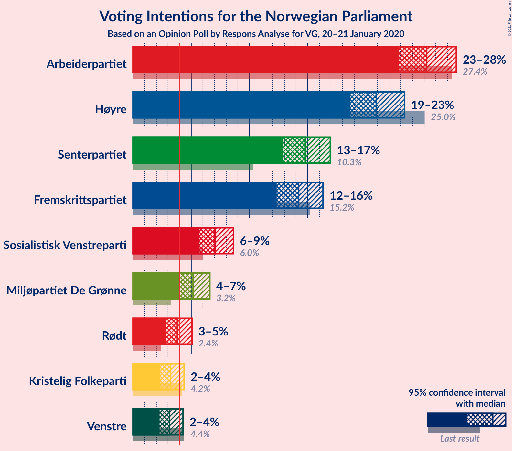
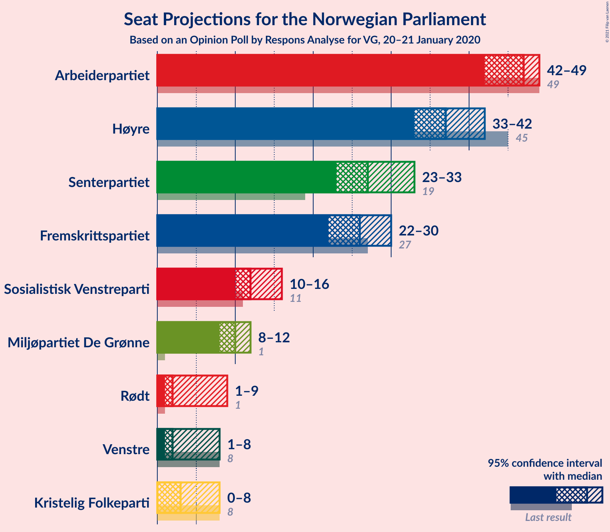
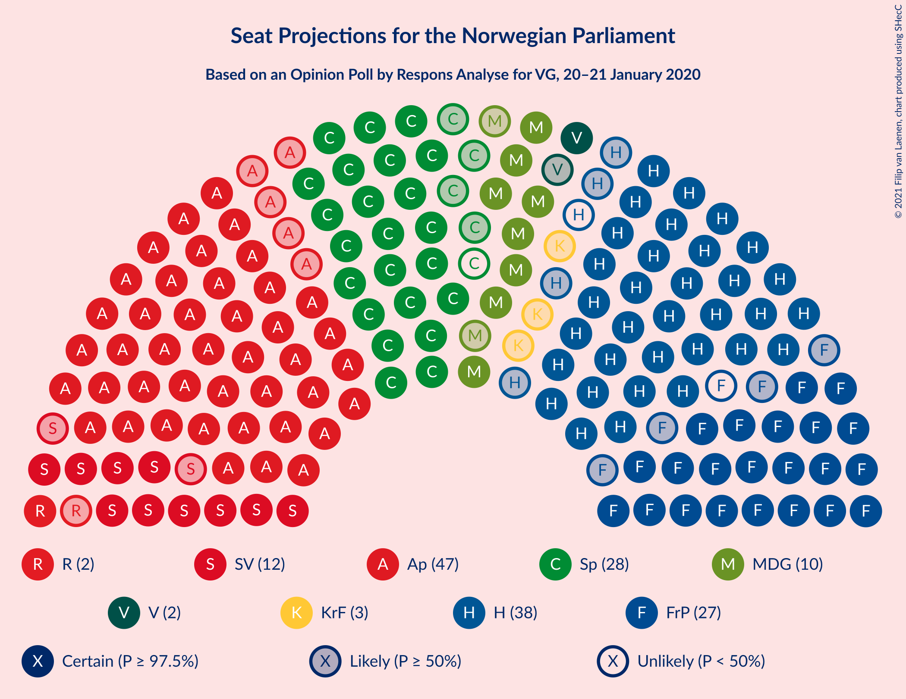
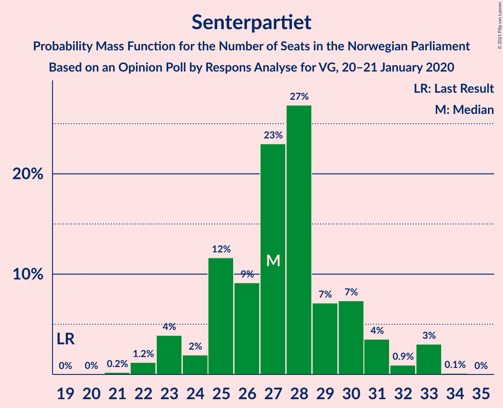
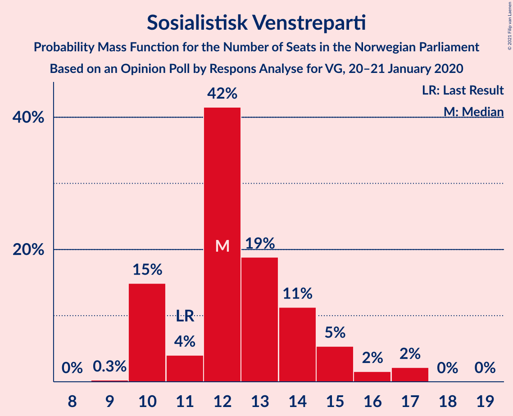
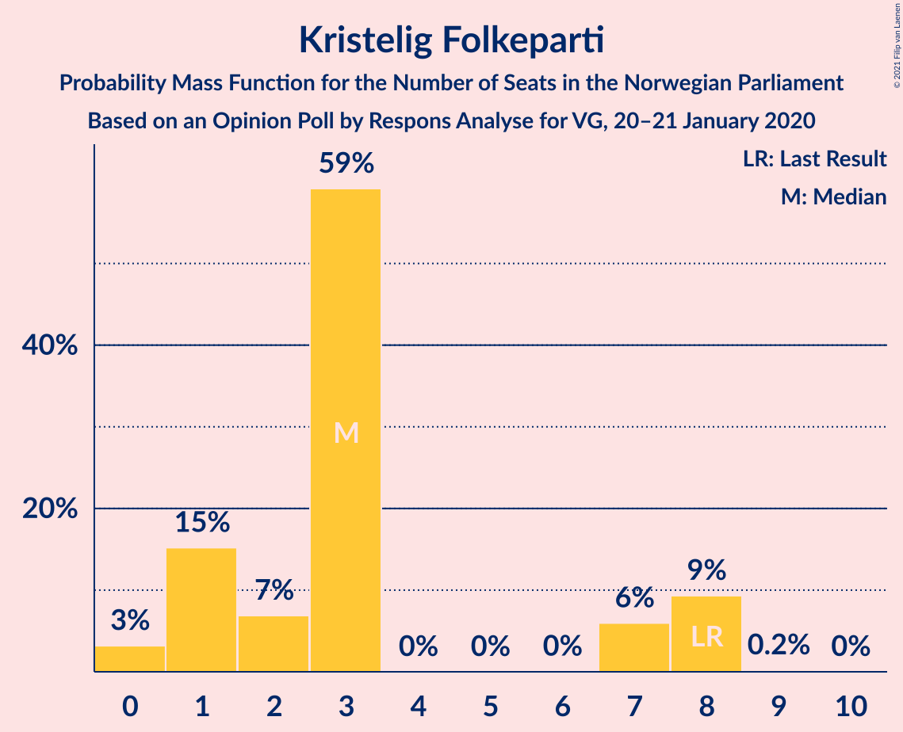
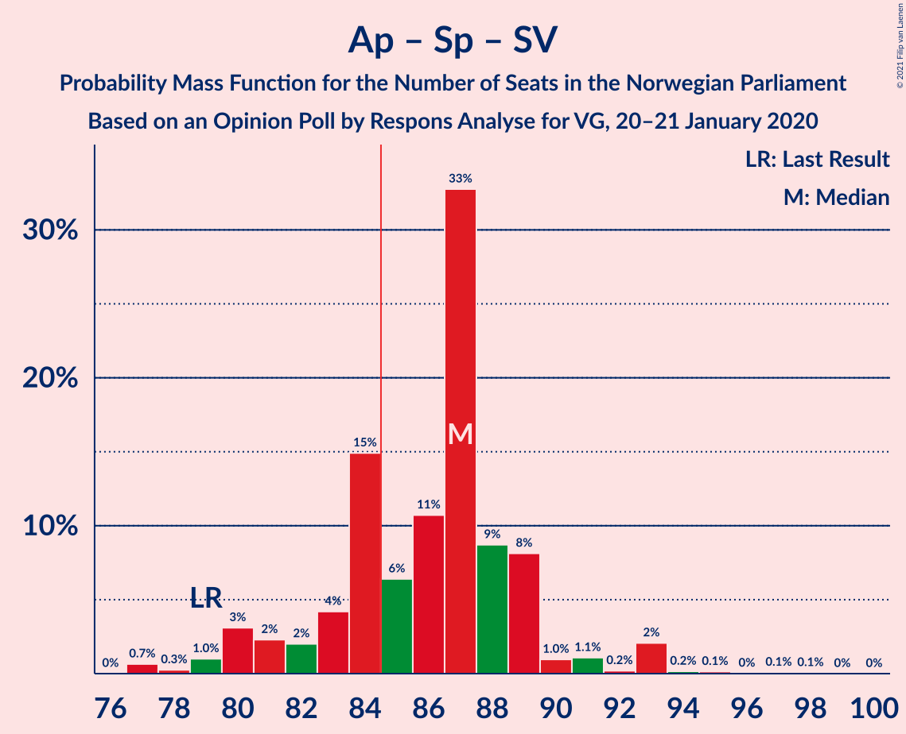
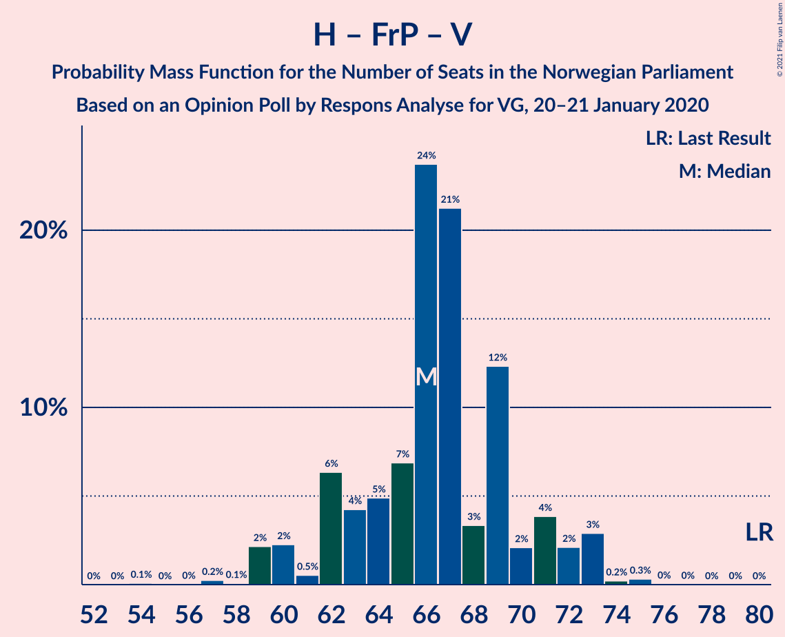
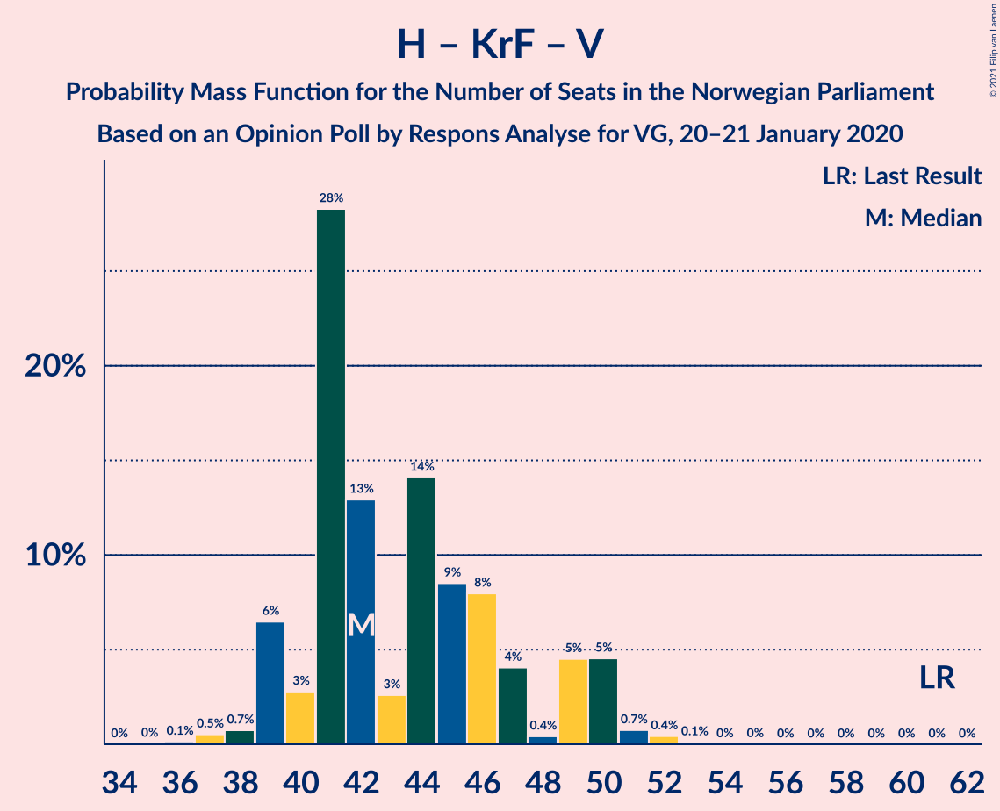

# Opinion Poll by Respons Analyse for VG, 20–21 January 2020

<a href="#voting-intentions">Voting Intentions</a> | <a href="#seats">Seats</a> | <a href="#coalitions">Coalitions</a> | <a href="#technical-information">Technical Information</a>

## Voting Intentions

### Confidence Intervals

| Party | Last Result | Poll Result | 80% Confidence Interval | 90% Confidence Interval | 95% Confidence Interval | 99% Confidence Interval |
|:-----:|:-----------:|:-----------:|:-----------------------:|:-----------------------:|:-----------------------:|:-----------------------:|
| Arbeiderpartiet | 27.4% | 25.2% | 23.6–26.9% |23.2–27.4% |22.8–27.8% |22.1–28.6% |
| Høyre | 25.0% | 20.9% | 19.4–22.5% |19.0–22.9% |18.7–23.3% |18.0–24.1% |
| Senterpartiet | 10.3% | 14.8% | 13.5–16.2% |13.2–16.6% |12.9–16.9% |12.3–17.6% |
| Fremskrittspartiet | 15.2% | 14.2% | 13.0–15.6% |12.6–16.0% |12.3–16.3% |11.8–17.0% |
| Sosialistisk Venstreparti | 6.0% | 7.0% | 6.1–8.1% |5.9–8.4% |5.7–8.6% |5.3–9.2% |
| Miljøpartiet De Grønne | 3.2% | 5.2% | 4.4–6.1% |4.2–6.4% |4.0–6.6% |3.7–7.1% |
| Rødt | 2.4% | 3.8% | 3.2–4.6% |3.0–4.9% |2.9–5.1% |2.6–5.5% |
| Kristelig Folkeparti | 4.2% | 3.2% | 2.6–4.0% |2.5–4.2% |2.3–4.4% |2.1–4.8% |
| Venstre | 4.4% | 3.1% | 2.6–3.9% |2.4–4.1% |2.3–4.3% |2.0–4.7% |

*Note:* The poll result column reflects the actual value used in the calculations. Published results may vary slightly, and in addition be rounded to fewer digits.

## Seats

### Confidence Intervals

| Party | Last Result | Median | 80% Confidence Interval | 90% Confidence Interval | 95% Confidence Interval | 99% Confidence Interval |
|:-----:|:-----------:|:------:|:-----------------------:|:-----------------------:|:-----------------------:|:-----------------------:|
| <a href="#arbeiderpartiet">Arbeiderpartiet</a> | 49 | 47 | 44–49 |43–49 |42–49 |40–51 |
| <a href="#høyre">Høyre</a> | 45 | 37 | 35–40 |34–41 |33–42 |32–44 |
| <a href="#senterpartiet">Senterpartiet</a> | 19 | 27 | 25–30 |23–31 |23–33 |22–33 |
| <a href="#fremskrittspartiet">Fremskrittspartiet</a> | 27 | 26 | 24–29 |23–29 |22–30 |21–32 |
| <a href="#sosialistisk-venstreparti">Sosialistisk Venstreparti</a> | 11 | 12 | 10–14 |10–15 |10–16 |10–17 |
| <a href="#miljøpartiet-de-grønne">Miljøpartiet De Grønne</a> | 1 | 10 | 8–10 |8–11 |8–12 |3–13 |
| <a href="#rødt">Rødt</a> | 1 | 2 | 2–8 |1–8 |1–9 |1–10 |
| <a href="#kristelig-folkeparti">Kristelig Folkeparti</a> | 8 | 3 | 1–7 |1–8 |0–8 |0–8 |
| <a href="#venstre">Venstre</a> | 8 | 2 | 2–3 |2–7 |1–8 |1–9 |

### Arbeiderpartiet

*For a full overview of the results for this party, see the [Arbeiderpartiet](party-arbeiderpartiet.html) page.*

| Number of Seats | Probability | Accumulated | Special Marks |
|:---------------:|:-----------:|:-----------:|:-------------:|
| 39 | 0.4% | 100% |  |
| 40 | 0.4% | 99.5% |  |
| 41 | 0.4% | 99.1% |  |
| 42 | 1.2% | 98.7% |  |
| 43 | 5% | 97% |  |
| 44 | 15% | 93% |  |
| 45 | 11% | 77% |  |
| 46 | 7% | 66% |  |
| 47 | 43% | 59% | Median |
| 48 | 6% | 16% |  |
| 49 | 8% | 10% | Last Result |
| 50 | 0.7% | 2% |  |
| 51 | 1.3% | 2% |  |
| 52 | 0.1% | 0.4% |  |
| 53 | 0.1% | 0.3% |  |
| 54 | 0.2% | 0.2% |  |
| 55 | 0% | 0% |  |

### Høyre

*For a full overview of the results for this party, see the [Høyre](party-høyre.html) page.*

| Number of Seats | Probability | Accumulated | Special Marks |
|:---------------:|:-----------:|:-----------:|:-------------:|
| 30 | 0.1% | 100% |  |
| 31 | 0.1% | 99.9% |  |
| 32 | 0.4% | 99.9% |  |
| 33 | 3% | 99.4% |  |
| 34 | 2% | 97% |  |
| 35 | 6% | 95% |  |
| 36 | 30% | 89% |  |
| 37 | 15% | 59% | Median |
| 38 | 20% | 44% |  |
| 39 | 5% | 24% |  |
| 40 | 10% | 19% |  |
| 41 | 6% | 9% |  |
| 42 | 2% | 3% |  |
| 43 | 0.6% | 1.2% |  |
| 44 | 0.2% | 0.5% |  |
| 45 | 0.2% | 0.3% | Last Result |
| 46 | 0% | 0.1% |  |
| 47 | 0% | 0.1% |  |
| 48 | 0.1% | 0.1% |  |
| 49 | 0% | 0% |  |

### Senterpartiet

*For a full overview of the results for this party, see the [Senterpartiet](party-senterpartiet.html) page.*

| Number of Seats | Probability | Accumulated | Special Marks |
|:---------------:|:-----------:|:-----------:|:-------------:|
| 19 | 0% | 100% | Last Result |
| 20 | 0% | 100% |  |
| 21 | 0.2% | 100% |  |
| 22 | 1.2% | 99.8% |  |
| 23 | 4% | 98.6% |  |
| 24 | 2% | 95% |  |
| 25 | 12% | 93% |  |
| 26 | 9% | 81% |  |
| 27 | 23% | 72% | Median |
| 28 | 27% | 49% |  |
| 29 | 7% | 22% |  |
| 30 | 7% | 15% |  |
| 31 | 4% | 8% |  |
| 32 | 0.9% | 4% |  |
| 33 | 3% | 3% |  |
| 34 | 0.1% | 0.1% |  |
| 35 | 0% | 0% |  |

### Fremskrittspartiet

*For a full overview of the results for this party, see the [Fremskrittspartiet](party-fremskrittspartiet.html) page.*

| Number of Seats | Probability | Accumulated | Special Marks |
|:---------------:|:-----------:|:-----------:|:-------------:|
| 19 | 0.2% | 100% |  |
| 20 | 0.1% | 99.8% |  |
| 21 | 1.4% | 99.8% |  |
| 22 | 3% | 98% |  |
| 23 | 3% | 95% |  |
| 24 | 11% | 92% |  |
| 25 | 23% | 81% |  |
| 26 | 12% | 58% | Median |
| 27 | 14% | 46% | Last Result |
| 28 | 6% | 32% |  |
| 29 | 22% | 26% |  |
| 30 | 3% | 4% |  |
| 31 | 0.2% | 1.1% |  |
| 32 | 0.9% | 0.9% |  |
| 33 | 0% | 0% |  |

### Sosialistisk Venstreparti

*For a full overview of the results for this party, see the [Sosialistisk Venstreparti](party-sosialistiskvenstreparti.html) page.*

| Number of Seats | Probability | Accumulated | Special Marks |
|:---------------:|:-----------:|:-----------:|:-------------:|
| 9 | 0.3% | 100% |  |
| 10 | 15% | 99.7% |  |
| 11 | 4% | 85% | Last Result |
| 12 | 42% | 81% | Median |
| 13 | 19% | 39% |  |
| 14 | 11% | 20% |  |
| 15 | 5% | 9% |  |
| 16 | 2% | 4% |  |
| 17 | 2% | 2% |  |
| 18 | 0% | 0.1% |  |
| 19 | 0% | 0% |  |

### Miljøpartiet De Grønne

*For a full overview of the results for this party, see the [Miljøpartiet De Grønne](party-miljøpartietdegrønne.html) page.*

| Number of Seats | Probability | Accumulated | Special Marks |
|:---------------:|:-----------:|:-----------:|:-------------:|
| 1 | 0% | 100% | Last Result |
| 2 | 0.4% | 100% |  |
| 3 | 1.2% | 99.6% |  |
| 4 | 0.1% | 98% |  |
| 5 | 0% | 98% |  |
| 6 | 0% | 98% |  |
| 7 | 0.4% | 98% |  |
| 8 | 22% | 98% |  |
| 9 | 26% | 76% |  |
| 10 | 42% | 51% | Median |
| 11 | 4% | 9% |  |
| 12 | 4% | 5% |  |
| 13 | 0.4% | 0.5% |  |
| 14 | 0.1% | 0.1% |  |
| 15 | 0% | 0% |  |

### Rødt

*For a full overview of the results for this party, see the [Rødt](party-rødt.html) page.*

| Number of Seats | Probability | Accumulated | Special Marks |
|:---------------:|:-----------:|:-----------:|:-------------:|
| 1 | 6% | 100% | Last Result |
| 2 | 58% | 94% | Median |
| 3 | 0% | 35% |  |
| 4 | 0% | 35% |  |
| 5 | 0% | 35% |  |
| 6 | 0.1% | 35% |  |
| 7 | 17% | 35% |  |
| 8 | 15% | 18% |  |
| 9 | 3% | 4% |  |
| 10 | 0.4% | 0.5% |  |
| 11 | 0.1% | 0.1% |  |
| 12 | 0% | 0% |  |

### Kristelig Folkeparti

*For a full overview of the results for this party, see the [Kristelig Folkeparti](party-kristeligfolkeparti.html) page.*

| Number of Seats | Probability | Accumulated | Special Marks |
|:---------------:|:-----------:|:-----------:|:-------------:|
| 0 | 3% | 100% |  |
| 1 | 15% | 97% |  |
| 2 | 7% | 82% |  |
| 3 | 59% | 75% | Median |
| 4 | 0% | 16% |  |
| 5 | 0% | 16% |  |
| 6 | 0% | 16% |  |
| 7 | 6% | 16% |  |
| 8 | 9% | 10% | Last Result |
| 9 | 0.2% | 0.2% |  |
| 10 | 0% | 0% |  |

### Venstre

*For a full overview of the results for this party, see the [Venstre](party-venstre.html) page.*

| Number of Seats | Probability | Accumulated | Special Marks |
|:---------------:|:-----------:|:-----------:|:-------------:|
| 0 | 0.1% | 100% |  |
| 1 | 4% | 99.9% |  |
| 2 | 71% | 96% | Median |
| 3 | 15% | 25% |  |
| 4 | 0% | 10% |  |
| 5 | 0% | 10% |  |
| 6 | 0% | 10% |  |
| 7 | 6% | 10% |  |
| 8 | 4% | 4% | Last Result |
| 9 | 0.9% | 0.9% |  |
| 10 | 0% | 0% |  |

## Coalitions

### Confidence Intervals

| Coalition | Last Result | Median | Majority? | 80% Confidence Interval | 90% Confidence Interval | 95% Confidence Interval | 99% Confidence Interval |
|:---------:|:-----------:|:------:|:---------:|:-----------------------:|:-----------------------:|:-----------------------:|:-----------------------:|
| Arbeiderpartiet – Senterpartiet – Sosialistisk Venstreparti – Miljøpartiet De Grønne – Rødt | 81 | 99 | 100% | 95–103 | 94–104 | 92–106 | 92–108 |
| Arbeiderpartiet – Senterpartiet – Sosialistisk Venstreparti – Miljøpartiet De Grønne – Kristelig Folkeparti | 88 | 99 | 100% | 95–102 | 94–103 | 92–105 | 90–105 |
| Arbeiderpartiet – Senterpartiet – Sosialistisk Venstreparti – Miljøpartiet De Grønne | 80 | 96 | 99.9% | 91–99 | 89–99 | 89–102 | 87–102 |
| Høyre – Senterpartiet – Fremskrittspartiet – Kristelig Folkeparti – Venstre | 107 | 98 | 100% | 92–101 | 90–101 | 89–102 | 88–105 |
| Arbeiderpartiet – Senterpartiet – Sosialistisk Venstreparti – Rødt | 80 | 89 | 96% | 87–94 | 85–95 | 83–95 | 81–99 |
| Arbeiderpartiet – Senterpartiet – Sosialistisk Venstreparti | 79 | 87 | 72% | 83–89 | 80–89 | 80–93 | 77–93 |
| Arbeiderpartiet – Senterpartiet – Miljøpartiet De Grønne – Kristelig Folkeparti | 77 | 86 | 77% | 81–90 | 81–90 | 79–91 | 77–93 |
| Høyre – Fremskrittspartiet – Miljøpartiet De Grønne – Kristelig Folkeparti – Venstre | 89 | 79 | 4% | 75–82 | 74–84 | 74–86 | 70–88 |
| Arbeiderpartiet – Senterpartiet – Kristelig Folkeparti | 76 | 77 | 0.1% | 73–80 | 71–80 | 71–82 | 68–84 |
| Arbeiderpartiet – Senterpartiet | 68 | 74 | 0% | 70–76 | 69–77 | 68–77 | 65–81 |
| Høyre – Fremskrittspartiet – Kristelig Folkeparti – Venstre | 88 | 70 | 0% | 66–74 | 65–75 | 63–77 | 61–77 |
| Høyre – Fremskrittspartiet – Venstre | 80 | 66 | 0% | 62–70 | 61–72 | 59–73 | 59–74 |
| Høyre – Fremskrittspartiet | 72 | 64 | 0% | 60–67 | 59–67 | 57–69 | 56–70 |
| Arbeiderpartiet – Sosialistisk Venstreparti | 60 | 59 | 0% | 56–62 | 55–63 | 54–64 | 51–65 |
| Høyre – Kristelig Folkeparti – Venstre | 61 | 42 | 0% | 40–49 | 39–50 | 39–50 | 37–52 |
| Senterpartiet – Kristelig Folkeparti – Venstre | 35 | 33 | 0% | 30–37 | 27–38 | 27–38 | 25–39 |

### Arbeiderpartiet – Senterpartiet – Sosialistisk Venstreparti – Miljøpartiet De Grønne – Rødt

| Number of Seats | Probability | Accumulated | Special Marks |
|:---------------:|:-----------:|:-----------:|:-------------:|
| 81 | 0% | 100% | Last Result |
| 82 | 0% | 100% |  |
| 83 | 0% | 100% |  |
| 84 | 0% | 100% |  |
| 85 | 0% | 100% | Majority |
| 86 | 0% | 100% |  |
| 87 | 0% | 100% |  |
| 88 | 0% | 100% |  |
| 89 | 0% | 100% |  |
| 90 | 0.1% | 100% |  |
| 91 | 0.3% | 99.9% |  |
| 92 | 2% | 99.6% |  |
| 93 | 0.5% | 97% |  |
| 94 | 3% | 97% |  |
| 95 | 6% | 94% |  |
| 96 | 3% | 88% |  |
| 97 | 10% | 85% |  |
| 98 | 7% | 75% | Median |
| 99 | 25% | 68% |  |
| 100 | 16% | 44% |  |
| 101 | 11% | 28% |  |
| 102 | 1.1% | 17% |  |
| 103 | 6% | 16% |  |
| 104 | 5% | 10% |  |
| 105 | 0.7% | 4% |  |
| 106 | 3% | 4% |  |
| 107 | 0.3% | 0.8% |  |
| 108 | 0.3% | 0.5% |  |
| 109 | 0.2% | 0.2% |  |
| 110 | 0% | 0% |  |

### Arbeiderpartiet – Senterpartiet – Sosialistisk Venstreparti – Miljøpartiet De Grønne – Kristelig Folkeparti

| Number of Seats | Probability | Accumulated | Special Marks |
|:---------------:|:-----------:|:-----------:|:-------------:|
| 87 | 0.1% | 100% |  |
| 88 | 0% | 99.8% | Last Result |
| 89 | 0.1% | 99.8% |  |
| 90 | 0.9% | 99.8% |  |
| 91 | 1.3% | 98.9% |  |
| 92 | 0.5% | 98% |  |
| 93 | 0.6% | 97% |  |
| 94 | 2% | 96% |  |
| 95 | 9% | 95% |  |
| 96 | 14% | 86% |  |
| 97 | 6% | 72% |  |
| 98 | 15% | 66% |  |
| 99 | 6% | 51% | Median |
| 100 | 21% | 45% |  |
| 101 | 10% | 24% |  |
| 102 | 6% | 14% |  |
| 103 | 3% | 8% |  |
| 104 | 0.9% | 4% |  |
| 105 | 3% | 4% |  |
| 106 | 0.1% | 0.4% |  |
| 107 | 0.1% | 0.2% |  |
| 108 | 0.1% | 0.1% |  |
| 109 | 0% | 0% |  |

### Arbeiderpartiet – Senterpartiet – Sosialistisk Venstreparti – Miljøpartiet De Grønne

| Number of Seats | Probability | Accumulated | Special Marks |
|:---------------:|:-----------:|:-----------:|:-------------:|
| 80 | 0% | 100% | Last Result |
| 81 | 0% | 100% |  |
| 82 | 0% | 100% |  |
| 83 | 0% | 100% |  |
| 84 | 0% | 100% |  |
| 85 | 0.2% | 99.9% | Majority |
| 86 | 0.1% | 99.7% |  |
| 87 | 0.7% | 99.6% |  |
| 88 | 1.2% | 98.9% |  |
| 89 | 3% | 98% |  |
| 90 | 3% | 95% |  |
| 91 | 3% | 92% |  |
| 92 | 3% | 89% |  |
| 93 | 15% | 86% |  |
| 94 | 6% | 71% |  |
| 95 | 12% | 65% |  |
| 96 | 10% | 53% | Median |
| 97 | 24% | 43% |  |
| 98 | 7% | 19% |  |
| 99 | 8% | 12% |  |
| 100 | 0.4% | 4% |  |
| 101 | 0.9% | 3% |  |
| 102 | 2% | 3% |  |
| 103 | 0.1% | 0.3% |  |
| 104 | 0.1% | 0.2% |  |
| 105 | 0% | 0.1% |  |
| 106 | 0% | 0% |  |

### Høyre – Senterpartiet – Fremskrittspartiet – Kristelig Folkeparti – Venstre

| Number of Seats | Probability | Accumulated | Special Marks |
|:---------------:|:-----------:|:-----------:|:-------------:|
| 85 | 0% | 100% | Majority |
| 86 | 0% | 99.9% |  |
| 87 | 0.4% | 99.9% |  |
| 88 | 1.1% | 99.5% |  |
| 89 | 3% | 98% |  |
| 90 | 0.8% | 96% |  |
| 91 | 0.9% | 95% |  |
| 92 | 5% | 94% |  |
| 93 | 4% | 89% |  |
| 94 | 3% | 85% |  |
| 95 | 0.9% | 83% | Median |
| 96 | 16% | 82% |  |
| 97 | 10% | 66% |  |
| 98 | 31% | 55% |  |
| 99 | 5% | 24% |  |
| 100 | 6% | 19% |  |
| 101 | 8% | 13% |  |
| 102 | 4% | 5% |  |
| 103 | 0.4% | 1.2% |  |
| 104 | 0.2% | 0.8% |  |
| 105 | 0.5% | 0.7% |  |
| 106 | 0% | 0.2% |  |
| 107 | 0.2% | 0.2% | Last Result |
| 108 | 0% | 0% |  |

### Arbeiderpartiet – Senterpartiet – Sosialistisk Venstreparti – Rødt

| Number of Seats | Probability | Accumulated | Special Marks |
|:---------------:|:-----------:|:-----------:|:-------------:|
| 80 | 0% | 100% | Last Result |
| 81 | 0.5% | 100% |  |
| 82 | 2% | 99.5% |  |
| 83 | 0.2% | 98% |  |
| 84 | 2% | 97% |  |
| 85 | 2% | 96% | Majority |
| 86 | 3% | 93% |  |
| 87 | 6% | 91% |  |
| 88 | 3% | 85% | Median |
| 89 | 32% | 82% |  |
| 90 | 8% | 50% |  |
| 91 | 21% | 42% |  |
| 92 | 4% | 21% |  |
| 93 | 5% | 17% |  |
| 94 | 8% | 13% |  |
| 95 | 3% | 5% |  |
| 96 | 0.5% | 2% |  |
| 97 | 0.8% | 2% |  |
| 98 | 0.2% | 0.8% |  |
| 99 | 0.4% | 0.7% |  |
| 100 | 0.2% | 0.2% |  |
| 101 | 0% | 0.1% |  |
| 102 | 0% | 0.1% |  |
| 103 | 0% | 0% |  |

### Arbeiderpartiet – Senterpartiet – Sosialistisk Venstreparti

| Number of Seats | Probability | Accumulated | Special Marks |
|:---------------:|:-----------:|:-----------:|:-------------:|
| 77 | 0.7% | 100% |  |
| 78 | 0.3% | 99.3% |  |
| 79 | 1.0% | 99.0% | Last Result |
| 80 | 3% | 98% |  |
| 81 | 2% | 95% |  |
| 82 | 2% | 93% |  |
| 83 | 4% | 91% |  |
| 84 | 15% | 86% |  |
| 85 | 6% | 72% | Majority |
| 86 | 11% | 65% | Median |
| 87 | 33% | 54% |  |
| 88 | 9% | 22% |  |
| 89 | 8% | 13% |  |
| 90 | 1.0% | 5% |  |
| 91 | 1.1% | 4% |  |
| 92 | 0.2% | 3% |  |
| 93 | 2% | 3% |  |
| 94 | 0.2% | 0.5% |  |
| 95 | 0.1% | 0.3% |  |
| 96 | 0% | 0.2% |  |
| 97 | 0.1% | 0.2% |  |
| 98 | 0.1% | 0.1% |  |
| 99 | 0% | 0% |  |

### Arbeiderpartiet – Senterpartiet – Miljøpartiet De Grønne – Kristelig Folkeparti

| Number of Seats | Probability | Accumulated | Special Marks |
|:---------------:|:-----------:|:-----------:|:-------------:|
| 74 | 0.1% | 100% |  |
| 75 | 0% | 99.8% |  |
| 76 | 0% | 99.8% |  |
| 77 | 0.5% | 99.8% | Last Result |
| 78 | 0.7% | 99.3% |  |
| 79 | 1.5% | 98.6% |  |
| 80 | 1.4% | 97% |  |
| 81 | 6% | 96% |  |
| 82 | 5% | 90% |  |
| 83 | 4% | 85% |  |
| 84 | 4% | 81% |  |
| 85 | 10% | 77% | Majority |
| 86 | 18% | 67% |  |
| 87 | 4% | 49% | Median |
| 88 | 28% | 45% |  |
| 89 | 6% | 17% |  |
| 90 | 7% | 11% |  |
| 91 | 2% | 4% |  |
| 92 | 0.4% | 1.1% |  |
| 93 | 0.3% | 0.8% |  |
| 94 | 0.1% | 0.4% |  |
| 95 | 0.2% | 0.3% |  |
| 96 | 0% | 0% |  |

### Høyre – Fremskrittspartiet – Miljøpartiet De Grønne – Kristelig Folkeparti – Venstre

| Number of Seats | Probability | Accumulated | Special Marks |
|:---------------:|:-----------:|:-----------:|:-------------:|
| 67 | 0% | 100% |  |
| 68 | 0% | 99.9% |  |
| 69 | 0.2% | 99.9% |  |
| 70 | 0.4% | 99.7% |  |
| 71 | 0.2% | 99.3% |  |
| 72 | 0.8% | 99.2% |  |
| 73 | 0.6% | 98% |  |
| 74 | 3% | 98% |  |
| 75 | 8% | 95% |  |
| 76 | 5% | 87% |  |
| 77 | 4% | 82% |  |
| 78 | 21% | 78% | Median |
| 79 | 8% | 57% |  |
| 80 | 32% | 49% |  |
| 81 | 3% | 17% |  |
| 82 | 6% | 14% |  |
| 83 | 2% | 8% |  |
| 84 | 2% | 6% |  |
| 85 | 2% | 4% | Majority |
| 86 | 0.2% | 3% |  |
| 87 | 2% | 2% |  |
| 88 | 0.5% | 0.5% |  |
| 89 | 0% | 0% | Last Result |

### Arbeiderpartiet – Senterpartiet – Kristelig Folkeparti

| Number of Seats | Probability | Accumulated | Special Marks |
|:---------------:|:-----------:|:-----------:|:-------------:|
| 66 | 0.2% | 100% |  |
| 67 | 0.1% | 99.7% |  |
| 68 | 0.4% | 99.7% |  |
| 69 | 0.6% | 99.2% |  |
| 70 | 1.0% | 98.7% |  |
| 71 | 3% | 98% |  |
| 72 | 3% | 95% |  |
| 73 | 6% | 91% |  |
| 74 | 3% | 86% |  |
| 75 | 7% | 83% |  |
| 76 | 6% | 76% | Last Result |
| 77 | 23% | 70% | Median |
| 78 | 26% | 47% |  |
| 79 | 7% | 21% |  |
| 80 | 9% | 14% |  |
| 81 | 2% | 5% |  |
| 82 | 1.2% | 3% |  |
| 83 | 0.7% | 1.3% |  |
| 84 | 0.5% | 0.6% |  |
| 85 | 0.1% | 0.1% | Majority |
| 86 | 0% | 0.1% |  |
| 87 | 0% | 0% |  |

### Arbeiderpartiet – Senterpartiet

| Number of Seats | Probability | Accumulated | Special Marks |
|:---------------:|:-----------:|:-----------:|:-------------:|
| 64 | 0% | 100% |  |
| 65 | 0.7% | 99.9% |  |
| 66 | 0.6% | 99.3% |  |
| 67 | 1.0% | 98.7% |  |
| 68 | 2% | 98% | Last Result |
| 69 | 3% | 96% |  |
| 70 | 3% | 93% |  |
| 71 | 8% | 90% |  |
| 72 | 9% | 81% |  |
| 73 | 6% | 72% |  |
| 74 | 25% | 66% | Median |
| 75 | 28% | 41% |  |
| 76 | 3% | 13% |  |
| 77 | 8% | 10% |  |
| 78 | 0.5% | 2% |  |
| 79 | 0.3% | 1.1% |  |
| 80 | 0.1% | 0.8% |  |
| 81 | 0.2% | 0.7% |  |
| 82 | 0.3% | 0.5% |  |
| 83 | 0.2% | 0.2% |  |
| 84 | 0% | 0% |  |

### Høyre – Fremskrittspartiet – Kristelig Folkeparti – Venstre

| Number of Seats | Probability | Accumulated | Special Marks |
|:---------------:|:-----------:|:-----------:|:-------------:|
| 60 | 0.2% | 100% |  |
| 61 | 0.3% | 99.8% |  |
| 62 | 0.3% | 99.5% |  |
| 63 | 3% | 99.2% |  |
| 64 | 0.7% | 96% |  |
| 65 | 5% | 96% |  |
| 66 | 6% | 90% |  |
| 67 | 1.1% | 84% |  |
| 68 | 11% | 83% | Median |
| 69 | 16% | 71% |  |
| 70 | 25% | 55% |  |
| 71 | 7% | 31% |  |
| 72 | 10% | 24% |  |
| 73 | 3% | 14% |  |
| 74 | 6% | 11% |  |
| 75 | 2% | 5% |  |
| 76 | 0.4% | 3% |  |
| 77 | 2% | 3% |  |
| 78 | 0.3% | 0.4% |  |
| 79 | 0% | 0.1% |  |
| 80 | 0% | 0% |  |
| 81 | 0% | 0% |  |
| 82 | 0% | 0% |  |
| 83 | 0% | 0% |  |
| 84 | 0% | 0% |  |
| 85 | 0% | 0% | Majority |
| 86 | 0% | 0% |  |
| 87 | 0% | 0% |  |
| 88 | 0% | 0% | Last Result |

### Høyre – Fremskrittspartiet – Venstre

| Number of Seats | Probability | Accumulated | Special Marks |
|:---------------:|:-----------:|:-----------:|:-------------:|
| 54 | 0.1% | 100% |  |
| 55 | 0% | 99.9% |  |
| 56 | 0% | 99.9% |  |
| 57 | 0.2% | 99.9% |  |
| 58 | 0.1% | 99.6% |  |
| 59 | 2% | 99.6% |  |
| 60 | 2% | 97% |  |
| 61 | 0.5% | 95% |  |
| 62 | 6% | 95% |  |
| 63 | 4% | 88% |  |
| 64 | 5% | 84% |  |
| 65 | 7% | 79% | Median |
| 66 | 24% | 72% |  |
| 67 | 21% | 49% |  |
| 68 | 3% | 27% |  |
| 69 | 12% | 24% |  |
| 70 | 2% | 12% |  |
| 71 | 4% | 9% |  |
| 72 | 2% | 6% |  |
| 73 | 3% | 4% |  |
| 74 | 0.2% | 0.6% |  |
| 75 | 0.3% | 0.4% |  |
| 76 | 0% | 0.1% |  |
| 77 | 0% | 0% |  |
| 78 | 0% | 0% |  |
| 79 | 0% | 0% |  |
| 80 | 0% | 0% | Last Result |

### Høyre – Fremskrittspartiet

| Number of Seats | Probability | Accumulated | Special Marks |
|:---------------:|:-----------:|:-----------:|:-------------:|
| 52 | 0.1% | 100% |  |
| 53 | 0% | 99.9% |  |
| 54 | 0% | 99.9% |  |
| 55 | 0.3% | 99.9% |  |
| 56 | 0.1% | 99.6% |  |
| 57 | 2% | 99.4% |  |
| 58 | 2% | 97% |  |
| 59 | 1.1% | 95% |  |
| 60 | 6% | 94% |  |
| 61 | 5% | 87% |  |
| 62 | 7% | 82% |  |
| 63 | 22% | 76% | Median |
| 64 | 9% | 53% |  |
| 65 | 23% | 45% |  |
| 66 | 6% | 21% |  |
| 67 | 11% | 15% |  |
| 68 | 0.8% | 5% |  |
| 69 | 2% | 4% |  |
| 70 | 1.0% | 1.3% |  |
| 71 | 0.1% | 0.3% |  |
| 72 | 0% | 0.3% | Last Result |
| 73 | 0.2% | 0.2% |  |
| 74 | 0% | 0% |  |

### Arbeiderpartiet – Sosialistisk Venstreparti

| Number of Seats | Probability | Accumulated | Special Marks |
|:---------------:|:-----------:|:-----------:|:-------------:|
| 50 | 0.1% | 100% |  |
| 51 | 0.5% | 99.8% |  |
| 52 | 0.1% | 99.4% |  |
| 53 | 1.4% | 99.3% |  |
| 54 | 1.0% | 98% |  |
| 55 | 3% | 97% |  |
| 56 | 9% | 94% |  |
| 57 | 18% | 85% |  |
| 58 | 4% | 66% |  |
| 59 | 39% | 62% | Median |
| 60 | 7% | 23% | Last Result |
| 61 | 4% | 17% |  |
| 62 | 8% | 13% |  |
| 63 | 2% | 5% |  |
| 64 | 3% | 4% |  |
| 65 | 0.3% | 0.6% |  |
| 66 | 0.2% | 0.3% |  |
| 67 | 0.1% | 0.1% |  |
| 68 | 0% | 0.1% |  |
| 69 | 0% | 0% |  |

### Høyre – Kristelig Folkeparti – Venstre

| Number of Seats | Probability | Accumulated | Special Marks |
|:---------------:|:-----------:|:-----------:|:-------------:|
| 35 | 0% | 100% |  |
| 36 | 0.1% | 99.9% |  |
| 37 | 0.5% | 99.8% |  |
| 38 | 0.7% | 99.3% |  |
| 39 | 6% | 98.5% |  |
| 40 | 3% | 92% |  |
| 41 | 28% | 89% |  |
| 42 | 13% | 61% | Median |
| 43 | 3% | 48% |  |
| 44 | 14% | 45% |  |
| 45 | 9% | 31% |  |
| 46 | 8% | 23% |  |
| 47 | 4% | 15% |  |
| 48 | 0.4% | 11% |  |
| 49 | 5% | 10% |  |
| 50 | 5% | 6% |  |
| 51 | 0.7% | 1.3% |  |
| 52 | 0.4% | 0.6% |  |
| 53 | 0.1% | 0.2% |  |
| 54 | 0% | 0% |  |
| 55 | 0% | 0% |  |
| 56 | 0% | 0% |  |
| 57 | 0% | 0% |  |
| 58 | 0% | 0% |  |
| 59 | 0% | 0% |  |
| 60 | 0% | 0% |  |
| 61 | 0% | 0% | Last Result |

### Senterpartiet – Kristelig Folkeparti – Venstre

| Number of Seats | Probability | Accumulated | Special Marks |
|:---------------:|:-----------:|:-----------:|:-------------:|
| 24 | 0.2% | 100% |  |
| 25 | 1.3% | 99.8% |  |
| 26 | 0.6% | 98% |  |
| 27 | 3% | 98% |  |
| 28 | 0.9% | 95% |  |
| 29 | 3% | 94% |  |
| 30 | 10% | 90% |  |
| 31 | 0.9% | 80% |  |
| 32 | 2% | 79% | Median |
| 33 | 35% | 77% |  |
| 34 | 5% | 42% |  |
| 35 | 19% | 38% | Last Result |
| 36 | 6% | 19% |  |
| 37 | 7% | 13% |  |
| 38 | 5% | 6% |  |
| 39 | 0.7% | 1.1% |  |
| 40 | 0.2% | 0.4% |  |
| 41 | 0.1% | 0.2% |  |
| 42 | 0% | 0% |  |

## Technical Information

### Opinion Poll

+ **Polling firm:** Respons Analyse
+ **Commissioner(s):** VG
+ **Fieldwork period:** 20–21 January 2020

### Calculations

+ **Sample size:** 1182
+ **Simulations done:** 131,072
+ **Error estimate:** 0.82%

