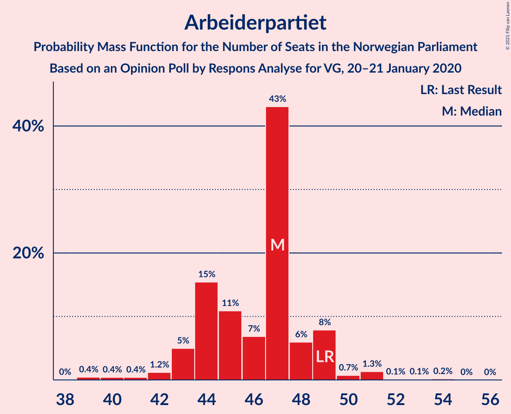
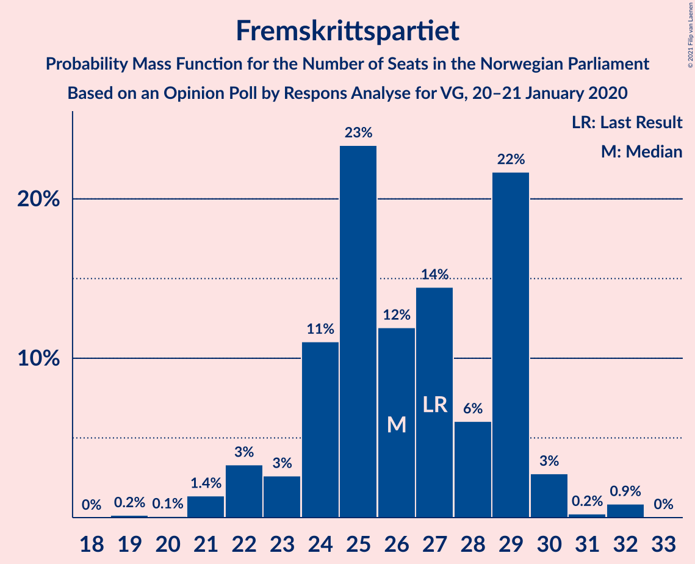
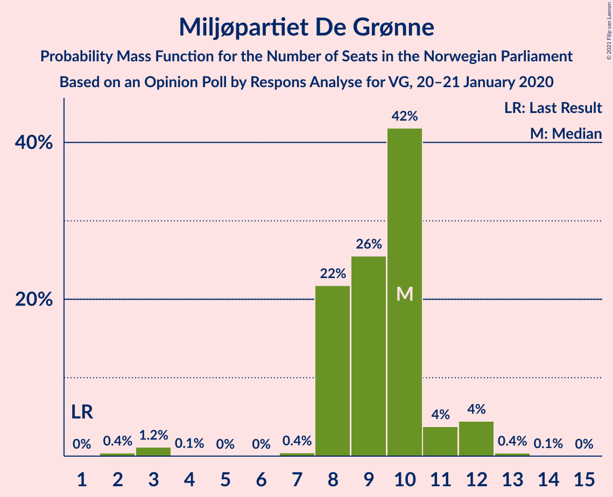
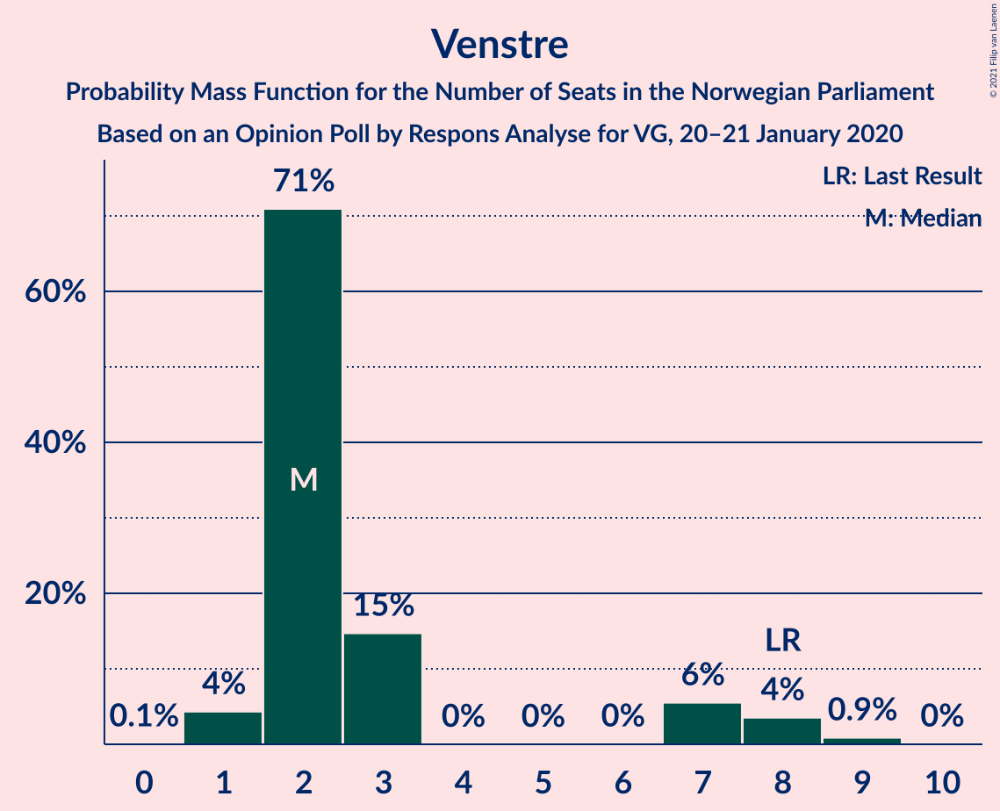
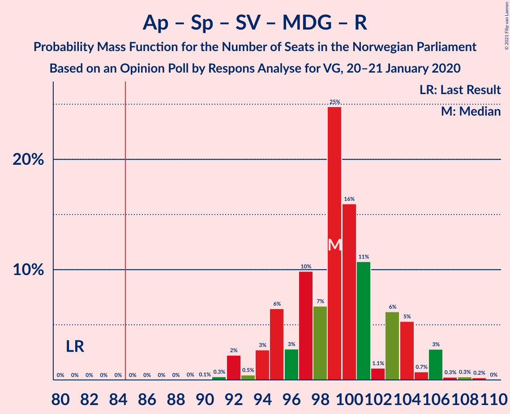
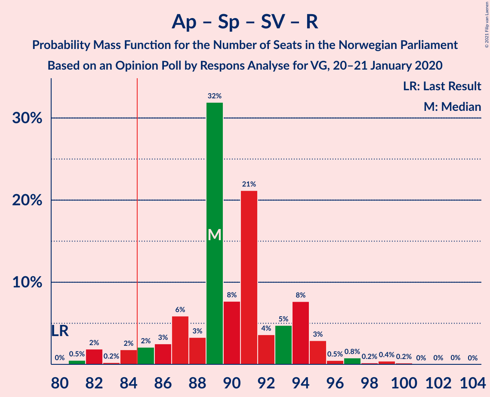
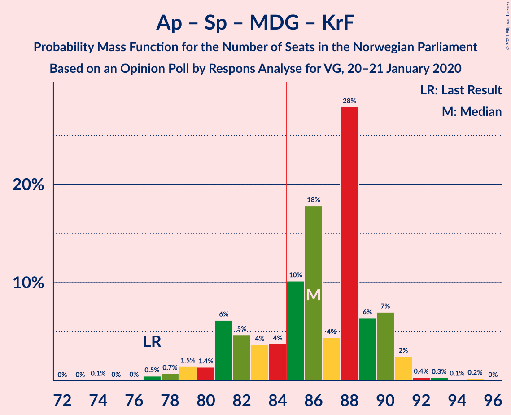
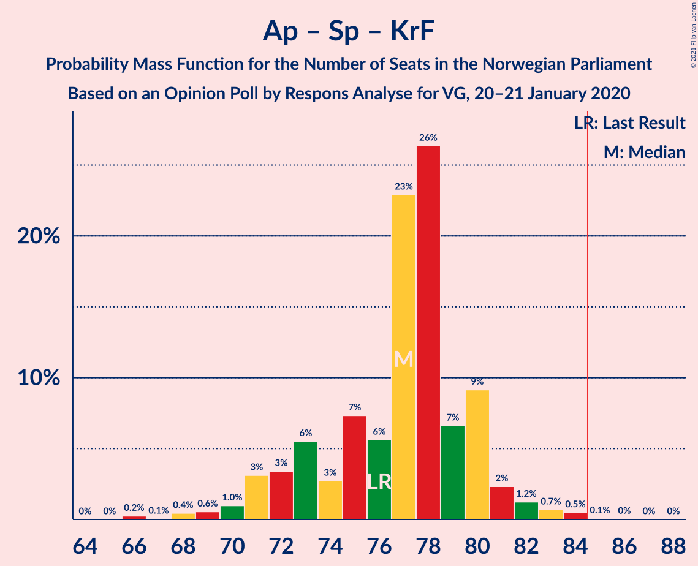

# Opinion Poll by Respons Analyse for VG, 20–21 January 2020

<a href="#voting-intentions">Voting Intentions</a> | <a href="#seats">Seats</a> | <a href="#coalitions">Coalitions</a> | <a href="#technical-information">Technical Information</a>

## Voting Intentions

### Confidence Intervals

| Party | Last Result | Poll Result | 80% Confidence Interval | 90% Confidence Interval | 95% Confidence Interval | 99% Confidence Interval |
|:-----:|:-----------:|:-----------:|:-----------------------:|:-----------------------:|:-----------------------:|:-----------------------:|
| Arbeiderpartiet | 27.4% | 25.2% | 23.6–26.9% |23.2–27.4% |22.8–27.8% |22.1–28.6% |
| Høyre | 25.0% | 20.9% | 19.4–22.5% |19.0–22.9% |18.7–23.3% |18.0–24.1% |
| Senterpartiet | 10.3% | 14.8% | 13.5–16.2% |13.2–16.6% |12.9–16.9% |12.3–17.6% |
| Fremskrittspartiet | 15.2% | 14.2% | 13.0–15.6% |12.6–16.0% |12.3–16.3% |11.8–17.0% |
| Sosialistisk Venstreparti | 6.0% | 7.0% | 6.1–8.1% |5.9–8.4% |5.7–8.6% |5.3–9.2% |
| Miljøpartiet De Grønne | 3.2% | 5.2% | 4.4–6.1% |4.2–6.4% |4.0–6.6% |3.7–7.1% |
| Rødt | 2.4% | 3.8% | 3.2–4.6% |3.0–4.9% |2.9–5.1% |2.6–5.5% |
| Kristelig Folkeparti | 4.2% | 3.2% | 2.6–4.0% |2.5–4.2% |2.3–4.4% |2.1–4.8% |
| Venstre | 4.4% | 3.1% | 2.6–3.9% |2.4–4.1% |2.3–4.3% |2.0–4.7% |

*Note:* The poll result column reflects the actual value used in the calculations. Published results may vary slightly, and in addition be rounded to fewer digits.

## Seats

### Confidence Intervals

| Party | Last Result | Median | 80% Confidence Interval | 90% Confidence Interval | 95% Confidence Interval | 99% Confidence Interval |
|:-----:|:-----------:|:------:|:-----------------------:|:-----------------------:|:-----------------------:|:-----------------------:|
| <a href="#arbeiderpartiet">Arbeiderpartiet</a> | 49 | 45 | 44–48 |43–48 |40–49 |40–52 |
| <a href="#høyre">Høyre</a> | 45 | 38 | 36–41 |35–42 |34–42 |33–43 |
| <a href="#senterpartiet">Senterpartiet</a> | 19 | 28 | 23–33 |23–33 |23–33 |22–34 |
| <a href="#fremskrittspartiet">Fremskrittspartiet</a> | 27 | 26 | 24–30 |23–31 |23–32 |21–32 |
| <a href="#sosialistisk-venstreparti">Sosialistisk Venstreparti</a> | 11 | 12 | 10–17 |10–17 |10–17 |9–17 |
| <a href="#miljøpartiet-de-grønne">Miljøpartiet De Grønne</a> | 1 | 9 | 8–10 |8–11 |8–11 |3–12 |
| <a href="#rødt">Rødt</a> | 1 | 2 | 2–8 |1–8 |1–8 |1–10 |
| <a href="#kristelig-folkeparti">Kristelig Folkeparti</a> | 8 | 3 | 1–8 |1–8 |1–8 |0–8 |
| <a href="#venstre">Venstre</a> | 8 | 2 | 1–6 |1–8 |1–8 |1–8 |

### Arbeiderpartiet

*For a full overview of the results for this party, see the [Arbeiderpartiet](party-arbeiderpartiet.html) page.*

| Number of Seats | Probability | Accumulated | Special Marks |
|:---------------:|:-----------:|:-----------:|:-------------:|
| 40 | 3% | 100% |  |
| 41 | 0.3% | 97% |  |
| 42 | 2% | 97% |  |
| 43 | 2% | 95% |  |
| 44 | 34% | 93% |  |
| 45 | 25% | 59% | Median |
| 46 | 3% | 34% |  |
| 47 | 21% | 31% |  |
| 48 | 6% | 10% |  |
| 49 | 4% | 5% | Last Result |
| 50 | 0.1% | 0.9% |  |
| 51 | 0.1% | 0.8% |  |
| 52 | 0.4% | 0.7% |  |
| 53 | 0.1% | 0.3% |  |
| 54 | 0.2% | 0.3% |  |
| 55 | 0% | 0% |  |

### Høyre

*For a full overview of the results for this party, see the [Høyre](party-høyre.html) page.*

| Number of Seats | Probability | Accumulated | Special Marks |
|:---------------:|:-----------:|:-----------:|:-------------:|
| 30 | 0.1% | 100% |  |
| 31 | 0.1% | 99.9% |  |
| 32 | 0.2% | 99.8% |  |
| 33 | 1.5% | 99.5% |  |
| 34 | 2% | 98% |  |
| 35 | 4% | 96% |  |
| 36 | 26% | 92% |  |
| 37 | 16% | 66% |  |
| 38 | 23% | 50% | Median |
| 39 | 2% | 27% |  |
| 40 | 11% | 25% |  |
| 41 | 4% | 13% |  |
| 42 | 8% | 9% |  |
| 43 | 0.2% | 0.6% |  |
| 44 | 0.3% | 0.4% |  |
| 45 | 0.1% | 0.1% | Last Result |
| 46 | 0% | 0% |  |

### Senterpartiet

*For a full overview of the results for this party, see the [Senterpartiet](party-senterpartiet.html) page.*

| Number of Seats | Probability | Accumulated | Special Marks |
|:---------------:|:-----------:|:-----------:|:-------------:|
| 19 | 0% | 100% | Last Result |
| 20 | 0% | 100% |  |
| 21 | 0.1% | 100% |  |
| 22 | 0.6% | 99.9% |  |
| 23 | 12% | 99.3% |  |
| 24 | 0.6% | 87% |  |
| 25 | 8% | 87% |  |
| 26 | 0.4% | 78% |  |
| 27 | 13% | 78% |  |
| 28 | 17% | 65% | Median |
| 29 | 12% | 48% |  |
| 30 | 8% | 36% |  |
| 31 | 11% | 28% |  |
| 32 | 0.3% | 17% |  |
| 33 | 15% | 16% |  |
| 34 | 1.0% | 1.1% |  |
| 35 | 0.1% | 0.1% |  |
| 36 | 0% | 0% |  |

### Fremskrittspartiet

*For a full overview of the results for this party, see the [Fremskrittspartiet](party-fremskrittspartiet.html) page.*

| Number of Seats | Probability | Accumulated | Special Marks |
|:---------------:|:-----------:|:-----------:|:-------------:|
| 19 | 0.3% | 100% |  |
| 20 | 0.1% | 99.7% |  |
| 21 | 1.1% | 99.6% |  |
| 22 | 0.6% | 98% |  |
| 23 | 5% | 98% |  |
| 24 | 26% | 93% |  |
| 25 | 3% | 67% |  |
| 26 | 17% | 64% | Median |
| 27 | 21% | 47% | Last Result |
| 28 | 9% | 26% |  |
| 29 | 0.6% | 17% |  |
| 30 | 11% | 16% |  |
| 31 | 0.4% | 5% |  |
| 32 | 5% | 5% |  |
| 33 | 0% | 0% |  |

### Sosialistisk Venstreparti

*For a full overview of the results for this party, see the [Sosialistisk Venstreparti](party-sosialistiskvenstreparti.html) page.*

| Number of Seats | Probability | Accumulated | Special Marks |
|:---------------:|:-----------:|:-----------:|:-------------:|
| 9 | 0.6% | 100% |  |
| 10 | 13% | 99.4% |  |
| 11 | 3% | 87% | Last Result |
| 12 | 44% | 84% | Median |
| 13 | 14% | 40% |  |
| 14 | 9% | 25% |  |
| 15 | 5% | 16% |  |
| 16 | 0.8% | 11% |  |
| 17 | 10% | 10% |  |
| 18 | 0% | 0% |  |

### Miljøpartiet De Grønne

*For a full overview of the results for this party, see the [Miljøpartiet De Grønne](party-miljøpartietdegrønne.html) page.*

| Number of Seats | Probability | Accumulated | Special Marks |
|:---------------:|:-----------:|:-----------:|:-------------:|
| 1 | 0.1% | 100% | Last Result |
| 2 | 0.2% | 99.9% |  |
| 3 | 0.3% | 99.7% |  |
| 4 | 0% | 99.4% |  |
| 5 | 0% | 99.4% |  |
| 6 | 0% | 99.4% |  |
| 7 | 0.5% | 99.4% |  |
| 8 | 33% | 98.9% |  |
| 9 | 28% | 66% | Median |
| 10 | 29% | 38% |  |
| 11 | 7% | 9% |  |
| 12 | 2% | 2% |  |
| 13 | 0.1% | 0.2% |  |
| 14 | 0.1% | 0.2% |  |
| 15 | 0% | 0% |  |

### Rødt

*For a full overview of the results for this party, see the [Rødt](party-rødt.html) page.*

| Number of Seats | Probability | Accumulated | Special Marks |
|:---------------:|:-----------:|:-----------:|:-------------:|
| 1 | 8% | 100% | Last Result |
| 2 | 70% | 92% | Median |
| 3 | 0% | 22% |  |
| 4 | 0% | 22% |  |
| 5 | 0% | 22% |  |
| 6 | 0% | 22% |  |
| 7 | 6% | 22% |  |
| 8 | 15% | 16% |  |
| 9 | 0.4% | 1.2% |  |
| 10 | 0.7% | 0.8% |  |
| 11 | 0.1% | 0.1% |  |
| 12 | 0% | 0% |  |

### Kristelig Folkeparti

*For a full overview of the results for this party, see the [Kristelig Folkeparti](party-kristeligfolkeparti.html) page.*

| Number of Seats | Probability | Accumulated | Special Marks |
|:---------------:|:-----------:|:-----------:|:-------------:|
| 0 | 0.8% | 100% |  |
| 1 | 13% | 99.2% |  |
| 2 | 29% | 86% |  |
| 3 | 29% | 57% | Median |
| 4 | 0% | 28% |  |
| 5 | 0% | 28% |  |
| 6 | 0.1% | 28% |  |
| 7 | 13% | 28% |  |
| 8 | 15% | 15% | Last Result |
| 9 | 0.1% | 0.1% |  |
| 10 | 0% | 0% |  |

### Venstre

*For a full overview of the results for this party, see the [Venstre](party-venstre.html) page.*

| Number of Seats | Probability | Accumulated | Special Marks |
|:---------------:|:-----------:|:-----------:|:-------------:|
| 0 | 0.1% | 100% |  |
| 1 | 17% | 99.9% |  |
| 2 | 72% | 83% | Median |
| 3 | 0% | 10% |  |
| 4 | 0% | 10% |  |
| 5 | 0% | 10% |  |
| 6 | 0.4% | 10% |  |
| 7 | 3% | 10% |  |
| 8 | 7% | 7% | Last Result |
| 9 | 0.3% | 0.3% |  |
| 10 | 0% | 0% |  |

## Coalitions

### Confidence Intervals

| Coalition | Last Result | Median | Majority? | 80% Confidence Interval | 90% Confidence Interval | 95% Confidence Interval | 99% Confidence Interval |
|:---------:|:-----------:|:------:|:---------:|:-----------------------:|:-----------------------:|:-----------------------:|:-----------------------:|
| Arbeiderpartiet – Senterpartiet – Sosialistisk Venstreparti – Miljøpartiet De Grønne – Kristelig Folkeparti | 88 | 100 | 100% | 96–105 | 93–105 | 92–105 | 91–105 |
| Arbeiderpartiet – Senterpartiet – Sosialistisk Venstreparti – Miljøpartiet De Grønne – Rødt | 81 | 99 | 100% | 93–104 | 92–104 | 92–104 | 92–109 |
| Høyre – Senterpartiet – Fremskrittspartiet – Kristelig Folkeparti – Venstre | 107 | 100 | 100% | 94–102 | 94–102 | 92–102 | 90–103 |
| Arbeiderpartiet – Senterpartiet – Sosialistisk Venstreparti – Miljøpartiet De Grønne | 80 | 96 | 99.9% | 90–102 | 89–102 | 89–102 | 88–103 |
| Arbeiderpartiet – Senterpartiet – Sosialistisk Venstreparti – Rødt | 80 | 91 | 84% | 82–95 | 82–95 | 82–95 | 82–100 |
| Arbeiderpartiet – Senterpartiet – Sosialistisk Venstreparti | 79 | 87 | 76% | 80–93 | 80–93 | 79–93 | 79–93 |
| Arbeiderpartiet – Senterpartiet – Miljøpartiet De Grønne – Kristelig Folkeparti | 77 | 86 | 75% | 82–90 | 81–90 | 80–90 | 78–91 |
| Høyre – Fremskrittspartiet – Miljøpartiet De Grønne – Kristelig Folkeparti – Venstre | 89 | 78 | 16% | 74–87 | 74–87 | 73–87 | 69–87 |
| Arbeiderpartiet – Senterpartiet – Kristelig Folkeparti | 76 | 78 | 0.1% | 73–82 | 71–82 | 70–82 | 68–82 |
| Arbeiderpartiet – Senterpartiet | 68 | 75 | 0% | 68–77 | 67–77 | 67–77 | 66–80 |
| Høyre – Fremskrittspartiet – Kristelig Folkeparti – Venstre | 88 | 70 | 0% | 65–76 | 65–77 | 65–77 | 60–77 |
| Høyre – Fremskrittspartiet – Venstre | 80 | 67 | 0% | 61–71 | 61–71 | 61–72 | 57–73 |
| Høyre – Fremskrittspartiet | 72 | 64 | 0% | 60–69 | 60–69 | 59–69 | 55–70 |
| Arbeiderpartiet – Sosialistisk Venstreparti | 60 | 57 | 0% | 56–64 | 55–64 | 52–64 | 52–64 |
| Høyre – Kristelig Folkeparti – Venstre | 61 | 42 | 0% | 41–50 | 41–50 | 38–51 | 37–51 |
| Senterpartiet – Kristelig Folkeparti – Venstre | 35 | 35 | 0% | 32–37 | 30–37 | 28–38 | 25–39 |

### Arbeiderpartiet – Senterpartiet – Sosialistisk Venstreparti – Miljøpartiet De Grønne – Kristelig Folkeparti

| Number of Seats | Probability | Accumulated | Special Marks |
|:---------------:|:-----------:|:-----------:|:-------------:|
| 86 | 0.1% | 100% |  |
| 87 | 0% | 99.9% |  |
| 88 | 0.1% | 99.9% | Last Result |
| 89 | 0% | 99.9% |  |
| 90 | 0.1% | 99.8% |  |
| 91 | 2% | 99.7% |  |
| 92 | 3% | 98% |  |
| 93 | 0.5% | 95% |  |
| 94 | 0.9% | 95% |  |
| 95 | 3% | 94% |  |
| 96 | 7% | 91% |  |
| 97 | 9% | 83% | Median |
| 98 | 21% | 74% |  |
| 99 | 3% | 54% |  |
| 100 | 16% | 51% |  |
| 101 | 21% | 35% |  |
| 102 | 0.4% | 13% |  |
| 103 | 0.2% | 13% |  |
| 104 | 1.2% | 13% |  |
| 105 | 11% | 11% |  |
| 106 | 0.2% | 0.4% |  |
| 107 | 0.1% | 0.2% |  |
| 108 | 0.1% | 0.1% |  |
| 109 | 0% | 0% |  |

### Arbeiderpartiet – Senterpartiet – Sosialistisk Venstreparti – Miljøpartiet De Grønne – Rødt

| Number of Seats | Probability | Accumulated | Special Marks |
|:---------------:|:-----------:|:-----------:|:-------------:|
| 81 | 0% | 100% | Last Result |
| 82 | 0% | 100% |  |
| 83 | 0% | 100% |  |
| 84 | 0% | 100% |  |
| 85 | 0% | 100% | Majority |
| 86 | 0% | 100% |  |
| 87 | 0% | 100% |  |
| 88 | 0% | 100% |  |
| 89 | 0% | 100% |  |
| 90 | 0.1% | 100% |  |
| 91 | 0.1% | 99.8% |  |
| 92 | 10% | 99.7% |  |
| 93 | 0.5% | 90% |  |
| 94 | 2% | 90% |  |
| 95 | 12% | 88% |  |
| 96 | 3% | 76% | Median |
| 97 | 7% | 73% |  |
| 98 | 14% | 66% |  |
| 99 | 8% | 52% |  |
| 100 | 1.3% | 44% |  |
| 101 | 28% | 43% |  |
| 102 | 0.4% | 15% |  |
| 103 | 1.1% | 14% |  |
| 104 | 11% | 13% |  |
| 105 | 0.7% | 2% |  |
| 106 | 0.4% | 2% |  |
| 107 | 0.2% | 1.3% |  |
| 108 | 0% | 1.1% |  |
| 109 | 1.1% | 1.1% |  |
| 110 | 0% | 0% |  |

### Høyre – Senterpartiet – Fremskrittspartiet – Kristelig Folkeparti – Venstre

| Number of Seats | Probability | Accumulated | Special Marks |
|:---------------:|:-----------:|:-----------:|:-------------:|
| 87 | 0.1% | 100% |  |
| 88 | 0.1% | 99.9% |  |
| 89 | 0% | 99.8% |  |
| 90 | 0.6% | 99.8% |  |
| 91 | 2% | 99.1% |  |
| 92 | 0.8% | 98% |  |
| 93 | 1.3% | 97% |  |
| 94 | 13% | 95% |  |
| 95 | 0.8% | 82% |  |
| 96 | 12% | 82% |  |
| 97 | 0.8% | 70% | Median |
| 98 | 4% | 69% |  |
| 99 | 12% | 65% |  |
| 100 | 20% | 53% |  |
| 101 | 16% | 33% |  |
| 102 | 15% | 17% |  |
| 103 | 1.1% | 1.3% |  |
| 104 | 0.1% | 0.2% |  |
| 105 | 0% | 0.1% |  |
| 106 | 0% | 0% |  |
| 107 | 0% | 0% | Last Result |

### Arbeiderpartiet – Senterpartiet – Sosialistisk Venstreparti – Miljøpartiet De Grønne

| Number of Seats | Probability | Accumulated | Special Marks |
|:---------------:|:-----------:|:-----------:|:-------------:|
| 80 | 0% | 100% | Last Result |
| 81 | 0% | 100% |  |
| 82 | 0% | 100% |  |
| 83 | 0.1% | 100% |  |
| 84 | 0% | 99.9% |  |
| 85 | 0.1% | 99.9% | Majority |
| 86 | 0% | 99.8% |  |
| 87 | 0.1% | 99.8% |  |
| 88 | 2% | 99.7% |  |
| 89 | 3% | 98% |  |
| 90 | 10% | 95% |  |
| 91 | 1.1% | 85% |  |
| 92 | 2% | 84% |  |
| 93 | 22% | 81% |  |
| 94 | 2% | 60% | Median |
| 95 | 2% | 58% |  |
| 96 | 19% | 56% |  |
| 97 | 7% | 37% |  |
| 98 | 0.8% | 29% |  |
| 99 | 16% | 29% |  |
| 100 | 0.1% | 13% |  |
| 101 | 1.1% | 13% |  |
| 102 | 11% | 12% |  |
| 103 | 0.2% | 0.5% |  |
| 104 | 0.1% | 0.3% |  |
| 105 | 0.1% | 0.1% |  |
| 106 | 0% | 0% |  |

### Arbeiderpartiet – Senterpartiet – Sosialistisk Venstreparti – Rødt

| Number of Seats | Probability | Accumulated | Special Marks |
|:---------------:|:-----------:|:-----------:|:-------------:|
| 80 | 0.1% | 100% | Last Result |
| 81 | 0% | 99.9% |  |
| 82 | 10% | 99.9% |  |
| 83 | 0.9% | 90% |  |
| 84 | 5% | 89% |  |
| 85 | 0.2% | 84% | Majority |
| 86 | 3% | 84% |  |
| 87 | 8% | 80% | Median |
| 88 | 1.5% | 72% |  |
| 89 | 20% | 71% |  |
| 90 | 0.6% | 51% |  |
| 91 | 23% | 50% |  |
| 92 | 1.5% | 27% |  |
| 93 | 12% | 26% |  |
| 94 | 0.4% | 13% |  |
| 95 | 11% | 13% |  |
| 96 | 0.6% | 2% |  |
| 97 | 0.1% | 2% |  |
| 98 | 0% | 1.4% |  |
| 99 | 0.1% | 1.4% |  |
| 100 | 1.0% | 1.3% |  |
| 101 | 0% | 0.2% |  |
| 102 | 0% | 0.2% |  |
| 103 | 0.2% | 0.2% |  |
| 104 | 0% | 0% |  |

### Arbeiderpartiet – Senterpartiet – Sosialistisk Venstreparti

| Number of Seats | Probability | Accumulated | Special Marks |
|:---------------:|:-----------:|:-----------:|:-------------:|
| 76 | 0.1% | 100% |  |
| 77 | 0.1% | 99.9% |  |
| 78 | 0.1% | 99.8% |  |
| 79 | 3% | 99.8% | Last Result |
| 80 | 13% | 97% |  |
| 81 | 2% | 84% |  |
| 82 | 5% | 83% |  |
| 83 | 0.7% | 77% |  |
| 84 | 0.9% | 77% |  |
| 85 | 17% | 76% | Median, Majority |
| 86 | 3% | 59% |  |
| 87 | 15% | 56% |  |
| 88 | 6% | 41% |  |
| 89 | 23% | 36% |  |
| 90 | 0.3% | 13% |  |
| 91 | 1.1% | 13% |  |
| 92 | 1.2% | 12% |  |
| 93 | 10% | 11% |  |
| 94 | 0.2% | 0.5% |  |
| 95 | 0.2% | 0.3% |  |
| 96 | 0% | 0.1% |  |
| 97 | 0.1% | 0.1% |  |
| 98 | 0% | 0% |  |

### Arbeiderpartiet – Senterpartiet – Miljøpartiet De Grønne – Kristelig Folkeparti

| Number of Seats | Probability | Accumulated | Special Marks |
|:---------------:|:-----------:|:-----------:|:-------------:|
| 76 | 0.1% | 100% |  |
| 77 | 0% | 99.8% | Last Result |
| 78 | 0.4% | 99.8% |  |
| 79 | 0.1% | 99.4% |  |
| 80 | 4% | 99.2% |  |
| 81 | 2% | 95% |  |
| 82 | 5% | 93% |  |
| 83 | 7% | 88% |  |
| 84 | 6% | 81% |  |
| 85 | 2% | 75% | Median, Majority |
| 86 | 28% | 74% |  |
| 87 | 2% | 46% |  |
| 88 | 10% | 44% |  |
| 89 | 19% | 34% |  |
| 90 | 13% | 14% |  |
| 91 | 1.2% | 2% |  |
| 92 | 0.2% | 0.4% |  |
| 93 | 0.1% | 0.2% |  |
| 94 | 0.1% | 0.2% |  |
| 95 | 0% | 0.1% |  |
| 96 | 0.1% | 0.1% |  |
| 97 | 0% | 0% |  |

### Høyre – Fremskrittspartiet – Miljøpartiet De Grønne – Kristelig Folkeparti – Venstre

| Number of Seats | Probability | Accumulated | Special Marks |
|:---------------:|:-----------:|:-----------:|:-------------:|
| 66 | 0.2% | 100% |  |
| 67 | 0% | 99.8% |  |
| 68 | 0% | 99.8% |  |
| 69 | 1.0% | 99.8% |  |
| 70 | 0.1% | 98.7% |  |
| 71 | 0% | 98.6% |  |
| 72 | 0.1% | 98.6% |  |
| 73 | 1.0% | 98% |  |
| 74 | 11% | 97% |  |
| 75 | 1.1% | 87% |  |
| 76 | 12% | 86% |  |
| 77 | 1.5% | 73% |  |
| 78 | 23% | 72% | Median |
| 79 | 0.6% | 49% |  |
| 80 | 20% | 48% |  |
| 81 | 1.5% | 28% |  |
| 82 | 7% | 27% |  |
| 83 | 3% | 19% |  |
| 84 | 0.2% | 16% |  |
| 85 | 5% | 16% | Majority |
| 86 | 0.9% | 11% |  |
| 87 | 10% | 10% |  |
| 88 | 0% | 0.1% |  |
| 89 | 0.1% | 0.1% | Last Result |
| 90 | 0% | 0% |  |

### Arbeiderpartiet – Senterpartiet – Kristelig Folkeparti

| Number of Seats | Probability | Accumulated | Special Marks |
|:---------------:|:-----------:|:-----------:|:-------------:|
| 66 | 0% | 100% |  |
| 67 | 0.4% | 99.9% |  |
| 68 | 0.2% | 99.6% |  |
| 69 | 0.5% | 99.4% |  |
| 70 | 4% | 98.9% |  |
| 71 | 0.5% | 95% |  |
| 72 | 0.2% | 95% |  |
| 73 | 6% | 95% |  |
| 74 | 1.4% | 88% |  |
| 75 | 7% | 87% |  |
| 76 | 16% | 79% | Last Result, Median |
| 77 | 11% | 64% |  |
| 78 | 12% | 53% |  |
| 79 | 27% | 41% |  |
| 80 | 1.5% | 14% |  |
| 81 | 1.4% | 13% |  |
| 82 | 11% | 11% |  |
| 83 | 0.2% | 0.5% |  |
| 84 | 0.1% | 0.2% |  |
| 85 | 0% | 0.1% | Majority |
| 86 | 0.1% | 0.1% |  |
| 87 | 0% | 0% |  |

### Arbeiderpartiet – Senterpartiet

| Number of Seats | Probability | Accumulated | Special Marks |
|:---------------:|:-----------:|:-----------:|:-------------:|
| 63 | 0% | 100% |  |
| 64 | 0.1% | 99.9% |  |
| 65 | 0.1% | 99.9% |  |
| 66 | 0.4% | 99.8% |  |
| 67 | 5% | 99.4% |  |
| 68 | 10% | 95% | Last Result |
| 69 | 0.5% | 85% |  |
| 70 | 7% | 84% |  |
| 71 | 0.7% | 77% |  |
| 72 | 11% | 77% |  |
| 73 | 2% | 66% | Median |
| 74 | 1.1% | 64% |  |
| 75 | 32% | 63% |  |
| 76 | 13% | 31% |  |
| 77 | 17% | 18% |  |
| 78 | 1.2% | 2% |  |
| 79 | 0.1% | 0.7% |  |
| 80 | 0.3% | 0.6% |  |
| 81 | 0.1% | 0.3% |  |
| 82 | 0.1% | 0.2% |  |
| 83 | 0.1% | 0.1% |  |
| 84 | 0% | 0.1% |  |
| 85 | 0% | 0% | Majority |

### Høyre – Fremskrittspartiet – Kristelig Folkeparti – Venstre

| Number of Seats | Probability | Accumulated | Special Marks |
|:---------------:|:-----------:|:-----------:|:-------------:|
| 60 | 1.1% | 100% |  |
| 61 | 0% | 98.9% |  |
| 62 | 0.2% | 98.9% |  |
| 63 | 0.5% | 98.7% |  |
| 64 | 0.7% | 98% |  |
| 65 | 11% | 98% |  |
| 66 | 1.1% | 86% |  |
| 67 | 1.1% | 85% |  |
| 68 | 28% | 84% |  |
| 69 | 1.3% | 56% | Median |
| 70 | 8% | 55% |  |
| 71 | 14% | 47% |  |
| 72 | 7% | 33% |  |
| 73 | 3% | 27% |  |
| 74 | 11% | 23% |  |
| 75 | 2% | 12% |  |
| 76 | 0.5% | 10% |  |
| 77 | 10% | 10% |  |
| 78 | 0.1% | 0.2% |  |
| 79 | 0.1% | 0.1% |  |
| 80 | 0% | 0% |  |
| 81 | 0% | 0% |  |
| 82 | 0% | 0% |  |
| 83 | 0% | 0% |  |
| 84 | 0% | 0% |  |
| 85 | 0% | 0% | Majority |
| 86 | 0% | 0% |  |
| 87 | 0% | 0% |  |
| 88 | 0% | 0% | Last Result |

### Høyre – Fremskrittspartiet – Venstre

| Number of Seats | Probability | Accumulated | Special Marks |
|:---------------:|:-----------:|:-----------:|:-------------:|
| 57 | 1.2% | 100% |  |
| 58 | 0% | 98.8% |  |
| 59 | 0.1% | 98.8% |  |
| 60 | 0.2% | 98.7% |  |
| 61 | 12% | 98% |  |
| 62 | 10% | 86% |  |
| 63 | 1.4% | 76% |  |
| 64 | 2% | 74% |  |
| 65 | 2% | 73% |  |
| 66 | 21% | 71% | Median |
| 67 | 5% | 50% |  |
| 68 | 3% | 45% |  |
| 69 | 22% | 42% |  |
| 70 | 6% | 20% |  |
| 71 | 11% | 15% |  |
| 72 | 3% | 3% |  |
| 73 | 0.2% | 0.6% |  |
| 74 | 0.1% | 0.4% |  |
| 75 | 0.2% | 0.3% |  |
| 76 | 0.1% | 0.1% |  |
| 77 | 0% | 0% |  |
| 78 | 0% | 0% |  |
| 79 | 0% | 0% |  |
| 80 | 0% | 0% | Last Result |

### Høyre – Fremskrittspartiet

| Number of Seats | Probability | Accumulated | Special Marks |
|:---------------:|:-----------:|:-----------:|:-------------:|
| 54 | 0.2% | 100% |  |
| 55 | 1.2% | 99.7% |  |
| 56 | 0% | 98.6% |  |
| 57 | 0.1% | 98.5% |  |
| 58 | 0.7% | 98% |  |
| 59 | 2% | 98% |  |
| 60 | 21% | 96% |  |
| 61 | 2% | 75% |  |
| 62 | 4% | 73% |  |
| 63 | 6% | 69% |  |
| 64 | 21% | 63% | Median |
| 65 | 0.6% | 41% |  |
| 66 | 8% | 41% |  |
| 67 | 21% | 33% |  |
| 68 | 0.2% | 12% |  |
| 69 | 10% | 12% |  |
| 70 | 2% | 2% |  |
| 71 | 0% | 0.2% |  |
| 72 | 0% | 0.2% | Last Result |
| 73 | 0% | 0.2% |  |
| 74 | 0.1% | 0.2% |  |
| 75 | 0% | 0% |  |

### Arbeiderpartiet – Sosialistisk Venstreparti

| Number of Seats | Probability | Accumulated | Special Marks |
|:---------------:|:-----------:|:-----------:|:-------------:|
| 50 | 0.1% | 100% |  |
| 51 | 0% | 99.9% |  |
| 52 | 3% | 99.9% |  |
| 53 | 1.1% | 97% |  |
| 54 | 0.9% | 96% |  |
| 55 | 2% | 95% |  |
| 56 | 28% | 93% |  |
| 57 | 31% | 65% | Median |
| 58 | 2% | 34% |  |
| 59 | 7% | 32% |  |
| 60 | 4% | 24% | Last Result |
| 61 | 6% | 20% |  |
| 62 | 0.2% | 14% |  |
| 63 | 2% | 14% |  |
| 64 | 11% | 12% |  |
| 65 | 0.2% | 0.4% |  |
| 66 | 0.1% | 0.3% |  |
| 67 | 0% | 0.1% |  |
| 68 | 0.1% | 0.1% |  |
| 69 | 0% | 0% |  |

### Høyre – Kristelig Folkeparti – Venstre

| Number of Seats | Probability | Accumulated | Special Marks |
|:---------------:|:-----------:|:-----------:|:-------------:|
| 35 | 0% | 100% |  |
| 36 | 0% | 99.9% |  |
| 37 | 1.0% | 99.9% |  |
| 38 | 2% | 99.0% |  |
| 39 | 1.4% | 97% |  |
| 40 | 0.7% | 96% |  |
| 41 | 22% | 95% |  |
| 42 | 25% | 74% |  |
| 43 | 1.1% | 48% | Median |
| 44 | 15% | 47% |  |
| 45 | 7% | 32% |  |
| 46 | 3% | 25% |  |
| 47 | 3% | 22% |  |
| 48 | 4% | 19% |  |
| 49 | 1.2% | 15% |  |
| 50 | 10% | 14% |  |
| 51 | 4% | 4% |  |
| 52 | 0% | 0.2% |  |
| 53 | 0.1% | 0.2% |  |
| 54 | 0% | 0% |  |
| 55 | 0% | 0% |  |
| 56 | 0% | 0% |  |
| 57 | 0% | 0% |  |
| 58 | 0% | 0% |  |
| 59 | 0% | 0% |  |
| 60 | 0% | 0% |  |
| 61 | 0% | 0% | Last Result |

### Senterpartiet – Kristelig Folkeparti – Venstre

| Number of Seats | Probability | Accumulated | Special Marks |
|:---------------:|:-----------:|:-----------:|:-------------:|
| 24 | 0.1% | 100% |  |
| 25 | 0.7% | 99.9% |  |
| 26 | 0.2% | 99.2% |  |
| 27 | 0.8% | 99.0% |  |
| 28 | 0.9% | 98% |  |
| 29 | 0.1% | 97% |  |
| 30 | 7% | 97% |  |
| 31 | 0.4% | 90% |  |
| 32 | 2% | 90% |  |
| 33 | 17% | 88% | Median |
| 34 | 18% | 71% |  |
| 35 | 14% | 53% | Last Result |
| 36 | 17% | 39% |  |
| 37 | 19% | 22% |  |
| 38 | 0.7% | 3% |  |
| 39 | 2% | 2% |  |
| 40 | 0.1% | 0.1% |  |
| 41 | 0% | 0% |  |

## Technical Information

### Opinion Poll

+ **Polling firm:** Respons Analyse
+ **Commissioner(s):** VG
+ **Fieldwork period:** 20–21 January 2020

### Calculations

+ **Sample size:** 1182
+ **Simulations done:** 32,768
+ **Error estimate:** 1.94%

