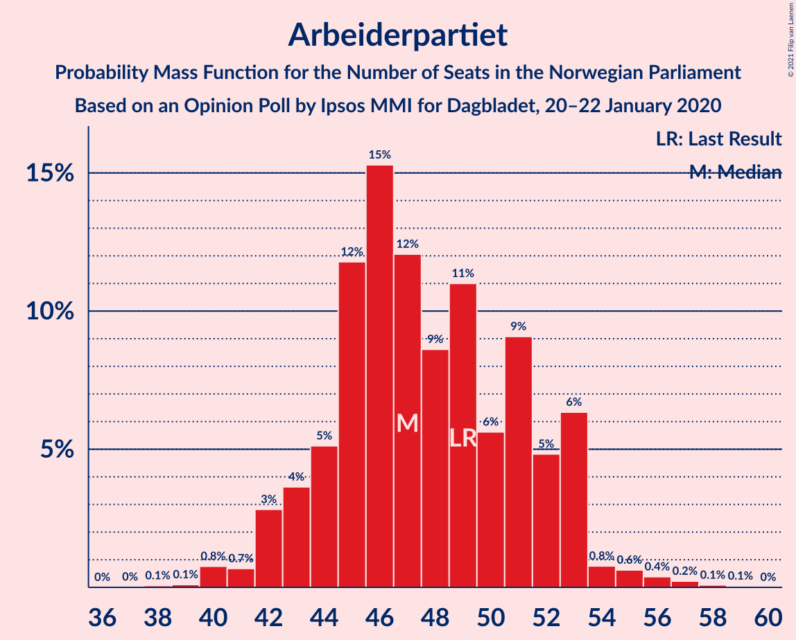
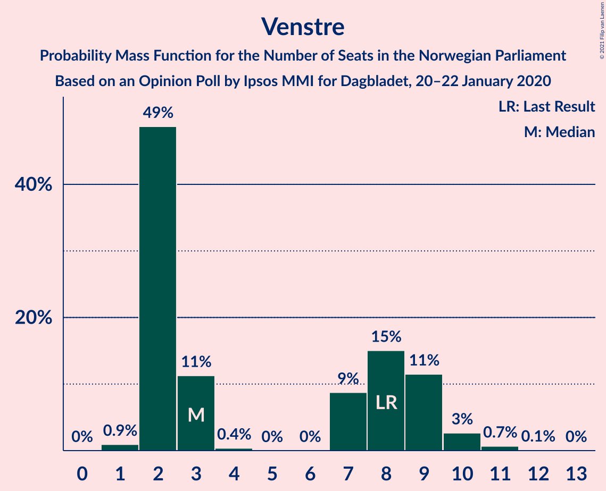
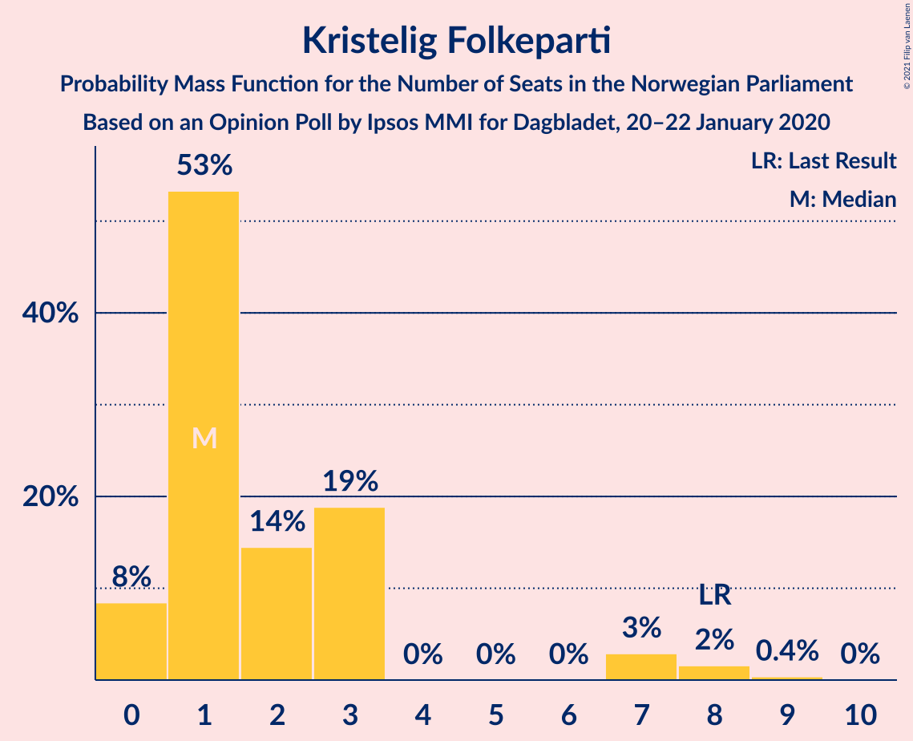
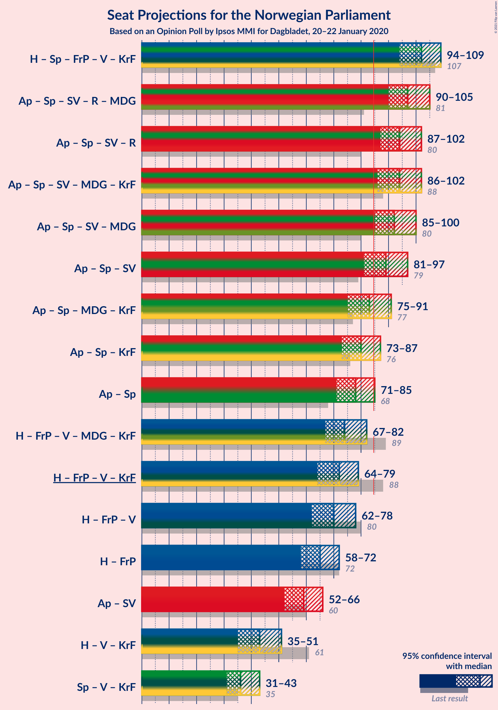
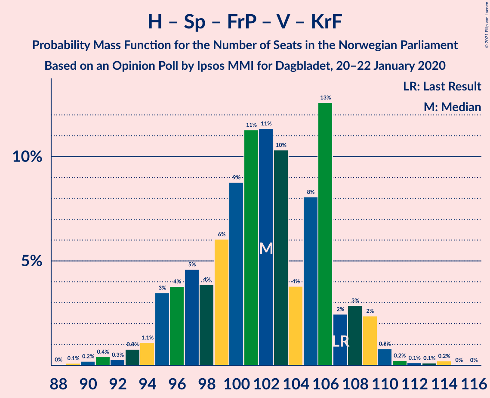
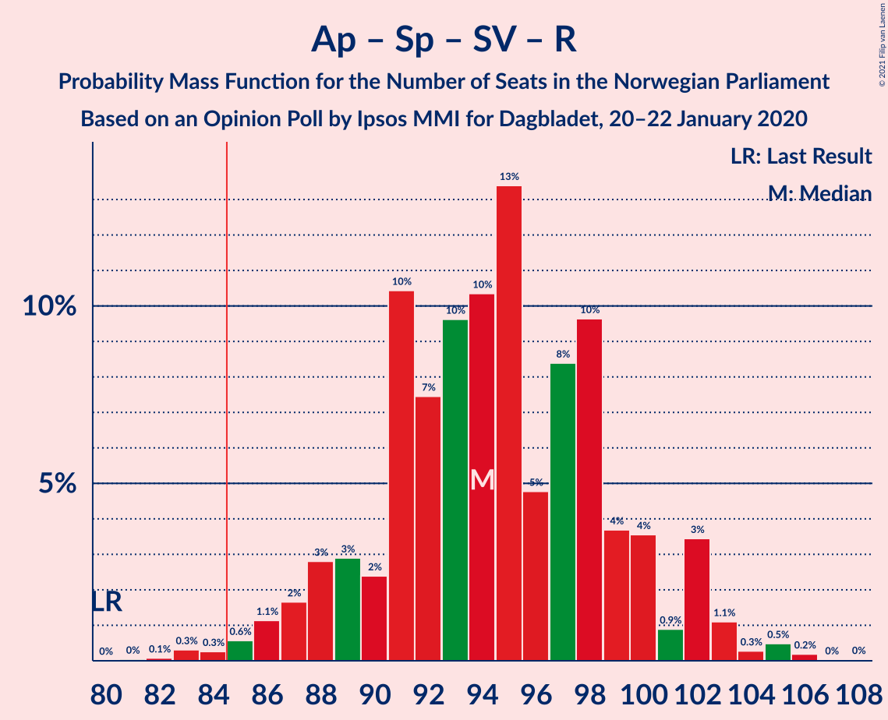
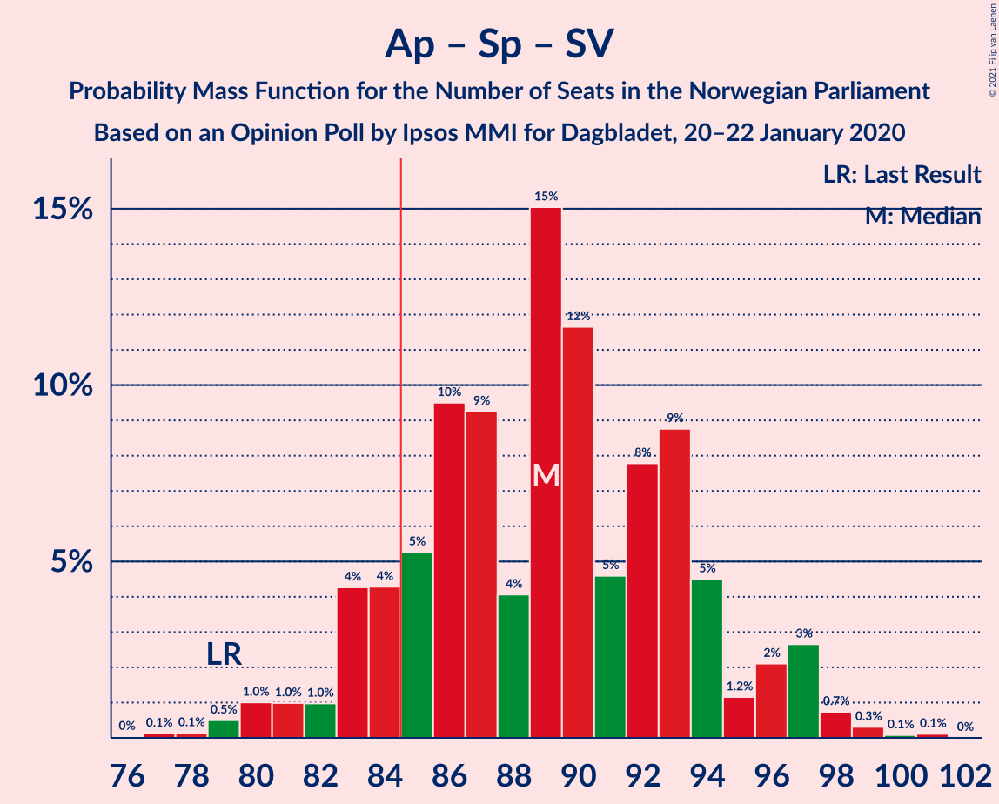
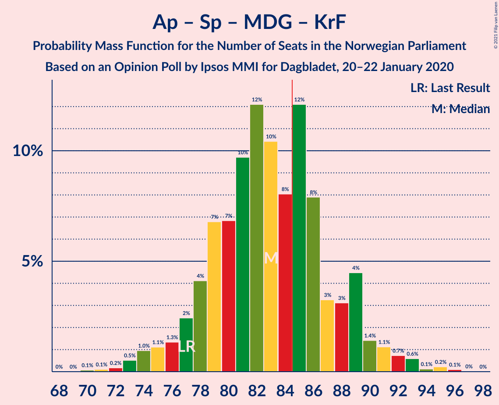
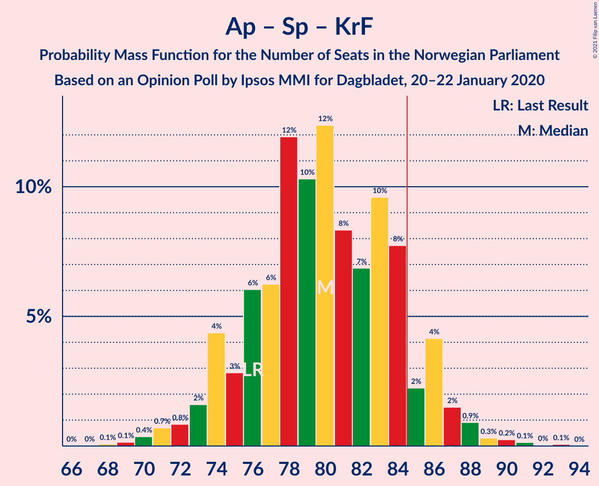

# Opinion Poll by Ipsos MMI for Dagbladet, 20–22 January 2020

<a href="#voting-intentions">Voting Intentions</a> | <a href="#seats">Seats</a> | <a href="#coalitions">Coalitions</a> | <a href="#technical-information">Technical Information</a>

## Voting Intentions

### Confidence Intervals

| Party | Last Result | Poll Result | 80% Confidence Interval | 90% Confidence Interval | 95% Confidence Interval | 99% Confidence Interval |
|:-----:|:-----------:|:-----------:|:-----------------------:|:-----------------------:|:-----------------------:|:-----------------------:|
| Arbeiderpartiet | 27.4% | 25.9% | 24.0–28.1% |23.4–28.7% |22.9–29.2% |22.0–30.2% |
| Høyre | 25.0% | 19.7% | 17.9–21.6% |17.4–22.2% |17.0–22.7% |16.2–23.6% |
| Senterpartiet | 10.3% | 16.4% | 14.7–18.2% |14.3–18.7% |13.9–19.2% |13.1–20.1% |
| Fremskrittspartiet | 15.2% | 15.7% | 14.1–17.5% |13.6–18.0% |13.3–18.5% |12.5–19.4% |
| Sosialistisk Venstreparti | 6.0% | 5.9% | 4.9–7.1% |4.6–7.5% |4.4–7.8% |4.0–8.4% |
| Rødt | 2.4% | 4.1% | 3.3–5.2% |3.1–5.5% |2.9–5.8% |2.6–6.4% |
| Venstre | 4.4% | 3.7% | 3.0–4.8% |2.8–5.1% |2.6–5.3% |2.3–5.9% |
| Miljøpartiet De Grønne | 3.2% | 3.5% | 2.7–4.5% |2.5–4.8% |2.4–5.0% |2.1–5.6% |
| Kristelig Folkeparti | 4.2% | 2.8% | 2.1–3.7% |2.0–4.0% |1.8–4.2% |1.6–4.7% |

*Note:* The poll result column reflects the actual value used in the calculations. Published results may vary slightly, and in addition be rounded to fewer digits.

## Seats

### Confidence Intervals

| Party | Last Result | Median | 80% Confidence Interval | 90% Confidence Interval | 95% Confidence Interval | 99% Confidence Interval |
|:-----:|:-----------:|:------:|:-----------------------:|:-----------------------:|:-----------------------:|:-----------------------:|
| <a href="#arbeiderpartiet">Arbeiderpartiet</a> | 49 | 47 | 44–52 |43–53 |42–53 |40–56 |
| <a href="#høyre">Høyre</a> | 45 | 36 | 32–41 |31–41 |31–42 |29–43 |
| <a href="#senterpartiet">Senterpartiet</a> | 19 | 30 | 28–33 |27–34 |26–34 |24–37 |
| <a href="#fremskrittspartiet">Fremskrittspartiet</a> | 27 | 29 | 25–31 |25–33 |24–33 |23–35 |
| <a href="#sosialistisk-venstreparti">Sosialistisk Venstreparti</a> | 11 | 11 | 9–13 |8–14 |8–14 |3–15 |
| <a href="#rødt">Rødt</a> | 1 | 7 | 2–9 |2–10 |2–10 |1–11 |
| <a href="#venstre">Venstre</a> | 8 | 3 | 2–9 |2–9 |2–10 |1–11 |
| <a href="#miljøpartiet-de-grønne">Miljøpartiet De Grønne</a> | 1 | 2 | 1–8 |1–8 |1–9 |1–10 |
| <a href="#kristelig-folkeparti">Kristelig Folkeparti</a> | 8 | 1 | 1–3 |0–3 |0–7 |0–8 |

### Arbeiderpartiet

*For a full overview of the results for this party, see the [Arbeiderpartiet](party-arbeiderpartiet.html) page.*

| Number of Seats | Probability | Accumulated | Special Marks |
|:---------------:|:-----------:|:-----------:|:-------------:|
| 38 | 0.1% | 100% |  |
| 39 | 0.1% | 99.9% |  |
| 40 | 0.8% | 99.8% |  |
| 41 | 0.7% | 99.1% |  |
| 42 | 3% | 98% |  |
| 43 | 4% | 96% |  |
| 44 | 5% | 92% |  |
| 45 | 12% | 87% |  |
| 46 | 15% | 75% |  |
| 47 | 12% | 60% | Median |
| 48 | 9% | 48% |  |
| 49 | 11% | 39% | Last Result |
| 50 | 6% | 28% |  |
| 51 | 9% | 22% |  |
| 52 | 5% | 13% |  |
| 53 | 6% | 8% |  |
| 54 | 0.8% | 2% |  |
| 55 | 0.6% | 1.4% |  |
| 56 | 0.4% | 0.8% |  |
| 57 | 0.2% | 0.4% |  |
| 58 | 0.1% | 0.1% |  |
| 59 | 0.1% | 0.1% |  |
| 60 | 0% | 0% |  |

### Høyre

*For a full overview of the results for this party, see the [Høyre](party-høyre.html) page.*

| Number of Seats | Probability | Accumulated | Special Marks |
|:---------------:|:-----------:|:-----------:|:-------------:|
| 27 | 0.1% | 100% |  |
| 28 | 0.1% | 99.9% |  |
| 29 | 0.5% | 99.8% |  |
| 30 | 1.0% | 99.3% |  |
| 31 | 4% | 98% |  |
| 32 | 7% | 95% |  |
| 33 | 7% | 88% |  |
| 34 | 17% | 81% |  |
| 35 | 6% | 64% |  |
| 36 | 11% | 58% | Median |
| 37 | 11% | 47% |  |
| 38 | 8% | 36% |  |
| 39 | 6% | 28% |  |
| 40 | 9% | 22% |  |
| 41 | 8% | 12% |  |
| 42 | 3% | 5% |  |
| 43 | 1.2% | 2% |  |
| 44 | 0.2% | 0.4% |  |
| 45 | 0.1% | 0.1% | Last Result |
| 46 | 0% | 0.1% |  |
| 47 | 0% | 0% |  |

### Senterpartiet

*For a full overview of the results for this party, see the [Senterpartiet](party-senterpartiet.html) page.*

| Number of Seats | Probability | Accumulated | Special Marks |
|:---------------:|:-----------:|:-----------:|:-------------:|
| 19 | 0% | 100% | Last Result |
| 20 | 0% | 100% |  |
| 21 | 0% | 100% |  |
| 22 | 0.1% | 100% |  |
| 23 | 0.2% | 99.9% |  |
| 24 | 0.8% | 99.6% |  |
| 25 | 1.2% | 98.8% |  |
| 26 | 2% | 98% |  |
| 27 | 5% | 96% |  |
| 28 | 7% | 91% |  |
| 29 | 14% | 84% |  |
| 30 | 21% | 70% | Median |
| 31 | 16% | 49% |  |
| 32 | 14% | 32% |  |
| 33 | 10% | 19% |  |
| 34 | 7% | 9% |  |
| 35 | 1.0% | 2% |  |
| 36 | 0.6% | 1.2% |  |
| 37 | 0.2% | 0.6% |  |
| 38 | 0.3% | 0.4% |  |
| 39 | 0% | 0.1% |  |
| 40 | 0% | 0.1% |  |
| 41 | 0% | 0% |  |

### Fremskrittspartiet

*For a full overview of the results for this party, see the [Fremskrittspartiet](party-fremskrittspartiet.html) page.*

| Number of Seats | Probability | Accumulated | Special Marks |
|:---------------:|:-----------:|:-----------:|:-------------:|
| 21 | 0.1% | 100% |  |
| 22 | 0.2% | 99.9% |  |
| 23 | 0.6% | 99.7% |  |
| 24 | 3% | 99.1% |  |
| 25 | 7% | 96% |  |
| 26 | 9% | 89% |  |
| 27 | 10% | 80% | Last Result |
| 28 | 10% | 70% |  |
| 29 | 17% | 60% | Median |
| 30 | 19% | 43% |  |
| 31 | 15% | 24% |  |
| 32 | 3% | 9% |  |
| 33 | 3% | 5% |  |
| 34 | 0.9% | 2% |  |
| 35 | 1.0% | 1.3% |  |
| 36 | 0.1% | 0.3% |  |
| 37 | 0.1% | 0.2% |  |
| 38 | 0% | 0% |  |

### Sosialistisk Venstreparti

*For a full overview of the results for this party, see the [Sosialistisk Venstreparti](party-sosialistiskvenstreparti.html) page.*

| Number of Seats | Probability | Accumulated | Special Marks |
|:---------------:|:-----------:|:-----------:|:-------------:|
| 2 | 0.5% | 100% |  |
| 3 | 0.3% | 99.5% |  |
| 4 | 0% | 99.2% |  |
| 5 | 0% | 99.2% |  |
| 6 | 0% | 99.2% |  |
| 7 | 0.6% | 99.2% |  |
| 8 | 5% | 98.6% |  |
| 9 | 12% | 94% |  |
| 10 | 27% | 82% |  |
| 11 | 20% | 55% | Last Result, Median |
| 12 | 18% | 35% |  |
| 13 | 10% | 17% |  |
| 14 | 6% | 7% |  |
| 15 | 0.8% | 1.1% |  |
| 16 | 0.2% | 0.3% |  |
| 17 | 0.1% | 0.1% |  |
| 18 | 0% | 0% |  |

### Rødt

*For a full overview of the results for this party, see the [Rødt](party-rødt.html) page.*

| Number of Seats | Probability | Accumulated | Special Marks |
|:---------------:|:-----------:|:-----------:|:-------------:|
| 1 | 1.3% | 100% | Last Result |
| 2 | 44% | 98.7% |  |
| 3 | 0% | 55% |  |
| 4 | 0% | 55% |  |
| 5 | 0% | 55% |  |
| 6 | 0% | 55% |  |
| 7 | 9% | 55% | Median |
| 8 | 29% | 46% |  |
| 9 | 9% | 16% |  |
| 10 | 5% | 7% |  |
| 11 | 1.5% | 2% |  |
| 12 | 0.3% | 0.4% |  |
| 13 | 0.1% | 0.1% |  |
| 14 | 0% | 0% |  |

### Venstre

*For a full overview of the results for this party, see the [Venstre](party-venstre.html) page.*

| Number of Seats | Probability | Accumulated | Special Marks |
|:---------------:|:-----------:|:-----------:|:-------------:|
| 1 | 0.9% | 100% |  |
| 2 | 49% | 99.1% |  |
| 3 | 11% | 50% | Median |
| 4 | 0.4% | 39% |  |
| 5 | 0% | 39% |  |
| 6 | 0% | 39% |  |
| 7 | 9% | 39% |  |
| 8 | 15% | 30% | Last Result |
| 9 | 11% | 15% |  |
| 10 | 3% | 3% |  |
| 11 | 0.7% | 0.8% |  |
| 12 | 0.1% | 0.1% |  |
| 13 | 0% | 0% |  |

### Miljøpartiet De Grønne

*For a full overview of the results for this party, see the [Miljøpartiet De Grønne](party-miljøpartietdegrønne.html) page.*

| Number of Seats | Probability | Accumulated | Special Marks |
|:---------------:|:-----------:|:-----------:|:-------------:|
| 0 | 0.1% | 100% |  |
| 1 | 18% | 99.9% | Last Result |
| 2 | 46% | 82% | Median |
| 3 | 19% | 36% |  |
| 4 | 2% | 18% |  |
| 5 | 0% | 16% |  |
| 6 | 0% | 16% |  |
| 7 | 3% | 16% |  |
| 8 | 8% | 13% |  |
| 9 | 3% | 5% |  |
| 10 | 1.2% | 1.3% |  |
| 11 | 0.1% | 0.1% |  |
| 12 | 0% | 0% |  |

### Kristelig Folkeparti

*For a full overview of the results for this party, see the [Kristelig Folkeparti](party-kristeligfolkeparti.html) page.*

| Number of Seats | Probability | Accumulated | Special Marks |
|:---------------:|:-----------:|:-----------:|:-------------:|
| 0 | 8% | 100% |  |
| 1 | 53% | 92% | Median |
| 2 | 14% | 38% |  |
| 3 | 19% | 24% |  |
| 4 | 0% | 5% |  |
| 5 | 0% | 5% |  |
| 6 | 0% | 5% |  |
| 7 | 3% | 5% |  |
| 8 | 2% | 2% | Last Result |
| 9 | 0.4% | 0.4% |  |
| 10 | 0% | 0% |  |

## Coalitions

### Confidence Intervals

| Coalition | Last Result | Median | Majority? | 80% Confidence Interval | 90% Confidence Interval | 95% Confidence Interval | 99% Confidence Interval |
|:---------:|:-----------:|:------:|:---------:|:-----------------------:|:-----------------------:|:-----------------------:|:-----------------------:|
| Høyre – Senterpartiet – Fremskrittspartiet – Venstre – Kristelig Folkeparti | 107 | 102 | 100% | 96–106 | 95–108 | 94–109 | 91–111 |
| Arbeiderpartiet – Senterpartiet – Sosialistisk Venstreparti – Rødt – Miljøpartiet De Grønne | 81 | 97 | 99.9% | 93–103 | 91–105 | 90–105 | 87–107 |
| Arbeiderpartiet – Senterpartiet – Sosialistisk Venstreparti – Rødt | 80 | 94 | 99.3% | 90–100 | 88–102 | 87–102 | 84–105 |
| Arbeiderpartiet – Senterpartiet – Sosialistisk Venstreparti – Miljøpartiet De Grønne – Kristelig Folkeparti | 88 | 94 | 99.0% | 89–99 | 87–100 | 86–102 | 83–104 |
| Arbeiderpartiet – Senterpartiet – Sosialistisk Venstreparti – Miljøpartiet De Grønne | 80 | 92 | 98% | 87–97 | 86–98 | 85–100 | 82–102 |
| Arbeiderpartiet – Senterpartiet – Sosialistisk Venstreparti | 79 | 89 | 88% | 84–94 | 83–96 | 81–97 | 79–99 |
| Arbeiderpartiet – Senterpartiet – Miljøpartiet De Grønne – Kristelig Folkeparti | 77 | 83 | 35% | 78–88 | 77–89 | 75–91 | 73–93 |
| Arbeiderpartiet – Senterpartiet – Kristelig Folkeparti | 76 | 80 | 10% | 75–84 | 74–86 | 73–87 | 70–90 |
| Arbeiderpartiet – Senterpartiet | 68 | 78 | 3% | 74–83 | 72–84 | 71–85 | 68–87 |
| Høyre – Fremskrittspartiet – Venstre – Miljøpartiet De Grønne – Kristelig Folkeparti | 89 | 74 | 0.7% | 69–79 | 67–81 | 67–82 | 64–85 |
| Høyre – Fremskrittspartiet – Venstre – Kristelig Folkeparti | 88 | 72 | 0.1% | 66–76 | 64–78 | 64–79 | 62–82 |
| Høyre – Fremskrittspartiet – Venstre | 80 | 70 | 0% | 64–75 | 62–76 | 62–78 | 60–81 |
| Høyre – Fremskrittspartiet | 72 | 65 | 0% | 60–70 | 59–72 | 58–72 | 56–74 |
| Arbeiderpartiet – Sosialistisk Venstreparti | 60 | 59 | 0% | 54–64 | 53–64 | 52–66 | 50–67 |
| Høyre – Venstre – Kristelig Folkeparti | 61 | 43 | 0% | 38–47 | 36–49 | 35–51 | 34–53 |
| Senterpartiet – Venstre – Kristelig Folkeparti | 35 | 36 | 0% | 32–42 | 31–43 | 31–43 | 28–47 |

### Høyre – Senterpartiet – Fremskrittspartiet – Venstre – Kristelig Folkeparti

| Number of Seats | Probability | Accumulated | Special Marks |
|:---------------:|:-----------:|:-----------:|:-------------:|
| 88 | 0% | 100% |  |
| 89 | 0.1% | 99.9% |  |
| 90 | 0.2% | 99.8% |  |
| 91 | 0.4% | 99.6% |  |
| 92 | 0.3% | 99.2% |  |
| 93 | 0.8% | 99.0% |  |
| 94 | 1.1% | 98% |  |
| 95 | 3% | 97% |  |
| 96 | 4% | 94% |  |
| 97 | 5% | 90% |  |
| 98 | 4% | 85% |  |
| 99 | 6% | 81% | Median |
| 100 | 9% | 75% |  |
| 101 | 11% | 67% |  |
| 102 | 11% | 55% |  |
| 103 | 10% | 44% |  |
| 104 | 4% | 34% |  |
| 105 | 8% | 30% |  |
| 106 | 13% | 22% |  |
| 107 | 2% | 9% | Last Result |
| 108 | 3% | 7% |  |
| 109 | 2% | 4% |  |
| 110 | 0.8% | 2% |  |
| 111 | 0.2% | 0.7% |  |
| 112 | 0.1% | 0.5% |  |
| 113 | 0.1% | 0.4% |  |
| 114 | 0.2% | 0.2% |  |
| 115 | 0% | 0% |  |

### Arbeiderpartiet – Senterpartiet – Sosialistisk Venstreparti – Rødt – Miljøpartiet De Grønne

| Number of Seats | Probability | Accumulated | Special Marks |
|:---------------:|:-----------:|:-----------:|:-------------:|
| 81 | 0% | 100% | Last Result |
| 82 | 0% | 100% |  |
| 83 | 0% | 100% |  |
| 84 | 0.1% | 100% |  |
| 85 | 0.1% | 99.9% | Majority |
| 86 | 0.1% | 99.8% |  |
| 87 | 0.3% | 99.7% |  |
| 88 | 1.1% | 99.4% |  |
| 89 | 0.6% | 98% |  |
| 90 | 2% | 98% |  |
| 91 | 1.3% | 95% |  |
| 92 | 2% | 94% |  |
| 93 | 8% | 92% |  |
| 94 | 7% | 84% |  |
| 95 | 9% | 77% |  |
| 96 | 7% | 68% |  |
| 97 | 12% | 61% | Median |
| 98 | 9% | 49% |  |
| 99 | 7% | 40% |  |
| 100 | 13% | 32% |  |
| 101 | 4% | 19% |  |
| 102 | 4% | 15% |  |
| 103 | 4% | 12% |  |
| 104 | 1.4% | 8% |  |
| 105 | 5% | 7% |  |
| 106 | 0.7% | 2% |  |
| 107 | 0.6% | 1.1% |  |
| 108 | 0.3% | 0.5% |  |
| 109 | 0.1% | 0.2% |  |
| 110 | 0.1% | 0.1% |  |
| 111 | 0% | 0% |  |

### Arbeiderpartiet – Senterpartiet – Sosialistisk Venstreparti – Rødt

| Number of Seats | Probability | Accumulated | Special Marks |
|:---------------:|:-----------:|:-----------:|:-------------:|
| 80 | 0% | 100% | Last Result |
| 81 | 0% | 100% |  |
| 82 | 0.1% | 99.9% |  |
| 83 | 0.3% | 99.8% |  |
| 84 | 0.3% | 99.5% |  |
| 85 | 0.6% | 99.3% | Majority |
| 86 | 1.1% | 98.7% |  |
| 87 | 2% | 98% |  |
| 88 | 3% | 96% |  |
| 89 | 3% | 93% |  |
| 90 | 2% | 90% |  |
| 91 | 10% | 88% |  |
| 92 | 7% | 77% |  |
| 93 | 10% | 70% |  |
| 94 | 10% | 60% |  |
| 95 | 13% | 50% | Median |
| 96 | 5% | 37% |  |
| 97 | 8% | 32% |  |
| 98 | 10% | 23% |  |
| 99 | 4% | 14% |  |
| 100 | 4% | 10% |  |
| 101 | 0.9% | 6% |  |
| 102 | 3% | 6% |  |
| 103 | 1.1% | 2% |  |
| 104 | 0.3% | 1.0% |  |
| 105 | 0.5% | 0.8% |  |
| 106 | 0.2% | 0.3% |  |
| 107 | 0% | 0.1% |  |
| 108 | 0% | 0% |  |

### Arbeiderpartiet – Senterpartiet – Sosialistisk Venstreparti – Miljøpartiet De Grønne – Kristelig Folkeparti

| Number of Seats | Probability | Accumulated | Special Marks |
|:---------------:|:-----------:|:-----------:|:-------------:|
| 81 | 0.1% | 100% |  |
| 82 | 0.1% | 99.9% |  |
| 83 | 0.3% | 99.8% |  |
| 84 | 0.5% | 99.5% |  |
| 85 | 0.6% | 99.0% | Majority |
| 86 | 2% | 98% |  |
| 87 | 2% | 97% |  |
| 88 | 3% | 95% | Last Result |
| 89 | 8% | 92% |  |
| 90 | 5% | 84% |  |
| 91 | 6% | 79% | Median |
| 92 | 7% | 72% |  |
| 93 | 11% | 65% |  |
| 94 | 14% | 54% |  |
| 95 | 7% | 40% |  |
| 96 | 7% | 33% |  |
| 97 | 7% | 26% |  |
| 98 | 5% | 19% |  |
| 99 | 8% | 14% |  |
| 100 | 2% | 6% |  |
| 101 | 2% | 5% |  |
| 102 | 1.2% | 3% |  |
| 103 | 0.8% | 2% |  |
| 104 | 0.3% | 0.8% |  |
| 105 | 0.3% | 0.5% |  |
| 106 | 0.1% | 0.2% |  |
| 107 | 0.1% | 0.1% |  |
| 108 | 0% | 0% |  |

### Arbeiderpartiet – Senterpartiet – Sosialistisk Venstreparti – Miljøpartiet De Grønne

| Number of Seats | Probability | Accumulated | Special Marks |
|:---------------:|:-----------:|:-----------:|:-------------:|
| 79 | 0.1% | 100% |  |
| 80 | 0.1% | 99.9% | Last Result |
| 81 | 0.1% | 99.8% |  |
| 82 | 0.7% | 99.7% |  |
| 83 | 0.5% | 98.9% |  |
| 84 | 0.6% | 98% |  |
| 85 | 2% | 98% | Majority |
| 86 | 4% | 96% |  |
| 87 | 4% | 92% |  |
| 88 | 9% | 88% |  |
| 89 | 6% | 79% |  |
| 90 | 6% | 73% | Median |
| 91 | 12% | 67% |  |
| 92 | 14% | 55% |  |
| 93 | 6% | 41% |  |
| 94 | 6% | 35% |  |
| 95 | 9% | 29% |  |
| 96 | 6% | 21% |  |
| 97 | 5% | 14% |  |
| 98 | 4% | 9% |  |
| 99 | 1.3% | 5% |  |
| 100 | 2% | 3% |  |
| 101 | 0.8% | 2% |  |
| 102 | 0.4% | 0.9% |  |
| 103 | 0.2% | 0.5% |  |
| 104 | 0.1% | 0.3% |  |
| 105 | 0.1% | 0.1% |  |
| 106 | 0.1% | 0.1% |  |
| 107 | 0% | 0% |  |

### Arbeiderpartiet – Senterpartiet – Sosialistisk Venstreparti

| Number of Seats | Probability | Accumulated | Special Marks |
|:---------------:|:-----------:|:-----------:|:-------------:|
| 76 | 0% | 100% |  |
| 77 | 0.1% | 99.9% |  |
| 78 | 0.1% | 99.8% |  |
| 79 | 0.5% | 99.7% | Last Result |
| 80 | 1.0% | 99.2% |  |
| 81 | 1.0% | 98% |  |
| 82 | 1.0% | 97% |  |
| 83 | 4% | 96% |  |
| 84 | 4% | 92% |  |
| 85 | 5% | 88% | Majority |
| 86 | 10% | 82% |  |
| 87 | 9% | 73% |  |
| 88 | 4% | 64% | Median |
| 89 | 15% | 60% |  |
| 90 | 12% | 44% |  |
| 91 | 5% | 33% |  |
| 92 | 8% | 28% |  |
| 93 | 9% | 20% |  |
| 94 | 5% | 12% |  |
| 95 | 1.2% | 7% |  |
| 96 | 2% | 6% |  |
| 97 | 3% | 4% |  |
| 98 | 0.7% | 1.3% |  |
| 99 | 0.3% | 0.5% |  |
| 100 | 0.1% | 0.2% |  |
| 101 | 0.1% | 0.1% |  |
| 102 | 0% | 0% |  |

### Arbeiderpartiet – Senterpartiet – Miljøpartiet De Grønne – Kristelig Folkeparti

| Number of Seats | Probability | Accumulated | Special Marks |
|:---------------:|:-----------:|:-----------:|:-------------:|
| 70 | 0.1% | 100% |  |
| 71 | 0.1% | 99.9% |  |
| 72 | 0.2% | 99.8% |  |
| 73 | 0.5% | 99.6% |  |
| 74 | 1.0% | 99.1% |  |
| 75 | 1.1% | 98% |  |
| 76 | 1.3% | 97% |  |
| 77 | 2% | 96% | Last Result |
| 78 | 4% | 93% |  |
| 79 | 7% | 89% |  |
| 80 | 7% | 82% | Median |
| 81 | 10% | 76% |  |
| 82 | 12% | 66% |  |
| 83 | 10% | 54% |  |
| 84 | 8% | 43% |  |
| 85 | 12% | 35% | Majority |
| 86 | 8% | 23% |  |
| 87 | 3% | 15% |  |
| 88 | 3% | 12% |  |
| 89 | 4% | 9% |  |
| 90 | 1.4% | 4% |  |
| 91 | 1.1% | 3% |  |
| 92 | 0.7% | 2% |  |
| 93 | 0.6% | 1.1% |  |
| 94 | 0.1% | 0.5% |  |
| 95 | 0.2% | 0.4% |  |
| 96 | 0.1% | 0.1% |  |
| 97 | 0% | 0% |  |

### Arbeiderpartiet – Senterpartiet – Kristelig Folkeparti

| Number of Seats | Probability | Accumulated | Special Marks |
|:---------------:|:-----------:|:-----------:|:-------------:|
| 68 | 0.1% | 100% |  |
| 69 | 0.1% | 99.9% |  |
| 70 | 0.4% | 99.7% |  |
| 71 | 0.7% | 99.4% |  |
| 72 | 0.8% | 98.7% |  |
| 73 | 2% | 98% |  |
| 74 | 4% | 96% |  |
| 75 | 3% | 92% |  |
| 76 | 6% | 89% | Last Result |
| 77 | 6% | 83% |  |
| 78 | 12% | 77% | Median |
| 79 | 10% | 65% |  |
| 80 | 12% | 55% |  |
| 81 | 8% | 42% |  |
| 82 | 7% | 34% |  |
| 83 | 10% | 27% |  |
| 84 | 8% | 17% |  |
| 85 | 2% | 10% | Majority |
| 86 | 4% | 7% |  |
| 87 | 2% | 3% |  |
| 88 | 0.9% | 2% |  |
| 89 | 0.3% | 0.8% |  |
| 90 | 0.2% | 0.5% |  |
| 91 | 0.1% | 0.3% |  |
| 92 | 0% | 0.1% |  |
| 93 | 0.1% | 0.1% |  |
| 94 | 0% | 0% |  |

### Arbeiderpartiet – Senterpartiet

| Number of Seats | Probability | Accumulated | Special Marks |
|:---------------:|:-----------:|:-----------:|:-------------:|
| 66 | 0% | 100% |  |
| 67 | 0.1% | 99.9% |  |
| 68 | 0.4% | 99.8% | Last Result |
| 69 | 0.7% | 99.5% |  |
| 70 | 0.7% | 98.8% |  |
| 71 | 1.3% | 98% |  |
| 72 | 2% | 97% |  |
| 73 | 4% | 94% |  |
| 74 | 5% | 90% |  |
| 75 | 7% | 86% |  |
| 76 | 8% | 78% |  |
| 77 | 17% | 71% | Median |
| 78 | 9% | 54% |  |
| 79 | 10% | 45% |  |
| 80 | 9% | 35% |  |
| 81 | 6% | 26% |  |
| 82 | 6% | 20% |  |
| 83 | 7% | 14% |  |
| 84 | 3% | 7% |  |
| 85 | 1.2% | 3% | Majority |
| 86 | 1.4% | 2% |  |
| 87 | 0.3% | 0.7% |  |
| 88 | 0.2% | 0.4% |  |
| 89 | 0.1% | 0.2% |  |
| 90 | 0% | 0.1% |  |
| 91 | 0.1% | 0.1% |  |
| 92 | 0% | 0% |  |

### Høyre – Fremskrittspartiet – Venstre – Miljøpartiet De Grønne – Kristelig Folkeparti

| Number of Seats | Probability | Accumulated | Special Marks |
|:---------------:|:-----------:|:-----------:|:-------------:|
| 61 | 0% | 100% |  |
| 62 | 0% | 99.9% |  |
| 63 | 0.2% | 99.9% |  |
| 64 | 0.5% | 99.7% |  |
| 65 | 0.3% | 99.2% |  |
| 66 | 1.1% | 98.9% |  |
| 67 | 3% | 98% |  |
| 68 | 0.9% | 94% |  |
| 69 | 4% | 93% |  |
| 70 | 4% | 90% |  |
| 71 | 10% | 86% | Median |
| 72 | 8% | 76% |  |
| 73 | 5% | 68% |  |
| 74 | 13% | 63% |  |
| 75 | 10% | 50% |  |
| 76 | 10% | 39% |  |
| 77 | 7% | 30% |  |
| 78 | 10% | 22% |  |
| 79 | 2% | 12% |  |
| 80 | 3% | 10% |  |
| 81 | 3% | 7% |  |
| 82 | 2% | 4% |  |
| 83 | 1.1% | 2% |  |
| 84 | 0.5% | 1.2% |  |
| 85 | 0.2% | 0.7% | Majority |
| 86 | 0.3% | 0.5% |  |
| 87 | 0.1% | 0.2% |  |
| 88 | 0% | 0.1% |  |
| 89 | 0% | 0% | Last Result |

### Høyre – Fremskrittspartiet – Venstre – Kristelig Folkeparti

| Number of Seats | Probability | Accumulated | Special Marks |
|:---------------:|:-----------:|:-----------:|:-------------:|
| 59 | 0.1% | 100% |  |
| 60 | 0.1% | 99.9% |  |
| 61 | 0.3% | 99.8% |  |
| 62 | 0.6% | 99.5% |  |
| 63 | 0.8% | 98.9% |  |
| 64 | 5% | 98% |  |
| 65 | 1.5% | 93% |  |
| 66 | 4% | 92% |  |
| 67 | 4% | 88% |  |
| 68 | 4% | 84% |  |
| 69 | 13% | 81% | Median |
| 70 | 8% | 67% |  |
| 71 | 9% | 60% |  |
| 72 | 12% | 51% |  |
| 73 | 7% | 39% |  |
| 74 | 9% | 32% |  |
| 75 | 7% | 23% |  |
| 76 | 8% | 15% |  |
| 77 | 2% | 7% |  |
| 78 | 1.2% | 6% |  |
| 79 | 2% | 4% |  |
| 80 | 0.5% | 2% |  |
| 81 | 1.0% | 2% |  |
| 82 | 0.3% | 0.5% |  |
| 83 | 0.1% | 0.2% |  |
| 84 | 0.1% | 0.2% |  |
| 85 | 0.1% | 0.1% | Majority |
| 86 | 0% | 0% |  |
| 87 | 0% | 0% |  |
| 88 | 0% | 0% | Last Result |

### Høyre – Fremskrittspartiet – Venstre

| Number of Seats | Probability | Accumulated | Special Marks |
|:---------------:|:-----------:|:-----------:|:-------------:|
| 57 | 0.1% | 100% |  |
| 58 | 0.1% | 99.9% |  |
| 59 | 0.3% | 99.8% |  |
| 60 | 0.4% | 99.6% |  |
| 61 | 1.3% | 99.2% |  |
| 62 | 3% | 98% |  |
| 63 | 2% | 94% |  |
| 64 | 2% | 92% |  |
| 65 | 5% | 90% |  |
| 66 | 5% | 85% |  |
| 67 | 8% | 80% |  |
| 68 | 12% | 72% | Median |
| 69 | 9% | 60% |  |
| 70 | 9% | 52% |  |
| 71 | 10% | 43% |  |
| 72 | 6% | 33% |  |
| 73 | 12% | 26% |  |
| 74 | 4% | 15% |  |
| 75 | 4% | 11% |  |
| 76 | 1.3% | 6% |  |
| 77 | 1.3% | 5% |  |
| 78 | 2% | 4% |  |
| 79 | 0.6% | 2% |  |
| 80 | 0.4% | 1.0% | Last Result |
| 81 | 0.5% | 0.7% |  |
| 82 | 0.1% | 0.2% |  |
| 83 | 0.1% | 0.1% |  |
| 84 | 0% | 0% |  |

### Høyre – Fremskrittspartiet

| Number of Seats | Probability | Accumulated | Special Marks |
|:---------------:|:-----------:|:-----------:|:-------------:|
| 53 | 0% | 100% |  |
| 54 | 0.1% | 99.9% |  |
| 55 | 0.2% | 99.9% |  |
| 56 | 0.5% | 99.7% |  |
| 57 | 0.9% | 99.2% |  |
| 58 | 3% | 98% |  |
| 59 | 2% | 95% |  |
| 60 | 7% | 93% |  |
| 61 | 9% | 86% |  |
| 62 | 6% | 77% |  |
| 63 | 8% | 71% |  |
| 64 | 10% | 63% |  |
| 65 | 6% | 53% | Median |
| 66 | 7% | 47% |  |
| 67 | 8% | 39% |  |
| 68 | 7% | 31% |  |
| 69 | 5% | 24% |  |
| 70 | 9% | 19% |  |
| 71 | 4% | 9% |  |
| 72 | 4% | 6% | Last Result |
| 73 | 1.2% | 2% |  |
| 74 | 0.3% | 0.5% |  |
| 75 | 0.1% | 0.3% |  |
| 76 | 0.1% | 0.2% |  |
| 77 | 0.1% | 0.1% |  |
| 78 | 0% | 0% |  |

### Arbeiderpartiet – Sosialistisk Venstreparti

| Number of Seats | Probability | Accumulated | Special Marks |
|:---------------:|:-----------:|:-----------:|:-------------:|
| 46 | 0.1% | 100% |  |
| 47 | 0% | 99.9% |  |
| 48 | 0.1% | 99.9% |  |
| 49 | 0.2% | 99.8% |  |
| 50 | 0.4% | 99.7% |  |
| 51 | 1.4% | 99.3% |  |
| 52 | 2% | 98% |  |
| 53 | 3% | 96% |  |
| 54 | 3% | 93% |  |
| 55 | 11% | 89% |  |
| 56 | 10% | 78% |  |
| 57 | 8% | 68% |  |
| 58 | 10% | 61% | Median |
| 59 | 15% | 51% |  |
| 60 | 5% | 36% | Last Result |
| 61 | 12% | 31% |  |
| 62 | 4% | 19% |  |
| 63 | 4% | 15% |  |
| 64 | 7% | 11% |  |
| 65 | 2% | 5% |  |
| 66 | 2% | 3% |  |
| 67 | 0.5% | 0.9% |  |
| 68 | 0.1% | 0.5% |  |
| 69 | 0.3% | 0.3% |  |
| 70 | 0.1% | 0.1% |  |
| 71 | 0% | 0% |  |

### Høyre – Venstre – Kristelig Folkeparti

| Number of Seats | Probability | Accumulated | Special Marks |
|:---------------:|:-----------:|:-----------:|:-------------:|
| 32 | 0.1% | 100% |  |
| 33 | 0.3% | 99.8% |  |
| 34 | 0.7% | 99.5% |  |
| 35 | 2% | 98.8% |  |
| 36 | 2% | 97% |  |
| 37 | 2% | 95% |  |
| 38 | 7% | 93% |  |
| 39 | 5% | 86% |  |
| 40 | 10% | 81% | Median |
| 41 | 7% | 71% |  |
| 42 | 10% | 64% |  |
| 43 | 12% | 54% |  |
| 44 | 12% | 42% |  |
| 45 | 9% | 29% |  |
| 46 | 11% | 21% |  |
| 47 | 2% | 10% |  |
| 48 | 2% | 8% |  |
| 49 | 2% | 6% |  |
| 50 | 0.7% | 4% |  |
| 51 | 2% | 3% |  |
| 52 | 0.6% | 1.2% |  |
| 53 | 0.4% | 0.6% |  |
| 54 | 0.1% | 0.2% |  |
| 55 | 0.1% | 0.2% |  |
| 56 | 0% | 0.1% |  |
| 57 | 0% | 0% |  |
| 58 | 0% | 0% |  |
| 59 | 0% | 0% |  |
| 60 | 0% | 0% |  |
| 61 | 0% | 0% | Last Result |

### Senterpartiet – Venstre – Kristelig Folkeparti

| Number of Seats | Probability | Accumulated | Special Marks |
|:---------------:|:-----------:|:-----------:|:-------------:|
| 26 | 0.1% | 100% |  |
| 27 | 0.2% | 99.9% |  |
| 28 | 0.4% | 99.7% |  |
| 29 | 0.5% | 99.3% |  |
| 30 | 1.3% | 98.8% |  |
| 31 | 3% | 98% |  |
| 32 | 8% | 95% |  |
| 33 | 6% | 87% |  |
| 34 | 11% | 81% | Median |
| 35 | 9% | 70% | Last Result |
| 36 | 11% | 61% |  |
| 37 | 10% | 50% |  |
| 38 | 7% | 40% |  |
| 39 | 8% | 33% |  |
| 40 | 3% | 24% |  |
| 41 | 10% | 22% |  |
| 42 | 7% | 12% |  |
| 43 | 3% | 5% |  |
| 44 | 0.9% | 2% |  |
| 45 | 0.6% | 2% |  |
| 46 | 0.4% | 1.0% |  |
| 47 | 0.5% | 0.6% |  |
| 48 | 0.1% | 0.2% |  |
| 49 | 0% | 0% |  |

## Technical Information

### Opinion Poll

+ **Polling firm:** Ipsos MMI
+ **Commissioner(s):** Dagbladet
+ **Fieldwork period:** 20–22 January 2020

### Calculations

+ **Sample size:** 752
+ **Simulations done:** 1,048,576
+ **Error estimate:** 0.78%

