# Opinion Poll by Ipsos MMI for Dagbladet, 20–22 January 2020

<a href="#voting-intentions">Voting Intentions</a> | <a href="#seats">Seats</a> | <a href="#coalitions">Coalitions</a> | <a href="#technical-information">Technical Information</a>

## Voting Intentions

### Confidence Intervals

| Party | Last Result | Poll Result | 80% Confidence Interval | 90% Confidence Interval | 95% Confidence Interval | 99% Confidence Interval |
|:-----:|:-----------:|:-----------:|:-----------------------:|:-----------------------:|:-----------------------:|:-----------------------:|
| Arbeiderpartiet | 27.4% | 25.9% | 24.0–28.1% |23.4–28.7% |22.9–29.2% |22.0–30.2% |
| Høyre | 25.0% | 19.7% | 17.9–21.6% |17.4–22.2% |17.0–22.7% |16.2–23.6% |
| Senterpartiet | 10.3% | 16.4% | 14.7–18.2% |14.3–18.7% |13.9–19.2% |13.1–20.1% |
| Fremskrittspartiet | 15.2% | 15.7% | 14.1–17.5% |13.6–18.0% |13.3–18.5% |12.5–19.4% |
| Sosialistisk Venstreparti | 6.0% | 5.9% | 4.9–7.1% |4.6–7.5% |4.4–7.8% |4.0–8.4% |
| Rødt | 2.4% | 4.1% | 3.3–5.2% |3.1–5.5% |2.9–5.8% |2.6–6.4% |
| Venstre | 4.4% | 3.7% | 3.0–4.8% |2.8–5.1% |2.6–5.3% |2.3–5.9% |
| Miljøpartiet De Grønne | 3.2% | 3.5% | 2.7–4.5% |2.5–4.8% |2.4–5.0% |2.1–5.6% |
| Kristelig Folkeparti | 4.2% | 2.8% | 2.1–3.7% |2.0–4.0% |1.8–4.2% |1.6–4.7% |

*Note:* The poll result column reflects the actual value used in the calculations. Published results may vary slightly, and in addition be rounded to fewer digits.

## Seats

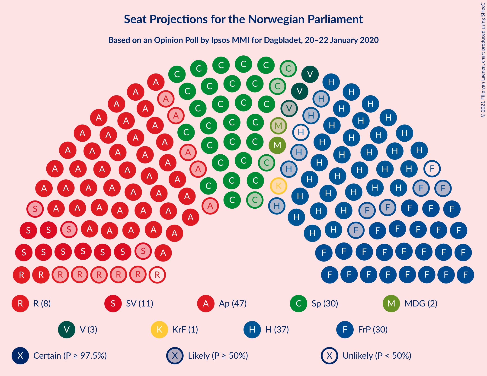

### Confidence Intervals

| Party | Last Result | Median | 80% Confidence Interval | 90% Confidence Interval | 95% Confidence Interval | 99% Confidence Interval |
|:-----:|:-----------:|:------:|:-----------------------:|:-----------------------:|:-----------------------:|:-----------------------:|
| <a href="#arbeiderpartiet">Arbeiderpartiet</a> | 49 | 49 | 43–53 |43–53 |42–53 |40–55 |
| <a href="#høyre">Høyre</a> | 45 | 35 | 32–39 |31–40 |31–41 |29–43 |
| <a href="#senterpartiet">Senterpartiet</a> | 19 | 30 | 27–32 |27–33 |26–35 |25–37 |
| <a href="#fremskrittspartiet">Fremskrittspartiet</a> | 27 | 30 | 26–33 |24–34 |24–36 |23–36 |
| <a href="#sosialistisk-venstreparti">Sosialistisk Venstreparti</a> | 11 | 10 | 9–13 |8–13 |8–14 |2–16 |
| <a href="#rødt">Rødt</a> | 1 | 2 | 2–10 |2–10 |2–10 |1–11 |
| <a href="#venstre">Venstre</a> | 8 | 2 | 2–8 |2–9 |1–9 |1–11 |
| <a href="#miljøpartiet-de-grønne">Miljøpartiet De Grønne</a> | 1 | 2 | 1–8 |1–9 |1–9 |1–9 |
| <a href="#kristelig-folkeparti">Kristelig Folkeparti</a> | 8 | 1 | 1–3 |0–3 |0–7 |0–9 |

### Arbeiderpartiet

*For a full overview of the results for this party, see the [Arbeiderpartiet](party-arbeiderpartiet.html) page.*

| Number of Seats | Probability | Accumulated | Special Marks |
|:---------------:|:-----------:|:-----------:|:-------------:|
| 39 | 0.1% | 100% |  |
| 40 | 0.3% | 99.8% |  |
| 41 | 0.5% | 99.5% |  |
| 42 | 2% | 99.0% |  |
| 43 | 9% | 97% |  |
| 44 | 9% | 87% |  |
| 45 | 2% | 79% |  |
| 46 | 5% | 76% |  |
| 47 | 7% | 71% |  |
| 48 | 10% | 65% |  |
| 49 | 28% | 54% | Last Result, Median |
| 50 | 0.3% | 26% |  |
| 51 | 5% | 26% |  |
| 52 | 4% | 21% |  |
| 53 | 15% | 17% |  |
| 54 | 2% | 2% |  |
| 55 | 0.3% | 0.6% |  |
| 56 | 0.2% | 0.3% |  |
| 57 | 0% | 0.1% |  |
| 58 | 0% | 0.1% |  |
| 59 | 0% | 0% |  |

### Høyre

*For a full overview of the results for this party, see the [Høyre](party-høyre.html) page.*

| Number of Seats | Probability | Accumulated | Special Marks |
|:---------------:|:-----------:|:-----------:|:-------------:|
| 27 | 0% | 100% |  |
| 28 | 0.1% | 99.9% |  |
| 29 | 0.7% | 99.8% |  |
| 30 | 1.5% | 99.2% |  |
| 31 | 7% | 98% |  |
| 32 | 4% | 91% |  |
| 33 | 12% | 87% |  |
| 34 | 9% | 75% |  |
| 35 | 21% | 65% | Median |
| 36 | 9% | 44% |  |
| 37 | 7% | 35% |  |
| 38 | 17% | 28% |  |
| 39 | 1.3% | 11% |  |
| 40 | 6% | 10% |  |
| 41 | 2% | 4% |  |
| 42 | 1.4% | 2% |  |
| 43 | 0.2% | 0.6% |  |
| 44 | 0.2% | 0.5% |  |
| 45 | 0.1% | 0.3% | Last Result |
| 46 | 0% | 0.1% |  |
| 47 | 0.1% | 0.1% |  |
| 48 | 0% | 0% |  |

### Senterpartiet

*For a full overview of the results for this party, see the [Senterpartiet](party-senterpartiet.html) page.*

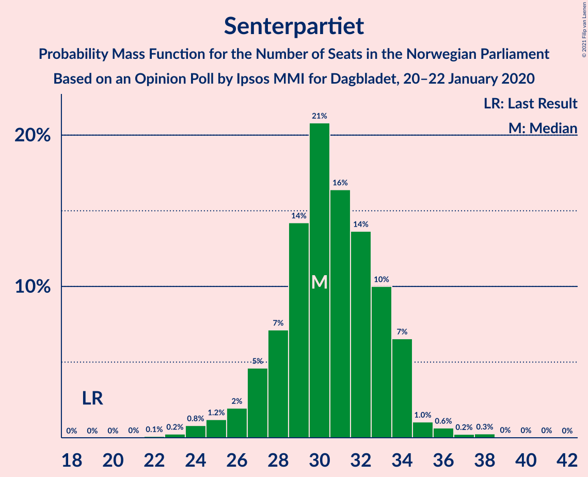

| Number of Seats | Probability | Accumulated | Special Marks |
|:---------------:|:-----------:|:-----------:|:-------------:|
| 19 | 0% | 100% | Last Result |
| 20 | 0% | 100% |  |
| 21 | 0% | 100% |  |
| 22 | 0.1% | 100% |  |
| 23 | 0.1% | 99.9% |  |
| 24 | 0.2% | 99.8% |  |
| 25 | 1.4% | 99.6% |  |
| 26 | 3% | 98% |  |
| 27 | 8% | 95% |  |
| 28 | 12% | 87% |  |
| 29 | 18% | 75% |  |
| 30 | 22% | 57% | Median |
| 31 | 14% | 35% |  |
| 32 | 15% | 20% |  |
| 33 | 2% | 6% |  |
| 34 | 0.3% | 4% |  |
| 35 | 2% | 3% |  |
| 36 | 0.8% | 2% |  |
| 37 | 0.4% | 0.9% |  |
| 38 | 0.3% | 0.5% |  |
| 39 | 0.1% | 0.1% |  |
| 40 | 0% | 0% |  |

### Fremskrittspartiet

*For a full overview of the results for this party, see the [Fremskrittspartiet](party-fremskrittspartiet.html) page.*

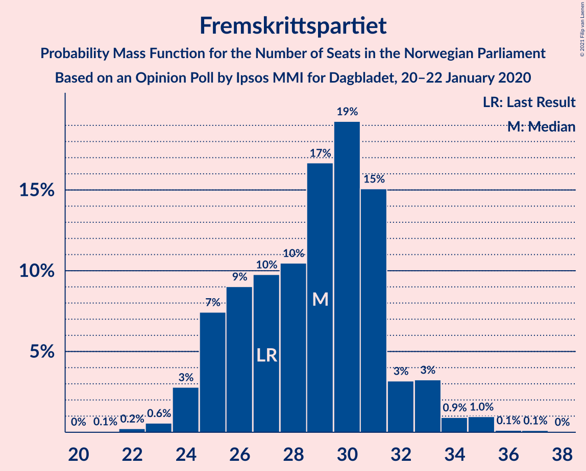

| Number of Seats | Probability | Accumulated | Special Marks |
|:---------------:|:-----------:|:-----------:|:-------------:|
| 20 | 0.1% | 100% |  |
| 21 | 0% | 99.9% |  |
| 22 | 0.2% | 99.9% |  |
| 23 | 1.1% | 99.7% |  |
| 24 | 4% | 98.5% |  |
| 25 | 3% | 95% |  |
| 26 | 4% | 91% |  |
| 27 | 5% | 87% | Last Result |
| 28 | 5% | 82% |  |
| 29 | 24% | 77% |  |
| 30 | 12% | 53% | Median |
| 31 | 19% | 41% |  |
| 32 | 3% | 22% |  |
| 33 | 11% | 19% |  |
| 34 | 4% | 8% |  |
| 35 | 0.3% | 4% |  |
| 36 | 3% | 4% |  |
| 37 | 0.4% | 0.4% |  |
| 38 | 0% | 0% |  |

### Sosialistisk Venstreparti

*For a full overview of the results for this party, see the [Sosialistisk Venstreparti](party-sosialistiskvenstreparti.html) page.*

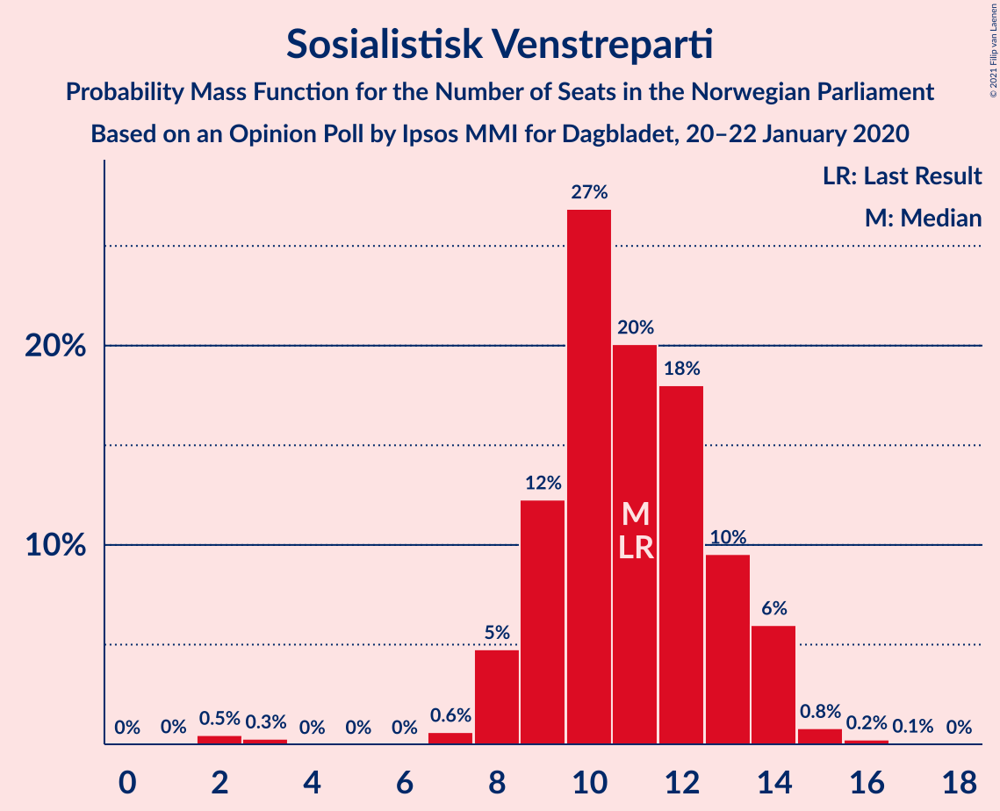

| Number of Seats | Probability | Accumulated | Special Marks |
|:---------------:|:-----------:|:-----------:|:-------------:|
| 2 | 1.4% | 100% |  |
| 3 | 0% | 98.6% |  |
| 4 | 0% | 98.6% |  |
| 5 | 0% | 98.6% |  |
| 6 | 0% | 98.6% |  |
| 7 | 0.4% | 98.6% |  |
| 8 | 8% | 98% |  |
| 9 | 16% | 90% |  |
| 10 | 28% | 75% | Median |
| 11 | 14% | 46% | Last Result |
| 12 | 14% | 32% |  |
| 13 | 13% | 18% |  |
| 14 | 3% | 4% |  |
| 15 | 0.3% | 0.9% |  |
| 16 | 0.5% | 0.6% |  |
| 17 | 0.1% | 0.2% |  |
| 18 | 0% | 0.1% |  |
| 19 | 0% | 0% |  |

### Rødt

*For a full overview of the results for this party, see the [Rødt](party-rødt.html) page.*

| Number of Seats | Probability | Accumulated | Special Marks |
|:---------------:|:-----------:|:-----------:|:-------------:|
| 1 | 2% | 100% | Last Result |
| 2 | 49% | 98% | Median |
| 3 | 0% | 49% |  |
| 4 | 0% | 49% |  |
| 5 | 0% | 49% |  |
| 6 | 0% | 49% |  |
| 7 | 9% | 49% |  |
| 8 | 22% | 40% |  |
| 9 | 7% | 18% |  |
| 10 | 9% | 11% |  |
| 11 | 2% | 2% |  |
| 12 | 0.3% | 0.3% |  |
| 13 | 0% | 0% |  |

### Venstre

*For a full overview of the results for this party, see the [Venstre](party-venstre.html) page.*

| Number of Seats | Probability | Accumulated | Special Marks |
|:---------------:|:-----------:|:-----------:|:-------------:|
| 1 | 3% | 100% |  |
| 2 | 50% | 97% | Median |
| 3 | 0.1% | 47% |  |
| 4 | 0% | 47% |  |
| 5 | 0% | 47% |  |
| 6 | 0% | 47% |  |
| 7 | 7% | 47% |  |
| 8 | 30% | 40% | Last Result |
| 9 | 7% | 10% |  |
| 10 | 2% | 2% |  |
| 11 | 0.5% | 0.6% |  |
| 12 | 0% | 0% |  |

### Miljøpartiet De Grønne

*For a full overview of the results for this party, see the [Miljøpartiet De Grønne](party-miljøpartietdegrønne.html) page.*

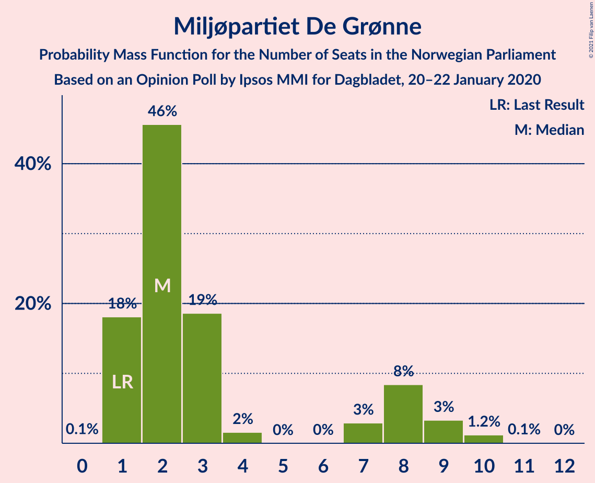

| Number of Seats | Probability | Accumulated | Special Marks |
|:---------------:|:-----------:|:-----------:|:-------------:|
| 0 | 0.2% | 100% |  |
| 1 | 47% | 99.8% | Last Result |
| 2 | 20% | 53% | Median |
| 3 | 6% | 33% |  |
| 4 | 0% | 27% |  |
| 5 | 0% | 27% |  |
| 6 | 0.1% | 27% |  |
| 7 | 3% | 27% |  |
| 8 | 16% | 24% |  |
| 9 | 8% | 8% |  |
| 10 | 0.4% | 0.5% |  |
| 11 | 0.1% | 0.1% |  |
| 12 | 0% | 0% |  |

### Kristelig Folkeparti

*For a full overview of the results for this party, see the [Kristelig Folkeparti](party-kristeligfolkeparti.html) page.*

| Number of Seats | Probability | Accumulated | Special Marks |
|:---------------:|:-----------:|:-----------:|:-------------:|
| 0 | 8% | 100% |  |
| 1 | 53% | 92% | Median |
| 2 | 9% | 39% |  |
| 3 | 28% | 31% |  |
| 4 | 0% | 3% |  |
| 5 | 0% | 3% |  |
| 6 | 0% | 3% |  |
| 7 | 0.7% | 3% |  |
| 8 | 2% | 2% | Last Result |
| 9 | 0.4% | 0.6% |  |
| 10 | 0.2% | 0.2% |  |
| 11 | 0% | 0% |  |

## Coalitions

### Confidence Intervals

| Coalition | Last Result | Median | Majority? | 80% Confidence Interval | 90% Confidence Interval | 95% Confidence Interval | 99% Confidence Interval |
|:---------:|:-----------:|:------:|:---------:|:-----------------------:|:-----------------------:|:-----------------------:|:-----------------------:|
| Høyre – Senterpartiet – Fremskrittspartiet – Venstre – Kristelig Folkeparti | 107 | 102 | 100% | 97–106 | 96–108 | 95–108 | 94–111 |
| Arbeiderpartiet – Senterpartiet – Sosialistisk Venstreparti – Rødt – Miljøpartiet De Grønne | 81 | 96 | 99.9% | 92–102 | 89–103 | 88–104 | 88–105 |
| Arbeiderpartiet – Senterpartiet – Sosialistisk Venstreparti – Miljøpartiet De Grønne – Kristelig Folkeparti | 88 | 95 | 99.4% | 87–98 | 86–99 | 85–101 | 84–104 |
| Arbeiderpartiet – Senterpartiet – Sosialistisk Venstreparti – Rødt | 80 | 95 | 98% | 87–98 | 86–100 | 85–100 | 82–102 |
| Arbeiderpartiet – Senterpartiet – Sosialistisk Venstreparti – Miljøpartiet De Grønne | 80 | 93 | 96% | 86–96 | 85–97 | 84–99 | 82–101 |
| Arbeiderpartiet – Senterpartiet – Sosialistisk Venstreparti | 79 | 89 | 87% | 84–93 | 82–93 | 80–95 | 79–99 |
| Arbeiderpartiet – Senterpartiet – Miljøpartiet De Grønne – Kristelig Folkeparti | 77 | 84 | 49% | 75–87 | 74–88 | 74–90 | 72–93 |
| Arbeiderpartiet – Senterpartiet – Kristelig Folkeparti | 76 | 81 | 6% | 74–84 | 73–85 | 73–87 | 70–91 |
| Arbeiderpartiet – Senterpartiet | 68 | 78 | 2% | 73–83 | 72–83 | 71–84 | 69–89 |
| Høyre – Fremskrittspartiet – Venstre – Miljøpartiet De Grønne – Kristelig Folkeparti | 89 | 74 | 2% | 71–82 | 69–83 | 69–84 | 67–87 |
| Høyre – Fremskrittspartiet – Venstre – Kristelig Folkeparti | 88 | 72 | 0.1% | 67–77 | 66–80 | 65–81 | 63–81 |
| Høyre – Fremskrittspartiet – Venstre | 80 | 70 | 0% | 65–75 | 64–78 | 63–81 | 61–81 |
| Høyre – Fremskrittspartiet | 72 | 64 | 0% | 60–71 | 59–73 | 58–74 | 56–78 |
| Arbeiderpartiet – Sosialistisk Venstreparti | 60 | 58 | 0% | 54–63 | 53–64 | 52–65 | 50–66 |
| Høyre – Venstre – Kristelig Folkeparti | 61 | 42 | 0% | 38–46 | 38–48 | 35–48 | 35–51 |
| Senterpartiet – Venstre – Kristelig Folkeparti | 35 | 37 | 0% | 32–40 | 31–41 | 31–42 | 29–46 |

### Høyre – Senterpartiet – Fremskrittspartiet – Venstre – Kristelig Folkeparti

| Number of Seats | Probability | Accumulated | Special Marks |
|:---------------:|:-----------:|:-----------:|:-------------:|
| 89 | 0% | 100% |  |
| 90 | 0.1% | 99.9% |  |
| 91 | 0.1% | 99.9% |  |
| 92 | 0% | 99.7% |  |
| 93 | 0.1% | 99.7% |  |
| 94 | 0.3% | 99.6% |  |
| 95 | 3% | 99.3% |  |
| 96 | 5% | 97% |  |
| 97 | 2% | 92% |  |
| 98 | 2% | 89% | Median |
| 99 | 10% | 87% |  |
| 100 | 9% | 77% |  |
| 101 | 14% | 68% |  |
| 102 | 15% | 54% |  |
| 103 | 15% | 39% |  |
| 104 | 6% | 25% |  |
| 105 | 7% | 19% |  |
| 106 | 5% | 12% |  |
| 107 | 1.1% | 7% | Last Result |
| 108 | 4% | 6% |  |
| 109 | 0.2% | 2% |  |
| 110 | 0.6% | 2% |  |
| 111 | 0.6% | 0.9% |  |
| 112 | 0% | 0.3% |  |
| 113 | 0% | 0.3% |  |
| 114 | 0.2% | 0.2% |  |
| 115 | 0% | 0% |  |

### Arbeiderpartiet – Senterpartiet – Sosialistisk Venstreparti – Rødt – Miljøpartiet De Grønne

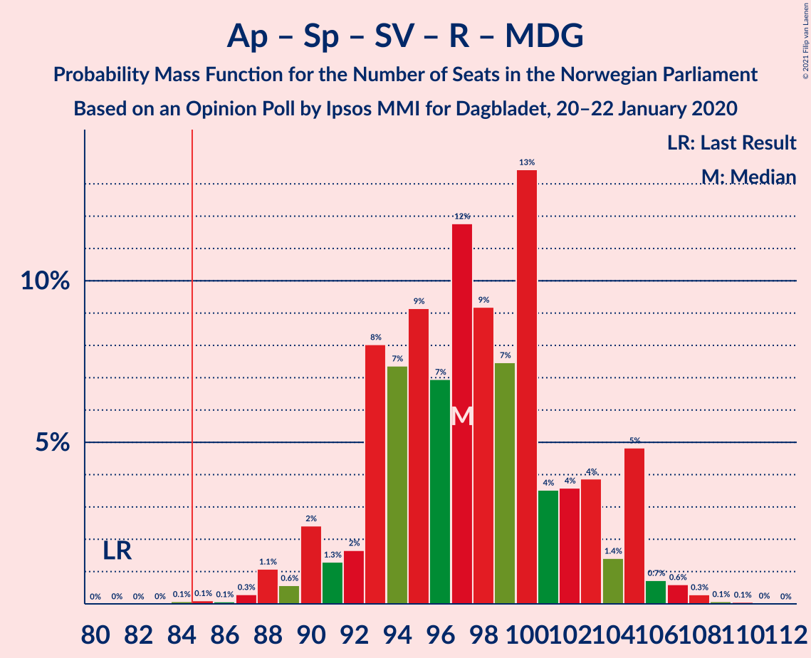

| Number of Seats | Probability | Accumulated | Special Marks |
|:---------------:|:-----------:|:-----------:|:-------------:|
| 81 | 0% | 100% | Last Result |
| 82 | 0% | 100% |  |
| 83 | 0% | 100% |  |
| 84 | 0% | 100% |  |
| 85 | 0.2% | 99.9% | Majority |
| 86 | 0% | 99.8% |  |
| 87 | 0.1% | 99.8% |  |
| 88 | 3% | 99.7% |  |
| 89 | 2% | 97% |  |
| 90 | 2% | 95% |  |
| 91 | 1.2% | 93% |  |
| 92 | 4% | 92% |  |
| 93 | 1.0% | 88% | Median |
| 94 | 3% | 87% |  |
| 95 | 15% | 84% |  |
| 96 | 20% | 69% |  |
| 97 | 5% | 50% |  |
| 98 | 11% | 44% |  |
| 99 | 6% | 34% |  |
| 100 | 12% | 27% |  |
| 101 | 3% | 15% |  |
| 102 | 2% | 11% |  |
| 103 | 4% | 9% |  |
| 104 | 4% | 5% |  |
| 105 | 0.4% | 0.8% |  |
| 106 | 0.2% | 0.5% |  |
| 107 | 0.1% | 0.3% |  |
| 108 | 0% | 0.1% |  |
| 109 | 0% | 0.1% |  |
| 110 | 0% | 0.1% |  |
| 111 | 0% | 0.1% |  |
| 112 | 0% | 0% |  |

### Arbeiderpartiet – Senterpartiet – Sosialistisk Venstreparti – Miljøpartiet De Grønne – Kristelig Folkeparti

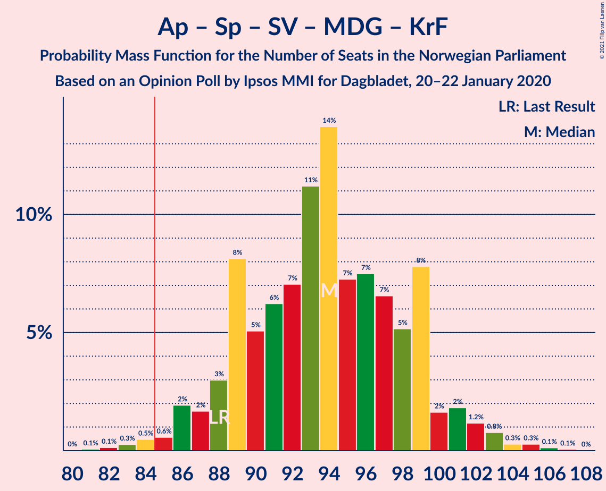

| Number of Seats | Probability | Accumulated | Special Marks |
|:---------------:|:-----------:|:-----------:|:-------------:|
| 80 | 0.1% | 100% |  |
| 81 | 0.1% | 99.9% |  |
| 82 | 0.1% | 99.8% |  |
| 83 | 0.2% | 99.7% |  |
| 84 | 0.2% | 99.5% |  |
| 85 | 3% | 99.4% | Majority |
| 86 | 5% | 96% |  |
| 87 | 4% | 92% |  |
| 88 | 5% | 87% | Last Result |
| 89 | 3% | 82% |  |
| 90 | 3% | 79% |  |
| 91 | 2% | 77% |  |
| 92 | 3% | 75% | Median |
| 93 | 1.4% | 72% |  |
| 94 | 15% | 71% |  |
| 95 | 31% | 56% |  |
| 96 | 2% | 25% |  |
| 97 | 11% | 23% |  |
| 98 | 6% | 12% |  |
| 99 | 0.8% | 6% |  |
| 100 | 2% | 5% |  |
| 101 | 1.0% | 3% |  |
| 102 | 1.1% | 2% |  |
| 103 | 0.1% | 0.7% |  |
| 104 | 0.2% | 0.6% |  |
| 105 | 0.2% | 0.5% |  |
| 106 | 0.2% | 0.3% |  |
| 107 | 0% | 0.1% |  |
| 108 | 0% | 0.1% |  |
| 109 | 0.1% | 0.1% |  |
| 110 | 0% | 0% |  |

### Arbeiderpartiet – Senterpartiet – Sosialistisk Venstreparti – Rødt

| Number of Seats | Probability | Accumulated | Special Marks |
|:---------------:|:-----------:|:-----------:|:-------------:|
| 80 | 0% | 100% | Last Result |
| 81 | 0.1% | 100% |  |
| 82 | 0.9% | 99.9% |  |
| 83 | 0.5% | 99.0% |  |
| 84 | 0.7% | 98% |  |
| 85 | 0.3% | 98% | Majority |
| 86 | 2% | 97% |  |
| 87 | 5% | 95% |  |
| 88 | 2% | 90% |  |
| 89 | 9% | 87% |  |
| 90 | 2% | 79% |  |
| 91 | 6% | 77% | Median |
| 92 | 2% | 71% |  |
| 93 | 5% | 70% |  |
| 94 | 11% | 65% |  |
| 95 | 20% | 54% |  |
| 96 | 7% | 35% |  |
| 97 | 9% | 27% |  |
| 98 | 11% | 18% |  |
| 99 | 0.4% | 7% |  |
| 100 | 4% | 6% |  |
| 101 | 1.5% | 2% |  |
| 102 | 0.3% | 0.6% |  |
| 103 | 0.1% | 0.3% |  |
| 104 | 0% | 0.2% |  |
| 105 | 0.1% | 0.2% |  |
| 106 | 0% | 0.1% |  |
| 107 | 0% | 0.1% |  |
| 108 | 0% | 0.1% |  |
| 109 | 0% | 0.1% |  |
| 110 | 0% | 0% |  |

### Arbeiderpartiet – Senterpartiet – Sosialistisk Venstreparti – Miljøpartiet De Grønne

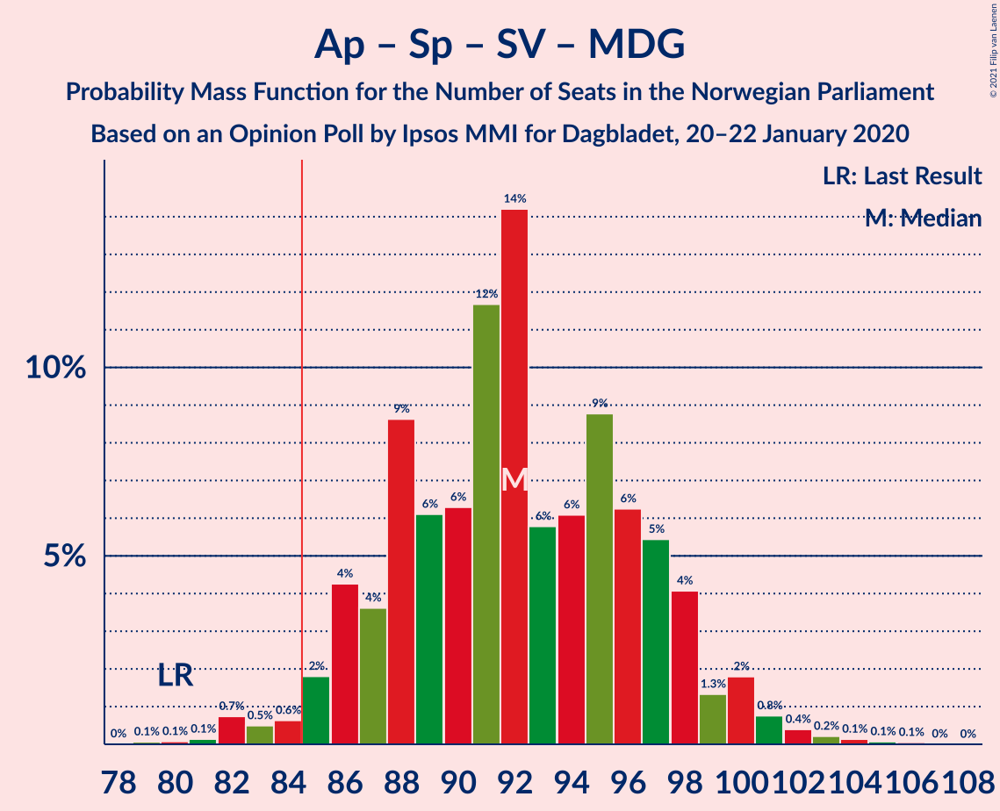

| Number of Seats | Probability | Accumulated | Special Marks |
|:---------------:|:-----------:|:-----------:|:-------------:|
| 79 | 0% | 100% |  |
| 80 | 0.1% | 99.9% | Last Result |
| 81 | 0.1% | 99.8% |  |
| 82 | 0.3% | 99.7% |  |
| 83 | 0.4% | 99.4% |  |
| 84 | 3% | 99.0% |  |
| 85 | 0.7% | 96% | Majority |
| 86 | 8% | 95% |  |
| 87 | 6% | 87% |  |
| 88 | 4% | 80% |  |
| 89 | 2% | 76% |  |
| 90 | 3% | 74% |  |
| 91 | 7% | 71% | Median |
| 92 | 14% | 65% |  |
| 93 | 11% | 51% |  |
| 94 | 17% | 40% |  |
| 95 | 7% | 23% |  |
| 96 | 9% | 15% |  |
| 97 | 3% | 7% |  |
| 98 | 0.6% | 3% |  |
| 99 | 1.3% | 3% |  |
| 100 | 0.8% | 2% |  |
| 101 | 0.4% | 0.7% |  |
| 102 | 0.1% | 0.3% |  |
| 103 | 0.2% | 0.3% |  |
| 104 | 0% | 0.1% |  |
| 105 | 0% | 0% |  |

### Arbeiderpartiet – Senterpartiet – Sosialistisk Venstreparti

| Number of Seats | Probability | Accumulated | Special Marks |
|:---------------:|:-----------:|:-----------:|:-------------:|
| 77 | 0.2% | 100% |  |
| 78 | 0.1% | 99.7% |  |
| 79 | 0.4% | 99.6% | Last Result |
| 80 | 2% | 99.2% |  |
| 81 | 0.9% | 97% |  |
| 82 | 2% | 96% |  |
| 83 | 4% | 94% |  |
| 84 | 3% | 90% |  |
| 85 | 14% | 87% | Majority |
| 86 | 5% | 73% |  |
| 87 | 11% | 69% |  |
| 88 | 4% | 57% |  |
| 89 | 3% | 53% | Median |
| 90 | 17% | 50% |  |
| 91 | 2% | 33% |  |
| 92 | 9% | 30% |  |
| 93 | 16% | 21% |  |
| 94 | 2% | 5% |  |
| 95 | 1.3% | 3% |  |
| 96 | 0.2% | 2% |  |
| 97 | 0.3% | 1.3% |  |
| 98 | 0.2% | 1.0% |  |
| 99 | 0.7% | 0.8% |  |
| 100 | 0.1% | 0.1% |  |
| 101 | 0% | 0.1% |  |
| 102 | 0% | 0% |  |

### Arbeiderpartiet – Senterpartiet – Miljøpartiet De Grønne – Kristelig Folkeparti

| Number of Seats | Probability | Accumulated | Special Marks |
|:---------------:|:-----------:|:-----------:|:-------------:|
| 69 | 0.1% | 100% |  |
| 70 | 0% | 99.9% |  |
| 71 | 0.3% | 99.9% |  |
| 72 | 0.1% | 99.6% |  |
| 73 | 0.3% | 99.5% |  |
| 74 | 5% | 99.2% |  |
| 75 | 7% | 95% |  |
| 76 | 2% | 88% |  |
| 77 | 1.3% | 86% | Last Result |
| 78 | 0.9% | 85% |  |
| 79 | 0.2% | 84% |  |
| 80 | 7% | 84% |  |
| 81 | 3% | 77% |  |
| 82 | 9% | 74% | Median |
| 83 | 3% | 65% |  |
| 84 | 12% | 61% |  |
| 85 | 17% | 49% | Majority |
| 86 | 20% | 32% |  |
| 87 | 5% | 12% |  |
| 88 | 3% | 7% |  |
| 89 | 0.9% | 4% |  |
| 90 | 0.7% | 3% |  |
| 91 | 0.4% | 2% |  |
| 92 | 1.0% | 2% |  |
| 93 | 0.1% | 0.5% |  |
| 94 | 0.1% | 0.5% |  |
| 95 | 0% | 0.4% |  |
| 96 | 0.3% | 0.4% |  |
| 97 | 0% | 0.1% |  |
| 98 | 0% | 0.1% |  |
| 99 | 0.1% | 0.1% |  |
| 100 | 0% | 0% |  |

### Arbeiderpartiet – Senterpartiet – Kristelig Folkeparti

| Number of Seats | Probability | Accumulated | Special Marks |
|:---------------:|:-----------:|:-----------:|:-------------:|
| 68 | 0.1% | 100% |  |
| 69 | 0.1% | 99.9% |  |
| 70 | 0.3% | 99.7% |  |
| 71 | 1.0% | 99.4% |  |
| 72 | 0.7% | 98% |  |
| 73 | 5% | 98% |  |
| 74 | 8% | 92% |  |
| 75 | 2% | 84% |  |
| 76 | 8% | 82% | Last Result |
| 77 | 7% | 74% |  |
| 78 | 9% | 67% |  |
| 79 | 6% | 58% |  |
| 80 | 2% | 52% | Median |
| 81 | 12% | 51% |  |
| 82 | 3% | 39% |  |
| 83 | 7% | 37% |  |
| 84 | 24% | 30% |  |
| 85 | 2% | 6% | Majority |
| 86 | 0.4% | 4% |  |
| 87 | 1.2% | 3% |  |
| 88 | 0.3% | 2% |  |
| 89 | 0.6% | 2% |  |
| 90 | 0.2% | 1.2% |  |
| 91 | 0.8% | 1.0% |  |
| 92 | 0% | 0.2% |  |
| 93 | 0.1% | 0.1% |  |
| 94 | 0% | 0.1% |  |
| 95 | 0.1% | 0.1% |  |
| 96 | 0% | 0% |  |

### Arbeiderpartiet – Senterpartiet

| Number of Seats | Probability | Accumulated | Special Marks |
|:---------------:|:-----------:|:-----------:|:-------------:|
| 67 | 0.1% | 100% |  |
| 68 | 0.2% | 99.9% | Last Result |
| 69 | 0.2% | 99.7% |  |
| 70 | 2% | 99.5% |  |
| 71 | 2% | 98% |  |
| 72 | 4% | 96% |  |
| 73 | 6% | 91% |  |
| 74 | 9% | 86% |  |
| 75 | 8% | 77% |  |
| 76 | 8% | 69% |  |
| 77 | 5% | 60% |  |
| 78 | 6% | 55% |  |
| 79 | 4% | 49% | Median |
| 80 | 13% | 45% |  |
| 81 | 13% | 33% |  |
| 82 | 2% | 20% |  |
| 83 | 13% | 17% |  |
| 84 | 3% | 4% |  |
| 85 | 0.1% | 2% | Majority |
| 86 | 0.2% | 1.4% |  |
| 87 | 0.2% | 1.2% |  |
| 88 | 0.2% | 1.0% |  |
| 89 | 0.4% | 0.8% |  |
| 90 | 0.3% | 0.4% |  |
| 91 | 0% | 0% |  |

### Høyre – Fremskrittspartiet – Venstre – Miljøpartiet De Grønne – Kristelig Folkeparti

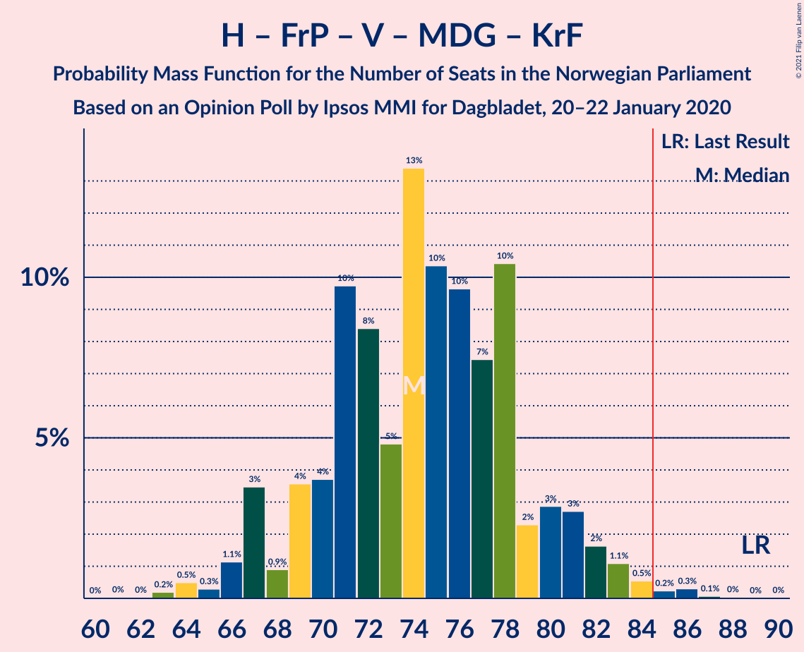

| Number of Seats | Probability | Accumulated | Special Marks |
|:---------------:|:-----------:|:-----------:|:-------------:|
| 59 | 0.1% | 100% |  |
| 60 | 0% | 99.9% |  |
| 61 | 0% | 99.9% |  |
| 62 | 0% | 99.9% |  |
| 63 | 0% | 99.9% |  |
| 64 | 0.1% | 99.9% |  |
| 65 | 0.1% | 99.8% |  |
| 66 | 0.1% | 99.8% |  |
| 67 | 0.3% | 99.7% |  |
| 68 | 1.5% | 99.3% |  |
| 69 | 4% | 98% |  |
| 70 | 0.6% | 94% | Median |
| 71 | 11% | 93% |  |
| 72 | 9% | 82% |  |
| 73 | 8% | 72% |  |
| 74 | 20% | 65% |  |
| 75 | 11% | 45% |  |
| 76 | 5% | 35% |  |
| 77 | 1.5% | 30% |  |
| 78 | 6% | 28% |  |
| 79 | 1.4% | 23% |  |
| 80 | 9% | 21% |  |
| 81 | 2% | 13% |  |
| 82 | 5% | 10% |  |
| 83 | 2% | 5% |  |
| 84 | 0.3% | 3% |  |
| 85 | 0.7% | 2% | Majority |
| 86 | 0.5% | 2% |  |
| 87 | 0.9% | 1.0% |  |
| 88 | 0.1% | 0.1% |  |
| 89 | 0% | 0% | Last Result |

### Høyre – Fremskrittspartiet – Venstre – Kristelig Folkeparti

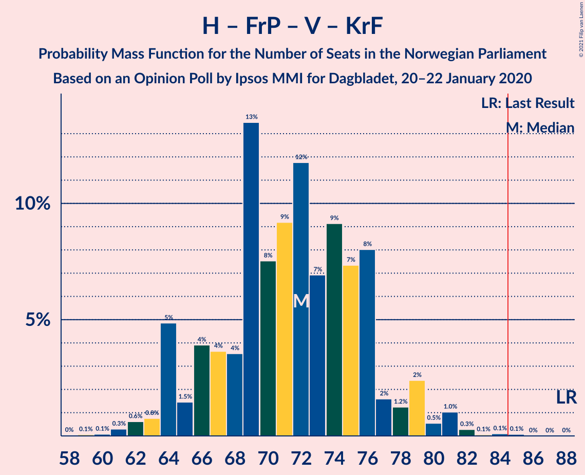

| Number of Seats | Probability | Accumulated | Special Marks |
|:---------------:|:-----------:|:-----------:|:-------------:|
| 58 | 0% | 100% |  |
| 59 | 0% | 99.9% |  |
| 60 | 0% | 99.9% |  |
| 61 | 0.1% | 99.9% |  |
| 62 | 0.1% | 99.8% |  |
| 63 | 0.2% | 99.7% |  |
| 64 | 0.4% | 99.5% |  |
| 65 | 4% | 99.1% |  |
| 66 | 4% | 95% |  |
| 67 | 2% | 91% |  |
| 68 | 3% | 88% | Median |
| 69 | 13% | 85% |  |
| 70 | 7% | 72% |  |
| 71 | 11% | 66% |  |
| 72 | 5% | 55% |  |
| 73 | 20% | 50% |  |
| 74 | 15% | 30% |  |
| 75 | 2% | 15% |  |
| 76 | 0.9% | 13% |  |
| 77 | 4% | 12% |  |
| 78 | 1.0% | 8% |  |
| 79 | 2% | 7% |  |
| 80 | 2% | 5% |  |
| 81 | 3% | 3% |  |
| 82 | 0.1% | 0.3% |  |
| 83 | 0% | 0.2% |  |
| 84 | 0.2% | 0.2% |  |
| 85 | 0% | 0.1% | Majority |
| 86 | 0% | 0% |  |
| 87 | 0% | 0% |  |
| 88 | 0% | 0% | Last Result |

### Høyre – Fremskrittspartiet – Venstre

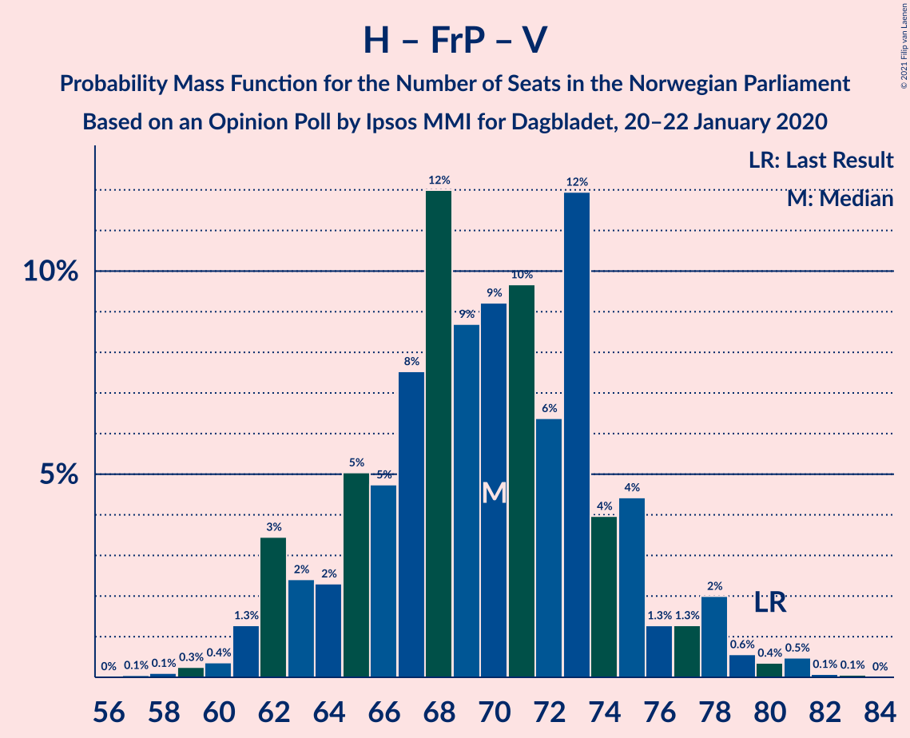

| Number of Seats | Probability | Accumulated | Special Marks |
|:---------------:|:-----------:|:-----------:|:-------------:|
| 57 | 0.1% | 100% |  |
| 58 | 0.1% | 99.9% |  |
| 59 | 0% | 99.8% |  |
| 60 | 0.1% | 99.7% |  |
| 61 | 0.6% | 99.7% |  |
| 62 | 0.2% | 99.1% |  |
| 63 | 4% | 98.8% |  |
| 64 | 2% | 95% |  |
| 65 | 7% | 93% |  |
| 66 | 12% | 86% |  |
| 67 | 3% | 74% | Median |
| 68 | 7% | 71% |  |
| 69 | 8% | 64% |  |
| 70 | 7% | 56% |  |
| 71 | 3% | 49% |  |
| 72 | 23% | 47% |  |
| 73 | 11% | 24% |  |
| 74 | 2% | 13% |  |
| 75 | 1.0% | 11% |  |
| 76 | 3% | 10% |  |
| 77 | 0.6% | 7% |  |
| 78 | 1.3% | 6% |  |
| 79 | 1.3% | 5% |  |
| 80 | 0.6% | 3% | Last Result |
| 81 | 3% | 3% |  |
| 82 | 0.1% | 0.1% |  |
| 83 | 0% | 0% |  |

### Høyre – Fremskrittspartiet

| Number of Seats | Probability | Accumulated | Special Marks |
|:---------------:|:-----------:|:-----------:|:-------------:|
| 53 | 0% | 100% |  |
| 54 | 0.1% | 99.9% |  |
| 55 | 0.1% | 99.9% |  |
| 56 | 0.7% | 99.7% |  |
| 57 | 0.8% | 99.0% |  |
| 58 | 3% | 98% |  |
| 59 | 2% | 96% |  |
| 60 | 6% | 94% |  |
| 61 | 5% | 88% |  |
| 62 | 5% | 83% |  |
| 63 | 6% | 78% |  |
| 64 | 31% | 72% |  |
| 65 | 3% | 41% | Median |
| 66 | 5% | 38% |  |
| 67 | 3% | 33% |  |
| 68 | 6% | 30% |  |
| 69 | 3% | 24% |  |
| 70 | 6% | 21% |  |
| 71 | 8% | 15% |  |
| 72 | 0.2% | 7% | Last Result |
| 73 | 3% | 7% |  |
| 74 | 3% | 4% |  |
| 75 | 0.1% | 0.8% |  |
| 76 | 0% | 0.7% |  |
| 77 | 0.1% | 0.7% |  |
| 78 | 0.6% | 0.6% |  |
| 79 | 0% | 0% |  |

### Arbeiderpartiet – Sosialistisk Venstreparti

| Number of Seats | Probability | Accumulated | Special Marks |
|:---------------:|:-----------:|:-----------:|:-------------:|
| 46 | 0.2% | 100% |  |
| 47 | 0% | 99.8% |  |
| 48 | 0.1% | 99.8% |  |
| 49 | 0.1% | 99.7% |  |
| 50 | 0.4% | 99.6% |  |
| 51 | 2% | 99.2% |  |
| 52 | 1.3% | 98% |  |
| 53 | 2% | 96% |  |
| 54 | 7% | 94% |  |
| 55 | 4% | 87% |  |
| 56 | 7% | 83% |  |
| 57 | 12% | 77% |  |
| 58 | 15% | 64% |  |
| 59 | 8% | 49% | Median |
| 60 | 6% | 41% | Last Result |
| 61 | 13% | 36% |  |
| 62 | 4% | 23% |  |
| 63 | 13% | 19% |  |
| 64 | 2% | 6% |  |
| 65 | 2% | 3% |  |
| 66 | 1.4% | 2% |  |
| 67 | 0.2% | 0.3% |  |
| 68 | 0% | 0.1% |  |
| 69 | 0% | 0.1% |  |
| 70 | 0% | 0% |  |

### Høyre – Venstre – Kristelig Folkeparti

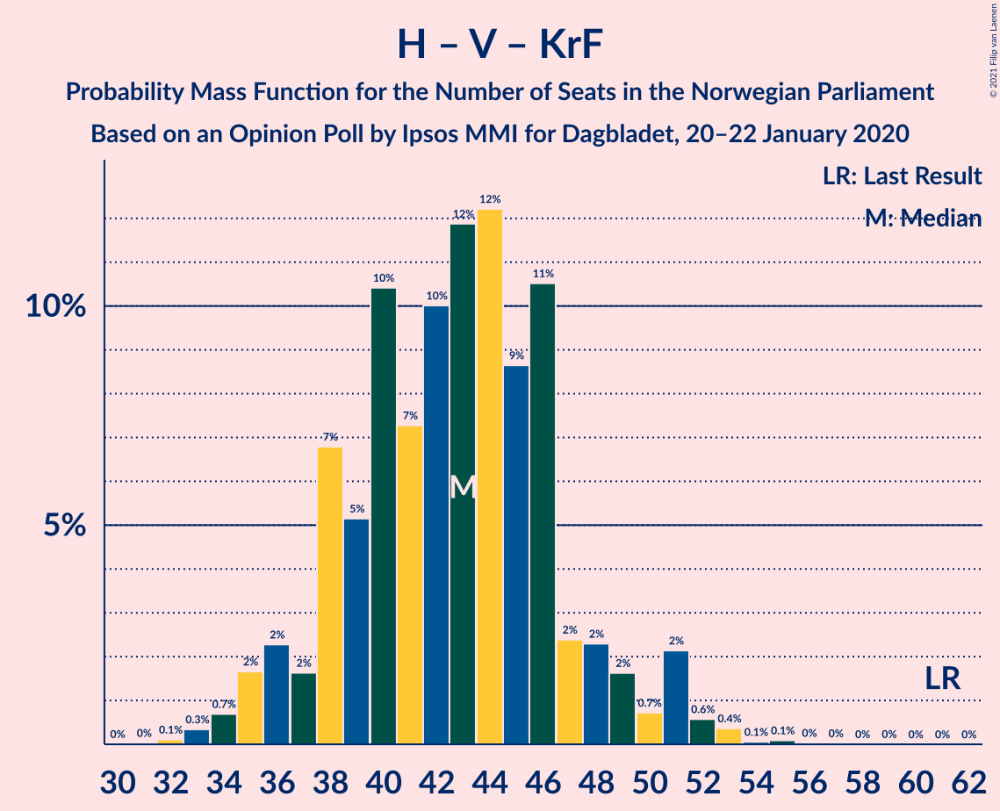

| Number of Seats | Probability | Accumulated | Special Marks |
|:---------------:|:-----------:|:-----------:|:-------------:|
| 32 | 0.1% | 100% |  |
| 33 | 0.1% | 99.9% |  |
| 34 | 0.2% | 99.8% |  |
| 35 | 2% | 99.6% |  |
| 36 | 0.6% | 97% |  |
| 37 | 0.9% | 97% |  |
| 38 | 15% | 96% | Median |
| 39 | 4% | 81% |  |
| 40 | 6% | 77% |  |
| 41 | 17% | 71% |  |
| 42 | 8% | 54% |  |
| 43 | 5% | 46% |  |
| 44 | 24% | 41% |  |
| 45 | 3% | 17% |  |
| 46 | 5% | 14% |  |
| 47 | 2% | 9% |  |
| 48 | 5% | 7% |  |
| 49 | 0.7% | 2% |  |
| 50 | 0.5% | 1.3% |  |
| 51 | 0.3% | 0.8% |  |
| 52 | 0.2% | 0.4% |  |
| 53 | 0% | 0.2% |  |
| 54 | 0% | 0.2% |  |
| 55 | 0% | 0.2% |  |
| 56 | 0% | 0.2% |  |
| 57 | 0.1% | 0.1% |  |
| 58 | 0% | 0% |  |
| 59 | 0% | 0% |  |
| 60 | 0% | 0% |  |
| 61 | 0% | 0% | Last Result |

### Senterpartiet – Venstre – Kristelig Folkeparti

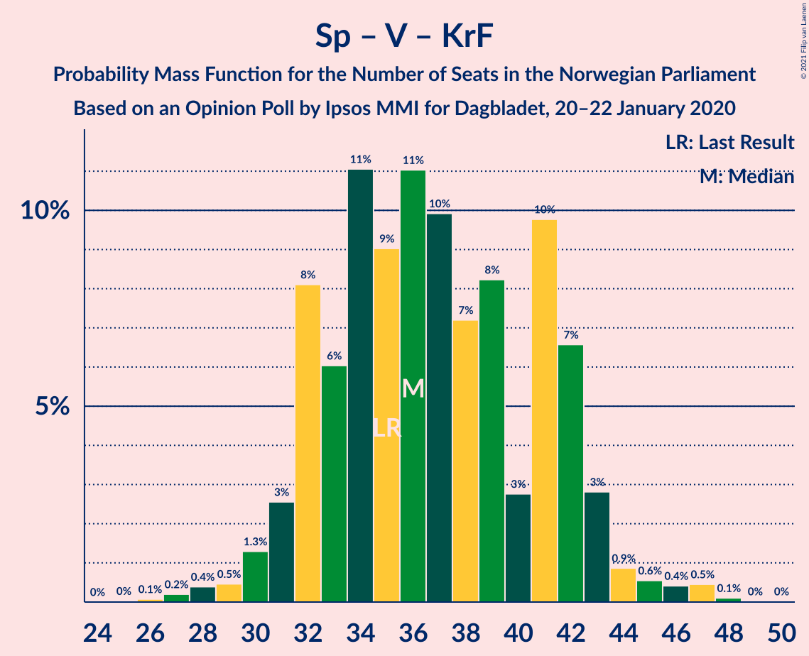

| Number of Seats | Probability | Accumulated | Special Marks |
|:---------------:|:-----------:|:-----------:|:-------------:|
| 26 | 0.1% | 100% |  |
| 27 | 0.1% | 99.9% |  |
| 28 | 0.3% | 99.8% |  |
| 29 | 0.5% | 99.5% |  |
| 30 | 0.2% | 99.0% |  |
| 31 | 5% | 98.8% |  |
| 32 | 9% | 94% |  |
| 33 | 2% | 85% | Median |
| 34 | 16% | 83% |  |
| 35 | 8% | 67% | Last Result |
| 36 | 2% | 59% |  |
| 37 | 15% | 57% |  |
| 38 | 10% | 42% |  |
| 39 | 16% | 31% |  |
| 40 | 9% | 15% |  |
| 41 | 3% | 6% |  |
| 42 | 1.3% | 4% |  |
| 43 | 1.3% | 2% |  |
| 44 | 0.3% | 1.1% |  |
| 45 | 0.2% | 0.8% |  |
| 46 | 0.2% | 0.6% |  |
| 47 | 0.2% | 0.4% |  |
| 48 | 0.1% | 0.2% |  |
| 49 | 0.1% | 0.1% |  |
| 50 | 0% | 0% |  |

## Technical Information

### Opinion Poll

+ **Polling firm:** Ipsos MMI
+ **Commissioner(s):** Dagbladet
+ **Fieldwork period:** 20–22 January 2020

### Calculations

+ **Sample size:** 752
+ **Simulations done:** 131,072
+ **Error estimate:** 2.67%

