# Opinion Poll by Norstat for Vårt Land, 21–27 January 2020

<a href="#voting-intentions">Voting Intentions</a> | <a href="#seats">Seats</a> | <a href="#coalitions">Coalitions</a> | <a href="#technical-information">Technical Information</a>

## Voting Intentions

### Confidence Intervals

| Party | Last Result | Poll Result | 80% Confidence Interval | 90% Confidence Interval | 95% Confidence Interval | 99% Confidence Interval |
|:-----:|:-----------:|:-----------:|:-----------------------:|:-----------------------:|:-----------------------:|:-----------------------:|
| Arbeiderpartiet | 27.4% | 26.8% | 24.6–29.1% |24.0–29.8% |23.4–30.4% |22.4–31.5% |
| Høyre | 25.0% | 21.0% | 19.0–23.2% |18.5–23.8% |18.0–24.4% |17.1–25.5% |
| Fremskrittspartiet | 15.2% | 14.6% | 13.0–16.6% |12.5–17.1% |12.1–17.6% |11.3–18.6% |
| Senterpartiet | 10.3% | 12.7% | 11.2–14.6% |10.7–15.1% |10.3–15.6% |9.6–16.5% |
| Sosialistisk Venstreparti | 6.0% | 7.6% | 6.4–9.2% |6.1–9.6% |5.8–10.0% |5.3–10.8% |
| Miljøpartiet De Grønne | 3.2% | 4.9% | 4.0–6.2% |3.7–6.6% |3.5–6.9% |3.1–7.6% |
| Kristelig Folkeparti | 4.2% | 4.0% | 3.1–5.2% |2.9–5.5% |2.7–5.8% |2.4–6.4% |
| Rødt | 2.4% | 3.7% | 2.9–4.8% |2.6–5.2% |2.5–5.4% |2.1–6.1% |
| Venstre | 4.4% | 3.0% | 2.3–4.1% |2.1–4.4% |2.0–4.7% |1.6–5.3% |

*Note:* The poll result column reflects the actual value used in the calculations. Published results may vary slightly, and in addition be rounded to fewer digits.

## Seats

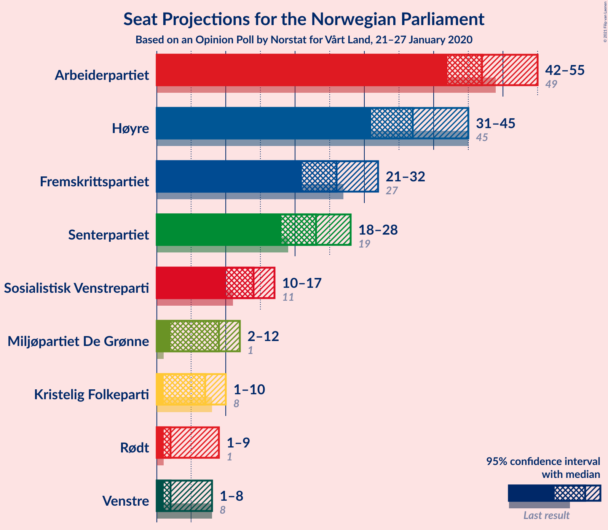

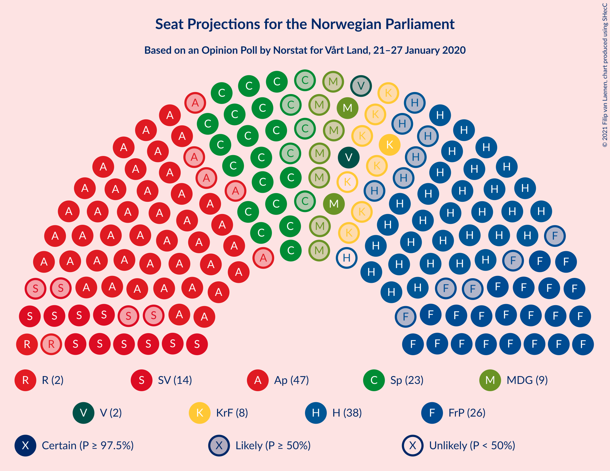

### Confidence Intervals

| Party | Last Result | Median | 80% Confidence Interval | 90% Confidence Interval | 95% Confidence Interval | 99% Confidence Interval |
|:-----:|:-----------:|:------:|:-----------------------:|:-----------------------:|:-----------------------:|:-----------------------:|
| <a href="#arbeiderpartiet">Arbeiderpartiet</a> | 49 | 48 | 43–51 |42–53 |42–53 |41–56 |
| <a href="#høyre">Høyre</a> | 45 | 38 | 33–42 |32–44 |32–44 |31–46 |
| <a href="#fremskrittspartiet">Fremskrittspartiet</a> | 27 | 26 | 24–30 |24–31 |23–31 |20–32 |
| <a href="#senterpartiet">Senterpartiet</a> | 19 | 23 | 20–27 |19–28 |17–28 |17–30 |
| <a href="#sosialistisk-venstreparti">Sosialistisk Venstreparti</a> | 11 | 14 | 10–16 |10–17 |10–17 |9–19 |
| <a href="#miljøpartiet-de-grønne">Miljøpartiet De Grønne</a> | 1 | 9 | 3–11 |2–11 |2–12 |1–15 |
| <a href="#kristelig-folkeparti">Kristelig Folkeparti</a> | 8 | 7 | 3–9 |2–9 |1–10 |1–11 |
| <a href="#rødt">Rødt</a> | 1 | 2 | 1–8 |1–9 |1–9 |1–11 |
| <a href="#venstre">Venstre</a> | 8 | 2 | 1–8 |1–8 |1–8 |0–9 |

### Arbeiderpartiet

*For a full overview of the results for this party, see the [Arbeiderpartiet](party-arbeiderpartiet.html) page.*

| Number of Seats | Probability | Accumulated | Special Marks |
|:---------------:|:-----------:|:-----------:|:-------------:|
| 39 | 0% | 100% |  |
| 40 | 0.2% | 99.9% |  |
| 41 | 0.7% | 99.7% |  |
| 42 | 4% | 99.0% |  |
| 43 | 15% | 95% |  |
| 44 | 5% | 80% |  |
| 45 | 2% | 75% |  |
| 46 | 5% | 73% |  |
| 47 | 16% | 68% |  |
| 48 | 8% | 51% | Median |
| 49 | 3% | 43% | Last Result |
| 50 | 25% | 40% |  |
| 51 | 5% | 15% |  |
| 52 | 2% | 10% |  |
| 53 | 6% | 8% |  |
| 54 | 0.8% | 2% |  |
| 55 | 0.7% | 1.3% |  |
| 56 | 0.1% | 0.6% |  |
| 57 | 0.1% | 0.4% |  |
| 58 | 0.2% | 0.4% |  |
| 59 | 0.1% | 0.2% |  |
| 60 | 0% | 0% |  |

### Høyre

*For a full overview of the results for this party, see the [Høyre](party-høyre.html) page.*

| Number of Seats | Probability | Accumulated | Special Marks |
|:---------------:|:-----------:|:-----------:|:-------------:|
| 28 | 0% | 100% |  |
| 29 | 0.1% | 99.9% |  |
| 30 | 0.2% | 99.9% |  |
| 31 | 0.7% | 99.6% |  |
| 32 | 5% | 99.0% |  |
| 33 | 5% | 94% |  |
| 34 | 5% | 89% |  |
| 35 | 2% | 84% |  |
| 36 | 19% | 83% |  |
| 37 | 6% | 63% |  |
| 38 | 26% | 57% | Median |
| 39 | 9% | 31% |  |
| 40 | 7% | 22% |  |
| 41 | 3% | 15% |  |
| 42 | 3% | 11% |  |
| 43 | 1.4% | 8% |  |
| 44 | 6% | 7% |  |
| 45 | 0.3% | 0.9% | Last Result |
| 46 | 0.4% | 0.6% |  |
| 47 | 0.2% | 0.3% |  |
| 48 | 0% | 0% |  |

### Fremskrittspartiet

*For a full overview of the results for this party, see the [Fremskrittspartiet](party-fremskrittspartiet.html) page.*

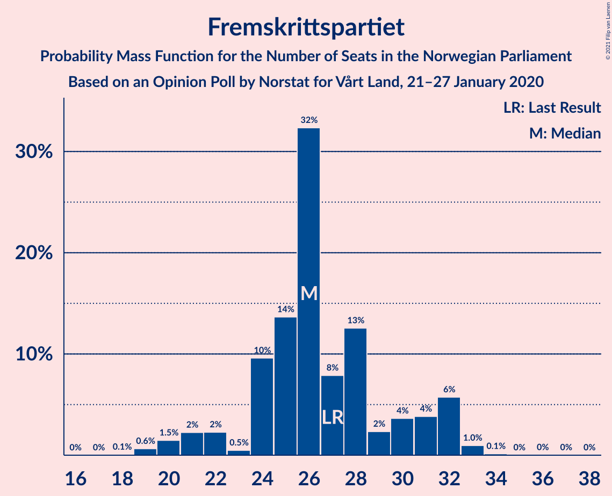

| Number of Seats | Probability | Accumulated | Special Marks |
|:---------------:|:-----------:|:-----------:|:-------------:|
| 18 | 0.1% | 100% |  |
| 19 | 0.2% | 99.9% |  |
| 20 | 1.0% | 99.7% |  |
| 21 | 0.8% | 98.7% |  |
| 22 | 0.2% | 98% |  |
| 23 | 1.1% | 98% |  |
| 24 | 12% | 97% |  |
| 25 | 30% | 85% |  |
| 26 | 22% | 54% | Median |
| 27 | 15% | 33% | Last Result |
| 28 | 2% | 18% |  |
| 29 | 5% | 16% |  |
| 30 | 2% | 10% |  |
| 31 | 7% | 8% |  |
| 32 | 1.0% | 1.2% |  |
| 33 | 0.1% | 0.2% |  |
| 34 | 0% | 0.1% |  |
| 35 | 0% | 0.1% |  |
| 36 | 0.1% | 0.1% |  |
| 37 | 0% | 0% |  |

### Senterpartiet

*For a full overview of the results for this party, see the [Senterpartiet](party-senterpartiet.html) page.*

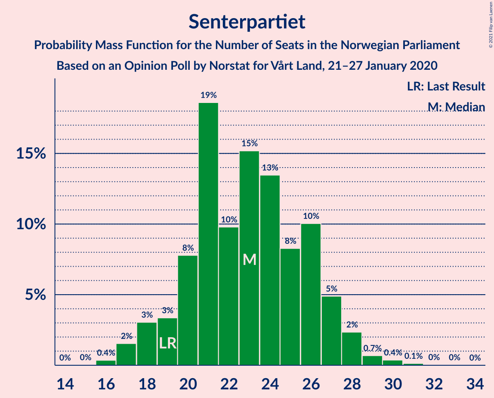

| Number of Seats | Probability | Accumulated | Special Marks |
|:---------------:|:-----------:|:-----------:|:-------------:|
| 16 | 0.2% | 100% |  |
| 17 | 3% | 99.8% |  |
| 18 | 0.9% | 97% |  |
| 19 | 2% | 96% | Last Result |
| 20 | 5% | 94% |  |
| 21 | 22% | 89% |  |
| 22 | 17% | 68% |  |
| 23 | 10% | 50% | Median |
| 24 | 4% | 40% |  |
| 25 | 11% | 37% |  |
| 26 | 14% | 25% |  |
| 27 | 3% | 12% |  |
| 28 | 7% | 9% |  |
| 29 | 1.5% | 2% |  |
| 30 | 0.5% | 0.6% |  |
| 31 | 0.1% | 0.2% |  |
| 32 | 0% | 0.1% |  |
| 33 | 0.1% | 0.1% |  |
| 34 | 0% | 0% |  |

### Sosialistisk Venstreparti

*For a full overview of the results for this party, see the [Sosialistisk Venstreparti](party-sosialistiskvenstreparti.html) page.*

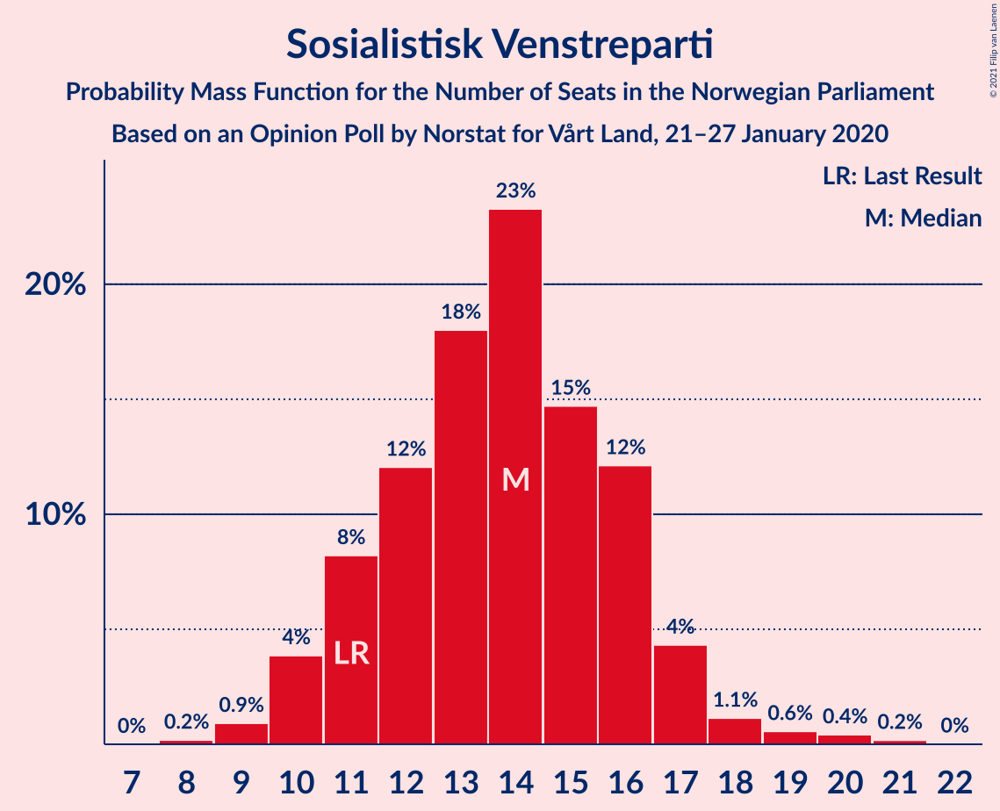

| Number of Seats | Probability | Accumulated | Special Marks |
|:---------------:|:-----------:|:-----------:|:-------------:|
| 8 | 0% | 100% |  |
| 9 | 0.8% | 99.9% |  |
| 10 | 13% | 99.1% |  |
| 11 | 5% | 86% | Last Result |
| 12 | 13% | 81% |  |
| 13 | 18% | 68% |  |
| 14 | 19% | 50% | Median |
| 15 | 6% | 32% |  |
| 16 | 20% | 25% |  |
| 17 | 4% | 5% |  |
| 18 | 0.8% | 2% |  |
| 19 | 0.5% | 0.9% |  |
| 20 | 0.2% | 0.5% |  |
| 21 | 0.3% | 0.3% |  |
| 22 | 0% | 0% |  |

### Miljøpartiet De Grønne

*For a full overview of the results for this party, see the [Miljøpartiet De Grønne](party-miljøpartietdegrønne.html) page.*

| Number of Seats | Probability | Accumulated | Special Marks |
|:---------------:|:-----------:|:-----------:|:-------------:|
| 1 | 1.5% | 100% | Last Result |
| 2 | 8% | 98.5% |  |
| 3 | 5% | 91% |  |
| 4 | 0% | 85% |  |
| 5 | 0% | 85% |  |
| 6 | 0% | 85% |  |
| 7 | 7% | 85% |  |
| 8 | 17% | 78% |  |
| 9 | 26% | 61% | Median |
| 10 | 24% | 35% |  |
| 11 | 7% | 11% |  |
| 12 | 2% | 4% |  |
| 13 | 0.8% | 2% |  |
| 14 | 0.2% | 0.9% |  |
| 15 | 0.7% | 0.7% |  |
| 16 | 0% | 0% |  |

### Kristelig Folkeparti

*For a full overview of the results for this party, see the [Kristelig Folkeparti](party-kristeligfolkeparti.html) page.*

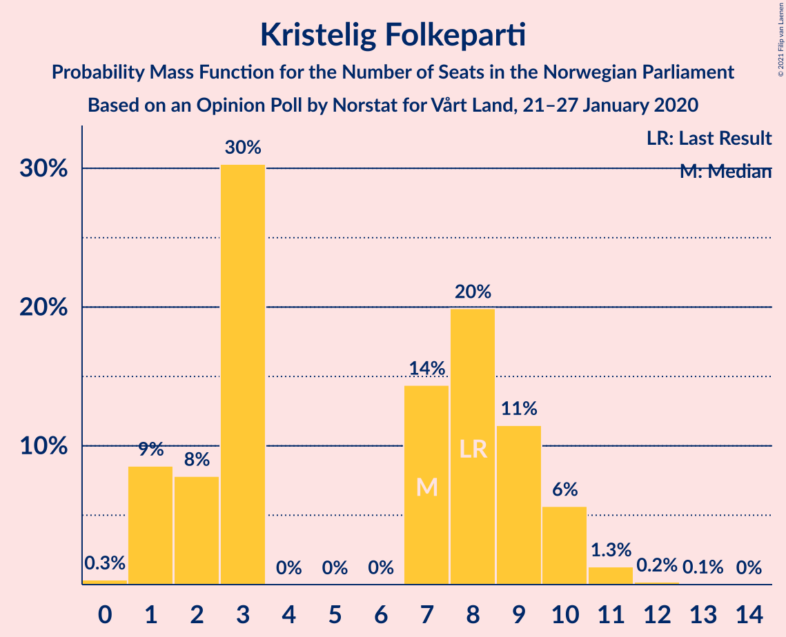

| Number of Seats | Probability | Accumulated | Special Marks |
|:---------------:|:-----------:|:-----------:|:-------------:|
| 0 | 0.3% | 100% |  |
| 1 | 5% | 99.7% |  |
| 2 | 2% | 95% |  |
| 3 | 40% | 93% |  |
| 4 | 0% | 53% |  |
| 5 | 0% | 53% |  |
| 6 | 0% | 53% |  |
| 7 | 9% | 53% | Median |
| 8 | 20% | 44% | Last Result |
| 9 | 21% | 24% |  |
| 10 | 2% | 3% |  |
| 11 | 0.8% | 1.1% |  |
| 12 | 0.2% | 0.3% |  |
| 13 | 0.1% | 0.1% |  |
| 14 | 0% | 0% |  |

### Rødt

*For a full overview of the results for this party, see the [Rødt](party-rødt.html) page.*

| Number of Seats | Probability | Accumulated | Special Marks |
|:---------------:|:-----------:|:-----------:|:-------------:|
| 1 | 17% | 100% | Last Result |
| 2 | 55% | 83% | Median |
| 3 | 0% | 28% |  |
| 4 | 0% | 28% |  |
| 5 | 0% | 28% |  |
| 6 | 0% | 28% |  |
| 7 | 11% | 28% |  |
| 8 | 11% | 16% |  |
| 9 | 3% | 6% |  |
| 10 | 2% | 2% |  |
| 11 | 0.5% | 0.7% |  |
| 12 | 0.2% | 0.2% |  |
| 13 | 0% | 0% |  |

### Venstre

*For a full overview of the results for this party, see the [Venstre](party-venstre.html) page.*

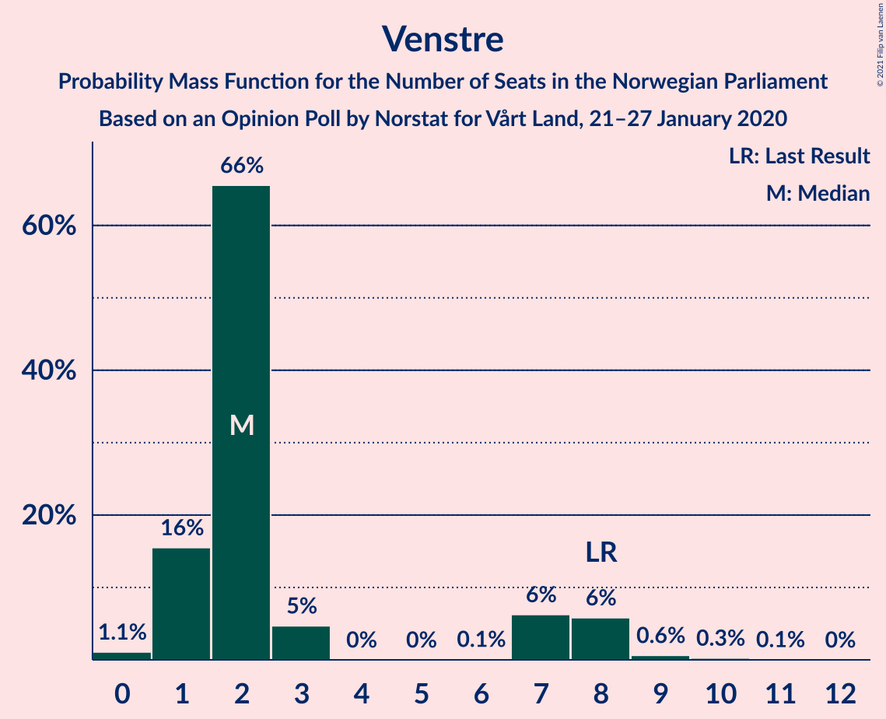

| Number of Seats | Probability | Accumulated | Special Marks |
|:---------------:|:-----------:|:-----------:|:-------------:|
| 0 | 0.6% | 100% |  |
| 1 | 24% | 99.4% |  |
| 2 | 45% | 76% | Median |
| 3 | 0% | 31% |  |
| 4 | 0% | 31% |  |
| 5 | 0% | 31% |  |
| 6 | 0.7% | 31% |  |
| 7 | 13% | 30% |  |
| 8 | 17% | 18% | Last Result |
| 9 | 1.1% | 1.1% |  |
| 10 | 0% | 0.1% |  |
| 11 | 0% | 0% |  |

## Coalitions

### Confidence Intervals

| Coalition | Last Result | Median | Majority? | 80% Confidence Interval | 90% Confidence Interval | 95% Confidence Interval | 99% Confidence Interval |
|:---------:|:-----------:|:------:|:---------:|:-----------------------:|:-----------------------:|:-----------------------:|:-----------------------:|
| Arbeiderpartiet – Senterpartiet – Sosialistisk Venstreparti – Miljøpartiet De Grønne – Kristelig Folkeparti | 88 | 98 | 100% | 93–104 | 90–106 | 90–106 | 88–107 |
| Arbeiderpartiet – Senterpartiet – Sosialistisk Venstreparti – Miljøpartiet De Grønne – Rødt | 81 | 96 | 99.9% | 90–100 | 89–101 | 89–103 | 87–106 |
| Høyre – Fremskrittspartiet – Senterpartiet – Kristelig Folkeparti – Venstre | 107 | 96 | 99.2% | 92–100 | 88–103 | 86–103 | 83–105 |
| Arbeiderpartiet – Senterpartiet – Sosialistisk Venstreparti – Miljøpartiet De Grønne | 80 | 93 | 98.7% | 87–97 | 87–97 | 85–98 | 83–103 |
| Arbeiderpartiet – Senterpartiet – Sosialistisk Venstreparti – Rødt | 80 | 87 | 85% | 84–93 | 83–94 | 82–96 | 80–99 |
| Arbeiderpartiet – Senterpartiet – Miljøpartiet De Grønne – Kristelig Folkeparti | 77 | 84 | 45% | 80–91 | 77–91 | 77–93 | 75–95 |
| Arbeiderpartiet – Senterpartiet – Sosialistisk Venstreparti | 79 | 84 | 45% | 80–89 | 78–92 | 78–92 | 75–96 |
| Arbeiderpartiet – Senterpartiet – Kristelig Folkeparti | 76 | 76 | 8% | 71–82 | 68–85 | 68–88 | 67–88 |
| Høyre – Fremskrittspartiet – Miljøpartiet De Grønne – Kristelig Folkeparti – Venstre | 89 | 82 | 15% | 76–85 | 75–86 | 73–87 | 70–89 |
| Høyre – Fremskrittspartiet – Kristelig Folkeparti – Venstre | 88 | 73 | 0.1% | 69–79 | 68–80 | 66–80 | 63–82 |
| Arbeiderpartiet – Senterpartiet | 68 | 71 | 0.1% | 67–76 | 65–79 | 65–79 | 62–80 |
| Høyre – Fremskrittspartiet – Venstre | 80 | 68 | 0% | 62–71 | 61–72 | 60–73 | 58–78 |
| Høyre – Fremskrittspartiet | 72 | 64 | 0% | 59–69 | 59–71 | 58–71 | 56–75 |
| Arbeiderpartiet – Sosialistisk Venstreparti | 60 | 61 | 0% | 57–64 | 56–67 | 56–68 | 54–71 |
| Høyre – Kristelig Folkeparti – Venstre | 61 | 47 | 0% | 43–50 | 42–51 | 41–52 | 36–56 |
| Senterpartiet – Kristelig Folkeparti – Venstre | 35 | 32 | 0% | 27–36 | 26–39 | 24–39 | 22–40 |

### Arbeiderpartiet – Senterpartiet – Sosialistisk Venstreparti – Miljøpartiet De Grønne – Kristelig Folkeparti

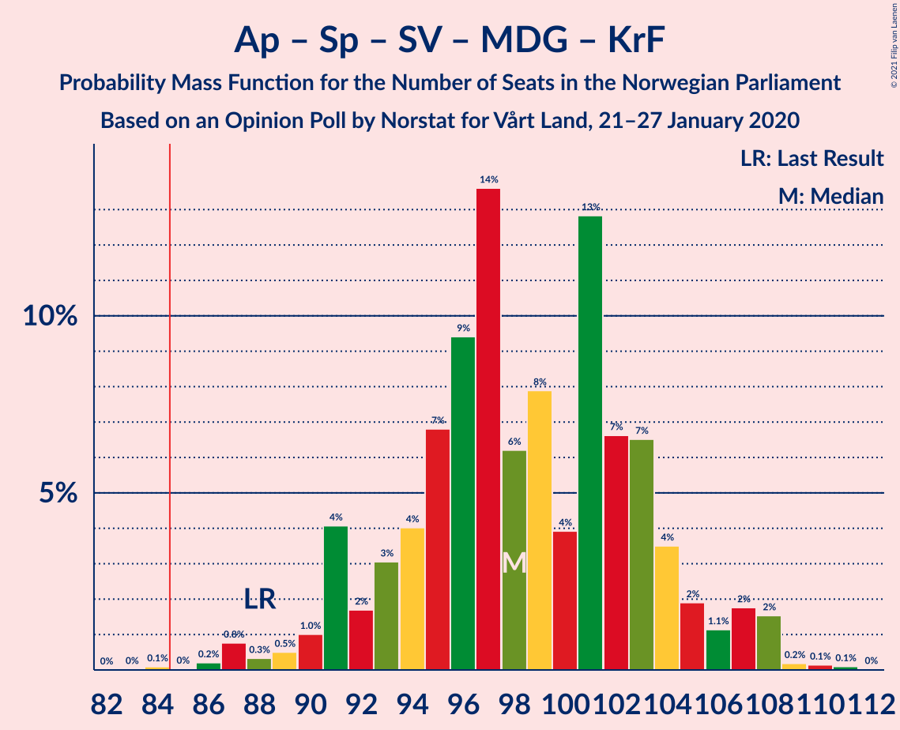

| Number of Seats | Probability | Accumulated | Special Marks |
|:---------------:|:-----------:|:-----------:|:-------------:|
| 85 | 0% | 100% | Majority |
| 86 | 0.1% | 99.9% |  |
| 87 | 0% | 99.9% |  |
| 88 | 0.4% | 99.8% | Last Result |
| 89 | 0.8% | 99.5% |  |
| 90 | 4% | 98.7% |  |
| 91 | 1.5% | 94% |  |
| 92 | 0.3% | 93% |  |
| 93 | 3% | 93% |  |
| 94 | 11% | 90% |  |
| 95 | 8% | 78% |  |
| 96 | 13% | 70% |  |
| 97 | 2% | 57% |  |
| 98 | 7% | 56% |  |
| 99 | 10% | 49% |  |
| 100 | 8% | 39% |  |
| 101 | 2% | 31% | Median |
| 102 | 14% | 29% |  |
| 103 | 1.2% | 15% |  |
| 104 | 4% | 14% |  |
| 105 | 2% | 9% |  |
| 106 | 7% | 8% |  |
| 107 | 0.5% | 1.0% |  |
| 108 | 0.2% | 0.5% |  |
| 109 | 0.1% | 0.3% |  |
| 110 | 0.2% | 0.2% |  |
| 111 | 0% | 0.1% |  |
| 112 | 0% | 0% |  |

### Arbeiderpartiet – Senterpartiet – Sosialistisk Venstreparti – Miljøpartiet De Grønne – Rødt

| Number of Seats | Probability | Accumulated | Special Marks |
|:---------------:|:-----------:|:-----------:|:-------------:|
| 81 | 0% | 100% | Last Result |
| 82 | 0% | 100% |  |
| 83 | 0% | 100% |  |
| 84 | 0.1% | 100% |  |
| 85 | 0.1% | 99.9% | Majority |
| 86 | 0.2% | 99.8% |  |
| 87 | 0.5% | 99.6% |  |
| 88 | 0.9% | 99.1% |  |
| 89 | 5% | 98% |  |
| 90 | 5% | 93% |  |
| 91 | 0.2% | 87% |  |
| 92 | 1.2% | 87% |  |
| 93 | 2% | 86% |  |
| 94 | 12% | 84% |  |
| 95 | 15% | 72% |  |
| 96 | 12% | 57% | Median |
| 97 | 6% | 45% |  |
| 98 | 16% | 39% |  |
| 99 | 13% | 23% |  |
| 100 | 4% | 10% |  |
| 101 | 1.5% | 6% |  |
| 102 | 0.7% | 5% |  |
| 103 | 2% | 4% |  |
| 104 | 0.8% | 2% |  |
| 105 | 0.2% | 0.7% |  |
| 106 | 0.1% | 0.6% |  |
| 107 | 0.1% | 0.4% |  |
| 108 | 0.1% | 0.3% |  |
| 109 | 0.2% | 0.3% |  |
| 110 | 0% | 0.1% |  |
| 111 | 0% | 0% |  |

### Høyre – Fremskrittspartiet – Senterpartiet – Kristelig Folkeparti – Venstre

| Number of Seats | Probability | Accumulated | Special Marks |
|:---------------:|:-----------:|:-----------:|:-------------:|
| 82 | 0.1% | 100% |  |
| 83 | 0.6% | 99.9% |  |
| 84 | 0.1% | 99.3% |  |
| 85 | 0.2% | 99.2% | Majority |
| 86 | 3% | 99.0% |  |
| 87 | 0.2% | 96% |  |
| 88 | 0.9% | 96% |  |
| 89 | 0.6% | 95% |  |
| 90 | 2% | 94% |  |
| 91 | 2% | 92% |  |
| 92 | 1.4% | 90% |  |
| 93 | 12% | 89% |  |
| 94 | 5% | 77% |  |
| 95 | 18% | 72% |  |
| 96 | 14% | 54% | Median |
| 97 | 3% | 40% |  |
| 98 | 2% | 38% |  |
| 99 | 13% | 35% |  |
| 100 | 13% | 23% |  |
| 101 | 0.5% | 10% |  |
| 102 | 1.1% | 9% |  |
| 103 | 6% | 8% |  |
| 104 | 0.9% | 2% |  |
| 105 | 1.2% | 2% |  |
| 106 | 0.2% | 0.3% |  |
| 107 | 0.1% | 0.1% | Last Result |
| 108 | 0% | 0% |  |

### Arbeiderpartiet – Senterpartiet – Sosialistisk Venstreparti – Miljøpartiet De Grønne

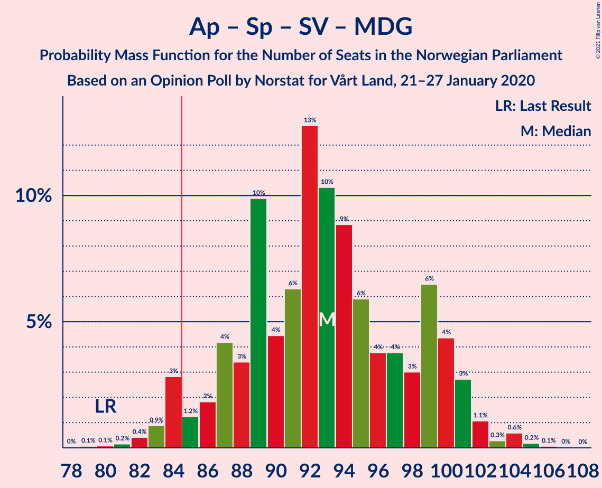

| Number of Seats | Probability | Accumulated | Special Marks |
|:---------------:|:-----------:|:-----------:|:-------------:|
| 80 | 0% | 100% | Last Result |
| 81 | 0.1% | 99.9% |  |
| 82 | 0.1% | 99.8% |  |
| 83 | 0.8% | 99.7% |  |
| 84 | 0.2% | 98.9% |  |
| 85 | 1.4% | 98.7% | Majority |
| 86 | 0.9% | 97% |  |
| 87 | 10% | 96% |  |
| 88 | 2% | 86% |  |
| 89 | 5% | 85% |  |
| 90 | 2% | 79% |  |
| 91 | 12% | 77% |  |
| 92 | 10% | 65% |  |
| 93 | 16% | 55% |  |
| 94 | 12% | 38% | Median |
| 95 | 7% | 27% |  |
| 96 | 3% | 20% |  |
| 97 | 12% | 17% |  |
| 98 | 3% | 5% |  |
| 99 | 0.9% | 2% |  |
| 100 | 0.4% | 1.4% |  |
| 101 | 0.1% | 1.0% |  |
| 102 | 0.3% | 0.9% |  |
| 103 | 0.2% | 0.5% |  |
| 104 | 0.1% | 0.3% |  |
| 105 | 0% | 0.2% |  |
| 106 | 0% | 0.2% |  |
| 107 | 0.1% | 0.2% |  |
| 108 | 0% | 0% |  |

### Arbeiderpartiet – Senterpartiet – Sosialistisk Venstreparti – Rødt

| Number of Seats | Probability | Accumulated | Special Marks |
|:---------------:|:-----------:|:-----------:|:-------------:|
| 76 | 0.1% | 100% |  |
| 77 | 0% | 99.8% |  |
| 78 | 0.1% | 99.8% |  |
| 79 | 0.1% | 99.6% |  |
| 80 | 1.3% | 99.5% | Last Result |
| 81 | 0.5% | 98% |  |
| 82 | 0.9% | 98% |  |
| 83 | 5% | 97% |  |
| 84 | 7% | 92% |  |
| 85 | 11% | 85% | Majority |
| 86 | 11% | 73% |  |
| 87 | 21% | 62% | Median |
| 88 | 1.0% | 41% |  |
| 89 | 18% | 40% |  |
| 90 | 1.5% | 22% |  |
| 91 | 6% | 21% |  |
| 92 | 3% | 15% |  |
| 93 | 3% | 12% |  |
| 94 | 5% | 9% |  |
| 95 | 0.8% | 4% |  |
| 96 | 1.3% | 3% |  |
| 97 | 1.0% | 2% |  |
| 98 | 0.7% | 1.3% |  |
| 99 | 0.2% | 0.6% |  |
| 100 | 0.2% | 0.4% |  |
| 101 | 0.1% | 0.2% |  |
| 102 | 0.1% | 0.1% |  |
| 103 | 0% | 0% |  |

### Arbeiderpartiet – Senterpartiet – Miljøpartiet De Grønne – Kristelig Folkeparti

| Number of Seats | Probability | Accumulated | Special Marks |
|:---------------:|:-----------:|:-----------:|:-------------:|
| 72 | 0.3% | 100% |  |
| 73 | 0% | 99.7% |  |
| 74 | 0.2% | 99.7% |  |
| 75 | 0.9% | 99.5% |  |
| 76 | 0.9% | 98.6% |  |
| 77 | 4% | 98% | Last Result |
| 78 | 0.6% | 93% |  |
| 79 | 2% | 93% |  |
| 80 | 1.3% | 91% |  |
| 81 | 8% | 89% |  |
| 82 | 2% | 81% |  |
| 83 | 7% | 79% |  |
| 84 | 27% | 71% |  |
| 85 | 4% | 45% | Majority |
| 86 | 19% | 41% |  |
| 87 | 4% | 23% | Median |
| 88 | 0.8% | 18% |  |
| 89 | 3% | 18% |  |
| 90 | 1.1% | 15% |  |
| 91 | 10% | 14% |  |
| 92 | 0.2% | 4% |  |
| 93 | 3% | 4% |  |
| 94 | 0.2% | 0.9% |  |
| 95 | 0.6% | 0.8% |  |
| 96 | 0.1% | 0.2% |  |
| 97 | 0.1% | 0.1% |  |
| 98 | 0% | 0.1% |  |
| 99 | 0% | 0% |  |

### Arbeiderpartiet – Senterpartiet – Sosialistisk Venstreparti

| Number of Seats | Probability | Accumulated | Special Marks |
|:---------------:|:-----------:|:-----------:|:-------------:|
| 73 | 0.1% | 100% |  |
| 74 | 0.1% | 99.9% |  |
| 75 | 0.6% | 99.8% |  |
| 76 | 0.8% | 99.2% |  |
| 77 | 0.8% | 98% |  |
| 78 | 5% | 98% |  |
| 79 | 1.1% | 93% | Last Result |
| 80 | 2% | 91% |  |
| 81 | 2% | 90% |  |
| 82 | 17% | 88% |  |
| 83 | 15% | 70% |  |
| 84 | 10% | 56% |  |
| 85 | 20% | 45% | Median, Majority |
| 86 | 4% | 25% |  |
| 87 | 7% | 21% |  |
| 88 | 1.2% | 14% |  |
| 89 | 4% | 13% |  |
| 90 | 2% | 9% |  |
| 91 | 1.5% | 7% |  |
| 92 | 4% | 6% |  |
| 93 | 0.5% | 2% |  |
| 94 | 0.2% | 1.2% |  |
| 95 | 0.1% | 1.0% |  |
| 96 | 0.6% | 0.9% |  |
| 97 | 0% | 0.2% |  |
| 98 | 0.1% | 0.2% |  |
| 99 | 0.1% | 0.1% |  |
| 100 | 0% | 0% |  |

### Arbeiderpartiet – Senterpartiet – Kristelig Folkeparti

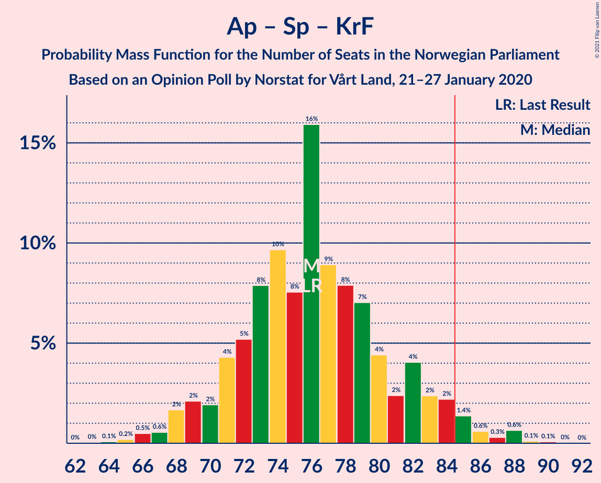

| Number of Seats | Probability | Accumulated | Special Marks |
|:---------------:|:-----------:|:-----------:|:-------------:|
| 64 | 0.2% | 100% |  |
| 65 | 0.1% | 99.7% |  |
| 66 | 0.1% | 99.6% |  |
| 67 | 0.3% | 99.5% |  |
| 68 | 4% | 99.2% |  |
| 69 | 0.7% | 95% |  |
| 70 | 2% | 94% |  |
| 71 | 3% | 92% |  |
| 72 | 1.4% | 89% |  |
| 73 | 2% | 88% |  |
| 74 | 11% | 85% |  |
| 75 | 21% | 75% |  |
| 76 | 8% | 53% | Last Result |
| 77 | 19% | 45% |  |
| 78 | 0.8% | 26% | Median |
| 79 | 6% | 25% |  |
| 80 | 0.6% | 19% |  |
| 81 | 7% | 18% |  |
| 82 | 1.4% | 11% |  |
| 83 | 1.2% | 10% |  |
| 84 | 1.0% | 9% |  |
| 85 | 3% | 8% | Majority |
| 86 | 0.2% | 5% |  |
| 87 | 0.5% | 5% |  |
| 88 | 4% | 4% |  |
| 89 | 0% | 0.1% |  |
| 90 | 0% | 0.1% |  |
| 91 | 0% | 0% |  |

### Høyre – Fremskrittspartiet – Miljøpartiet De Grønne – Kristelig Folkeparti – Venstre

| Number of Seats | Probability | Accumulated | Special Marks |
|:---------------:|:-----------:|:-----------:|:-------------:|
| 67 | 0.1% | 100% |  |
| 68 | 0.1% | 99.9% |  |
| 69 | 0.2% | 99.8% |  |
| 70 | 0.2% | 99.6% |  |
| 71 | 0.7% | 99.4% |  |
| 72 | 1.0% | 98.7% |  |
| 73 | 1.3% | 98% |  |
| 74 | 0.8% | 96% |  |
| 75 | 5% | 96% |  |
| 76 | 3% | 91% |  |
| 77 | 3% | 88% |  |
| 78 | 6% | 85% |  |
| 79 | 1.5% | 79% |  |
| 80 | 18% | 78% |  |
| 81 | 1.0% | 60% |  |
| 82 | 21% | 59% | Median |
| 83 | 11% | 38% |  |
| 84 | 11% | 27% |  |
| 85 | 7% | 15% | Majority |
| 86 | 5% | 8% |  |
| 87 | 0.9% | 3% |  |
| 88 | 0.5% | 2% |  |
| 89 | 1.3% | 2% | Last Result |
| 90 | 0.1% | 0.5% |  |
| 91 | 0.1% | 0.4% |  |
| 92 | 0% | 0.2% |  |
| 93 | 0.1% | 0.2% |  |
| 94 | 0% | 0% |  |

### Høyre – Fremskrittspartiet – Kristelig Folkeparti – Venstre

| Number of Seats | Probability | Accumulated | Special Marks |
|:---------------:|:-----------:|:-----------:|:-------------:|
| 59 | 0% | 100% |  |
| 60 | 0.2% | 99.9% |  |
| 61 | 0.1% | 99.7% |  |
| 62 | 0.1% | 99.7% |  |
| 63 | 0.1% | 99.6% |  |
| 64 | 0.2% | 99.4% |  |
| 65 | 0.8% | 99.3% |  |
| 66 | 2% | 98% |  |
| 67 | 0.7% | 96% |  |
| 68 | 1.5% | 95% |  |
| 69 | 4% | 94% |  |
| 70 | 13% | 90% |  |
| 71 | 16% | 77% |  |
| 72 | 6% | 61% |  |
| 73 | 12% | 55% | Median |
| 74 | 15% | 43% |  |
| 75 | 12% | 28% |  |
| 76 | 2% | 16% |  |
| 77 | 1.2% | 14% |  |
| 78 | 0.2% | 13% |  |
| 79 | 5% | 13% |  |
| 80 | 5% | 7% |  |
| 81 | 0.9% | 2% |  |
| 82 | 0.5% | 0.8% |  |
| 83 | 0.2% | 0.4% |  |
| 84 | 0.1% | 0.2% |  |
| 85 | 0.1% | 0.1% | Majority |
| 86 | 0% | 0% |  |
| 87 | 0% | 0% |  |
| 88 | 0% | 0% | Last Result |

### Arbeiderpartiet – Senterpartiet

| Number of Seats | Probability | Accumulated | Special Marks |
|:---------------:|:-----------:|:-----------:|:-------------:|
| 59 | 0.1% | 100% |  |
| 60 | 0% | 99.9% |  |
| 61 | 0.2% | 99.9% |  |
| 62 | 0.7% | 99.7% |  |
| 63 | 0.3% | 99.0% |  |
| 64 | 0.9% | 98.6% |  |
| 65 | 5% | 98% |  |
| 66 | 0.9% | 93% |  |
| 67 | 7% | 92% |  |
| 68 | 12% | 85% | Last Result |
| 69 | 11% | 73% |  |
| 70 | 4% | 61% |  |
| 71 | 16% | 57% | Median |
| 72 | 19% | 41% |  |
| 73 | 6% | 22% |  |
| 74 | 3% | 15% |  |
| 75 | 2% | 12% |  |
| 76 | 3% | 10% |  |
| 77 | 0.2% | 7% |  |
| 78 | 0.7% | 7% |  |
| 79 | 5% | 6% |  |
| 80 | 1.3% | 2% |  |
| 81 | 0.1% | 0.4% |  |
| 82 | 0.1% | 0.3% |  |
| 83 | 0.1% | 0.2% |  |
| 84 | 0% | 0.1% |  |
| 85 | 0.1% | 0.1% | Majority |
| 86 | 0% | 0% |  |

### Høyre – Fremskrittspartiet – Venstre

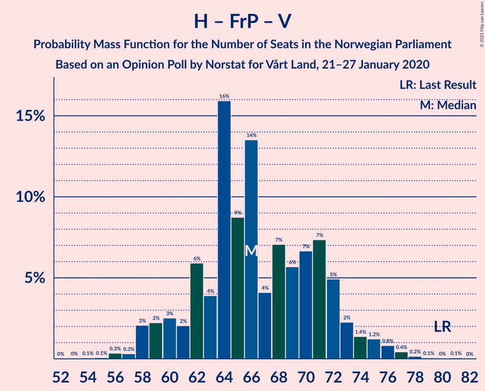

| Number of Seats | Probability | Accumulated | Special Marks |
|:---------------:|:-----------:|:-----------:|:-------------:|
| 54 | 0.1% | 100% |  |
| 55 | 0.1% | 99.9% |  |
| 56 | 0.1% | 99.8% |  |
| 57 | 0.2% | 99.8% |  |
| 58 | 0.8% | 99.6% |  |
| 59 | 0.1% | 98.8% |  |
| 60 | 1.3% | 98.7% |  |
| 61 | 7% | 97% |  |
| 62 | 4% | 90% |  |
| 63 | 6% | 87% |  |
| 64 | 1.1% | 81% |  |
| 65 | 12% | 80% |  |
| 66 | 5% | 68% | Median |
| 67 | 6% | 63% |  |
| 68 | 22% | 57% |  |
| 69 | 4% | 35% |  |
| 70 | 6% | 31% |  |
| 71 | 15% | 25% |  |
| 72 | 7% | 10% |  |
| 73 | 0.7% | 3% |  |
| 74 | 1.3% | 2% |  |
| 75 | 0.1% | 1.0% |  |
| 76 | 0.2% | 0.8% |  |
| 77 | 0% | 0.6% |  |
| 78 | 0.2% | 0.5% |  |
| 79 | 0.3% | 0.4% |  |
| 80 | 0% | 0.1% | Last Result |
| 81 | 0% | 0.1% |  |
| 82 | 0.1% | 0.1% |  |
| 83 | 0% | 0% |  |

### Høyre – Fremskrittspartiet

| Number of Seats | Probability | Accumulated | Special Marks |
|:---------------:|:-----------:|:-----------:|:-------------:|
| 52 | 0.1% | 100% |  |
| 53 | 0.1% | 99.9% |  |
| 54 | 0.1% | 99.8% |  |
| 55 | 0.3% | 99.8% |  |
| 56 | 0.3% | 99.5% |  |
| 57 | 0.9% | 99.2% |  |
| 58 | 1.2% | 98% |  |
| 59 | 8% | 97% |  |
| 60 | 9% | 89% |  |
| 61 | 17% | 81% |  |
| 62 | 3% | 63% |  |
| 63 | 10% | 61% |  |
| 64 | 15% | 51% | Median |
| 65 | 3% | 35% |  |
| 66 | 9% | 32% |  |
| 67 | 3% | 23% |  |
| 68 | 6% | 20% |  |
| 69 | 5% | 13% |  |
| 70 | 2% | 8% |  |
| 71 | 5% | 6% |  |
| 72 | 0.1% | 0.9% | Last Result |
| 73 | 0.1% | 0.8% |  |
| 74 | 0.1% | 0.7% |  |
| 75 | 0.1% | 0.6% |  |
| 76 | 0.2% | 0.5% |  |
| 77 | 0.2% | 0.2% |  |
| 78 | 0% | 0% |  |

### Arbeiderpartiet – Sosialistisk Venstreparti

| Number of Seats | Probability | Accumulated | Special Marks |
|:---------------:|:-----------:|:-----------:|:-------------:|
| 51 | 0.1% | 100% |  |
| 52 | 0.1% | 99.9% |  |
| 53 | 0.3% | 99.8% |  |
| 54 | 0.2% | 99.6% |  |
| 55 | 1.2% | 99.4% |  |
| 56 | 7% | 98% |  |
| 57 | 4% | 92% |  |
| 58 | 5% | 88% |  |
| 59 | 12% | 82% |  |
| 60 | 16% | 71% | Last Result |
| 61 | 7% | 55% |  |
| 62 | 19% | 48% | Median |
| 63 | 11% | 28% |  |
| 64 | 7% | 17% |  |
| 65 | 0.7% | 10% |  |
| 66 | 3% | 9% |  |
| 67 | 3% | 6% |  |
| 68 | 0.7% | 3% |  |
| 69 | 0.8% | 2% |  |
| 70 | 0.5% | 1.1% |  |
| 71 | 0.2% | 0.6% |  |
| 72 | 0.1% | 0.5% |  |
| 73 | 0.3% | 0.4% |  |
| 74 | 0% | 0.1% |  |
| 75 | 0% | 0% |  |

### Høyre – Kristelig Folkeparti – Venstre

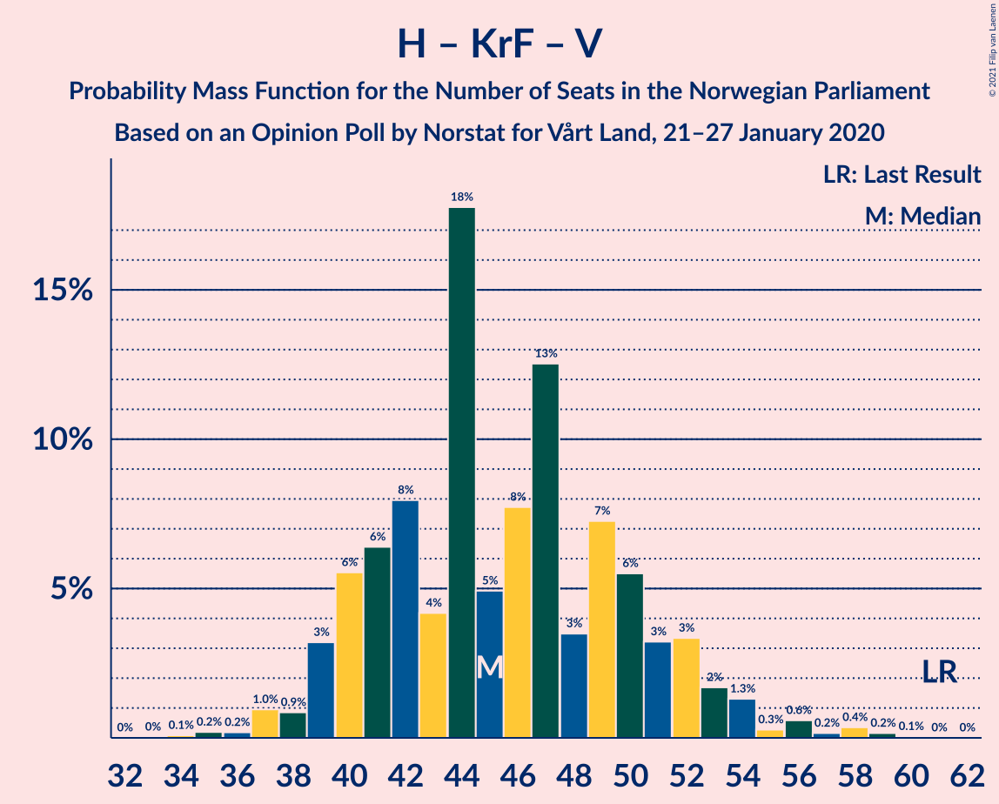

| Number of Seats | Probability | Accumulated | Special Marks |
|:---------------:|:-----------:|:-----------:|:-------------:|
| 34 | 0.1% | 100% |  |
| 35 | 0.1% | 99.9% |  |
| 36 | 0.4% | 99.8% |  |
| 37 | 0.3% | 99.4% |  |
| 38 | 0.4% | 99.2% |  |
| 39 | 0.6% | 98.8% |  |
| 40 | 0.7% | 98% |  |
| 41 | 2% | 98% |  |
| 42 | 3% | 96% |  |
| 43 | 8% | 93% |  |
| 44 | 6% | 85% |  |
| 45 | 9% | 79% |  |
| 46 | 16% | 71% |  |
| 47 | 13% | 55% | Median |
| 48 | 2% | 42% |  |
| 49 | 25% | 40% |  |
| 50 | 6% | 15% |  |
| 51 | 5% | 9% |  |
| 52 | 1.3% | 3% |  |
| 53 | 1.0% | 2% |  |
| 54 | 0.3% | 1.1% |  |
| 55 | 0.2% | 0.8% |  |
| 56 | 0.5% | 0.6% |  |
| 57 | 0.1% | 0.2% |  |
| 58 | 0% | 0.1% |  |
| 59 | 0% | 0% |  |
| 60 | 0% | 0% |  |
| 61 | 0% | 0% | Last Result |

### Senterpartiet – Kristelig Folkeparti – Venstre

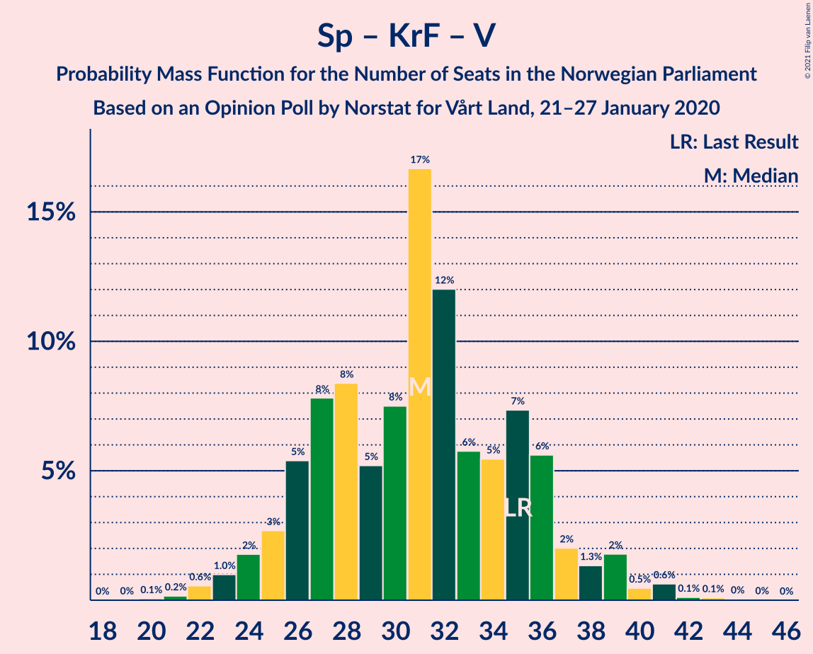

| Number of Seats | Probability | Accumulated | Special Marks |
|:---------------:|:-----------:|:-----------:|:-------------:|
| 20 | 0.1% | 100% |  |
| 21 | 0.1% | 99.9% |  |
| 22 | 0.6% | 99.8% |  |
| 23 | 0.6% | 99.2% |  |
| 24 | 2% | 98.6% |  |
| 25 | 0.5% | 96% |  |
| 26 | 3% | 96% |  |
| 27 | 7% | 93% |  |
| 28 | 3% | 85% |  |
| 29 | 6% | 83% |  |
| 30 | 2% | 77% |  |
| 31 | 2% | 75% |  |
| 32 | 31% | 73% | Median |
| 33 | 5% | 42% |  |
| 34 | 0.7% | 37% |  |
| 35 | 12% | 37% | Last Result |
| 36 | 15% | 25% |  |
| 37 | 3% | 10% |  |
| 38 | 0.1% | 6% |  |
| 39 | 6% | 6% |  |
| 40 | 0.3% | 0.6% |  |
| 41 | 0% | 0.3% |  |
| 42 | 0.1% | 0.2% |  |
| 43 | 0.1% | 0.2% |  |
| 44 | 0% | 0% |  |

## Technical Information

### Opinion Poll

+ **Polling firm:** Norstat
+ **Commissioner(s):** Vårt Land
+ **Fieldwork period:** 21–27 January 2020

### Calculations

+ **Sample size:** 628
+ **Simulations done:** 131,072
+ **Error estimate:** 2.50%

