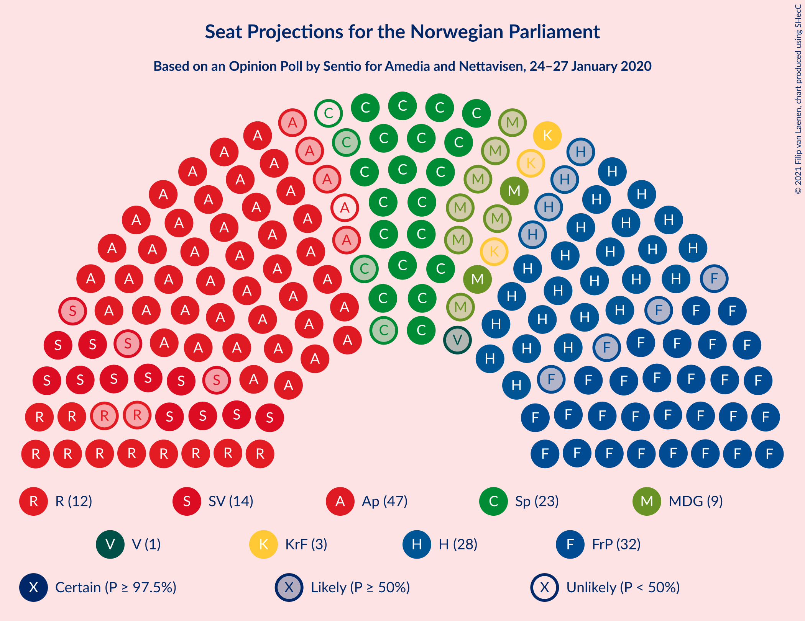
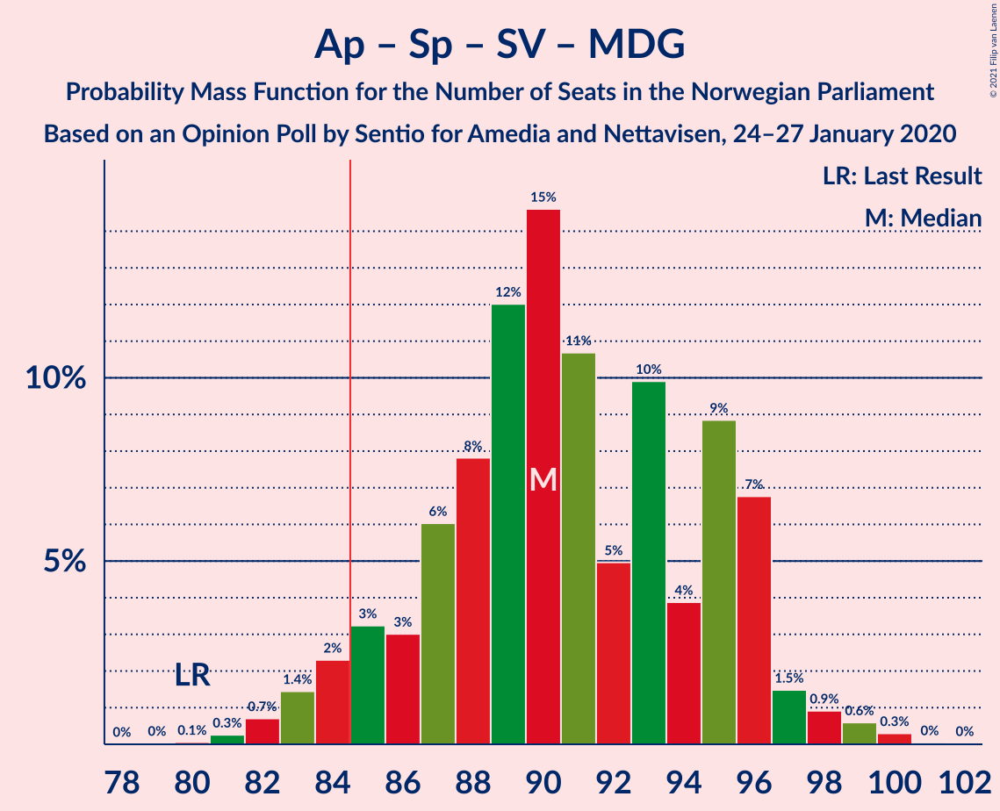
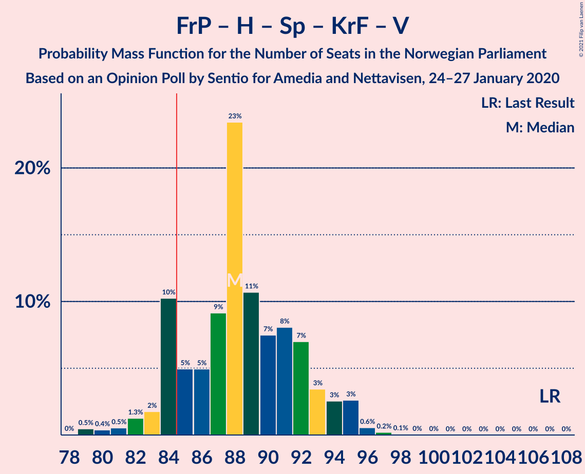
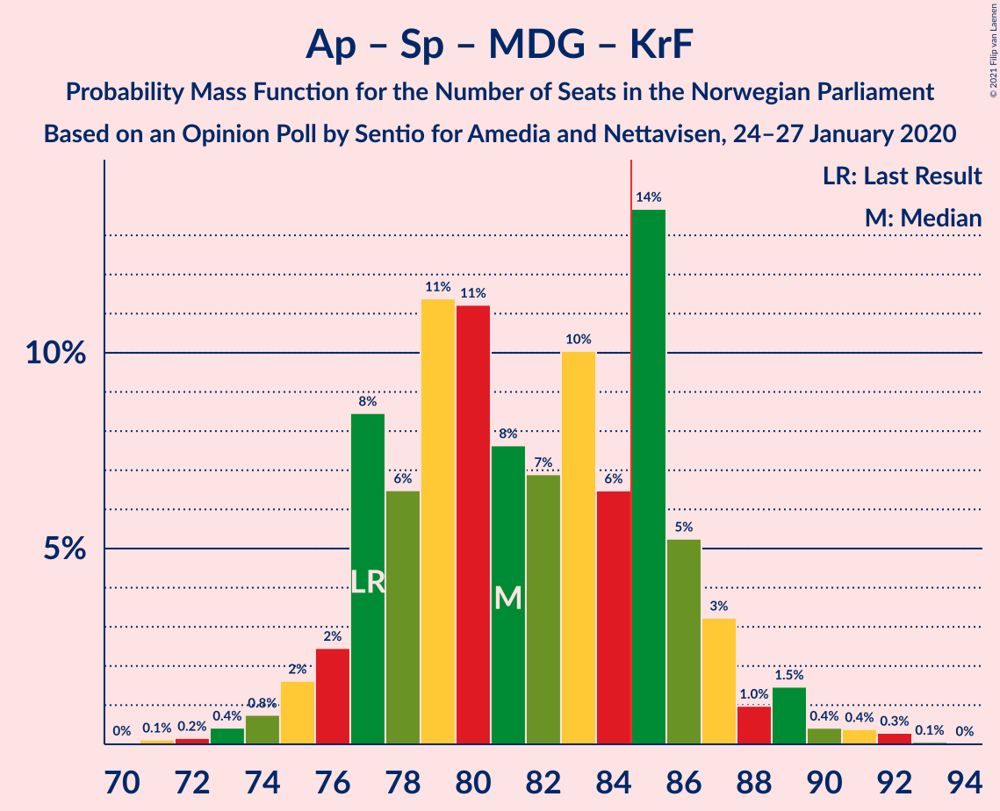
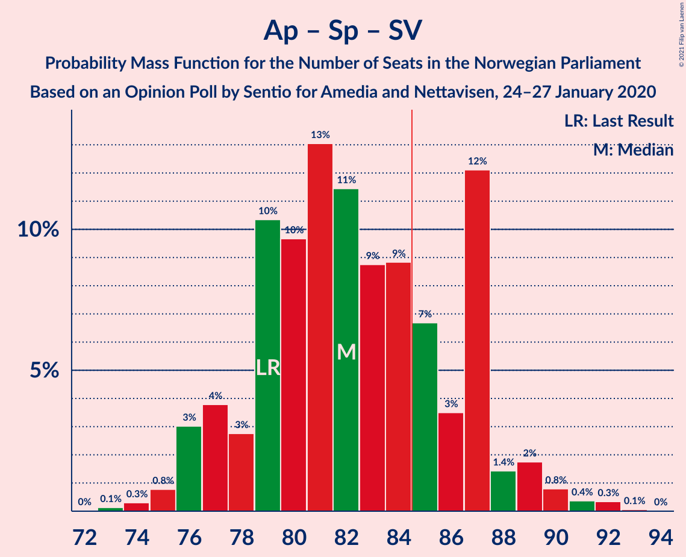
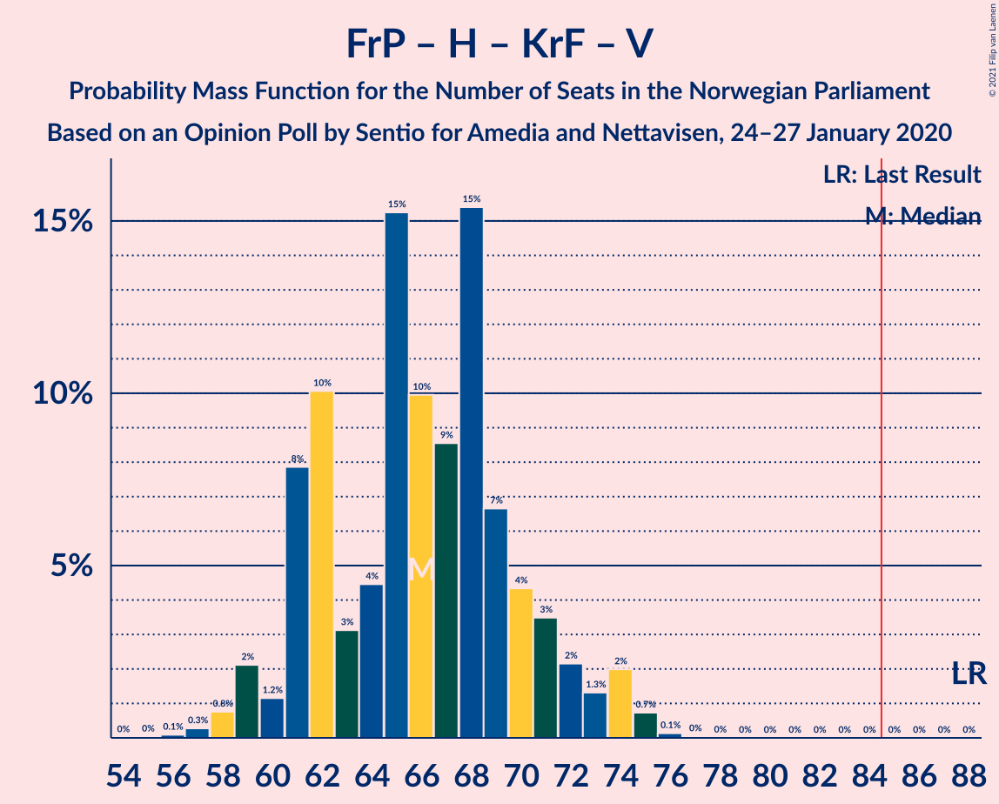
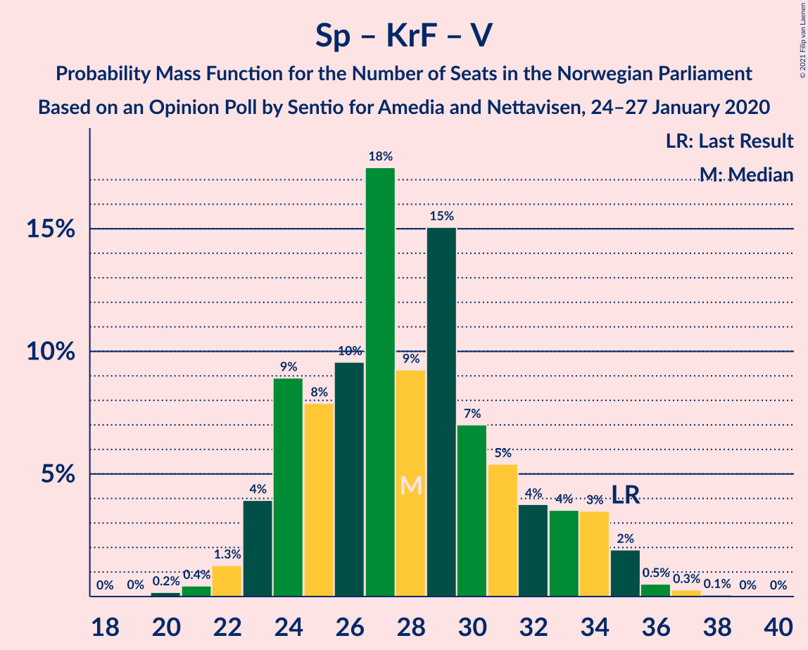

# Opinion Poll by Sentio for Amedia and Nettavisen, 24–27 January 2020

<a href="#voting-intentions">Voting Intentions</a> | <a href="#seats">Seats</a> | <a href="#coalitions">Coalitions</a> | <a href="#technical-information">Technical Information</a>

## Voting Intentions

### Confidence Intervals

| Party | Last Result | Poll Result | 80% Confidence Interval | 90% Confidence Interval | 95% Confidence Interval | 99% Confidence Interval |
|:-----:|:-----------:|:-----------:|:-----------------------:|:-----------------------:|:-----------------------:|:-----------------------:|
| Arbeiderpartiet | 27.4% | 25.6% | 23.9–27.5% |23.4–28.0% |23.0–28.4% |22.2–29.3% |
| Fremskrittspartiet | 15.2% | 17.6% | 16.1–19.2% |15.7–19.7% |15.3–20.1% |14.7–20.9% |
| Høyre | 25.0% | 16.2% | 14.8–17.8% |14.4–18.2% |14.0–18.6% |13.4–19.4% |
| Senterpartiet | 10.3% | 12.5% | 11.3–13.9% |10.9–14.4% |10.6–14.7% |10.0–15.4% |
| Sosialistisk Venstreparti | 6.0% | 7.7% | 6.8–8.9% |6.5–9.3% |6.2–9.6% |5.8–10.2% |
| Rødt | 2.4% | 7.0% | 6.0–8.1% |5.8–8.4% |5.5–8.7% |5.1–9.3% |
| Miljøpartiet De Grønne | 3.2% | 4.9% | 4.1–5.9% |3.9–6.1% |3.7–6.4% |3.4–6.9% |
| Kristelig Folkeparti | 4.2% | 3.9% | 3.2–4.8% |3.0–5.0% |2.8–5.3% |2.5–5.7% |
| Venstre | 4.4% | 2.0% | 1.5–2.7% |1.4–2.9% |1.3–3.0% |1.1–3.4% |

*Note:* The poll result column reflects the actual value used in the calculations. Published results may vary slightly, and in addition be rounded to fewer digits.

## Seats

### Confidence Intervals

| Party | Last Result | Median | 80% Confidence Interval | 90% Confidence Interval | 95% Confidence Interval | 99% Confidence Interval |
|:-----:|:-----------:|:------:|:-----------------------:|:-----------------------:|:-----------------------:|:-----------------------:|
| <a href="#arbeiderpartiet">Arbeiderpartiet</a> | 49 | 46 | 43–49 |43–52 |41–52 |41–54 |
| <a href="#fremskrittspartiet">Fremskrittspartiet</a> | 27 | 33 | 29–35 |28–35 |27–35 |26–36 |
| <a href="#høyre">Høyre</a> | 45 | 29 | 26–31 |24–31 |24–33 |23–34 |
| <a href="#senterpartiet">Senterpartiet</a> | 19 | 23 | 20–26 |20–26 |19–26 |19–28 |
| <a href="#sosialistisk-venstreparti">Sosialistisk Venstreparti</a> | 11 | 14 | 12–16 |12–16 |11–17 |10–18 |
| <a href="#rødt">Rødt</a> | 1 | 12 | 11–14 |10–15 |10–15 |9–16 |
| <a href="#miljøpartiet-de-grønne">Miljøpartiet De Grønne</a> | 1 | 8 | 3–10 |2–10 |2–11 |2–12 |
| <a href="#kristelig-folkeparti">Kristelig Folkeparti</a> | 8 | 3 | 2–8 |2–9 |1–9 |1–10 |
| <a href="#venstre">Venstre</a> | 8 | 1 | 0–1 |0–2 |0–2 |0–2 |

### Arbeiderpartiet

*For a full overview of the results for this party, see the [Arbeiderpartiet](party-arbeiderpartiet.html) page.*

| Number of Seats | Probability | Accumulated | Special Marks |
|:---------------:|:-----------:|:-----------:|:-------------:|
| 40 | 0.2% | 100% |  |
| 41 | 3% | 99.8% |  |
| 42 | 1.3% | 97% |  |
| 43 | 13% | 95% |  |
| 44 | 17% | 82% |  |
| 45 | 9% | 65% |  |
| 46 | 11% | 56% | Median |
| 47 | 12% | 44% |  |
| 48 | 20% | 32% |  |
| 49 | 3% | 12% | Last Result |
| 50 | 0.8% | 9% |  |
| 51 | 1.3% | 8% |  |
| 52 | 6% | 7% |  |
| 53 | 0% | 0.6% |  |
| 54 | 0.1% | 0.5% |  |
| 55 | 0.4% | 0.4% |  |
| 56 | 0% | 0% |  |

### Fremskrittspartiet

*For a full overview of the results for this party, see the [Fremskrittspartiet](party-fremskrittspartiet.html) page.*

| Number of Seats | Probability | Accumulated | Special Marks |
|:---------------:|:-----------:|:-----------:|:-------------:|
| 25 | 0% | 100% |  |
| 26 | 0.5% | 99.9% |  |
| 27 | 2% | 99.5% | Last Result |
| 28 | 5% | 97% |  |
| 29 | 12% | 92% |  |
| 30 | 4% | 80% |  |
| 31 | 6% | 76% |  |
| 32 | 13% | 70% |  |
| 33 | 13% | 57% | Median |
| 34 | 17% | 45% |  |
| 35 | 26% | 28% |  |
| 36 | 0.9% | 1.2% |  |
| 37 | 0.1% | 0.3% |  |
| 38 | 0.1% | 0.2% |  |
| 39 | 0.1% | 0.1% |  |
| 40 | 0% | 0% |  |

### Høyre

*For a full overview of the results for this party, see the [Høyre](party-høyre.html) page.*

| Number of Seats | Probability | Accumulated | Special Marks |
|:---------------:|:-----------:|:-----------:|:-------------:|
| 21 | 0% | 100% |  |
| 22 | 0.1% | 99.9% |  |
| 23 | 0.7% | 99.8% |  |
| 24 | 6% | 99.2% |  |
| 25 | 1.0% | 93% |  |
| 26 | 2% | 92% |  |
| 27 | 14% | 90% |  |
| 28 | 9% | 76% |  |
| 29 | 40% | 66% | Median |
| 30 | 16% | 26% |  |
| 31 | 6% | 11% |  |
| 32 | 2% | 5% |  |
| 33 | 2% | 3% |  |
| 34 | 0.9% | 1.1% |  |
| 35 | 0.1% | 0.2% |  |
| 36 | 0.1% | 0.1% |  |
| 37 | 0% | 0% |  |
| 38 | 0% | 0% |  |
| 39 | 0% | 0% |  |
| 40 | 0% | 0% |  |
| 41 | 0% | 0% |  |
| 42 | 0% | 0% |  |
| 43 | 0% | 0% |  |
| 44 | 0% | 0% |  |
| 45 | 0% | 0% | Last Result |

### Senterpartiet

*For a full overview of the results for this party, see the [Senterpartiet](party-senterpartiet.html) page.*

| Number of Seats | Probability | Accumulated | Special Marks |
|:---------------:|:-----------:|:-----------:|:-------------:|
| 17 | 0% | 100% |  |
| 18 | 0.2% | 99.9% |  |
| 19 | 4% | 99.7% | Last Result |
| 20 | 19% | 96% |  |
| 21 | 14% | 77% |  |
| 22 | 11% | 63% |  |
| 23 | 5% | 52% | Median |
| 24 | 28% | 47% |  |
| 25 | 5% | 19% |  |
| 26 | 12% | 14% |  |
| 27 | 1.3% | 2% |  |
| 28 | 0.2% | 0.5% |  |
| 29 | 0.2% | 0.3% |  |
| 30 | 0.1% | 0.1% |  |
| 31 | 0% | 0% |  |

### Sosialistisk Venstreparti

*For a full overview of the results for this party, see the [Sosialistisk Venstreparti](party-sosialistiskvenstreparti.html) page.*

| Number of Seats | Probability | Accumulated | Special Marks |
|:---------------:|:-----------:|:-----------:|:-------------:|
| 9 | 0.4% | 100% |  |
| 10 | 1.5% | 99.6% |  |
| 11 | 3% | 98% | Last Result |
| 12 | 22% | 96% |  |
| 13 | 18% | 73% |  |
| 14 | 11% | 55% | Median |
| 15 | 34% | 44% |  |
| 16 | 7% | 11% |  |
| 17 | 2% | 3% |  |
| 18 | 0.8% | 1.0% |  |
| 19 | 0.1% | 0.2% |  |
| 20 | 0.1% | 0.1% |  |
| 21 | 0% | 0% |  |

### Rødt

*For a full overview of the results for this party, see the [Rødt](party-rødt.html) page.*

| Number of Seats | Probability | Accumulated | Special Marks |
|:---------------:|:-----------:|:-----------:|:-------------:|
| 1 | 0% | 100% | Last Result |
| 2 | 0% | 100% |  |
| 3 | 0% | 100% |  |
| 4 | 0% | 100% |  |
| 5 | 0% | 100% |  |
| 6 | 0% | 100% |  |
| 7 | 0% | 100% |  |
| 8 | 0.2% | 100% |  |
| 9 | 1.4% | 99.8% |  |
| 10 | 6% | 98% |  |
| 11 | 23% | 92% |  |
| 12 | 28% | 69% | Median |
| 13 | 20% | 41% |  |
| 14 | 16% | 21% |  |
| 15 | 3% | 5% |  |
| 16 | 2% | 2% |  |
| 17 | 0.2% | 0.4% |  |
| 18 | 0.1% | 0.1% |  |
| 19 | 0% | 0% |  |

### Miljøpartiet De Grønne

*For a full overview of the results for this party, see the [Miljøpartiet De Grønne](party-miljøpartietdegrønne.html) page.*

| Number of Seats | Probability | Accumulated | Special Marks |
|:---------------:|:-----------:|:-----------:|:-------------:|
| 1 | 0.4% | 100% | Last Result |
| 2 | 9% | 99.6% |  |
| 3 | 8% | 91% |  |
| 4 | 0.2% | 83% |  |
| 5 | 0% | 83% |  |
| 6 | 0% | 83% |  |
| 7 | 3% | 83% |  |
| 8 | 34% | 81% | Median |
| 9 | 27% | 47% |  |
| 10 | 16% | 20% |  |
| 11 | 3% | 4% |  |
| 12 | 0.7% | 0.9% |  |
| 13 | 0.1% | 0.2% |  |
| 14 | 0% | 0% |  |

### Kristelig Folkeparti

*For a full overview of the results for this party, see the [Kristelig Folkeparti](party-kristeligfolkeparti.html) page.*

| Number of Seats | Probability | Accumulated | Special Marks |
|:---------------:|:-----------:|:-----------:|:-------------:|
| 1 | 4% | 100% |  |
| 2 | 12% | 96% |  |
| 3 | 50% | 84% | Median |
| 4 | 0% | 34% |  |
| 5 | 0% | 34% |  |
| 6 | 0.2% | 34% |  |
| 7 | 6% | 34% |  |
| 8 | 23% | 28% | Last Result |
| 9 | 5% | 6% |  |
| 10 | 0.7% | 0.8% |  |
| 11 | 0.1% | 0.1% |  |
| 12 | 0% | 0% |  |

### Venstre

*For a full overview of the results for this party, see the [Venstre](party-venstre.html) page.*

| Number of Seats | Probability | Accumulated | Special Marks |
|:---------------:|:-----------:|:-----------:|:-------------:|
| 0 | 43% | 100% |  |
| 1 | 47% | 57% | Median |
| 2 | 10% | 10% |  |
| 3 | 0% | 0% |  |
| 4 | 0% | 0% |  |
| 5 | 0% | 0% |  |
| 6 | 0% | 0% |  |
| 7 | 0% | 0% |  |
| 8 | 0% | 0% | Last Result |

## Coalitions

### Confidence Intervals

| Coalition | Last Result | Median | Majority? | 80% Confidence Interval | 90% Confidence Interval | 95% Confidence Interval | 99% Confidence Interval |
|:---------:|:-----------:|:------:|:---------:|:-----------------------:|:-----------------------:|:-----------------------:|:-----------------------:|
| Arbeiderpartiet – Senterpartiet – Sosialistisk Venstreparti – Rødt – Miljøpartiet De Grønne | 81 | 103 | 100% | 99–107 | 97–109 | 97–110 | 95–111 |
| Arbeiderpartiet – Senterpartiet – Sosialistisk Venstreparti – Miljøpartiet De Grønne – Kristelig Folkeparti | 88 | 95 | 100% | 92–99 | 90–100 | 89–102 | 86–103 |
| Arbeiderpartiet – Senterpartiet – Sosialistisk Venstreparti – Rødt | 80 | 95 | 100% | 92–99 | 91–100 | 89–101 | 86–103 |
| Arbeiderpartiet – Senterpartiet – Sosialistisk Venstreparti – Miljøpartiet De Grønne | 80 | 90 | 94% | 87–94 | 84–96 | 84–97 | 83–98 |
| Fremskrittspartiet – Høyre – Senterpartiet – Kristelig Folkeparti – Venstre | 107 | 88 | 91% | 85–94 | 83–96 | 82–96 | 81–96 |
| Arbeiderpartiet – Senterpartiet – Miljøpartiet De Grønne – Kristelig Folkeparti | 77 | 80 | 18% | 77–86 | 76–87 | 76–90 | 73–90 |
| Arbeiderpartiet – Senterpartiet – Sosialistisk Venstreparti | 79 | 83 | 15% | 79–86 | 77–87 | 77–88 | 74–91 |
| Arbeiderpartiet – Senterpartiet – Kristelig Folkeparti | 76 | 72 | 0% | 70–79 | 68–81 | 67–83 | 66–83 |
| Fremskrittspartiet – Høyre – Miljøpartiet De Grønne – Kristelig Folkeparti – Venstre | 89 | 74 | 0% | 70–77 | 69–78 | 68–79 | 65–82 |
| Arbeiderpartiet – Senterpartiet | 68 | 68 | 0% | 66–72 | 64–73 | 64–75 | 62–77 |
| Fremskrittspartiet – Høyre – Kristelig Folkeparti – Venstre | 88 | 66 | 0% | 62–70 | 60–72 | 59–72 | 58–74 |
| Fremskrittspartiet – Høyre – Venstre | 80 | 62 | 0% | 57–65 | 57–66 | 56–67 | 54–68 |
| Fremskrittspartiet – Høyre | 72 | 62 | 0% | 57–64 | 56–65 | 56–66 | 53–67 |
| Arbeiderpartiet – Sosialistisk Venstreparti | 60 | 59 | 0% | 57–64 | 56–64 | 55–65 | 53–68 |
| Høyre – Kristelig Folkeparti – Venstre | 61 | 33 | 0% | 31–38 | 30–38 | 29–39 | 28–42 |
| Senterpartiet – Kristelig Folkeparti – Venstre | 35 | 28 | 0% | 23–34 | 23–35 | 23–35 | 22–37 |

### Arbeiderpartiet – Senterpartiet – Sosialistisk Venstreparti – Rødt – Miljøpartiet De Grønne

| Number of Seats | Probability | Accumulated | Special Marks |
|:---------------:|:-----------:|:-----------:|:-------------:|
| 81 | 0% | 100% | Last Result |
| 82 | 0% | 100% |  |
| 83 | 0% | 100% |  |
| 84 | 0% | 100% |  |
| 85 | 0% | 100% | Majority |
| 86 | 0% | 100% |  |
| 87 | 0% | 100% |  |
| 88 | 0% | 100% |  |
| 89 | 0% | 100% |  |
| 90 | 0% | 100% |  |
| 91 | 0% | 100% |  |
| 92 | 0.1% | 100% |  |
| 93 | 0.2% | 99.9% |  |
| 94 | 0.1% | 99.6% |  |
| 95 | 0.9% | 99.5% |  |
| 96 | 0.4% | 98.6% |  |
| 97 | 4% | 98% |  |
| 98 | 2% | 94% |  |
| 99 | 9% | 92% |  |
| 100 | 2% | 82% |  |
| 101 | 21% | 80% |  |
| 102 | 4% | 59% |  |
| 103 | 21% | 55% | Median |
| 104 | 12% | 34% |  |
| 105 | 4% | 22% |  |
| 106 | 0.8% | 17% |  |
| 107 | 9% | 17% |  |
| 108 | 2% | 8% |  |
| 109 | 3% | 5% |  |
| 110 | 2% | 3% |  |
| 111 | 0.4% | 0.5% |  |
| 112 | 0.1% | 0.2% |  |
| 113 | 0% | 0.1% |  |
| 114 | 0% | 0% |  |

### Arbeiderpartiet – Senterpartiet – Sosialistisk Venstreparti – Miljøpartiet De Grønne – Kristelig Folkeparti

| Number of Seats | Probability | Accumulated | Special Marks |
|:---------------:|:-----------:|:-----------:|:-------------:|
| 85 | 0% | 100% | Majority |
| 86 | 0.7% | 99.9% |  |
| 87 | 0.4% | 99.3% |  |
| 88 | 0.3% | 98.9% | Last Result |
| 89 | 2% | 98.7% |  |
| 90 | 5% | 97% |  |
| 91 | 1.2% | 92% |  |
| 92 | 6% | 91% |  |
| 93 | 21% | 85% |  |
| 94 | 13% | 64% | Median |
| 95 | 21% | 51% |  |
| 96 | 5% | 30% |  |
| 97 | 6% | 25% |  |
| 98 | 3% | 19% |  |
| 99 | 9% | 17% |  |
| 100 | 3% | 8% |  |
| 101 | 0.4% | 5% |  |
| 102 | 4% | 4% |  |
| 103 | 0.5% | 0.8% |  |
| 104 | 0.1% | 0.2% |  |
| 105 | 0.1% | 0.2% |  |
| 106 | 0% | 0.1% |  |
| 107 | 0% | 0% |  |

### Arbeiderpartiet – Senterpartiet – Sosialistisk Venstreparti – Rødt

| Number of Seats | Probability | Accumulated | Special Marks |
|:---------------:|:-----------:|:-----------:|:-------------:|
| 80 | 0% | 100% | Last Result |
| 81 | 0% | 100% |  |
| 82 | 0% | 100% |  |
| 83 | 0% | 100% |  |
| 84 | 0% | 100% |  |
| 85 | 0.2% | 100% | Majority |
| 86 | 0.9% | 99.8% |  |
| 87 | 0.4% | 98.9% |  |
| 88 | 0.9% | 98% |  |
| 89 | 0.8% | 98% |  |
| 90 | 1.1% | 97% |  |
| 91 | 4% | 96% |  |
| 92 | 6% | 91% |  |
| 93 | 16% | 86% |  |
| 94 | 8% | 70% |  |
| 95 | 26% | 61% | Median |
| 96 | 13% | 35% |  |
| 97 | 10% | 22% |  |
| 98 | 1.1% | 12% |  |
| 99 | 4% | 11% |  |
| 100 | 2% | 6% |  |
| 101 | 3% | 4% |  |
| 102 | 0.6% | 1.2% |  |
| 103 | 0.1% | 0.6% |  |
| 104 | 0.1% | 0.5% |  |
| 105 | 0.1% | 0.3% |  |
| 106 | 0.1% | 0.3% |  |
| 107 | 0% | 0.1% |  |
| 108 | 0.1% | 0.1% |  |
| 109 | 0% | 0% |  |

### Arbeiderpartiet – Senterpartiet – Sosialistisk Venstreparti – Miljøpartiet De Grønne

| Number of Seats | Probability | Accumulated | Special Marks |
|:---------------:|:-----------:|:-----------:|:-------------:|
| 80 | 0.1% | 100% | Last Result |
| 81 | 0.3% | 99.9% |  |
| 82 | 0.1% | 99.6% |  |
| 83 | 1.4% | 99.5% |  |
| 84 | 4% | 98% |  |
| 85 | 0.9% | 94% | Majority |
| 86 | 2% | 94% |  |
| 87 | 13% | 91% |  |
| 88 | 3% | 79% |  |
| 89 | 6% | 76% |  |
| 90 | 22% | 70% |  |
| 91 | 17% | 48% | Median |
| 92 | 5% | 31% |  |
| 93 | 14% | 26% |  |
| 94 | 6% | 12% |  |
| 95 | 1.1% | 6% |  |
| 96 | 2% | 5% |  |
| 97 | 2% | 3% |  |
| 98 | 0.6% | 0.9% |  |
| 99 | 0.2% | 0.3% |  |
| 100 | 0% | 0.1% |  |
| 101 | 0% | 0.1% |  |
| 102 | 0.1% | 0.1% |  |
| 103 | 0% | 0% |  |

### Fremskrittspartiet – Høyre – Senterpartiet – Kristelig Folkeparti – Venstre

| Number of Seats | Probability | Accumulated | Special Marks |
|:---------------:|:-----------:|:-----------:|:-------------:|
| 78 | 0.1% | 100% |  |
| 79 | 0.1% | 99.9% |  |
| 80 | 0.2% | 99.8% |  |
| 81 | 0.8% | 99.6% |  |
| 82 | 3% | 98.9% |  |
| 83 | 2% | 96% |  |
| 84 | 3% | 94% |  |
| 85 | 4% | 91% | Majority |
| 86 | 20% | 87% |  |
| 87 | 14% | 68% |  |
| 88 | 5% | 54% |  |
| 89 | 2% | 48% | Median |
| 90 | 3% | 46% |  |
| 91 | 14% | 43% |  |
| 92 | 17% | 30% |  |
| 93 | 3% | 13% |  |
| 94 | 2% | 10% |  |
| 95 | 1.0% | 9% |  |
| 96 | 8% | 8% |  |
| 97 | 0.1% | 0.2% |  |
| 98 | 0% | 0.1% |  |
| 99 | 0% | 0% |  |
| 100 | 0% | 0% |  |
| 101 | 0% | 0% |  |
| 102 | 0% | 0% |  |
| 103 | 0% | 0% |  |
| 104 | 0% | 0% |  |
| 105 | 0% | 0% |  |
| 106 | 0% | 0% |  |
| 107 | 0% | 0% | Last Result |

### Arbeiderpartiet – Senterpartiet – Miljøpartiet De Grønne – Kristelig Folkeparti

| Number of Seats | Probability | Accumulated | Special Marks |
|:---------------:|:-----------:|:-----------:|:-------------:|
| 70 | 0.1% | 100% |  |
| 71 | 0% | 99.9% |  |
| 72 | 0.2% | 99.9% |  |
| 73 | 0.2% | 99.6% |  |
| 74 | 0.3% | 99.4% |  |
| 75 | 1.2% | 99.1% |  |
| 76 | 4% | 98% |  |
| 77 | 4% | 94% | Last Result |
| 78 | 15% | 90% |  |
| 79 | 13% | 75% |  |
| 80 | 12% | 62% | Median |
| 81 | 12% | 50% |  |
| 82 | 10% | 38% |  |
| 83 | 3% | 29% |  |
| 84 | 7% | 25% |  |
| 85 | 6% | 18% | Majority |
| 86 | 6% | 12% |  |
| 87 | 2% | 6% |  |
| 88 | 1.3% | 5% |  |
| 89 | 0.6% | 3% |  |
| 90 | 2% | 3% |  |
| 91 | 0.3% | 0.4% |  |
| 92 | 0.1% | 0.1% |  |
| 93 | 0% | 0.1% |  |
| 94 | 0% | 0% |  |

### Arbeiderpartiet – Senterpartiet – Sosialistisk Venstreparti

| Number of Seats | Probability | Accumulated | Special Marks |
|:---------------:|:-----------:|:-----------:|:-------------:|
| 72 | 0.1% | 100% |  |
| 73 | 0.1% | 99.9% |  |
| 74 | 0.6% | 99.8% |  |
| 75 | 0.1% | 99.2% |  |
| 76 | 1.1% | 99.1% |  |
| 77 | 3% | 98% |  |
| 78 | 2% | 95% |  |
| 79 | 3% | 93% | Last Result |
| 80 | 3% | 90% |  |
| 81 | 12% | 87% |  |
| 82 | 25% | 75% |  |
| 83 | 21% | 50% | Median |
| 84 | 15% | 30% |  |
| 85 | 4% | 15% | Majority |
| 86 | 4% | 11% |  |
| 87 | 5% | 8% |  |
| 88 | 1.0% | 3% |  |
| 89 | 1.2% | 2% |  |
| 90 | 0.3% | 0.8% |  |
| 91 | 0.2% | 0.6% |  |
| 92 | 0.2% | 0.4% |  |
| 93 | 0.1% | 0.2% |  |
| 94 | 0% | 0.1% |  |
| 95 | 0% | 0.1% |  |
| 96 | 0.1% | 0.1% |  |
| 97 | 0% | 0% |  |

### Arbeiderpartiet – Senterpartiet – Kristelig Folkeparti

| Number of Seats | Probability | Accumulated | Special Marks |
|:---------------:|:-----------:|:-----------:|:-------------:|
| 63 | 0% | 100% |  |
| 64 | 0.1% | 99.9% |  |
| 65 | 0.2% | 99.9% |  |
| 66 | 0.7% | 99.7% |  |
| 67 | 3% | 99.0% |  |
| 68 | 1.1% | 96% |  |
| 69 | 2% | 95% |  |
| 70 | 23% | 93% |  |
| 71 | 16% | 70% |  |
| 72 | 10% | 54% | Median |
| 73 | 1.1% | 44% |  |
| 74 | 7% | 43% |  |
| 75 | 11% | 37% |  |
| 76 | 4% | 26% | Last Result |
| 77 | 6% | 22% |  |
| 78 | 0.8% | 16% |  |
| 79 | 9% | 15% |  |
| 80 | 0.7% | 7% |  |
| 81 | 3% | 6% |  |
| 82 | 0.4% | 3% |  |
| 83 | 3% | 3% |  |
| 84 | 0.1% | 0.1% |  |
| 85 | 0% | 0% | Majority |

### Fremskrittspartiet – Høyre – Miljøpartiet De Grønne – Kristelig Folkeparti – Venstre

| Number of Seats | Probability | Accumulated | Special Marks |
|:---------------:|:-----------:|:-----------:|:-------------:|
| 61 | 0.1% | 100% |  |
| 62 | 0% | 99.9% |  |
| 63 | 0.2% | 99.9% |  |
| 64 | 0.1% | 99.7% |  |
| 65 | 0.2% | 99.6% |  |
| 66 | 0.2% | 99.5% |  |
| 67 | 0.7% | 99.3% |  |
| 68 | 3% | 98.6% |  |
| 69 | 2% | 95% |  |
| 70 | 4% | 93% |  |
| 71 | 1.1% | 89% |  |
| 72 | 10% | 88% |  |
| 73 | 13% | 78% |  |
| 74 | 26% | 64% | Median |
| 75 | 8% | 38% |  |
| 76 | 17% | 30% |  |
| 77 | 6% | 14% |  |
| 78 | 4% | 8% |  |
| 79 | 1.0% | 3% |  |
| 80 | 0.8% | 2% |  |
| 81 | 0.8% | 2% |  |
| 82 | 0.3% | 0.8% |  |
| 83 | 0.3% | 0.4% |  |
| 84 | 0.1% | 0.2% |  |
| 85 | 0% | 0% | Majority |
| 86 | 0% | 0% |  |
| 87 | 0% | 0% |  |
| 88 | 0% | 0% |  |
| 89 | 0% | 0% | Last Result |

### Arbeiderpartiet – Senterpartiet

| Number of Seats | Probability | Accumulated | Special Marks |
|:---------------:|:-----------:|:-----------:|:-------------:|
| 60 | 0% | 100% |  |
| 61 | 0.2% | 99.9% |  |
| 62 | 1.2% | 99.7% |  |
| 63 | 0.9% | 98.5% |  |
| 64 | 4% | 98% |  |
| 65 | 0.5% | 94% |  |
| 66 | 7% | 94% |  |
| 67 | 17% | 87% |  |
| 68 | 25% | 70% | Last Result |
| 69 | 17% | 45% | Median |
| 70 | 1.5% | 28% |  |
| 71 | 9% | 27% |  |
| 72 | 8% | 18% |  |
| 73 | 5% | 9% |  |
| 74 | 0.4% | 4% |  |
| 75 | 3% | 4% |  |
| 76 | 0.3% | 0.9% |  |
| 77 | 0.2% | 0.5% |  |
| 78 | 0.2% | 0.4% |  |
| 79 | 0% | 0.2% |  |
| 80 | 0.1% | 0.1% |  |
| 81 | 0% | 0% |  |

### Fremskrittspartiet – Høyre – Kristelig Folkeparti – Venstre

| Number of Seats | Probability | Accumulated | Special Marks |
|:---------------:|:-----------:|:-----------:|:-------------:|
| 55 | 0% | 100% |  |
| 56 | 0% | 99.9% |  |
| 57 | 0.1% | 99.9% |  |
| 58 | 0.4% | 99.8% |  |
| 59 | 2% | 99.4% |  |
| 60 | 3% | 97% |  |
| 61 | 2% | 94% |  |
| 62 | 9% | 92% |  |
| 63 | 0.8% | 83% |  |
| 64 | 4% | 82% |  |
| 65 | 12% | 78% |  |
| 66 | 21% | 65% | Median |
| 67 | 5% | 45% |  |
| 68 | 21% | 40% |  |
| 69 | 2% | 19% |  |
| 70 | 9% | 17% |  |
| 71 | 2% | 7% |  |
| 72 | 4% | 5% |  |
| 73 | 0.4% | 1.0% |  |
| 74 | 0.4% | 0.6% |  |
| 75 | 0.1% | 0.2% |  |
| 76 | 0.1% | 0.1% |  |
| 77 | 0% | 0% |  |
| 78 | 0% | 0% |  |
| 79 | 0% | 0% |  |
| 80 | 0% | 0% |  |
| 81 | 0% | 0% |  |
| 82 | 0% | 0% |  |
| 83 | 0% | 0% |  |
| 84 | 0% | 0% |  |
| 85 | 0% | 0% | Majority |
| 86 | 0% | 0% |  |
| 87 | 0% | 0% |  |
| 88 | 0% | 0% | Last Result |

### Fremskrittspartiet – Høyre – Venstre

| Number of Seats | Probability | Accumulated | Special Marks |
|:---------------:|:-----------:|:-----------:|:-------------:|
| 51 | 0% | 100% |  |
| 52 | 0.3% | 99.9% |  |
| 53 | 0.1% | 99.7% |  |
| 54 | 0.2% | 99.6% |  |
| 55 | 0.6% | 99.5% |  |
| 56 | 3% | 98.9% |  |
| 57 | 10% | 96% |  |
| 58 | 5% | 86% |  |
| 59 | 4% | 81% |  |
| 60 | 12% | 77% |  |
| 61 | 4% | 65% |  |
| 62 | 13% | 62% |  |
| 63 | 21% | 49% | Median |
| 64 | 8% | 28% |  |
| 65 | 15% | 20% |  |
| 66 | 2% | 5% |  |
| 67 | 2% | 4% |  |
| 68 | 2% | 2% |  |
| 69 | 0.3% | 0.4% |  |
| 70 | 0.1% | 0.1% |  |
| 71 | 0% | 0% |  |
| 72 | 0% | 0% |  |
| 73 | 0% | 0% |  |
| 74 | 0% | 0% |  |
| 75 | 0% | 0% |  |
| 76 | 0% | 0% |  |
| 77 | 0% | 0% |  |
| 78 | 0% | 0% |  |
| 79 | 0% | 0% |  |
| 80 | 0% | 0% | Last Result |

### Fremskrittspartiet – Høyre

| Number of Seats | Probability | Accumulated | Special Marks |
|:---------------:|:-----------:|:-----------:|:-------------:|
| 51 | 0% | 100% |  |
| 52 | 0.3% | 99.9% |  |
| 53 | 0.2% | 99.7% |  |
| 54 | 0.5% | 99.5% |  |
| 55 | 1.4% | 99.0% |  |
| 56 | 5% | 98% |  |
| 57 | 7% | 92% |  |
| 58 | 5% | 85% |  |
| 59 | 12% | 80% |  |
| 60 | 5% | 67% |  |
| 61 | 12% | 63% |  |
| 62 | 13% | 51% | Median |
| 63 | 16% | 38% |  |
| 64 | 16% | 23% |  |
| 65 | 2% | 7% |  |
| 66 | 3% | 4% |  |
| 67 | 0.6% | 1.1% |  |
| 68 | 0.4% | 0.5% |  |
| 69 | 0% | 0.1% |  |
| 70 | 0% | 0.1% |  |
| 71 | 0% | 0% |  |
| 72 | 0% | 0% | Last Result |

### Arbeiderpartiet – Sosialistisk Venstreparti

| Number of Seats | Probability | Accumulated | Special Marks |
|:---------------:|:-----------:|:-----------:|:-------------:|
| 52 | 0.1% | 100% |  |
| 53 | 0.4% | 99.9% |  |
| 54 | 0.9% | 99.5% |  |
| 55 | 2% | 98.6% |  |
| 56 | 4% | 97% |  |
| 57 | 5% | 93% |  |
| 58 | 27% | 87% |  |
| 59 | 13% | 60% |  |
| 60 | 15% | 48% | Last Result, Median |
| 61 | 3% | 33% |  |
| 62 | 5% | 30% |  |
| 63 | 15% | 25% |  |
| 64 | 7% | 10% |  |
| 65 | 1.2% | 3% |  |
| 66 | 0.9% | 2% |  |
| 67 | 0.3% | 0.9% |  |
| 68 | 0.1% | 0.5% |  |
| 69 | 0.3% | 0.5% |  |
| 70 | 0% | 0.2% |  |
| 71 | 0.1% | 0.1% |  |
| 72 | 0% | 0% |  |

### Høyre – Kristelig Folkeparti – Venstre

| Number of Seats | Probability | Accumulated | Special Marks |
|:---------------:|:-----------:|:-----------:|:-------------:|
| 25 | 0.1% | 100% |  |
| 26 | 0.1% | 99.9% |  |
| 27 | 0.1% | 99.8% |  |
| 28 | 0.9% | 99.7% |  |
| 29 | 2% | 98.8% |  |
| 30 | 3% | 97% |  |
| 31 | 8% | 94% |  |
| 32 | 23% | 86% |  |
| 33 | 27% | 63% | Median |
| 34 | 2% | 36% |  |
| 35 | 4% | 34% |  |
| 36 | 12% | 30% |  |
| 37 | 2% | 18% |  |
| 38 | 13% | 16% |  |
| 39 | 1.2% | 3% |  |
| 40 | 0.7% | 2% |  |
| 41 | 0.9% | 1.4% |  |
| 42 | 0.4% | 0.5% |  |
| 43 | 0.1% | 0.2% |  |
| 44 | 0.1% | 0.1% |  |
| 45 | 0% | 0% |  |
| 46 | 0% | 0% |  |
| 47 | 0% | 0% |  |
| 48 | 0% | 0% |  |
| 49 | 0% | 0% |  |
| 50 | 0% | 0% |  |
| 51 | 0% | 0% |  |
| 52 | 0% | 0% |  |
| 53 | 0% | 0% |  |
| 54 | 0% | 0% |  |
| 55 | 0% | 0% |  |
| 56 | 0% | 0% |  |
| 57 | 0% | 0% |  |
| 58 | 0% | 0% |  |
| 59 | 0% | 0% |  |
| 60 | 0% | 0% |  |
| 61 | 0% | 0% | Last Result |

### Senterpartiet – Kristelig Folkeparti – Venstre

| Number of Seats | Probability | Accumulated | Special Marks |
|:---------------:|:-----------:|:-----------:|:-------------:|
| 19 | 0.1% | 100% |  |
| 20 | 0% | 99.9% |  |
| 21 | 0.4% | 99.9% |  |
| 22 | 1.1% | 99.5% |  |
| 23 | 14% | 98% |  |
| 24 | 4% | 85% |  |
| 25 | 10% | 81% |  |
| 26 | 3% | 71% |  |
| 27 | 15% | 68% | Median |
| 28 | 14% | 54% |  |
| 29 | 12% | 40% |  |
| 30 | 9% | 28% |  |
| 31 | 4% | 18% |  |
| 32 | 2% | 14% |  |
| 33 | 1.0% | 12% |  |
| 34 | 4% | 11% |  |
| 35 | 7% | 7% | Last Result |
| 36 | 0.1% | 0.7% |  |
| 37 | 0.4% | 0.6% |  |
| 38 | 0.2% | 0.2% |  |
| 39 | 0% | 0% |  |

## Technical Information

### Opinion Poll

+ **Polling firm:** Sentio
+ **Commissioner(s):** Amedia and Nettavisen
+ **Fieldwork period:** 24–27 January 2020

### Calculations

+ **Sample size:** 1007
+ **Simulations done:** 131,072
+ **Error estimate:** 2.55%

