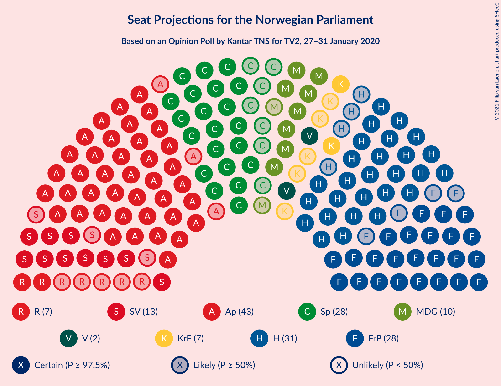
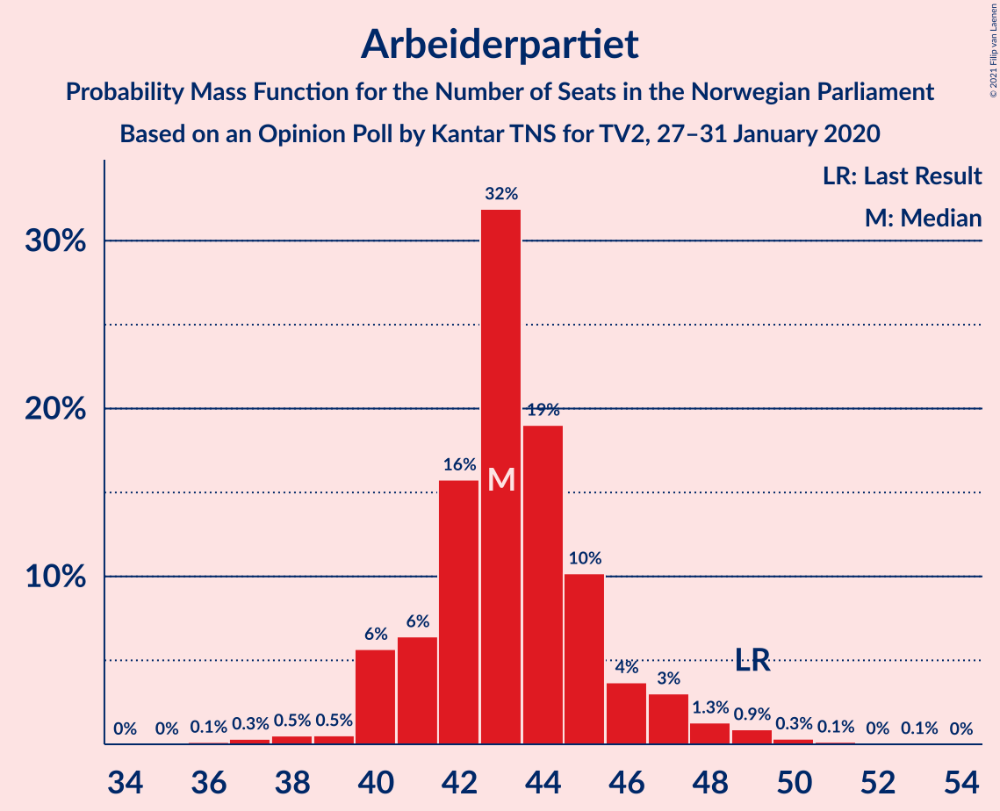
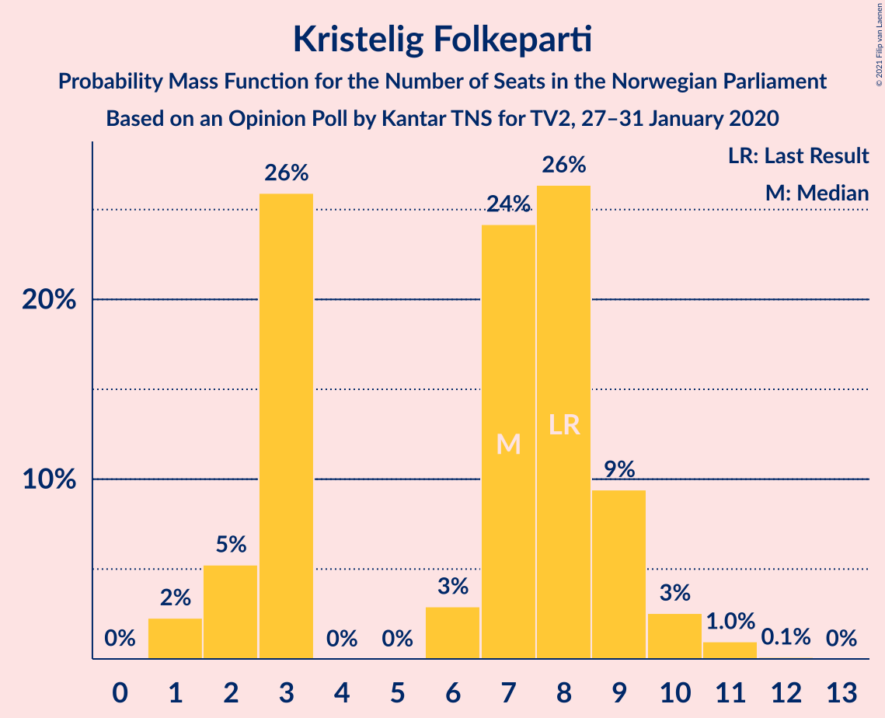
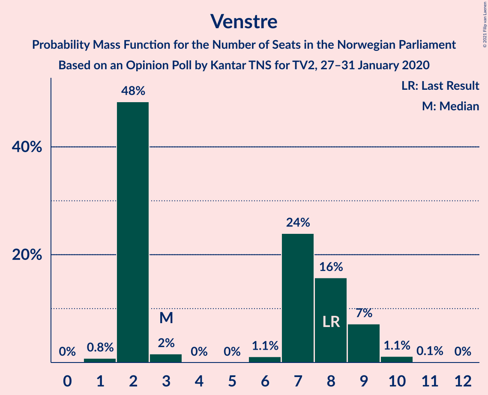
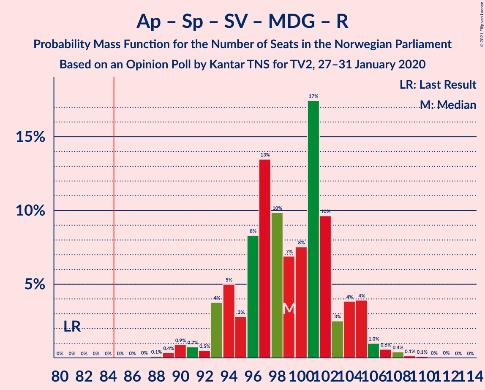
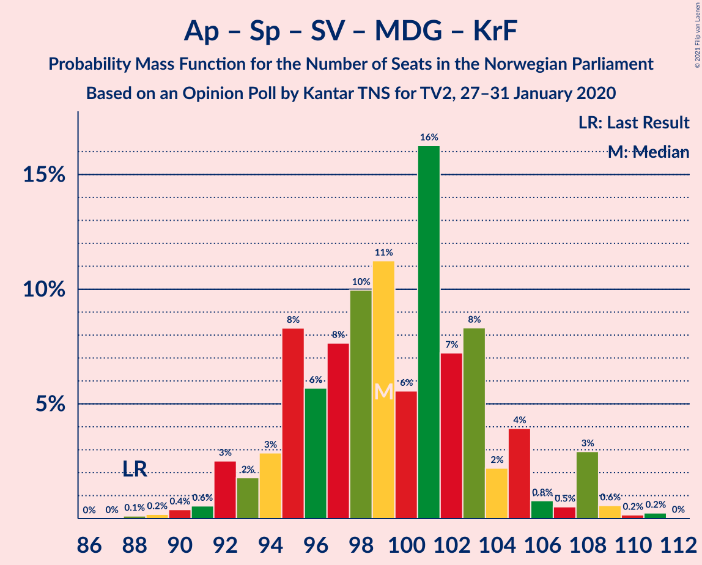
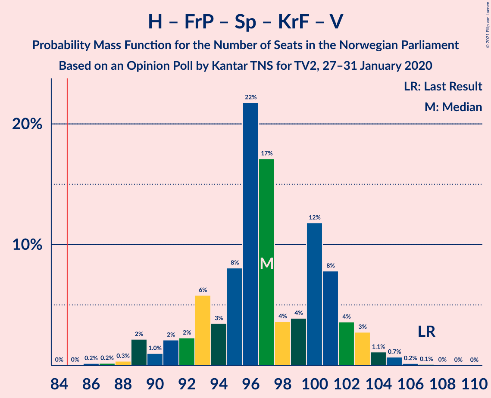
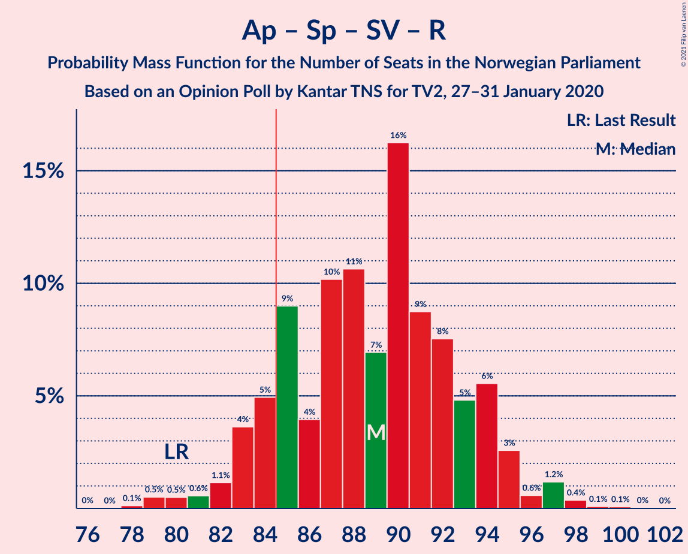
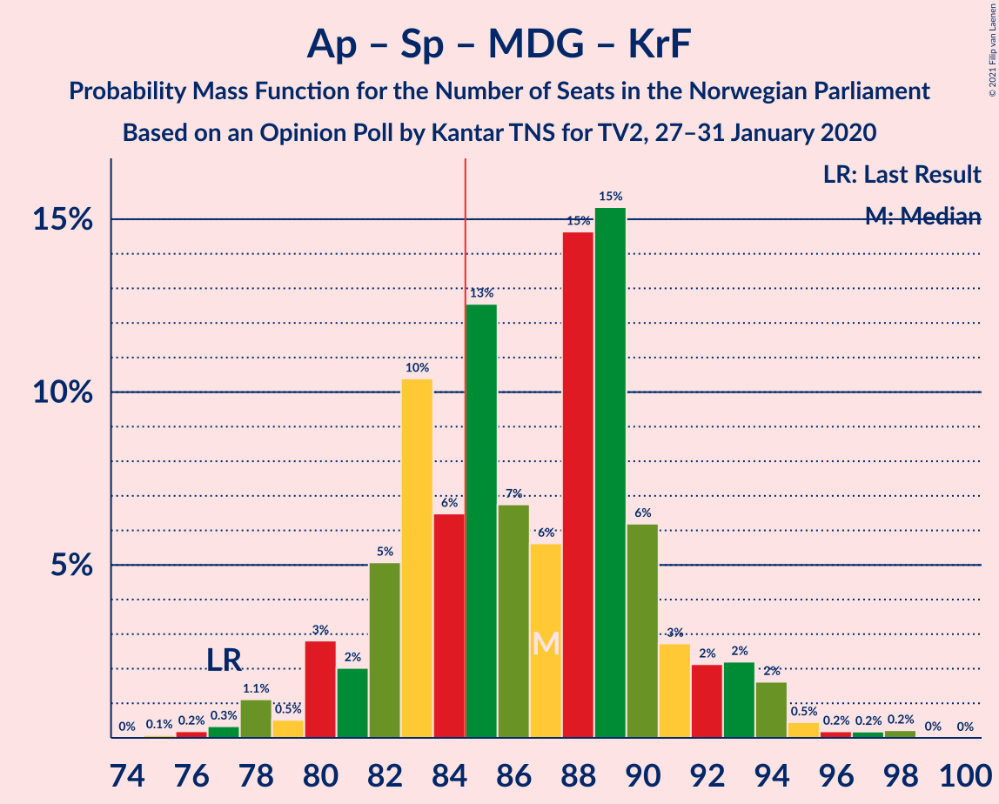
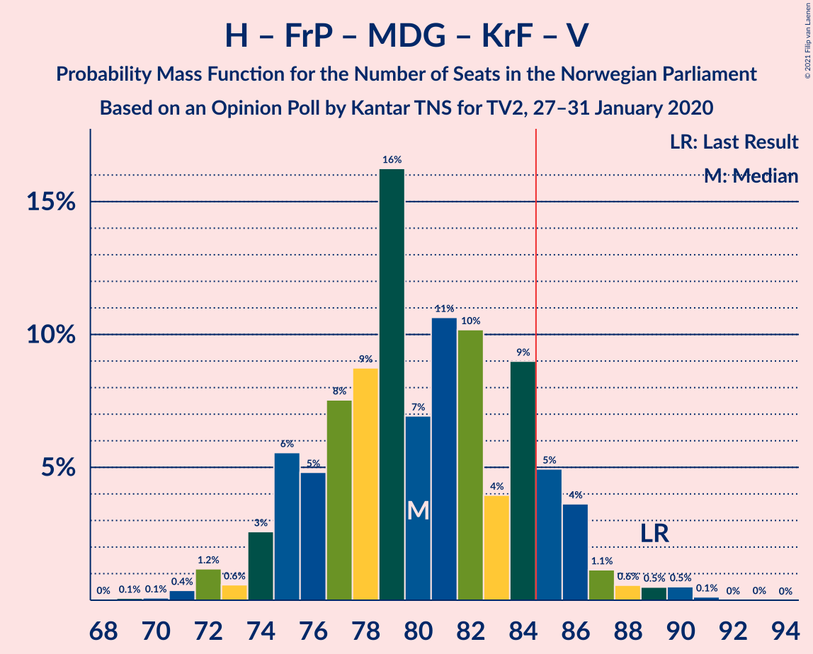

# Opinion Poll by Kantar TNS for TV2, 27–31 January 2020

<a href="#voting-intentions">Voting Intentions</a> | <a href="#seats">Seats</a> | <a href="#coalitions">Coalitions</a> | <a href="#technical-information">Technical Information</a>

## Voting Intentions

### Confidence Intervals

| Party | Last Result | Poll Result | 80% Confidence Interval | 90% Confidence Interval | 95% Confidence Interval | 99% Confidence Interval |
|:-----:|:-----------:|:-----------:|:-----------------------:|:-----------------------:|:-----------------------:|:-----------------------:|
| Arbeiderpartiet | 27.4% | 24.2% | 22.3–26.2% |21.7–26.7% |21.3–27.3% |20.4–28.2% |
| Høyre | 25.0% | 17.9% | 16.2–19.7% |15.7–20.2% |15.3–20.7% |14.6–21.6% |
| Fremskrittspartiet | 15.2% | 15.7% | 14.2–17.5% |13.7–18.0% |13.4–18.4% |12.6–19.3% |
| Senterpartiet | 10.3% | 15.0% | 13.4–16.7% |13.0–17.2% |12.7–17.6% |11.9–18.5% |
| Sosialistisk Venstreparti | 6.0% | 7.7% | 6.6–9.0% |6.3–9.4% |6.0–9.7% |5.5–10.4% |
| Miljøpartiet De Grønne | 3.2% | 5.9% | 5.0–7.1% |4.7–7.5% |4.5–7.8% |4.1–8.4% |
| Rødt | 2.4% | 4.3% | 3.5–5.3% |3.3–5.7% |3.1–5.9% |2.7–6.5% |
| Kristelig Folkeparti | 4.2% | 4.3% | 3.5–5.3% |3.3–5.7% |3.1–5.9% |2.7–6.5% |
| Venstre | 4.4% | 4.0% | 3.3–5.1% |3.0–5.4% |2.9–5.6% |2.5–6.2% |

*Note:* The poll result column reflects the actual value used in the calculations. Published results may vary slightly, and in addition be rounded to fewer digits.

## Seats

### Confidence Intervals

| Party | Last Result | Median | 80% Confidence Interval | 90% Confidence Interval | 95% Confidence Interval | 99% Confidence Interval |
|:-----:|:-----------:|:------:|:-----------------------:|:-----------------------:|:-----------------------:|:-----------------------:|
| <a href="#arbeiderpartiet">Arbeiderpartiet</a> | 49 | 43 | 41–45 |41–46 |40–47 |38–49 |
| <a href="#høyre">Høyre</a> | 45 | 31 | 30–34 |28–36 |27–36 |25–37 |
| <a href="#fremskrittspartiet">Fremskrittspartiet</a> | 27 | 28 | 25–31 |25–31 |25–32 |24–33 |
| <a href="#senterpartiet">Senterpartiet</a> | 19 | 25 | 23–30 |21–30 |21–30 |21–32 |
| <a href="#sosialistisk-venstreparti">Sosialistisk Venstreparti</a> | 11 | 13 | 10–15 |10–16 |10–17 |9–18 |
| <a href="#miljøpartiet-de-grønne">Miljøpartiet De Grønne</a> | 1 | 10 | 8–12 |8–12 |8–12 |7–13 |
| <a href="#rødt">Rødt</a> | 1 | 7 | 2–9 |2–9 |2–10 |1–11 |
| <a href="#kristelig-folkeparti">Kristelig Folkeparti</a> | 8 | 8 | 3–9 |3–9 |2–9 |1–11 |
| <a href="#venstre">Venstre</a> | 8 | 2 | 2–8 |2–8 |2–9 |2–10 |

### Arbeiderpartiet

*For a full overview of the results for this party, see the [Arbeiderpartiet](party-arbeiderpartiet.html) page.*

| Number of Seats | Probability | Accumulated | Special Marks |
|:---------------:|:-----------:|:-----------:|:-------------:|
| 36 | 0% | 100% |  |
| 37 | 0.4% | 99.9% |  |
| 38 | 0.6% | 99.5% |  |
| 39 | 0.2% | 98.9% |  |
| 40 | 3% | 98.7% |  |
| 41 | 7% | 95% |  |
| 42 | 21% | 88% |  |
| 43 | 24% | 67% | Median |
| 44 | 27% | 43% |  |
| 45 | 7% | 16% |  |
| 46 | 6% | 9% |  |
| 47 | 1.3% | 3% |  |
| 48 | 0.2% | 2% |  |
| 49 | 1.0% | 1.5% | Last Result |
| 50 | 0.3% | 0.5% |  |
| 51 | 0.1% | 0.2% |  |
| 52 | 0% | 0.1% |  |
| 53 | 0.1% | 0.1% |  |
| 54 | 0% | 0% |  |

### Høyre

*For a full overview of the results for this party, see the [Høyre](party-høyre.html) page.*

| Number of Seats | Probability | Accumulated | Special Marks |
|:---------------:|:-----------:|:-----------:|:-------------:|
| 22 | 0% | 100% |  |
| 23 | 0.1% | 99.9% |  |
| 24 | 0.1% | 99.8% |  |
| 25 | 0.6% | 99.8% |  |
| 26 | 1.1% | 99.2% |  |
| 27 | 0.8% | 98% |  |
| 28 | 5% | 97% |  |
| 29 | 2% | 92% |  |
| 30 | 4% | 90% |  |
| 31 | 42% | 86% | Median |
| 32 | 28% | 45% |  |
| 33 | 2% | 17% |  |
| 34 | 6% | 15% |  |
| 35 | 3% | 9% |  |
| 36 | 5% | 6% |  |
| 37 | 0.7% | 1.0% |  |
| 38 | 0% | 0.3% |  |
| 39 | 0.2% | 0.3% |  |
| 40 | 0% | 0% |  |
| 41 | 0% | 0% |  |
| 42 | 0% | 0% |  |
| 43 | 0% | 0% |  |
| 44 | 0% | 0% |  |
| 45 | 0% | 0% | Last Result |

### Fremskrittspartiet

*For a full overview of the results for this party, see the [Fremskrittspartiet](party-fremskrittspartiet.html) page.*

| Number of Seats | Probability | Accumulated | Special Marks |
|:---------------:|:-----------:|:-----------:|:-------------:|
| 20 | 0% | 100% |  |
| 21 | 0% | 99.9% |  |
| 22 | 0.1% | 99.9% |  |
| 23 | 0.3% | 99.8% |  |
| 24 | 1.3% | 99.5% |  |
| 25 | 15% | 98% |  |
| 26 | 17% | 83% |  |
| 27 | 16% | 66% | Last Result |
| 28 | 4% | 51% | Median |
| 29 | 15% | 47% |  |
| 30 | 17% | 33% |  |
| 31 | 13% | 15% |  |
| 32 | 0.7% | 3% |  |
| 33 | 2% | 2% |  |
| 34 | 0.2% | 0.2% |  |
| 35 | 0.1% | 0.1% |  |
| 36 | 0% | 0% |  |

### Senterpartiet

*For a full overview of the results for this party, see the [Senterpartiet](party-senterpartiet.html) page.*

| Number of Seats | Probability | Accumulated | Special Marks |
|:---------------:|:-----------:|:-----------:|:-------------:|
| 19 | 0% | 100% | Last Result |
| 20 | 0.1% | 100% |  |
| 21 | 5% | 99.8% |  |
| 22 | 0.5% | 95% |  |
| 23 | 6% | 94% |  |
| 24 | 9% | 88% |  |
| 25 | 31% | 79% | Median |
| 26 | 3% | 48% |  |
| 27 | 4% | 45% |  |
| 28 | 1.3% | 40% |  |
| 29 | 24% | 39% |  |
| 30 | 14% | 15% |  |
| 31 | 1.1% | 2% |  |
| 32 | 0.3% | 0.6% |  |
| 33 | 0.1% | 0.3% |  |
| 34 | 0.1% | 0.2% |  |
| 35 | 0.1% | 0.1% |  |
| 36 | 0% | 0% |  |

### Sosialistisk Venstreparti

*For a full overview of the results for this party, see the [Sosialistisk Venstreparti](party-sosialistiskvenstreparti.html) page.*

| Number of Seats | Probability | Accumulated | Special Marks |
|:---------------:|:-----------:|:-----------:|:-------------:|
| 8 | 0.1% | 100% |  |
| 9 | 1.0% | 99.9% |  |
| 10 | 14% | 98.8% |  |
| 11 | 20% | 85% | Last Result |
| 12 | 11% | 65% |  |
| 13 | 13% | 54% | Median |
| 14 | 13% | 40% |  |
| 15 | 19% | 27% |  |
| 16 | 6% | 9% |  |
| 17 | 3% | 3% |  |
| 18 | 0.3% | 0.5% |  |
| 19 | 0.1% | 0.2% |  |
| 20 | 0% | 0.1% |  |
| 21 | 0% | 0% |  |

### Miljøpartiet De Grønne

*For a full overview of the results for this party, see the [Miljøpartiet De Grønne](party-miljøpartietdegrønne.html) page.*

| Number of Seats | Probability | Accumulated | Special Marks |
|:---------------:|:-----------:|:-----------:|:-------------:|
| 1 | 0% | 100% | Last Result |
| 2 | 0.1% | 100% |  |
| 3 | 0% | 99.9% |  |
| 4 | 0% | 99.9% |  |
| 5 | 0% | 99.9% |  |
| 6 | 0.1% | 99.9% |  |
| 7 | 0.4% | 99.8% |  |
| 8 | 13% | 99.4% |  |
| 9 | 20% | 86% |  |
| 10 | 24% | 66% | Median |
| 11 | 21% | 43% |  |
| 12 | 20% | 21% |  |
| 13 | 0.9% | 1.3% |  |
| 14 | 0.3% | 0.5% |  |
| 15 | 0.1% | 0.1% |  |
| 16 | 0% | 0.1% |  |
| 17 | 0% | 0% |  |

### Rødt

*For a full overview of the results for this party, see the [Rødt](party-rødt.html) page.*

| Number of Seats | Probability | Accumulated | Special Marks |
|:---------------:|:-----------:|:-----------:|:-------------:|
| 1 | 0.9% | 100% | Last Result |
| 2 | 31% | 99.1% |  |
| 3 | 0% | 69% |  |
| 4 | 0% | 69% |  |
| 5 | 0% | 69% |  |
| 6 | 6% | 69% |  |
| 7 | 34% | 62% | Median |
| 8 | 9% | 28% |  |
| 9 | 14% | 18% |  |
| 10 | 2% | 4% |  |
| 11 | 2% | 2% |  |
| 12 | 0% | 0.1% |  |
| 13 | 0% | 0% |  |

### Kristelig Folkeparti

*For a full overview of the results for this party, see the [Kristelig Folkeparti](party-kristeligfolkeparti.html) page.*

| Number of Seats | Probability | Accumulated | Special Marks |
|:---------------:|:-----------:|:-----------:|:-------------:|
| 1 | 2% | 100% |  |
| 2 | 2% | 98% |  |
| 3 | 20% | 96% |  |
| 4 | 0% | 76% |  |
| 5 | 0% | 76% |  |
| 6 | 6% | 76% |  |
| 7 | 12% | 70% |  |
| 8 | 47% | 58% | Last Result, Median |
| 9 | 9% | 11% |  |
| 10 | 1.3% | 2% |  |
| 11 | 1.0% | 1.1% |  |
| 12 | 0.1% | 0.1% |  |
| 13 | 0% | 0% |  |

### Venstre

*For a full overview of the results for this party, see the [Venstre](party-venstre.html) page.*

| Number of Seats | Probability | Accumulated | Special Marks |
|:---------------:|:-----------:|:-----------:|:-------------:|
| 1 | 0.4% | 100% |  |
| 2 | 59% | 99.6% | Median |
| 3 | 0% | 41% |  |
| 4 | 0% | 41% |  |
| 5 | 0% | 41% |  |
| 6 | 0.5% | 41% |  |
| 7 | 24% | 40% |  |
| 8 | 13% | 16% | Last Result |
| 9 | 2% | 4% |  |
| 10 | 2% | 2% |  |
| 11 | 0.1% | 0.2% |  |
| 12 | 0% | 0% |  |

## Coalitions

### Confidence Intervals

| Coalition | Last Result | Median | Majority? | 80% Confidence Interval | 90% Confidence Interval | 95% Confidence Interval | 99% Confidence Interval |
|:---------:|:-----------:|:------:|:---------:|:-----------------------:|:-----------------------:|:-----------------------:|:-----------------------:|
| Arbeiderpartiet – Senterpartiet – Sosialistisk Venstreparti – Miljøpartiet De Grønne – Rødt | 81 | 98 | 100% | 94–102 | 94–103 | 94–104 | 90–107 |
| Arbeiderpartiet – Senterpartiet – Sosialistisk Venstreparti – Miljøpartiet De Grønne – Kristelig Folkeparti | 88 | 99 | 100% | 95–103 | 94–103 | 93–104 | 92–108 |
| Høyre – Fremskrittspartiet – Senterpartiet – Kristelig Folkeparti – Venstre | 107 | 96 | 100% | 93–101 | 91–102 | 91–102 | 88–104 |
| Arbeiderpartiet – Senterpartiet – Sosialistisk Venstreparti – Miljøpartiet De Grønne | 80 | 92 | 99.7% | 90–95 | 88–96 | 88–97 | 85–100 |
| Arbeiderpartiet – Senterpartiet – Sosialistisk Venstreparti – Rødt | 80 | 87 | 90% | 84–94 | 84–94 | 83–95 | 81–97 |
| Arbeiderpartiet – Senterpartiet – Miljøpartiet De Grønne – Kristelig Folkeparti | 77 | 87 | 77% | 82–89 | 81–91 | 81–91 | 78–94 |
| Arbeiderpartiet – Senterpartiet – Sosialistisk Venstreparti | 79 | 83 | 25% | 80–86 | 78–86 | 78–87 | 75–92 |
| Høyre – Fremskrittspartiet – Miljøpartiet De Grønne – Kristelig Folkeparti – Venstre | 89 | 82 | 10% | 75–85 | 75–85 | 74–86 | 72–88 |
| Arbeiderpartiet – Senterpartiet – Kristelig Folkeparti | 76 | 77 | 0.5% | 71–80 | 71–83 | 69–83 | 67–84 |
| Høyre – Fremskrittspartiet – Kristelig Folkeparti – Venstre | 88 | 71 | 0% | 67–75 | 66–75 | 65–75 | 62–79 |
| Arbeiderpartiet – Senterpartiet | 68 | 69 | 0% | 66–73 | 66–74 | 65–74 | 63–78 |
| Høyre – Fremskrittspartiet – Venstre | 80 | 63 | 0% | 59–69 | 59–69 | 59–71 | 56–74 |
| Høyre – Fremskrittspartiet | 72 | 60 | 0% | 56–62 | 55–63 | 54–65 | 52–66 |
| Arbeiderpartiet – Sosialistisk Venstreparti | 60 | 56 | 0% | 52–59 | 52–59 | 52–61 | 50–63 |
| Høyre – Kristelig Folkeparti – Venstre | 61 | 41 | 0% | 41–47 | 38–47 | 37–49 | 34–50 |
| Senterpartiet – Kristelig Folkeparti – Venstre | 35 | 36 | 0% | 34–44 | 32–44 | 30–44 | 29–47 |

### Arbeiderpartiet – Senterpartiet – Sosialistisk Venstreparti – Miljøpartiet De Grønne – Rødt

| Number of Seats | Probability | Accumulated | Special Marks |
|:---------------:|:-----------:|:-----------:|:-------------:|
| 81 | 0% | 100% | Last Result |
| 82 | 0% | 100% |  |
| 83 | 0% | 100% |  |
| 84 | 0% | 100% |  |
| 85 | 0% | 100% | Majority |
| 86 | 0% | 100% |  |
| 87 | 0% | 100% |  |
| 88 | 0.1% | 100% |  |
| 89 | 0% | 99.9% |  |
| 90 | 0.5% | 99.9% |  |
| 91 | 0.2% | 99.4% |  |
| 92 | 0.5% | 99.2% |  |
| 93 | 0.8% | 98.7% |  |
| 94 | 8% | 98% |  |
| 95 | 2% | 90% |  |
| 96 | 6% | 87% |  |
| 97 | 16% | 82% |  |
| 98 | 20% | 65% | Median |
| 99 | 14% | 45% |  |
| 100 | 6% | 31% |  |
| 101 | 7% | 26% |  |
| 102 | 13% | 19% |  |
| 103 | 2% | 6% |  |
| 104 | 3% | 4% |  |
| 105 | 0.3% | 1.3% |  |
| 106 | 0.1% | 1.1% |  |
| 107 | 0.5% | 0.9% |  |
| 108 | 0.1% | 0.5% |  |
| 109 | 0.2% | 0.3% |  |
| 110 | 0.1% | 0.2% |  |
| 111 | 0% | 0.1% |  |
| 112 | 0% | 0% |  |

### Arbeiderpartiet – Senterpartiet – Sosialistisk Venstreparti – Miljøpartiet De Grønne – Kristelig Folkeparti

| Number of Seats | Probability | Accumulated | Special Marks |
|:---------------:|:-----------:|:-----------:|:-------------:|
| 88 | 0.2% | 100% | Last Result |
| 89 | 0% | 99.8% |  |
| 90 | 0.1% | 99.8% |  |
| 91 | 0.1% | 99.7% |  |
| 92 | 0.7% | 99.6% |  |
| 93 | 2% | 98.9% |  |
| 94 | 6% | 97% |  |
| 95 | 10% | 91% |  |
| 96 | 3% | 81% |  |
| 97 | 2% | 78% |  |
| 98 | 8% | 76% |  |
| 99 | 22% | 68% | Median |
| 100 | 4% | 47% |  |
| 101 | 15% | 42% |  |
| 102 | 11% | 28% |  |
| 103 | 13% | 16% |  |
| 104 | 0.7% | 3% |  |
| 105 | 0.2% | 2% |  |
| 106 | 0.2% | 2% |  |
| 107 | 0.3% | 2% |  |
| 108 | 1.1% | 1.4% |  |
| 109 | 0.1% | 0.2% |  |
| 110 | 0.1% | 0.2% |  |
| 111 | 0% | 0.1% |  |
| 112 | 0% | 0% |  |

### Høyre – Fremskrittspartiet – Senterpartiet – Kristelig Folkeparti – Venstre

| Number of Seats | Probability | Accumulated | Special Marks |
|:---------------:|:-----------:|:-----------:|:-------------:|
| 86 | 0% | 100% |  |
| 87 | 0.2% | 99.9% |  |
| 88 | 0.3% | 99.7% |  |
| 89 | 0.4% | 99.4% |  |
| 90 | 0.4% | 99.0% |  |
| 91 | 5% | 98.6% |  |
| 92 | 2% | 94% |  |
| 93 | 4% | 92% |  |
| 94 | 3% | 87% | Median |
| 95 | 3% | 85% |  |
| 96 | 38% | 82% |  |
| 97 | 13% | 44% |  |
| 98 | 1.3% | 31% |  |
| 99 | 3% | 30% |  |
| 100 | 15% | 26% |  |
| 101 | 3% | 11% |  |
| 102 | 6% | 8% |  |
| 103 | 1.0% | 2% |  |
| 104 | 0.7% | 1.2% |  |
| 105 | 0.2% | 0.4% |  |
| 106 | 0.2% | 0.3% |  |
| 107 | 0.1% | 0.1% | Last Result |
| 108 | 0% | 0% |  |

### Arbeiderpartiet – Senterpartiet – Sosialistisk Venstreparti – Miljøpartiet De Grønne

| Number of Seats | Probability | Accumulated | Special Marks |
|:---------------:|:-----------:|:-----------:|:-------------:|
| 80 | 0% | 100% | Last Result |
| 81 | 0% | 100% |  |
| 82 | 0% | 100% |  |
| 83 | 0% | 99.9% |  |
| 84 | 0.2% | 99.9% |  |
| 85 | 0.2% | 99.7% | Majority |
| 86 | 0.3% | 99.5% |  |
| 87 | 1.4% | 99.1% |  |
| 88 | 5% | 98% |  |
| 89 | 1.2% | 93% |  |
| 90 | 3% | 91% |  |
| 91 | 19% | 89% | Median |
| 92 | 22% | 70% |  |
| 93 | 11% | 48% |  |
| 94 | 8% | 36% |  |
| 95 | 22% | 28% |  |
| 96 | 0.6% | 5% |  |
| 97 | 3% | 5% |  |
| 98 | 0.5% | 2% |  |
| 99 | 0.2% | 2% |  |
| 100 | 1.0% | 1.4% |  |
| 101 | 0.1% | 0.4% |  |
| 102 | 0.1% | 0.3% |  |
| 103 | 0.1% | 0.2% |  |
| 104 | 0.1% | 0.1% |  |
| 105 | 0% | 0.1% |  |
| 106 | 0% | 0.1% |  |
| 107 | 0% | 0% |  |

### Arbeiderpartiet – Senterpartiet – Sosialistisk Venstreparti – Rødt

| Number of Seats | Probability | Accumulated | Special Marks |
|:---------------:|:-----------:|:-----------:|:-------------:|
| 78 | 0.2% | 100% |  |
| 79 | 0% | 99.8% |  |
| 80 | 0.3% | 99.8% | Last Result |
| 81 | 0.5% | 99.5% |  |
| 82 | 0.9% | 99.0% |  |
| 83 | 2% | 98% |  |
| 84 | 6% | 96% |  |
| 85 | 17% | 90% | Majority |
| 86 | 2% | 73% |  |
| 87 | 22% | 71% |  |
| 88 | 4% | 49% | Median |
| 89 | 12% | 45% |  |
| 90 | 2% | 33% |  |
| 91 | 12% | 31% |  |
| 92 | 0.8% | 19% |  |
| 93 | 5% | 18% |  |
| 94 | 10% | 13% |  |
| 95 | 2% | 3% |  |
| 96 | 0.3% | 0.9% |  |
| 97 | 0.3% | 0.6% |  |
| 98 | 0.1% | 0.3% |  |
| 99 | 0.1% | 0.2% |  |
| 100 | 0% | 0.1% |  |
| 101 | 0% | 0.1% |  |
| 102 | 0% | 0% |  |

### Arbeiderpartiet – Senterpartiet – Miljøpartiet De Grønne – Kristelig Folkeparti

| Number of Seats | Probability | Accumulated | Special Marks |
|:---------------:|:-----------:|:-----------:|:-------------:|
| 76 | 0% | 100% |  |
| 77 | 0.1% | 99.9% | Last Result |
| 78 | 0.6% | 99.8% |  |
| 79 | 0.3% | 99.2% |  |
| 80 | 1.4% | 98.9% |  |
| 81 | 3% | 98% |  |
| 82 | 6% | 95% |  |
| 83 | 9% | 89% |  |
| 84 | 4% | 80% |  |
| 85 | 10% | 77% | Majority |
| 86 | 11% | 67% | Median |
| 87 | 8% | 56% |  |
| 88 | 29% | 48% |  |
| 89 | 9% | 19% |  |
| 90 | 2% | 10% |  |
| 91 | 6% | 8% |  |
| 92 | 0.2% | 2% |  |
| 93 | 0.5% | 2% |  |
| 94 | 1.1% | 2% |  |
| 95 | 0.2% | 0.5% |  |
| 96 | 0.2% | 0.3% |  |
| 97 | 0% | 0.1% |  |
| 98 | 0.1% | 0.1% |  |
| 99 | 0% | 0% |  |

### Arbeiderpartiet – Senterpartiet – Sosialistisk Venstreparti

| Number of Seats | Probability | Accumulated | Special Marks |
|:---------------:|:-----------:|:-----------:|:-------------:|
| 74 | 0.2% | 100% |  |
| 75 | 0.3% | 99.7% |  |
| 76 | 0.3% | 99.5% |  |
| 77 | 2% | 99.2% |  |
| 78 | 5% | 98% |  |
| 79 | 2% | 93% | Last Result |
| 80 | 19% | 90% |  |
| 81 | 5% | 72% | Median |
| 82 | 14% | 67% |  |
| 83 | 19% | 53% |  |
| 84 | 9% | 33% |  |
| 85 | 14% | 25% | Majority |
| 86 | 8% | 11% |  |
| 87 | 1.4% | 3% |  |
| 88 | 0.4% | 2% |  |
| 89 | 0.2% | 2% |  |
| 90 | 0.3% | 1.4% |  |
| 91 | 0.1% | 1.1% |  |
| 92 | 0.9% | 1.0% |  |
| 93 | 0% | 0.1% |  |
| 94 | 0% | 0.1% |  |
| 95 | 0% | 0.1% |  |
| 96 | 0% | 0% |  |

### Høyre – Fremskrittspartiet – Miljøpartiet De Grønne – Kristelig Folkeparti – Venstre

| Number of Seats | Probability | Accumulated | Special Marks |
|:---------------:|:-----------:|:-----------:|:-------------:|
| 68 | 0% | 100% |  |
| 69 | 0% | 99.9% |  |
| 70 | 0.1% | 99.9% |  |
| 71 | 0.1% | 99.8% |  |
| 72 | 0.3% | 99.7% |  |
| 73 | 0.3% | 99.4% |  |
| 74 | 2% | 99.1% |  |
| 75 | 10% | 97% |  |
| 76 | 5% | 87% |  |
| 77 | 0.8% | 82% |  |
| 78 | 12% | 81% |  |
| 79 | 2% | 69% | Median |
| 80 | 12% | 67% |  |
| 81 | 4% | 55% |  |
| 82 | 22% | 51% |  |
| 83 | 2% | 29% |  |
| 84 | 17% | 27% |  |
| 85 | 6% | 10% | Majority |
| 86 | 2% | 4% |  |
| 87 | 0.9% | 2% |  |
| 88 | 0.5% | 1.0% |  |
| 89 | 0.3% | 0.5% | Last Result |
| 90 | 0% | 0.2% |  |
| 91 | 0.2% | 0.2% |  |
| 92 | 0% | 0% |  |

### Arbeiderpartiet – Senterpartiet – Kristelig Folkeparti

| Number of Seats | Probability | Accumulated | Special Marks |
|:---------------:|:-----------:|:-----------:|:-------------:|
| 66 | 0.3% | 100% |  |
| 67 | 0.2% | 99.6% |  |
| 68 | 0.2% | 99.4% |  |
| 69 | 3% | 99.2% |  |
| 70 | 1.3% | 96% |  |
| 71 | 5% | 95% |  |
| 72 | 5% | 90% |  |
| 73 | 2% | 85% |  |
| 74 | 5% | 83% |  |
| 75 | 10% | 78% |  |
| 76 | 16% | 67% | Last Result, Median |
| 77 | 24% | 51% |  |
| 78 | 0.9% | 27% |  |
| 79 | 11% | 26% |  |
| 80 | 7% | 15% |  |
| 81 | 2% | 8% |  |
| 82 | 0.3% | 6% |  |
| 83 | 5% | 6% |  |
| 84 | 1.0% | 1.4% |  |
| 85 | 0.3% | 0.5% | Majority |
| 86 | 0% | 0.2% |  |
| 87 | 0% | 0.1% |  |
| 88 | 0.1% | 0.1% |  |
| 89 | 0% | 0% |  |

### Høyre – Fremskrittspartiet – Kristelig Folkeparti – Venstre

| Number of Seats | Probability | Accumulated | Special Marks |
|:---------------:|:-----------:|:-----------:|:-------------:|
| 58 | 0% | 100% |  |
| 59 | 0.1% | 99.9% |  |
| 60 | 0.2% | 99.8% |  |
| 61 | 0.1% | 99.7% |  |
| 62 | 0.5% | 99.5% |  |
| 63 | 0.1% | 99.1% |  |
| 64 | 0.3% | 98.9% |  |
| 65 | 3% | 98.7% |  |
| 66 | 2% | 96% |  |
| 67 | 13% | 94% |  |
| 68 | 7% | 81% |  |
| 69 | 6% | 74% | Median |
| 70 | 14% | 69% |  |
| 71 | 20% | 55% |  |
| 72 | 16% | 35% |  |
| 73 | 6% | 18% |  |
| 74 | 2% | 13% |  |
| 75 | 8% | 10% |  |
| 76 | 0.8% | 2% |  |
| 77 | 0.5% | 1.3% |  |
| 78 | 0.2% | 0.8% |  |
| 79 | 0.5% | 0.6% |  |
| 80 | 0% | 0.1% |  |
| 81 | 0.1% | 0.1% |  |
| 82 | 0% | 0% |  |
| 83 | 0% | 0% |  |
| 84 | 0% | 0% |  |
| 85 | 0% | 0% | Majority |
| 86 | 0% | 0% |  |
| 87 | 0% | 0% |  |
| 88 | 0% | 0% | Last Result |

### Arbeiderpartiet – Senterpartiet

| Number of Seats | Probability | Accumulated | Special Marks |
|:---------------:|:-----------:|:-----------:|:-------------:|
| 60 | 0.1% | 100% |  |
| 61 | 0% | 99.9% |  |
| 62 | 0.1% | 99.9% |  |
| 63 | 0.3% | 99.8% |  |
| 64 | 1.1% | 99.5% |  |
| 65 | 1.1% | 98% |  |
| 66 | 8% | 97% |  |
| 67 | 3% | 89% |  |
| 68 | 17% | 86% | Last Result, Median |
| 69 | 24% | 68% |  |
| 70 | 7% | 44% |  |
| 71 | 11% | 37% |  |
| 72 | 15% | 26% |  |
| 73 | 4% | 10% |  |
| 74 | 5% | 7% |  |
| 75 | 0.1% | 2% |  |
| 76 | 0.4% | 2% |  |
| 77 | 0.1% | 1.2% |  |
| 78 | 0.9% | 1.1% |  |
| 79 | 0% | 0.2% |  |
| 80 | 0.1% | 0.1% |  |
| 81 | 0% | 0.1% |  |
| 82 | 0.1% | 0.1% |  |
| 83 | 0% | 0% |  |

### Høyre – Fremskrittspartiet – Venstre

| Number of Seats | Probability | Accumulated | Special Marks |
|:---------------:|:-----------:|:-----------:|:-------------:|
| 52 | 0.2% | 100% |  |
| 53 | 0% | 99.8% |  |
| 54 | 0.1% | 99.8% |  |
| 55 | 0.1% | 99.7% |  |
| 56 | 0.2% | 99.6% |  |
| 57 | 0.6% | 99.5% |  |
| 58 | 0.8% | 98.9% |  |
| 59 | 9% | 98% |  |
| 60 | 8% | 90% |  |
| 61 | 9% | 82% | Median |
| 62 | 3% | 73% |  |
| 63 | 21% | 70% |  |
| 64 | 15% | 49% |  |
| 65 | 9% | 35% |  |
| 66 | 3% | 26% |  |
| 67 | 10% | 23% |  |
| 68 | 1.5% | 13% |  |
| 69 | 9% | 12% |  |
| 70 | 0.4% | 3% |  |
| 71 | 0.7% | 3% |  |
| 72 | 0.4% | 2% |  |
| 73 | 0.2% | 2% |  |
| 74 | 1.4% | 1.5% |  |
| 75 | 0% | 0% |  |
| 76 | 0% | 0% |  |
| 77 | 0% | 0% |  |
| 78 | 0% | 0% |  |
| 79 | 0% | 0% |  |
| 80 | 0% | 0% | Last Result |

### Høyre – Fremskrittspartiet

| Number of Seats | Probability | Accumulated | Special Marks |
|:---------------:|:-----------:|:-----------:|:-------------:|
| 49 | 0.1% | 100% |  |
| 50 | 0.2% | 99.9% |  |
| 51 | 0.1% | 99.7% |  |
| 52 | 0.4% | 99.5% |  |
| 53 | 0.7% | 99.1% |  |
| 54 | 1.4% | 98% |  |
| 55 | 4% | 97% |  |
| 56 | 4% | 93% |  |
| 57 | 12% | 89% |  |
| 58 | 14% | 77% |  |
| 59 | 9% | 63% | Median |
| 60 | 9% | 54% |  |
| 61 | 22% | 46% |  |
| 62 | 17% | 24% |  |
| 63 | 1.4% | 6% |  |
| 64 | 2% | 5% |  |
| 65 | 2% | 3% |  |
| 66 | 0.8% | 1.1% |  |
| 67 | 0.1% | 0.2% |  |
| 68 | 0% | 0.1% |  |
| 69 | 0% | 0.1% |  |
| 70 | 0% | 0% |  |
| 71 | 0% | 0% |  |
| 72 | 0% | 0% | Last Result |

### Arbeiderpartiet – Sosialistisk Venstreparti

| Number of Seats | Probability | Accumulated | Special Marks |
|:---------------:|:-----------:|:-----------:|:-------------:|
| 48 | 0% | 100% |  |
| 49 | 0% | 99.9% |  |
| 50 | 0.7% | 99.9% |  |
| 51 | 0.4% | 99.2% |  |
| 52 | 10% | 98.8% |  |
| 53 | 4% | 89% |  |
| 54 | 8% | 85% |  |
| 55 | 21% | 78% |  |
| 56 | 16% | 57% | Median |
| 57 | 12% | 41% |  |
| 58 | 13% | 29% |  |
| 59 | 11% | 16% |  |
| 60 | 0.9% | 5% | Last Result |
| 61 | 2% | 4% |  |
| 62 | 0.1% | 2% |  |
| 63 | 1.0% | 1.4% |  |
| 64 | 0.3% | 0.5% |  |
| 65 | 0.1% | 0.2% |  |
| 66 | 0.1% | 0.1% |  |
| 67 | 0% | 0.1% |  |
| 68 | 0% | 0% |  |

### Høyre – Kristelig Folkeparti – Venstre

| Number of Seats | Probability | Accumulated | Special Marks |
|:---------------:|:-----------:|:-----------:|:-------------:|
| 31 | 0.1% | 100% |  |
| 32 | 0% | 99.9% |  |
| 33 | 0.3% | 99.9% |  |
| 34 | 0.2% | 99.6% |  |
| 35 | 0.3% | 99.4% |  |
| 36 | 0.9% | 99.1% |  |
| 37 | 2% | 98% |  |
| 38 | 3% | 96% |  |
| 39 | 2% | 93% |  |
| 40 | 0.7% | 91% |  |
| 41 | 42% | 90% | Median |
| 42 | 13% | 49% |  |
| 43 | 9% | 35% |  |
| 44 | 0.9% | 26% |  |
| 45 | 1.5% | 25% |  |
| 46 | 14% | 24% |  |
| 47 | 5% | 10% |  |
| 48 | 1.0% | 5% |  |
| 49 | 2% | 4% |  |
| 50 | 2% | 2% |  |
| 51 | 0.2% | 0.2% |  |
| 52 | 0% | 0.1% |  |
| 53 | 0% | 0% |  |
| 54 | 0% | 0% |  |
| 55 | 0% | 0% |  |
| 56 | 0% | 0% |  |
| 57 | 0% | 0% |  |
| 58 | 0% | 0% |  |
| 59 | 0% | 0% |  |
| 60 | 0% | 0% |  |
| 61 | 0% | 0% | Last Result |

### Senterpartiet – Kristelig Folkeparti – Venstre

| Number of Seats | Probability | Accumulated | Special Marks |
|:---------------:|:-----------:|:-----------:|:-------------:|
| 26 | 0% | 100% |  |
| 27 | 0% | 99.9% |  |
| 28 | 0.1% | 99.9% |  |
| 29 | 0.6% | 99.8% |  |
| 30 | 2% | 99.2% |  |
| 31 | 0.2% | 97% |  |
| 32 | 4% | 97% |  |
| 33 | 0.6% | 93% |  |
| 34 | 8% | 92% |  |
| 35 | 34% | 84% | Last Result, Median |
| 36 | 3% | 50% |  |
| 37 | 3% | 48% |  |
| 38 | 5% | 45% |  |
| 39 | 12% | 39% |  |
| 40 | 8% | 27% |  |
| 41 | 5% | 19% |  |
| 42 | 0.6% | 14% |  |
| 43 | 1.0% | 14% |  |
| 44 | 10% | 13% |  |
| 45 | 0.8% | 2% |  |
| 46 | 0.6% | 1.4% |  |
| 47 | 0.5% | 0.8% |  |
| 48 | 0.2% | 0.3% |  |
| 49 | 0.1% | 0.1% |  |
| 50 | 0% | 0% |  |

## Technical Information

### Opinion Poll

+ **Polling firm:** Kantar TNS
+ **Commissioner(s):** TV2
+ **Fieldwork period:** 27–31 January 2020

### Calculations

+ **Sample size:** 795
+ **Simulations done:** 131,072
+ **Error estimate:** 1.45%

