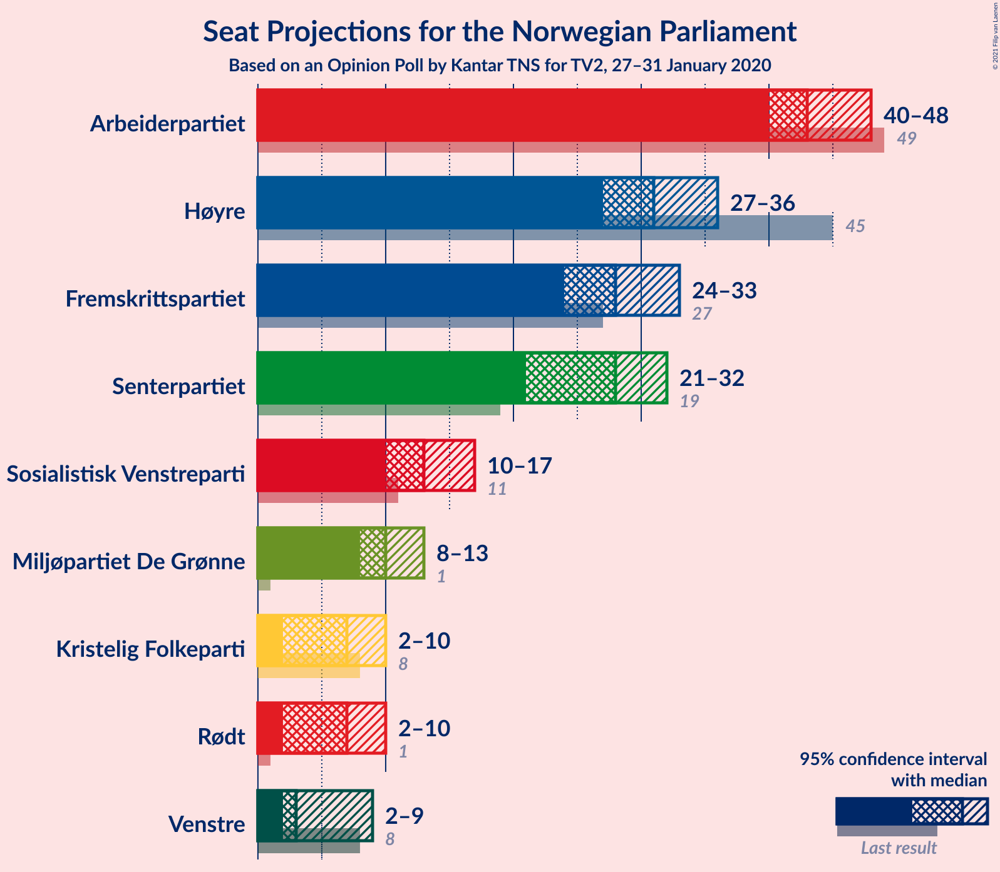
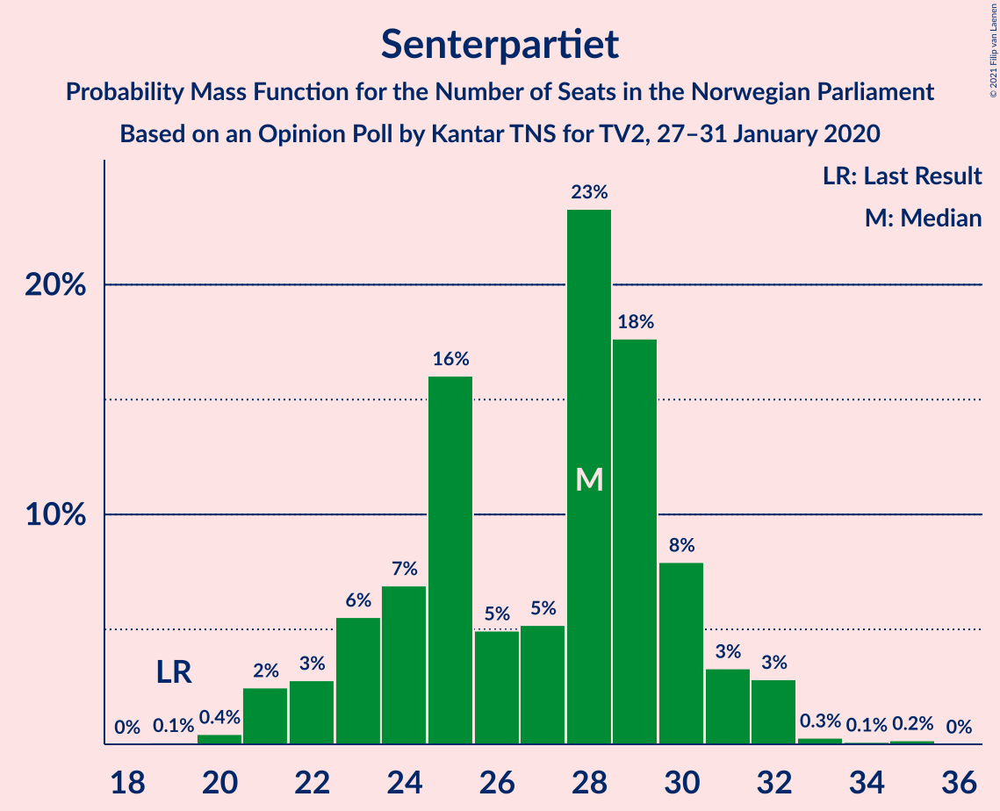
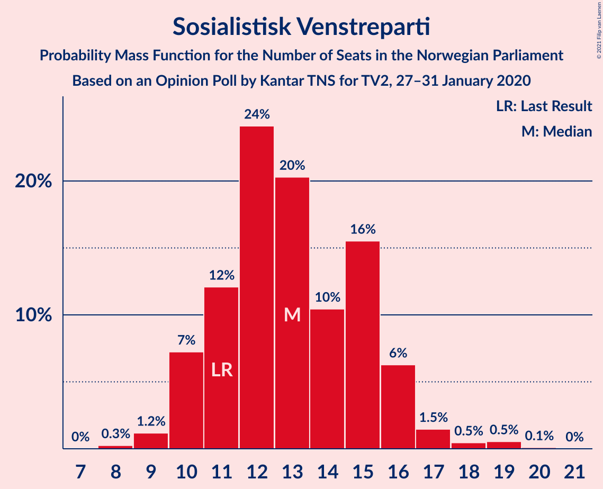
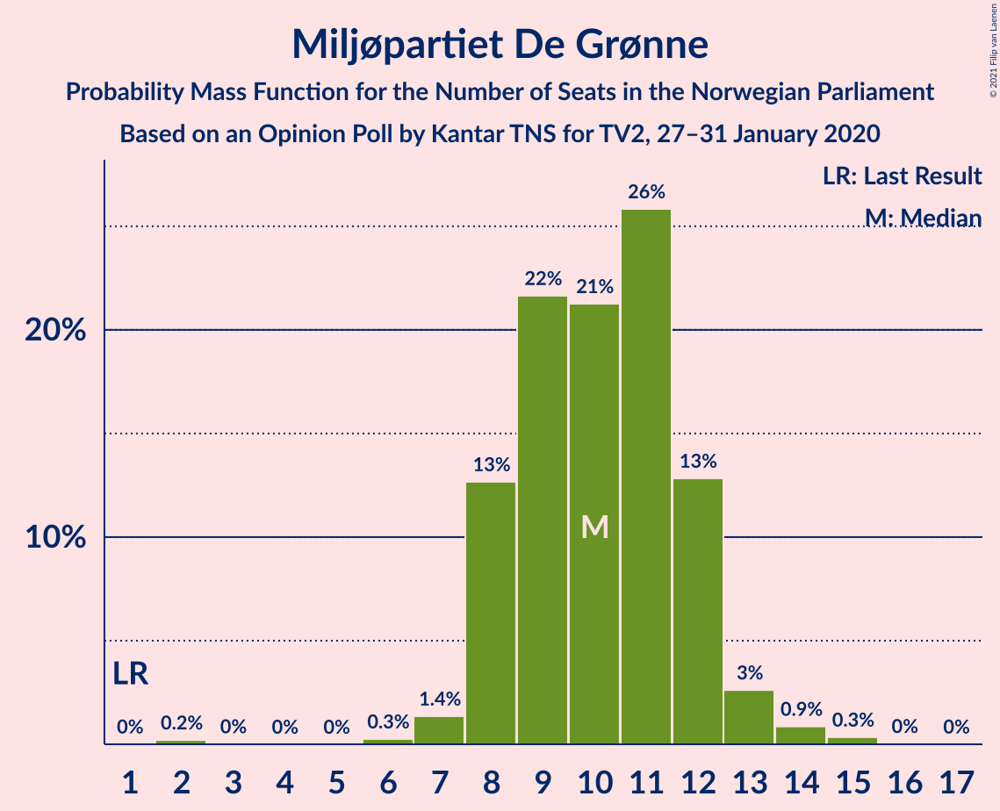
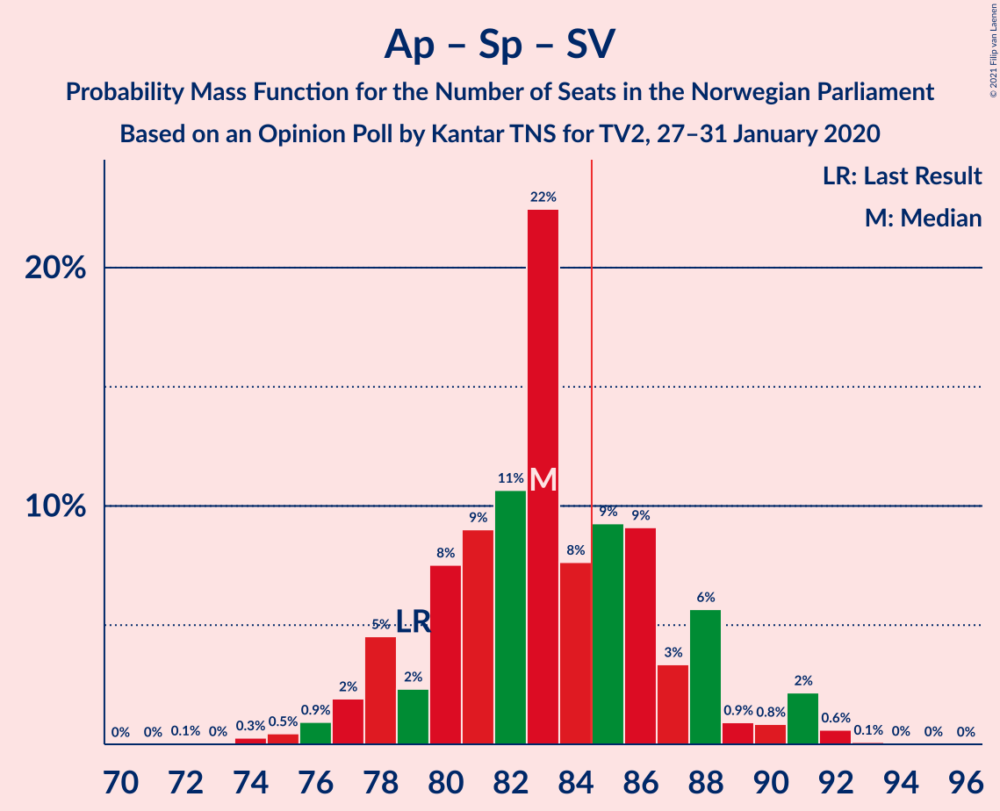
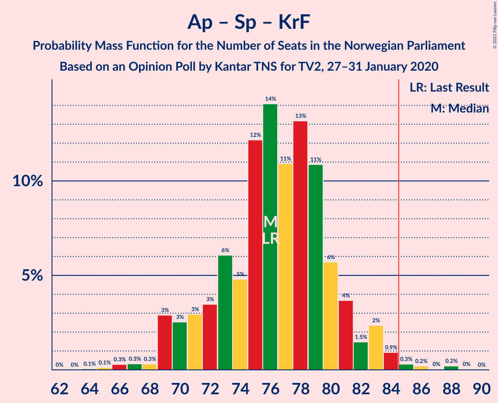
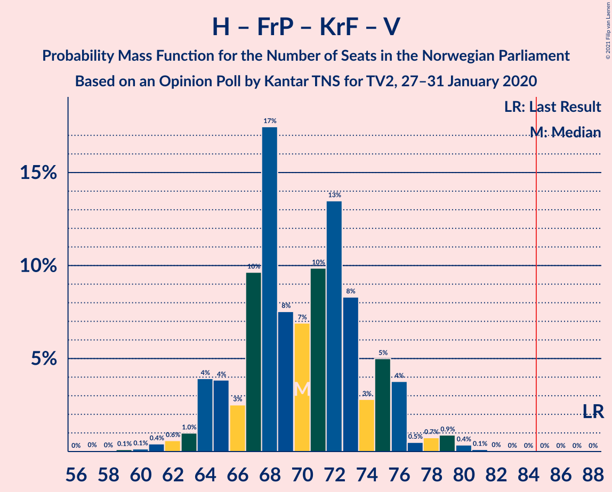
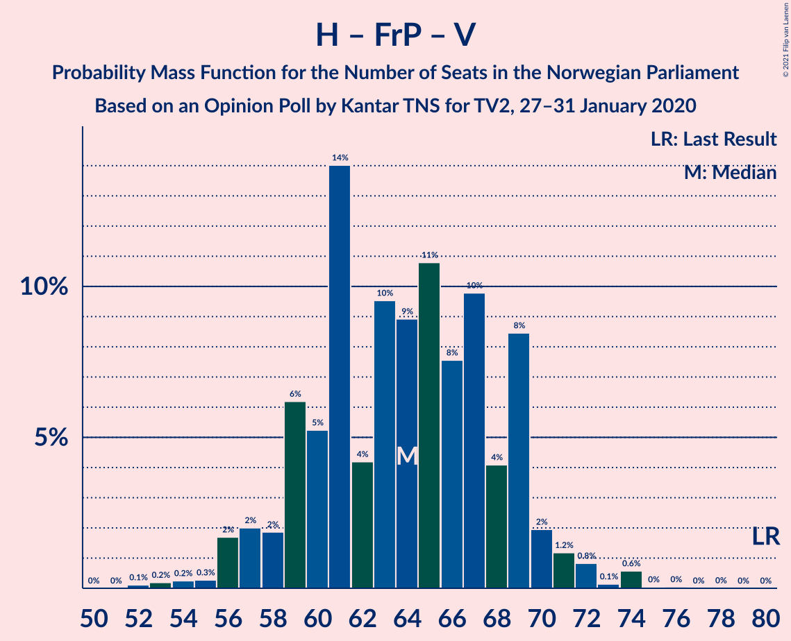
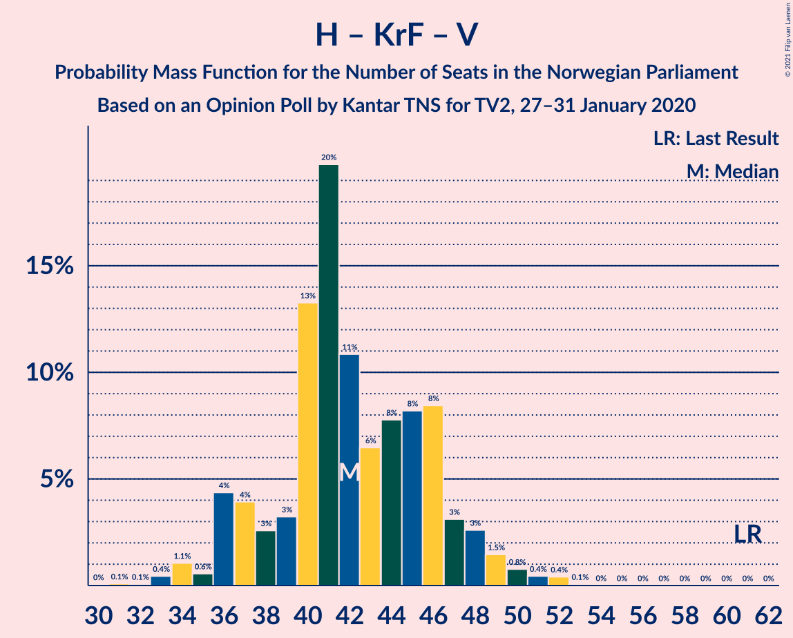

# Opinion Poll by Kantar TNS for TV2, 27–31 January 2020

<a href="#voting-intentions">Voting Intentions</a> | <a href="#seats">Seats</a> | <a href="#coalitions">Coalitions</a> | <a href="#technical-information">Technical Information</a>

## Voting Intentions

### Confidence Intervals

| Party | Last Result | Poll Result | 80% Confidence Interval | 90% Confidence Interval | 95% Confidence Interval | 99% Confidence Interval |
|:-----:|:-----------:|:-----------:|:-----------------------:|:-----------------------:|:-----------------------:|:-----------------------:|
| Arbeiderpartiet | 27.4% | 24.2% | 22.3–26.2% |21.7–26.7% |21.3–27.3% |20.4–28.2% |
| Høyre | 25.0% | 17.9% | 16.2–19.7% |15.7–20.2% |15.3–20.7% |14.6–21.6% |
| Fremskrittspartiet | 15.2% | 15.7% | 14.2–17.5% |13.7–18.0% |13.4–18.4% |12.6–19.3% |
| Senterpartiet | 10.3% | 15.0% | 13.4–16.7% |13.0–17.2% |12.7–17.6% |11.9–18.5% |
| Sosialistisk Venstreparti | 6.0% | 7.7% | 6.6–9.0% |6.3–9.4% |6.0–9.7% |5.5–10.4% |
| Miljøpartiet De Grønne | 3.2% | 5.9% | 5.0–7.1% |4.7–7.5% |4.5–7.8% |4.1–8.4% |
| Rødt | 2.4% | 4.3% | 3.5–5.3% |3.3–5.7% |3.1–5.9% |2.7–6.5% |
| Kristelig Folkeparti | 4.2% | 4.3% | 3.5–5.3% |3.3–5.7% |3.1–5.9% |2.7–6.5% |
| Venstre | 4.4% | 4.0% | 3.3–5.1% |3.0–5.4% |2.9–5.6% |2.5–6.2% |

*Note:* The poll result column reflects the actual value used in the calculations. Published results may vary slightly, and in addition be rounded to fewer digits.

## Seats

### Confidence Intervals

| Party | Last Result | Median | 80% Confidence Interval | 90% Confidence Interval | 95% Confidence Interval | 99% Confidence Interval |
|:-----:|:-----------:|:------:|:-----------------------:|:-----------------------:|:-----------------------:|:-----------------------:|
| <a href="#arbeiderpartiet">Arbeiderpartiet</a> | 49 | 43 | 41–45 |40–47 |40–48 |37–50 |
| <a href="#høyre">Høyre</a> | 45 | 31 | 28–35 |27–35 |27–36 |24–38 |
| <a href="#fremskrittspartiet">Fremskrittspartiet</a> | 27 | 28 | 25–31 |25–32 |24–33 |22–34 |
| <a href="#senterpartiet">Senterpartiet</a> | 19 | 28 | 23–30 |22–31 |21–32 |20–33 |
| <a href="#sosialistisk-venstreparti">Sosialistisk Venstreparti</a> | 11 | 13 | 11–15 |10–16 |10–17 |9–19 |
| <a href="#miljøpartiet-de-grønne">Miljøpartiet De Grønne</a> | 1 | 10 | 8–12 |8–12 |8–13 |7–14 |
| <a href="#rødt">Rødt</a> | 1 | 7 | 2–9 |2–10 |2–10 |1–11 |
| <a href="#kristelig-folkeparti">Kristelig Folkeparti</a> | 8 | 7 | 3–9 |2–9 |2–10 |1–11 |
| <a href="#venstre">Venstre</a> | 8 | 3 | 2–8 |2–9 |2–9 |1–10 |

### Arbeiderpartiet

*For a full overview of the results for this party, see the [Arbeiderpartiet](party-arbeiderpartiet.html) page.*

| Number of Seats | Probability | Accumulated | Special Marks |
|:---------------:|:-----------:|:-----------:|:-------------:|
| 35 | 0% | 100% |  |
| 36 | 0.1% | 99.9% |  |
| 37 | 0.3% | 99.8% |  |
| 38 | 0.5% | 99.5% |  |
| 39 | 0.5% | 99.0% |  |
| 40 | 6% | 98% |  |
| 41 | 6% | 93% |  |
| 42 | 16% | 86% |  |
| 43 | 32% | 71% | Median |
| 44 | 19% | 39% |  |
| 45 | 10% | 20% |  |
| 46 | 4% | 9% |  |
| 47 | 3% | 6% |  |
| 48 | 1.3% | 3% |  |
| 49 | 0.9% | 1.5% | Last Result |
| 50 | 0.3% | 0.6% |  |
| 51 | 0.1% | 0.3% |  |
| 52 | 0% | 0.1% |  |
| 53 | 0.1% | 0.1% |  |
| 54 | 0% | 0% |  |

### Høyre

*For a full overview of the results for this party, see the [Høyre](party-høyre.html) page.*

| Number of Seats | Probability | Accumulated | Special Marks |
|:---------------:|:-----------:|:-----------:|:-------------:|
| 22 | 0.1% | 100% |  |
| 23 | 0.1% | 99.9% |  |
| 24 | 0.3% | 99.8% |  |
| 25 | 0.4% | 99.5% |  |
| 26 | 1.1% | 99.0% |  |
| 27 | 4% | 98% |  |
| 28 | 6% | 94% |  |
| 29 | 7% | 88% |  |
| 30 | 14% | 81% |  |
| 31 | 32% | 67% | Median |
| 32 | 12% | 35% |  |
| 33 | 7% | 23% |  |
| 34 | 4% | 15% |  |
| 35 | 7% | 11% |  |
| 36 | 3% | 4% |  |
| 37 | 0.7% | 1.2% |  |
| 38 | 0.3% | 0.5% |  |
| 39 | 0.2% | 0.2% |  |
| 40 | 0% | 0.1% |  |
| 41 | 0% | 0% |  |
| 42 | 0% | 0% |  |
| 43 | 0% | 0% |  |
| 44 | 0% | 0% |  |
| 45 | 0% | 0% | Last Result |

### Fremskrittspartiet

*For a full overview of the results for this party, see the [Fremskrittspartiet](party-fremskrittspartiet.html) page.*

| Number of Seats | Probability | Accumulated | Special Marks |
|:---------------:|:-----------:|:-----------:|:-------------:|
| 20 | 0% | 100% |  |
| 21 | 0.1% | 99.9% |  |
| 22 | 1.0% | 99.8% |  |
| 23 | 1.0% | 98.8% |  |
| 24 | 3% | 98% |  |
| 25 | 7% | 95% |  |
| 26 | 13% | 88% |  |
| 27 | 18% | 76% | Last Result |
| 28 | 21% | 58% | Median |
| 29 | 14% | 37% |  |
| 30 | 10% | 23% |  |
| 31 | 7% | 12% |  |
| 32 | 3% | 5% |  |
| 33 | 2% | 3% |  |
| 34 | 0.7% | 0.8% |  |
| 35 | 0.1% | 0.2% |  |
| 36 | 0% | 0% |  |

### Senterpartiet

*For a full overview of the results for this party, see the [Senterpartiet](party-senterpartiet.html) page.*

| Number of Seats | Probability | Accumulated | Special Marks |
|:---------------:|:-----------:|:-----------:|:-------------:|
| 19 | 0.1% | 100% | Last Result |
| 20 | 0.4% | 99.9% |  |
| 21 | 2% | 99.5% |  |
| 22 | 3% | 97% |  |
| 23 | 6% | 94% |  |
| 24 | 7% | 89% |  |
| 25 | 16% | 82% |  |
| 26 | 5% | 66% |  |
| 27 | 5% | 61% |  |
| 28 | 23% | 56% | Median |
| 29 | 18% | 32% |  |
| 30 | 8% | 15% |  |
| 31 | 3% | 7% |  |
| 32 | 3% | 3% |  |
| 33 | 0.3% | 0.6% |  |
| 34 | 0.1% | 0.3% |  |
| 35 | 0.2% | 0.2% |  |
| 36 | 0% | 0% |  |

### Sosialistisk Venstreparti

*For a full overview of the results for this party, see the [Sosialistisk Venstreparti](party-sosialistiskvenstreparti.html) page.*

| Number of Seats | Probability | Accumulated | Special Marks |
|:---------------:|:-----------:|:-----------:|:-------------:|
| 8 | 0.3% | 100% |  |
| 9 | 1.2% | 99.7% |  |
| 10 | 7% | 98.6% |  |
| 11 | 12% | 91% | Last Result |
| 12 | 24% | 79% |  |
| 13 | 20% | 55% | Median |
| 14 | 10% | 35% |  |
| 15 | 16% | 24% |  |
| 16 | 6% | 9% |  |
| 17 | 1.5% | 3% |  |
| 18 | 0.5% | 1.1% |  |
| 19 | 0.5% | 0.7% |  |
| 20 | 0.1% | 0.1% |  |
| 21 | 0% | 0% |  |

### Miljøpartiet De Grønne

*For a full overview of the results for this party, see the [Miljøpartiet De Grønne](party-miljøpartietdegrønne.html) page.*

| Number of Seats | Probability | Accumulated | Special Marks |
|:---------------:|:-----------:|:-----------:|:-------------:|
| 1 | 0% | 100% | Last Result |
| 2 | 0.2% | 100% |  |
| 3 | 0% | 99.8% |  |
| 4 | 0% | 99.8% |  |
| 5 | 0% | 99.8% |  |
| 6 | 0.3% | 99.8% |  |
| 7 | 1.4% | 99.5% |  |
| 8 | 13% | 98% |  |
| 9 | 22% | 85% |  |
| 10 | 21% | 64% | Median |
| 11 | 26% | 43% |  |
| 12 | 13% | 17% |  |
| 13 | 3% | 4% |  |
| 14 | 0.9% | 1.3% |  |
| 15 | 0.3% | 0.4% |  |
| 16 | 0% | 0.1% |  |
| 17 | 0% | 0% |  |

### Rødt

*For a full overview of the results for this party, see the [Rødt](party-rødt.html) page.*

| Number of Seats | Probability | Accumulated | Special Marks |
|:---------------:|:-----------:|:-----------:|:-------------:|
| 1 | 1.4% | 100% | Last Result |
| 2 | 35% | 98.6% |  |
| 3 | 0% | 64% |  |
| 4 | 0% | 64% |  |
| 5 | 0% | 64% |  |
| 6 | 3% | 64% |  |
| 7 | 35% | 61% | Median |
| 8 | 8% | 26% |  |
| 9 | 12% | 17% |  |
| 10 | 4% | 5% |  |
| 11 | 1.2% | 1.3% |  |
| 12 | 0.1% | 0.1% |  |
| 13 | 0% | 0% |  |

### Kristelig Folkeparti

*For a full overview of the results for this party, see the [Kristelig Folkeparti](party-kristeligfolkeparti.html) page.*

| Number of Seats | Probability | Accumulated | Special Marks |
|:---------------:|:-----------:|:-----------:|:-------------:|
| 1 | 2% | 100% |  |
| 2 | 5% | 98% |  |
| 3 | 26% | 92% |  |
| 4 | 0% | 67% |  |
| 5 | 0% | 67% |  |
| 6 | 3% | 67% |  |
| 7 | 24% | 64% | Median |
| 8 | 26% | 39% | Last Result |
| 9 | 9% | 13% |  |
| 10 | 3% | 4% |  |
| 11 | 1.0% | 1.1% |  |
| 12 | 0.1% | 0.1% |  |
| 13 | 0% | 0% |  |

### Venstre

*For a full overview of the results for this party, see the [Venstre](party-venstre.html) page.*

| Number of Seats | Probability | Accumulated | Special Marks |
|:---------------:|:-----------:|:-----------:|:-------------:|
| 1 | 0.8% | 100% |  |
| 2 | 48% | 99.2% |  |
| 3 | 2% | 51% | Median |
| 4 | 0% | 49% |  |
| 5 | 0% | 49% |  |
| 6 | 1.1% | 49% |  |
| 7 | 24% | 48% |  |
| 8 | 16% | 24% | Last Result |
| 9 | 7% | 8% |  |
| 10 | 1.1% | 1.3% |  |
| 11 | 0.1% | 0.2% |  |
| 12 | 0% | 0% |  |

## Coalitions

### Confidence Intervals

| Coalition | Last Result | Median | Majority? | 80% Confidence Interval | 90% Confidence Interval | 95% Confidence Interval | 99% Confidence Interval |
|:---------:|:-----------:|:------:|:---------:|:-----------------------:|:-----------------------:|:-----------------------:|:-----------------------:|
| Arbeiderpartiet – Senterpartiet – Sosialistisk Venstreparti – Miljøpartiet De Grønne – Kristelig Folkeparti | 88 | 99 | 100% | 95–104 | 93–106 | 92–108 | 90–109 |
| Arbeiderpartiet – Senterpartiet – Sosialistisk Venstreparti – Miljøpartiet De Grønne – Rødt | 81 | 99 | 100% | 94–104 | 93–105 | 92–105 | 89–108 |
| Høyre – Fremskrittspartiet – Senterpartiet – Kristelig Folkeparti – Venstre | 107 | 97 | 100% | 93–101 | 91–102 | 89–103 | 88–105 |
| Arbeiderpartiet – Senterpartiet – Sosialistisk Venstreparti – Miljøpartiet De Grønne | 80 | 94 | 99.2% | 89–98 | 88–100 | 87–101 | 84–102 |
| Arbeiderpartiet – Senterpartiet – Sosialistisk Venstreparti – Rødt | 80 | 89 | 89% | 84–94 | 83–94 | 82–95 | 79–98 |
| Arbeiderpartiet – Senterpartiet – Miljøpartiet De Grønne – Kristelig Folkeparti | 77 | 87 | 71% | 82–90 | 80–92 | 80–94 | 77–96 |
| Arbeiderpartiet – Senterpartiet – Sosialistisk Venstreparti | 79 | 83 | 32% | 79–88 | 78–88 | 77–91 | 75–92 |
| Høyre – Fremskrittspartiet – Miljøpartiet De Grønne – Kristelig Folkeparti – Venstre | 89 | 80 | 11% | 75–85 | 75–86 | 74–87 | 71–90 |
| Arbeiderpartiet – Senterpartiet – Kristelig Folkeparti | 76 | 76 | 0.8% | 72–80 | 70–82 | 69–83 | 67–85 |
| Høyre – Fremskrittspartiet – Kristelig Folkeparti – Venstre | 88 | 70 | 0% | 65–75 | 64–76 | 64–77 | 61–80 |
| Arbeiderpartiet – Senterpartiet | 68 | 71 | 0% | 66–74 | 66–75 | 64–76 | 62–78 |
| Høyre – Fremskrittspartiet – Venstre | 80 | 64 | 0% | 59–69 | 58–69 | 56–71 | 54–74 |
| Høyre – Fremskrittspartiet | 72 | 59 | 0% | 55–62 | 54–64 | 53–65 | 51–67 |
| Arbeiderpartiet – Sosialistisk Venstreparti | 60 | 56 | 0% | 53–59 | 52–61 | 52–62 | 50–64 |
| Høyre – Kristelig Folkeparti – Venstre | 61 | 42 | 0% | 37–46 | 36–48 | 36–49 | 33–51 |
| Senterpartiet – Kristelig Folkeparti – Venstre | 35 | 38 | 0% | 34–44 | 32–45 | 31–45 | 28–47 |

### Arbeiderpartiet – Senterpartiet – Sosialistisk Venstreparti – Miljøpartiet De Grønne – Kristelig Folkeparti

| Number of Seats | Probability | Accumulated | Special Marks |
|:---------------:|:-----------:|:-----------:|:-------------:|
| 88 | 0.1% | 100% | Last Result |
| 89 | 0.2% | 99.9% |  |
| 90 | 0.4% | 99.7% |  |
| 91 | 0.6% | 99.3% |  |
| 92 | 3% | 98.7% |  |
| 93 | 2% | 96% |  |
| 94 | 3% | 94% |  |
| 95 | 8% | 92% |  |
| 96 | 6% | 83% |  |
| 97 | 8% | 78% |  |
| 98 | 10% | 70% |  |
| 99 | 11% | 60% |  |
| 100 | 6% | 49% |  |
| 101 | 16% | 43% | Median |
| 102 | 7% | 27% |  |
| 103 | 8% | 20% |  |
| 104 | 2% | 11% |  |
| 105 | 4% | 9% |  |
| 106 | 0.8% | 5% |  |
| 107 | 0.5% | 4% |  |
| 108 | 3% | 4% |  |
| 109 | 0.6% | 1.0% |  |
| 110 | 0.2% | 0.4% |  |
| 111 | 0.2% | 0.3% |  |
| 112 | 0% | 0% |  |

### Arbeiderpartiet – Senterpartiet – Sosialistisk Venstreparti – Miljøpartiet De Grønne – Rødt

| Number of Seats | Probability | Accumulated | Special Marks |
|:---------------:|:-----------:|:-----------:|:-------------:|
| 81 | 0% | 100% | Last Result |
| 82 | 0% | 100% |  |
| 83 | 0% | 100% |  |
| 84 | 0% | 100% |  |
| 85 | 0% | 100% | Majority |
| 86 | 0% | 100% |  |
| 87 | 0% | 100% |  |
| 88 | 0.1% | 99.9% |  |
| 89 | 0.4% | 99.8% |  |
| 90 | 0.9% | 99.5% |  |
| 91 | 0.7% | 98.6% |  |
| 92 | 0.5% | 98% |  |
| 93 | 4% | 97% |  |
| 94 | 5% | 94% |  |
| 95 | 3% | 89% |  |
| 96 | 8% | 86% |  |
| 97 | 13% | 77% |  |
| 98 | 10% | 64% |  |
| 99 | 7% | 54% |  |
| 100 | 8% | 47% |  |
| 101 | 17% | 40% | Median |
| 102 | 10% | 22% |  |
| 103 | 3% | 13% |  |
| 104 | 4% | 10% |  |
| 105 | 4% | 6% |  |
| 106 | 1.0% | 2% |  |
| 107 | 0.6% | 1.3% |  |
| 108 | 0.4% | 0.7% |  |
| 109 | 0.1% | 0.3% |  |
| 110 | 0.1% | 0.2% |  |
| 111 | 0% | 0.1% |  |
| 112 | 0% | 0.1% |  |
| 113 | 0% | 0% |  |

### Høyre – Fremskrittspartiet – Senterpartiet – Kristelig Folkeparti – Venstre

| Number of Seats | Probability | Accumulated | Special Marks |
|:---------------:|:-----------:|:-----------:|:-------------:|
| 85 | 0% | 100% | Majority |
| 86 | 0.2% | 99.9% |  |
| 87 | 0.2% | 99.8% |  |
| 88 | 0.3% | 99.6% |  |
| 89 | 2% | 99.3% |  |
| 90 | 1.0% | 97% |  |
| 91 | 2% | 96% |  |
| 92 | 2% | 94% |  |
| 93 | 6% | 92% |  |
| 94 | 3% | 86% |  |
| 95 | 8% | 83% |  |
| 96 | 22% | 74% |  |
| 97 | 17% | 53% | Median |
| 98 | 4% | 36% |  |
| 99 | 4% | 32% |  |
| 100 | 12% | 28% |  |
| 101 | 8% | 16% |  |
| 102 | 4% | 8% |  |
| 103 | 3% | 5% |  |
| 104 | 1.1% | 2% |  |
| 105 | 0.7% | 1.0% |  |
| 106 | 0.2% | 0.3% |  |
| 107 | 0.1% | 0.1% | Last Result |
| 108 | 0% | 0.1% |  |
| 109 | 0% | 0% |  |

### Arbeiderpartiet – Senterpartiet – Sosialistisk Venstreparti – Miljøpartiet De Grønne

| Number of Seats | Probability | Accumulated | Special Marks |
|:---------------:|:-----------:|:-----------:|:-------------:|
| 80 | 0% | 100% | Last Result |
| 81 | 0.1% | 100% |  |
| 82 | 0.1% | 99.9% |  |
| 83 | 0.3% | 99.8% |  |
| 84 | 0.4% | 99.6% |  |
| 85 | 0.4% | 99.2% | Majority |
| 86 | 1.1% | 98.8% |  |
| 87 | 2% | 98% |  |
| 88 | 3% | 95% |  |
| 89 | 6% | 92% |  |
| 90 | 4% | 86% |  |
| 91 | 11% | 82% |  |
| 92 | 9% | 71% |  |
| 93 | 11% | 61% |  |
| 94 | 17% | 50% | Median |
| 95 | 15% | 33% |  |
| 96 | 3% | 18% |  |
| 97 | 2% | 15% |  |
| 98 | 3% | 12% |  |
| 99 | 2% | 9% |  |
| 100 | 5% | 7% |  |
| 101 | 0.3% | 3% |  |
| 102 | 2% | 2% |  |
| 103 | 0.1% | 0.4% |  |
| 104 | 0.1% | 0.2% |  |
| 105 | 0.1% | 0.1% |  |
| 106 | 0% | 0% |  |

### Arbeiderpartiet – Senterpartiet – Sosialistisk Venstreparti – Rødt

| Number of Seats | Probability | Accumulated | Special Marks |
|:---------------:|:-----------:|:-----------:|:-------------:|
| 77 | 0% | 100% |  |
| 78 | 0.1% | 99.9% |  |
| 79 | 0.5% | 99.8% |  |
| 80 | 0.5% | 99.3% | Last Result |
| 81 | 0.6% | 98.8% |  |
| 82 | 1.1% | 98% |  |
| 83 | 4% | 97% |  |
| 84 | 5% | 93% |  |
| 85 | 9% | 89% | Majority |
| 86 | 4% | 80% |  |
| 87 | 10% | 76% |  |
| 88 | 11% | 65% |  |
| 89 | 7% | 55% |  |
| 90 | 16% | 48% |  |
| 91 | 9% | 32% | Median |
| 92 | 8% | 23% |  |
| 93 | 5% | 15% |  |
| 94 | 6% | 10% |  |
| 95 | 3% | 5% |  |
| 96 | 0.6% | 2% |  |
| 97 | 1.2% | 2% |  |
| 98 | 0.4% | 0.6% |  |
| 99 | 0.1% | 0.2% |  |
| 100 | 0.1% | 0.1% |  |
| 101 | 0% | 0.1% |  |
| 102 | 0% | 0% |  |

### Arbeiderpartiet – Senterpartiet – Miljøpartiet De Grønne – Kristelig Folkeparti

| Number of Seats | Probability | Accumulated | Special Marks |
|:---------------:|:-----------:|:-----------:|:-------------:|
| 74 | 0% | 100% |  |
| 75 | 0.1% | 99.9% |  |
| 76 | 0.2% | 99.9% |  |
| 77 | 0.3% | 99.7% | Last Result |
| 78 | 1.1% | 99.3% |  |
| 79 | 0.5% | 98% |  |
| 80 | 3% | 98% |  |
| 81 | 2% | 95% |  |
| 82 | 5% | 93% |  |
| 83 | 10% | 88% |  |
| 84 | 6% | 77% |  |
| 85 | 13% | 71% | Majority |
| 86 | 7% | 58% |  |
| 87 | 6% | 52% |  |
| 88 | 15% | 46% | Median |
| 89 | 15% | 31% |  |
| 90 | 6% | 16% |  |
| 91 | 3% | 10% |  |
| 92 | 2% | 7% |  |
| 93 | 2% | 5% |  |
| 94 | 2% | 3% |  |
| 95 | 0.5% | 1.1% |  |
| 96 | 0.2% | 0.6% |  |
| 97 | 0.2% | 0.4% |  |
| 98 | 0.2% | 0.3% |  |
| 99 | 0% | 0% |  |

### Arbeiderpartiet – Senterpartiet – Sosialistisk Venstreparti

| Number of Seats | Probability | Accumulated | Special Marks |
|:---------------:|:-----------:|:-----------:|:-------------:|
| 72 | 0.1% | 100% |  |
| 73 | 0% | 99.9% |  |
| 74 | 0.3% | 99.9% |  |
| 75 | 0.5% | 99.6% |  |
| 76 | 0.9% | 99.2% |  |
| 77 | 2% | 98% |  |
| 78 | 5% | 96% |  |
| 79 | 2% | 92% | Last Result |
| 80 | 8% | 89% |  |
| 81 | 9% | 82% |  |
| 82 | 11% | 73% |  |
| 83 | 22% | 62% |  |
| 84 | 8% | 40% | Median |
| 85 | 9% | 32% | Majority |
| 86 | 9% | 23% |  |
| 87 | 3% | 14% |  |
| 88 | 6% | 10% |  |
| 89 | 0.9% | 5% |  |
| 90 | 0.8% | 4% |  |
| 91 | 2% | 3% |  |
| 92 | 0.6% | 0.8% |  |
| 93 | 0.1% | 0.2% |  |
| 94 | 0% | 0.1% |  |
| 95 | 0% | 0.1% |  |
| 96 | 0% | 0% |  |

### Høyre – Fremskrittspartiet – Miljøpartiet De Grønne – Kristelig Folkeparti – Venstre

| Number of Seats | Probability | Accumulated | Special Marks |
|:---------------:|:-----------:|:-----------:|:-------------:|
| 68 | 0% | 100% |  |
| 69 | 0.1% | 99.9% |  |
| 70 | 0.1% | 99.9% |  |
| 71 | 0.4% | 99.8% |  |
| 72 | 1.2% | 99.4% |  |
| 73 | 0.6% | 98% |  |
| 74 | 3% | 98% |  |
| 75 | 6% | 95% |  |
| 76 | 5% | 90% |  |
| 77 | 8% | 85% |  |
| 78 | 9% | 77% |  |
| 79 | 16% | 68% | Median |
| 80 | 7% | 52% |  |
| 81 | 11% | 45% |  |
| 82 | 10% | 35% |  |
| 83 | 4% | 24% |  |
| 84 | 9% | 20% |  |
| 85 | 5% | 11% | Majority |
| 86 | 4% | 7% |  |
| 87 | 1.1% | 3% |  |
| 88 | 0.6% | 2% |  |
| 89 | 0.5% | 1.2% | Last Result |
| 90 | 0.5% | 0.7% |  |
| 91 | 0.1% | 0.2% |  |
| 92 | 0% | 0.1% |  |
| 93 | 0% | 0% |  |

### Arbeiderpartiet – Senterpartiet – Kristelig Folkeparti

| Number of Seats | Probability | Accumulated | Special Marks |
|:---------------:|:-----------:|:-----------:|:-------------:|
| 64 | 0.1% | 100% |  |
| 65 | 0.1% | 99.9% |  |
| 66 | 0.3% | 99.8% |  |
| 67 | 0.3% | 99.5% |  |
| 68 | 0.3% | 99.2% |  |
| 69 | 3% | 98.9% |  |
| 70 | 3% | 96% |  |
| 71 | 3% | 93% |  |
| 72 | 3% | 91% |  |
| 73 | 6% | 87% |  |
| 74 | 5% | 81% |  |
| 75 | 12% | 76% |  |
| 76 | 14% | 64% | Last Result |
| 77 | 11% | 50% |  |
| 78 | 13% | 39% | Median |
| 79 | 11% | 26% |  |
| 80 | 6% | 15% |  |
| 81 | 4% | 9% |  |
| 82 | 1.5% | 6% |  |
| 83 | 2% | 4% |  |
| 84 | 0.9% | 2% |  |
| 85 | 0.3% | 0.8% | Majority |
| 86 | 0.2% | 0.5% |  |
| 87 | 0% | 0.3% |  |
| 88 | 0.2% | 0.3% |  |
| 89 | 0% | 0% |  |

### Høyre – Fremskrittspartiet – Kristelig Folkeparti – Venstre

| Number of Seats | Probability | Accumulated | Special Marks |
|:---------------:|:-----------:|:-----------:|:-------------:|
| 57 | 0% | 100% |  |
| 58 | 0% | 99.9% |  |
| 59 | 0.1% | 99.9% |  |
| 60 | 0.1% | 99.8% |  |
| 61 | 0.4% | 99.7% |  |
| 62 | 0.6% | 99.3% |  |
| 63 | 1.0% | 98.7% |  |
| 64 | 4% | 98% |  |
| 65 | 4% | 94% |  |
| 66 | 3% | 90% |  |
| 67 | 10% | 87% |  |
| 68 | 17% | 78% |  |
| 69 | 8% | 60% | Median |
| 70 | 7% | 53% |  |
| 71 | 10% | 46% |  |
| 72 | 13% | 36% |  |
| 73 | 8% | 23% |  |
| 74 | 3% | 14% |  |
| 75 | 5% | 11% |  |
| 76 | 4% | 6% |  |
| 77 | 0.5% | 3% |  |
| 78 | 0.7% | 2% |  |
| 79 | 0.9% | 1.4% |  |
| 80 | 0.4% | 0.5% |  |
| 81 | 0.1% | 0.2% |  |
| 82 | 0% | 0.1% |  |
| 83 | 0% | 0% |  |
| 84 | 0% | 0% |  |
| 85 | 0% | 0% | Majority |
| 86 | 0% | 0% |  |
| 87 | 0% | 0% |  |
| 88 | 0% | 0% | Last Result |

### Arbeiderpartiet – Senterpartiet

| Number of Seats | Probability | Accumulated | Special Marks |
|:---------------:|:-----------:|:-----------:|:-------------:|
| 60 | 0.1% | 100% |  |
| 61 | 0.1% | 99.9% |  |
| 62 | 0.4% | 99.8% |  |
| 63 | 0.7% | 99.4% |  |
| 64 | 2% | 98.7% |  |
| 65 | 1.0% | 97% |  |
| 66 | 6% | 96% |  |
| 67 | 6% | 90% |  |
| 68 | 13% | 84% | Last Result |
| 69 | 13% | 71% |  |
| 70 | 5% | 58% |  |
| 71 | 19% | 53% | Median |
| 72 | 14% | 35% |  |
| 73 | 10% | 21% |  |
| 74 | 4% | 11% |  |
| 75 | 2% | 6% |  |
| 76 | 3% | 4% |  |
| 77 | 0.5% | 1.3% |  |
| 78 | 0.4% | 0.8% |  |
| 79 | 0.2% | 0.4% |  |
| 80 | 0.1% | 0.1% |  |
| 81 | 0% | 0.1% |  |
| 82 | 0% | 0% |  |

### Høyre – Fremskrittspartiet – Venstre

| Number of Seats | Probability | Accumulated | Special Marks |
|:---------------:|:-----------:|:-----------:|:-------------:|
| 52 | 0.1% | 100% |  |
| 53 | 0.2% | 99.9% |  |
| 54 | 0.2% | 99.7% |  |
| 55 | 0.3% | 99.4% |  |
| 56 | 2% | 99.2% |  |
| 57 | 2% | 97% |  |
| 58 | 2% | 95% |  |
| 59 | 6% | 94% |  |
| 60 | 5% | 87% |  |
| 61 | 14% | 82% |  |
| 62 | 4% | 68% | Median |
| 63 | 10% | 64% |  |
| 64 | 9% | 54% |  |
| 65 | 11% | 45% |  |
| 66 | 8% | 35% |  |
| 67 | 10% | 27% |  |
| 68 | 4% | 17% |  |
| 69 | 8% | 13% |  |
| 70 | 2% | 5% |  |
| 71 | 1.2% | 3% |  |
| 72 | 0.8% | 2% |  |
| 73 | 0.1% | 0.8% |  |
| 74 | 0.6% | 0.7% |  |
| 75 | 0% | 0.1% |  |
| 76 | 0% | 0.1% |  |
| 77 | 0% | 0% |  |
| 78 | 0% | 0% |  |
| 79 | 0% | 0% |  |
| 80 | 0% | 0% | Last Result |

### Høyre – Fremskrittspartiet

| Number of Seats | Probability | Accumulated | Special Marks |
|:---------------:|:-----------:|:-----------:|:-------------:|
| 48 | 0.1% | 100% |  |
| 49 | 0% | 99.9% |  |
| 50 | 0.2% | 99.9% |  |
| 51 | 1.0% | 99.7% |  |
| 52 | 0.6% | 98.7% |  |
| 53 | 1.2% | 98% |  |
| 54 | 3% | 97% |  |
| 55 | 4% | 94% |  |
| 56 | 5% | 90% |  |
| 57 | 13% | 85% |  |
| 58 | 13% | 72% |  |
| 59 | 18% | 59% | Median |
| 60 | 7% | 40% |  |
| 61 | 12% | 33% |  |
| 62 | 12% | 21% |  |
| 63 | 2% | 9% |  |
| 64 | 2% | 6% |  |
| 65 | 3% | 4% |  |
| 66 | 0.5% | 1.2% |  |
| 67 | 0.3% | 0.7% |  |
| 68 | 0% | 0.4% |  |
| 69 | 0.3% | 0.3% |  |
| 70 | 0% | 0% |  |
| 71 | 0% | 0% |  |
| 72 | 0% | 0% | Last Result |

### Arbeiderpartiet – Sosialistisk Venstreparti

| Number of Seats | Probability | Accumulated | Special Marks |
|:---------------:|:-----------:|:-----------:|:-------------:|
| 48 | 0.1% | 100% |  |
| 49 | 0.1% | 99.9% |  |
| 50 | 0.6% | 99.8% |  |
| 51 | 0.9% | 99.2% |  |
| 52 | 4% | 98% |  |
| 53 | 8% | 94% |  |
| 54 | 8% | 86% |  |
| 55 | 24% | 78% |  |
| 56 | 15% | 55% | Median |
| 57 | 8% | 39% |  |
| 58 | 14% | 32% |  |
| 59 | 8% | 18% |  |
| 60 | 3% | 10% | Last Result |
| 61 | 3% | 7% |  |
| 62 | 2% | 3% |  |
| 63 | 0.7% | 1.4% |  |
| 64 | 0.3% | 0.6% |  |
| 65 | 0.2% | 0.3% |  |
| 66 | 0% | 0.2% |  |
| 67 | 0% | 0.1% |  |
| 68 | 0% | 0.1% |  |
| 69 | 0% | 0% |  |

### Høyre – Kristelig Folkeparti – Venstre

| Number of Seats | Probability | Accumulated | Special Marks |
|:---------------:|:-----------:|:-----------:|:-------------:|
| 30 | 0% | 100% |  |
| 31 | 0.1% | 99.9% |  |
| 32 | 0.1% | 99.9% |  |
| 33 | 0.4% | 99.8% |  |
| 34 | 1.1% | 99.3% |  |
| 35 | 0.6% | 98% |  |
| 36 | 4% | 98% |  |
| 37 | 4% | 93% |  |
| 38 | 3% | 89% |  |
| 39 | 3% | 87% |  |
| 40 | 13% | 84% |  |
| 41 | 20% | 70% | Median |
| 42 | 11% | 51% |  |
| 43 | 6% | 40% |  |
| 44 | 8% | 33% |  |
| 45 | 8% | 26% |  |
| 46 | 8% | 17% |  |
| 47 | 3% | 9% |  |
| 48 | 3% | 6% |  |
| 49 | 1.5% | 3% |  |
| 50 | 0.8% | 2% |  |
| 51 | 0.4% | 0.9% |  |
| 52 | 0.4% | 0.5% |  |
| 53 | 0.1% | 0.1% |  |
| 54 | 0% | 0% |  |
| 55 | 0% | 0% |  |
| 56 | 0% | 0% |  |
| 57 | 0% | 0% |  |
| 58 | 0% | 0% |  |
| 59 | 0% | 0% |  |
| 60 | 0% | 0% |  |
| 61 | 0% | 0% | Last Result |

### Senterpartiet – Kristelig Folkeparti – Venstre

| Number of Seats | Probability | Accumulated | Special Marks |
|:---------------:|:-----------:|:-----------:|:-------------:|
| 26 | 0.1% | 100% |  |
| 27 | 0.2% | 99.9% |  |
| 28 | 0.4% | 99.7% |  |
| 29 | 0.4% | 99.3% |  |
| 30 | 1.1% | 98.9% |  |
| 31 | 0.4% | 98% |  |
| 32 | 4% | 97% |  |
| 33 | 2% | 94% |  |
| 34 | 6% | 92% |  |
| 35 | 14% | 86% | Last Result |
| 36 | 7% | 72% |  |
| 37 | 15% | 66% |  |
| 38 | 11% | 51% | Median |
| 39 | 11% | 40% |  |
| 40 | 8% | 29% |  |
| 41 | 4% | 21% |  |
| 42 | 4% | 17% |  |
| 43 | 2% | 12% |  |
| 44 | 5% | 11% |  |
| 45 | 3% | 5% |  |
| 46 | 1.4% | 2% |  |
| 47 | 0.5% | 0.7% |  |
| 48 | 0.1% | 0.2% |  |
| 49 | 0.1% | 0.1% |  |
| 50 | 0.1% | 0.1% |  |
| 51 | 0% | 0% |  |

## Technical Information

### Opinion Poll

+ **Polling firm:** Kantar TNS
+ **Commissioner(s):** TV2
+ **Fieldwork period:** 27–31 January 2020

### Calculations

+ **Sample size:** 795
+ **Simulations done:** 524,288
+ **Error estimate:** 1.71%

