# Opinion Poll by Norstat for Aftenposten and NRK, 27 January–2 February 2020

<a href="#voting-intentions">Voting Intentions</a> | <a href="#seats">Seats</a> | <a href="#coalitions">Coalitions</a> | <a href="#technical-information">Technical Information</a>

## Voting Intentions

### Confidence Intervals

| Party | Last Result | Poll Result | 80% Confidence Interval | 90% Confidence Interval | 95% Confidence Interval | 99% Confidence Interval |
|:-----:|:-----------:|:-----------:|:-----------------------:|:-----------------------:|:-----------------------:|:-----------------------:|
| Arbeiderpartiet | 27.4% | 23.2% | 21.5–25.0% |21.0–25.6% |20.6–26.0% |19.8–26.9% |
| Høyre | 25.0% | 18.3% | 16.8–20.0% |16.3–20.5% |15.9–20.9% |15.2–21.7% |
| Senterpartiet | 10.3% | 17.3% | 15.8–19.0% |15.4–19.5% |15.1–19.9% |14.4–20.7% |
| Fremskrittspartiet | 15.2% | 16.0% | 14.5–17.6% |14.1–18.0% |13.8–18.4% |13.1–19.2% |
| Sosialistisk Venstreparti | 6.0% | 6.1% | 5.2–7.2% |5.0–7.5% |4.7–7.8% |4.3–8.4% |
| Rødt | 2.4% | 5.0% | 4.2–6.1% |4.0–6.4% |3.8–6.6% |3.5–7.2% |
| Kristelig Folkeparti | 4.2% | 4.4% | 3.7–5.4% |3.5–5.7% |3.3–5.9% |3.0–6.4% |
| Miljøpartiet De Grønne | 3.2% | 4.3% | 3.6–5.3% |3.4–5.5% |3.2–5.8% |2.9–6.3% |
| Venstre | 4.4% | 3.3% | 2.6–4.1% |2.5–4.4% |2.3–4.6% |2.0–5.0% |

*Note:* The poll result column reflects the actual value used in the calculations. Published results may vary slightly, and in addition be rounded to fewer digits.

## Seats

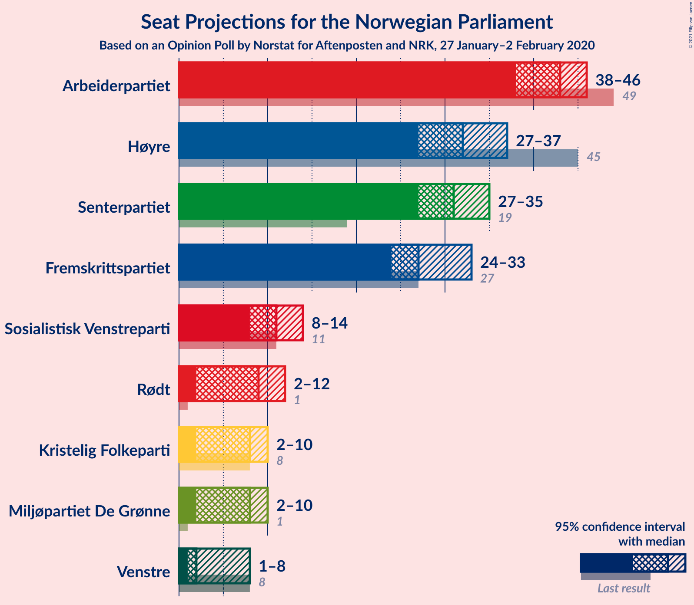

### Confidence Intervals

| Party | Last Result | Median | 80% Confidence Interval | 90% Confidence Interval | 95% Confidence Interval | 99% Confidence Interval |
|:-----:|:-----------:|:------:|:-----------------------:|:-----------------------:|:-----------------------:|:-----------------------:|
| <a href="#arbeiderpartiet">Arbeiderpartiet</a> | 49 | 43 | 40–44 |39–45 |38–46 |37–48 |
| <a href="#høyre">Høyre</a> | 45 | 32 | 30–37 |29–37 |27–37 |27–40 |
| <a href="#senterpartiet">Senterpartiet</a> | 19 | 31 | 29–34 |28–35 |27–36 |26–38 |
| <a href="#fremskrittspartiet">Fremskrittspartiet</a> | 27 | 28 | 24–31 |24–31 |24–32 |24–34 |
| <a href="#sosialistisk-venstreparti">Sosialistisk Venstreparti</a> | 11 | 11 | 8–12 |8–13 |8–13 |8–15 |
| <a href="#rødt">Rødt</a> | 1 | 9 | 8–11 |7–11 |7–12 |2–13 |
| <a href="#kristelig-folkeparti">Kristelig Folkeparti</a> | 8 | 8 | 3–9 |3–10 |3–10 |1–11 |
| <a href="#miljøpartiet-de-grønne">Miljøpartiet De Grønne</a> | 1 | 8 | 2–9 |2–9 |1–9 |1–11 |
| <a href="#venstre">Venstre</a> | 8 | 2 | 1–6 |1–7 |1–7 |1–8 |

### Arbeiderpartiet

*For a full overview of the results for this party, see the [Arbeiderpartiet](party-arbeiderpartiet.html) page.*

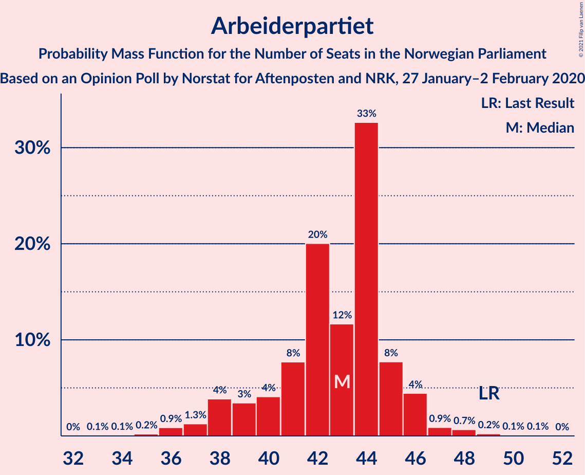

| Number of Seats | Probability | Accumulated | Special Marks |
|:---------------:|:-----------:|:-----------:|:-------------:|
| 34 | 0.1% | 100% |  |
| 35 | 0.1% | 99.8% |  |
| 36 | 0.2% | 99.8% |  |
| 37 | 0.3% | 99.6% |  |
| 38 | 4% | 99.2% |  |
| 39 | 3% | 95% |  |
| 40 | 7% | 93% |  |
| 41 | 6% | 85% |  |
| 42 | 26% | 79% |  |
| 43 | 40% | 53% | Median |
| 44 | 8% | 13% |  |
| 45 | 1.1% | 5% |  |
| 46 | 2% | 4% |  |
| 47 | 1.1% | 2% |  |
| 48 | 0.4% | 0.7% |  |
| 49 | 0.1% | 0.4% | Last Result |
| 50 | 0.1% | 0.2% |  |
| 51 | 0.1% | 0.2% |  |
| 52 | 0% | 0% |  |

### Høyre

*For a full overview of the results for this party, see the [Høyre](party-høyre.html) page.*

| Number of Seats | Probability | Accumulated | Special Marks |
|:---------------:|:-----------:|:-----------:|:-------------:|
| 24 | 0.1% | 100% |  |
| 25 | 0% | 99.9% |  |
| 26 | 0.3% | 99.9% |  |
| 27 | 2% | 99.6% |  |
| 28 | 2% | 97% |  |
| 29 | 3% | 96% |  |
| 30 | 6% | 92% |  |
| 31 | 19% | 87% |  |
| 32 | 34% | 68% | Median |
| 33 | 3% | 34% |  |
| 34 | 12% | 31% |  |
| 35 | 4% | 19% |  |
| 36 | 3% | 15% |  |
| 37 | 11% | 12% |  |
| 38 | 0.1% | 0.7% |  |
| 39 | 0.1% | 0.6% |  |
| 40 | 0.3% | 0.5% |  |
| 41 | 0.3% | 0.3% |  |
| 42 | 0% | 0% |  |
| 43 | 0% | 0% |  |
| 44 | 0% | 0% |  |
| 45 | 0% | 0% | Last Result |

### Senterpartiet

*For a full overview of the results for this party, see the [Senterpartiet](party-senterpartiet.html) page.*

| Number of Seats | Probability | Accumulated | Special Marks |
|:---------------:|:-----------:|:-----------:|:-------------:|
| 19 | 0% | 100% | Last Result |
| 20 | 0% | 100% |  |
| 21 | 0% | 100% |  |
| 22 | 0% | 100% |  |
| 23 | 0% | 100% |  |
| 24 | 0.1% | 100% |  |
| 25 | 0.1% | 99.9% |  |
| 26 | 0.8% | 99.8% |  |
| 27 | 3% | 99.0% |  |
| 28 | 2% | 96% |  |
| 29 | 16% | 94% |  |
| 30 | 26% | 78% |  |
| 31 | 23% | 52% | Median |
| 32 | 9% | 29% |  |
| 33 | 4% | 20% |  |
| 34 | 11% | 16% |  |
| 35 | 1.3% | 5% |  |
| 36 | 3% | 4% |  |
| 37 | 0.9% | 1.5% |  |
| 38 | 0.4% | 0.6% |  |
| 39 | 0.2% | 0.2% |  |
| 40 | 0% | 0% |  |

### Fremskrittspartiet

*For a full overview of the results for this party, see the [Fremskrittspartiet](party-fremskrittspartiet.html) page.*

| Number of Seats | Probability | Accumulated | Special Marks |
|:---------------:|:-----------:|:-----------:|:-------------:|
| 21 | 0% | 100% |  |
| 22 | 0.1% | 99.9% |  |
| 23 | 0.2% | 99.9% |  |
| 24 | 10% | 99.7% |  |
| 25 | 2% | 89% |  |
| 26 | 23% | 87% |  |
| 27 | 7% | 65% | Last Result |
| 28 | 23% | 58% | Median |
| 29 | 13% | 35% |  |
| 30 | 3% | 22% |  |
| 31 | 16% | 19% |  |
| 32 | 0.5% | 3% |  |
| 33 | 2% | 2% |  |
| 34 | 0.3% | 0.7% |  |
| 35 | 0.3% | 0.3% |  |
| 36 | 0% | 0% |  |

### Sosialistisk Venstreparti

*For a full overview of the results for this party, see the [Sosialistisk Venstreparti](party-sosialistiskvenstreparti.html) page.*

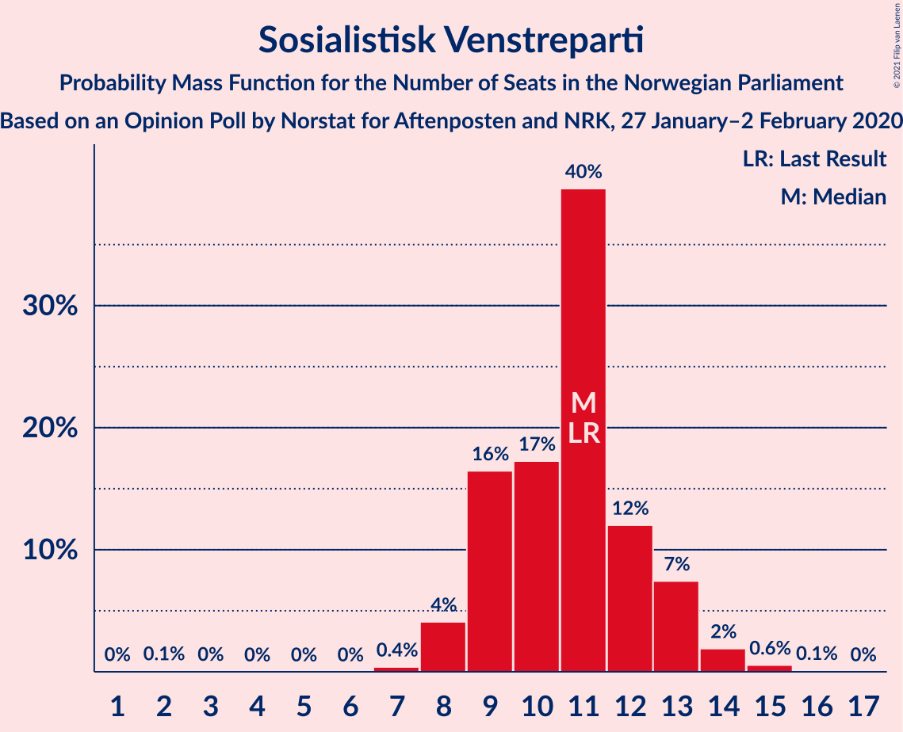

| Number of Seats | Probability | Accumulated | Special Marks |
|:---------------:|:-----------:|:-----------:|:-------------:|
| 2 | 0.1% | 100% |  |
| 3 | 0% | 99.9% |  |
| 4 | 0% | 99.9% |  |
| 5 | 0% | 99.9% |  |
| 6 | 0% | 99.9% |  |
| 7 | 0.1% | 99.9% |  |
| 8 | 19% | 99.8% |  |
| 9 | 8% | 81% |  |
| 10 | 18% | 73% |  |
| 11 | 24% | 55% | Last Result, Median |
| 12 | 25% | 31% |  |
| 13 | 4% | 6% |  |
| 14 | 0.3% | 1.3% |  |
| 15 | 0.8% | 0.9% |  |
| 16 | 0.1% | 0.1% |  |
| 17 | 0% | 0% |  |

### Rødt

*For a full overview of the results for this party, see the [Rødt](party-rødt.html) page.*

| Number of Seats | Probability | Accumulated | Special Marks |
|:---------------:|:-----------:|:-----------:|:-------------:|
| 1 | 0% | 100% | Last Result |
| 2 | 2% | 100% |  |
| 3 | 0% | 98% |  |
| 4 | 0% | 98% |  |
| 5 | 0% | 98% |  |
| 6 | 0.1% | 98% |  |
| 7 | 6% | 98% |  |
| 8 | 29% | 92% |  |
| 9 | 34% | 63% | Median |
| 10 | 17% | 29% |  |
| 11 | 8% | 12% |  |
| 12 | 4% | 4% |  |
| 13 | 0.6% | 0.7% |  |
| 14 | 0% | 0% |  |

### Kristelig Folkeparti

*For a full overview of the results for this party, see the [Kristelig Folkeparti](party-kristeligfolkeparti.html) page.*

| Number of Seats | Probability | Accumulated | Special Marks |
|:---------------:|:-----------:|:-----------:|:-------------:|
| 1 | 1.3% | 100% |  |
| 2 | 0.3% | 98.7% |  |
| 3 | 25% | 98% |  |
| 4 | 0% | 73% |  |
| 5 | 0% | 73% |  |
| 6 | 0% | 73% |  |
| 7 | 6% | 73% |  |
| 8 | 37% | 67% | Last Result, Median |
| 9 | 24% | 31% |  |
| 10 | 5% | 7% |  |
| 11 | 2% | 2% |  |
| 12 | 0.1% | 0.1% |  |
| 13 | 0% | 0% |  |

### Miljøpartiet De Grønne

*For a full overview of the results for this party, see the [Miljøpartiet De Grønne](party-miljøpartietdegrønne.html) page.*

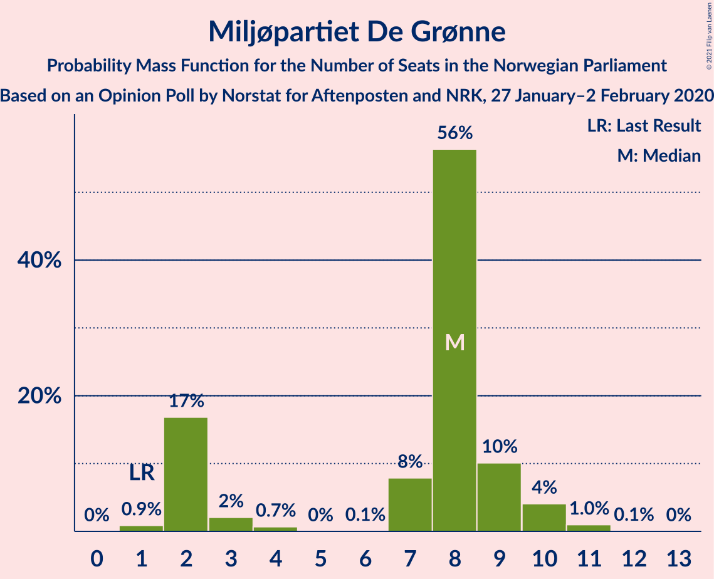

| Number of Seats | Probability | Accumulated | Special Marks |
|:---------------:|:-----------:|:-----------:|:-------------:|
| 1 | 3% | 100% | Last Result |
| 2 | 20% | 97% |  |
| 3 | 3% | 77% |  |
| 4 | 0% | 74% |  |
| 5 | 0% | 74% |  |
| 6 | 0% | 74% |  |
| 7 | 17% | 74% |  |
| 8 | 42% | 57% | Median |
| 9 | 13% | 15% |  |
| 10 | 0.6% | 2% |  |
| 11 | 1.3% | 1.4% |  |
| 12 | 0.1% | 0.1% |  |
| 13 | 0% | 0% |  |

### Venstre

*For a full overview of the results for this party, see the [Venstre](party-venstre.html) page.*

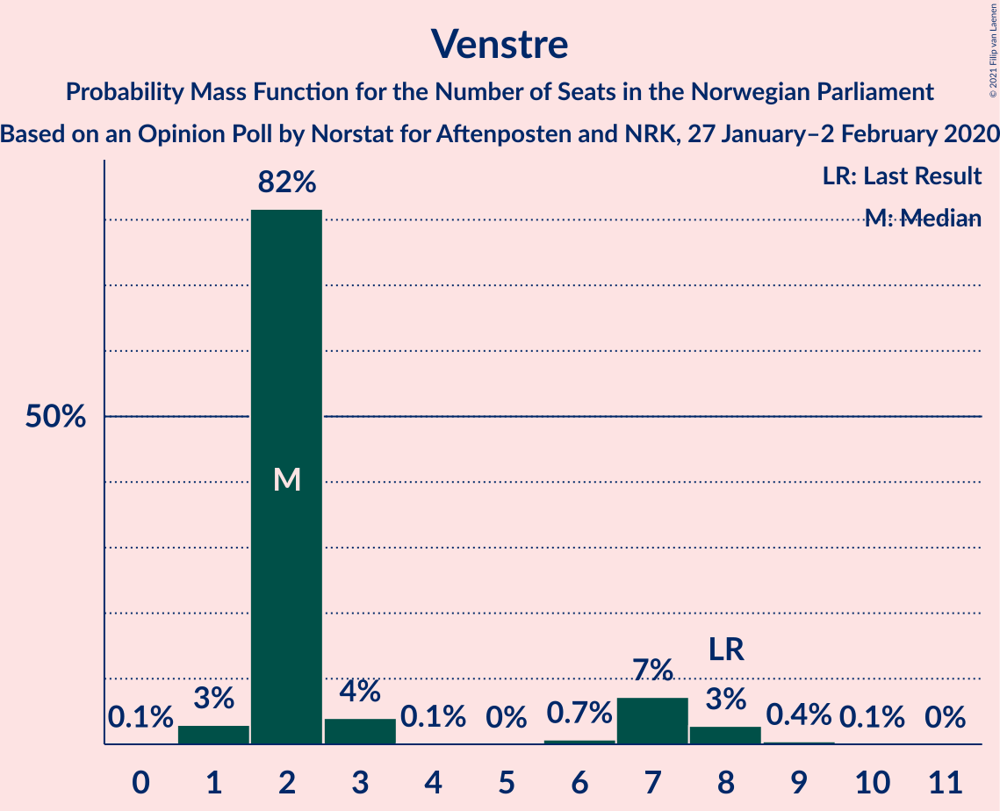

| Number of Seats | Probability | Accumulated | Special Marks |
|:---------------:|:-----------:|:-----------:|:-------------:|
| 1 | 22% | 100% |  |
| 2 | 59% | 78% | Median |
| 3 | 0.4% | 18% |  |
| 4 | 0% | 18% |  |
| 5 | 0% | 18% |  |
| 6 | 12% | 18% |  |
| 7 | 4% | 6% |  |
| 8 | 2% | 2% | Last Result |
| 9 | 0.4% | 0.4% |  |
| 10 | 0% | 0% |  |

## Coalitions

### Confidence Intervals

| Coalition | Last Result | Median | Majority? | 80% Confidence Interval | 90% Confidence Interval | 95% Confidence Interval | 99% Confidence Interval |
|:---------:|:-----------:|:------:|:---------:|:-----------------------:|:-----------------------:|:-----------------------:|:-----------------------:|
| Høyre – Senterpartiet – Fremskrittspartiet – Kristelig Folkeparti – Venstre | 107 | 102 | 100% | 97–103 | 96–105 | 95–107 | 94–110 |
| Arbeiderpartiet – Senterpartiet – Sosialistisk Venstreparti – Rødt – Miljøpartiet De Grønne | 81 | 100 | 100% | 96–104 | 94–104 | 93–105 | 91–107 |
| Arbeiderpartiet – Senterpartiet – Sosialistisk Venstreparti – Kristelig Folkeparti – Miljøpartiet De Grønne | 88 | 99 | 100% | 90–101 | 90–101 | 90–102 | 87–105 |
| Arbeiderpartiet – Senterpartiet – Sosialistisk Venstreparti – Rødt | 80 | 93 | 99.7% | 89–95 | 88–98 | 86–98 | 85–101 |
| Arbeiderpartiet – Senterpartiet – Sosialistisk Venstreparti – Miljøpartiet De Grønne | 80 | 90 | 97% | 86–96 | 85–96 | 84–97 | 83–98 |
| Arbeiderpartiet – Senterpartiet – Kristelig Folkeparti – Miljøpartiet De Grønne | 77 | 88 | 77% | 79–90 | 79–91 | 79–92 | 77–95 |
| Arbeiderpartiet – Senterpartiet – Sosialistisk Venstreparti | 79 | 84 | 32% | 81–87 | 80–88 | 79–89 | 77–93 |
| Arbeiderpartiet – Senterpartiet – Kristelig Folkeparti | 76 | 81 | 4% | 77–83 | 76–84 | 75–85 | 72–88 |
| Høyre – Fremskrittspartiet – Kristelig Folkeparti – Miljøpartiet De Grønne – Venstre | 89 | 76 | 0.3% | 74–80 | 71–81 | 70–83 | 68–84 |
| Arbeiderpartiet – Senterpartiet | 68 | 73 | 0% | 71–76 | 71–77 | 70–78 | 67–82 |
| Høyre – Fremskrittspartiet – Kristelig Folkeparti – Venstre | 88 | 69 | 0% | 65–73 | 65–75 | 64–76 | 62–78 |
| Høyre – Fremskrittspartiet – Venstre | 80 | 62 | 0% | 59–69 | 59–69 | 59–69 | 57–72 |
| Høyre – Fremskrittspartiet | 72 | 59 | 0% | 57–68 | 57–68 | 55–68 | 54–70 |
| Arbeiderpartiet – Sosialistisk Venstreparti | 60 | 53 | 0% | 50–55 | 49–56 | 48–57 | 47–60 |
| Høyre – Kristelig Folkeparti – Venstre | 61 | 42 | 0% | 37–45 | 37–47 | 35–48 | 33–49 |
| Senterpartiet – Kristelig Folkeparti – Venstre | 35 | 40 | 0% | 35–44 | 35–46 | 35–47 | 33–49 |

### Høyre – Senterpartiet – Fremskrittspartiet – Kristelig Folkeparti – Venstre

| Number of Seats | Probability | Accumulated | Special Marks |
|:---------------:|:-----------:|:-----------:|:-------------:|
| 92 | 0.1% | 100% |  |
| 93 | 0.2% | 99.9% |  |
| 94 | 2% | 99.7% |  |
| 95 | 1.0% | 98% |  |
| 96 | 3% | 97% |  |
| 97 | 7% | 94% |  |
| 98 | 14% | 87% |  |
| 99 | 12% | 73% |  |
| 100 | 5% | 61% |  |
| 101 | 5% | 56% | Median |
| 102 | 13% | 51% |  |
| 103 | 29% | 39% |  |
| 104 | 2% | 9% |  |
| 105 | 3% | 7% |  |
| 106 | 1.4% | 5% |  |
| 107 | 2% | 3% | Last Result |
| 108 | 0.2% | 2% |  |
| 109 | 0.5% | 1.5% |  |
| 110 | 0.6% | 1.0% |  |
| 111 | 0.3% | 0.4% |  |
| 112 | 0% | 0.1% |  |
| 113 | 0% | 0% |  |

### Arbeiderpartiet – Senterpartiet – Sosialistisk Venstreparti – Rødt – Miljøpartiet De Grønne

| Number of Seats | Probability | Accumulated | Special Marks |
|:---------------:|:-----------:|:-----------:|:-------------:|
| 81 | 0% | 100% | Last Result |
| 82 | 0% | 100% |  |
| 83 | 0% | 100% |  |
| 84 | 0% | 100% |  |
| 85 | 0% | 100% | Majority |
| 86 | 0% | 100% |  |
| 87 | 0.1% | 100% |  |
| 88 | 0% | 99.9% |  |
| 89 | 0.2% | 99.8% |  |
| 90 | 0.1% | 99.6% |  |
| 91 | 0.4% | 99.5% |  |
| 92 | 0.2% | 99.1% |  |
| 93 | 3% | 98.9% |  |
| 94 | 2% | 96% |  |
| 95 | 3% | 94% |  |
| 96 | 16% | 91% |  |
| 97 | 15% | 75% |  |
| 98 | 6% | 59% |  |
| 99 | 2% | 53% |  |
| 100 | 13% | 52% |  |
| 101 | 18% | 38% |  |
| 102 | 7% | 21% | Median |
| 103 | 2% | 14% |  |
| 104 | 8% | 13% |  |
| 105 | 3% | 5% |  |
| 106 | 2% | 2% |  |
| 107 | 0.4% | 0.5% |  |
| 108 | 0.1% | 0.2% |  |
| 109 | 0% | 0.1% |  |
| 110 | 0% | 0% |  |

### Arbeiderpartiet – Senterpartiet – Sosialistisk Venstreparti – Kristelig Folkeparti – Miljøpartiet De Grønne

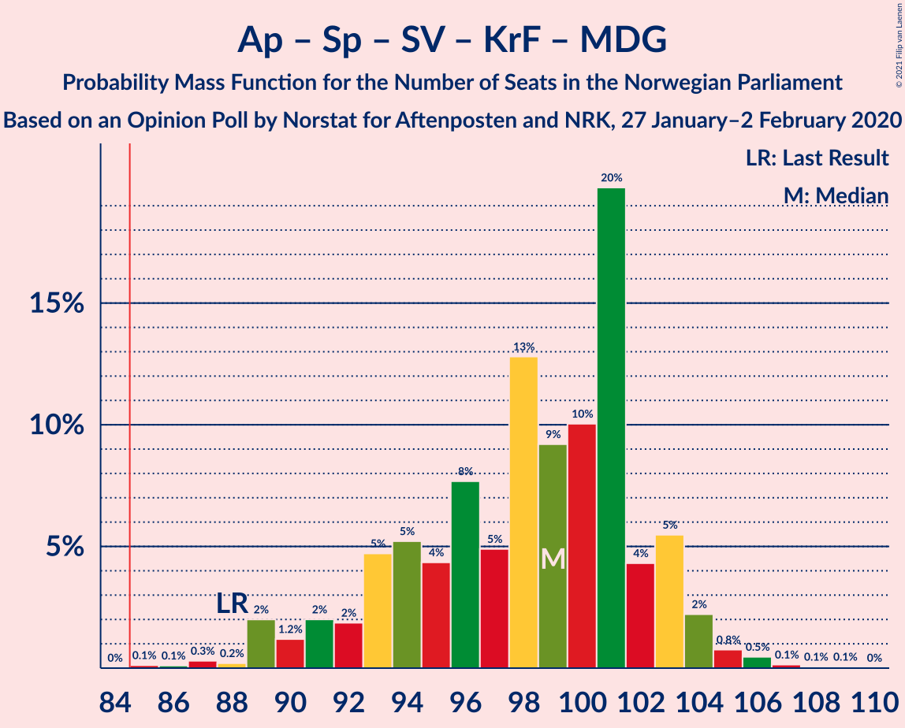

| Number of Seats | Probability | Accumulated | Special Marks |
|:---------------:|:-----------:|:-----------:|:-------------:|
| 86 | 0% | 100% |  |
| 87 | 0.5% | 99.9% |  |
| 88 | 0.2% | 99.4% | Last Result |
| 89 | 0.2% | 99.2% |  |
| 90 | 11% | 99.0% |  |
| 91 | 1.0% | 88% |  |
| 92 | 1.2% | 87% |  |
| 93 | 8% | 86% |  |
| 94 | 2% | 79% |  |
| 95 | 2% | 77% |  |
| 96 | 12% | 75% |  |
| 97 | 6% | 63% |  |
| 98 | 7% | 57% |  |
| 99 | 14% | 50% |  |
| 100 | 24% | 36% |  |
| 101 | 8% | 12% | Median |
| 102 | 2% | 3% |  |
| 103 | 0.6% | 2% |  |
| 104 | 0.7% | 1.2% |  |
| 105 | 0.2% | 0.6% |  |
| 106 | 0.1% | 0.3% |  |
| 107 | 0.2% | 0.3% |  |
| 108 | 0% | 0.1% |  |
| 109 | 0% | 0% |  |

### Arbeiderpartiet – Senterpartiet – Sosialistisk Venstreparti – Rødt

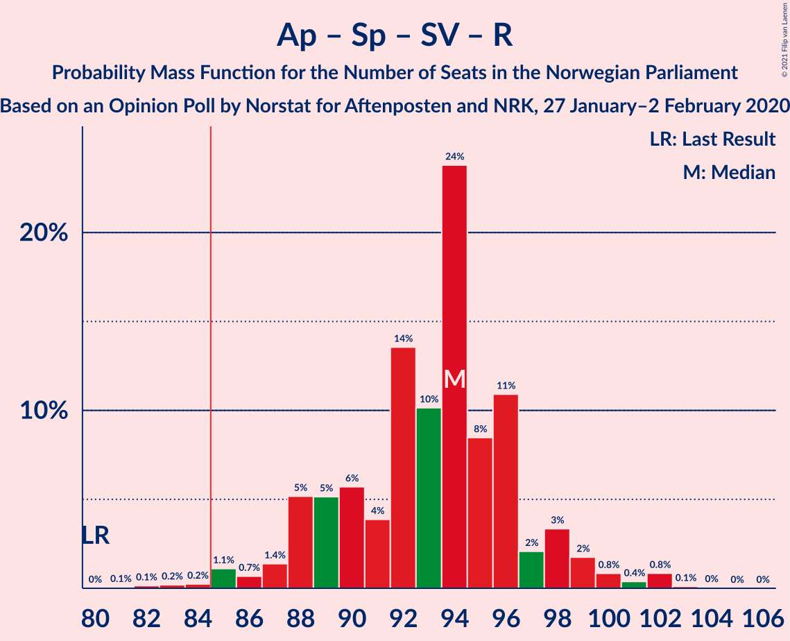

| Number of Seats | Probability | Accumulated | Special Marks |
|:---------------:|:-----------:|:-----------:|:-------------:|
| 80 | 0% | 100% | Last Result |
| 81 | 0.1% | 100% |  |
| 82 | 0% | 99.9% |  |
| 83 | 0.1% | 99.9% |  |
| 84 | 0.1% | 99.8% |  |
| 85 | 0.3% | 99.7% | Majority |
| 86 | 2% | 99.3% |  |
| 87 | 2% | 97% |  |
| 88 | 2% | 96% |  |
| 89 | 16% | 94% |  |
| 90 | 5% | 78% |  |
| 91 | 2% | 73% |  |
| 92 | 13% | 71% |  |
| 93 | 19% | 58% |  |
| 94 | 8% | 39% | Median |
| 95 | 21% | 31% |  |
| 96 | 2% | 10% |  |
| 97 | 1.1% | 7% |  |
| 98 | 4% | 6% |  |
| 99 | 1.0% | 2% |  |
| 100 | 0.4% | 2% |  |
| 101 | 0.8% | 1.1% |  |
| 102 | 0.2% | 0.3% |  |
| 103 | 0% | 0% |  |

### Arbeiderpartiet – Senterpartiet – Sosialistisk Venstreparti – Miljøpartiet De Grønne

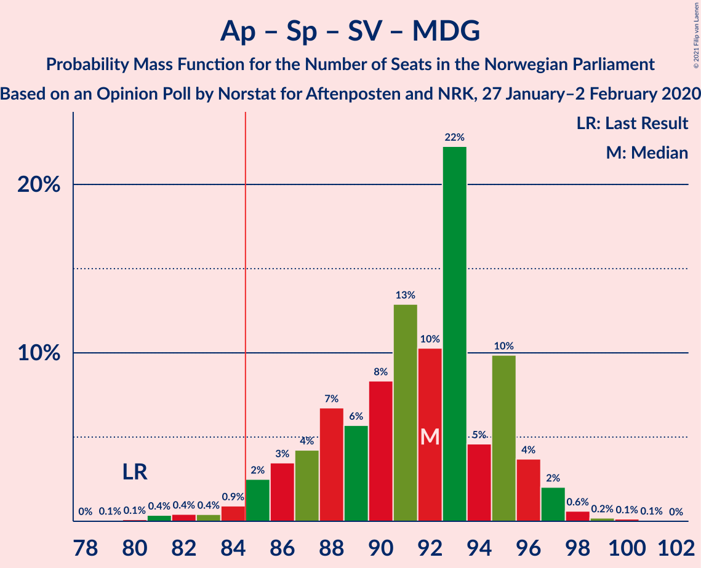

| Number of Seats | Probability | Accumulated | Special Marks |
|:---------------:|:-----------:|:-----------:|:-------------:|
| 80 | 0% | 100% | Last Result |
| 81 | 0% | 99.9% |  |
| 82 | 0.1% | 99.9% |  |
| 83 | 0.3% | 99.7% |  |
| 84 | 2% | 99.4% |  |
| 85 | 4% | 97% | Majority |
| 86 | 5% | 94% |  |
| 87 | 12% | 89% |  |
| 88 | 13% | 77% |  |
| 89 | 11% | 64% |  |
| 90 | 4% | 53% |  |
| 91 | 15% | 49% |  |
| 92 | 19% | 34% |  |
| 93 | 0.7% | 16% | Median |
| 94 | 2% | 15% |  |
| 95 | 1.2% | 13% |  |
| 96 | 8% | 12% |  |
| 97 | 2% | 4% |  |
| 98 | 1.0% | 1.5% |  |
| 99 | 0.3% | 0.4% |  |
| 100 | 0% | 0.1% |  |
| 101 | 0% | 0.1% |  |
| 102 | 0% | 0% |  |

### Arbeiderpartiet – Senterpartiet – Kristelig Folkeparti – Miljøpartiet De Grønne

| Number of Seats | Probability | Accumulated | Special Marks |
|:---------------:|:-----------:|:-----------:|:-------------:|
| 74 | 0% | 100% |  |
| 75 | 0.2% | 99.9% |  |
| 76 | 0.2% | 99.8% |  |
| 77 | 0.6% | 99.6% | Last Result |
| 78 | 0.3% | 98.9% |  |
| 79 | 10% | 98.6% |  |
| 80 | 0.6% | 88% |  |
| 81 | 1.4% | 88% |  |
| 82 | 2% | 86% |  |
| 83 | 0.6% | 84% |  |
| 84 | 6% | 84% |  |
| 85 | 6% | 77% | Majority |
| 86 | 3% | 71% |  |
| 87 | 10% | 69% |  |
| 88 | 26% | 59% |  |
| 89 | 16% | 33% |  |
| 90 | 7% | 17% | Median |
| 91 | 7% | 10% |  |
| 92 | 1.5% | 3% |  |
| 93 | 0.4% | 1.2% |  |
| 94 | 0.2% | 0.7% |  |
| 95 | 0.2% | 0.5% |  |
| 96 | 0.2% | 0.3% |  |
| 97 | 0% | 0.1% |  |
| 98 | 0% | 0.1% |  |
| 99 | 0% | 0% |  |

### Arbeiderpartiet – Senterpartiet – Sosialistisk Venstreparti

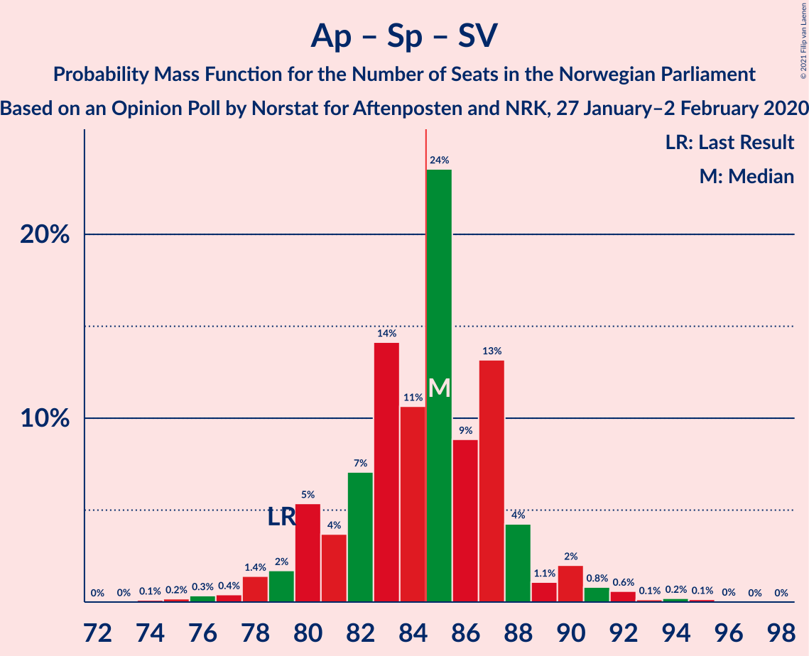

| Number of Seats | Probability | Accumulated | Special Marks |
|:---------------:|:-----------:|:-----------:|:-------------:|
| 75 | 0.2% | 100% |  |
| 76 | 0% | 99.8% |  |
| 77 | 0.3% | 99.7% |  |
| 78 | 0.1% | 99.5% |  |
| 79 | 3% | 99.4% | Last Result |
| 80 | 1.4% | 96% |  |
| 81 | 20% | 95% |  |
| 82 | 5% | 75% |  |
| 83 | 15% | 70% |  |
| 84 | 23% | 55% |  |
| 85 | 12% | 32% | Median, Majority |
| 86 | 5% | 20% |  |
| 87 | 8% | 15% |  |
| 88 | 3% | 7% |  |
| 89 | 1.4% | 4% |  |
| 90 | 0.7% | 2% |  |
| 91 | 0.3% | 1.4% |  |
| 92 | 0.2% | 1.2% |  |
| 93 | 0.5% | 0.9% |  |
| 94 | 0.4% | 0.5% |  |
| 95 | 0% | 0.1% |  |
| 96 | 0% | 0.1% |  |
| 97 | 0% | 0.1% |  |
| 98 | 0% | 0% |  |

### Arbeiderpartiet – Senterpartiet – Kristelig Folkeparti

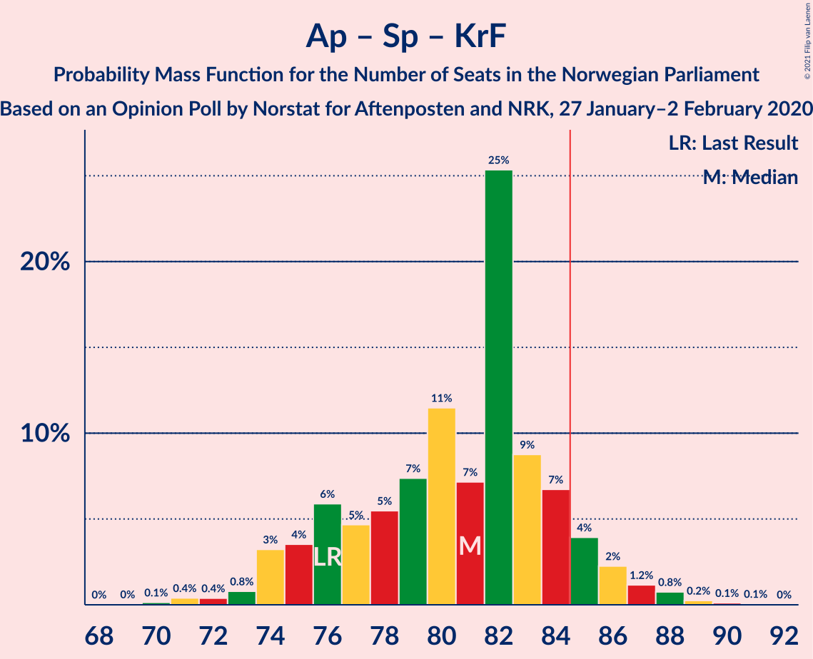

| Number of Seats | Probability | Accumulated | Special Marks |
|:---------------:|:-----------:|:-----------:|:-------------:|
| 68 | 0% | 100% |  |
| 69 | 0% | 99.9% |  |
| 70 | 0.2% | 99.9% |  |
| 71 | 0% | 99.8% |  |
| 72 | 0.2% | 99.7% |  |
| 73 | 1.0% | 99.5% |  |
| 74 | 0.7% | 98% |  |
| 75 | 2% | 98% |  |
| 76 | 1.2% | 96% | Last Result |
| 77 | 11% | 95% |  |
| 78 | 9% | 84% |  |
| 79 | 5% | 75% |  |
| 80 | 17% | 69% |  |
| 81 | 26% | 52% |  |
| 82 | 11% | 26% | Median |
| 83 | 7% | 14% |  |
| 84 | 3% | 7% |  |
| 85 | 2% | 4% | Majority |
| 86 | 0.5% | 2% |  |
| 87 | 0.4% | 2% |  |
| 88 | 0.7% | 1.2% |  |
| 89 | 0.1% | 0.5% |  |
| 90 | 0.1% | 0.4% |  |
| 91 | 0.2% | 0.3% |  |
| 92 | 0.1% | 0.1% |  |
| 93 | 0% | 0% |  |

### Høyre – Fremskrittspartiet – Kristelig Folkeparti – Miljøpartiet De Grønne – Venstre

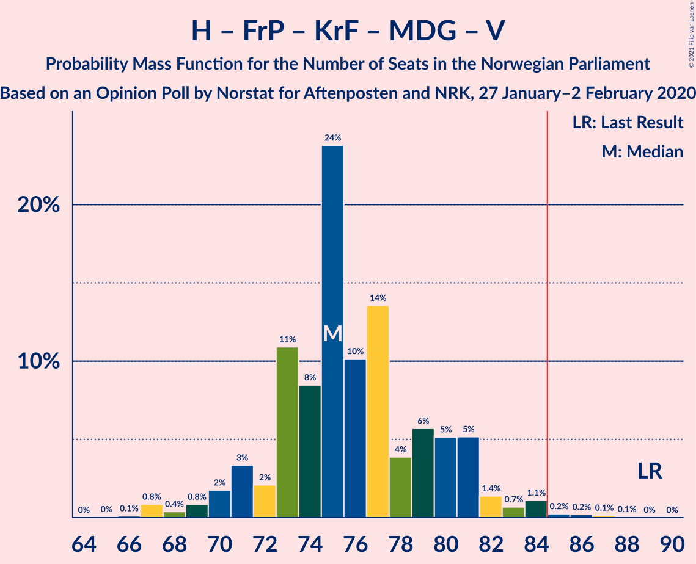

| Number of Seats | Probability | Accumulated | Special Marks |
|:---------------:|:-----------:|:-----------:|:-------------:|
| 67 | 0.3% | 100% |  |
| 68 | 0.9% | 99.7% |  |
| 69 | 0.4% | 98.8% |  |
| 70 | 1.0% | 98% |  |
| 71 | 4% | 97% |  |
| 72 | 1.1% | 94% |  |
| 73 | 3% | 93% |  |
| 74 | 21% | 90% |  |
| 75 | 8% | 69% |  |
| 76 | 19% | 61% |  |
| 77 | 13% | 42% |  |
| 78 | 2% | 29% | Median |
| 79 | 5% | 27% |  |
| 80 | 16% | 22% |  |
| 81 | 2% | 6% |  |
| 82 | 2% | 4% |  |
| 83 | 2% | 3% |  |
| 84 | 0.3% | 0.7% |  |
| 85 | 0.1% | 0.3% | Majority |
| 86 | 0.1% | 0.2% |  |
| 87 | 0% | 0.1% |  |
| 88 | 0.1% | 0.1% |  |
| 89 | 0% | 0% | Last Result |

### Arbeiderpartiet – Senterpartiet

| Number of Seats | Probability | Accumulated | Special Marks |
|:---------------:|:-----------:|:-----------:|:-------------:|
| 64 | 0.1% | 100% |  |
| 65 | 0.2% | 99.9% |  |
| 66 | 0.1% | 99.7% |  |
| 67 | 0.4% | 99.6% |  |
| 68 | 0.3% | 99.2% | Last Result |
| 69 | 0.6% | 99.0% |  |
| 70 | 3% | 98% |  |
| 71 | 18% | 96% |  |
| 72 | 7% | 77% |  |
| 73 | 28% | 70% |  |
| 74 | 23% | 42% | Median |
| 75 | 8% | 20% |  |
| 76 | 6% | 12% |  |
| 77 | 3% | 5% |  |
| 78 | 0.4% | 3% |  |
| 79 | 0.8% | 2% |  |
| 80 | 0.7% | 1.3% |  |
| 81 | 0.1% | 0.6% |  |
| 82 | 0.3% | 0.5% |  |
| 83 | 0.2% | 0.2% |  |
| 84 | 0% | 0% |  |

### Høyre – Fremskrittspartiet – Kristelig Folkeparti – Venstre

| Number of Seats | Probability | Accumulated | Special Marks |
|:---------------:|:-----------:|:-----------:|:-------------:|
| 60 | 0% | 100% |  |
| 61 | 0.1% | 99.9% |  |
| 62 | 0.4% | 99.8% |  |
| 63 | 2% | 99.5% |  |
| 64 | 3% | 98% |  |
| 65 | 8% | 95% |  |
| 66 | 2% | 87% |  |
| 67 | 7% | 86% |  |
| 68 | 18% | 79% |  |
| 69 | 13% | 62% |  |
| 70 | 2% | 48% | Median |
| 71 | 6% | 47% |  |
| 72 | 15% | 40% |  |
| 73 | 16% | 25% |  |
| 74 | 3% | 9% |  |
| 75 | 2% | 6% |  |
| 76 | 3% | 4% |  |
| 77 | 0.2% | 1.1% |  |
| 78 | 0.4% | 0.9% |  |
| 79 | 0.1% | 0.5% |  |
| 80 | 0.2% | 0.4% |  |
| 81 | 0% | 0.2% |  |
| 82 | 0.1% | 0.1% |  |
| 83 | 0% | 0% |  |
| 84 | 0% | 0% |  |
| 85 | 0% | 0% | Majority |
| 86 | 0% | 0% |  |
| 87 | 0% | 0% |  |
| 88 | 0% | 0% | Last Result |

### Høyre – Fremskrittspartiet – Venstre

| Number of Seats | Probability | Accumulated | Special Marks |
|:---------------:|:-----------:|:-----------:|:-------------:|
| 54 | 0.1% | 100% |  |
| 55 | 0.1% | 99.9% |  |
| 56 | 0.3% | 99.8% |  |
| 57 | 1.1% | 99.5% |  |
| 58 | 0.9% | 98% |  |
| 59 | 12% | 98% |  |
| 60 | 23% | 85% |  |
| 61 | 7% | 62% |  |
| 62 | 10% | 55% | Median |
| 63 | 6% | 45% |  |
| 64 | 3% | 39% |  |
| 65 | 17% | 36% |  |
| 66 | 1.4% | 19% |  |
| 67 | 2% | 18% |  |
| 68 | 2% | 16% |  |
| 69 | 12% | 14% |  |
| 70 | 0.4% | 2% |  |
| 71 | 0.6% | 1.4% |  |
| 72 | 0.5% | 0.8% |  |
| 73 | 0% | 0.3% |  |
| 74 | 0.2% | 0.3% |  |
| 75 | 0% | 0.1% |  |
| 76 | 0% | 0.1% |  |
| 77 | 0.1% | 0.1% |  |
| 78 | 0% | 0% |  |
| 79 | 0% | 0% |  |
| 80 | 0% | 0% | Last Result |

### Høyre – Fremskrittspartiet

| Number of Seats | Probability | Accumulated | Special Marks |
|:---------------:|:-----------:|:-----------:|:-------------:|
| 52 | 0.1% | 100% |  |
| 53 | 0.2% | 99.9% |  |
| 54 | 0.3% | 99.6% |  |
| 55 | 2% | 99.3% |  |
| 56 | 2% | 97% |  |
| 57 | 6% | 96% |  |
| 58 | 30% | 89% |  |
| 59 | 18% | 59% |  |
| 60 | 7% | 42% | Median |
| 61 | 8% | 35% |  |
| 62 | 3% | 27% |  |
| 63 | 9% | 24% |  |
| 64 | 1.3% | 15% |  |
| 65 | 1.1% | 14% |  |
| 66 | 0.9% | 13% |  |
| 67 | 0.9% | 12% |  |
| 68 | 10% | 11% |  |
| 69 | 0.2% | 0.7% |  |
| 70 | 0.3% | 0.5% |  |
| 71 | 0.2% | 0.2% |  |
| 72 | 0% | 0% | Last Result |

### Arbeiderpartiet – Sosialistisk Venstreparti

| Number of Seats | Probability | Accumulated | Special Marks |
|:---------------:|:-----------:|:-----------:|:-------------:|
| 42 | 0% | 100% |  |
| 43 | 0.1% | 99.9% |  |
| 44 | 0% | 99.8% |  |
| 45 | 0.1% | 99.8% |  |
| 46 | 0.2% | 99.7% |  |
| 47 | 0.5% | 99.6% |  |
| 48 | 3% | 99.1% |  |
| 49 | 2% | 96% |  |
| 50 | 8% | 94% |  |
| 51 | 19% | 86% |  |
| 52 | 6% | 66% |  |
| 53 | 17% | 60% |  |
| 54 | 27% | 43% | Median |
| 55 | 10% | 17% |  |
| 56 | 3% | 7% |  |
| 57 | 2% | 4% |  |
| 58 | 0.6% | 2% |  |
| 59 | 0.3% | 1.3% |  |
| 60 | 0.5% | 0.9% | Last Result |
| 61 | 0% | 0.4% |  |
| 62 | 0.1% | 0.4% |  |
| 63 | 0.2% | 0.3% |  |
| 64 | 0% | 0.1% |  |
| 65 | 0.1% | 0.1% |  |
| 66 | 0% | 0% |  |

### Høyre – Kristelig Folkeparti – Venstre

| Number of Seats | Probability | Accumulated | Special Marks |
|:---------------:|:-----------:|:-----------:|:-------------:|
| 32 | 0.1% | 100% |  |
| 33 | 0.5% | 99.9% |  |
| 34 | 1.1% | 99.4% |  |
| 35 | 2% | 98% |  |
| 36 | 0.7% | 96% |  |
| 37 | 8% | 95% |  |
| 38 | 2% | 88% |  |
| 39 | 3% | 86% |  |
| 40 | 2% | 83% |  |
| 41 | 17% | 82% |  |
| 42 | 17% | 64% | Median |
| 43 | 17% | 48% |  |
| 44 | 12% | 31% |  |
| 45 | 12% | 19% |  |
| 46 | 2% | 7% |  |
| 47 | 2% | 5% |  |
| 48 | 3% | 4% |  |
| 49 | 0.1% | 0.6% |  |
| 50 | 0.1% | 0.4% |  |
| 51 | 0.3% | 0.3% |  |
| 52 | 0% | 0% |  |
| 53 | 0% | 0% |  |
| 54 | 0% | 0% |  |
| 55 | 0% | 0% |  |
| 56 | 0% | 0% |  |
| 57 | 0% | 0% |  |
| 58 | 0% | 0% |  |
| 59 | 0% | 0% |  |
| 60 | 0% | 0% |  |
| 61 | 0% | 0% | Last Result |

### Senterpartiet – Kristelig Folkeparti – Venstre

| Number of Seats | Probability | Accumulated | Special Marks |
|:---------------:|:-----------:|:-----------:|:-------------:|
| 31 | 0.2% | 100% |  |
| 32 | 0% | 99.8% |  |
| 33 | 1.4% | 99.8% |  |
| 34 | 0.4% | 98% |  |
| 35 | 12% | 98% | Last Result |
| 36 | 0.4% | 86% |  |
| 37 | 8% | 86% |  |
| 38 | 2% | 78% |  |
| 39 | 6% | 76% |  |
| 40 | 20% | 69% |  |
| 41 | 14% | 50% | Median |
| 42 | 7% | 36% |  |
| 43 | 4% | 29% |  |
| 44 | 18% | 25% |  |
| 45 | 1.5% | 7% |  |
| 46 | 3% | 6% |  |
| 47 | 1.3% | 3% |  |
| 48 | 0.6% | 2% |  |
| 49 | 0.8% | 1.2% |  |
| 50 | 0.1% | 0.4% |  |
| 51 | 0.1% | 0.3% |  |
| 52 | 0.2% | 0.2% |  |
| 53 | 0% | 0.1% |  |
| 54 | 0% | 0% |  |

## Technical Information

### Opinion Poll

+ **Polling firm:** Norstat
+ **Commissioner(s):** Aftenposten and NRK
+ **Fieldwork period:** 27 January–2 February 2020

### Calculations

+ **Sample size:** 952
+ **Simulations done:** 131,072
+ **Error estimate:** 1.97%

