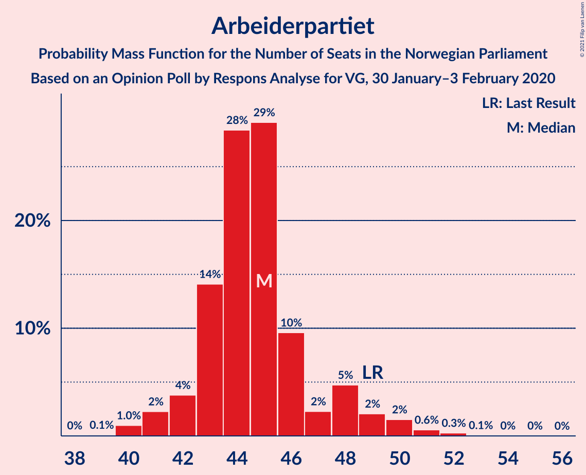
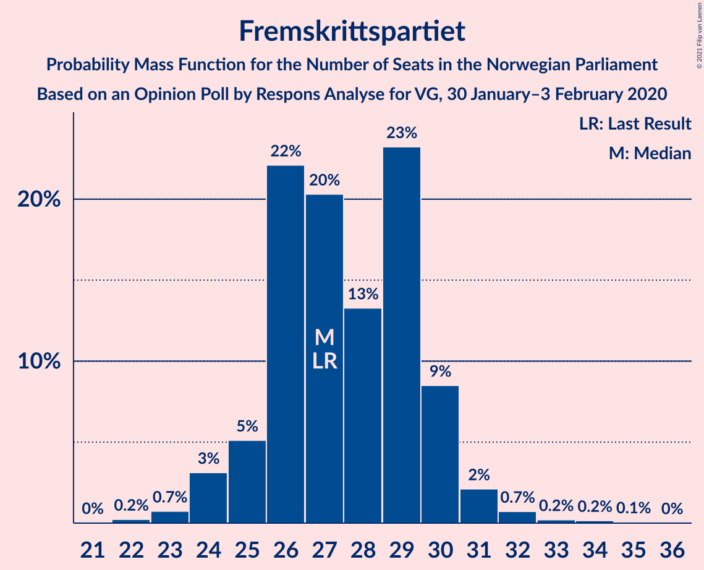
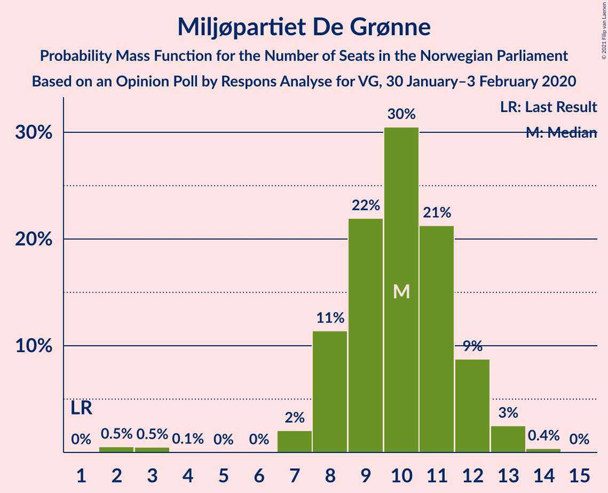
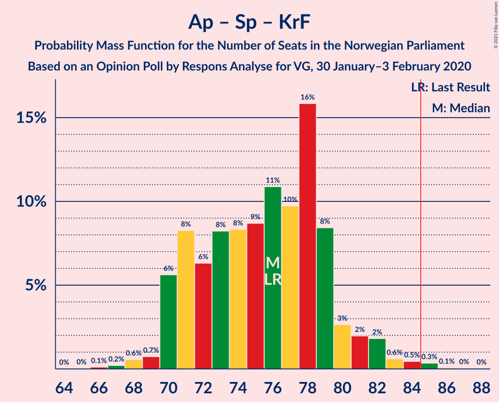

# Opinion Poll by Respons Analyse for VG, 30 January–3 February 2020

<a href="#voting-intentions">Voting Intentions</a> | <a href="#seats">Seats</a> | <a href="#coalitions">Coalitions</a> | <a href="#technical-information">Technical Information</a>

## Voting Intentions

### Confidence Intervals

| Party | Last Result | Poll Result | 80% Confidence Interval | 90% Confidence Interval | 95% Confidence Interval | 99% Confidence Interval |
|:-----:|:-----------:|:-----------:|:-----------------------:|:-----------------------:|:-----------------------:|:-----------------------:|
| Arbeiderpartiet | 27.4% | 24.9% | 23.2–26.7% |22.7–27.2% |22.3–27.6% |21.5–28.5% |
| Høyre | 25.0% | 19.9% | 18.3–21.6% |17.9–22.0% |17.5–22.5% |16.8–23.3% |
| Fremskrittspartiet | 15.2% | 15.3% | 13.9–16.8% |13.5–17.3% |13.2–17.6% |12.5–18.4% |
| Senterpartiet | 10.3% | 13.9% | 12.6–15.4% |12.2–15.8% |11.9–16.2% |11.3–16.9% |
| Sosialistisk Venstreparti | 6.0% | 6.7% | 5.8–7.8% |5.5–8.1% |5.3–8.4% |4.9–9.0% |
| Miljøpartiet De Grønne | 3.2% | 5.5% | 4.7–6.5% |4.4–6.8% |4.2–7.1% |3.9–7.6% |
| Rødt | 2.4% | 4.6% | 3.8–5.6% |3.6–5.8% |3.5–6.1% |3.1–6.6% |
| Kristelig Folkeparti | 4.2% | 4.2% | 3.5–5.1% |3.3–5.4% |3.1–5.6% |2.8–6.1% |
| Venstre | 4.4% | 2.7% | 2.1–3.5% |2.0–3.7% |1.9–3.9% |1.6–4.3% |

*Note:* The poll result column reflects the actual value used in the calculations. Published results may vary slightly, and in addition be rounded to fewer digits.

## Seats

### Confidence Intervals

| Party | Last Result | Median | 80% Confidence Interval | 90% Confidence Interval | 95% Confidence Interval | 99% Confidence Interval |
|:-----:|:-----------:|:------:|:-----------------------:|:-----------------------:|:-----------------------:|:-----------------------:|
| <a href="#arbeiderpartiet">Arbeiderpartiet</a> | 49 | 44 | 43–48 |42–48 |41–49 |40–51 |
| <a href="#høyre">Høyre</a> | 45 | 35 | 32–38 |32–39 |31–40 |29–41 |
| <a href="#fremskrittspartiet">Fremskrittspartiet</a> | 27 | 27 | 26–29 |25–30 |24–31 |23–33 |
| <a href="#senterpartiet">Senterpartiet</a> | 19 | 25 | 22–28 |21–29 |21–30 |20–30 |
| <a href="#sosialistisk-venstreparti">Sosialistisk Venstreparti</a> | 11 | 12 | 9–14 |9–14 |9–14 |9–16 |
| <a href="#miljøpartiet-de-grønne">Miljøpartiet De Grønne</a> | 1 | 10 | 8–12 |8–12 |8–12 |2–13 |
| <a href="#rødt">Rødt</a> | 1 | 8 | 2–10 |2–10 |2–11 |2–11 |
| <a href="#kristelig-folkeparti">Kristelig Folkeparti</a> | 8 | 8 | 3–9 |3–9 |2–10 |1–11 |
| <a href="#venstre">Venstre</a> | 8 | 2 | 1–2 |1–2 |1–2 |0–7 |

### Arbeiderpartiet

*For a full overview of the results for this party, see the [Arbeiderpartiet](party-arbeiderpartiet.html) page.*

| Number of Seats | Probability | Accumulated | Special Marks |
|:---------------:|:-----------:|:-----------:|:-------------:|
| 38 | 0.1% | 100% |  |
| 39 | 0.1% | 99.9% |  |
| 40 | 1.2% | 99.8% |  |
| 41 | 2% | 98.6% |  |
| 42 | 5% | 96% |  |
| 43 | 21% | 91% |  |
| 44 | 23% | 70% | Median |
| 45 | 29% | 48% |  |
| 46 | 4% | 18% |  |
| 47 | 2% | 14% |  |
| 48 | 7% | 12% |  |
| 49 | 2% | 5% | Last Result |
| 50 | 1.3% | 2% |  |
| 51 | 0.3% | 0.8% |  |
| 52 | 0.3% | 0.4% |  |
| 53 | 0% | 0.1% |  |
| 54 | 0% | 0.1% |  |
| 55 | 0% | 0% |  |

### Høyre

*For a full overview of the results for this party, see the [Høyre](party-høyre.html) page.*

| Number of Seats | Probability | Accumulated | Special Marks |
|:---------------:|:-----------:|:-----------:|:-------------:|
| 28 | 0.1% | 100% |  |
| 29 | 0.4% | 99.8% |  |
| 30 | 0.9% | 99.5% |  |
| 31 | 1.5% | 98.6% |  |
| 32 | 8% | 97% |  |
| 33 | 10% | 90% |  |
| 34 | 23% | 79% |  |
| 35 | 8% | 56% | Median |
| 36 | 16% | 48% |  |
| 37 | 9% | 32% |  |
| 38 | 16% | 23% |  |
| 39 | 4% | 7% |  |
| 40 | 3% | 4% |  |
| 41 | 0.3% | 0.6% |  |
| 42 | 0.1% | 0.4% |  |
| 43 | 0.2% | 0.3% |  |
| 44 | 0.1% | 0.1% |  |
| 45 | 0% | 0% | Last Result |

### Fremskrittspartiet

*For a full overview of the results for this party, see the [Fremskrittspartiet](party-fremskrittspartiet.html) page.*

| Number of Seats | Probability | Accumulated | Special Marks |
|:---------------:|:-----------:|:-----------:|:-------------:|
| 21 | 0% | 100% |  |
| 22 | 0.3% | 99.9% |  |
| 23 | 0.5% | 99.6% |  |
| 24 | 2% | 99.1% |  |
| 25 | 6% | 97% |  |
| 26 | 26% | 91% |  |
| 27 | 19% | 65% | Last Result, Median |
| 28 | 18% | 47% |  |
| 29 | 21% | 29% |  |
| 30 | 6% | 8% |  |
| 31 | 1.5% | 3% |  |
| 32 | 0.8% | 1.3% |  |
| 33 | 0.3% | 0.6% |  |
| 34 | 0.3% | 0.3% |  |
| 35 | 0% | 0.1% |  |
| 36 | 0% | 0% |  |

### Senterpartiet

*For a full overview of the results for this party, see the [Senterpartiet](party-senterpartiet.html) page.*

| Number of Seats | Probability | Accumulated | Special Marks |
|:---------------:|:-----------:|:-----------:|:-------------:|
| 18 | 0.1% | 100% |  |
| 19 | 0.2% | 99.9% | Last Result |
| 20 | 1.1% | 99.7% |  |
| 21 | 5% | 98.6% |  |
| 22 | 8% | 94% |  |
| 23 | 10% | 86% |  |
| 24 | 21% | 76% |  |
| 25 | 25% | 55% | Median |
| 26 | 5% | 30% |  |
| 27 | 6% | 26% |  |
| 28 | 10% | 19% |  |
| 29 | 7% | 10% |  |
| 30 | 2% | 3% |  |
| 31 | 0.1% | 0.2% |  |
| 32 | 0.1% | 0.1% |  |
| 33 | 0% | 0% |  |

### Sosialistisk Venstreparti

*For a full overview of the results for this party, see the [Sosialistisk Venstreparti](party-sosialistiskvenstreparti.html) page.*

| Number of Seats | Probability | Accumulated | Special Marks |
|:---------------:|:-----------:|:-----------:|:-------------:|
| 7 | 0.1% | 100% |  |
| 8 | 0.3% | 99.9% |  |
| 9 | 10% | 99.6% |  |
| 10 | 15% | 89% |  |
| 11 | 7% | 75% | Last Result |
| 12 | 23% | 68% | Median |
| 13 | 28% | 45% |  |
| 14 | 15% | 17% |  |
| 15 | 2% | 2% |  |
| 16 | 0.7% | 0.8% |  |
| 17 | 0.1% | 0.1% |  |
| 18 | 0% | 0% |  |

### Miljøpartiet De Grønne

*For a full overview of the results for this party, see the [Miljøpartiet De Grønne](party-miljøpartietdegrønne.html) page.*

| Number of Seats | Probability | Accumulated | Special Marks |
|:---------------:|:-----------:|:-----------:|:-------------:|
| 1 | 0% | 100% | Last Result |
| 2 | 0.5% | 100% |  |
| 3 | 0.6% | 99.5% |  |
| 4 | 0% | 98.9% |  |
| 5 | 0% | 98.9% |  |
| 6 | 0% | 98.9% |  |
| 7 | 1.3% | 98.9% |  |
| 8 | 13% | 98% |  |
| 9 | 23% | 84% |  |
| 10 | 33% | 61% | Median |
| 11 | 12% | 29% |  |
| 12 | 15% | 17% |  |
| 13 | 2% | 2% |  |
| 14 | 0.2% | 0.2% |  |
| 15 | 0% | 0% |  |

### Rødt

*For a full overview of the results for this party, see the [Rødt](party-rødt.html) page.*

| Number of Seats | Probability | Accumulated | Special Marks |
|:---------------:|:-----------:|:-----------:|:-------------:|
| 1 | 0.1% | 100% | Last Result |
| 2 | 23% | 99.9% |  |
| 3 | 0% | 76% |  |
| 4 | 0% | 76% |  |
| 5 | 0% | 76% |  |
| 6 | 0.1% | 76% |  |
| 7 | 10% | 76% |  |
| 8 | 29% | 66% | Median |
| 9 | 25% | 36% |  |
| 10 | 8% | 11% |  |
| 11 | 3% | 4% |  |
| 12 | 0.3% | 0.4% |  |
| 13 | 0% | 0% |  |

### Kristelig Folkeparti

*For a full overview of the results for this party, see the [Kristelig Folkeparti](party-kristeligfolkeparti.html) page.*

| Number of Seats | Probability | Accumulated | Special Marks |
|:---------------:|:-----------:|:-----------:|:-------------:|
| 1 | 2% | 100% |  |
| 2 | 2% | 98% |  |
| 3 | 29% | 95% |  |
| 4 | 0% | 66% |  |
| 5 | 0% | 66% |  |
| 6 | 0.1% | 66% |  |
| 7 | 13% | 66% |  |
| 8 | 42% | 53% | Last Result, Median |
| 9 | 8% | 11% |  |
| 10 | 3% | 3% |  |
| 11 | 0.7% | 0.7% |  |
| 12 | 0.1% | 0.1% |  |
| 13 | 0% | 0% |  |

### Venstre

*For a full overview of the results for this party, see the [Venstre](party-venstre.html) page.*

| Number of Seats | Probability | Accumulated | Special Marks |
|:---------------:|:-----------:|:-----------:|:-------------:|
| 0 | 2% | 100% |  |
| 1 | 42% | 98% |  |
| 2 | 55% | 56% | Median |
| 3 | 0% | 1.0% |  |
| 4 | 0% | 1.0% |  |
| 5 | 0% | 1.0% |  |
| 6 | 0.1% | 1.0% |  |
| 7 | 0.4% | 0.8% |  |
| 8 | 0.4% | 0.4% | Last Result |
| 9 | 0% | 0% |  |

## Coalitions

### Confidence Intervals

| Coalition | Last Result | Median | Majority? | 80% Confidence Interval | 90% Confidence Interval | 95% Confidence Interval | 99% Confidence Interval |
|:---------:|:-----------:|:------:|:---------:|:-----------------------:|:-----------------------:|:-----------------------:|:-----------------------:|
| Arbeiderpartiet – Senterpartiet – Sosialistisk Venstreparti – Miljøpartiet De Grønne – Rødt | 81 | 99 | 100% | 95–102 | 94–103 | 93–105 | 91–106 |
| Arbeiderpartiet – Senterpartiet – Sosialistisk Venstreparti – Miljøpartiet De Grønne – Kristelig Folkeparti | 88 | 98 | 100% | 94–101 | 93–102 | 91–103 | 89–105 |
| Høyre – Fremskrittspartiet – Senterpartiet – Kristelig Folkeparti – Venstre | 107 | 96 | 100% | 91–99 | 90–101 | 90–101 | 88–104 |
| Arbeiderpartiet – Senterpartiet – Sosialistisk Venstreparti – Miljøpartiet De Grønne | 80 | 92 | 98% | 87–95 | 86–96 | 85–97 | 83–100 |
| Arbeiderpartiet – Senterpartiet – Sosialistisk Venstreparti – Rødt | 80 | 89 | 94% | 85–93 | 84–93 | 83–95 | 80–97 |
| Arbeiderpartiet – Senterpartiet – Miljøpartiet De Grønne – Kristelig Folkeparti | 77 | 86 | 63% | 82–89 | 81–90 | 79–91 | 77–93 |
| Arbeiderpartiet – Senterpartiet – Sosialistisk Venstreparti | 79 | 82 | 9% | 77–84 | 77–86 | 76–87 | 75–90 |
| Høyre – Fremskrittspartiet – Miljøpartiet De Grønne – Kristelig Folkeparti – Venstre | 89 | 80 | 6% | 76–84 | 76–85 | 74–86 | 72–89 |
| Arbeiderpartiet – Senterpartiet – Kristelig Folkeparti | 76 | 76 | 0.3% | 71–79 | 71–80 | 70–82 | 68–84 |
| Høyre – Fremskrittspartiet – Kristelig Folkeparti – Venstre | 88 | 70 | 0% | 67–74 | 66–75 | 64–76 | 63–78 |
| Arbeiderpartiet – Senterpartiet | 68 | 70 | 0% | 66–72 | 65–74 | 65–75 | 63–77 |
| Høyre – Fremskrittspartiet – Venstre | 80 | 65 | 0% | 61–67 | 59–69 | 59–70 | 57–72 |
| Høyre – Fremskrittspartiet | 72 | 63 | 0% | 60–66 | 57–67 | 57–69 | 56–70 |
| Arbeiderpartiet – Sosialistisk Venstreparti | 60 | 57 | 0% | 53–60 | 52–60 | 52–61 | 51–63 |
| Høyre – Kristelig Folkeparti – Venstre | 61 | 43 | 0% | 38–48 | 38–48 | 37–48 | 36–50 |
| Senterpartiet – Kristelig Folkeparti – Venstre | 35 | 33 | 0% | 28–37 | 28–38 | 27–38 | 25–40 |

### Arbeiderpartiet – Senterpartiet – Sosialistisk Venstreparti – Miljøpartiet De Grønne – Rødt

| Number of Seats | Probability | Accumulated | Special Marks |
|:---------------:|:-----------:|:-----------:|:-------------:|
| 81 | 0% | 100% | Last Result |
| 82 | 0% | 100% |  |
| 83 | 0% | 100% |  |
| 84 | 0% | 100% |  |
| 85 | 0% | 100% | Majority |
| 86 | 0% | 100% |  |
| 87 | 0% | 100% |  |
| 88 | 0.1% | 100% |  |
| 89 | 0.1% | 99.8% |  |
| 90 | 0.2% | 99.7% |  |
| 91 | 0.9% | 99.6% |  |
| 92 | 0.8% | 98.7% |  |
| 93 | 2% | 98% |  |
| 94 | 3% | 96% |  |
| 95 | 20% | 92% |  |
| 96 | 12% | 72% |  |
| 97 | 4% | 60% |  |
| 98 | 5% | 56% |  |
| 99 | 9% | 51% | Median |
| 100 | 15% | 42% |  |
| 101 | 2% | 27% |  |
| 102 | 15% | 24% |  |
| 103 | 5% | 10% |  |
| 104 | 2% | 5% |  |
| 105 | 0.9% | 3% |  |
| 106 | 1.2% | 2% |  |
| 107 | 0.2% | 0.5% |  |
| 108 | 0.2% | 0.2% |  |
| 109 | 0% | 0.1% |  |
| 110 | 0% | 0% |  |

### Arbeiderpartiet – Senterpartiet – Sosialistisk Venstreparti – Miljøpartiet De Grønne – Kristelig Folkeparti

| Number of Seats | Probability | Accumulated | Special Marks |
|:---------------:|:-----------:|:-----------:|:-------------:|
| 87 | 0.1% | 100% |  |
| 88 | 0.2% | 99.8% | Last Result |
| 89 | 0.6% | 99.7% |  |
| 90 | 0.8% | 99.0% |  |
| 91 | 1.1% | 98% |  |
| 92 | 2% | 97% |  |
| 93 | 2% | 95% |  |
| 94 | 8% | 93% |  |
| 95 | 14% | 85% |  |
| 96 | 4% | 70% |  |
| 97 | 16% | 66% |  |
| 98 | 10% | 50% |  |
| 99 | 11% | 40% | Median |
| 100 | 5% | 29% |  |
| 101 | 18% | 24% |  |
| 102 | 2% | 6% |  |
| 103 | 2% | 4% |  |
| 104 | 0.9% | 2% |  |
| 105 | 0.7% | 1.0% |  |
| 106 | 0.1% | 0.3% |  |
| 107 | 0.1% | 0.2% |  |
| 108 | 0.1% | 0.1% |  |
| 109 | 0.1% | 0.1% |  |
| 110 | 0% | 0% |  |

### Høyre – Fremskrittspartiet – Senterpartiet – Kristelig Folkeparti – Venstre

| Number of Seats | Probability | Accumulated | Special Marks |
|:---------------:|:-----------:|:-----------:|:-------------:|
| 85 | 0.1% | 100% | Majority |
| 86 | 0% | 99.9% |  |
| 87 | 0.2% | 99.9% |  |
| 88 | 0.6% | 99.7% |  |
| 89 | 1.3% | 99.2% |  |
| 90 | 4% | 98% |  |
| 91 | 14% | 94% |  |
| 92 | 2% | 80% |  |
| 93 | 4% | 77% |  |
| 94 | 7% | 73% |  |
| 95 | 8% | 66% |  |
| 96 | 17% | 59% |  |
| 97 | 11% | 41% | Median |
| 98 | 6% | 30% |  |
| 99 | 17% | 24% |  |
| 100 | 2% | 7% |  |
| 101 | 4% | 5% |  |
| 102 | 0.5% | 2% |  |
| 103 | 0.4% | 1.1% |  |
| 104 | 0.5% | 0.8% |  |
| 105 | 0.2% | 0.2% |  |
| 106 | 0.1% | 0.1% |  |
| 107 | 0% | 0% | Last Result |

### Arbeiderpartiet – Senterpartiet – Sosialistisk Venstreparti – Miljøpartiet De Grønne

| Number of Seats | Probability | Accumulated | Special Marks |
|:---------------:|:-----------:|:-----------:|:-------------:|
| 80 | 0% | 100% | Last Result |
| 81 | 0.1% | 99.9% |  |
| 82 | 0% | 99.8% |  |
| 83 | 0.8% | 99.8% |  |
| 84 | 1.5% | 99.0% |  |
| 85 | 2% | 98% | Majority |
| 86 | 3% | 96% |  |
| 87 | 12% | 93% |  |
| 88 | 3% | 81% |  |
| 89 | 5% | 78% |  |
| 90 | 5% | 73% |  |
| 91 | 16% | 68% | Median |
| 92 | 8% | 52% |  |
| 93 | 18% | 44% |  |
| 94 | 16% | 26% |  |
| 95 | 4% | 10% |  |
| 96 | 3% | 6% |  |
| 97 | 2% | 4% |  |
| 98 | 0.5% | 2% |  |
| 99 | 0.3% | 2% |  |
| 100 | 1.1% | 1.4% |  |
| 101 | 0.1% | 0.3% |  |
| 102 | 0.2% | 0.2% |  |
| 103 | 0% | 0% |  |

### Arbeiderpartiet – Senterpartiet – Sosialistisk Venstreparti – Rødt

| Number of Seats | Probability | Accumulated | Special Marks |
|:---------------:|:-----------:|:-----------:|:-------------:|
| 78 | 0% | 100% |  |
| 79 | 0.1% | 99.9% |  |
| 80 | 0.4% | 99.8% | Last Result |
| 81 | 0.3% | 99.4% |  |
| 82 | 0.9% | 99.1% |  |
| 83 | 0.8% | 98% |  |
| 84 | 3% | 97% |  |
| 85 | 21% | 94% | Majority |
| 86 | 11% | 73% |  |
| 87 | 6% | 63% |  |
| 88 | 5% | 57% |  |
| 89 | 4% | 51% | Median |
| 90 | 18% | 48% |  |
| 91 | 11% | 29% |  |
| 92 | 8% | 19% |  |
| 93 | 6% | 10% |  |
| 94 | 0.6% | 4% |  |
| 95 | 1.2% | 3% |  |
| 96 | 0.9% | 2% |  |
| 97 | 0.8% | 1.2% |  |
| 98 | 0.1% | 0.4% |  |
| 99 | 0.2% | 0.3% |  |
| 100 | 0.1% | 0.1% |  |
| 101 | 0% | 0% |  |

### Arbeiderpartiet – Senterpartiet – Miljøpartiet De Grønne – Kristelig Folkeparti

| Number of Seats | Probability | Accumulated | Special Marks |
|:---------------:|:-----------:|:-----------:|:-------------:|
| 74 | 0% | 100% |  |
| 75 | 0% | 99.9% |  |
| 76 | 0.2% | 99.9% |  |
| 77 | 0.3% | 99.7% | Last Result |
| 78 | 2% | 99.5% |  |
| 79 | 0.7% | 98% |  |
| 80 | 1.1% | 97% |  |
| 81 | 4% | 96% |  |
| 82 | 8% | 93% |  |
| 83 | 14% | 85% |  |
| 84 | 8% | 71% |  |
| 85 | 8% | 63% | Majority |
| 86 | 13% | 55% |  |
| 87 | 10% | 43% | Median |
| 88 | 19% | 32% |  |
| 89 | 5% | 13% |  |
| 90 | 4% | 8% |  |
| 91 | 2% | 5% |  |
| 92 | 0.9% | 2% |  |
| 93 | 1.1% | 1.5% |  |
| 94 | 0.2% | 0.4% |  |
| 95 | 0.1% | 0.2% |  |
| 96 | 0.1% | 0.2% |  |
| 97 | 0% | 0.1% |  |
| 98 | 0% | 0% |  |

### Arbeiderpartiet – Senterpartiet – Sosialistisk Venstreparti

| Number of Seats | Probability | Accumulated | Special Marks |
|:---------------:|:-----------:|:-----------:|:-------------:|
| 72 | 0.2% | 100% |  |
| 73 | 0.1% | 99.8% |  |
| 74 | 0.2% | 99.7% |  |
| 75 | 0.5% | 99.5% |  |
| 76 | 3% | 99.0% |  |
| 77 | 11% | 96% |  |
| 78 | 8% | 85% |  |
| 79 | 0.9% | 77% | Last Result |
| 80 | 6% | 76% |  |
| 81 | 6% | 69% | Median |
| 82 | 20% | 63% |  |
| 83 | 27% | 43% |  |
| 84 | 7% | 17% |  |
| 85 | 3% | 9% | Majority |
| 86 | 2% | 6% |  |
| 87 | 2% | 4% |  |
| 88 | 0.6% | 2% |  |
| 89 | 1.2% | 2% |  |
| 90 | 0.2% | 0.6% |  |
| 91 | 0.2% | 0.3% |  |
| 92 | 0.1% | 0.1% |  |
| 93 | 0% | 0% |  |

### Høyre – Fremskrittspartiet – Miljøpartiet De Grønne – Kristelig Folkeparti – Venstre

| Number of Seats | Probability | Accumulated | Special Marks |
|:---------------:|:-----------:|:-----------:|:-------------:|
| 69 | 0.1% | 100% |  |
| 70 | 0.2% | 99.9% |  |
| 71 | 0.1% | 99.7% |  |
| 72 | 0.9% | 99.6% |  |
| 73 | 1.0% | 98.7% |  |
| 74 | 1.2% | 98% |  |
| 75 | 0.7% | 97% |  |
| 76 | 6% | 96% |  |
| 77 | 8% | 89% |  |
| 78 | 11% | 81% |  |
| 79 | 18% | 70% |  |
| 80 | 4% | 52% |  |
| 81 | 5% | 48% |  |
| 82 | 6% | 43% | Median |
| 83 | 11% | 37% |  |
| 84 | 21% | 27% |  |
| 85 | 3% | 6% | Majority |
| 86 | 0.8% | 3% |  |
| 87 | 0.9% | 2% |  |
| 88 | 0.3% | 0.9% |  |
| 89 | 0.4% | 0.6% | Last Result |
| 90 | 0.1% | 0.2% |  |
| 91 | 0% | 0.1% |  |
| 92 | 0% | 0% |  |

### Arbeiderpartiet – Senterpartiet – Kristelig Folkeparti

| Number of Seats | Probability | Accumulated | Special Marks |
|:---------------:|:-----------:|:-----------:|:-------------:|
| 66 | 0.1% | 100% |  |
| 67 | 0.2% | 99.9% |  |
| 68 | 0.4% | 99.7% |  |
| 69 | 1.3% | 99.3% |  |
| 70 | 0.6% | 98% |  |
| 71 | 14% | 97% |  |
| 72 | 4% | 84% |  |
| 73 | 7% | 80% |  |
| 74 | 7% | 73% |  |
| 75 | 9% | 66% |  |
| 76 | 11% | 57% | Last Result |
| 77 | 7% | 46% | Median |
| 78 | 18% | 39% |  |
| 79 | 13% | 21% |  |
| 80 | 3% | 8% |  |
| 81 | 2% | 5% |  |
| 82 | 1.2% | 3% |  |
| 83 | 0.6% | 2% |  |
| 84 | 0.8% | 1.1% |  |
| 85 | 0.1% | 0.3% | Majority |
| 86 | 0.1% | 0.2% |  |
| 87 | 0.1% | 0.1% |  |
| 88 | 0% | 0% |  |

### Høyre – Fremskrittspartiet – Kristelig Folkeparti – Venstre

| Number of Seats | Probability | Accumulated | Special Marks |
|:---------------:|:-----------:|:-----------:|:-------------:|
| 60 | 0% | 100% |  |
| 61 | 0.2% | 99.9% |  |
| 62 | 0.3% | 99.8% |  |
| 63 | 1.2% | 99.5% |  |
| 64 | 0.9% | 98% |  |
| 65 | 2% | 97% |  |
| 66 | 5% | 95% |  |
| 67 | 15% | 90% |  |
| 68 | 3% | 76% |  |
| 69 | 15% | 73% |  |
| 70 | 9% | 58% |  |
| 71 | 5% | 49% |  |
| 72 | 4% | 44% | Median |
| 73 | 12% | 40% |  |
| 74 | 20% | 28% |  |
| 75 | 3% | 7% |  |
| 76 | 2% | 4% |  |
| 77 | 0.8% | 2% |  |
| 78 | 0.9% | 1.3% |  |
| 79 | 0.1% | 0.4% |  |
| 80 | 0.1% | 0.2% |  |
| 81 | 0.1% | 0.1% |  |
| 82 | 0% | 0% |  |
| 83 | 0% | 0% |  |
| 84 | 0% | 0% |  |
| 85 | 0% | 0% | Majority |
| 86 | 0% | 0% |  |
| 87 | 0% | 0% |  |
| 88 | 0% | 0% | Last Result |

### Arbeiderpartiet – Senterpartiet

| Number of Seats | Probability | Accumulated | Special Marks |
|:---------------:|:-----------:|:-----------:|:-------------:|
| 61 | 0.1% | 100% |  |
| 62 | 0.2% | 99.9% |  |
| 63 | 0.3% | 99.7% |  |
| 64 | 0.8% | 99.4% |  |
| 65 | 4% | 98.6% |  |
| 66 | 5% | 94% |  |
| 67 | 5% | 89% |  |
| 68 | 26% | 84% | Last Result |
| 69 | 4% | 58% | Median |
| 70 | 22% | 54% |  |
| 71 | 11% | 32% |  |
| 72 | 11% | 20% |  |
| 73 | 3% | 9% |  |
| 74 | 2% | 7% |  |
| 75 | 2% | 4% |  |
| 76 | 1.3% | 2% |  |
| 77 | 0.5% | 0.8% |  |
| 78 | 0.1% | 0.3% |  |
| 79 | 0% | 0.2% |  |
| 80 | 0% | 0.1% |  |
| 81 | 0.1% | 0.1% |  |
| 82 | 0% | 0% |  |

### Høyre – Fremskrittspartiet – Venstre

| Number of Seats | Probability | Accumulated | Special Marks |
|:---------------:|:-----------:|:-----------:|:-------------:|
| 54 | 0% | 100% |  |
| 55 | 0% | 99.9% |  |
| 56 | 0.2% | 99.9% |  |
| 57 | 0.6% | 99.7% |  |
| 58 | 0.5% | 99.1% |  |
| 59 | 4% | 98.6% |  |
| 60 | 2% | 95% |  |
| 61 | 10% | 92% |  |
| 62 | 6% | 82% |  |
| 63 | 8% | 76% |  |
| 64 | 16% | 67% | Median |
| 65 | 12% | 51% |  |
| 66 | 25% | 40% |  |
| 67 | 6% | 15% |  |
| 68 | 3% | 9% |  |
| 69 | 2% | 6% |  |
| 70 | 1.4% | 3% |  |
| 71 | 1.1% | 2% |  |
| 72 | 0.7% | 0.9% |  |
| 73 | 0.1% | 0.3% |  |
| 74 | 0.1% | 0.1% |  |
| 75 | 0% | 0.1% |  |
| 76 | 0% | 0% |  |
| 77 | 0% | 0% |  |
| 78 | 0% | 0% |  |
| 79 | 0% | 0% |  |
| 80 | 0% | 0% | Last Result |

### Høyre – Fremskrittspartiet

| Number of Seats | Probability | Accumulated | Special Marks |
|:---------------:|:-----------:|:-----------:|:-------------:|
| 53 | 0.1% | 100% |  |
| 54 | 0.1% | 99.9% |  |
| 55 | 0.3% | 99.8% |  |
| 56 | 0.6% | 99.5% |  |
| 57 | 4% | 98.9% |  |
| 58 | 2% | 95% |  |
| 59 | 2% | 93% |  |
| 60 | 15% | 92% |  |
| 61 | 6% | 77% |  |
| 62 | 8% | 71% | Median |
| 63 | 19% | 63% |  |
| 64 | 24% | 44% |  |
| 65 | 10% | 20% |  |
| 66 | 4% | 10% |  |
| 67 | 3% | 6% |  |
| 68 | 1.0% | 4% |  |
| 69 | 2% | 3% |  |
| 70 | 0.6% | 0.9% |  |
| 71 | 0.2% | 0.3% |  |
| 72 | 0.1% | 0.1% | Last Result |
| 73 | 0% | 0% |  |

### Arbeiderpartiet – Sosialistisk Venstreparti

| Number of Seats | Probability | Accumulated | Special Marks |
|:---------------:|:-----------:|:-----------:|:-------------:|
| 48 | 0.1% | 100% |  |
| 49 | 0.1% | 99.9% |  |
| 50 | 0.2% | 99.8% |  |
| 51 | 0.3% | 99.6% |  |
| 52 | 7% | 99.3% |  |
| 53 | 4% | 92% |  |
| 54 | 12% | 88% |  |
| 55 | 14% | 76% |  |
| 56 | 8% | 62% | Median |
| 57 | 8% | 54% |  |
| 58 | 31% | 46% |  |
| 59 | 5% | 15% |  |
| 60 | 6% | 11% | Last Result |
| 61 | 2% | 5% |  |
| 62 | 1.4% | 2% |  |
| 63 | 0.6% | 1.0% |  |
| 64 | 0.2% | 0.4% |  |
| 65 | 0.1% | 0.2% |  |
| 66 | 0% | 0.1% |  |
| 67 | 0% | 0% |  |

### Høyre – Kristelig Folkeparti – Venstre

| Number of Seats | Probability | Accumulated | Special Marks |
|:---------------:|:-----------:|:-----------:|:-------------:|
| 34 | 0.1% | 100% |  |
| 35 | 0.3% | 99.9% |  |
| 36 | 2% | 99.6% |  |
| 37 | 0.5% | 98% |  |
| 38 | 14% | 97% |  |
| 39 | 3% | 83% |  |
| 40 | 4% | 81% |  |
| 41 | 11% | 77% |  |
| 42 | 7% | 66% |  |
| 43 | 13% | 60% |  |
| 44 | 9% | 47% |  |
| 45 | 7% | 38% | Median |
| 46 | 10% | 31% |  |
| 47 | 3% | 21% |  |
| 48 | 15% | 18% |  |
| 49 | 1.1% | 2% |  |
| 50 | 1.0% | 1.3% |  |
| 51 | 0.2% | 0.3% |  |
| 52 | 0.1% | 0.1% |  |
| 53 | 0% | 0.1% |  |
| 54 | 0% | 0% |  |
| 55 | 0% | 0% |  |
| 56 | 0% | 0% |  |
| 57 | 0% | 0% |  |
| 58 | 0% | 0% |  |
| 59 | 0% | 0% |  |
| 60 | 0% | 0% |  |
| 61 | 0% | 0% | Last Result |

### Senterpartiet – Kristelig Folkeparti – Venstre

| Number of Seats | Probability | Accumulated | Special Marks |
|:---------------:|:-----------:|:-----------:|:-------------:|
| 24 | 0.1% | 100% |  |
| 25 | 0.7% | 99.9% |  |
| 26 | 1.0% | 99.1% |  |
| 27 | 2% | 98% |  |
| 28 | 13% | 96% |  |
| 29 | 5% | 84% |  |
| 30 | 4% | 78% |  |
| 31 | 8% | 74% |  |
| 32 | 5% | 66% |  |
| 33 | 17% | 61% |  |
| 34 | 7% | 43% |  |
| 35 | 17% | 37% | Last Result, Median |
| 36 | 4% | 20% |  |
| 37 | 9% | 15% |  |
| 38 | 4% | 6% |  |
| 39 | 0.6% | 2% |  |
| 40 | 1.5% | 2% |  |
| 41 | 0.1% | 0.3% |  |
| 42 | 0.1% | 0.2% |  |
| 43 | 0% | 0.1% |  |
| 44 | 0% | 0% |  |

## Technical Information

### Opinion Poll

+ **Polling firm:** Respons Analyse
+ **Commissioner(s):** VG
+ **Fieldwork period:** 30 January–3 February 2020

### Calculations

+ **Sample size:** 1002
+ **Simulations done:** 262,144
+ **Error estimate:** 1.71%

