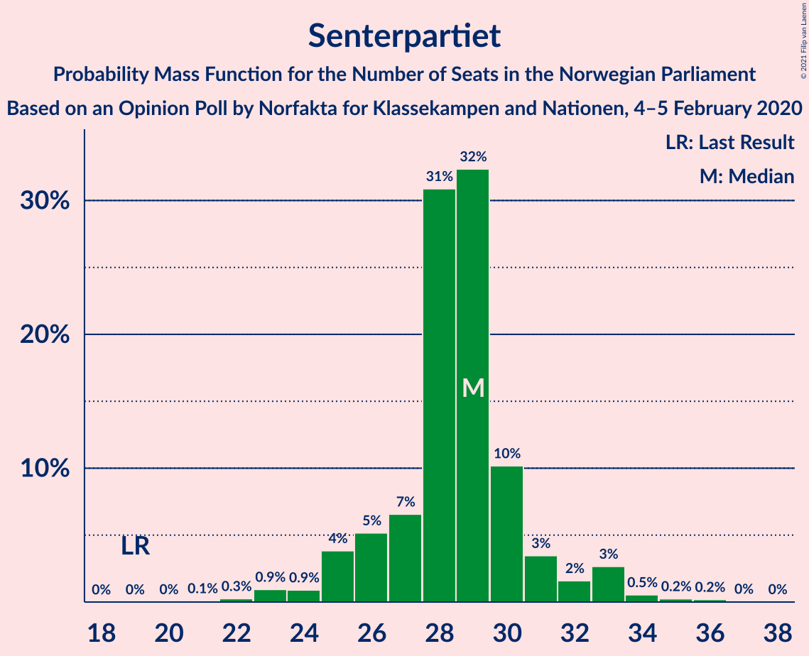
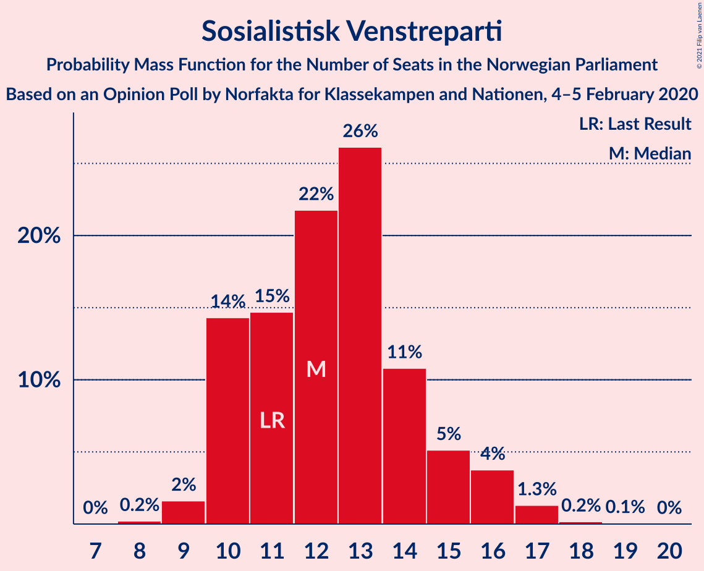
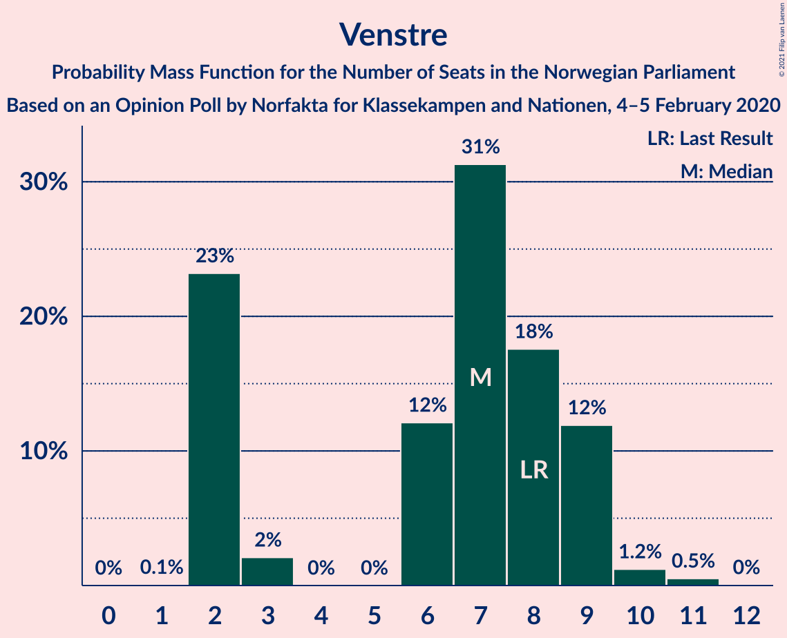
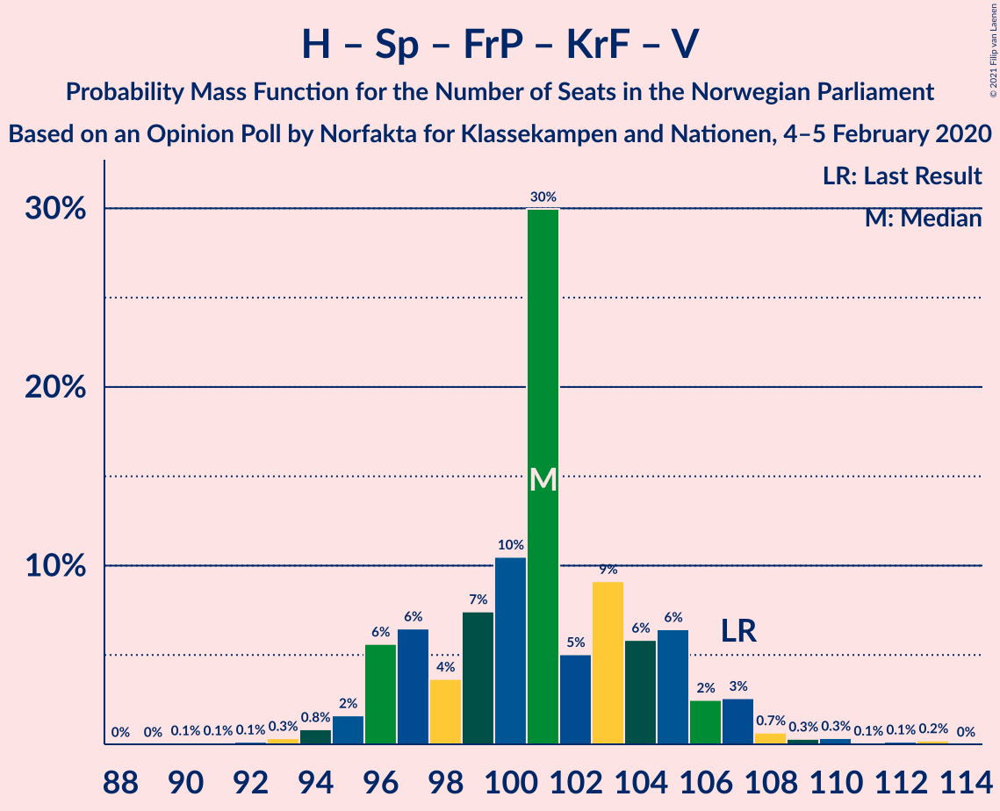
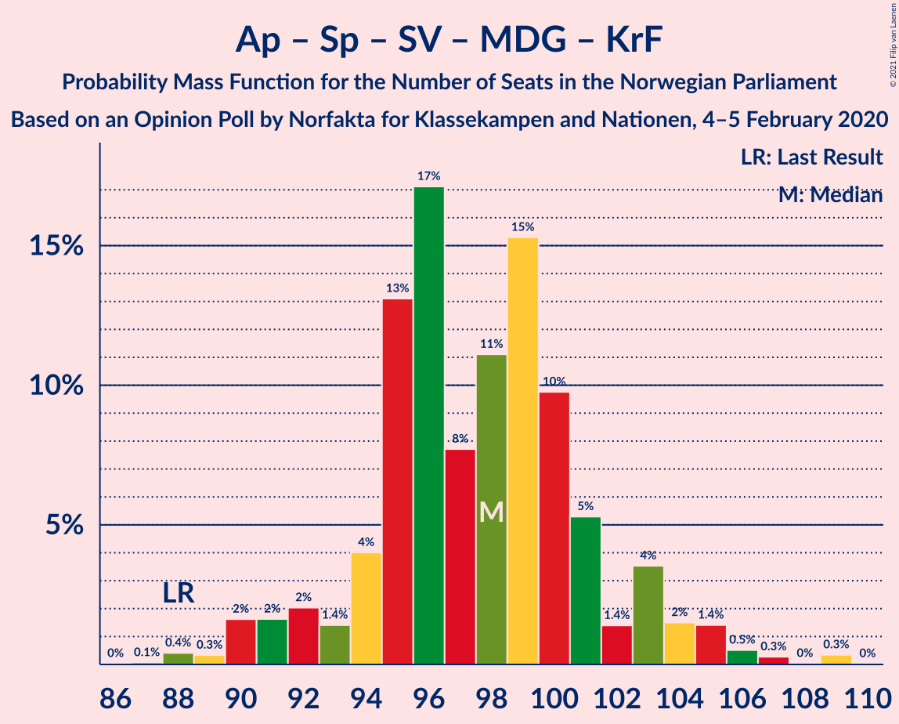
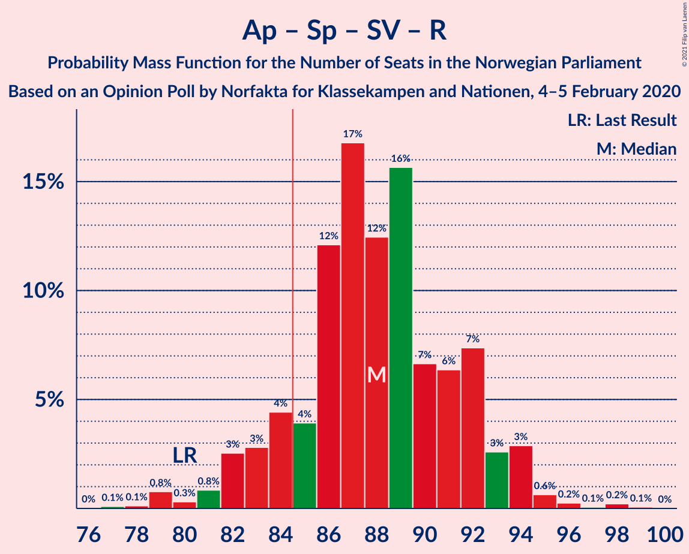
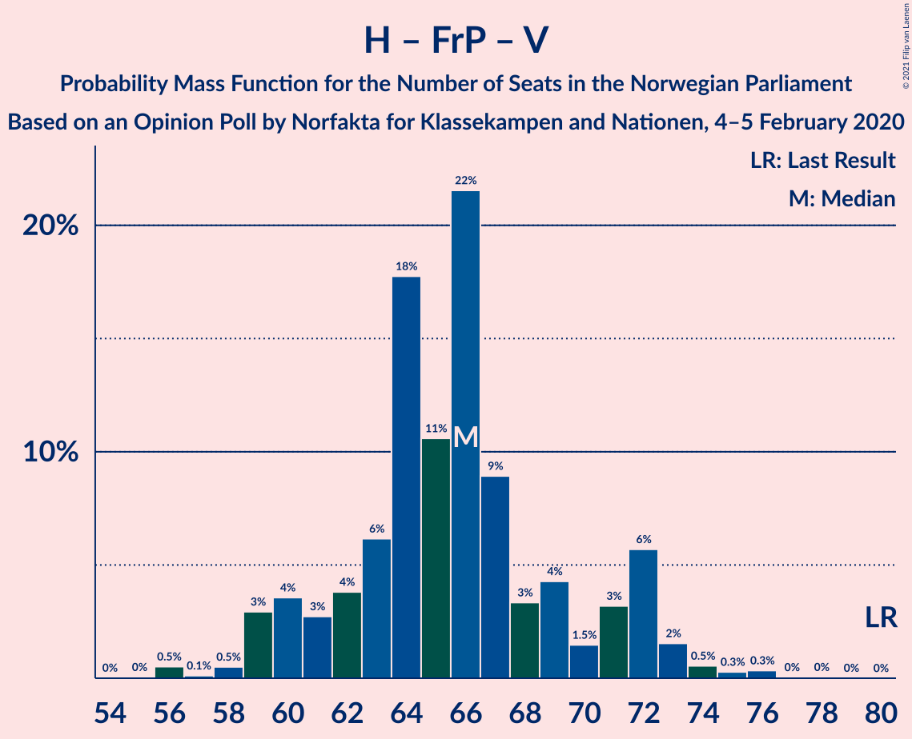

# Opinion Poll by Norfakta for Klasskampen and Nationen, 4–5 February 2020

<a href="#voting-intentions">Voting Intentions</a> | <a href="#seats">Seats</a> | <a href="#coalitions">Coalitions</a> | <a href="#technical-information">Technical Information</a>

## Voting Intentions

### Confidence Intervals

| Party | Last Result | Poll Result | 80% Confidence Interval | 90% Confidence Interval | 95% Confidence Interval | 99% Confidence Interval |
|:-----:|:-----------:|:-----------:|:-----------------------:|:-----------------------:|:-----------------------:|:-----------------------:|
| Arbeiderpartiet | 27.4% | 22.2% | 20.6–24.0% |20.1–24.4% |19.7–24.9% |19.0–25.7% |
| Høyre | 25.0% | 19.4% | 17.9–21.1% |17.4–21.6% |17.1–22.0% |16.4–22.8% |
| Senterpartiet | 10.3% | 15.9% | 14.5–17.5% |14.1–17.9% |13.8–18.3% |13.1–19.1% |
| Fremskrittspartiet | 15.2% | 14.9% | 13.5–16.4% |13.2–16.9% |12.8–17.3% |12.2–18.0% |
| Sosialistisk Venstreparti | 6.0% | 7.6% | 6.6–8.8% |6.3–9.1% |6.1–9.4% |5.7–10.0% |
| Miljøpartiet De Grønne | 3.2% | 5.2% | 4.4–6.2% |4.2–6.5% |4.0–6.8% |3.6–7.3% |
| Kristelig Folkeparti | 4.2% | 4.5% | 3.8–5.5% |3.6–5.7% |3.4–6.0% |3.0–6.5% |
| Venstre | 4.4% | 4.4% | 3.7–5.3% |3.5–5.6% |3.3–5.9% |3.0–6.4% |
| Rødt | 2.4% | 4.2% | 3.5–5.1% |3.3–5.4% |3.1–5.6% |2.8–6.1% |

*Note:* The poll result column reflects the actual value used in the calculations. Published results may vary slightly, and in addition be rounded to fewer digits.

## Seats

### Confidence Intervals

| Party | Last Result | Median | 80% Confidence Interval | 90% Confidence Interval | 95% Confidence Interval | 99% Confidence Interval |
|:-----:|:-----------:|:------:|:-----------------------:|:-----------------------:|:-----------------------:|:-----------------------:|
| <a href="#arbeiderpartiet">Arbeiderpartiet</a> | 49 | 42 | 39–43 |37–43 |36–45 |35–47 |
| <a href="#høyre">Høyre</a> | 45 | 35 | 31–38 |29–38 |29–39 |28–41 |
| <a href="#senterpartiet">Senterpartiet</a> | 19 | 29 | 26–31 |25–31 |23–33 |22–35 |
| <a href="#fremskrittspartiet">Fremskrittspartiet</a> | 27 | 26 | 24–28 |23–29 |22–30 |21–32 |
| <a href="#sosialistisk-venstreparti">Sosialistisk Venstreparti</a> | 11 | 13 | 11–15 |10–16 |10–16 |8–17 |
| <a href="#miljøpartiet-de-grønne">Miljøpartiet De Grønne</a> | 1 | 9 | 7–11 |7–11 |2–11 |2–13 |
| <a href="#kristelig-folkeparti">Kristelig Folkeparti</a> | 8 | 7 | 3–9 |1–9 |1–10 |1–11 |
| <a href="#venstre">Venstre</a> | 8 | 8 | 2–9 |2–9 |2–9 |2–11 |
| <a href="#rødt">Rødt</a> | 1 | 2 | 2–9 |2–9 |2–10 |1–11 |

### Arbeiderpartiet

*For a full overview of the results for this party, see the [Arbeiderpartiet](party-arbeiderpartiet.html) page.*

| Number of Seats | Probability | Accumulated | Special Marks |
|:---------------:|:-----------:|:-----------:|:-------------:|
| 31 | 0.1% | 100% |  |
| 32 | 0.1% | 99.9% |  |
| 33 | 0.1% | 99.9% |  |
| 34 | 0.1% | 99.8% |  |
| 35 | 0.7% | 99.6% |  |
| 36 | 4% | 98.9% |  |
| 37 | 2% | 95% |  |
| 38 | 1.0% | 93% |  |
| 39 | 5% | 92% |  |
| 40 | 15% | 86% |  |
| 41 | 13% | 72% |  |
| 42 | 43% | 59% | Median |
| 43 | 12% | 16% |  |
| 44 | 1.3% | 4% |  |
| 45 | 2% | 3% |  |
| 46 | 0.9% | 2% |  |
| 47 | 0.6% | 0.7% |  |
| 48 | 0.1% | 0.1% |  |
| 49 | 0% | 0% | Last Result |

### Høyre

*For a full overview of the results for this party, see the [Høyre](party-høyre.html) page.*

| Number of Seats | Probability | Accumulated | Special Marks |
|:---------------:|:-----------:|:-----------:|:-------------:|
| 25 | 0.2% | 100% |  |
| 26 | 0% | 99.8% |  |
| 27 | 0.2% | 99.8% |  |
| 28 | 0.6% | 99.6% |  |
| 29 | 6% | 99.0% |  |
| 30 | 3% | 93% |  |
| 31 | 14% | 90% |  |
| 32 | 7% | 76% |  |
| 33 | 6% | 69% |  |
| 34 | 3% | 63% |  |
| 35 | 36% | 59% | Median |
| 36 | 5% | 24% |  |
| 37 | 4% | 19% |  |
| 38 | 12% | 15% |  |
| 39 | 0.8% | 3% |  |
| 40 | 0.9% | 2% |  |
| 41 | 1.3% | 1.5% |  |
| 42 | 0.2% | 0.2% |  |
| 43 | 0% | 0% |  |
| 44 | 0% | 0% |  |
| 45 | 0% | 0% | Last Result |

### Senterpartiet

*For a full overview of the results for this party, see the [Senterpartiet](party-senterpartiet.html) page.*

| Number of Seats | Probability | Accumulated | Special Marks |
|:---------------:|:-----------:|:-----------:|:-------------:|
| 19 | 0% | 100% | Last Result |
| 20 | 0% | 100% |  |
| 21 | 0.2% | 100% |  |
| 22 | 0.5% | 99.8% |  |
| 23 | 3% | 99.3% |  |
| 24 | 0.6% | 96% |  |
| 25 | 1.0% | 96% |  |
| 26 | 6% | 95% |  |
| 27 | 8% | 89% |  |
| 28 | 13% | 81% |  |
| 29 | 47% | 67% | Median |
| 30 | 10% | 20% |  |
| 31 | 6% | 11% |  |
| 32 | 2% | 5% |  |
| 33 | 1.0% | 3% |  |
| 34 | 1.1% | 2% |  |
| 35 | 0.4% | 0.6% |  |
| 36 | 0.2% | 0.3% |  |
| 37 | 0% | 0% |  |

### Fremskrittspartiet

*For a full overview of the results for this party, see the [Fremskrittspartiet](party-fremskrittspartiet.html) page.*

| Number of Seats | Probability | Accumulated | Special Marks |
|:---------------:|:-----------:|:-----------:|:-------------:|
| 19 | 0.1% | 100% |  |
| 20 | 0% | 99.9% |  |
| 21 | 1.3% | 99.8% |  |
| 22 | 3% | 98.6% |  |
| 23 | 2% | 96% |  |
| 24 | 26% | 94% |  |
| 25 | 17% | 68% |  |
| 26 | 20% | 51% | Median |
| 27 | 10% | 31% | Last Result |
| 28 | 11% | 20% |  |
| 29 | 6% | 9% |  |
| 30 | 2% | 3% |  |
| 31 | 0.5% | 1.1% |  |
| 32 | 0.3% | 0.6% |  |
| 33 | 0.2% | 0.3% |  |
| 34 | 0.1% | 0.1% |  |
| 35 | 0% | 0% |  |

### Sosialistisk Venstreparti

*For a full overview of the results for this party, see the [Sosialistisk Venstreparti](party-sosialistiskvenstreparti.html) page.*

| Number of Seats | Probability | Accumulated | Special Marks |
|:---------------:|:-----------:|:-----------:|:-------------:|
| 8 | 0.8% | 100% |  |
| 9 | 1.1% | 99.2% |  |
| 10 | 8% | 98% |  |
| 11 | 11% | 90% | Last Result |
| 12 | 20% | 79% |  |
| 13 | 36% | 59% | Median |
| 14 | 7% | 23% |  |
| 15 | 9% | 16% |  |
| 16 | 6% | 7% |  |
| 17 | 0.7% | 1.0% |  |
| 18 | 0.2% | 0.2% |  |
| 19 | 0.1% | 0.1% |  |
| 20 | 0% | 0% |  |

### Miljøpartiet De Grønne

*For a full overview of the results for this party, see the [Miljøpartiet De Grønne](party-miljøpartietdegrønne.html) page.*

| Number of Seats | Probability | Accumulated | Special Marks |
|:---------------:|:-----------:|:-----------:|:-------------:|
| 1 | 0.1% | 100% | Last Result |
| 2 | 3% | 99.9% |  |
| 3 | 0.1% | 96% |  |
| 4 | 0% | 96% |  |
| 5 | 0% | 96% |  |
| 6 | 0.1% | 96% |  |
| 7 | 7% | 96% |  |
| 8 | 27% | 89% |  |
| 9 | 39% | 62% | Median |
| 10 | 13% | 23% |  |
| 11 | 9% | 10% |  |
| 12 | 0.8% | 1.5% |  |
| 13 | 0.7% | 0.7% |  |
| 14 | 0% | 0% |  |

### Kristelig Folkeparti

*For a full overview of the results for this party, see the [Kristelig Folkeparti](party-kristeligfolkeparti.html) page.*

| Number of Seats | Probability | Accumulated | Special Marks |
|:---------------:|:-----------:|:-----------:|:-------------:|
| 1 | 6% | 100% |  |
| 2 | 1.2% | 94% |  |
| 3 | 13% | 93% |  |
| 4 | 0% | 79% |  |
| 5 | 0% | 79% |  |
| 6 | 2% | 79% |  |
| 7 | 38% | 77% | Median |
| 8 | 27% | 40% | Last Result |
| 9 | 8% | 12% |  |
| 10 | 3% | 4% |  |
| 11 | 1.0% | 1.0% |  |
| 12 | 0.1% | 0.1% |  |
| 13 | 0% | 0% |  |

### Venstre

*For a full overview of the results for this party, see the [Venstre](party-venstre.html) page.*

| Number of Seats | Probability | Accumulated | Special Marks |
|:---------------:|:-----------:|:-----------:|:-------------:|
| 1 | 0.1% | 100% |  |
| 2 | 23% | 99.9% |  |
| 3 | 0% | 77% |  |
| 4 | 0% | 77% |  |
| 5 | 0% | 77% |  |
| 6 | 2% | 77% |  |
| 7 | 11% | 75% |  |
| 8 | 50% | 64% | Last Result, Median |
| 9 | 11% | 14% |  |
| 10 | 1.5% | 2% |  |
| 11 | 0.7% | 0.8% |  |
| 12 | 0% | 0% |  |

### Rødt

*For a full overview of the results for this party, see the [Rødt](party-rødt.html) page.*

| Number of Seats | Probability | Accumulated | Special Marks |
|:---------------:|:-----------:|:-----------:|:-------------:|
| 1 | 1.3% | 100% | Last Result |
| 2 | 54% | 98.7% | Median |
| 3 | 0% | 45% |  |
| 4 | 0% | 45% |  |
| 5 | 0% | 45% |  |
| 6 | 1.3% | 45% |  |
| 7 | 18% | 44% |  |
| 8 | 14% | 26% |  |
| 9 | 9% | 12% |  |
| 10 | 3% | 3% |  |
| 11 | 0.5% | 0.5% |  |
| 12 | 0% | 0% |  |

## Coalitions

### Confidence Intervals

| Coalition | Last Result | Median | Majority? | 80% Confidence Interval | 90% Confidence Interval | 95% Confidence Interval | 99% Confidence Interval |
|:---------:|:-----------:|:------:|:---------:|:-----------------------:|:-----------------------:|:-----------------------:|:-----------------------:|
| Høyre – Senterpartiet – Fremskrittspartiet – Kristelig Folkeparti – Venstre | 107 | 102 | 100% | 97–107 | 96–107 | 95–107 | 93–110 |
| Arbeiderpartiet – Senterpartiet – Sosialistisk Venstreparti – Miljøpartiet De Grønne – Kristelig Folkeparti | 88 | 98 | 100% | 92–102 | 90–104 | 90–105 | 89–109 |
| Arbeiderpartiet – Senterpartiet – Sosialistisk Venstreparti – Miljøpartiet De Grønne – Rødt | 81 | 95 | 99.9% | 91–100 | 90–102 | 90–103 | 86–106 |
| Arbeiderpartiet – Senterpartiet – Sosialistisk Venstreparti – Miljøpartiet De Grønne | 80 | 92 | 96% | 87–96 | 85–97 | 84–97 | 82–101 |
| Arbeiderpartiet – Senterpartiet – Sosialistisk Venstreparti – Rødt | 80 | 86 | 79% | 82–92 | 82–93 | 81–94 | 78–98 |
| Arbeiderpartiet – Senterpartiet – Miljøpartiet De Grønne – Kristelig Folkeparti | 77 | 85 | 59% | 80–89 | 79–91 | 79–92 | 77–95 |
| Arbeiderpartiet – Senterpartiet – Sosialistisk Venstreparti | 79 | 83 | 17% | 79–86 | 77–88 | 76–88 | 74–90 |
| Høyre – Fremskrittspartiet – Miljøpartiet De Grønne – Kristelig Folkeparti – Venstre | 89 | 83 | 21% | 77–87 | 76–87 | 75–88 | 71–91 |
| Arbeiderpartiet – Senterpartiet – Kristelig Folkeparti | 76 | 78 | 0.1% | 72–80 | 71–81 | 70–83 | 68–84 |
| Høyre – Fremskrittspartiet – Kristelig Folkeparti – Venstre | 88 | 74 | 0.1% | 69–78 | 67–79 | 66–79 | 63–83 |
| Arbeiderpartiet – Senterpartiet | 68 | 71 | 0% | 66–72 | 64–73 | 63–75 | 62–76 |
| Høyre – Fremskrittspartiet – Venstre | 80 | 67 | 0% | 61–71 | 61–72 | 60–72 | 56–75 |
| Høyre – Fremskrittspartiet | 72 | 59 | 0% | 56–64 | 55–65 | 54–67 | 53–70 |
| Arbeiderpartiet – Sosialistisk Venstreparti | 60 | 55 | 0% | 50–57 | 50–57 | 49–58 | 47–61 |
| Høyre – Kristelig Folkeparti – Venstre | 61 | 49 | 0% | 41–52 | 41–54 | 41–54 | 39–55 |
| Senterpartiet – Kristelig Folkeparti – Venstre | 35 | 43 | 0% | 38–45 | 36–46 | 34–48 | 32–50 |

### Høyre – Senterpartiet – Fremskrittspartiet – Kristelig Folkeparti – Venstre

| Number of Seats | Probability | Accumulated | Special Marks |
|:---------------:|:-----------:|:-----------:|:-------------:|
| 90 | 0% | 100% |  |
| 91 | 0% | 99.9% |  |
| 92 | 0.1% | 99.9% |  |
| 93 | 0.7% | 99.8% |  |
| 94 | 1.4% | 99.1% |  |
| 95 | 2% | 98% |  |
| 96 | 5% | 96% |  |
| 97 | 3% | 91% |  |
| 98 | 3% | 88% |  |
| 99 | 7% | 85% |  |
| 100 | 10% | 78% |  |
| 101 | 11% | 68% |  |
| 102 | 7% | 57% |  |
| 103 | 30% | 50% |  |
| 104 | 6% | 20% |  |
| 105 | 1.5% | 14% | Median |
| 106 | 2% | 13% |  |
| 107 | 8% | 10% | Last Result |
| 108 | 1.3% | 2% |  |
| 109 | 0.2% | 1.2% |  |
| 110 | 0.7% | 1.0% |  |
| 111 | 0.2% | 0.3% |  |
| 112 | 0.1% | 0.2% |  |
| 113 | 0% | 0.1% |  |
| 114 | 0% | 0.1% |  |
| 115 | 0% | 0.1% |  |
| 116 | 0% | 0% |  |

### Arbeiderpartiet – Senterpartiet – Sosialistisk Venstreparti – Miljøpartiet De Grønne – Kristelig Folkeparti

| Number of Seats | Probability | Accumulated | Special Marks |
|:---------------:|:-----------:|:-----------:|:-------------:|
| 86 | 0% | 100% |  |
| 87 | 0.1% | 99.9% |  |
| 88 | 0.1% | 99.8% | Last Result |
| 89 | 0.3% | 99.7% |  |
| 90 | 5% | 99.4% |  |
| 91 | 3% | 94% |  |
| 92 | 4% | 91% |  |
| 93 | 0.9% | 87% |  |
| 94 | 1.5% | 86% |  |
| 95 | 4% | 85% |  |
| 96 | 11% | 80% |  |
| 97 | 10% | 70% |  |
| 98 | 11% | 59% |  |
| 99 | 9% | 49% |  |
| 100 | 28% | 40% | Median |
| 101 | 2% | 12% |  |
| 102 | 1.5% | 10% |  |
| 103 | 1.2% | 9% |  |
| 104 | 5% | 7% |  |
| 105 | 0.9% | 3% |  |
| 106 | 1.2% | 2% |  |
| 107 | 0% | 0.6% |  |
| 108 | 0.1% | 0.6% |  |
| 109 | 0.5% | 0.5% |  |
| 110 | 0% | 0% |  |

### Arbeiderpartiet – Senterpartiet – Sosialistisk Venstreparti – Miljøpartiet De Grønne – Rødt

| Number of Seats | Probability | Accumulated | Special Marks |
|:---------------:|:-----------:|:-----------:|:-------------:|
| 81 | 0% | 100% | Last Result |
| 82 | 0% | 100% |  |
| 83 | 0.1% | 100% |  |
| 84 | 0.1% | 99.9% |  |
| 85 | 0.3% | 99.9% | Majority |
| 86 | 0.1% | 99.6% |  |
| 87 | 0.2% | 99.5% |  |
| 88 | 0.8% | 99.3% |  |
| 89 | 0.7% | 98.5% |  |
| 90 | 7% | 98% |  |
| 91 | 3% | 90% |  |
| 92 | 4% | 87% |  |
| 93 | 4% | 83% |  |
| 94 | 8% | 79% |  |
| 95 | 26% | 71% | Median |
| 96 | 3% | 45% |  |
| 97 | 8% | 42% |  |
| 98 | 8% | 34% |  |
| 99 | 9% | 25% |  |
| 100 | 8% | 16% |  |
| 101 | 2% | 8% |  |
| 102 | 3% | 7% |  |
| 103 | 0.8% | 3% |  |
| 104 | 2% | 2% |  |
| 105 | 0.2% | 0.7% |  |
| 106 | 0.4% | 0.5% |  |
| 107 | 0.1% | 0.1% |  |
| 108 | 0% | 0% |  |

### Arbeiderpartiet – Senterpartiet – Sosialistisk Venstreparti – Miljøpartiet De Grønne

| Number of Seats | Probability | Accumulated | Special Marks |
|:---------------:|:-----------:|:-----------:|:-------------:|
| 79 | 0% | 100% |  |
| 80 | 0.1% | 99.9% | Last Result |
| 81 | 0.2% | 99.9% |  |
| 82 | 0.3% | 99.7% |  |
| 83 | 1.2% | 99.4% |  |
| 84 | 2% | 98% |  |
| 85 | 1.2% | 96% | Majority |
| 86 | 2% | 95% |  |
| 87 | 6% | 93% |  |
| 88 | 10% | 87% |  |
| 89 | 6% | 77% |  |
| 90 | 10% | 71% |  |
| 91 | 10% | 61% |  |
| 92 | 6% | 51% |  |
| 93 | 26% | 44% | Median |
| 94 | 4% | 19% |  |
| 95 | 3% | 15% |  |
| 96 | 5% | 11% |  |
| 97 | 6% | 7% |  |
| 98 | 0.2% | 0.8% |  |
| 99 | 0.1% | 0.7% |  |
| 100 | 0.1% | 0.6% |  |
| 101 | 0.5% | 0.6% |  |
| 102 | 0% | 0% |  |

### Arbeiderpartiet – Senterpartiet – Sosialistisk Venstreparti – Rødt

| Number of Seats | Probability | Accumulated | Special Marks |
|:---------------:|:-----------:|:-----------:|:-------------:|
| 77 | 0.3% | 100% |  |
| 78 | 0.2% | 99.7% |  |
| 79 | 1.0% | 99.5% |  |
| 80 | 0.6% | 98% | Last Result |
| 81 | 1.0% | 98% |  |
| 82 | 8% | 97% |  |
| 83 | 5% | 89% |  |
| 84 | 4% | 84% |  |
| 85 | 2% | 79% | Majority |
| 86 | 30% | 78% | Median |
| 87 | 8% | 48% |  |
| 88 | 2% | 40% |  |
| 89 | 10% | 37% |  |
| 90 | 7% | 27% |  |
| 91 | 6% | 21% |  |
| 92 | 9% | 14% |  |
| 93 | 1.4% | 5% |  |
| 94 | 2% | 4% |  |
| 95 | 0.9% | 2% |  |
| 96 | 0.2% | 1.1% |  |
| 97 | 0.2% | 0.9% |  |
| 98 | 0.7% | 0.8% |  |
| 99 | 0% | 0.1% |  |
| 100 | 0% | 0% |  |

### Arbeiderpartiet – Senterpartiet – Miljøpartiet De Grønne – Kristelig Folkeparti

| Number of Seats | Probability | Accumulated | Special Marks |
|:---------------:|:-----------:|:-----------:|:-------------:|
| 72 | 0% | 100% |  |
| 73 | 0.1% | 99.9% |  |
| 74 | 0% | 99.8% |  |
| 75 | 0.1% | 99.8% |  |
| 76 | 0.1% | 99.7% |  |
| 77 | 0.4% | 99.5% | Last Result |
| 78 | 1.3% | 99.2% |  |
| 79 | 4% | 98% |  |
| 80 | 8% | 94% |  |
| 81 | 6% | 86% |  |
| 82 | 6% | 80% |  |
| 83 | 5% | 74% |  |
| 84 | 11% | 69% |  |
| 85 | 9% | 59% | Majority |
| 86 | 4% | 50% |  |
| 87 | 25% | 46% | Median |
| 88 | 9% | 20% |  |
| 89 | 2% | 12% |  |
| 90 | 1.3% | 10% |  |
| 91 | 6% | 8% |  |
| 92 | 0.6% | 3% |  |
| 93 | 0.1% | 2% |  |
| 94 | 1.4% | 2% |  |
| 95 | 0.5% | 0.6% |  |
| 96 | 0% | 0.1% |  |
| 97 | 0% | 0% |  |

### Arbeiderpartiet – Senterpartiet – Sosialistisk Venstreparti

| Number of Seats | Probability | Accumulated | Special Marks |
|:---------------:|:-----------:|:-----------:|:-------------:|
| 71 | 0% | 100% |  |
| 72 | 0% | 99.9% |  |
| 73 | 0.1% | 99.9% |  |
| 74 | 1.0% | 99.8% |  |
| 75 | 0.9% | 98.9% |  |
| 76 | 1.0% | 98% |  |
| 77 | 3% | 97% |  |
| 78 | 1.1% | 94% |  |
| 79 | 8% | 93% | Last Result |
| 80 | 10% | 85% |  |
| 81 | 8% | 76% |  |
| 82 | 10% | 67% |  |
| 83 | 12% | 58% |  |
| 84 | 28% | 46% | Median |
| 85 | 7% | 17% | Majority |
| 86 | 1.1% | 11% |  |
| 87 | 3% | 10% |  |
| 88 | 5% | 6% |  |
| 89 | 0.5% | 1.2% |  |
| 90 | 0.6% | 0.7% |  |
| 91 | 0.1% | 0.2% |  |
| 92 | 0% | 0.1% |  |
| 93 | 0% | 0% |  |

### Høyre – Fremskrittspartiet – Miljøpartiet De Grønne – Kristelig Folkeparti – Venstre

| Number of Seats | Probability | Accumulated | Special Marks |
|:---------------:|:-----------:|:-----------:|:-------------:|
| 70 | 0% | 100% |  |
| 71 | 0.7% | 99.9% |  |
| 72 | 0.2% | 99.2% |  |
| 73 | 0.2% | 99.1% |  |
| 74 | 0.9% | 98.9% |  |
| 75 | 2% | 98% |  |
| 76 | 1.4% | 96% |  |
| 77 | 9% | 95% |  |
| 78 | 6% | 86% |  |
| 79 | 7% | 79% |  |
| 80 | 10% | 73% |  |
| 81 | 2% | 63% |  |
| 82 | 8% | 60% |  |
| 83 | 30% | 52% |  |
| 84 | 2% | 22% |  |
| 85 | 4% | 21% | Median, Majority |
| 86 | 5% | 16% |  |
| 87 | 8% | 11% |  |
| 88 | 1.0% | 3% |  |
| 89 | 0.6% | 2% | Last Result |
| 90 | 1.0% | 2% |  |
| 91 | 0.2% | 0.5% |  |
| 92 | 0.3% | 0.3% |  |
| 93 | 0% | 0% |  |

### Arbeiderpartiet – Senterpartiet – Kristelig Folkeparti

| Number of Seats | Probability | Accumulated | Special Marks |
|:---------------:|:-----------:|:-----------:|:-------------:|
| 65 | 0% | 100% |  |
| 66 | 0.1% | 99.9% |  |
| 67 | 0.1% | 99.8% |  |
| 68 | 0.5% | 99.8% |  |
| 69 | 1.1% | 99.3% |  |
| 70 | 3% | 98% |  |
| 71 | 5% | 96% |  |
| 72 | 6% | 91% |  |
| 73 | 10% | 85% |  |
| 74 | 2% | 75% |  |
| 75 | 7% | 73% |  |
| 76 | 13% | 66% | Last Result |
| 77 | 3% | 54% |  |
| 78 | 29% | 51% | Median |
| 79 | 4% | 22% |  |
| 80 | 11% | 18% |  |
| 81 | 3% | 7% |  |
| 82 | 1.5% | 4% |  |
| 83 | 1.1% | 3% |  |
| 84 | 2% | 2% |  |
| 85 | 0% | 0.1% | Majority |
| 86 | 0% | 0.1% |  |
| 87 | 0% | 0.1% |  |
| 88 | 0% | 0% |  |

### Høyre – Fremskrittspartiet – Kristelig Folkeparti – Venstre

| Number of Seats | Probability | Accumulated | Special Marks |
|:---------------:|:-----------:|:-----------:|:-------------:|
| 62 | 0.1% | 100% |  |
| 63 | 0.4% | 99.9% |  |
| 64 | 0.2% | 99.5% |  |
| 65 | 2% | 99.3% |  |
| 66 | 0.8% | 98% |  |
| 67 | 3% | 97% |  |
| 68 | 2% | 93% |  |
| 69 | 8% | 92% |  |
| 70 | 9% | 84% |  |
| 71 | 8% | 75% |  |
| 72 | 8% | 66% |  |
| 73 | 3% | 58% |  |
| 74 | 26% | 55% |  |
| 75 | 8% | 29% |  |
| 76 | 4% | 21% | Median |
| 77 | 4% | 17% |  |
| 78 | 3% | 13% |  |
| 79 | 7% | 10% |  |
| 80 | 0.7% | 2% |  |
| 81 | 0.8% | 1.5% |  |
| 82 | 0.2% | 0.7% |  |
| 83 | 0.1% | 0.5% |  |
| 84 | 0.3% | 0.4% |  |
| 85 | 0.1% | 0.1% | Majority |
| 86 | 0.1% | 0.1% |  |
| 87 | 0% | 0% |  |
| 88 | 0% | 0% | Last Result |

### Arbeiderpartiet – Senterpartiet

| Number of Seats | Probability | Accumulated | Special Marks |
|:---------------:|:-----------:|:-----------:|:-------------:|
| 59 | 0% | 100% |  |
| 60 | 0.1% | 99.9% |  |
| 61 | 0.1% | 99.8% |  |
| 62 | 1.4% | 99.8% |  |
| 63 | 2% | 98% |  |
| 64 | 3% | 97% |  |
| 65 | 3% | 94% |  |
| 66 | 2% | 91% |  |
| 67 | 4% | 88% |  |
| 68 | 11% | 84% | Last Result |
| 69 | 11% | 73% |  |
| 70 | 7% | 62% |  |
| 71 | 29% | 56% | Median |
| 72 | 20% | 27% |  |
| 73 | 3% | 7% |  |
| 74 | 1.4% | 4% |  |
| 75 | 1.4% | 3% |  |
| 76 | 0.9% | 1.2% |  |
| 77 | 0.2% | 0.3% |  |
| 78 | 0% | 0.1% |  |
| 79 | 0% | 0% |  |

### Høyre – Fremskrittspartiet – Venstre

| Number of Seats | Probability | Accumulated | Special Marks |
|:---------------:|:-----------:|:-----------:|:-------------:|
| 55 | 0.2% | 100% |  |
| 56 | 1.0% | 99.8% |  |
| 57 | 0.1% | 98.8% |  |
| 58 | 0.7% | 98.7% |  |
| 59 | 0.5% | 98% |  |
| 60 | 0.8% | 98% |  |
| 61 | 8% | 97% |  |
| 62 | 5% | 89% |  |
| 63 | 7% | 84% |  |
| 64 | 8% | 77% |  |
| 65 | 5% | 69% |  |
| 66 | 3% | 64% |  |
| 67 | 28% | 60% |  |
| 68 | 3% | 33% |  |
| 69 | 8% | 30% | Median |
| 70 | 2% | 22% |  |
| 71 | 10% | 19% |  |
| 72 | 8% | 10% |  |
| 73 | 0.7% | 2% |  |
| 74 | 0.3% | 1.4% |  |
| 75 | 0.7% | 1.1% |  |
| 76 | 0.3% | 0.4% |  |
| 77 | 0% | 0.1% |  |
| 78 | 0.1% | 0.1% |  |
| 79 | 0% | 0% |  |
| 80 | 0% | 0% | Last Result |

### Høyre – Fremskrittspartiet

| Number of Seats | Probability | Accumulated | Special Marks |
|:---------------:|:-----------:|:-----------:|:-------------:|
| 51 | 0.1% | 100% |  |
| 52 | 0.3% | 99.8% |  |
| 53 | 1.0% | 99.6% |  |
| 54 | 2% | 98.6% |  |
| 55 | 5% | 96% |  |
| 56 | 7% | 91% |  |
| 57 | 5% | 85% |  |
| 58 | 3% | 80% |  |
| 59 | 34% | 77% |  |
| 60 | 7% | 43% |  |
| 61 | 7% | 35% | Median |
| 62 | 5% | 28% |  |
| 63 | 13% | 23% |  |
| 64 | 3% | 10% |  |
| 65 | 3% | 7% |  |
| 66 | 1.1% | 4% |  |
| 67 | 1.1% | 3% |  |
| 68 | 0.2% | 2% |  |
| 69 | 0.2% | 2% |  |
| 70 | 1.3% | 1.5% |  |
| 71 | 0.1% | 0.2% |  |
| 72 | 0% | 0% | Last Result |

### Arbeiderpartiet – Sosialistisk Venstreparti

| Number of Seats | Probability | Accumulated | Special Marks |
|:---------------:|:-----------:|:-----------:|:-------------:|
| 44 | 0% | 100% |  |
| 45 | 0.1% | 99.9% |  |
| 46 | 0.2% | 99.9% |  |
| 47 | 0.5% | 99.6% |  |
| 48 | 1.4% | 99.1% |  |
| 49 | 2% | 98% |  |
| 50 | 8% | 96% |  |
| 51 | 3% | 88% |  |
| 52 | 8% | 85% |  |
| 53 | 15% | 76% |  |
| 54 | 7% | 61% |  |
| 55 | 33% | 54% | Median |
| 56 | 9% | 21% |  |
| 57 | 8% | 12% |  |
| 58 | 2% | 4% |  |
| 59 | 0.9% | 2% |  |
| 60 | 0.1% | 0.8% | Last Result |
| 61 | 0.6% | 0.7% |  |
| 62 | 0.1% | 0.1% |  |
| 63 | 0% | 0% |  |

### Høyre – Kristelig Folkeparti – Venstre

| Number of Seats | Probability | Accumulated | Special Marks |
|:---------------:|:-----------:|:-----------:|:-------------:|
| 34 | 0% | 100% |  |
| 35 | 0% | 99.9% |  |
| 36 | 0.1% | 99.9% |  |
| 37 | 0.1% | 99.8% |  |
| 38 | 0.2% | 99.7% |  |
| 39 | 0.7% | 99.5% |  |
| 40 | 0.6% | 98.8% |  |
| 41 | 12% | 98% |  |
| 42 | 3% | 86% |  |
| 43 | 3% | 84% |  |
| 44 | 7% | 81% |  |
| 45 | 8% | 74% |  |
| 46 | 6% | 65% |  |
| 47 | 5% | 60% |  |
| 48 | 4% | 55% |  |
| 49 | 3% | 50% |  |
| 50 | 34% | 48% | Median |
| 51 | 3% | 14% |  |
| 52 | 2% | 10% |  |
| 53 | 2% | 8% |  |
| 54 | 6% | 6% |  |
| 55 | 0.4% | 0.6% |  |
| 56 | 0.1% | 0.1% |  |
| 57 | 0% | 0% |  |
| 58 | 0% | 0% |  |
| 59 | 0% | 0% |  |
| 60 | 0% | 0% |  |
| 61 | 0% | 0% | Last Result |

### Senterpartiet – Kristelig Folkeparti – Venstre

| Number of Seats | Probability | Accumulated | Special Marks |
|:---------------:|:-----------:|:-----------:|:-------------:|
| 30 | 0.1% | 100% |  |
| 31 | 0.4% | 99.9% |  |
| 32 | 2% | 99.5% |  |
| 33 | 0.3% | 98% |  |
| 34 | 1.0% | 98% |  |
| 35 | 1.3% | 97% | Last Result |
| 36 | 2% | 95% |  |
| 37 | 2% | 93% |  |
| 38 | 4% | 91% |  |
| 39 | 9% | 87% |  |
| 40 | 13% | 78% |  |
| 41 | 8% | 65% |  |
| 42 | 3% | 58% |  |
| 43 | 10% | 55% |  |
| 44 | 34% | 45% | Median |
| 45 | 6% | 11% |  |
| 46 | 0.9% | 6% |  |
| 47 | 2% | 5% |  |
| 48 | 2% | 3% |  |
| 49 | 1.1% | 2% |  |
| 50 | 0.4% | 0.5% |  |
| 51 | 0% | 0.2% |  |
| 52 | 0.1% | 0.1% |  |
| 53 | 0% | 0.1% |  |
| 54 | 0.1% | 0.1% |  |
| 55 | 0% | 0% |  |

## Technical Information

### Opinion Poll

+ **Polling firm:** Norfakta
+ **Commissioner(s):** Klasskampen and Nationen
+ **Fieldwork period:** 4–5 February 2020

### Calculations

+ **Sample size:** 1000
+ **Simulations done:** 131,072
+ **Error estimate:** 3.06%

