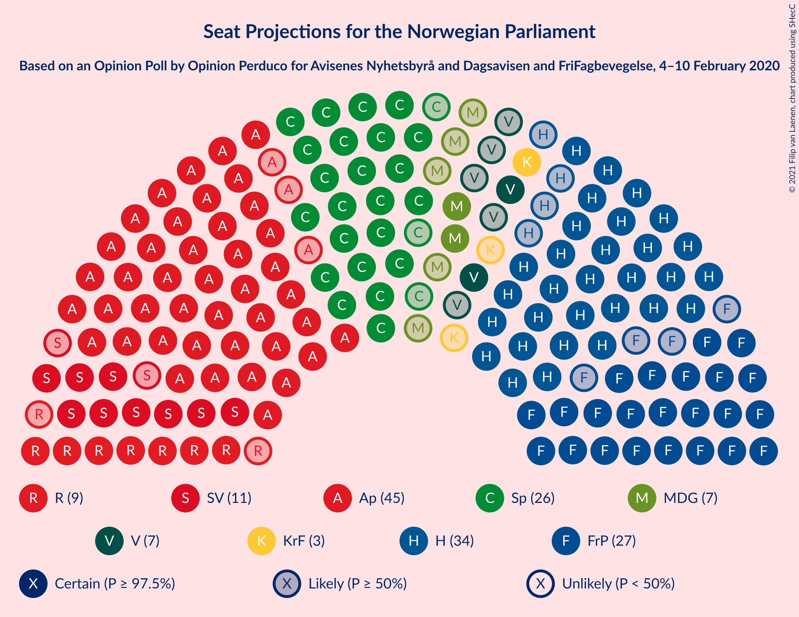
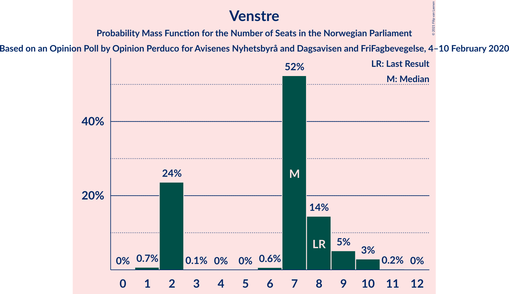
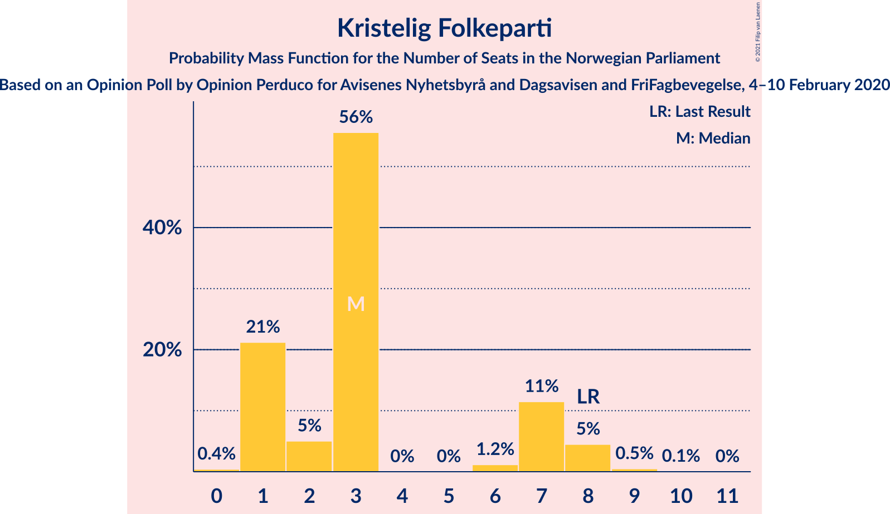
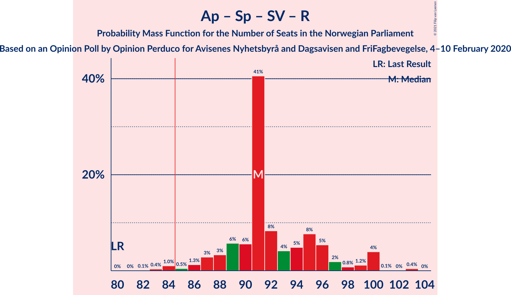
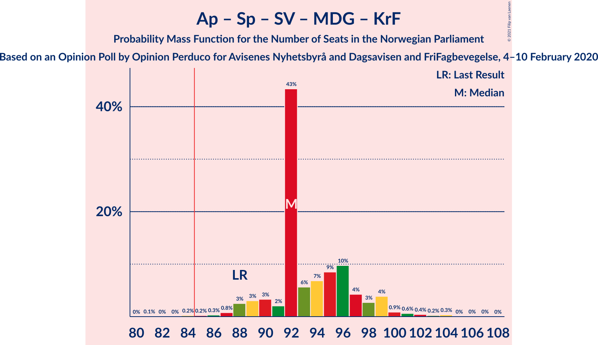
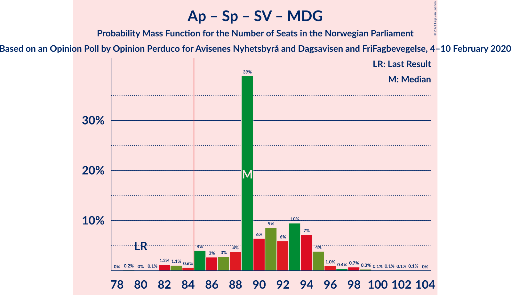
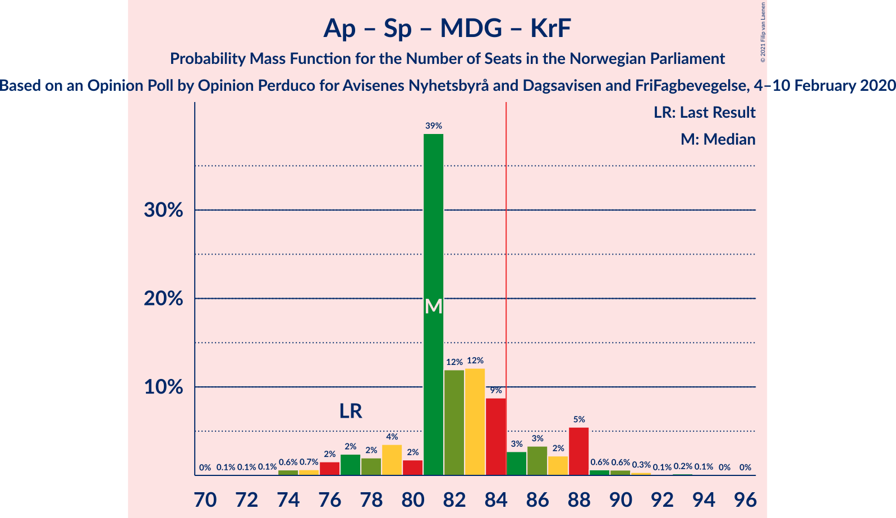
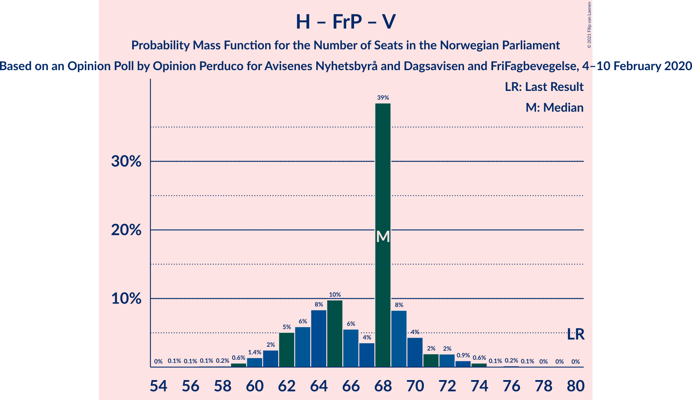

# Opinion Poll by Opinion Perduco for Avisenes Nyhetsbyrå and Dagsavisen and FriFagbevegelse, 4–10 February 2020

<a href="#voting-intentions">Voting Intentions</a> | <a href="#seats">Seats</a> | <a href="#coalitions">Coalitions</a> | <a href="#technical-information">Technical Information</a>

## Voting Intentions

### Confidence Intervals

| Party | Last Result | Poll Result | 80% Confidence Interval | 90% Confidence Interval | 95% Confidence Interval | 99% Confidence Interval |
|:-----:|:-----------:|:-----------:|:-----------------------:|:-----------------------:|:-----------------------:|:-----------------------:|
| Arbeiderpartiet | 27.4% | 25.1% | 23.4–26.9% |22.9–27.5% |22.5–27.9% |21.6–28.8% |
| Høyre | 25.0% | 19.4% | 17.8–21.1% |17.4–21.6% |17.0–22.0% |16.3–22.9% |
| Senterpartiet | 10.3% | 15.2% | 13.8–16.7% |13.4–17.2% |13.0–17.6% |12.4–18.4% |
| Fremskrittspartiet | 15.2% | 15.1% | 13.7–16.6% |13.3–17.1% |12.9–17.5% |12.3–18.2% |
| Sosialistisk Venstreparti | 6.0% | 6.5% | 5.6–7.6% |5.3–8.0% |5.1–8.2% |4.7–8.8% |
| Rødt | 2.4% | 5.3% | 4.5–6.3% |4.2–6.6% |4.0–6.9% |3.7–7.4% |
| Miljøpartiet De Grønne | 3.2% | 4.6% | 3.9–5.6% |3.7–5.9% |3.5–6.2% |3.2–6.7% |
| Venstre | 4.4% | 4.2% | 3.5–5.2% |3.3–5.5% |3.1–5.7% |2.8–6.2% |
| Kristelig Folkeparti | 4.2% | 3.5% | 2.9–4.4% |2.7–4.6% |2.5–4.9% |2.2–5.3% |

*Note:* The poll result column reflects the actual value used in the calculations. Published results may vary slightly, and in addition be rounded to fewer digits.

## Seats

### Confidence Intervals

| Party | Last Result | Median | 80% Confidence Interval | 90% Confidence Interval | 95% Confidence Interval | 99% Confidence Interval |
|:-----:|:-----------:|:------:|:-----------------------:|:-----------------------:|:-----------------------:|:-----------------------:|
| <a href="#arbeiderpartiet">Arbeiderpartiet</a> | 49 | 43 | 41–43 |41–45 |41–45 |41–47 |
| <a href="#høyre">Høyre</a> | 45 | 31 | 31–35 |31–35 |31–36 |31–41 |
| <a href="#senterpartiet">Senterpartiet</a> | 19 | 25 | 25–33 |22–33 |21–33 |21–34 |
| <a href="#fremskrittspartiet">Fremskrittspartiet</a> | 27 | 31 | 24–31 |23–31 |23–31 |22–31 |
| <a href="#sosialistisk-venstreparti">Sosialistisk Venstreparti</a> | 11 | 12 | 11–12 |10–14 |9–14 |8–15 |
| <a href="#rødt">Rødt</a> | 1 | 10 | 9–10 |8–10 |8–11 |2–11 |
| <a href="#miljøpartiet-de-grønne">Miljøpartiet De Grønne</a> | 1 | 2 | 2–9 |2–9 |2–9 |2–10 |
| <a href="#venstre">Venstre</a> | 8 | 7 | 7–9 |2–9 |2–9 |2–10 |
| <a href="#kristelig-folkeparti">Kristelig Folkeparti</a> | 8 | 8 | 3–8 |1–8 |1–9 |1–9 |

### Arbeiderpartiet

*For a full overview of the results for this party, see the [Arbeiderpartiet](party-arbeiderpartiet.html) page.*

| Number of Seats | Probability | Accumulated | Special Marks |
|:---------------:|:-----------:|:-----------:|:-------------:|
| 39 | 0.1% | 100% |  |
| 40 | 0% | 99.8% |  |
| 41 | 10% | 99.8% |  |
| 42 | 1.0% | 90% |  |
| 43 | 81% | 89% | Median |
| 44 | 0.4% | 8% |  |
| 45 | 5% | 7% |  |
| 46 | 2% | 2% |  |
| 47 | 0.1% | 0.5% |  |
| 48 | 0% | 0.4% |  |
| 49 | 0.1% | 0.4% | Last Result |
| 50 | 0% | 0.3% |  |
| 51 | 0.1% | 0.3% |  |
| 52 | 0.2% | 0.2% |  |
| 53 | 0% | 0% |  |

### Høyre

*For a full overview of the results for this party, see the [Høyre](party-høyre.html) page.*

| Number of Seats | Probability | Accumulated | Special Marks |
|:---------------:|:-----------:|:-----------:|:-------------:|
| 28 | 0% | 100% |  |
| 29 | 0% | 99.9% |  |
| 30 | 0.1% | 99.9% |  |
| 31 | 60% | 99.8% | Median |
| 32 | 1.2% | 40% |  |
| 33 | 2% | 39% |  |
| 34 | 5% | 36% |  |
| 35 | 28% | 32% |  |
| 36 | 2% | 3% |  |
| 37 | 0.1% | 1.4% |  |
| 38 | 0.2% | 1.4% |  |
| 39 | 0% | 1.2% |  |
| 40 | 0.1% | 1.2% |  |
| 41 | 1.1% | 1.1% |  |
| 42 | 0% | 0% |  |
| 43 | 0% | 0% |  |
| 44 | 0% | 0% |  |
| 45 | 0% | 0% | Last Result |

### Senterpartiet

*For a full overview of the results for this party, see the [Senterpartiet](party-senterpartiet.html) page.*

| Number of Seats | Probability | Accumulated | Special Marks |
|:---------------:|:-----------:|:-----------:|:-------------:|
| 18 | 0.1% | 100% |  |
| 19 | 0% | 99.9% | Last Result |
| 20 | 0% | 99.9% |  |
| 21 | 5% | 99.9% |  |
| 22 | 0.4% | 95% |  |
| 23 | 0.1% | 95% |  |
| 24 | 0% | 94% |  |
| 25 | 64% | 94% | Median |
| 26 | 0% | 31% |  |
| 27 | 0% | 31% |  |
| 28 | 0% | 31% |  |
| 29 | 7% | 31% |  |
| 30 | 2% | 24% |  |
| 31 | 0.1% | 22% |  |
| 32 | 0% | 21% |  |
| 33 | 21% | 21% |  |
| 34 | 0.3% | 0.6% |  |
| 35 | 0.1% | 0.3% |  |
| 36 | 0.1% | 0.2% |  |
| 37 | 0.1% | 0.1% |  |
| 38 | 0% | 0% |  |

### Fremskrittspartiet

*For a full overview of the results for this party, see the [Fremskrittspartiet](party-fremskrittspartiet.html) page.*

| Number of Seats | Probability | Accumulated | Special Marks |
|:---------------:|:-----------:|:-----------:|:-------------:|
| 22 | 1.1% | 100% |  |
| 23 | 5% | 98.8% |  |
| 24 | 22% | 94% |  |
| 25 | 1.3% | 72% |  |
| 26 | 0.4% | 71% |  |
| 27 | 0.1% | 70% | Last Result |
| 28 | 0.8% | 70% |  |
| 29 | 2% | 69% |  |
| 30 | 7% | 67% |  |
| 31 | 59% | 60% | Median |
| 32 | 0.3% | 0.4% |  |
| 33 | 0.1% | 0.1% |  |
| 34 | 0% | 0% |  |

### Sosialistisk Venstreparti

*For a full overview of the results for this party, see the [Sosialistisk Venstreparti](party-sosialistiskvenstreparti.html) page.*

| Number of Seats | Probability | Accumulated | Special Marks |
|:---------------:|:-----------:|:-----------:|:-------------:|
| 8 | 2% | 100% |  |
| 9 | 2% | 98% |  |
| 10 | 3% | 96% |  |
| 11 | 25% | 93% | Last Result |
| 12 | 59% | 67% | Median |
| 13 | 1.0% | 8% |  |
| 14 | 5% | 7% |  |
| 15 | 1.3% | 2% |  |
| 16 | 0.4% | 0.4% |  |
| 17 | 0% | 0% |  |

### Rødt

*For a full overview of the results for this party, see the [Rødt](party-rødt.html) page.*

| Number of Seats | Probability | Accumulated | Special Marks |
|:---------------:|:-----------:|:-----------:|:-------------:|
| 1 | 0% | 100% | Last Result |
| 2 | 1.0% | 100% |  |
| 3 | 0% | 99.0% |  |
| 4 | 0% | 99.0% |  |
| 5 | 0% | 99.0% |  |
| 6 | 0% | 99.0% |  |
| 7 | 0.3% | 99.0% |  |
| 8 | 7% | 98.7% |  |
| 9 | 27% | 92% |  |
| 10 | 61% | 65% | Median |
| 11 | 4% | 4% |  |
| 12 | 0.3% | 0.3% |  |
| 13 | 0% | 0% |  |

### Miljøpartiet De Grønne

*For a full overview of the results for this party, see the [Miljøpartiet De Grønne](party-miljøpartietdegrønne.html) page.*

| Number of Seats | Probability | Accumulated | Special Marks |
|:---------------:|:-----------:|:-----------:|:-------------:|
| 1 | 0.1% | 100% | Last Result |
| 2 | 82% | 99.9% | Median |
| 3 | 0.1% | 18% |  |
| 4 | 0% | 18% |  |
| 5 | 0% | 18% |  |
| 6 | 0% | 18% |  |
| 7 | 0.1% | 18% |  |
| 8 | 5% | 18% |  |
| 9 | 11% | 14% |  |
| 10 | 2% | 2% |  |
| 11 | 0.2% | 0.2% |  |
| 12 | 0% | 0% |  |

### Venstre

*For a full overview of the results for this party, see the [Venstre](party-venstre.html) page.*

| Number of Seats | Probability | Accumulated | Special Marks |
|:---------------:|:-----------:|:-----------:|:-------------:|
| 2 | 9% | 100% |  |
| 3 | 0.1% | 91% |  |
| 4 | 0% | 91% |  |
| 5 | 0% | 91% |  |
| 6 | 0% | 91% |  |
| 7 | 60% | 91% | Median |
| 8 | 8% | 31% | Last Result |
| 9 | 22% | 23% |  |
| 10 | 0.8% | 0.8% |  |
| 11 | 0% | 0% |  |

### Kristelig Folkeparti

*For a full overview of the results for this party, see the [Kristelig Folkeparti](party-kristeligfolkeparti.html) page.*

| Number of Seats | Probability | Accumulated | Special Marks |
|:---------------:|:-----------:|:-----------:|:-------------:|
| 1 | 9% | 100% |  |
| 2 | 0% | 91% |  |
| 3 | 24% | 91% |  |
| 4 | 0% | 67% |  |
| 5 | 0% | 67% |  |
| 6 | 0% | 67% |  |
| 7 | 3% | 67% |  |
| 8 | 60% | 65% | Last Result, Median |
| 9 | 4% | 5% |  |
| 10 | 0% | 0.1% |  |
| 11 | 0% | 0% |  |

## Coalitions

### Confidence Intervals

| Coalition | Last Result | Median | Majority? | 80% Confidence Interval | 90% Confidence Interval | 95% Confidence Interval | 99% Confidence Interval |
|:---------:|:-----------:|:------:|:---------:|:-----------------------:|:-----------------------:|:-----------------------:|:-----------------------:|
| Høyre – Senterpartiet – Fremskrittspartiet – Venstre – Kristelig Folkeparti | 107 | 102 | 100% | 96–104 | 96–104 | 95–104 | 93–107 |
| Arbeiderpartiet – Senterpartiet – Sosialistisk Venstreparti – Rødt – Miljøpartiet De Grønne | 81 | 92 | 100% | 92–98 | 92–102 | 92–102 | 91–103 |
| Arbeiderpartiet – Senterpartiet – Sosialistisk Venstreparti – Rødt | 80 | 90 | 97% | 88–96 | 85–96 | 83–96 | 83–99 |
| Arbeiderpartiet – Senterpartiet – Sosialistisk Venstreparti – Miljøpartiet De Grønne – Kristelig Folkeparti | 88 | 90 | 100% | 90–94 | 90–95 | 90–95 | 88–97 |
| Arbeiderpartiet – Senterpartiet – Sosialistisk Venstreparti – Miljøpartiet De Grønne | 80 | 82 | 38% | 82–89 | 82–93 | 82–93 | 82–94 |
| Arbeiderpartiet – Senterpartiet – Sosialistisk Venstreparti | 79 | 80 | 24% | 80–87 | 77–87 | 76–87 | 75–89 |
| Høyre – Fremskrittspartiet – Miljøpartiet De Grønne – Venstre – Kristelig Folkeparti | 89 | 79 | 3% | 73–81 | 73–84 | 73–86 | 70–86 |
| Arbeiderpartiet – Senterpartiet – Miljøpartiet De Grønne – Kristelig Folkeparti | 77 | 78 | 2% | 78–81 | 78–84 | 78–84 | 75–88 |
| Arbeiderpartiet – Senterpartiet – Kristelig Folkeparti | 76 | 76 | 0% | 73–79 | 71–79 | 71–79 | 67–80 |
| Høyre – Fremskrittspartiet – Venstre – Kristelig Folkeparti | 88 | 77 | 0% | 71–77 | 67–77 | 67–77 | 66–78 |
| Arbeiderpartiet – Senterpartiet | 68 | 68 | 0% | 68–76 | 66–76 | 66–76 | 64–76 |
| Høyre – Fremskrittspartiet – Venstre | 80 | 69 | 0% | 66–69 | 66–69 | 65–70 | 64–73 |
| Høyre – Fremskrittspartiet | 72 | 62 | 0% | 59–63 | 58–64 | 58–65 | 57–65 |
| Arbeiderpartiet – Sosialistisk Venstreparti | 60 | 55 | 0% | 54–55 | 52–55 | 52–57 | 51–60 |
| Høyre – Venstre – Kristelig Folkeparti | 61 | 46 | 0% | 44–47 | 44–47 | 43–47 | 41–50 |
| Senterpartiet – Venstre – Kristelig Folkeparti | 35 | 40 | 0% | 36–45 | 32–45 | 30–45 | 30–47 |

### Høyre – Senterpartiet – Fremskrittspartiet – Venstre – Kristelig Folkeparti

| Number of Seats | Probability | Accumulated | Special Marks |
|:---------------:|:-----------:|:-----------:|:-------------:|
| 89 | 0% | 100% |  |
| 90 | 0% | 99.9% |  |
| 91 | 0% | 99.9% |  |
| 92 | 0.2% | 99.9% |  |
| 93 | 0.4% | 99.7% |  |
| 94 | 0% | 99.3% |  |
| 95 | 3% | 99.3% |  |
| 96 | 7% | 97% |  |
| 97 | 3% | 90% |  |
| 98 | 0.1% | 86% |  |
| 99 | 0.2% | 86% |  |
| 100 | 5% | 86% |  |
| 101 | 0.5% | 81% |  |
| 102 | 59% | 81% | Median |
| 103 | 0% | 22% |  |
| 104 | 21% | 22% |  |
| 105 | 0% | 0.8% |  |
| 106 | 0.1% | 0.8% |  |
| 107 | 0.7% | 0.7% | Last Result |
| 108 | 0% | 0% |  |

### Arbeiderpartiet – Senterpartiet – Sosialistisk Venstreparti – Rødt – Miljøpartiet De Grønne

| Number of Seats | Probability | Accumulated | Special Marks |
|:---------------:|:-----------:|:-----------:|:-------------:|
| 81 | 0% | 100% | Last Result |
| 82 | 0% | 100% |  |
| 83 | 0% | 100% |  |
| 84 | 0% | 100% |  |
| 85 | 0% | 100% | Majority |
| 86 | 0% | 100% |  |
| 87 | 0% | 100% |  |
| 88 | 0% | 99.9% |  |
| 89 | 0% | 99.9% |  |
| 90 | 0% | 99.9% |  |
| 91 | 1.1% | 99.9% |  |
| 92 | 59% | 98.8% | Median |
| 93 | 2% | 40% |  |
| 94 | 4% | 38% |  |
| 95 | 3% | 33% |  |
| 96 | 0% | 31% |  |
| 97 | 0.6% | 31% |  |
| 98 | 21% | 30% |  |
| 99 | 0% | 9% |  |
| 100 | 0.2% | 9% |  |
| 101 | 1.3% | 9% |  |
| 102 | 6% | 8% |  |
| 103 | 2% | 2% |  |
| 104 | 0.1% | 0.4% |  |
| 105 | 0% | 0.3% |  |
| 106 | 0% | 0.3% |  |
| 107 | 0.2% | 0.2% |  |
| 108 | 0% | 0% |  |

### Arbeiderpartiet – Senterpartiet – Sosialistisk Venstreparti – Rødt

| Number of Seats | Probability | Accumulated | Special Marks |
|:---------------:|:-----------:|:-----------:|:-------------:|
| 80 | 0.1% | 100% | Last Result |
| 81 | 0.1% | 99.9% |  |
| 82 | 0% | 99.9% |  |
| 83 | 3% | 99.8% |  |
| 84 | 0% | 97% |  |
| 85 | 4% | 97% | Majority |
| 86 | 0% | 93% |  |
| 87 | 3% | 93% |  |
| 88 | 0.5% | 90% |  |
| 89 | 0.4% | 90% |  |
| 90 | 59% | 89% | Median |
| 91 | 0.1% | 30% |  |
| 92 | 0% | 30% |  |
| 93 | 6% | 30% |  |
| 94 | 0.9% | 24% |  |
| 95 | 1.1% | 23% |  |
| 96 | 21% | 22% |  |
| 97 | 0% | 2% |  |
| 98 | 0.1% | 2% |  |
| 99 | 1.3% | 2% |  |
| 100 | 0% | 0.2% |  |
| 101 | 0% | 0.2% |  |
| 102 | 0% | 0.2% |  |
| 103 | 0.1% | 0.2% |  |
| 104 | 0.1% | 0.1% |  |
| 105 | 0% | 0% |  |

### Arbeiderpartiet – Senterpartiet – Sosialistisk Venstreparti – Miljøpartiet De Grønne – Kristelig Folkeparti

| Number of Seats | Probability | Accumulated | Special Marks |
|:---------------:|:-----------:|:-----------:|:-------------:|
| 85 | 0.1% | 100% | Majority |
| 86 | 0% | 99.9% |  |
| 87 | 0% | 99.9% |  |
| 88 | 2% | 99.9% | Last Result |
| 89 | 0.3% | 98% |  |
| 90 | 59% | 98% | Median |
| 91 | 3% | 38% |  |
| 92 | 22% | 35% |  |
| 93 | 1.2% | 13% |  |
| 94 | 5% | 12% |  |
| 95 | 6% | 7% |  |
| 96 | 0.2% | 1.3% |  |
| 97 | 0.8% | 1.1% |  |
| 98 | 0% | 0.3% |  |
| 99 | 0.1% | 0.3% |  |
| 100 | 0.1% | 0.2% |  |
| 101 | 0% | 0.2% |  |
| 102 | 0.1% | 0.1% |  |
| 103 | 0% | 0% |  |

### Arbeiderpartiet – Senterpartiet – Sosialistisk Venstreparti – Miljøpartiet De Grønne

| Number of Seats | Probability | Accumulated | Special Marks |
|:---------------:|:-----------:|:-----------:|:-------------:|
| 79 | 0% | 100% |  |
| 80 | 0% | 99.9% | Last Result |
| 81 | 0.3% | 99.9% |  |
| 82 | 59% | 99.7% | Median |
| 83 | 0% | 41% |  |
| 84 | 3% | 41% |  |
| 85 | 2% | 38% | Majority |
| 86 | 4% | 36% |  |
| 87 | 0.4% | 31% |  |
| 88 | 0% | 31% |  |
| 89 | 22% | 31% |  |
| 90 | 0% | 9% |  |
| 91 | 1.3% | 9% |  |
| 92 | 1.3% | 8% |  |
| 93 | 5% | 7% |  |
| 94 | 1.1% | 2% |  |
| 95 | 0.1% | 0.4% |  |
| 96 | 0% | 0.2% |  |
| 97 | 0% | 0.2% |  |
| 98 | 0.1% | 0.2% |  |
| 99 | 0% | 0.1% |  |
| 100 | 0% | 0.1% |  |
| 101 | 0.1% | 0.1% |  |
| 102 | 0% | 0% |  |

### Arbeiderpartiet – Senterpartiet – Sosialistisk Venstreparti

| Number of Seats | Probability | Accumulated | Special Marks |
|:---------------:|:-----------:|:-----------:|:-------------:|
| 73 | 0% | 100% |  |
| 74 | 0% | 99.9% |  |
| 75 | 2% | 99.9% |  |
| 76 | 3% | 98% |  |
| 77 | 4% | 95% |  |
| 78 | 0.5% | 91% |  |
| 79 | 0.3% | 91% | Last Result |
| 80 | 59% | 90% | Median |
| 81 | 0.9% | 31% |  |
| 82 | 0.1% | 30% |  |
| 83 | 0.3% | 30% |  |
| 84 | 6% | 30% |  |
| 85 | 1.2% | 24% | Majority |
| 86 | 0% | 22% |  |
| 87 | 21% | 22% |  |
| 88 | 0% | 2% |  |
| 89 | 1.3% | 2% |  |
| 90 | 0% | 0.4% |  |
| 91 | 0.1% | 0.3% |  |
| 92 | 0.2% | 0.2% |  |
| 93 | 0% | 0% |  |

### Høyre – Fremskrittspartiet – Miljøpartiet De Grønne – Venstre – Kristelig Folkeparti

| Number of Seats | Probability | Accumulated | Special Marks |
|:---------------:|:-----------:|:-----------:|:-------------:|
| 65 | 0.1% | 100% |  |
| 66 | 0.1% | 99.9% |  |
| 67 | 0% | 99.8% |  |
| 68 | 0% | 99.8% |  |
| 69 | 0% | 99.8% |  |
| 70 | 1.3% | 99.8% |  |
| 71 | 0.1% | 98% |  |
| 72 | 0% | 98% |  |
| 73 | 21% | 98% |  |
| 74 | 1.1% | 78% |  |
| 75 | 0.9% | 77% |  |
| 76 | 6% | 76% |  |
| 77 | 0% | 70% |  |
| 78 | 0.1% | 70% |  |
| 79 | 59% | 70% | Median |
| 80 | 0.4% | 11% |  |
| 81 | 0.5% | 10% |  |
| 82 | 3% | 10% |  |
| 83 | 0% | 7% |  |
| 84 | 4% | 7% |  |
| 85 | 0% | 3% | Majority |
| 86 | 3% | 3% |  |
| 87 | 0% | 0.2% |  |
| 88 | 0.1% | 0.1% |  |
| 89 | 0.1% | 0.1% | Last Result |
| 90 | 0% | 0% |  |

### Arbeiderpartiet – Senterpartiet – Miljøpartiet De Grønne – Kristelig Folkeparti

| Number of Seats | Probability | Accumulated | Special Marks |
|:---------------:|:-----------:|:-----------:|:-------------:|
| 74 | 0.4% | 100% |  |
| 75 | 0.3% | 99.5% |  |
| 76 | 0% | 99.3% |  |
| 77 | 1.3% | 99.2% | Last Result |
| 78 | 59% | 98% | Median |
| 79 | 0.2% | 39% |  |
| 80 | 7% | 39% |  |
| 81 | 23% | 32% |  |
| 82 | 0.8% | 8% |  |
| 83 | 0.3% | 7% |  |
| 84 | 5% | 7% |  |
| 85 | 0.4% | 2% | Majority |
| 86 | 0% | 1.2% |  |
| 87 | 0% | 1.2% |  |
| 88 | 1.0% | 1.2% |  |
| 89 | 0% | 0.2% |  |
| 90 | 0.1% | 0.2% |  |
| 91 | 0% | 0.1% |  |
| 92 | 0% | 0% |  |

### Arbeiderpartiet – Senterpartiet – Kristelig Folkeparti

| Number of Seats | Probability | Accumulated | Special Marks |
|:---------------:|:-----------:|:-----------:|:-------------:|
| 65 | 0.4% | 100% |  |
| 66 | 0% | 99.6% |  |
| 67 | 0.1% | 99.5% |  |
| 68 | 0% | 99.5% |  |
| 69 | 0% | 99.5% |  |
| 70 | 2% | 99.4% |  |
| 71 | 5% | 98% |  |
| 72 | 0.1% | 92% |  |
| 73 | 4% | 92% |  |
| 74 | 0.1% | 89% |  |
| 75 | 6% | 89% |  |
| 76 | 61% | 83% | Last Result, Median |
| 77 | 0.2% | 22% |  |
| 78 | 0% | 22% |  |
| 79 | 21% | 22% |  |
| 80 | 1.0% | 1.2% |  |
| 81 | 0.1% | 0.3% |  |
| 82 | 0.1% | 0.2% |  |
| 83 | 0% | 0% |  |

### Høyre – Fremskrittspartiet – Venstre – Kristelig Folkeparti

| Number of Seats | Probability | Accumulated | Special Marks |
|:---------------:|:-----------:|:-----------:|:-------------:|
| 62 | 0.2% | 100% |  |
| 63 | 0% | 99.8% |  |
| 64 | 0% | 99.7% |  |
| 65 | 0.1% | 99.7% |  |
| 66 | 2% | 99.6% |  |
| 67 | 6% | 98% |  |
| 68 | 1.3% | 92% |  |
| 69 | 0.2% | 91% |  |
| 70 | 0% | 91% |  |
| 71 | 21% | 91% |  |
| 72 | 0.6% | 70% |  |
| 73 | 0% | 69% |  |
| 74 | 3% | 69% |  |
| 75 | 4% | 67% |  |
| 76 | 2% | 62% |  |
| 77 | 59% | 60% | Median |
| 78 | 1.1% | 1.2% |  |
| 79 | 0% | 0.1% |  |
| 80 | 0% | 0.1% |  |
| 81 | 0% | 0.1% |  |
| 82 | 0% | 0.1% |  |
| 83 | 0% | 0% |  |
| 84 | 0% | 0% |  |
| 85 | 0% | 0% | Majority |
| 86 | 0% | 0% |  |
| 87 | 0% | 0% |  |
| 88 | 0% | 0% | Last Result |

### Arbeiderpartiet – Senterpartiet

| Number of Seats | Probability | Accumulated | Special Marks |
|:---------------:|:-----------:|:-----------:|:-------------:|
| 62 | 0.4% | 100% |  |
| 63 | 0% | 99.6% |  |
| 64 | 0.1% | 99.5% |  |
| 65 | 0.3% | 99.5% |  |
| 66 | 7% | 99.2% |  |
| 67 | 2% | 92% |  |
| 68 | 59% | 90% | Last Result, Median |
| 69 | 0.1% | 31% |  |
| 70 | 5% | 31% |  |
| 71 | 0% | 26% |  |
| 72 | 2% | 26% |  |
| 73 | 0% | 24% |  |
| 74 | 2% | 24% |  |
| 75 | 1.4% | 23% |  |
| 76 | 21% | 21% |  |
| 77 | 0% | 0.4% |  |
| 78 | 0% | 0.4% |  |
| 79 | 0.1% | 0.4% |  |
| 80 | 0.1% | 0.2% |  |
| 81 | 0.1% | 0.1% |  |
| 82 | 0% | 0% |  |

### Høyre – Fremskrittspartiet – Venstre

| Number of Seats | Probability | Accumulated | Special Marks |
|:---------------:|:-----------:|:-----------:|:-------------:|
| 59 | 0% | 100% |  |
| 60 | 0% | 99.9% |  |
| 61 | 0.2% | 99.9% |  |
| 62 | 0.1% | 99.7% |  |
| 63 | 0% | 99.7% |  |
| 64 | 0.3% | 99.7% |  |
| 65 | 2% | 99.3% |  |
| 66 | 10% | 97% |  |
| 67 | 4% | 87% |  |
| 68 | 21% | 84% |  |
| 69 | 60% | 63% | Median |
| 70 | 0.9% | 3% |  |
| 71 | 0% | 2% |  |
| 72 | 0.1% | 2% |  |
| 73 | 2% | 2% |  |
| 74 | 0.2% | 0.4% |  |
| 75 | 0.2% | 0.2% |  |
| 76 | 0% | 0% |  |
| 77 | 0% | 0% |  |
| 78 | 0% | 0% |  |
| 79 | 0% | 0% |  |
| 80 | 0% | 0% | Last Result |

### Høyre – Fremskrittspartiet

| Number of Seats | Probability | Accumulated | Special Marks |
|:---------------:|:-----------:|:-----------:|:-------------:|
| 51 | 0% | 100% |  |
| 52 | 0% | 99.9% |  |
| 53 | 0% | 99.9% |  |
| 54 | 0% | 99.9% |  |
| 55 | 0% | 99.9% |  |
| 56 | 0% | 99.9% |  |
| 57 | 0.8% | 99.9% |  |
| 58 | 7% | 99.0% |  |
| 59 | 21% | 92% |  |
| 60 | 0.8% | 71% |  |
| 61 | 0.1% | 71% |  |
| 62 | 60% | 70% | Median |
| 63 | 1.4% | 11% |  |
| 64 | 4% | 9% |  |
| 65 | 5% | 5% |  |
| 66 | 0.2% | 0.3% |  |
| 67 | 0% | 0.1% |  |
| 68 | 0% | 0.1% |  |
| 69 | 0% | 0.1% |  |
| 70 | 0% | 0.1% |  |
| 71 | 0% | 0.1% |  |
| 72 | 0% | 0.1% | Last Result |
| 73 | 0.1% | 0.1% |  |
| 74 | 0% | 0% |  |

### Arbeiderpartiet – Sosialistisk Venstreparti

| Number of Seats | Probability | Accumulated | Special Marks |
|:---------------:|:-----------:|:-----------:|:-------------:|
| 47 | 0.1% | 100% |  |
| 48 | 0% | 99.9% |  |
| 49 | 0% | 99.9% |  |
| 50 | 0.1% | 99.9% |  |
| 51 | 0.5% | 99.8% |  |
| 52 | 5% | 99.4% |  |
| 53 | 0.1% | 94% |  |
| 54 | 24% | 94% |  |
| 55 | 68% | 70% | Median |
| 56 | 0.3% | 3% |  |
| 57 | 0.8% | 3% |  |
| 58 | 0.2% | 2% |  |
| 59 | 0% | 2% |  |
| 60 | 1.3% | 2% | Last Result |
| 61 | 0.3% | 0.3% |  |
| 62 | 0% | 0% |  |

### Høyre – Venstre – Kristelig Folkeparti

| Number of Seats | Probability | Accumulated | Special Marks |
|:---------------:|:-----------:|:-----------:|:-------------:|
| 34 | 0.1% | 100% |  |
| 35 | 0.1% | 99.9% |  |
| 36 | 0.1% | 99.7% |  |
| 37 | 0% | 99.7% |  |
| 38 | 0% | 99.6% |  |
| 39 | 0% | 99.6% |  |
| 40 | 0.1% | 99.6% |  |
| 41 | 0.8% | 99.5% |  |
| 42 | 1.0% | 98.7% |  |
| 43 | 1.3% | 98% |  |
| 44 | 9% | 96% |  |
| 45 | 5% | 88% |  |
| 46 | 59% | 83% | Median |
| 47 | 23% | 24% |  |
| 48 | 0.3% | 1.2% |  |
| 49 | 0% | 0.9% |  |
| 50 | 0.7% | 0.8% |  |
| 51 | 0% | 0.1% |  |
| 52 | 0% | 0.1% |  |
| 53 | 0% | 0.1% |  |
| 54 | 0% | 0.1% |  |
| 55 | 0% | 0% |  |
| 56 | 0% | 0% |  |
| 57 | 0% | 0% |  |
| 58 | 0% | 0% |  |
| 59 | 0% | 0% |  |
| 60 | 0% | 0% |  |
| 61 | 0% | 0% | Last Result |

### Senterpartiet – Venstre – Kristelig Folkeparti

| Number of Seats | Probability | Accumulated | Special Marks |
|:---------------:|:-----------:|:-----------:|:-------------:|
| 28 | 0.1% | 100% |  |
| 29 | 0% | 99.9% |  |
| 30 | 3% | 99.9% |  |
| 31 | 0.4% | 97% |  |
| 32 | 2% | 97% |  |
| 33 | 1.3% | 95% |  |
| 34 | 0.1% | 94% |  |
| 35 | 0.1% | 93% | Last Result |
| 36 | 4% | 93% |  |
| 37 | 0.3% | 89% |  |
| 38 | 5% | 89% |  |
| 39 | 2% | 83% |  |
| 40 | 59% | 81% | Median |
| 41 | 0.1% | 22% |  |
| 42 | 0% | 22% |  |
| 43 | 0.3% | 22% |  |
| 44 | 0% | 22% |  |
| 45 | 21% | 22% |  |
| 46 | 0% | 0.8% |  |
| 47 | 0.8% | 0.8% |  |
| 48 | 0% | 0% |  |

## Technical Information

### Opinion Poll

+ **Polling firm:** Opinion Perduco
+ **Commissioner(s):** Avisenes Nyhetsbyrå and Dagsavisen and FriFagbevegelse
+ **Fieldwork period:** 4–10 February 2020

### Calculations

+ **Sample size:** 969
+ **Simulations done:** 4,096
+ **Error estimate:** 4.24%

