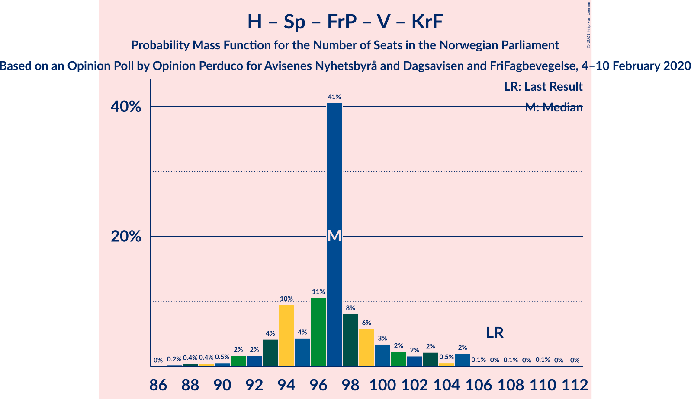
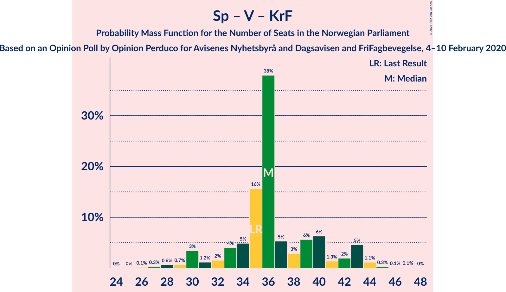

# Opinion Poll by Opinion Perduco for Avisenes Nyhetsbyrå and Dagsavisen and FriFagbevegelse, 4–10 February 2020

<a href="#voting-intentions">Voting Intentions</a> | <a href="#seats">Seats</a> | <a href="#coalitions">Coalitions</a> | <a href="#technical-information">Technical Information</a>

## Voting Intentions

### Confidence Intervals

| Party | Last Result | Poll Result | 80% Confidence Interval | 90% Confidence Interval | 95% Confidence Interval | 99% Confidence Interval |
|:-----:|:-----------:|:-----------:|:-----------------------:|:-----------------------:|:-----------------------:|:-----------------------:|
| Arbeiderpartiet | 27.4% | 25.1% | 23.4–26.9% |22.9–27.5% |22.5–27.9% |21.6–28.8% |
| Høyre | 25.0% | 19.4% | 17.8–21.1% |17.4–21.6% |17.0–22.0% |16.3–22.9% |
| Senterpartiet | 10.3% | 15.2% | 13.8–16.7% |13.4–17.2% |13.0–17.6% |12.4–18.4% |
| Fremskrittspartiet | 15.2% | 15.1% | 13.7–16.6% |13.3–17.1% |12.9–17.5% |12.3–18.2% |
| Sosialistisk Venstreparti | 6.0% | 6.5% | 5.6–7.6% |5.3–8.0% |5.1–8.2% |4.7–8.8% |
| Rødt | 2.4% | 5.3% | 4.5–6.3% |4.2–6.6% |4.0–6.9% |3.7–7.4% |
| Miljøpartiet De Grønne | 3.2% | 4.6% | 3.9–5.6% |3.7–5.9% |3.5–6.2% |3.2–6.7% |
| Venstre | 4.4% | 4.2% | 3.5–5.2% |3.3–5.5% |3.1–5.7% |2.8–6.2% |
| Kristelig Folkeparti | 4.2% | 3.5% | 2.9–4.4% |2.7–4.6% |2.5–4.9% |2.2–5.3% |

*Note:* The poll result column reflects the actual value used in the calculations. Published results may vary slightly, and in addition be rounded to fewer digits.

## Seats

### Confidence Intervals

| Party | Last Result | Median | 80% Confidence Interval | 90% Confidence Interval | 95% Confidence Interval | 99% Confidence Interval |
|:-----:|:-----------:|:------:|:-----------------------:|:-----------------------:|:-----------------------:|:-----------------------:|
| <a href="#arbeiderpartiet">Arbeiderpartiet</a> | 49 | 45 | 42–49 |42–49 |42–49 |41–52 |
| <a href="#høyre">Høyre</a> | 45 | 34 | 32–37 |31–37 |30–38 |28–41 |
| <a href="#senterpartiet">Senterpartiet</a> | 19 | 28 | 24–30 |24–30 |23–31 |22–32 |
| <a href="#fremskrittspartiet">Fremskrittspartiet</a> | 27 | 26 | 25–29 |23–29 |23–31 |22–31 |
| <a href="#sosialistisk-venstreparti">Sosialistisk Venstreparti</a> | 11 | 12 | 9–13 |9–13 |8–13 |8–16 |
| <a href="#rødt">Rødt</a> | 1 | 9 | 8–11 |7–11 |7–12 |2–13 |
| <a href="#miljøpartiet-de-grønne">Miljøpartiet De Grønne</a> | 1 | 7 | 2–9 |2–10 |2–11 |1–11 |
| <a href="#venstre">Venstre</a> | 8 | 7 | 2–8 |2–9 |2–10 |2–10 |
| <a href="#kristelig-folkeparti">Kristelig Folkeparti</a> | 8 | 3 | 1–7 |1–7 |1–8 |1–8 |

### Arbeiderpartiet

*For a full overview of the results for this party, see the [Arbeiderpartiet](party-arbeiderpartiet.html) page.*

| Number of Seats | Probability | Accumulated | Special Marks |
|:---------------:|:-----------:|:-----------:|:-------------:|
| 38 | 0% | 100% |  |
| 39 | 0.2% | 99.9% |  |
| 40 | 0.2% | 99.7% |  |
| 41 | 1.1% | 99.5% |  |
| 42 | 13% | 98% |  |
| 43 | 18% | 85% |  |
| 44 | 16% | 67% |  |
| 45 | 11% | 51% | Median |
| 46 | 1.0% | 40% |  |
| 47 | 19% | 39% |  |
| 48 | 2% | 20% |  |
| 49 | 17% | 18% | Last Result |
| 50 | 0.9% | 1.5% |  |
| 51 | 0.1% | 0.6% |  |
| 52 | 0.1% | 0.5% |  |
| 53 | 0.1% | 0.4% |  |
| 54 | 0.2% | 0.3% |  |
| 55 | 0.1% | 0.1% |  |
| 56 | 0% | 0% |  |

### Høyre

*For a full overview of the results for this party, see the [Høyre](party-høyre.html) page.*

| Number of Seats | Probability | Accumulated | Special Marks |
|:---------------:|:-----------:|:-----------:|:-------------:|
| 27 | 0.1% | 100% |  |
| 28 | 0.6% | 99.8% |  |
| 29 | 0.4% | 99.2% |  |
| 30 | 2% | 98.8% |  |
| 31 | 2% | 96% |  |
| 32 | 26% | 95% |  |
| 33 | 9% | 68% |  |
| 34 | 15% | 59% | Median |
| 35 | 12% | 44% |  |
| 36 | 19% | 32% |  |
| 37 | 10% | 13% |  |
| 38 | 0.7% | 3% |  |
| 39 | 1.5% | 2% |  |
| 40 | 0.1% | 0.7% |  |
| 41 | 0.6% | 0.6% |  |
| 42 | 0% | 0% |  |
| 43 | 0% | 0% |  |
| 44 | 0% | 0% |  |
| 45 | 0% | 0% | Last Result |

### Senterpartiet

*For a full overview of the results for this party, see the [Senterpartiet](party-senterpartiet.html) page.*

| Number of Seats | Probability | Accumulated | Special Marks |
|:---------------:|:-----------:|:-----------:|:-------------:|
| 19 | 0% | 100% | Last Result |
| 20 | 0% | 100% |  |
| 21 | 0.2% | 100% |  |
| 22 | 2% | 99.8% |  |
| 23 | 2% | 98% |  |
| 24 | 10% | 96% |  |
| 25 | 9% | 87% |  |
| 26 | 6% | 77% |  |
| 27 | 3% | 71% |  |
| 28 | 28% | 68% | Median |
| 29 | 13% | 40% |  |
| 30 | 24% | 27% |  |
| 31 | 2% | 3% |  |
| 32 | 0.6% | 0.9% |  |
| 33 | 0.1% | 0.3% |  |
| 34 | 0.1% | 0.2% |  |
| 35 | 0.1% | 0.1% |  |
| 36 | 0% | 0% |  |

### Fremskrittspartiet

*For a full overview of the results for this party, see the [Fremskrittspartiet](party-fremskrittspartiet.html) page.*

| Number of Seats | Probability | Accumulated | Special Marks |
|:---------------:|:-----------:|:-----------:|:-------------:|
| 19 | 0.1% | 100% |  |
| 20 | 0% | 99.9% |  |
| 21 | 0.2% | 99.9% |  |
| 22 | 1.2% | 99.6% |  |
| 23 | 5% | 98% |  |
| 24 | 1.5% | 94% |  |
| 25 | 5% | 92% |  |
| 26 | 38% | 87% | Median |
| 27 | 31% | 49% | Last Result |
| 28 | 7% | 18% |  |
| 29 | 6% | 10% |  |
| 30 | 2% | 5% |  |
| 31 | 3% | 3% |  |
| 32 | 0.3% | 0.5% |  |
| 33 | 0.1% | 0.2% |  |
| 34 | 0.1% | 0.1% |  |
| 35 | 0% | 0% |  |

### Sosialistisk Venstreparti

*For a full overview of the results for this party, see the [Sosialistisk Venstreparti](party-sosialistiskvenstreparti.html) page.*

| Number of Seats | Probability | Accumulated | Special Marks |
|:---------------:|:-----------:|:-----------:|:-------------:|
| 7 | 0.1% | 100% |  |
| 8 | 3% | 99.9% |  |
| 9 | 9% | 97% |  |
| 10 | 15% | 88% |  |
| 11 | 14% | 73% | Last Result |
| 12 | 42% | 59% | Median |
| 13 | 14% | 17% |  |
| 14 | 0.8% | 2% |  |
| 15 | 1.0% | 2% |  |
| 16 | 0.5% | 0.6% |  |
| 17 | 0% | 0% |  |

### Rødt

*For a full overview of the results for this party, see the [Rødt](party-rødt.html) page.*

| Number of Seats | Probability | Accumulated | Special Marks |
|:---------------:|:-----------:|:-----------:|:-------------:|
| 1 | 0% | 100% | Last Result |
| 2 | 2% | 100% |  |
| 3 | 0% | 98% |  |
| 4 | 0% | 98% |  |
| 5 | 0% | 98% |  |
| 6 | 0.3% | 98% |  |
| 7 | 5% | 98% |  |
| 8 | 13% | 93% |  |
| 9 | 49% | 80% | Median |
| 10 | 12% | 31% |  |
| 11 | 15% | 19% |  |
| 12 | 3% | 4% |  |
| 13 | 0.5% | 0.6% |  |
| 14 | 0% | 0.1% |  |
| 15 | 0% | 0% |  |

### Miljøpartiet De Grønne

*For a full overview of the results for this party, see the [Miljøpartiet De Grønne](party-miljøpartietdegrønne.html) page.*

| Number of Seats | Probability | Accumulated | Special Marks |
|:---------------:|:-----------:|:-----------:|:-------------:|
| 1 | 2% | 100% | Last Result |
| 2 | 20% | 98% |  |
| 3 | 1.5% | 78% |  |
| 4 | 0% | 76% |  |
| 5 | 0% | 76% |  |
| 6 | 0.5% | 76% |  |
| 7 | 27% | 76% | Median |
| 8 | 34% | 49% |  |
| 9 | 7% | 15% |  |
| 10 | 5% | 9% |  |
| 11 | 3% | 3% |  |
| 12 | 0.4% | 0.5% |  |
| 13 | 0% | 0% |  |

### Venstre

*For a full overview of the results for this party, see the [Venstre](party-venstre.html) page.*

| Number of Seats | Probability | Accumulated | Special Marks |
|:---------------:|:-----------:|:-----------:|:-------------:|
| 1 | 0.4% | 100% |  |
| 2 | 43% | 99.6% |  |
| 3 | 0.1% | 56% |  |
| 4 | 0% | 56% |  |
| 5 | 0% | 56% |  |
| 6 | 2% | 56% |  |
| 7 | 24% | 54% | Median |
| 8 | 23% | 30% | Last Result |
| 9 | 3% | 7% |  |
| 10 | 3% | 4% |  |
| 11 | 0.2% | 0.2% |  |
| 12 | 0% | 0% |  |

### Kristelig Folkeparti

*For a full overview of the results for this party, see the [Kristelig Folkeparti](party-kristeligfolkeparti.html) page.*

| Number of Seats | Probability | Accumulated | Special Marks |
|:---------------:|:-----------:|:-----------:|:-------------:|
| 0 | 0.3% | 100% |  |
| 1 | 30% | 99.7% |  |
| 2 | 7% | 69% |  |
| 3 | 43% | 62% | Median |
| 4 | 0% | 19% |  |
| 5 | 0% | 19% |  |
| 6 | 3% | 19% |  |
| 7 | 12% | 16% |  |
| 8 | 4% | 4% | Last Result |
| 9 | 0.2% | 0.2% |  |
| 10 | 0% | 0% |  |

## Coalitions

### Confidence Intervals

| Coalition | Last Result | Median | Majority? | 80% Confidence Interval | 90% Confidence Interval | 95% Confidence Interval | 99% Confidence Interval |
|:---------:|:-----------:|:------:|:---------:|:-----------------------:|:-----------------------:|:-----------------------:|:-----------------------:|
| Arbeiderpartiet – Senterpartiet – Sosialistisk Venstreparti – Rødt – Miljøpartiet De Grønne | 81 | 102 | 100% | 95–103 | 92–103 | 90–106 | 90–107 |
| Høyre – Senterpartiet – Fremskrittspartiet – Venstre – Kristelig Folkeparti | 107 | 96 | 100% | 94–101 | 94–103 | 91–103 | 89–105 |
| Arbeiderpartiet – Senterpartiet – Sosialistisk Venstreparti – Rødt | 80 | 94 | 97% | 88–100 | 86–100 | 84–100 | 83–100 |
| Arbeiderpartiet – Senterpartiet – Sosialistisk Venstreparti – Miljøpartiet De Grønne – Kristelig Folkeparti | 88 | 95 | 99.2% | 90–96 | 89–98 | 88–99 | 84–102 |
| Arbeiderpartiet – Senterpartiet – Sosialistisk Venstreparti – Miljøpartiet De Grønne | 80 | 92 | 93% | 85–94 | 83–94 | 82–96 | 82–98 |
| Arbeiderpartiet – Senterpartiet – Sosialistisk Venstreparti | 79 | 84 | 48% | 80–91 | 78–91 | 77–91 | 75–91 |
| Arbeiderpartiet – Senterpartiet – Miljøpartiet De Grønne – Kristelig Folkeparti | 77 | 83 | 18% | 79–86 | 77–88 | 77–88 | 74–90 |
| Høyre – Fremskrittspartiet – Miljøpartiet De Grønne – Venstre – Kristelig Folkeparti | 89 | 75 | 3% | 69–81 | 69–83 | 69–85 | 69–86 |
| Arbeiderpartiet – Senterpartiet – Kristelig Folkeparti | 76 | 76 | 0.3% | 71–82 | 70–82 | 70–82 | 69–83 |
| Arbeiderpartiet – Senterpartiet | 68 | 74 | 0% | 68–79 | 67–79 | 66–79 | 66–79 |
| Høyre – Fremskrittspartiet – Venstre – Kristelig Folkeparti | 88 | 67 | 0% | 66–74 | 66–77 | 63–79 | 62–79 |
| Høyre – Fremskrittspartiet – Venstre | 80 | 65 | 0% | 63–70 | 61–72 | 61–72 | 59–74 |
| Høyre – Fremskrittspartiet | 72 | 61 | 0% | 58–64 | 56–64 | 56–66 | 53–67 |
| Arbeiderpartiet – Sosialistisk Venstreparti | 60 | 56 | 0% | 52–61 | 52–61 | 51–61 | 50–62 |
| Høyre – Venstre – Kristelig Folkeparti | 61 | 41 | 0% | 39–48 | 38–50 | 37–50 | 35–50 |
| Senterpartiet – Venstre – Kristelig Folkeparti | 35 | 36 | 0% | 30–40 | 30–42 | 29–43 | 27–44 |

### Arbeiderpartiet – Senterpartiet – Sosialistisk Venstreparti – Rødt – Miljøpartiet De Grønne

| Number of Seats | Probability | Accumulated | Special Marks |
|:---------------:|:-----------:|:-----------:|:-------------:|
| 81 | 0% | 100% | Last Result |
| 82 | 0% | 100% |  |
| 83 | 0% | 100% |  |
| 84 | 0% | 100% |  |
| 85 | 0% | 100% | Majority |
| 86 | 0% | 100% |  |
| 87 | 0% | 100% |  |
| 88 | 0% | 100% |  |
| 89 | 0.1% | 100% |  |
| 90 | 3% | 99.8% |  |
| 91 | 0.3% | 96% |  |
| 92 | 3% | 96% |  |
| 93 | 0.2% | 93% |  |
| 94 | 1.2% | 92% |  |
| 95 | 6% | 91% |  |
| 96 | 3% | 85% |  |
| 97 | 5% | 82% |  |
| 98 | 7% | 77% |  |
| 99 | 4% | 71% |  |
| 100 | 11% | 67% |  |
| 101 | 4% | 56% | Median |
| 102 | 18% | 51% |  |
| 103 | 29% | 34% |  |
| 104 | 1.3% | 4% |  |
| 105 | 0.3% | 3% |  |
| 106 | 1.4% | 3% |  |
| 107 | 0.9% | 1.2% |  |
| 108 | 0.3% | 0.4% |  |
| 109 | 0% | 0.1% |  |
| 110 | 0% | 0.1% |  |
| 111 | 0% | 0.1% |  |
| 112 | 0% | 0% |  |

### Høyre – Senterpartiet – Fremskrittspartiet – Venstre – Kristelig Folkeparti

| Number of Seats | Probability | Accumulated | Special Marks |
|:---------------:|:-----------:|:-----------:|:-------------:|
| 86 | 0% | 100% |  |
| 87 | 0.1% | 99.9% |  |
| 88 | 0.3% | 99.9% |  |
| 89 | 0.6% | 99.6% |  |
| 90 | 0.2% | 99.0% |  |
| 91 | 1.4% | 98.8% |  |
| 92 | 0.3% | 97% |  |
| 93 | 2% | 97% |  |
| 94 | 28% | 95% |  |
| 95 | 10% | 67% |  |
| 96 | 10% | 58% |  |
| 97 | 18% | 47% |  |
| 98 | 4% | 30% | Median |
| 99 | 7% | 26% |  |
| 100 | 5% | 19% |  |
| 101 | 6% | 14% |  |
| 102 | 1.2% | 9% |  |
| 103 | 6% | 8% |  |
| 104 | 0.7% | 2% |  |
| 105 | 1.0% | 1.1% |  |
| 106 | 0.1% | 0.1% |  |
| 107 | 0% | 0.1% | Last Result |
| 108 | 0% | 0% |  |

### Arbeiderpartiet – Senterpartiet – Sosialistisk Venstreparti – Rødt

| Number of Seats | Probability | Accumulated | Special Marks |
|:---------------:|:-----------:|:-----------:|:-------------:|
| 80 | 0% | 100% | Last Result |
| 81 | 0% | 100% |  |
| 82 | 0.1% | 100% |  |
| 83 | 0.9% | 99.9% |  |
| 84 | 2% | 98.9% |  |
| 85 | 0.3% | 97% | Majority |
| 86 | 2% | 96% |  |
| 87 | 2% | 95% |  |
| 88 | 8% | 93% |  |
| 89 | 7% | 85% |  |
| 90 | 5% | 77% |  |
| 91 | 2% | 72% |  |
| 92 | 13% | 70% |  |
| 93 | 4% | 57% |  |
| 94 | 4% | 53% | Median |
| 95 | 11% | 49% |  |
| 96 | 19% | 37% |  |
| 97 | 1.4% | 19% |  |
| 98 | 1.1% | 17% |  |
| 99 | 1.3% | 16% |  |
| 100 | 15% | 15% |  |
| 101 | 0.1% | 0.2% |  |
| 102 | 0.1% | 0.1% |  |
| 103 | 0% | 0% |  |

### Arbeiderpartiet – Senterpartiet – Sosialistisk Venstreparti – Miljøpartiet De Grønne – Kristelig Folkeparti

| Number of Seats | Probability | Accumulated | Special Marks |
|:---------------:|:-----------:|:-----------:|:-------------:|
| 82 | 0.1% | 100% |  |
| 83 | 0% | 99.9% |  |
| 84 | 0.7% | 99.9% |  |
| 85 | 0.1% | 99.2% | Majority |
| 86 | 0.5% | 99.1% |  |
| 87 | 0.2% | 98.6% |  |
| 88 | 3% | 98% | Last Result |
| 89 | 4% | 96% |  |
| 90 | 8% | 92% |  |
| 91 | 1.4% | 84% |  |
| 92 | 15% | 82% |  |
| 93 | 4% | 68% |  |
| 94 | 10% | 64% |  |
| 95 | 19% | 54% | Median |
| 96 | 26% | 34% |  |
| 97 | 2% | 9% |  |
| 98 | 2% | 7% |  |
| 99 | 3% | 5% |  |
| 100 | 0.3% | 2% |  |
| 101 | 1.0% | 2% |  |
| 102 | 0.4% | 0.7% |  |
| 103 | 0% | 0.4% |  |
| 104 | 0.1% | 0.3% |  |
| 105 | 0% | 0.2% |  |
| 106 | 0.2% | 0.2% |  |
| 107 | 0% | 0% |  |

### Arbeiderpartiet – Senterpartiet – Sosialistisk Venstreparti – Miljøpartiet De Grønne

| Number of Seats | Probability | Accumulated | Special Marks |
|:---------------:|:-----------:|:-----------:|:-------------:|
| 79 | 0.1% | 100% |  |
| 80 | 0% | 99.9% | Last Result |
| 81 | 0.1% | 99.9% |  |
| 82 | 4% | 99.8% |  |
| 83 | 3% | 96% |  |
| 84 | 0.2% | 93% |  |
| 85 | 3% | 93% | Majority |
| 86 | 0.9% | 89% |  |
| 87 | 2% | 89% |  |
| 88 | 5% | 87% |  |
| 89 | 19% | 82% |  |
| 90 | 4% | 62% |  |
| 91 | 5% | 58% |  |
| 92 | 7% | 54% | Median |
| 93 | 22% | 47% |  |
| 94 | 20% | 25% |  |
| 95 | 2% | 5% |  |
| 96 | 0.4% | 3% |  |
| 97 | 0.3% | 2% |  |
| 98 | 2% | 2% |  |
| 99 | 0.2% | 0.3% |  |
| 100 | 0% | 0.1% |  |
| 101 | 0% | 0.1% |  |
| 102 | 0% | 0% |  |

### Arbeiderpartiet – Senterpartiet – Sosialistisk Venstreparti

| Number of Seats | Probability | Accumulated | Special Marks |
|:---------------:|:-----------:|:-----------:|:-------------:|
| 74 | 0.1% | 100% |  |
| 75 | 2% | 99.9% |  |
| 76 | 0.2% | 98% |  |
| 77 | 0.7% | 98% |  |
| 78 | 3% | 97% |  |
| 79 | 4% | 94% | Last Result |
| 80 | 8% | 90% |  |
| 81 | 17% | 82% |  |
| 82 | 6% | 65% |  |
| 83 | 5% | 59% |  |
| 84 | 7% | 55% |  |
| 85 | 9% | 48% | Median, Majority |
| 86 | 1.0% | 38% |  |
| 87 | 18% | 37% |  |
| 88 | 0.9% | 19% |  |
| 89 | 3% | 18% |  |
| 90 | 0.2% | 15% |  |
| 91 | 15% | 15% |  |
| 92 | 0.1% | 0.2% |  |
| 93 | 0% | 0.1% |  |
| 94 | 0% | 0% |  |

### Arbeiderpartiet – Senterpartiet – Miljøpartiet De Grønne – Kristelig Folkeparti

| Number of Seats | Probability | Accumulated | Special Marks |
|:---------------:|:-----------:|:-----------:|:-------------:|
| 70 | 0% | 100% |  |
| 71 | 0% | 99.9% |  |
| 72 | 0% | 99.9% |  |
| 73 | 0.1% | 99.9% |  |
| 74 | 1.0% | 99.8% |  |
| 75 | 0.2% | 98.8% |  |
| 76 | 0.6% | 98.6% |  |
| 77 | 7% | 98% | Last Result |
| 78 | 0.7% | 91% |  |
| 79 | 10% | 90% |  |
| 80 | 1.3% | 81% |  |
| 81 | 8% | 79% |  |
| 82 | 7% | 71% |  |
| 83 | 24% | 64% | Median |
| 84 | 22% | 40% |  |
| 85 | 7% | 18% | Majority |
| 86 | 3% | 11% |  |
| 87 | 1.3% | 7% |  |
| 88 | 5% | 6% |  |
| 89 | 0.2% | 0.9% |  |
| 90 | 0.3% | 0.7% |  |
| 91 | 0.1% | 0.5% |  |
| 92 | 0.1% | 0.4% |  |
| 93 | 0.1% | 0.3% |  |
| 94 | 0.1% | 0.2% |  |
| 95 | 0% | 0.1% |  |
| 96 | 0.1% | 0.1% |  |
| 97 | 0% | 0% |  |

### Høyre – Fremskrittspartiet – Miljøpartiet De Grønne – Venstre – Kristelig Folkeparti

| Number of Seats | Probability | Accumulated | Special Marks |
|:---------------:|:-----------:|:-----------:|:-------------:|
| 67 | 0.1% | 100% |  |
| 68 | 0.1% | 99.9% |  |
| 69 | 15% | 99.8% |  |
| 70 | 1.3% | 85% |  |
| 71 | 1.1% | 84% |  |
| 72 | 1.4% | 83% |  |
| 73 | 19% | 81% |  |
| 74 | 11% | 63% |  |
| 75 | 4% | 51% |  |
| 76 | 4% | 47% |  |
| 77 | 13% | 43% | Median |
| 78 | 2% | 30% |  |
| 79 | 5% | 28% |  |
| 80 | 7% | 23% |  |
| 81 | 8% | 15% |  |
| 82 | 2% | 7% |  |
| 83 | 2% | 5% |  |
| 84 | 0.3% | 4% |  |
| 85 | 2% | 3% | Majority |
| 86 | 0.9% | 1.1% |  |
| 87 | 0.1% | 0.1% |  |
| 88 | 0% | 0% |  |
| 89 | 0% | 0% | Last Result |

### Arbeiderpartiet – Senterpartiet – Kristelig Folkeparti

| Number of Seats | Probability | Accumulated | Special Marks |
|:---------------:|:-----------:|:-----------:|:-------------:|
| 66 | 0.1% | 100% |  |
| 67 | 0.1% | 99.9% |  |
| 68 | 0.3% | 99.8% |  |
| 69 | 1.4% | 99.5% |  |
| 70 | 4% | 98% |  |
| 71 | 9% | 95% |  |
| 72 | 3% | 86% |  |
| 73 | 7% | 83% |  |
| 74 | 7% | 76% |  |
| 75 | 5% | 69% |  |
| 76 | 27% | 63% | Last Result, Median |
| 77 | 10% | 36% |  |
| 78 | 5% | 26% |  |
| 79 | 3% | 21% |  |
| 80 | 2% | 18% |  |
| 81 | 0.4% | 16% |  |
| 82 | 15% | 15% |  |
| 83 | 0.2% | 0.6% |  |
| 84 | 0.1% | 0.4% |  |
| 85 | 0.1% | 0.3% | Majority |
| 86 | 0.1% | 0.3% |  |
| 87 | 0% | 0.2% |  |
| 88 | 0.1% | 0.1% |  |
| 89 | 0% | 0% |  |

### Arbeiderpartiet – Senterpartiet

| Number of Seats | Probability | Accumulated | Special Marks |
|:---------------:|:-----------:|:-----------:|:-------------:|
| 64 | 0.1% | 100% |  |
| 65 | 0.1% | 99.9% |  |
| 66 | 2% | 99.8% |  |
| 67 | 4% | 97% |  |
| 68 | 14% | 93% | Last Result |
| 69 | 6% | 79% |  |
| 70 | 3% | 73% |  |
| 71 | 8% | 71% |  |
| 72 | 7% | 63% |  |
| 73 | 3% | 55% | Median |
| 74 | 12% | 52% |  |
| 75 | 21% | 40% |  |
| 76 | 0.9% | 19% |  |
| 77 | 1.0% | 18% |  |
| 78 | 2% | 17% |  |
| 79 | 14% | 15% |  |
| 80 | 0.1% | 0.3% |  |
| 81 | 0.2% | 0.2% |  |
| 82 | 0% | 0% |  |

### Høyre – Fremskrittspartiet – Venstre – Kristelig Folkeparti

| Number of Seats | Probability | Accumulated | Special Marks |
|:---------------:|:-----------:|:-----------:|:-------------:|
| 58 | 0% | 100% |  |
| 59 | 0% | 99.9% |  |
| 60 | 0% | 99.9% |  |
| 61 | 0.3% | 99.9% |  |
| 62 | 0.9% | 99.6% |  |
| 63 | 1.4% | 98.8% |  |
| 64 | 0.3% | 97% |  |
| 65 | 1.3% | 97% |  |
| 66 | 29% | 96% |  |
| 67 | 18% | 66% |  |
| 68 | 4% | 49% |  |
| 69 | 11% | 44% |  |
| 70 | 4% | 33% | Median |
| 71 | 7% | 29% |  |
| 72 | 5% | 23% |  |
| 73 | 3% | 18% |  |
| 74 | 6% | 15% |  |
| 75 | 1.2% | 9% |  |
| 76 | 0.2% | 8% |  |
| 77 | 3% | 7% |  |
| 78 | 0.3% | 4% |  |
| 79 | 3% | 4% |  |
| 80 | 0.1% | 0.2% |  |
| 81 | 0% | 0% |  |
| 82 | 0% | 0% |  |
| 83 | 0% | 0% |  |
| 84 | 0% | 0% |  |
| 85 | 0% | 0% | Majority |
| 86 | 0% | 0% |  |
| 87 | 0% | 0% |  |
| 88 | 0% | 0% | Last Result |

### Høyre – Fremskrittspartiet – Venstre

| Number of Seats | Probability | Accumulated | Special Marks |
|:---------------:|:-----------:|:-----------:|:-------------:|
| 54 | 0.1% | 100% |  |
| 55 | 0% | 99.8% |  |
| 56 | 0% | 99.8% |  |
| 57 | 0.1% | 99.8% |  |
| 58 | 0.1% | 99.7% |  |
| 59 | 0.7% | 99.6% |  |
| 60 | 0.8% | 98.9% |  |
| 61 | 3% | 98% |  |
| 62 | 3% | 95% |  |
| 63 | 9% | 92% |  |
| 64 | 22% | 84% |  |
| 65 | 19% | 62% |  |
| 66 | 11% | 43% |  |
| 67 | 4% | 32% | Median |
| 68 | 6% | 28% |  |
| 69 | 5% | 22% |  |
| 70 | 8% | 17% |  |
| 71 | 4% | 9% |  |
| 72 | 4% | 6% |  |
| 73 | 0.1% | 2% |  |
| 74 | 1.2% | 1.4% |  |
| 75 | 0.1% | 0.2% |  |
| 76 | 0.1% | 0.2% |  |
| 77 | 0% | 0.1% |  |
| 78 | 0% | 0% |  |
| 79 | 0% | 0% |  |
| 80 | 0% | 0% | Last Result |

### Høyre – Fremskrittspartiet

| Number of Seats | Probability | Accumulated | Special Marks |
|:---------------:|:-----------:|:-----------:|:-------------:|
| 51 | 0% | 100% |  |
| 52 | 0.2% | 99.9% |  |
| 53 | 0.3% | 99.8% |  |
| 54 | 0.2% | 99.5% |  |
| 55 | 1.3% | 99.3% |  |
| 56 | 6% | 98% |  |
| 57 | 2% | 92% |  |
| 58 | 20% | 90% |  |
| 59 | 7% | 71% |  |
| 60 | 4% | 64% | Median |
| 61 | 14% | 60% |  |
| 62 | 26% | 46% |  |
| 63 | 2% | 20% |  |
| 64 | 14% | 18% |  |
| 65 | 1.4% | 4% |  |
| 66 | 0.7% | 3% |  |
| 67 | 2% | 2% |  |
| 68 | 0.1% | 0.5% |  |
| 69 | 0.2% | 0.3% |  |
| 70 | 0.1% | 0.1% |  |
| 71 | 0% | 0% |  |
| 72 | 0% | 0% | Last Result |

### Arbeiderpartiet – Sosialistisk Venstreparti

| Number of Seats | Probability | Accumulated | Special Marks |
|:---------------:|:-----------:|:-----------:|:-------------:|
| 48 | 0% | 100% |  |
| 49 | 0.1% | 99.9% |  |
| 50 | 2% | 99.8% |  |
| 51 | 3% | 98% |  |
| 52 | 7% | 95% |  |
| 53 | 6% | 88% |  |
| 54 | 12% | 82% |  |
| 55 | 6% | 70% |  |
| 56 | 21% | 64% |  |
| 57 | 3% | 44% | Median |
| 58 | 2% | 40% |  |
| 59 | 20% | 39% |  |
| 60 | 2% | 19% | Last Result |
| 61 | 16% | 17% |  |
| 62 | 1.1% | 2% |  |
| 63 | 0% | 0.5% |  |
| 64 | 0.3% | 0.5% |  |
| 65 | 0.1% | 0.2% |  |
| 66 | 0.1% | 0.1% |  |
| 67 | 0% | 0% |  |

### Høyre – Venstre – Kristelig Folkeparti

| Number of Seats | Probability | Accumulated | Special Marks |
|:---------------:|:-----------:|:-----------:|:-------------:|
| 33 | 0.1% | 100% |  |
| 34 | 0.1% | 99.8% |  |
| 35 | 1.3% | 99.7% |  |
| 36 | 0.8% | 98% |  |
| 37 | 0.7% | 98% |  |
| 38 | 2% | 97% |  |
| 39 | 7% | 95% |  |
| 40 | 19% | 88% |  |
| 41 | 20% | 69% |  |
| 42 | 10% | 49% |  |
| 43 | 11% | 39% |  |
| 44 | 6% | 28% | Median |
| 45 | 3% | 22% |  |
| 46 | 4% | 19% |  |
| 47 | 4% | 15% |  |
| 48 | 4% | 11% |  |
| 49 | 0.5% | 7% |  |
| 50 | 6% | 7% |  |
| 51 | 0.1% | 0.5% |  |
| 52 | 0.1% | 0.3% |  |
| 53 | 0.2% | 0.3% |  |
| 54 | 0% | 0% |  |
| 55 | 0% | 0% |  |
| 56 | 0% | 0% |  |
| 57 | 0% | 0% |  |
| 58 | 0% | 0% |  |
| 59 | 0% | 0% |  |
| 60 | 0% | 0% |  |
| 61 | 0% | 0% | Last Result |

### Senterpartiet – Venstre – Kristelig Folkeparti

| Number of Seats | Probability | Accumulated | Special Marks |
|:---------------:|:-----------:|:-----------:|:-------------:|
| 26 | 0.4% | 100% |  |
| 27 | 0.6% | 99.6% |  |
| 28 | 0.2% | 99.0% |  |
| 29 | 1.3% | 98.8% |  |
| 30 | 8% | 97% |  |
| 31 | 0.5% | 90% |  |
| 32 | 0.9% | 89% |  |
| 33 | 5% | 88% |  |
| 34 | 7% | 83% |  |
| 35 | 22% | 76% | Last Result |
| 36 | 19% | 54% |  |
| 37 | 8% | 35% |  |
| 38 | 3% | 27% | Median |
| 39 | 6% | 24% |  |
| 40 | 11% | 18% |  |
| 41 | 2% | 8% |  |
| 42 | 2% | 6% |  |
| 43 | 2% | 3% |  |
| 44 | 0.8% | 1.3% |  |
| 45 | 0.2% | 0.4% |  |
| 46 | 0.1% | 0.2% |  |
| 47 | 0.1% | 0.1% |  |
| 48 | 0% | 0% |  |

## Technical Information

### Opinion Poll

+ **Polling firm:** Opinion Perduco
+ **Commissioner(s):** Avisenes Nyhetsbyrå and Dagsavisen and FriFagbevegelse
+ **Fieldwork period:** 4–10 February 2020

### Calculations

+ **Sample size:** 969
+ **Simulations done:** 131,072
+ **Error estimate:** 1.87%

